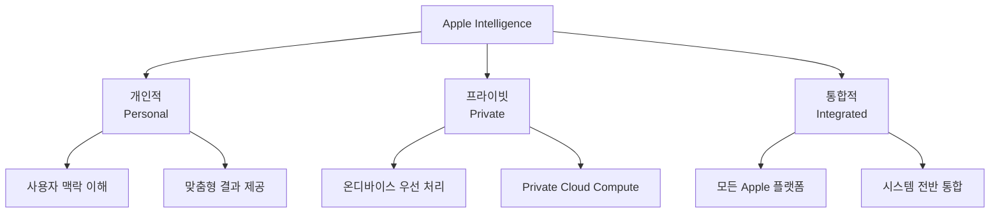
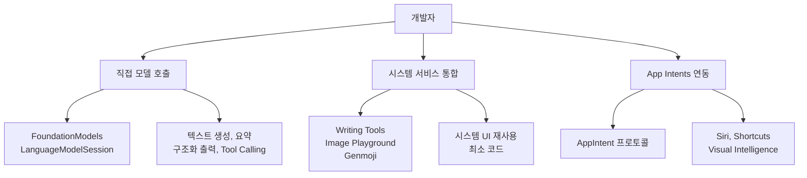
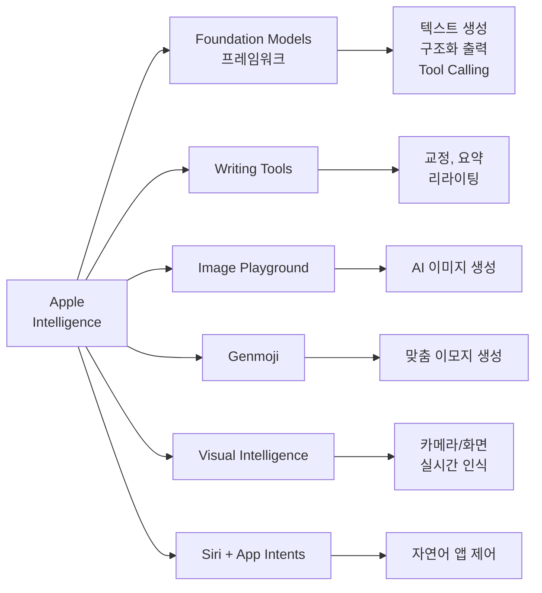
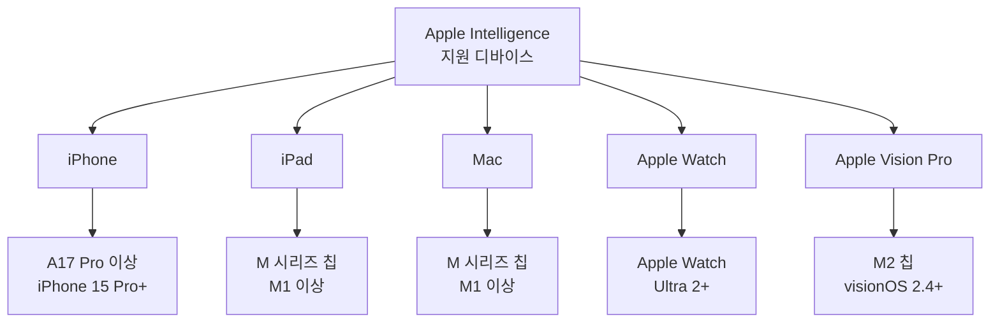
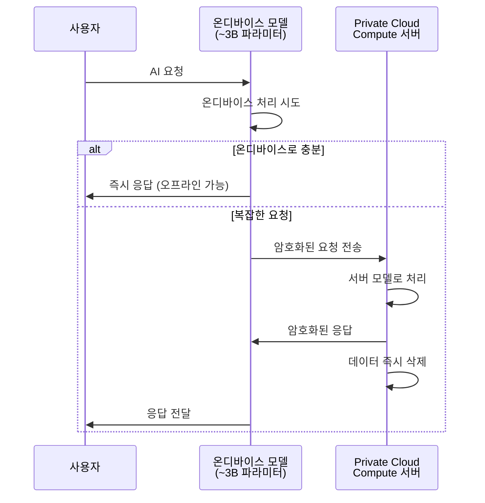

# Apple Intelligence 개요

> Apple이 그리는 AI의 미래 — 프라이버시를 지키면서 일상에 녹아드는 개인 지능 시스템

## 개요

이 섹션에서는 Apple Intelligence가 무엇이고, 어떤 기능들로 구성되어 있으며, 왜 개발자에게 중요한지를 살펴봅니다. Apple이 AI를 바라보는 독특한 관점과 그 철학적 배경을 이해하면, 이후 Foundation Models 프레임워크를 학습할 때 "왜 이렇게 설계했는지"가 자연스럽게 와닿을 거예요.

**선수 지식**: Swift 기본 문법, iOS/macOS 앱 개발 경험
**학습 목표**:
- Apple Intelligence의 핵심 비전과 구성 요소를 설명할 수 있다
- Writing Tools, Image Playground, Genmoji, Visual Intelligence 등 주요 기능의 역할을 파악한다
- 지원 디바이스와 시스템 요구사항을 이해한다
- 온디바이스 AI와 Private Cloud Compute의 역할 분담을 개괄적으로 이해한다

## 왜 알아야 할까?

2025년 WWDC에서 Apple은 "Foundation Models 프레임워크"를 공개하면서 개발자에게 온디바이스 AI 모델을 직접 활용할 수 있는 길을 열었습니다. 이전까지 Apple의 AI 기능은 시스템 서비스로만 제공되었는데요, 이제는 **여러분의 앱 안에서 직접 LLM을 호출**할 수 있게 된 겁니다.

하지만 Foundation Models 프레임워크에 바로 뛰어들기 전에, Apple Intelligence라는 큰 그림을 먼저 이해해야 합니다. 왜냐고요? 여러분이 만드는 AI 기능이 Apple 생태계의 어디에 위치하는지, 어떤 시스템 서비스와 협력할 수 있는지 알아야 **적절한 도구를 적절한 곳에** 쓸 수 있거든요.

ChatGPT나 Claude 같은 클라우드 기반 AI 서비스가 대세인 시대에, Apple은 왜 굳이 "온디바이스"를 고집할까요? 그 답은 프라이버시에 있습니다. 그리고 이 철학이 바로 여러분이 앱을 설계할 때 고려해야 할 가장 중요한 맥락이에요.

## 핵심 개념

### Apple Intelligence란?

> 💡 **비유**: Apple Intelligence를 **개인 비서**라고 생각해보세요. 이 비서는 여러분의 집(기기) 안에 살면서 일합니다. 여러분의 일기를 읽고 메모를 정리하고 사진을 분류하지만, 절대로 그 내용을 바깥에 알리지 않습니다. 가끔 정말 어려운 일이 생기면 특별한 보안 시설(Private Cloud Compute)에 가서 도움을 받지만, 거기서도 여러분의 정보는 처리 즉시 삭제됩니다.

Apple Intelligence는 2024년 WWDC에서 처음 발표되고, 2025년 WWDC25에서 대폭 확장된 **Apple의 개인 지능 시스템**입니다. 핵심은 세 가지예요:

1. **개인적(Personal)**: 사용자의 맥락(이메일, 메시지, 캘린더 등)을 이해하여 맞춤형 결과를 제공
2. **프라이빗(Private)**: 온디바이스 처리 우선, 서버 처리 시에도 데이터 보호
3. **통합적(Integrated)**: iOS, macOS, iPadOS, watchOS, visionOS 전반에 걸쳐 자연스럽게 동작

> 📊 **그림 1**: Apple Intelligence의 3대 핵심 원칙



개발자 관점에서 중요한 점은, Apple Intelligence가 단일 기능이 아니라 **여러 AI 서비스의 통합 브랜드**라는 것입니다. 각 서비스는 독립적인 프레임워크로 제공되며, 여러분은 필요한 것만 골라서 앱에 통합할 수 있습니다.

개발자가 Apple Intelligence에 접근하는 경로는 크게 세 가지로 나뉩니다:

1. **직접 모델 호출** — `FoundationModels` 프레임워크를 통해 온디바이스 LLM에 직접 프롬프트를 보내고 텍스트 생성, 구조화 출력, Tool Calling 등을 수행합니다. 가장 유연한 방식이지만 프롬프트 설계와 출력 파싱을 직접 해야 합니다.
2. **시스템 서비스 통합** — Writing Tools, Image Playground, Genmoji 등은 별도의 모델 호출 없이 시스템이 제공하는 UI와 기능을 그대로 사용합니다. `WritingToolsCoordinator`, `ImagePlaygroundSheet` 같은 API로 몇 줄만에 통합할 수 있어요.
3. **App Intents 연동** — 여러분의 앱 기능을 `AppIntent` 프로토콜로 정의하면, Siri와 Visual Intelligence가 자연어로 여러분의 앱을 제어할 수 있게 됩니다. 사용자가 "OO 앱에서 XX 해줘"라고 말하면 시스템이 알아서 여러분의 코드를 호출하는 거죠.

> 📊 **그림 2**: 개발자의 Apple Intelligence 접근 경로



이 세 가지 접근 경로를 상황에 맞게 조합하는 것이 Apple Intelligence 통합의 핵심입니다. 이 코스에서는 주로 첫 번째(Foundation Models 직접 호출)를 깊이 다루되, 나머지 두 경로와의 협력 지점도 함께 살펴볼 예정이에요.

### 핵심 기능 6가지

Apple Intelligence는 크게 6가지 핵심 기능 영역으로 나뉩니다. 각각이 어떤 역할을 하고, 개발자에게 어떤 API를 제공하는지 살펴볼까요?

> 📊 **그림 3**: Apple Intelligence 핵심 기능 구성



#### 1. Foundation Models 프레임워크

이 코스의 주인공입니다. Apple이 자체 개발한 ~3B 파라미터 온디바이스 언어 모델에 직접 접근할 수 있는 Swift 프레임워크예요. 텍스트 생성, 요약, 구조화 출력(Guided Generation), Tool Calling 등을 지원합니다.

```swift
import FoundationModels

// 놀랍게도, 단 3줄이면 온디바이스 LLM을 호출할 수 있습니다
let session = LanguageModelSession()
let response = try await session.respond(to: "Swift의 장점을 한 줄로 요약해줘")
print(response.content)
```

#### 2. Writing Tools

시스템 전체에서 사용할 수 있는 텍스트 교정·요약·리라이팅 도구입니다. 표준 텍스트 뷰(`UITextView`, `NSTextView`)를 사용하면 **자동으로 통합**되는 것이 특징이에요. 커스텀 에디터에서도 API를 통해 통합할 수 있습니다.

#### 3. Image Playground

AI 기반 이미지 생성 시스템입니다. 텍스트 설명으로부터 이미지를 생성하거나, 사진 라이브러리의 이미지를 기반으로 변형할 수 있어요. `ImagePlaygroundSheet`로 시스템 UI를 그대로 사용하거나, `ImageCreator` API로 프로그래매틱하게 생성할 수도 있습니다.

#### 4. Genmoji

사용자가 텍스트 설명으로 맞춤형 이모지를 만드는 기능입니다. 기존 이모지를 믹스하거나, 사진 속 인물을 기반으로 생성할 수도 있어요. 표준 텍스트 컨트롤을 사용하면 자동으로 스티커로 지원됩니다.

#### 5. Visual Intelligence

카메라와 화면을 통한 실시간 객체·텍스트 인식 기능입니다. WWDC25에서는 스크린샷 버튼을 통한 화면 내용 탐색 기능이 추가되었어요. App Intents와 연동하면 여러분의 앱 콘텐츠에서도 시각적 검색이 가능해집니다.

#### 6. Siri + App Intents

Apple Intelligence로 강화된 Siri는 자연어 이해 능력이 크게 향상되었습니다. App Intents 프레임워크를 통해 여러분의 앱 기능을 Siri, Shortcuts, Spotlight에 노출할 수 있어요. 이것이 바로 Apple Intelligence 통합의 핵심 관문입니다.

### 지원 디바이스와 요구사항

Apple Intelligence는 모든 Apple 기기에서 동작하는 것이 아닙니다. 온디바이스 AI 모델을 구동하려면 충분한 연산 능력이 필요하거든요.

> 📊 **그림 4**: Apple Intelligence 지원 디바이스 계층



| 플랫폼 | 최소 칩셋 | 최소 OS 버전 |
|--------|----------|-------------|
| iPhone | A17 Pro (iPhone 15 Pro) | iOS 18.1+ |
| iPad | M1 이상 | iPadOS 18.1+ |
| Mac | M1 이상 | macOS Sequoia 15.1+ |
| Apple Vision Pro | M2 | visionOS 2.4+ |
| Apple Watch | S9/Ultra 2 | watchOS 기반 |

> ⚠️ **흔한 오해**: "A17 칩이면 되는 거 아닌가요?" — 아닙니다! 일반 A17이 아니라 **A17 Pro** 칩이 필요합니다. iPhone 15(일반)은 지원하지 않고, iPhone 15 Pro/Pro Max부터 지원됩니다. Pro 칩에만 있는 Neural Engine의 성능 차이 때문이에요.

Foundation Models 프레임워크를 사용하는 앱을 개발하려면 **iOS 26 / macOS 26** 이상이 필요합니다. 이 코스에서는 Xcode 26 + iOS 26 SDK를 기준으로 진행합니다.

### 온디바이스 vs. 서버: 하이브리드 처리 모델

Apple Intelligence의 가장 독특한 점은 **하이브리드 처리 모델**입니다. 모든 요청을 클라우드로 보내는 ChatGPT와 달리, Apple은 가능한 한 기기에서 처리하고, 정말 필요할 때만 서버를 사용합니다.

> 💡 **비유**: 마치 **지역 도서관과 국립 중앙 도서관**의 관계와 같아요. 일상적인 책(간단한 요청)은 동네 도서관(온디바이스)에서 바로 빌려볼 수 있습니다. 하지만 희귀 자료(복잡한 요청)가 필요하면 국립 중앙 도서관(서버)에 요청하죠. 다만 Apple의 서버 도서관은 특별합니다 — 자료를 보여준 뒤 열람 기록을 즉시 삭제하거든요.

> 📊 **그림 5**: Apple Intelligence 하이브리드 처리 흐름



**온디바이스 모델** (~3B 파라미터):
- Apple Silicon의 Neural Engine에서 실행
- 인터넷 연결 없이 동작 (오프라인 가능)
- 낮은 지연시간 (수 밀리초 수준)
- 텍스트 생성, 요약, 구조화 출력 등 대부분의 작업 처리

**서버 모델** (Private Cloud Compute):
- 더 크고 강력한 PT-MoE(Parallel-Track Mixture of Experts) 아키텍처
- 복잡한 추론, 대규모 컨텍스트 처리
- 처리 후 데이터 즉시 삭제 — 서버에 사용자 데이터를 저장하지 않음
- 암호화된 통신으로 프라이버시 보장

개발자인 여러분이 Foundation Models 프레임워크를 사용할 때, 이 온디바이스/서버 전환은 **시스템이 자동으로 처리**합니다. 여러분은 어디서 실행되는지 신경 쓸 필요 없이 동일한 API를 호출하면 됩니다.

## 실습: 직접 해보기

아직 Foundation Models 프레임워크를 본격적으로 다루기 전이지만, Apple Intelligence의 존재를 코드로 확인해볼 수 있습니다. 모델이 사용 가능한지 확인하는 것은 모든 AI 앱의 첫걸음이에요.

```swift
import FoundationModels

// Apple Intelligence 모델 가용성 확인
struct AIAvailabilityChecker {
    
    /// 시스템에서 언어 모델을 사용할 수 있는지 확인
    func checkAvailability() async {
        // 모델의 현재 가용 상태를 확인
        let availability = SystemLanguageModel.default.availability
        
        switch availability {
        case .available:
            // 모델이 준비됨 — AI 기능을 활성화
            print("✅ Apple Intelligence 모델을 사용할 수 있습니다!")
            await demonstrateBasicGeneration()
            
        case .unavailable(.deviceNotSupported):
            // 하드웨어 미지원 (A17 Pro 미만 등)
            print("❌ 이 기기는 Apple Intelligence를 지원하지 않습니다.")
            
        case .unavailable(.modelNotReady):
            // 모델 다운로드 중이거나 아직 설치되지 않음
            print("⏳ 모델을 다운로드하고 있습니다. 잠시 후 다시 시도해주세요.")
            
        default:
            // 기타 사유로 사용 불가
            print("⚠️ 현재 Apple Intelligence를 사용할 수 없습니다.")
        }
    }
    
    /// 기본 텍스트 생성 데모
    private func demonstrateBasicGeneration() async {
        do {
            // 세션 생성 — Foundation Models의 진입점
            let session = LanguageModelSession()
            
            // 간단한 프롬프트로 응답 요청
            let response = try await session.respond(
                to: "Apple Intelligence의 핵심 가치를 한 문장으로 요약해줘"
            )
            
            // 응답 출력
            print("🤖 응답: \(response.content)")
        } catch {
            print("에러 발생: \(error.localizedDescription)")
        }
    }
}
```

```run:swift
// 가용성 상태별 사용자 안내 메시지 예시
let supportedDevices = [
    "iPhone 15 Pro", "iPhone 15 Pro Max",
    "iPhone 16 전 모델",
    "M1 이상 iPad", "M1 이상 Mac"
]

print("=== Apple Intelligence 지원 디바이스 ===")
for device in supportedDevices {
    print("• \(device)")
}
print("\n총 \(supportedDevices.count)개 디바이스 카테고리 지원")
```

```output
=== Apple Intelligence 지원 디바이스 ===
• iPhone 15 Pro
• iPhone 15 Pro Max
• iPhone 16 전 모델
• M1 이상 iPad
• M1 이상 Mac

총 5개 디바이스 카테고리 지원
```

> 🔥 **실무 팁**: 앱 시작 시 `SystemLanguageModel.default.availability`를 한 번 확인하고, AI 관련 UI를 조건부로 보여주세요. 미지원 기기 사용자에게 AI 버튼을 보여준 뒤 "이 기기에서는 사용할 수 없습니다"라고 말하는 것보다, 처음부터 대체 UI를 제공하는 것이 훨씬 좋은 UX입니다.

## 더 깊이 알아보기

### Apple AI의 탄생 — 10년의 준비

Apple Intelligence가 하루아침에 나온 것은 아닙니다. Apple의 AI 여정은 2011년 **Siri 인수**로 시작되었어요. 하지만 Apple은 다른 빅테크 기업들과 달리 "AI"라는 단어를 거의 사용하지 않았습니다. 팀 쿡은 한 인터뷰에서 "우리는 AI라고 부르지 않고, 그냥 더 나은 사용자 경험이라고 부릅니다"라고 말한 적이 있죠.

그 사이 Apple은 조용히 핵심 기술을 쌓아갔습니다:

- **2017**: Core ML 프레임워크 출시 — 온디바이스 ML의 기초
- **2018**: Create ML 출시 — 커스텀 모델 학습 도구
- **2020**: Apple Silicon(M1) 출시 — Neural Engine 대폭 강화
- **2023**: 내부적으로 대규모 언어 모델 개발 시작 (Ajax 프로젝트)
- **2024**: WWDC24에서 Apple Intelligence 최초 발표
- **2025**: WWDC25에서 Foundation Models 프레임워크 공개, 개발자에게 온디바이스 LLM 접근 개방

특히 2025년의 Foundation Models 프레임워크 공개는 Apple 역사상 처음으로 **자체 LLM을 서드파티 개발자에게 개방**한 사건입니다. Apple의 기술 보고서에 따르면, 온디바이스 모델은 약 30억(3B) 개의 파라미터로 구성되어 있고, 2-bit 양자화(QAT)를 통해 놀라울 정도로 작은 크기로 압축되었습니다.

### 프라이버시에 대한 집착 — 왜 온디바이스인가?

Apple이 온디바이스 AI를 고집하는 이유에 대해 재미있는 에피소드가 있습니다. 2016년 크레이그 페더리기(Craig Federighi)는 WWDC 키노트에서 "여러분의 데이터는 여러분의 것입니다"라고 선언했는데요, 이것은 단순한 마케팅이 아니라 **엔지니어링 설계 원칙**이 되었습니다.

Apple의 AI 팀은 모델 학습 시에도 이 원칙을 지킵니다. 공식 기술 보고서에는 이렇게 명시되어 있어요: *"사용자의 개인 데이터나 사용자 상호작용은 파운데이션 모델 학습에 사용하지 않습니다."* 학습 데이터는 Applebot 웹 크롤링으로 수집된 공개 데이터(약 수천억 페이지)를 사용하며, robots.txt 옵트아웃을 존중합니다.

## 흔한 오해와 팁

> ⚠️ **흔한 오해**: "Apple Intelligence는 ChatGPT 같은 범용 AI다" — 아닙니다. Apple Intelligence는 **특화된 시스템 서비스의 모음**이에요. Foundation Models 프레임워크로 텍스트 생성은 가능하지만, GPT-4o 수준의 범용 추론을 기대하면 안 됩니다. 온디바이스 모델은 ~3B 파라미터로, 특정 작업(요약, 구조화 출력, 분류 등)에 최적화되어 있습니다.

> 💡 **알고 계셨나요?**: Apple의 온디바이스 모델은 2-bit 양자화를 사용합니다. 일반적으로 2-bit까지 양자화하면 품질이 크게 떨어지는데, Apple은 **Quantization-Aware Training(QAT)**이라는 기법으로 학습 단계에서부터 양자화를 고려합니다. 덕분에 모델 크기를 극적으로 줄이면서도 품질 손실을 최소화할 수 있었어요. 비슷한 크기의 Qwen-2.5-3B와 비교해도 대등하거나 더 나은 성능을 보인다고 합니다.

> 🔥 **실무 팁**: Apple Intelligence 기능을 앱에 통합할 때, **"직접 구현 vs. 시스템 서비스 활용"**을 항상 먼저 판단하세요. 텍스트 교정이 필요하면 Foundation Models로 직접 구현하기보다 Writing Tools 통합이 더 낫고, 이미지 생성이 필요하면 Image Playground를 쓰는 것이 일관된 UX를 제공합니다. Foundation Models 프레임워크는 **시스템 서비스로 커버되지 않는 커스텀 AI 기능**에 사용하세요.

## 핵심 정리

| 개념 | 설명 |
|------|------|
| Apple Intelligence | Apple의 개인 지능 시스템. 프라이버시 중심, 온디바이스 우선 처리 |
| Foundation Models 프레임워크 | 온디바이스 ~3B LLM에 직접 접근하는 Swift 프레임워크 (iOS 26+) |
| Writing Tools | 시스템 전체 텍스트 교정/요약/리라이팅. 표준 텍스트 뷰에서 자동 지원 |
| Image Playground | AI 이미지 생성. Sheet UI 또는 ImageCreator API 제공 |
| Genmoji | 텍스트 설명 기반 맞춤 이모지 생성 |
| Visual Intelligence | 카메라/화면 기반 실시간 인식. App Intents 연동 가능 |
| Private Cloud Compute | Apple의 프라이버시 보장 서버 AI. 처리 후 데이터 즉시 삭제 |
| 개발자 접근 경로 | 직접 모델 호출, 시스템 서비스 통합, App Intents 연동의 3가지 |
| 지원 요건 | A17 Pro 이상 iPhone, M1 이상 iPad/Mac, iOS 18.1+ |
| 하이브리드 처리 | 온디바이스 우선 → 필요시 PCC 서버 자동 전환 |

## 다음 섹션 미리보기

이번 섹션에서 Apple Intelligence의 전체 그림을 살펴보았습니다. 다음 섹션 [02. Apple AI/ML 프레임워크 생태계](01-ch1-apple-intelligence와-온디바이스-ai/02-02-apple-aiml-프레임워크-생태계.md)에서는 Foundation Models, Core ML, Create ML, App Intents 등 Apple이 제공하는 AI/ML 프레임워크들의 관계와 역할 분담을 더 자세히 살펴봅니다. 각 프레임워크가 **언제, 어떤 상황에서** 최적의 선택인지 파악하는 것이 목표예요.

## 참고 자료

- [Apple Intelligence — Apple Developer](https://developer.apple.com/apple-intelligence/) - Apple Intelligence의 공식 개발자 페이지. 모든 기능과 API의 최신 정보를 확인할 수 있습니다
- [Updates to Apple's On-Device and Server Foundation Language Models](https://machinelearning.apple.com/research/apple-foundation-models-2025-updates) - Apple의 온디바이스/서버 모델 기술 상세 보고서. 아키텍처, 양자화, 벤치마크 결과 포함
- [Meet the Foundation Models framework — WWDC25](https://developer.apple.com/videos/play/wwdc2025/286/) - Foundation Models 프레임워크를 처음 소개한 WWDC25 세션 영상
- [Apple Intelligence gets even more powerful — Apple Newsroom](https://www.apple.com/newsroom/2025/06/apple-intelligence-gets-even-more-powerful-with-new-capabilities-across-apple-devices/) - WWDC25에서 발표된 Apple Intelligence 신규 기능 종합 뉴스룸 기사
- [Apple Intelligence Foundation Language Models Tech Report](https://arxiv.org/abs/2507.13575) - 모델 아키텍처, 학습 데이터, 성능 벤치마크를 상세히 기술한 기술 논문