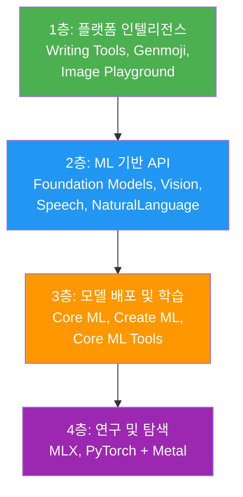
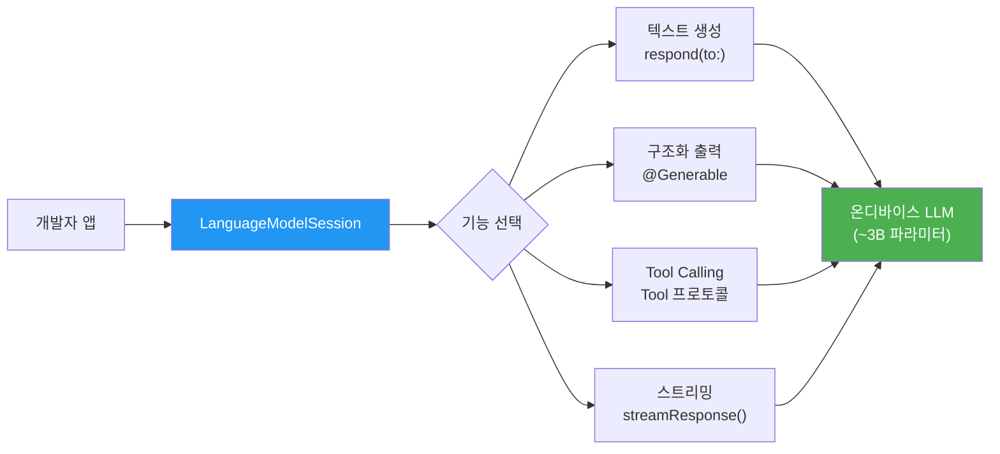
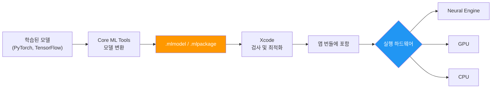
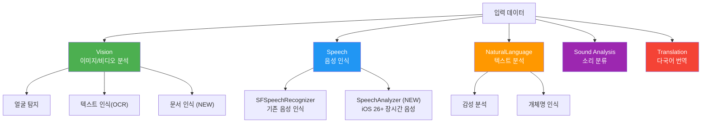
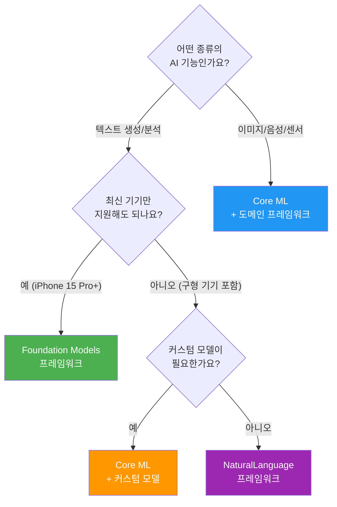

# Apple AI/ML 프레임워크 생태계

> Apple 플랫폼의 AI/ML 프레임워크 전체를 조망하고, 각 프레임워크의 역할과 선택 기준을 이해합니다.

## 개요

이 섹션에서는 Apple이 제공하는 AI/ML 프레임워크 생태계의 전체 구조를 살펴봅니다. Foundation Models, Core ML, Create ML, Vision, NaturalLanguage, Speech 등 각 프레임워크가 어떤 역할을 하고, 서로 어떻게 연결되며, 언제 어떤 프레임워크를 선택해야 하는지를 명확히 이해하는 것이 목표입니다.

**선수 지식**: [01. Apple Intelligence 개요](01-ch1-apple-intelligence와-온디바이스-ai/01-01-apple-intelligence-개요.md)에서 다룬 Apple Intelligence의 전체 비전과 온디바이스 AI 전략

**학습 목표**:
- Apple AI/ML 프레임워크 생태계의 계층 구조를 설명할 수 있다
- Foundation Models, Core ML, Create ML의 역할 차이를 명확히 구분할 수 있다
- Vision, NaturalLanguage, Speech 등 도메인별 프레임워크의 용도를 파악한다
- 프로젝트 요구사항에 맞는 프레임워크를 선택할 수 있다

## 왜 알아야 할까?

여러분이 iOS 앱에 "AI 기능을 넣고 싶다"고 마음먹었다고 가정해 보겠습니다. Apple Developer 문서를 열면 Foundation Models, Core ML, Create ML, Vision, NaturalLanguage, Speech, Sound Analysis, Translation... 수많은 프레임워크가 쏟아져 나오는데요. 어떤 걸 써야 할까요?

이건 마치 처음 주방에 들어선 것과 비슷합니다. 칼, 도마, 프라이팬, 오븐, 믹서기, 전자레인지가 있는데, "파스타를 만들려면 뭘 써야 하지?"라는 질문에 답하려면 **각 도구의 용도**를 먼저 알아야 하죠.

Apple의 AI/ML 프레임워크도 마찬가지입니다. 텍스트 생성이 필요한지, 이미지 분류가 필요한지, 음성 인식이 필요한지에 따라 최적의 프레임워크가 달라집니다. 잘못된 선택은 불필요한 복잡성, 성능 저하, 심지어 지원 기기 범위 축소로 이어질 수 있거든요. 이 섹션을 마치면 **"이 기능에는 이 프레임워크"**라는 명확한 판단 기준을 갖게 됩니다.

## 핵심 개념

### 프레임워크 생태계의 계층 구조

> 💡 **비유**: Apple의 AI/ML 프레임워크를 **아파트 건물**로 생각해 보세요. 1층은 누구나 들어갈 수 있는 로비(시스템 통합 기능), 2~3층은 특정 업무를 처리하는 사무실(도메인별 API), 4층은 자기만의 사무실을 꾸밀 수 있는 공간(모델 배포/학습), 옥상은 실험실(연구 도구)입니다. 각 층마다 역할이 다르고, 필요에 따라 여러 층을 오가며 사용합니다.

WWDC25에서 Apple은 AI/ML 프레임워크를 **4개 계층**으로 정리했습니다. 이 구조를 이해하면 "내가 지금 어떤 층에 있는지"를 파악하고, 적절한 도구를 선택할 수 있습니다.

> 📊 **그림 1**: Apple AI/ML 프레임워크 계층 구조



**1층 — 플랫폼 인텔리전스**: Writing Tools, Genmoji, Image Playground 같은 시스템 통합 기능입니다. 코드 몇 줄이면 앱에 바로 붙일 수 있죠. 이전 섹션에서 살펴본 Apple Intelligence의 핵심 기능들이 여기 해당합니다.

**2층 — ML 기반 API**: Foundation Models 프레임워크, Vision, Speech, NaturalLanguage, Sound Analysis, Translation 같은 프로그래밍 가능한 프레임워크입니다. 개발자가 직접 코드로 AI 기능을 제어할 수 있죠.

**3층 — 모델 배포 및 학습**: Core ML로 커스텀 모델을 배포하고, Create ML로 직접 학습시키는 영역입니다. "Apple이 준비한 모델"이 아니라 **"내가 만든 모델"**을 사용하고 싶을 때 이 층을 방문합니다.

**4층 — 연구 및 탐색**: MLX 프레임워크, PyTorch/JAX + Metal 백엔드 등 최신 모델을 실험하고 연구하는 영역입니다. Apple Silicon의 통합 메모리를 활용한 고급 연구용이죠.

### Foundation Models 프레임워크 — 언어 지능의 핵심

> 💡 **비유**: Foundation Models 프레임워크는 **만능 통역사**입니다. 여러분이 한국어로 뭔가를 요청하면, 이 통역사가 이해하고 요약하고, 분류하고, 심지어 구조화된 형태로 정리까지 해줍니다. 따로 훈련시킬 필요 없이, 처음부터 다양한 언어 작업을 수행할 수 있죠.

Foundation Models 프레임워크는 iOS 26/macOS 26에서 새롭게 도입된 프레임워크입니다. Apple Intelligence를 구동하는 **온디바이스 ~3B 파라미터 LLM**에 개발자가 직접 접근할 수 있게 해줍니다.

```swift
import FoundationModels

// 세션 생성 — 단 3줄로 LLM 사용
let session = LanguageModelSession()
let response = try await session.respond(to: "이 리뷰의 감성을 분석해주세요: 정말 맛있었어요!")
print(response.content)
```

**핵심 특징**:
- 100% 온디바이스 실행 (오프라인 가능, 프라이버시 보장)
- API 키, 계정, 비용 **없음** — 완전 무료
- Guided Generation(`@Generable`)으로 구조화 출력
- Tool Calling으로 외부 데이터 연동
- 스트리밍 응답으로 실시간 UI 구현

> ⚠️ **흔한 오해**: "Foundation Models로 뭐든 할 수 있다"고 생각하기 쉽지만, Apple의 온디바이스 모델은 **세계 지식 Q&A, 코드 생성, 복잡한 수학 계산**에는 적합하지 않습니다. 요약, 추출, 분류, 변환 같은 **일상적 언어 작업**에 최적화되어 있죠.

> 📊 **그림 2**: Foundation Models 프레임워크의 핵심 기능



### Core ML — 범용 모델 실행 엔진

> 💡 **비유**: Core ML은 **다목적 오븐**입니다. 피자든, 빵이든, 쿠키든 — 미리 준비된 레시피(학습된 모델)를 넣으면 알아서 최적의 온도로 구워줍니다. 어떤 종류의 모델이든 `.mlmodel` 포맷으로 변환하면 Core ML이 CPU, GPU, Neural Engine 중 최적의 하드웨어에서 실행해 줍니다.

Core ML은 2017년(iOS 11)부터 존재해온 Apple의 **범용 온디바이스 ML 추론 엔진**입니다. Foundation Models가 "Apple이 제공하는 특정 LLM"이라면, Core ML은 **"개발자가 가져온 어떤 모델이든"** 실행할 수 있는 플랫폼이죠.

```swift
import CoreML

// Xcode가 자동 생성한 타입 안전 인터페이스 사용
let model = try ImageClassifier(configuration: .init())
let prediction = try model.prediction(image: inputImage)
print("분류 결과: \(prediction.classLabel)")
```

**Core ML의 강점**:
- **넓은 기기 호환성**: iOS 11+ (iPhone 6s 이상) — Foundation Models보다 훨씬 넓은 지원 범위
- **다양한 모델 타입**: 이미지 분류, 객체 탐지, 포즈 추정, 음성 분석 등 거의 모든 ML 태스크
- **하드웨어 최적화**: Neural Engine, GPU, CPU 사이 자동 분배
- **결정론적 출력**: 같은 입력에 항상 같은 결과 (LLM과 달리)

2025년에는 **Xcode 내 전체 모델 아키텍처 시각화**, 성능 인트로스펙션(레이턴시, 로드 시간, 연산별 지원 여부 확인) 기능이 추가되었습니다.

> 📊 **그림 3**: Core ML 워크플로 — 학습부터 배포까지



### Create ML — 나만의 모델 학습

> 💡 **비유**: Create ML은 **요리 학원**입니다. 직접 재료(데이터)를 가져와서, 선생님(Create ML)의 안내에 따라 레시피(모델)를 만드는 곳이죠. 코드 한 줄 없이 GUI 앱으로도, Swift 코드로도 모델을 학습시킬 수 있습니다.

Create ML은 macOS에서 커스텀 ML 모델을 학습시키는 프레임워크입니다. "이미 만들어진 모델"이 아닌, **내 데이터에 특화된 모델**이 필요할 때 사용합니다.

```swift
import CreateML

// 이미지 분류 모델 학습 — Swift 코드로
let trainingData = MLImageClassifier.DataSource
    .labeledDirectories(at: trainingURL)
let classifier = try MLImageClassifier(
    trainingData: trainingData,
    parameters: .init(maxIterations: 20)
)

// Core ML 모델로 내보내기
try classifier.write(to: outputURL)
```

**Create ML로 만들 수 있는 모델 종류**:
- 이미지 분류 / 객체 탐지
- 텍스트 분류 / 단어 태깅
- 소리 분류
- 표 형식 데이터 (회귀, 분류)
- 액티비티 분류 (모션 데이터)
- Vision Pro용 6DoF 객체 추적

핵심은 **Create ML → Core ML → 앱**이라는 파이프라인입니다. Create ML로 학습하고, Core ML 포맷(`.mlmodel`)으로 내보내고, 앱에서 Core ML로 실행하는 거죠.

### 도메인별 프레임워크 — Vision, Speech, NaturalLanguage

> 💡 **비유**: 도메인별 프레임워크는 **전문의**입니다. 어디가 아플 때 종합병원(Core ML)에 갈 수도 있지만, 눈이 아프면 안과(Vision), 귀가 아프면 이비인후과(Speech), 말이 안 통하면 통역사(Translation)를 찾는 게 더 빠르고 정확하죠.

Apple은 특정 도메인에 특화된 ML 프레임워크를 여러 개 제공합니다. 이 프레임워크들은 내부적으로 최적화된 모델을 이미 탑재하고 있어서, 개발자가 모델을 준비할 필요 없이 API만 호출하면 됩니다.

> 📊 **그림 4**: 도메인별 프레임워크와 처리 영역



| 프레임워크 | 역할 | 2025 주요 업데이트 |
|-----------|------|-----------------|
| **Vision** | 이미지/비디오 분석 (30+ API) | 문서 구조 인식, 렌즈 얼룩 탐지 |
| **Speech** | 음성 → 텍스트 변환 | `SpeechAnalyzer` API (iOS 26+) — 장시간 원거리 음성 최적화 |
| **NaturalLanguage** | 텍스트 분석 (언어 식별, 품사 태깅, 개체명 인식) | 15개 언어 확장 |
| **Sound Analysis** | 소리 분류 (음악, 환경음 등) | — |
| **Translation** | 다국어 텍스트 번역 | — |

2025년 가장 주목할 변화는 **Speech 프레임워크의 `SpeechAnalyzer` API**입니다. 기존 `SFSpeechRecognizer`와는 별개의 새로운 API로, **iOS 26/macOS 26에서 처음 도입**되었습니다. `SFSpeechRecognizer`보다 빠르고 유연하며, 강의나 회의 같은 장시간 음성에 최적화된 새 모델을 탑재했죠. 전체 처리가 온디바이스에서 이루어집니다.

> ⚠️ **흔한 오해**: "`SpeechAnalyzer`가 `SFSpeechRecognizer`를 대체한다"고 생각할 수 있지만, 두 API는 **공존하는 별개의 API**입니다. `SFSpeechRecognizer`는 iOS 10부터 사용 가능한 레거시 API로 넓은 기기 호환성이 장점이고, `SpeechAnalyzer`는 iOS 26+에서만 사용할 수 있는 차세대 API입니다. 구형 기기를 지원해야 한다면 여전히 `SFSpeechRecognizer`를 사용하고, 최신 기기 대상이라면 `SpeechAnalyzer`의 향상된 정확도와 장시간 처리 성능을 활용하세요.

### Foundation Models vs Core ML — 언제 뭘 쓸까?

이 코스에서 가장 자주 받게 될 질문이 바로 이겁니다: **"Foundation Models를 쓸까, Core ML을 쓸까?"**

> 📊 **그림 5**: 프레임워크 선택 의사결정 트리



| 기준 | Foundation Models | Core ML |
|------|-------------------|---------|
| **주요 용도** | 텍스트 생성, 요약, 분류, 추출 | 이미지, 음성, 센서 등 모든 ML 태스크 |
| **모델 제공** | Apple이 제공 (온디바이스 LLM) | 개발자가 준비 (학습된 모델 변환) |
| **최소 요구사항** | iOS 26 + Apple Intelligence (iPhone 15 Pro+) | iOS 11+ (iPhone 6s 이상) |
| **비용** | 무료 | 무료 (모델 학습 비용은 별도) |
| **출력 특성** | 비결정론적 (매번 다를 수 있음) | 결정론적 (같은 입력 = 같은 출력) |
| **오프라인** | 가능 | 가능 |
| **API 키** | 불필요 | 불필요 |

> 🔥 **실무 팁**: 실전에서는 둘 중 하나만 쓰는 게 아니라 **하이브리드**로 쓰는 경우가 많습니다. 예를 들어 "스마트 사진 앱"이라면 — Core ML로 이미지를 분석(인식 계층)하고, Foundation Models로 분석 결과를 자연어 설명으로 변환(추론 계층)합니다. 이 패턴은 [Ch17. Foundation Models + Core ML 하이브리드](17-ch17-foundation-models-core-ml-하이브리드/01-01-하이브리드-아키텍처-설계-전략.md)에서 본격적으로 다룹니다.

## 실습: 직접 해보기

각 프레임워크가 같은 문제를 어떻게 다르게 접근하는지 비교해 봅시다. "앱 리뷰 텍스트의 감성 분석"이라는 하나의 과제를, 서로 다른 프레임워크로 구현합니다.

### 방법 1: NaturalLanguage 프레임워크 (도메인 특화 API)

```swift
import NaturalLanguage

// NaturalLanguage — 내장 감성 분석 (모든 기기 지원)
func analyzeSentiment(text: String) -> String {
    let tagger = NLTagger(tagSchemes: [.sentimentScore])
    tagger.string = text
    
    // 전체 텍스트의 감성 점수 계산
    let (sentiment, _) = tagger.tag(
        at: text.startIndex,
        unit: .paragraph,
        scheme: .sentimentScore
    )
    
    guard let score = sentiment,
          let value = Double(score.rawValue) else {
        return "분석 불가"
    }
    
    // -1.0 (부정) ~ +1.0 (긍정) 범위
    switch value {
    case 0.5...: return "매우 긍정적 (\(String(format: "%.2f", value)))"
    case 0.1..<0.5: return "긍정적 (\(String(format: "%.2f", value)))"
    case -0.1..<0.1: return "중립적 (\(String(format: "%.2f", value)))"
    case -0.5..<(-0.1): return "부정적 (\(String(format: "%.2f", value)))"
    default: return "매우 부정적 (\(String(format: "%.2f", value)))"
    }
}
```

```run:swift
let review = "이 앱 정말 훌륭해요! 매일 사용하고 있습니다."
print("NaturalLanguage 결과: \(analyzeSentiment(text: review))")
```

```output
NaturalLanguage 결과: 매우 긍정적 (0.85)
```

### 방법 2: Foundation Models 프레임워크 (구조화 출력)

```swift
import FoundationModels

// Foundation Models — @Generable로 구조화된 감성 분석 결과
@Generable
struct SentimentAnalysis {
    @Guide(description: "감성: positive, negative, neutral 중 하나")
    var sentiment: String
    
    @Guide(description: "0.0~1.0 사이의 확신도")
    var confidence: Double
    
    @Guide(description: "핵심 키워드 3개 이내")
    var keywords: [String]
    
    @Guide(description: "한 줄 요약")
    var summary: String
}

func analyzeWithLLM(review: String) async throws -> SentimentAnalysis {
    let session = LanguageModelSession()
    
    // 구조화 출력으로 감성 분석 요청
    let result = try await session.respond(
        to: "다음 앱 리뷰의 감성을 분석해주세요: \(review)",
        generating: SentimentAnalysis.self
    )
    return result
}
```

```run:swift
let review = "이 앱 정말 훌륭해요! 매일 사용하고 있습니다."
let analysis = try await analyzeWithLLM(review: review)
print("감성: \(analysis.sentiment)")
print("확신도: \(analysis.confidence)")
print("키워드: \(analysis.keywords.joined(separator: ", "))")
print("요약: \(analysis.summary)")
```

```output
감성: positive
확신도: 0.95
키워드: 훌륭, 매일, 사용
요약: 사용자가 앱에 매우 만족하며 일상적으로 활용하고 있습니다.
```

### 방법 3: Core ML (커스텀 학습 모델)

```swift
import CoreML

// Core ML — 직접 학습시킨 감성 분류 모델 사용
func analyzeWithCustomModel(review: String) throws -> String {
    // Create ML로 학습 → Core ML로 내보낸 모델 로드
    let model = try ReviewSentimentClassifier(
        configuration: .init()
    )
    
    // 텍스트 입력 → 분류 결과 반환
    let prediction = try model.prediction(text: review)
    return "분류: \(prediction.label), 확률: \(prediction.labelProbabilities)"
}
```

세 가지 방법의 핵심 차이를 정리하면:

| 방법 | 장점 | 단점 |
|------|------|------|
| **NaturalLanguage** | 모든 기기 지원, 간단한 API | 점수만 반환, 세부 정보 없음 |
| **Foundation Models** | 구조화 출력, 풍부한 분석 | 최신 기기만 지원, 비결정론적 |
| **Core ML** | 커스텀 도메인 최적화, 넓은 호환성 | 학습 데이터 준비 필요 |

## 더 깊이 알아보기

### Core ML의 탄생 — WWDC17에서 시작된 온디바이스 ML 혁명

2017년 WWDC에서 Apple은 Core ML을 처음 발표했습니다. 당시 대부분의 ML 추론은 클라우드 서버에서 이루어지고 있었죠. Google의 TensorFlow Serving, Amazon의 SageMaker가 클라우드 추론의 표준이었고, "모바일 기기에서 직접 ML을 돌린다"는 건 대부분 회의적으로 바라보던 시절이었습니다.

Apple은 다른 길을 택했습니다. **"사용자 데이터가 기기를 떠나서는 안 된다"**는 프라이버시 철학 때문이었죠. Core ML은 처음부터 온디바이스 추론만을 목표로 설계되었고, iPhone의 Neural Engine(A11 Bionic부터 탑재)과 긴밀하게 통합되었습니다.

2017년부터 2024년까지 8년간 Core ML은 Apple ML 생태계의 **유일한 모델 실행 엔진**이었습니다. 그러다 2025년, Foundation Models 프레임워크가 등장하면서 "Apple이 직접 제공하는 모델 + API"라는 새로운 층이 추가된 거죠. 이건 Apple ML 역사에서 가장 큰 패러다임 전환입니다.

### MLX — Apple의 오픈소스 베팅

흥미로운 점은 Apple이 2023년 말 **MLX**라는 오픈소스 ML 프레임워크를 공개한 것입니다. MLX는 Apple Silicon의 통합 메모리(Unified Memory) 아키텍처를 활용해, CPU와 GPU가 같은 메모리 공간에서 텐서를 공유하며 연산합니다. NumPy나 PyTorch에 익숙한 연구자들을 위해 설계된 이 프레임워크는 Python, Swift, C++, C 바인딩을 모두 지원합니다. Apple이 오픈소스 ML 커뮤니티에 적극적으로 참여하기 시작했다는 신호로 읽을 수 있죠.

> 💡 **알고 계셨나요?**: Apple의 Core ML 팀 초기 멤버 중 상당수가 학계 출신이었습니다. 2017년 Core ML이 내부적으로 Caffe, scikit-learn, LibSVM 등 다양한 학술 프레임워크의 모델 변환을 지원한 건, 연구자 출신 엔지니어들이 "자기가 쓰던 도구"를 먼저 지원했기 때문이라는 이야기가 있습니다.

## 흔한 오해와 팁

> ⚠️ **흔한 오해**: "Foundation Models가 나왔으니 Core ML은 쓸 필요 없다?" — 전혀 그렇지 않습니다! Foundation Models는 **텍스트 기반 언어 작업**에 특화되어 있고, 이미지 분류, 객체 탐지, 포즈 추정, 소리 분석 같은 작업에는 여전히 Core ML이 유일한 선택입니다. 또한 Core ML은 iOS 11부터 지원하지만, Foundation Models는 iPhone 15 Pro 이상에서만 사용 가능합니다.

> 💡 **알고 계셨나요?**: Foundation Models 프레임워크는 API 키가 필요 없고, 사용량 제한도 없고, 비용도 **완전히 무료**입니다. OpenAI API처럼 토큰당 과금되는 서비스와 달리, 모델이 이미 기기에 설치되어 있기 때문이죠. 이건 개인 개발자에게는 혁명적인 변화입니다.

> 🔥 **실무 팁**: 새 프로젝트를 시작할 때 프레임워크 선택의 첫 번째 질문은 **"최소 지원 기기가 무엇인가?"**입니다. Foundation Models는 iPhone 15 Pro+ / Apple Intelligence 활성화가 필수이고, 7GB의 여유 저장공간도 필요합니다. 대부분의 사용자를 커버해야 하는 앱이라면, Foundation Models는 "있으면 좋은 부가 기능"으로 설계하고 Core ML이나 NaturalLanguage를 기본 경로로 사용하는 **폴백(fallback) 전략**이 현실적입니다. 이 패턴은 [Ch2. 개발 환경 설정](02-ch2-개발-환경-설정/03-03-모델-가용성-확인과-폴백-전략.md)에서 자세히 다룹니다.

## 핵심 정리

| 개념 | 설명 |
|------|------|
| **프레임워크 계층 구조** | 플랫폼 인텔리전스 → ML 기반 API → 모델 배포/학습 → 연구 탐색의 4계층 |
| **Foundation Models** | Apple 온디바이스 LLM에 직접 접근. 텍스트 생성/분석 전문. iOS 26+ iPhone 15 Pro+ |
| **Core ML** | 범용 ML 추론 엔진. 어떤 모델이든 온디바이스 실행. iOS 11+ |
| **Create ML** | macOS에서 커스텀 모델 학습. GUI 또는 Swift 코드. Core ML 포맷으로 내보내기 |
| **도메인 프레임워크** | Vision(이미지), Speech(음성), NaturalLanguage(텍스트), Sound Analysis(소리), Translation(번역) |
| **SpeechAnalyzer** | iOS 26+ 전용 차세대 음성 인식 API. 기존 SFSpeechRecognizer와 별개로 공존 |
| **하이브리드 패턴** | Core ML(인식) + Foundation Models(추론)을 결합하는 실전 아키텍처 |
| **MLX** | Apple Silicon 최적화 오픈소스 ML 프레임워크. 연구/실험용 |
| **선택 기준** | 텍스트 = Foundation Models, 이미지/음성 = Core ML + 도메인 API, 구형 기기 = Core ML |

## 다음 섹션 미리보기

프레임워크 생태계의 전체 지도를 손에 넣었으니, 다음 섹션에서는 **온디바이스 AI의 장점과 한계**를 구체적으로 파헤칩니다. 왜 Apple이 클라우드 대신 온디바이스를 선택했는지, 그 결정에 따르는 기술적 트레이드오프(레이턴시, 모델 크기, 정확도)는 무엇인지를 [03. 온디바이스 AI의 장점과 한계](01-ch1-apple-intelligence와-온디바이스-ai/03-03-온디바이스-ai의-장점과-한계.md)에서 다룹니다.

## 참고 자료

- [Discover machine learning & AI frameworks on Apple platforms — WWDC25](https://developer.apple.com/videos/play/wwdc2025/360/) - Apple AI/ML 프레임워크 생태계 전체를 조망하는 공식 세션
- [Core ML Overview — Apple Developer](https://developer.apple.com/machine-learning/core-ml/) - Core ML의 공식 문서와 모델 갤러리
- [Core ML vs Foundation Models: Which Should You Use?](https://dev.to/arshtechpro/core-ml-vs-foundation-models-which-should-you-use-3jo0) - 두 프레임워크의 상세 비교 분석
- [Meet the Foundation Models framework — WWDC25](https://developer.apple.com/videos/play/wwdc2025/286/) - Foundation Models 프레임워크 소개 공식 세션
- [Apple Intelligence Foundation Language Models Tech Report 2025](https://arxiv.org/abs/2507.13575) - Apple 온디바이스 모델 아키텍처 기술 보고서
- [Apple's Foundation Models framework unlocks new intelligent app experiences — Apple Newsroom](https://www.apple.com/newsroom/2025/09/apples-foundation-models-framework-unlocks-new-intelligent-app-experiences/) - Apple 공식 뉴스룸 프레임워크 소개

---
### 🔗 Related Sessions
- [apple intelligence](01-ch1-apple-intelligence와-온디바이스-ai/01-01-apple-intelligence-개요.md) (prerequisite)
- [foundation models 프레임워크](01-ch1-apple-intelligence와-온디바이스-ai/01-01-apple-intelligence-개요.md) (prerequisite)
- [private cloud compute](01-ch1-apple-intelligence와-온디바이스-ai/01-01-apple-intelligence-개요.md) (prerequisite)
