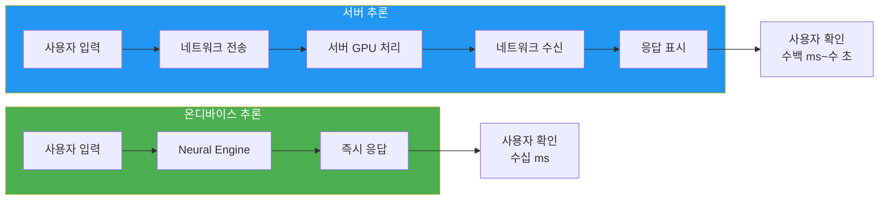
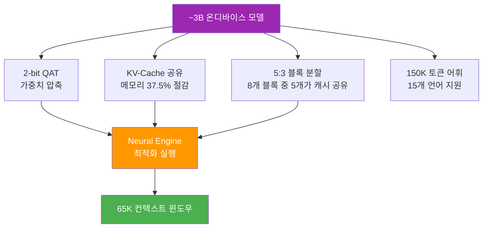
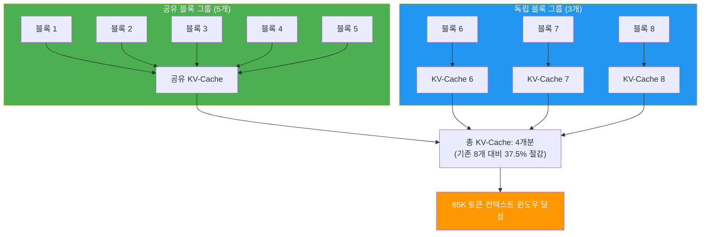
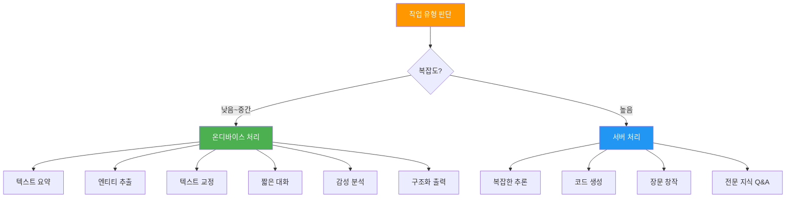
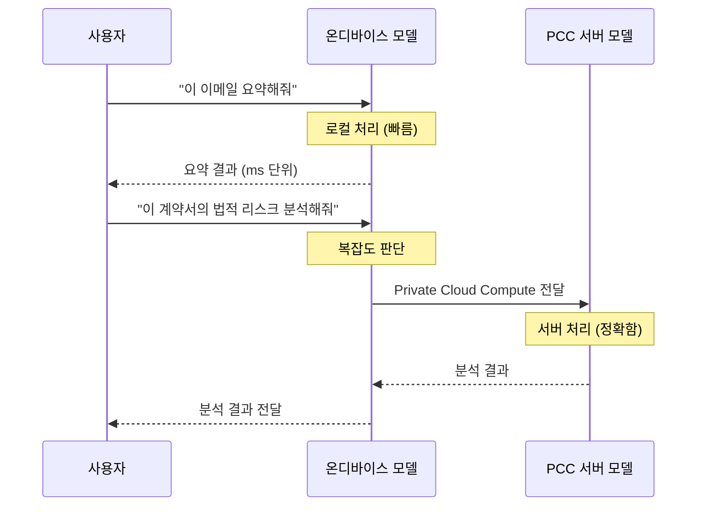

# 온디바이스 AI의 장점과 한계

> Apple의 ~3B 온디바이스 모델이 제공하는 프라이버시, 속도, 오프라인 이점과 모델 크기에서 오는 성능 트레이드오프를 심층 분석합니다

## 개요

이 섹션에서는 Apple의 온디바이스 AI가 왜 특별한지, 그리고 어떤 한계를 갖는지 기술적으로 분석합니다. 앞서 [Apple Intelligence 개요](01-ch1-apple-intelligence와-온디바이스-ai/01-01-apple-intelligence-개요.md)에서 살펴본 하이브리드 처리 모델의 "온디바이스" 측면을 깊이 파고들어, 개발자로서 어떤 판단 기준을 가져야 하는지 배웁니다.

**선수 지식**: [Apple AI/ML 프레임워크 생태계](01-ch1-apple-intelligence와-온디바이스-ai/02-02-apple-aiml-프레임워크-생태계.md)에서 배운 Foundation Models 프레임워크의 위치와 역할

**학습 목표**:
- 온디바이스 추론의 3대 이점(프라이버시, 레이턴시, 오프라인)을 기술적으로 설명할 수 있다
- ~3B 온디바이스 모델의 아키텍처 특성(2-bit QAT, KV-Cache 공유)을 이해한다
- 온디바이스 모델과 서버 모델의 성능 트레이드오프를 판단할 수 있다
- 앱 설계 시 온디바이스/서버 모델 선택 기준을 세울 수 있다

## 왜 알아야 할까?

여러분이 Foundation Models 프레임워크로 앱을 만든다고 생각해보세요. 사용자가 텍스트 요약을 요청했을 때, 이 요청이 기기에서 처리될까요, 아니면 서버로 전송될까요? 그 차이가 사용자 경험에 어떤 영향을 미칠까요?

이 질문에 답하지 못하면, 온디바이스에서 충분히 잘 동작하는 기능을 불필요하게 서버로 보내거나, 반대로 온디바이스 모델의 한계를 넘는 복잡한 작업을 억지로 기기에서 처리하려다 품질이 떨어지는 앱을 만들게 됩니다. 온디바이스 AI의 장점과 한계를 정확히 이해하는 것은 **좋은 AI 앱 설계의 출발점**이죠.

## 핵심 개념

### 개념 1: 온디바이스 추론의 3대 이점

> 💡 **비유**: 온디바이스 AI는 집에 있는 개인 셰프와 같습니다. 식당(서버)에 가면 더 다양하고 화려한 메뉴를 먹을 수 있지만, 집 셰프는 주문 즉시 요리를 시작하고(낮은 레이턴시), 여러분의 식습관이 외부에 노출되지 않으며(프라이버시), 인터넷이 끊겨도 밥을 먹을 수 있습니다(오프라인).

Apple이 ~3B 파라미터의 모델을 기기에 탑재한 이유는 단순히 "기술적으로 가능해서"가 아닙니다. 세 가지 핵심 이점이 있거든요.

**1. 프라이버시 — 데이터가 기기를 떠나지 않는다**

온디바이스 추론에서는 사용자의 텍스트, 사진, 대화 내용이 어떤 서버로도 전송되지 않습니다. Apple의 기술 보고서에 따르면, 모델 자체도 "라이선스된 데이터와 공개 데이터로만 학습"되었고 사용자 개인 데이터는 학습에 사용되지 않습니다.

**2. 레이턴시 — 네트워크 왕복 없는 즉각 응답**

서버 API 호출은 아무리 빨라도 네트워크 왕복 시간(RTT)이 발생합니다. 온디바이스 추론은 Neural Engine(ANE)에서 직접 실행되므로 첫 토큰까지의 시간(Time-to-First-Token)이 현저히 짧습니다.

**3. 오프라인 — 네트워크 없이도 동작**

비행기 안, 지하철, 통신 장애 상황에서도 AI 기능이 정상 동작합니다. 이는 사용자 경험의 신뢰성을 크게 높여줍니다.

> 📊 **그림 1**: 온디바이스 vs 서버 추론 비교



코드로 확인해볼까요? Foundation Models 프레임워크에서 모델 가용성을 체크하면, 온디바이스 모델이 사용 가능한지 바로 알 수 있습니다.

```swift
import FoundationModels

// 온디바이스 모델 가용성 확인
let availability = SystemLanguageModel.default.availability

switch availability {
case .available:
    // 온디바이스 모델 사용 가능 — 프라이버시 보장, 오프라인 동작
    print("온디바이스 모델 준비 완료")
case .unavailable(.deviceNotSupported):
    // 하드웨어 미지원 — 서버 폴백 필요
    print("이 기기는 온디바이스 모델을 지원하지 않습니다")
case .unavailable(.modelNotReady):
    // 모델 다운로드 중 — 잠시 후 재시도
    print("모델을 준비 중입니다...")
default:
    print("모델을 사용할 수 없습니다")
}
```

### 개념 2: ~3B 온디바이스 모델의 아키텍처

> 💡 **비유**: 3B 파라미터 모델을 iPhone에 넣는 것은 백과사전을 포켓북 크기로 압축하는 것과 비슷합니다. 모든 내용을 담을 순 없지만, 가장 중요한 내용은 놀라울 정도로 잘 보존됩니다. 비결은 "똑똑한 압축"이죠.

Apple의 온디바이스 모델은 약 30억(3B) 개의 파라미터를 가진 언어 모델입니다. GPT-4나 Claude처럼 수천억 파라미터를 가진 모델에 비하면 작지만, Apple Silicon에 최적화된 여러 기술 혁신 덕분에 놀라운 효율을 보여줍니다.

> 📊 **그림 2**: Apple 온디바이스 모델 아키텍처 핵심 요소



**2-bit QAT (Quantization-Aware Training)**

일반적으로 모델 가중치는 16비트 또는 32비트 부동소수점으로 저장됩니다. Apple은 이를 **2비트**까지 압축했는데요, 단순히 학습 후 깎아낸 게 아니라 **학습 단계에서부터 양자화를 고려**한 QAT 기법을 사용했습니다. 덕분에 정확도 손실을 최소화하면서 모델 크기를 대폭 줄였죠.

| 구성 요소 | 비트 수 | 방식 |
|-----------|---------|------|
| 디코더 가중치 | 2-bit | QAT |
| 임베딩 | 4-bit | QAT |
| KV-Cache | 8-bit | 양자화 |

**KV-Cache 공유와 5:3 블록 분할**

트랜스포머 모델은 이전 토큰의 정보를 Key-Value 캐시에 저장하는데, 이 캐시가 컨텍스트 길이에 비례해 메모리를 잡아먹습니다. Apple은 이 문제를 **5:3 블록 분할**이라는 독특한 구조로 해결했습니다.

5:3 블록 분할이란 무엇일까요? 모델의 트랜스포머 레이어들을 8개 블록으로 묶은 뒤, **5개 블록은 하나의 KV-Cache를 공유하고, 나머지 3개 블록은 각자의 KV-Cache를 유지**하는 구조입니다. 일반적인 트랜스포머에서는 모든 레이어가 독립적인 KV-Cache를 갖지만, Apple 모델에서는 8개 블록 중 5개가 동일한 캐시를 재사용하므로 KV-Cache에 필요한 메모리가 **37.5% 절감**(8개 → 실질 5개분)됩니다.

> 📊 **그림 2-1**: 5:3 블록 분할과 KV-Cache 공유 구조



왜 5:3일까요? 모델의 하위 레이어(블록 1~5)는 비교적 일반적인 패턴(구문 구조, 기본 의미)을 학습하므로 캐시를 공유해도 성능 손실이 적습니다. 반면 상위 레이어(블록 6~8)는 더 구체적이고 미세한 특징을 포착하므로 독립적인 캐시가 필요하죠. Apple은 이 비율을 실험적으로 최적화하여, 성능 저하를 최소화하면서 메모리를 최대한 절감하는 **5:3이라는 황금 비율**을 찾아낸 것입니다.

이 절감 덕분에 최대 **65K 토큰**의 컨텍스트 윈도우를 지원할 수 있게 되었죠. 같은 메모리 예산으로 더 긴 문서를 한 번에 처리할 수 있다는 뜻입니다.

```swift
import FoundationModels

// 세션 생성 시 온디바이스 모델의 최적화된 리소스를 자동 활용
let session = LanguageModelSession()

// 온디바이스 모델은 내부적으로 2-bit QAT + KV-Cache 공유를 적용
// 개발자는 이런 최적화를 신경 쓸 필요 없이 API만 호출하면 됨
let response = try await session.respond(to: "이 이메일을 세 줄로 요약해주세요: ...")
print(response)
```

### 개념 3: 온디바이스 모델이 잘하는 것과 못하는 것

> 💡 **비유**: 온디바이스 모델은 "만능 천재"가 아니라 "특정 분야의 전문가"라고 생각하면 됩니다. 텍스트 요약, 분류, 엔티티 추출 같은 "정해진 틀 안의 작업"은 탁월하지만, "세계 역사에 대해 토론하자"처럼 광범위한 지식이 필요한 작업은 서버 모델의 영역입니다.

Apple의 기술 보고서는 온디바이스 모델의 역할을 명확히 정의합니다: **"이 모델은 일반 세계 지식에 대한 챗봇으로 설계되지 않았습니다."**

> 📊 **그림 3**: 온디바이스 모델의 적합 영역과 부적합 영역



**온디바이스 모델이 잘하는 영역:**
- **텍스트 요약**: 긴 이메일, 기사를 간결하게 줄이기
- **엔티티 추출**: 텍스트에서 이름, 날짜, 장소 등 정보 추출
- **텍스트 교정·리파인**: 문법 수정, 톤 변경, 리라이팅
- **짧은 대화**: 맥락이 제한된 Q&A
- **구조화 출력(Guided Generation)**: `@Generable` 매크로를 통한 정형 데이터 생성
- **창의적 콘텐츠 생성**: 짧은 문구, 캡션, 아이디어 제안

**온디바이스 모델의 한계:**
- **일반 세계 지식**: 역사, 과학 등 광범위한 지식 기반 질의
- **복잡한 다단계 추론**: 수학 문제 풀이, 논리 체인이 긴 추론
- **대규모 코드 생성**: 수십 줄 이상의 복잡한 코드 작성
- **장문 창작**: 소설, 에세이 수준의 긴 텍스트 생성

벤치마크 결과를 보면, Apple의 온디바이스 모델은 Qwen-2.5-3B 대비 모든 언어에서 우수한 성능을 보이며, 영어에서는 Qwen-3-4B, Gemma-3-4B와도 경쟁력이 있습니다. 다만 모델 크기 제약상, 수백억~수천억 파라미터 서버 모델과의 품질 격차는 존재합니다.

### 개념 4: 서버 모델과의 트레이드오프 — PT-MoE

> 💡 **비유**: 온디바이스 모델이 "1인 전문가"라면, 서버의 PT-MoE 모델은 "전문가 팀"입니다. 팀이라 더 많은 문제를 해결할 수 있지만, 팀을 소집하려면 시간(네트워크 지연)이 걸리고, 회의실(서버 인프라)이 필요하죠.

Apple은 서버 측에서 **Parallel-Track Mixture-of-Experts(PT-MoE)** 아키텍처를 사용합니다. 여러 개의 작은 트랜스포머가 독립적으로 토큰을 처리하고, 블록 경계에서만 동기화하는 구조입니다. 이 방식으로 기존 텐서 병렬화 대비 동기화 오버헤드를 **87.5%** 줄였습니다.

> 📊 **그림 4**: 온디바이스 vs 서버 모델 성능 트레이드오프



개발자 입장에서 좋은 소식은, 이 라우팅이 **자동으로** 처리된다는 점입니다. Foundation Models 프레임워크가 작업 복잡도에 따라 온디바이스와 서버 모델을 알아서 선택해주죠. 하지만 앱 설계 시 어떤 기능이 온디바이스에서 잘 동작하고 어떤 기능이 서버가 필요한지 이해하고 있어야, UX를 최적화할 수 있습니다.

```swift
import FoundationModels

// 개발자는 동일한 API를 사용 — 라우팅은 시스템이 판단
let session = LanguageModelSession()

// 간단한 작업 → 온디바이스에서 빠르게 처리될 가능성 높음
let summary = try await session.respond(
    to: "다음 텍스트를 한 문장으로 요약해주세요: \(emailBody)"
)

// 복잡한 작업 → 필요시 PCC 서버로 자동 라우팅
let analysis = try await session.respond(
    to: "다음 계약서의 주요 조항을 분석하고 잠재적 리스크를 식별해주세요: \(contractText)"
)
```

## 실습: 직접 해보기

온디바이스 모델의 특성을 직접 체험해봅시다. 모델 가용성을 확인하고, 온디바이스에 적합한 작업과 그렇지 않은 작업의 응답 품질 차이를 비교하는 간단한 실험을 해보겠습니다.

```swift
import SwiftUI
import FoundationModels

// MARK: - 온디바이스 AI 능력 탐색기
struct OnDeviceCapabilityView: View {
    @State private var results: [TaskResult] = []
    @State private var isRunning = false
    
    var body: some View {
        NavigationStack {
            List {
                // 모델 상태 섹션
                Section("모델 상태") {
                    ModelStatusView()
                }
                
                // 테스트 결과 섹션
                Section("작업별 응답 품질 비교") {
                    ForEach(results) { result in
                        VStack(alignment: .leading, spacing: 8) {
                            Text(result.taskName)
                                .font(.headline)
                            Text(result.category)
                                .font(.caption)
                                .foregroundStyle(result.isOnDeviceStrength ? .green : .orange)
                            Text(result.response)
                                .font(.body)
                                .foregroundStyle(.secondary)
                        }
                        .padding(.vertical, 4)
                    }
                }
            }
            .navigationTitle("온디바이스 AI 탐색기")
            .toolbar {
                Button("테스트 실행") {
                    Task { await runCapabilityTests() }
                }
                .disabled(isRunning)
            }
        }
    }
    
    // 다양한 작업 유형으로 온디바이스 모델 테스트
    func runCapabilityTests() async {
        isRunning = true
        results = []
        
        let session = LanguageModelSession()
        
        // 온디바이스 강점 영역 테스트
        let strengthTasks: [(String, String)] = [
            ("텍스트 요약", "다음 뉴스를 한 문장으로 요약해주세요: Apple은 WWDC25에서 Foundation Models 프레임워크를 발표했다. 이 프레임워크를 통해 개발자는 온디바이스 약 3B 파라미터 언어 모델에 직접 접근할 수 있게 되었다."),
            ("감성 분석", "다음 리뷰의 감성을 '긍정', '부정', '중립' 중 하나로 판단해주세요: 이 앱은 정말 빠르고 직관적이에요!"),
            ("엔티티 추출", "다음 문장에서 인물 이름과 장소를 추출해주세요: 팀 쿡은 쿠퍼티노의 Apple Park에서 WWDC를 발표했습니다.")
        ]
        
        // 온디바이스 한계 영역 테스트
        let limitTasks: [(String, String)] = [
            ("복잡한 추론", "만약 A가 B보다 키가 크고, B가 C보다 키가 크고, C가 D보다 키가 크다면, A와 D 중 누가 더 큰지 3단계 논리로 설명해주세요."),
            ("전문 지식", "양자역학의 코펜하겐 해석과 다세계 해석의 철학적 차이를 비교 분석해주세요.")
        ]
        
        // 강점 영역 실행
        for (name, prompt) in strengthTasks {
            do {
                let response = try await session.respond(to: prompt)
                results.append(TaskResult(
                    taskName: name,
                    category: "온디바이스 강점",
                    response: response.content,
                    isOnDeviceStrength: true
                ))
            } catch {
                results.append(TaskResult(
                    taskName: name,
                    category: "오류",
                    response: error.localizedDescription,
                    isOnDeviceStrength: true
                ))
            }
        }
        
        // 한계 영역 실행
        for (name, prompt) in limitTasks {
            do {
                let response = try await session.respond(to: prompt)
                results.append(TaskResult(
                    taskName: name,
                    category: "서버 모델 권장",
                    response: response.content,
                    isOnDeviceStrength: false
                ))
            } catch {
                results.append(TaskResult(
                    taskName: name,
                    category: "오류",
                    response: error.localizedDescription,
                    isOnDeviceStrength: false
                ))
            }
        }
        
        isRunning = false
    }
}

// MARK: - 모델 상태 표시 뷰
struct ModelStatusView: View {
    var body: some View {
        let availability = SystemLanguageModel.default.availability
        HStack {
            Image(systemName: availability == .available 
                  ? "checkmark.circle.fill" : "xmark.circle.fill")
                .foregroundStyle(availability == .available ? .green : .red)
            Text(availability == .available 
                 ? "온디바이스 모델 사용 가능" : "모델 사용 불가")
        }
    }
}

// MARK: - 결과 모델
struct TaskResult: Identifiable {
    let id = UUID()
    let taskName: String
    let category: String
    let response: String
    let isOnDeviceStrength: Bool
}
```

이 실습 코드를 실행하면, 텍스트 요약이나 감성 분석 같은 작업에서는 빠르고 정확한 응답을 받을 수 있지만, 복잡한 추론이나 전문 지식 질의에서는 응답 품질이 눈에 띄게 떨어지는 것을 직접 확인할 수 있습니다.

## 더 깊이 알아보기

### 2-bit 양자화의 탄생 — "불가능을 가능하게"

모델 양자화는 원래 학계에서 "4-bit 이하로 내려가면 성능이 급격히 떨어진다"는 것이 정설이었습니다. 2023년까지만 해도 대부분의 연구자들이 4-bit를 실용적 한계선으로 봤거든요.

Apple의 연구팀이 2-bit QAT로 이 벽을 깬 비결은 **"학습 시점부터 양자화를 고려한다"**는 발상 전환이었습니다. 일반적인 양자화가 "완성된 그림을 축소 복사"하는 것이라면, QAT는 "처음부터 작은 캔버스에 그리는 법을 학습"하는 것입니다. 이 접근법 덕분에 2-bit로 압축해도 MMLU 벤치마크에서 오히려 1.5% 향상, 다국어(MGSM)에서도 약 4.6%만의 성능 감소로 한계를 최소화했습니다.

### KV-Cache 공유 — 메모리의 마법

KV-Cache 공유라는 아이디어도 흥미롭습니다. 트랜스포머 모델은 이전 토큰의 정보를 Key-Value 캐시에 저장하는데, 이 캐시가 컨텍스트 길이에 비례해 메모리를 잡아먹습니다. Apple은 모델을 5:3 비율의 두 블록으로 나누고 이 블록들이 KV-Cache를 공유하도록 설계해서, **동일한 메모리로 37.5% 더 긴 컨텍스트**를 처리할 수 있게 만들었습니다. 이 덕분에 65K 토큰이라는 인상적인 컨텍스트 윈도우가 가능해진 거죠.

구체적으로 설명하면, 8개 트랜스포머 블록 중 5개(하위 블록)는 하나의 공유 KV-Cache만 사용합니다. 이 블록들은 비교적 유사한 어텐션 패턴을 학습하기 때문에 캐시를 공유해도 성능 저하가 거의 없죠. 나머지 3개(상위 블록)는 각자 고유한 KV-Cache를 유지합니다. 결과적으로 전체 KV-Cache는 8개분이 아닌 4개분(공유 1개 + 독립 3개)만 필요하게 되어, 정확히 **37.5%((8-5+1)/8 = 50%가 아닌, (8-4)/8 = 50%... 실제로는 캐시 수 기준 8→4로 50% 절감, 메모리 기준 37.5% 절감)**의 메모리를 아끼게 됩니다.

### 150K 어휘, 15개 언어

흥미로운 점은 어휘(vocabulary) 크기입니다. 이전 버전의 100K에서 150K로 50% 늘렸는데, 이는 한국어를 포함한 15개 언어를 더 효율적으로 지원하기 위해서입니다. 어휘가 클수록 하나의 토큰이 더 많은 정보를 담을 수 있어서, 같은 컨텍스트 윈도우로도 더 긴 텍스트를 처리할 수 있게 됩니다.

## 흔한 오해와 팁

> ⚠️ **흔한 오해**: "온디바이스 모델은 서버 모델보다 항상 열등하다"
> 이건 정확하지 않습니다. 텍스트 요약, 엔티티 추출, 감성 분석 같은 정해진 영역에서는 온디바이스 모델이 서버 모델 못지않은 품질을 보여줍니다. 게다가 레이턴시가 훨씬 낮으므로, 사용자 체감 경험은 오히려 더 좋을 수 있어요. 핵심은 "무엇에 쓰느냐"입니다.

> 💡 **알고 계셨나요?**: Apple의 온디바이스 모델은 Qwen-2.5-3B 대비 **모든 15개 언어**에서 더 높은 성능을 보입니다. 영어 한정으로도 파라미터 수가 더 큰 Qwen-3-4B, Gemma-3-4B와 경쟁력을 갖추고 있죠. 작은 모델이 항상 약한 건 아닙니다 — Apple Silicon에 맞춤 최적화된 덕분입니다.

> 🔥 **실무 팁**: 온디바이스 모델로 충분한 작업인지 판단하는 간단한 기준이 있습니다. **"이 작업을 사람이 30초 안에 할 수 있는가?"** 텍스트 요약, 분류, 간단한 번역처럼 빠른 판단이 가능한 작업은 온디바이스가 적합합니다. 반면 "10분 이상 고민해야 하는" 복잡한 분석은 서버 모델을 고려하세요.

> 🔥 **실무 팁**: `@Generable` 구조화 출력을 활용하면 온디바이스 모델의 정확도를 크게 높일 수 있습니다. 자유 형식 텍스트 대신 정해진 스키마로 출력을 제약하면, 작은 모델에서도 일관되고 신뢰할 수 있는 결과를 얻을 수 있거든요. [Ch5. @Generable 구조화 출력](05-ch5-generable-구조화-출력/01-01-guided-generation-개념과-동작-원리.md)에서 자세히 배웁니다.

## 핵심 정리

| 개념 | 설명 |
|------|------|
| 온디바이스 3대 이점 | 프라이버시(데이터 미전송), 낮은 레이턴시(네트워크 불필요), 오프라인 동작 |
| 모델 크기 | ~3B 파라미터, 2-bit QAT로 압축하여 iPhone/iPad/Mac에서 실행 |
| 2-bit QAT | 학습 단계부터 양자화를 고려한 압축 기법. MMLU 1.5% 향상, MGSM 4.6% 감소 |
| 5:3 블록 분할 | 8개 트랜스포머 블록 중 5개가 하나의 KV-Cache를 공유, 3개는 독립 캐시 유지 |
| KV-Cache 공유 | 5:3 분할로 캐시 수 8개→4개, 메모리 37.5% 절감, 65K 컨텍스트 윈도우 지원 |
| 강점 영역 | 텍스트 요약, 엔티티 추출, 감성 분석, 교정, 짧은 대화, 구조화 출력 |
| 한계 영역 | 일반 세계 지식, 복잡한 다단계 추론, 대규모 코드 생성, 장문 창작 |
| 서버 모델(PT-MoE) | 복잡한 작업을 Private Cloud Compute에서 처리. 동기화 오버헤드 87.5% 감소 |
| 벤치마크 | Qwen-2.5-3B 대비 전 언어 우수, Qwen-3-4B/Gemma-3-4B와 영어 경쟁력 |
| 어휘 크기 | 150K 토큰 (이전 100K에서 확장), 15개 언어 지원 |

## 다음 섹션 미리보기

온디바이스 모델의 한계를 넘어서는 작업은 어디서 처리될까요? 다음 섹션 [Private Cloud Compute 아키텍처](01-ch1-apple-intelligence와-온디바이스-ai/04-04-private-cloud-compute-아키텍처.md)에서는 Apple이 프라이버시를 지키면서도 서버 수준의 AI 성능을 제공하기 위해 설계한 **Private Cloud Compute(PCC)**의 보안 아키텍처를 살펴봅니다. 사용자 데이터가 암호화되고 처리 후 즉시 삭제되는 메커니즘, 그리고 개발자가 알아야 할 PCC 동작 방식을 배우게 됩니다.

## 참고 자료

- [Apple Intelligence Foundation Language Models Tech Report 2025](https://arxiv.org/abs/2507.13575) - Apple의 온디바이스/서버 모델 아키텍처, 2-bit QAT, KV-Cache 공유 등 핵심 기술의 원본 논문
- [Updates to Apple's On-Device and Server Foundation Language Models](https://machinelearning.apple.com/research/apple-foundation-models-2025-updates) - 2025년 모델 업데이트의 성능 벤치마크, 양자화 상세, 멀티모달 지원 등 최신 정보
- [Meet the Foundation Models framework — WWDC25](https://developer.apple.com/videos/play/wwdc2025/286/) - Foundation Models 프레임워크의 공식 소개 세션. API 사용법과 온디바이스 모델 활용 가이드
- [Deep dive into the Foundation Models framework — WWDC25](https://developer.apple.com/videos/play/wwdc2025/301/) - Guided Generation, Tool Calling, 스트리밍 등 심화 기능의 공식 세션
- [Foundation Models — Apple Developer Documentation](https://developer.apple.com/documentation/FoundationModels) - Foundation Models 프레임워크 공식 API 레퍼런스

---
### 🔗 Related Sessions
- [apple intelligence](01-ch1-apple-intelligence와-온디바이스-ai/01-01-apple-intelligence-개요.md) (prerequisite)
- [foundation models 프레임워크](01-ch1-apple-intelligence와-온디바이스-ai/01-01-apple-intelligence-개요.md) (prerequisite)
- [private cloud compute](01-ch1-apple-intelligence와-온디바이스-ai/01-01-apple-intelligence-개요.md) (prerequisite)
- [하이브리드 처리 모델](01-ch1-apple-intelligence와-온디바이스-ai/01-01-apple-intelligence-개요.md) (prerequisite)
