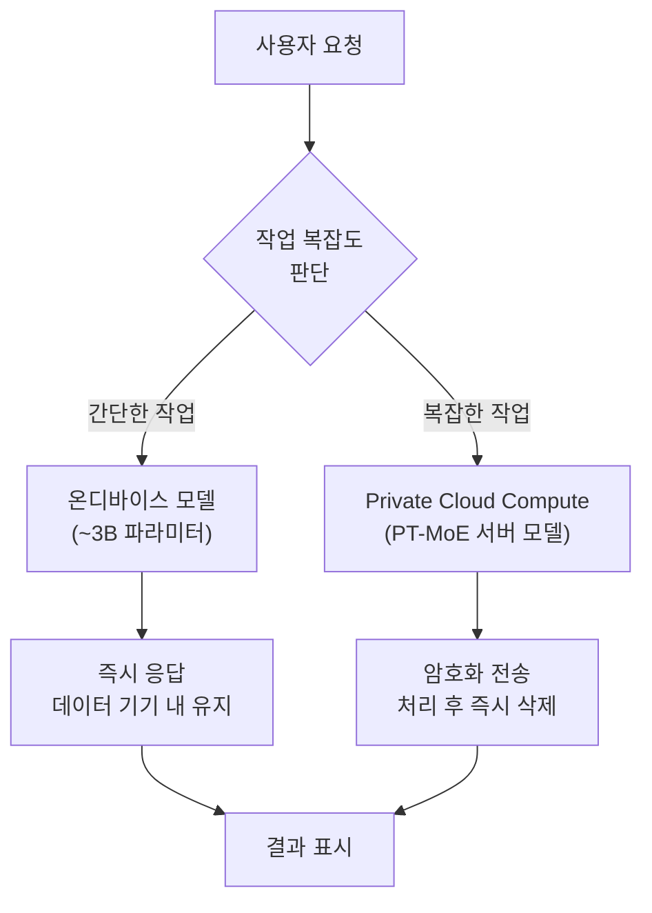
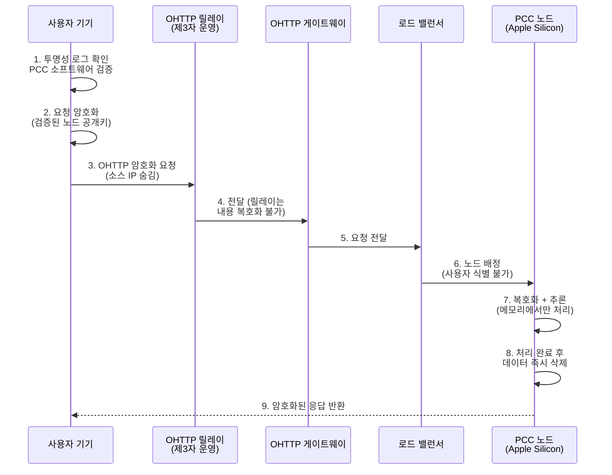
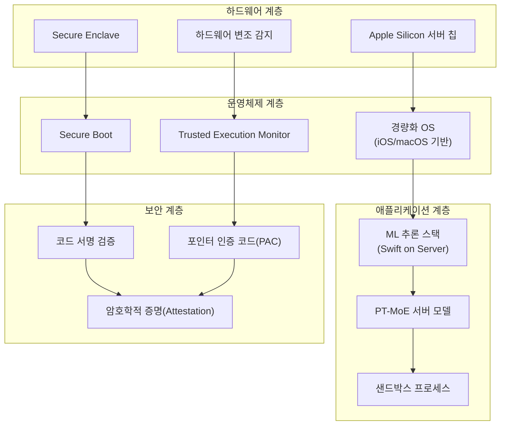
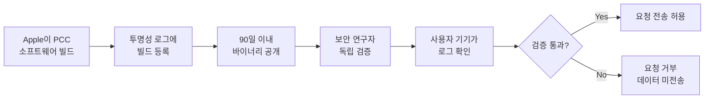

# Private Cloud Compute 아키텍처

> Apple이 클라우드에서도 프라이버시를 지키는 방법 — 온디바이스의 한계를 넘는 서버 AI의 보안 설계

## 개요

[이전 섹션](01-ch1-apple-intelligence와-온디바이스-ai/03-03-온디바이스-ai의-장점과-한계.md)에서 온디바이스 ~3B 모델의 강점과 한계를 살펴봤습니다. 텍스트 요약이나 엔티티 추출은 잘 해내지만, 복잡한 추론이나 방대한 세계 지식이 필요한 작업은 서버의 도움이 필요하죠. 그렇다면 사용자 데이터를 서버로 보내면서도 프라이버시를 어떻게 지킬 수 있을까요? 이 질문에 대한 Apple의 답이 바로 **Private Cloud Compute(PCC)**입니다.

**선수 지식**: [온디바이스 AI의 장점과 한계](01-ch1-apple-intelligence와-온디바이스-ai/03-03-온디바이스-ai의-장점과-한계.md), [Apple Intelligence 개요와 비전](01-ch1-apple-intelligence와-온디바이스-ai/01-01-apple-intelligence-개요와-비전.md)

**학습 목표**:
- Private Cloud Compute의 5가지 핵심 보안 요구사항을 설명할 수 있다
- 온디바이스-서버 간 요청 분기 메커니즘을 이해한다
- OHTTP 릴레이와 RSA Blind Signature를 활용한 익명화 과정을 파악한다
- PCC의 투명성 검증 시스템이 어떻게 신뢰를 구축하는지 설명할 수 있다

## 왜 알아야 할까?

여러분이 Foundation Models 프레임워크로 앱을 만들면, 일부 요청은 자동으로 PCC 서버로 전송됩니다. 사용자에게 "이 앱은 AI를 사용합니다"라고 말할 때, "당신의 데이터는 서버에 갔다가도 아무도 볼 수 없습니다"라고 자신 있게 설명할 수 있어야 하지 않을까요?

PCC를 이해하면 다음과 같은 이점이 있습니다:

- **사용자 신뢰 구축**: 프라이버시 보장의 기술적 근거를 설명할 수 있음
- **아키텍처 결정**: 온디바이스 vs 서버 처리의 트레이드오프를 이해하고 적절히 설계
- **규제 대응**: GDPR, 개인정보보호법 등 규제 환경에서 PCC의 보호 메커니즘을 활용
- **디버깅**: 요청이 온디바이스에서 처리되는지, 서버로 가는지 파악하여 성능 이슈 진단

## 핵심 개념

### 온디바이스-서버 분기 결정

> 💡 **비유**: 동네 약국과 대학병원의 관계를 떠올려 보세요. 감기약 정도는 약국에서 바로 해결하지만, 정밀 검사가 필요하면 대학병원으로 갑니다. 중요한 건 대학병원에 가더라도 진료 기록이 철저히 보호된다는 점이죠. Apple Intelligence도 마찬가지입니다 — 간단한 작업은 기기에서, 복잡한 작업은 서버에서 처리하되 데이터 보호는 양쪽 모두 동일합니다.

Apple Intelligence는 사용자 요청을 분석해서 어디서 처리할지 자동으로 결정합니다. 이 과정은 개발자가 명시적으로 제어하는 것이 아니라, 시스템이 작업의 복잡도와 모델 역량을 기반으로 판단합니다.

> 📊 **그림 1**: 온디바이스-서버 분기 결정 흐름



**온디바이스에서 처리되는 작업**:
- 텍스트 요약, 문법 교정
- 감성 분석, 엔티티 추출
- 짧은 텍스트 생성
- [이전 섹션](01-ch1-apple-intelligence와-온디바이스-ai/03-03-온디바이스-ai의-장점과-한계.md)에서 살펴본 온디바이스 모델의 강점 영역

**서버(PCC)로 전달되는 작업**:
- 복잡한 다단계 추론
- 광범위한 세계 지식이 필요한 질답
- 긴 문서의 심층 분석
- 온디바이스 모델의 65K 토큰 컨텍스트를 넘는 작업

개발자 입장에서는 `LanguageModelSession`을 통해 요청을 보내면 시스템이 자동으로 최적의 경로를 선택합니다. 코드에서 "이건 서버로 보내"라고 직접 지정하지 않습니다. 이는 [Foundation Models 프레임워크 생태계](01-ch1-apple-intelligence와-온디바이스-ai/02-02-foundation-models-프레임워크-생태계.md)에서 살펴본 것처럼, 프레임워크가 복잡한 인프라를 추상화하여 개발자에게 단일 API를 제공하는 설계 철학의 연장선입니다:

```swift
import FoundationModels

// 개발자는 동일한 API를 사용 — 라우팅은 시스템이 결정
let session = LanguageModelSession()

// 간단한 요청 → 온디바이스에서 처리될 가능성 높음
let summary = try await session.respond(to: "이 문장을 요약해줘: ...")

// 복잡한 요청 → PCC로 라우팅될 가능성 높음
let analysis = try await session.respond(to: "이 계약서의 법적 리스크를 분석하고...")
```

### PCC의 5가지 핵심 보안 요구사항

> 💡 **비유**: 투표소를 생각해 보세요. 좋은 투표 시스템은 (1) 투표 내용을 아무도 볼 수 없고, (2) 물리적으로 열람이 불가능하며, (3) 관리자도 특정 표를 찾을 수 없고, (4) 누군가 조작하려면 전체 시스템을 뚫어야 하며, (5) 외부 감시인이 과정을 검증할 수 있어야 합니다. PCC는 이 다섯 가지를 클라우드 AI에 그대로 적용했습니다.

Apple은 PCC를 설계할 때 다섯 가지 핵심 요구사항을 정의했습니다. 이것은 단순한 원칙이 아니라, 하드웨어와 소프트웨어로 **기술적으로 강제**되는 보장(guarantee)입니다.

> 📊 **그림 2**: PCC의 5가지 핵심 보안 요구사항


| 요구사항 | 의미 | 기술적 구현 |
|---------|------|-----------|
| **무상태 처리** | 사용자 데이터가 요청 처리 후 즉시 삭제됨 | Secure Enclave가 재부팅마다 암호화 키 초기화 |
| **강제 가능한 보장** | 보안 약속이 기술적으로 우회 불가능 | 하드웨어 수준 암호화, 로드 밸런서도 복호화 불가 |
| **특권 접근 불가** | Apple 직원조차 원격 셸이나 디버깅 도구 사용 불가 | OS에서 원격 접근 메커니즘 자체를 제거 |
| **비표적성** | 특정 사용자를 겨냥한 공격이 구조적으로 불가능 | OHTTP 릴레이 + RSA Blind Signature로 익명화 |
| **검증 가능한 투명성** | 보안 연구자가 독립적으로 검증 가능 | 모든 프로덕션 빌드를 투명성 로그에 공개 |

> ⚠️ **흔한 오해**: "서버에 데이터를 보내면 Apple이 볼 수 있다" — PCC에서는 Apple 직원조차 사용자 데이터에 접근할 수 없습니다. 원격 셸, 디버거 같은 접근 경로 자체가 OS에 존재하지 않습니다. 이건 정책이 아니라 기술적 구조입니다.

### 요청 흐름: 기기에서 PCC까지

사용자의 AI 요청이 PCC 서버에 도달하는 과정은 여러 보호 계층을 거칩니다. 각 단계가 서로 다른 보안 위협을 차단하도록 설계되어 있습니다.

> 📊 **그림 3**: PCC 요청 흐름 (전체 과정)



**각 단계별 보안 메커니즘**:

**1단계 — 투명성 로그 확인**: 사용자 기기는 PCC 노드가 공개된 소프트웨어를 실행하고 있는지 암호학적으로 검증합니다. 투명성 로그에 등록되지 않은 소프트웨어를 실행하는 노드에는 데이터를 보내지 않습니다.

**2단계 — 요청 암호화**: 검증된 PCC 노드의 공개키로 요청을 암호화합니다. 로드 밸런서나 중간 인프라는 복호화할 수 없습니다.

**3단계 — OHTTP 릴레이**: 제3자가 운영하는 Oblivious HTTP 릴레이가 소스 IP 주소를 숨깁니다. 릴레이는 요청 내용을 볼 수 없고, PCC는 요청자의 IP를 알 수 없습니다.

**4-6단계 — 전달과 배정**: RSA Blind Signature 기반의 일회용 인증 토큰이 유효한 요청임을 증명하되, 특정 사용자와 연결되지 않습니다.

**7-8단계 — 처리와 삭제**: PCC 노드는 메모리에서만 데이터를 처리하고, 완료 즉시 삭제합니다. 디스크에 기록하지 않으며, 로그에도 개인정보가 남지 않습니다.

### PCC 하드웨어와 소프트웨어 스택

> 💡 **비유**: 은행 금고를 생각해 보세요. 금고는 특수 합금(하드웨어)과 다중 잠금 장치(소프트웨어)로 보호됩니다. 금고 제작자도 열쇠 없이는 열 수 없고, CCTV로 외부에서 감시할 수 있죠. PCC 서버는 Apple Silicon이라는 특수 하드웨어에, iPhone급 보안 소프트웨어를 얹어, 외부 연구자가 검증 가능한 구조로 만들어졌습니다.

PCC 서버는 일반 클라우드 서버가 아닙니다. iPhone에 들어가는 것과 동일한 보안 기술을 서버 환경에 적용한, Apple이 직접 설계한 커스텀 서버입니다.

> 📊 **그림 4**: PCC 하드웨어-소프트웨어 스택 구조



**하드웨어 특징**:
- **Apple Silicon 서버**: iPhone과 동일 계열의 Secure Enclave 탑재
- **하드웨어 변조 감지**: 서버 배포 전 고해상도 컴포넌트 촬영으로 공급망 무결성 검증
- **제3자 옵저버**: 서버 프로비저닝 과정을 외부 관찰자가 감시

**소프트웨어 특징**:
- **Swift on Server**: 추론 레이어가 Swift로 작성되어 메모리 안전성 확보
- **범용 로깅 없음**: 사전 지정된 감사 메트릭만 노드 외부로 전송
- **원격 접근 제거**: SSH, 디버거, 인터랙티브 콘솔이 OS 자체에 존재하지 않음
- **주소 공간 재활용**: 사용자 데이터를 처리한 메모리 영역을 주기적으로 교체

### 투명성과 검증 시스템

PCC가 다른 클라우드 AI 서비스와 근본적으로 다른 점은 **"우리를 믿으세요"가 아니라 "직접 확인하세요"**라고 말한다는 것입니다.

> 📊 **그림 5**: PCC 투명성 검증 시스템



**투명성 로그(Transparency Log)**:
- 변조 불가능한(append-only) 암호학적 로그
- 모든 프로덕션 PCC 빌드가 등록됨
- 사용자 기기는 이 로그와 대조하여 노드의 소프트웨어를 검증

**연구자 접근**:
- 모든 PCC 프로덕션 빌드를 보안 연구를 위해 공개
- **PCC Virtual Research Environment(VRE)**: Mac에서 PCC 노드를 시뮬레이션하는 연구 도구
- sepOS 펌웨어와 iBoot 부트로더를 평문으로 공개 (Apple 역사상 최초)
- Apple Security Bounty 프로그램으로 취약점 발견에 보상 제공

## 실습: 직접 해보기

PCC 자체를 직접 제어하는 API는 없지만, Foundation Models 프레임워크를 통해 모델 가용성을 확인하고, 요청이 어떤 경로로 처리되는지 이해할 수 있습니다. 아래 코드는 모델 상태를 확인하고 프라이버시 관련 정보를 로깅하는 유틸리티입니다.

```swift
import FoundationModels
import SwiftUI

// MARK: - 모델 가용성과 라우팅 확인 유틸리티

/// PCC 관련 정보를 확인하는 서비스
@Observable
class AIPrivacyService {
    var availabilityStatus: String = "확인 중..."
    var routingInfo: String = ""
    var privacyGuarantees: [String] = []
    
    /// 모델 가용성 확인 — 온디바이스 vs 서버 상태 파악
    func checkModelAvailability() async {
        let availability = SystemLanguageModel.default.availability
        
        switch availability {
        case .available:
            // 온디바이스 모델 사용 가능
            availabilityStatus = "온디바이스 모델 사용 가능"
            routingInfo = "간단한 요청은 기기에서 처리됩니다"
            
        case .unavailable(.deviceNotEligible):
            // 기기가 Apple Intelligence를 지원하지 않음
            availabilityStatus = "이 기기에서는 사용할 수 없습니다"
            routingInfo = "Apple Silicon(A17 Pro+, M1+) 기기가 필요합니다"
            
        case .unavailable(.modelNotReady):
            // 모델이 아직 다운로드 중
            availabilityStatus = "모델 다운로드 중..."
            routingInfo = "설정 > Apple Intelligence에서 상태를 확인하세요"
            
        default:
            availabilityStatus = "상태를 확인할 수 없습니다"
            routingInfo = ""
        }
        
        // PCC 프라이버시 보장 정보 설정
        privacyGuarantees = [
            "요청 데이터는 처리 후 즉시 삭제됩니다",
            "Apple을 포함해 누구도 데이터에 접근할 수 없습니다",
            "모든 전송은 종단간 암호화됩니다",
            "서버 소프트웨어는 독립적으로 검증 가능합니다"
        ]
    }
}
```

아래는 사용자에게 프라이버시 상태를 보여주는 SwiftUI 뷰입니다:

```swift
struct PrivacyStatusView: View {
    @State private var service = AIPrivacyService()
    @State private var response: String = ""
    @State private var isProcessing = false
    
    var body: some View {
        NavigationStack {
            List {
                // 모델 상태 섹션
                Section("AI 모델 상태") {
                    Label(service.availabilityStatus, 
                          systemImage: "brain")
                    if !service.routingInfo.isEmpty {
                        Text(service.routingInfo)
                            .font(.caption)
                            .foregroundStyle(.secondary)
                    }
                }
                
                // 프라이버시 보장 섹션
                Section("프라이버시 보호") {
                    ForEach(service.privacyGuarantees, id: \.self) { guarantee in
                        Label(guarantee, systemImage: "lock.shield.fill")
                            .font(.subheadline)
                    }
                }
                
                // AI 요청 테스트 섹션
                Section("AI 요청 테스트") {
                    Button("텍스트 요약 요청 보내기") {
                        Task { await sendTestRequest() }
                    }
                    .disabled(isProcessing)
                    
                    if !response.isEmpty {
                        Text(response)
                            .font(.body)
                            .padding(.vertical, 4)
                    }
                }
            }
            .navigationTitle("AI 프라이버시")
            .task {
                await service.checkModelAvailability()
            }
        }
    }
    
    /// 테스트 요청 — 시스템이 자동으로 최적 경로를 선택
    private func sendTestRequest() async {
        isProcessing = true
        defer { isProcessing = false }
        
        do {
            let session = LanguageModelSession()
            // 시스템이 자동으로 온디바이스 또는 PCC를 선택
            let result = try await session.respond(
                to: "다음 문장을 한 줄로 요약해줘: Private Cloud Compute는 Apple Silicon 서버에서 사용자 데이터를 처리하되, 처리 완료 후 즉시 삭제하는 프라이버시 중심 클라우드 컴퓨팅 인프라입니다."
            )
            response = result.content
        } catch {
            response = "오류: \(error.localizedDescription)"
        }
    }
}
```

```run:swift
// PCC 보안 요구사항을 정리하는 간단한 데모
let requirements = [
    ("무상태 처리", "데이터가 처리 후 즉시 삭제됨"),
    ("강제 가능한 보장", "하드웨어로 보안 약속을 강제"),
    ("특권 접근 불가", "Apple 직원도 원격 접근 불가"),
    ("비표적성", "특정 사용자 공격이 구조적 불가"),
    ("검증 가능한 투명성", "외부 연구자가 독립 검증 가능")
]

print("=== Private Cloud Compute 핵심 보안 요구사항 ===\n")
for (index, (name, desc)) in requirements.enumerated() {
    print("\(index + 1). \(name)")
    print("   → \(desc)\n")
}
print("총 \(requirements.count)가지 요구사항이 하드웨어+소프트웨어로 강제됩니다.")
```

```output
=== Private Cloud Compute 핵심 보안 요구사항 ===

1. 무상태 처리
   → 데이터가 처리 후 즉시 삭제됨

2. 강제 가능한 보장
   → 하드웨어로 보안 약속을 강제

3. 특권 접근 불가
   → Apple 직원도 원격 접근 불가

4. 비표적성
   → 특정 사용자 공격이 구조적 불가

5. 검증 가능한 투명성
   → 외부 연구자가 독립 검증 가능

총 5가지 요구사항이 하드웨어+소프트웨어로 강제됩니다.
```

## 더 깊이 알아보기

### PCC의 탄생 배경 — "클라우드를 신뢰하지 마라"

Apple이 PCC를 설계한 배경에는 흥미로운 철학적 전환이 있습니다. 전통적인 클라우드 보안은 **"서비스 제공자를 신뢰하라"**는 전제 위에 서 있었습니다. 구글이든 아마존이든, 사용자는 "이 회사가 내 데이터를 안전하게 관리하겠지"라고 믿어야 했죠.

Apple은 이 전제 자체를 뒤집었습니다. PCC의 설계 원칙은 **"Apple조차 신뢰할 필요가 없는 시스템"**입니다. 기술적으로 Apple 직원이 접근할 수 없도록 만들었으니, 신뢰 여부가 아예 문제가 되지 않는 거죠.

이것은 2016년 FBI와의 San Bernardino iPhone 잠금 해제 논쟁에서 시작된 Apple의 프라이버시 입장이 극단까지 발전한 결과입니다. 당시 Tim Cook은 "백도어는 존재하지 않는다"고 선언했는데, PCC는 그 원칙을 클라우드까지 확장한 것입니다.

### OHTTP — 우편함의 비유

PCC에서 사용하는 **Oblivious HTTP(OHTTP)**는 IETF RFC 9458로 표준화된 프로토콜입니다. 이 프로토콜의 핵심은 "봉투 안의 봉투" 구조인데요 — 바깥 봉투(OHTTP 암호화)는 릴레이만 열 수 있지만 내용(실제 요청)은 볼 수 없고, 안쪽 봉투(요청 암호화)는 PCC 노드만 열 수 있지만 보낸 사람(IP)을 모릅니다.

이렇게 하면 **릴레이는 "누가 보냈는지"는 알지만 "뭘 보냈는지"는 모르고**, **PCC는 "뭘 받았는지"는 알지만 "누가 보냈는지"는 모릅니다**. 어느 한쪽이 해킹당해도 사용자를 식별할 수 없는 구조입니다.

> 💡 **알고 계셨나요?**: PCC는 Apple 역사상 최초로 sepOS 펌웨어와 iBoot 부트로더를 평문(plaintext)으로 공개한 사례입니다. 이전에는 이 코드를 외부에 공개한 적이 없었는데, 투명성 보장을 위해 전례 없는 결정을 내린 것이죠. Apple Security Bounty 프로그램을 통해 PCC 취약점을 발견한 연구자에게 최대 100만 달러의 보상금도 제공합니다.

### RSA Blind Signature — 보이지 않는 도장

RSA Blind Signature(RFC 9474)는 PCC의 비표적성을 가능하게 하는 핵심 암호학 기술입니다. 일반 디지털 서명에서는 서명자가 메시지 내용을 볼 수 있지만, Blind Signature에서는 서명자가 메시지를 보지 않고도 유효한 서명을 생성합니다.

비유하자면, 봉투 안에 서류를 넣고 먹지(카본 페이퍼)를 깔아서 서명하는 것과 같습니다. 서명자는 봉투 위에 도장을 찍지만, 안의 내용은 보지 못하죠. 나중에 봉투를 열면 유효한 서명이 찍힌 서류가 나옵니다. PCC에서는 이 방식으로 "이 요청은 유효한 Apple 기기에서 왔다"는 것만 증명하고, 어떤 기기인지는 알 수 없게 합니다.

## 흔한 오해와 팁

> ⚠️ **흔한 오해**: "PCC는 선택사항이고, 개발자가 온디바이스만 사용하도록 강제할 수 있다" — Foundation Models 프레임워크에서 라우팅은 시스템이 자동으로 결정합니다. 개발자가 "반드시 온디바이스에서만 처리하라"고 명시적으로 지정하는 API는 제공되지 않습니다. 다만 온디바이스 모델의 강점 영역에 해당하는 작업을 설계하면 자연스럽게 온디바이스 처리 비율을 높일 수 있습니다.

> 💡 **알고 계셨나요?**: PCC 서버는 100% 재생 에너지로 운영됩니다. Apple은 미국 전역의 데이터 센터에 PCC 노드를 배치했는데, 모두 태양광이나 풍력 등 재생 가능 에너지원으로 전력을 공급합니다.

> 🔥 **실무 팁**: 프라이버시에 민감한 앱을 개발할 때, 사용자에게 "이 기능은 Apple Intelligence를 사용하며, 기기에서 처리되거나 Private Cloud Compute를 통해 안전하게 처리됩니다"라는 안내를 제공하세요. PCC의 보안 보장은 기술적으로 강제되므로, 개발자가 별도의 프라이버시 인프라를 구축할 필요 없이 Apple의 보호 체계를 활용할 수 있습니다.

## 핵심 정리

| 개념 | 설명 |
|------|------|
| **Private Cloud Compute** | Apple Silicon 서버에서 사용자 데이터를 처리하되, 처리 후 즉시 삭제하는 프라이버시 중심 클라우드 인프라 |
| **5가지 보안 요구사항** | 무상태 처리, 강제 가능한 보장, 특권 접근 불가, 비표적성, 검증 가능한 투명성 |
| **OHTTP 릴레이** | 제3자 운영 프록시로 사용자 IP를 숨기며, 요청 내용은 볼 수 없는 구조 |
| **RSA Blind Signature** | 요청의 유효성만 증명하고 발신자를 식별할 수 없게 하는 암호학적 기법 |
| **투명성 로그** | 모든 PCC 프로덕션 빌드를 공개하여 외부 연구자가 독립 검증 가능 |
| **자동 라우팅** | 개발자가 동일한 API를 사용하면 시스템이 온디바이스/PCC를 자동 결정 |
| **PT-MoE** | PCC 서버에서 실행되는 Parallel-Track Mixture-of-Experts 대규모 모델 |
| **Secure Enclave** | 재부팅마다 암호화 키를 초기화하여 데이터 잔존을 구조적으로 방지 |

## 다음 섹션 미리보기

지금까지 Ch1에서 [Apple Intelligence의 비전](01-ch1-apple-intelligence와-온디바이스-ai/01-01-apple-intelligence-개요와-비전.md), [프레임워크 생태계](01-ch1-apple-intelligence와-온디바이스-ai/02-02-foundation-models-프레임워크-생태계.md), [온디바이스 모델의 장단점](01-ch1-apple-intelligence와-온디바이스-ai/03-03-온디바이스-ai의-장점과-한계.md), 그리고 PCC 아키텍처(이번 섹션)를 살펴봤습니다. 다음 마지막 섹션 [05. 이 코스에서 만들 프로젝트 미리보기](01-ch1-apple-intelligence와-온디바이스-ai/05-05-이-코스에서-만들-프로젝트-미리보기.md)에서는 이론을 넘어 실제로 무엇을 만들게 되는지 확인합니다. Ch2~Ch20에 걸쳐 구축할 AI 채팅봇 앱, Writing Tools 통합 메모 앱, Image Playground 스토리북, Siri 연동 등 실전 프로젝트의 전체 로드맵을 미리 둘러보겠습니다.

## 참고 자료

- [Private Cloud Compute: A new frontier for AI privacy in the cloud — Apple Security Research](https://security.apple.com/blog/private-cloud-compute/) - PCC의 설계 원칙, 5가지 보안 요구사항, 하드웨어/소프트웨어 아키텍처를 상세히 다룬 Apple 공식 기술 블로그
- [Apple Intelligence Foundation Language Models: Tech Report 2025](https://arxiv.org/abs/2507.13575) - 온디바이스/서버 모델의 기술적 상세와 PT-MoE 아키텍처를 다룬 Apple 공식 기술 논문
- [Private Cloud Compute Documentation — Apple Security Research](https://security.apple.com/documentation/private-cloud-compute/) - PCC 요청 흐름, 보안 메커니즘 등 기술 문서 모음
- [Security research on Private Cloud Compute — Apple Security Research](https://security.apple.com/blog/pcc-security-research/) - PCC Virtual Research Environment 및 보안 연구자용 도구 안내
- [Updates to Apple's On-Device and Server Foundation Language Models — Apple ML Research](https://machinelearning.apple.com/research/apple-foundation-models-2025-updates) - 온디바이스/서버 모델의 최신 업데이트와 성능 벤치마크
- [Introducing Swift NIO Oblivious HTTP — Swift.org](https://www.swift.org/blog/introducing-swift-nio-oblivious-http/) - PCC에서 사용하는 OHTTP 프로토콜의 Swift 구현 배경

---
### 🔗 Related Sessions
- [apple intelligence](01-ch1-apple-intelligence와-온디바이스-ai/01-01-apple-intelligence-개요.md) (prerequisite)
- [foundation models 프레임워크](01-ch1-apple-intelligence와-온디바이스-ai/01-01-apple-intelligence-개요.md) (prerequisite)
- [pt-moe](01-ch1-apple-intelligence와-온디바이스-ai/03-03-온디바이스-ai의-장점과-한계.md) (prerequisite)
