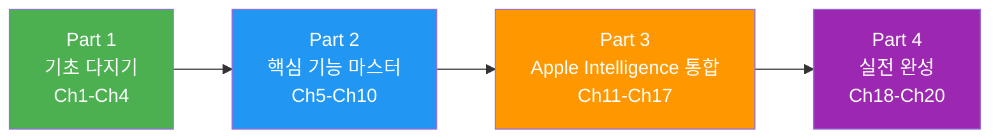
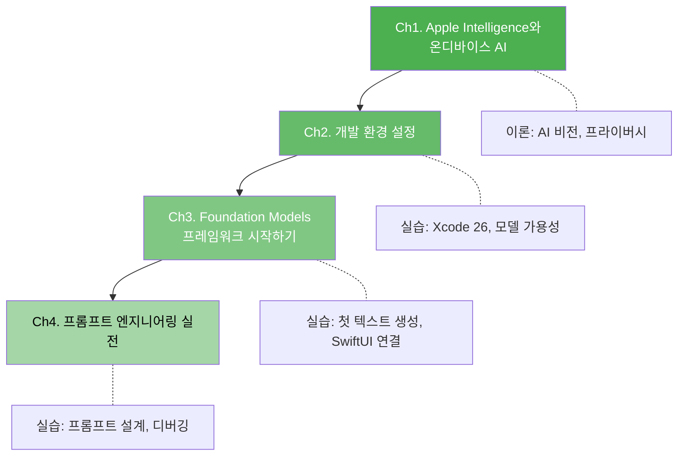
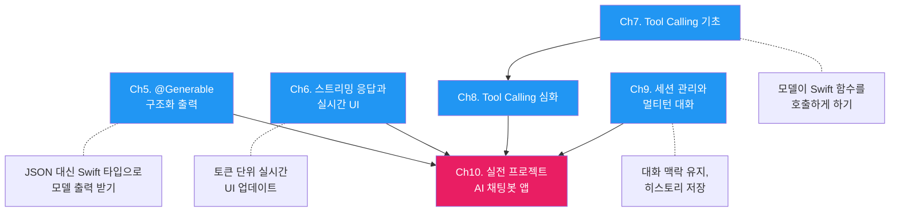
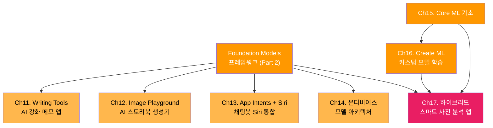
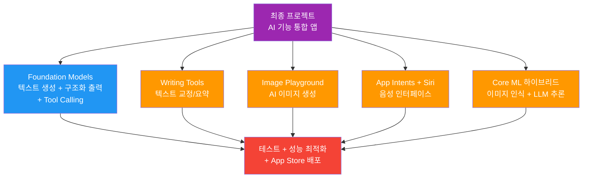

# 이 코스에서 만들 프로젝트 미리보기

> Ch1~Ch20까지의 학습 로드맵과 최종 프로젝트를 미리 만나봅니다

## 개요

지금까지 Apple Intelligence의 비전, AI/ML 프레임워크 생태계, 온디바이스 AI의 장단점, 그리고 Private Cloud Compute의 보안 아키텍처까지 살펴봤습니다. 이론적 기반은 충분히 다졌으니, 이제 "그래서 뭘 만들 수 있는데?"라는 질문에 답할 차례입니다. 이 섹션에서는 코스 전체의 학습 로드맵을 조망하고, 각 파트에서 만들 프로젝트를 미리 확인합니다.

**선수 지식**: [Apple Intelligence 개요](01-ch1-apple-intelligence와-온디바이스-ai/01-01-apple-intelligence-개요.md)부터 [Private Cloud Compute 아키텍처](01-ch1-apple-intelligence와-온디바이스-ai/04-04-private-cloud-compute-아키텍처.md)까지의 Ch1 전체 내용

**학습 목표**:
- 코스 전체 20개 챕터의 학습 흐름과 의존 관계를 파악한다
- 각 파트에서 만들 실전 프로젝트의 범위와 기능을 이해한다
- 자신의 학습 수준에 맞는 시작점과 경로를 결정한다

## 왜 알아야 할까?

여행을 떠날 때 지도 없이 출발하는 사람은 없겠죠? 20개 챕터, 99개 섹션으로 구성된 이 코스는 꽤 긴 여정입니다. 전체 그림을 먼저 보면 세 가지 이점이 있습니다.

첫째, **동기부여**입니다. 각 챕터에서 배우는 개념이 최종 프로젝트에 어떻게 조립되는지 알면, "이걸 왜 배우지?"라는 의문이 사라집니다. 둘째, **효율적인 학습 경로** 설정입니다. 이미 Core ML에 익숙하다면 Ch15를 건너뛸 수 있고, Tool Calling에 집중하고 싶다면 Ch7~Ch8로 바로 갈 수 있죠. 셋째, **실전 감각**입니다. 최종 프로젝트의 완성 모습을 미리 보면, 각 챕터를 학습할 때 "이 코드가 나중에 어디에 쓰이겠구나"하는 맥락이 잡힙니다.

## 핵심 개념

### 코스 전체 구조: 4개의 파트

이 코스는 크게 4개의 파트로 나뉩니다. 마치 건물을 짓는 것처럼 — 기초 공사(Part 1) → 골조와 내장(Part 2) → 인테리어(Part 3) → 완공 검사(Part 4)의 순서로 진행됩니다.

> 📊 **그림 1**: 코스 전체 구조와 학습 흐름



각 파트의 성격을 한마디로 정리하면 이렇습니다:

| 파트 | 범위 | 핵심 질문 | 난이도 |
|------|------|-----------|--------|
| Part 1 | Ch1~Ch4 | "Foundation Models가 뭐고, 어떻게 시작하지?" | 입문~초급 |
| Part 2 | Ch5~Ch10 | "구조화 출력, 스트리밍, Tool Calling은 어떻게 쓰지?" | 초급~중급 |
| Part 3 | Ch11~Ch17 | "Writing Tools, Image Playground, Siri, Core ML까지 어떻게 통합하지?" | 중급~고급 |
| Part 4 | Ch18~Ch20 | "성능, 테스트, 최종 앱 완성까지 어떻게 마무리하지?" | 고급 |

### Part 1: 기초 다지기 (Ch1~Ch4)

> 💡 **비유**: Part 1은 요리를 배울 때 칼 잡는 법, 불 조절, 기본 양념 비율을 익히는 단계입니다. 화려한 요리는 아직이지만, 이 기초 없이는 어떤 요리도 만들 수 없죠. 칼을 안전하게 쥐는 법(환경 설정)을 모르면 다칠 수 있고, 불 세기 조절(프롬프트 튜닝)을 모르면 재료가 타버리니까요.

Part 1에서는 여러분이 이미 Ch1에서 배운 이론적 기반 위에, 실제로 코드를 작성하기 시작합니다.

> 📊 **그림 2**: Part 1 챕터별 학습 흐름



**Ch2. 개발 환경 설정**에서는 Xcode 26과 iOS 26 SDK를 설치하고, Foundation Models 프로젝트를 처음 생성합니다. 모델 가용성을 확인하는 코드를 작성하고, 모델이 없는 기기에서의 폴백 전략도 배우죠. 놀랍게도, Apple은 Python SDK(`python-apple-fm-sdk`)도 제공하는데요 — 이를 활용한 빠른 프로토타이핑 방법도 다룹니다.

**Ch3. Foundation Models 프레임워크 시작하기**가 본격적인 코딩의 시작점입니다. `SystemLanguageModel`과 `LanguageModelSession`의 동작 원리를 이해하고, 첫 번째 텍스트 생성 요청을 보냅니다. `GenerationOptions`로 temperature, topK 같은 생성 파라미터를 제어하는 방법도 배우고, SwiftUI와 Foundation Models를 연결하는 기본 패턴까지 익힙니다.

**Ch4. 프롬프트 엔지니어링 실전**에서는 온디바이스 ~3B 모델의 특성에 맞는 프롬프트 전략을 학습합니다. [온디바이스 AI의 장점과 한계](01-ch1-apple-intelligence와-온디바이스-ai/03-03-온디바이스-ai의-장점과-한계.md)에서 배운 모델 한계를 프롬프트 설계로 보완하는 실전 기법이죠. instructions(시스템 프롬프트) 설계, few-shot 패턴, 프롬프트 디버깅까지 다룹니다.

### Part 2: 핵심 기능 마스터 (Ch5~Ch10)

> 💡 **비유**: Part 2는 요리의 핵심 기법 — 볶기, 찌기, 굽기 — 을 마스터하는 단계입니다. 각 기법을 개별적으로 충분히 연습한 뒤, Ch10에서 코스 요리 하나를 완성합니다.

Part 2는 이 코스의 심장부입니다. Foundation Models 프레임워크의 3대 핵심 기능 — **구조화 출력(@Generable)**, **스트리밍**, **Tool Calling** — 을 깊이 있게 다루고, 이 모든 것을 결합한 **AI 채팅봇 앱**을 Ch10에서 만듭니다.

> 📊 **그림 3**: Part 2의 3대 핵심 기능과 프로젝트 수렴



**Ch5. @Generable 구조화 출력**은 Foundation Models의 가장 혁신적인 기능 중 하나입니다. 일반적인 LLM은 자유 형식 텍스트를 반환하지만, `@Generable` 매크로를 사용하면 **컴파일 타임에 Swift 타입으로 출력 스키마가 생성**됩니다. JSON 파싱이나 정규식 추출 없이, 모델의 응답을 바로 Swift 구조체로 받을 수 있죠.

```swift
// Ch5에서 배울 패턴 미리보기
@Generable
struct RecipeOutput {
    @Guide(description: "요리 이름")
    var name: String
    
    @Guide(description: "난이도 1-5")
    @Guide(.range(1...5))
    var difficulty: Int
    
    @Guide(description: "재료 목록")
    var ingredients: [String]
}
```

**Ch6. 스트리밍 응답과 실시간 UI**에서는 `streamResponse()` API를 사용해 토큰이 생성되는 즉시 화면에 표시하는 실시간 UI를 구현합니다. ChatGPT처럼 글자가 타이핑되듯 나타나는 경험을 SwiftUI로 만드는 거죠. 구조화 출력의 부분 스트리밍(`PartiallyGenerated`)까지 다루는데, 이 기법은 Ch10 채팅봇에서 핵심적으로 사용됩니다.

**Ch7~Ch8. Tool Calling**은 온디바이스 모델의 한계를 넘는 열쇠입니다. [온디바이스 AI의 장점과 한계](01-ch1-apple-intelligence와-온디바이스-ai/03-03-온디바이스-ai의-장점과-한계.md)에서 배운 것처럼 ~3B 모델은 실시간 정보를 알 수 없는데요, Tool Calling을 통해 모델이 "날씨 API를 호출해줘", "캘린더에서 일정을 검색해줘" 같은 요청을 Swift 함수로 위임할 수 있습니다. Apple의 WWDC25 코드-어롱에서도 `FindPointsOfInterestTool`로 호텔과 레스토랑을 검색하는 예제를 보여줬죠.

**Ch9. 세션 관리와 멀티턴 대화**에서는 단일 요청-응답을 넘어, 여러 턴의 대화 맥락을 유지하는 방법을 배웁니다. 토큰 예산 관리, 대화 히스토리 영구 저장, 복수 세션 전환까지 다룹니다.

그리고 **Ch10. 실전 프로젝트: AI 채팅봇 앱**에서 이 모든 것이 하나로 합쳐집니다! MVVM 아키텍처 설계부터 채팅 UI, AI 서비스 레이어, 영구 저장, Tool 통합, 에러 처리와 UX 마무리까지 — 6개 섹션에 걸쳐 완전한 AI 채팅봇을 처음부터 끝까지 만듭니다.

### Part 3: Apple Intelligence 통합 (Ch11~Ch17)

> 💡 **비유**: Part 2에서 만든 "엔진"에 다양한 "차체"를 얹는 단계입니다. 같은 Foundation Models 엔진이지만, Writing Tools를 얹으면 문서 편집기가 되고, Image Playground를 얹으면 이미지 생성 앱이 되고, Siri를 얹으면 음성 비서가 됩니다.

> 📊 **그림 4**: Part 3의 Apple Intelligence 서비스 통합 지도



**Ch11. Writing Tools 통합**에서는 Apple의 텍스트 교정·요약·리라이팅 시스템 서비스를 앱에 통합합니다. iOS 26에서 강화된 리치 텍스트 지원, 커스텀 텍스트 엔진에서의 Writing Tools Coordinator 통합까지 다루며, 최종적으로 **AI 강화 메모 앱**을 만듭니다.

**Ch12. Image Playground와 시각 AI**에서는 `ImagePlaygroundSheet`와 `ImageCreator` API를 활용한 AI 이미지 생성을 배우고, Genmoji와 Visual Intelligence까지 탐구합니다. 프로젝트로 **AI 스토리북 생성기**를 만들어, 텍스트 스토리에 맞는 이미지를 자동 생성하는 앱을 완성합니다.

**Ch13. App Intents와 Siri 연동**에서는 Ch10에서 만든 채팅봇을 Siri로 제어할 수 있게 합니다. `AppIntent`, `AppEntity`, `AssistantSchemas`를 사용해 "시리야, 채팅봇에게 내일 날씨 물어봐"가 가능한 음성 인터페이스를 구현합니다.

**Ch14. 온디바이스 모델 아키텍처 이해**는 한 발 물러서서, [온디바이스 AI의 장점과 한계](01-ch1-apple-intelligence와-온디바이스-ai/03-03-온디바이스-ai의-장점과-한계.md)에서 간략히 다뤘던 2-bit QAT, KV-Cache 공유의 내부 동작을 논문 수준으로 깊이 파헤칩니다. Apple의 기술 보고서(arxiv:2507.13575)를 직접 해석하며, "내가 쓰는 모델이 어떻게 동작하는지" 이해하게 됩니다.

**Ch15~Ch16**에서는 Core ML과 Create ML을 배워 **커스텀 ML 모델**을 학습하고 배포하는 방법을 익힙니다. 이미지 분류, 텍스트 분류, Hugging Face 모델 갤러리 활용까지 다루죠.

**Ch17. Foundation Models + Core ML 하이브리드**가 Part 3의 클라이맥스입니다. Core ML로 이미지를 인식하고, 그 결과를 Foundation Models로 자연어 분석하는 — 즉 "인식(Core ML) + 추론(LLM)"의 하이브리드 파이프라인을 구축합니다. 프로젝트로 **스마트 사진 분석 앱**을 만듭니다.

### Part 4: 실전 완성 (Ch18~Ch20)

Part 4는 "잘 만든 앱"과 "출시할 수 있는 앱"의 차이를 메우는 단계입니다.

**Ch18. 성능 최적화와 프로파일링**에서는 AI 추론 시간, 메모리 사용량, 배터리 소모를 Instruments로 측정하고 최적화합니다. `session.prewarm()`, 토큰 예산 관리, 병렬 처리 등 실전 최적화 기법을 다룹니다.

**Ch19. 테스트와 품질 보증**에서는 비결정적인 AI 출력을 어떻게 테스트하는지 배웁니다. 프로토콜 기반 AI 서비스 모킹, 구조화 출력 검증, 회귀 테스트 전략까지 — AI 시대의 새로운 테스트 패러다임을 익힙니다.

**Ch20. 실전 프로젝트: AI 기능 통합 앱 완성**이 이 코스의 대미를 장식합니다. 코스 전체에서 배운 모든 기술 — Foundation Models, Writing Tools, Image Playground, Siri, Core ML — 을 하나의 완성된 앱으로 통합합니다.

> 📊 **그림 5**: 최종 프로젝트의 기술 스택 통합



## 실습: 직접 해보기

각 파트에서 어떤 코드를 작성하게 되는지, 핵심 패턴을 파트별로 미리 맛보겠습니다. 지금 완벽히 이해할 필요는 없어요 — "아, 이런 코드를 쓰게 되는구나" 하는 감만 잡으면 됩니다.

**Part 1 맛보기 — 프롬프트 엔지니어링 (Ch4)**

Ch3에서 기본적인 텍스트 생성을 배운 뒤, Ch4에서는 `instructions`를 활용한 시스템 프롬프트 설계를 다룹니다:

```run:swift
import FoundationModels

// Ch4에서 배울 패턴: instructions로 모델 행동을 제어
let session = LanguageModelSession(
    instructions: """
    당신은 요리 전문가입니다. 
    모든 답변을 3줄 이내로 간결하게 하세요.
    재료는 한국에서 구하기 쉬운 것 위주로 추천하세요.
    """
)

let response = try await session.respond(
    to: "초보자를 위한 파스타 레시피 알려줘"
)
print(response)
```

```output
스파게티 면을 삶고, 올리브오일에 마늘을 볶은 뒤 면과 함께 섞어주세요.
소금, 후추로 간하고 파르메산 치즈를 뿌리면 알리오올리오 완성입니다.
재료비 5천원 이하로 15분이면 충분합니다.
```

**Part 2 맛보기 — 구조화 출력 + Tool Calling (Ch5, Ch7)**

Part 2의 핵심은 `@Generable`로 모델 출력을 Swift 타입으로 받고, `Tool`로 외부 데이터를 가져오는 것입니다:

```swift
import FoundationModels

// [Ch5] 구조화 출력 — JSON 파싱 없이 Swift 타입으로 받기
@Generable
struct MovieRecommendation {
    @Guide(description: "영화 제목")
    var title: String
    
    @Guide(description: "추천 이유를 한 문장으로")
    var reason: String
    
    @Guide(description: "평점 1-10")
    @Guide(.range(1...10))
    var rating: Int
}

// [Ch7] Tool Calling — 모델이 Swift 함수를 호출
struct SearchMovieTool: Tool {
    let name = "search_movies"
    let description = "장르별 영화를 검색합니다"
    
    @Generable struct Input { var genre: String }
    @Generable struct Output { var titles: [String] }
    
    func call(_ input: Input) async throws -> Output {
        // 실제 영화 DB 검색 (Ch7에서 구현)
        Output(titles: ["인셉션", "인터스텔라", "테넷"])
    }
}
```

**Part 3 맛보기 — Writing Tools + Core ML 하이브리드 (Ch11, Ch17)**

Part 3에서는 Foundation Models를 다른 Apple 프레임워크와 결합합니다:

```swift
import WritingTools
import CoreML
import FoundationModels

// [Ch11] Writing Tools — 텍스트 교정/요약 시스템 통합
let writingToolsCoordinator = WritingToolsCoordinator()
// TextView에 연결하면 AI 교정/요약이 자동 활성화

// [Ch17] Core ML + Foundation Models 하이브리드 파이프라인
// 1단계: Core ML로 이미지 인식
let classifier = try MLImageClassifier(contentsOf: modelURL)
let label = classifier.prediction(from: photo)  // "golden_retriever"

// 2단계: 인식 결과를 Foundation Models로 자연어 분석
let session = LanguageModelSession(
    instructions: "사진 분석 결과를 친절하게 설명해주세요."
)
let analysis = try await session.respond(
    to: "이 사진에서 \(label)이(가) 감지되었습니다. 사용자에게 설명해주세요.",
    generating: PhotoAnalysis.self  // 구조화 출력
)
```

**Part 4 맛보기 — 성능 최적화 + 테스트 (Ch18, Ch19)**

```swift
// [Ch18] 성능 최적화 — 모델 프리웜으로 첫 응답 시간 단축
let session = LanguageModelSession()
try await session.prewarm()  // 백그라운드에서 모델 미리 로딩

// [Ch19] 테스트 — 프로토콜 기반 AI 서비스 모킹
protocol AIServiceProtocol {
    func respond(to prompt: String) async throws -> String
}

struct MockAIService: AIServiceProtocol {
    func respond(to prompt: String) async throws -> String {
        "테스트용 고정 응답"  // 결정적 테스트 가능
    }
}
```

> 🔥 **실무 팁**: 각 `[Ch번호]` 주석이 표시된 부분을 해당 챕터에서 하나씩 배울 예정입니다. 지금은 "Part마다 이런 다른 패턴들이 추가되는구나"하는 전체 그림만 잡으면 됩니다. 특히 Part 1의 기본 세션 패턴이 Part 2에서 `@Generable`과 `Tool`로 확장되고, Part 3에서 다른 프레임워크와 결합되는 흐름에 주목하세요.

아래는 Ch10에서 완성할 AI 채팅봇의 핵심 아키텍처를 미리 보여주는 스케치입니다 — Part 2의 모든 기법이 하나로 합쳐지는 모습이죠:

```swift
import FoundationModels
import SwiftUI

// Ch10에서 만들 AI 채팅봇의 핵심 구조 미리보기
// (각 부분은 해당 챕터에서 단계적으로 구현합니다)

// [Ch5] 구조화 출력 — 모델 응답을 Swift 타입으로 받기
@Generable
struct ChatAnalysis {
    @Guide(description: "사용자 의도 분류")
    var intent: String
    
    @Guide(description: "감정 점수 -1.0 ~ 1.0")
    var sentiment: Double
}

// [Ch7] Tool Calling — 모델이 외부 데이터를 가져오게 하기
struct WeatherTool: Tool {
    let name = "get_weather"
    let description = "현재 날씨를 조회합니다"
    
    // Tool의 입출력 타입 정의
    @Generable struct Input { var city: String }
    @Generable struct Output { var temperature: Int; var condition: String }
    
    func call(_ input: Input) async throws -> Output {
        // 실제 날씨 API 호출 (Ch7에서 구현)
        Output(temperature: 22, condition: "맑음")
    }
}

// [Ch9] 세션 관리 — 대화 맥락 유지
@Observable
class ChatViewModel {
    private var session: LanguageModelSession
    var messages: [ChatMessage] = []
    
    init() {
        // instructions로 시스템 프롬프트 설정 (Ch4)
        self.session = LanguageModelSession(
            instructions: "당신은 친절한 AI 어시스턴트입니다."
        )
    }
    
    // [Ch6] 스트리밍 — 실시간 응답 표시
    func send(_ text: String) async throws {
        let stream = session.streamResponse(
            to: text,
            generating: ChatAnalysis.self,  // 구조화 출력
            tools: [WeatherTool()]           // Tool 등록
        )
        
        for try await partial in stream {
            // 부분 응답을 UI에 실시간 반영
        }
    }
}
```

## 더 깊이 알아보기

### Apple의 "Code-Along" 전통과 Foundation Models

Apple은 WWDC25에서 Foundation Models 프레임워크를 소개하면서, 특별히 **코드-어롱 세션**을 준비했습니다. 이 세션에서는 **여행 일정 생성 앱(Landmark Trip Planner)**을 처음부터 끝까지 만드는 과정을 보여줬는데요, 흥미롭게도 이 코드-어롱의 6단계 구조가 우리 코스의 Part 2와 거의 동일합니다:

1. Foundation Models 기초 → 텍스트 생성 (우리 코스 Ch3)
2. 구조화 출력 → `@Generable`로 itinerary 타입 정의 (우리 코스 Ch5)
3. 프롬프팅 기법 → `@PromptBuilder`와 few-shot (우리 코스 Ch4)
4. 스트리밍 → `PartiallyGenerated`로 점진적 UI (우리 코스 Ch6)
5. Tool Calling → `FindPointsOfInterestTool`로 호텔/식당 검색 (우리 코스 Ch7~8)
6. 성능 최적화 → `prewarm()`, greedy 샘플링 (우리 코스 Ch18)

Apple이 공식적으로 제시한 학습 경로와 우리 코스가 일치한다는 건, 이 순서가 가장 자연스러운 학습 흐름임을 의미합니다. 다만 우리 코스는 여기서 더 나아가 Writing Tools, Image Playground, Siri 통합, Core ML 하이브리드까지 확장하죠.

### 왜 온디바이스 AI 개발이 "지금" 중요한가

2025년은 온디바이스 AI의 원년이라 해도 과언이 아닙니다. Apple이 Foundation Models 프레임워크를 공개하면서, iOS/macOS 개발자가 별도의 ML 지식 없이도 LLM을 앱에 통합할 수 있게 된 거죠. 이전까지 온디바이스 AI는 Core ML 모델을 직접 변환하고, 추론 코드를 작성하고, 메모리를 관리해야 하는 전문 영역이었습니다. Foundation Models는 이 장벽을 `session.respond(to:)` 한 줄로 낮췄습니다.

## 흔한 오해와 팁

> ⚠️ **흔한 오해**: "Ch1~Ch4를 전부 마쳐야 Ch5 이후를 시작할 수 있다." — 꼭 그렇지는 않습니다. Swift 중급 이상이고 Xcode에 익숙하다면 Ch2(환경 설정)를 빠르게 훑고 바로 Ch3로 넘어가도 됩니다. 다만 Ch3는 반드시 마쳐야 Ch5 이후를 이해할 수 있어요.

> 💡 **알고 계셨나요?**: Apple의 Foundation Models 코드-어롱에서 만든 여행 플래너 앱은 총 6단계로 구성되어 있는데, `session.prewarm()`을 호출하면 모델 로딩이 미리 시작되어 첫 응답 시간이 크게 단축됩니다. 이 최적화 기법은 Ch18에서 상세히 배울 예정입니다.

> 🔥 **실무 팁**: 각 Part의 마지막 프로젝트 챕터(Ch10, Ch17, Ch20)는 이전 챕터들의 종합 실습입니다. 만약 시간이 부족하다면, 프로젝트 챕터를 먼저 훑어보고 "어떤 개념이 필요한지" 역추적하는 방식도 효과적입니다. 필요한 챕터만 골라 학습할 수 있죠.

## 핵심 정리

| 파트 | 범위 | 핵심 프로젝트 | 배울 기술 |
|------|------|-------------|-----------|
| Part 1 | Ch1~Ch4 | (기초 실습) | 환경 설정, 첫 텍스트 생성, 프롬프트 엔지니어링 |
| Part 2 | Ch5~Ch10 | AI 채팅봇 앱 | @Generable, 스트리밍, Tool Calling, 세션 관리 |
| Part 3 | Ch11~Ch17 | AI 메모 앱, 스토리북 생성기, 스마트 사진 분석 앱 | Writing Tools, Image Playground, Siri, Core ML 하이브리드 |
| Part 4 | Ch18~Ch20 | AI 기능 통합 앱 (최종) | 성능 최적화, 테스트, App Store 배포 |

## 다음 섹션 미리보기

Ch1이 끝났습니다! 다음은 [Ch2. 개발 환경 설정](02-ch2-개발-환경-설정/01-01-xcode-26과-ios-26-sdk-설치.md)으로, Xcode 26 설치부터 Foundation Models 프로젝트 생성, 모델 가용성 확인까지 — 실제로 코드를 작성하기 위한 준비를 시작합니다. 이론에서 실전으로 넘어가는 첫 걸음이죠.

## 참고 자료

- [Foundation Models — Apple Developer Documentation](https://developer.apple.com/documentation/FoundationModels) - Foundation Models 프레임워크의 공식 API 레퍼런스. 모든 클래스, 프로토콜, 매크로의 정의를 확인할 수 있습니다
- [Code-along: Bring on-device AI to your app — WWDC25](https://developer.apple.com/videos/play/wwdc2025/259/) - 여행 일정 생성 앱을 처음부터 끝까지 만드는 Apple 공식 코드-어롱. 이 코스의 Part 2와 학습 흐름이 일치합니다
- [Deep dive into the Foundation Models framework — WWDC25](https://developer.apple.com/videos/play/wwdc2025/301/) - @Generable, Tool Calling, 동적 스키마 등 심화 기능을 다루는 공식 세션
- [Meet the Foundation Models framework — WWDC25](https://developer.apple.com/videos/play/wwdc2025/286/) - Foundation Models 프레임워크의 전체 개요를 30분 안에 파악할 수 있는 입문 세션
- [Foundation Models Code-Along Instructions](https://developer.apple.com/events/resources/code-along-205/) - 코드-어롱 실습 자료와 단계별 안내. 우리 코스를 시작하기 전 워밍업으로 추천합니다
- [Apple Intelligence — Apple Developer](https://developer.apple.com/apple-intelligence/) - Apple Intelligence 전체 개발자 리소스 허브. 모든 AI 관련 프레임워크와 문서의 출발점

---
### 🔗 Related Sessions
- [apple intelligence](01-ch1-apple-intelligence와-온디바이스-ai/01-01-apple-intelligence-개요.md) (prerequisite)
- [foundation models 프레임워크](01-ch1-apple-intelligence와-온디바이스-ai/01-01-apple-intelligence-개요.md) (prerequisite)
- [private cloud compute](01-ch1-apple-intelligence와-온디바이스-ai/01-01-apple-intelligence-개요.md) (prerequisite)
- [프레임워크 계층 구조](01-ch1-apple-intelligence와-온디바이스-ai/02-02-apple-aiml-프레임워크-생태계.md) (prerequisite)
- [2-bit qat](01-ch1-apple-intelligence와-온디바이스-ai/03-03-온디바이스-ai의-장점과-한계.md) (prerequisite)
- [kv-cache 공유](01-ch1-apple-intelligence와-온디바이스-ai/03-03-온디바이스-ai의-장점과-한계.md) (prerequisite)
