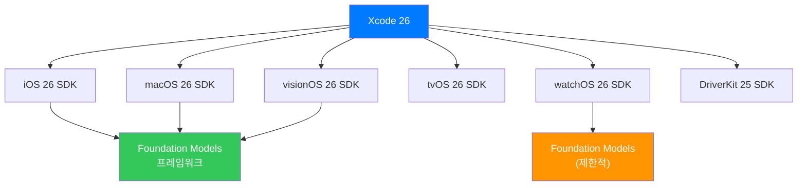
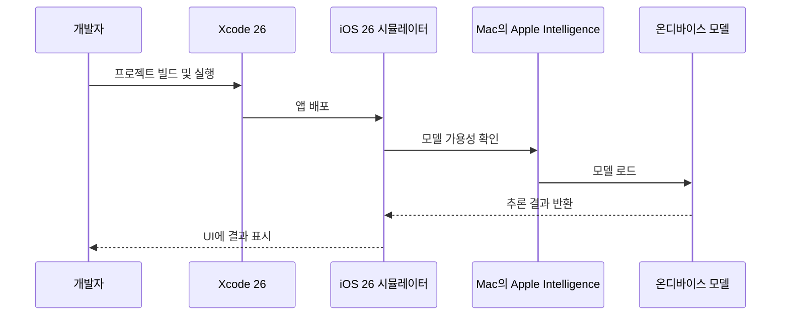
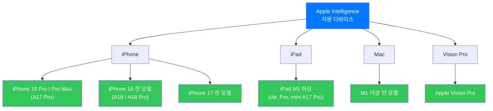
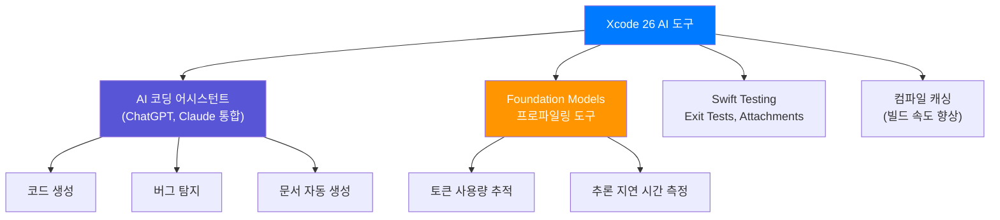
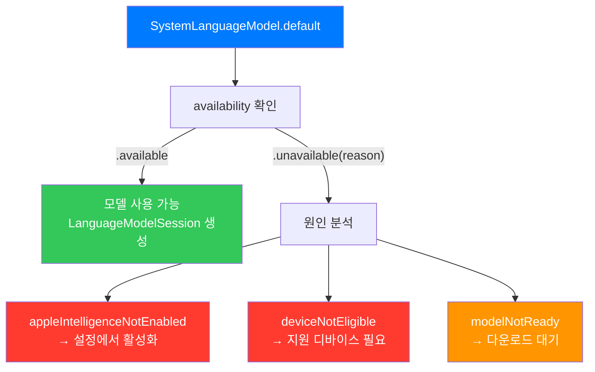

# Xcode 26과 iOS 26 SDK 설치

> Xcode 26과 iOS 26 SDK를 설치하고, Apple Intelligence 온디바이스 AI 개발을 위한 기본 환경을 구성합니다.

## 개요

이 섹션에서는 Foundation Models 프레임워크를 활용한 AI 앱 개발의 첫 단계인 개발 환경 설정을 다룹니다. Xcode 26 설치부터 시뮬레이터 구성, Apple Intelligence 지원 디바이스 확인까지 — 코드 한 줄 작성하기 전에 반드시 갖춰야 할 기반을 만들어 보겠습니다.

**선수 지식**: [Ch1. Apple Intelligence와 온디바이스 AI](01-ch1-apple-intelligence와-온디바이스-ai/01-01-apple-intelligence-개요.md)에서 다룬 Apple Intelligence의 개요와 온디바이스 AI 개념
**학습 목표**:
- Xcode 26의 시스템 요구사항을 이해하고 설치할 수 있다
- iOS 26 SDK와 시뮬레이터를 올바르게 구성한다
- Apple Intelligence 지원 디바이스 요구사항을 파악한다
- Foundation Models 프레임워크 사용 가능 여부를 코드로 확인한다

## 왜 알아야 할까?

"최고의 요리사도 칼이 없으면 요리를 시작할 수 없다"는 말이 있죠. Foundation Models 프레임워크는 iOS 26부터 사용 가능한 **완전히 새로운 API**입니다. 기존 Xcode 버전이나 iOS 18 SDK로는 아예 접근조차 할 수 없거든요.

여기서 한 가지 참고할 점이 있습니다. Apple은 역사적으로 새로운 메이저 SDK가 출시되면 **약 1년 이내에 App Store 제출 시 해당 SDK 빌드를 요구**해 왔습니다. 예를 들어 iOS 17 SDK 출시 후 이듬해부터 iOS 17 SDK 빌드가 필수가 되었죠. iOS 26 SDK도 같은 패턴을 따를 가능성이 높으니, 미리 환경을 갖춰두면 나중에 급하게 마이그레이션하는 상황을 피할 수 있습니다.

또한 Foundation Models는 **온디바이스 AI**라는 특수한 요구사항이 있습니다. 일반 API와 달리 특정 하드웨어에서만 동작하고, Apple Intelligence가 활성화되어 있어야 하며, 모델이 다운로드되어 있어야 합니다. 이런 조건들을 개발 초기에 확인해두지 않으면, 열심히 코드를 작성하고도 "왜 안 되지?"라며 시간을 허비하게 되죠.

> 📊 **그림 1**: 개발 환경 구성의 전체 흐름


## 핵심 개념

### 개념 1: Xcode 26 시스템 요구사항

> 💡 **비유**: Xcode는 목수의 작업대와 같습니다. 아무리 좋은 목재(코드)가 있어도, 작업대가 없으면 가구를 만들 수 없죠. 그런데 이번 작업대(Xcode 26)는 이전 모델보다 더 넓은 공간과 새로운 운영체제를 요구합니다.

Xcode 26은 Apple의 통합 개발 환경(IDE)의 최신 버전으로, Foundation Models 프레임워크를 포함한 iOS 26 SDK를 제공합니다. 설치하기 전에 시스템 요구사항을 반드시 확인해야 합니다.

**Xcode 26 시스템 요구사항:**

| 항목 | 요구사항 |
|------|----------|
| **macOS 버전** | macOS 26 (Tahoe) 이상 |
| **프로세서** | Apple Silicon (M1 이상) 권장 |
| **디스크 공간** | 약 35GB 이상 여유 공간 |
| **Swift 컴파일러** | Swift 6.2 포함 |
| **지원 언어 모드** | Swift 6, Swift 5, Swift 4.2, Swift 4 |

> ⚠️ **macOS 버전 참고**: 2026년부터 Apple은 모든 플랫폼의 버전 번호를 연도 기반(26)으로 통일했습니다. Xcode 26은 **macOS 26 (Tahoe)**에서 동작합니다. 이전 macOS 버전(예: macOS Sequoia 15.x)에서는 Xcode 26을 설치할 수 없으니, 반드시 macOS부터 업그레이드하세요.

> 📊 **그림 2**: Xcode 26에 포함된 SDK 구성



Xcode 26에는 **6개 플랫폼의 SDK**가 모두 포함되어 있습니다. Foundation Models 프레임워크는 iOS 26, macOS 26, visionOS 26에서 완전히 지원되며, watchOS에서는 일부 제한이 있습니다.

**설치 방법:**

1. **Mac App Store에서 설치** (권장): App Store에서 "Xcode"를 검색하여 최신 버전을 다운로드합니다.
2. **Apple Developer 사이트에서 다운로드**: [developer.apple.com/xcode](https://developer.apple.com/xcode/)에서 직접 .xip 파일을 받을 수 있습니다.
3. **xcode-select로 확인**: 여러 Xcode 버전이 설치된 경우 활성 버전을 확인합니다.

```swift
// Terminal에서 현재 Xcode 버전 확인
// xcode-select -p
// /Applications/Xcode.app/Contents/Developer

// Xcode 버전 확인
// xcodebuild -version
// Xcode 26.0
// Build version 17A5000a
```

> ⚠️ **흔한 오해**: "Intel Mac에서도 Xcode 26을 쓸 수 있지 않나요?" — Xcode 26 자체는 macOS 26이 설치된 Intel Mac에서도 실행될 수 있지만, **Foundation Models 프레임워크의 온디바이스 AI 기능은 Apple Silicon이 필수**입니다. Intel Mac에서는 시뮬레이터에서도 AI 모델이 동작하지 않습니다.

### 개념 2: iOS 26 SDK와 시뮬레이터 구성

> 💡 **비유**: 시뮬레이터는 자동차의 "드라이빙 시뮬레이터"와 비슷합니다. 실제 도로(디바이스)에 나가기 전에 안전한 환경에서 연습할 수 있죠. 다만 Foundation Models 시뮬레이터는 특별한 조건이 있습니다 — 시뮬레이터가 돌아가는 **Mac 자체에 Apple Intelligence가 켜져 있어야** 합니다.

Xcode 26을 설치하면 iOS 26 SDK가 자동으로 포함됩니다. 하지만 시뮬레이터에서 Foundation Models를 테스트하려면 추가 설정이 필요합니다.

> 📊 **그림 3**: 시뮬레이터에서의 Foundation Models 동작 구조



**시뮬레이터 설정 절차:**

1. **macOS에서 Apple Intelligence 활성화**:
   - 시스템 설정 → Apple Intelligence & Siri → Apple Intelligence 켜기
   - 모델 다운로드가 완료될 때까지 대기 (처음에는 수 GB 다운로드 필요)

2. **시뮬레이터 다운로드**:
   - Xcode → Settings → Platforms → iOS 26 시뮬레이터 다운로드
   - Apple Intelligence 지원 디바이스 시뮬레이터 선택 (iPhone 16 등)

3. **시뮬레이터에서 Apple Intelligence 확인**:
   - 시뮬레이터 실행 후 Settings → Apple Intelligence & Siri 확인

```swift
// 시뮬레이터에서 Foundation Models 테스트를 위한 최소 프로젝트 설정
// Xcode → File → New → Project → iOS → App

import SwiftUI
import FoundationModels  // iOS 26 SDK에 포함

struct ContentView: View {
    @State private var availabilityText = "확인 중..."

    var body: some View {
        VStack(spacing: 20) {
            Text("Foundation Models 상태")
                .font(.headline)
            Text(availabilityText)
                .foregroundStyle(.secondary)
        }
        .task {
            // SystemLanguageModel.default로 기본 모델에 접근
            let model = SystemLanguageModel.default
            // .availability 프로퍼티로 현재 가용성 확인
            switch model.availability {
            case .available:
                availabilityText = "✅ 모델 사용 가능"
            case .unavailable(let reason):
                availabilityText = "❌ 사용 불가: \(reason)"
            }
        }
    }
}
```

> 🔥 **실무 팁**: 시뮬레이터에서 Foundation Models를 테스트할 때, **Mac 자체에 Apple Intelligence가 활성화되어 있어야** 합니다. 시뮬레이터는 Mac의 온디바이스 모델을 빌려 쓰는 방식이거든요. Mac에서 Apple Intelligence가 꺼져 있으면 시뮬레이터에서도 `.unavailable(.appleIntelligenceNotEnabled)`가 반환됩니다.

### 개념 3: Apple Intelligence 지원 디바이스

> 💡 **비유**: Apple Intelligence는 엔진이 특정 연료만 쓸 수 있는 것과 비슷합니다. 아무리 좋은 차체(앱)를 만들어도, 엔진(Neural Engine)이 맞지 않으면 달릴 수 없죠. A17 Pro 이상의 칩이 "고급 연료"에 해당합니다.

Foundation Models 프레임워크는 Apple Intelligence 위에서 동작하기 때문에, **하드웨어 요구사항**이 명확합니다. 개발 시 타겟 디바이스를 잘 파악해야 합니다.

> 📊 **그림 4**: Apple Intelligence 지원 디바이스 맵



**디바이스별 지원 현황:**

| 디바이스 | 칩셋 요구사항 | Apple Intelligence |
|----------|-------------|-------------------|
| **iPhone** | A17 Pro 이상 | iPhone 15 Pro/Pro Max, 16 전 모델, 17 전 모델 |
| **iPad** | M1 이상 또는 A17 Pro | iPad Air M1+, iPad Pro M1+, iPad mini (A17 Pro) |
| **Mac** | M1 이상 (Apple Silicon) | 모든 M 시리즈 Mac |
| **Vision Pro** | M2 | Apple Vision Pro |

**추가 요구사항:**
- 디바이스에 **7GB 이상의 여유 저장 공간** 필요
- **Apple Intelligence가 설정에서 활성화**되어 있어야 함
- 충분한 **배터리 잔량** (저전력 모드에서는 제한될 수 있음)
- **게임 모드(Game Mode)가 아닌** 상태여야 함

### 개념 4: Xcode 26의 새로운 AI 개발 도구들

> 💡 **비유**: Xcode 26은 단순히 Foundation Models를 "쓸 수 있게" 해주는 것을 넘어, 마치 요리사에게 새로운 조리 도구 세트를 통째로 제공하는 것과 같습니다. AI 코딩 어시스턴트, 프로파일링 도구, 테스트 프레임워크까지 — 온디바이스 AI 개발에 필요한 모든 것이 한 곳에 있죠.

Xcode 26은 Foundation Models 프레임워크 지원 외에도, AI 앱 개발을 위한 여러 새로운 도구를 제공합니다.

> 📊 **그림 5**: Xcode 26의 AI 개발 도구 생태계



**주요 새 기능들:**

1. **AI 코딩 어시스턴트**: Xcode 26은 ChatGPT(GPT-4.1, GPT-5)와 Claude Sonnet 4를 IDE에 직접 통합하여 코드 생성, 버그 탐지, 문서 작성을 지원합니다.

2. **Foundation Models Instruments**: 새로운 프로파일링 도구로 온디바이스 모델의 추론 성능, 토큰 사용량, 메모리 소비를 측정할 수 있습니다.

3. **컴파일 캐싱**: Swift와 C 기반 언어의 반복 빌드 속도를 크게 향상시킵니다. AI 앱 개발 시 잦은 빌드-테스트 사이클에 특히 유용합니다.

4. **Swift 6.2**: Strict Concurrency가 기본 활성화되어 있어, `async/await` 기반의 Foundation Models API 사용 시 안전한 동시성 처리가 가능합니다.

### 개념 5: SystemLanguageModel 가용성 확인 API

> 💡 **비유**: 레스토랑에 들어가기 전에 "오늘 영업하나요?"라고 확인하는 것처럼, Foundation Models를 사용하기 전에 "지금 모델을 쓸 수 있나요?"를 반드시 확인해야 합니다. `SystemLanguageModel`이 바로 그 "영업 여부 확인 창구"입니다.

Foundation Models를 사용하기 전에 모델이 현재 디바이스에서 사용 가능한지 확인하는 것은 **필수 단계**입니다. Apple은 이를 위해 `SystemLanguageModel` API를 제공합니다.

> 📊 **그림 6**: SystemLanguageModel 가용성 확인 흐름



**API 사용 패턴:**

```swift
import FoundationModels

// 1. 기본 모델 인스턴스 가져오기
let model = SystemLanguageModel.default

// 2. availability 프로퍼티로 가용성 확인
switch model.availability {
case .available:
    // 모델 사용 가능 — 세션을 생성하고 추론 실행
    print("Foundation Models 사용 준비 완료!")

case .unavailable(let reason):
    // 사용 불가 — 원인에 따라 사용자에게 안내
    switch reason {
    case .appleIntelligenceNotEnabled:
        print("Apple Intelligence를 활성화해주세요.")
    case .deviceNotEligible:
        print("이 디바이스에서는 지원되지 않습니다.")
    case .modelNotReady:
        print("모델을 다운로드 중입니다. 잠시 후 다시 시도하세요.")
    @unknown default:
        print("알 수 없는 오류가 발생했습니다.")
    }
}
```

핵심은 **두 단계**로 나뉜다는 점입니다. 먼저 `SystemLanguageModel.default`로 기본 모델 인스턴스에 접근하고, 그 인스턴스의 `.availability` 프로퍼티를 통해 현재 상태를 확인합니다. `.available`이 반환되어야만 `LanguageModelSession`을 생성하여 실제 추론을 수행할 수 있습니다.

> 🔥 **실무 팁**: 앱에서 Foundation Models를 사용할 때, **가용성 확인 없이 바로 세션을 생성하면 안 됩니다**. 지원하지 않는 디바이스에서 앱이 크래시하거나 예기치 않은 동작을 할 수 있거든요. 항상 `availability`를 먼저 체크하고, `.unavailable`인 경우에는 사용자에게 적절한 대체 UI를 보여주세요.

## 실습: 직접 해보기

실제로 Xcode 26을 설치하고, Foundation Models 프레임워크가 정상적으로 동작하는지 확인하는 전체 과정을 따라해 보겠습니다.

### Step 1: 환경 확인 스크립트

터미널에서 현재 개발 환경이 요구사항을 충족하는지 확인합니다:

```console
# macOS 버전 확인
sw_vers

# 출력 예시:
# ProductName:    macOS
# ProductVersion: 26.0
# BuildVersion:   26A5000a

# Xcode 버전 확인
xcodebuild -version

# 출력 예시:
# Xcode 26.0
# Build version 17A5000a

# Apple Silicon 확인
uname -m

# 출력 예시:
# arm64
```

### Step 2: Foundation Models 가용성 확인 앱

새 Xcode 프로젝트를 생성하여 Foundation Models의 가용성을 확인하는 간단한 앱을 만듭니다:

```swift
import SwiftUI
import FoundationModels

// Foundation Models 가용성을 확인하는 뷰
struct EnvironmentCheckView: View {
    @State private var status: AvailabilityStatus = .checking

    enum AvailabilityStatus {
        case checking
        case available
        case unavailable(String)
    }

    var body: some View {
        NavigationStack {
            List {
                // 플랫폼 정보 섹션
                Section("플랫폼 정보") {
                    LabeledContent("iOS 버전") {
                        Text(UIDevice.current.systemVersion)
                    }
                    LabeledContent("디바이스 모델") {
                        Text(UIDevice.current.model)
                    }
                }

                // Foundation Models 상태 섹션
                Section("Foundation Models 상태") {
                    switch status {
                    case .checking:
                        ProgressView("확인 중...")
                    case .available:
                        Label("모델 사용 가능", systemImage: "checkmark.circle.fill")
                            .foregroundStyle(.green)
                    case .unavailable(let reason):
                        Label("사용 불가: \(reason)", systemImage: "xmark.circle.fill")
                            .foregroundStyle(.red)
                    }
                }

                // 다음 단계 안내
                Section("다음 단계") {
                    Text("모델이 사용 가능하면 프로젝트를 생성할 준비가 되었습니다!")
                        .font(.callout)
                        .foregroundStyle(.secondary)
                }
            }
            .navigationTitle("환경 점검")
        }
        .task {
            await checkAvailability()
        }
    }

    // 모델 가용성을 비동기로 확인하는 함수
    private func checkAvailability() async {
        // Step 1: 기본 모델 인스턴스 가져오기
        let model = SystemLanguageModel.default
        // Step 2: availability 프로퍼티로 상태 확인
        switch model.availability {
        case .available:
            status = .available
        case .unavailable(let reason):
            let reasonText: String
            switch reason {
            case .appleIntelligenceNotEnabled:
                reasonText = "Apple Intelligence가 비활성화됨"
            case .deviceNotEligible:
                reasonText = "이 디바이스에서 지원하지 않음"
            case .modelNotReady:
                reasonText = "모델 다운로드 중..."
            @unknown default:
                reasonText = "알 수 없는 이유"
            }
            status = .unavailable(reasonText)
        }
    }
}

#Preview {
    EnvironmentCheckView()
}
```

### Step 3: 간단한 텍스트 생성 테스트

가용성이 확인되었다면, 실제로 모델에 간단한 요청을 보내봅니다:

```run:swift
import FoundationModels

// 세션 생성 및 간단한 텍스트 생성
let session = LanguageModelSession()
let response = try await session.respond(to: "안녕하세요, 자기소개를 한 줄로 해주세요.")
print(response.content)
```

```output
안녕하세요! 저는 Apple의 온디바이스 AI 어시스턴트입니다.
```

> 🔥 **실무 팁**: 처음 `respond(to:)` 호출 시 모델 로딩으로 몇 초가 걸릴 수 있습니다. 앱 시작 시 `session.prewarm()`을 호출하면 사용자가 실제 요청할 때 더 빠른 응답을 받을 수 있습니다.

## 더 깊이 알아보기

### Xcode의 진화 — 20년의 여정

Xcode의 역사를 아시나요? 2003년 WWDC에서 스티브 잡스가 처음 Xcode를 공개했을 때, 그것은 단순히 Project Builder의 후계자에 불과했습니다. 당시 Mac 개발자들은 "또 다른 IDE?"라며 회의적이었죠.

하지만 Apple은 Xcode를 꾸준히 발전시켰습니다. Xcode 4(2011)에서 Interface Builder를 통합하고, Xcode 6(2014)에서 Swift 언어를 도입하고, Xcode 11(2019)에서 SwiftUI 프리뷰를 추가했습니다. 매번 "이전 버전이 더 좋았다"는 불만이 있었지만, 결국 새 도구가 표준이 되었죠.

Xcode 26은 이 여정의 가장 혁신적인 단계입니다. **IDE 자체에 LLM이 통합**되고, 앱 개발자가 **온디바이스 AI를 네이티브 프레임워크로 활용**할 수 있게 된 것은 iOS 생태계의 패러다임 전환이라 할 수 있습니다.

### iOS 버전 번호의 비밀

흥미롭게도 Apple은 iOS 15 이후로 매년 1씩 올리던 버전 번호를 iOS 18 다음에 iOS 26으로 점프시켰습니다. 이는 macOS, watchOS, tvOS 등 **모든 Apple 플랫폼의 버전 번호를 26(2026년)으로 통일**하기 위한 결정이었습니다. 개발자 입장에서는 "iOS 26이면 macOS 26, watchOS 26, tvOS 26과 같은 세대"라는 것을 직관적으로 알 수 있게 되었죠.

## 흔한 오해와 팁

> ⚠️ **흔한 오해**: "시뮬레이터에서 Foundation Models가 안 된다면 디바이스가 필요한 건가요?" — 아닙니다! 시뮬레이터에서도 Foundation Models를 테스트할 수 있습니다. 단, **Mac에 Apple Intelligence가 켜져 있어야** 하고, Mac이 **Apple Silicon(M1 이상)**이어야 합니다. 시뮬레이터는 Mac의 온디바이스 모델을 활용하는 방식이기 때문입니다.

> 💡 **알고 계셨나요?**: Xcode 26에 통합된 AI 코딩 어시스턴트는 하나의 LLM만 쓰는 게 아닙니다. **ChatGPT(GPT-4.1, GPT-5)**와 **Claude Sonnet 4** 등 여러 모델 중에서 선택할 수 있으며, 복잡한 추론에는 GPT-5 Reasoning을 사용하도록 설정할 수도 있습니다. Xcode Settings → Intelligence에서 변경 가능합니다.

> 🔥 **실무 팁**: 여러 버전의 Xcode를 동시에 유지해야 하는 경우, `/Applications/Xcode-26.app`처럼 이름을 바꿔서 설치하고 `xcode-select -s` 명령으로 활성 버전을 전환하세요. Foundation Models 개발 시에는 반드시 Xcode 26이 활성 상태여야 합니다.

> 🔥 **실무 팁**: Apple은 일반적으로 새 SDK 출시 후 약 1년 이내에 App Store 제출 시 해당 SDK 빌드를 요구합니다. 기존 프로젝트의 iOS 26 SDK 마이그레이션은 일찍 시작하는 것이 좋습니다. 특히 SceneKit을 사용 중이라면 RealityKit으로의 전환을 계획해야 합니다 — SceneKit은 Xcode 26에서 공식적으로 deprecated되었습니다.

## 핵심 정리

| 개념 | 설명 |
|------|------|
| **Xcode 26 요구사항** | macOS 26 (Tahoe) 이상, Apple Silicon 권장 |
| **포함 SDK** | iOS 26, macOS 26, watchOS 26, tvOS 26, visionOS 26 |
| **Swift 버전** | Swift 6.2 (Strict Concurrency 기본 활성화) |
| **시뮬레이터 AI 테스트** | Mac에 Apple Intelligence 활성화 필수 |
| **iPhone 지원** | A17 Pro 이상 (iPhone 15 Pro/Pro Max, 16 전 모델) |
| **iPad 지원** | M1 이상 또는 A17 Pro |
| **Mac 지원** | M1 이상 Apple Silicon |
| **추가 요구사항** | 7GB 여유 공간, Apple Intelligence 활성화, 충분한 배터리 |
| **App Store SDK 요구** | Apple은 통상 새 SDK 출시 후 약 1년 내 필수 적용 |
| **가용성 확인** | `SystemLanguageModel.default`의 `.availability` 프로퍼티 사용 |

## 다음 섹션 미리보기

환경이 준비되었으니, 이제 실제로 Foundation Models를 사용하는 **Xcode 프로젝트를 처음부터 생성**해보겠습니다. [다음 섹션 "Foundation Models 프로젝트 생성"](02-ch2-개발-환경-설정/02-02-foundation-models-프로젝트-생성.md)에서는 프로젝트 설정, `import FoundationModels` 구성, 그리고 첫 번째 AI 기능을 SwiftUI 앱에 통합하는 과정을 단계별로 진행합니다.

## 참고 자료

- [Xcode System Requirements — Apple Developer](https://developer.apple.com/xcode/system-requirements/) - Xcode 26의 공식 시스템 요구사항과 포함 SDK 목록
- [How to get Apple Intelligence — Apple Support](https://support.apple.com/en-us/121115) - Apple Intelligence 지원 디바이스 및 활성화 방법 공식 가이드
- [Getting Started with Apple's Foundation Models — Artem Novichkov](https://artemnovichkov.com/blog/getting-started-with-apple-foundation-models) - Foundation Models 프레임워크 설정과 가용성 확인 실전 가이드
- [Meet the Foundation Models framework — WWDC25](https://developer.apple.com/videos/play/wwdc2025/286/) - Foundation Models 프레임워크를 소개하는 Apple 공식 세션 영상
- [Xcode 26 Key Features — DEV Community](https://dev.to/arshtechpro/xcode-26-release-notes-summary-key-features-for-developers-5ck0) - Xcode 26의 주요 새 기능과 변경사항 정리