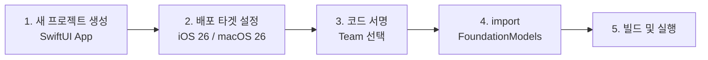
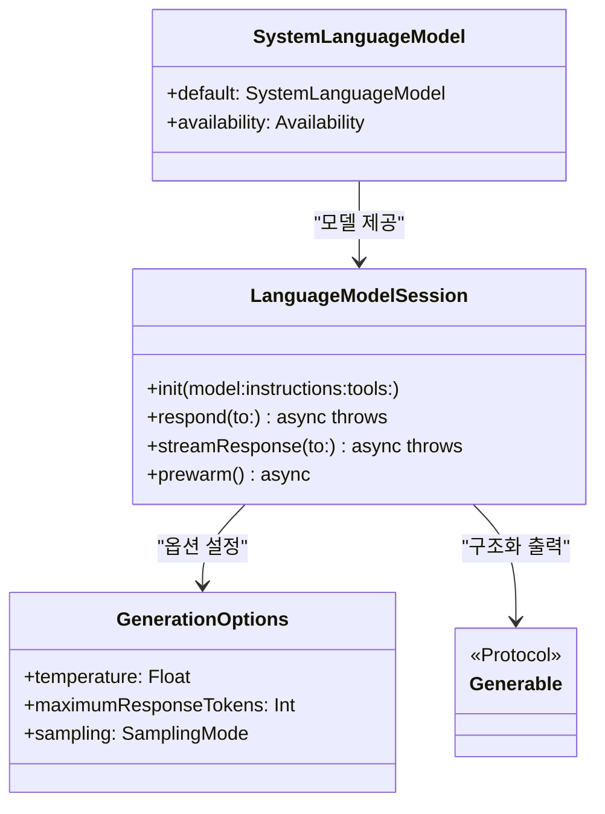
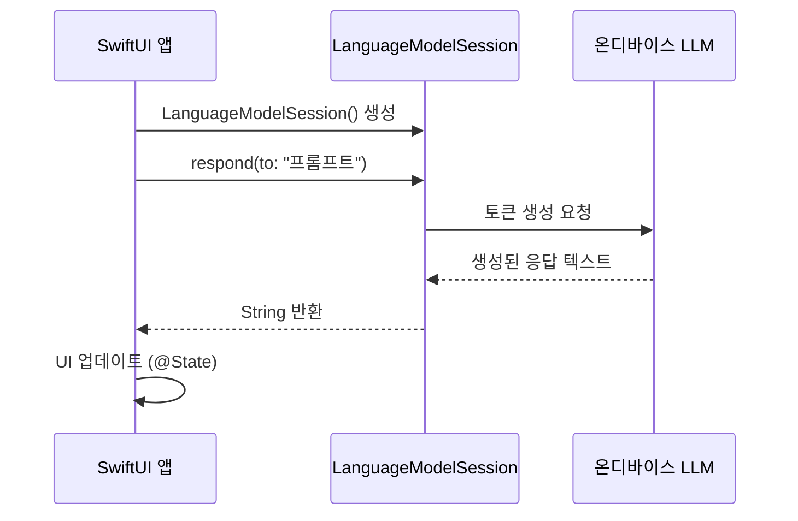
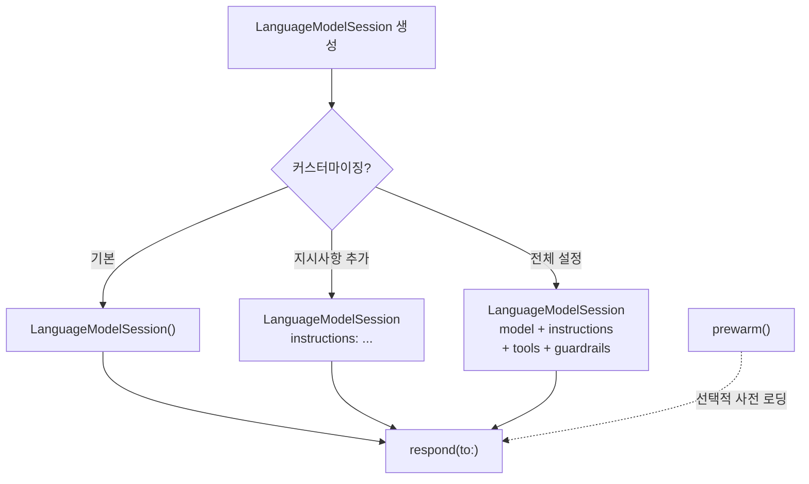
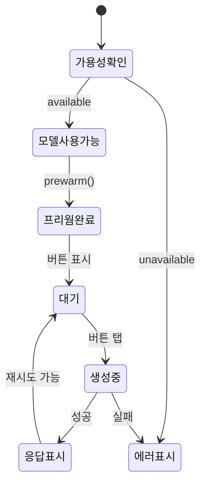

# Foundation Models 프로젝트 생성

> 새 Xcode 프로젝트를 생성하고 Foundation Models 프레임워크를 임포트하여 첫 번째 온디바이스 AI 앱을 빌드합니다.

## 개요

이 섹션에서는 Xcode 26에서 새 프로젝트를 생성하고, Foundation Models 프레임워크를 임포트하여 실제로 빌드하고 실행하는 전 과정을 다룹니다. [이전 섹션](02-개발-환경-설정/01-xcode-26과-ios-26-sdk-설치.md)에서 설치한 Xcode 26과 iOS 26 SDK를 기반으로 합니다.

**선수 지식**: Xcode 26 설치 완료, iOS 26 시뮬레이터 설정, Apple Intelligence 활성화 ([01. Xcode 26과 iOS 26 SDK 설치](02-개발-환경-설정/01-xcode-26과-ios-26-sdk-설치.md) 참고)

**학습 목표**:
- Xcode 26에서 Foundation Models용 SwiftUI 프로젝트를 생성할 수 있다
- `import FoundationModels` 구문을 추가하고 프레임워크 의존성을 이해한다
- 최소 배포 타겟과 코드 서명 설정을 올바르게 구성한다
- 첫 번째 AI 응답을 받아 화면에 표시하는 앱을 빌드하고 실행한다

## 왜 알아야 할까?

아무리 뛰어난 프레임워크라도 프로젝트 설정이 잘못되면 한 줄의 코드도 실행할 수 없습니다. Foundation Models 프레임워크는 일반적인 iOS 프레임워크와 달리 **온디바이스 AI 모델**에 의존하기 때문에, 단순히 `import`만 추가한다고 끝나는 게 아니거든요. 배포 타겟, 코드 서명, 모델 가용성 확인까지 — 처음 한 번만 제대로 세팅해두면 이후 모든 AI 기능 개발이 매끄럽게 진행됩니다.

실제로 많은 개발자들이 WWDC25 직후 "빌드는 되는데 왜 모델이 안 되지?"라는 문제를 겪었는데, 대부분 이 초기 설정 과정의 작은 누락 때문이었습니다. 이 섹션에서 그런 실수를 미리 방지해봅시다.

## 핵심 개념

### 개념 1: 프로젝트 생성과 기본 구성

> 💡 **비유**: 새 집을 짓기 전에 설계도(프로젝트 템플릿)를 선택하고, 전기·수도(프레임워크)를 연결하고, 건축 허가(코드 서명)를 받는 것과 같습니다. 이 세 가지가 갖춰져야 비로소 집(앱)에서 생활(AI 기능 사용)할 수 있죠.

Foundation Models를 사용하는 프로젝트를 만드는 과정은 크게 다섯 단계로 나뉩니다.

> 📊 **그림 1**: Foundation Models 프로젝트 생성 워크플로



**Step 1: 새 프로젝트 생성**

Xcode 26을 열고 `File > New > Project...` (⇧⌘N)를 선택합니다.

1. **플랫폼**: iOS (또는 Multiplatform)
2. **템플릿**: App
3. **Product Name**: `AIFirstApp` (원하는 이름)
4. **Interface**: SwiftUI
5. **Language**: Swift
6. **Storage**: None (이 단계에선 불필요)
7. **Testing System**: Swift Testing

```swift
// Xcode가 자동 생성하는 기본 구조
// AIFirstApp/
// ├── AIFirstAppApp.swift     // @main 진입점
// ├── ContentView.swift       // 메인 뷰
// └── Assets.xcassets         // 에셋 카탈로그
```

**Step 2: 최소 배포 타겟 설정**

Foundation Models 프레임워크는 **iOS 26 / macOS 26 / iPadOS 26 / visionOS 26** 이상에서만 사용할 수 있습니다. 프로젝트 설정에서 배포 타겟을 확인하세요.

1. Project Navigator에서 프로젝트 파일(맨 위 파란 아이콘) 클릭
2. **TARGETS** > `AIFirstApp` 선택
3. **General** 탭 > **Minimum Deployments**
4. iOS를 **26.0**으로 설정

> ⚠️ **흔한 오해**: "iOS 18에서도 Foundation Models를 쓸 수 있지 않나요?" — 아닙니다. Foundation Models 프레임워크는 iOS 26(2025년 가을 출시)부터 도입된 완전히 새로운 프레임워크입니다. 이전 버전의 iOS에서는 `import FoundationModels` 자체가 컴파일 에러를 발생시킵니다.

**Step 3: 코드 서명 (Signing)**

Foundation Models는 디바이스의 Apple Intelligence 시스템과 상호작용하므로, 유효한 개발자 서명이 필요합니다.

1. **TARGETS** > `AIFirstApp` 선택
2. **Signing & Capabilities** 탭 이동
3. **Team** 드롭다운에서 본인의 개발자 팀 선택
4. **Bundle Identifier**가 고유한지 확인

> 🔥 **실무 팁**: 무료 Apple ID로도 개발과 시뮬레이터 테스트가 가능합니다. 다만 실제 디바이스 배포 시에는 Apple Developer Program 멤버십이 필요하죠. 시뮬레이터에서 Foundation Models를 테스트할 때는 무료 계정으로 충분합니다.

**Step 4: import FoundationModels 추가**

`ContentView.swift`를 열고 파일 상단에 `import FoundationModels`를 추가합니다. 이것으로 프레임워크의 모든 핵심 타입에 접근할 수 있게 됩니다. 자세한 내용은 바로 다음 개념에서 설명합니다.

**Step 5: 빌드 및 실행**

실행 대상을 iOS 26 시뮬레이터 또는 My Mac으로 선택하고 `⌘R`로 빌드합니다. 빌드가 성공하면 프로젝트 설정이 올바르게 완료된 것입니다.

### 개념 2: import FoundationModels의 의미

> 💡 **비유**: `import FoundationModels`는 식당에서 주방장(온디바이스 LLM)에게 주문서를 보낼 수 있는 통신 채널을 여는 것과 같습니다. import 없이는 주방장이 있다는 걸 알지도 못하고, import 후에야 메뉴(API)를 보고 주문(요청)을 넣을 수 있게 되죠.

`import FoundationModels`는 단순히 라이브러리를 가져오는 것 이상의 의미를 가집니다. 이 한 줄로 다음 핵심 타입들에 접근할 수 있게 됩니다.

> 📊 **그림 2**: Foundation Models 프레임워크의 핵심 타입 계층



```swift
import FoundationModels

// 이 import 하나로 사용 가능한 핵심 타입들:
// - SystemLanguageModel: 온디바이스 모델 접근 진입점
// - LanguageModelSession: 대화 세션 생성 및 관리
// - GenerationOptions: 생성 파라미터 제어
// - @Generable, @Guide: 구조화 출력 매크로
// - Tool 프로토콜: 외부 기능 연동
```

여기서 중요한 점이 있습니다. Foundation Models는 **시스템 프레임워크**이기 때문에 Swift Package Manager로 별도 의존성을 추가할 필요가 없습니다. UIKit이나 SwiftUI처럼 Xcode에 이미 포함되어 있거든요. `import` 한 줄이면 끝입니다.

### 개념 3: 첫 번째 빌드와 실행

> 💡 **비유**: 새로 개통한 전화기로 첫 통화를 거는 순간과 같습니다. 번호를 누르고(프롬프트 전송), 연결음을 기다리고(async/await), 상대방의 목소리를 듣는(응답 수신) 과정이죠.

프로젝트 설정이 완료되었으니, 이제 실제로 Foundation Models에 첫 요청을 보내봅시다. 핵심 흐름은 아래와 같습니다.

> 📊 **그림 3**: 첫 번째 AI 요청의 실행 흐름



가장 간단한 형태의 AI 앱 코드를 작성해봅시다.

```swift
import SwiftUI
import FoundationModels

struct ContentView: View {
    // 모델 응답을 저장할 상태 변수
    @State private var response: String = ""
    // 로딩 상태 추적
    @State private var isLoading: Bool = false
    
    var body: some View {
        VStack(spacing: 20) {
            Text("Foundation Models 첫 걸음")
                .font(.title)
            
            // AI 응답 요청 버튼
            Button("AI에게 인사하기") {
                Task {
                    await generateGreeting()
                }
            }
            .buttonStyle(.borderedProminent)
            .disabled(isLoading)
            
            if isLoading {
                ProgressView("생성 중...")
            }
            
            // 응답 표시 영역
            if !response.isEmpty {
                Text(response)
                    .padding()
                    .background(.ultraThinMaterial)
                    .clipShape(RoundedRectangle(cornerRadius: 12))
            }
        }
        .padding()
    }
    
    // AI 응답 생성 함수
    func generateGreeting() async {
        isLoading = true
        defer { isLoading = false }
        
        do {
            // 1. 세션 생성 — 가장 기본적인 형태
            let session = LanguageModelSession()
            
            // 2. 프롬프트 전송 및 응답 수신
            let result = try await session.respond(
                to: "Swift 개발자에게 보내는 짧은 환영 인사를 만들어주세요."
            )
            
            // 3. 응답 텍스트를 UI에 반영
            response = result.content
        } catch {
            response = "오류 발생: \(error.localizedDescription)"
        }
    }
}
```

**빌드 및 실행** 순서:

1. 실행 대상(Run Destination)을 **iOS 26 시뮬레이터** 또는 **My Mac**으로 선택
2. `⌘R`로 빌드 및 실행
3. "AI에게 인사하기" 버튼을 탭
4. 몇 초 후 온디바이스 모델이 생성한 환영 인사가 화면에 표시됩니다

### 개념 4: 세션 커스터마이징 — instructions와 prewarm

기본 세션도 잘 동작하지만, 실제 앱에서는 **시스템 지시사항(instructions)**을 추가하여 모델의 역할을 정의하고, **prewarm**으로 응답 시간을 단축하는 것이 일반적입니다.

> 📊 **그림 4**: LanguageModelSession 초기화 옵션



```swift
import SwiftUI
import FoundationModels

struct ContentView: View {
    // instructions로 모델의 역할 정의
    @State private var session = LanguageModelSession(
        instructions: "당신은 친절한 Swift 튜터입니다. 초보자도 이해할 수 있게 설명해주세요."
    )
    @State private var answer: String = ""
    
    var body: some View {
        VStack(spacing: 16) {
            Text("Swift 튜터")
                .font(.largeTitle.bold())
            
            Button("옵셔널이 뭔가요?") {
                Task {
                    do {
                        let result = try await session.respond(
                            to: "Swift에서 옵셔널(Optional)이 뭔지 한 문단으로 설명해주세요."
                        )
                        answer = result.content
                    } catch {
                        answer = "오류: \(error.localizedDescription)"
                    }
                }
            }
            .buttonStyle(.borderedProminent)
            
            ScrollView {
                Text(answer)
                    .padding()
            }
        }
        .padding()
        .task {
            // 뷰가 나타날 때 모델을 미리 메모리에 로드
            // 사용자가 버튼을 누를 때 응답 지연을 줄여줍니다
            try? await session.prewarm()
        }
    }
}
```

`prewarm()`은 모델 리소스를 미리 메모리에 로드하는 함수입니다. 사용자가 AI 기능을 사용할 가능성이 높은 화면에 진입했을 때 호출하면, 실제 요청 시 **첫 응답 시간(Time to First Token)**을 크게 단축할 수 있습니다.

## 실습: 직접 해보기

지금까지 배운 내용을 종합하여, 모델 가용성 확인부터 응답 수신까지 완전한 앱을 만들어봅시다.

```swift
import SwiftUI
import FoundationModels

// MARK: - 메인 앱 진입점
@main
struct AIFirstAppApp: App {
    var body: some Scene {
        WindowGroup {
            AIGreetingView()
        }
    }
}

// MARK: - AI 인사 생성 뷰
struct AIGreetingView: View {
    @State private var session: LanguageModelSession?
    @State private var greeting: String = ""
    @State private var isLoading = false
    @State private var errorMessage: String?
    
    // 온디바이스 모델 접근점
    private let model = SystemLanguageModel.default
    
    var body: some View {
        NavigationStack {
            VStack(spacing: 24) {
                // 모델 가용성에 따른 분기 UI
                switch model.availability {
                case .available:
                    availableView
                    
                case .unavailable(.deviceNotEligible):
                    unavailableView(
                        icon: "iphone.slash",
                        message: "이 기기에서는 Apple Intelligence를 지원하지 않습니다."
                    )
                    
                case .unavailable(.appleIntelligenceNotEnabled):
                    unavailableView(
                        icon: "brain",
                        message: "설정 > Apple Intelligence에서 기능을 활성화해주세요."
                    )
                    
                case .unavailable(.modelNotReady):
                    unavailableView(
                        icon: "arrow.down.circle",
                        message: "모델이 아직 준비되지 않았습니다. 잠시 후 다시 시도해주세요."
                    )
                    
                case .unavailable(_):
                    unavailableView(
                        icon: "exclamationmark.triangle",
                        message: "알 수 없는 이유로 모델을 사용할 수 없습니다."
                    )
                }
            }
            .padding()
            .navigationTitle("AI First App")
        }
    }
    
    // 모델 사용 가능 시 보여줄 뷰
    private var availableView: some View {
        VStack(spacing: 20) {
            Image(systemName: "sparkles")
                .font(.system(size: 60))
                .foregroundStyle(.purple.gradient)
            
            Text("Foundation Models 준비 완료!")
                .font(.headline)
            
            // 인사 생성 버튼
            Button {
                Task { await generateGreeting() }
            } label: {
                Label("AI 인사 생성", systemImage: "wand.and.stars")
                    .frame(maxWidth: .infinity)
            }
            .buttonStyle(.borderedProminent)
            .tint(.purple)
            .disabled(isLoading)
            
            // 로딩 인디케이터
            if isLoading {
                ProgressView("온디바이스 모델이 생성 중...")
                    .padding()
            }
            
            // 에러 메시지
            if let errorMessage {
                Text(errorMessage)
                    .foregroundStyle(.red)
                    .font(.caption)
            }
            
            // AI 응답 표시
            if !greeting.isEmpty {
                Text(greeting)
                    .padding()
                    .frame(maxWidth: .infinity)
                    .background(.purple.opacity(0.1))
                    .clipShape(RoundedRectangle(cornerRadius: 16))
                    .transition(.opacity.combined(with: .scale))
                    .animation(.easeInOut, value: greeting)
            }
        }
        .task {
            // 뷰 진입 시 세션 초기화 + 프리웜
            await setupSession()
        }
    }
    
    // 모델 사용 불가 시 보여줄 뷰
    private func unavailableView(icon: String, message: String) -> some View {
        VStack(spacing: 12) {
            Image(systemName: icon)
                .font(.system(size: 48))
                .foregroundStyle(.secondary)
            Text(message)
                .multilineTextAlignment(.center)
                .foregroundStyle(.secondary)
        }
    }
    
    // 세션 초기화 및 프리웜
    private func setupSession() async {
        let newSession = LanguageModelSession(
            instructions: """
            당신은 iOS 개발자를 위한 친절한 AI 어시스턴트입니다.
            항상 한국어로 대답하고, 개발자를 격려하는 톤으로 말해주세요.
            """
        )
        
        // 모델 리소스를 미리 로드하여 첫 응답 지연을 줄임
        try? await newSession.prewarm()
        session = newSession
    }
    
    // AI 인사 생성
    private func generateGreeting() async {
        guard let session else { return }
        
        isLoading = true
        errorMessage = nil
        defer { isLoading = false }
        
        do {
            let result = try await session.respond(
                to: "새로 Foundation Models를 배우기 시작한 Swift 개발자에게 격려의 인사를 한 문단으로 해주세요."
            )
            greeting = result.content
        } catch {
            errorMessage = "생성 실패: \(error.localizedDescription)"
        }
    }
}
```

**실행 방법**:

1. Xcode에서 `⌘N`으로 새 SwiftUI View 파일을 생성하거나, 기존 `ContentView.swift`를 위 코드로 교체
2. 시뮬레이터 또는 Mac을 실행 대상으로 선택
3. `⌘R`로 빌드 및 실행
4. 화면에서 "AI 인사 생성" 버튼을 탭하면 온디바이스 모델이 생성한 인사가 표시됩니다

> 📊 **그림 5**: 실습 앱의 상태 흐름



## 더 깊이 알아보기

### Foundation Models 프레임워크의 탄생 배경

Apple이 Foundation Models 프레임워크를 WWDC25에서 공개한 것은 사실 수년간의 준비 끝에 이루어진 일입니다. Apple은 2017년 Core ML을 시작으로 온디바이스 ML 생태계를 구축해왔는데요, 당시에는 "사전 학습된 모델을 가져와서 추론에 사용한다"는 패러다임이었습니다.

하지만 2022년 ChatGPT의 등장 이후 LLM 시대가 열리면서, Apple도 자사 플랫폼에 범용 언어 모델을 통합해야 한다는 압박을 받게 됩니다. 2024년 WWDC24에서 Apple Intelligence를 발표하며 온디바이스 AI의 방향을 선보였지만, 개발자들이 직접 이 모델에 접근할 수 있는 API는 없었습니다. 사용자 입장에서는 Siri가 좋아졌고 Writing Tools가 생겼지만, 서드파티 개발자들은 "우리도 이 모델을 쓰고 싶다!"는 열망이 있었죠.

그 결과물이 바로 Foundation Models 프레임워크입니다. Apple은 **약 3B 파라미터의 온디바이스 모델**을 기기에 내장하고, 이를 Swift 네이티브 API로 래핑하여 개발자에게 제공했습니다. `import FoundationModels` 한 줄이면 수십억 개의 파라미터를 가진 언어 모델과 대화할 수 있게 된 거죠. 이것은 마치 2007년 iPhone SDK가 서드파티 앱 개발을 열었던 것처럼, AI 시대의 새로운 플랫폼 개방이라 할 수 있습니다.

### 왜 별도 Entitlement가 필요 없을까?

흥미롭게도 Foundation Models 프레임워크의 기본 사용에는 **별도의 Entitlement나 Capability 추가가 필요 없습니다**. 이는 Apple의 의도적인 설계 결정인데요 — `UIKit`이나 `SwiftUI`를 사용할 때 별도 권한이 필요 없듯이, Foundation Models도 플랫폼의 기본 기능으로 취급한다는 것입니다. 코드 서명(Team 선택)만 올바르게 설정하면 바로 사용할 수 있습니다.

단, **어댑터(Adapter)**를 커스텀 학습하여 프로덕션에 배포하려면 별도의 Foundation Models Framework Adapter Entitlement를 요청해야 합니다. 이 부분은 고급 주제이므로 이 코스에서는 다루지 않습니다.

## 흔한 오해와 팁

> ⚠️ **흔한 오해**: "Foundation Models를 쓰려면 SPM(Swift Package Manager)으로 패키지를 추가해야 한다" — 아닙니다! Foundation Models는 UIKit, SwiftUI처럼 **시스템 프레임워크**입니다. `import FoundationModels` 한 줄이면 끝이고, Package.swift나 Xcode의 Package Dependencies에 아무것도 추가할 필요가 없습니다.

> 💡 **알고 계셨나요?**: `LanguageModelSession`의 `prewarm()` 함수는 내부적으로 모델 가중치를 Neural Engine(ANE)의 메모리에 미리 올려놓는 작업을 수행합니다. Apple Silicon의 통합 메모리 아키텍처 덕분에 CPU, GPU, ANE가 같은 메모리 풀을 공유하므로, 프리웜 후에는 별도의 데이터 복사 없이 즉시 추론을 시작할 수 있죠. 이것이 Apple이 온디바이스 AI에서 가지는 하드웨어-소프트웨어 통합의 핵심 이점입니다.

> 🔥 **실무 팁**: 개발 초기에는 **Xcode의 #Playground 매크로**를 활용하면 프로젝트를 만들지 않고도 Foundation Models를 빠르게 실험할 수 있습니다. `import Playgrounds`와 `import FoundationModels`를 함께 사용하면, 코드를 수정할 때마다 실시간으로 결과를 확인할 수 있어 프롬프트 실험에 매우 유용합니다.

> 🔥 **실무 팁**: `LanguageModelSession`을 `@State`로 선언할 때, 뷰가 재생성되면 세션도 초기화되어 이전 대화 맥락이 사라질 수 있습니다. 멀티턴 대화가 필요한 경우에는 세션을 `@State`가 아닌 별도의 ViewModel이나 서비스 레이어에서 관리하는 것이 좋습니다. 이 패턴은 [Ch9. 세션 관리와 멀티턴 대화](09-세션-관리와-멀티턴-대화/01-멀티턴-대화의-컨텍스트-관리.md)에서 자세히 다룹니다.

## 핵심 정리

| 개념 | 설명 |
|------|------|
| 프로젝트 생성 | SwiftUI App 템플릿, iOS 26 이상 배포 타겟 설정 |
| import 구문 | `import FoundationModels` — 시스템 프레임워크이므로 SPM 추가 불필요 |
| 코드 서명 | Signing & Capabilities에서 Team 선택 필수, 별도 Entitlement 불필요 |
| LanguageModelSession | 세션 생성 → `respond(to:)` → 응답 수신의 3단계 흐름 |
| instructions | 세션 생성 시 모델의 역할과 행동 지침을 문자열로 지정 |
| prewarm() | 모델 리소스를 미리 로드하여 첫 응답 지연 단축 |
| 모델 가용성 | `SystemLanguageModel.default.availability`로 사전 확인 필수 |
| 에러 처리 | `do-catch`로 `respond` 호출을 감싸고, 사용자에게 의미 있는 메시지 표시 |

## 다음 섹션 미리보기

프로젝트를 생성하고 첫 AI 응답을 받는 데 성공했습니다! 하지만 실제 앱에서는 모델이 항상 사용 가능하리라고 가정할 수 없습니다. 기기가 지원하지 않거나, Apple Intelligence가 비활성화되어 있거나, 모델이 아직 다운로드 중일 수도 있죠. [다음 섹션 — 03. 모델 가용성 확인과 폴백 전략](02-개발-환경-설정/03-모델-가용성-확인과-폴백-전략.md)에서는 이런 다양한 시나리오를 우아하게 처리하는 방법과, AI가 불가능할 때의 대안(fallback) 전략을 깊이 있게 다룹니다.

## 참고 자료

- [Foundation Models — Apple Developer Documentation](https://developer.apple.com/documentation/FoundationModels) - Foundation Models 프레임워크의 공식 API 레퍼런스. 모든 클래스, 프로토콜, 매크로의 상세 설명
- [Meet the Foundation Models framework — WWDC25](https://developer.apple.com/videos/play/wwdc2025/286/) - Foundation Models 프레임워크를 소개하는 공식 WWDC25 세션. 프레임워크의 설계 철학과 기본 사용법
- [Code-along: Bring on-device AI to your app — WWDC25](https://developer.apple.com/videos/play/wwdc2025/259/) - Apple 공식 Code-Along 세션. 프로젝트 생성부터 AI 기능 통합까지 단계별 실습
- [Foundation Models Code-Along Instructions](https://developer.apple.com/events/resources/code-along-205/) - WWDC25 Code-Along의 단계별 텍스트 지시사항과 스타터 프로젝트 다운로드
- [Getting Started with Apple's Foundation Models — Artem Novichkov](https://artemnovichkov.com/blog/getting-started-with-apple-foundation-models) - Foundation Models의 가용성 확인, 세션 생성, instructions 설정 등 실전 가이드
- [The Ultimate Guide To The Foundation Models Framework — AzamSharp](https://azamsharp.com/2025/06/18/the-ultimate-guide-to-the-foundation-models-framework.html) - prewarm, @Generable, Tool Calling까지 아우르는 포괄적인 튜토리얼
- [Exploring the Foundation Models framework — Create with Swift](https://www.createwithswift.com/exploring-the-foundation-models-framework/) - SystemLanguageModel, LanguageModelSession, GenerationOptions의 체계적 탐구

---
### 🔗 Related Sessions
- [systemlanguagemodel.availability](03-ch3-foundation-models-프레임워크-시작하기/01-01-systemlanguagemodel-이해하기.md) (prerequisite)
