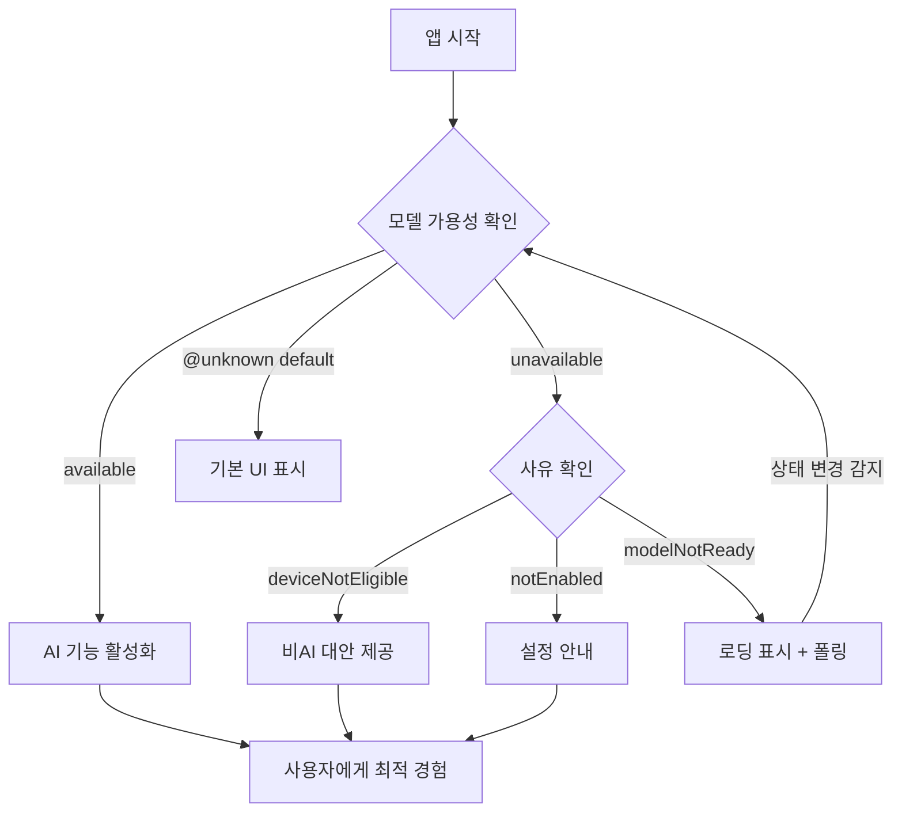
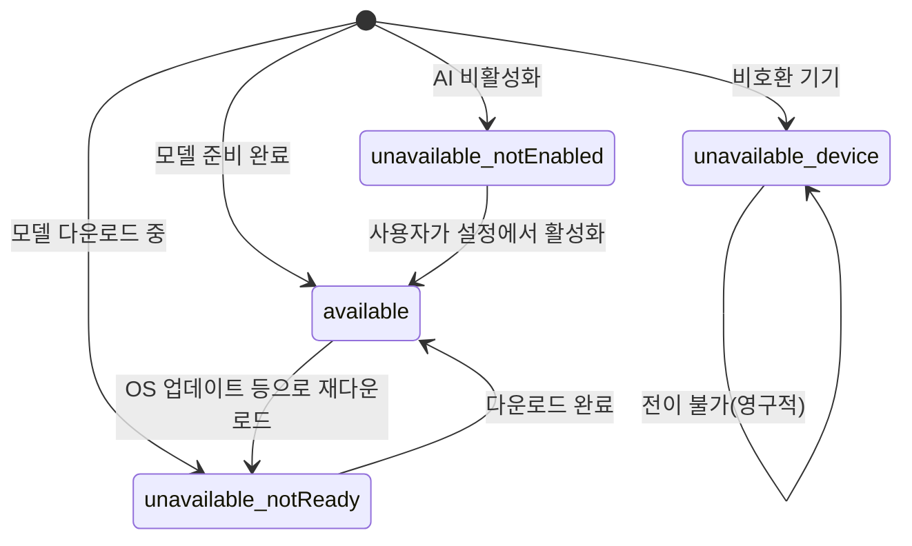
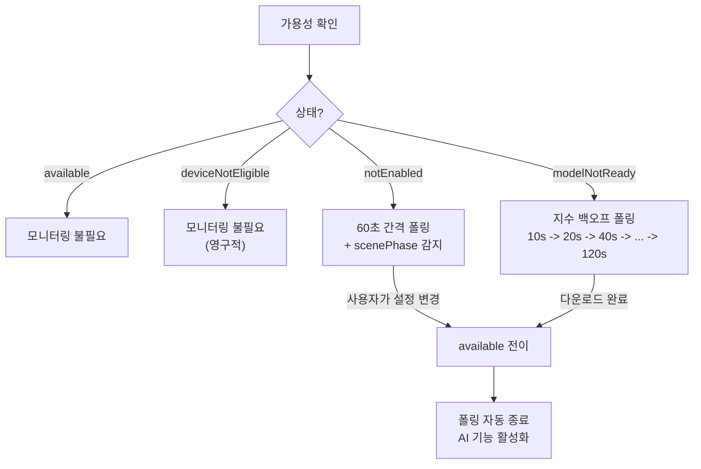
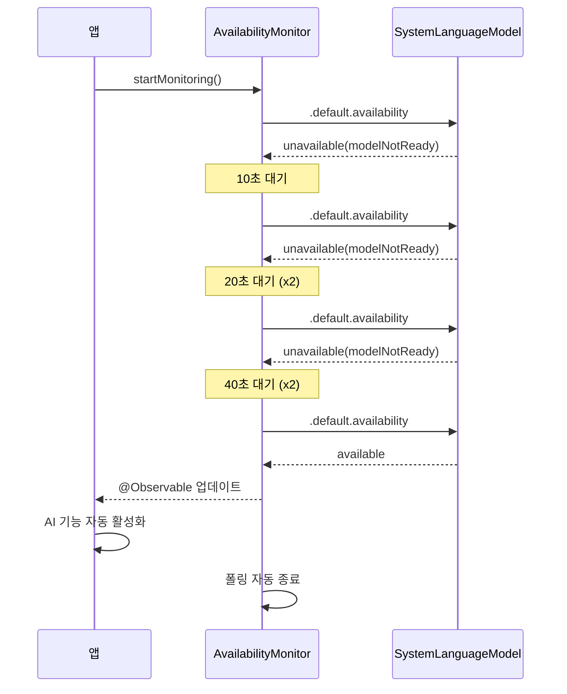
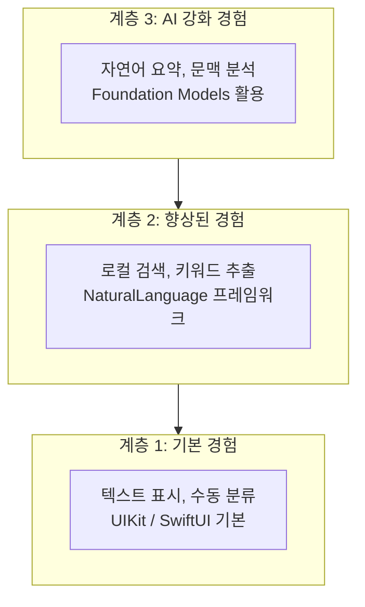
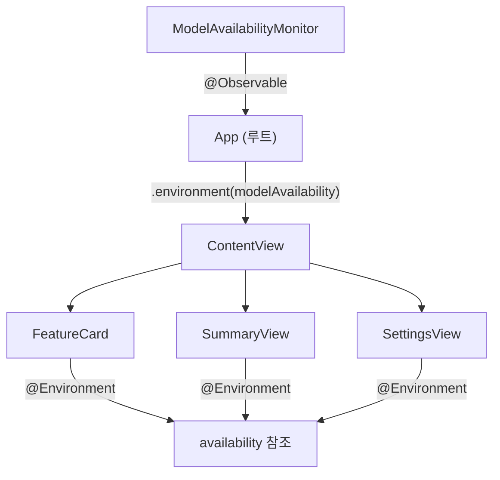

# 03. 모델 가용성 확인과 폴백 전략

> Apple Foundation Models의 가용성을 확인하고, 모델을 사용할 수 없는 상황에서도 앱이 우아하게 동작하도록 폴백 전략을 설계합니다.

## 개요

이 섹션에서는 Foundation Models 프레임워크의 가용성 확인 API를 깊이 있게 다루고, 모델이 사용 불가능한 다양한 시나리오에 대응하는 폴백 전략을 구현합니다. 단순한 분기 처리를 넘어, SwiftUI 환경에서 가용성 상태를 전파하고 테스트까지 고려한 설계를 살펴봅니다.

**선수 지식**: 이전 섹션에서 배운 Xcode 프로젝트 설정과 프레임워크 임포트 방법, Swift의 `async/await` 기본 개념
**학습 목표**:
- `SystemLanguageModel.Availability`의 세 가지 상태를 이해하고 분기 처리하기
- `unavailable` 케이스별 원인을 파악하고 사용자에게 적절한 안내 제공하기
- Progressive Enhancement 패턴으로 AI 기능의 유무와 관계없이 동작하는 앱 설계하기
- SwiftUI Environment를 활용한 가용성 상태 전파 패턴 구현하기
- 프로토콜 추상화를 통해 테스트 가능한 구조 설계하기

## 왜 알아야 할까?

여러분이 멋진 레스토랑을 예약했다고 상상해보세요. 도착했는데 "오늘 셰프가 아파서 특별 코스 요리는 불가능합니다"라고 한다면? 좋은 레스토랑이라면 "대신 이 메뉴를 준비해드리겠습니다"라고 대안을 제시하겠죠. 앱도 마찬가지입니다.

Apple Foundation Models는 **모든 기기에서 사용할 수 있는 것이 아닙니다**. Apple Intelligence를 지원하는 기기(iPhone 15 Pro 이상, M1 이상 Mac 등)에서만 동작하고, 사용자가 Apple Intelligence를 활성화해야 하며, 모델 다운로드가 완료되어야 합니다. 앱이 이 현실을 무시하면 크래시가 나거나 빈 화면이 표시되는 최악의 사용자 경험을 만들게 됩니다.

그런데 단순히 "되냐 안 되냐"를 확인하는 것만으로는 부족합니다. 실제 프로덕션 앱에서는 가용성 상태가 **앱의 여러 화면에 동시에 영향**을 미치고, 상태가 **런타임에 바뀔 수** 있으며, **테스트 환경에서 재현하기 어려운** 경우가 많습니다. 이 세 가지 문제를 체계적으로 해결하는 방법을 알아야 합니다.

> 📊 **그림 1**: 모델 가용성에 따른 앱 동작 분기



## 핵심 개념

### 개념 1: SystemLanguageModel.Availability — 세 가지 가용성 상태

> 💡 **비유**: 마치 택시 앱에서 "차량 배정 가능 / 차량 없음(사유: 주변에 없음 | 서비스 지역 밖) / 확인 중"처럼, Foundation Models도 세 가지 상태로 현재 모델을 쓸 수 있는지 알려줍니다.

Foundation Models 프레임워크에서 모델 가용성을 확인하는 핵심 API는 `SystemLanguageModel`의 `availability` 속성입니다. 이 속성은 세 가지 상태 중 하나를 반환합니다:

```run:swift
import FoundationModels

// 현재 기기의 모델 가용성 확인
let availability = SystemLanguageModel.default.availability

switch availability {
case .available:
    // 모델 사용 가능 — AI 기능 활성화
    print("모델이 준비되었습니다!")
    
case .unavailable(let reason):
    // 모델 사용 불가 — 사유에 따라 분기
    print("모델 사용 불가: \(reason)")
    
@unknown default:
    // 향후 추가될 수 있는 새로운 상태 대응
    print("알 수 없는 상태")
}
```

```output
모델이 준비되었습니다!
```

여기서 핵심은 단순히 "되냐 안 되냐"가 아니라, **안 될 때 왜 안 되는지**를 알 수 있다는 점입니다. `unavailable`의 사유를 파악하면 사용자에게 적절한 안내를 할 수 있거든요.

한 가지 중요한 특성이 있는데, 이 호출은 **동기(synchronous) 호출**이라는 점입니다. 네트워크를 타지 않고 로컬 시스템 상태만 확인하므로 메인 스레드에서 호출해도 안전합니다. 하지만 반환값은 **호출 시점의 스냅샷**일 뿐, 이후 상태 변화를 자동으로 알려주지는 않습니다.

> 📊 **그림 2**: 세 가지 가용성 상태와 전이 가능성



이 상태 다이어그램을 보면, `deviceNotEligible`만 영구적이고 나머지는 `available`로 전이할 수 있다는 걸 알 수 있죠. 이 전이 가능성이 폴링 전략의 핵심 근거입니다.

### 개념 2: Unavailable 사유 심층 분석 — 세 가지 '안 되는 이유'

> 💡 **비유**: 놀이공원에 입장하려는데 거절당하는 세 가지 경우를 생각해보세요. "키가 안 돼서 탈 수 없어요"(기기 미지원 — 영구적), "티켓을 안 샀잖아요"(기능 미활성화 — 해결 가능), "지금 점검 중이에요, 잠시만 기다려주세요"(모델 준비 중 — 일시적). 각각 대응 방법이 완전히 다르죠?

`unavailable` 케이스는 세 가지 사유를 제공합니다. 각각의 성격이 다르므로 대응 전략도 달라야 합니다:

```swift
case .unavailable(let reason):
    switch reason {
    case .deviceNotEligible:
        // 하드웨어가 지원하지 않음 — 영구적, 해결 불가
        // iPhone 14 이하, Intel Mac 등
        showNonAIAlternative()
        
    case .appleIntelligenceNotEnabled:
        // Apple Intelligence가 꺼져 있음 — 사용자가 해결 가능
        // 설정 > Apple Intelligence로 안내
        showEnableIntelligenceGuide()
        
    case .modelNotReady:
        // 모델 다운로드 중이거나 초기화 중 — 일시적
        // 잠시 후 다시 확인하면 available로 바뀔 수 있음
        showLoadingAndPoll()
        
    @unknown default:
        showGenericFallback()
    }
```

| 사유 | 성격 | 전이 가능? | 대응 전략 |
|------|------|-----------|-----------|
| `deviceNotEligible` | 영구적 | 불가 | 비AI 대안 기능 제공, 폴링 불필요 |
| `appleIntelligenceNotEnabled` | 해결 가능 | 가능 | 설정 화면 안내, 앱 foreground 복귀 시 재확인 |
| `modelNotReady` | 일시적 | 가능 | 로딩 UI + 주기적 폴링 |

> ⚠️ **흔한 오해**: "unavailable이면 그냥 에러 메시지 하나 보여주면 되는 거 아닌가요?" — 아닙니다! 사유에 따라 사용자가 직접 해결할 수 있는 경우(설정 활성화)도 있고, 기다리면 해결되는 경우(모델 다운로드 중)도 있습니다. 세 가지를 동일하게 처리하면 사용자 경험이 크게 나빠집니다.

실전에서는 `appleIntelligenceNotEnabled` 케이스에서 설정 앱으로 딥링크를 제공하는 것도 고려해볼 만합니다. 사용자가 앱을 나가서 설정을 바꾸고 돌아오면, `scenePhase`가 `.active`로 바뀌는 시점에 가용성을 다시 확인하면 됩니다:

```swift
// SwiftUI에서 앱이 foreground로 돌아올 때 재확인
.onChange(of: scenePhase) { _, newPhase in
    if newPhase == .active {
        viewModel.recheckAvailability()
    }
}
```

### 개념 3: 비동기 가용성 모니터링 — 상태가 바뀌는 순간 잡아내기

모델 가용성은 **시간에 따라 변할 수 있습니다**. 예를 들어 사용자가 앱을 쓰는 도중에 모델 다운로드가 완료되거나, Apple Intelligence를 설정에서 켤 수도 있거든요. 이런 변화를 감지하려면 상황에 맞는 모니터링 전략이 필요합니다.

단순 타이머 폴링은 간단하지만, 불필요한 체크를 반복한다는 단점이 있습니다. 좀 더 영리한 접근은 **사유에 따라 폴링 전략을 다르게** 적용하는 것이죠:

```swift
import FoundationModels

@Observable
class ModelAvailabilityMonitor {
    var currentAvailability: SystemLanguageModel.Availability
    
    private var pollingTask: Task<Void, Never>?
    
    init() {
        self.currentAvailability = SystemLanguageModel.default.availability
    }
    
    /// 사유에 따라 적절한 모니터링 전략 적용
    func startMonitoring() {
        pollingTask?.cancel()
        
        switch currentAvailability {
        case .available:
            // 이미 사용 가능 — 폴링 불필요
            return
            
        case .unavailable(let reason):
            switch reason {
            case .deviceNotEligible:
                // 영구적 — 폴링 무의미
                return
                
            case .appleIntelligenceNotEnabled:
                // 사용자 액션 필요 — 느린 간격으로 확인
                startPolling(interval: 60)
                
            case .modelNotReady:
                // 곧 바뀔 수 있음 — 짧은 간격 + 지수 백오프
                startExponentialBackoffPolling(
                    initialInterval: 10, maxInterval: 120
                )
                
            @unknown default:
                startPolling(interval: 60)
            }
            
        @unknown default:
            startPolling(interval: 60)
        }
    }
    
    /// 고정 간격 폴링
    private func startPolling(interval: TimeInterval) {
        pollingTask = Task { @MainActor [weak self] in
            while !Task.isCancelled {
                try? await Task.sleep(for: .seconds(interval))
                guard let self else { return }
                self.currentAvailability = SystemLanguageModel.default.availability
                // available로 바뀌면 폴링 종료
                if case .available = self.currentAvailability { break }
            }
        }
    }
    
    /// 지수 백오프 폴링 — modelNotReady에 적합
    private func startExponentialBackoffPolling(
        initialInterval: TimeInterval,
        maxInterval: TimeInterval
    ) {
        pollingTask = Task { @MainActor [weak self] in
            var currentInterval = initialInterval
            while !Task.isCancelled {
                try? await Task.sleep(for: .seconds(currentInterval))
                guard let self else { return }
                self.currentAvailability = SystemLanguageModel.default.availability
                if case .available = self.currentAvailability { break }
                // 간격을 2배로 늘리되 상한 적용
                currentInterval = min(currentInterval * 2, maxInterval)
            }
        }
    }
    
    func stopMonitoring() {
        pollingTask?.cancel()
        pollingTask = nil
    }
    
    /// 수동 재확인 (scenePhase 변경 시 호출)
    @MainActor
    func recheckAvailability() {
        currentAvailability = SystemLanguageModel.default.availability
        if case .available = currentAvailability {
            stopMonitoring()
        }
    }
}
```

> 📊 **그림 3**: 사유별 모니터링 전략 비교



> 📊 **그림 4**: 지수 백오프 폴링 시퀀스



### 개념 4: Progressive Enhancement 패턴 — AI는 보너스, 기본은 항상 동작

> 💡 **비유**: 영화관을 생각해보세요. 기본은 2D 상영인데, IMAX 장비가 있는 관에서는 3D 경험을 제공합니다. IMAX가 없다고 영화를 안 보여주진 않죠 — 2D로 충분히 즐길 수 있습니다. 앱도 마찬가지로, AI는 "더 나은 경험"이지 "유일한 경험"이 되면 안 됩니다.

Progressive Enhancement는 원래 2003년 웹 개발 커뮤니티에서 탄생한 개념입니다. 당시 Steve Champeon이 SXSW 컨퍼런스에서 제안한 이 철학은 "기본 기능은 모든 환경에서 동작하되, 더 나은 환경에서는 향상된 경험을 제공하라"는 것이었죠. Apple이 Foundation Models 프레임워크를 설계할 때도 이 철학을 따랐습니다.

실전에서 Progressive Enhancement를 적용할 때는 **기능 단위로 계층을 분리**하는 것이 핵심입니다. 아래 예시처럼 프로토콜로 기능의 계약을 정의하고, AI 버전과 비AI 버전을 각각 구현하면 깔끔합니다:

> 📊 **그림 5**: Progressive Enhancement 계층 구조



```swift
import FoundationModels

// MARK: - 기능 계약 정의
protocol TextSummarizer {
    func summarize(_ text: String) async -> String
}

// MARK: - 계층 3: AI 기반 구현
struct AITextSummarizer: TextSummarizer {
    func summarize(_ text: String) async -> String {
        do {
            let session = SystemLanguageModel.default.session()
            let response = try await session.respond(
                to: "다음 텍스트를 핵심만 3줄로 요약해주세요:\n\(text)"
            )
            return response.content
        } catch {
            // AI 실패 시 nil 반환하여 상위에서 폴백 처리
            return text.components(separatedBy: ". ")
                .prefix(3).joined(separator: ". ")
        }
    }
}

// MARK: - 계층 1: 규칙 기반 구현
struct BasicTextSummarizer: TextSummarizer {
    func summarize(_ text: String) async -> String {
        // 간단한 추출적 요약: 앞 3문장
        let sentences = text.components(separatedBy: ". ")
        let preview = sentences.prefix(3).joined(separator: ". ")
        return preview + (sentences.count > 3 ? "..." : "")
    }
}

// MARK: - 팩토리: 가용성에 따라 적절한 구현 선택
struct SummarizerFactory {
    static func create() -> TextSummarizer {
        let availability = SystemLanguageModel.default.availability
        switch availability {
        case .available:
            return AITextSummarizer()
        default:
            return BasicTextSummarizer()
        }
    }
}
```

이렇게 프로토콜로 분리하면, 호출하는 쪽에서는 `TextSummarizer`만 알면 되고 어떤 구현이 쓰이는지 신경 쓸 필요가 없습니다. 가용성 분기 로직이 팩토리 한 곳에 집중되니 유지보수도 쉬워지죠.

> 🔥 **실무 팁**: `AITextSummarizer` 안에서도 `do-catch`로 에러를 처리하고 있습니다. 모델이 `available`이라도 실제 추론 중 에러가 날 수 있기 때문입니다. 가용성 확인(사전 체크)과 실행 시 에러 처리(런타임 방어)는 별개의 문제라는 점을 기억하세요. 두 겹의 안전망이 모두 필요합니다.

### 개념 5: SwiftUI Environment를 통한 가용성 전파

앱 규모가 커지면 여러 화면에서 가용성 상태를 참조해야 합니다. 각 View가 독립적으로 `SystemLanguageModel.default.availability`를 호출하면 코드가 중복되고, 모니터링 로직도 분산됩니다. SwiftUI의 Environment를 활용하면 가용성 상태를 앱 전체에 일관되게 전파할 수 있습니다:

```swift
import SwiftUI
import FoundationModels

// MARK: - Environment Key 정의
struct ModelAvailabilityKey: EnvironmentKey {
    static let defaultValue: SystemLanguageModel.Availability = 
        SystemLanguageModel.default.availability
}

extension EnvironmentValues {
    var modelAvailability: SystemLanguageModel.Availability {
        get { self[ModelAvailabilityKey.self] }
        set { self[ModelAvailabilityKey.self] = newValue }
    }
}

// MARK: - 하위 뷰에서 사용
struct FeatureCard: View {
    @Environment(\.modelAvailability) private var availability
    
    var body: some View {
        HStack {
            Image(systemName: featureIcon)
            Text(featureLabel)
        }
    }
    
    private var featureIcon: String {
        if case .available = availability {
            return "brain"          // AI 사용 가능
        }
        return "text.alignleft"    // 기본 모드
    }
    
    private var featureLabel: String {
        if case .available = availability {
            return "AI로 분석하기"
        }
        return "텍스트 미리보기"
    }
}
```

앱의 루트에서 모니터의 상태를 Environment로 주입하면, 하위 모든 뷰가 일관된 가용성 상태를 참조합니다:

```swift
@main
struct MyApp: App {
    @State private var monitor = ModelAvailabilityMonitor()
    
    var body: some Scene {
        WindowGroup {
            ContentView()
                .environment(\.modelAvailability, monitor.currentAvailability)
                .onAppear { monitor.startMonitoring() }
        }
    }
}
```

> 📊 **그림 6**: Environment를 통한 가용성 상태 전파



이 패턴의 장점은 **Preview에서도 특정 상태를 시뮬레이션**할 수 있다는 것입니다:

```swift
#Preview("AI 사용 불가 상태") {
    FeatureCard()
        .environment(
            \.modelAvailability, 
            .unavailable(.deviceNotEligible)
        )
}
```

## 실습: 직접 해보기

지금까지 배운 모든 개념을 통합한 완전한 예제를 만들어보겠습니다. 모델 가용성에 따라 UI가 자동으로 전환되고, 상태 변화를 실시간으로 반영하는 "스마트 요약" 기능입니다:

```swift
import SwiftUI
import FoundationModels

// MARK: - 프로토콜 추상화 (테스트 용이성)
protocol LanguageModelAvailabilityChecking {
    var availability: SystemLanguageModel.Availability { get }
}

extension SystemLanguageModel: LanguageModelAvailabilityChecking {}

// MARK: - 가용성 관리 ViewModel
@Observable
class SmartAIViewModel {
    var availability: SystemLanguageModel.Availability
    var summaryResult: String = ""
    var isProcessing: Bool = false
    
    private var pollingTask: Task<Void, Never>?
    private let checker: LanguageModelAvailabilityChecking
    
    // 프로덕션에서는 기본값, 테스트에서는 Mock 주입
    init(checker: LanguageModelAvailabilityChecking = SystemLanguageModel.default) {
        self.checker = checker
        self.availability = checker.availability
    }
    
    /// 가용성에 따라 최적의 요약 수행
    func performSummary(for text: String) async {
        isProcessing = true
        defer { isProcessing = false }
        
        switch availability {
        case .available:
            await performAISummary(text)
        case .unavailable:
            performBasicSummary(text)
        @unknown default:
            performBasicSummary(text)
        }
    }
    
    private func performAISummary(_ text: String) async {
        do {
            let session = SystemLanguageModel.default.session()
            let response = try await session.respond(
                to: "이 텍스트를 핵심만 3줄로 요약해주세요:\n\(text)"
            )
            summaryResult = response.content
        } catch {
            // AI 실패 시 기본 요약으로 폴백
            performBasicSummary(text)
        }
    }
    
    private func performBasicSummary(_ text: String) {
        let sentences = text.components(separatedBy: ". ")
        let preview = sentences.prefix(3).joined(separator: ". ")
        summaryResult = preview + (sentences.count > 3 ? "..." : "")
    }
    
    /// 사유에 따라 적절한 폴링 전략 적용
    func startPollingIfNeeded() {
        guard case .unavailable(let reason) = availability else { return }
        
        // 영구적 불가능은 폴링 불필요
        guard reason != .deviceNotEligible else { return }
        
        let interval: TimeInterval = (reason == .modelNotReady) ? 15 : 60
        
        pollingTask?.cancel()
        pollingTask = Task { @MainActor [weak self] in
            var currentInterval = interval
            while !Task.isCancelled {
                try? await Task.sleep(for: .seconds(currentInterval))
                guard let self else { return }
                self.availability = self.checker.availability
                if case .available = self.availability { break }
                // modelNotReady는 지수 백오프
                if reason == .modelNotReady {
                    currentInterval = min(currentInterval * 2, 120)
                }
            }
        }
    }
    
    /// 수동 재확인
    @MainActor
    func recheckAvailability() {
        availability = checker.availability
    }
    
    deinit {
        pollingTask?.cancel()
    }
}

// MARK: - 가용성 상태에 따른 배너 뷰
struct AvailabilityBanner: View {
    let availability: SystemLanguageModel.Availability
    
    var body: some View {
        switch availability {
        case .available:
            Label("AI 요약 사용 가능", systemImage: "brain")
                .foregroundStyle(.green)
                .font(.caption)
            
        case .unavailable(let reason):
            unavailableBanner(for: reason)
            
        @unknown default:
            Label("AI 상태 확인 중", systemImage: "questionmark.circle")
                .foregroundStyle(.secondary)
                .font(.caption)
        }
    }
    
    @ViewBuilder
    private func unavailableBanner(
        for reason: SystemLanguageModel.Availability.UnavailableReason
    ) -> some View {
        switch reason {
        case .deviceNotEligible:
            Label("이 기기는 AI를 지원하지 않습니다", 
                  systemImage: "iphone.slash")
                .foregroundStyle(.secondary)
                .font(.caption)
            
        case .appleIntelligenceNotEnabled:
            VStack(alignment: .leading, spacing: 4) {
                Label("Apple Intelligence가 꺼져 있습니다", 
                      systemImage: "gear.badge")
                    .font(.caption)
                Text("설정 > Apple Intelligence에서 활성화하세요")
                    .font(.caption2)
                    .foregroundStyle(.secondary)
            }
            .foregroundStyle(.orange)
            
        case .modelNotReady:
            HStack(spacing: 6) {
                ProgressView()
                    .controlSize(.mini)
                Text("AI 모델 다운로드 중... 잠시 후 자동 활성화됩니다")
                    .font(.caption)
            }
            .foregroundStyle(.blue)
            
        @unknown default:
            Label("AI를 사용할 수 없습니다", systemImage: "xmark.circle")
                .foregroundStyle(.secondary)
                .font(.caption)
        }
    }
}

// MARK: - 메인 뷰
struct SmartSummaryView: View {
    @State private var viewModel = SmartAIViewModel()
    @State private var inputText = ""
    @Environment(\.scenePhase) private var scenePhase
    
    var body: some View {
        NavigationStack {
            VStack(spacing: 16) {
                // 가용성 상태 배너
                AvailabilityBanner(availability: viewModel.availability)
                    .padding(.horizontal)
                
                // 입력 영역
                TextEditor(text: $inputText)
                    .frame(height: 150)
                    .overlay(
                        RoundedRectangle(cornerRadius: 8)
                            .stroke(.secondary.opacity(0.3))
                    )
                    .padding(.horizontal)
                
                // 요약 버튼 — 가용성에 따라 라벨 변경
                Button {
                    Task { await viewModel.performSummary(for: inputText) }
                } label: {
                    HStack {
                        if viewModel.isProcessing {
                            ProgressView()
                                .controlSize(.small)
                        }
                        Text(summaryButtonTitle)
                    }
                    .frame(maxWidth: .infinity)
                }
                .buttonStyle(.borderedProminent)
                .disabled(inputText.isEmpty || viewModel.isProcessing)
                .padding(.horizontal)
                
                // 결과 표시
                if !viewModel.summaryResult.isEmpty {
                    GroupBox("요약 결과") {
                        Text(viewModel.summaryResult)
                            .font(.body)
                    }
                    .padding(.horizontal)
                }
                
                Spacer()
            }
            .navigationTitle("스마트 요약")
        }
        .onAppear {
            viewModel.startPollingIfNeeded()
        }
        // 앱이 foreground로 돌아오면 가용성 재확인
        .onChange(of: scenePhase) { _, newPhase in
            if newPhase == .active {
                viewModel.recheckAvailability()
            }
        }
    }
    
    private var summaryButtonTitle: String {
        switch viewModel.availability {
        case .available: "AI 요약"
        case .unavailable: "기본 요약"
        @unknown default: "요약"
        }
    }
}
```

이 코드에서 주목할 점 세 가지입니다:

1. **이중 폴백**: 가용성 분기 + AI 실행 에러 `catch` — 두 겹의 안전망
2. **사유별 폴링**: `deviceNotEligible`은 폴링하지 않고, `modelNotReady`는 지수 백오프
3. **scenePhase 연동**: 사용자가 설정을 바꾸고 돌아오면 즉시 재확인

## 더 깊이 알아보기

### 테스트를 위한 Mock 구현

앞서 프로토콜로 추상화한 `LanguageModelAvailabilityChecking` 덕분에, 시뮬레이터에서 테스트하기 어려운 다양한 상태를 쉽게 재현할 수 있습니다:

```swift
// 테스트용 Mock
class MockLanguageModel: LanguageModelAvailabilityChecking {
    var availability: SystemLanguageModel.Availability
    
    init(availability: SystemLanguageModel.Availability) {
        self.availability = availability
    }
}

// 사용 예: 기기 미지원 상태 테스트
let mockChecker = MockLanguageModel(
    availability: .unavailable(.deviceNotEligible)
)
let viewModel = SmartAIViewModel(checker: mockChecker)
// viewModel.availability == .unavailable(.deviceNotEligible)

// SwiftUI Preview에서도 활용
#Preview("기기 미지원") {
    let mock = MockLanguageModel(
        availability: .unavailable(.deviceNotEligible)
    )
    SmartSummaryView()
        // ViewModel에 Mock 주입으로 다양한 상태 확인
}
```

이 패턴은 유닛 테스트에서 특히 강력합니다. `deviceNotEligible`일 때 폴링이 시작되지 않는지, `modelNotReady`일 때 지수 백오프가 올바르게 동작하는지 등을 검증할 수 있죠.

> 💡 **알고 계셨나요?**: Progressive Enhancement라는 개념은 2003년 오스틴에서 열린 SXSW 컨퍼런스에서 웹 개발자 Steve Champeon이 처음 체계화했습니다. 당시 웹은 브라우저마다 CSS 지원이 제각각이었는데, "모든 브라우저에서 콘텐츠는 접근 가능하되, 더 좋은 브라우저에서는 더 나은 경험을 제공하자"는 철학이었습니다. 20여 년이 지난 지금, Apple이 AI 기능에도 같은 원칙을 적용하고 있다는 점이 흥미롭습니다.

## 흔한 오해와 팁

> ⚠️ **흔한 오해**: "시뮬레이터에서 `available`이 나오면 실제 기기에서도 당연히 되겠지" — 시뮬레이터의 가용성 상태가 실제 기기를 정확히 반영하지 않을 수 있습니다. 반드시 호환 기기에서 최종 테스트하세요. 특히 `modelNotReady` 상태는 실기기에서만 제대로 테스트할 수 있습니다. 이래서 프로토콜 추상화 + Mock이 중요한 거예요.

> 🔥 **실무 팁**: 가용성 확인은 **가벼운 동기 호출**입니다. 네트워크를 타지 않고 로컬 시스템 상태만 확인하므로, 앱 시작 시 부담 없이 호출해도 됩니다. 다만 반환값은 호출 시점의 스냅샷이므로, `onAppear`나 `scenePhase` 변경 시마다 재확인하는 것이 좋습니다.

> 💡 **알고 계셨나요?**: Apple은 WWDC25에서 Foundation Models를 소개하면서 "모든 AI 기능은 옵셔널이어야 한다"고 강조했습니다. App Store 심사에서도 AI가 없으면 앱이 전혀 동작하지 않는 경우 리젝 사유가 될 수 있습니다. Progressive Enhancement는 권장 사항이 아니라 사실상 **필수 요구사항**입니다.

> 🔥 **실무 팁**: `deviceNotEligible`인 사용자가 전체 사용자 중 상당 비율을 차지할 수 있습니다. Analytics로 가용성 상태별 사용자 비율을 추적하면, 비AI 경험에 얼마나 투자해야 할지 데이터 기반으로 결정할 수 있습니다.

## 핵심 정리

| 개념 | 설명 |
|------|------|
| `SystemLanguageModel.default.availability` | 현재 기기의 모델 가용성을 동기적으로 확인 (로컬, 경량) |
| `.available` | 모델 사용 가능, AI 기능 활성화 |
| `.unavailable(.deviceNotEligible)` | 하드웨어 미지원(영구적), 비AI 대안 제공, 폴링 불필요 |
| `.unavailable(.appleIntelligenceNotEnabled)` | 기능 비활성화(해결 가능), 설정 안내 + scenePhase 재확인 |
| `.unavailable(.modelNotReady)` | 모델 준비 중(일시적), 지수 백오프 폴링으로 대기 |
| Progressive Enhancement | 기본 기능은 항상 동작, AI는 향상 계층으로 추가 |
| 프로토콜 추상화 | `LanguageModelAvailabilityChecking`으로 테스트 용이성 확보 |
| Environment 전파 | 앱 전체에서 일관된 가용성 상태 참조 + Preview 시뮬레이션 |
| 이중 폴백 | 가용성 분기(사전) + 실행 에러 catch(런타임) — 두 겹의 안전망 |

## 다음 섹션 미리보기

가용성 확인과 폴백 전략을 갖췄으니, 다음 섹션에서는 본격적으로 **프롬프트를 작성하고 모델에 요청을 보내는 방법**을 배웁니다. `@Generable` 매크로를 활용한 구조화된 출력부터 시작합니다.

## 참고 자료

- [Foundation Models 공식 문서 — Apple Developer](https://developer.apple.com/documentation/foundationmodels) - 가용성 API의 정확한 시그니처와 열거형 케이스 확인
- [Introducing Apple Foundation Models — WWDC25](https://developer.apple.com/videos/play/wwdc2025/10604/) - Apple이 설명하는 가용성 확인 권장 패턴
- [Apple Intelligence 지원 기기 목록](https://support.apple.com/en-us/111901) - 어떤 기기가 Foundation Models를 지원하는지 확인
- [Progressive Enhancement — MDN Web Docs](https://developer.mozilla.org/en-US/docs/Glossary/Progressive_Enhancement) - Progressive Enhancement 개념의 기원과 철학
- [Machine Learning 앱 설계 가이드 — Apple HIG](https://developer.apple.com/design/human-interface-guidelines/machine-learning) - Apple이 권장하는 AI 기능의 UX 설계 원칙