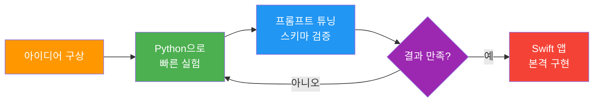
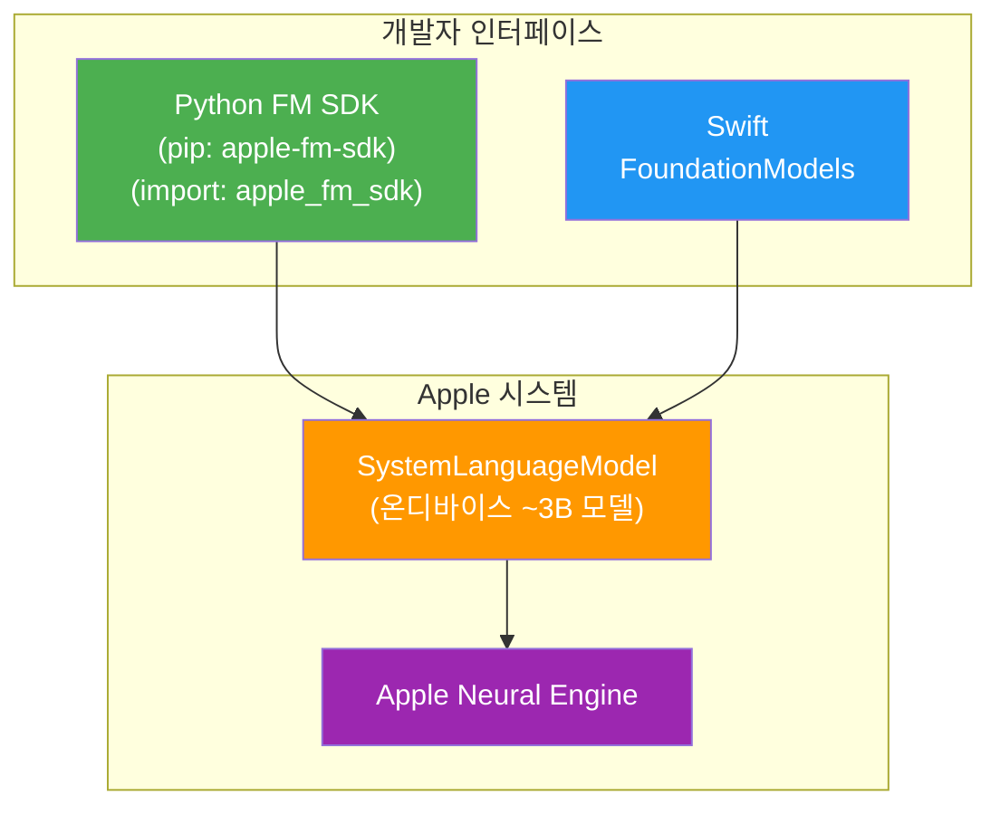
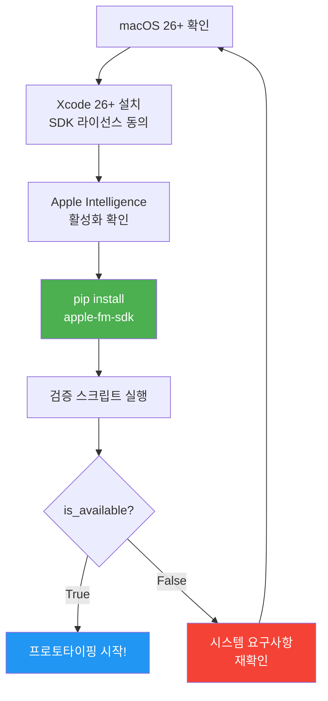
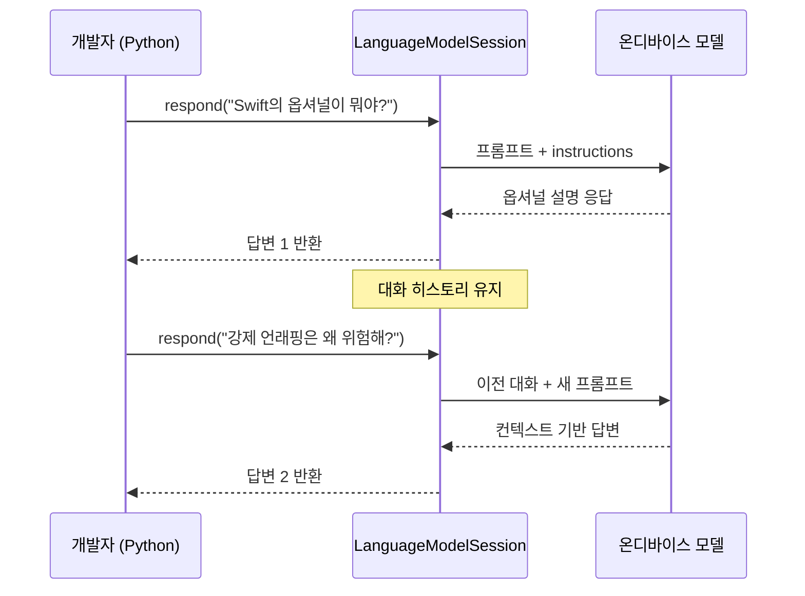
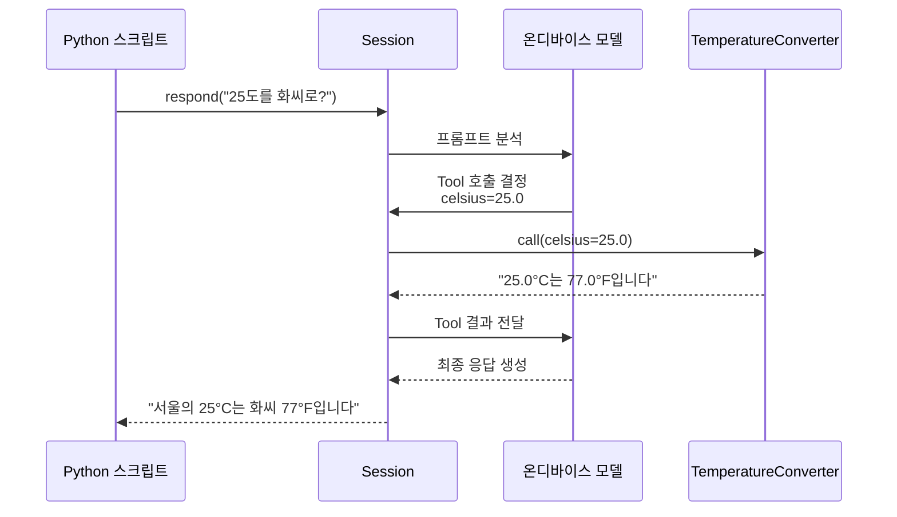
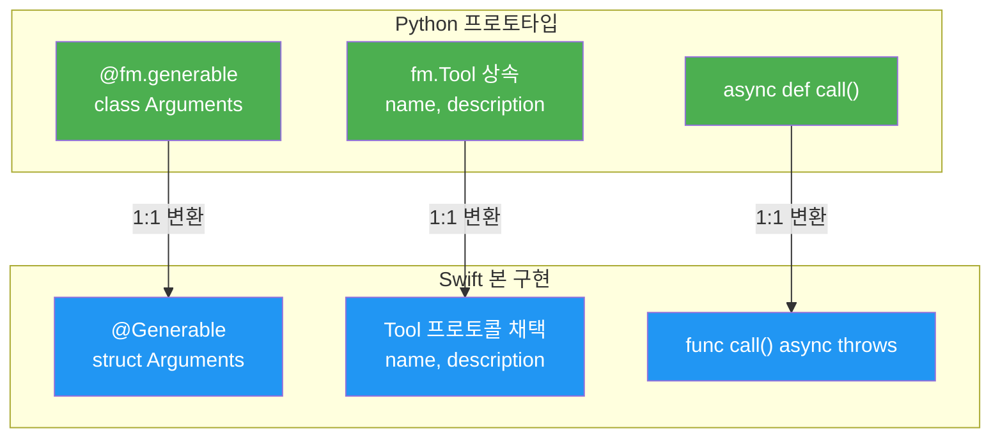

# 04. Python FM SDK로 빠른 프로토타이핑

> Apple의 공식 Python SDK로 Swift 코드 한 줄 없이 온디바이스 AI 아이디어를 빠르게 검증하는 방법을 배웁니다.

> 💡 **이 섹션은 선택 사항입니다.** Python 환경이 없거나 Python에 익숙하지 않더라도 이후 학습에 전혀 지장이 없습니다. Ch3부터는 Swift Foundation Models만 사용합니다. 다만 프롬프트 엔지니어링이나 스키마 설계를 빠르게 실험하고 싶은 분에게는 매우 유용한 도구이니, 관심 있다면 꼭 살펴보세요.

## 개요

이 섹션에서는 Apple이 공식 제공하는 Python FM SDK를 설치하고, Python 환경에서 Foundation Models의 온디바이스 추론을 활용하는 방법을 다룹니다. Swift 앱을 빌드하기 전에 프롬프트를 실험하고, 구조화 출력을 테스트하고, Tool Calling까지 검증하는 빠른 프로토타이핑 워크플로를 익힙니다.

**선수 지식**: [Xcode 26과 iOS 26 SDK 설치](02-ch2-개발-환경-설정/01-01-xcode-26과-ios-26-sdk-설치.md)에서 다룬 Xcode 26 설치와 Apple Intelligence 활성화, [모델 가용성 확인과 폴백 전략](02-ch2-개발-환경-설정/03-03-모델-가용성-확인과-폴백-전략.md)에서 배운 모델 가용성 개념

**학습 목표**:
- `apple-fm-sdk` 패키지를 설치하고 Python 환경을 구성한다
- Python에서 온디바이스 Foundation Models에 접근하여 텍스트를 생성한다
- `@generable` 데코레이터로 구조화 출력을 Python에서 테스트한다
- `fm.Tool`을 상속해 Tool Calling 흐름을 프로토타이핑한다
- Swift 구현 전 아이디어 검증 워크플로를 수립한다

## 왜 알아야 할까?

"좋은 아이디어가 떠올랐는데, 이걸 검증하려면 Xcode 프로젝트를 새로 만들고, SwiftUI 뷰를 구성하고, 빌드하고..." — 이 과정이 너무 번거롭다고 느껴본 적 있으신가요?

Python FM SDK는 바로 이 문제를 해결합니다. 터미널에서 Python 스크립트 하나로 프롬프트를 실험하고, 구조화 출력 스키마를 테스트하고, Tool Calling 흐름을 검증할 수 있거든요. Swift 앱의 최종 형태를 만들기 전에, **아이디어의 가능성을 몇 분 만에 확인**할 수 있는 셈이죠.

실제로 Apple이 이 SDK를 공개한 이유도 명확합니다. ML 엔지니어와 데이터 사이언티스트들은 Python 환경에서 일하는 경우가 많고, **프롬프트 엔지니어링의 반복 실험**은 컴파일 없이 즉시 실행할 수 있는 스크립팅 언어가 훨씬 효율적이기 때문입니다.

> 📊 **그림 1**: Python SDK를 활용한 프로토타이핑 워크플로



## 핵심 개념

### 개념 1: Python FM SDK의 정체와 구조

> 💡 **비유**: Python FM SDK는 마치 **건축 모형(목업)**과 같습니다. 실제 건물(Swift 앱)을 짓기 전에 종이와 스티로폼으로 빠르게 모형을 만들어 공간 배치를 확인하죠. SDK는 같은 온디바이스 모델에 접근하되, Swift 대신 Python이라는 가벼운 재료로 아이디어를 검증합니다.

`python-apple-fm-sdk`는 Apple이 2025년 WWDC25에서 Foundation Models 프레임워크와 함께 공개한 공식 Python 바인딩입니다. Swift의 `FoundationModels` 프레임워크가 접근하는 것과 **동일한 온디바이스 모델**을 Python에서 사용할 수 있게 해줍니다.

이 SDK를 다룰 때 세 가지 이름이 등장하는데, 각각 다른 맥락에서 사용되므로 처음에 확실히 구분해두겠습니다:

| 이름 | 형태 | 사용 맥락 |
|------|------|-----------|
| `python-apple-fm-sdk` | GitHub 리포지토리 이름 | `github.com/apple/python-apple-fm-sdk` |
| `apple-fm-sdk` | pip 패키지 이름 | `pip install apple-fm-sdk` |
| `apple_fm_sdk` | Python import 이름 | `import apple_fm_sdk as fm` |

리포지토리 이름에는 하이픈(`-`)이, pip 패키지에도 하이픈이, 하지만 Python의 import에서는 언더스코어(`_`)가 사용됩니다. Python 패키지 명명 관례상 import 이름에 하이픈을 쓸 수 없기 때문이에요. 이 구분을 모르면 설치 후 `import apple-fm-sdk`라고 써서 에러가 나는 경우가 의외로 많습니다.

핵심은 이겁니다 — SDK가 별도의 모델을 다운로드하거나 클라우드 API를 호출하는 게 아닙니다. 여러분의 Mac에 이미 설치된 Apple Intelligence의 시스템 모델을 직접 호출합니다. 따라서 **오프라인에서도 동작**하고, **프라이버시가 보장**됩니다.

> 📊 **그림 2**: Python SDK와 Swift 프레임워크의 관계



Swift와 Python의 API가 놀라울 정도로 대칭적인 구조를 갖고 있는데요, 아래 표를 보면 한눈에 비교할 수 있습니다:

| Swift (FoundationModels) | Python (apple-fm-sdk) | 역할 |
|---|---|---|
| `import FoundationModels` | `import apple_fm_sdk as fm` | 프레임워크 import |
| `SystemLanguageModel.default` | `fm.SystemLanguageModel()` | 모델 접근 |
| `LanguageModelSession()` | `fm.LanguageModelSession()` | 세션 생성 |
| `session.respond(to:)` | `await session.respond()` | 텍스트 생성 |
| `@Generable` | `@fm.generable` | 구조화 출력 |
| `@Guide` | `fm.guide()` | 필드 제약 |
| `Tool` 프로토콜 | `fm.Tool` 클래스 | Tool Calling |

### 개념 2: 설치와 환경 구성

> 💡 **비유**: 새 주방 도구를 사려면 도구 자체도 필요하지만, 그 도구가 우리 집 전기 콘센트(220V)에 맞는지도 확인해야 하죠. Python FM SDK도 마찬가지로, 패키지 설치 전에 시스템 요구사항부터 확인해야 합니다.

**시스템 요구사항**:
- **macOS 26.0 이상** (Apple Silicon Mac)
- **Xcode 26.0 이상** (커맨드라인 도구 포함, Apple SDK 라이선스 동의 필수)
- **Python 3.10 이상**
- **Apple Intelligence 활성화** (시스템 설정 → Apple Intelligence)

설치는 pip 한 줄이면 됩니다. 이때 패키지 이름이 `apple-fm-sdk`(하이픈)임에 주의하세요:

```terminal
pip install apple-fm-sdk
```

가상 환경을 사용하는 걸 강력히 권장합니다. 프로젝트별로 의존성을 격리할 수 있거든요:

```terminal
python3 -m venv fm-proto
source fm-proto/bin/activate
pip install apple-fm-sdk
```

> 🔥 **실무 팁**: 최근 Python 패키지 관리 도구로 인기를 끌고 있는 `uv`를 사용하면 더 빠르게 환경을 구성할 수 있습니다. Apple 공식 리포지토리도 `uv`를 사용합니다.

```terminal
uv venv
source .venv/bin/activate
uv pip install apple-fm-sdk
```

설치가 완료되면 간단한 검증 코드로 동작을 확인합니다. import할 때는 `apple_fm_sdk`(언더스코어)를 사용합니다:

```run:python
import apple_fm_sdk as fm  # pip 이름은 apple-fm-sdk, import 이름은 apple_fm_sdk

model = fm.SystemLanguageModel()
is_available, reason = model.is_available()

if is_available:
    print("Foundation Models SDK 준비 완료!")
else:
    print(f"모델 사용 불가: {reason}")
```

```output
Foundation Models SDK 준비 완료!
```

> 📊 **그림 3**: 설치 및 환경 검증 흐름



### 개념 3: 기본 텍스트 생성 — respond() API

> 💡 **비유**: 카페에서 바리스타에게 주문하는 것과 같습니다. "아메리카노 한 잔 주세요"(프롬프트)라고 말하면, 바리스타(모델)가 커피를 만들어(추론) 건네줍니다(응답). Python SDK의 `respond()`가 바로 이 주문 과정이에요.

Python FM SDK의 핵심 API는 Swift와 마찬가지로 `LanguageModelSession`의 `respond()` 메서드입니다. 다만 Python에서는 `async/await` 패턴을 사용하므로 `asyncio`가 필요합니다:

```python
import apple_fm_sdk as fm
import asyncio

async def main():
    # 세션 생성 (instructions로 모델 동작 지시)
    session = fm.LanguageModelSession(
        instructions="당신은 친절한 iOS 개발 멘토입니다. 한국어로 답변하세요."
    )

    # 텍스트 생성 요청
    response = await session.respond("SwiftUI의 장점을 3가지 알려주세요.")
    print(response)

asyncio.run(main())
```

**멀티턴 대화**도 자연스럽게 지원됩니다. 같은 세션 객체에 여러 번 `respond()`를 호출하면 이전 대화 컨텍스트가 자동으로 유지됩니다:

```python
async def multi_turn_example():
    session = fm.LanguageModelSession(
        instructions="간결하게 답변하세요."
    )

    # 첫 번째 질문
    r1 = await session.respond("Swift의 옵셔널이 뭐야?")
    print(f"답변 1: {r1}\n")

    # 후속 질문 — 이전 컨텍스트를 기억합니다
    r2 = await session.respond("그럼 강제 언래핑은 왜 위험해?")
    print(f"답변 2: {r2}")

asyncio.run(multi_turn_example())
```

> 📊 **그림 4**: 멀티턴 대화의 컨텍스트 유지



### 개념 4: @generable로 구조화 출력 테스트

> 💡 **비유**: 자유 양식 편지와 정형화된 이력서의 차이를 생각해보세요. `respond()`는 자유 양식 편지처럼 텍스트를 반환하고, `@generable`은 이력서처럼 정해진 양식(스키마)에 맞춰 데이터를 반환합니다.

Swift에서 `@Generable` 매크로를 사용하듯, Python에서는 `@fm.generable` 데코레이터로 구조화 출력을 정의합니다. 이게 프로토타이핑에서 정말 강력한데요, Swift에서 매크로와 구조체를 만들고 빌드하는 과정 없이 **Python 클래스 하나로 바로 스키마를 테스트**할 수 있기 때문입니다.

`@fm.generable`은 Python 클래스의 타입 어노테이션을 분석해서 자동으로 JSON Schema를 생성하고, 온디바이스 모델이 해당 스키마에 맞는 구조화된 출력을 생성하도록 유도합니다. 내부적으로 Swift의 `@Generable`과 동일한 **Guided Generation** 엔진을 사용하기 때문에, Python에서 검증한 스키마는 Swift에서도 동일하게 동작합니다:

```python
import apple_fm_sdk as fm
import asyncio

# 구조화 출력 스키마 정의
@fm.generable
class AppIdea:
    name: str
    description: str
    target_audience: str
    difficulty: int = fm.guide("개발 난이도 (1-5)", range=(1, 5))
    key_features: list[str]

async def main():
    session = fm.LanguageModelSession(
        instructions="창의적인 iOS 앱 아이디어를 제안하세요."
    )

    # 구조화 출력 생성 — generating= 파라미터에 스키마 타입 전달
    idea = await session.respond(
        "건강 관리 관련 AI 앱 아이디어를 하나 제안해줘",
        generating=AppIdea
    )

    # 타입 안전한 접근 — 자유 텍스트가 아닌 구조화된 객체
    print(f"앱 이름: {idea.name}")
    print(f"설명: {idea.description}")
    print(f"대상: {idea.target_audience}")
    print(f"난이도: {idea.difficulty}/5")
    print(f"핵심 기능: {', '.join(idea.key_features)}")

asyncio.run(main())
```

`fm.guide()` 함수는 Swift의 `@Guide` 매크로에 대응합니다. 필드에 설명을 추가하거나 값 범위를 제한해서 모델의 출력 품질을 높이는 역할을 합니다. 주요 파라미터는 다음과 같습니다:

| `fm.guide()` 파라미터 | 역할 | 예시 |
|---|---|---|
| 첫 번째 인자 (설명) | 모델에게 필드의 의미를 알려줌 | `fm.guide("난이도 1-5")` |
| `range=(min, max)` | 정수/실수 범위 제한 | `fm.guide("점수", range=(0, 100))` |

이렇게 Python에서 스키마를 검증한 뒤, 검증된 구조를 Swift `@Generable` 구조체로 옮기면 됩니다. 변환 패턴은 매우 기계적이어서 거의 1:1로 대응됩니다:

| Python (프로토타입) | Swift (본 구현) | 비고 |
|---|---|---|
| `@fm.generable` | `@Generable` | 데코레이터 → 매크로 |
| `class AppIdea:` | `struct AppIdea {` | 클래스 → 구조체 |
| `name: str` | `var name: String` | 타입 매핑 |
| `difficulty: int` | `var difficulty: Int` | 타입 매핑 |
| `list[str]` | `[String]` | 제네릭 매핑 |
| `fm.guide("설명", range=(1,5))` | `@Guide(description: "설명", .range(1...5))` | 제약 조건 |
| `generating=AppIdea` | `generating: AppIdea.self` | 타입 전달 |

### 개념 5: fm.Tool로 Tool Calling 프로토타이핑

> 💡 **비유**: 레스토랑에서 셰프(모델)가 직접 재료를 구하러 시장에 가는 게 아니라, 주방 보조(Tool)에게 "토마토 3kg 가져와"라고 요청하는 것과 같습니다. Tool Calling은 모델이 외부 함수를 호출해 필요한 데이터를 가져오는 메커니즘이에요.

Swift에서 `Tool` 프로토콜을 구현하는 건 꽤 많은 보일러플레이트가 필요합니다. 하지만 Python에서는 `fm.Tool`을 상속한 클래스 하나로 빠르게 Tool의 동작을 검증할 수 있죠.

`fm.Tool`을 구현하려면 세 가지를 정의해야 합니다:
1. **메타데이터** — `name`과 `description`으로 모델에게 도구의 용도를 알려줌
2. **인자 스키마** — `@fm.generable`을 사용한 `Arguments` 클래스로 입력 구조 정의
3. **실행 로직** — `call()` 메서드에 실제 동작 구현

```python
import apple_fm_sdk as fm
import asyncio

class TemperatureConverter(fm.Tool):
    """섭씨를 화씨로 변환하는 도구"""
    # 1. 메타데이터 — 모델이 이 설명을 보고 도구 사용 여부를 결정
    name = "temperature_converter"
    description = "섭씨 온도를 화씨로 변환합니다"

    # 2. 인자 스키마 — @fm.generable로 구조화된 입력 정의
    @fm.generable
    class Arguments:
        celsius: float = fm.guide("변환할 섭씨 온도")

    @property
    def arguments_schema(self):
        return self.Arguments.schema

    # 3. 실행 로직 — 모델이 도구를 호출하면 이 메서드가 실행됨
    async def call(self, arguments):
        celsius = arguments["celsius"]
        fahrenheit = celsius * 9/5 + 32
        return f"{celsius}°C는 {fahrenheit}°F입니다"

async def main():
    session = fm.LanguageModelSession(
        instructions="온도 변환이 필요하면 도구를 사용하세요.",
        tools=[TemperatureConverter()]  # Tool 인스턴스를 리스트로 등록
    )

    response = await session.respond("서울의 평균 기온이 25도인데, 화씨로는 얼마야?")
    print(response)

asyncio.run(main())
```

Swift에서 동일한 Tool을 구현하면 이런 모습입니다. Python에서 검증한 로직을 그대로 옮기면 됩니다:

```swift
// Python fm.Tool → Swift Tool 프로토콜 변환
struct TemperatureConverter: Tool {
    let name = "temperature_converter"
    let description = "섭씨 온도를 화씨로 변환합니다"

    @Generable
    struct Arguments {
        @Guide(description: "변환할 섭씨 온도")
        var celsius: Double
    }

    func call(arguments: Arguments) async throws -> String {
        let fahrenheit = arguments.celsius * 9/5 + 32
        return "\(arguments.celsius)°C는 \(fahrenheit)°F입니다"
    }
}
```

> 📊 **그림 5**: Python에서의 Tool Calling 실행 흐름



> 📊 **그림 6**: Python → Swift 변환 패턴 요약



## 실습: 직접 해보기

이제 실제로 Python FM SDK를 활용한 **완전한 프로토타이핑 워크플로**를 실습해봅시다. 목표는 "AI 레시피 추천" 기능의 프롬프트와 스키마를 Python에서 검증한 뒤, Swift로 변환하는 과정을 체험하는 것입니다.

### Step 1: 프로젝트 환경 설정

```terminal
mkdir fm-recipe-proto
cd fm-recipe-proto
python3 -m venv .venv
source .venv/bin/activate
pip install apple-fm-sdk
```

### Step 2: 구조화 출력 스키마 설계 (Python)

`recipe_proto.py` 파일을 만듭니다:

```python
# recipe_proto.py — AI 레시피 추천 프로토타입
import apple_fm_sdk as fm  # pip: apple-fm-sdk, import: apple_fm_sdk
import asyncio
import json

# ── 1단계: 구조화 출력 스키마 정의 (@fm.generable 데코레이터 활용) ──
@fm.generable
class Ingredient:
    """레시피 재료"""
    name: str
    amount: str
    is_optional: bool = fm.guide("선택 재료 여부")

@fm.generable
class Recipe:
    """AI가 생성하는 레시피"""
    title: str
    cuisine: str = fm.guide("요리 분류 (한식, 양식, 중식, 일식 등)")
    prep_time_minutes: int = fm.guide("준비 시간(분)", range=(5, 180))
    difficulty: int = fm.guide("난이도 1-5", range=(1, 5))
    ingredients: list[Ingredient]  # 중첩 @generable 타입도 지원
    steps: list[str]
    tip: str = fm.guide("요리 초보자를 위한 한 줄 팁")

# ── 2단계: 프로토타이핑 함수 ──
async def test_recipe_generation():
    """다양한 프롬프트로 레시피 생성을 테스트"""
    session = fm.LanguageModelSession(
        instructions=(
            "당신은 경험 많은 한국인 셰프입니다. "
            "요청에 맞는 레시피를 상세하게 제안하세요. "
            "재료는 한국 마트에서 구하기 쉬운 것으로 선택하세요."
        )
    )

    # 테스트 프롬프트 목록
    test_prompts = [
        "냉장고에 계란, 파, 김치가 있어. 15분 안에 만들 수 있는 요리 추천해줘",
        "채식주의자를 위한 간단한 한식 레시피 알려줘",
        "아이들이 좋아할 만한 쉬운 양식 요리 하나 추천해줘",
    ]

    for i, prompt in enumerate(test_prompts, 1):
        print(f"\n{'='*50}")
        print(f"테스트 {i}: {prompt}")
        print(f"{'='*50}")

        # 구조화 출력 생성 — generating= 파라미터로 스키마 전달
        recipe = await session.respond(prompt, generating=Recipe)

        # 결과 출력 — 자유 텍스트가 아닌 타입 안전한 객체 접근
        print(f"요리명: {recipe.title}")
        print(f"분류: {recipe.cuisine} | 시간: {recipe.prep_time_minutes}분 | 난이도: {'⭐' * recipe.difficulty}")
        print(f"\n재료:")
        for ing in recipe.ingredients:
            optional_tag = " (선택)" if ing.is_optional else ""
            print(f"  - {ing.name}: {ing.amount}{optional_tag}")
        print(f"\n조리 순서:")
        for j, step in enumerate(recipe.steps, 1):
            print(f"  {j}. {step}")
        print(f"\n💡 팁: {recipe.tip}")

# ── 3단계: 실행 ──
if __name__ == "__main__":
    asyncio.run(test_recipe_generation())
```

### Step 3: 실행 및 반복 실험

```terminal
python recipe_proto.py
```

여기서 핵심은 **반복**입니다. `instructions`를 바꿔보고, `@fm.guide()`의 설명을 수정하고, 프롬프트를 다듬으면서 최적의 결과를 찾으세요. Xcode 빌드 시간이 0초이니 실험 속도가 완전히 달라집니다.

### Step 4: 검증된 스키마를 Swift로 변환

Python에서 만족스러운 결과를 얻었다면, 스키마를 Swift 구조체로 변환합니다. 변환 규칙은 앞서 배운 대응표를 따르면 거의 기계적으로 옮길 수 있습니다:

```swift
import FoundationModels

// Python @fm.generable class Ingredient → Swift @Generable struct Ingredient
@Generable
struct Ingredient {
    @Guide(description: "재료 이름")
    var name: String

    @Guide(description: "재료 분량")
    var amount: String

    @Guide(description: "선택 재료 여부")
    var isOptional: Bool
}

// Python @fm.generable class Recipe → Swift @Generable struct Recipe
@Generable
struct Recipe {
    @Guide(description: "요리 제목")
    var title: String

    @Guide(description: "요리 분류 (한식, 양식, 중식, 일식 등)")
    var cuisine: String

    @Guide(description: "준비 시간(분)", .range(5...180))
    var prepTimeMinutes: Int

    @Guide(description: "난이도 1-5", .range(1...5))
    var difficulty: Int

    var ingredients: [Ingredient]  // 중첩 @Generable 타입
    var steps: [String]

    @Guide(description: "요리 초보자를 위한 한 줄 팁")
    var tip: String
}

// Python에서 검증한 instructions를 그대로 사용
let session = LanguageModelSession(
    instructions: """
    당신은 경험 많은 한국인 셰프입니다.
    요청에 맞는 레시피를 상세하게 제안하세요.
    재료는 한국 마트에서 구하기 쉬운 것으로 선택하세요.
    """
)

// Python의 await session.respond(prompt, generating=Recipe)와 동일
let recipe = try await session.respond(
    to: "냉장고에 계란, 파, 김치가 있어. 15분 안에 만들 수 있는 요리 추천해줘",
    generating: Recipe.self
)
```

Python에서 이미 검증한 프롬프트와 스키마를 그대로 옮겼기 때문에, Swift에서도 기대한 결과가 나올 가능성이 매우 높습니다.

## 더 깊이 알아보기

### Python FM SDK의 탄생 배경

Apple이 Python SDK를 공개한 건 사실 꽤 이례적인 일이었습니다. Apple은 전통적으로 자사 플랫폼의 네이티브 언어(Objective-C → Swift)에 올인하는 전략을 취해왔거든요. Core ML도, Create ML도, Metal도 전부 Swift/Objective-C 우선이었습니다.

그런데 AI/ML 분야에서는 상황이 다릅니다. **전 세계 ML 연구자와 엔지니어의 대다수가 Python을 사용**합니다. PyTorch, TensorFlow, Hugging Face — 모든 핵심 생태계가 Python 위에 세워져 있죠. Apple이 Foundation Models를 정말로 널리 쓰이게 하려면, Python 지원은 선택이 아니라 필수였던 겁니다.

실제로 `python-apple-fm-sdk`의 GitHub 리포지토리를 보면, Apache 2.0 라이선스로 공개되어 있고 Apple의 공식 GitHub 조직(`apple/`) 아래에 있습니다. SDK는 내부적으로 Swift 코드(11.1%)를 C 바인딩(1.6%)으로 감싸고, Python(84.6%)으로 사용자 친화적인 API를 제공하는 구조입니다. 이름도 `python-apple-fm-sdk`(리포지토리) → `apple-fm-sdk`(pip) → `apple_fm_sdk`(import)로 각 계층에 맞게 분리되어 있죠.

### Batch Inference와 평가 활용

Python FM SDK의 또 다른 중요한 용도는 **배치 추론(batch inference)**입니다. Swift 앱에서 사용할 프롬프트 100개를 미리 테스트하거나, 다양한 입력에 대한 모델 응답을 체계적으로 평가할 때 Python 스크립트가 훨씬 편리합니다. `for` 루프 하나로 수십 가지 프롬프트 변형을 시도하고, 결과를 CSV나 JSON으로 저장해서 비교 분석할 수 있으니까요.

```python
import apple_fm_sdk as fm
import asyncio
import json

async def batch_evaluate():
    """다양한 instructions 변형을 배치로 평가"""
    instruction_variants = [
        "간결하게 답변하세요.",
        "초보자도 이해할 수 있게 자세히 설명하세요.",
        "핵심만 3줄로 요약하세요.",
    ]

    test_prompt = "Swift의 옵셔널이 뭐야?"
    results = []

    for instruction in instruction_variants:
        session = fm.LanguageModelSession(instructions=instruction)
        response = await session.respond(test_prompt)
        results.append({
            "instruction": instruction,
            "response": str(response),
            "length": len(str(response))
        })

    # 결과를 JSON으로 저장하여 비교 분석
    with open("eval_results.json", "w") as f:
        json.dump(results, f, ensure_ascii=False, indent=2)

    for r in results:
        print(f"[{r['length']}자] {r['instruction'][:20]}...")

asyncio.run(batch_evaluate())
```

## 흔한 오해와 팁

> ⚠️ **흔한 오해**: "Python SDK는 클라우드 API를 호출하는 거 아닌가요?"
> 아닙니다! Python FM SDK는 Swift FoundationModels와 동일한 **온디바이스 모델**에 접근합니다. 네트워크 연결이 필요 없고, 데이터가 기기를 떠나지 않습니다. `SystemLanguageModel()`은 Mac에 설치된 Apple Intelligence의 ~3B 파라미터 모델을 직접 호출합니다.

> 💡 **알고 계셨나요?**: Python FM SDK의 `@generable` 데코레이터와 Swift의 `@Generable` 매크로는 내부적으로 동일한 Guided Generation 엔진을 사용합니다. 따라서 Python에서 테스트한 스키마의 출력 품질은 Swift에서도 거의 동일하게 재현됩니다. 이것이 Python 프로토타이핑이 실용적인 핵심 이유입니다.

> 🔥 **실무 팁**: 프롬프트 튜닝 시 `instructions`(시스템 프롬프트)와 사용자 프롬프트를 분리해서 실험하세요. `instructions`는 모델의 전반적 성격을 결정하고, 사용자 프롬프트는 구체적 요청을 담습니다. Python에서 이 두 가지를 독립적으로 변경하며 최적 조합을 찾은 뒤 Swift에 적용하면 시행착오를 크게 줄일 수 있습니다.

> ⚠️ **흔한 오해**: "Python SDK로 만든 프로토타입을 그대로 앱에 넣을 수 있나요?"
> Python FM SDK는 **macOS에서만** 동작합니다. iOS 앱을 만들려면 반드시 Swift로 변환해야 합니다. SDK의 목적은 앱 개발이 아니라 **아이디어 검증과 프롬프트 엔지니어링**입니다.

> ⚠️ **흔한 오해**: "`apple-fm-sdk`, `apple_fm_sdk`, `python-apple-fm-sdk` — 다 다른 패키지인가요?"
> 아닙니다! 전부 동일한 SDK를 가리킵니다. `python-apple-fm-sdk`는 GitHub 리포지토리 이름이고, `apple-fm-sdk`는 pip에서 설치할 때 쓰는 패키지 이름이며, `apple_fm_sdk`는 Python 코드에서 import할 때 쓰는 모듈 이름입니다. Python에서 패키지 이름(하이픈 허용)과 모듈 이름(언더스코어만 허용)이 다른 건 흔한 관례입니다.

## 핵심 정리

| 개념 | 설명 |
|------|------|
| `python-apple-fm-sdk` | GitHub 리포지토리 이름 (Apache 2.0 라이선스) |
| `apple-fm-sdk` | pip 패키지 이름 (`pip install apple-fm-sdk`) |
| `apple_fm_sdk` | Python import 이름 (`import apple_fm_sdk as fm`) |
| 시스템 요구사항 | macOS 26+, Xcode 26+, Python 3.10+, Apple Intelligence 활성화 |
| `SystemLanguageModel()` | 시스템에 설치된 온디바이스 모델에 접근하는 진입점 |
| `LanguageModelSession()` | 대화 세션 관리, `instructions`로 모델 동작 지시 |
| `respond()` | 비동기 텍스트 생성 메서드, `generating=` 파라미터로 구조화 출력 지원 |
| `@fm.generable` | Python 클래스를 구조화 출력 스키마로 변환하는 데코레이터 (Swift `@Generable` 대응) |
| `fm.guide()` | 필드 설명, 값 범위 등 제약 조건 추가 (Swift `@Guide` 대응) |
| `fm.Tool` | Tool Calling 프로토타이핑을 위한 베이스 클래스 (Swift `Tool` 프로토콜 대응) |
| 프로토타이핑 워크플로 | Python 실험 → 프롬프트/스키마 확정 → Swift 변환 → 앱 구현 |

## 다음 섹션 미리보기

Ch2의 개발 환경 설정이 모두 완료되었습니다! Xcode 설치부터 프로젝트 생성, 모델 가용성 확인, 그리고 Python 프로토타이핑까지 — Foundation Models 개발에 필요한 모든 준비를 마쳤습니다.

다음 챕터 [Ch3. Foundation Models 프레임워크 시작하기](03-ch3-foundation-models-프레임워크-시작하기/01-01-systemlanguagemodel-이해하기.md)에서는 본격적으로 Swift 코드에서 `SystemLanguageModel`의 내부 구조를 파헤치고, `LanguageModelSession`의 다양한 설정 옵션을 깊이 탐구합니다. Python으로 빠르게 검증한 아이디어를, 이제 네이티브 Swift 앱으로 구현하는 여정이 시작됩니다.

## 참고 자료

- [python-apple-fm-sdk — GitHub (apple)](https://github.com/apple/python-apple-fm-sdk) - Apple 공식 Python FM SDK 리포지토리. 소스 코드, 예제, 이슈 트래킹
- [Foundation Models SDK for Python — 공식 문서](https://apple.github.io/python-apple-fm-sdk/) - API 레퍼런스와 Getting Started 가이드
- [Basic Usage — Python FM SDK 문서](https://apple.github.io/python-apple-fm-sdk/basic_usage.html) - 텍스트 생성, 구조화 출력, 세션 관리 상세 가이드
- [Tools and Function Calling — Python FM SDK 문서](https://apple.github.io/python-apple-fm-sdk/tools.html) - Tool Calling 구현 패턴과 예제
- [Foundation Models — Apple Developer Documentation](https://developer.apple.com/documentation/FoundationModels) - Swift FoundationModels 프레임워크 공식 문서 (Python SDK와 API 비교 시 참고)
- [Meet the Foundation Models framework — WWDC25](https://developer.apple.com/videos/play/wwdc2025/286/) - Foundation Models 소개 세션 영상

---
### 🔗 Related Sessions
- [모델 가용성 확인 api](02-ch2-개발-환경-설정/01-01-xcode-26과-ios-26-sdk-설치.md) (prerequisite)
