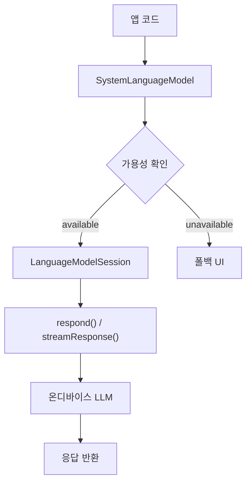
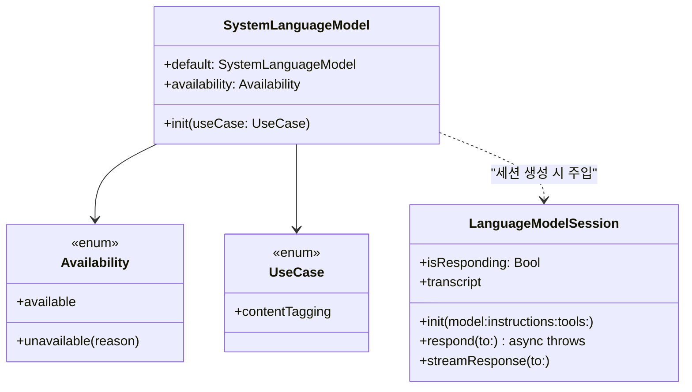
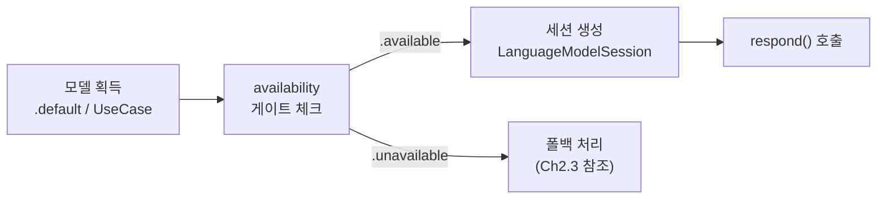
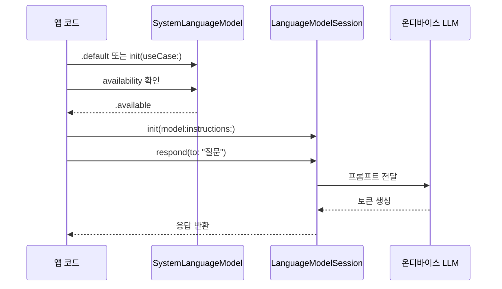
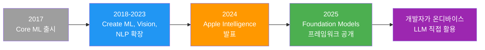

# SystemLanguageModel 이해하기

> Apple 온디바이스 AI의 관문, SystemLanguageModel의 구조와 접근 방법을 완전히 이해합니다.

## 개요

이 섹션에서는 Foundation Models 프레임워크의 핵심 진입점인 `SystemLanguageModel`을 배웁니다. 이 클래스가 어떤 역할을 하는지, 어떻게 접근하는지, 그리고 세션 생성까지의 전체 흐름을 익힙니다.

**선수 지식**: [Ch2. 개발 환경 설정](02-ch2-개발-환경-설정/01-01-xcode-26과-ios-26-sdk-설치.md)에서 만든 Xcode 프로젝트와 [모델 가용성 확인과 폴백 전략](02-ch2-개발-환경-설정/03-03-모델-가용성-확인과-폴백-전략.md)에서 배운 가용성 확인 기본 개념

**학습 목표**:
- `SystemLanguageModel`이 프레임워크에서 어떤 역할을 하는지 설명할 수 있다
- `.default` 프로퍼티로 기본 모델에 접근하고 `UseCase`로 특화 모델을 선택할 수 있다
- `LanguageModelSession` 생성까지의 전체 흐름을 이해한다

## 왜 알아야 할까?

Ch2에서 Xcode 프로젝트를 생성하고 개발 환경을 구성했다면, 이제 본격적으로 코드를 작성할 차례입니다. **Ch2에서 만든 그 프로젝트를 그대로 열어서** 이번 챕터의 실습을 이어갈 거예요. 새 프로젝트를 만들 필요 없이, [Ch2.2에서 `import FoundationModels`와 간단한 세션 생성 코드를 실행해봤던 것](02-ch2-개발-환경-설정/02-02-첫-foundation-models-프로젝트-생성.md)의 연장선입니다. 그때 맛보기로 돌려본 코드가 어떤 구조 위에서 동작하는지, 이제 제대로 파헤쳐보겠습니다.

Foundation Models 프레임워크를 사용하는 모든 코드의 첫 번째 줄은 `SystemLanguageModel`에서 시작됩니다. 이 클래스를 이해하지 못하면 세션을 만들 수도, 프롬프트를 보낼 수도, 응답을 받을 수도 없죠.

더 중요한 건, **모든 기기에서 모델이 사용 가능한 것이 아니라는 점**입니다. Apple Intelligence를 지원하지 않는 기기, 사용자가 기능을 꺼둔 경우, 모델이 아직 다운로드 중인 경우 등 다양한 상황이 존재합니다. 이런 가용성 확인의 기본 개념과 전체 분기 전략은 [Ch2.3 모델 가용성 확인과 폴백 전략](02-ch2-개발-환경-설정/03-03-모델-가용성-확인과-폴백-전략.md)에서 이미 다뤘으니, 이번 섹션에서는 **SystemLanguageModel API 자체의 구조와 세션 생성 흐름**에 집중하겠습니다.

> 📊 **그림 1**: Foundation Models 프레임워크에서 SystemLanguageModel의 위치



## 핵심 개념

### 개념 1: SystemLanguageModel이란?

> 💡 **비유**: `SystemLanguageModel`은 **데이터베이스 커넥션 풀(Connection Pool)** 과 비슷합니다. DB에 쿼리를 보내려면 직접 소켓을 열지 않고 커넥션 풀에서 커넥션을 받아오죠. 마찬가지로 온디바이스 LLM에 직접 접근하는 게 아니라, `SystemLanguageModel`이라는 관리 계층을 통해 세션(커넥션)을 획득하고, 그 세션으로 작업(쿼리)을 수행하는 구조입니다.

`SystemLanguageModel`은 Apple 기기에 설치된 온디바이스 대규모 언어 모델(LLM)에 접근하기 위한 **진입점 클래스**입니다. Apple이 자체 설계한 경량 모델이 기기 위에서 동작하며, Apple Intelligence를 구동하는 바로 그 모델이에요. 모델의 구체적인 아키텍처와 양자화 기법은 [Ch14. 온디바이스 모델 아키텍처 이해](14-ch14-온디바이스-모델-아키텍처-이해/01-01-apple-온디바이스-모델-아키텍처-개요.md)에서 깊이 다루니, 여기서는 **어떻게 사용하는지**에 집중하겠습니다.

직접 모델 가중치를 로드하거나 추론 엔진을 초기화할 필요가 없습니다. `SystemLanguageModel`이 그 모든 복잡한 과정을 추상화해주거든요.

```swift
import FoundationModels

// 시스템 언어 모델에 접근하는 단 한 줄
let model = SystemLanguageModel.default
```

이 한 줄로 Apple이 기기에 설치해둔 LLM에 접근할 수 있습니다. Ch2.2에서 프로젝트를 만들 때 `import FoundationModels`를 이미 해봤죠? 그때 사용한 바로 그 프레임워크입니다. Core ML 모델처럼 `.mlmodel` 파일을 번들에 포함시킬 필요도 없고, 모델 다운로드 URL을 관리할 필요도 없어요.

> 📊 **그림 2**: SystemLanguageModel의 핵심 구성 요소



### 개념 2: .default와 UseCase — 모델 선택하기

> 💡 **비유**: `.default`는 범용 **정규 표현식 엔진**이고, `UseCase`는 특정 패턴에 최적화된 **전용 파서**라고 생각하면 됩니다. 일반적인 텍스트 매칭은 정규식 엔진으로 충분하지만, HTML 파싱이나 JSON 추출처럼 구조화된 작업에는 전용 파서(`.contentTagging`)가 훨씬 정확하고 효율적이죠.

`SystemLanguageModel`에 접근하는 두 가지 방법이 있습니다:

**1. 기본 모델 (범용)**

```swift
// 범용 모델 — 창작, Q&A, 요약 등 다양한 작업에 적합
let generalModel = SystemLanguageModel.default
```

`.default`는 창의적 글쓰기, 질문 응답, 텍스트 요약 등 범용 텍스트 작업에 최적화된 기본 모델을 반환합니다.

**2. 특화 모델 (UseCase)**

```swift
// 콘텐츠 태깅에 특화된 어댑터 모델
let taggingModel = SystemLanguageModel(useCase: .contentTagging)
```

`UseCase.contentTagging`은 태그 생성, 엔티티 추출, 토픽 감지에 파인튜닝된 모델 어댑터를 활성화합니다. 기본 모델과 동일한 기반 위에 특화 레이어가 얹어진 구조예요.

```run:swift
import FoundationModels

// 두 모델 접근 방식 비교
let generalModel = SystemLanguageModel.default
let taggingModel = SystemLanguageModel(useCase: .contentTagging)

print("기본 모델: \(generalModel)")
print("태깅 모델: \(taggingModel)")
print("두 모델 모두 온디바이스에서 실행됩니다!")
```

```output
기본 모델: SystemLanguageModel(default)
태깅 모델: SystemLanguageModel(useCase: contentTagging)
두 모델 모두 온디바이스에서 실행됩니다!
```

> ⚠️ **흔한 오해**: "UseCase마다 완전히 다른 모델이 별도로 설치되는 거 아닌가요?" — 아닙니다! 기반 모델은 동일하고, `UseCase`는 **경량 어댑터(adapter)** 를 활성화하는 것입니다. 모델 전체를 여러 벌 저장하는 것이 아니라, 작은 어댑터 가중치만 추가로 로드하므로 저장 공간 효율이 매우 좋습니다.

### 개념 3: 가용성 확인 — 이 세션에서의 관점

가용성 확인의 전체 분기 전략과 각 `unavailable` 사유별 대응 패턴은 [Ch2.3 모델 가용성 확인과 폴백 전략](02-ch2-개발-환경-설정/03-03-모델-가용성-확인과-폴백-전략.md)에서 상세히 다뤘습니다. 여기서는 반복하지 않고, **SystemLanguageModel API 관점에서 꼭 알아야 할 포인트**만 짚겠습니다.

핵심은 `availability` 프로퍼티가 **세션 생성의 게이트키퍼** 역할을 한다는 것입니다:

```swift
let model = SystemLanguageModel.default

// 세션 생성 전 반드시 확인
guard case .available = model.availability else {
    // Ch2.3에서 배운 폴백 전략 적용
    return
}

// 가용할 때만 세션 생성 진행
let session = LanguageModelSession(model: model)
```

> 📊 **그림 3**: availability가 세션 생성 흐름에서 차지하는 위치



기억해야 할 점은 `availability`가 **런타임에 변할 수 있다**는 것입니다. 사용자가 설정에서 Apple Intelligence를 껐다 켤 수 있고, 모델 다운로드가 완료될 수도 있죠. 따라서 앱 시작 시 한 번만 확인하지 말고, AI 기능을 사용하는 시점에 다시 확인하는 것이 안전합니다. 가용성 변화에 따른 UI 분기 패턴(SwiftUI 바인딩 포함)은 [Ch3.5](03-ch3-foundation-models-프레임워크-시작하기/05-05-swiftui-통합-ai-기능-뷰-만들기.md)에서 SwiftUI 통합 관점으로 다룹니다.

### 개념 4: SystemLanguageModel에서 세션까지의 전체 흐름

> 💡 **비유**: **컴파일러 파이프라인**을 떠올려보세요. 소스 코드를 바로 실행할 수 없듯이, 먼저 컴파일러(SystemLanguageModel)를 확보하고 → 컴파일 가능한 상태인지 확인하고(availability) → 컴파일 세션을 열어서(LanguageModelSession) → 소스를 넘기면(respond 호출) → 결과물을 받습니다(응답). 각 단계를 건너뛸 수 없는 순차 파이프라인이에요.

`SystemLanguageModel`은 그 자체로 텍스트를 생성하지 않습니다. 실제 텍스트 생성은 `LanguageModelSession`의 역할이에요. `SystemLanguageModel`은 세션을 만들 때 **어떤 모델을 사용할지** 지정하는 역할을 합니다.

> 📊 **그림 4**: SystemLanguageModel에서 응답까지의 전체 시퀀스



세션 생성에는 여러 옵션이 있습니다:

```swift
import FoundationModels

// 1. 가장 간단한 형태 — 기본 모델, 지시사항 없음
let simpleSession = LanguageModelSession()

// 2. 커스텀 지시사항(instructions) 포함
let guidedSession = LanguageModelSession(
    instructions: "당신은 친절한 요리 도우미입니다. 한국 가정식 위주로 답변하세요."
)

// 3. 특화 모델 지정
let taggingSession = LanguageModelSession(
    model: SystemLanguageModel(useCase: .contentTagging)
)

// 4. 모델 + 지시사항 모두 지정
let fullSession = LanguageModelSession(
    model: SystemLanguageModel.default,
    instructions: "간결하고 핵심적으로 답변하세요."
)
```

첫 번째 형태(`LanguageModelSession()`)가 가능한 이유는, 모델을 지정하지 않으면 자동으로 `SystemLanguageModel.default`가 사용되기 때문입니다.

### 개념 5: prewarm()으로 초기 지연 줄이기

모델의 첫 번째 응답은 초기화 과정 때문에 이후 응답보다 느릴 수 있습니다. `prewarm()` 메서드를 미리 호출하면 이 초기 지연을 줄일 수 있어요.

```swift
import FoundationModels

// 앱 시작 시 또는 AI 화면 진입 전에 호출
let model = SystemLanguageModel.default

Task {
    // 모델 워밍업 — 실제 추론 전에 리소스를 미리 준비
    try? await model.prewarm()
}
```

> 🔥 **실무 팁**: `prewarm()`은 앱 시작 시점이나, AI 기능이 있는 화면으로 네비게이션하기 직전에 호출하는 것이 좋습니다. `task` modifier에서 호출하면 뷰가 나타날 때 자동으로 워밍업이 시작되죠.

## 실습: 직접 해보기

Ch2에서 만든 Xcode 프로젝트를 그대로 열어주세요. 새 프로젝트를 만들 필요 없이, [Ch2.2에서 생성한 프로젝트](02-ch2-개발-환경-설정/02-02-첫-foundation-models-프로젝트-생성.md)에 이어서 작업합니다. 앞에서 배운 개념을 모두 결합한 완전한 SwiftUI 뷰를 작성해보겠습니다. 모델 접근부터 세션 생성, 첫 번째 응답 받기까지의 전체 흐름을 구현합니다.

```swift
import SwiftUI
import FoundationModels

/// SystemLanguageModel의 전체 사용 흐름을 보여주는 실습 뷰
struct SystemModelLabView: View {
    // MARK: - 모델 및 세션
    
    /// 시스템 언어 모델 인스턴스
    private let model = SystemLanguageModel.default
    
    /// 대화 세션 — 가용성 확인 후 생성
    @State private var session: LanguageModelSession?
    
    /// 모델 응답 텍스트
    @State private var responseText = ""
    
    /// 에러 메시지
    @State private var errorMessage: String?
    
    /// 로딩 상태
    @State private var isLoading = false
    
    // MARK: - Body
    
    var body: some View {
        NavigationStack {
            VStack(spacing: 20) {
                // 1단계: 모델 가용성 상태 표시
                modelStatusSection
                
                // 2단계: 응답 표시 영역
                if !responseText.isEmpty {
                    Text(responseText)
                        .padding()
                        .frame(maxWidth: .infinity, alignment: .leading)
                        .background(.regularMaterial)
                        .clipShape(RoundedRectangle(cornerRadius: 12))
                }
                
                // 에러 표시
                if let error = errorMessage {
                    Label(error, systemImage: "exclamationmark.triangle")
                        .foregroundStyle(.red)
                }
                
                Spacer()
                
                // 3단계: 테스트 버튼
                Button("첫 번째 질문 보내기") {
                    Task { await sendFirstPrompt() }
                }
                .buttonStyle(.borderedProminent)
                .disabled(session == nil || isLoading)
            }
            .padding()
            .navigationTitle("SystemLanguageModel 실습")
            .task {
                // 뷰 등장 시 세션 초기화
                await initializeSession()
            }
        }
    }
    
    // MARK: - 모델 상태 섹션
    
    private var modelStatusSection: some View {
        HStack {
            Image(systemName: statusIcon)
                .foregroundStyle(statusColor)
            Text(statusText)
                .font(.headline)
        }
        .padding()
        .frame(maxWidth: .infinity)
        .background(statusColor.opacity(0.1))
        .clipShape(RoundedRectangle(cornerRadius: 8))
    }
    
    private var statusIcon: String {
        switch model.availability {
        case .available: "checkmark.circle.fill"
        case .unavailable: "xmark.circle.fill"
        }
    }
    
    private var statusColor: Color {
        switch model.availability {
        case .available: .green
        case .unavailable: .red
        }
    }
    
    private var statusText: String {
        switch model.availability {
        case .available:
            "모델 사용 가능"
        case .unavailable(.appleIntelligenceNotEnabled):
            "Apple Intelligence가 꺼져 있습니다"
        case .unavailable(.deviceNotEligible):
            "이 기기에서는 지원되지 않습니다"
        case .unavailable(.modelNotReady):
            "모델 다운로드 중..."
        case .unavailable(_):
            "모델을 사용할 수 없습니다"
        }
    }
    
    // MARK: - 세션 초기화
    
    private func initializeSession() async {
        // 가용성 확인 — 폴백 전략의 상세 구현은 Ch2.3 참조
        guard case .available = model.availability else {
            errorMessage = "모델이 사용 가능하지 않아 세션을 생성할 수 없습니다."
            return
        }
        
        // 워밍업으로 초기 지연 최소화
        try? await model.prewarm()
        
        // 세션 생성 — 지시사항 포함
        session = LanguageModelSession(
            model: model,
            instructions: "간결하고 친근하게 한국어로 답변하세요."
        )
    }
    
    // MARK: - 프롬프트 전송
    
    private func sendFirstPrompt() async {
        guard let session else { return }
        
        isLoading = true
        errorMessage = nil
        
        do {
            // respond()로 텍스트 생성 요청
            let response = try await session.respond(
                to: "Swift 언어의 가장 매력적인 특징을 하나만 알려주세요."
            )
            responseText = response.content
        } catch {
            errorMessage = "응답 생성 실패: \(error.localizedDescription)"
        }
        
        isLoading = false
    }
}
```

이 코드의 핵심 흐름을 정리하면:

1. `SystemLanguageModel.default`로 모델 인스턴스 확보
2. `model.availability`로 가용성 확인 → UI에 상태 반영
3. `.available`이면 `LanguageModelSession` 생성 (+ `prewarm()` 호출)
4. `session.respond(to:)`로 프롬프트 전송 → 응답 표시

## 더 깊이 알아보기

### Foundation Models 프레임워크의 탄생 배경

Apple의 온디바이스 AI 여정은 2017년 Core ML 출시로 시작되었습니다. 하지만 당시에는 개발자가 직접 모델을 찾고, 변환하고, 번들에 포함시켜야 했죠.

2024년 WWDC에서 Apple Intelligence가 발표되었을 때, 많은 개발자가 "그래서 내 앱에서 이걸 어떻게 쓰지?"라는 질문을 던졌습니다. Apple Intelligence의 기능은 시스템 앱(메일, 메모 등)에만 국한되어 있었거든요.

2025년 WWDC25에서 마침내 Foundation Models 프레임워크가 공개되면서, **모든 서드파티 앱이 Apple의 온디바이스 LLM에 직접 접근**할 수 있게 되었습니다. 이것이 `SystemLanguageModel`이 탄생한 배경입니다. Apple이 관리하는 모델을 개발자가 단 한 줄의 코드로 사용할 수 있게 만든 것이죠.

흥미로운 점은, 이 모델의 이름이 `SystemLanguageModel`인 이유입니다. "System"이 붙은 것은 이 모델이 **시스템 레벨에서 관리되는 공유 리소스**임을 의미합니다. 앱마다 모델을 따로 가지는 것이 아니라, 운영체제가 하나의 모델을 관리하고 모든 앱이 이를 공유하는 구조예요. 마치 `SystemFontCollection`이 시스템 폰트를 관리하는 것과 같은 패턴이죠.

> 📊 **그림 5**: Apple 온디바이스 AI 진화 타임라인



### 왜 "온디바이스"인가?

Apple이 온디바이스 실행을 고집하는 데에는 깊은 철학이 있습니다. Apple의 온디바이스 모델은 QAT(Quantization-Aware Training) 기법으로 극도로 경량화되어 모바일 기기에서도 실행할 수 있습니다. 이렇게 해서 사용자 데이터가 기기 밖으로 나가지 않는 **완전한 프라이버시**를 보장하면서도, 네트워크 없이 동작하는 **오프라인 기능**을 제공할 수 있는 것이죠. 모델의 구체적인 파라미터 규모, 양자화 비트 수, 메모리 풋프린트 등 아키텍처 세부사항은 [Ch14. 온디바이스 모델 아키텍처 이해](14-ch14-온디바이스-모델-아키텍처-이해/01-01-apple-온디바이스-모델-아키텍처-개요.md)에서 깊이 있게 다룹니다.

## 흔한 오해와 팁

> ⚠️ **흔한 오해**: "SystemLanguageModel.default를 호출할 때마다 새 모델이 로드되나요?" — 아닙니다. `.default`는 시스템이 이미 로드해둔 **공유 모델에 대한 참조**를 반환할 뿐입니다. 여러 번 호출해도 메모리가 추가로 소모되지 않아요.

> 💡 **알고 계셨나요?**: Foundation Models 프레임워크의 모델은 **KV-Cache 공유** 기술을 사용합니다. 여러 앱이 동시에 모델을 사용해도, Key-Value Cache를 시스템 레벨에서 효율적으로 공유하여 메모리 사용량을 크게 줄입니다. 이 최적화 기법은 [Ch14. 온디바이스 모델 아키텍처 이해](14-ch14-온디바이스-모델-아키텍처-이해/02-02-kv-cache-공유와-메모리-최적화.md)에서 자세히 다룹니다.

> 🔥 **실무 팁**: Apple은 Foundation Models를 **코드 생성이나 수학 계산에는 권장하지 않습니다**. 온디바이스 모델은 경량 모델로, 요약, 분류, 태깅, 간단한 창작에 최적화되어 있어요. 복잡한 추론이 필요한 작업은 더 큰 서버 모델(Private Cloud Compute)로 라우팅되는 구조입니다.

## 핵심 정리

| 개념 | 설명 |
|------|------|
| `SystemLanguageModel` | Apple 온디바이스 LLM에 대한 진입점 클래스. 직접 텍스트를 생성하지 않고, 세션 생성의 기반 역할 |
| `.default` | 범용(창작, Q&A, 요약) 기본 모델 반환. 가장 많이 사용하는 접근 방식 |
| `UseCase.contentTagging` | 태그 생성/엔티티 추출에 특화된 어댑터 모델 활성화 |
| `availability` | `.available` 또는 `.unavailable(reason)`. 세션 생성 전 게이트 체크 (상세 분기는 Ch2.3 참조) |
| `prewarm()` | 모델 리소스를 미리 준비하여 첫 응답 지연을 줄이는 메서드 |
| `LanguageModelSession` | 실제 텍스트 생성을 담당. `SystemLanguageModel`을 주입받아 생성 |

## 다음 섹션 미리보기

이번 섹션에서 `SystemLanguageModel`이라는 관문을 통과하는 법을 배웠다면, 다음 섹션 [02. LanguageModelSession 생성과 구성](03-ch3-foundation-models-프레임워크-시작하기/02-02-languagemodelsession-생성과-구성.md)에서는 본격적으로 세션을 다루게 됩니다. `instructions` 설계, `tools` 등록, `GenerationOptions` 구성 등 세션의 모든 초기화 옵션을 깊이 파고들어 봅니다.

## 참고 자료

- [Meet the Foundation Models framework — WWDC25](https://developer.apple.com/videos/play/wwdc2025/286/) - Foundation Models 프레임워크의 전체 소개와 라이브 데모를 볼 수 있는 공식 세션
- [Foundation Models — Apple Developer Documentation](https://developer.apple.com/documentation/FoundationModels) - SystemLanguageModel, LanguageModelSession 등 전체 API 레퍼런스
- [Exploring the Foundation Models framework — Create with Swift](https://www.createwithswift.com/exploring-the-foundation-models-framework/) - SystemLanguageModel의 프로퍼티와 세션 생성을 단계별로 설명하는 튜토리얼
- [An Introduction to Apple's Foundation Model Framework — Superwall](https://superwall.com/blog/an-introduction-to-apples-foundation-model-framework/) - 가용성 확인의 모든 케이스를 상세 코드로 보여주는 실전 가이드
- [Getting Started with Apple's Foundation Models — Artem Novichkov](https://artemnovichkov.com/blog/getting-started-with-apple-foundation-models) - prewarm(), GenerationOptions, 에러 처리까지 포함한 종합 튜토리얼
- [Apple Intelligence Foundation Language Models: Tech Report 2025](https://arxiv.org/abs/2507.13575) - 온디바이스 모델의 아키텍처, 양자화, KV-Cache 공유 등 기술적 세부사항