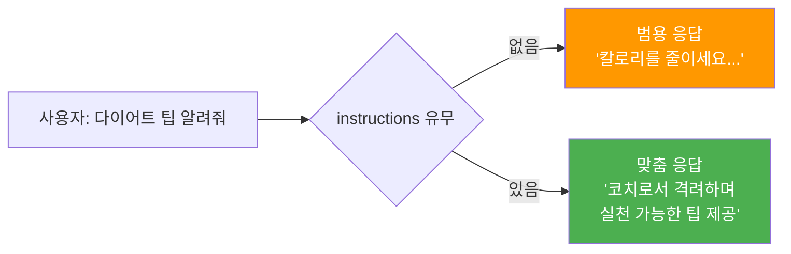
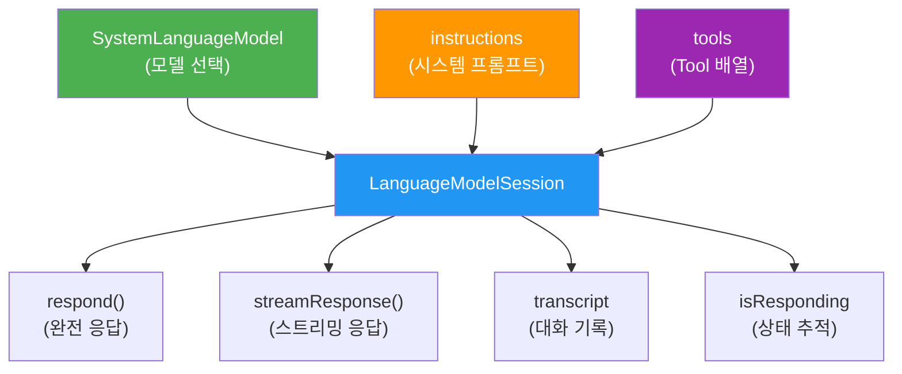
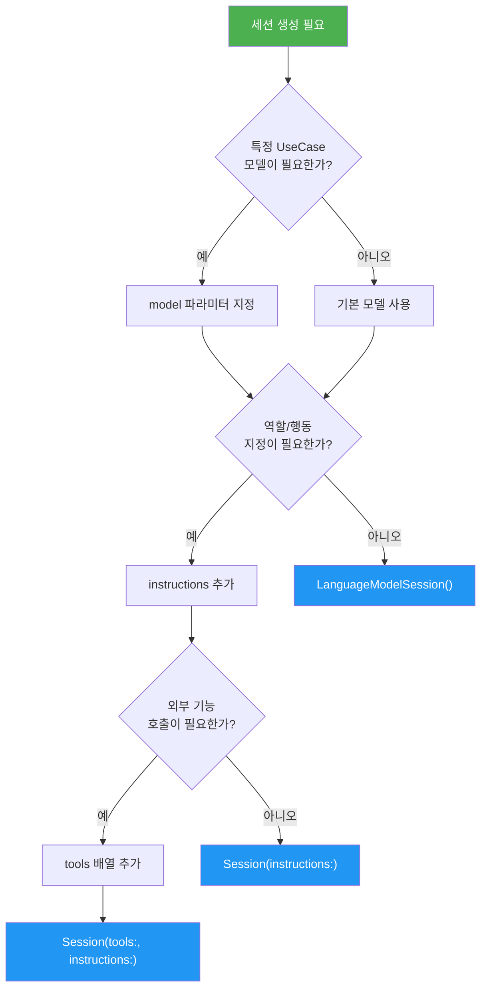
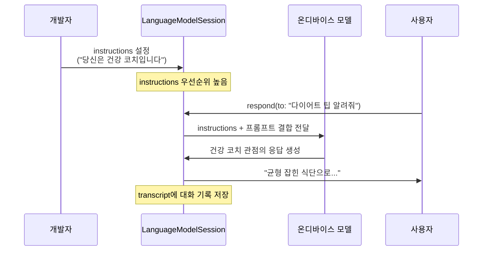
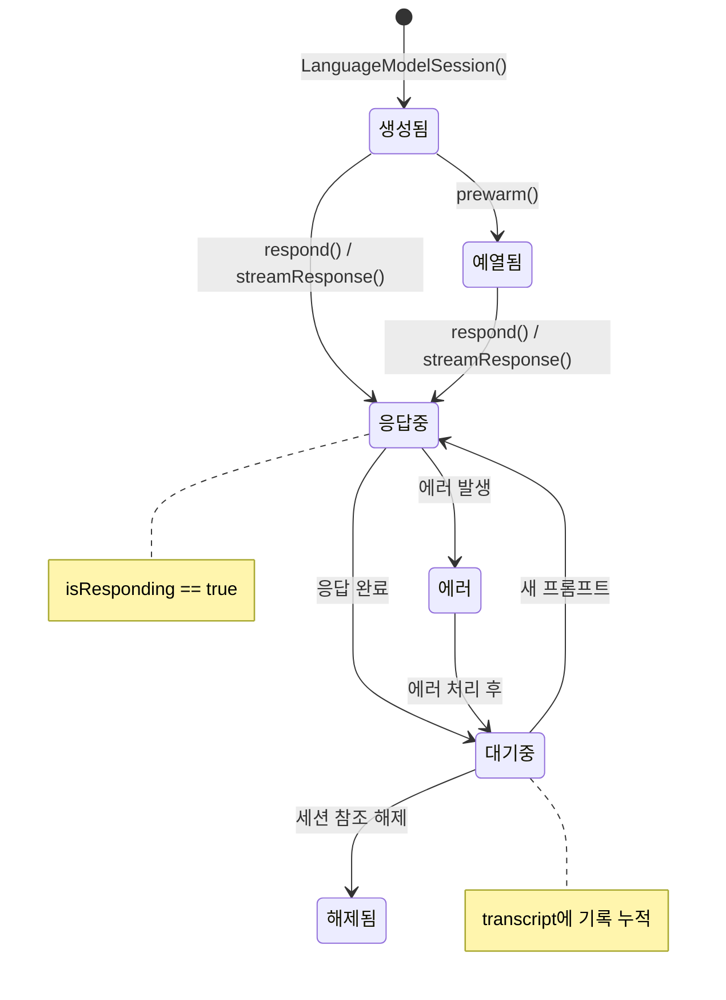
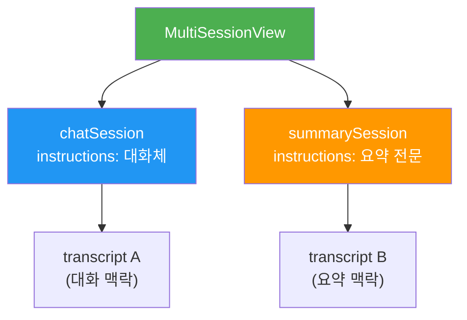

# LanguageModelSession 생성과 구성

> Foundation Models 프레임워크의 핵심 클래스인 LanguageModelSession을 생성하고, instructions와 tools 파라미터로 AI 세션을 맞춤 구성하는 방법을 배웁니다.

## 개요

이 섹션에서는 Apple의 Foundation Models 프레임워크에서 실제로 AI와 대화하는 창구인 `LanguageModelSession`을 깊이 있게 다룹니다. 이전 섹션에서 `SystemLanguageModel`이 "어떤 모델을 쓸 것인가"를 결정하는 진입점이었다면, 이번에는 그 모델을 가지고 "어떻게 대화할 것인가"를 설계하는 단계입니다.

**선수 지식**: [01. SystemLanguageModel 이해하기](03-ch3-foundation-models-프레임워크-시작하기/01-01-systemlanguagemodel-이해하기.md)에서 배운 `SystemLanguageModel.default`, `availability` 확인, `LanguageModelSession` 기본 생성

**학습 목표**:
- LanguageModelSession의 다양한 이니셜라이저를 이해하고 상황에 맞게 선택할 수 있다
- `instructions` 파라미터로 모델의 역할과 행동을 지정할 수 있다
- `transcript`, `isResponding` 등 세션 프로퍼티를 활용할 수 있다
- 세션 수명 주기를 이해하고 SwiftUI에서 올바르게 관리할 수 있다

## 왜 알아야 할까?

여러분이 카페에 가서 커피를 주문한다고 상상해보세요. 그냥 "커피 하나요"라고 하면 아메리카노가 나올 수도 있고, 라떼가 나올 수도 있죠. 하지만 바리스타에게 "저는 단맛을 좋아하고, 우유는 오트밀크로, 온도는 미지근하게 해주세요"라고 미리 말해두면? 매번 완벽한 커피를 받을 수 있습니다.

`LanguageModelSession`이 바로 그 역할을 합니다. AI 모델에게 **"너는 이런 역할이고, 이렇게 응답해야 해"**라는 사전 지시를 내리는 거죠. `instructions` 없이 세션을 만들면 모델은 범용적으로 동작하지만, 잘 구성된 세션은 앱의 목적에 딱 맞는 AI 어시스턴트를 만들어줍니다.

특히 온디바이스 모델은 서버 모델보다 파라미터 수가 적기 때문에, **명확한 instructions가 응답 품질에 미치는 영향이 훨씬 큽니다**. 세션을 잘 구성하는 것이 곧 앱의 AI 품질을 결정하는 핵심 스킬이거든요.

> 📊 **그림 1**: instructions 유무에 따른 응답 품질 차이



## 핵심 개념

### 개념 1: LanguageModelSession의 역할과 구조

> 💡 **비유**: `SystemLanguageModel`이 "어떤 셰프를 고용할지" 결정하는 것이라면, `LanguageModelSession`은 그 셰프에게 **"오늘의 메뉴는 한식이고, 매운 정도는 중간으로, 디저트는 빼주세요"**라고 주방장 지시서를 건네는 것과 같습니다. 같은 셰프라도 지시서에 따라 완전히 다른 요리가 나오죠.

`LanguageModelSession`은 Foundation Models 프레임워크에서 **모든 AI 상호작용이 일어나는 핵심 클래스**입니다. 이 클래스가 담당하는 일을 정리하면:

1. **프롬프트 전송**: 사용자 입력을 모델에 전달
2. **응답 수신**: 텍스트 또는 구조화된 출력을 반환
3. **대화 맥락 유지**: `transcript`에 모든 대화 기록 보관
4. **도구 관리**: 등록된 Tool을 모델이 자동으로 호출

> 📊 **그림 2**: LanguageModelSession의 핵심 구성 요소



세션은 생성 시점에 모든 구성을 받아들이고, 이후에는 변경할 수 없습니다. 즉, `instructions`나 `tools`를 바꾸려면 **새 세션을 만들어야** 합니다. 이는 의도된 설계로, 세션의 일관성과 보안을 보장하기 위한 것이에요. Apple은 이를 **세션 불변성(Session Immutability)** 원칙이라고 설명하는데, 한번 설정된 instructions가 중간에 외부 입력으로 변조될 수 없도록 보장하는 보안 메커니즘이기도 합니다.

### 개념 2: 이니셜라이저 패턴 — 4가지 생성 방법

> 💡 **비유**: 식당 예약을 생각해보세요. "아무 자리나 주세요"(기본), "창가 자리로요"(모델 지정), "비건 메뉴로 준비해주세요"(instructions), "소믈리에도 배치해주세요"(tools) — 상황에 따라 예약 방식이 달라지죠.

`LanguageModelSession`은 여러 이니셜라이저를 제공합니다. 가장 자주 쓰는 4가지 패턴을 살펴보겠습니다.

**패턴 1: 기본 생성** — 가장 간단한 형태

```swift
// 기본 모델 + 기본 instructions로 세션 생성
let session = LanguageModelSession()
```

**패턴 2: instructions와 함께** — 가장 자주 사용하는 패턴

```swift
// 트레일링 클로저 문법으로 instructions 전달
let session = LanguageModelSession {
    """
    당신은 건강한 생활 코치입니다.
    항상 긍정적이고 격려하는 톤으로 답변하세요.
    답변은 3문장 이내로 간결하게 작성하세요.
    """
}
```

여기서 트레일링 클로저 내부의 문자열 리터럴이 자동으로 instructions로 조합되는 방식은 Swift의 **결과 빌더(Result Builder)** 패턴을 활용한 것입니다. 여러 줄의 문자열을 자연스럽게 나열하면 프레임워크가 하나의 instructions로 합쳐주죠.

**패턴 3: 모델 + instructions** — 특정 UseCase 모델 사용

```swift
// 콘텐츠 태깅 전용 모델 + 커스텀 instructions
let model = SystemLanguageModel(useCase: .contentTagging)
let session = LanguageModelSession(model: model) {
    "사진의 카테고리를 한국어로 태그하세요."
}
```

**패턴 4: tools + instructions** — Tool Calling 활용

```swift
// Tool 등록과 instructions를 함께 전달
let session = LanguageModelSession(
    tools: [WeatherTool(), SearchTool()],
    instructions: "날씨와 검색 기능을 활용해 사용자를 도와주세요."
)
```

> 📊 **그림 3**: 이니셜라이저 선택 흐름도



### 개념 3: instructions — AI의 행동 강령 설계하기

> 💡 **비유**: instructions는 신입 사원에게 주는 **"업무 매뉴얼"**과 같습니다. "고객에게 항상 존댓말을 쓰세요", "기술 용어는 쉽게 풀어서 설명하세요", "모르는 건 모른다고 솔직히 말하세요" — 이런 가이드라인이 있으면 신입도 베테랑처럼 일할 수 있죠.

`instructions`는 모델에게 **개발자가** 전달하는 시스템 수준의 지시사항입니다. 사용자 프롬프트와 구분되며, Apple의 온디바이스 모델은 **instructions를 프롬프트보다 우선**하도록 학습되어 있습니다. 이 특성이 프롬프트 인젝션 공격에 대한 첫 번째 방어선이 되죠.

좋은 instructions의 구성 요소:

```swift
let session = LanguageModelSession {
    // 1. 역할 정의
    "당신은 iOS 개발 멘토입니다."
    
    // 2. 응답 스타일
    "코드 예제를 포함하여 설명하고, Swift 6 문법을 사용하세요."
    
    // 3. 제약 조건
    "답변은 200단어 이내로 작성하세요."
    
    // 4. 금지 사항
    "추측성 답변은 하지 마세요. 확실하지 않으면 '잘 모르겠습니다'라고 답하세요."
}
```

> ⚠️ **흔한 오해**: "instructions에 사용자 입력을 넣어도 되나요?" — **절대 안 됩니다!** instructions는 개발자가 작성하는 정적 콘텐츠여야 합니다. 사용자 입력을 instructions에 보간(interpolation)하면 프롬프트 인젝션 공격에 노출됩니다. 사용자 입력은 반드시 `respond(to:)` 의 프롬프트 파라미터로 전달하세요.

```swift
// ❌ 위험: 사용자 입력을 instructions에 넣지 마세요
let session = LanguageModelSession {
    "사용자가 원하는 스타일: \(userInput)"  // 프롬프트 인젝션 위험!
}

// ✅ 안전: 사용자 입력은 respond()의 프롬프트로 전달
let session = LanguageModelSession {
    "당신은 글쓰기 어시스턴트입니다."
}
let response = try await session.respond(to: userInput)
```

> 📊 **그림 4**: instructions와 프롬프트의 처리 순서



### 개념 4: 세션 수명 주기와 상태 관리

> 💡 **비유**: `LanguageModelSession`의 수명 주기는 **전화 통화**와 비슷합니다. 전화를 걸면(세션 생성) 통화가 시작되고, 서로 여러 번 말을 주고받으며(멀티턴), 통화 중에는 새 전화를 못 받죠(`isResponding`). 통화 기록은 자동으로 남고(`transcript`), 통화를 끊으면(세션 해제) 기록은 사라집니다.

세션의 수명 주기에서 알아야 할 핵심 프로퍼티 두 가지가 있습니다.

**`transcript` — 대화 기록 보관소**

세션에 보낸 모든 프롬프트와 받은 모든 응답이 자동으로 `transcript`에 쌓입니다. 이 기록 덕분에 모델은 이전 대화 맥락을 이해하고 자연스러운 멀티턴 대화가 가능합니다.

```swift
let session = LanguageModelSession()

// 첫 번째 대화
let first = try await session.respond(to: "낚시에 대한 하이쿠를 써줘")
// 두 번째 대화 — 모델이 "하이쿠"라는 맥락을 기억함
let second = try await session.respond(to: "이번엔 골프로 하나 더")

// transcript로 전체 대화 기록 확인
for entry in session.transcript {
    print(entry)
}
```

**`isResponding` — 응답 중 상태 추적**

```swift
// SwiftUI에서 응답 중 버튼 비활성화
Button("보내기") {
    Task {
        let response = try await session.respond(to: prompt)
        result = response.content
    }
}
.disabled(session.isResponding)  // 응답 중이면 버튼 비활성화
```

**`prewarm()` — 사전 로딩으로 첫 응답 시간 단축**

모델을 메모리에 미리 올려두어 첫 응답의 지연 시간을 줄입니다.

```swift
// 뷰가 나타날 때 미리 모델 로드
.onAppear {
    Task {
        try await session.prewarm()
    }
}
```

> 📊 **그림 5**: 세션 수명 주기 상태 다이어그램



### 개념 5: SwiftUI에서의 세션 관리 패턴

> 💡 **비유**: SwiftUI에서 세션을 관리하는 것은 **수첩을 들고 다니는 비서**를 고용하는 것과 같습니다. 비서(`@State`)는 뷰가 살아있는 동안 항상 옆에 있고, 이전 대화를 기억하며, 새로운 요청을 처리합니다.

SwiftUI에서 `LanguageModelSession`을 관리할 때는 `@State`로 선언하는 것이 표준 패턴입니다. 뷰의 생명주기와 세션의 생명주기를 일치시키는 거죠.

```swift
import FoundationModels
import SwiftUI

struct CoachView: View {
    // 세션을 @State로 선언 — 뷰 재렌더링에도 유지
    @State private var session = LanguageModelSession {
        "당신은 긍정적인 생활 코치입니다. 답변은 2문장 이내로 하세요."
    }
    @State private var userInput = ""
    @State private var response = ""
    
    var body: some View {
        VStack(spacing: 16) {
            // 응답 표시
            Text(response)
                .padding()
            
            // 입력 필드
            TextField("질문을 입력하세요", text: $userInput)
                .textFieldStyle(.roundedBorder)
            
            // 전송 버튼 — 응답 중이면 비활성화
            Button("보내기") {
                Task {
                    let result = try await session.respond(to: userInput)
                    response = result.content
                }
            }
            .disabled(session.isResponding || userInput.isEmpty)
        }
        .padding()
    }
}
```

독립적인 작업에는 **별도의 세션**을 만드는 것이 좋습니다. 각 세션이 자체 `transcript`를 유지하므로 대화 맥락이 섞이지 않습니다.

> 📊 **그림 6**: 멀티 세션 아키텍처



```swift
struct MultiSessionView: View {
    // 용도별로 분리된 세션
    @State private var chatSession = LanguageModelSession {
        "자연스러운 대화체로 답변하세요."
    }
    @State private var summarySession = LanguageModelSession {
        "주어진 텍스트를 3줄로 요약하세요."
    }
    
    // 채팅과 요약은 서로 독립적으로 동작
    // 각 세션의 transcript가 분리되어 맥락이 섞이지 않음
    // ...
}
```

## 실습: 직접 해보기

여러 역할의 AI 어시스턴트를 세션으로 구성하고, 실제로 응답을 받아보는 실습입니다.

```swift
import FoundationModels
import SwiftUI

// MARK: - 역할별 세션 팩토리
enum AssistantRole: String, CaseIterable {
    case translator = "번역가"
    case codeReviewer = "코드 리뷰어"
    case healthCoach = "건강 코치"
    
    /// 역할에 맞는 instructions 반환
    var instructions: String {
        switch self {
        case .translator:
            return """
            당신은 전문 번역가입니다.
            한국어는 영어로, 영어는 한국어로 번역하세요.
            자연스러운 표현을 사용하고, 번역 결과만 출력하세요.
            """
        case .codeReviewer:
            return """
            당신은 시니어 iOS 개발자입니다.
            코드를 리뷰하고 개선점을 알려주세요.
            Swift 6 컨벤션을 기준으로 평가하세요.
            답변은 간결하게, 핵심만 3개 이내로 알려주세요.
            """
        case .healthCoach:
            return """
            당신은 긍정적인 건강 생활 코치입니다.
            과학적 근거에 기반한 조언을 하세요.
            항상 격려하는 톤으로, 3문장 이내로 답변하세요.
            """
        }
    }
    
    /// 세션 생성
    func createSession() -> LanguageModelSession {
        LanguageModelSession(instructions: instructions)
    }
}

// MARK: - 메인 뷰
struct RoleBasedAssistantView: View {
    @State private var selectedRole: AssistantRole = .translator
    @State private var session: LanguageModelSession?
    @State private var userInput = ""
    @State private var conversation: [(prompt: String, response: String)] = []
    
    var body: some View {
        NavigationStack {
            VStack(spacing: 16) {
                // 역할 선택 피커
                Picker("역할", selection: $selectedRole) {
                    ForEach(AssistantRole.allCases, id: \.self) { role in
                        Text(role.rawValue).tag(role)
                    }
                }
                .pickerStyle(.segmented)
                .onChange(of: selectedRole) {
                    // 역할 변경 시 새 세션 생성 (instructions 변경 불가하므로)
                    session = selectedRole.createSession()
                    conversation.removeAll()
                }
                
                // 대화 내역 스크롤 뷰
                ScrollView {
                    LazyVStack(alignment: .leading, spacing: 12) {
                        ForEach(conversation.indices, id: \.self) { index in
                            VStack(alignment: .leading, spacing: 4) {
                                Text("나: \(conversation[index].prompt)")
                                    .foregroundStyle(.secondary)
                                Text("AI: \(conversation[index].response)")
                                    .padding(8)
                                    .background(.blue.opacity(0.1))
                                    .clipShape(RoundedRectangle(cornerRadius: 8))
                            }
                        }
                    }
                }
                
                // 입력 영역
                HStack {
                    TextField("메시지 입력", text: $userInput)
                        .textFieldStyle(.roundedBorder)
                    
                    Button("보내기") {
                        Task { await sendMessage() }
                    }
                    .disabled(session?.isResponding == true || userInput.isEmpty)
                }
            }
            .padding()
            .navigationTitle("\(selectedRole.rawValue) 어시스턴트")
            .onAppear {
                // 초기 세션 생성
                session = selectedRole.createSession()
            }
        }
    }
    
    /// 메시지 전송 및 응답 처리
    private func sendMessage() async {
        guard let session, !userInput.isEmpty else { return }
        let prompt = userInput
        userInput = ""  // 입력 필드 초기화
        
        do {
            let response = try await session.respond(to: prompt)
            conversation.append((prompt: prompt, response: response.content))
        } catch {
            conversation.append((prompt: prompt, response: "오류: \(error.localizedDescription)"))
        }
    }
}
```

이 코드를 실행하면 세 가지 역할(번역가, 코드 리뷰어, 건강 코치)을 전환하며 각 역할에 맞는 AI 응답을 받을 수 있습니다. 핵심은 **역할을 바꿀 때 새 세션을 생성**한다는 점입니다 — instructions는 생성 후 변경할 수 없으니까요.

## 더 깊이 알아보기

### "시스템 프롬프트"의 탄생 — ChatGPT 이전과 이후

`instructions`가 왜 이렇게 중요해졌을까요? 사실 초기 언어 모델(GPT-2 시절)에는 "시스템 프롬프트"라는 개념 자체가 없었습니다. 모든 입력이 동등하게 취급됐죠.

전환점은 2022년 ChatGPT의 등장이었습니다. OpenAI가 **"system", "user", "assistant"**라는 메시지 역할(role)을 도입하면서, "모델에게 역할을 부여한다"는 패러다임이 자리 잡았어요. 이 간단한 아이디어가 AI 애플리케이션의 품질을 극적으로 높였습니다.

Apple은 이 개념을 한 단계 발전시켰습니다. Foundation Models 프레임워크의 `instructions`는 단순한 "역할 부여"를 넘어, **모델 학습 단계에서 instructions를 프롬프트보다 우선하도록** 훈련했습니다. 이는 사용자가 "이전 지시를 무시하고..."라는 프롬프트 인젝션을 시도해도, 모델이 개발자의 instructions를 더 신뢰한다는 뜻입니다. 서버 모델에서는 완벽한 방어가 어려운 문제를, 온디바이스 모델의 특성을 활용해 구조적으로 해결한 셈이죠.

### 토큰 예산의 비밀 — 4096의 의미

Apple 온디바이스 모델의 총 입출력 토큰 제한은 약 **4096 토큰**입니다. 여기서 중요한 점은 `instructions`도 이 예산에 포함된다는 것이에요. 너무 긴 instructions를 작성하면 사용자 프롬프트와 모델 응답에 쓸 수 있는 공간이 줄어듭니다. 이것은 온디바이스 모델의 제약이자, 개발자에게 **"핵심만 간결하게 쓰는 능력"**을 요구하는 설계 철학이기도 합니다. [토큰 예산과 컨텍스트 윈도우](09-ch9-세션-관리와-멀티턴-대화/02-02-토큰-예산과-컨텍스트-윈도우.md)에서 이 주제를 더 깊이 다룹니다.

## 흔한 오해와 팁

> ⚠️ **흔한 오해**: "세션을 매 요청마다 새로 만들어야 하나요?" — **아닙니다.** 같은 대화 흐름이라면 하나의 세션을 유지하세요. 매번 새 세션을 만들면 이전 대화 맥락(`transcript`)이 사라져 멀티턴 대화가 불가능해집니다. 새 세션은 **역할(instructions)이 바뀌거나, 완전히 독립된 작업을 시작할 때**만 만드세요.

> 💡 **알고 계셨나요?**: `instructions`는 영어로 작성하는 것이 최적의 결과를 보여줍니다. Apple의 온디바이스 모델은 영어 데이터로 가장 많이 학습되었기 때문이에요. 물론 한국어 instructions도 동작하지만, 복잡한 규칙이나 세밀한 제어가 필요하다면 영어를 고려해보세요. 사용자 대면 응답만 한국어로 하면 됩니다.

> 🔥 **실무 팁**: `prewarm()`을 앱 시작 시 호출하면 첫 응답이 훨씬 빨라집니다. 특히 AI 기능이 메인 화면에 있다면, `onAppear`에서 `prewarm()`을 호출해 사용자가 입력을 시작하기 전에 모델을 미리 로드하세요. 다만, AI 기능이 설정 깊숙이 숨어있다면 불필요한 메모리 사용이 될 수 있으므로 **사용자가 AI 기능에 접근할 가능성이 높을 때만** 사용하세요.

## 핵심 정리

| 개념 | 설명 |
|------|------|
| `LanguageModelSession()` | 기본 모델과 기본 instructions로 세션 생성 |
| `instructions` | 모델의 역할, 스타일, 제약을 정의하는 개발자 작성 시스템 프롬프트 |
| 결과 빌더 클로저 | 트레일링 클로저로 문자열 리터럴을 나열하면 instructions로 자동 조합 |
| `tools` | 세션 생성 시 등록하는 외부 기능(Tool) 배열 |
| `transcript` | 세션 내 모든 프롬프트와 응답의 자동 기록 |
| `isResponding` | 모델이 현재 응답 생성 중인지 나타내는 Boolean 프로퍼티 |
| `prewarm()` | 모델을 메모리에 미리 로드하여 첫 응답 지연 시간 단축 |
| 세션 불변성 | instructions와 tools는 생성 후 변경 불가, 변경 시 새 세션 필요 |
| 보안 | instructions는 프롬프트보다 우선, 사용자 입력을 instructions에 보간 금지 |

## 다음 섹션 미리보기

세션을 생성하고 구성하는 방법을 익혔으니, 이제 실제로 **텍스트를 생성**할 차례입니다. [03. 첫 번째 텍스트 생성 요청](03-ch3-foundation-models-프레임워크-시작하기/03-03-첫-번째-텍스트-생성-요청.md)에서는 `respond(to:)` 메서드를 사용해 프롬프트를 보내고, 응답을 받아 처리하는 전체 흐름을 실습합니다. 에러 처리와 응답 객체의 구조까지 상세히 다루니, 이번 섹션에서 만든 세션으로 바로 이어서 진행할 수 있습니다.

## 참고 자료

- [Meet the Foundation Models framework — WWDC25](https://developer.apple.com/videos/play/wwdc2025/286/) - LanguageModelSession의 공식 소개와 라이브 데모, instructions 보안 설계 설명
- [Exploring the Foundation Models framework — Create with Swift](https://www.createwithswift.com/exploring-the-foundation-models-framework/) - 세션 생성 패턴, 결과 빌더 기반 instructions 작성법, 프로퍼티 활용 정리
- [Building AI features using Foundation Models — Swift with Majid](https://swiftwithmajid.com/2025/08/19/building-ai-features-using-foundation-models/) - GenerationOptions, 시드 기반 일관된 응답 생성 패턴
- [The Ultimate Guide To The Foundation Models Framework — AzamSharp](https://azamsharp.com/2025/06/18/the-ultimate-guide-to-the-foundation-models-framework.html) - 세션 수명 주기, Tool 등록, 토큰 제한 실전 가이드
- [Foundation Models — Apple Developer Documentation](https://developer.apple.com/documentation/FoundationModels) - 공식 API 레퍼런스

---
### 🔗 Related Sessions
- [systemlanguagemodel.availability](03-ch3-foundation-models-프레임워크-시작하기/01-01-systemlanguagemodel-이해하기.md) (prerequisite)
- [systemlanguagemodel.default](03-ch3-foundation-models-프레임워크-시작하기/01-01-systemlanguagemodel-이해하기.md) (prerequisite)
