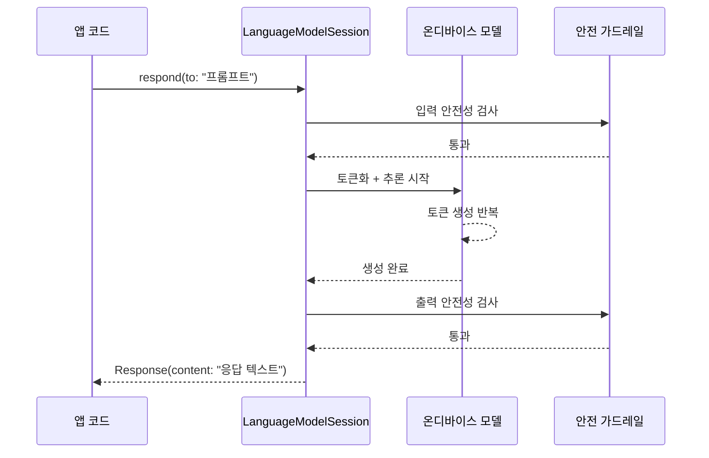
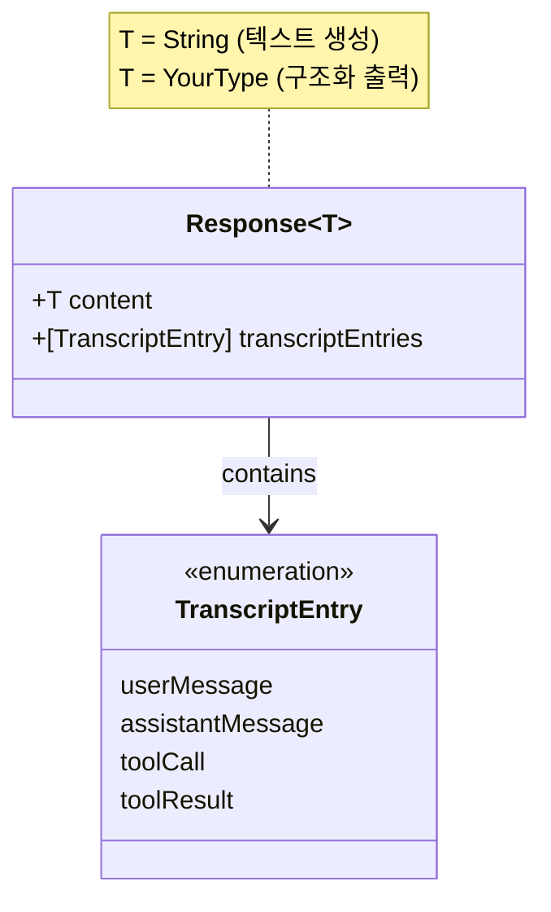
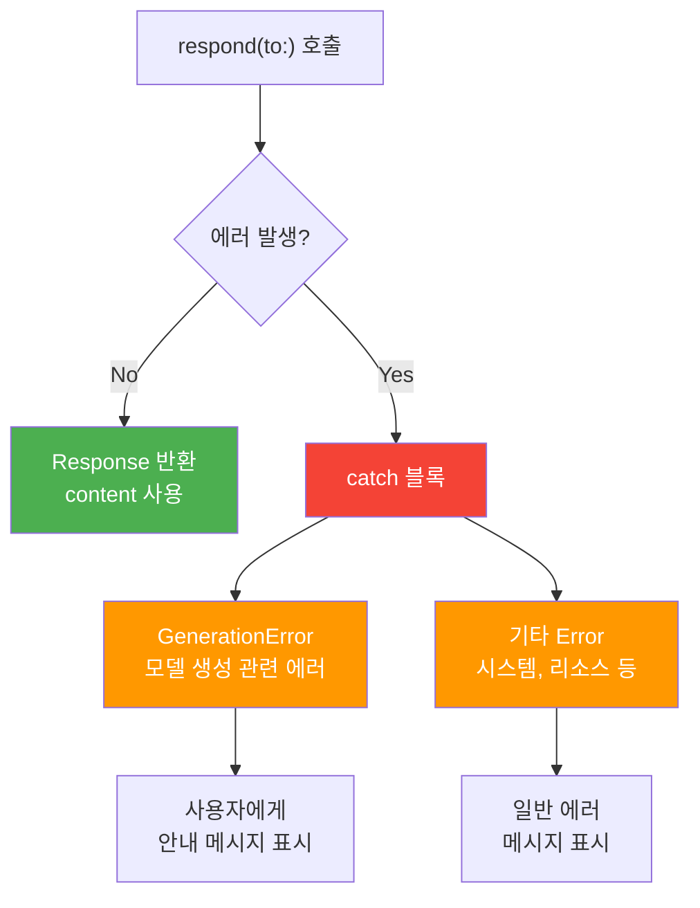
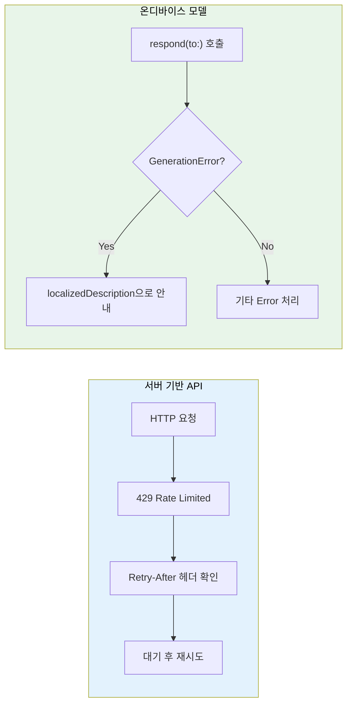
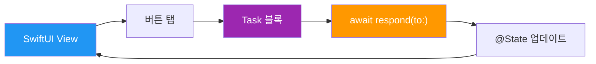

# 첫 번째 텍스트 생성 요청

> `respond(to:)` 메서드로 온디바이스 AI에게 첫 텍스트 생성을 요청하고, 응답 객체를 분석하며, 에러를 안전하게 처리하는 방법을 배웁니다.

## 개요

이 섹션에서는 드디어 Foundation Models 프레임워크를 사용해 **실제로 텍스트를 생성**합니다. 이전 두 섹션에서 모델을 선택하고(`SystemLanguageModel`) 세션을 구성하는(`LanguageModelSession`) 방법을 배웠다면, 이번에는 그 세션에 프롬프트를 보내고 응답을 받아 처리하는 전체 흐름을 익힙니다.

**선수 지식**: [01. SystemLanguageModel 이해하기](03-ch3-foundation-models-프레임워크-시작하기/01-01-systemlanguagemodel-이해하기.md)에서 배운 모델 가용성 확인, [02. LanguageModelSession 생성과 구성](03-ch3-foundation-models-프레임워크-시작하기/02-02-languagemodelsession-생성과-구성.md)에서 배운 세션 이니셜라이저와 instructions 설정

**학습 목표**:
- `respond(to:)` 메서드로 텍스트 생성을 요청할 수 있다
- `Response<String>` 객체의 구조를 이해하고 `content`를 올바르게 추출할 수 있다
- 기본 `do-catch` 패턴으로 생성 에러를 안전하게 잡아낼 수 있다

## 왜 알아야 할까?

여태까지 우리는 주방(모델)을 골랐고, 주방장에게 오늘의 지시서(instructions)도 건넸습니다. 그런데 정작 **"이 재료로 요리해주세요!"**라는 주문을 아직 넣지 않았잖아요? 아무리 훌륭한 셰프도 주문이 없으면 요리를 시작할 수 없습니다.

`respond(to:)`가 바로 그 **주문서**입니다. 이 메서드 하나로 텍스트 생성의 모든 것이 시작되죠. 그리고 현실의 주방처럼, "재료가 떨어졌어요"(컨텍스트 초과), "이 요리는 만들 수 없어요"(가드레일 위반) 같은 예외 상황도 발생합니다. 이런 에러를 우아하게 처리하는 것이 앱의 안정성을 결정하는 핵심이에요.

실제로 App Store에 출시되는 AI 기능 앱에서 가장 많은 1점 리뷰가 달리는 이유 중 하나가 바로 **에러 상황에서 앱이 아무 반응 없이 멈추는 것**입니다. 이번 섹션에서 배우는 기본 에러 핸들링만으로도, 사용자가 "무슨 일이 일어나는지" 알 수 있는 앱을 만들 수 있습니다.

## 핵심 개념

### 개념 1: respond(to:) — 텍스트 생성의 시작점

> 💡 **비유**: 편지를 부치는 것과 비슷합니다. 우체통에 편지(프롬프트)를 넣으면, 우체국(온디바이스 모델)이 처리해서 답장(Response)을 보내줍니다. `respond(to:)`는 `async throws`이므로, 답장이 올 때까지 기다리되(`await`), 배달 사고가 나면 알려달라(`try`)는 의미죠.

`respond(to:)` 메서드는 `LanguageModelSession`의 핵심 메서드로, 프롬프트 문자열을 받아 모델의 완전한 응답을 반환합니다. 이 메서드는 **비동기(async)**이며, **에러를 던질 수 있는(throws)** 함수입니다.

```swift
// 가장 기본적인 사용법
import FoundationModels

let session = LanguageModelSession()
let response = try await session.respond(to: "Swift의 장점을 세 가지 알려주세요.")
print(response.content) // 생성된 텍스트
```

호출 흐름을 자세히 살펴보면:

> 📊 **그림 1**: respond(to:) 호출부터 응답까지의 전체 흐름



중요한 점은 `respond(to:)`가 **모든 토큰 생성이 완료된 후에** 결과를 반환한다는 것입니다. 짧은 응답이라면 괜찮지만, 긴 텍스트를 생성할 때는 사용자가 아무것도 보지 못한 채 기다려야 하는 상황이 생길 수 있어요. 이 문제는 나중에 [01. streamResponse API 기초](06-ch6-스트리밍-응답과-실시간-ui/01-01-streamresponse-api-기초.md)에서 스트리밍으로 해결합니다.

`respond(to:)` 메서드에는 문자열 외에도 다양한 오버로드가 존재합니다:

```swift
// 1. 단순 문자열 프롬프트
let response = try await session.respond(to: "안녕하세요")

// 2. 구조화 출력 (Ch5에서 상세히 다룸)
let response = try await session.respond(
    to: "오늘의 날씨를 알려주세요",
    generating: Weather.self
)

// 3. GenerationOptions와 함께 (다음 섹션에서 상세히 다룸)
let response = try await session.respond(
    to: "짧은 시 한 편 써주세요",
    options: GenerationOptions(temperature: 0.8)
)
```

이번 섹션에서는 1번 패턴, 즉 **문자열 프롬프트로 텍스트를 생성하는 가장 기본적인 흐름**에 집중합니다.

### 개념 2: Response 객체 해부하기

> 💡 **비유**: 택배를 받으면 상자 안에 물건(content)만 있는 게 아니라, 운송장에 보낸 사람, 배송 일시, 추적 번호 같은 정보가 함께 있죠. `Response` 객체도 마찬가지로, 생성된 텍스트 외에 유용한 메타데이터를 담고 있습니다.

`respond(to:)` 메서드는 `Response<String>` 타입의 객체를 반환합니다. 이 제네릭 타입에서 `String`은 일반 텍스트 생성의 경우이고, 구조화 출력을 사용하면 `Response<YourType>`이 됩니다.

> 📊 **그림 2**: Response 객체의 주요 프로퍼티 구조



핵심 프로퍼티를 살펴보겠습니다:

| 프로퍼티 | 타입 | 설명 |
|---------|------|------|
| `content` | `T` (보통 `String`) | 모델이 생성한 텍스트 또는 구조화된 값 |
| `transcriptEntries` | `[TranscriptEntry]` | 이번 요청/응답의 대화 기록 엔트리 |

가장 자주 사용하는 패턴은 `.content`로 생성된 텍스트를 직접 꺼내는 것입니다:

```swift
let session = LanguageModelSession(instructions: "당신은 한국어 번역 전문가입니다.")
let response = try await session.respond(to: "Translate: 'Hello, World!'")

// content로 텍스트 추출
let translatedText = response.content
// translatedText: "안녕, 세계!"
```

한 가지 흥미로운 점은, `respond(to:)`를 호출할 때마다 세션의 `transcript`에 대화 기록이 자동으로 누적된다는 것입니다. 이를 통해 모델은 이전 대화 맥락을 기억하고, 멀티턴 대화가 자연스럽게 이어집니다.

```run:swift
// 첫 번째 질문
let first = try await session.respond(to: "Swift는 누가 만들었나요?")
print(first.content)

// 두 번째 질문 — 세션이 맥락을 기억함
let second = try await session.respond(to: "그 사람은 어떤 프로젝트도 만들었나요?")
print(second.content)
```

```output
Swift는 Apple의 Chris Lattner가 2010년에 개발을 시작했습니다...
Chris Lattner는 LLVM 컴파일러 프로젝트를 만든 것으로도 유명합니다...
```

두 번째 질문에서 "그 사람"이 Chris Lattner를 가리킨다는 것을 세션이 이해합니다. 이전 대화 맥락이 `transcript`에 자동으로 유지되기 때문이죠.

> 🔥 **실무 팁**: `.content`에 접근하는 것이 전부라면, 체이닝으로 더 간결하게 쓸 수 있습니다: `let text = try await session.respond(to: prompt).content` — 한 줄로 프롬프트 전송부터 텍스트 추출까지 완료됩니다.

### 개념 3: 기본 에러 처리 — do-catch로 안전하게 잡기

> 💡 **비유**: ATM기에서 돈을 뽑을 때를 생각해보세요. 잔액 부족, 카드 정지 — 각 상황마다 화면에 다른 안내 메시지가 나오죠. `respond(to:)`도 문제가 생기면 에러를 던지는데, 일단은 **"문제가 생겼다는 것을 감지하고, 사용자에게 알려주는 것"**이 첫 번째 단계입니다.

`respond(to:)` 메서드는 `throws`로 선언되어 있으므로, 호출 시 반드시 에러를 처리해야 합니다. 가장 기본적인 패턴은 2단계 `do-catch`입니다:

> 📊 **그림 3**: 기본 do-catch 에러 처리 흐름



```swift
func generateResponse(prompt: String) async -> String {
    do {
        let response = try await session.respond(to: prompt)
        return response.content
    } catch let error as LanguageModelSession.GenerationError {
        // Foundation Models 전용 에러 — 모델 생성 과정에서 발생
        return "AI 응답을 생성할 수 없습니다. \(error.localizedDescription)"
    } catch {
        // 시스템 에러, 리소스 부족 등 기타
        return "알 수 없는 오류가 발생했습니다: \(error.localizedDescription)"
    }
}
```

이 패턴의 핵심은 **두 단계로 에러를 분리**하는 것입니다:

1. **`LanguageModelSession.GenerationError`**: 모델 생성 과정에서 발생하는 전용 에러 (가드레일 위반, 컨텍스트 초과 등)
2. **일반 `Error`**: 그 외 시스템 수준 에러

지금 단계에서는 `GenerationError`를 하나의 타입으로 잡아서 `localizedDescription`으로 사용자에게 안내하는 것만으로 충분합니다. 에러의 세부 케이스별 분기 처리, 재시도 로직, 검증 패턴 등 **프로덕션 수준의 에러 핸들링**은 [05. 에러 처리와 안전한 생성](05-ch5-structured-output과-에러-처리/05-05-에러-처리와-안전한-생성.md)에서 체계적으로 다룹니다.

> ⚠️ **흔한 오해**: 서버 기반 API(예: OpenAI, Anthropic)에서 익숙한 `rateLimited`(속도 제한) 에러를 온디바이스 모델에서도 기대하기 쉽습니다. 하지만 온디바이스 모델은 네트워크를 거치지 않고 **디바이스의 컴퓨팅 리소스(메모리, Neural Engine)**를 직접 사용하므로, HTTP 상태 코드 기반의 에러 패턴 자체가 존재하지 않습니다. 리소스가 부족한 상황은 에러보다는 **처리 속도 저하**로 나타나는 경우가 많습니다.

> 📊 **그림 4**: 서버 API vs 온디바이스 모델의 에러 처리 비교



> 💡 **알고 계셨나요?**: 기존 서버 기반 LLM API에서는 `429 Too Many Requests` 에러와 함께 `Retry-After` 헤더를 받아 재시도 로직을 구현하는 것이 일반적입니다. 하지만 온디바이스 모델은 Swift의 `Error` 프로토콜과 타입 캐스팅(`as LanguageModelSession.GenerationError`)을 활용한 패턴 매칭이 핵심입니다. 클라우드 AI 개발 경험이 있는 분이라면 이 차이를 명확히 인식해두세요.

### 개념 4: respond(to:)의 비동기 특성과 Swift Concurrency

> 💡 **비유**: 음식점에서 "주문하고 자리에서 기다리기"(await)와 "주문하고 다른 볼일 보다 오기"(Task로 비동기 실행)의 차이입니다. `respond(to:)`는 전자에 해당하는데, UI를 멈추지 않으려면 올바른 비동기 패턴이 필수입니다.

`respond(to:)`는 `async` 함수이므로 반드시 비동기 컨텍스트에서 호출해야 합니다. SwiftUI에서는 주로 `.task` 수정자나 `Task { }` 블록 내에서 사용합니다.

> 📊 **그림 5**: SwiftUI에서 respond(to:) 호출 패턴



```swift
import SwiftUI
import FoundationModels

struct SimpleAIView: View {
    @State private var session = LanguageModelSession()
    @State private var prompt = ""
    @State private var result = ""
    @State private var isLoading = false

    var body: some View {
        VStack(spacing: 16) {
            TextField("질문을 입력하세요", text: $prompt)
                .textFieldStyle(.roundedBorder)

            Button("생성") {
                Task {
                    isLoading = true
                    defer { isLoading = false }

                    do {
                        // respond(to:)는 async throws — await + try 필수
                        let response = try await session.respond(to: prompt)
                        result = response.content
                    } catch {
                        result = "오류: \(error.localizedDescription)"
                    }
                }
            }
            .disabled(isLoading || prompt.isEmpty)

            if isLoading {
                ProgressView("생성 중...")
            }

            Text(result)
                .padding()
        }
        .padding()
    }
}
```

여기서 `Task { }` 블록이 핵심입니다. 버튼 액션은 동기 컨텍스트이므로, `Task`로 비동기 컨텍스트를 만들어야 `await`를 쓸 수 있어요. `isLoading` 플래그로 UI 상태를 관리하고, `defer`로 로딩이 반드시 해제되게 보장합니다.

## 실습: 직접 해보기

실전에서 바로 사용할 수 있는 AI 텍스트 생성기를 만들어보겠습니다. 모델 가용성 확인부터 에러 처리까지 이번 섹션에서 배운 모든 내용을 통합합니다.

```swift
import SwiftUI
import FoundationModels

// MARK: - AI 서비스 레이어
@Observable
class AITextGenerator {
    private var session: LanguageModelSession

    var lastResponse: String = ""
    var errorMessage: String?
    var isGenerating = false

    // instructions로 한국어 어시스턴트 역할 부여
    init() {
        self.session = LanguageModelSession(
            instructions: """
            당신은 친절한 한국어 AI 어시스턴트입니다.
            질문에 간결하고 정확하게 답변하세요.
            답변은 3문장 이내로 해주세요.
            """
        )
    }

    // 모델 가용성 확인
    var isModelAvailable: Bool {
        SystemLanguageModel.default.availability == .available
    }

    // 텍스트 생성 요청
    func generate(prompt: String) async {
        guard !prompt.isEmpty else { return }
        guard isModelAvailable else {
            errorMessage = "AI 모델을 사용할 수 없습니다."
            return
        }

        isGenerating = true
        errorMessage = nil

        do {
            // 핵심: respond(to:)로 텍스트 생성
            let response = try await session.respond(to: prompt)
            lastResponse = response.content
        } catch let error as LanguageModelSession.GenerationError {
            // GenerationError — 사용자에게 안내 메시지 표시
            // 세부 케이스별 분기는 Ch5.5에서 다룹니다
            errorMessage = "AI 생성 오류: \(error.localizedDescription)"
        } catch {
            // 기타 에러 (시스템, 리소스 부족 등)
            errorMessage = "예상치 못한 오류: \(error.localizedDescription)"
        }

        isGenerating = false
    }

    // 새 세션 시작 (대화가 길어졌을 때 사용)
    func resetSession() {
        session = LanguageModelSession(
            instructions: """
            당신은 친절한 한국어 AI 어시스턴트입니다.
            질문에 간결하고 정확하게 답변하세요.
            답변은 3문장 이내로 해주세요.
            """
        )
        lastResponse = ""
        errorMessage = nil
    }
}

// MARK: - SwiftUI 뷰
struct TextGeneratorView: View {
    @State private var generator = AITextGenerator()
    @State private var userInput = ""

    var body: some View {
        NavigationStack {
            VStack(spacing: 20) {
                // 모델 상태 표시
                HStack {
                    Circle()
                        .fill(generator.isModelAvailable ? .green : .red)
                        .frame(width: 10, height: 10)
                    Text(generator.isModelAvailable
                         ? "AI 모델 준비됨"
                         : "AI 모델 사용 불가")
                        .font(.caption)
                        .foregroundStyle(.secondary)
                }

                // 입력 영역
                TextField("질문을 입력하세요...", text: $userInput, axis: .vertical)
                    .textFieldStyle(.roundedBorder)
                    .lineLimit(1...5)

                // 생성 버튼
                HStack {
                    Button("생성하기") {
                        Task {
                            await generator.generate(prompt: userInput)
                        }
                    }
                    .buttonStyle(.borderedProminent)
                    .disabled(generator.isGenerating || userInput.isEmpty)

                    Button("세션 초기화") {
                        generator.resetSession()
                        userInput = ""
                    }
                    .buttonStyle(.bordered)
                }

                // 로딩 표시
                if generator.isGenerating {
                    ProgressView("AI가 생각하고 있습니다...")
                }

                // 에러 표시
                if let error = generator.errorMessage {
                    Text(error)
                        .foregroundStyle(.red)
                        .font(.callout)
                        .padding()
                        .background(.red.opacity(0.1), in: .rect(cornerRadius: 8))
                }

                // 응답 표시
                if !generator.lastResponse.isEmpty {
                    VStack(alignment: .leading, spacing: 8) {
                        Text("AI 응답")
                            .font(.headline)
                        Text(generator.lastResponse)
                            .padding()
                            .background(.gray.opacity(0.1), in: .rect(cornerRadius: 12))
                    }
                }

                Spacer()
            }
            .padding()
            .navigationTitle("AI 텍스트 생성기")
        }
    }
}
```

이 실습 코드의 핵심 포인트:

1. **서비스 분리**: `AITextGenerator`가 세션과 생성 로직을 캡슐화합니다
2. **가용성 확인**: 생성 전에 `isModelAvailable`로 모델 상태를 체크합니다
3. **2단계 에러 처리**: `GenerationError`와 일반 에러를 분리해서 잡되, 이 단계에서는 `localizedDescription`으로 통합 안내합니다
4. **세션 리셋**: 대화가 길어졌을 때 새 세션으로 전환할 수 있습니다

## 더 깊이 알아보기

### respond(to:)의 탄생 배경 — "한 줄로 AI를 쓸 수 있어야 한다"

Apple이 WWDC25에서 Foundation Models 프레임워크를 발표했을 때, 가장 강조한 메시지 중 하나가 **"simplicity"**였습니다. 당시 대부분의 온디바이스 LLM 솔루션은 모델 로딩, 토크나이저 초기화, 추론 엔진 설정 등 수십 줄의 보일러플레이트 코드가 필요했거든요.

Foundation Models 팀의 설계 철학은 명확했습니다: **"개발자가 AI 텍스트 생성을 시작하는 데 필요한 코드가 3줄을 넘으면 안 된다."** 실제로 `import FoundationModels` → `LanguageModelSession()` → `try await session.respond(to:)` — 이 3줄이면 온디바이스 AI 텍스트 생성이 완료됩니다. 이것은 당시 경쟁 프레임워크들이 수십 줄의 설정 코드를 요구하던 것과 극명한 대비를 이루었죠.

이 설계는 Apple의 오랜 전통과도 맞닿아 있습니다. 2014년 Swift 언어를 처음 발표할 때도 Chris Lattner는 "Hello, World!" 프로그램을 `print("Hello, World!")` 한 줄로 만든 것을 강조했었죠. Foundation Models의 `respond(to:)`는 그 정신의 AI 시대 버전이라고 할 수 있습니다.

### Apple의 듀얼 가드레일 아키텍처

앞서 에러 처리에서 잠깐 언급한 가드레일의 배경을 좀 더 살펴보겠습니다. Apple Intelligence 기술 보고서에 따르면, Apple은 **입력 필터(Input Filter)**와 **출력 필터(Output Filter)** 두 단계로 안전성을 검증합니다. 입력 단계에서는 위험한 프롬프트를 사전에 차단하고, 출력 단계에서는 모델이 생성한 텍스트가 안전 기준을 충족하는지 재검증합니다. 이중 검문소를 거치기 때문에 개발자가 별도의 콘텐츠 필터를 구현할 필요가 없어요.

> 💡 **알고 계셨나요?**: Apple의 온디바이스 가드레일은 별도의 소형 분류 모델로 동작합니다. 즉, 메인 LLM과는 독립적으로 안전성을 판단하기 때문에, 프롬프트 인젝션 공격으로 가드레일을 우회하기가 매우 어렵습니다. 이 접근법은 "self-policing"(모델 스스로 검열)보다 훨씬 안전한 것으로 알려져 있습니다.

## 흔한 오해와 팁

> ⚠️ **흔한 오해**: "`respond(to:)`를 호출할 때마다 모델이 새로 로드된다"고 생각하는 분이 많습니다. 실제로는 `SystemLanguageModel`이 시스템 레벨에서 모델을 관리하므로, 한 번 로드되면 여러 세션에서 공유됩니다. 다만 첫 호출 시 약간의 초기화 시간이 있을 수 있는데, 이를 줄이려면 이전 섹션에서 배운 `prewarm()`을 활용하세요.

> ⚠️ **흔한 오해**: "에러를 그냥 `catch { print(error) }`로 잡으면 되는 거 아닌가요?"라고 생각하기 쉽습니다. 최소한 `GenerationError`와 일반 `Error`를 분리하는 2단계 catch는 꼭 사용하세요. 그래야 나중에 세부 케이스별 처리로 확장하기 쉽습니다. 에러 케이스별 분기(가드레일 위반 시 프롬프트 수정 안내, 컨텍스트 초과 시 세션 리셋 등)와 재시도 전략은 [05. 에러 처리와 안전한 생성](05-ch5-structured-output과-에러-처리/05-05-에러-처리와-안전한-생성.md)에서 프로덕션 수준으로 다룹니다.

> 💡 **알고 계셨나요?**: `respond(to:)`가 반환하는 응답의 길이는 모델과 프롬프트에 따라 달라지지만, 기본적으로 모델이 자연스러운 종료 지점을 스스로 결정합니다. 만약 응답 길이를 제한하고 싶다면, 다음 섹션 [04. GenerationOptions와 생성 제어](03-ch3-foundation-models-프레임워크-시작하기/04-04-generationoptions와-생성-제어.md)에서 배울 `maximumResponseTokens` 옵션을 사용할 수 있습니다.

> 🔥 **실무 팁**: 에러 처리 시 사용자에게 기술적인 에러 메시지를 그대로 보여주지 마세요. `error.localizedDescription`을 기반으로 하되, 앱의 맥락에 맞게 재구성하세요. 예를 들어 "해당 주제에 대해서는 도움을 드리기 어렵습니다. 다른 질문을 해보세요"처럼 안내하는 것이 좋습니다.

## 핵심 정리

| 개념 | 설명 |
|------|------|
| `respond(to:)` | `LanguageModelSession`의 핵심 메서드. 프롬프트를 보내고 완전한 응답을 받는 async throws 함수 |
| `Response<String>` | 응답 객체. `.content`로 생성된 텍스트, `.transcriptEntries`로 대화 기록 접근 |
| `GenerationError` | 텍스트 생성 중 발생할 수 있는 에러 타입. 2단계 catch로 일반 Error와 분리하여 처리 |
| 2단계 do-catch | `GenerationError` catch → 일반 `Error` catch. 세부 케이스별 분기는 Ch5.5에서 심화 |
| 온디바이스 에러 특성 | 서버 API의 HTTP 기반 에러와 달리, Swift Error 프로토콜 기반. 리소스 경합은 주로 속도 저하로 나타남 |
| 멀티턴 맥락 유지 | 같은 세션에서 `respond(to:)`를 반복 호출하면 이전 대화 맥락이 자동으로 유지됨 |

## 다음 섹션 미리보기

이번 섹션에서 `respond(to:)` 기본 사용법을 익혔다면, 다음 [04. GenerationOptions와 생성 제어](03-ch3-foundation-models-프레임워크-시작하기/04-04-generationoptions와-생성-제어.md)에서는 텍스트 생성을 **세밀하게 제어**하는 방법을 배웁니다. `temperature`로 창의성을 조절하고, `topK`로 어휘 다양성을 제한하며, `maximumResponseTokens`로 응답 길이를 관리하는 등 — 같은 프롬프트라도 GenerationOptions에 따라 완전히 다른 결과가 나올 수 있거든요.

## 참고 자료

- [Meet the Foundation Models framework — WWDC25](https://developer.apple.com/videos/play/wwdc2025/286/) - Foundation Models 프레임워크의 공식 소개 세션. respond(to:)의 기본 사용법을 라이브 데모로 확인할 수 있습니다
- [The Ultimate Guide To The Foundation Models Framework — AzamSharp](https://azamsharp.com/2025/06/18/the-ultimate-guide-to-the-foundation-models-framework.html) - respond(to:)부터 구조화 출력까지 실전 예제 중심의 상세 가이드
- [Exploring the Foundation Models framework — Create with Swift](https://www.createwithswift.com/exploring-the-foundation-models-framework/) - Response 타입과 GenerationOptions를 포함한 API 심층 분석
- [Building an AI Chatbot in SwiftUI with Foundation Models — SwiftyPlace](https://www.swiftyplace.com/blog/foundation-models-framework) - GenerationError 처리와 실전 채팅봇 구현 패턴
- [Getting Started with Apple's Foundation Models — Artem Novichkov](https://artemnovichkov.com/blog/getting-started-with-apple-foundation-models) - respond(to:) 호출부터 에러 처리까지 단계별 튜토리얼

---
### 🔗 Related Sessions
- [systemlanguagemodel.default](03-ch3-foundation-models-프레임워크-시작하기/01-01-systemlanguagemodel-이해하기.md) (prerequisite)
- [prewarm()](03-ch3-foundation-models-프레임워크-시작하기/01-01-systemlanguagemodel-이해하기.md) (prerequisite)
