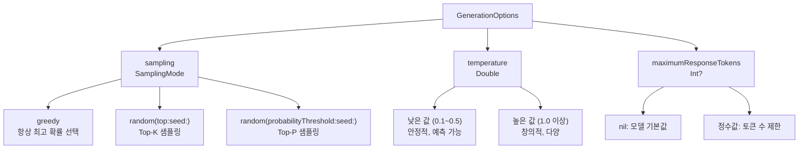
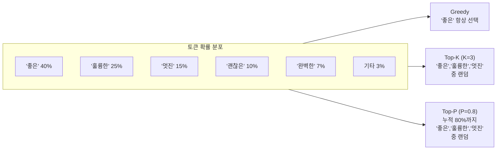
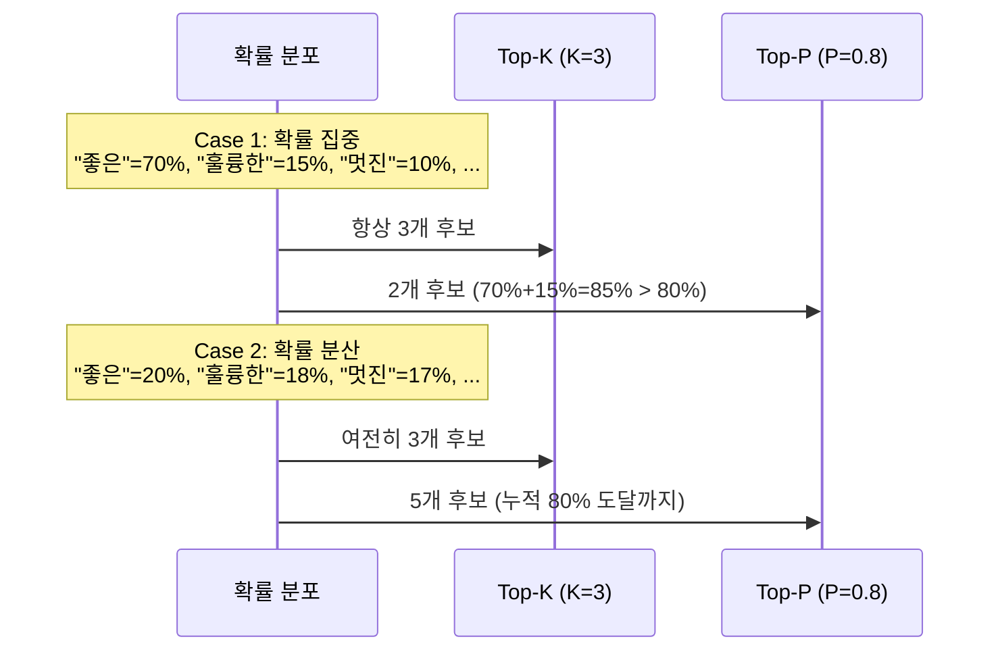
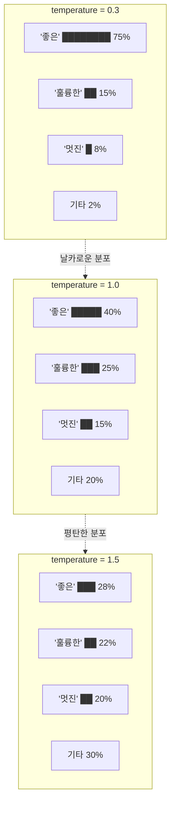
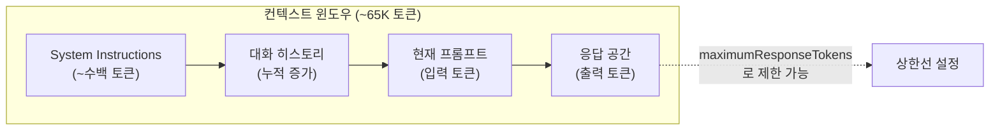
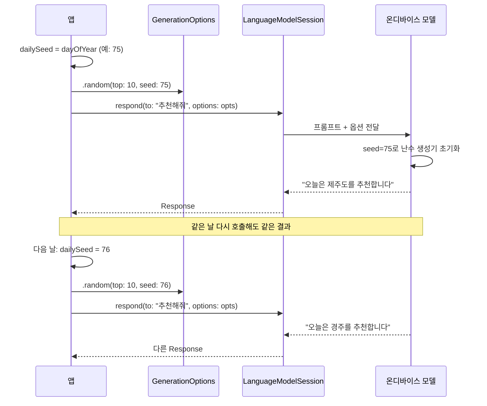

# GenerationOptions와 생성 제어

> Foundation Models의 텍스트 생성을 세밀하게 제어하는 GenerationOptions의 모든 파라미터를 마스터합니다.

## 개요

이 섹션에서는 Foundation Models 프레임워크의 `GenerationOptions` 구조체를 깊이 있게 다룹니다. 앞서 [첫 번째 텍스트 생성 요청](03-ch3-foundation-models-프레임워크-시작하기/03-03-첫-번째-텍스트-생성-요청.md)에서 `respond(to:)` 메서드로 기본 텍스트 생성을 수행했다면, 이번에는 **생성의 품질과 특성을 정밀하게 조절하는 방법**을 배웁니다.

**선수 지식**: `LanguageModelSession`의 생성과 `respond(to:)` 메서드 사용법 (Session 3.2, 3.3)
**학습 목표**:
- `GenerationOptions`의 세 가지 핵심 파라미터(sampling, temperature, maximumResponseTokens)를 이해한다
- `SamplingMode`의 greedy, top-k, top-p 모드를 상황에 맞게 선택할 수 있다
- temperature 값에 따른 출력 특성 변화를 예측할 수 있다
- seed를 활용해 재현 가능한 랜덤 생성을 구현할 수 있다
- Response 객체에서 토큰 사용량을 확인하고, 컨텍스트 윈도우 대비 가용 토큰을 계산할 수 있다

## 왜 알아야 할까?

같은 프롬프트를 던져도 AI의 응답이 매번 다르다는 걸 경험해보셨을 거예요. 어떨 때는 이게 장점이지만, 어떨 때는 치명적인 문제가 됩니다. 예를 들어 볼까요?

- **제품 설명 생성** → 매번 일관된 톤과 포맷이 필요
- **게임 NPC 대사** → 매번 다른 대사가 나와야 자연스러움
- **데모/프레젠테이션** → 동일한 입력에 동일한 결과가 보장되어야 함
- **창작 글쓰기 어시스턴트** → 다양하고 창의적인 제안이 필수

`GenerationOptions`는 이런 상반된 요구를 하나의 API로 해결합니다. 자동차의 기어와 가속 페달처럼, **같은 엔진(모델)이라도 운전 방식(옵션)에 따라 완전히 다른 주행 경험**을 만들어내는 거죠.

그리고 한 가지 더 — `maximumResponseTokens`를 설정하려면 "토큰"이 실제로 얼마나 되는지 감이 있어야 합니다. Response 객체에서 실제 토큰 사용량을 확인하는 방법도 함께 다룰 거예요.

## 핵심 개념

### 개념 1: GenerationOptions 구조체 전체 조망

> 💡 **비유**: `GenerationOptions`는 **오디오 믹싱 콘솔**과 같습니다. 같은 악기 연주(모델의 텍스트 생성)라도 볼륨, 이퀄라이저, 리버브 노브를 어떻게 돌리느냐에 따라 완전히 다른 사운드가 나오죠. sampling은 "어떤 스피커로 내보낼지", temperature는 "볼륨과 다이나믹 레인지", maximumResponseTokens는 "녹음 시간 제한"에 해당합니다.

`GenerationOptions`는 세 가지 핵심 파라미터로 구성된 구조체입니다:

| 파라미터 | 타입 | 역할 | 비유 |
|----------|------|------|------|
| `sampling` | `SamplingMode` | 토큰 선택 전략 | 주사위 종류 선택 |
| `temperature` | `Double` | 출력 다양성 조절 | 볼륨 노브 |
| `maximumResponseTokens` | `Int?` | 응답 길이 제한 | 녹음 시간 |

> 📊 **그림 1**: GenerationOptions의 구조와 역할



`respond(to:)` 메서드에 `options` 파라미터로 전달합니다:

```swift
import FoundationModels

let session = LanguageModelSession()

// 옵션 없이 호출 — 프레임워크 기본값 사용
let defaultResponse = try await session.respond(to: "안녕하세요")

// 옵션을 명시적으로 지정
let options = GenerationOptions(
    sampling: .greedy,
    temperature: 0.8,
    maximumResponseTokens: 200
)
let customResponse = try await session.respond(to: "안녕하세요", options: options)
```

### 개념 2: SamplingMode — 토큰 선택 전략

> 💡 **비유**: 레스토랑에서 메뉴를 고르는 세 가지 방식을 상상해보세요. **Greedy**는 "항상 가장 인기 있는 메뉴만 주문"하는 것이고, **Top-K**는 "인기 상위 K개 중에서 랜덤으로 선택"하는 것이며, **Top-P**는 "전체 인기도의 상위 P% 안에 드는 메뉴 중에서 선택"하는 것입니다.

언어 모델이 다음 토큰을 생성할 때, 모든 가능한 토큰에 대한 확률 분포를 계산합니다. `SamplingMode`는 이 확률 분포에서 **어떤 전략으로 하나를 골라낼지** 결정합니다.

> 📊 **그림 2**: 세 가지 SamplingMode의 토큰 선택 방식



#### Greedy 모드 — 결정론적 출력

```swift
// 항상 가장 확률 높은 토큰을 선택
// 같은 프롬프트 + 같은 세션 상태 = 같은 결과
let options = GenerationOptions(sampling: .greedy)
let response = try await session.respond(to: "Swift의 장점 3가지", options: options)
```

Greedy 모드는 디버깅, 데모, 테스트처럼 **재현성이 중요한 상황**에 적합합니다.

> ⚠️ **흔한 오해**: "Greedy면 항상 같은 결과가 나온다"고 생각하기 쉽지만, Apple은 **OS 업데이트 시 온디바이스 모델이 바뀔 수 있다**고 명시합니다. iOS 26.0과 26.1에서 같은 프롬프트의 greedy 출력이 달라질 수 있어요. 같은 OS 버전 내에서만 결정론적입니다.

#### Top-K 모드 — 상위 K개 후보 중 랜덤

```swift
// 확률 상위 10개 토큰 중에서 랜덤 선택
let options = GenerationOptions(
    sampling: .random(top: 10, seed: nil)
)
let response = try await session.respond(to: "여행지 추천해줘", options: options)
```

`top` 값이 작을수록 안정적이고, 클수록 다양합니다. 보통 5~20 사이가 실용적입니다.

#### Top-P (Nucleus) 모드 — 누적 확률 기반

```swift
// 누적 확률이 임계값에 도달할 때까지의 토큰 중 랜덤 선택
let options = GenerationOptions(
    sampling: .random(probabilityThreshold: 0.9, seed: nil)
)
let response = try await session.respond(to: "단편 소설 시작해줘", options: options)
```

Top-P는 Top-K보다 **적응적**입니다. 모델이 하나의 토큰에 90% 확신이 있으면 사실상 greedy처럼 동작하고, 확률이 고르게 분산되면 더 많은 후보를 고려하거든요.

> 📊 **그림 3**: Top-K vs Top-P 비교 — 확률 분포에 따른 후보 수 변화



### 개념 3: Temperature — 확률 분포의 날카로움

> 💡 **비유**: temperature는 물의 온도와 비슷합니다. **차가운 물(낮은 temperature)** 속 분자들은 거의 움직이지 않아 예측 가능하고, **뜨거운 물(높은 temperature)** 속 분자들은 활발하게 움직여 어디로 튈지 모릅니다.

temperature는 확률 분포의 **날카로움(sharpness)**을 조절하는 `Double` 타입 값입니다. Apple의 공식 문서에서 정확한 유효 범위를 명시하고 있지는 않지만, 일반적으로 0.0에 가까운 값부터 2.0 정도까지 사용합니다:

- **낮은 temperature (0.1~0.5)**: 확률 분포가 날카로워져서 높은 확률 토큰이 더 압도적으로 선택됨 → 안정적, 일관된 출력
- **기본 temperature (~1.0)**: 모델의 원래 확률 분포 그대로 사용
- **높은 temperature (1.5 이상)**: 확률 분포가 평탄해져서 낮은 확률 토큰도 선택될 가능성 증가 → 창의적, 예측 불가능한 출력

> ⚠️ **흔한 오해**: temperature의 유효 범위가 "0.0~2.0"이라고 단정짓기 쉽지만, Apple은 공식 문서에서 **정확한 상한값을 명시하지 않았습니다**. 프레임워크가 내부적으로 클램핑(clamping)할 수 있으므로, 극단적인 값(예: 3.0 이상)을 사용할 때는 실제 동작을 테스트로 확인하세요. 실무적으로는 **0.1~1.5 범위**가 가장 유용합니다.

```swift
// 안정적이고 예측 가능한 출력
let conservative = GenerationOptions(temperature: 0.3)

// 균형 잡힌 출력 (기본에 가까움)
let balanced = GenerationOptions(temperature: 0.7)

// 창의적이고 다양한 출력
let creative = GenerationOptions(temperature: 1.5)
```

> 📊 **그림 4**: temperature에 따른 확률 분포 변화



### 개념 4: maximumResponseTokens — 응답 길이 제한

응답의 최대 토큰 수를 제한합니다. 이 값을 명시하지 않으면 모델 기본값이 적용됩니다.

```swift
// 짧은 응답 유도 — 한 줄 요약 같은 경우
let shortOptions = GenerationOptions(maximumResponseTokens: 50)

// 긴 응답 허용 — 상세한 설명이 필요한 경우
let longOptions = GenerationOptions(maximumResponseTokens: 500)

// 기본값 사용 (nil)
let defaultOptions = GenerationOptions()
```

> 🔥 **실무 팁**: `maximumResponseTokens`는 "정확히 그만큼 생성하라"가 아니라 **상한선**입니다. 모델이 자연스럽게 문장을 완성하면 그보다 적은 토큰을 생성할 수 있어요. 하지만 한글은 영어보다 토큰당 글자 수가 적기 때문에(보통 한글 1~2글자 = 1토큰), 충분한 여유를 두는 것이 좋습니다.

### 개념 5: 토큰 사용량 확인과 컨텍스트 윈도우 관리

> 💡 **비유**: `maximumResponseTokens`를 설정하려면 "토큰이 실제로 얼마나 되는지" 감이 있어야 하는데요, 이건 마치 **여행 가방 싸기**와 같습니다. 가방 전체 용량(컨텍스트 윈도우)이 정해져 있고, 이미 넣은 짐(프롬프트 + 이전 대화)이 있으니 남은 공간(응답 가능 토큰)을 계산해야 하죠.

`maximumResponseTokens`를 정할 때 "200이면 충분할까, 500은 너무 클까?" 고민이 되죠. 이때 Response 객체의 토큰 사용량 정보가 큰 도움이 됩니다.

#### Response에서 토큰 사용량 확인하기

`respond(to:)` 메서드가 반환하는 `Response` 객체에는 실제로 얼마나 많은 토큰이 사용되었는지 확인할 수 있는 프로퍼티가 있습니다:

```swift
let session = LanguageModelSession()
let response = try await session.respond(to: "Swift의 장점을 설명해주세요")

// 생성된 응답 텍스트
print("응답: \(response.content)")

// 토큰 사용 정보 확인
print("입력 토큰 수: \(response.inputTokenCount)")
print("출력 토큰 수: \(response.outputTokenCount)")
print("총 토큰 수: \(response.inputTokenCount + response.outputTokenCount)")
```

이 정보를 활용하면 프롬프트가 얼마나 많은 토큰을 소비하는지 실측할 수 있습니다. 특히 system instructions가 길거나, 멀티턴 대화가 누적될 때 **입력 토큰이 빠르게 증가하는 패턴**을 파악하는 데 유용합니다.

> 📊 **그림 5**: 컨텍스트 윈도우와 토큰 배분 구조



#### 65K 컨텍스트 윈도우 대비 가용 토큰 계산

Apple의 온디바이스 모델은 약 **65,536(65K) 토큰의 컨텍스트 윈도우**를 가집니다. 이 안에 system instructions, 이전 대화 기록, 현재 프롬프트, 그리고 응답이 모두 들어가야 해요. 따라서 실제 응답에 사용할 수 있는 토큰은 나머지 요소를 빼고 남은 만큼입니다:

```
사용 가능한 응답 토큰 ≈ 65,536 - (system instructions 토큰) - (대화 히스토리 토큰) - (현재 프롬프트 토큰)
```

실제로 이를 활용하는 패턴을 살펴보겠습니다:

```swift
// 대화가 길어질수록 응답 토큰을 동적으로 조절하는 패턴
func adaptiveOptions(
    basedOn lastResponse: LanguageModelSession.Response
) -> GenerationOptions {
    let totalUsed = lastResponse.inputTokenCount + lastResponse.outputTokenCount
    let contextWindow = 65_536
    let remaining = contextWindow - totalUsed
    
    // 남은 공간의 절반 정도를 다음 응답에 할당 (나머지는 다음 프롬프트 여유분)
    let safeResponseTokens = max(100, remaining / 2)
    
    return GenerationOptions(
        sampling: .random(top: 10, seed: nil),
        temperature: 0.7,
        maximumResponseTokens: safeResponseTokens
    )
}
```

> ⚠️ **흔한 오해**: "65K 토큰이면 충분히 크니까 관리할 필요 없다"고 생각하기 쉽지만, 한글은 영어보다 토큰 효율이 낮습니다. 영어 1단어 ≈ 1~1.5 토큰인 반면, **한글 1글자 ≈ 1~2 토큰**이에요. 한국어로 긴 대화를 이어가면 생각보다 빠르게 컨텍스트 윈도우가 차올라서, 모델이 오래된 대화 내용을 "잊어버리는" 현상이 발생할 수 있습니다.

> 🔥 **실무 팁**: 멀티턴 대화 앱을 만들 때는 매 응답 후 `inputTokenCount`를 모니터링하세요. 컨텍스트의 70% 이상을 사용하면 이전 대화를 요약하거나, 새 세션을 시작하는 UX를 고려해야 합니다. "대화가 너무 길어졌습니다. 새 대화를 시작할까요?" 같은 안내가 사용자 경험을 크게 개선합니다.

### 개념 6: Seed를 활용한 재현 가능한 랜덤 생성

> 💡 **비유**: seed는 **보드게임의 시나리오 번호**와 같습니다. 같은 시나리오 번호를 선택하면 항상 같은 맵이 생성되지만, 번호를 바꾸면 다른 맵이 나오죠. 랜덤이지만 재현 가능한 것입니다.

Top-K와 Top-P 모드에서 `seed` 파라미터를 활용하면 랜덤 샘플링이면서도 재현 가능한 출력을 만들 수 있습니다:

```swift
// 같은 seed → 같은 랜덤 시퀀스 → 같은 출력
let options = GenerationOptions(
    sampling: .random(top: 10, seed: 42)
)

// 날짜 기반 seed — 하루 동안은 같은 결과, 날짜가 바뀌면 다른 결과
let dailySeed = UInt64(Calendar.current.component(.dayOfYear, from: .now))
let dailyOptions = GenerationOptions(
    sampling: .random(top: 10, seed: dailySeed),
    temperature: 0.7
)
```

이 패턴은 "오늘의 추천" 같은 기능에 완벽합니다. 같은 날 같은 사용자에게는 일관된 추천을 보여주되, 다음 날에는 새로운 추천이 나오니까요.

> 📊 **그림 6**: Seed 기반 재현 가능 랜덤 생성 흐름



## 실습: 직접 해보기

실제 앱에서 사용할 수 있는 **AI 글쓰기 톤 조절기**를 만들어봅시다. 사용자가 톤(공식적/균형/창의적)을 선택하면 같은 프롬프트에 다른 스타일의 응답을 생성합니다.

```swift
import SwiftUI
import FoundationModels

// MARK: - 글쓰기 톤 정의
enum WritingTone: String, CaseIterable, Identifiable {
    case formal = "공식적"
    case balanced = "균형"
    case creative = "창의적"
    
    var id: String { rawValue }
    
    // 각 톤에 맞는 GenerationOptions 반환
    var generationOptions: GenerationOptions {
        switch self {
        case .formal:
            // 낮은 temperature + greedy → 일관되고 격식 있는 톤
            return GenerationOptions(
                sampling: .greedy,
                temperature: 0.3,
                maximumResponseTokens: 200
            )
        case .balanced:
            // 중간 temperature + Top-K → 자연스러운 톤
            return GenerationOptions(
                sampling: .random(top: 10, seed: nil),
                temperature: 0.7,
                maximumResponseTokens: 300
            )
        case .creative:
            // 높은 temperature + Top-P → 창의적인 톤
            return GenerationOptions(
                sampling: .random(probabilityThreshold: 0.9, seed: nil),
                temperature: 1.5,
                maximumResponseTokens: 400
            )
        }
    }
}

// MARK: - ViewModel
@Observable
class ToneWriterViewModel {
    var prompt = ""
    var selectedTone: WritingTone = .balanced
    var generatedText = ""
    var isGenerating = false
    var errorMessage: String?
    
    // 토큰 사용량 표시용
    var inputTokens: Int?
    var outputTokens: Int?
    
    private var session: LanguageModelSession?
    
    // 텍스트 생성 수행
    func generate() async {
        guard !prompt.isEmpty else { return }
        
        isGenerating = true
        errorMessage = nil
        generatedText = ""
        inputTokens = nil
        outputTokens = nil
        
        // 매 요청마다 새 세션 — 이전 대화 맥락 없이 깨끗하게 시작
        let session = LanguageModelSession(
            instructions: "당신은 한국어 글쓰기 어시스턴트입니다. 요청된 톤에 맞게 글을 작성하세요."
        )
        
        do {
            // 선택된 톤의 GenerationOptions를 적용하여 응답 생성
            let response = try await session.respond(
                to: prompt,
                options: selectedTone.generationOptions
            )
            generatedText = response.content
            
            // 토큰 사용량 기록
            inputTokens = response.inputTokenCount
            outputTokens = response.outputTokenCount
        } catch let error as LanguageModelSession.GenerationError {
            errorMessage = "생성 오류: \(error.localizedDescription)"
        } catch {
            errorMessage = "알 수 없는 오류: \(error.localizedDescription)"
        }
        
        isGenerating = false
    }
}

// MARK: - View
struct ToneWriterView: View {
    @State private var viewModel = ToneWriterViewModel()
    
    var body: some View {
        NavigationStack {
            Form {
                // 프롬프트 입력
                Section("프롬프트") {
                    TextField("글쓰기 주제를 입력하세요", text: $viewModel.prompt)
                }
                
                // 톤 선택 Picker
                Section("글쓰기 톤") {
                    Picker("톤 선택", selection: $viewModel.selectedTone) {
                        ForEach(WritingTone.allCases) { tone in
                            Text(tone.rawValue).tag(tone)
                        }
                    }
                    .pickerStyle(.segmented)
                    
                    // 현재 선택된 옵션 정보 표시
                    toneDescription
                }
                
                // 생성 버튼
                Section {
                    Button("생성하기") {
                        Task { await viewModel.generate() }
                    }
                    .disabled(viewModel.prompt.isEmpty || viewModel.isGenerating)
                }
                
                // 결과 표시
                if !viewModel.generatedText.isEmpty {
                    Section("생성 결과") {
                        Text(viewModel.generatedText)
                    }
                    
                    // 토큰 사용량 표시
                    if let input = viewModel.inputTokens,
                       let output = viewModel.outputTokens {
                        Section("토큰 사용량") {
                            LabeledContent("입력 토큰", value: "\(input)")
                            LabeledContent("출력 토큰", value: "\(output)")
                            LabeledContent("합계", value: "\(input + output)")
                            LabeledContent("컨텍스트 사용률",
                                value: String(format: "%.1f%%",
                                    Double(input + output) / 65_536.0 * 100))
                        }
                    }
                }
                
                if let error = viewModel.errorMessage {
                    Section {
                        Text(error).foregroundStyle(.red)
                    }
                }
            }
            .navigationTitle("AI 톤 조절기")
        }
    }
    
    // 톤별 옵션 설명
    @ViewBuilder
    private var toneDescription: some View {
        switch viewModel.selectedTone {
        case .formal:
            Text("Greedy 샘플링 · Temperature 0.3 · 최대 200 토큰")
                .font(.caption).foregroundStyle(.secondary)
        case .balanced:
            Text("Top-K(10) 샘플링 · Temperature 0.7 · 최대 300 토큰")
                .font(.caption).foregroundStyle(.secondary)
        case .creative:
            Text("Top-P(0.9) 샘플링 · Temperature 1.5 · 최대 400 토큰")
                .font(.caption).foregroundStyle(.secondary)
        }
    }
}
```

```run:swift
// GenerationOptions 조합 예시 — 각 시나리오별 추천 설정
let scenarios: [(name: String, sampling: String, temp: Double, tokens: Int?)] = [
    ("FAQ 자동 응답",    "greedy",          0.2, 150),
    ("이메일 초안",      "top-k(5)",        0.5, 300),
    ("오늘의 추천",      "top-k(10)+seed",  0.7, 200),
    ("블로그 글쓰기",    "top-p(0.9)",      1.0, 500),
    ("게임 NPC 대사",    "top-p(0.95)",     1.5, 100),
]

for s in scenarios {
    let tokenStr = s.tokens.map { "\($0)" } ?? "기본값"
    print("[\(s.name)] sampling: \(s.sampling), temp: \(s.temp), tokens: \(tokenStr)")
}
```

```output
[FAQ 자동 응답] sampling: greedy, temp: 0.2, tokens: 150
[이메일 초안] sampling: top-k(5), temp: 0.5, tokens: 300
[오늘의 추천] sampling: top-k(10)+seed, temp: 0.7, tokens: 200
[블로그 글쓰기] sampling: top-p(0.9), temp: 1.0, tokens: 500
[게임 NPC 대사] sampling: top-p(0.95), temp: 1.5, tokens: 100
```

```run:swift
// 토큰 예산 계산기 — 컨텍스트 윈도우 대비 가용 토큰
let contextWindow = 65_536

let examples: [(scenario: String, systemTokens: Int, historyTokens: Int, promptTokens: Int)] = [
    ("첫 대화 (짧은 instructions)",  150,     0,   50),
    ("5턴 대화 (중간 길이)",          150,  3_000,  100),
    ("긴 대화 (20턴 이상)",          150, 15_000,  200),
    ("긴 instructions + 긴 대화",  2_000, 20_000,  500),
]

for e in examples {
    let used = e.systemTokens + e.historyTokens + e.promptTokens
    let available = contextWindow - used
    let usagePercent = Double(used) / Double(contextWindow) * 100
    print("[\(e.scenario)]")
    print("  사용: \(used) 토큰 (\(String(format: "%.1f", usagePercent))%) → 응답 가능: \(available) 토큰")
}
```

```output
[첫 대화 (짧은 instructions)]
  사용: 200 토큰 (0.3%) → 응답 가능: 65336 토큰
[5턴 대화 (중간 길이)]
  사용: 3250 토큰 (5.0%) → 응답 가능: 62286 토큰
[긴 대화 (20턴 이상)]
  사용: 15350 토큰 (23.4%) → 응답 가능: 50186 토큰
[긴 instructions + 긴 대화]
  사용: 22500 토큰 (34.3%) → 응답 가능: 43036 토큰
```

## 더 깊이 알아보기

### Temperature의 수학적 배경

"temperature"라는 이름은 통계역학에서 유래했습니다. 물리학에서 볼츠만 분포(Boltzmann distribution)는 온도 $T$에 따라 입자들의 에너지 상태 확률을 결정합니다:

$$P(E_i) = \frac{e^{-E_i / kT}}{\sum_j e^{-E_j / kT}}$$

- $E_i$: 상태 $i$의 에너지
- $T$: 온도
- $k$: 볼츠만 상수

언어 모델에서는 이를 소프트맥스(softmax) 함수에 적용합니다:

$$P(\text{token}_i) = \frac{e^{z_i / T}}{\sum_j e^{z_j / T}}$$

- $z_i$: 모델이 계산한 토큰 $i$의 로짓(logit) 값
- $T$: temperature

$T \to 0$이면 가장 높은 로짓의 토큰 확률이 1에 수렴하고(greedy), $T \to \infty$이면 모든 토큰이 균등한 확률을 갖습니다. 1980년대 Hinton과 Sejnowski가 발명한 볼츠만 머신에서 이 개념이 머신러닝에 처음 도입되었고, 이후 모든 현대 언어 모델의 표준 생성 파라미터가 되었습니다.

### Top-P (Nucleus Sampling)의 탄생

Top-P 샘플링은 2019년 Holtzman 등이 발표한 논문 *"The Curious Case of Neural Text Degeneration"*에서 제안되었습니다. 당시 연구자들은 기존 Top-K 방식의 근본적인 문제를 발견했어요. 확률 분포가 극도로 집중된 경우(하나의 토큰이 95% 확률)에도 K개를 강제로 후보에 포함하면 저품질 토큰이 섞이고, 반대로 분포가 평평한 경우에 K가 너무 작으면 좋은 후보가 잘려나간다는 것이었죠. 이 "적응형" 문제를 해결하기 위해 **누적 확률 기반**의 Nucleus Sampling이 탄생했습니다.

### Swift 타입에 관한 참고사항

Foundation Models 프레임워크에서 `temperature` 파라미터의 Swift 타입은 `Double`입니다. Swift의 표준 부동소수점 타입이 `Double`(64-bit)이므로 Apple의 프레임워크들도 대부분 `Double`을 사용하는데, Foundation Models도 이 관례를 따릅니다. 코드에서 `Float` 리터럴을 전달하면 Swift가 자동으로 `Double`로 변환하므로 컴파일 에러가 나지는 않지만, 타입을 명확히 하고 싶다면 `0.7` 같은 `Double` 리터럴을 사용하세요.

> 💡 **알고 계셨나요?**: Apple의 Foundation Models 프레임워크가 Top-K와 Top-P를 모두 제공하는 것은 의도적인 설계입니다. WWDC25에서 Apple 엔지니어들은 "앱의 성격에 따라 적합한 샘플링 전략이 다르다"고 강조했어요. 실제로 Apple Intelligence 내부에서도 기능에 따라 다른 샘플링 모드를 사용합니다.

## 흔한 오해와 팁

> ⚠️ **흔한 오해**: "temperature를 0으로 설정하면 greedy와 같다"고 생각하기 쉽지만, 이 두 가지는 구현 수준에서 다릅니다. `temperature: 0`은 소프트맥스 계산 후 가장 높은 확률을 선택하는 것이고, `.greedy`는 로짓 단계에서 바로 argmax를 수행합니다. 결과가 같을 수 있지만, **의도를 명확히 표현하려면 `.greedy` 모드를 사용**하세요.

> 💡 **알고 계셨나요?**: Apple의 온디바이스 모델은 ~3B 파라미터 규모입니다. 작은 모델은 temperature에 더 민감하게 반응합니다. GPT-4 같은 대형 모델에서 temperature 1.5가 적당히 창의적이었다면, Apple 온디바이스 모델에서는 같은 값이 훨씬 더 무작위적으로 느껴질 수 있어요. 0.5~1.0 범위에서 시작해서 점진적으로 조절하는 것을 권장합니다.

> 🔥 **실무 팁**: `GenerationOptions`를 앱 설정(UserDefaults, @AppStorage)에 저장하여 사용자가 AI 톤을 커스터마이즈할 수 있게 만드세요. `WritingTone` 같은 enum으로 프리셋을 제공하되, "고급 설정"에서 직접 temperature와 sampling을 조절할 수 있는 UI를 추가하면 파워 유저들이 좋아합니다.

> 🔥 **실무 팁**: `streamResponse(to:options:)`에도 동일한 `GenerationOptions`를 전달할 수 있습니다. [스트리밍 응답과 실시간 UI](06-ch6-스트리밍-응답과-실시간-ui/01-01-streamresponse-api-기초.md) 챕터에서 이를 자세히 다룹니다.

## 핵심 정리

| 개념 | 설명 |
|------|------|
| `GenerationOptions` | sampling, temperature, maximumResponseTokens 세 가지 파라미터로 텍스트 생성을 제어하는 구조체 |
| `.greedy` | 항상 최고 확률 토큰 선택. 결정론적 출력. 디버깅/데모에 적합 |
| `.random(top:seed:)` | Top-K 샘플링. 상위 K개 후보 중 랜덤 선택. K가 클수록 다양 |
| `.random(probabilityThreshold:seed:)` | Top-P (Nucleus) 샘플링. 누적 확률 기반 적응적 후보 선택 |
| `temperature` | `Double` 타입. 낮을수록 안정적, 높을수록 창의적. 실무 권장 범위 0.1~1.5 |
| `maximumResponseTokens` | 응답 토큰 수 상한선. nil이면 모델 기본값 |
| `inputTokenCount` / `outputTokenCount` | Response 객체에서 실제 토큰 사용량을 확인. 컨텍스트 윈도우 관리에 필수 |
| 컨텍스트 윈도우 | ~65K 토큰. system instructions + 대화 히스토리 + 프롬프트 + 응답이 모두 포함 |
| `seed` | 랜덤 샘플링의 재현성을 위한 시드 값. 같은 seed = 같은 랜덤 시퀀스 |
| OS 버전 주의 | Greedy라도 OS 업데이트로 모델이 바뀌면 출력이 달라질 수 있음 |

## 다음 섹션 미리보기

이제 `GenerationOptions`로 텍스트 생성을 세밀하게 제어하는 방법을 마스터했습니다. 다음 섹션 [SwiftUI와 Foundation Models 연결](03-ch3-foundation-models-프레임워크-시작하기/05-05-swiftui와-foundation-models-연결.md)에서는 지금까지 배운 `SystemLanguageModel`, `LanguageModelSession`, `respond(to:)`, `GenerationOptions`를 **SwiftUI 앱 아키텍처에 통합하는 모범 패턴**을 다룹니다. `@Observable` ViewModel에서 세션을 관리하고, 비동기 생성 결과를 UI에 반영하며, 에러를 사용자 친화적으로 처리하는 실전 아키텍처를 완성합니다.

## 참고 자료

- [Deep dive into the Foundation Models framework — WWDC25](https://developer.apple.com/videos/play/wwdc2025/301/) - GenerationOptions, sampling 모드, temperature 활용법을 라이브 코드로 시연하는 공식 세션
- [Exploring the Foundation Models framework — Create with Swift](https://www.createwithswift.com/exploring-the-foundation-models-framework/) - SamplingMode의 greedy, top-k, top-p 세 가지 모드를 코드 예제와 함께 체계적으로 설명
- [Building AI features using Foundation Models — Swift with Majid](https://swiftwithmajid.com/2025/08/19/building-ai-features-using-foundation-models/) - seed를 활용한 날짜 기반 재현 가능 랜덤 생성 패턴 소개
- [Getting Started with Apple's Foundation Models — Artem Novichkov](https://artemnovichkov.com/blog/getting-started-with-apple-foundation-models) - GenerationOptions의 기본 사용법과 스트리밍 연동
- [The Curious Case of Neural Text Degeneration (Holtzman et al., 2019)](https://arxiv.org/abs/1904.09751) - Top-P (Nucleus Sampling)의 원조 논문. 왜 Top-K만으로는 부족한지 실증적으로 분석

---
### 🔗 Related Sessions
- [respond(to:)](03-ch3-foundation-models-프레임워크-시작하기/03-03-첫-번째-텍스트-생성-요청.md) (prerequisite)
- [languagemodelsession.generationerror](03-ch3-foundation-models-프레임워크-시작하기/03-03-첫-번째-텍스트-생성-요청.md) (prerequisite)
