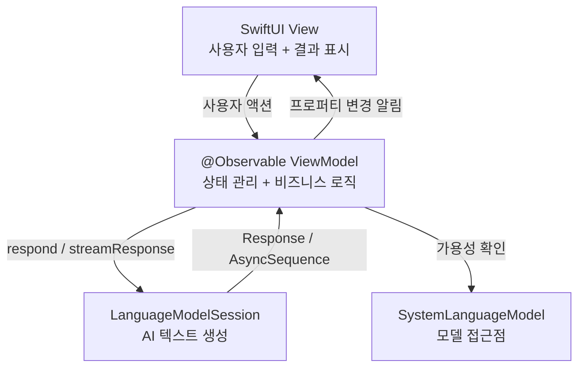
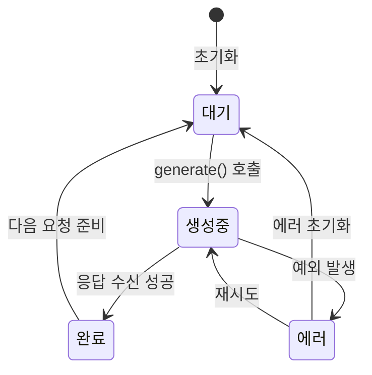
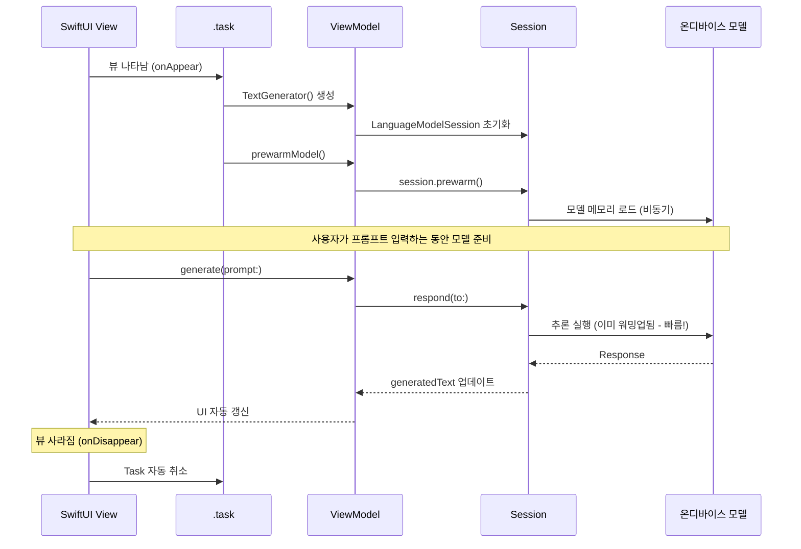
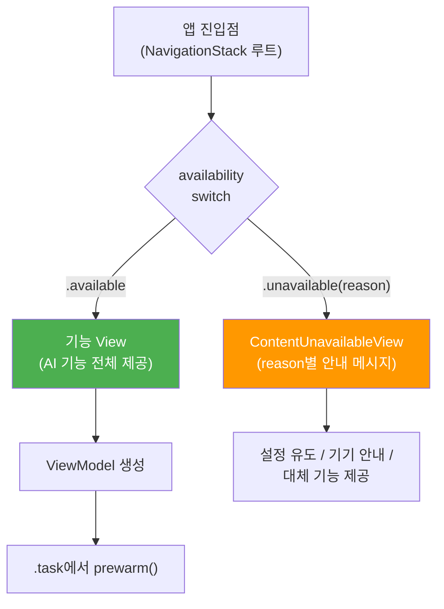

# 05. SwiftUI와 Foundation Models 연결

> SwiftUI 앱에서 Foundation Models를 자연스럽게 통합하는 아키텍처 패턴과 실전 구현법을 배웁니다.

## 개요

이 섹션에서는 지금까지 배운 Foundation Models의 핵심 API들을 실제 SwiftUI 앱에 통합하는 방법을 학습합니다. `@Observable` ViewModel 패턴으로 세션을 관리하고, 비동기 생성 결과를 UI에 반영하며, 로딩·에러 상태를 처리하는 완전한 아키텍처를 구축합니다.

**선수 지식**: 
- [SystemLanguageModel의 역할과 가용성 확인](03-ch3-foundation-models-프레임워크-시작하기/01-01-systemlanguagemodel-이해하기.md)
- [LanguageModelSession 생성과 instructions 설정](03-ch3-foundation-models-프레임워크-시작하기/02-02-languagemodelsession-생성과-구성.md)
- [respond(to:)로 텍스트 생성과 에러 처리](03-ch3-foundation-models-프레임워크-시작하기/03-03-첫-번째-텍스트-생성-요청.md)
- [GenerationOptions로 생성 파라미터 제어](03-ch3-foundation-models-프레임워크-시작하기/04-04-generationoptions와-생성-제어.md)

**학습 목표**:
- `@Observable` ViewModel에서 LanguageModelSession을 관리하는 패턴을 이해한다
- SwiftUI 뷰에서 비동기 AI 생성 결과를 안전하게 바인딩할 수 있다
- 로딩 상태, 에러 처리를 포함한 완전한 UI를 구현한다
- `.task` 수정자와 `prewarm()`을 활용한 성능 최적화 패턴을 적용할 수 있다
- 가용성 상태를 SwiftUI의 `ContentUnavailableView`와 연결하는 UI 패턴을 적용할 수 있다

## 왜 알아야 할까?

API를 아는 것과 실제 앱에 녹여내는 것은 전혀 다른 이야기입니다. `respond(to:)`를 호출하는 코드 한 줄은 간단하지만, 그 결과를 사용자에게 매끄럽게 보여주려면 수많은 고민이 필요하죠.

"AI 응답이 오는 동안 화면에 뭘 보여줘야 하지?", "사용자가 뒤로 가기 버튼을 누르면 생성 중인 요청은?", "가용성 상태별로 어떤 SwiftUI 컴포넌트를 보여줘야 하지?" — 이런 질문들에 답할 수 있어야 진짜 앱을 만들 수 있습니다.

Apple이 WWDC25 Code-Along에서 보여준 `ItineraryGenerator` 패턴은 이런 문제들에 대한 공식 답안이나 다름없는데요, 이 섹션에서 그 패턴을 완전히 해부하고 여러분의 앱에 적용할 수 있도록 만들어 보겠습니다.

## 핵심 개념

### 개념 1: SwiftUI + AI의 아키텍처 전체 그림

> 💡 **비유**: 레스토랑에 비유하면 이해가 쉽습니다. **View**는 손님이 앉는 테이블(화면), **ViewModel**은 주문을 받고 관리하는 웨이터, **LanguageModelSession**은 요리를 하는 셰프입니다. 손님이 "파스타 주세요"라고 말하면 웨이터가 주방에 전달하고, 요리가 완성되면 다시 테이블로 가져오죠. 웨이터는 동시에 "조리 중입니다" 상태도 알려줍니다.

Foundation Models를 SwiftUI에 통합할 때 Apple이 권장하는 아키텍처는 **MVVM(Model-View-ViewModel)** 패턴입니다. 핵심은 View가 AI 세션을 직접 다루지 않고, `@Observable` ViewModel이 중간에서 모든 상태를 관리하는 것이죠.

> 📊 **그림 1**: SwiftUI + Foundation Models MVVM 아키텍처



이 구조에서 각 레이어의 역할은 명확합니다:

| 레이어 | 역할 | 주요 타입 |
|--------|------|-----------|
| **View** | 사용자 입력, 결과 표시, 로딩/에러 UI | `@State`, `.task` |
| **ViewModel** | 세션 생명주기, 상태 전이, 에러 변환 | `@Observable`, `@MainActor` |
| **Session** | 프롬프트 처리, 텍스트 생성, 스트리밍 | `LanguageModelSession` |
| **Model** | 시스템 모델 접근, 가용성 확인 | `SystemLanguageModel` |

ViewModel은 View와 Session 사이의 **중재자** 역할을 합니다. View는 "요약해 줘"라고 ViewModel에 요청하고, ViewModel은 Session에 `respond(to:)` 또는 `streamResponse(to:)`를 호출하여 AI 생성을 시작합니다. 생성이 완료되면 결과를 자신의 프로퍼티에 저장하고, `@Observable` 매크로 덕분에 SwiftUI가 변경을 감지하여 화면을 자동으로 업데이트합니다.

### 개념 2: @Observable ViewModel 패턴

> 💡 **비유**: `@Observable`은 택배 알림 시스템과 같습니다. 택배(데이터)의 상태가 바뀔 때마다 — "배송 시작", "배달 중", "배달 완료" — 자동으로 알림이 옵니다. SwiftUI View는 이 알림을 받아서 화면을 자동으로 업데이트하죠. 별도로 "지금 택배 어디야?"라고 물어볼 필요가 없습니다.

Apple의 WWDC25 Code-Along에서 보여준 `ItineraryGenerator` 클래스가 바로 이 패턴의 교과서적 구현입니다. 핵심 구조를 살펴보겠습니다:

```swift
import Foundation
import FoundationModels
import Observation

@Observable       // SwiftUI가 프로퍼티 변경을 자동 감지
@MainActor        // UI 업데이트는 메인 스레드에서 안전하게
final class TextGenerator {
    
    // MARK: - 외부에 노출되는 상태 (View가 관찰)
    var generatedText: String = ""        // 생성된 텍스트
    var isGenerating: Bool = false        // 로딩 상태
    var error: Error?                     // 에러 상태
    
    // MARK: - 내부 세션 (외부에서 직접 접근 불가)
    private var session: LanguageModelSession
    
    init() {
        // 세션 초기화 — instructions로 역할 부여
        self.session = LanguageModelSession(
            instructions: "당신은 친절한 한국어 AI 어시스턴트입니다."
        )
    }
    
    /// 텍스트 생성 요청
    func generate(prompt: String) async {
        isGenerating = true       // 로딩 시작
        error = nil               // 이전 에러 초기화
        
        do {
            let response = try await session.respond(to: prompt)
            generatedText = response.content  // 결과 반영
        } catch {
            self.error = error    // 에러 저장
        }
        
        isGenerating = false      // 로딩 종료
    }
}
```

여기서 주목할 네 가지 핵심 포인트가 있습니다:

**1) `@Observable` 매크로 기반 상태 관리**: `@Observable`은 Swift 5.9에서 도입된 매크로로, 프로퍼티 변경 시 SwiftUI 뷰를 자동으로 다시 그립니다. 이전 세대의 `ObservableObject` + `@Published` 조합을 완전히 대체하는 현대적 패턴입니다.

**2) `@MainActor`는 왜 필요한가?**: Swift 6의 엄격한 동시성(strict concurrency) 모드에서는 UI 상태를 업데이트하는 코드가 반드시 메인 스레드에서 실행되어야 합니다. `@MainActor`를 ViewModel 클래스에 붙이면, `generatedText`, `isGenerating`, `error` 같은 프로퍼티의 모든 읽기/쓰기가 메인 스레드에서 수행되도록 컴파일러가 보장합니다. 이 어노테이션 없이 백그라운드에서 UI 프로퍼티를 변경하면 **데이터 레이스(data race)** 경고 또는 런타임 크래시가 발생할 수 있어요.

> 🔥 **실무 팁**: Swift 6 strict concurrency에서 `@MainActor`는 UI 상태를 다루는 ViewModel의 필수 요소입니다. 코스 전반에서 사용하는 `@Observable` 매크로 기반 상태 관리 패턴에서, ViewModel이 SwiftUI View의 상태를 업데이트한다면 항상 `@MainActor`를 함께 붙여주세요. 이 조합이 iOS 26 시대의 표준 패턴입니다.

**3) 상태 3종 세트**: `generatedText`(결과), `isGenerating`(로딩), `error`(에러) — 이 세 프로퍼티만으로 AI 기능의 모든 UI 상태를 표현할 수 있습니다.

**4) `private var session`**: 세션은 ViewModel 내부에 캡슐화합니다. View가 세션을 직접 다루면 상태 관리가 복잡해지고 테스트도 어려워지거든요.

> 📊 **그림 2**: ViewModel 상태 전이 다이어그램



### 개념 3: View에서 ViewModel 연결하기

> 💡 **비유**: `@State`로 ViewModel을 선언하는 건 자동차 키를 꽂는 것과 같습니다. 키(ViewModel)를 꽂아야 시동(AI 기능)을 걸 수 있고, 차(View)가 사라지면 키도 함께 제거됩니다. 즉, ViewModel의 수명이 View의 수명과 정확히 일치하죠.

ViewModel을 만들었으니 이제 SwiftUI View에서 사용해 봅시다. `@Observable` 객체는 `@State`로 소유권을 관리하는 것이 표준 패턴입니다:

```swift
struct AITextView: View {
    // ViewModel을 @State로 소유 — View 수명과 동기화
    @State private var generator = TextGenerator()
    @State private var userInput: String = ""
    
    var body: some View {
        NavigationStack {
            VStack(spacing: 16) {
                // 입력 영역
                TextField("무엇이든 물어보세요", text: $userInput)
                    .textFieldStyle(.roundedBorder)
                    .padding(.horizontal)
                
                // 생성 버튼 — 생성 중에는 비활성화
                Button("생성하기") {
                    Task {
                        await generator.generate(prompt: userInput)
                    }
                }
                .buttonStyle(.borderedProminent)
                .disabled(generator.isGenerating || userInput.isEmpty)
                
                // 상태별 UI 분기
                Group {
                    if generator.isGenerating {
                        ProgressView("AI가 생각하고 있어요...")
                    } else if let error = generator.error {
                        Label("오류: \(error.localizedDescription)",
                              systemImage: "exclamationmark.triangle")
                            .foregroundStyle(.red)
                    } else if !generator.generatedText.isEmpty {
                        ScrollView {
                            Text(generator.generatedText)
                                .padding()
                        }
                    }
                }
                .frame(maxHeight: .infinity)
            }
            .navigationTitle("AI 텍스트 생성기")
        }
    }
}
```

핵심은 `@State private var generator = TextGenerator()`입니다. iOS 17부터 `@Observable` 객체는 `@State`로 선언하면 됩니다. 예전의 `@StateObject`는 더 이상 필요 없죠.

> ⚠️ **흔한 오해**: "`@ObservedObject`나 `@StateObject`를 써야 하는 거 아닌가요?"라고 생각하실 수 있는데요, `@Observable` 매크로를 사용하면 `@State`만으로 충분합니다. `@StateObject`는 `ObservableObject` 프로토콜과 함께 쓰던 이전 세대 패턴입니다. iOS 26 타겟이라면 `@Observable` + `@State` 조합이 Apple 권장 방식입니다.

### 개념 4: .task 수정자와 prewarm() 최적화

> 💡 **비유**: `prewarm()`은 겨울 아침 자동차 예열과 같습니다. 차에 타기 전에 미리 시동을 걸어 엔진을 데워두면, 실제로 출발할 때 바로 부드럽게 달릴 수 있죠. AI 모델도 마찬가지로, 사용자가 요청하기 전에 미리 메모리에 로드해두면 첫 응답이 훨씬 빨라집니다.

`.task` 수정자는 뷰가 화면에 나타날 때 비동기 작업을 시작하고, 뷰가 사라지면 자동으로 취소해 주는 SwiftUI의 핵심 도구입니다. Foundation Models에서는 이를 `prewarm()`과 조합하여 사용합니다:

```swift
struct SmartNoteView: View {
    @State private var generator: TextGenerator?
    
    var body: some View {
        VStack {
            if let generator {
                // generator가 준비되면 실제 UI 표시
                NoteEditorView(generator: generator)
            } else {
                ProgressView("AI 모델 준비 중...")
            }
        }
        .task {
            // 뷰가 나타나면 ViewModel 생성 + 모델 예열
            let gen = TextGenerator()
            gen.prewarmModel()    // 모델을 메모리에 미리 로드
            self.generator = gen  // UI에 반영
        }
    }
}
```

ViewModel에 `prewarmModel()` 메서드를 추가합니다:

```swift
@Observable
@MainActor
final class TextGenerator {
    // ... 기존 코드 ...
    
    /// 모델을 메모리에 미리 로드하여 첫 응답 지연 감소
    func prewarmModel() {
        session.prewarm()
    }
}
```

> 📊 **그림 3**: .task 수명 주기와 prewarm 타이밍



`.task`의 장점은 **자동 취소**입니다. 사용자가 화면을 벗어나면 Task가 취소되어 불필요한 AI 생성이 계속되지 않습니다. 이는 메모리와 배터리 효율에 큰 도움이 되죠.

### 개념 5: 가용성 상태를 SwiftUI 컴포넌트로 매핑하기

[Ch2.3에서 배운 `SystemLanguageModel.availability`](02-ch2-apple-intelligence와-온디바이스-ai/03-03-apple-intelligence-지원-기기와-조건.md)를 통해 모델의 가용 여부를 확인하는 방법은 이미 알고 있죠. 이 섹션에서는 **그 가용성 정보를 SwiftUI의 어떤 컴포넌트에, 어떤 시점에 매핑할 것인가**라는 UI 아키텍처 관점에 집중합니다.

핵심 원칙은 간단합니다: **가용성 체크는 앱 진입점에서 딱 한 번, 그리고 `ContentUnavailableView`로 매핑**하는 것이죠.

> 📊 **그림 4**: 가용성 → SwiftUI 컴포넌트 매핑 패턴



왜 진입점에서 한 번만 체크할까요? AI 기능이 포함된 View 곳곳에서 가용성을 반복 확인하면 코드가 복잡해지고, 사용자 경험도 일관되지 않습니다. 대신 **게이트 패턴(gate pattern)** — 진입점에서 분기하여 AI View와 대체 View를 완전히 분리하는 것이 깔끔합니다:

```swift
struct AIFeatureView: View {
    private let model = SystemLanguageModel.default
    
    var body: some View {
        // 진입점에서 한 번만 분기 — 내부 View는 가용성을 신경 쓸 필요 없음
        switch model.availability {
        case .available:
            AITextView()  // AI 기능 전체 제공
            
        case .unavailable(let reason):
            // ContentUnavailableView로 통일된 비가용 UI
            availabilityFallback(for: reason)
        }
    }
    
    @ViewBuilder
    private func availabilityFallback(
        for reason: SystemLanguageModel.UnavailabilityReason
    ) -> some View {
        switch reason {
        case .appleIntelligenceNotEnabled:
            ContentUnavailableView(
                "Apple Intelligence 필요",
                systemImage: "brain",
                description: Text("설정 > Apple Intelligence에서 활성화해 주세요.")
            )
        case .modelNotReady:
            VStack(spacing: 12) {
                ProgressView()
                Text("AI 모델을 준비하고 있습니다.\n잠시 후 다시 시도해 주세요.")
                    .multilineTextAlignment(.center)
                    .foregroundStyle(.secondary)
            }
        default:
            ContentUnavailableView(
                "AI 기능 사용 불가",
                systemImage: "exclamationmark.triangle",
                description: Text("이 기기에서는 AI 기능을 사용할 수 없습니다.")
            )
        }
    }
}
```

이전 섹션들과의 차이점을 정리하면:

| 관점 | Ch2.3 (정규) | 이 섹션 (SwiftUI 통합) |
|------|-------------|----------------------|
| **초점** | availability 프로퍼티의 종류와 의미 | 가용성 → SwiftUI 컴포넌트 매핑 |
| **핵심 질문** | "어떤 상태들이 있는가?" | "언제, 어디서 체크하고 어떤 View를 보여줄 것인가?" |
| **패턴** | API 레벨 이해 | 게이트 패턴 + `ContentUnavailableView` |

> 🔥 **실무 팁**: `ContentUnavailableView`는 iOS 17에서 도입된 시스템 컴포넌트로, 빈 상태나 에러 상태를 표준적인 방식으로 보여줍니다. Apple의 디자인 가이드라인을 자동으로 따르기 때문에 커스텀 뷰를 만드는 것보다 훨씬 효율적이에요. 가용성별로 별도의 커스텀 화면을 디자인할 필요 없이, 아이콘과 설명만 바꿔주면 됩니다.

## 실습: 직접 해보기

지금까지 배운 모든 패턴을 결합하여 **AI 한 줄 요약 생성기** 앱을 만들어 봅시다. 사용자가 긴 텍스트를 입력하면 AI가 한 줄로 요약해 주는 앱입니다.

### Step 1: ViewModel 구현

```swift
import Foundation
import FoundationModels
import Observation

/// AI 요약 기능을 관리하는 ViewModel
/// @MainActor는 Swift 6 strict concurrency에서 필수 —
/// UI 바인딩 프로퍼티의 메인 스레드 접근을 컴파일러가 보장합니다.
@Observable
@MainActor
final class SummaryGenerator {
    
    // MARK: - 외부 노출 상태
    var summary: String = ""           // 생성된 요약
    var isGenerating: Bool = false     // 생성 중 여부
    var error: Error?                  // 에러
    var characterCount: Int = 0        // 입력 글자 수
    
    // MARK: - 내부 세션
    private var session: LanguageModelSession
    
    init() {
        // 요약 전문가 역할 부여
        let instructions = """
            당신은 텍스트 요약 전문가입니다.
            사용자가 제공하는 텍스트를 정확히 한 문장으로 요약하세요.
            핵심 정보를 놓치지 않되, 30자 이내로 간결하게 작성하세요.
            한국어로 응답하세요.
            """
        self.session = LanguageModelSession(instructions: instructions)
    }
    
    /// 모델 예열 — 뷰 등장 시 호출
    func prewarmModel() {
        session.prewarm()
    }
    
    /// 텍스트 요약 생성
    func summarize(text: String) async {
        // 입력 검증
        guard !text.trimmingCharacters(in: .whitespacesAndNewlines).isEmpty else {
            return
        }
        
        isGenerating = true
        error = nil
        characterCount = text.count
        
        do {
            let prompt = "다음 텍스트를 한 문장으로 요약해 주세요:\n\n\(text)"
            let response = try await session.respond(to: prompt)
            summary = response.content
        } catch let genError as LanguageModelSession.GenerationError {
            // Foundation Models 특화 에러 처리
            switch genError {
            case .guardrailViolation:
                self.error = SummaryError.contentBlocked
            case .exceededContextWindowSize:
                self.error = SummaryError.textTooLong
            default:
                self.error = genError
            }
        } catch {
            self.error = error
        }
        
        isGenerating = false
    }
    
    /// 상태 초기화
    func reset() {
        summary = ""
        error = nil
        characterCount = 0
    }
}

/// 사용자 친화적 에러 타입
enum SummaryError: LocalizedError {
    case contentBlocked
    case textTooLong
    
    var errorDescription: String? {
        switch self {
        case .contentBlocked:
            return "이 내용은 요약할 수 없습니다."
        case .textTooLong:
            return "텍스트가 너무 깁니다. 더 짧은 텍스트를 입력해 주세요."
        }
    }
}
```

### Step 2: 메인 View 구현

```swift
import SwiftUI
import FoundationModels

struct SummaryAppView: View {
    // 가용성 체크는 진입점에서 딱 한 번 — 게이트 패턴
    private let model = SystemLanguageModel.default
    
    var body: some View {
        NavigationStack {
            switch model.availability {
            case .available:
                SummaryEditorView()
            case .unavailable(.appleIntelligenceNotEnabled):
                ContentUnavailableView(
                    "Apple Intelligence 필요",
                    systemImage: "brain",
                    description: Text("설정에서 Apple Intelligence를 활성화해 주세요.")
                )
            default:
                ContentUnavailableView(
                    "AI 요약 사용 불가",
                    systemImage: "text.badge.xmark",
                    description: Text("이 기기에서는 AI 요약을 사용할 수 없습니다.")
                )
            }
        }
    }
}

struct SummaryEditorView: View {
    @State private var generator: SummaryGenerator?
    @State private var inputText: String = ""
    @FocusState private var isInputFocused: Bool
    
    var body: some View {
        VStack(spacing: 0) {
            // 입력 영역
            VStack(alignment: .leading, spacing: 8) {
                Text("원문")
                    .font(.headline)
                    .foregroundStyle(.secondary)
                
                TextEditor(text: $inputText)
                    .focused($isInputFocused)
                    .frame(minHeight: 150)
                    .overlay(
                        RoundedRectangle(cornerRadius: 8)
                            .stroke(Color.secondary.opacity(0.3))
                    )
                    .overlay(alignment: .topLeading) {
                        if inputText.isEmpty {
                            Text("요약할 텍스트를 입력하세요...")
                                .foregroundStyle(.tertiary)
                                .padding(8)
                                .allowsHitTesting(false)
                        }
                    }
            }
            .padding()
            
            Divider()
            
            // 결과 영역
            VStack(alignment: .leading, spacing: 8) {
                Text("AI 요약")
                    .font(.headline)
                    .foregroundStyle(.secondary)
                
                Group {
                    if let generator {
                        if generator.isGenerating {
                            // 로딩 상태
                            HStack(spacing: 8) {
                                ProgressView()
                                Text("요약하고 있어요...")
                                    .foregroundStyle(.secondary)
                            }
                            .frame(maxWidth: .infinity, alignment: .center)
                            .padding(.vertical, 20)
                        } else if let error = generator.error {
                            // 에러 상태
                            Label(
                                error.localizedDescription,
                                systemImage: "exclamationmark.triangle.fill"
                            )
                            .foregroundStyle(.red)
                            .padding()
                        } else if !generator.summary.isEmpty {
                            // 성공 상태
                            Text(generator.summary)
                                .font(.title3)
                                .fontWeight(.medium)
                                .padding()
                                .frame(maxWidth: .infinity, alignment: .leading)
                                .background(.ultraThinMaterial)
                                .clipShape(RoundedRectangle(cornerRadius: 12))
                        } else {
                            // 초기 상태
                            Text("텍스트를 입력하고 요약 버튼을 눌러 주세요.")
                                .foregroundStyle(.tertiary)
                                .frame(maxWidth: .infinity, alignment: .center)
                                .padding(.vertical, 20)
                        }
                    } else {
                        ProgressView("AI 모델 준비 중...")
                    }
                }
            }
            .padding()
            .frame(maxHeight: .infinity)
            
            Spacer()
        }
        .safeAreaInset(edge: .bottom) {
            // 하단 고정 버튼
            HStack {
                Button("초기화", role: .destructive) {
                    inputText = ""
                    generator?.reset()
                }
                .buttonStyle(.bordered)
                
                Button("요약하기") {
                    isInputFocused = false
                    Task {
                        await generator?.summarize(text: inputText)
                    }
                }
                .buttonStyle(.borderedProminent)
                .disabled(
                    generator?.isGenerating == true || inputText.isEmpty
                )
            }
            .padding()
            .background(.bar)
        }
        .navigationTitle("AI 한 줄 요약")
        .task {
            // 뷰 등장 시 ViewModel 생성 + 모델 예열
            let gen = SummaryGenerator()
            gen.prewarmModel()
            self.generator = gen
        }
    }
}
```

### Step 3: 실행 확인

```run:swift
// 실행 흐름 시뮬레이션
print("1. 앱 실행 → 진입점에서 availability 게이트 체크")
print("2. .available → SummaryEditorView 표시")
print("3. .task → SummaryGenerator 생성 + prewarm()")
print("4. 사용자 텍스트 입력 → '요약하기' 버튼 탭")
print("5. generator.summarize() → isGenerating = true")
print("6. session.respond() → AI 응답 수신")
print("7. summary 업데이트 → isGenerating = false")
print("8. SwiftUI 자동 리렌더링 → 요약 결과 표시")
```

```output
1. 앱 실행 → 진입점에서 availability 게이트 체크
2. .available → SummaryEditorView 표시
3. .task → SummaryGenerator 생성 + prewarm()
4. 사용자 텍스트 입력 → '요약하기' 버튼 탭
5. generator.summarize() → isGenerating = true
6. session.respond() → AI 응답 수신
7. summary 업데이트 → isGenerating = false
8. SwiftUI 자동 리렌더링 → 요약 결과 표시
```

이 앱은 다음 패턴들을 모두 포함합니다:
- **@Observable ViewModel**: `SummaryGenerator`가 세션과 상태를 캡슐화
- **@MainActor**: Swift 6 strict concurrency에서 UI 프로퍼티의 메인 스레드 안전성 보장
- **@State 소유**: View가 ViewModel의 생명주기를 관리
- **.task + prewarm()**: 뷰 등장 시 모델 예열
- **게이트 패턴 가용성 분기**: 진입점에서 `ContentUnavailableView`로 한 번만 분기
- **상태 기반 UI**: 로딩 / 에러 / 성공 / 초기 상태를 각각 처리
- **에러 변환**: `GenerationError`를 사용자 친화적 메시지로 변환

## 더 깊이 알아보기

### @Observable의 탄생 — Observation 프레임워크 이야기

SwiftUI가 처음 나온 2019년, 상태 관리는 꽤 복잡했습니다. `ObservableObject` 프로토콜에 `@Published` 프로퍼티 래퍼를 일일이 붙이고, View에서는 `@ObservedObject`와 `@StateObject`를 구분해서 써야 했죠. 특히 `@ObservedObject`와 `@StateObject`의 차이 때문에 수많은 개발자가 미묘한 버그에 시달렸습니다.

2023년 WWDC에서 Apple은 이 문제를 근본적으로 해결하는 **Observation 프레임워크**를 발표합니다. `@Observable` 매크로 하나만 붙이면 모든 저장 프로퍼티가 자동으로 관찰 가능해지고, View에서는 그냥 `@State`로 선언하면 끝이었죠. Holly Borla와 Philippe Hausler가 주도한 이 프레임워크는 Swift의 매크로 시스템을 활용한 대표적 성공 사례로 평가받습니다.

Foundation Models 프레임워크가 iOS 26에서 등장했을 때, `@Observable`은 이미 검증된 패턴이었고, Apple의 모든 Code-Along과 공식 예제가 이 패턴을 기반으로 설계되었습니다. WWDC25의 `ItineraryGenerator` 클래스가 바로 `@Observable` + `@MainActor` + `LanguageModelSession`의 공식 조합을 보여준 것이죠.

> 💡 **알고 계셨나요?**: `@Observable`은 컴파일 타임에 매크로로 확장됩니다. 실제로는 각 프로퍼티에 대한 `willSet`/`didSet` 감시 코드와 `ObservationTracking` 등록 코드를 자동 생성하는데, 이 덕분에 런타임 오버헤드가 `ObservableObject`의 `Combine` 기반 구현보다 훨씬 적습니다.

### @MainActor와 Swift 동시성 모델의 진화

Swift 5.5에서 `async/await`와 함께 도입된 Actor 모델은 데이터 레이스를 컴파일 타임에 방지하려는 야심찬 시도였습니다. 그중에서도 `@MainActor`는 특별한 존재인데요, UIKit/AppKit 시절부터 "UI 업데이트는 메인 스레드에서"라는 황금률을 Swift 타입 시스템으로 강제한 것이기 때문입니다.

Swift 6에서 strict concurrency가 기본이 되면서 이 규칙은 더 엄격해졌습니다. ViewModel에서 `@MainActor` 없이 `isGenerating = true`를 호출하면, 컴파일러가 "이 프로퍼티가 메인 스레드에서 변경된다는 보장이 없다"며 경고(또는 에러)를 냅니다. 이는 실제로 런타임에서 UI가 깜빡이거나 크래시하는 버그를 사전에 잡아주는 것이죠.

## 흔한 오해와 팁

> ⚠️ **흔한 오해**: "LanguageModelSession을 `@State`로 직접 선언하면 되지 않나요?" — 작동은 하지만 권장하지 않습니다. 세션을 ViewModel 없이 View에 직접 두면 로딩 상태, 에러 처리, 여러 View 간 세션 공유가 모두 어려워집니다. Apple의 공식 예제들도 항상 `@Observable` 클래스로 한 단계 감싸는 패턴을 사용합니다.

> ⚠️ **흔한 오해**: "`@MainActor`는 성능에 안 좋은 거 아닌가요?" — ViewModel 전체에 `@MainActor`를 붙이면 모든 메서드가 메인 스레드에서 돌아가니 성능 걱정이 될 수 있지만, `respond(to:)`처럼 실제 무거운 작업은 `async`로 선언되어 있어 내부적으로 백그라운드에서 실행됩니다. `@MainActor`가 보장하는 건 **결과를 프로퍼티에 저장하는 순간**이 메인 스레드라는 것이지, 추론 작업 자체를 메인에서 돌린다는 뜻이 아닙니다.

> 💡 **알고 계셨나요?**: `.task` 수정자 안에서 시작된 비동기 작업은 View가 disappear할 때 **자동으로 취소**됩니다. 이 말은 사용자가 AI 응답을 기다리다가 뒤로 가기를 누르면, 더 이상 쓸모없는 생성 작업이 알아서 멈춘다는 뜻이에요. 별도로 `Task.cancel()`을 호출할 필요가 없습니다.

> 🔥 **실무 팁**: `prewarm()`은 실제 기기에서 첫 응답 시간을 0.5~1초 이상 줄여줍니다. 앱의 메인 화면이 아닌, AI 기능을 사용하는 화면에 진입하는 시점에서 호출하는 것이 가장 효과적입니다. 너무 일찍 호출하면 불필요하게 메모리를 점유하고, 너무 늦으면 예열 효과가 없거든요.

> 🔥 **실무 팁**: 가용성 체크를 View 곳곳에 넣지 마세요. **게이트 패턴**으로 진입점에서 한 번만 분기하면, 내부 View들은 "모델이 있다"는 전제 하에 깔끔하게 작성할 수 있습니다. 가용성 분기의 자세한 케이스와 의미는 [Ch2.3 Apple Intelligence 지원 기기와 조건](02-ch2-apple-intelligence와-온디바이스-ai/03-03-apple-intelligence-지원-기기와-조건.md)을 참고하세요.

## 핵심 정리

| 개념 | 설명 |
|------|------|
| **@Observable ViewModel** | LanguageModelSession과 UI 상태를 캡슐화하는 표준 패턴 |
| **@MainActor** | Swift 6 strict concurrency에서 UI 프로퍼티의 메인 스레드 안전성을 보장. ViewModel 필수 |
| **@State 소유** | View에서 `@State private var vm = MyViewModel()`으로 ViewModel 수명 관리 |
| **.task 수정자** | 뷰 등장 시 비동기 작업 시작, 사라지면 자동 취소. prewarm()과 조합 |
| **prewarm()** | 모델을 메모리에 미리 로드하여 첫 응답 지연 감소 |
| **게이트 패턴** | 진입점에서 availability를 한 번만 체크하고 `ContentUnavailableView`로 분기 |
| **상태 3종 세트** | `result`(결과) + `isGenerating`(로딩) + `error`(에러)로 모든 UI 상태 표현 |
| **에러 변환** | `GenerationError`를 사용자 친화적 `LocalizedError`로 변환 |

## 다음 섹션 미리보기

이번 챕터에서 Foundation Models 프레임워크의 기본기를 모두 다졌습니다! 다음 챕터 [Ch4. 프롬프트 엔지니어링 실전](04-ch4-프롬프트-엔지니어링-실전/01-01-온디바이스-모델-특성과-프롬프트-전략.md)에서는 온디바이스 모델의 특성에 맞는 프롬프트 전략을 배웁니다. 서버 모델과 달리 ~3B 파라미터의 소형 모델에서 최적의 결과를 끌어내려면 어떤 프롬프트 패턴이 효과적인지, instructions를 어떻게 설계해야 하는지 깊이 다룹니다.

## 참고 자료

- [Code-along: Bring on-device AI to your app — WWDC25](https://developer.apple.com/videos/play/wwdc2025/259/) - Apple 공식 Code-Along으로 ItineraryGenerator 패턴의 원본. @Observable + LanguageModelSession 아키텍처의 교과서
- [The Ultimate Guide To The Foundation Models Framework — AzamSharp](https://azamsharp.com/2025/06/18/the-ultimate-guide-to-the-foundation-models-framework.html) - RecipeRecommender 등 다양한 SwiftUI 통합 예제와 스트리밍 UI 패턴을 상세히 다룸
- [Building AI features using Foundation Models — Swift with Majid](https://swiftwithmajid.com/2025/08/19/building-ai-features-using-foundation-models/) - GenerationOptions와 가용성 체크를 포함한 실전 통합 패턴 소개
- [Building an AI Chatbot in SwiftUI with Foundation Models — SwiftyPlace](https://www.swiftyplace.com/blog/foundation-models-framework) - ObservableObject 기반 ChatViewModel과 스트리밍 응답 UI 구현의 전체 코드
- [Foundation Models — Apple Developer Documentation](https://developer.apple.com/documentation/FoundationModels) - LanguageModelSession, SystemLanguageModel 등 모든 API의 공식 레퍼런스

---
### 🔗 Related Sessions
- [generationoptions](03-ch3-foundation-models-프레임워크-시작하기/04-04-generationoptions와-생성-제어.md) (prerequisite)
- [respond(to:)](03-ch3-foundation-models-프레임워크-시작하기/03-03-첫-번째-텍스트-생성-요청.md) (prerequisite)
- [prewarm()](03-ch3-foundation-models-프레임워크-시작하기/01-01-systemlanguagemodel-이해하기.md) (prerequisite)
