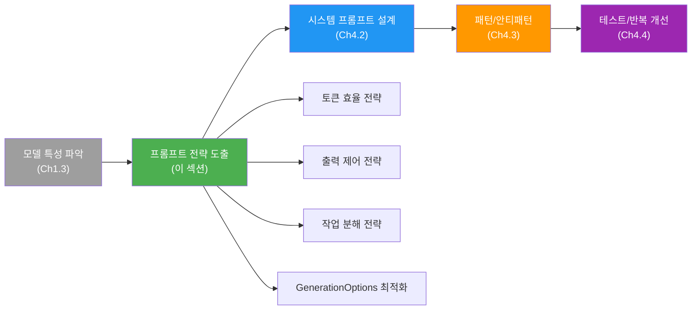
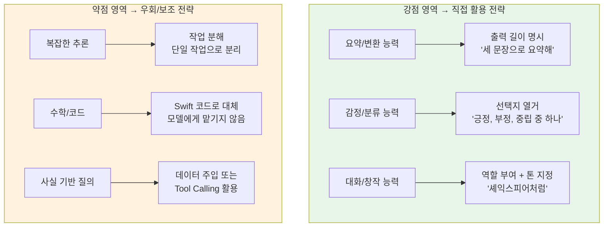
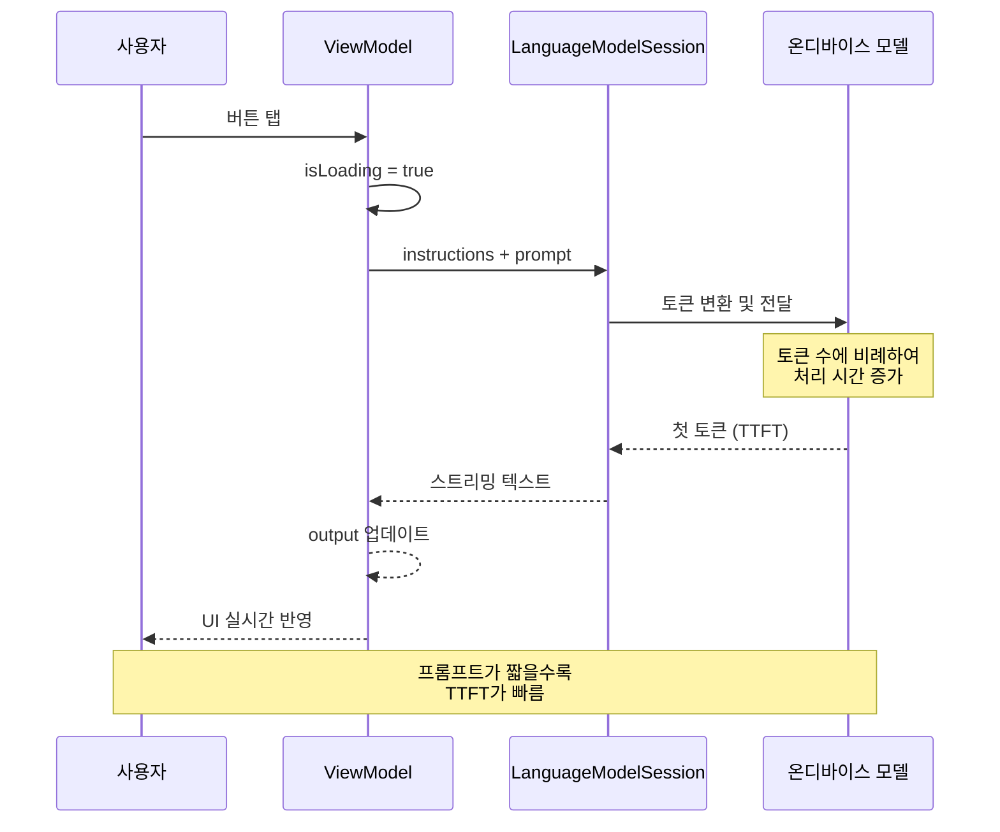
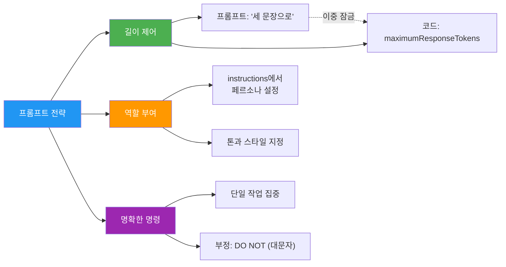
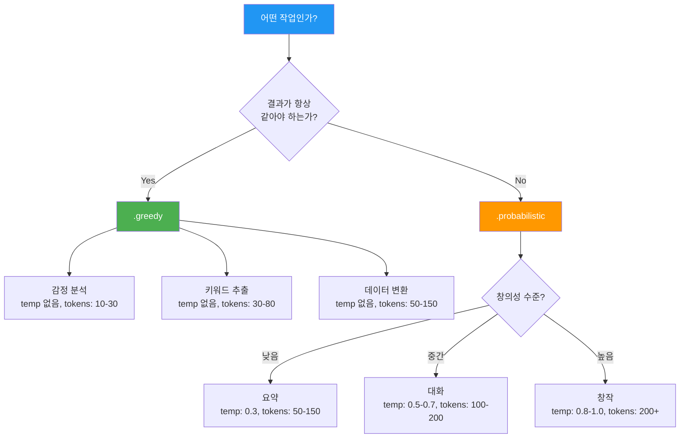
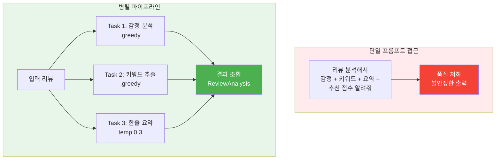

# 온디바이스 모델 특성과 프롬프트 전략

> ~3B 파라미터 온디바이스 모델의 특성을 프롬프트 전략으로 변환하고, ViewModel 기반 프롬프트 실험 워크플로를 구축합니다.

## 개요

이 섹션에서는 온디바이스 모델의 특성을 **프롬프트 설계 원칙**으로 변환하는 방법을 배웁니다. 모델이 무엇을 잘하고 못하는지는 [03. 온디바이스 모델 아키텍처 이해하기](01-ch1-apple-intelligence와-온디바이스-ai/03-03-온디바이스-모델-아키텍처-이해하기.md)에서 다루었죠. 이제 그 능력 지도를 기반으로, "어떻게 프롬프트를 작성해야 최상의 결과를 이끌어내는가"에 집중합니다.

**선수 지식**: 
- [03. 온디바이스 모델 아키텍처 이해하기](01-ch1-apple-intelligence와-온디바이스-ai/03-03-온디바이스-모델-아키텍처-이해하기.md)에서 배운 ~3B 모델의 능력 범위와 한계
- [05. SwiftUI와 Foundation Models 연결하기](03-ch3-foundation-models-프레임워크-시작하기/05-05-swiftui와-foundation-models-연결하기.md)에서 배운 `@Observable` ViewModel 패턴과 스트리밍 UI
- `LanguageModelSession` 기본 사용법과 `GenerationOptions`

**학습 목표**:
- 모델 특성(강점/한계)을 프롬프트 전략으로 변환하는 사고 프레임워크를 익힌다
- 토큰 효율, 출력 제어, 작업 분해 등 핵심 프롬프트 패턴을 적용한다
- `GenerationOptions`의 샘플링 전략과 토큰 제한을 작업 유형별로 최적화한다
- ViewModel 기반 프롬프트 실험 환경을 구축하여 A/B 비교를 수행한다
- 복합 작업을 병렬 파이프라인으로 분해하고 SwiftUI에 통합한다

## 왜 알아야 할까?

ChatGPT나 Claude 같은 대형 클라우드 모델에 익숙한 개발자라면, 온디바이스 모델에도 같은 방식으로 프롬프트를 작성하고 싶을 겁니다. 하지만 이건 마치 **대형 트럭 운전면허로 경차를 모는 것**과 비슷합니다 — 기본 원리는 같지만, 차량 특성에 맞게 운전 방식을 바꿔야 하죠.

[Ch1.3](01-ch1-apple-intelligence와-온디바이스-ai/03-03-온디바이스-모델-아키텍처-이해하기.md)에서 배웠듯이, Apple의 온디바이스 모델은 요약·분류·대화에 강하고, 수학·코드·최신 지식에는 약합니다. 하지만 **"요약에 강하다"는 사실을 아는 것**과 **"요약 품질을 최대로 끌어내는 프롬프트를 작성하는 것"**은 전혀 다른 문제입니다. 같은 요약 작업이라도 프롬프트 한 줄의 차이로 쓸모없는 응답이 유용한 결과로 바뀔 수 있거든요.

> 📊 **그림 1**: 모델 특성에서 프롬프트 전략으로의 변환 흐름



이 섹션에서 배우는 프롬프트 전략들은 Ch4 전체의 기반이 되며, 이후 Guided Generation(Ch5)과 Tool Calling(Ch7)에서도 동일한 원칙이 적용됩니다. 또한 [Ch3.5](03-ch3-foundation-models-프레임워크-시작하기/05-05-swiftui와-foundation-models-연결하기.md)에서 구축한 ViewModel 패턴 위에서 프롬프트 실험을 수행하므로, 실제 앱 개발 워크플로에 바로 적용할 수 있습니다.

## 핵심 개념

### 개념 1: 모델 특성 → 프롬프트 전략 변환 프레임워크

> 💡 **비유**: 모델의 능력 지도가 **지형도**라면, 프롬프트 전략은 그 지형에서 **최적의 경로를 찾는 내비게이션**입니다. 산이 있으면 우회하고, 평지가 있으면 속도를 올리듯 — 모델이 잘하는 영역에서는 과감하게, 약한 영역에서는 보조 전략을 세워야 합니다.

[Ch1.3](01-ch1-apple-intelligence와-온디바이스-ai/03-03-온디바이스-모델-아키텍처-이해하기.md)에서 배운 모델의 능력 범위를 기억하시죠? 여기서는 그 각각의 특성을 **구체적인 프롬프트 규칙**으로 변환합니다. 단순히 "요약을 잘한다"가 아니라, "요약 프롬프트에서는 이렇게 해라"까지 도달하는 거예요.

> 📊 **그림 2**: 모델 특성별 프롬프트 전략 매핑



이 매핑을 코드로 표현하면, 작업 유형에 따라 **프롬프트 + GenerationOptions**가 달라집니다:

```swift
import FoundationModels

// 모델의 강점을 활용하는 프롬프트 설계
enum PromptStrategy {
    // 강점 영역: 직접 프롬프트
    case summarize(maxSentences: Int)    // 출력 길이 명시
    case classify(options: [String])      // 선택지 열거
    case creative(persona: String)        // 역할 부여
    
    // 약점 영역: 우회 전략
    case decompose(steps: [String])       // 작업 분해
    case withContext(data: String)         // 데이터 주입으로 환각 방지
    
    /// 각 전략에 최적화된 GenerationOptions 반환
    var options: GenerationOptions {
        switch self {
        case .summarize:
            // 요약은 약간의 창의성 허용
            return GenerationOptions(sampling: .probabilistic(temperature: 0.3))
        case .classify:
            // 분류는 항상 결정적으로
            return GenerationOptions(sampling: .greedy, maximumResponseTokens: 20)
        case .creative:
            // 창작은 높은 temperature
            return GenerationOptions(sampling: .probabilistic(temperature: 0.8))
        case .decompose:
            return GenerationOptions(sampling: .greedy)
        case .withContext:
            return GenerationOptions(sampling: .greedy, maximumResponseTokens: 100)
        }
    }
}
```

> ⚠️ **흔한 오해**: "프롬프트 전략은 프롬프트 텍스트만의 문제다" — 실제로는 프롬프트 텍스트, `GenerationOptions`, 그리고 세션 구성(`instructions`)이 삼위일체로 작동합니다. 텍스트에서 "한 단어로 답해"라고 해도 `maximumResponseTokens`를 설정하지 않으면 모델이 장황하게 답할 수 있어요.

### 개념 2: 토큰 효율성과 프롬프트 경제학

> 💡 **비유**: 토큰은 모델이 읽는 **글자 단위**와 비슷합니다. 우리가 한 글자씩 읽는 것처럼, 모델도 텍스트를 작은 조각(토큰)으로 나눠서 처리합니다. 프롬프트에 토큰이 많을수록 모델이 "읽어야 할 양"이 늘어나고, 첫 응답까지의 시간(TTFT)이 길어집니다. 온디바이스에서는 이 지연이 사용자 경험에 직접 영향을 미치죠.

Foundation Models 프레임워크에서 모든 텍스트 — 시스템 명령(instructions), 사용자 프롬프트, 도구 설명 — 는 토큰으로 변환되어 처리됩니다. 온디바이스 모델은 컨텍스트 윈도우가 서버 모델보다 작기 때문에, **토큰 효율성**이 매우 중요합니다.

> 📊 **그림 3**: 프롬프트 토큰이 응답 지연에 미치는 영향



핵심 원칙은 간단합니다: **같은 의미를 전달하면서 토큰을 줄여라.**

```swift
import FoundationModels

// ❌ 토큰 낭비: 불필요한 수식어와 반복
let verbosePrompt = """
안녕하세요. 저는 당신에게 부탁할 것이 있는데요, 
혹시 괜찮으시다면 다음 텍스트를 읽어보시고 
그 내용을 짧게 요약해주실 수 있을까요? 
가능하다면 한 문장으로 해주시면 정말 감사하겠습니다.
텍스트: '오늘 날씨가 매우 좋았다.'
"""

// ✅ 토큰 절약: 직접적인 명령
let concisePrompt = "다음을 한 문장으로 요약해: '오늘 날씨가 매우 좋았다.'"

// 토큰 차이가 TTFT에 직접 영향
// verbose: ~80토큰 → TTFT 느림
// concise: ~25토큰 → TTFT 빠름
```

> 🔥 **실무 팁**: 토큰은 "글자 수"와 정확히 일치하지 않습니다. 영어는 대략 4자당 1토큰, 한국어는 글자당 1~2토큰으로 더 많은 토큰을 소비합니다. 한국어 프롬프트는 영어보다 토큰 효율에 더 신경 써야 합니다. 키워드 지시("요약해", "분류해")를 활용하고 불필요한 존칭은 생략하세요.

### 개념 3: 출력 제어 3대 전략

> 💡 **비유**: 모델에게 프롬프트를 보내는 것은 **레스토랑에서 주문하는 것**과 같습니다. "뭐든 맛있는 거 주세요"라고 하면 예측 불가능한 요리가 나오지만, "토마토 파스타, 면은 알덴테로, 소스 적게"라고 하면 원하는 결과를 얻죠.

Apple은 WWDC25에서 온디바이스 모델의 출력을 제어하는 세 가지 핵심 전략을 제시했습니다.

> 📊 **그림 4**: 프롬프트 출력 제어 3대 전략과 코드 매핑



**전략 1: 출력 길이 제어 — 프롬프트 + 코드 이중 잠금**

온디바이스 모델에서 출력 길이를 조절하는 가장 안정적인 방법은 프롬프트 지시와 `maximumResponseTokens`를 **함께** 사용하는 것입니다:

```swift
import FoundationModels

let session = LanguageModelSession()

// 프롬프트 지시만으로는 모델이 초과할 수 있음
// → maximumResponseTokens로 하드 리밋을 설정
let options = GenerationOptions(
    sampling: .probabilistic(temperature: 0.5),
    maximumResponseTokens: 80  // 프로그래밍적 안전장치
)

let short = try await session.respond(
    to: "여우에 대한 동화를 세 문장으로 만들어줘.",
    options: options
)
```

**전략 2: 역할(페르소나) 부여**

```swift
import FoundationModels

// 역할을 부여하면 출력의 톤과 스타일이 바뀜
let session = LanguageModelSession(
    instructions: "너는 셰익스피어 영어를 구사하는 여우야."
)

let response = try await session.respond(
    to: "오늘 하루 일기를 써줘."
)
// 모델이 셰익스피어풍 영어로 여우의 일기를 생성
```

**전략 3: 명확한 명령과 부정(Negation) 강조**

```swift
import FoundationModels

let session = LanguageModelSession()

// 단일 작업에 집중하는 직접적인 명령
// 금지사항은 대문자로 강조
let response = try await session.respond(
    to: "건강한 스무디 레시피 3개를 추천해. DO NOT include dairy products."
)
```

> 💡 **알고 계셨나요?**: Apple은 WWDC25에서 금지사항에 **ALL CAPS(전체 대문자)**를 사용하라고 권장했습니다. "do not"보다 "DO NOT"이 소형 모델에서 더 잘 인식됩니다. 이건 대형 모델에서는 크게 차이가 없지만, 소형 모델에서는 유의미한 차이를 만들어냅니다.

### 개념 4: GenerationOptions — 작업 유형별 최적화

> 💡 **비유**: 프롬프트가 "무엇을 만들어달라"는 주문서라면, `GenerationOptions`는 **주방의 온도와 불 세기를 조절하는 다이얼**입니다. 같은 레시피(프롬프트)라도 불 세기(temperature)에 따라 결과물의 맛(다양성)이 달라지죠.

프롬프트 텍스트만으로 출력을 제어하는 데는 한계가 있습니다. `GenerationOptions`를 사용하면 모델의 **샘플링 방식**, **최대 토큰 수** 등을 프로그래밍적으로 제어할 수 있어요.

> 📊 **그림 5**: GenerationOptions 의사결정 트리



```swift
import FoundationModels

// 결정적 출력: 분류/감정 분석처럼 일관된 결과가 필요할 때
let deterministicOptions = GenerationOptions(
    sampling: .greedy,
    maximumResponseTokens: 20  // 분류 답변은 짧으니까
)

let session = LanguageModelSession()
let sentiment = try await session.respond(
    to: "다음 리뷰의 감정을 '긍정', '부정', '중립' 중 하나로만 답해: '배터리 소모가 너무 심해요'",
    options: deterministicOptions
)
// .greedy → 동일 프롬프트에 항상 같은 결과 ("부정")

// 창의적 출력: 동화/대화처럼 다양한 결과가 필요할 때
let creativeOptions = GenerationOptions(
    sampling: .probabilistic(temperature: 0.8),
    maximumResponseTokens: 300
)

let story = try await session.respond(
    to: "여우에 대한 짧은 동화를 만들어줘.",
    options: creativeOptions
)
// .probabilistic → 실행할 때마다 다른 이야기 생성
```

> 💡 **알고 계셨나요?**: `GenerationOptions`에서 `.greedy` 샘플링을 사용하면 동일 프롬프트에 대해 동일한 응답을 얻을 수 있습니다. 하지만 **OS 업데이트로 온디바이스 모델이 변경되면** 같은 프롬프트 + greedy 샘플링이라도 다른 결과가 나올 수 있습니다. 재현성이 중요한 테스트에서는 이 점을 꼭 고려하세요.

### 개념 5: 복합 작업 분해와 병렬 파이프라인

> 💡 **비유**: 온디바이스 모델에게 복잡한 작업을 한 번에 시키는 것은 **초등학생에게 대학 논문을 쓰라고 하는 것**과 같습니다. 하지만 "주제 정하기 → 자료 모으기 → 개요 작성 → 본문 쓰기"로 나누면 각 단계는 충분히 해낼 수 있죠.

서버 기반 대형 모델은 복합 프롬프트도 잘 처리하지만, 온디바이스 모델은 이런 복합 작업에서 품질이 크게 떨어집니다. 대신 각 작업을 분리하면 모두 높은 품질로 수행할 수 있습니다. 더 나아가, 독립적인 작업은 **병렬 실행**까지 가능하죠.

> 📊 **그림 6**: 복합 작업 분해와 병렬 실행 아키텍처



핵심 패턴은 `async let`을 사용한 **구조화된 동시성(Structured Concurrency)**입니다:

```swift
import FoundationModels

// 각 분석 단계를 독립 세션에서 병렬 실행
func analyzeReview(_ review: String) async throws -> (sentiment: String, keywords: String, summary: String) {
    // 3개의 독립적인 세션을 병렬로 실행
    async let sentiment = {
        let s = LanguageModelSession()
        return try await s.respond(
            to: "다음 리뷰의 감정을 '긍정', '부정', '혼합' 중 하나로만 답해: '\(review)'",
            options: GenerationOptions(sampling: .greedy, maximumResponseTokens: 10)
        ).content
    }()

    async let keywords = {
        let s = LanguageModelSession()
        return try await s.respond(
            to: "다음 리뷰에서 핵심 키워드 3개를 쉼표로 구분해 나열해: '\(review)'",
            options: GenerationOptions(sampling: .greedy, maximumResponseTokens: 30)
        ).content
    }()

    async let summary = {
        let s = LanguageModelSession()
        return try await s.respond(
            to: "다음 리뷰를 한 문장으로 요약해: '\(review)'",
            options: GenerationOptions(sampling: .probabilistic(temperature: 0.3), maximumResponseTokens: 80)
        ).content
    }()

    return try await (sentiment, keywords, summary)
}
```

> 🔥 **실무 팁**: 작업을 분해할 때 각 단계를 **별도 세션**에서 실행할지, **같은 세션**에서 연속 실행할지 결정해야 합니다. 독립적인 작업(감정 분석, 키워드 추출)은 별도 세션에서 **병렬 실행**하면 속도가 빨라집니다. 앞선 결과가 필요한 작업만 같은 세션에서 순차 실행하세요.

## 실습: ViewModel 기반 프롬프트 실험 환경 구축

[Ch3.5](03-ch3-foundation-models-프레임워크-시작하기/05-05-swiftui와-foundation-models-연결하기.md)에서 배운 `@Observable` ViewModel 패턴을 활용하여, **프롬프트 전략을 A/B 비교**하고 **병렬 분석 파이프라인**을 SwiftUI에 통합하는 실습을 진행합니다.

```swift
import FoundationModels
import SwiftUI

// MARK: - 1. 프롬프트 실험 ViewModel

/// 같은 작업에 대해 두 가지 프롬프트 전략을 A/B 비교하는 ViewModel
@Observable
class PromptLabViewModel {
    // MARK: - State
    var inputText: String = ""
    var resultA: String = ""        // 전략 A 결과
    var resultB: String = ""        // 전략 B 결과
    var isRunningA: Bool = false
    var isRunningB: Bool = false
    var error: String?
    
    // MARK: - A/B 비교 실행
    
    /// 모호한 프롬프트 vs 명확한 프롬프트를 동시에 실행하여 비교
    func runComparison() async {
        guard !inputText.isEmpty else { return }
        
        // 초기화
        resultA = ""
        resultB = ""
        error = nil
        isRunningA = true
        isRunningB = true
        
        // 전략 A(모호한 프롬프트)와 전략 B(명확한 프롬프트)를 병렬 실행
        async let taskA: Void = runStrategyA()
        async let taskB: Void = runStrategyB()
        
        _ = await (try? taskA, try? taskB)
    }
    
    /// 전략 A: 모호한 프롬프트 (안티패턴)
    private func runStrategyA() async throws {
        defer { isRunningA = false }
        
        let session = LanguageModelSession()
        let response = try await session.respond(
            to: "이 리뷰에 대해 알려줘: '\(inputText)'"
            // GenerationOptions 미지정 — 기본값 사용
        )
        resultA = response.content
    }
    
    /// 전략 B: 명확한 프롬프트 + 최적화된 옵션 (베스트 프랙티스)
    private func runStrategyB() async throws {
        defer { isRunningB = false }
        
        let session = LanguageModelSession(
            instructions: "너는 앱 리뷰 분석 어시스턴트야. 요청된 형식만 출력해."
        )
        let options = GenerationOptions(
            sampling: .greedy,
            maximumResponseTokens: 100
        )
        let response = try await session.respond(
            to: "다음 리뷰에서 긍정적인 점과 부정적인 점을 각각 한 줄씩 정리해: '\(inputText)'",
            options: options
        )
        resultB = response.content
    }
}
```

```swift
import FoundationModels
import SwiftUI

// MARK: - 2. 병렬 분석 파이프라인 ViewModel

/// 복합 리뷰 분석을 병렬 파이프라인으로 처리하는 ViewModel
@Observable
class ReviewPipelineViewModel {
    // MARK: - 분석 결과 모델
    struct AnalysisResult {
        var sentiment: String = ""
        var keywords: String = ""
        var summary: String = ""
        var isComplete: Bool { !sentiment.isEmpty && !keywords.isEmpty && !summary.isEmpty }
    }
    
    // MARK: - State
    var reviewText: String = ""
    var result = AnalysisResult()
    var isAnalyzing: Bool = false
    
    // 각 단계의 진행 상태를 개별 추적
    var sentimentDone: Bool = false
    var keywordsDone: Bool = false
    var summaryDone: Bool = false
    
    // MARK: - 병렬 분석 실행
    
    func analyze() async {
        guard !reviewText.isEmpty else { return }
        
        // 초기화
        result = AnalysisResult()
        sentimentDone = false
        keywordsDone = false
        summaryDone = false
        isAnalyzing = true
        defer { isAnalyzing = false }
        
        // 3개의 독립 작업을 async let으로 병렬 실행
        async let s = analyzeSentiment(reviewText)
        async let k = extractKeywords(reviewText)
        async let m = summarize(reviewText)
        
        // 각 결과가 도착하는 대로 UI 업데이트
        // (실제로는 async let이 모두 완료된 후 한꺼번에 반환)
        if let sentiment = try? await s {
            result.sentiment = sentiment
            sentimentDone = true
        }
        if let keywords = try? await k {
            result.keywords = keywords
            keywordsDone = true
        }
        if let summary = try? await m {
            result.summary = summary
            summaryDone = true
        }
    }
    
    // MARK: - 개별 분석 단계 (각각 독립 세션 + 최적화된 옵션)
    
    private func analyzeSentiment(_ review: String) async throws -> String {
        let session = LanguageModelSession()
        let result = try await session.respond(
            to: "다음 리뷰의 감정을 '긍정', '부정', '혼합' 중 하나로만 답해: '\(review)'",
            options: GenerationOptions(sampling: .greedy, maximumResponseTokens: 10)
        )
        return result.content
    }
    
    private func extractKeywords(_ review: String) async throws -> String {
        let session = LanguageModelSession()
        let result = try await session.respond(
            to: "다음 리뷰에서 핵심 키워드 3개를 쉼표로 구분해 나열해: '\(review)'",
            options: GenerationOptions(sampling: .greedy, maximumResponseTokens: 30)
        )
        return result.content
    }
    
    private func summarize(_ review: String) async throws -> String {
        let session = LanguageModelSession()
        let result = try await session.respond(
            to: "다음 리뷰를 한 문장으로 요약해: '\(review)'",
            options: GenerationOptions(
                sampling: .probabilistic(temperature: 0.3),
                maximumResponseTokens: 80
            )
        )
        return result.content
    }
}
```

```swift
import SwiftUI

// MARK: - 3. SwiftUI View — 프롬프트 실험 화면

struct PromptLabView: View {
    @State private var labVM = PromptLabViewModel()
    @State private var pipelineVM = ReviewPipelineViewModel()
    @State private var selectedTab = 0
    
    var body: some View {
        TabView(selection: $selectedTab) {
            // Tab 1: A/B 비교
            abComparisonTab
                .tabItem { Label("A/B 비교", systemImage: "arrow.left.arrow.right") }
                .tag(0)
            
            // Tab 2: 병렬 파이프라인
            pipelineTab
                .tabItem { Label("파이프라인", systemImage: "arrow.triangle.branch") }
                .tag(1)
        }
    }
    
    private var abComparisonTab: some View {
        ScrollView {
            VStack(alignment: .leading, spacing: 16) {
                TextField("리뷰를 입력하세요", text: $labVM.inputText, axis: .vertical)
                    .textFieldStyle(.roundedBorder)
                    .lineLimit(3...6)
                
                Button("비교 실행") { Task { await labVM.runComparison() } }
                    .buttonStyle(.borderedProminent)
                    .disabled(labVM.inputText.isEmpty)
                
                HStack(alignment: .top, spacing: 12) {
                    resultCard(
                        title: "전략 A: 모호한 프롬프트",
                        result: labVM.resultA,
                        isRunning: labVM.isRunningA,
                        color: .red
                    )
                    resultCard(
                        title: "전략 B: 명확한 프롬프트",
                        result: labVM.resultB,
                        isRunning: labVM.isRunningB,
                        color: .green
                    )
                }
            }
            .padding()
        }
    }
    
    private var pipelineTab: some View {
        ScrollView {
            VStack(alignment: .leading, spacing: 16) {
                TextField("리뷰를 입력하세요", text: $pipelineVM.reviewText, axis: .vertical)
                    .textFieldStyle(.roundedBorder)
                    .lineLimit(3...6)
                
                Button("분석 실행") { Task { await pipelineVM.analyze() } }
                    .buttonStyle(.borderedProminent)
                    .disabled(pipelineVM.reviewText.isEmpty || pipelineVM.isAnalyzing)
                
                // 각 단계의 진행 상태를 개별 표시
                pipelineRow(label: "감정", value: pipelineVM.result.sentiment, done: pipelineVM.sentimentDone)
                pipelineRow(label: "키워드", value: pipelineVM.result.keywords, done: pipelineVM.keywordsDone)
                pipelineRow(label: "요약", value: pipelineVM.result.summary, done: pipelineVM.summaryDone)
            }
            .padding()
        }
    }
    
    private func resultCard(title: String, result: String, isRunning: Bool, color: Color) -> some View {
        VStack(alignment: .leading) {
            Text(title).font(.headline).foregroundStyle(color)
            if isRunning {
                ProgressView()
            } else {
                Text(result.isEmpty ? "결과 대기 중..." : result)
                    .font(.body)
            }
        }
        .frame(maxWidth: .infinity, alignment: .leading)
        .padding()
        .background(.regularMaterial, in: RoundedRectangle(cornerRadius: 12))
    }
    
    private func pipelineRow(label: String, value: String, done: Bool) -> some View {
        HStack {
            Image(systemName: done ? "checkmark.circle.fill" : "circle")
                .foregroundStyle(done ? .green : .secondary)
            Text(label).bold()
            Spacer()
            Text(value.isEmpty ? "분석 중..." : value)
                .foregroundStyle(value.isEmpty ? .secondary : .primary)
        }
        .padding(.vertical, 4)
    }
}
```

```run:swift
// 실행 결과 시뮬레이션 (실제로는 기기에서 PromptLabView 실행)
print("=== A/B 비교 결과 ===")
print("[전략 A - 모호한 프롬프트]")
print("이 리뷰는 배달 음식에 대한 것으로, 배달 속도와 맛에 대해서는 긍정적이지만...")
print("")
print("[전략 B - 명확한 프롬프트 + GenerationOptions]")
print("긍정: 배달이 빠르고 음식이 맛있었다.")
print("부정: 포장이 엉성하고 소스가 샜다.")

print("\n=== 병렬 파이프라인 결과 ===")
print("감정: 혼합 (0.8초)")
print("키워드: 배달, 포장, 소스 (1.0초)")
print("요약: 배달과 맛은 좋았으나 포장 품질이 아쉬운 경험이었다. (1.2초)")
print("전체 소요: 1.2초 (순차 실행 시 3.0초 예상)")
```

```output
=== A/B 비교 결과 ===
[전략 A - 모호한 프롬프트]
이 리뷰는 배달 음식에 대한 것으로, 배달 속도와 맛에 대해서는 긍정적이지만...

[전략 B - 명확한 프롬프트 + GenerationOptions]
긍정: 배달이 빠르고 음식이 맛있었다.
부정: 포장이 엉성하고 소스가 샜다.

=== 병렬 파이프라인 결과 ===
감정: 혼합 (0.8초)
키워드: 배달, 포장, 소스 (1.0초)
요약: 배달과 맛은 좋았으나 포장 품질이 아쉬운 경험이었다. (1.2초)
전체 소요: 1.2초 (순차 실행 시 3.0초 예상)
```

이 실습에서 주목할 점:
1. **ViewModel 패턴** 안에서 프롬프트 전략을 캡슐화하여 UI와 분리
2. **A/B 비교**로 프롬프트 품질 차이를 시각적으로 확인
3. **async let 병렬 실행**으로 3개 분석이 1.2초에 완료 (순차 대비 60% 단축)
4. **각 작업별 최적화된 GenerationOptions** — 분류는 `.greedy`, 요약은 `.probabilistic`

## 더 깊이 알아보기

### 프롬프트 엔지니어링의 역사 — 대형 모델에서 소형 모델로

"프롬프트 엔지니어링"이라는 개념이 본격적으로 등장한 것은 2020년 GPT-3의 출시 이후입니다. OpenAI 연구진은 few-shot learning 논문에서 "모델에게 올바른 질문을 하는 방법"의 중요성을 처음 체계적으로 제시했습니다. 이후 "Chain of Thought", "Tree of Thought" 같은 고급 프롬프트 기법이 등장했지만, 이런 기법들은 대부분 수백억~수천억 파라미터 모델을 대상으로 연구된 것입니다.

흥미로운 점은, 2024~2025년에 접어들면서 **소형 모델의 프롬프트 엔지니어링**이 별도의 연구 분야로 부상했다는 거예요. Microsoft의 Phi-3, Google의 Gemma 2, Apple의 온디바이스 모델 등 3B 이하 모델이 실용적 품질을 달성하면서, "작은 모델에서 최대 성능을 끌어내는 기법"에 대한 수요가 폭발했습니다.

Apple이 Foundation Models 프레임워크를 공개하면서 강조한 것은, **소형 모델에는 소형 모델만의 프롬프트 전략이 필요하다**는 점이었습니다. WWDC25 세션 "Explore prompt design & safety for on-device foundation models"는 업계 최초로 소형 온디바이스 모델 전용 프롬프트 가이드라인을 체계적으로 제시한 사례로 주목받았습니다.

### 2-bit QAT와 프롬프트의 관계

[Ch1.3](01-ch1-apple-intelligence와-온디바이스-ai/03-03-온디바이스-모델-아키텍처-이해하기.md)에서 배운 2-bit QAT(Quantization-Aware Training)가 프롬프트 전략에도 영향을 미칩니다. 양자화된 모델은 **각 토큰의 확률 분포가 더 뾰족해지는(sharper) 경향**이 있습니다. 이는 `.greedy` 샘플링 시 더 결정적인 출력을 생성하지만, `.probabilistic`에서 temperature가 높으면 품질이 급격히 떨어질 수 있다는 뜻이기도 합니다. 그래서 창작 작업에서도 temperature를 1.0 이상으로 올리는 것은 권장하지 않습니다.

## 흔한 오해와 팁

> ⚠️ **흔한 오해**: "프롬프트를 자세하게 쓸수록 좋은 결과가 나온다" — 서버 모델에서는 어느 정도 맞지만, 온디바이스 모델에서는 오히려 역효과를 낼 수 있습니다. 불필요한 설명은 토큰을 낭비하고, 모델이 핵심을 놓치게 만듭니다. **필요한 정보만 간결하게** 전달하세요.

> ⚠️ **흔한 오해**: "온디바이스 모델은 컨텍스트 윈도우를 초과하면 그냥 잘린다" — 실제로는 `LanguageModelSession.GenerationError.exceededContextWindowSize` 에러가 발생합니다. 이를 catch해서 세션을 리셋하거나 트랜스크립트를 압축하는 전략이 필요합니다.

> 🔥 **실무 팁**: Xcode 26의 **인라인 Playground** 기능을 활용하면 프롬프트를 실시간으로 테스트할 수 있습니다. SwiftUI Preview처럼 코드를 수정하면 바로 결과가 표시되어, 프롬프트 반복 개선이 훨씬 빨라집니다. `#Playground` 매크로와 함께 사용하세요.

> 🔥 **실무 팁**: 모델이 환각(hallucination)을 일으키기 쉬운 **사실 기반 질문**에는 프롬프트에 검증된 데이터를 직접 포함하거나, [Tool Calling](07-ch7-tool-calling-기초/01-01-tool-calling-개념과-아키텍처.md)으로 외부 데이터를 제공하세요. "서울의 인구는?"이라고 묻는 대신, "서울의 인구는 약 950만 명이야. 이 정보를 바탕으로..."처럼 데이터를 제공하면 환각을 방지할 수 있습니다.

## 핵심 정리

| 개념 | 설명 |
|------|------|
| **특성→전략 변환** | 모델의 강점 영역은 직접 활용, 약점 영역은 우회/보조 전략으로 대응 |
| **토큰 효율성** | 프롬프트의 모든 토큰이 지연에 영향. 간결한 프롬프트가 핵심 |
| **출력 길이 제어** | 프롬프트 지시("세 문장으로") + `maximumResponseTokens` 이중 잠금 |
| **역할 부여** | instructions에서 모델의 페르소나와 행동 규칙 정의 |
| **명확한 명령** | 단일 작업 집중, 부정은 대문자(DO NOT)로 강조 |
| **GenerationOptions** | `.greedy`로 결정적 출력, `.probabilistic`으로 창의적 출력 제어 |
| **작업 분해** | 복합 작업을 단일 작업으로 분리, `async let` 병렬 실행으로 속도 확보 |
| **ViewModel 패턴** | 프롬프트 전략을 ViewModel에 캡슐화하여 A/B 비교 및 UI 통합 |
| **환각 방지** | 사실 기반 질문에는 데이터 제공 또는 Tool 활용 |

## 다음 섹션 미리보기

이 섹션에서 프롬프트의 기본 전략을 익혔다면, 다음 [02. 시스템 프롬프트(Instructions) 설계](04-ch4-프롬프트-엔지니어링-실전/02-02-시스템-프롬프트instructions-설계.md)에서는 `LanguageModelSession`의 `instructions` 파라미터를 본격적으로 다룹니다. 세션 전체의 행동을 지배하는 시스템 프롬프트를 어떻게 설계하면 모델이 일관되고 안전한 응답을 생성하는지 배울 거예요. 특히 안전성 계층(Swiss Cheese Model) 개념과 사용자 입력 처리 패턴을 실습합니다.

## 참고 자료

- [Explore prompt design & safety for on-device foundation models — WWDC25](https://developer.apple.com/videos/play/wwdc2025/248/) - 온디바이스 모델 프롬프트 설계의 공식 가이드. 안전성, 출력 제어, 테스트 전략까지 포괄적으로 다룹니다
- [Deep dive into the Foundation Models framework — WWDC25](https://developer.apple.com/videos/play/wwdc2025/301/) - Guided Generation, Tool Calling, 세션 관리 등 프레임워크 심층 기능을 상세히 설명합니다
- [Apple Intelligence Foundation Language Models — Tech Report](https://arxiv.org/abs/2507.13575) - Apple 온디바이스 모델의 아키텍처, 2-bit QAT, 벤치마크 결과를 담은 공식 기술 보고서입니다
- [Foundation Models — Apple Developer Documentation](https://developer.apple.com/documentation/FoundationModels) - Foundation Models 프레임워크의 공식 API 레퍼런스입니다
- [The Ultimate Guide To The Foundation Models Framework — AzamSharp](https://azamsharp.com/2025/06/18/the-ultimate-guide-to-the-foundation-models-framework.html) - 커뮤니티에서 작성한 실전 튜토리얼로, 다양한 프롬프트 패턴과 코드 예제를 포함합니다

---
### 🔗 Related Sessions
- [generationoptions](03-ch3-foundation-models-프레임워크-시작하기/04-04-generationoptions와-생성-제어.md) (prerequisite)
