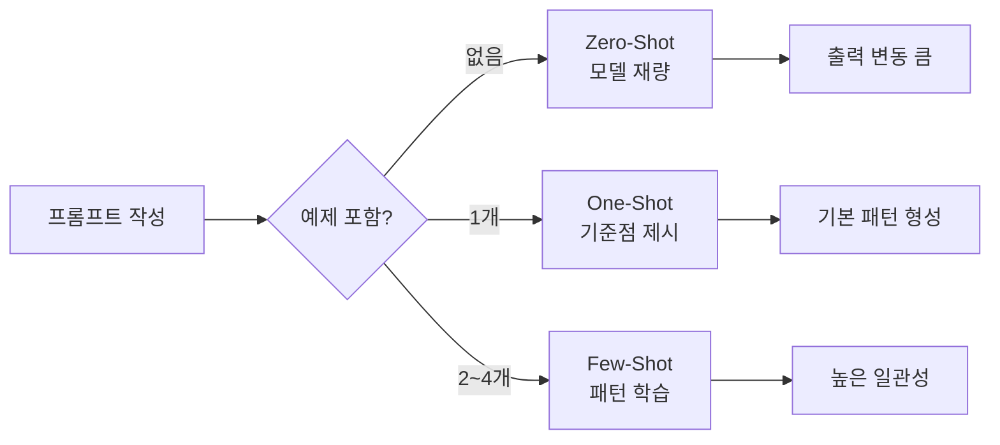
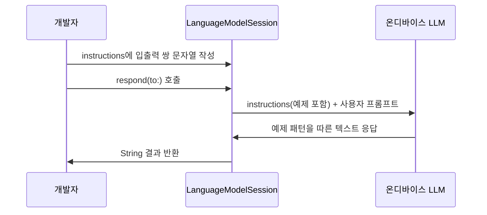
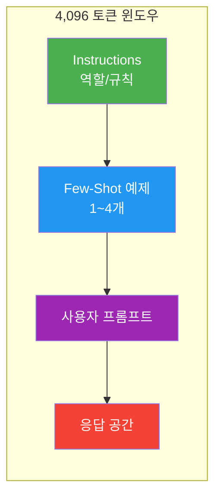
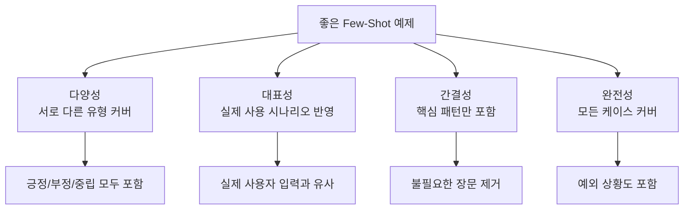
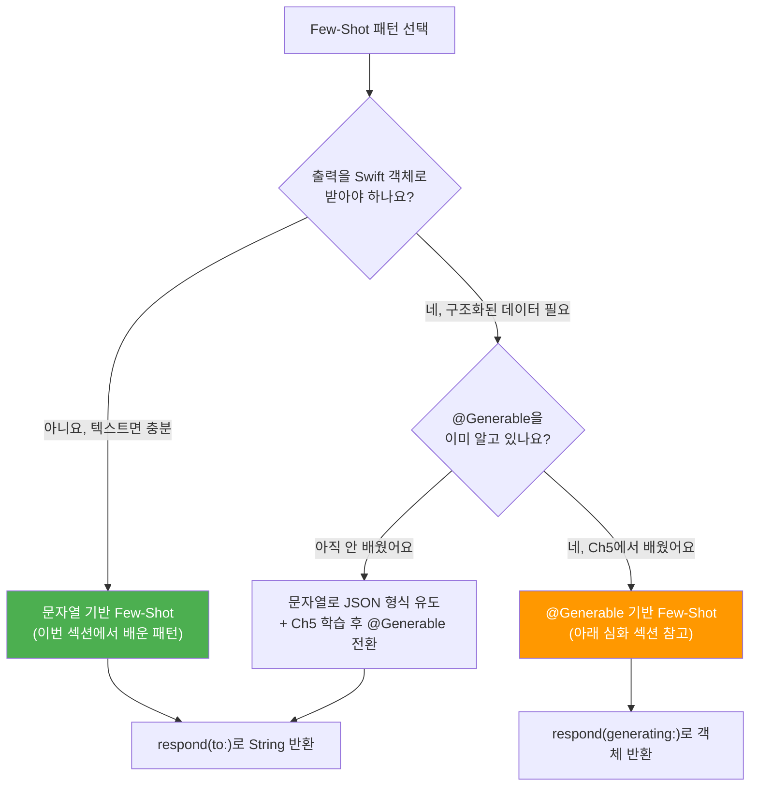
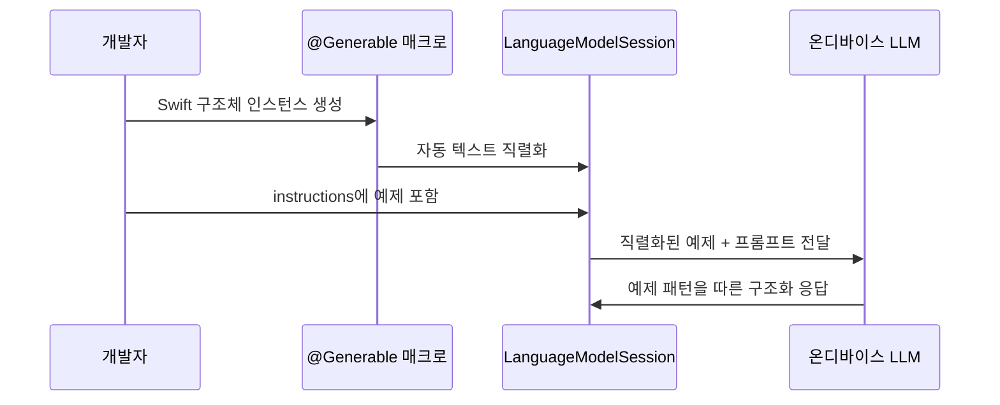

# Few-Shot 패턴과 예제 기반 프롬프팅

> 입출력 예제를 프롬프트에 포함하여 온디바이스 모델의 응답 품질과 일관성을 극적으로 높이는 기법을 학습합니다.

## 개요

이 섹션에서는 프롬프트에 구체적인 입출력 예제를 포함하여 모델의 응답을 원하는 방향으로 유도하는 **few-shot 프롬프팅** 기법을 다룹니다. [이전 섹션](04-ch4-프롬프트-엔지니어링-실전/02-02-시스템-프롬프트instructions-설계.md)에서 배운 `instructions`로 역할과 톤을 설정했다면, 이번에는 "이런 식으로 답해줘"라는 **구체적 본보기**를 제공하는 방법을 배웁니다.

**선수 지식**:
- `LanguageModelSession(instructions:)` 초기화 방식 ([세션 4.2](04-ch4-프롬프트-엔지니어링-실전/02-02-시스템-프롬프트instructions-설계.md))
- 온디바이스 ~3B 모델의 토큰 제약 이해 ([세션 4.1](04-ch4-프롬프트-엔지니어링-실전/01-01-온디바이스-모델-특성과-프롬프트-전략.md))

**학습 목표**:
- Zero-shot, one-shot, few-shot 프롬프팅의 차이를 이해하고 적절히 선택할 수 있다
- **문자열 기반 few-shot 패턴**을 자유자재로 구현한다
- 온디바이스 모델의 제한된 컨텍스트 윈도우 안에서 예제 수와 품질을 최적화한다
- (선택 심화) `@Generable` 객체를 예제로 활용하는 패턴을 미리 살펴본다

## 왜 알아야 할까?

"요약해 줘"라고 말하면 매번 다른 스타일의 요약이 나오는 경험, 해보셨죠? 어떤 때는 3줄, 어떤 때는 10줄, 어떤 때는 글머리 기호, 어떤 때는 서술형. 온디바이스 ~3B 모델은 대규모 서버 모델보다 **지시 따르기(instruction following) 능력이 제한적**이기 때문에 이런 불일치가 더 심합니다.

few-shot 프롬프팅은 이 문제의 가장 실용적인 해결책입니다. "이렇게 해줘"라고 말하는 대신 "여기 예시가 있어, 이런 식으로 해줘"라고 **보여주는** 거죠. 사람도 마찬가지 아닌가요? "보고서를 깔끔하게 써"라는 지시보다 실제 깔끔한 보고서 한 장을 보여주는 게 훨씬 효과적이듯, 언어 모델도 예제에서 패턴을 추출하는 데 탁월합니다.

이번 섹션에서는 먼저 **문자열 기반 few-shot 패턴**을 완전히 익힌 뒤, 선택 심화로 `@Generable` 매크로를 활용한 구조화된 예제 주입도 미리 살펴봅니다. `@Generable`은 [Ch5](05-ch5-generable-구조화-출력/01-01-guided-generation-개념과-동작-원리.md)에서 본격적으로 배우게 되니, 지금은 "이런 것도 가능하구나" 정도로 가볍게 훑어보시면 됩니다.

## 핵심 개념

### 개념 1: Zero-Shot vs One-Shot vs Few-Shot

> 💡 **비유**: 새로운 레스토랑 셰프에게 메뉴를 설명하는 상황을 떠올려 보세요. "파스타를 만들어 주세요"(zero-shot)는 셰프의 재량에 전적으로 맡기는 겁니다. "지난번에 만든 이 까르보나라처럼 만들어 주세요"(one-shot)는 기준점을 하나 주는 거고요. "이 세 접시가 우리 가게 스타일이에요, 이 느낌으로 새 메뉴를 만들어 주세요"(few-shot)는 패턴을 잡아주는 거죠.

프롬프팅 전략은 **예제 포함 여부와 개수**에 따라 세 가지로 분류됩니다:

| 전략 | 예제 수 | 장점 | 단점 |
|------|---------|------|------|
| **Zero-shot** | 0개 | 토큰 절약, 빠른 응답 | 출력 형식/스타일 불일치 |
| **One-shot** | 1개 | 기본 패턴 설정 | 과적합 위험 |
| **Few-shot** | 2~4개 | 높은 일관성과 품질 | 토큰 소비 증가 |

> 📊 **그림 1**: 프롬프팅 전략별 예제 포함 흐름과 결과 비교



Apple의 WWDC25 세션 "Explore prompt design & safety for on-device foundation models"에서는 **5개 미만의 예제**를 사용하도록 권장합니다. 온디바이스 모델의 컨텍스트 윈도우는 약 **4,096 토큰**으로 제한되어 있는데([세션 4.1](04-ch4-프롬프트-엔지니어링-실전/01-01-온디바이스-모델-특성과-프롬프트-전략.md)에서 다룬 온디바이스 모델의 핵심 제약 중 하나입니다), 예제가 많을수록 실제 작업에 쓸 공간이 줄어들기 때문이죠.

```swift
import FoundationModels

// Zero-shot: 예제 없이 지시만
let zeroShotSession = LanguageModelSession(instructions: "뉴스 기사를 한 줄로 요약하세요.")

// One-shot: instructions에 예제 하나 포함
let oneShotSession = LanguageModelSession {
    "뉴스 기사를 한 줄로 요약하세요."
    "예시 입력: 'Apple이 WWDC25에서 Foundation Models 프레임워크를 발표했다...'"
    "예시 출력: 'Apple, 온디바이스 AI 프레임워크 공개'"
}
```

### 개념 2: 문자열 기반 Few-Shot 패턴 — 가장 기본이 되는 방법

> 💡 **비유**: 모든 상황에서 모델하우스가 필요한 건 아닙니다. 간단한 텍스트 변환 — 예를 들어 "이 문장을 존댓말로 바꿔줘" — 같은 작업에는 스케치 한 장이면 충분하죠. 그게 바로 문자열 기반 few-shot이고, **few-shot의 가장 기본이자 핵심 패턴**입니다.

문자열 기반 few-shot은 `@Generable` 같은 추가 도구 없이 **순수 문자열만으로** 입출력 쌍을 instructions에 직접 작성하는 방식입니다. 구조화된 출력이 필요 없는 자유 텍스트 생성, 분류, 변환 작업에 가장 적합하고, 지금 바로 사용할 수 있습니다.

> 📊 **그림 2**: 문자열 기반 few-shot의 동작 흐름



```swift
import FoundationModels

// 문자열 기반 few-shot — 감정 분석 예제
let session = LanguageModelSession {
    """
    사용자 리뷰의 감정을 분석하세요.
    반드시 '긍정', '부정', '중립' 중 하나로만 답하세요.
    
    리뷰: "배송이 빠르고 품질이 좋아요!"
    감정: 긍정
    
    리뷰: "설명과 다른 제품이 왔어요. 환불 요청합니다."
    감정: 부정
    
    리뷰: "보통이에요. 가격 대비 나쁘지 않습니다."
    감정: 중립
    """
}

// 새로운 리뷰에 대해 요청
let result = try await session.respond(
    to: "리뷰: \"포장이 깔끔하고 제품 상태도 완벽해요!\" 감정:"
)
// 출력: "긍정"
```

문자열 기반 패턴에서 주의할 점은 **일관된 구분자**를 사용하는 것입니다. 위 예제에서 `리뷰:`와 `감정:`이라는 라벨이 매 예제마다 동일하게 반복되고 있죠. 모델은 이 패턴을 인식하고 동일한 형식으로 응답합니다.

문자열 기반 few-shot이 빛나는 대표적인 사용 사례를 정리하면:

| 사용 사례 | 예시 | 왜 문자열이 적합한가 |
|----------|------|-------------------|
| **분류** | 감정 분석, 카테고리 분류 | 출력이 단순 라벨(한 단어) |
| **텍스트 변환** | 존댓말 변환, 요약, 번역 | 출력이 자유 형식 텍스트 |
| **추출** | 핵심 키워드, 날짜 추출 | 구조가 단순하여 별도 타입 불필요 |
| **포맷 변환** | 마크다운→플레인텍스트 | 입출력 모두 문자열 |

> 🔥 **실무 팁**: 문자열 기반 few-shot을 작성할 때는 **구분자를 통일**하는 것이 핵심입니다. `입력:` / `출력:`, `Q:` / `A:`, `리뷰:` / `감정:` 등 어떤 형식이든 상관없지만, 모든 예제에서 **동일한 구분자**를 사용해야 모델이 패턴을 정확히 인식합니다.

### 개념 3: 토큰 예산 관리 — 제한된 공간 안에서 최적화하기

> 💡 **비유**: 여행 가방에 넣을 수 있는 짐은 한정되어 있죠. 옷(예제)을 많이 넣으면 세면도구(실제 프롬프트)를 넣을 공간이 줄어듭니다. 온디바이스 모델의 컨텍스트 윈도우도 마찬가지입니다.

온디바이스 모델의 가장 큰 제약은 **약 4,096 토큰의 컨텍스트 윈도우**입니다. 이 수치는 Apple이 온디바이스 ~3B 모델에 설정한 제한으로, 서버 모델의 수만~수십만 토큰에 비하면 매우 작습니다. 이 안에 instructions + 예제 + 사용자 프롬프트 + 생성 응답이 모두 들어가야 하기 때문에, few-shot 예제 설계 시 토큰 효율이 핵심입니다.

> 📊 **그림 3**: 토큰 예산 분배 전략



토큰 예산을 관리하는 실전 전략을 정리하면:

| 전략 | 토큰 절약 | 주의사항 |
|------|----------|---------|
| 예제 수 최소화 (2~3개) | 높음 | 다양한 패턴 커버 필요 |
| 짧고 핵심적인 예제 작성 | 중간 | 핵심 패턴이 드러나야 함 |
| instructions 간결화 | 낮음 | 역할/규칙 누락 주의 |
| 구분자와 라벨 통일 | 낮음 | 불필요한 설명 문구 제거 |

### 개념 4: 좋은 Few-Shot 예제의 조건

> 💡 **비유**: 학생에게 시험 대비 예제를 줄 때, 같은 유형의 문제만 5개 주는 것보다 **서로 다른 유형**의 문제를 3개 주는 게 더 효과적입니다. 다양한 상황을 커버하는 예제가 모델의 일반화 능력을 높여줍니다.

좋은 few-shot 예제는 다음 원칙을 따릅니다:

> 📊 **그림 4**: 좋은 예제의 4가지 조건



문자열 기반 few-shot에서 이 원칙을 적용한 예제를 살펴보겠습니다:

```swift
import FoundationModels

// 좋은 문자열 기반 few-shot — 일정 추출기
let session = LanguageModelSession {
    """
    대화에서 일정 정보를 추출하세요.
    형식: 날짜 | 시간 | 내용 | 장소
    정보가 없는 항목은 '미정'으로 표시하세요.
    
    입력: "내일 오후 3시에 강남역에서 미팅 있어"
    출력: 내일 | 오후 3시 | 미팅 | 강남역
    
    입력: "다음 주 월요일 점심 약속 잡자"
    출력: 다음 주 월요일 | 미정 | 점심 약속 | 미정
    
    입력: "토요일 오전 10시 한강공원 러닝, 저녁 7시 회식"
    출력: 토요일 | 오전 10시 | 러닝 | 한강공원
    토요일 | 저녁 7시 | 회식 | 미정
    """
}
```

위 예제 세트가 좋은 이유를 분석해 보면:
- **다양성**: 정보가 완전한 경우, 불완전한 경우, 여러 일정이 있는 경우를 모두 포함
- **대표성**: 실제 대화에서 나올 법한 자연스러운 문장
- **간결성**: 핵심 정보만 포함, 불필요한 부연 없음
- **완전성**: '미정'이라는 예외 처리 방법을 명시적으로 보여줌

### 개념 5: 문자열 기반 vs 구조화 기반 — 어떤 걸 선택할까?

> 📊 **그림 5**: few-shot 패턴 선택 가이드



**지금 단계에서의 권장**: 대부분의 few-shot 작업은 문자열 기반으로 충분합니다. 구조화된 출력이 필요한 경우에도, 먼저 문자열로 JSON 형식을 유도하는 방법을 쓸 수 있습니다:

```swift
import FoundationModels

// 구조화 출력이 필요하지만 @Generable 없이도 가능한 패턴
let session = LanguageModelSession {
    """
    제품 리뷰를 분석하여 JSON 형식으로 응답하세요.
    
    리뷰: "배송이 빠르고 품질이 좋아요!"
    결과: {"sentiment": "긍정", "keywords": ["빠른 배송", "고품질"]}
    
    리뷰: "설명과 다른 제품이 왔어요."
    결과: {"sentiment": "부정", "keywords": ["상품 불일치"]}
    """
}

let result = try await session.respond(
    to: "리뷰: \"포장이 깔끔하고 제품 상태도 완벽해요!\" 결과:"
)
// 응답을 JSONDecoder로 파싱하여 사용
```

> 💡 물론 이 방식은 타입 안전성이 없고, 모델이 잘못된 JSON을 생성할 수도 있습니다. [Ch5](05-ch5-generable-구조화-출력/01-01-guided-generation-개념과-동작-원리.md)에서 배울 `@Generable`은 이런 문제를 근본적으로 해결해 줍니다. Ch5 학습 후 이 섹션의 [선택 심화](#선택-심화-generable-객체를-예제로-활용하기)로 돌아오시면 더 강력한 패턴을 익힐 수 있습니다.

## 실습: 직접 해보기

대화 메시지를 분석하여 카테고리와 우선순위를 분류하는 "메시지 분류기"를 만들어 봅시다. 문자열 기반 few-shot을 활용하여 일관된 출력을 보장합니다.

```swift
import SwiftUI
import FoundationModels

// MARK: - ViewModel

@Observable
class MessageClassifierViewModel {
    var messageText: String = ""
    var classificationResult: String?
    var isClassifying = false
    var errorMessage: String?
    
    // 문자열 기반 few-shot 세션 생성
    private func createSession() -> LanguageModelSession {
        LanguageModelSession {
            """
            사용자 메시지를 분류하세요.
            형식: 카테고리 | 우선순위 | 요약
            
            카테고리: 업무, 개인, 긴급, 스팸
            우선순위: 높음, 보통, 낮음
            요약: 10자 이내 핵심 내용
            
            메시지: "내일 오전까지 보고서 제출 부탁드립니다"
            분류: 업무 | 높음 | 보고서 제출 요청
            
            메시지: "주말에 같이 영화 볼래?"
            분류: 개인 | 낮음 | 주말 영화 제안
            
            메시지: "서버 장애 발생! 즉시 확인 필요합니다"
            분류: 긴급 | 높음 | 서버 장애 알림
            
            메시지: "축하합니다! 100만원 당첨되었습니다. 링크 클릭"
            분류: 스팸 | 낮음 | 스팸 당첨 사기
            """
        }
    }
    
    func classifyMessage() async {
        guard !messageText.isEmpty else { return }
        isClassifying = true
        errorMessage = nil
        
        do {
            let session = createSession()
            let result = try await session.respond(
                to: "메시지: \"\(messageText)\"\n분류:"
            )
            classificationResult = result.content
        } catch {
            errorMessage = "분류 실패: \(error.localizedDescription)"
        }
        
        isClassifying = false
    }
}

// MARK: - SwiftUI View

struct MessageClassifierView: View {
    @State private var viewModel = MessageClassifierViewModel()
    
    var body: some View {
        NavigationStack {
            Form {
                // 입력 섹션
                Section("메시지 입력") {
                    TextEditor(text: $viewModel.messageText)
                        .frame(minHeight: 80)
                        .accessibilityLabel("메시지 텍스트 입력")
                }
                
                // 분류 버튼
                Section {
                    Button(action: {
                        Task { await viewModel.classifyMessage() }
                    }) {
                        HStack {
                            if viewModel.isClassifying {
                                ProgressView()
                                    .padding(.trailing, 4)
                            }
                            Text(viewModel.isClassifying ? "분류 중..." : "메시지 분류하기")
                        }
                    }
                    .disabled(viewModel.messageText.isEmpty || viewModel.isClassifying)
                }
                
                // 결과 표시
                if let result = viewModel.classificationResult {
                    Section("분류 결과") {
                        Text(result)
                            .font(.body.monospaced())
                    }
                }
                
                // 에러 표시
                if let error = viewModel.errorMessage {
                    Section {
                        Text(error)
                            .foregroundStyle(.red)
                    }
                }
            }
            .navigationTitle("메시지 분류기")
        }
    }
}
```

```run:swift
// 실행 예시 — 문자열 기반 few-shot 분류 시뮬레이션
let testMessages = [
    "프로젝트 회의가 오후 2시로 변경되었습니다",
    "이번 주말 캠핑 갈 사람?",
    "고객사에서 긴급 콜 요청이 왔습니다"
]

for message in testMessages {
    print("메시지: \"\(message)\"")
}
print("---")
print("예상 분류 결과:")
print("업무 | 보통 | 회의 시간 변경")
print("개인 | 낮음 | 주말 캠핑 제안")
print("긴급 | 높음 | 고객사 긴급 요청")
```

```output
메시지: "프로젝트 회의가 오후 2시로 변경되었습니다"
메시지: "이번 주말 캠핑 갈 사람?"
메시지: "고객사에서 긴급 콜 요청이 왔습니다"
---
예상 분류 결과:
업무 | 보통 | 회의 시간 변경
개인 | 낮음 | 주말 캠핑 제안
긴급 | 높음 | 고객사 긴급 요청
```

---

## 선택 심화: @Generable 객체를 예제로 활용하기

> ⚠️ **이 섹션은 미리보기입니다.** `@Generable` 매크로는 [Ch5. Generable 구조화 출력](05-ch5-generable-구조화-출력/01-01-guided-generation-개념과-동작-원리.md)에서 본격적으로 배웁니다. 지금은 "이런 것이 가능하다"는 감을 잡는 정도로 읽어보시고, **Ch5 학습 후 다시 돌아오시면** 아래 코드가 훨씬 자연스럽게 이해될 겁니다.
>
> 아직 `@Generable`이 낯설다면 이 섹션을 건너뛰어도 앞으로의 학습에 전혀 지장이 없습니다.

Foundation Models 프레임워크의 강력한 기능 중 하나는 **`@Generable` 구조체 인스턴스를 instructions 안에 직접 넣을 수 있다**는 점입니다. 간단히 설명하면, `@Generable`은 Swift 매크로로, 구조체에 붙이면 모델이 해당 구조에 맞는 응답을 **Swift 객체로 직접 반환**합니다. 매크로가 자동으로 객체를 모델이 이해할 수 있는 텍스트로 변환해 주죠.

> 💡 **비유**: 건축가에게 "멋진 집 지어주세요"라고 말하면 사람마다 다른 결과가 나오죠. 하지만 모델하우스를 보여주면? 구조, 마감, 스타일 전부를 한눈에 전달할 수 있습니다. `@Generable` 객체가 바로 그 모델하우스 역할을 합니다.

> 📊 **그림 6**: @Generable 객체 기반 few-shot 흐름



```swift
import FoundationModels

// 1. @Generable 구조체 정의 — 출력 형식과 예제를 동시에 담는 그릇
@Generable
struct BookSummary {
    @Guide(description: "책 제목")
    var title: String
    
    @Guide(description: "한 줄 요약 (20자 이내)")
    var oneLiner: String
    
    @Guide(description: "핵심 키워드 3개")
    var keywords: [String]
    
    @Guide(description: "추천 독자층")
    var targetAudience: String
}

// 2. 예제 인스턴스 생성 — 이것이 "모델하우스"
let exampleSummary = BookSummary(
    title: "스위프트 프로그래밍",
    oneLiner: "iOS 개발의 핵심 언어 입문서",
    keywords: ["Swift", "iOS", "프로그래밍"],
    targetAudience: "프로그래밍 입문자"
)

// 3. instructions에 예제를 직접 주입
let session = LanguageModelSession {
    "당신은 도서관 사서입니다. 책 정보를 간결하게 정리해 주세요."
    "다음은 원하는 출력 형식의 예시입니다:"
    exampleSummary  // @Generable 덕분에 자동 직렬화!
}

// 4. 실제 요청 — 결과가 BookSummary 타입으로 반환됨
let response = try await session.respond(
    to: "클린 코드(Robert C. Martin) 책을 정리해 주세요.",
    generating: BookSummary.self
)
// response.title, response.oneLiner 등으로 바로 접근 가능!
```

핵심은 `exampleSummary`를 instructions 클로저 안에 그대로 넣었다는 점입니다. `@Generable` 매크로가 이 인스턴스를 모델이 이해할 수 있는 텍스트 표현으로 자동 변환합니다. JSON을 직접 작성하거나 문자열 포매팅을 할 필요가 없죠.

#### includeSchemaInPrompt 최적화

예제를 통해 모델이 이미 출력 구조를 충분히 이해했다면, 스키마 정보를 별도로 보내지 않아 토큰을 절약할 수 있습니다:

```swift
// 예제가 모든 필드를 보여주므로 스키마 전송 생략 가능
let response = try await session.respond(
    to: "데이터 중심 애플리케이션 설계를 정리해 주세요.",
    generating: BookSummary.self,
    includeSchemaInPrompt: false  // 토큰 절약!
)
```

> ⚠️ **주의**: `includeSchemaInPrompt: false`는 예제가 **모든 필드**(Optional nil 포함)를 커버할 때만 사용하세요. 그렇지 않으면 오히려 품질이 떨어집니다.

`@Generable`의 동작 원리, `@Guide` 매크로의 상세 옵션, Guided Generation의 내부 메커니즘은 [세션 5.1](05-ch5-generable-구조화-출력/01-01-guided-generation-개념과-동작-원리.md)에서 본격적으로 다룹니다.

---

## 더 깊이 알아보기

### Few-Shot 학습의 탄생 — GPT-3의 혁명

Few-shot 프롬프팅이 학계와 산업계의 주목을 받게 된 결정적 계기는 2020년 OpenAI가 발표한 논문 *"Language Models are Few-Shot Learners"*입니다. GPT-3(1,750억 파라미터)가 별도의 파인튜닝 없이 프롬프트에 포함된 몇 개의 예제만으로 새로운 작업을 수행할 수 있음을 보여준 것이죠.

놀라운 점은 이 능력이 **모델 크기에 비례**한다는 발견이었습니다. 작은 모델은 few-shot에 별 반응이 없었지만, 대형 모델은 극적인 성능 향상을 보였습니다. 이를 **"in-context learning(맥락 내 학습)"**이라 부릅니다 — 가중치를 업데이트하지 않고도 프롬프트의 예제에서 패턴을 추출하는 능력이죠.

그렇다면 Apple의 ~3B 온디바이스 모델은 어떨까요? 1,750억에 비하면 작은 모델이지만, Apple은 2-bit QAT(Quantization-Aware Training)와 Guided Generation 등의 기법으로 **작은 모델에서도 few-shot이 효과적으로 작동**하도록 최적화했습니다. 특히 `@Generable` 매크로를 통한 구조화된 예제 주입은 모델이 패턴을 더 쉽게 파악하도록 도와줍니다.

### 왜 "보여주기"가 "말하기"보다 효과적일까?

인지과학에서도 비슷한 현상이 관찰됩니다. 인간의 학습에서도 **절차적 지식(procedural knowledge)**은 시범을 통해 가장 효율적으로 전달됩니다. 수영을 배울 때 팔의 각도를 설명하는 것보다 직접 보여주는 게 빠르듯, 언어 모델도 추상적 지시보다 구체적 예시에서 더 정확한 패턴을 추출합니다. 이것이 few-shot의 본질적 힘입니다.

## 흔한 오해와 팁

> ⚠️ **흔한 오해**: "예제가 많을수록 좋다"고 생각하기 쉽지만, 온디바이스 모델에서는 **3개면 충분**합니다. 4,096 토큰 윈도우에서 예제 5개를 넣으면 실제 작업 프롬프트와 응답 공간이 심각하게 부족해집니다. Apple도 공식적으로 "5개 미만"을 권장합니다. 예제의 **다양성과 품질**이 양보다 중요합니다.

> 💡 **알고 계셨나요?**: few-shot 프롬프팅에서 예제의 **순서**도 결과에 영향을 줍니다. 일반적으로 가장 대표적인 예제를 **마지막에** 배치하면 성능이 좋아지는 경향이 있습니다. 이를 "recency bias(최신 편향)"라 부르는데, 모델이 가장 최근에 본 예제의 패턴을 더 강하게 따르기 때문입니다.

> 🔥 **실무 팁**: few-shot 예제를 설계할 때는 **"경계 케이스(edge case)"를 반드시 하나 포함**하세요. 정보가 없는 경우, 극단적으로 짧거나 긴 입력, 복수의 결과가 나오는 경우 등. 모델은 "정상 케이스"만 보면 경계 상황에서 예측 불가능하게 행동합니다. 위 실습에서 스팸 메시지 예제를 포함한 것이 이 원칙의 적용입니다.

> 🔥 **실무 팁**: Xcode 26의 `#Playground` 기능을 활용하면 few-shot 예제를 빠르게 실험할 수 있습니다. 코드 파일 아무 곳에서나 `#Playground`를 추가하고 프롬프트를 작성하면, SwiftUI 프리뷰처럼 바로 모델 응답을 확인할 수 있습니다. 예제 조합을 반복 테스트할 때 최적의 도구입니다.

## 핵심 정리

| 개념 | 설명 |
|------|------|
| **Zero-shot** | 예제 없이 지시만으로 요청. 간단한 작업에 적합, 출력 형식 불일치 가능 |
| **One-shot** | 예제 1개로 기준점 제시. 기본 패턴은 잡히지만 과적합 위험 |
| **Few-shot** | 예제 2~4개로 패턴 학습. 높은 일관성, 온디바이스에서는 3개 권장 |
| **문자열 기반 few-shot** | 입출력 쌍을 문자열로 직접 작성. 가장 기본이 되는 핵심 패턴 |
| **구분자 통일** | `입력:`/`출력:` 등 일관된 라벨 사용이 패턴 인식의 핵심 |
| **토큰 예산 관리** | 약 4,096 토큰 안에 instructions + 예제 + 프롬프트 + 응답 모두 배분 필요 |
| **좋은 예제 조건** | 다양성, 대표성, 간결성, 완전성(경계 케이스 포함) |
| **@Generable 예제 주입** | (선택 심화) Swift 구조체 인스턴스를 instructions에 직접 포함. Ch5에서 본격 학습 |

## 다음 섹션 미리보기

few-shot으로 출력 품질을 높이는 법을 배웠으니, 다음 섹션 [프롬프트 디버깅과 반복 개선](04-ch4-프롬프트-엔지니어링-실전/04-04-프롬프트-디버깅과-반복-개선.md)에서는 프롬프트가 기대대로 동작하지 않을 때 **어떻게 문제를 진단하고 체계적으로 개선하는지** 다룹니다. Xcode Playgrounds를 활용한 반복 실험, 응답 품질 평가 기준, 그리고 프롬프트 버전 관리 전략을 배우게 됩니다.

## 참고 자료

- [Code-along: Bring on-device AI to your app — WWDC25](https://developer.apple.com/videos/play/wwdc2025/259/) - Foundation Models의 few-shot 예제와 `includeSchemaInPrompt` 최적화를 직접 코딩하며 배우는 공식 세션
- [Explore prompt design & safety for on-device foundation models — WWDC25](https://developer.apple.com/videos/play/wwdc2025/248/) - Apple이 제시하는 온디바이스 프롬프트 설계 원칙과 5개 미만 예제 권장 가이드라인
- [The Ultimate Guide To The Foundation Models Framework — AzamSharp](https://azamsharp.com/2025/06/18/the-ultimate-guide-to-the-foundation-models-framework.html) - few-shot 패턴과 Tool 연동 시 예제 활용법을 다룬 종합 가이드
- [A Swift Developer's Guide to Prompt Engineering with Apple's FoundationModels — Natasha The Robot](https://www.natashatherobot.com/p/swift-prompt-engineering-apples-foundationmodels) - 프롬프트 설계 실전 기법과 `includeSchemaInPrompt` 최적화
- [Deep dive into the Foundation Models framework — WWDC25](https://developer.apple.com/videos/play/wwdc2025/301/) - GenerationOptions, Guided Generation, 스키마 기반 출력 제어 심화

---
### 🔗 Related Sessions
- [토큰-지연 관계](04-ch4-프롬프트-엔지니어링-실전/01-01-온디바이스-모델-특성과-프롬프트-전략.md) (prerequisite)
