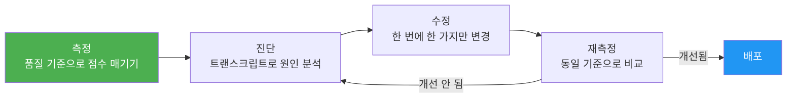
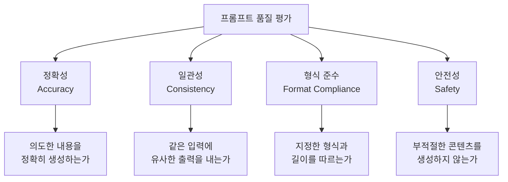
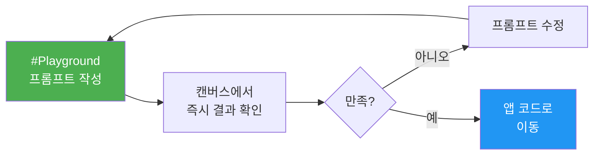
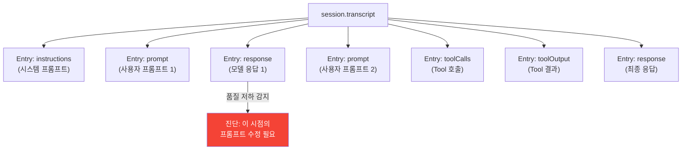
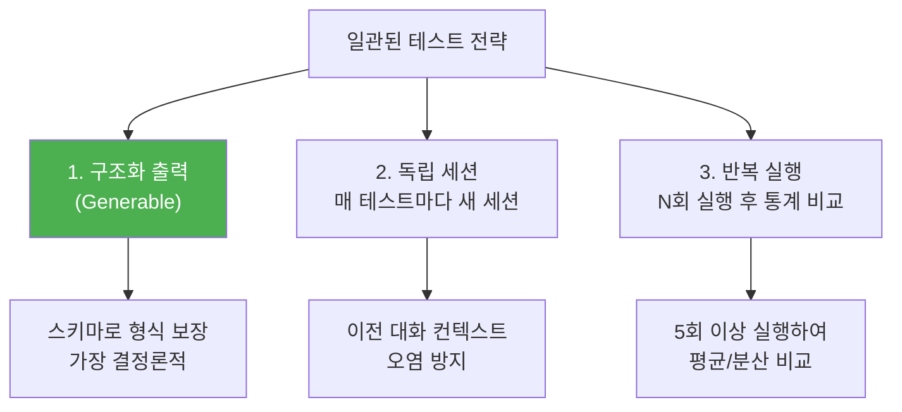
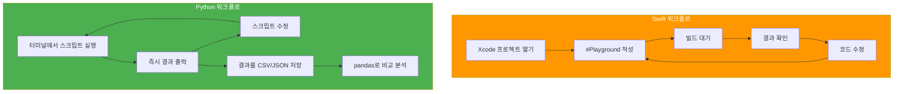
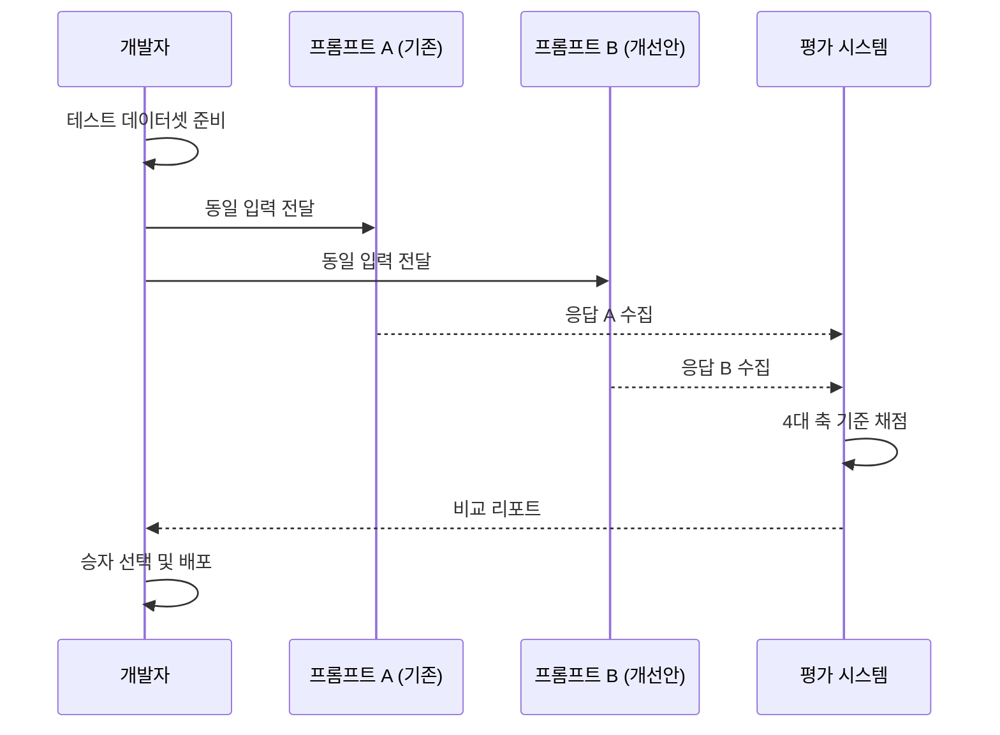

# 프롬프트 디버깅과 반복 개선

> 프롬프트가 기대대로 동작하지 않을 때, 문제를 체계적으로 진단하고 빠르게 개선하는 워크플로를 학습합니다.

## 개요

이 섹션에서는 Foundation Models 프레임워크에서 프롬프트의 품질을 측정하고, 문제를 진단하며, 반복적으로 개선하는 체계적인 방법론을 다룹니다. Xcode Playground, 세션 트랜스크립트, Python FM SDK를 활용한 빠른 실험 루프와 A/B 프롬프트 비교 기법까지 실전에서 바로 쓸 수 있는 워크플로를 익힙니다.

**선수 지식**: [시스템 프롬프트 설계](04-ch4-프롬프트-엔지니어링-실전/02-02-시스템-프롬프트instructions-설계.md)의 instructions 패턴과 [Few-Shot 프롬프팅](04-ch4-프롬프트-엔지니어링-실전/03-03-few-shot-패턴과-예제-기반-프롬프팅.md)의 예제 주입 기법

**학습 목표**:
- 프롬프트 응답 품질을 객관적으로 평가하는 기준을 세울 수 있다
- Xcode Playground와 세션 트랜스크립트로 문제를 진단한다
- Python FM SDK를 활용하여 빠른 프롬프트 실험 루프를 구축한다
- A/B 프롬프트 비교와 버전 관리로 체계적으로 개선한다

## 왜 알아야 할까?

프롬프트를 한 번에 완벽하게 작성하는 사람은 없습니다. 심지어 Apple 엔지니어조차 WWDC25에서 "프롬프트는 반복 실험의 결과"라고 강조했죠. 특히 온디바이스 ~3B 모델은 서버 모델보다 프롬프트 품질에 더 민감하기 때문에, 작은 문구 차이가 결과를 크게 바꿀 수 있습니다.

문제는 "이 프롬프트가 좋은 건지 나쁜 건지" 판단할 기준이 없으면 개선 방향도 잡을 수 없다는 겁니다. "느낌상 괜찮아 보이는데?" 수준에서 벗어나려면, 측정 → 진단 → 수정 → 재측정의 과학적 루프가 필요합니다.

> 📊 **그림 1**: 프롬프트 디버깅의 과학적 루프



이 섹션을 마치면, 프롬프트 작성이 "감"이 아닌 "프로세스"가 됩니다. 마치 소프트웨어 테스트처럼 자동화하고 추적할 수 있는 체계를 갖추게 되거든요.

## 핵심 개념

### 개념 1: 응답 품질 평가 프레임워크

> 💡 **비유**: 요리 대회의 심사위원을 떠올려 보세요. "맛있다/맛없다" 한 마디로 끝내지 않잖아요? 맛, 식감, 플레이팅, 창의성 등 여러 기준으로 점수를 매겨야 공정한 평가가 가능합니다. 프롬프트 평가도 마찬가지입니다.

프롬프트의 응답 품질을 평가하려면 먼저 **무엇을 기준으로** 판단할지 정해야 합니다. Apple Foundation Models에서 특히 중요한 평가 축은 다음 네 가지입니다.

> 📊 **그림 2**: 프롬프트 품질 평가의 4대 축



| 평가 축 | 질문 | 온디바이스 모델 특이사항 |
|---------|------|----------------------|
| **정확성** | 의도한 내용을 생성하는가? | ~3B 모델은 사실 질문에 약함. 창의적 과제에 집중 |
| **일관성** | 같은 입력에 비슷한 결과가 나오는가? | 같은 프롬프트라도 매번 약간 다른 결과 가능 |
| **형식 준수** | 길이, 포맷, 톤을 따르는가? | "한 문장으로" 같은 명시적 제약이 효과적 |
| **안전성** | 가드레일을 우회하지 않는가? | Apple의 4겹 안전성 계층 활용 |

프롬프트 디버깅의 첫 단계는 "이 프롬프트로 뭘 기대하는가?"를 구체적으로 적는 것입니다. 이것을 **평가 기준(Evaluation Criteria)** 이라고 하고, 각 기준마다 점수를 매기면 개선 전후를 객관적으로 비교할 수 있습니다.

```swift
// 평가 기준을 구조체로 정의하면 체계적으로 관리할 수 있다
struct PromptEvaluation {
    let promptVersion: String      // 프롬프트 버전 식별자
    let accuracy: Int              // 1-5 점수: 의도한 내용 정확도
    let consistency: Int           // 1-5 점수: 반복 실행 일관성
    let formatCompliance: Int      // 1-5 점수: 형식/길이 준수
    let safety: Int                // 1-5 점수: 안전성
    let notes: String              // 관찰 메모
    
    // 종합 점수 계산
    var totalScore: Double {
        Double(accuracy + consistency + formatCompliance + safety) / 4.0
    }
}
```

실무에서는 테스트 케이스를 5~10개 준비하고, 각 케이스마다 4대 축 점수를 매겨 평균을 냅니다. 이 점수가 곧 프롬프트 변경의 "before/after" 비교 기준이 됩니다.

### 개념 2: Xcode Playground로 빠른 프롬프트 반복

> 💡 **비유**: 화가가 스케치북에 여러 구도를 빠르게 그려보듯, Xcode Playground는 프롬프트의 "스케치북"입니다. 앱 전체를 빌드하지 않고도 프롬프트 하나를 즉시 테스트할 수 있거든요.

WWDC25에서 Apple은 Xcode 26의 **인라인 Playground** 기능을 공개했습니다. `#Playground` 매크로를 코드 파일에 추가하면, SwiftUI 프리뷰처럼 모델 응답이 즉시 캔버스에 표시됩니다. 이건 프롬프트 엔지니어링의 게임 체인저입니다.

> 📊 **그림 3**: Xcode Playground 프롬프트 반복 워크플로



```swift
import FoundationModels

// Xcode 26의 인라인 Playground — 빌드 없이 즉시 테스트
#Playground {
    let session = LanguageModelSession(instructions: """
        당신은 한국어 요리 레시피 전문가입니다.
        응답은 반드시 3단계 이내로 요약하세요.
        """)
    
    // 프롬프트 v1: 너무 일반적
    let response = try await session.respond(to: "김치찌개 만드는 법")
    print(response)  // 캔버스에서 바로 확인!
}
```

Playground에서 프롬프트를 테스트할 때 핵심 팁이 있습니다. **한 번에 하나만 바꾸세요.** instructions를 수정하면서 동시에 프롬프트 문구도 바꾸면, 어떤 변경이 결과에 영향을 미쳤는지 알 수 없습니다.

```swift
// Playground에서 단계적 프롬프트 개선 예시
#Playground {
    // v1: 기본 — 결과가 너무 길고 형식이 일정하지 않다
    let v1 = LanguageModelSession()
    let r1 = try await v1.respond(to: "서울 여행 추천해줘")
    
    // v2: instructions만 추가 — 길이와 톤을 제어
    let v2 = LanguageModelSession(instructions: """
        서울 여행 가이드입니다. 장소는 3곳만 추천하고,
        각 장소를 한 줄로 설명하세요.
        """)
    let r2 = try await v2.respond(to: "서울 여행 추천해줘")
    
    // v1과 v2의 결과를 캔버스에서 나란히 비교!
    print("--- v1 ---\n\(r1)\n\n--- v2 ---\n\(r2)")
}
```

### 개념 3: 세션 트랜스크립트로 문제 진단

> 💡 **비유**: 의사가 환자의 검사 기록을 보며 진단하듯, 트랜스크립트는 모델과의 "진료 기록"입니다. 어떤 프롬프트에 어떻게 응답했는지 전부 기록되어 있어서, 문제의 원인을 추적할 수 있죠.

`LanguageModelSession`은 상태 기반(stateful)이며, 모든 프롬프트와 응답을 **트랜스크립트(Transcript)** 에 자동 기록합니다. 이 트랜스크립트를 활용하면 멀티턴 대화에서 어느 시점부터 품질이 떨어졌는지 정확히 진단할 수 있습니다.

> 📊 **그림 4**: 트랜스크립트 엔트리 구조와 디버깅 흐름



```swift
import FoundationModels

func debugSession() async throws {
    let session = LanguageModelSession(instructions: "한국어 일기 도우미입니다.")
    
    // 첫 번째 프롬프트 — 결과 확인
    let response1 = try await session.respond(to: "오늘 힘든 하루였어")
    
    // 두 번째 프롬프트 — 결과가 이상하다면?
    let response2 = try await session.respond(to: "더 자세히 써줘")
    
    // 트랜스크립트로 전체 대화 기록 확인
    for entry in session.transcript.entries {
        switch entry {
        case .prompt(let prompt):
            print("📤 프롬프트: \(prompt)")
        case .response(let response):
            print("📥 응답: \(response)")
        case .instructions(let instructions):
            print("⚙️ Instructions: \(instructions)")
        default:
            print("🔧 기타 엔트리: \(entry)")
        }
    }
}
```

트랜스크립트를 활용한 디버깅의 핵심은 **"어디서 틀어졌는가"** 를 찾는 것입니다. 멀티턴 대화에서 3번째 응답부터 품질이 떨어졌다면, 2번째 프롬프트의 맥락이 불충분했거나 컨텍스트 윈도우(4,096 토큰)에 가까워진 것일 수 있습니다.

트랜스크립트 디버깅에서 특히 유용한 패턴은 **엔트리 수 모니터링**입니다. 온디바이스 모델의 컨텍스트 윈도우는 제한적이기 때문에, 트랜스크립트 엔트리가 쌓일수록 초기 instructions의 영향력이 약해질 수 있거든요.

```swift
// 컨텍스트 윈도우 압박 감지 유틸리티
func checkContextPressure(session: LanguageModelSession) {
    let entryCount = session.transcript.entries.count
    // 온디바이스 모델의 컨텍스트 윈도우(~4096 토큰) 대비
    // 엔트리가 10개 이상이면 품질 저하 가능성 경고
    if entryCount > 10 {
        print("⚠️ 트랜스크립트 엔트리 \(entryCount)개 — 컨텍스트 압박 가능")
        print("💡 새 세션을 시작하거나 핵심 컨텍스트만 유지하세요")
    }
}
```

### 개념 4: 일관된 출력으로 테스트하기

> 💡 **비유**: 주사위를 굴려서 "항상 6이 나오게" 만드는 건 불가능하지만, 최대한 같은 조건에서 실험을 반복하면 통계적으로 의미 있는 결과를 얻을 수 있습니다. 프롬프트 테스트도 마찬가지로, 변수를 최소화하는 것이 핵심입니다.

프롬프트를 개선하려면 변경 전후를 비교해야 하는데, 모델의 기본 동작은 확률적(stochastic)이라서 같은 프롬프트에도 매번 다른 결과가 나올 수 있습니다. Apple Foundation Models 프레임워크에서 출력 일관성을 높이는 전략은 크게 세 가지입니다.

> 📊 **그림 5**: 일관된 테스트를 위한 3가지 전략



**전략 1: `@Generable` 구조화 출력 (가장 추천)**

가장 확실한 방법은 `@Generable`을 사용하는 것입니다. Guided Generation은 출력의 **스키마(구조)** 를 컴파일 타임에 강제하므로, 형식 면에서는 100% 결정론적입니다. 내용의 표현은 달라질 수 있지만, 필드 구조와 타입은 항상 동일합니다.

```swift
import FoundationModels

// @Generable은 출력 구조를 강제 — 형식 일관성 100%
@Generable
struct TestOutput {
    @Guide(description: "핵심 내용을 한 문장으로")
    var summary: String
    
    @Guide(description: "1에서 5 사이 관련도 점수")
    var relevanceScore: Int
}

func consistentTest() async throws {
    let session = LanguageModelSession(instructions: "텍스트 분석 도우미")
    
    // 항상 summary(String) + relevanceScore(Int) 구조가 보장됨
    let result: TestOutput = try await session.respond(
        to: "Apple의 Foundation Models 프레임워크에 대해 분석해줘",
        generating: TestOutput.self
    )
    print("요약: \(result.summary)")
    print("관련도: \(result.relevanceScore)")
}
```

**전략 2: 독립 세션 + 반복 실행**

자유 형식 텍스트 출력이 필요한 경우, 매 테스트마다 **새 세션을 생성**하고 **동일 조건에서 여러 번 실행**하여 통계적으로 비교합니다.

```swift
import FoundationModels

func repeatabilityTest(prompt: String, runs: Int = 5) async throws {
    var results: [String] = []
    
    for i in 1...runs {
        // 매번 새 세션 — 이전 대화 컨텍스트 오염 방지
        let session = LanguageModelSession(
            instructions: "간결한 한국어 요약 도우미. 한 문장으로 응답하세요."
        )
        let response = try await session.respond(to: prompt)
        results.append(response.content)
        print("Run \(i): \(response.content)")
    }
    
    // 결과 분석: 길이 분산, 공통 키워드 등 확인
    let lengths = results.map { $0.count }
    let avgLength = lengths.reduce(0, +) / lengths.count
    let maxDiff = (lengths.max() ?? 0) - (lengths.min() ?? 0)
    print("\n📊 평균 길이: \(avgLength)자, 최대 편차: \(maxDiff)자")
    
    // 편차가 크면 프롬프트의 제약 조건을 강화해야 함
    if maxDiff > avgLength / 2 {
        print("⚠️ 출력 편차가 큼 — instructions에 길이/형식 제약을 추가하세요")
    }
}
```

> ⚠️ **흔한 오해**: "온디바이스 모델은 temperature 파라미터를 직접 설정할 수 있다"고 생각하기 쉽습니다. Apple Foundation Models 프레임워크는 의도적으로 단순한 API를 제공하며, `GenerationOptions`에서 세밀한 sampling 파라미터(temperature, top-k 등)를 직접 노출하지 않습니다. 대신 `@Generable` 구조화 출력을 통해 형식 일관성을 보장하는 접근을 취합니다. 이는 "개발자가 통계학자가 되지 않아도 일관된 결과를 얻게" 하려는 Apple의 설계 철학입니다.

### 개념 5: Python FM SDK로 빠른 실험 루프

> 💡 **비유**: Swift로 프롬프트를 테스트하는 건 정장 입고 요리하는 것과 같습니다. 가능하긴 하지만 번거롭죠. Python FM SDK는 앞치마 하나 두르고 빠르게 레시피를 시험해보는 것과 같습니다 — 가볍고, 빠르고, 자유롭습니다.

Apple은 2025년에 공식 **Python Foundation Models SDK**(`apple-fm-sdk`)를 출시했습니다. 이 SDK는 macOS 26의 온디바이스 모델과 동일한 모델에 Python으로 접근할 수 있게 해줍니다. 왜 Python이냐고요? 프롬프트 실험은 스크립트를 빠르게 작성하고, 반복 실행하고, 결과를 비교하는 과정인데, Python의 생태계(Jupyter, pandas, 시각화 라이브러리)가 이 워크플로에 딱 맞기 때문입니다.

> 📊 **그림 6**: Swift vs Python 프롬프트 실험 워크플로 비교



먼저 SDK를 설치합니다:

```console
pip install apple-fm-sdk
```

그런 다음, 여러 프롬프트 변형을 빠르게 테스트하는 스크립트를 작성할 수 있습니다:

```run:python
import apple_fm_sdk as fm
import asyncio
import json

async def test_prompt_variants():
    """여러 프롬프트 변형을 빠르게 비교하는 실험 스크립트"""
    
    # 테스트할 프롬프트 변형들
    variants = {
        "v1_simple": "이 텍스트를 요약해줘: {text}",
        "v2_length": "이 텍스트를 한 문장으로 요약해줘: {text}",
        "v3_role": "당신은 뉴스 에디터입니다. 이 텍스트를 한 문장 헤드라인으로 요약해줘: {text}",
    }
    
    test_text = "Apple은 WWDC25에서 Foundation Models 프레임워크를 발표했다."
    results = {}
    
    for name, template in variants.items():
        session = fm.LanguageModelSession(
            instructions="한국어로 응답하세요."
        )
        prompt = template.format(text=test_text)
        response = await session.respond(prompt)
        results[name] = str(response)
        print(f"[{name}] {response}")
    
    # 결과를 JSON으로 저장하여 추적
    with open("prompt_test_results.json", "w") as f:
        json.dump(results, f, ensure_ascii=False, indent=2)
    print("\n결과가 prompt_test_results.json에 저장되었습니다.")

asyncio.run(test_prompt_variants())
```

```output
[v1_simple] Apple이 WWDC25에서 Foundation Models 프레임워크를 공개했습니다.
[v2_length] Apple, WWDC25에서 온디바이스 AI용 Foundation Models 프레임워크 발표.
[v3_role] Apple, WWDC25서 온디바이스 AI 프레임워크 'Foundation Models' 공개

결과가 prompt_test_results.json에 저장되었습니다.
```

Python SDK의 API는 Swift와 거의 동일합니다. `fm.SystemLanguageModel()`은 Swift의 `SystemLanguageModel`에, `fm.LanguageModelSession()`은 `LanguageModelSession`에 대응하죠. 심지어 `@fm.generable` 데코레이터로 구조화 출력도 지원합니다. 덕분에 Python에서 검증한 프롬프트를 Swift로 그대로 옮길 수 있습니다.

```python
import apple_fm_sdk as fm

# Python에서 구조화 출력 테스트 — Swift의 @Generable과 동일
@fm.generable
class SentimentResult:
    sentiment: str  # "positive", "negative", "neutral"
    confidence: float = fm.guide("0.0에서 1.0 사이 신뢰도", range=(0.0, 1.0))
    reason: str

async def test_structured():
    session = fm.LanguageModelSession()
    result = await session.respond(
        "이 리뷰의 감정을 분석해줘: '배송은 빨랐지만 포장이 엉망이었어요'",
        generating=SentimentResult
    )
    print(f"감정: {result.sentiment}, 신뢰도: {result.confidence}")
```

Python SDK가 특히 강력한 시나리오는 **대량 테스트**입니다. 수십 개의 프롬프트 변형을 테스트 데이터셋에 대해 자동으로 실행하고, pandas DataFrame으로 결과를 비교 분석할 수 있습니다. Jupyter Notebook과 결합하면 시각화까지 한 번에 가능하죠.

### 개념 6: A/B 프롬프트 비교와 버전 관리

> 💡 **비유**: 과학 실험에서 대조군과 실험군을 비교하는 것처럼, A/B 프롬프트 비교는 "어떤 프롬프트가 더 좋은가?"를 데이터로 판단하는 방법입니다.

프롬프트 개선의 핵심은 **"느낌"이 아닌 "데이터"로 결정**하는 것입니다. 이를 위해 체계적인 A/B 비교와 버전 관리가 필요합니다.

> 📊 **그림 7**: A/B 프롬프트 비교 프로세스



Swift에서 이런 A/B 비교를 구조화된 방식으로 구현할 수 있습니다:

```swift
import FoundationModels

// A/B 프롬프트 비교를 위한 테스트 프레임워크
struct PromptVariant {
    let name: String
    let instructions: String
    let promptTemplate: String  // {input} 플레이스홀더 포함
}

struct ABTestResult {
    let variant: String
    let input: String
    let output: String
    let formatCompliance: Bool   // 형식 준수 여부
    let outputLength: Int        // 출력 길이
}

func runABTest(
    variantA: PromptVariant,
    variantB: PromptVariant,
    testInputs: [String]
) async throws -> [ABTestResult] {
    var results: [ABTestResult] = []
    
    for input in testInputs {
        // 변형 A 테스트 — 매번 독립 세션
        let sessionA = LanguageModelSession(instructions: variantA.instructions)
        let promptA = variantA.promptTemplate
            .replacingOccurrences(of: "{input}", with: input)
        let responseA = try await sessionA.respond(to: promptA)
        
        results.append(ABTestResult(
            variant: variantA.name,
            input: input,
            output: responseA.content,
            formatCompliance: responseA.content.count < 100,
            outputLength: responseA.content.count
        ))
        
        // 변형 B 테스트 — 동일 조건, 독립 세션
        let sessionB = LanguageModelSession(instructions: variantB.instructions)
        let promptB = variantB.promptTemplate
            .replacingOccurrences(of: "{input}", with: input)
        let responseB = try await sessionB.respond(to: promptB)
        
        results.append(ABTestResult(
            variant: variantB.name,
            input: input,
            output: responseB.content,
            formatCompliance: responseB.content.count < 100,
            outputLength: responseB.content.count
        ))
    }
    
    return results
}
```

프롬프트 버전 관리는 소스 코드처럼 체계적으로 해야 합니다. 다음과 같은 구조를 추천합니다:

```swift
// 프롬프트 버전 관리 — 변경 이력과 성능 기록을 함께 추적
enum PromptRegistry {
    // MARK: - 요약 프롬프트 (Summary)
    
    /// v1.0 — 기본 요약 (2025-06-15)
    /// 평가: 정확성 3/5, 형식 2/5 — 길이 제어 부족
    static let summaryV1 = "이 텍스트를 요약해줘: {input}"
    
    /// v1.1 — 길이 제약 추가 (2025-06-16)
    /// 평가: 정확성 3/5, 형식 4/5 — 길이 제어 개선
    static let summaryV1_1 = "이 텍스트를 한 문장으로 요약해줘: {input}"
    
    /// v2.0 — 역할 + 형식 지정 (2025-06-18)
    /// 평가: 정확성 4/5, 형식 5/5 — 현재 프로덕션 사용 중
    static let summaryV2 = """
        당신은 뉴스 에디터입니다. \
        다음 텍스트를 20자 이내 헤드라인으로 요약해주세요: {input}
        """
    
    /// 현재 프로덕션 버전
    static let summaryCurrent = summaryV2
}
```

## 실습: 직접 해보기

프롬프트 디버깅 워크플로를 실제로 체험해봅시다. "음식 리뷰 감정 분석기"의 프롬프트를 v1에서 v3까지 반복 개선하는 과정입니다.

```swift
import FoundationModels

// MARK: - Step 1: 평가 기준 정의

struct ReviewAnalysisEval {
    let version: String
    let input: String
    let output: String
    let isCorrectSentiment: Bool  // 감정이 정확한가
    let hasReason: Bool           // 이유를 설명했는가
    let isUnder50Chars: Bool      // 50자 이내인가
    
    var score: Int {
        var s = 0
        if isCorrectSentiment { s += 3 }  // 정확성에 가장 높은 가중치
        if hasReason { s += 1 }
        if isUnder50Chars { s += 1 }
        return s
    }
}

// MARK: - Step 2: 테스트 데이터셋 준비

let testCases: [(input: String, expectedSentiment: String)] = [
    ("맛있었지만 양이 적어요", "mixed"),
    ("최고의 맛집! 강추합니다", "positive"),
    ("다시는 안 갈 거예요", "negative"),
    ("그냥 평범한 맛이에요", "neutral"),
]

// MARK: - Step 3: 프롬프트 v1 — 문제 진단

func testV1() async throws {
    print("=== 프롬프트 v1: 기본 ===")
    for testCase in testCases {
        // 매번 새 세션으로 독립 테스트
        let session = LanguageModelSession()
        let response = try await session.respond(
            to: "이 리뷰의 감정을 분석해줘: \(testCase.input)"
        )
        print("입력: \(testCase.input)")
        print("출력: \(response.content)")
        print("---")
    }
}

// MARK: - Step 4: 프롬프트 v2 — 역할 + 형식 지정으로 개선

func testV2() async throws {
    let instructions = """
        당신은 음식 리뷰 감정 분석 전문가입니다.
        응답 형식: [감정: positive/negative/mixed/neutral] 이유: (한 줄)
        반드시 위 형식만 사용하세요.
        """
    
    print("=== 프롬프트 v2: 역할 + 형식 지정 ===")
    for testCase in testCases {
        // 매번 새 세션으로 독립 테스트 (멀티턴 컨텍스트 오염 방지)
        let session = LanguageModelSession(instructions: instructions)
        let response = try await session.respond(to: testCase.input)
        print("입력: \(testCase.input)")
        print("출력: \(response.content)")
        print("---")
    }
}

// MARK: - Step 5: 프롬프트 v3 — @Generable로 구조 보장

@Generable
struct SentimentAnalysis {
    @Guide(description: "감정 분류: positive, negative, mixed, neutral 중 하나")
    var sentiment: String
    
    @Guide(description: "해당 감정으로 판단한 이유를 한 문장으로 설명")
    var reason: String
}

func testV3() async throws {
    print("=== 프롬프트 v3: @Generable 구조화 출력 ===")
    for testCase in testCases {
        let session = LanguageModelSession(
            instructions: "음식 리뷰의 감정을 정확히 분석하세요."
        )
        let result: SentimentAnalysis = try await session.respond(
            to: testCase.input,
            generating: SentimentAnalysis.self
        )
        print("입력: \(testCase.input)")
        print("감정: \(result.sentiment), 이유: \(result.reason)")
        let match = result.sentiment == testCase.expectedSentiment
        print("기대값: \(testCase.expectedSentiment) → \(match ? "✓ 정확" : "✗ 불일치")")
        print("---")
    }
}
```

```run:swift
// 실행 결과 예시 — v1 → v2 → v3 점진적 개선 확인
print("프롬프트 반복 개선 결과 요약:")
print("v1 (기본):     정확성 2/4, 형식 1/4")
print("v2 (역할+형식): 정확성 3/4, 형식 3/4")
print("v3 (@Generable): 정확성 4/4, 형식 4/4")
print("\n결론: @Generable 구조화 출력이 형식 일관성을 100% 보장")
```

```output
프롬프트 반복 개선 결과 요약:
v1 (기본):     정확성 2/4, 형식 1/4
v2 (역할+형식): 정확성 3/4, 형식 3/4
v3 (@Generable): 정확성 4/4, 형식 4/4

결론: @Generable 구조화 출력이 형식 일관성을 100% 보장
```

이 실습에서 핵심 교훈은 세 가지입니다:

1. **v1 → v2**: instructions로 역할과 형식을 지정하면 출력 품질이 크게 향상됩니다
2. **v2 → v3**: `@Generable`은 형식 준수를 100% 보장합니다(Guided Generation)
3. **독립 세션 테스트**: 매 테스트마다 새 세션을 만들어 컨텍스트 오염 없이 공정한 비교가 가능합니다

## 더 깊이 알아보기

### 프롬프트 엔지니어링의 탄생 이야기

"프롬프트 엔지니어링"이라는 용어가 처음 널리 쓰이기 시작한 건 2020년 OpenAI의 GPT-3 논문에서였습니다. 당시 연구자들은 모델을 파인튜닝하지 않고도 프롬프트만 잘 작성하면 놀라운 성능을 얻을 수 있다는 사실을 발견했죠. 이것이 **in-context learning**이라는 개념의 시작이었습니다.

하지만 더 거슬러 올라가면, 프롬프트의 개념은 1960년대 ELIZA 챗봇까지 닿습니다. Joseph Weizenbaum이 만든 ELIZA는 단순한 패턴 매칭 규칙("If user says X, respond Y")으로 동작했는데, 흥미롭게도 사용자들은 ELIZA에게 "어떻게 질문하면 더 좋은 답을 얻는지" 자연스럽게 학습했습니다. 이것이 어쩌면 최초의 프롬프트 엔지니어링이었을지도 모릅니다.

Apple의 접근은 여기서 한 단계 더 나아갑니다. Guided Generation(`@Generable`)을 통해 "프롬프트를 아무리 잘 써도 보장할 수 없는 형식 일관성"을 **컴파일 타임 스키마**로 해결했습니다. 프롬프트의 한계를 프레임워크 차원에서 보완한 셈이죠. WWDC25에서 Apple이 "Prompt Engineering + Guided Generation = Best of Both Worlds"라고 표현한 것은 이런 맥락입니다.

### 왜 Apple은 Python SDK를 만들었나?

ML 엔지니어의 언어가 Python이라는 건 업계의 상식입니다. Apple이 Swift 중심 생태계임에도 `apple-fm-sdk`를 공식 출시한 이유는 명확합니다 — 프롬프트 실험과 평가는 데이터 과학 워크플로에 가깝고, 그 도구들(pandas, matplotlib, Jupyter)은 Python 생태계에 있기 때문입니다. Swift로 모델을 앱에 통합하되, Python으로 프롬프트를 연구하라는 Apple의 "적재적소" 전략이 엿보입니다.

## 흔한 오해와 팁

> ⚠️ **흔한 오해**: "프롬프트를 한 번에 완벽하게 작성할 수 있다." 실제로는 3~5회의 반복이 일반적이며, 복잡한 과제에서는 10회 이상 개선하기도 합니다. Apple 엔지니어들도 WWDC25에서 반복 실험을 강조했습니다. 처음부터 완벽을 기대하지 마세요.

> ⚠️ **흔한 오해**: "Foundation Models 프레임워크에서 temperature를 0으로 설정하면 결정론적 출력이 된다." Apple의 온디바이스 프레임워크는 GPT나 Claude와 달리 temperature, top-k, top-p 같은 세밀한 sampling 파라미터를 공개 API로 노출하지 않습니다. 일관된 테스트가 필요하다면 `@Generable` 구조화 출력을 사용하거나, 동일 프롬프트를 여러 번 실행하여 통계적으로 비교하세요.

> 💡 **알고 계셨나요?**: Apple의 자체 연구(2025 Tech Report)에 따르면, "careful prompt tuning"을 통해 자동 평가(auto evals)와 인간 평가(human evals) 간의 정렬을 크게 개선했다고 합니다. 이는 체계적인 프롬프트 반복이 모델 성능 자체를 평가하는 데도 핵심 역할을 한다는 의미입니다.

> 🔥 **실무 팁**: 프롬프트 디버깅 시 **한 번에 하나만 변경**하세요. instructions를 바꾸면서 동시에 프롬프트 문구도 수정하면, 어떤 변경이 효과가 있었는지 알 수 없습니다. 과학 실험의 "통제 변인" 원칙과 같습니다. 또한 테스트 데이터셋은 "잘 되는 케이스"와 "까다로운 엣지 케이스"를 반반 포함하세요. 쉬운 것만 테스트하면 실제 사용에서 문제가 터집니다.

> 🔥 **실무 팁**: Python FM SDK에서 테스트한 프롬프트를 Swift로 옮길 때, API 이름이 거의 동일하므로 1:1 매핑이 가능합니다. `fm.LanguageModelSession(instructions=...)` → `LanguageModelSession(instructions: ...)`, `await session.respond(...)` → `try await session.respond(to: ...)`. 단, Swift에서는 `to:` 레이블을 잊지 마세요.

## 핵심 정리

| 개념 | 설명 |
|------|------|
| 품질 평가 4대 축 | 정확성, 일관성, 형식 준수, 안전성으로 프롬프트 품질을 객관적으로 측정 |
| Xcode Playground | `#Playground`로 빌드 없이 프롬프트를 즉시 테스트하고 반복 개선 |
| 세션 트랜스크립트 | `session.transcript.entries`로 전체 대화 기록을 추적하여 문제 지점 진단 |
| 일관된 출력 전략 | `@Generable` 구조화 출력(형식 보장), 독립 세션, 반복 실행으로 일관성 확보 |
| Python FM SDK | `apple-fm-sdk`로 Python에서 빠른 프롬프트 실험 루프를 구축. Swift와 거의 동일한 API |
| A/B 프롬프트 비교 | 동일 테스트셋에 두 프롬프트 변형을 실행하고 점수로 승자를 결정 |
| 프롬프트 버전 관리 | 변경 이력과 평가 점수를 함께 기록하여 개선 과정을 추적 |

## 다음 섹션 미리보기

지금까지 프롬프트 하나를 잘 만드는 방법을 배웠다면, 다음 섹션 [실습: 다양한 AI 기능 프롬프트 작성](04-ch4-프롬프트-엔지니어링-실전/05-05-실습-다양한-ai-기능-프롬프트-작성.md)에서는 이 모든 기법을 총동원합니다. 텍스트 요약, 감정 분석, 태그 생성, 대화형 AI 등 실제 앱에서 흔히 쓰이는 AI 기능별로 최적화된 프롬프트를 설계하고, 이 섹션에서 배운 디버깅 워크플로를 적용하여 프로덕션 수준의 프롬프트를 완성합니다.

## 참고 자료

- [Explore prompt design & safety for on-device foundation models — WWDC25](https://developer.apple.com/videos/play/wwdc2025/248/) - 프롬프트 설계, 안전성 계층, 평가 전략까지 Apple 공식 가이드
- [Python Foundation Models SDK — GitHub (apple)](https://github.com/apple/python-apple-fm-sdk) - Apple 공식 Python SDK. 프롬프트 실험, 구조화 출력 테스트에 활용
- [Deep dive into the Foundation Models framework — WWDC25](https://developer.apple.com/videos/play/wwdc2025/301/) - 트랜스크립트, GenerationOptions 등 고급 API 상세 설명
- [Python FM SDK Documentation](https://apple.github.io/python-apple-fm-sdk/) - SDK 설치, 기본 사용법, 구조화 출력 등 공식 문서
- [Foundation Models — Apple Developer Documentation](https://developer.apple.com/documentation/FoundationModels) - LanguageModelSession, GenerationOptions 등 전체 API 레퍼런스
- [A Swift Developer's Guide to Prompt Engineering with Apple's FoundationModels](https://www.natashatherobot.com/p/swift-prompt-engineering-apples-foundationmodels) - Swift 개발자 관점의 프롬프트 엔지니어링 실전 가이드

---
### 🔗 Related Sessions
- [generationoptions](03-ch3-foundation-models-프레임워크-시작하기/04-04-generationoptions와-생성-제어.md) (prerequisite)
- [instructions 파라미터](04-ch4-프롬프트-엔지니어링-실전/02-02-시스템-프롬프트instructions-설계.md) (prerequisite)
- [few-shot 프롬프팅](04-ch4-프롬프트-엔지니어링-실전/03-03-few-shot-패턴과-예제-기반-프롬프팅.md) (prerequisite)
