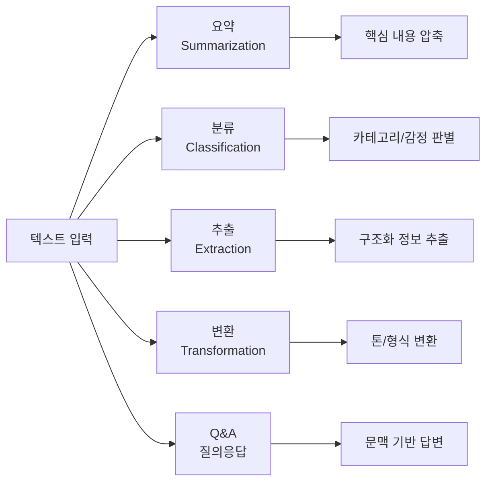
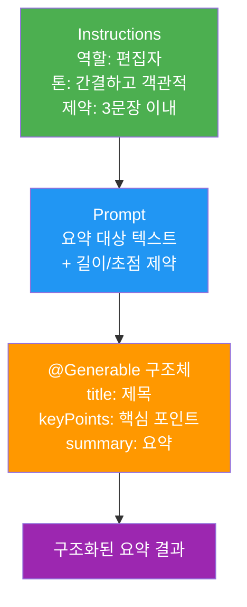
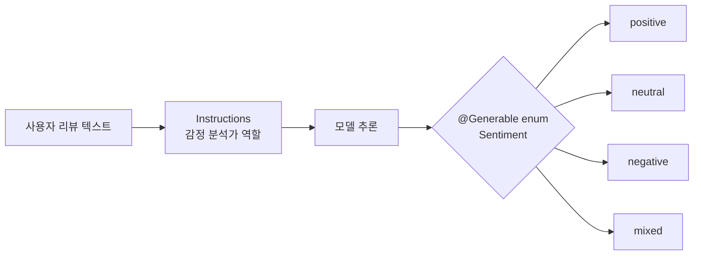
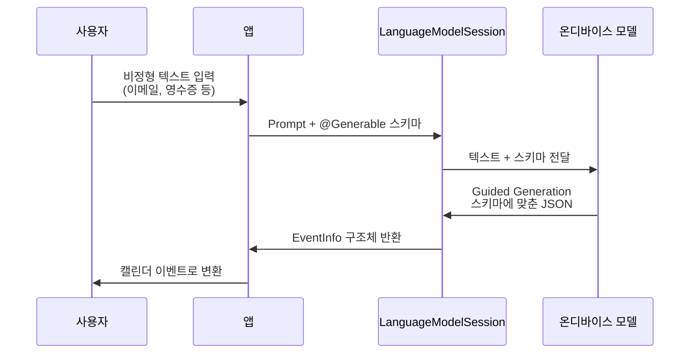
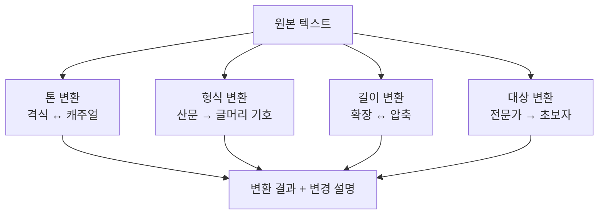
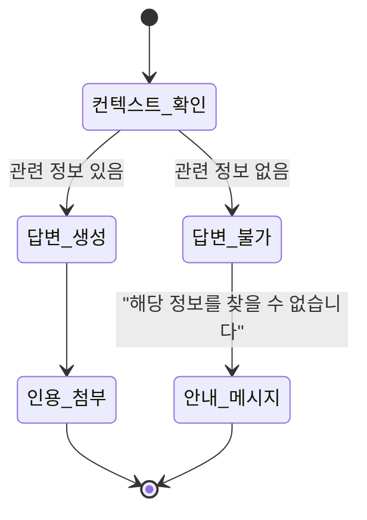
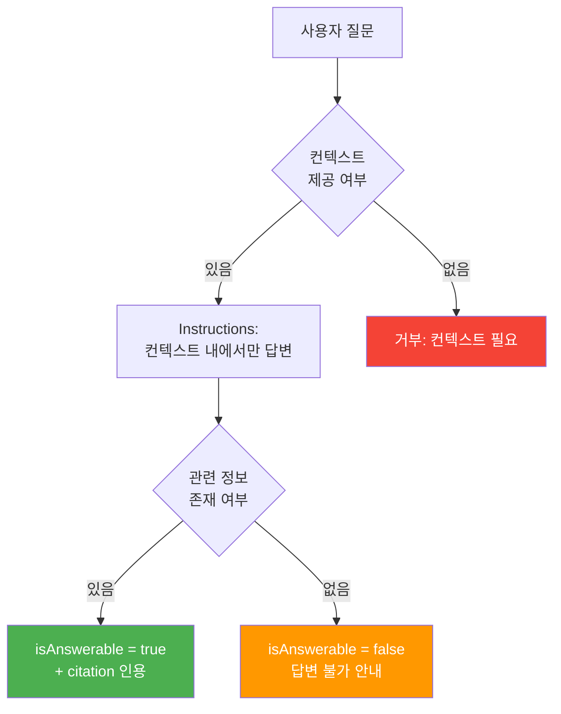

# 실습: 다양한 AI 기능 프롬프트 작성

> 요약, 분류, 추출, 변환, Q&A — 실전 시나리오별 프롬프트를 설계하고 테스트하여 프로덕션 수준으로 완성합니다

## 개요

이 섹션에서는 Ch4에서 배운 모든 프롬프트 엔지니어링 기법을 종합하여, 실제 앱에서 자주 사용하는 5가지 AI 기능의 프롬프트를 처음부터 끝까지 작성합니다.

**선수 지식**:
- [온디바이스 모델 특성과 프롬프트 전략](04-ch4-프롬프트-엔지니어링-실전/01-01-온디바이스-모델-특성과-프롬프트-전략.md)의 토큰 효율 전략
- [시스템 프롬프트(Instructions) 설계](04-ch4-프롬프트-엔지니어링-실전/02-02-시스템-프롬프트instructions-설계.md)의 역할/톤/형식 패턴
- [Few-Shot 패턴과 예제 기반 프롬프팅](04-ch4-프롬프트-엔지니어링-실전/03-03-few-shot-패턴과-예제-기반-프롬프팅.md)의 @Generable 예제 주입
- [프롬프트 디버깅과 반복 개선](04-ch4-프롬프트-엔지니어링-실전/04-04-프롬프트-디버깅과-반복-개선.md)의 A/B 비교와 Greedy Sampling

**학습 목표**:
- 텍스트 요약, 감정 분류, 정보 추출, 텍스트 변환, Q&A 등 5가지 시나리오별 프롬프트를 설계할 수 있다
- 각 시나리오에 최적화된 instructions + Prompt + @Generable 조합을 구성할 수 있다
- 프롬프트 디버깅 워크플로를 적용하여 품질을 반복 개선할 수 있다

## 왜 알아야 할까?

프롬프트 엔지니어링을 이론으로만 배우면, 실제 앱에 적용할 때 "어디서부터 시작해야 하지?"라는 벽에 부딪히게 됩니다. 요약 기능과 감정 분석 기능은 같은 LLM을 사용하지만, 최적의 프롬프트 구조는 완전히 다르거든요.

App Store에서 성공하는 AI 앱들을 보면, 단순히 "요약해줘"라고 던지는 게 아니라 **역할 + 제약 + 출력 형식**을 정교하게 설계합니다. Apple의 WWDC25 세션 "Explore prompt design & safety for on-device foundation models"에서도 강조했듯이, 온디바이스 ~3B 모델은 **명확하고 구체적인 프롬프트**에서 최상의 성능을 발휘합니다.

이 실습에서는 실제 앱에서 가장 많이 쓰이는 5가지 AI 기능 패턴을 하나씩 구현하면서, "이론 → 실전" 간극을 완전히 메울 겁니다.

> 📊 **그림 1**: 이 실습에서 구현할 5가지 AI 기능 패턴



## 핵심 개념

### 개념 1: 텍스트 요약 프롬프트

> 💡 **비유**: 요약은 마치 **신문 기자의 리드(Lead) 작성**과 같습니다. 수백 줄의 취재 내용을 읽고, 누가·언제·어디서·무엇을·왜를 한두 문장으로 압축하는 거죠. 온디바이스 모델에게도 "무엇을 남기고, 무엇을 버릴지" 명확한 기준을 알려줘야 합니다.

텍스트 요약은 온디바이스 Foundation Model이 가장 잘하는 작업 중 하나입니다. Apple의 기술 보고서에 따르면, ~3B 모델은 요약(Summarization)에서 서버 모델에 근접하는 성능을 보여줍니다. 핵심은 **출력 길이 제어**와 **초점 지정**입니다.

> 📊 **그림 2**: 요약 프롬프트의 3계층 구조 — Instructions, Prompt, @Generable이 역할을 분담



먼저 요약 결과를 담을 @Generable 구조체를 설계합니다:

```swift
import FoundationModels

// 요약 결과를 구조화하는 타입
@Generable
struct ArticleSummary {
    @Guide(description: "원문의 핵심을 담은 한 줄 제목")
    var title: String
    
    @Guide(description: "3문장 이내의 핵심 요약")
    var summary: String
    
    @Guide(description: "핵심 포인트 목록", .count(3))
    var keyPoints: [String]
}
```

이제 요약 전용 세션을 구성합니다. instructions에서 역할과 제약을 설정하고, Prompt 빌더에서 실제 텍스트를 전달합니다:

```swift
// 요약 전용 세션 구성
let summarizer = LanguageModelSession {
    "당신은 뉴스 편집자입니다."
    "원문의 핵심 정보만 추출하여 간결하게 요약합니다."
    "주관적 의견을 배제하고 사실만 포함합니다."
    "요약은 반드시 3문장 이내로 작성합니다."
}

// Prompt 빌더로 요약 요청
let articleText = "Apple은 WWDC25에서 Foundation Models 프레임워크를..."

let prompt = Prompt {
    "다음 기사를 요약해주세요."
    "핵심 포인트 3개를 추출하세요."
    articleText
}

let result = try await summarizer.respond(
    to: prompt,
    generating: ArticleSummary.self
)
```

```run:swift
// 요약 결과 출력 예시
print("제목: \(result.content.title)")
print("요약: \(result.content.summary)")
for (i, point) in result.content.keyPoints.enumerated() {
    print("  \(i + 1). \(point)")
}
```

```output
제목: Apple, WWDC25에서 온디바이스 AI 프레임워크 공개
요약: Apple이 WWDC25에서 Foundation Models 프레임워크를 발표했다. 이 프레임워크는 온디바이스 ~3B 모델을 활용한 Swift 네이티브 AI 개발을 지원한다. 개발자는 @Generable 매크로로 구조화된 출력을 간편하게 구현할 수 있다.
  1. Foundation Models 프레임워크로 온디바이스 AI 개발 지원
  2. ~3B 파라미터 모델, 프라이버시 보장
  3. @Generable 매크로로 구조화 출력 자동 생성
```

> 🔥 **실무 팁**: 요약처럼 여러 필드가 서로 관련된 @Generable 구조체에서는 **프로퍼티 배치 순서를 전략적으로 설계**하면 품질이 올라갑니다. 예를 들어, 제목과 키포인트를 먼저 생성한 뒤 요약을 나중에 생성하면, 모델이 앞서 생성한 맥락을 활용할 수 있거든요. 이 원리가 왜 작동하는지, 그리고 Guided Generation이 프로퍼티 순서를 어떻게 처리하는지는 [Ch5. @Generable 구조화 출력](05-ch5-generable-구조화-출력/01-01-guided-generation-개념과-동작-원리.md)에서 자세히 다룹니다.

### 개념 2: 감정 분류 프롬프트

> 💡 **비유**: 감정 분류는 **우체국 분류 작업**과 같습니다. 편지를 열어보지 않아도 겉봉투의 단서(글씨체, 스티커, 주소 형식)로 "축하 카드인지, 청구서인지, 항의 서신인지" 분류하죠. 모델에게도 "분류할 카테고리 목록"을 미리 알려주는 게 핵심입니다.

분류(Classification) 작업에서 가장 중요한 것은 **선택지를 명확하게 제한**하는 겁니다. 온디바이스 모델은 열린 범주보다 닫힌 범주에서 훨씬 정확합니다. Swift의 enum과 @Generable을 결합하면 모델이 정확히 정의된 카테고리 중 하나만 선택하도록 강제할 수 있습니다.

> 📊 **그림 3**: 감정 분류의 흐름 — enum으로 출력을 제약



```swift
// 감정 카테고리를 enum으로 정의
@Generable
enum Sentiment: String, CaseIterable {
    case positive   // 긍정
    case neutral    // 중립
    case negative   // 부정
    case mixed      // 복합 (긍정+부정 혼재)
}

// 감정 분석 결과 구조체
@Generable
struct SentimentResult {
    @Guide(description: "텍스트의 전반적인 감정")
    var sentiment: Sentiment
    
    @Guide(description: "감정 판단의 근거가 되는 핵심 표현")
    var evidence: String
    
    @Guide(description: "감정 강도를 1(약함)~5(강함)으로 표현", .range(1...5))
    var intensity: Int
}
```

분류 작업의 instructions는 **판단 기준**을 구체적으로 명시해야 합니다:

```swift
let sentimentAnalyzer = LanguageModelSession {
    "당신은 고객 리뷰 감정 분석 전문가입니다."
    "텍스트에서 감정을 판별할 때 다음 기준을 따릅니다:"
    "- positive: 만족, 추천, 칭찬 표현이 있는 경우"
    "- negative: 불만, 비판, 실망 표현이 있는 경우"
    "- neutral: 사실 전달이나 질문만 있는 경우"
    "- mixed: 긍정과 부정이 모두 포함된 경우"
    "감정 강도는 표현의 강도와 빈도를 기준으로 판단합니다."
}

// 리뷰 텍스트 분석
let review = "배송은 빠르고 좋았는데, 포장이 좀 부실했어요. 제품 자체는 만족합니다."

let analysis = try await sentimentAnalyzer.respond(
    to: "다음 리뷰의 감정을 분석해주세요: \(review)",
    generating: SentimentResult.self
)
```

```run:swift
print("감정: \(analysis.content.sentiment)")
print("근거: \(analysis.content.evidence)")
print("강도: \(analysis.content.intensity)/5")
```

```output
감정: mixed
근거: '좋았는데'(긍정)와 '부실했어요'(부정)가 혼재
강도: 3/5
```

> ⚠️ **흔한 오해**: "분류는 간단하니까 instructions 없이 프롬프트만으로 충분하다"고 생각하기 쉽습니다. 하지만 instructions 없이 분류하면 모델이 매번 다른 기준을 적용합니다. **판단 기준을 instructions에 고정**해야 일관된 분류 결과를 얻을 수 있습니다.

### 개념 3: 정보 추출 프롬프트

> 💡 **비유**: 정보 추출은 **광석에서 금을 캐는 것**과 같습니다. 수백 톤의 흙과 돌(비정형 텍스트) 속에서 정확히 원하는 금(구조화된 데이터)만 골라내야 하죠. @Generable 구조체가 바로 "어떤 형태의 금을 찾고 있는지" 알려주는 설계도입니다.

정보 추출(Information Extraction)은 비정형 텍스트에서 이름, 날짜, 금액, 위치 같은 **구조화된 정보**를 뽑아내는 작업입니다. Foundation Models의 @Generable과 Guided Generation이 가장 빛나는 시나리오이기도 합니다 — 모델이 반드시 지정된 스키마에 맞춰 출력하도록 강제하니까요.

> 📊 **그림 4**: 정보 추출 파이프라인 — 비정형 텍스트에서 구조화 데이터로



```swift
// 이벤트 정보를 추출하는 구조체
@Generable
struct EventInfo {
    @Guide(description: "이벤트 이름")
    var name: String
    
    @Guide(description: "날짜 (YYYY-MM-DD 형식)")
    var date: String
    
    @Guide(description: "시작 시간 (HH:mm 형식, 24시간제)")
    var startTime: String
    
    @Guide(description: "장소 이름")
    var location: String
    
    @Guide(description: "참석자 이름 목록")
    var attendees: [String]
}

// 추출 전용 세션
let extractor = LanguageModelSession {
    "당신은 텍스트에서 일정 정보를 추출하는 어시스턴트입니다."
    "날짜는 반드시 YYYY-MM-DD 형식으로 변환합니다."
    "시간은 24시간제 HH:mm 형식을 사용합니다."
    "텍스트에 명시되지 않은 정보는 'N/A'로 표시합니다."
    "참석자가 언급되지 않으면 빈 배열을 반환합니다."
}

// 자연어 텍스트에서 이벤트 추출
let emailText = """
안녕하세요, 다음 주 수요일(3월 18일) 오후 3시에 
강남 WeWork에서 프로젝트 킥오프 미팅이 있습니다.
김철수 팀장님, 박지영 디자이너님도 참석 예정입니다.
"""

let event = try await extractor.respond(
    to: "다음 텍스트에서 일정 정보를 추출해주세요:\n\(emailText)",
    generating: EventInfo.self
)
```

```run:swift
print("이벤트: \(event.content.name)")
print("날짜: \(event.content.date)")
print("시간: \(event.content.startTime)")
print("장소: \(event.content.location)")
print("참석자: \(event.content.attendees.joined(separator: ", "))")
```

```output
이벤트: 프로젝트 킥오프 미팅
날짜: 2026-03-18
시간: 15:00
장소: 강남 WeWork
참석자: 김철수, 박지영
```

추출 정확도를 높이기 위해 **few-shot 예제를 instructions에 주입**하면 좋습니다:

```swift
// Few-shot으로 추출 정확도 향상
let extractorWithExample = LanguageModelSession {
    "당신은 텍스트에서 일정 정보를 추출하는 어시스턴트입니다."
    "날짜는 YYYY-MM-DD, 시간은 HH:mm(24시간제) 형식입니다."
    
    // 예제 주입: 모델에게 기대하는 추출 패턴을 보여줌
    EventInfo(
        name: "팀 회의",
        date: "2026-03-15",
        startTime: "14:00",
        location: "본사 3층 회의실",
        attendees: ["이수진", "최민호"]
    )
}
```

### 개념 4: 텍스트 변환 프롬프트

> 💡 **비유**: 텍스트 변환은 **통역사의 작업**과 같습니다. 같은 내용이라도 회의실에서는 격식체로, 카페에서는 편한 말투로 전달하죠. 모델에게 "원본 의미는 유지하되, 형식만 바꿔라"는 지시가 핵심입니다.

텍스트 변환(Transformation)은 내용은 유지하면서 톤, 형식, 길이, 스타일을 바꾸는 작업입니다. Apple의 Writing Tools가 내부적으로 수행하는 작업과 동일한 패턴이죠. 변환에서 중요한 것은 **"무엇을 바꾸고, 무엇을 유지할지"** 명확히 지정하는 것입니다.

> 📊 **그림 5**: 텍스트 변환 — 하나의 원본에서 다양한 변형 생성



```swift
// 변환 유형을 enum으로 정의
@Generable
enum TransformationType: String, CaseIterable {
    case formal     // 격식체로 변환
    case casual     // 캐주얼체로 변환
    case simplify   // 쉽게 풀어쓰기
    case bulletize  // 글머리 기호로 정리
    case expand     // 상세하게 확장
}

// 변환 결과 구조체
@Generable
struct TransformedText {
    @Guide(description: "변환된 텍스트")
    var result: String
    
    @Guide(description: "어떤 변환이 적용되었는지 한 줄 설명")
    var changeDescription: String
}

// 변환기 구성 — 변환 유형별로 다른 instructions
func createTransformer(type: TransformationType) -> LanguageModelSession {
    let roleInstruction: String = switch type {
    case .formal:
        "당신은 비즈니스 문서 편집자입니다. 텍스트를 격식체로 변환합니다. 존댓말을 사용하고 전문 용어를 적절히 포함합니다."
    case .casual:
        "당신은 친근한 블로거입니다. 텍스트를 편안하고 대화하듯 자연스러운 톤으로 변환합니다."
    case .simplify:
        "당신은 초등학생에게 설명하는 선생님입니다. 어려운 용어를 쉬운 말로 바꾸고, 비유를 사용합니다."
    case .bulletize:
        "당신은 프레젠테이션 작성 전문가입니다. 텍스트의 핵심을 글머리 기호로 정리합니다."
    case .expand:
        "당신은 기술 문서 작성자입니다. 간결한 텍스트를 구체적인 설명과 예시를 추가하여 확장합니다."
    }
    
    return LanguageModelSession {
        roleInstruction
        "원본 텍스트의 핵심 의미는 반드시 보존합니다."
        "원본에 없는 사실을 추가하지 않습니다."
    }
}
```

```swift
// 사용 예시: 격식체 변환
let transformer = createTransformer(type: .formal)
let casual = "야 그거 알아? 새 API 완전 대박이야. 써보면 진짜 편함."

let transformed = try await transformer.respond(
    to: "다음 텍스트를 변환해주세요:\n\(casual)",
    generating: TransformedText.self
)
```

변환 결과는 원문의 의미를 정확히 보존하면서 톤만 바뀝니다. instructions에 "원본에 없는 사실을 추가하지 않습니다"라는 가드레일을 설정해둔 덕분이죠:

```run:swift
print("원문: \(casual)")
print("변환: \(transformed.content.result)")
print("설명: \(transformed.content.changeDescription)")
```

```output
원문: 야 그거 알아? 새 API 완전 대박이야. 써보면 진짜 편함.
변환: 새로운 API가 출시되었습니다. 사용해 보시면 매우 편리하다는 것을 느끼실 수 있습니다.
설명: 반말과 구어체를 격식체 존댓말로 변환하고, 감탄 표현을 객관적 서술로 교체했습니다.
```

> 💡 **알고 계셨나요?**: Apple의 Writing Tools에서 제공하는 "Proofread", "Friendly", "Professional" 등의 톤 변환 기능도 내부적으로 이와 유사한 패턴을 사용합니다. Foundation Models 프레임워크가 공개되면서 개발자도 **동일한 온디바이스 모델**로 Writing Tools 수준의 톤 변환을 직접 구현할 수 있게 된 거죠.

### 개념 5: 컨텍스트 기반 Q&A 프롬프트

> 💡 **비유**: Q&A는 **오픈북 시험**과 같습니다. 학생(모델)에게 교과서(컨텍스트 문서)를 주고, 그 안에서만 답을 찾으라고 하는 거죠. 교과서에 없는 내용은 "모릅니다"라고 답해야 정직한 학생입니다.

온디바이스 모델로 Q&A를 구현할 때 가장 중요한 원칙은 **"컨텍스트 안에서만 답하라"**는 제약입니다. WWDC25 "Explore prompt design & safety" 세션에서 Apple이 강조했듯이, ~3B 모델은 세계 지식(world knowledge)이 제한적이므로 **할루시네이션(hallucination)** 위험이 있습니다. 컨텍스트를 명시적으로 제공하고 "없으면 모른다고 답하라"는 가드레일을 설정하는 것이 핵심입니다.

> 📊 **그림 6**: Q&A 프롬프트의 안전한 설계 패턴



```swift
// Q&A 결과 구조체
@Generable
struct QAResult {
    @Guide(description: "질문에 대한 답변")
    var answer: String
    
    @Guide(description: "답변의 근거가 되는 컨텍스트 인용문")
    var citation: String
    
    @Guide(description: "답변 가능 여부 — 컨텍스트에 관련 정보가 있으면 true")
    var isAnswerable: Bool
}

// Q&A 세션 — 컨텍스트 기반 답변 강제
let qaSession = LanguageModelSession {
    "당신은 문서 기반 Q&A 어시스턴트입니다."
    "제공된 컨텍스트 안의 정보만 사용하여 답변합니다."
    "컨텍스트에 없는 정보는 절대 추측하지 않습니다."
    "답변할 수 없는 경우 isAnswerable을 false로 설정하고,"
    "answer에 '제공된 문서에서 해당 정보를 찾을 수 없습니다'라고 작성합니다."
    "답변할 때는 반드시 근거가 되는 원문을 citation에 인용합니다."
}

// 컨텍스트 + 질문 조합
let context = """
Foundation Models 프레임워크는 iOS 26부터 사용 가능합니다.
온디바이스 모델은 약 3B 파라미터 규모이며, 
2-bit QAT(Quantization-Aware Training)로 최적화되었습니다.
프라이버시를 위해 모든 추론은 기기에서 수행되며, 
데이터가 서버로 전송되지 않습니다.
"""

let question = "온디바이스 모델의 파라미터 수는?"

let prompt = Prompt {
    "컨텍스트:"
    context
    ""
    "질문: \(question)"
}

let qa = try await qaSession.respond(
    to: prompt,
    generating: QAResult.self
)
```

> 📊 **그림 7**: Q&A에서 할루시네이션을 방지하는 3중 가드레일



## 실습: 직접 해보기

지금까지 배운 5가지 패턴을 하나로 통합하는 **AI 텍스트 워크벤치** 앱을 만들어봅시다. 사용자가 텍스트를 입력하고, 원하는 AI 기능을 선택하면 해당 프롬프트가 실행되는 구조입니다.

```swift
import SwiftUI
import FoundationModels

// MARK: - AI 기능 타입 정의

enum AIFeature: String, CaseIterable, Identifiable {
    case summarize = "요약"
    case classify = "감정 분류"
    case extract = "정보 추출"
    case transform = "톤 변환"
    case qa = "Q&A"
    
    var id: String { rawValue }
    
    var icon: String {
        switch self {
        case .summarize: "doc.text"
        case .classify: "tag"
        case .extract: "magnifyingglass"
        case .transform: "arrow.triangle.2.circlepath"
        case .qa: "questionmark.bubble"
        }
    }
}

// MARK: - @Generable 출력 타입들

@Generable
struct SummaryOutput {
    @Guide(description: "원문의 핵심을 담은 한 줄 제목")
    var title: String
    @Guide(description: "핵심 포인트 목록", .count(3))
    var keyPoints: [String]
    @Guide(description: "3문장 이내의 핵심 요약")
    var summary: String  // 마지막에 배치 → 앞선 맥락 활용
}

@Generable
enum Sentiment: String, CaseIterable {
    case positive, neutral, negative, mixed
}

@Generable
struct ClassifyOutput {
    @Guide(description: "텍스트의 전반적 감정")
    var sentiment: Sentiment
    @Guide(description: "판단 근거 핵심 표현")
    var evidence: String
    @Guide(description: "감정 강도 1(약함)~5(강함)", .range(1...5))
    var intensity: Int
}

@Generable
struct ExtractOutput {
    @Guide(description: "추출된 주요 인물 이름 목록")
    var people: [String]
    @Guide(description: "추출된 날짜 목록 (YYYY-MM-DD 형식)")
    var dates: [String]
    @Guide(description: "추출된 장소 목록")
    var locations: [String]
    @Guide(description: "추출된 핵심 주제나 키워드")
    var topics: [String]
}

@Generable
struct TransformOutput {
    @Guide(description: "변환된 텍스트")
    var result: String
    @Guide(description: "적용된 변환 설명")
    var changeNote: String
}

@Generable
struct QAOutput {
    @Guide(description: "답변 가능 여부")
    var isAnswerable: Bool
    @Guide(description: "답변 근거 인용문")
    var citation: String
    @Guide(description: "질문에 대한 답변")
    var answer: String
}

// MARK: - AI 서비스 레이어

@Observable
@MainActor
final class AIWorkbenchService {
    private(set) var isProcessing = false
    private(set) var resultText: String?
    var error: Error?
    
    // 기능별 세션 팩토리 — 각 기능에 최적화된 instructions 적용
    private func createSession(for feature: AIFeature) -> LanguageModelSession {
        switch feature {
        case .summarize:
            return LanguageModelSession {
                "당신은 뉴스 편집자입니다."
                "원문의 핵심 정보만 추출하여 간결하게 요약합니다."
                "주관적 의견을 배제하고 사실만 포함합니다."
            }
            
        case .classify:
            return LanguageModelSession {
                "당신은 고객 리뷰 감정 분석 전문가입니다."
                "positive: 만족, 추천, 칭찬 표현"
                "negative: 불만, 비판, 실망 표현"
                "neutral: 사실 전달이나 질문"
                "mixed: 긍정과 부정 모두 포함"
            }
            
        case .extract:
            return LanguageModelSession {
                "당신은 텍스트에서 구조화 정보를 추출하는 어시스턴트입니다."
                "날짜는 YYYY-MM-DD, 시간은 HH:mm 형식으로 변환합니다."
                "텍스트에 명시되지 않은 정보는 빈 배열로 반환합니다."
            }
            
        case .transform:
            return LanguageModelSession {
                "당신은 텍스트 편집 전문가입니다."
                "지정된 톤으로 텍스트를 변환합니다."
                "원본의 핵심 의미를 반드시 보존합니다."
                "원본에 없는 사실을 추가하지 않습니다."
            }
            
        case .qa:
            return LanguageModelSession {
                "당신은 문서 기반 Q&A 어시스턴트입니다."
                "제공된 컨텍스트의 정보만 사용하여 답변합니다."
                "컨텍스트에 없는 정보는 절대 추측하지 않습니다."
                "답변 불가 시 isAnswerable을 false로 설정합니다."
            }
        }
    }
    
    // 통합 실행 메서드
    func process(
        feature: AIFeature,
        input: String,
        supplementary: String = ""  // Q&A의 컨텍스트, 변환의 목표 톤 등
    ) async {
        isProcessing = true
        error = nil
        defer { isProcessing = false }
        
        let session = createSession(for: feature)
        
        do {
            switch feature {
            case .summarize:
                let prompt = Prompt {
                    "다음 텍스트를 요약해주세요."
                    input
                }
                let result = try await session.respond(
                    to: prompt, generating: SummaryOutput.self
                )
                let output = result.content
                resultText = """
                📌 \(output.title)
                
                \(output.summary)
                
                핵심 포인트:
                \(output.keyPoints.enumerated().map { "  \($0.offset + 1). \($0.element)" }.joined(separator: "\n"))
                """
                
            case .classify:
                let result = try await session.respond(
                    to: "다음 텍스트의 감정을 분석해주세요:\n\(input)",
                    generating: ClassifyOutput.self
                )
                let output = result.content
                let emoji = switch output.sentiment {
                case .positive: "😊"
                case .negative: "😞"
                case .neutral: "😐"
                case .mixed: "🤔"
                }
                resultText = """
                \(emoji) 감정: \(output.sentiment.rawValue)
                강도: \(String(repeating: "●", count: output.intensity))\(String(repeating: "○", count: 5 - output.intensity))
                근거: \(output.evidence)
                """
                
            case .extract:
                let result = try await session.respond(
                    to: "다음 텍스트에서 주요 정보를 추출해주세요:\n\(input)",
                    generating: ExtractOutput.self
                )
                let output = result.content
                resultText = """
                👤 인물: \(output.people.isEmpty ? "없음" : output.people.joined(separator: ", "))
                📅 날짜: \(output.dates.isEmpty ? "없음" : output.dates.joined(separator: ", "))
                📍 장소: \(output.locations.isEmpty ? "없음" : output.locations.joined(separator: ", "))
                🏷️ 주제: \(output.topics.joined(separator: ", "))
                """
                
            case .transform:
                let targetTone = supplementary.isEmpty ? "격식체" : supplementary
                let prompt = Prompt {
                    "다음 텍스트를 \(targetTone)(으)로 변환해주세요."
                    input
                }
                let result = try await session.respond(
                    to: prompt, generating: TransformOutput.self
                )
                let output = result.content
                resultText = """
                ✏️ 변환 결과:
                \(output.result)
                
                📝 변경 사항: \(output.changeNote)
                """
                
            case .qa:
                let prompt = Prompt {
                    "컨텍스트:"
                    supplementary
                    ""
                    "질문: \(input)"
                }
                let result = try await session.respond(
                    to: prompt, generating: QAOutput.self
                )
                let output = result.content
                if output.isAnswerable {
                    resultText = """
                    💬 답변: \(output.answer)
                    📖 근거: \(output.citation)
                    """
                } else {
                    resultText = "❓ \(output.answer)"
                }
            }
        } catch {
            self.error = error
            self.resultText = nil
        }
    }
}
```

SwiftUI 뷰를 구성합니다:

```swift
// MARK: - SwiftUI 뷰

struct AIWorkbenchView: View {
    @State private var service = AIWorkbenchService()
    @State private var inputText = ""
    @State private var supplementaryText = ""  // Q&A 컨텍스트 또는 변환 톤
    @State private var selectedFeature: AIFeature = .summarize
    
    private let model = SystemLanguageModel.default
    
    var body: some View {
        NavigationStack {
            Form {
                // 기능 선택 섹션
                Section("AI 기능 선택") {
                    Picker("기능", selection: $selectedFeature) {
                        ForEach(AIFeature.allCases) { feature in
                            Label(feature.rawValue, systemImage: feature.icon)
                                .tag(feature)
                        }
                    }
                    .pickerStyle(.segmented)
                }
                
                // 입력 섹션
                Section(inputSectionTitle) {
                    TextEditor(text: $inputText)
                        .frame(minHeight: 100)
                        .accessibilityLabel("텍스트 입력")
                }
                
                // 보조 입력 (Q&A 컨텍스트 또는 변환 톤)
                if selectedFeature == .qa || selectedFeature == .transform {
                    Section(supplementarySectionTitle) {
                        TextEditor(text: $supplementaryText)
                            .frame(minHeight: 60)
                            .accessibilityLabel(supplementarySectionTitle)
                    }
                }
                
                // 실행 버튼
                Section {
                    Button {
                        Task {
                            await service.process(
                                feature: selectedFeature,
                                input: inputText,
                                supplementary: supplementaryText
                            )
                        }
                    } label: {
                        HStack {
                            Spacer()
                            if service.isProcessing {
                                ProgressView()
                                    .padding(.trailing, 8)
                            }
                            Text(service.isProcessing ? "분석 중..." : "실행")
                                .fontWeight(.semibold)
                            Spacer()
                        }
                    }
                    .disabled(inputText.isEmpty || service.isProcessing)
                }
                
                // 결과 표시
                if let result = service.resultText {
                    Section("결과") {
                        Text(result)
                            .font(.body)
                            .textSelection(.enabled)
                            .contentTransition(.opacity)
                    }
                }
                
                // 에러 표시
                if let error = service.error {
                    Section {
                        Label(error.localizedDescription, systemImage: "exclamationmark.triangle")
                            .foregroundStyle(.red)
                    }
                }
            }
            .navigationTitle("AI 텍스트 워크벤치")
            .animation(.easeOut, value: service.resultText)
        }
    }
    
    private var inputSectionTitle: String {
        switch selectedFeature {
        case .summarize: "요약할 텍스트"
        case .classify: "분석할 텍스트"
        case .extract: "정보를 추출할 텍스트"
        case .transform: "변환할 텍스트"
        case .qa: "질문"
        }
    }
    
    private var supplementarySectionTitle: String {
        switch selectedFeature {
        case .qa: "참조 컨텍스트 (답변 근거 문서)"
        case .transform: "목표 톤 (예: 격식체, 캐주얼, 쉬운 말)"
        default: ""
        }
    }
}
```

이 워크벤치를 Xcode Playground에서 기능별로 빠르게 테스트할 수도 있습니다:

```swift
import Playgrounds
import FoundationModels

// Xcode Playground에서 각 기능을 빠르게 테스트
#Playground {
    let service = AIWorkbenchService()
    
    // 1. 요약 테스트
    await service.process(
        feature: .summarize,
        input: "Apple은 WWDC25에서 Foundation Models 프레임워크를 발표했다..."
    )
    print("요약 결과:\n\(service.resultText ?? "없음")")
    
    // 2. 감정 분류 테스트
    await service.process(
        feature: .classify,
        input: "이 앱 정말 좋아요! 다만 가끔 느려지는 게 아쉽네요."
    )
    print("분류 결과:\n\(service.resultText ?? "없음")")
}
```

## 더 깊이 알아보기

### 프롬프트 엔지니어링의 탄생과 진화

"프롬프트 엔지니어링"이라는 용어가 본격적으로 등장한 것은 2020년 GPT-3 논문 이후입니다. 하지만 그 뿌리는 훨씬 더 거슬러 올라갑니다. 1966년 MIT의 Joseph Weizenbaum이 만든 **ELIZA** 챗봇은 "패턴 매칭 규칙"으로 대화를 시뮬레이션했는데, 이것이 사실상 최초의 "프롬프트 설계"였습니다. 사용자의 입력에서 키워드를 감지하고, 미리 정의된 템플릿으로 응답을 생성하는 구조 — 현대 프롬프트 엔지니어링의 원형이죠.

흥미로운 것은 Apple의 접근 방식입니다. 2025년 Foundation Models 프레임워크를 발표하면서 Apple은 **"프롬프트는 코드다"**라는 철학을 명확히 했습니다. 문자열을 조합하는 대신 `Prompt { }` 빌더와 `@Generable` 매크로를 도입하여, 프롬프트를 **컴파일 타임에 검증 가능한 Swift 코드**로 만들었습니다. 이는 다른 LLM 프레임워크들이 문자열 템플릿에 의존하는 것과 대비되는 독특한 접근입니다.

### 온디바이스 vs 서버: 프롬프트 전략의 차이

Apple의 기술 보고서(arxiv:2507.13575)에 따르면, 온디바이스 ~3B 모델과 서버 측 PT-MoE 모델은 같은 Foundation Models API를 사용하지만 최적의 프롬프트 전략이 다릅니다. 온디바이스 모델은 **짧고 명확한 지시**에서 최고 성능을 보이는 반면, 서버 모델은 복잡한 추론 체인과 긴 컨텍스트를 더 잘 처리합니다. 이것이 바로 이 실습에서 instructions를 "간결하고 구체적"으로 설계한 이유입니다.

## 흔한 오해와 팁

> ⚠️ **흔한 오해**: "하나의 만능 프롬프트로 모든 기능을 처리할 수 있다"는 생각은 위험합니다. 실습에서 봤듯이 요약·분류·추출·변환·Q&A는 각각 다른 instructions와 @Generable 구조를 필요로 합니다. **기능별로 전용 세션을 분리**해야 일관된 품질을 유지할 수 있습니다.

> 💡 **알고 계셨나요?**: Apple의 WWDC25 "Explore prompt design & safety" 세션에서 **ALL CAPS 기법**을 공식 권장했습니다. "DO NOT include allergen warnings"처럼 금지 사항을 대문자로 강조하면 온디바이스 모델이 해당 지시를 더 잘 따릅니다. 단, 모든 텍스트를 대문자로 쓰면 효과가 사라지므로 핵심 제약에만 사용하세요.

> 🔥 **실무 팁**: `GenerationOptions(sampling: .greedy)`를 사용하면 동일 프롬프트에 대해 **결정론적(deterministic) 출력**을 얻을 수 있습니다. 프롬프트 A/B 비교 시 필수입니다. 프로덕션에서는 기본 샘플링으로 돌려서 다양성을 확보하되, 디버깅/테스트 시에는 greedy로 고정하세요.

> 🔥 **실무 팁**: @Generable 구조체에서 **프로퍼티 배치 순서를 전략적으로 활용**하면 출력 품질이 향상됩니다. 이 실습의 `SummaryOutput`에서 `summary`를 `keyPoints` 뒤에 배치한 것이 대표적인 예시죠. 이 패턴이 *왜* 효과적인지 — Guided Generation이 프로퍼티를 순서대로 생성하는 내부 메커니즘 — 는 [Ch5. @Generable 구조화 출력](05-ch5-generable-구조화-출력/01-01-guided-generation-개념과-동작-원리.md)에서 상세히 다룹니다.

## 핵심 정리

| 개념 | 설명 |
|------|------|
| 요약 프롬프트 | instructions에 역할+길이 제약, @Generable로 제목/요약/키포인트 구조화 |
| 분류 프롬프트 | @Generable enum으로 카테고리 제한, instructions에 판단 기준 명시 |
| 추출 프롬프트 | @Generable 스키마로 추출 필드 정의, @Guide로 형식(날짜/시간) 강제 |
| 변환 프롬프트 | 변환 유형별 instructions 팩토리, "의미 보존" 가드레일 필수 |
| Q&A 프롬프트 | 컨텍스트 기반 답변 강제, isAnswerable 필드로 할루시네이션 방지 |
| 프로퍼티 배치 전략 | 의존성 있는 필드를 뒤에 배치하면 품질 향상 (원리는 Ch5에서 상세 설명) |
| 기능별 세션 분리 | 하나의 만능 세션이 아닌 기능별 전용 세션으로 일관성 확보 |
| Greedy Sampling | `GenerationOptions(sampling: .greedy)`로 결정론적 A/B 비교 가능 |

## 다음 섹션 미리보기

Ch4의 프롬프트 엔지니어링 실전을 마무리했습니다. 다음 챕터 [Ch5. @Generable 구조화 출력](05-ch5-generable-구조화-출력/01-01-guided-generation-개념과-동작-원리.md)에서는 이 실습에서 활용한 @Generable 매크로의 **내부 동작 원리**를 깊이 파고듭니다. Guided Generation이 어떻게 모델의 토큰 생성을 스키마에 맞게 제약하는지, 컴파일 타임에 무슨 일이 일어나는지, 그리고 중첩 구조체·배열·옵셔널 같은 복합 타입을 어떻게 처리하는지 알아봅니다. 이 실습에서 "프로퍼티 순서가 품질에 영향을 준다"고 팁으로만 언급했던 내용도, Ch5에서 그 원리를 완전히 이해하게 됩니다.

## 참고 자료

- [Explore prompt design & safety for on-device foundation models — WWDC25](https://developer.apple.com/videos/play/wwdc2025/248/) - 온디바이스 모델 프롬프트 설계의 공식 가이드. 역할 지정, few-shot, 안전성 계층을 체계적으로 다룹니다
- [Code-along: Bring on-device AI to your app — WWDC25](https://developer.apple.com/videos/play/wwdc2025/259/) - 여행 플래너 앱을 만들며 Instructions, @Generable, Streaming, Tool Calling을 단계적으로 구현하는 실습 세션
- [Generating content and performing tasks with Foundation Models — Apple Developer](https://developer.apple.com/documentation/FoundationModels/generating-content-and-performing-tasks-with-foundation-models) - Foundation Models API의 공식 문서. Prompt 빌더, @Generable 매크로, 세션 구성을 상세히 설명합니다
- [The Ultimate Guide To The Foundation Models Framework — AzamSharp](https://azamsharp.com/2025/06/18/the-ultimate-guide-to-the-foundation-models-framework.html) - 감정 분석, 요약, 구조화 출력 등 다양한 프롬프트 패턴을 Swift 코드로 보여주는 실전 가이드
- [Apple Intelligence Foundation Language Models Tech Report 2025](https://arxiv.org/abs/2507.13575) - 온디바이스 ~3B 모델과 서버 PT-MoE 모델의 아키텍처·성능을 다룬 Apple 공식 기술 보고서

---
### 🔗 Related Sessions
- [instructions 파라미터](04-ch4-프롬프트-엔지니어링-실전/02-02-시스템-프롬프트instructions-설계.md) (prerequisite)
- [few-shot 프롬프팅](04-ch4-프롬프트-엔지니어링-실전/03-03-few-shot-패턴과-예제-기반-프롬프팅.md) (prerequisite)
- [generationoptions(sampling: .greedy)](04-ch4-프롬프트-엔지니어링-실전/04-04-프롬프트-디버깅과-반복-개선.md) (prerequisite)
- [온디바이스 모델 능력 지도](04-ch4-프롬프트-엔지니어링-실전/01-01-온디바이스-모델-특성과-프롬프트-전략.md) (prerequisite)
