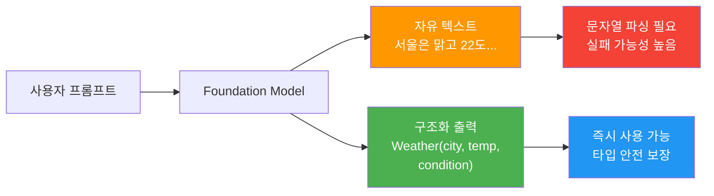
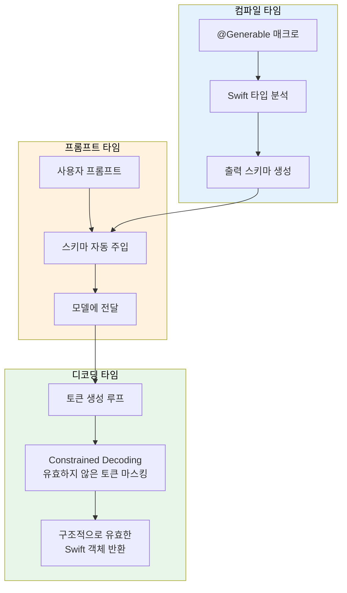
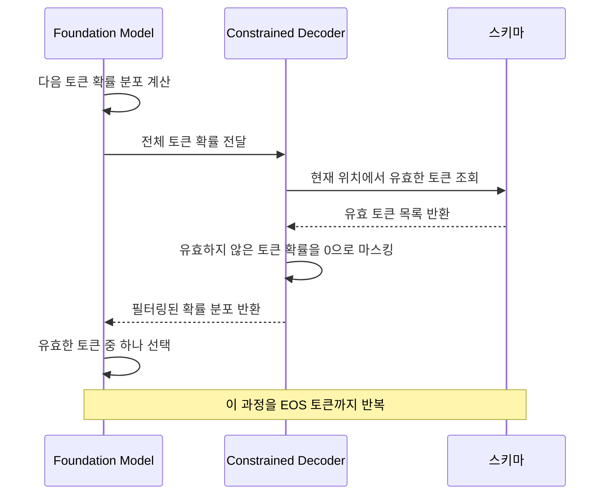
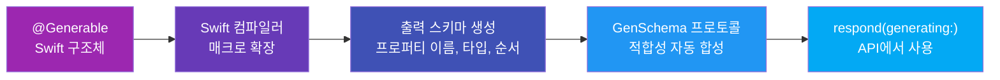
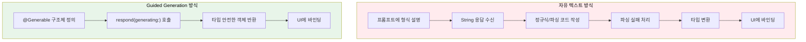

# 01. Guided Generation 개념과 동작 원리

> Foundation Models 프레임워크의 핵심 기능인 Guided Generation — 컴파일 타임 스키마 기반 constrained decoding으로 LLM 출력을 안전한 Swift 타입으로 받는 원리를 이해합니다.

## 개요

이 섹션에서는 Apple Foundation Models 프레임워크가 제공하는 **Guided Generation**(구조화 출력) 메커니즘의 개념과 내부 동작 원리를 학습합니다. 지금까지 자유 텍스트 형태로 모델 응답을 받았다면, 이제부터는 Swift 타입 시스템과 결합하여 **구조적으로 보장된 출력**을 얻는 방법을 알아보겠습니다.

**선수 지식**: [Ch3. Foundation Models 프레임워크 시작하기](03-ch3-foundation-models-프레임워크-시작하기/01-01-systemlanguagemodel-이해하기.md)에서 배운 `LanguageModelSession`과 `respond(to:)` API 사용법, 그리고 [Ch4. 프롬프트 엔지니어링 실전](04-ch4-프롬프트-엔지니어링-실전/01-01-온디바이스-모델-특성과-프롬프트-전략.md)에서 다룬 프롬프트 설계 기초.

**학습 목표**:
- Guided Generation이 무엇이며 왜 필요한지 이해한다
- Constrained Decoding의 동작 원리를 직관적으로 설명할 수 있다
- 자유 텍스트 출력 대비 구조화 출력의 장점을 구체적으로 파악한다
- `@Generable` 매크로의 역할과 컴파일 타임 스키마 생성 흐름을 이해한다

## 왜 알아야 할까?

여러분이 AI 채팅봇을 만들고 있다고 상상해 보세요. 사용자가 "오늘 서울 날씨 알려줘"라고 물었을 때, 모델이 이렇게 답합니다:

```
오늘 서울의 날씨는 맑고, 최고 기온은 22도, 최저 기온은 14도입니다. 
미세먼지 농도는 보통 수준이에요.
```

사람이 읽기엔 훌륭하죠. 하지만 이 텍스트에서 **온도 숫자만** 뽑아내거나, **맑음/흐림 상태를** 아이콘으로 바꾸려면 어떻게 할까요? 정규식? 문자열 파싱? 모델이 매번 같은 형식으로 답한다는 보장이 있나요?

이게 바로 **구조화 출력(Structured Output)**이 필요한 이유입니다. Foundation Models의 Guided Generation을 사용하면, 모델이 처음부터 여러분이 정의한 Swift 구조체 형태로 응답합니다. 파싱 코드도 필요 없고, 형식 오류도 없습니다.

> 📊 **그림 1**: 자유 텍스트 출력 vs 구조화 출력 비교



실제 앱 개발에서 AI 응답을 UI에 바인딩하거나, 다른 로직의 입력으로 사용하거나, 데이터베이스에 저장하려면 **구조화된 데이터가 필수**입니다. Guided Generation은 이 문제를 프레임워크 레벨에서 우아하게 해결해 줍니다.

## 핵심 개념

### 개념 1: Guided Generation이란?

> 💡 **비유**: 시험지를 생각해 보세요. "자유 서술형" 문제에는 학생들이 제각각 다른 형식으로 답합니다. 하지만 "객관식 + 빈칸 채우기" 형태의 시험지는? 이름 칸, 답 번호 칸이 정해져 있으니 채점도 쉽고, 엉뚱한 답이 들어갈 수도 없죠. Guided Generation은 LLM에게 **빈칸이 정해진 시험지**를 건네주는 것과 같습니다.

**Guided Generation**은 Foundation Models 프레임워크의 핵심 기능으로, 개발자가 정의한 Swift 타입의 **스키마에 맞게 모델 출력을 제약**하는 기술입니다. 단순히 "JSON으로 답해줘"라고 프롬프트에 적는 것이 아니라, **디코딩 과정 자체에서** 구조를 강제합니다.

Apple은 이를 세 가지 레이어로 구현했습니다:

1. **컴파일 타임**: `@Generable` 매크로가 Swift 타입을 분석하여 출력 스키마를 생성
2. **프롬프트 타임**: 프레임워크가 스키마를 프롬프트에 자동 주입, 모델이 이해할 수 있는 형식으로 변환
3. **디코딩 타임**: OS 데몬이 constrained decoding으로 유효하지 않은 토큰을 마스킹

> 📊 **그림 2**: Guided Generation의 3-레이어 아키텍처



이 방식의 핵심 이점은 **프롬프트를 더 단순하게** 만들 수 있다는 점입니다. 출력 형식을 프롬프트에서 장황하게 설명할 필요 없이, 원하는 **동작(behavior)**에만 집중하면 됩니다. 프레임워크가 형식(format)은 알아서 보장하니까요.

```swift
import FoundationModels

// @Generable 매크로를 적용한 구조체 정의
@Generable
struct WeatherSummary {
    var city: String         // 도시 이름
    var temperature: Int     // 온도 (섭씨)
    var condition: String    // 날씨 상태
}

// 세션 생성 및 구조화 출력 요청
let session = LanguageModelSession()
let response = try await session.respond(
    to: "서울의 오늘 날씨를 요약해줘",
    generating: WeatherSummary.self  // 이 타입으로 출력을 제약
)

// response.content는 WeatherSummary 타입 — 파싱 불필요!
let weather = response.content
print("도시: \(weather.city)")
print("온도: \(weather.temperature)°C")
print("상태: \(weather.condition)")
```

`respond(to:generating:)` API가 핵심입니다. 기존 `respond(to:)`는 자유 텍스트를 반환하지만, `generating:` 파라미터에 `@Generable` 타입을 넘기면 **해당 타입의 인스턴스**가 곧바로 반환됩니다.

### 개념 2: Constrained Decoding — 어떻게 구조를 강제할까?

> 💡 **비유**: 자판기를 떠올려 보세요. 동전 투입구에는 동전만 들어갑니다. 지폐를 넣으려 하면? 물리적으로 거부당하죠. Constrained Decoding도 마찬가지입니다. 스키마에 맞지 않는 토큰은 **물리적으로 선택할 수 없게** 만들어 버립니다.

LLM은 텍스트를 **토큰 단위로** 하나씩 생성합니다. 각 단계에서 모델은 수만 개 토큰에 대한 확률 분포(logits)를 계산하고, 그중 하나를 선택합니다. Constrained Decoding은 이 선택 과정에 개입합니다.

> 📊 **그림 3**: Constrained Decoding의 토큰 선택 과정



구체적으로 살펴보면:

1. **스키마 → 유한 상태 기계(FSM) 변환**: `@Generable` 매크로가 생성한 스키마를 FSM으로 컴파일합니다. 이 FSM이 "지금 이 위치에서 어떤 토큰이 올 수 있는지"를 결정합니다.

2. **토큰 마스킹**: 모델이 토큰 확률 분포를 계산하면, FSM이 허용하지 않는 토큰의 확률을 0으로 설정합니다. 예를 들어, `Int` 타입 필드를 채우는 중이라면 숫자 토큰만 허용됩니다.

3. **추론 속도 최적화**: Apple은 constrained decoding과 speculative decoding을 결합하여 오히려 **자유 텍스트보다 빠른** 추론을 달성했습니다. 선택지가 줄어들면 모델이 더 효율적으로 토큰을 확정할 수 있기 때문이죠.

```swift
// 이 구조체가 스키마의 역할을 합니다
@Generable
struct MovieReview {
    var title: String       // 문자열 토큰만 허용
    var rating: Int         // 숫자 토큰만 허용  
    var isRecommended: Bool // true/false만 허용
}

// Constrained Decoding이 보장하는 것:
// - title에 숫자가 아닌 텍스트가 들어감
// - rating에 정수 값이 들어감
// - isRecommended에 Boolean 값만 들어감
// - 모든 필드가 빠짐없이 채워짐
// - 추가 필드(hallucination)가 생성되지 않음
```

> ⚠️ **흔한 오해**: "프롬프트에 'JSON으로 답해줘'라고 쓰는 것과 뭐가 다르죠?"
>
> 전혀 다릅니다! 프롬프트 기반 형식 지정은 **모델이 지시를 따르기를 바라는 것**이고, Constrained Decoding은 **물리적으로 규격 외 출력이 불가능**한 것입니다. 전자는 모델이 `{name: "홍길동}` 처럼 따옴표를 빼먹거나 필드명을 바꿀 수 있지만, 후자는 스키마 위반 토큰 자체가 선택지에서 제거됩니다.

### 개념 3: 컴파일 타임 스키마 생성

> 💡 **비유**: 3D 프린터로 물건을 만들 때, 먼저 CAD 도면(설계도)을 만들잖아요. `@Generable` 매크로는 Swift 구조체를 보고 **모델이 따를 설계도(스키마)**를 컴파일 시점에 자동 생성하는 역할입니다. 런타임에 설계도를 만들 필요가 없으니 빠르고, 설계도가 잘못되면 컴파일 에러로 즉시 알려줍니다.

`@Generable` 매크로를 Swift 구조체나 열거형에 붙이면, Swift 컴파일러가 해당 타입의 **출력 스키마를 자동으로 생성**합니다. 이 스키마에는 각 프로퍼티의 이름, 타입, 순서 정보가 포함됩니다.

> 📊 **그림 4**: @Generable 매크로의 컴파일 타임 흐름



**지원되는 타입**을 정리하면 다음과 같습니다:

| 카테고리 | 지원 타입 | 예시 |
|----------|----------|------|
| 기본 타입 | `String`, `Int`, `Double`, `Float`, `Decimal`, `Bool` | `var name: String` |
| 컬렉션 | `Array` | `var tags: [String]` |
| 옵셔널 | `Optional` | `var nickname: String?` |
| 중첩 타입 | 다른 `@Generable` 타입 | `var contact: Person` |
| 열거형 | `@Generable enum` (연관값 포함 가능) | `case sunny, rainy` |
| 재귀 타입 | 자기 자신을 참조하는 구조 | `var children: [TreeNode]` |

```swift
// 복합 구조 예시 — 중첩 @Generable 타입
@Generable
struct TravelPlan {
    var destination: String           // 기본 타입
    var days: Int                     // 기본 타입
    var budget: Double                // 기본 타입
    var requiresVisa: Bool            // 기본 타입
    var activities: [String]          // 배열
    var accommodation: Accommodation  // 중첩 @Generable
}

@Generable
struct Accommodation {
    var name: String
    var pricePerNight: Int
    var type: AccommodationType
}

// 열거형도 @Generable 가능 (연관값 포함)
@Generable
enum AccommodationType {
    case hotel
    case airbnb
    case hostel
}
```

중요한 특성 하나 — **프로퍼티 생성 순서**는 선언 순서를 따릅니다. 위 `TravelPlan`에서 `destination`이 먼저 생성되고, 그 값이 이후 `activities` 생성에 영향을 줍니다. 이 점을 활용하면 프로퍼티 배치만으로 출력 품질을 높일 수 있습니다.

### 개념 4: 자유 텍스트 vs 구조화 출력 — 실전 비교

자유 텍스트와 구조화 출력의 차이를 코드로 직접 비교해 봅시다.

**방법 1: 자유 텍스트 + 수동 파싱 (기존 방식)**

```swift
// 취약한 방식 — 형식 보장 없음
let session = LanguageModelSession()
let response = try await session.respond(
    to: "영화 인터스텔라를 평가해줘. 제목, 평점(1-10), 추천 여부를 포함해줘"
)

// response.content는 String — 직접 파싱해야 함
let text = response.content  
// "인터스텔라 - 평점: 9/10 - 강력 추천합니다!" 
// 혹은 "제목: 인터스텔라\n평점: 9점\n추천: 네"
// 형식이 매번 달라질 수 있음
```

**방법 2: Guided Generation (구조화 출력)**

```swift
// 안전한 방식 — 구조 보장
@Generable
struct MovieReview {
    var title: String
    var rating: Int
    var isRecommended: Bool
}

let session = LanguageModelSession()
let response = try await session.respond(
    to: "영화 인터스텔라를 평가해줘",
    generating: MovieReview.self
)

// response.content는 MovieReview 타입 — 타입 안전!
let review = response.content
print(review.title)          // "인터스텔라" (String 보장)
print(review.rating)         // 9 (Int 보장)
print(review.isRecommended)  // true (Bool 보장)
```

> 📊 **그림 5**: 두 방식의 개발자 경험 비교



두 방식의 차이를 표로 정리하면:

| 항목 | 자유 텍스트 | Guided Generation |
|------|-----------|-------------------|
| 출력 형식 보장 | 모델 의존 | 구조적 보장 |
| 파싱 코드 필요 | 정규식/JSON 파싱 필요 | 불필요 |
| 타입 안전성 | String에서 변환 필요 | 네이티브 Swift 타입 |
| 필드 누락 가능성 | 모델이 빠뜨릴 수 있음 | 모든 필드 필수 생성 |
| 할루시네이션 필드 | 요청 안 한 필드 추가 가능 | 스키마 외 출력 불가 |
| 추론 속도 | 기준선 | 최적화로 더 빠름 |
| 프롬프트 복잡도 | 형식 지정 필요 | 동작에만 집중 |

## 실습: 직접 해보기

Foundation Models의 Guided Generation을 직접 체험해 봅시다. 간단한 "도서 추천" 기능을 구조화 출력으로 구현합니다.

```run:swift
import FoundationModels

// 1단계: @Generable 구조체 정의
@Generable
struct BookRecommendation {
    var title: String          // 책 제목
    var author: String         // 저자
    var genre: String          // 장르
    var yearPublished: Int     // 출판 연도
    var reason: String         // 추천 이유
    var difficultyLevel: Int   // 난이도 (1-5)
}

// 2단계: 세션 생성 및 구조화 출력 요청
func recommendBook(topic: String) async throws -> BookRecommendation {
    let session = LanguageModelSession(
        instructions: "당신은 도서 추천 전문가입니다. 정확하고 실재하는 책을 추천하세요."
    )
    
    let response = try await session.respond(
        to: "'\(topic)' 주제에 맞는 책을 한 권 추천해줘",
        generating: BookRecommendation.self  // 구조화 출력 지정
    )
    
    return response.content
}

// 3단계: 결과 사용
let book = try await recommendBook(topic: "Swift 프로그래밍")
print("추천 도서")
print("제목: \(book.title)")
print("저자: \(book.author)")
print("장르: \(book.genre)")
print("출판: \(book.yearPublished)년")
print("난이도: \(book.difficultyLevel)/5")
print("추천 이유: \(book.reason)")
```

```output
추천 도서
제목: Swift Programming: The Big Nerd Ranch Guide
저자: Mikey Ward
장르: 프로그래밍
출판: 2020년
난이도: 3/5
추천 이유: Swift의 기초부터 고급 개념까지 실습 위주로 다루는 입문서로, 실제 프로젝트를 만들어보며 학습할 수 있습니다.
```

이번에는 **열거형을 활용한** 더 정교한 구조화 출력을 만들어 봅시다:

```run:swift
import FoundationModels

// 열거형으로 제한된 선택지 정의
@Generable
enum Sentiment {
    case positive
    case negative
    case neutral
}

@Generable
enum Urgency {
    case low
    case medium
    case high
    case critical
}

// 복합 구조체 — 고객 피드백 분석기
@Generable
struct FeedbackAnalysis {
    var summary: String           // 피드백 요약
    var sentiment: Sentiment      // 감정 분석 (3개 중 택1)
    var urgency: Urgency          // 긴급도 (4개 중 택1)
    var actionItems: [String]     // 필요한 조치 목록
    var requiresFollowUp: Bool    // 후속 조치 필요 여부
}

// 분석 실행
func analyzeFeedback(_ feedback: String) async throws -> FeedbackAnalysis {
    let session = LanguageModelSession(
        instructions: "고객 피드백을 분석하여 핵심 정보를 추출하세요."
    )
    
    let response = try await session.respond(
        to: "다음 피드백을 분석해줘: \(feedback)",
        generating: FeedbackAnalysis.self
    )
    
    return response.content
}

let analysis = try await analyzeFeedback(
    "앱이 자주 충돌해요. 특히 사진을 업로드할 때 매번 꺼집니다. 급하게 고쳐주세요!"
)

print("요약: \(analysis.summary)")
print("감정: \(analysis.sentiment)")
print("긴급도: \(analysis.urgency)")
print("후속 조치: \(analysis.requiresFollowUp)")
print("조치 항목:")
for item in analysis.actionItems {
    print("  - \(item)")
}
```

```output
요약: 앱에서 사진 업로드 시 충돌이 반복적으로 발생하는 심각한 버그 보고
감정: negative
긴급도: critical
후속 조치: true
조치 항목:
  - 사진 업로드 관련 크래시 로그 분석
  - 이미지 처리 파이프라인 메모리 사용량 점검
  - 핫픽스 릴리스 준비
```

> 🔥 **실무 팁**: 열거형(`enum`)을 `@Generable`로 정의하면, 모델이 **사전에 정의된 케이스 중에서만** 선택합니다. "somewhat positive" 같은 예상 밖의 응답이 나올 수 없죠. 분류(classification) 작업에 특히 강력합니다.

## 더 깊이 알아보기

### Constrained Decoding의 학술적 배경

Constrained Decoding은 Apple이 처음 발명한 것이 아닙니다. 이 아이디어의 뿌리는 2023년으로 거슬러 올라갑니다.

2023년, Scholak 등이 발표한 논문 *"Grammar-Constrained Decoding for Structured NLP Tasks without Finetuning"* (arXiv:2305.13971)에서 **문법 제약 디코딩(Grammar-Constrained Decoding, GCD)**이라는 개념이 체계화되었습니다. 핵심 아이디어는 간단합니다 — LLM의 디코딩 루프에서 문맥 자유 문법(CFG)이나 정규 표현식 같은 형식 문법에 부합하지 않는 토큰을 매 스텝마다 제거하는 것이죠.

이후 여러 오픈소스 프로젝트가 이를 구현했습니다. Outlines, Guidance, llama.cpp의 GBNF 문법 등이 대표적입니다. 하지만 이런 도구들은 대부분 **서버 사이드**에서, **Python 생태계** 안에서 작동했습니다.

Apple이 WWDC25에서 선보인 Guided Generation의 혁신은 이 기술을 **온디바이스 추론 + 네이티브 Swift 타입 시스템**과 결합한 것입니다. `@Generable` 매크로로 컴파일 타임에 스키마를 생성하고, OS 데몬이 최적화된 constrained decoding과 speculative decoding을 결합하여 실행하죠. 학술 연구에서 산업 프레임워크로, 서버에서 온디바이스로 — 이 여정이 Guided Generation의 탄생 스토리입니다.

> 💡 **알고 계셨나요?**: Apple의 2025 기술 보고서에 따르면, Guided Generation은 constrained decoding 덕분에 오히려 **자유 텍스트 생성보다 추론이 빠릅니다**. 선택 가능한 토큰이 줄어들면 speculative decoding의 수락률(acceptance rate)이 높아지기 때문입니다. 제약을 거는 것이 속도를 늦추는 게 아니라 **높이는** 셈이죠!

### Apple의 모델 학습 전략

Apple은 단순히 디코딩 시점에 토큰을 마스킹하는 것에 그치지 않았습니다. Foundation Model을 **Guided Generation 스펙에 맞춘 특별한 데이터셋으로 사후 학습(post-training)**시켰습니다. 덕분에 모델이 스키마를 "이해"하고 더 정확한 값을 생성합니다. constrained decoding이 구조적 정확성을 보장하고, 모델의 학습이 의미적 정확성을 높이는 — 이중 안전장치인 셈입니다.

## 흔한 오해와 팁

> ⚠️ **흔한 오해**: "Guided Generation을 쓰면 모델 응답 품질이 떨어지지 않나요?"
>
> 오히려 반대입니다! Apple의 테스트에서 Guided Generation은 자유 텍스트 대비 **정확도가 더 높았습니다**. 구조적 제약이 모델의 "집중"을 도와서, 각 필드에 더 적절한 값을 넣게 됩니다. 프롬프트도 단순해지니 모델이 혼란스러울 여지가 줄어드는 효과도 있죠.

> 💡 **알고 계셨나요?**: `@Generable`은 구조체(struct)뿐 아니라 **열거형(enum)**에도 적용됩니다. 그리고 열거형은 **연관값(associated values)**까지 지원합니다! 예를 들어 `case orderCoffee(String)` 같은 케이스에서 모델이 커피 종류를 자유롭게 생성할 수 있습니다.

> 🔥 **실무 팁**: 프로퍼티 선언 순서가 생성 순서입니다. "먼저 생성된 값이 나중 값에 영향을 미친다"는 점을 활용하세요. 예를 들어 `genre`를 `recommendation` 앞에 두면, 장르에 맞는 추천이 나올 확률이 높아집니다. 이것이 Guided Generation에서의 **프로퍼티 순서 전략**입니다.

## 핵심 정리

| 개념 | 설명 |
|------|------|
| **Guided Generation** | `@Generable` 스키마 기반으로 LLM 출력을 Swift 타입에 맞게 제약하는 기술 |
| **Constrained Decoding** | 디코딩 루프에서 스키마 위반 토큰을 마스킹하여 구조적 유효성을 보장하는 메커니즘 |
| **@Generable 매크로** | Swift 구조체/열거형에 적용하여 컴파일 타임에 출력 스키마를 자동 생성하는 매크로 |
| **respond(generating:)** | `LanguageModelSession`의 API로, `@Generable` 타입을 지정하여 구조화 출력을 받는 메서드 |
| **지원 타입** | String, Int, Double, Float, Decimal, Bool, Array, Optional, 중첩 @Generable, 열거형 |
| **프로퍼티 생성 순서** | 선언 순서대로 생성되며, 앞선 값이 뒤의 생성에 영향을 미침 |
| **성능 특성** | Constrained decoding + speculative decoding 결합으로 자유 텍스트보다 빠른 추론 가능 |

## 다음 섹션 미리보기

이번 섹션에서 Guided Generation의 **개념과 원리**를 이해했다면, 다음 섹션 [02. @Generable 매크로 적용하기](05-ch5-generable-구조화-출력/02-02-generable-매크로-적용하기.md)에서는 `@Generable`을 실제 프로젝트에 적용하는 **실전 패턴**을 다룹니다. 다양한 타입 조합, 중첩 구조, 열거형 활용법을 코드 중심으로 익히게 됩니다.

## 참고 자료

- [Deep dive into the Foundation Models framework — WWDC25](https://developer.apple.com/videos/play/wwdc2025/301/) - Guided Generation, @Generable, constrained decoding의 기술적 상세를 다루는 Apple 공식 세션
- [Meet the Foundation Models framework — WWDC25](https://developer.apple.com/videos/play/wwdc2025/286/) - Foundation Models 프레임워크 입문과 Guided Generation 기초를 소개하는 공식 세션
- [Apple Intelligence Foundation Language Models Tech Report 2025](https://arxiv.org/abs/2507.13575) - Guided Generation의 학습 전략과 성능 벤치마크를 포함한 Apple 기술 보고서
- [Grammar-Constrained Decoding for Structured NLP Tasks without Finetuning](https://arxiv.org/abs/2305.13971) - Constrained Decoding의 학술적 기반이 된 핵심 논문
- [The Ultimate Guide To The Foundation Models Framework — AzamSharp](https://azamsharp.com/2025/06/18/the-ultimate-guide-to-the-foundation-models-framework.html) - @Generable 실전 예제가 풍부한 커뮤니티 가이드

---
### 🔗 Related Sessions
- [respond(to:)](03-ch3-foundation-models-프레임워크-시작하기/03-03-첫-번째-텍스트-생성-요청.md) (prerequisite)
