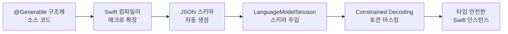
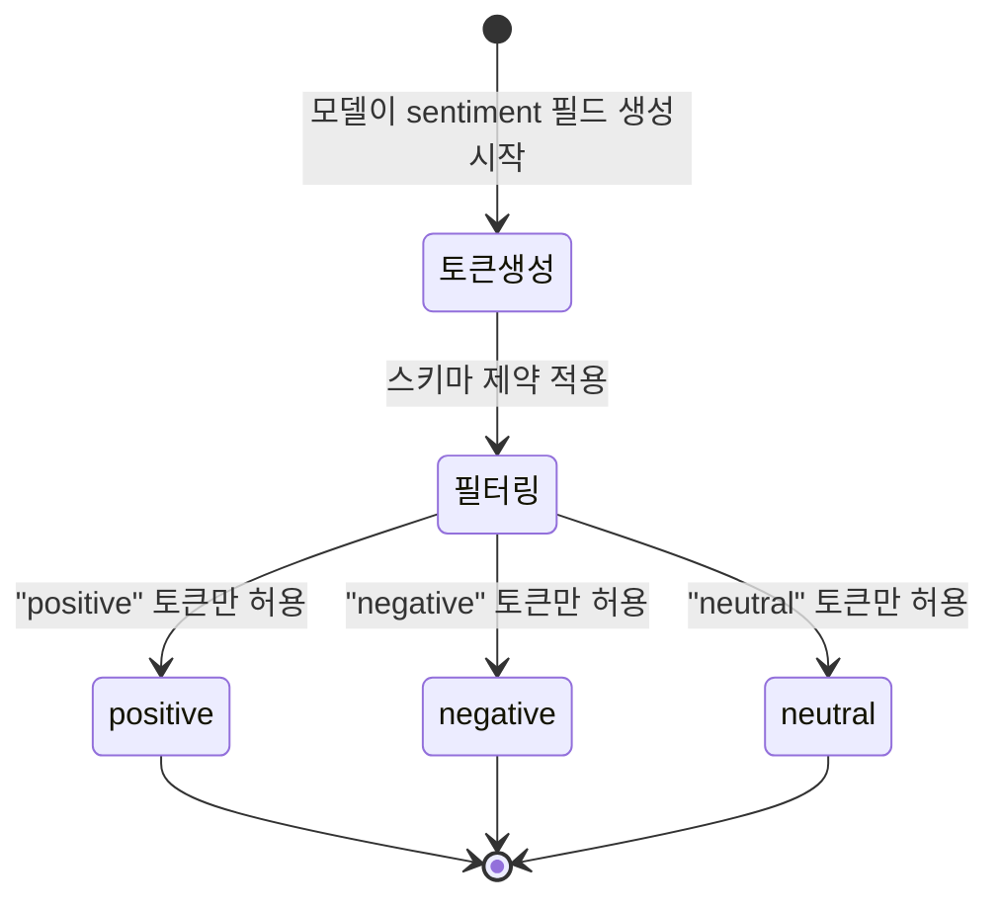
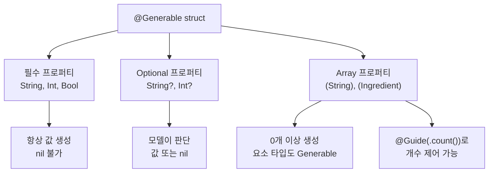
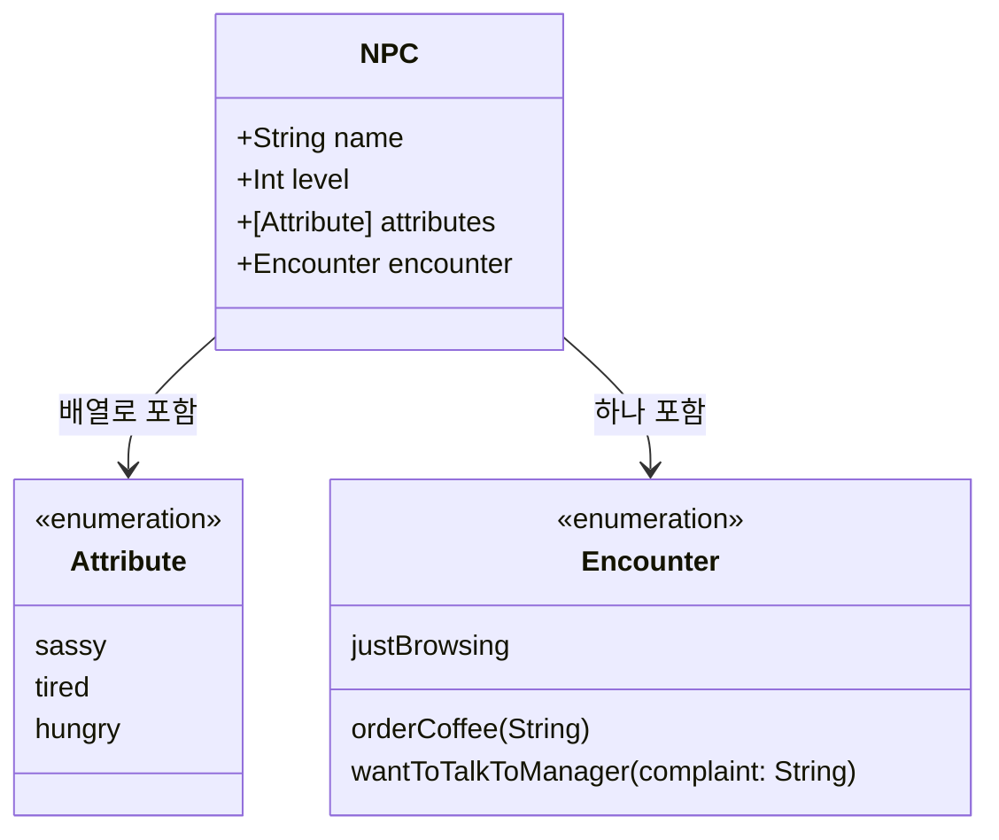
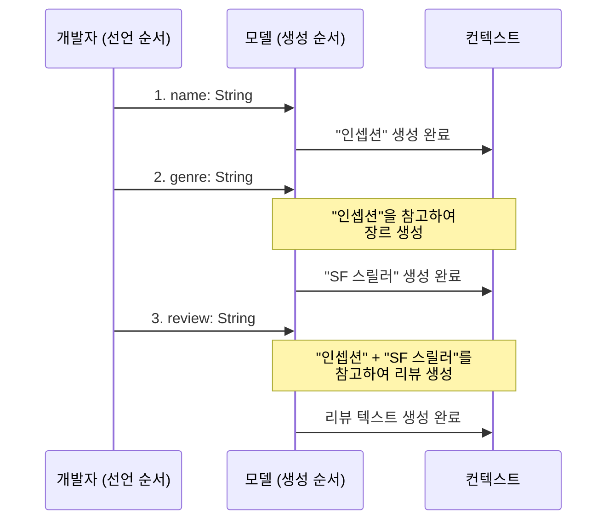

# @Generable 매크로 적용하기

> Swift 타입에 @Generable 매크로를 선언하고, 지원되는 다양한 타입으로 구조화 출력을 구현하는 방법을 마스터합니다.

## 개요

이 섹션에서는 `@Generable` 매크로를 실제 Swift 코드에 적용하는 방법을 체계적으로 학습합니다. 기본 프리미티브 타입부터 중첩 구조체, 열거형, 배열, 옵셔널까지 — 지원되는 모든 타입을 탐험하고, 각 타입이 모델 출력에서 어떻게 동작하는지 확인합니다.

**선수 지식**: [Guided Generation 개념과 동작 원리](05-ch5-generable-구조화-출력/01-01-guided-generation-개념과-동작-원리.md)에서 배운 Constrained Decoding과 컴파일 타임 스키마 생성 원리
**학습 목표**:
- `@Generable` 매크로를 구조체와 열거형에 적용할 수 있다
- 지원 타입(String, Int, Double, Bool, enum, Optional, Array)의 특성과 제약을 파악한다
- 중첩 구조체와 열거형으로 복합적인 출력 스키마를 설계한다
- 프로퍼티 선언 순서가 생성 품질에 미치는 영향을 이해한다

## 왜 알아야 할까?

지난 섹션에서 Guided Generation의 *원리*를 배웠다면, 이번에는 **실전 적용법**을 익힐 차례입니다. `@Generable`이 지원하는 타입을 정확히 알아야 하는 이유는 명확하죠 — 지원하지 않는 타입을 쓰면 **컴파일 에러**가 나고, 타입을 잘못 선택하면 모델이 **엉뚱한 값**을 생성합니다.

예를 들어 레시피 앱에서 재료 목록을 받으려면 `[Ingredient]` 배열이 필요하고, 난이도를 표현하려면 `enum Difficulty`가 적합합니다. 감정 분석 결과에는 `Double` 점수와 `String` 설명이 함께 와야 하죠. 이런 실무 시나리오에서 어떤 타입을 어떻게 조합해야 하는지 — 이 섹션이 그 답을 드립니다.

## 핵심 개념

### 개념 1: @Generable 기본 선언과 프리미티브 타입

> 💡 **비유**: `@Generable`은 건축 설계도와 같습니다. 건축가(개발자)가 "여기는 벽돌(String), 여기는 기둥(Int), 여기는 창문(Bool)"이라고 도면에 명시하면, 시공팀(모델)은 그 도면대로만 건물을 지을 수 있죠. 도면에 없는 자재를 쓸 수 없는 것처럼, 스키마에 없는 타입은 생성할 수 없습니다.

`@Generable` 매크로는 **구조체**와 **열거형**에 적용할 수 있습니다. 매크로를 붙이면 컴파일러가 자동으로 스키마를 생성하고, 모델은 이 스키마에 맞는 값만 출력합니다.

> 📊 **그림 1**: @Generable 매크로의 컴파일 타임 처리 흐름



Foundation Models 프레임워크가 지원하는 **프리미티브 타입**은 다음과 같습니다:

| 타입 | 설명 | 예시 값 |
|------|------|---------|
| `String` | 텍스트 값 | `"카페라테"` |
| `Int` | 정수 | `42` |
| `Double` | 실수 (소수점) | `3.14` |
| `Float` | 단정밀도 실수 | `0.95` |
| `Decimal` | 고정밀도 숫자 | `1234.56` |
| `Bool` | 참/거짓 | `true` |

가장 기본적인 `@Generable` 구조체를 만들어보겠습니다:

```swift
import FoundationModels

// @Generable 매크로를 구조체에 적용
@Generable
struct MovieReview {
    let title: String       // 영화 제목
    let rating: Int         // 평점 (정수)
    let score: Double       // 세부 점수 (실수)
    let isRecommended: Bool // 추천 여부
}
```

이 구조체를 사용해 모델에 영화 리뷰를 요청하면:

```run:swift
import FoundationModels

@Generable
struct MovieReview {
    let title: String
    let rating: Int
    let score: Double
    let isRecommended: Bool
}

let session = LanguageModelSession()
let response = try await session.respond(
    to: "인셉션 영화를 리뷰해주세요",
    generating: MovieReview.self
)

print("제목: \(response.content.title)")
print("평점: \(response.content.rating)")
print("점수: \(response.content.score)")
print("추천: \(response.content.isRecommended)")
```

```output
제목: 인셉션
평점: 9
점수: 9.2
추천: true
```

> ⚠️ **흔한 오해**: `@Generable`을 클래스(`class`)에도 쓸 수 있다고 생각하는 분이 많은데, **구조체(`struct`)와 열거형(`enum`)만 지원**합니다. 클래스는 참조 타입이라 값의 불변성을 보장하기 어렵기 때문이죠.

핵심 규칙이 하나 있습니다 — **모든 저장 프로퍼티의 타입이 Generable이어야 합니다.** String, Int, Double, Bool 등 기본 타입은 이미 Generable을 준수하므로, 이들의 조합으로 구조체를 만들면 됩니다.

### 개념 2: 열거형(Enum) — 선택지를 제한하는 강력한 도구

> 💡 **비유**: 열거형은 자판기의 버튼과 같습니다. 콜라, 사이다, 물 — 세 개의 버튼만 있으면 손님이 "피자 주세요"라고 할 수 없죠. 모델의 출력을 미리 정해둔 선택지로 **강제**하는 게 바로 열거형의 역할입니다.

`@Generable` 열거형은 두 가지 형태를 지원합니다:

**1. 단순 열거형 (Associated Value 없음)**

```swift
@Generable
enum Sentiment {
    case positive
    case negative
    case neutral
}

@Generable
struct SentimentResult {
    let text: String
    let sentiment: Sentiment  // 반드시 세 가지 중 하나
}
```

**2. Associated Value가 있는 열거형**

```swift
@Generable
enum Encounter {
    case orderCoffee(String)                    // 음료 이름
    case wantToTalkToManager(complaint: String) // 불만 내용
    case justBrowsing                           // 값 없음
}
```

> 📊 **그림 2**: 열거형에 의한 Constrained Decoding 토큰 필터링



열거형을 사용하면 모델이 `"positive"`, `"negative"`, `"neutral"` 이외의 토큰을 **절대 생성할 수 없습니다**. JSON 파싱 실패나 예상치 못한 값에 대한 걱정이 사라지는 거죠.

```run:swift
import FoundationModels

@Generable
enum Sentiment { case positive, negative, neutral }

@Generable
struct SentimentResult {
    let text: String
    let sentiment: Sentiment
}

let session = LanguageModelSession()
let result = try await session.respond(
    to: "이 영화 정말 재밌었어요! 다시 보고 싶어요.",
    generating: SentimentResult.self
)

print("감정: \(result.content.sentiment)")
print("분석: \(result.content.text)")
```

```output
감정: positive
분석: 긍정적인 감정이 강하게 표현된 문장입니다.
```

### 개념 3: Optional과 Array — 유연한 구조 설계

> 💡 **비유**: Optional은 주문서의 "특별 요청사항" 란과 같습니다. 있으면 좋지만 비워둬도 괜찮죠. Array는 장바구니입니다 — 상품이 1개일 수도, 10개일 수도 있습니다.

**Optional** — 모델이 판단하여 값을 넣거나 `nil`로 남길 수 있습니다:

```swift
@Generable
struct BookSummary {
    let title: String
    let author: String
    let yearPublished: Int?       // 출판연도를 모를 수 있음
    let seriesName: String?       // 시리즈가 아닐 수 있음
}
```

**Array** — 가변 길이의 컬렉션을 생성합니다:

```swift
@Generable
struct RecipeOutput {
    let name: String
    let ingredients: [String]     // 재료 목록
    let steps: [String]           // 조리 단계
    let cookTimeMinutes: Int
}
```

> 📊 **그림 3**: Optional과 Array의 스키마 생성 차이



Array의 요소 타입도 반드시 Generable이어야 합니다. 기본 타입(`[String]`, `[Int]`)은 물론이고, 커스텀 `@Generable` 구조체의 배열(`[Ingredient]`)도 가능합니다:

```swift
@Generable
struct Ingredient {
    let name: String
    let quantity: Double
    let unit: String
}

@Generable
struct Recipe {
    let name: String
    let ingredients: [Ingredient]  // @Generable 타입의 배열
    let isVegetarian: Bool
}
```

> 🔥 **실무 팁**: Array를 사용할 때는 `@Guide(.count(N))` 으로 정확한 개수를 지정하거나, `@Guide(.count(2...5))`처럼 범위를 지정하여 요소 수를 제한하는 것이 좋습니다. 제약 없이 두면 모델이 너무 적거나 너무 많은 요소를 생성할 수 있거든요. `.count()` 메서드는 고정 개수(`count(3)`), 범위(`count(2...5)`), 최소(`count(2...)`) 등 다양한 오버로드를 제공합니다. `@Guide`에 대해서는 [다음 섹션](05-ch5-generable-구조화-출력/03-03-guide-매크로로-출력-품질-높이기.md)에서 자세히 다룹니다.

### 개념 4: 중첩 구조체 — 복잡한 데이터 모델링

> 💡 **비유**: 러시안 인형(마트료시카)을 떠올려보세요. 큰 인형 안에 작은 인형, 그 안에 더 작은 인형이 들어있죠. 중첩 구조체도 마찬가지입니다 — `@Generable` 구조체 안에 또 다른 `@Generable` 구조체가 프로퍼티로 들어갑니다.

실제 앱에서는 단순 프리미티브만으로 데이터를 표현하기 어렵습니다. 게임 NPC라면 이름, 레벨뿐 아니라 어떤 행동을 하는지(열거형), 어떤 아이템을 갖고 있는지(중첩 구조체 배열)까지 표현해야 하죠.

> 📊 **그림 4**: 중첩 @Generable 타입의 계층 구조



```swift
import FoundationModels

@Generable
struct NPC {
    let name: String
    let level: Int
    let attributes: [Attribute]  // 열거형 배열
    let encounter: Encounter     // 열거형 (associated value 포함)
    
    // 중첩 열거형 — 외부에 선언해도 동일
    @Generable
    enum Attribute {
        case sassy
        case tired
        case hungry
    }
    
    @Generable
    enum Encounter {
        case orderCoffee(String)
        case wantToTalkToManager(complaint: String)
        case justBrowsing
    }
}
```

중첩은 여러 단계로도 가능합니다:

```swift
@Generable
struct QuizOutput {
    let topic: String
    let questions: [Question]    // 중첩 구조체의 배열
    
    @Generable
    struct Question {
        let text: String
        let choices: [String]
        let correctIndex: Int
    }
}
```

### 개념 5: 프로퍼티 선언 순서의 중요성

Foundation Models에서 `@Generable` 타입의 프로퍼티는 **소스 코드에 선언된 순서대로** 생성됩니다. 이건 단순한 구현 디테일이 아니라 **출력 품질에 직접적인 영향**을 미치는 핵심 설계 요소입니다.

왜 그럴까요? 언어 모델은 이전에 생성한 토큰을 컨텍스트로 활용하기 때문입니다. 먼저 생성된 프로퍼티 값이 이후 프로퍼티 생성의 맥락이 되는 거죠.

> 📊 **그림 5**: 프로퍼티 선언 순서에 따른 순차 생성 흐름



**좋은 순서** — 일반적인 정보에서 구체적인 정보로:

```swift
@Generable
struct MovieAnalysis {
    let title: String       // 1. 영화 제목 (가장 기본)
    let genre: String       // 2. 장르 (제목 맥락 활용)
    let plotSummary: String // 3. 줄거리 (제목+장르 맥락 활용)
    let rating: Int         // 4. 평점 (전체 분석 맥락 활용)
}
```

**나쁜 순서** — 구체적인 정보를 먼저 생성하면 맥락 부족:

```swift
@Generable
struct MovieAnalysis {
    let rating: Int         // 1. 평점부터? 무슨 영화인지도 모르는데?
    let plotSummary: String // 2. 줄거리? 아직 장르도 모름
    let genre: String       // 3. 장르
    let title: String       // 4. 제목이 마지막...
}
```

> 🔥 **실무 팁**: 프로퍼티 순서를 정할 때 "사람에게 설명한다면 어떤 순서로 말할까?"를 떠올려보세요. 자연스러운 설명 순서가 곧 좋은 선언 순서입니다.

### 개념 6: 프로토콜 적합성과 제약사항

`@Generable` 매크로를 적용하면 프레임워크가 내부적으로 필요한 프로토콜 적합성을 자동 합성합니다. 하지만 명시적으로 추가 프로토콜을 채택할 수도 있습니다:

```swift
// Equatable 명시적 채택 — UI 비교에 유용
@Generable
struct UserProfile: Equatable {
    let firstName: String
    let lastName: String
    let email: String
}

// Codable 명시적 채택 — JSON 저장/전송에 유용
@Generable
struct TaskItem: Codable {
    let title: String
    let isCompleted: Bool
    let priority: Int
}
```

`@Generable`은 Swift 6의 **Strict Concurrency**에서도 안전하게 동작합니다. `let` 프로퍼티만 사용하는 구조체는 자동으로 `Sendable`을 만족하죠.

**지원되지 않는 패턴들:**

```swift
// ❌ 클래스는 지원 안 됨
@Generable
class NotSupported { }

// ❌ 연산 프로퍼티는 스키마에 포함되지 않음 (컴파일은 됨)
@Generable
struct Example {
    let name: String
    var greeting: String { "Hello, \(name)" } // 스키마에 미포함
}

// ❌ 저장 프로퍼티의 타입이 Generable이 아니면 컴파일 에러
@Generable
struct WontCompile {
    let name: String
    let date: Date       // Date는 Generable이 아님!
    let url: URL         // URL도 Generable이 아님!
}
```

`Date`, `URL`, `Data` 같은 Foundation 타입은 Generable이 아닙니다. 날짜를 다루려면 `String`으로 받아서 파싱하거나, 연/월/일을 별도 `Int` 프로퍼티로 분리하는 전략이 필요합니다:

```swift
@Generable
struct EventOutput {
    let name: String
    let year: Int           // Date 대신 분리
    let month: Int
    let day: Int
    let locationName: String // URL 대신 텍스트
}
```

## 실습: 직접 해보기

레시피 추천 앱의 출력 스키마를 설계해봅시다. 프리미티브 타입, 열거형, 배열, 중첩 구조체를 모두 활용하는 실전 예제입니다.

```swift
import FoundationModels

// 1단계: 열거형 정의 — 선택지를 제한
@Generable
enum DifficultyLevel {
    case beginner    // 초급
    case intermediate // 중급
    case advanced    // 고급
}

@Generable
enum MealType {
    case breakfast   // 아침
    case lunch       // 점심
    case dinner      // 저녁
    case snack       // 간식
    case dessert     // 디저트
}

// 2단계: 중첩 구조체 정의 — 재료 모델링
@Generable
struct Ingredient {
    let name: String       // 재료 이름
    let amount: String     // 양 (예: "200g", "2큰술")
    let isOptional: Bool   // 생략 가능한 재료인지
}

// 3단계: 메인 구조체 — 모든 타입 조합
@Generable
struct RecipeRecommendation {
    // 프로퍼티 순서: 일반 → 구체적
    let name: String                    // 1. 레시피 이름
    let mealType: MealType              // 2. 식사 종류 (열거형)
    let difficulty: DifficultyLevel     // 3. 난이도 (열거형)
    let servings: Int                   // 4. 인분 수
    let prepTimeMinutes: Int            // 5. 준비 시간
    let ingredients: [Ingredient]       // 6. 재료 목록 (중첩 구조체 배열)
    let steps: [String]                 // 7. 조리 단계 (문자열 배열)
    let chefTip: String?               // 8. 셰프 팁 (옵셔널)
    let isVegetarian: Bool              // 9. 채식 여부
}

// 4단계: 세션 생성 및 요청
let session = LanguageModelSession(
    instructions: "한국 가정식 레시피를 추천하는 요리 전문가입니다."
)

let response = try await session.respond(
    to: "간단한 저녁 메뉴 하나 추천해주세요. 2인분으로요.",
    generating: RecipeRecommendation.self
)

// 5단계: 타입 안전한 결과 활용
let recipe = response.content
print("🍳 \(recipe.name)")
print("종류: \(recipe.mealType), 난이도: \(recipe.difficulty)")
print("인분: \(recipe.servings)인분, 시간: \(recipe.prepTimeMinutes)분")
print("\n재료:")
for ingredient in recipe.ingredients {
    let optional = ingredient.isOptional ? " (선택)" : ""
    print("  - \(ingredient.name) \(ingredient.amount)\(optional)")
}
print("\n조리 순서:")
for (index, step) in recipe.steps.enumerated() {
    print("  \(index + 1). \(step)")
}
if let tip = recipe.chefTip {
    print("\n💡 셰프 팁: \(tip)")
}
```

이 코드에서 주목할 점:

1. **열거형 2개**(`DifficultyLevel`, `MealType`)로 모델이 정해진 카테고리 안에서만 선택
2. **중첩 구조체**(`Ingredient`)로 재료의 세부 정보를 구조화
3. **배열 2개**(`[Ingredient]`, `[String]`)로 가변 길이 데이터 처리
4. **Optional**(`chefTip`)로 있을 수도 없을 수도 있는 정보 처리
5. **프로퍼티 순서**가 이름 → 분류 → 상세 순으로 논리적 흐름 유지

## 더 깊이 알아보기

### Guided Generation의 학술적 뿌리

`@Generable`이 사용하는 Constrained Decoding 기법은 Apple이 처음 만든 게 아닙니다. 2023년 Microsoft Research의 **Guidance** 라이브러리와 비슷한 시기에 여러 연구팀이 "LLM 출력을 문법(Grammar)으로 제약하는 방법"을 탐구했습니다.

핵심 아이디어는 형식 언어 이론(Formal Language Theory)에서 왔습니다. 촘스키(Noam Chomsky)가 1956년에 정립한 문맥 자유 문법(Context-Free Grammar)을 LLM 디코딩에 적용한 것이죠. JSON 스키마 자체가 일종의 문법이고, 이 문법에 맞는 토큰만 허용하면 구조적으로 올바른 출력이 보장됩니다.

Apple의 차별점은 이 기법을 **Swift 컴파일러 매크로**와 결합했다는 것입니다. 런타임에 문자열로 스키마를 전달하는 대신, 컴파일 타임에 Swift 타입 시스템이 스키마를 생성하니 타입 안전성과 IDE 자동완성까지 얻을 수 있습니다. WWDC25에서 발표된 이 접근법은 "Swift 개발자의 기존 워크플로에 AI를 자연스럽게 녹이겠다"는 Apple의 철학을 잘 보여줍니다.

### 프로퍼티 순서와 Auto-regressive 모델

프로퍼티 선언 순서가 중요한 이유는 LLM의 **자기회귀적(Auto-regressive)** 특성 때문입니다. GPT 계열이든 Apple의 온디바이스 모델이든, 모든 Transformer 기반 언어 모델은 **이전 토큰을 조건으로 다음 토큰을 생성**합니다. 수식으로 표현하면:

$$P(x_t | x_1, x_2, ..., x_{t-1})$$

여기서 $x_t$는 현재 생성할 토큰, $x_1$부터 $x_{t-1}$은 이미 생성된 토큰입니다. 먼저 생성된 프로퍼티 값이 이후 프로퍼티의 조건이 되므로, 순서가 곧 맥락의 질을 결정합니다.

## 흔한 오해와 팁

> ⚠️ **흔한 오해**: "var 프로퍼티도 @Generable에서 사용할 수 있다" — `@Generable` 구조체에서 `let`과 `var` 모두 문법적으로는 허용되지만, 모델이 생성한 값은 불변이므로 **`let`을 사용하는 것이 의미적으로 정확**합니다. 생성 후 변경할 일이 없다면 `let`으로 선언하세요.

> 💡 **알고 계셨나요?**: `@Generable` 매크로가 생성하는 코드를 Xcode에서 직접 확인할 수 있습니다. 매크로가 적용된 구조체를 우클릭하고 **"Expand Macro"**를 선택하면, 컴파일러가 어떤 스키마 코드를 자동 생성하는지 볼 수 있죠. `GenericSchema` 타입과 초기화 코드를 포함한 꽤 긴 코드가 나옵니다.

> 🔥 **실무 팁**: `Date`나 `URL`이 필요할 때는 `String`으로 받아서 후처리하세요. 예를 들어 `let dateString: String`으로 받고 `@Guide(description: "YYYY-MM-DD 형식의 날짜")`로 포맷을 지정하면, 파싱 가능한 문자열을 안정적으로 얻을 수 있습니다. `@Guide`에 대해서는 [다음 섹션](05-ch5-generable-구조화-출력/03-03-guide-매크로로-출력-품질-높이기.md)에서 본격적으로 다룹니다.

## 핵심 정리

| 개념 | 설명 |
|------|------|
| 프리미티브 타입 | String, Int, Double, Float, Decimal, Bool — 모두 기본 Generable |
| 열거형 (Enum) | `@Generable enum`으로 선택지 제한. Associated Value도 지원 |
| Optional | `String?`, `Int?` 등 — 모델이 값 또는 nil을 판단하여 생성 |
| Array | `[String]`, `[CustomType]` — 가변 길이 컬렉션. 요소도 Generable 필수 |
| 배열 개수 제어 | `@Guide(.count(3))` 고정, `.count(2...5)` 범위, `.count(2...)` 최소 지정 |
| 중첩 구조체 | `@Generable` 구조체가 다른 `@Generable` 타입을 프로퍼티로 포함 |
| 프로퍼티 순서 | 선언 순서 = 생성 순서. 일반적 정보 → 구체적 정보가 최적 |
| 지원 안 됨 | class, Date, URL, Data 등 — String이나 Int로 대체 필요 |
| 프로토콜 채택 | Equatable, Codable 등 추가 채택 가능. Sendable은 let 구조체 자동 충족 |

## 다음 섹션 미리보기

`@Generable`로 **어떤 타입**을 쓸 수 있는지 알았으니, 이제는 **품질을 높이는 방법**을 배울 차례입니다. [다음 섹션: @Guide 매크로로 출력 품질 높이기](05-ch5-generable-구조화-출력/03-03-guide-매크로로-출력-품질-높이기.md)에서는 `@Guide(description:)`, `@Guide(.range())`, `@Guide(.count())`, 정규식 패턴 등 프로퍼티별 세밀한 가이드를 제공하여 모델 출력의 정확도와 일관성을 극적으로 개선하는 기법을 다룹니다.

## 참고 자료

- [Deep dive into the Foundation Models framework — WWDC25](https://developer.apple.com/videos/play/wwdc2025/301/) - @Generable 매크로의 동작 원리, 지원 타입, 프로퍼티 순서 등을 깊이 있게 다루는 공식 세션
- [The Ultimate Guide To The Foundation Models Framework — AzamSharp](https://azamsharp.com/2025/06/18/the-ultimate-guide-to-the-foundation-models-framework.html) - @Generable 실전 예제와 중첩 구조체, 열거형 패턴을 코드 중심으로 설명
- [Exploring the Foundation Models framework — Create with Swift](https://www.createwithswift.com/exploring-the-foundation-models-framework/) - @Generable 기본 사용법과 @Guide 조합 패턴을 단계별로 안내
- [Working with @Generable and @Guide in Foundation Models — AppCoda](https://www.appcoda.com/generable/) - @Guide의 다양한 옵션(.count 범위 지정 등)과 실전 활용 패턴
- [Meet the Foundation Models framework — WWDC25](https://developer.apple.com/videos/play/wwdc2025/286/) - Foundation Models 프레임워크 전체 개요와 @Generable의 위치

---
### 🔗 Related Sessions
- [guided generation](05-ch5-generable-구조화-출력/01-01-guided-generation-개념과-동작-원리.md) (prerequisite)
- [constrained decoding](05-ch5-generable-구조화-출력/01-01-guided-generation-개념과-동작-원리.md) (prerequisite)
- [respond(generating:)](05-ch5-generable-구조화-출력/01-01-guided-generation-개념과-동작-원리.md) (prerequisite)
