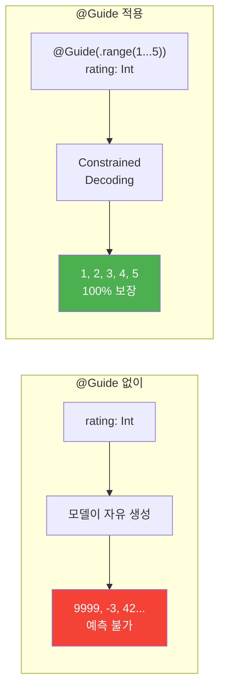
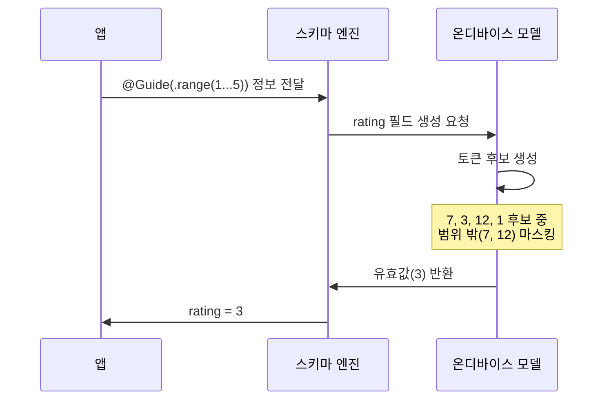
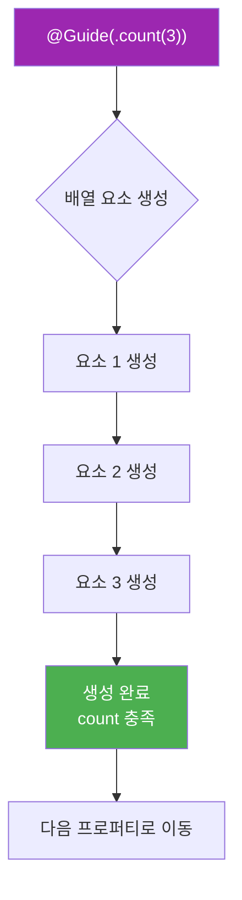
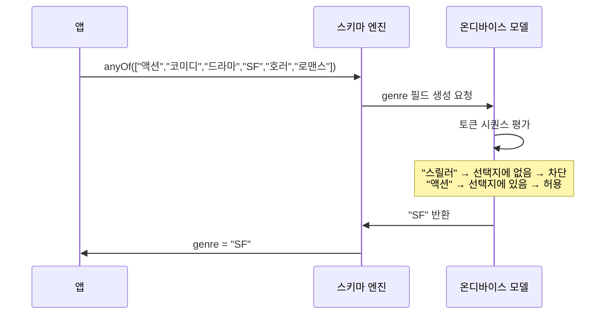
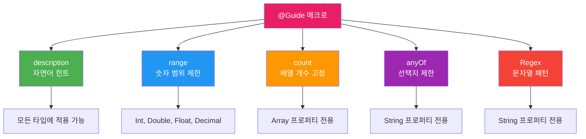
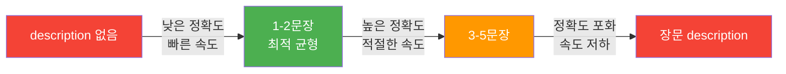

# @Guide 매크로로 출력 품질 높이기

> @Guide 속성 래퍼로 각 필드에 설명, 범위, 개수, 정규식 제약을 추가하여 구조화 출력의 정확도와 일관성을 극적으로 높이는 방법을 배웁니다.

## 개요

이 섹션에서는 `@Generable` 구조체의 각 프로퍼티에 `@Guide` 매크로를 적용하여 모델의 출력 품질을 세밀하게 제어하는 방법을 학습합니다. 앞서 [02. @Generable 매크로 적용하기](05-ch5-generable-구조화-출력/02-02-generable-매크로-적용하기.md)에서 구조체와 열거형에 `@Generable`을 적용하는 법을 배웠다면, 이번에는 **각 필드가 어떤 값을 가져야 하는지** 모델에게 정확히 알려주는 단계입니다.

**선수 지식**: `@Generable` 매크로 기본 사용법, 지원 타입, 프로퍼티 선언 순서 개념
**학습 목표**:
- `@Guide(description:)`으로 자연어 힌트를 제공하여 필드 정확도를 높인다
- `.range()`로 숫자 값의 범위를 제약한다
- `.count()`로 배열의 정확한 요소 개수를 지정한다
- `.anyOf()`와 Regex로 문자열 출력을 특정 패턴으로 제한한다
- 각 @Guide 타입의 적합한 사용 상황을 구분하고 선택할 수 있다

## 왜 알아야 할까?

`@Generable`만으로도 모델은 구조체 형태에 맞는 출력을 생성합니다. 하지만 **구조만 맞고 내용이 엉뚱한** 경우가 빈번하죠. 예를 들어, 레시피 앱에서 조리 시간을 `Int`로 받으면 모델이 9999분을 생성할 수도 있고, 평점을 요청했는데 100점 만점으로 줄 수도 있습니다.

`@Guide`는 이런 문제를 **컴파일 타임 스키마 수준**에서 해결합니다. 프롬프트에 "1부터 5까지만 줘"라고 쓰는 것과는 차원이 다릅니다 — `@Guide`는 토큰 디코딩 과정에서 유효하지 않은 값을 원천 차단하거든요.

실무에서 구조화 출력의 품질 80%는 스키마 설계에서 결정됩니다. `@Guide`를 잘 쓰면 프롬프트를 길게 쓸 필요 없이, 스키마 자체가 프롬프트 역할을 합니다.

> 📊 **그림 1**: @Guide 없는 출력 vs @Guide 적용 출력



## 핵심 개념

### 개념 1: description — 자연어로 필드 설명하기

> 💡 **비유**: 이력서 양식에 "이름"이라고만 쓰면 닉네임을 쓰는 사람도 있지만, "이력서에 기재할 법적 성명(한글)"이라고 안내하면 모두 정확한 이름을 쓰겠죠. `@Guide(description:)`이 바로 그런 안내문입니다.

`description` 파라미터는 프로퍼티가 **어떤 의미의 값**을 담아야 하는지 자연어로 모델에게 힌트를 줍니다. 이것은 프롬프트의 일부가 아니라 **스키마의 일부**로 컴파일 타임에 임베딩됩니다.

```swift
import FoundationModels

@Generable
struct BookReview {
    @Guide(description: "도서의 정식 제목 (부제 포함)")
    let title: String
    
    @Guide(description: "리뷰어가 느낀 핵심 감상을 한 문장으로")
    let oneLiner: String
    
    @Guide(description: "이 책을 추천하는 대상 독자층")
    let targetAudience: String
}
```

`description`이 없으면 모델은 프로퍼티 이름(`title`, `oneLiner`)만 보고 추측합니다. 이름이 모호할수록 결과가 불안정해지죠. `description`을 추가하면 모델이 **정확히 어떤 내용을 생성해야 하는지** 알게 됩니다.

> 📊 **그림 2**: @Guide(description:)의 동작 원리


**description 작성 팁**:
- 간결하게: 1~2문장이면 충분합니다. 길수록 추론 지연이 늘어납니다
- 구체적으로: "설명" 대신 "100자 이내의 요약 설명"처럼 기대치를 명확히
- 한국어 OK: description은 한국어로 작성해도 잘 동작합니다

### 개념 2: range — 숫자 범위 제약

> 💡 **비유**: 시험 점수를 0~100점 사이로 제한하는 것과 같습니다. 이 범위를 벗어난 값은 아예 생성이 불가능해지죠 — 선생님이 감점하는 게 아니라, 답안지에 해당 숫자가 **인쇄되지 않는** 것입니다.

`.range()`는 `Int`, `Double`, `Float`, `Decimal` 프로퍼티에 최솟값과 최댓값을 설정합니다. Constrained Decoding이 디코딩 과정에서 범위 밖 숫자 토큰을 마스킹하므로, 100% 범위 내 값이 보장됩니다.

```swift
@Generable
struct RestaurantReview {
    @Guide(description: "음식점 이름")
    let name: String
    
    @Guide(description: "전반적인 만족도 (5점 만점)", .range(1...5))
    let rating: Int
    
    @Guide(description: "1인당 예상 가격 (원)", .range(5000...200000))
    let pricePerPerson: Int
    
    @Guide(description: "재방문 확률 (%)", .range(0.0...100.0))
    let revisitProbability: Double
}
```

> 📊 **그림 3**: range 제약의 Constrained Decoding 과정



**range 변형들**:

| 문법 | 의미 | 예시 |
|------|------|------|
| `.range(1...5)` | 닫힌 범위 (1 이상 5 이하) | 평점 |
| `.range(0..<100)` | 반열린 범위 (0 이상 100 미만) | 퍼센트 |

> ⚠️ **흔한 오해**: "range를 프롬프트에 쓰는 것과 같지 않나요?" — 전혀 다릅니다. 프롬프트의 범위 지시는 모델이 **무시할 수 있지만**, `@Guide(.range())`는 디코딩 레벨에서 물리적으로 범위 밖 토큰을 차단합니다. 100% 보장입니다.

### 개념 3: count — 배열 요소 개수 고정

> 💡 **비유**: 식당 예약할 때 "4인 테이블"을 요청하면 정확히 4개의 의자가 준비되는 것처럼, `.count()`는 배열에 정확히 원하는 개수의 요소가 생성되도록 합니다.

`.count()`는 `Array` 프로퍼티에 정확한 요소 개수를 지정합니다. "3개의 장점을 나열해줘"라고 프롬프트에 쓰는 대신, 스키마 수준에서 강제할 수 있습니다.

```swift
@Generable
struct ProductAnalysis {
    @Guide(description: "분석 대상 제품명")
    let productName: String
    
    @Guide(description: "제품의 핵심 장점", .count(3))
    let pros: [String]
    
    @Guide(description: "제품의 단점 또는 개선점", .count(3))
    let cons: [String]
    
    @Guide(description: "종합 한줄 평가")
    let summary: String
}
```

```run:swift
// 사용 예시
let session = LanguageModelSession()
let result = try await session.respond(
    to: "아이폰 16 Pro에 대해 분석해주세요",
    generating: ProductAnalysis.self
)

print("제품: \(result.productName)")
print("장점 개수: \(result.pros.count)")  // 항상 3
print("단점 개수: \(result.cons.count)")  // 항상 3
for (i, pro) in result.pros.enumerated() {
    print("  장점 \(i+1): \(pro)")
}
```

```output
제품: iPhone 16 Pro
장점 개수: 3
단점 개수: 3
  장점 1: A18 Pro 칩의 뛰어난 성능으로 고사양 작업도 원활
  장점 2: 카메라 컨트롤 버튼으로 직관적인 촬영 경험
  장점 3: 티타늄 소재로 가볍고 내구성 우수
```

> 📊 **그림 4**: count 제약이 배열 생성에 미치는 영향



`count` 없이 배열을 선언하면 모델이 자유롭게 개수를 결정합니다. 때로는 1개, 때로는 10개 — 일관성이 없죠. UI에서 고정 레이아웃(예: 3개의 카드)을 쓴다면 `count`는 필수입니다.

### 개념 4: anyOf — 선택지 제한

> 💡 **비유**: 객관식 시험과 같습니다. 주관식으로 자유롭게 쓰게 하면 오답이 나올 수 있지만, 보기 4개 중에서 고르게 하면 항상 유효한 답이 나오죠.

`.anyOf()`는 `String` 프로퍼티의 출력을 **미리 정의된 선택지** 중 하나로 제한합니다. 열거형(`@Generable enum`)을 쓰기 어려울 때 유용한 대안입니다.

```swift
@Generable
struct MovieRecommendation {
    @Guide(description: "추천 영화 제목")
    let title: String
    
    @Guide(description: "영화의 주요 장르", .anyOf(["액션", "코미디", "드라마", "SF", "호러", "로맨스"]))
    let genre: String
    
    @Guide(description: "관람 등급", .anyOf(["전체관람가", "12세이상", "15세이상", "청소년관람불가"]))
    let ageRating: String
    
    @Guide(description: "한줄 추천 이유")
    let reason: String
}
```

> 📊 **그림 5**: anyOf의 토큰 필터링 과정



**anyOf vs @Generable enum — 언제 어떤 것을?**

| 상황 | 추천 | 이유 |
|------|------|------|
| 선택지가 고정적 | `@Generable enum` | 타입 안전성, 컴파일 타임 체크 |
| 선택지가 동적/외부 데이터 | `.anyOf()` | 런타임에 선택지 변경 가능 |
| 선택지에 연관값 필요 | `@Generable enum` | associated value 지원 |
| 한국어 문자열 그대로 사용 | `.anyOf()` | enum case는 영문 권장 |

### 개념 5: Regex — 문자열 패턴 제약

> 💡 **비유**: 우편번호 입력란에 "숫자 5자리만" 허용하는 입력 검증과 같습니다. 모델이 생성하는 문자열이 특정 패턴을 반드시 따르도록 강제합니다.

Swift의 `RegexBuilder`를 사용하여 문자열의 형식을 정밀하게 제어할 수 있습니다. 이것은 단순한 유효성 검사가 아닙니다 — 디코딩 과정에서 패턴에 맞지 않는 토큰 시퀀스를 원천 차단합니다.

```swift
import RegexBuilder

@Generable
struct ContactCard {
    @Guide(description: "연락처 이름 (호칭 포함)", Regex {
        Capture {
            ChoiceOf {
                "Mr"
                "Mrs"
                "Ms"
                "Dr"
            }
        }
        ". "
        OneOrMore(.word)
    })
    let name: String
    
    @Guide(description: "전화번호", Regex {
        "010-"
        Repeat(.digit, count: 4)
        "-"
        Repeat(.digit, count: 4)
    })
    let phone: String
}
```

Regex 가이드는 특히 **코드, ID, 날짜 형식** 같은 엄격한 포맷이 필요한 필드에 강력합니다. 예를 들어 주문번호를 `ORD-YYYYMMDD-NNNN` 형식으로 생성하거나, 색상 코드를 `#RRGGBB` 패턴으로 제한할 수 있습니다.

```swift
@Generable
struct OrderInfo {
    @Guide(description: "주문 번호 (ORD-날짜-일련번호 형식)", Regex {
        "ORD-"
        Repeat(.digit, count: 8)  // YYYYMMDD
        "-"
        Repeat(.digit, count: 4)  // 일련번호
    })
    let orderId: String
    
    @Guide(description: "예상 배송일 (YYYY-MM-DD)", Regex {
        Repeat(.digit, count: 4)
        "-"
        Repeat(.digit, count: 2)
        "-"
        Repeat(.digit, count: 2)
    })
    let estimatedDelivery: String
}
```

> 📊 **그림 6**: @Guide 제약 타입 전체 비교



### 각 @Guide 타입 선택 가이드

다섯 가지 @Guide 타입을 배웠으니, 실무에서 어떤 것을 써야 할지 빠르게 판단하는 기준을 정리해봅시다.

| 필드 특성 | 추천 @Guide | 예시 |
|-----------|------------|------|
| 의미가 모호한 프로퍼티명 | `description` | `data` → "사용자의 활동 로그 요약" |
| 점수, 수량, 가격 | `range` | 평점 1~5, 가격 0~100만 |
| 고정 개수의 리스트 | `count` | 장단점 각 3개, Top 5 |
| 카테고리, 등급, 상태 | `anyOf` 또는 enum | 장르, 난이도, 우선순위 |
| 코드, ID, 날짜 포맷 | `Regex` | 주문번호, 전화번호, 색상코드 |
| 위 조건이 겹침 | 복합 사용 | description + range 조합 |

`description`은 다른 제약들과 항상 함께 사용할 수 있다는 점을 기억하세요. 예를 들어 `@Guide(description: "전반적 만족도", .range(1...5))`처럼 의미적 힌트와 구조적 제약을 동시에 거는 것이 가장 효과적인 패턴입니다.

## 실습: 직접 해보기

레시피 분석 앱을 만들어봅시다. 사용자가 요리 이름을 입력하면, 모델이 구조화된 레시피 정보를 다양한 @Guide 제약에 맞게 생성합니다. 앞서 배운 description, range, count, anyOf를 모두 활용하는 종합 예제입니다.

```swift
import FoundationModels

// MARK: - 재료 단위 열거형
@Generable
enum MeasureUnit {
    case gram
    case ml
    case tablespoon
    case teaspoon
    case cup
    case piece
}

// MARK: - 난이도 열거형
@Generable
enum DifficultyLevel {
    case beginner     // 초급
    case intermediate // 중급
    case advanced     // 고급
}

// MARK: - 재료 구조체
@Generable
struct Ingredient {
    @Guide(description: "재료의 정확한 이름")
    let name: String
    
    @Guide(description: "필요한 수량", .range(1...1000))
    let amount: Int
    
    let unit: MeasureUnit
}

// MARK: - 레시피 분석 결과
@Generable
struct RecipeAnalysis {
    @Guide(description: "정식 요리 이름 (한국어)")
    let dishName: String
    
    @Guide(description: "요리에 대한 간단한 소개 (2-3문장)")
    let introduction: String
    
    // range: 조리 시간을 현실적 범위로 제한
    @Guide(description: "조리에 필요한 시간 (분 단위)", .range(5...180))
    let cookingTimeMinutes: Int
    
    // range: 칼로리를 합리적 범위로 제약
    @Guide(description: "1인분 기준 예상 칼로리 (kcal)", .range(50...2000))
    let caloriesPerServing: Int
    
    // enum: 고정 선택지는 @Generable enum 사용
    let difficulty: DifficultyLevel
    
    // count: 정확히 5개의 재료 (중첩 @Generable 구조체)
    @Guide(description: "핵심 재료 목록", .count(5))
    let mainIngredients: [Ingredient]
    
    // count: 정확히 5단계의 조리 과정
    @Guide(description: "조리 순서별 단계 설명", .count(5))
    let steps: [String]
    
    // count: 정확히 2개의 팁
    @Guide(description: "요리 초보자를 위한 실용적 팁", .count(2))
    let tips: [String]
}

// MARK: - 레시피 분석 실행
func analyzeRecipe(dishName: String) async throws {
    let session = LanguageModelSession()
    
    let result = try await session.respond(
        to: "\(dishName)의 상세 레시피를 분석해주세요.",
        generating: RecipeAnalysis.self
    )
    
    // 결과 출력
    print("🍳 \(result.dishName)")
    print("📝 \(result.introduction)")
    print("⏱️ 조리 시간: \(result.cookingTimeMinutes)분")
    print("🔥 칼로리: \(result.caloriesPerServing)kcal")
    print("📊 난이도: \(result.difficulty)")
    print("\n📦 주요 재료:")
    for ingredient in result.mainIngredients {
        print("  - \(ingredient.name): \(ingredient.amount) \(ingredient.unit)")
    }
    print("\n👨‍🍳 조리 순서:")
    for (i, step) in result.steps.enumerated() {
        print("  \(i + 1). \(step)")
    }
    print("\n💡 팁:")
    for tip in result.tips {
        print("  • \(tip)")
    }
}
```

```run:swift
// 실행 결과 예시
try await analyzeRecipe(dishName: "김치찌개")
```

```output
🍳 김치찌개
📝 잘 익은 김치를 사용해 깊은 맛을 내는 한국의 대표 찌개입니다. 돼지고기와 두부를 함께 넣어 든든한 한 끼로 손색없는 요리입니다.
⏱️ 조리 시간: 35분
🔥 칼로리: 280kcal
📊 난이도: beginner

📦 주요 재료:
  - 묵은지: 300 gram
  - 돼지고기 목살: 200 gram
  - 두부: 1 piece
  - 대파: 1 piece
  - 고춧가루: 1 tablespoon

👨‍🍳 조리 순서:
  1. 묵은지를 한입 크기로 썰고 돼지고기는 적당한 크기로 준비합니다
  2. 냄비에 참기름을 두르고 돼지고기를 중불에서 볶습니다
  3. 고기가 반쯤 익으면 김치를 넣고 함께 볶아 향을 냅니다
  4. 물을 붓고 끓기 시작하면 고춧가루와 다진 마늘을 넣습니다
  5. 두부와 대파를 넣고 5분 더 끓여 완성합니다

💡 팁:
  • 김치는 최소 2주 이상 숙성된 묵은지를 쓰면 국물 맛이 깊어집니다
  • 끓이기 전에 김치를 기름에 먼저 볶으면 감칠맛이 배로 좋아집니다
```

이 실습에서 주목할 점은 모든 @Guide 제약이 **100% 지켜진다**는 것입니다:
- `cookingTimeMinutes`는 반드시 5~180 범위 (range)
- `mainIngredients`는 정확히 5개 (count)
- `steps`는 정확히 5개, `tips`는 정확히 2개 (count)
- `difficulty`는 3가지 중 하나 (enum)
- 각 `Ingredient`의 `amount`는 1~1000 범위 (중첩 구조체의 range)

## 더 깊이 알아보기

### Guided Generation의 학술적 배경

@Guide의 핵심 기술인 **Constrained Decoding**은 사실 자연어 처리 분야에서 오래 연구된 주제입니다. 2023년 Meta의 연구원들이 발표한 "Efficient Guided Generation for Large Language Models"에서 **토큰 마스킹 기반 제약 디코딩**의 효율적 구현이 주목받기 시작했습니다.

Apple은 이 아이디어를 한 단계 발전시켰는데요. 기존 오픈소스 구현들(Outlines, Guidance 등)은 **런타임에 스키마를 파싱**하여 제약을 적용했지만, Apple은 Swift 매크로 시스템을 활용해 **컴파일 타임에 스키마를 생성**합니다. 이 차이가 큰 의미를 갖는 이유는, 온디바이스의 제한된 리소스에서 런타임 스키마 파싱 비용을 완전히 제거했기 때문입니다.

WWDC25에서 Apple 엔지니어가 밝힌 재미있는 사실이 있습니다. @Guide의 description은 내부적으로 "프로퍼티별 미니 프롬프트"처럼 작동한다는 점입니다. 모델이 해당 필드를 생성할 차례가 되면, description 텍스트가 컨텍스트에 주입되어 생성 방향을 안내합니다. 즉 `description`은 단순한 주석이 아니라 **실제 추론에 영향을 주는 활성 데이터**입니다.

### description 길이와 성능의 관계

Apple 문서에 따르면, description에 포함된 토큰이 많을수록 추론 지연이 늘어납니다. 이는 description이 컨텍스트 윈도우에 포함되기 때문입니다. 따라서 **1~2문장**이 최적이며, 에세이 수준의 설명은 오히려 성능을 해칩니다.

> 📊 **그림 7**: description 길이에 따른 품질-성능 트레이드오프



## 흔한 오해와 팁

> ⚠️ **흔한 오해**: "description을 길고 상세하게 쓸수록 좋다" — 아닙니다. description의 토큰이 컨텍스트에 포함되므로 추론 지연이 증가합니다. 1~2문장으로 핵심만 전달하세요. 필드 이름이 충분히 명확하다면(`firstName`, `emailAddress`) description을 생략해도 됩니다.

> 💡 **알고 계셨나요?**: @Guide의 `range` 제약은 **Constrained Decoding** 수준에서 적용됩니다. 즉, 프롬프트에 "1~5 사이로 줘"라고 쓰면 모델이 무시할 수 있지만, `.range(1...5)`는 해당 범위 밖의 토큰을 디코딩 단계에서 물리적으로 마스킹합니다. 모델이 "어기고 싶어도 어길 수 없는" 제약인 셈이죠.

> 🔥 **실무 팁**: `anyOf`와 `@Generable enum` 사이에서 고민된다면, **선택지가 앱 빌드 시점에 확정**되면 enum, **서버나 설정에서 동적으로 바뀔 수 있으면** anyOf를 쓰세요. 예를 들어 장르 목록이 관리자 설정으로 바뀔 수 있다면 anyOf가 유연합니다.

> 🔥 **실무 팁**: 프로퍼티 선언 순서를 @Guide와 함께 전략적으로 활용하세요. 이전 섹션에서 배운 것처럼 모델은 위에서 아래로 생성하므로, `summary` 같은 종합 필드는 맨 마지막에 두고 `@Guide(description: "위의 모든 분석을 종합한 한줄 요약")`을 달면 앞서 생성된 필드를 참고해 더 정확한 요약을 만듭니다.

## 핵심 정리

| 개념 | 설명 |
|------|------|
| `@Guide(description:)` | 프로퍼티에 자연어 힌트를 제공. 1~2문장이 최적. 모든 타입에 사용 가능 |
| `.range(min...max)` | Int, Double 등 숫자 타입의 값 범위를 컴파일 타임에 제약. 100% 보장 |
| `.count(n)` | 배열 프로퍼티의 정확한 요소 개수를 고정. UI 레이아웃 일관성에 필수 |
| `.anyOf([...])` | String 프로퍼티의 출력을 미리 정의한 선택지로 제한. 동적 선택지에 적합 |
| Regex 가이드 | RegexBuilder로 문자열 패턴을 정밀 제어. 코드, ID, 날짜 포맷에 유용 |
| 복합 사용 | description + 구조적 제약을 조합하여 의미와 형식을 동시에 제어 |
| 성능 고려 | description이 길수록 추론 지연 증가. 간결한 가이드가 최적 |

## 다음 섹션 미리보기

이 섹션에서 각각의 @Guide 타입을 개별적으로 마스터했으니, 다음 섹션 [04. 복합 구조와 컬렉션 출력](05-ch5-generable-구조화-출력/04-04-복합-구조와-컬렉션-출력.md)에서는 이들을 **중첩 @Generable 구조체, 다단계 배열, 복합 열거형 트리** 속에서 조합하는 실전 패턴을 다룹니다. 단일 필드가 아닌 **구조 전체를 설계하는 관점**에서 @Guide를 배치하는 전략을 살펴보겠습니다.

## 참고 자료

- [Deep dive into the Foundation Models framework — WWDC25](https://developer.apple.com/videos/play/wwdc2025/301/) - @Guide 매크로의 동작 원리와 Constrained Decoding을 상세히 설명하는 Apple 공식 세션
- [The Ultimate Guide To The Foundation Models Framework — AzamSharp](https://azamsharp.com/2025/06/18/the-ultimate-guide-to-the-foundation-models-framework.html) - @Guide의 description, range, count 활용 예제와 실무 팁
- [Exploring the Foundation Models framework — Create with Swift](https://www.createwithswift.com/exploring-the-foundation-models-framework/) - anyOf, regex 등 @Guide 파라미터별 실전 코드 예제
- [Foundation Models — Apple Developer Documentation](https://developer.apple.com/documentation/FoundationModels) - @Generable, @Guide 매크로의 공식 API 레퍼런스
- [Code-along: Bring on-device AI to your app — WWDC25](https://developer.apple.com/videos/play/wwdc2025/259/) - @Guide를 활용한 실습 코드 워크스루

---
### 🔗 Related Sessions
- [constrained decoding](05-ch5-generable-구조화-출력/01-01-guided-generation-개념과-동작-원리.md) (prerequisite)
