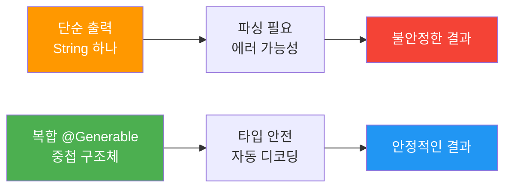
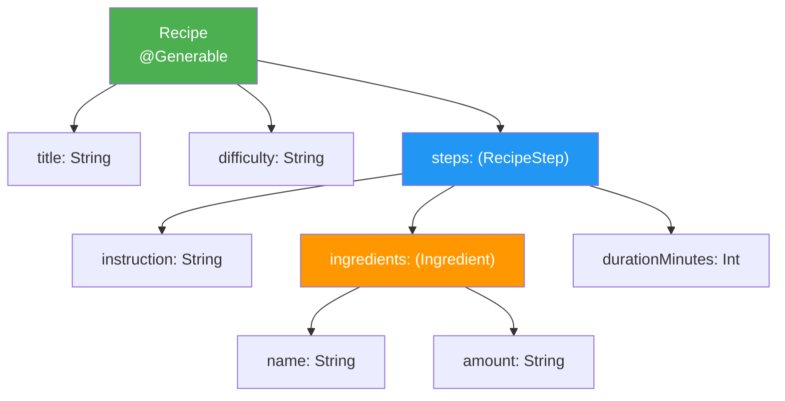
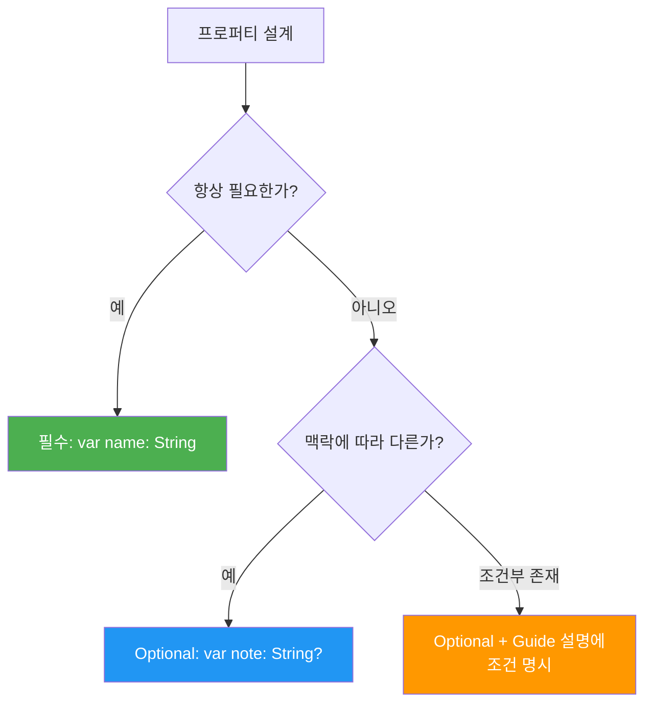
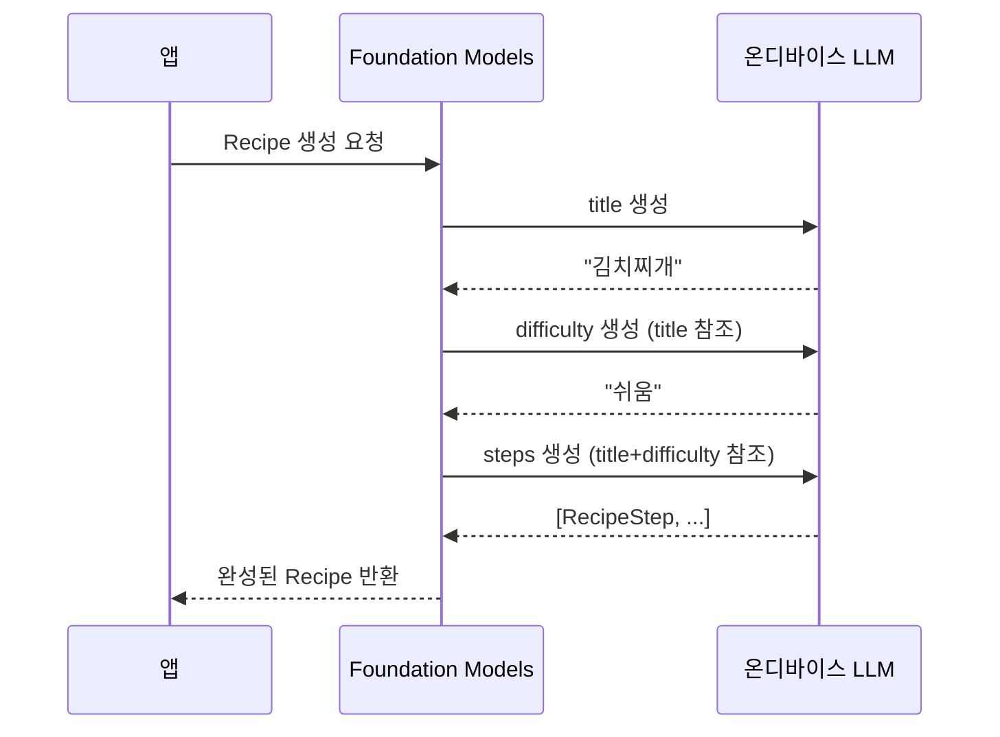
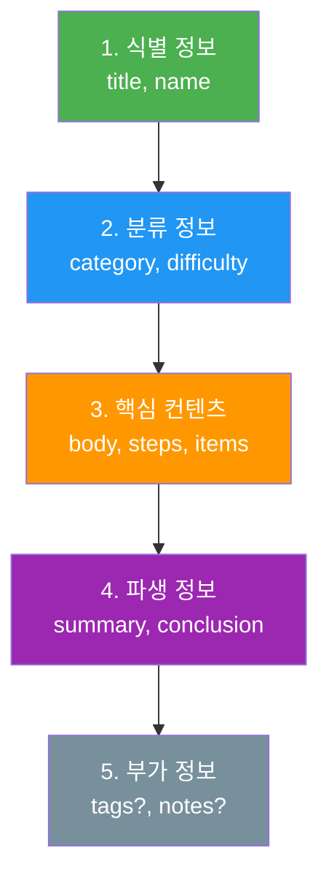
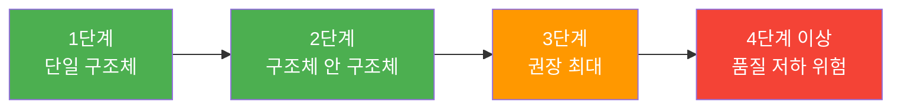
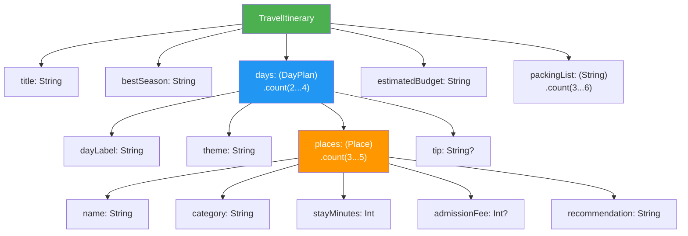

# 복합 구조와 컬렉션 출력

> `@Generable` 구조체를 중첩하고, 배열과 Optional을 조합하여 복잡한 구조화 출력을 설계하는 방법을 알아봅니다.

## 개요

이 섹션에서는 단순한 단일 구조체를 넘어, **중첩 구조체**, **배열 프로퍼티**, **Optional 필드**를 조합하여 실제 앱에서 활용할 수 있는 복합 출력을 설계하는 방법을 다룹니다. 나아가 `@Generable` 타입의 **재사용 패턴**, **중첩 깊이에 따른 품질 트레이드오프**, 그리고 **설계 시 흔히 빠지는 함정**까지 살펴봅니다.

**선수 지식**: [03. 커스텀 타입과 @Generable 매크로](05-generable-구조화-출력/03-커스텀-타입과-generable-매크로.md)에서 배운 `@Generable` 기본 사용법
**학습 목표**:
- `@Generable` 구조체 안에 다른 `@Generable` 구조체를 중첩하는 Composability 패턴 이해
- 배열 프로퍼티의 개수를 `@Guide`로 제어하는 방법 습득
- Optional 프로퍼티를 활용한 유연한 출력 전략 설계
- 프로퍼티 선언 순서가 생성 품질에 미치는 영향 파악
- 동일 `@Generable` 타입을 여러 구조체에서 재사용하는 설계 전략 적용
- 중첩 깊이와 스키마 복잡도가 온디바이스 모델 성능에 미치는 영향 이해

## 왜 알아야 할까?

실제 앱에서 LLM에게 요청하는 출력은 거의 항상 복합적입니다. 여행 일정을 생성한다고 생각해보세요 — 여행 전체 정보 안에 일자별 계획이 있고, 각 일자 안에 장소 목록이 있고, 각 장소에는 선택적으로 맛집 추천이 붙을 수 있죠. 이런 **다층 구조**를 자유 텍스트로 받아서 파싱하면 에러 투성이가 됩니다.

`@Generable`의 진짜 힘은 이런 복합 구조를 **Swift 타입 시스템 그대로** 표현할 수 있다는 점입니다. 컴파일러가 구조를 보장하고, Foundation Models 프레임워크가 그 구조에 맞는 출력을 생성해주니까요.

하지만 자유도가 높은 만큼 설계 실수도 쉽게 발생합니다. 중첩이 너무 깊으면 품질이 떨어지고, Optional과 배열의 조합을 잘못하면 예상치 못한 출력이 나오기도 해요. 이 섹션에서는 "무엇이 가능한가"뿐 아니라 **"어떻게 설계해야 좋은가"**까지 함께 다룹니다.

> 📊 **그림 1**: 단순 출력 vs 복합 구조 출력 비교



## 핵심 개념

### 개념 1: Composability — 구조체 안의 구조체

> 💡 **비유**: 러시아 인형(마트료시카)을 떠올려보세요. 큰 인형을 열면 그 안에 작은 인형이 있고, 또 열면 더 작은 인형이 나옵니다. `@Generable` 구조체도 마찬가지예요 — 하나의 구조체 안에 다른 `@Generable` 구조체를 넣을 수 있고, 그 안에 또 넣을 수 있습니다.

`@Generable` 구조체의 프로퍼티 타입으로 다른 `@Generable` 구조체를 사용할 수 있습니다. 이것이 **Composability**(합성 가능성)입니다.

```swift
import FoundationModels

// 가장 안쪽 구조체
@Generable
struct Ingredient {
    @Guide(description: "재료 이름")
    var name: String

    @Guide(description: "필요한 양 (예: 200g, 2큰술)")
    var amount: String
}

// 중간 구조체 — Ingredient를 포함
@Generable
struct RecipeStep {
    @Guide(description: "조리 단계 설명")
    var instruction: String

    @Guide(description: "이 단계에서 사용하는 재료들")
    var ingredients: [Ingredient]

    @Guide(description: "예상 소요 시간 (분)")
    var durationMinutes: Int
}

// 최상위 구조체 — RecipeStep을 포함
@Generable
struct Recipe {
    @Guide(description: "요리 이름")
    var title: String

    @Guide(description: "난이도: 쉬움, 보통, 어려움")
    var difficulty: String

    @Guide(description: "조리 단계 목록")
    var steps: [RecipeStep]
}
```

핵심 규칙은 간단합니다: **중첩되는 모든 타입에 `@Generable`을 붙여야 한다**는 것이죠. `Recipe` → `RecipeStep` → `Ingredient`까지, 체인의 모든 링크가 `@Generable`이어야 합니다.

> 📊 **그림 2**: @Generable 중첩 구조의 합성 패턴



#### 타입 재사용 — 같은 블록을 여러 곳에서 쓰기

Composability의 진짜 가치는 **같은 `@Generable` 타입을 여러 상위 구조체에서 재사용**할 수 있다는 점입니다. 레고 블록처럼요.

```swift
// 공통 블록: 여러 곳에서 재사용
@Generable
struct Tag {
    @Guide(description: "태그 이름")
    var name: String

    @Guide(description: "태그 카테고리: 장르, 분위기, 난이도")
    var category: String
}

// Recipe에서 Tag 사용
@Generable
struct TaggedRecipe {
    @Guide(description: "요리 이름")
    var title: String

    @Guide(description: "관련 태그", .count(2...4))
    var tags: [Tag]
}

// BookRecommendation에서도 같은 Tag 사용
@Generable
struct BookRecommendation {
    @Guide(description: "책 제목")
    var title: String

    @Guide(description: "추천 태그", .count(1...3))
    var tags: [Tag]
}
```

내부적으로 `@Generable` 매크로가 생성하는 스키마에서 `Tag`의 정의는 한 번만 존재하고, `TaggedRecipe`와 `BookRecommendation` 양쪽에서 **참조**됩니다. JSON Schema의 `$ref`와 비슷한 방식이죠. 덕분에 스키마 크기가 불필요하게 커지지 않습니다.

### 개념 2: 배열 개수 제어 — .count()로 범위 지정

> 💡 **비유**: 식당에서 "반찬 3~5개 주세요"라고 말하는 것과 같습니다. 정확히 몇 개인지는 셰프(LLM)에게 맡기되, 최소한과 최대한의 범위는 지정하는 거죠.

배열 프로퍼티에 `@Guide`를 쓸 때, `.count()` 수정자로 원소 개수의 범위를 지정할 수 있습니다.

```swift
@Generable
struct TravelDay {
    @Guide(description: "방문할 장소 목록", .count(2...5))
    var places: [String]

    @Guide(description: "식사 추천", .count(3))
    var meals: [String]  // 정확히 3개 (아침, 점심, 저녁)
}
```

`.count()`에 사용할 수 있는 패턴들을 정리하면:

| 문법 | 의미 | 예시 |
|------|------|------|
| `.count(3)` | 정확히 N개 | 식사 3끼 |
| `.count(2...5)` | 최소~최대 | 장소 2~5곳 |
| `.count(1...4)` | 최소 1개 보장 | 최소 1개 팁 |
| `.count(0...3)` | 0개도 허용 | 선택적 주의사항 |

> ⚠️ **흔한 오해**: `.count()`를 지정하지 않으면 LLM이 자유롭게 개수를 결정합니다. 빈 배열(`[]`)이 올 수도 있고, 수십 개가 올 수도 있어요. 앱에서 배열 크기에 의존하는 UI가 있다면, 반드시 `.count()`로 범위를 제한하세요.

```run:swift
// 배열 개수 제어 데모
import FoundationModels

@Generable
struct QuizQuestion {
    @Guide(description: "문제")
    var question: String

    @Guide(description: "선택지", .count(4))
    var options: [String]  // 항상 4개

    @Guide(description: "정답 번호 (1~4)")
    var correctAnswer: Int
}

let session = LanguageModelSession()
let quiz = try await session.respond(
    to: "Swift의 Optional에 대한 퀴즈 문제 1개를 만들어주세요",
    generating: QuizQuestion.self
)
print("문제: \(quiz.question)")
print("선택지 수: \(quiz.options.count)")
for (i, option) in quiz.options.enumerated() {
    print("  \(i+1). \(option)")
}
print("정답: \(quiz.correctAnswer)번")
```

```output
문제: Swift에서 nil을 허용하는 타입을 선언할 때 사용하는 키워드는?
선택지 수: 4
  1. Optional
  2. Nullable
  3. Maybe
  4. Undefined
정답: 1번
```

#### .count()와 중첩 배열의 조합

실전에서는 배열 안에 `@Generable` 타입이 들어가고, 그 안에 또 배열이 있는 경우가 많습니다. 이때 **각 레벨마다** `.count()`를 지정해야 출력 크기를 예측할 수 있어요.

```swift
@Generable
struct CourseOutline {
    @Guide(description: "강의 제목")
    var title: String

    // 챕터 3~6개, 각 챕터 안에 섹션 2~4개 → 최대 24개 섹션
    @Guide(description: "챕터 목록", .count(3...6))
    var chapters: [Chapter]
}

@Generable
struct Chapter {
    @Guide(description: "챕터 제목")
    var title: String

    @Guide(description: "섹션 제목 목록", .count(2...4))
    var sections: [String]
}
```

> 🔥 **실무 팁**: 중첩 배열의 총 원소 수를 미리 계산해보세요. `.count(3...6)` × `.count(2...4)` = 최대 24개 섹션입니다. 온디바이스 모델은 컨텍스트 윈도우가 제한적이라, 이론적 최대 원소 수가 수백 개를 넘어가면 생성 품질이 급격히 떨어집니다. **총 리프 노드 50개 이하**를 권장합니다.

### 개념 3: Optional 프로퍼티 전략

> 💡 **비유**: 이력서를 생각해보세요. 이름과 연락처는 필수지만, 포트폴리오 링크나 추천인은 "있으면 좋고 없어도 되는" 항목이죠. `Optional` 프로퍼티가 바로 이 역할을 합니다.

`@Generable` 구조체에서 `Optional` 타입을 사용하면 LLM이 해당 필드를 채울지 말지를 **맥락에 따라 판단**합니다.

```swift
@Generable
struct MovieReview {
    @Guide(description: "영화 제목")
    var title: String

    @Guide(description: "한 줄 평")
    var summary: String

    @Guide(description: "스포일러가 있는 상세 분석 (스포일러가 없다면 생략)")
    var spoilerAnalysis: String?

    @Guide(description: "속편이 있다면 속편 제목")
    var sequelTitle: String?

    @Guide(description: "추천 관련 영화 목록")
    var relatedMovies: [String]?
}
```

Optional을 효과적으로 사용하는 전략은 다음과 같습니다:

> 📊 **그림 3**: Optional 프로퍼티 결정 흐름



**중요한 팁**: `@Guide`의 `description`에 **언제 nil이어야 하는지** 명확히 적어주세요. "스포일러가 없다면 생략"처럼 구체적으로 조건을 명시하면 LLM이 더 정확하게 판단합니다.

Optional 배열(`[String]?`)과 빈 배열(`[String]` + `.count(0...N)`)의 차이도 이해해야 합니다:

| 패턴 | nil 가능 | 빈 배열 가능 | 용도 |
|------|---------|-------------|------|
| `var items: [String]` | X | O | 항상 존재, 0개 이상 |
| `var items: [String]?` | O | O | 카테고리 자체가 불필요할 수 있음 |
| `@Guide(.count(1...5)) var items: [String]` | X | X | 최소 1개 보장 |

#### Optional 중첩 구조체 — 조건부 서브섹션

Optional은 단순 타입뿐 아니라 `@Generable` 구조체에도 적용할 수 있습니다. 이를 통해 **조건에 따라 통째로 포함되거나 생략되는 서브 구조**를 표현할 수 있어요.

```swift
@Generable
struct NutritionInfo {
    @Guide(description: "칼로리 (kcal)")
    var calories: Int

    @Guide(description: "알레르기 유발 성분 목록", .count(0...5))
    var allergens: [String]
}

@Generable
struct MenuItem {
    @Guide(description: "메뉴 이름")
    var name: String

    @Guide(description: "가격 (원)")
    var price: Int

    @Guide(description: "영양 정보 (건강 관련 메뉴인 경우에만 포함)")
    var nutrition: NutritionInfo?  // 구조체 통째로 Optional
}
```

이 패턴은 매우 강력하지만, LLM이 Optional `@Generable` 구조체를 **nil로 판단하는 기준이 모호**해질 수 있습니다. `@Guide` description에 "~인 경우에만 포함"이라고 명확한 조건을 적는 것이 핵심이에요.

### 개념 4: 프로퍼티 선언 순서의 영향

> 💡 **비유**: 에세이를 쓸 때 "제목 → 서론 → 본론 → 결론" 순서로 쓰는 게 자연스럽듯, LLM도 구조체의 프로퍼티를 **위에서 아래로 순서대로** 생성합니다. 먼저 생성된 값이 뒤의 값에 영향을 주죠.

Foundation Models 프레임워크는 `@Generable` 구조체의 프로퍼티를 **선언 순서대로** 생성합니다. 이는 Constrained Decoding 방식의 특성인데요, 앞서 생성된 토큰이 뒤의 토큰 생성에 컨텍스트로 작용합니다.

```swift
// 좋은 순서 — 큰 틀에서 세부사항으로
@Generable
struct BlogPost {
    @Guide(description: "블로그 글 제목")
    var title: String           // 1. 먼저 제목을 정하고

    @Guide(description: "핵심 주장을 한 문장으로")
    var thesis: String          // 2. 핵심 주장을 세우고

    @Guide(description: "본문 단락들")
    var paragraphs: [String]    // 3. 그에 맞는 본문을 쓰고

    @Guide(description: "한 줄 결론")
    var conclusion: String      // 4. 마지막으로 결론
}
```

```swift
// 나쁜 순서 — 결론부터 쓰고 제목을 나중에
@Generable
struct BlogPostBad {
    var conclusion: String      // 결론을 먼저?
    var paragraphs: [String]    // 본문을 그 다음?
    var title: String           // 제목이 마지막이면 일관성 떨어짐
}
```

> 📊 **그림 4**: 프로퍼티 선언 순서와 생성 품질의 관계



이 순차적 생성 특성 때문에 **논리적으로 앞에 와야 할 정보를 먼저 선언**하는 것이 중요합니다.

#### 선언 순서의 실전 가이드라인

단순히 "큰 것 먼저"가 아니라, 좀 더 구체적인 원칙이 있습니다:

| 순서 | 원칙 | 예시 |
|------|------|------|
| 1 | **식별 정보** 먼저 | 제목, 이름, ID |
| 2 | **분류/메타데이터** | 카테고리, 난이도, 타입 |
| 3 | **핵심 컨텐츠** | 본문, 설명, 단계 목록 |
| 4 | **파생/요약 정보** | 결론, 점수, 한 줄 요약 |
| 5 | **부가/선택 정보** | Optional 필드, 부가 태그 |

> 📊 **그림 5**: 프로퍼티 선언 순서 전략



이 순서는 LLM이 "문맥 누적"을 통해 점점 구체적인 내용을 생성하는 자연스러운 흐름과 일치합니다. 특히 **분류 정보를 핵심 컨텐츠보다 앞에** 두면, LLM이 "어떤 종류의 컨텐츠를 생성해야 하는지" 먼저 파악하고 본문을 쓰기 때문에 일관성이 크게 향상됩니다.

### 개념 5: 중첩 깊이와 스키마 복잡도 관리

> 💡 **비유**: 회사 조직도가 10단계로 깊으면 의사결정이 느려지듯, `@Generable` 중첩이 깊어질수록 모델이 생성해야 할 스키마 트리가 커져서 품질 저하가 발생합니다.

온디바이스 모델은 클라우드 모델보다 컨텍스트 윈도우와 추론 능력이 제한적입니다. 중첩 깊이가 깊어질수록 모델이 추적해야 할 구조적 제약이 기하급수적으로 늘어나기 때문에, **실용적인 한계선**을 알아두는 것이 중요합니다.

> 📊 **그림 6**: 중첩 깊이에 따른 생성 품질 트레이드오프



| 깊이 | 총 프로퍼티 수(목안) | 품질 | 권장 여부 |
|------|---------------------|------|-----------|
| 1단계 | ~8개 | 우수 | O |
| 2단계 | ~20개 | 양호 | O |
| 3단계 | ~40개 | 보통 | 주의하여 사용 |
| 4단계+ | 50개+ | 저하 위험 | 구조 분할 권장 |

3단계를 넘어야 할 때는 **한 번의 요청으로 모두 생성하지 말고**, 2단계 구조를 두 번 호출하여 조합하는 전략이 더 안정적입니다.

```swift
// 4단계 중첩 대신 → 2단계 + 2단계로 분할
// 1차 호출: 상위 구조
let outline = try await session.respond(
    to: "여행 일정 개요를 만들어주세요",
    generating: TripOutline.self  // 2단계
)

// 2차 호출: 각 일자별 상세 (outline 결과를 프롬프트에 포함)
for day in outline.days {
    let detail = try await session.respond(
        to: "\(day.theme)에 맞는 상세 일정을 만들어주세요",
        generating: DayDetail.self  // 2단계
    )
}
```

## 더 깊이 알아보기: Constrained Decoding의 계보

구조화 출력의 핵심 기술인 **Constrained Decoding**은 흥미로운 역사를 갖고 있습니다.

2023년, Microsoft의 **Guidance** 라이브러리가 LLM 출력을 정규식이나 문법으로 제한하는 아이디어를 대중화했습니다. 곧이어 오픈소스 진영에서 **Outlines**(2023)가 유한 상태 기계(FSM) 기반의 구조화 생성을 구현했고, llama.cpp 커뮤니티에서는 **GBNF**(GGML BNF) 문법으로 로컬 LLM의 출력을 JSON Schema에 맞게 강제하는 방법을 개발했습니다.

Apple의 `@Generable`은 이 계보의 최신 진화입니다. Swift 매크로 시스템을 활용하여 **컴파일 타임에 스키마를 생성**하고, 온디바이스 모델의 디코딩 과정에서 해당 스키마를 강제합니다. 개발자가 BNF 문법이나 JSON Schema를 직접 작성할 필요 없이, 평소 쓰던 Swift 구조체 선언만으로 Constrained Decoding의 혜택을 받을 수 있게 된 거죠.

> 💡 **알고 계셨나요?**: Constrained Decoding은 "생성 후 검증"이 아니라 **"생성 중 제약"**입니다. LLM이 다음 토큰을 고를 때, 스키마에 맞지 않는 토큰의 확률을 0으로 마스킹합니다. 그래서 잘못된 구조의 출력이 아예 나올 수 없어요 — 파싱 에러가 원천 차단되는 셈이죠.

## 실습: 여행 일정 생성기

3단계 중첩 구조와 Optional, 배열 개수 제어를 모두 활용하는 여행 일정 생성기를 만들어봅시다.

```swift
import FoundationModels

// 1단계: 가장 안쪽 — 장소 정보
@Generable
struct Place {
    @Guide(description: "장소 이름")
    var name: String

    @Guide(description: "장소 유형: 관광지, 식당, 카페, 쇼핑")
    var category: String

    @Guide(description: "예상 체류 시간 (분)")
    var stayMinutes: Int

    @Guide(description: "입장료가 있다면 가격 (원), 무료면 생략")
    var admissionFee: Int?

    @Guide(description: "한 줄 추천 이유")
    var recommendation: String
}

// 2단계: 중간 — 하루 일정
@Generable
struct DayPlan {
    @Guide(description: "몇째 날인지 (예: 1일차)")
    var dayLabel: String

    @Guide(description: "그 날의 테마 (예: 역사 탐방, 미식 투어)")
    var theme: String

    @Guide(description: "방문할 장소 목록", .count(3...5))
    var places: [Place]

    @Guide(description: "그 날의 팁이나 주의사항 (없으면 생략)")
    var tip: String?
}

// 3단계: 최상위 — 전체 여행
@Generable
struct TravelItinerary {
    @Guide(description: "여행 제목")
    var title: String

    @Guide(description: "추천 여행 시기")
    var bestSeason: String

    @Guide(description: "일자별 계획", .count(2...4))
    var days: [DayPlan]

    @Guide(description: "전체 예상 경비 (만원 단위)")
    var estimatedBudget: String

    @Guide(description: "짐 싸기 체크리스트", .count(3...6))
    var packingList: [String]
}
```

이 구조를 실행하면:

```run:swift
let session = LanguageModelSession()
let itinerary = try await session.respond(
    to: "제주도 2박 3일 가족 여행 일정을 만들어주세요",
    generating: TravelItinerary.self
)

print("📍 \(itinerary.title)")
print("🌤 추천 시기: \(itinerary.bestSeason)")
print("💰 예상 경비: \(itinerary.estimatedBudget)")
print("")
for day in itinerary.days {
    print("[\(day.dayLabel)] \(day.theme)")
    for place in day.places {
        let fee = place.admissionFee.map { "₩\($0)" } ?? "무료"
        print("  - \(place.name) (\(place.category), \(place.stayMinutes)분, \(fee))")
    }
    if let tip = day.tip {
        print("  💡 \(tip)")
    }
}
print("\n🎒 준비물: \(itinerary.packingList.joined(separator: ", "))")
```

```output
📍 제주도 가족 힐링 여행 2박 3일
🌤 추천 시기: 5월 또는 10월
💰 예상 경비: 약 80만원

[1일차] 동쪽 해안 자연 탐방
  - 성산일출봉 (관광지, 90분, ₩5000)
  - 섭지코지 (관광지, 60분, 무료)
  - 해녀의집 (식당, 60분, 무료)
  - 만장굴 (관광지, 50분, ₩4000)
  💡 성산일출봉은 오전 일찍 방문해야 덜 붐빕니다
[2일차] 서귀포 미식 투어
  - 천지연폭포 (관광지, 40분, ₩2500)
  - 이중섭거리 (카페, 60분, 무료)
  - 올레시장 (식당, 90분, 무료)
  - 주상절리대 (관광지, 30분, ₩2000)
[3일차] 제주시 문화와 쇼핑
  - 제주민속자연사박물관 (관광지, 60분, ₩3000)
  - 동문시장 (쇼핑, 90분, 무료)
  - 용두암 (관광지, 30분, 무료)
  💡 동문시장에서 귤 선물세트를 사면 공항보다 저렴합니다

🎒 준비물: 자외선 차단제, 편한 운동화, 우비, 수건, 카메라
```

> 📊 **그림 7**: 여행 일정 생성기의 데이터 구조



### 실전 응용: 스키마 분할로 품질 높이기

위 여행 일정을 더 정교하게 만들고 싶다면, 한 번에 모든 걸 생성하기보다 **2단계 호출**로 분할하는 전략을 적용해볼 수 있습니다.

```swift
// 1단계: 간단한 골격만 생성
@Generable
struct TripSkeleton {
    @Guide(description: "여행 제목")
    var title: String

    @Guide(description: "일자별 테마", .count(2...4))
    var dayThemes: [String]

    @Guide(description: "전체 예산 (만원)")
    var budget: String
}

// 2단계: 각 날짜별 상세 일정을 별도 호출로 생성
@Generable
struct DetailedDay {
    @Guide(description: "방문 장소", .count(3...5))
    var places: [Place]

    @Guide(description: "이동 동선 요약")
    var routeSummary: String

    @Guide(description: "주의사항")
    var tip: String?
}

// 사용
let skeleton = try await session.respond(
    to: "제주도 3일 여행 골격을 잡아주세요",
    generating: TripSkeleton.self
)

// 각 날짜를 별도로 생성 → 더 풍부한 결과
for theme in skeleton.dayThemes {
    let dayDetail = try await session.respond(
        to: "제주도 '\(theme)' 테마로 하루 일정을 만들어주세요",
        generating: DetailedDay.self
    )
    // dayDetail 활용...
}
```

이 접근법은 한 번에 3단계 중첩을 생성하는 것보다 각 `DetailedDay`의 품질이 높아집니다. 모델이 한 번에 추적해야 할 스키마 복잡도가 줄어들기 때문이죠.

## 흔한 오해와 팁

> ⚠️ **흔한 오해**: "중첩이 깊을수록 좋다"고 생각하기 쉽지만, 온디바이스 모델의 컨텍스트 윈도우는 제한적입니다. 3단계를 넘어가는 깊은 중첩은 생성 품질이 저하될 수 있어요. 구조가 복잡해질수록 `@Guide`의 description을 더 구체적으로 적어주세요.

> ⚠️ **흔한 오해**: Optional 배열(`[String]?`)과 빈 배열이 허용된 필수 배열(`[String]`)을 혼동하는 경우가 많습니다. `[String]?`은 **필드 자체가 없을 수 있다**는 의미이고, `[String]`은 **필드는 항상 있지만 빈 배열일 수 있다**는 의미입니다. UI에서 "해당 섹션을 아예 숨길지" vs "빈 상태 메시지를 보여줄지"에 따라 적절히 선택하세요.

> 🔥 **실무 팁**: 복합 구조를 설계할 때 "**밖에서 안으로**" 접근하세요. 먼저 최상위 구조체에 어떤 필드가 필요한지 정하고, 그 중 복합 타입이 필요한 것만 별도 `@Generable` 구조체로 분리합니다. 처음부터 세밀한 구조를 만들면 과도하게 복잡해지기 쉽습니다.

> 🔥 **실무 팁**: 프로퍼티 선언 순서를 바꾸는 것만으로 생성 품질이 크게 달라질 수 있습니다. 기대한 결과가 나오지 않을 때, 코드 로직을 바꾸기 전에 **프로퍼티 순서부터 점검**해보세요. 비용이 0인 최적화입니다.

> 💡 **알고 계셨나요?**: `@Generable`은 `@Generable` 프로토콜을 자동으로 합성하면서 내부적으로 JSON Schema 비슷한 스키마를 생성합니다. 중첩 구조체는 `$ref`로 참조되는 것처럼 재귀적으로 스키마가 확장되는데, 이 덕분에 같은 `@Generable` 타입을 여러 곳에서 재사용할 수 있습니다. 예를 들어 `Ingredient` 구조체를 `Recipe`와 `ShoppingList` 양쪽에서 쓸 수 있어요.

## 핵심 정리

| 개념 | 설명 |
|------|------|
| Composability | `@Generable` 안에 다른 `@Generable`을 중첩하여 복합 구조 표현 |
| 타입 재사용 | 같은 `@Generable` 타입을 여러 상위 구조체에서 `$ref`처럼 공유 |
| `.count()` | 배열 프로퍼티의 원소 개수를 범위(`2...5`) 또는 정확한 수(`4`)로 제어 |
| Optional 전략 | `String?` 등으로 맥락에 따라 생략 가능한 필드 설계, description에 조건 명시 |
| Optional 구조체 | `@Generable` 타입 자체를 Optional로 선언하여 조건부 서브섹션 표현 |
| 선언 순서 | 식별→분류→본문→요약→부가 순으로 선언하면 생성 품질 향상 |
| 중첩 깊이 제한 | 3단계, 총 리프 50개 이하 권장. 초과 시 스키마 분할 호출 전략 사용 |

## 다음 섹션 미리보기

지금까지 구조체 안에 구조체를 넣는 방법을 배웠는데요, 다음 섹션 [05. 생성 제어와 토큰 제한](05-generable-구조화-출력/05-생성-제어와-토큰-제한.md)에서는 이런 복합 구조의 생성 과정을 **제어**하는 방법을 다룹니다. 토큰 제한, 생성 중단, 스트리밍 등 실제 앱에서 사용자 경험을 지키기 위한 기법들을 알아봅시다.

## 참고 자료

- [Apple Foundation Models 공식 문서 — @Generable](https://developer.apple.com/documentation/foundationmodels/generable) - `@Generable` 매크로의 공식 API 레퍼런스
- [WWDC25 — Meet the Foundation Models Framework](https://developer.apple.com/videos/play/wwdc2025/10604/) - 구조화 출력 설계 패턴을 라이브 데모로 확인
- [Outlines: Structured Text Generation](https://github.com/dottxt-ai/outlines) - Constrained Decoding의 오픈소스 구현체, 원리 이해에 유용
- [Guidance by Microsoft](https://github.com/guidance-ai/guidance) - 구조화 생성의 선구자적 라이브러리