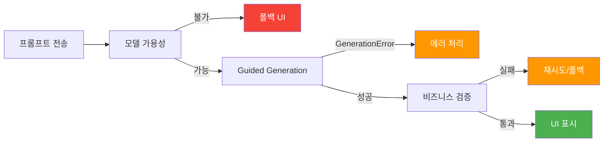
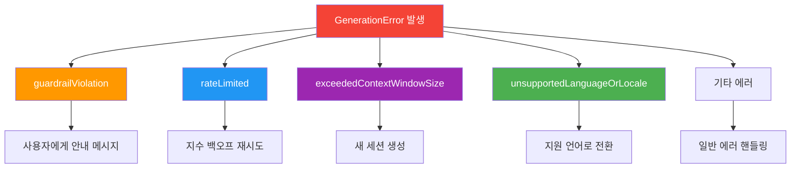
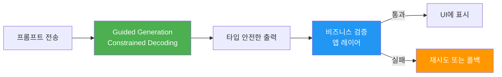
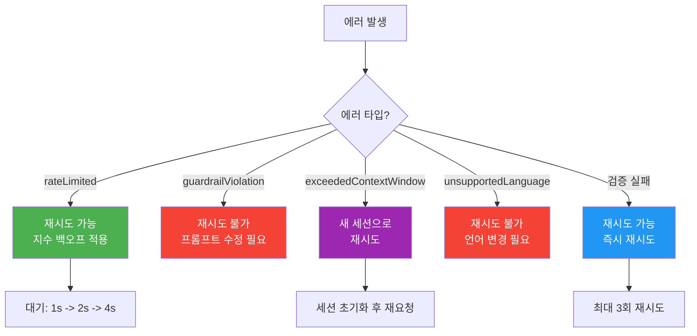
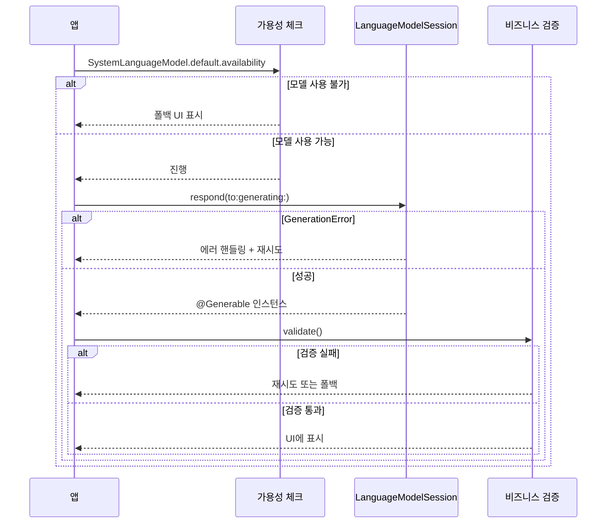
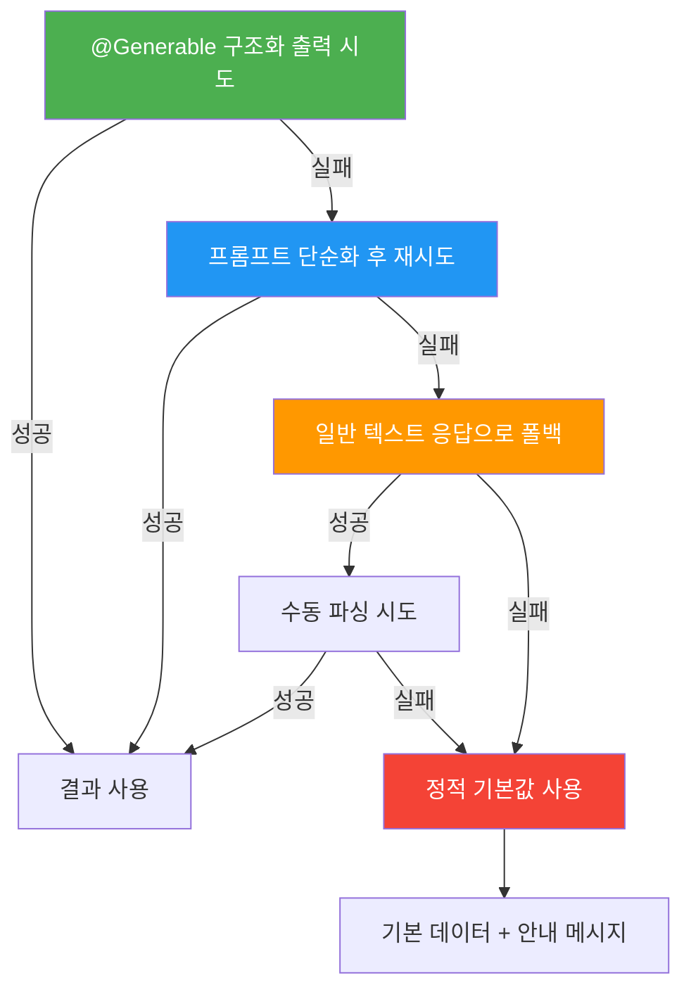

# 05. 구조화 출력의 에러 처리와 검증

> @Generable 구조화 출력에서 발생할 수 있는 에러를 체계적으로 처리하고, 출력을 검증하며, 안정적인 재시도 전략을 구축합니다.

## 개요

이 섹션에서는 Foundation Models의 구조화 출력(`@Generable`)을 프로덕션 환경에서 안정적으로 운용하기 위한 에러 처리와 검증 전략을 학습합니다. 모델이 항상 완벽한 출력을 보장하지는 않기 때문에, 실패에 대비하는 방어적 프로그래밍이 필수입니다.

**선수 지식**: [Guided Generation 개념과 동작 원리](05-ch5-generable-구조화-출력/01-01-guided-generation-개념과-동작-원리.md)에서 배운 Constrained Decoding 원리, [@Guide 매크로로 출력 품질 높이기](05-ch5-generable-구조화-출력/03-03-guide-매크로로-출력-품질-높이기.md)의 제약 조건, [복합 구조와 컬렉션 출력](05-ch5-generable-구조화-출력/04-04-복합-구조와-컬렉션-출력.md)에서 다룬 중첩 구조 패턴

**학습 목표**:
- `LanguageModelSession.GenerationError`의 모든 케이스를 이해하고 적절히 처리한다
- 구조화 출력의 비즈니스 로직 검증 레이어를 설계한다
- 재시도 전략과 폴백(fallback) 패턴을 구현한다
- 에러 처리를 SwiftUI와 연동하여 사용자 친화적 UX를 제공한다

## 왜 알아야 할까?

여러분이 레스토랑에서 주문한 음식이 나왔는데 생각해보세요. 주문 자체가 거부될 수도 있고(가드레일 위반), 주방이 너무 바빠서 잠시 기다려야 할 수도 있고(속도 제한), 메뉴판에 없는 걸 시켰을 수도 있고(언어 미지원), 혹은 음식이 나왔는데 맛이 기대와 다를 수도 있죠(출력 품질 미달).

AI 모델도 마찬가지입니다. `@Generable`의 Guided Generation이 아무리 강력해도, 네트워크 상태, 컨텍스트 윈도우 한계, 안전 가드레일, 속도 제한 등 **다양한 이유로 실패할 수 있습니다**. 앱이 크래시 없이 우아하게 이런 상황을 처리해야 사용자 신뢰를 얻을 수 있거든요.

특히 구조화 출력은 일반 텍스트 응답과 달리, **모델이 생성한 값이 비즈니스 규칙을 충족하는지** 추가 검증이 필요합니다. @Guide의 `.range(1...5)`가 물리적으로 범위를 제약하더라도, "별점 3 이상만 추천 목록에 표시"같은 비즈니스 로직은 앱 레이어에서 검증해야 하죠.

> 📊 **그림 1**: 구조화 출력 요청에서 발생할 수 있는 실패 지점



## 핵심 개념

### 개념 1: GenerationError의 모든 케이스

> 💡 **비유**: GenerationError는 택배 배송의 실패 사유서 같습니다. "수취인 부재"(가드레일 위반), "배송 과부하"(속도 제한), "주소 오류"(언어 미지원), "상자 크기 초과"(컨텍스트 윈도우 초과) — 각각 다른 대응이 필요하죠.

`LanguageModelSession`의 `respond(to:generating:)` 메서드는 `async throws`로 선언되어 있습니다. 에러가 발생하면 `GenerationError` 타입으로 던져지는데, 이 에러에는 5가지 주요 케이스가 있습니다.

> 📊 **그림 2**: GenerationError 케이스별 분류와 대응 전략



각 케이스를 하나씩 살펴볼까요?

**1. `guardrailViolation`** — Apple의 안전 가드레일에 걸린 경우입니다. 프롬프트나 모델 응답에 부적절한 콘텐츠가 감지되면 발생합니다. 이 가드레일은 비활성화할 수 없으며, Apple이 기본으로 적용하는 보안 레이어입니다.

**2. `rateLimited`** — 각 `LanguageModelSession` 인스턴스는 한 번에 하나의 요청만 처리할 수 있습니다. 이전 요청이 완료되기 전에 새 요청을 보내면 이 에러가 발생합니다. 또한 앱이 백그라운드로 전환되면 시스템이 포그라운드 앱을 우선하면서 발생할 수도 있습니다.

**3. `exceededContextWindowSize`** — 세션의 컨텍스트 윈도우(4,096 토큰)를 초과했을 때 발생합니다. 멀티턴 대화에서 누적된 히스토리가 한계에 도달하면 이 에러를 만나게 됩니다.

**4. `unsupportedLanguageOrLocale`** — 모델이 지원하지 않는 언어로 응답을 요청했을 때 발생합니다. Apple의 온디바이스 모델은 현재 16개 언어를 지원합니다.

**5. `Refusal`** — 모델이 특정 요청을 거부한 경우의 상세 정보를 담는 연관 타입입니다.

```swift
import FoundationModels

func handleGenerationError(_ error: LanguageModelSession.GenerationError) -> String {
    switch error {
    case .guardrailViolation(let details):
        // 가드레일 위반 — 프롬프트를 수정하거나 사용자에게 안내
        return "요청하신 내용을 처리할 수 없습니다. 다른 질문을 시도해주세요."
        
    case .rateLimited(let retryInfo):
        // 속도 제한 — 잠시 후 재시도
        return "잠시 후 다시 시도해주세요."
        
    case .exceededContextWindowSize(let details):
        // 컨텍스트 초과 — 새 세션 시작 필요
        return "대화가 너무 길어졌습니다. 새로운 대화를 시작합니다."
        
    case .unsupportedLanguageOrLocale(let locale):
        // 언어 미지원 — 지원 언어로 안내
        return "현재 해당 언어는 지원되지 않습니다."
        
    @unknown default:
        // 향후 추가될 에러 케이스 대비
        return "알 수 없는 오류가 발생했습니다."
    }
}
```

> ⚠️ **흔한 오해**: "Guided Generation은 타입 안전하니까 에러 처리 안 해도 되겠지?" — Constrained Decoding이 **출력 형식**은 보장하지만, 네트워크, 가드레일, 컨텍스트 한계 같은 **인프라 에러**는 별도 처리가 반드시 필요합니다.

### 개념 2: 구조화 출력의 비즈니스 검증

> 💡 **비유**: Guided Generation이 "포장 규격"을 맞춰주는 거라면, 비즈니스 검증은 "내용물 품질 검사"입니다. 상자 크기(타입)는 맞지만 안에 든 물건(값)이 기대에 부합하는지는 별도로 확인해야 하죠.

`@Guide`의 `.range()`나 `.count()`가 **디코딩 레벨**에서 값을 제약하지만, 모든 비즈니스 규칙을 커버하지는 못합니다. 예를 들어 "배열의 요소가 중복되면 안 된다"거나 "총합이 100이어야 한다" 같은 교차 필드 제약은 앱 레이어에서 검증해야 합니다.

> 📊 **그림 3**: 2단계 검증 아키텍처 — Constrained Decoding + 비즈니스 검증



검증 프로토콜을 정의해서 체계적으로 접근해봅시다. 아래의 `GeneratedOutputValidatable`과 `ValidationResult`는 **우리가 직접 만드는 커스텀 헬퍼 타입**입니다. Foundation Models 프레임워크에 포함된 API가 아니라, 비즈니스 검증 패턴을 깔끔하게 구조화하기 위해 설계하는 앱 레벨 추상화입니다:

```swift
import FoundationModels

// MARK: - 검증 프로토콜 (커스텀 — Foundation Models API가 아님)
/// 구조화 출력의 비즈니스 규칙 검증을 위해 우리가 정의하는 프로토콜
protocol GeneratedOutputValidatable {
    /// 비즈니스 규칙에 따라 출력을 검증
    func validate() -> ValidationResult
}

/// 검증 결과를 표현하는 열거형 (커스텀)
enum ValidationResult {
    case valid
    case invalid(reasons: [String])
    
    var isValid: Bool {
        if case .valid = self { return true }
        return false
    }
}

// MARK: - 예시: 레시피 추천 출력 검증
@Generable
struct RecipeRecommendation {
    @Guide(description: "추천 레시피 이름")
    var name: String
    
    @Guide(description: "난이도 1-5", .range(1...5))
    var difficulty: Int
    
    @Guide(description: "예상 조리 시간(분)", .range(5...180))
    var cookingTimeMinutes: Int
    
    @Guide(description: "필요한 재료 목록", .count(3...10))
    var ingredients: [String]
    
    @Guide(description: "조리 단계", .count(3...15))
    var steps: [String]
}

// MARK: - 비즈니스 검증 구현
extension RecipeRecommendation: GeneratedOutputValidatable {
    func validate() -> ValidationResult {
        var reasons: [String] = []
        
        // 이름이 비어있지 않은지 확인
        if name.trimmingCharacters(in: .whitespacesAndNewlines).isEmpty {
            reasons.append("레시피 이름이 비어 있습니다")
        }
        
        // 재료 중복 검사
        let uniqueIngredients = Set(ingredients.map { $0.lowercased() })
        if uniqueIngredients.count != ingredients.count {
            reasons.append("중복된 재료가 있습니다")
        }
        
        // 조리 단계가 논리적 순서인지 (첫 단계에 "완성"이 오면 안 됨)
        if let first = steps.first, first.contains("완성") || first.contains("서빙") {
            reasons.append("조리 단계의 순서가 비정상입니다")
        }
        
        return reasons.isEmpty ? .valid : .invalid(reasons: reasons)
    }
}
```

이렇게 하면 `@Guide`가 보장하는 타입/범위 제약 위에, 비즈니스 로직 검증을 깔끔하게 쌓을 수 있습니다. `GeneratedOutputValidatable` 프로토콜을 채택하는 것은 선택이지만, 여러 `@Generable` 타입에 일관된 검증 패턴을 적용하려면 이런 추상화가 유용합니다.

### 개념 3: 재시도 전략과 지수 백오프

> 💡 **비유**: 전화를 걸었는데 통화 중이면 어떻게 하시나요? 바로 다시 걸면 또 통화 중이겠죠. 30초 기다렸다가, 안 되면 1분, 그래도 안 되면 2분... 이게 바로 **지수 백오프(exponential backoff)** 전략입니다.

모든 에러가 재시도 가능한 건 아닙니다. `guardrailViolation`은 프롬프트를 바꾸지 않는 한 같은 결과가 나오고, `unsupportedLanguageOrLocale`도 언어를 바꿔야 합니다. 반면 `rateLimited`는 시간이 지나면 해결되고, 비즈니스 검증 실패는 재생성으로 더 나은 결과를 얻을 수 있습니다.

> 📊 **그림 4**: 에러 타입별 재시도 가능 여부 판단 흐름



아래의 `RetryStrategy`, `GenerationRetrier`, `ValidationError`, `GenerationFailure`는 모두 **우리가 직접 설계하는 커스텀 타입**입니다. Foundation Models 프레임워크는 `GenerationError`만 제공하고, 재시도 로직은 개발자가 앱 요구사항에 맞게 직접 구현해야 합니다:

```swift
import FoundationModels

// MARK: - 재시도 전략 정의 (커스텀 — 앱 레벨 설계)
/// 에러 타입에 따른 재시도 가능 여부를 판단하는 열거형
enum RetryStrategy {
    case retryWithBackoff(maxAttempts: Int, baseDelay: TimeInterval)
    case retryWithNewSession
    case noRetry(userMessage: String)
    
    /// GenerationError에 따른 전략 결정
    static func strategy(
        for error: LanguageModelSession.GenerationError
    ) -> RetryStrategy {
        switch error {
        case .rateLimited:
            return .retryWithBackoff(maxAttempts: 3, baseDelay: 1.0)
        case .exceededContextWindowSize:
            return .retryWithNewSession
        case .guardrailViolation:
            return .noRetry(userMessage: "요청하신 내용을 처리할 수 없습니다.")
        case .unsupportedLanguageOrLocale:
            return .noRetry(userMessage: "지원되지 않는 언어입니다.")
        @unknown default:
            return .noRetry(userMessage: "알 수 없는 오류가 발생했습니다.")
        }
    }
}

// MARK: - 지수 백오프를 포함한 재시도 실행기 (커스텀)
actor GenerationRetrier {
    private var session: LanguageModelSession
    
    init(session: LanguageModelSession) {
        self.session = session
    }
    
    /// 구조화 출력 생성을 재시도 로직과 함께 실행
    func generate<T: Generable>(
        prompt: String,
        type: T.Type,
        maxAttempts: Int = 3,
        validate: ((T) -> ValidationResult)? = nil
    ) async throws -> T {
        var lastError: Error?
        
        for attempt in 0..<maxAttempts {
            do {
                // 구조화 출력 요청
                let response = try await session.respond(
                    to: prompt,
                    generating: T.self
                )
                let output = response.content
                
                // 비즈니스 검증 (선택)
                if let validate {
                    let result = validate(output)
                    switch result {
                    case .valid:
                        return output
                    case .invalid(let reasons):
                        // 검증 실패 시 로그 후 재시도
                        print("검증 실패 (시도 \(attempt + 1)): \(reasons)")
                        lastError = ValidationError.businessRuleViolation(reasons)
                        continue
                    }
                }
                
                return output
                
            } catch let error as LanguageModelSession.GenerationError {
                let strategy = RetryStrategy.strategy(for: error)
                
                switch strategy {
                case .retryWithBackoff(let max, let baseDelay):
                    if attempt < max - 1 {
                        // 지수 백오프: 1초 → 2초 → 4초...
                        let delay = baseDelay * pow(2.0, Double(attempt))
                        try await Task.sleep(for: .seconds(delay))
                        continue
                    }
                    throw error
                    
                case .retryWithNewSession:
                    // 새 세션 생성 후 재시도
                    session = LanguageModelSession()
                    continue
                    
                case .noRetry(let message):
                    throw GenerationFailure(
                        underlyingError: error,
                        userMessage: message
                    )
                }
            }
        }
        
        throw lastError ?? GenerationFailure(
            underlyingError: nil,
            userMessage: "최대 재시도 횟수를 초과했습니다."
        )
    }
}

// MARK: - 커스텀 에러 타입
enum ValidationError: Error, LocalizedError {
    case businessRuleViolation([String])
    
    var errorDescription: String? {
        switch self {
        case .businessRuleViolation(let reasons):
            return "검증 실패: \(reasons.joined(separator: ", "))"
        }
    }
}

struct GenerationFailure: Error {
    let underlyingError: Error?
    let userMessage: String
}
```

> 🔥 **실무 팁**: 재시도 횟수는 3회가 적정선입니다. 온디바이스 모델은 같은 프롬프트에 매번 같은 결과를 낼 가능성이 높아서, 5회 이상 재시도하면 시간만 낭비될 수 있습니다. 비즈니스 검증 실패 시에는 프롬프트를 약간 변형해서 재시도하는 것이 더 효과적입니다.

### 개념 4: 모델 가용성 사전 점검

> 💡 **비유**: 수영장에 가기 전에 "오늘 영업하나?" 확인부터 하는 것처럼, 모델을 호출하기 전에 사용 가능한지 먼저 확인해야 합니다.

구조화 출력 요청 이전에, 모델 자체가 사용 가능한 상태인지를 먼저 확인하는 것이 방어적 프로그래밍의 첫 단계입니다. [모델 가용성 확인과 폴백 전략](02-ch2-개발-환경-설정/03-03-모델-가용성-확인과-폴백-전략.md)에서 배운 내용의 연장선이죠.

> 📊 **그림 5**: 모델 가용성 → 생성 → 검증의 전체 방어 흐름



```swift
import FoundationModels

// MARK: - 가용성 포함 전체 방어 흐름
@Observable
class SafeGenerationService {
    var isModelAvailable = false
    var availabilityMessage = ""
    
    /// 앱 시작 시 모델 가용성 확인
    func checkAvailability() {
        let model = SystemLanguageModel.default
        switch model.availability {
        case .available:
            isModelAvailable = true
            
        case .unavailable(let reason):
            isModelAvailable = false
            switch reason {
            case .deviceNotEligible:
                availabilityMessage = "이 기기에서는 AI 기능을 사용할 수 없습니다."
            case .appleIntelligenceNotEnabled:
                availabilityMessage = "설정에서 Apple Intelligence를 활성화해주세요."
            case .modelNotReady:
                availabilityMessage = "AI 모델을 다운로드 중입니다. 잠시 후 다시 시도해주세요."
            @unknown default:
                availabilityMessage = "AI 기능을 사용할 수 없습니다."
            }
        }
    }
}
```

### 개념 5: 폴백 패턴 — 구조화 출력 실패 시 대안

> 💡 **비유**: 네비게이션이 고장 났을 때를 위해 종이 지도를 가져가는 것처럼, AI 출력이 실패했을 때의 대안을 항상 준비해야 합니다.

구조화 출력이 반복 실패할 때, 앱이 완전히 멈추면 안 됩니다. 단계적 폴백 전략을 설계해봅시다:

> 📊 **그림 6**: 단계적 폴백 전략



아래의 `FallbackGenerator`와 `GenerationQuality`도 **우리가 직접 만드는 커스텀 유틸리티**입니다. Foundation Models에는 폴백이나 품질 등급 개념이 내장되어 있지 않기 때문에, 프로덕션 앱에서는 이런 래퍼를 직접 설계해야 합니다:

```swift
import FoundationModels

// MARK: - 단계적 폴백 패턴 (커스텀 유틸리티)
struct FallbackGenerator<T: Generable> {
    let session: LanguageModelSession
    let prompt: String
    let defaultValue: T
    
    /// 3단계 폴백: 구조화 → 단순화 재시도 → 기본값
    func generateWithFallback() async -> (T, GenerationQuality) {
        // 1단계: 정상적인 구조화 출력 시도
        do {
            let response = try await session.respond(
                to: prompt,
                generating: T.self
            )
            return (response.content, .full)
        } catch {
            print("1차 시도 실패: \(error.localizedDescription)")
        }
        
        // 2단계: 프롬프트를 단순화하여 재시도
        let simplifiedPrompt = "간단하게 답해주세요. \(prompt)"
        do {
            let retrySession = LanguageModelSession()
            let response = try await retrySession.respond(
                to: simplifiedPrompt,
                generating: T.self
            )
            return (response.content, .simplified)
        } catch {
            print("2차 시도 실패: \(error.localizedDescription)")
        }
        
        // 3단계: 기본값 반환
        return (defaultValue, .fallback)
    }
}

/// 생성 품질 등급 (커스텀) — UI에서 사용자에게 투명하게 알려줄 때 활용
/// Foundation Models API가 아닌, 앱에서 정의하는 상태 추적용 열거형입니다.
enum GenerationQuality {
    case full        // 완전한 AI 생성
    case simplified  // 단순화된 AI 생성
    case fallback    // 기본값 사용
    
    var description: String {
        switch self {
        case .full: return "AI 생성 완료"
        case .simplified: return "AI 생성 (단순화)"
        case .fallback: return "기본값 표시 중"
        }
    }
}
```

## 실습: 직접 해보기

이제 앞에서 배운 개념들을 종합하여 **영화 추천 시스템**의 에러 처리를 구현해봅시다. 모델 가용성 점검부터 생성, 검증, 재시도, 폴백까지 전체 흐름을 Swift 코드로 작성합니다. 여기서 사용되는 `ValidationResult`, `RetryStrategy`, `GenerationQuality` 등은 모두 위에서 우리가 정의한 커스텀 타입이고, `@Generable`, `@Guide`, `LanguageModelSession`, `GenerationError`만이 Apple Foundation Models 프레임워크 API입니다.

```swift
import FoundationModels
import SwiftUI

// MARK: - 1. @Generable 출력 타입 정의
@Generable
struct MovieRecommendation {
    @Guide(description: "추천 영화 제목")
    var title: String
    
    @Guide(description: "영화 장르", .anyOf(["액션", "코미디", "드라마", "SF", "스릴러", "애니메이션", "로맨스"]))
    var genre: String
    
    @Guide(description: "추천 점수 1-10", .range(1...10))
    var score: Int
    
    @Guide(description: "한 줄 추천 이유")
    var reason: String
    
    @Guide(description: "비슷한 영화 추천 2-3개", .count(2...3))
    var similarMovies: [String]
}

// MARK: - 2. 비즈니스 검증
extension MovieRecommendation {
    func validate(minimumScore: Int = 6) -> ValidationResult {
        var reasons: [String] = []
        
        if title.trimmingCharacters(in: .whitespacesAndNewlines).isEmpty {
            reasons.append("영화 제목이 비어 있습니다")
        }
        
        if score < minimumScore {
            reasons.append("추천 점수가 최소 기준(\(minimumScore))에 미달합니다")
        }
        
        if reason.count < 10 {
            reasons.append("추천 이유가 너무 짧습니다")
        }
        
        // 비슷한 영화에 추천 영화 자체가 포함되면 안 됨
        if similarMovies.contains(where: { $0.lowercased() == title.lowercased() }) {
            reasons.append("비슷한 영화 목록에 추천 영화 자신이 포함되어 있습니다")
        }
        
        return reasons.isEmpty ? .valid : .invalid(reasons: reasons)
    }
}

// MARK: - 3. 기본값 (폴백용)
extension MovieRecommendation {
    static let fallbackValue = MovieRecommendation(
        title: "인셉션",
        genre: "SF",
        score: 9,
        reason: "꿈 속의 꿈이라는 독창적 컨셉이 돋보이는 크리스토퍼 놀란의 대표작",
        similarMovies: ["인터스텔라", "매트릭스"]
    )
}

// MARK: - 4. ViewModel — 전체 에러 처리 통합
@Observable
class MovieRecommendationViewModel {
    // 상태
    var recommendation: MovieRecommendation?
    var quality: GenerationQuality = .full
    var isLoading = false
    var errorMessage: String?
    var isModelAvailable = false
    
    private var session = LanguageModelSession()
    
    // 모델 가용성 확인
    func checkModel() {
        let model = SystemLanguageModel.default
        switch model.availability {
        case .available:
            isModelAvailable = true
        case .unavailable(let reason):
            isModelAvailable = false
            switch reason {
            case .deviceNotEligible:
                errorMessage = "이 기기에서는 AI 추천을 사용할 수 없습니다."
            case .appleIntelligenceNotEnabled:
                errorMessage = "설정 > Apple Intelligence에서 기능을 활성화해주세요."
            case .modelNotReady:
                errorMessage = "AI 모델 준비 중입니다. 잠시 후 다시 시도해주세요."
            @unknown default:
                errorMessage = "AI 기능을 사용할 수 없습니다."
            }
        }
    }
    
    // 추천 요청 — 에러 처리 + 검증 + 재시도 + 폴백
    func getRecommendation(mood: String) async {
        guard isModelAvailable else { return }
        
        isLoading = true
        errorMessage = nil
        
        let prompt = "\(mood) 기분에 어울리는 영화를 추천해주세요."
        let maxRetries = 3
        
        for attempt in 0..<maxRetries {
            do {
                let response = try await session.respond(
                    to: prompt,
                    generating: MovieRecommendation.self
                )
                let movie = response.content
                
                // 비즈니스 검증
                let result = movie.validate()
                switch result {
                case .valid:
                    recommendation = movie
                    quality = .full
                    isLoading = false
                    return
                case .invalid(let reasons):
                    print("검증 실패 (시도 \(attempt + 1)/\(maxRetries)): \(reasons)")
                    if attempt == maxRetries - 1 {
                        // 마지막 시도에서도 검증 실패 → 폴백
                        recommendation = MovieRecommendation.fallbackValue
                        quality = .fallback
                        errorMessage = "AI 추천 품질이 기준에 미달하여 기본 추천을 표시합니다."
                    }
                    continue
                }
                
            } catch let error as LanguageModelSession.GenerationError {
                let strategy = RetryStrategy.strategy(for: error)
                
                switch strategy {
                case .retryWithBackoff(_, let baseDelay):
                    if attempt < maxRetries - 1 {
                        let delay = baseDelay * pow(2.0, Double(attempt))
                        try? await Task.sleep(for: .seconds(delay))
                        continue
                    }
                    errorMessage = "서버가 바쁩니다. 잠시 후 다시 시도해주세요."
                    
                case .retryWithNewSession:
                    session = LanguageModelSession()
                    continue
                    
                case .noRetry(let message):
                    errorMessage = message
                    break
                }
                
            } catch {
                errorMessage = "예상치 못한 오류: \(error.localizedDescription)"
            }
            
            break
        }
        
        // 모든 시도 실패 시 폴백
        if recommendation == nil {
            recommendation = MovieRecommendation.fallbackValue
            quality = .fallback
        }
        
        isLoading = false
    }
}

// MARK: - 5. SwiftUI 뷰 — 에러 상태 표시
struct MovieRecommendationView: View {
    @State private var viewModel = MovieRecommendationViewModel()
    @State private var mood = ""
    
    var body: some View {
        NavigationStack {
            VStack(spacing: 20) {
                // 모델 상태 배너
                if !viewModel.isModelAvailable {
                    Label(
                        viewModel.errorMessage ?? "AI 사용 불가",
                        systemImage: "exclamationmark.triangle"
                    )
                    .foregroundStyle(.orange)
                    .padding()
                    .background(.orange.opacity(0.1), in: .rect(cornerRadius: 8))
                }
                
                // 입력
                TextField("지금 기분이 어떠세요?", text: $mood)
                    .textFieldStyle(.roundedBorder)
                    .disabled(!viewModel.isModelAvailable)
                
                Button("영화 추천받기") {
                    Task { await viewModel.getRecommendation(mood: mood) }
                }
                .disabled(!viewModel.isModelAvailable || viewModel.isLoading)
                
                // 결과 표시
                if viewModel.isLoading {
                    ProgressView("AI가 추천 중...")
                }
                
                if let movie = viewModel.recommendation {
                    VStack(alignment: .leading, spacing: 12) {
                        // 품질 배지
                        if viewModel.quality != .full {
                            Text(viewModel.quality.description)
                                .font(.caption)
                                .foregroundStyle(.secondary)
                                .padding(.horizontal, 8)
                                .padding(.vertical, 4)
                                .background(.gray.opacity(0.2), in: .capsule)
                        }
                        
                        Text(movie.title).font(.title2).bold()
                        Text("\(movie.genre) · 추천 점수 \(movie.score)/10")
                        Text(movie.reason).foregroundStyle(.secondary)
                        
                        Text("비슷한 영화: \(movie.similarMovies.joined(separator: ", "))")
                            .font(.footnote)
                    }
                    .padding()
                    .background(.background, in: .rect(cornerRadius: 12))
                    .shadow(radius: 2)
                }
                
                // 에러 메시지
                if let error = viewModel.errorMessage {
                    Text(error)
                        .foregroundStyle(.red)
                        .font(.callout)
                }
                
                Spacer()
            }
            .padding()
            .navigationTitle("AI 영화 추천")
            .onAppear { viewModel.checkModel() }
        }
    }
}
```

## 더 깊이 알아보기

### 에러 처리 철학의 진화 — Erlang에서 Swift까지

"에러를 처리하라"는 말은 프로그래밍 역사에서 늘 있었지만, **어떻게** 처리할 것인지는 시대마다 달랐습니다.

1986년 Joe Armstrong이 설계한 **Erlang** 언어는 "Let it crash" 철학을 도입했습니다. 에러가 나면 해당 프로세스를 죽이고 감독자(supervisor)가 새 프로세스를 띄우는 방식이죠. 놀랍게도 이 접근법은 Ericsson의 전화 교환기에서 **99.9999999%**(나인 나인즈) 가용성을 달성했습니다.

Apple의 Foundation Models 에러 처리도 비슷한 철학을 따릅니다. `exceededContextWindowSize`가 발생하면 기존 세션을 버리고 **새 세션을 만드는 것**이 권장 패턴입니다. 복잡한 복구 로직보다 깔끔한 재시작이 더 안정적이라는 Erlang의 교훈이 여기서도 통하는 거죠.

Swift의 `do-catch`와 `Result` 타입, 그리고 `async throws`는 이런 에러 처리 철학의 최신 진화형입니다. 타입 시스템이 에러 경로를 컴파일 타임에 강제하면서도, 런타임에서는 유연한 복구를 허용합니다. Foundation Models의 `GenerationError`가 Swift의 타입 안전 에러 처리와 잘 맞물리는 건 우연이 아닙니다.

### Apple API vs. 커스텀 코드 — 어디까지가 프레임워크인가?

이 섹션에서 다룬 타입들을 정리하면 이렇습니다:

| 출처 | 타입 |
|------|------|
| **Apple Foundation Models** | `@Generable`, `@Guide`, `LanguageModelSession`, `GenerationError`, `SystemLanguageModel` |
| **우리가 만든 커스텀 코드** | `GeneratedOutputValidatable`, `ValidationResult`, `RetryStrategy`, `GenerationRetrier`, `FallbackGenerator`, `GenerationQuality`, `ValidationError`, `GenerationFailure`, `SafeGenerationService` |

Apple이 제공하는 건 "생성 + 에러 알림"까지입니다. **재시도 전략, 비즈니스 검증, 폴백 패턴, 품질 추적**은 모두 앱 개발자가 자신의 요구사항에 맞게 설계해야 하는 영역이에요. 이 섹션의 커스텀 코드들은 하나의 권장 패턴이지, 유일한 정답은 아닙니다. 여러분 앱의 도메인에 맞게 자유롭게 변형하세요.

> 💡 **알고 계셨나요?**: Apple의 온디바이스 모델 컨텍스트 윈도우는 4,096 토큰입니다. GPT-4의 128K 토큰과 비교하면 작아 보이지만, 온디바이스에서 프라이버시를 보장하면서 실시간 응답을 제공하기 위한 의도적 설계입니다. 컨텍스트 초과 에러를 자주 만난다면, 프롬프트를 더 간결하게 다듬거나 세션을 주기적으로 리셋하는 전략이 필요합니다.

## 흔한 오해와 팁

> ⚠️ **흔한 오해**: "@Guide의 `.range(1...5)`를 걸어두면 절대 1~5 밖의 값이 안 나오겠지?" — **거의** 맞지만 100%는 아닙니다. Constrained Decoding이 확률적 마스킹으로 동작하기 때문에, 극히 드물게 경계 값 근처에서 예상 밖 동작이 있을 수 있습니다. 비즈니스 크리티컬 값은 반드시 앱 레이어에서도 검증하세요.

> ⚠️ **흔한 오해**: "이 섹션의 `GeneratedOutputValidatable`이나 `GenerationQuality`는 Apple API겠지?" — 아닙니다! 이들은 프레임워크 제공 타입이 아니라, **우리가 직접 설계한 헬퍼 타입**입니다. Foundation Models는 `GenerationError`만 제공하고, 그 위의 검증·재시도·폴백 레이어는 개발자 몫입니다.

> 💡 **알고 계셨나요?**: `LanguageModelSession`은 한 번에 하나의 요청만 처리합니다. 동시에 여러 요청을 보내면 `rateLimited` 에러가 발생하는데, 이건 시스템 보호 장치입니다. 병렬 처리가 필요하다면 **세션을 여러 개 만들어** 각각에 요청을 분배하세요.

> 🔥 **실무 팁**: 프로덕션 앱에서는 에러 로깅을 반드시 구현하세요. 어떤 프롬프트에서 어떤 에러가 얼마나 자주 발생하는지 추적하면, 프롬프트 최적화와 UX 개선의 핵심 데이터가 됩니다. `os.Logger`를 활용하면 Instruments에서 바로 분석할 수 있습니다.

## 핵심 정리

| 개념 | 설명 |
|------|------|
| `GenerationError` | Foundation Models 생성 시 발생하는 에러 타입. 5가지 주요 케이스 |
| `guardrailViolation` | 안전 가드레일 위반. 재시도 불가, 프롬프트 수정 필요 |
| `rateLimited` | 속도 제한. 지수 백오프로 재시도 가능 |
| `exceededContextWindowSize` | 4,096 토큰 컨텍스트 초과. 새 세션 생성으로 해결 |
| 비즈니스 검증 | @Guide의 타입 제약 위에 앱 레이어 검증을 추가하는 커스텀 패턴 |
| 지수 백오프 | 재시도 간격을 1s → 2s → 4s로 늘리는 전략 (커스텀 구현) |
| 단계적 폴백 | 구조화 출력 → 단순화 재시도 → 기본값 순서의 방어 전략 |
| `GenerationQuality` | 생성 품질 등급을 추적하여 사용자에게 투명하게 알리는 커스텀 열거형 |

## 다음 섹션 미리보기

에러 처리와 검증까지 마스터했으니, 이제 모든 것을 종합할 차례입니다. 다음 [실습: 구조화 출력으로 앱 기능 구현](05-ch5-generable-구조화-출력/06-06-실습-구조화-출력으로-앱-기능-구현.md)에서는 @Generable, @Guide, 복합 구조, 에러 처리를 모두 결합하여 **실제 앱 기능**을 처음부터 끝까지 구현합니다. 지금까지 Ch5에서 배운 모든 개념이 하나의 완성된 프로젝트로 수렴하는 챕터 마무리 실습입니다.

## 참고 자료

- [LanguageModelSession.GenerationError — Apple Developer Documentation](https://developer.apple.com/documentation/foundationmodels/languagemodelsession/generationerror) - GenerationError의 모든 케이스와 공식 설명
- [Deep dive into the Foundation Models framework — WWDC25](https://developer.apple.com/videos/play/wwdc2025/301/) - 에러 처리와 Guided Generation 심화 내용
- [Building an AI Chatbot in SwiftUI with Foundation Models — SwiftyPlace](https://www.swiftyplace.com/blog/foundation-models-framework) - 실전 에러 처리 패턴과 가용성 체크 예제
- [Getting Started with Apple's Foundation Models — Artem Novichkov](https://artemnovichkov.com/blog/getting-started-with-apple-foundation-models) - 가용성 점검과 GenerationError 핸들링 예제
- [The Ultimate Guide To The Foundation Models Framework — AzamSharp](https://azamsharp.com/2025/06/18/the-ultimate-guide-to-the-foundation-models-framework.html) - @Generable 검증과 제약 조건 활용 가이드

---
### 🔗 Related Sessions
- [guided generation](05-ch5-generable-구조화-출력/01-01-guided-generation-개념과-동작-원리.md) (prerequisite)
- [constrained decoding](05-ch5-generable-구조화-출력/01-01-guided-generation-개념과-동작-원리.md) (prerequisite)
- [@generable](05-ch5-generable-구조화-출력/01-01-guided-generation-개념과-동작-원리.md) (prerequisite)
