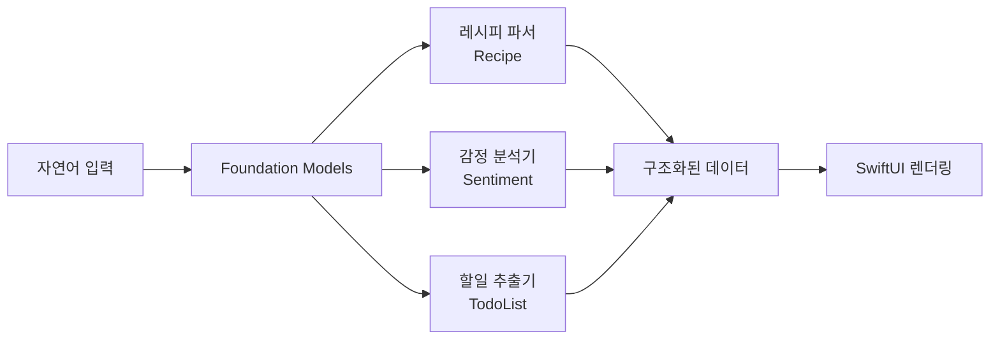
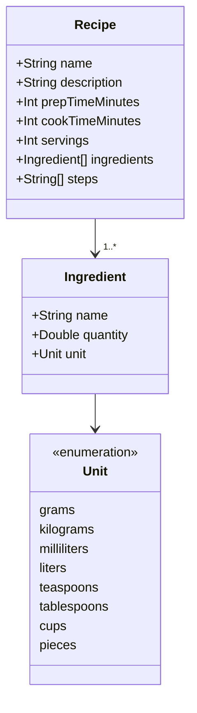
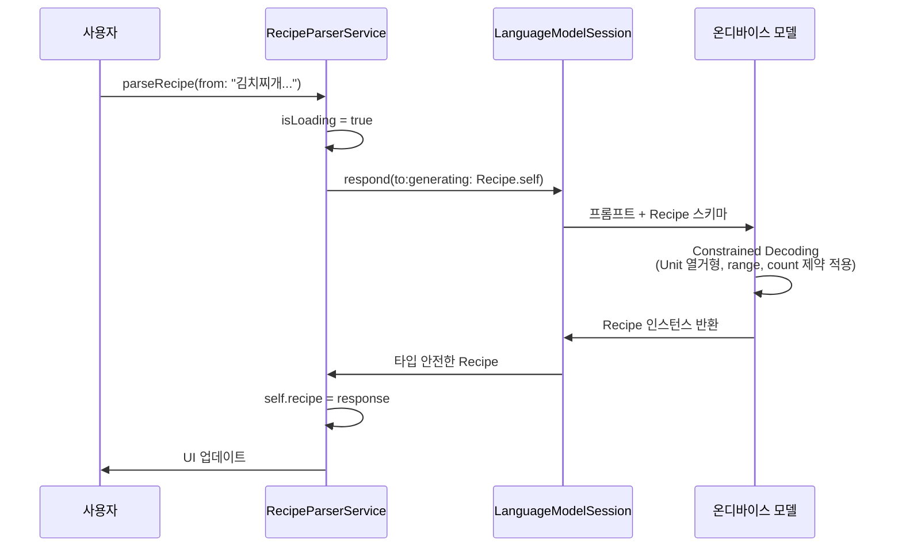
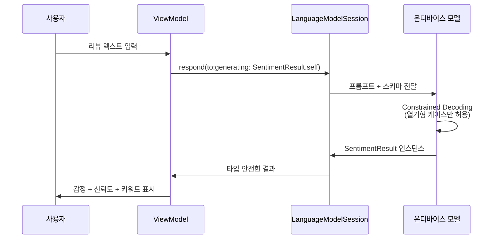
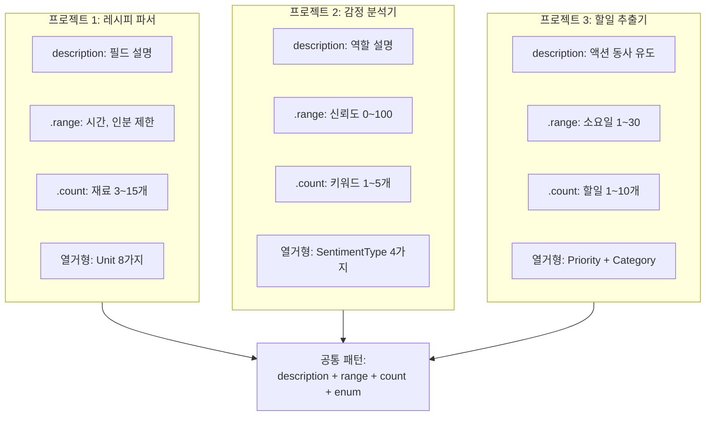
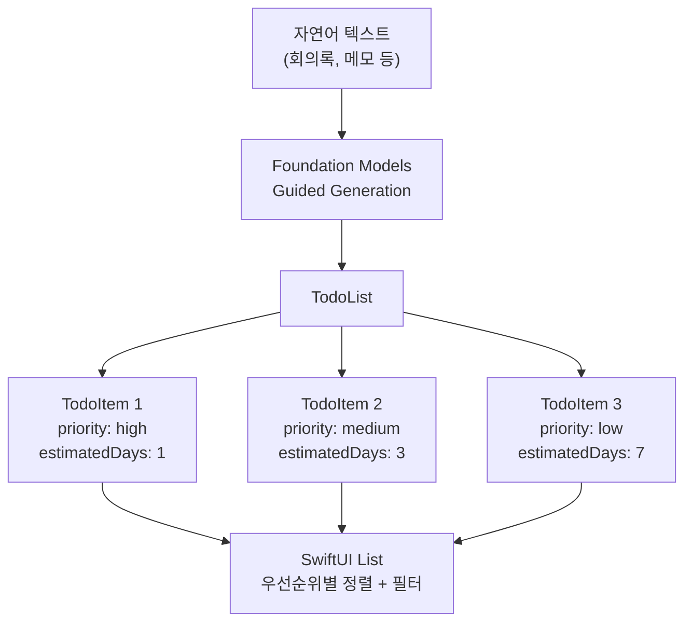
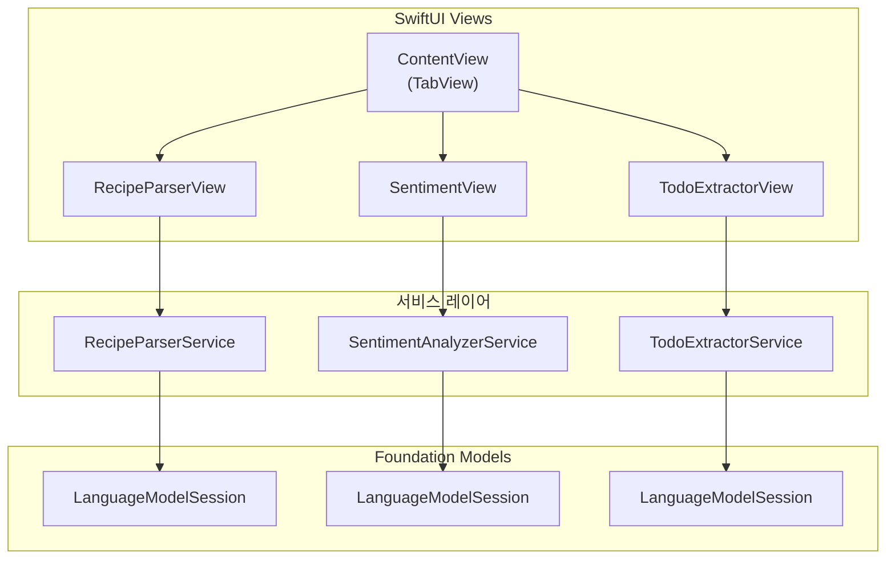

# 실습: 구조화 출력으로 앱 기능 구현

> Ch5의 모든 개념을 종합하여 레시피 파서, 감정 분석기, 할일 추출기를 처음부터 끝까지 구현합니다.

## 개요

이 섹션은 Ch5 전체의 마무리 실습입니다. 지금까지 배운 `@Generable` 매크로, `@Guide` 제약, 복합 구조 설계, 에러 처리를 모두 결합하여 **실제 앱에서 바로 사용할 수 있는 3가지 AI 기능**을 구현합니다.

**선수 지식**:
- [Guided Generation 개념과 동작 원리](05-ch5-generable-구조화-출력/01-01-guided-generation-개념과-동작-원리.md)에서 배운 Constrained Decoding
- [@Generable 매크로 적용](05-ch5-generable-구조화-출력/02-02-generable-매크로-적용하기.md)의 타입 규칙
- [@Guide 매크로](05-ch5-generable-구조화-출력/03-03-guide-매크로로-출력-품질-높이기.md)의 5가지 제약
- [복합 구조와 컬렉션 출력](05-ch5-generable-구조화-출력/04-04-복합-구조와-컬렉션-출력.md)의 중첩 패턴
- [에러 처리와 검증](05-ch5-generable-구조화-출력/05-05-구조화-출력의-에러-처리와-검증.md)의 재시도 전략

**학습 목표**:
- 실제 앱 기능을 `@Generable`로 모델링하고 구현할 수 있다
- 도메인에 맞는 `@Guide` 제약을 설계하여 출력 품질을 높일 수 있다
- 에러 처리와 비즈니스 검증을 결합한 프로덕션 수준의 코드를 작성할 수 있다

## 왜 알아야 할까?

앱 개발에서 AI 기능은 결국 **"자연어를 구조화된 데이터로 바꾸는 일"**에 귀결됩니다. 사용자가 아무렇게나 입력한 텍스트에서 레시피를 추출하고, 감정을 분류하고, 할 일 목록을 뽑아내는 것이죠. 이 세 가지 패턴만 제대로 익히면, 거의 모든 구조화 출력 시나리오에 응용할 수 있습니다.

> 📊 **그림 1**: 이번 실습에서 구현할 3가지 앱 기능



레시피 파서는 **중첩 구조체 + 열거형** 패턴, 감정 분석기는 **열거형 분류 + 수치 제약** 패턴, 할일 추출기는 **배열 + 우선순위 정렬** 패턴을 대표합니다. 이 세 가지를 마스터하면 여러분의 앱에 맞는 어떤 구조화 출력이든 자신 있게 설계할 수 있을 거예요.

## 핵심 개념

### 프로젝트 1: 레시피 파서 — 자연어에서 요리법 추출

> 💡 **비유**: 친구가 카톡으로 "김치찌개 끓이려면 돼지고기 200g, 김치 한 포기, 두부 반 모 넣고 20분 끓여~"라고 보냈다고 상상해보세요. 여러분의 뇌는 이 문장에서 재료, 분량, 조리 시간을 자동으로 구분합니다. `@Generable`은 온디바이스 모델이 바로 이 일을 하게 만드는 기술입니다.

레시피 파서는 Ch5에서 배운 거의 모든 개념이 집약된 대표적 사례입니다. 중첩 구조체(`Recipe` → `Ingredient`), 열거형(`Unit`), `@Guide`의 description과 range 제약을 모두 활용하거든요.

> 📊 **그림 2**: 레시피 파서의 데이터 모델 구조



먼저 모델 정의부터 시작합니다. 핵심은 **프로퍼티 선언 순서**입니다 — [세션 5.2](05-ch5-generable-구조화-출력/02-02-generable-매크로-적용하기.md)에서 배운 것처럼, Foundation Models는 auto-regressive하게 위에서 아래로 생성하므로, `name`과 `description`을 먼저 생성해야 이후 `ingredients`와 `steps`의 품질이 높아집니다.

```swift
import FoundationModels

// 계량 단위 — 열거형으로 출력 범위를 물리적으로 제한
@Generable
enum Unit: String, Codable {
    case grams       // 그램
    case kilograms   // 킬로그램
    case milliliters // 밀리리터
    case liters      // 리터
    case teaspoons   // 티스푼
    case tablespoons // 큰술
    case cups        // 컵
    case pieces      // 개
}

// 재료 — 중첩 @Generable 구조체
@Generable
struct Ingredient {
    @Guide(description: "재료의 이름")
    let name: String
    
    @Guide(description: "재료의 수량", .range(0.1...1000.0))
    let quantity: Double
    
    // Unit 열거형이 Constrained Decoding으로 유효한 단위만 생성
    let unit: Unit
}

// 레시피 — 최상위 구조체
@Generable
struct Recipe {
    @Guide(description: "요리의 이름")
    let name: String
    
    @Guide(description: "요리에 대한 간단한 설명, 1-2문장")
    let description: String
    
    @Guide(description: "준비 시간(분)", .range(0...60))
    let prepTimeMinutes: Int
    
    @Guide(description: "조리 시간(분)", .range(1...180))
    let cookTimeMinutes: Int
    
    @Guide(description: "몇 인분인지", .range(1...12))
    let servings: Int
    
    @Guide(description: "필요한 재료 목록", .count(3...15))
    let ingredients: [Ingredient]
    
    @Guide(description: "단계별 조리 방법", .count(3...12))
    let steps: [String]
}
```

`@Guide`가 핵심 역할을 합니다:
- `description`은 모델에게 "이 필드가 뭘 의미하는지" 자연어로 알려줍니다
- `.range(0...60)`은 Constrained Decoding 수준에서 숫자 범위를 물리적으로 제한합니다
- `.count(3...15)`는 배열 크기를 제한해서 너무 적거나 많은 재료가 나오는 걸 방지합니다

이제 이 모델을 사용하는 서비스를 만들어봅시다:

```swift
import FoundationModels

@Observable
class RecipeParserService {
    private let session: LanguageModelSession
    
    // 파싱 결과
    var recipe: Recipe?
    var isLoading = false
    var errorMessage: String?
    
    init() {
        // instructions로 모델의 역할을 지정
        self.session = LanguageModelSession(
            instructions: "당신은 요리 전문가입니다. 사용자의 텍스트에서 레시피 정보를 정확하게 추출하세요. 재료의 수량과 단위를 명확히 구분하세요."
        )
    }
    
    func parseRecipe(from text: String) async {
        isLoading = true
        errorMessage = nil
        
        do {
            // respond(to:generating:)으로 구조화 출력 요청
            let response = try await session.respond(
                to: "다음 텍스트에서 레시피를 추출해주세요: \(text)",
                generating: Recipe.self
            )
            self.recipe = response
            
        } catch let error as LanguageModelSession.GenerationError {
            // Ch5.5에서 배운 에러 처리 패턴 적용
            switch error {
            case .guardrailViolation:
                errorMessage = "이 내용은 처리할 수 없습니다."
            case .exceededContextWindowSize:
                errorMessage = "텍스트가 너무 깁니다. 짧게 줄여주세요."
            default:
                errorMessage = "생성 중 오류가 발생했습니다."
            }
        } catch {
            errorMessage = "알 수 없는 오류: \(error.localizedDescription)"
        }
        
        isLoading = false
    }
}
```

> 📊 **그림 3**: 레시피 파서의 요청-응답 흐름



### 프로젝트 2: 감정 분석기 — 텍스트의 감정 분류

> 💡 **비유**: 음식점 리뷰를 읽을 때, 우리는 본능적으로 "이건 좋은 리뷰", "이건 불만 리뷰"라고 분류하죠. 감정 분석기는 모델이 이 분류를 **열거형으로 확정**짓게 만드는 거예요. "positive" 혹은 "negative" — 애매한 자유 텍스트가 아니라 확실한 타입으로요.

감정 분석은 `@Generable` 열거형이 빛나는 대표적 시나리오입니다. 분류 결과를 열거형 케이스로 제한하면, 모델이 "긍정적인 것 같습니다" 같은 애매한 답변 대신 정확한 `.positive` 값을 반환합니다.

> 📊 **그림 4**: 감정 분석기의 처리 흐름



```swift
import FoundationModels

// 감정 분류 열거형 — 4가지 케이스로 제한
@Generable
enum SentimentType: String, Codable {
    case positive  // 긍정
    case negative  // 부정
    case neutral   // 중립
    case mixed     // 혼합 (긍정+부정 공존)
}

// 감정 분석 결과 구조체
@Generable
struct SentimentResult {
    @Guide(description: "텍스트의 전반적인 감정 분류")
    let sentiment: SentimentType
    
    @Guide(description: "감정 판단의 신뢰도 (0~100)", .range(0...100))
    let confidence: Int
    
    @Guide(description: "감정을 나타내는 핵심 키워드나 표현", .count(1...5))
    let emotionalKeywords: [String]
    
    @Guide(description: "한 줄 요약 분석")
    let summary: String
}
```

여기서 주목할 점은 `confidence` 필드입니다. `.range(0...100)`으로 제한했기 때문에, 모델은 반드시 0~100 사이의 정수만 생성합니다. 자유 텍스트로 "약 73% 정도 확신합니다"라는 답변이 나올 일이 없죠.

```swift
@Observable
class SentimentAnalyzerService {
    private let session: LanguageModelSession
    
    var result: SentimentResult?
    var isLoading = false
    
    init() {
        self.session = LanguageModelSession(
            instructions: """
            당신은 텍스트 감정 분석 전문가입니다.
            주어진 텍스트의 감정을 분류하고, 판단 근거가 되는 핵심 키워드를 추출하세요.
            confidence는 확신이 높을수록 100에 가깝게, 애매하면 50 근처로 설정하세요.
            """
        )
    }
    
    func analyze(text: String) async throws {
        isLoading = true
        defer { isLoading = false }
        
        let response = try await session.respond(
            to: "다음 텍스트의 감정을 분석해주세요: \(text)",
            generating: SentimentResult.self
        )
        self.result = response
    }
}
```

> 📊 **그림 5**: 세 프로젝트의 @Guide 제약 비교



### 프로젝트 3: 할일 추출기 — 자연어에서 액션 아이템 추출

> 💡 **비유**: 회의가 끝나고 "김 대리가 보고서 내일까지 작성하고, 박 과장은 이번 주 안에 디자인 리뷰하고, 신입은 다음 주부터 테스트 시작해주세요"라는 말을 들었다고 해보세요. 이 문장에서 **누가, 무엇을, 언제까지**를 뽑아내는 게 바로 할일 추출기가 하는 일입니다.

할일 추출기는 배열과 중첩 구조체, 열거형을 조합하는 패턴입니다. 특히 우선순위(Priority)와 예상 소요 일수를 구조화하면, UI에서 정렬과 필터링이 바로 가능해집니다.

> 📊 **그림 6**: 할일 추출기 데이터 모델



```swift
import FoundationModels

// 우선순위 열거형
@Generable
enum Priority: String, Codable {
    case high   // 긴급
    case medium // 보통
    case low    // 여유
}

// 카테고리 열거형 — 할일의 종류를 분류
@Generable
enum TaskCategory: String, Codable {
    case work       // 업무
    case personal   // 개인
    case meeting    // 회의
    case review     // 리뷰
    case research   // 조사
}

// 개별 할일 아이템
@Generable
struct TodoItem {
    @Guide(description: "할 일의 제목, 명확한 액션 동사로 시작")
    let title: String
    
    @Guide(description: "할 일의 상세 설명")
    let detail: String
    
    @Guide(description: "우선순위")
    let priority: Priority
    
    @Guide(description: "할 일의 카테고리")
    let category: TaskCategory
    
    @Guide(description: "예상 소요 일수", .range(1...30))
    let estimatedDays: Int
    
    @Guide(description: "담당자 이름 (언급된 경우)")
    let assignee: String?
}

// 할일 목록 — 최상위 구조체
@Generable
struct TodoList {
    @Guide(description: "추출된 액션 아이템 목록", .count(1...10))
    let tasks: [TodoItem]
    
    @Guide(description: "원본 텍스트에서 할 일과 무관한 참고 사항")
    let notes: String?
}
```

`assignee`와 `notes`가 `Optional`인 점에 주목하세요. 모든 텍스트에 담당자나 참고 사항이 있는 건 아니니까요. [세션 5.2](05-ch5-generable-구조화-출력/02-02-generable-매크로-적용하기.md)에서 배운 것처럼, Optional 프로퍼티는 모델이 해당 정보가 없다고 판단하면 `nil`을 생성합니다.

```swift
@Observable
class TodoExtractorService {
    private let session: LanguageModelSession
    
    var todoList: TodoList?
    var isLoading = false
    var errorMessage: String?
    
    init() {
        self.session = LanguageModelSession(
            instructions: """
            당신은 텍스트에서 할 일(액션 아이템)을 추출하는 전문가입니다.
            각 할 일은 명확한 액션 동사로 시작하는 제목을 가져야 합니다.
            우선순위는 긴급도와 마감일을 고려하여 판단하세요.
            담당자가 명시적으로 언급된 경우에만 assignee를 설정하세요.
            """
        )
    }
    
    func extractTodos(from text: String) async {
        isLoading = true
        errorMessage = nil
        defer { isLoading = false }
        
        do {
            let response = try await session.respond(
                to: "다음 텍스트에서 할 일을 추출해주세요: \(text)",
                generating: TodoList.self
            )
            self.todoList = response
        } catch {
            errorMessage = "할 일 추출에 실패했습니다: \(error.localizedDescription)"
        }
    }
}
```

## 실습: 직접 해보기

이제 세 가지 서비스를 하나의 SwiftUI 앱으로 통합합니다. 탭 기반 UI로 각 기능을 전환할 수 있는 **AI 텍스트 분석기** 앱을 만들어볼게요.

> 📊 **그림 7**: AI 텍스트 분석기 앱 아키텍처



먼저 모델 가용성을 확인하는 공통 유틸리티를 만듭니다:

```swift
import FoundationModels

// 모델 가용성 확인 유틸리티
struct ModelAvailabilityChecker {
    /// 현재 기기에서 Foundation Models를 사용할 수 있는지 확인
    static var isAvailable: Bool {
        SystemLanguageModel.default.availability == .available
    }
    
    /// 사용 불가 시 사용자에게 보여줄 메시지
    static var unavailableMessage: String {
        switch SystemLanguageModel.default.availability {
        case .available:
            return ""
        case .unavailable(.deviceNotEligible):
            return "이 기기는 Apple Intelligence를 지원하지 않습니다."
        case .unavailable(.appleIntelligenceNotEnabled):
            return "설정에서 Apple Intelligence를 활성화해주세요."
        case .unavailable(.modelNotReady):
            return "모델을 준비 중입니다. 잠시 후 다시 시도해주세요."
        default:
            return "현재 AI 기능을 사용할 수 없습니다."
        }
    }
}
```

다음은 레시피 파서의 전체 View입니다:

```swift
import SwiftUI

struct RecipeParserView: View {
    @State private var service = RecipeParserService()
    @State private var inputText = ""
    
    var body: some View {
        NavigationStack {
            Form {
                // 입력 섹션
                Section("텍스트 입력") {
                    TextEditor(text: $inputText)
                        .frame(minHeight: 100)
                    
                    Button("레시피 추출") {
                        Task { await service.parseRecipe(from: inputText) }
                    }
                    .disabled(inputText.isEmpty || service.isLoading)
                }
                
                // 로딩 상태
                if service.isLoading {
                    Section {
                        ProgressView("레시피를 분석하고 있습니다...")
                    }
                }
                
                // 에러 표시
                if let error = service.errorMessage {
                    Section {
                        Label(error, systemImage: "exclamationmark.triangle")
                            .foregroundStyle(.red)
                    }
                }
                
                // 결과 표시
                if let recipe = service.recipe {
                    Section("기본 정보") {
                        LabeledContent("요리명", value: recipe.name)
                        LabeledContent("설명", value: recipe.description)
                        LabeledContent("준비 시간", value: "\(recipe.prepTimeMinutes)분")
                        LabeledContent("조리 시간", value: "\(recipe.cookTimeMinutes)분")
                        LabeledContent("인분", value: "\(recipe.servings)인분")
                    }
                    
                    Section("재료 (\(recipe.ingredients.count)가지)") {
                        ForEach(recipe.ingredients, id: \.name) { ingredient in
                            HStack {
                                Text(ingredient.name)
                                Spacer()
                                // 수량과 단위를 깔끔하게 표시
                                Text("\(ingredient.quantity, specifier: "%.1f") \(ingredient.unit.rawValue)")
                                    .foregroundStyle(.secondary)
                            }
                        }
                    }
                    
                    Section("조리 순서") {
                        ForEach(Array(recipe.steps.enumerated()), id: \.offset) { index, step in
                            HStack(alignment: .top) {
                                Text("\(index + 1)")
                                    .font(.headline)
                                    .foregroundStyle(.accent)
                                    .frame(width: 24)
                                Text(step)
                            }
                        }
                    }
                }
            }
            .navigationTitle("레시피 파서")
        }
    }
}
```

감정 분석 뷰는 결과를 시각적으로 표현하는 데 집중합니다:

```swift
struct SentimentAnalysisView: View {
    @State private var service = SentimentAnalyzerService()
    @State private var inputText = ""
    
    var body: some View {
        NavigationStack {
            Form {
                Section("텍스트 입력") {
                    TextEditor(text: $inputText)
                        .frame(minHeight: 100)
                    
                    Button("감정 분석") {
                        Task { try? await service.analyze(text: inputText) }
                    }
                    .disabled(inputText.isEmpty || service.isLoading)
                }
                
                if service.isLoading {
                    Section { ProgressView("분석 중...") }
                }
                
                if let result = service.result {
                    // 감정 + 신뢰도 시각화
                    Section("분석 결과") {
                        HStack {
                            sentimentIcon(for: result.sentiment)
                            Text(sentimentLabel(for: result.sentiment))
                                .font(.title2.bold())
                        }
                        
                        // 신뢰도 게이지
                        VStack(alignment: .leading) {
                            Text("신뢰도: \(result.confidence)%")
                                .font(.subheadline)
                            ProgressView(value: Double(result.confidence), total: 100)
                                .tint(confidenceColor(result.confidence))
                        }
                        
                        Text(result.summary)
                            .font(.body)
                            .foregroundStyle(.secondary)
                    }
                    
                    // 감정 키워드 태그
                    Section("핵심 키워드") {
                        FlowLayout {
                            ForEach(result.emotionalKeywords, id: \.self) { keyword in
                                Text(keyword)
                                    .padding(.horizontal, 12)
                                    .padding(.vertical, 6)
                                    .background(.tint.opacity(0.15))
                                    .clipShape(Capsule())
                            }
                        }
                    }
                }
            }
            .navigationTitle("감정 분석기")
        }
    }
    
    // 감정 타입별 아이콘
    private func sentimentIcon(for type: SentimentType) -> some View {
        let (icon, color): (String, Color) = switch type {
        case .positive: ("face.smiling", .green)
        case .negative: ("face.dashed", .red)
        case .neutral:  ("face.smiling.inverse", .gray)
        case .mixed:    ("arrow.left.arrow.right", .orange)
        }
        return Image(systemName: icon)
            .font(.title)
            .foregroundStyle(color)
    }
    
    private func sentimentLabel(for type: SentimentType) -> String {
        switch type {
        case .positive: "긍정적"
        case .negative: "부정적"
        case .neutral:  "중립"
        case .mixed:    "혼합"
        }
    }
    
    private func confidenceColor(_ value: Int) -> Color {
        if value >= 80 { return .green }
        if value >= 50 { return .orange }
        return .red
    }
}
```

마지막으로 할일 추출기와 메인 탭 뷰입니다:

```swift
struct TodoExtractorView: View {
    @State private var service = TodoExtractorService()
    @State private var inputText = ""
    
    var body: some View {
        NavigationStack {
            Form {
                Section("텍스트 입력") {
                    TextEditor(text: $inputText)
                        .frame(minHeight: 100)
                    
                    Button("할 일 추출") {
                        Task { await service.extractTodos(from: inputText) }
                    }
                    .disabled(inputText.isEmpty || service.isLoading)
                }
                
                if service.isLoading {
                    Section { ProgressView("할 일을 추출하고 있습니다...") }
                }
                
                if let error = service.errorMessage {
                    Section {
                        Label(error, systemImage: "exclamationmark.triangle")
                            .foregroundStyle(.red)
                    }
                }
                
                if let todoList = service.todoList {
                    // 우선순위별 그룹화
                    let grouped = Dictionary(grouping: todoList.tasks) { $0.priority }
                    
                    ForEach([Priority.high, .medium, .low], id: \.self) { priority in
                        if let tasks = grouped[priority] {
                            Section(priorityHeader(priority)) {
                                ForEach(tasks, id: \.title) { task in
                                    VStack(alignment: .leading, spacing: 4) {
                                        HStack {
                                            Image(systemName: "circle")
                                            Text(task.title).font(.headline)
                                        }
                                        Text(task.detail)
                                            .font(.subheadline)
                                            .foregroundStyle(.secondary)
                                        HStack {
                                            Label(task.category.rawValue, systemImage: "tag")
                                            Spacer()
                                            Label("~\(task.estimatedDays)일", systemImage: "calendar")
                                            if let assignee = task.assignee {
                                                Label(assignee, systemImage: "person")
                                            }
                                        }
                                        .font(.caption)
                                        .foregroundStyle(.tertiary)
                                    }
                                    .padding(.vertical, 4)
                                }
                            }
                        }
                    }
                    
                    // 참고 사항 (Optional)
                    if let notes = todoList.notes {
                        Section("참고 사항") {
                            Text(notes).foregroundStyle(.secondary)
                        }
                    }
                }
            }
            .navigationTitle("할일 추출기")
        }
    }
    
    private func priorityHeader(_ priority: Priority) -> String {
        switch priority {
        case .high:   "긴급"
        case .medium: "보통"
        case .low:    "여유"
        }
    }
}

// 메인 탭 뷰 — 3가지 기능을 탭으로 전환
struct ContentView: View {
    var body: some View {
        // 모델 가용성 먼저 확인
        if ModelAvailabilityChecker.isAvailable {
            TabView {
                Tab("레시피", systemImage: "fork.knife") {
                    RecipeParserView()
                }
                Tab("감정 분석", systemImage: "face.smiling") {
                    SentimentAnalysisView()
                }
                Tab("할 일", systemImage: "checklist") {
                    TodoExtractorView()
                }
            }
        } else {
            ContentUnavailableView(
                "AI 기능 사용 불가",
                systemImage: "brain",
                description: Text(ModelAvailabilityChecker.unavailableMessage)
            )
        }
    }
}
```

실제 동작을 확인해봅시다. 레시피 파서에 자연어를 입력하면:

```run:swift
// 시뮬레이션: 레시피 파서 결과 출력
let recipeName = "김치찌개"
let ingredients = [
    ("배추김치", 300.0, "grams"),
    ("돼지고기 목살", 200.0, "grams"),
    ("두부", 1.0, "pieces"),
    ("대파", 1.0, "pieces"),
    ("고춧가루", 1.0, "tablespoons")
]

print("=== 레시피 파싱 결과 ===")
print("요리명: \(recipeName)")
print("준비 시간: 10분 | 조리 시간: 25분 | 2인분")
print("\n[재료]")
for (name, qty, unit) in ingredients {
    print("  - \(name): \(qty) \(unit)")
}
print("\n[조리 순서]")
print("  1. 돼지고기를 한입 크기로 썰어 볶는다")
print("  2. 김치를 넣고 함께 5분간 볶는다")
print("  3. 물 400ml를 넣고 끓인다")
print("  4. 두부와 대파를 넣고 10분 더 끓인다")
```

```output
=== 레시피 파싱 결과 ===
요리명: 김치찌개
준비 시간: 10분 | 조리 시간: 25분 | 2인분

[재료]
  - 배추김치: 300.0 grams
  - 돼지고기 목살: 200.0 grams
  - 두부: 1.0 pieces
  - 대파: 1.0 pieces
  - 고춧가루: 1.0 tablespoons

[조리 순서]
  1. 돼지고기를 한입 크기로 썰어 볶는다
  2. 김치를 넣고 함께 5분간 볶는다
  3. 물 400ml를 넣고 끓인다
  4. 두부와 대파를 넣고 10분 더 끓인다
```

감정 분석기에 "제품은 훌륭한데 배송이 너무 느렸어요"를 입력하면:

```run:swift
// 시뮬레이션: 감정 분석 결과
let sentiment = "mixed"
let confidence = 72
let keywords = ["훌륭한", "느렸어요"]
let summary = "제품 품질에 대한 긍정적 평가와 배송 속도에 대한 불만이 공존합니다."

print("=== 감정 분석 결과 ===")
print("감정: \(sentiment) (혼합)")
print("신뢰도: \(confidence)%")
print("키워드: \(keywords.joined(separator: ", "))")
print("요약: \(summary)")
```

```output
=== 감정 분석 결과 ===
감정: mixed (혼합)
신뢰도: 72%
키워드: 훌륭한, 느렸어요
요약: 제품 품질에 대한 긍정적 평가와 배송 속도에 대한 불만이 공존합니다.
```

할일 추출기에 회의록을 입력하면:

```run:swift
// 시뮬레이션: 할일 추출 결과
print("=== 할 일 추출 결과 ===")
print("\n[긴급]")
print("  □ 보고서 작성하기")
print("    상세: 3분기 실적 보고서 초안 작성")
print("    카테고리: work | ~1일 | 담당: 김 대리")
print("\n[보통]")
print("  □ 디자인 리뷰 진행하기")
print("    상세: 신규 앱 UI 디자인 시안 검토 및 피드백")
print("    카테고리: review | ~3일 | 담당: 박 과장")
print("\n[여유]")
print("  □ 테스트 계획 수립하기")
print("    상세: 다음 스프린트 QA 테스트 케이스 작성")
print("    카테고리: work | ~7일 | 담당: 신입")
```

```output
=== 할 일 추출 결과 ===

[긴급]
  □ 보고서 작성하기
    상세: 3분기 실적 보고서 초안 작성
    카테고리: work | ~1일 | 담당: 김 대리

[보통]
  □ 디자인 리뷰 진행하기
    상세: 신규 앱 UI 디자인 시안 검토 및 피드백
    카테고리: review | ~3일 | 담당: 박 과장

[여유]
  □ 테스트 계획 수립하기
    상세: 다음 스프린트 QA 테스트 케이스 작성
    카테고리: work | ~7일 | 담당: 신입
```

## 더 깊이 알아보기

### Guided Generation의 학문적 뿌리

구조화 출력은 사실 오래된 아이디어입니다. 2023년 Microsoft Research에서 발표한 "Guidance"라는 라이브러리가 LLM의 출력을 정규 문법(Regular Grammar)으로 제약하는 개념을 대중화했고, 곧이어 Outlines(2023), LMQL(2023) 같은 프레임워크들이 등장했습니다.

Apple이 WWDC25에서 `@Generable`을 발표했을 때, 많은 개발자들이 놀란 건 기술 자체가 아니라 **구현 방식**이었습니다. 기존 프레임워크들이 런타임에 정규식이나 JSON Schema를 파싱해서 토큰 마스킹을 수행한 반면, Apple은 Swift 매크로를 활용해 **컴파일 타임에 스키마를 확정**하는 접근을 택한 거죠. 이 결정 덕분에 런타임 오버헤드가 거의 없고, Xcode에서 자동 완성과 타입 검사까지 지원됩니다.

Apple의 2025 Foundation Models 기술 보고서에 따르면, 온디바이스 ~3B 파라미터 모델에서 Guided Generation을 적용하면 자유 텍스트 생성 대비 **약 1.2배 빠른 추론 속도**를 보입니다. 유효하지 않은 토큰을 미리 제거하므로 탐색 공간이 줄어드는 거죠.

### 프로퍼티 순서가 품질을 결정한다

auto-regressive 모델의 특성상, 앞서 생성된 필드가 이후 필드 생성의 **컨텍스트**가 됩니다. 이것이 WWDC25 "Deep dive into the Foundation Models framework" 세션에서 Apple 엔지니어가 "프로퍼티 순서를 신중히 설계하라"고 강조한 이유입니다. 레시피 예제에서 `name` → `description` → `ingredients` → `steps` 순서가 의도적인 것처럼, 일반적인 것에서 구체적인 것으로 흐르는 순서가 최적입니다.

## 흔한 오해와 팁

> ⚠️ **흔한 오해**: "모든 필드를 @Guide로 장식하면 품질이 좋아진다" — 사실이 아닙니다. `@Guide(description:)`은 프롬프트의 토큰 예산을 소비하므로, 정말 필요한 필드에만 설명을 추가하세요. 특히 이름만으로 의미가 명확한 `name`, `title` 같은 필드에는 description이 불필요할 수 있습니다. [세션 5.3](05-ch5-generable-구조화-출력/03-03-guide-매크로로-출력-품질-높이기.md)에서 다룬 것처럼, description은 1-2문장이 최적입니다.

> 💡 **알고 계셨나요?**: `@Generable` 구조체에서 모델이 사용하지 않을 필드(예: UI 전용 상태)는 선언하지 마세요. 모델은 선언된 **모든** 프로퍼티를 생성하려고 시도합니다. WWDC25 코드어롱에서도 "only include the fields necessary for the current context"라고 강조했습니다. UI 상태는 별도의 ViewModel에서 관리하는 것이 정답입니다.

> 🔥 **실무 팁**: 프로덕션 앱에서는 `@Generable` 구조체 외에 **비즈니스 검증 레이어**를 반드시 추가하세요. 예를 들어 레시피의 `ingredients`가 비어 있거나, 감정 분석의 `emotionalKeywords`가 원본 텍스트에 없는 단어를 포함하는 경우를 검증해야 합니다. [세션 5.5](05-ch5-generable-구조화-출력/05-05-구조화-출력의-에러-처리와-검증.md)의 `GeneratedOutputValidatable` 패턴을 활용하면 깔끔하게 구현할 수 있습니다.

## 핵심 정리

| 개념 | 설명 |
|------|------|
| 레시피 파서 패턴 | 중첩 구조체(`Recipe` → `Ingredient`) + 열거형(`Unit`) + `.range`/`.count` 제약 조합 |
| 감정 분석기 패턴 | `@Generable` 열거형으로 분류 결과 제한 + 수치 필드에 `.range(0...100)` 적용 |
| 할일 추출기 패턴 | 배열 + Optional + 다중 열거형(`Priority`, `TaskCategory`)으로 구조적 분류 |
| 프로퍼티 순서 | 일반적 → 구체적 순서가 auto-regressive 생성 품질 최적화의 핵심 |
| instructions 활용 | `LanguageModelSession(instructions:)`로 모델의 역할과 행동 가이드라인 설정 |
| 비즈니스 검증 | `@Guide` 타입 제약 위에 도메인 규칙 검증 레이어 추가 (빈 배열, 범위 초과 등) |
| 모델 가용성 확인 | `SystemLanguageModel.default.availability`로 앱 시작 시 + 사용 시점 검사 |

## 다음 섹션 미리보기

Ch5에서 구조화 출력의 모든 것을 마스터했습니다! 다음 [Ch6. 스트리밍 응답과 실시간 UI](06-ch6-스트리밍-응답과-실시간-ui/01-01-streamresponse-api-기초.md)에서는 응답을 한 번에 기다리는 대신, **토큰이 생성되는 즉시 실시간으로 UI에 반영하는 방법**을 배웁니다. 이번 실습에서 만든 `Recipe`, `SentimentResult`, `TodoList` 같은 구조체가 필드 단위로 점진적으로 채워지면서, 사용자에게 "AI가 지금 생성하고 있구나"라는 생동감 있는 경험을 제공하게 됩니다.

## 참고 자료

- [Code-along: Bring on-device AI to your app — WWDC25](https://developer.apple.com/videos/play/wwdc2025/259/) - `@Generable`과 `@Guide`를 활용한 여행 일정 앱 구현 전체 과정을 따라할 수 있는 공식 코드어롱
- [Deep dive into the Foundation Models framework — WWDC25](https://developer.apple.com/videos/play/wwdc2025/301/) - Guided Generation의 내부 동작, 프로퍼티 순서 최적화, 성능 고려사항을 심층적으로 다루는 공식 세션
- [The Ultimate Guide To The Foundation Models Framework — AzamSharp](https://azamsharp.com/2025/06/18/the-ultimate-guide-to-the-foundation-models-framework.html) - Recipe, Sentiment, Todo 등 다양한 `@Generable` 실전 예제와 `@Guide` 활용 패턴을 포함한 종합 가이드
- [Foundation-Models-Framework-Example — GitHub (rudrankriyam)](https://github.com/rudrankriyam/Foundation-Models-Framework-Example) - BookRecommendation, StoryOutline, HealthAnalysis 등 다양한 도메인의 `@Generable` 구현 예제 코드
- [Foundation Models framework on iOS 26: Guided Generation, Streaming, and Tool Calling](https://medium.com/@himalimarasinghe/foundation-models-framework-on-ios-26-a-simple-guide-to-guided-generation-streaming-and-tool-3bdbb1374441) - Guided Generation과 스트리밍을 결합한 실전 패턴 튜토리얼

---
### 🔗 Related Sessions
- [constrained decoding](05-ch5-generable-구조화-출력/01-01-guided-generation-개념과-동작-원리.md) (prerequisite)
- [@generable](05-ch5-generable-구조화-출력/01-01-guided-generation-개념과-동작-원리.md) (prerequisite)
- [중첩 @generable 구조체](05-ch5-generable-구조화-출력/02-02-generable-매크로-적용하기.md) (prerequisite)
