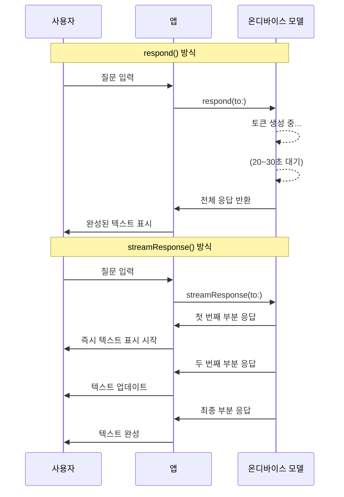
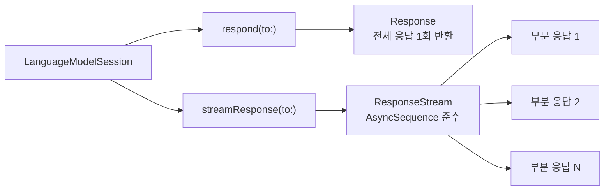
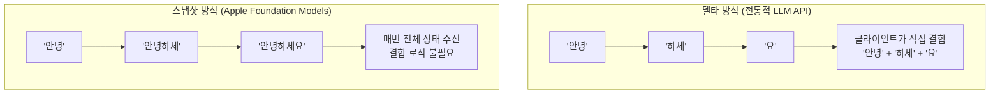
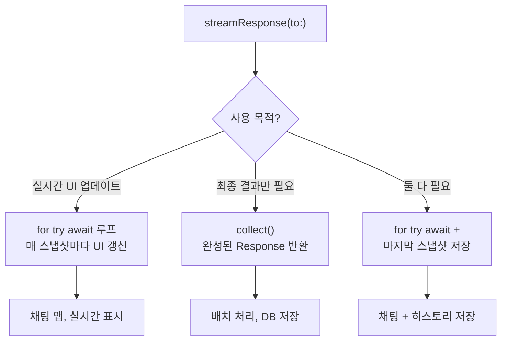

# streamResponse() API 기초

> Foundation Models의 스트리밍 응답 API를 배우고, for await 루프로 실시간 텍스트를 수신하는 패턴을 익힙니다.

## 개요

이 섹션에서는 Foundation Models 프레임워크의 `streamResponse()` 메서드를 학습합니다. 지금까지 사용해 온 `respond(to:)` 메서드는 모델이 전체 응답을 완성할 때까지 기다렸다가 한꺼번에 결과를 반환했는데요, `streamResponse()`는 모델이 생성하는 내용을 **실시간으로 조금씩** 받아볼 수 있게 해줍니다.

**선수 지식**: [LanguageModelSession 생성과 구성](03-ch3-foundation-models-프레임워크-시작하기/02-02-languagemodelsession-생성과-구성.md)에서 배운 세션 생성 방법, [첫 번째 텍스트 생성 요청](03-ch3-foundation-models-프레임워크-시작하기/03-03-첫-번째-텍스트-생성-요청.md)에서 배운 `respond(to:)` 패턴, Swift의 `async/await` 기본 문법

**학습 목표**:
- `streamResponse(to:)` 메서드의 반환 타입과 동작 원리를 이해한다
- `for try await` 루프 패턴으로 스트리밍 응답을 처리할 수 있다
- `respond(to:)`와 `streamResponse(to:)`의 차이를 구분하고 적절히 선택할 수 있다
- `collect()` 메서드로 스트림을 최종 결과로 수집하는 방법을 익힌다

## 왜 알아야 할까?

여러분이 ChatGPT나 Claude를 사용할 때를 떠올려 보세요. 질문을 보내면 답이 **글자 단위로 타이핑되듯** 나타나죠? 만약 전체 답변이 완성될 때까지 빈 화면만 보여준다면 어떨까요? 긴 답변의 경우 20~30초를 하얀 화면만 바라보며 기다려야 합니다. 사용자는 "앱이 멈춘 건가?" 하고 불안해하겠죠.

스트리밍은 이 문제를 해결합니다. 모델이 첫 토큰을 생성하는 순간부터 화면에 텍스트가 나타나기 시작하니까요. **체감 응답 시간**이 극적으로 줄어들고, 사용자는 AI가 "생각하고 있다"는 걸 눈으로 확인할 수 있습니다. Apple의 Foundation Models 프레임워크는 이를 위해 Swift의 `AsyncSequence`와 자연스럽게 통합된 `streamResponse()` API를 제공합니다.

> 📊 **그림 1**: respond()와 streamResponse()의 사용자 체감 비교



## 핵심 개념

### 개념 1: streamResponse() — 물 흐르듯 받아보기

> 💡 **비유**: 편지와 실시간 채팅의 차이를 생각해보세요. `respond(to:)`는 **편지**입니다. 상대가 편지를 다 쓸 때까지 기다렸다가 한꺼번에 받죠. `streamResponse(to:)`는 **실시간 채팅**입니다. 상대가 한 글자 한 글자 입력할 때마다 화면에 나타납니다. 같은 내용이라도 받는 경험이 완전히 다릅니다.

`streamResponse(to:)` 메서드는 `LanguageModelSession`에서 호출할 수 있는 스트리밍 전용 API입니다. 기존의 `respond(to:)` 메서드와 동일한 세션 객체에서 호출하지만, 반환 타입이 다릅니다.

```swift
import FoundationModels

// 기존 방식: 전체 응답을 한 번에 받기
let session = LanguageModelSession()
let response = try await session.respond(to: "Swift의 장점을 알려줘")
print(response.content) // 전체 텍스트가 한꺼번에 출력

// 스트리밍 방식: 응답을 조금씩 받기
let stream = session.streamResponse(to: "Swift의 장점을 알려줘")
for try await partial in stream {
    print(partial) // 부분 응답이 하나씩 출력
}
```

핵심 차이를 정리하면 이렇습니다:

| 구분 | `respond(to:)` | `streamResponse(to:)` |
|------|----------------|----------------------|
| 반환 시점 | 전체 생성 완료 후 | 생성 중 실시간 |
| 반환 타입 | `LanguageModelSession.Response` | `LanguageModelSession.ResponseStream` |
| 호출 패턴 | `try await` | `for try await` |
| 사용자 체감 | 기다림 후 한꺼번에 | 즉시 시작, 점진적 |

> 📊 **그림 2**: respond()와 streamResponse() API 비교



### 개념 2: ResponseStream과 AsyncSequence

> 💡 **비유**: `AsyncSequence`를 **컨베이어 벨트**라고 생각해보세요. 공장(모델)에서 제품(토큰)이 만들어질 때마다 컨베이어 벨트 위에 올려놓으면, 벨트 끝에 서 있는 작업자(우리 앱)가 하나씩 집어갑니다. 벨트가 멈추면(스트림 종료) 작업자도 일을 마칩니다.

`streamResponse(to:)`가 반환하는 `ResponseStream`은 Swift의 `AsyncSequence` 프로토콜을 준수합니다. `AsyncSequence`는 Swift Concurrency의 핵심 프로토콜로, **비동기적으로 요소를 하나씩 내보내는 시퀀스**를 표현하거든요. 덕분에 우리는 익숙한 `for try await` 패턴으로 스트리밍 응답을 처리할 수 있습니다.

```swift
import FoundationModels

let session = LanguageModelSession()

// streamResponse(to:)는 ResponseStream을 반환
// ResponseStream은 AsyncSequence를 준수
let stream = session.streamResponse(to: "오늘 하루 일과를 짧게 제안해줘")

// for try await로 비동기 시퀀스를 순회
for try await partialResponse in stream {
    // partialResponse는 지금까지 생성된 텍스트의 "스냅샷"
    print(partialResponse)
}
// 루프가 끝나면 = 모델이 응답 생성을 완료한 것
```

여기서 중요한 건 `partialResponse`가 **델타(변경분)**가 아니라 **스냅샷(누적본)**이라는 점입니다. 전통적인 LLM 스트리밍 API(예: OpenAI)는 새로 생성된 토큰만 보내서 클라이언트가 직접 이어 붙여야 하는데요, Apple의 Foundation Models는 매번 **현재까지 생성된 전체 내용**을 스냅샷으로 전달합니다. 이 설계 덕분에 중간에 스냅샷 하나를 놓쳐도 다음 스냅샷에서 전체 내용을 받을 수 있어서 훨씬 견고합니다.

> 📊 **그림 3**: 델타 스트리밍 vs 스냅샷 스트리밍



### 개념 3: for try await 루프 패턴

> 💡 **비유**: 라디오 방송을 듣는 것과 비슷합니다. 라디오를 켜면(`streamResponse`) 방송국에서 보내는 내용이 계속 들려오고(`for try await`), 방송이 끝나면 자연스럽게 청취도 끝납니다. 중간에 라디오를 끄면(Task 취소) 언제든 멈출 수도 있죠.

`for try await`는 Swift Concurrency에서 `AsyncSequence`를 순회하는 표준 패턴입니다. 세 가지 키워드가 각각 역할을 담당하거든요:

```swift
for try await partialResponse in stream {
    //  for   — 반복 (요소가 있는 한 계속)
    //  try   — 에러 발생 시 throw (do-catch로 처리)
    //  await — 다음 요소가 준비될 때까지 비동기 대기
    
    // partialResponse: 현재까지 생성된 텍스트 스냅샷
    updateUI(with: partialResponse)
}
```

이 패턴은 세 가지 상황에서 루프가 종료됩니다:

1. **정상 완료**: 모델이 응답 생성을 마치면 스트림이 닫히고 루프가 자연스럽게 끝남
2. **에러 발생**: 생성 중 에러가 발생하면 `try`에 의해 throw됨
3. **Task 취소**: 현재 Task가 취소되면 스트림도 함께 취소됨

```swift
import FoundationModels

func generateStory() async {
    let session = LanguageModelSession()
    
    do {
        let stream = session.streamResponse(
            to: "고양이가 주인공인 짧은 동화를 써줘"
        )
        
        for try await partial in stream {
            // 매 스냅샷마다 UI 업데이트
            print(partial)
        }
        
        // 루프가 끝나면 생성 완료
        print("--- 생성 완료 ---")
        
    } catch {
        // 에러 처리 (모델 가용성 문제, 취소 등)
        print("스트리밍 에러: \(error)")
    }
}
```

### 개념 4: collect()로 최종 결과 수집하기

스트리밍 중간에는 부분 응답을 받지만, 때로는 스트리밍이 모두 끝난 뒤의 **최종 완성된 결과**가 필요할 때도 있습니다. 예를 들어 응답을 데이터베이스에 저장하거나, 후속 API 호출의 입력으로 쓸 때죠. 이때 `collect()` 메서드를 사용합니다.

```swift
import FoundationModels

let session = LanguageModelSession()
let stream = session.streamResponse(to: "Swift 6의 핵심 변화 3가지를 알려줘")

// 방법 1: 스트리밍 없이 최종 결과만 필요할 때
let finalResponse = try await stream.collect()
print(finalResponse.content)

// 방법 2: 스트리밍 + 최종 결과 둘 다 필요할 때
// for try await로 UI를 업데이트하면서
// 루프가 끝난 뒤 마지막 partial이 최종 결과
var lastPartial: String = ""
let stream2 = session.streamResponse(to: "SwiftUI 팁 알려줘")
for try await partial in stream2 {
    lastPartial = "\(partial)"
    print(partial) // 실시간 UI 업데이트
}
// lastPartial이 최종 텍스트
```

> 📊 **그림 4**: streamResponse() 활용 패턴 분기



## 실습: 직접 해보기

지금까지 배운 내용을 종합해서, 스트리밍 응답을 처리하는 간단한 예제를 만들어 봅시다.

```swift
import FoundationModels
import SwiftUI

// MARK: - ViewModel
@Observable
class StreamingViewModel {
    var displayText: String = ""
    var isGenerating: Bool = false
    var errorMessage: String?
    
    private var session = LanguageModelSession()
    
    /// 스트리밍 방식으로 텍스트를 생성합니다
    func generateWithStreaming(prompt: String) async {
        // 상태 초기화
        displayText = ""
        isGenerating = true
        errorMessage = nil
        
        do {
            // streamResponse(to:)로 스트림 생성
            let stream = session.streamResponse(to: prompt)
            
            // for try await 루프로 부분 응답을 실시간 수신
            for try await partialResponse in stream {
                // 매 스냅샷마다 UI 텍스트 업데이트
                // MainActor에서 실행되므로 UI 업데이트 안전
                displayText = "\(partialResponse)"
            }
            
            // 루프 종료 = 생성 완료
            isGenerating = false
            
        } catch {
            errorMessage = "생성 실패: \(error.localizedDescription)"
            isGenerating = false
        }
    }
    
    /// collect()로 최종 결과만 받는 방식
    func generateWithCollect(prompt: String) async {
        displayText = ""
        isGenerating = true
        
        do {
            let stream = session.streamResponse(to: prompt)
            // collect()는 스트림이 끝날 때까지 기다린 후 최종 Response 반환
            let response = try await stream.collect()
            displayText = response.content
            isGenerating = false
        } catch {
            errorMessage = "생성 실패: \(error.localizedDescription)"
            isGenerating = false
        }
    }
}

// MARK: - View
struct StreamingDemoView: View {
    @State private var viewModel = StreamingViewModel()
    @State private var userPrompt = "Swift의 장점을 3가지 알려줘"
    
    var body: some View {
        VStack(spacing: 20) {
            // 입력 영역
            TextField("프롬프트 입력", text: $userPrompt)
                .textFieldStyle(.roundedBorder)
                .padding(.horizontal)
            
            // 버튼 영역
            HStack(spacing: 16) {
                Button("스트리밍 생성") {
                    Task {
                        await viewModel.generateWithStreaming(
                            prompt: userPrompt
                        )
                    }
                }
                .disabled(viewModel.isGenerating)
                
                Button("한 번에 생성") {
                    Task {
                        await viewModel.generateWithCollect(
                            prompt: userPrompt
                        )
                    }
                }
                .disabled(viewModel.isGenerating)
            }
            
            // 생성 상태 표시
            if viewModel.isGenerating {
                ProgressView("생성 중...")
            }
            
            // 결과 표시 영역
            ScrollView {
                Text(viewModel.displayText)
                    .frame(maxWidth: .infinity, alignment: .leading)
                    .padding()
                    .animation(.easeInOut, value: viewModel.displayText)
            }
            .frame(maxHeight: .infinity)
            .background(Color(.systemGroupedBackground))
            .clipShape(RoundedRectangle(cornerRadius: 12))
            .padding(.horizontal)
            
            // 에러 표시
            if let error = viewModel.errorMessage {
                Text(error)
                    .foregroundStyle(.red)
                    .font(.caption)
            }
        }
        .padding(.vertical)
    }
}
```

"스트리밍 생성" 버튼을 누르면 텍스트가 타이핑되듯 점진적으로 나타나고, "한 번에 생성"을 누르면 완성된 텍스트가 한꺼번에 표시됩니다. 두 버튼을 번갈아 눌러보면 사용자 체감 차이를 직접 느낄 수 있어요.

```run:swift
// 콘솔에서 스트리밍 효과를 확인하는 간단한 예제
import FoundationModels

let session = LanguageModelSession()
let stream = session.streamResponse(to: "사과의 영양소를 짧게 알려줘")

var snapshotCount = 0
for try await partial in stream {
    snapshotCount += 1
    print("스냅샷 #\(snapshotCount): \(partial)")
}
print("총 \(snapshotCount)개의 스냅샷을 수신했습니다.")
```

```output
스냅샷 #1: 사과는
스냅샷 #2: 사과는 비타민 C,
스냅샷 #3: 사과는 비타민 C, 식이섬유,
스냅샷 #4: 사과는 비타민 C, 식이섬유, 칼륨이 풍부하며
스냅샷 #5: 사과는 비타민 C, 식이섬유, 칼륨이 풍부하며 항산화 물질인 폴리페놀도 함유하고 있습니다.
총 5개의 스냅샷을 수신했습니다.
```

## 더 깊이 알아보기

### AsyncSequence의 탄생 — Swift Concurrency의 퍼즐 조각

`streamResponse()`가 자연스럽게 동작하는 비결은 Swift의 `AsyncSequence` 프로토콜에 있습니다. `AsyncSequence`는 2021년 Swift 5.5에서 `async/await`, `Actor`와 함께 도입되었는데요, 사실 이 아이디어의 뿌리는 훨씬 깊습니다.

Microsoft의 Erik Meijer가 2009년에 발표한 **Reactive Extensions(Rx)**는 "시간에 따라 값이 도착하는 시퀀스"라는 개념을 대중화했습니다. 이 아이디어는 RxSwift, Combine을 거쳐 Swift Concurrency의 `AsyncSequence`로 진화했죠. 재미있는 건, Erik Meijer가 원래 이 개념을 설명할 때 "Observer 패턴의 수학적 쌍대(dual)"라는 난해한 표현을 썼다는 겁니다. 그런데 Apple의 Swift 팀은 이걸 `for await` 한 줄로 단순화했어요. 복잡한 구독/해지 보일러플레이트 없이, 기존의 `for ... in`과 거의 동일한 문법으로 비동기 스트림을 다룰 수 있게 된 거죠.

### 왜 스냅샷 방식인가?

Apple이 토큰 델타 대신 **스냅샷 스트리밍**을 선택한 것도 흥미롭습니다. 전통적인 LLM API들(OpenAI, Anthropic 등)은 새로 생성된 토큰만 전송하는 델타 방식을 사용합니다. 네트워크 대역폭이 중요한 클라우드 API에서는 합리적인 선택이죠.

하지만 Apple의 Foundation Models는 **온디바이스**입니다. 네트워크를 거치지 않으니 대역폭은 문제가 안 됩니다. 대신 스냅샷 방식은 **구조화 출력 스트리밍**에서 빛을 발합니다. `@Generable` 구조체를 스트리밍할 때 델타 방식이라면 JSON 조각을 이어 붙이며 파싱해야 하지만, 스냅샷 방식은 매번 완전한 `PartiallyGenerated` 객체를 받으므로 SwiftUI 바인딩이 훨씬 간단해집니다. 이 설계가 [다음 섹션에서 배울 SwiftUI 실시간 렌더링](06-ch6-스트리밍-응답과-실시간-ui/02-02-swiftui-실시간-텍스트-렌더링.md)과 [구조화 출력의 부분 스트리밍](06-ch6-스트리밍-응답과-실시간-ui/03-03-구조화-출력의-부분-스트리밍.md)에서 얼마나 강력한지 직접 확인하게 될 겁니다.

## 흔한 오해와 팁

> ⚠️ **흔한 오해**: "스트리밍 응답은 토큰 하나씩 오는 거 아닌가요?" — 아닙니다! Apple Foundation Models의 스트리밍은 **스냅샷 방식**입니다. 매번 "지금까지 생성된 전체 텍스트"가 옵니다. OpenAI API처럼 새 토큰만 오는 델타 방식과 다르므로, 문자열을 직접 이어 붙이는 로직을 작성하면 텍스트가 중복됩니다.

> 💡 **알고 계셨나요?**: `streamResponse(to:)`로 시작한 스트림에 `collect()`를 호출하면, 중간 스냅샷을 모두 건너뛰고 최종 완성된 `Response`를 반환합니다. "스트리밍 UI는 필요 없지만, 내부적으로는 스트리밍 API를 쓰고 싶다"는 경우에 유용하죠. 하지만 단순히 최종 결과만 원한다면 `respond(to:)`가 더 직관적입니다.

> 🔥 **실무 팁**: `for try await` 루프 안에서 매 스냅샷마다 무거운 작업(DB 저장, 네트워크 호출 등)을 수행하면 안 됩니다. 스냅샷은 수십~수백 번 도착할 수 있거든요. UI 업데이트는 매번 하되, 저장이나 분석은 루프가 끝난 후 최종 결과에 대해서만 수행하세요.

## 핵심 정리

| 개념 | 설명 |
|------|------|
| `streamResponse(to:)` | 스트리밍 응답을 시작하는 메서드. `ResponseStream`(AsyncSequence)을 반환 |
| `ResponseStream` | `AsyncSequence`를 준수하는 스트림 타입. `for try await`로 순회 |
| 스냅샷 스트리밍 | 매 스냅샷이 "현재까지의 전체 텍스트". 델타(변경분)가 아닌 누적본 |
| `for try await` | AsyncSequence를 순회하는 Swift Concurrency 표준 패턴 |
| `collect()` | 스트림을 끝까지 소비하고 최종 `Response`를 반환하는 메서드 |
| 정상 종료 | 모델이 생성을 완료하면 스트림이 닫히고 루프가 자연 종료 |
| 에러/취소 | 에러 시 throw, Task 취소 시 스트림도 함께 취소 |

## 다음 섹션 미리보기

이번 섹션에서 `streamResponse()`의 기본 패턴을 익혔으니, 다음 섹션 [SwiftUI 실시간 텍스트 렌더링](06-ch6-스트리밍-응답과-실시간-ui/02-02-swiftui-실시간-텍스트-렌더링.md)에서는 이 스트림을 **SwiftUI 뷰와 바인딩**하여 텍스트가 실시간으로 타이핑되는 UI를 본격적으로 구축합니다. `@Observable`과 애니메이션을 활용해서 사용자에게 정말 매끄러운 경험을 제공하는 방법을 배우게 됩니다.

## 참고 자료

- [Meet the Foundation Models framework — WWDC25](https://developer.apple.com/videos/play/wwdc2025/286/) - streamResponse() API의 소개와 기본 사용법이 포함된 공식 세션 영상
- [Deep dive into the Foundation Models framework — WWDC25](https://developer.apple.com/videos/play/wwdc2025/301/) - 스냅샷 스트리밍 설계와 SwiftUI 통합 패턴을 다루는 심화 세션
- [Building AI features using Foundation Models: Streaming — Swift with Majid](https://swiftwithmajid.com/2025/10/08/building-ai-features-using-foundation-models-streaming/) - 스트리밍 API의 실전 활용 예제와 collect() 패턴 설명
- [The Ultimate Guide To The Foundation Models Framework — AzamSharp](https://azamsharp.com/2025/06/18/the-ultimate-guide-to-the-foundation-models-framework.html) - streamResponse()와 respond()의 체감 차이를 실습으로 비교
- [Exploring the Foundation Models framework — Create with Swift](https://www.createwithswift.com/exploring-the-foundation-models-framework/) - PartiallyGenerated 타입과 AsyncSequence 통합에 대한 상세 해설

---
### 🔗 Related Sessions
- [respond(to:)](03-ch3-foundation-models-프레임워크-시작하기/03-03-첫-번째-텍스트-생성-요청.md) (prerequisite)
