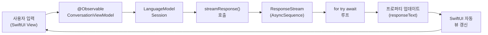
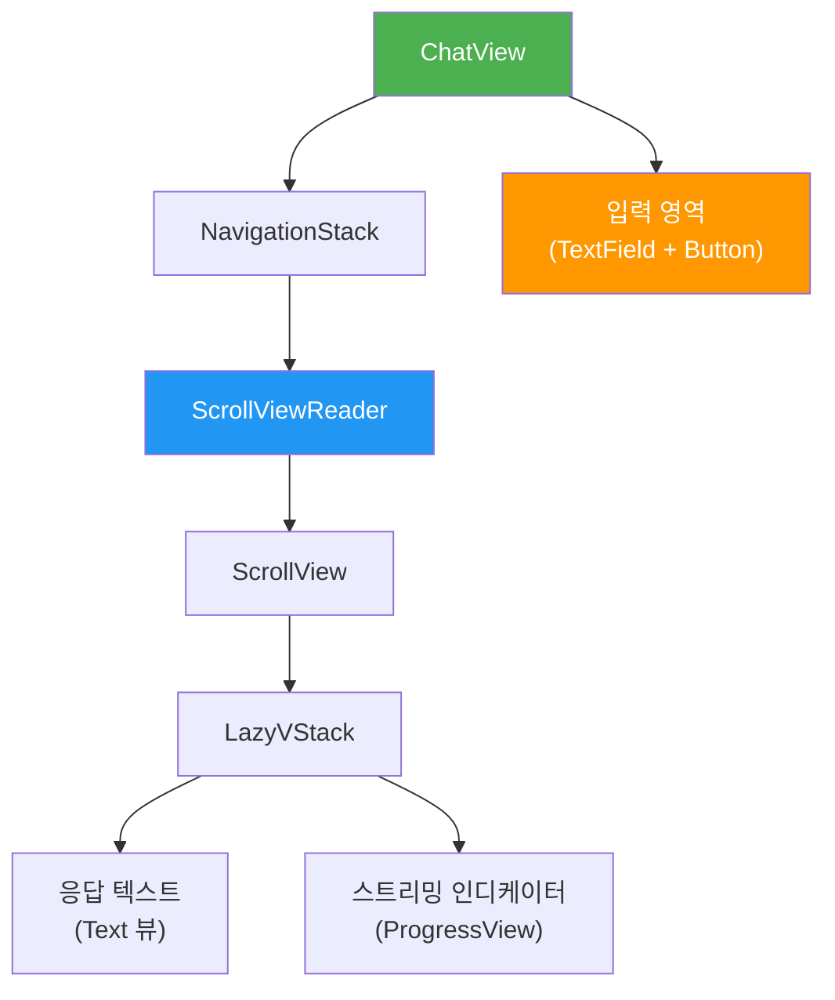
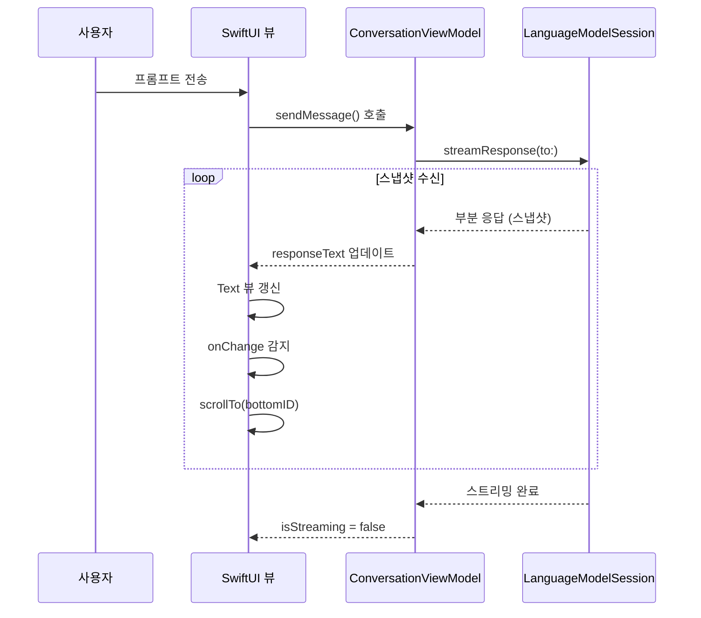
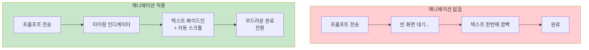
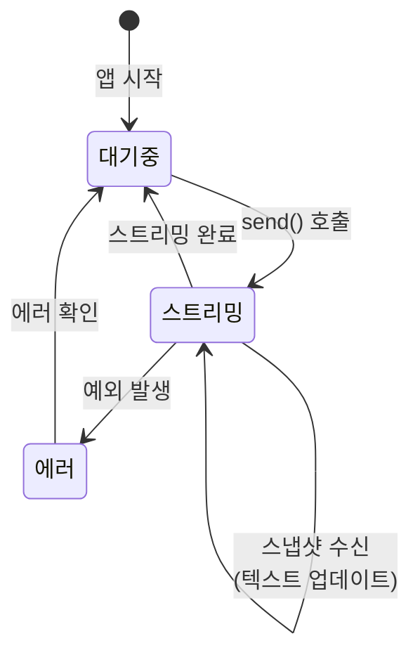

# 02. SwiftUI 실시간 텍스트 렌더링

> @Observable 모델과 스트리밍을 통합하여 AI 응답이 한 글자씩 나타나는 실시간 UI를 구현합니다.

## 개요

이 섹션에서는 [이전 섹션](06-ch6-스트리밍-응답과-실시간-ui/01-01-streamresponse-api-기초.md)에서 배운 `streamResponse(to:)` API를 실제 SwiftUI 뷰에 연결하는 방법을 다룹니다. `@Observable` 매크로 기반 ViewModel을 설계하고, 스트리밍 텍스트가 실시간으로 화면에 렌더링되는 채팅 인터페이스를 만들어 봅니다.

**선수 지식**:
- `streamResponse(to:)`와 `ResponseStream`의 기본 사용법 ([01. streamResponse() API 기초](06-ch6-스트리밍-응답과-실시간-ui/01-01-streamresponse-api-기초.md))
- SwiftUI의 `@State`, `@Observable` 기본 개념 ([05. SwiftUI와 Foundation Models 연결](03-ch3-foundation-models-프레임워크-시작하기/05-05-swiftui와-foundation-models-연결.md))
- `LanguageModelSession`의 기본 사용법

**학습 목표**:
- `@Observable` ViewModel에서 스트리밍 상태를 관리할 수 있다
- 스트리밍 텍스트를 SwiftUI 뷰에 실시간으로 바인딩한다
- `ScrollViewReader`를 활용한 자동 스크롤을 구현한다
- 타이핑 효과와 애니메이션으로 사용자 경험을 향상시킨다

## 왜 알아야 할까?

ChatGPT나 Apple Intelligence를 사용해본 적 있다면, 텍스트가 한 글자씩 또는 한 단어씩 나타나는 "타이핑 효과"를 본 적 있을 겁니다. 단순히 멋져 보이려고 그러는 게 아닙니다 — 이것은 **체감 지연 시간(perceived latency)**을 극적으로 줄이는 핵심 UX 패턴이죠.

사용자가 3초간 빈 화면을 바라보는 것과, 0.3초 만에 첫 글자가 나타나기 시작하는 것은 완전히 다른 경험입니다. 연구에 따르면, 진행 상황이 보이는 인터페이스는 사용자가 같은 대기 시간도 **40% 이상 짧게** 느낀다고 합니다.

Foundation Models 프레임워크의 스트리밍 API는 이 패턴을 위해 설계되었지만, API를 호출하는 것과 "좋은 UX"를 만드는 것은 별개의 문제입니다. `@Observable`로 상태를 관리하고, 애니메이션으로 전환을 부드럽게 하고, 스크롤을 자동으로 따라가게 만드는 — 이 모든 조각을 맞추는 방법을 이번 섹션에서 마스터합니다.

## 핵심 개념

### 개념 1: @Observable ViewModel 패턴 — ConversationViewModel

> 💡 **비유**: 라디오 DJ와 청취자의 관계를 떠올려 보세요. DJ(ViewModel)가 음악을 틀면 청취자(SwiftUI 뷰)의 라디오에서 즉시 소리가 나옵니다. DJ가 채널 주파수(프로퍼티)를 바꾸면 자동으로 청취자에게도 반영되죠. `@Observable`은 바로 이 "자동 주파수 동기화" 장치입니다.

Foundation Models 스트리밍을 SwiftUI와 연결하는 핵심 패턴은 `@Observable` ViewModel입니다. 스트리밍 상태, 응답 텍스트, 로딩 여부 등을 하나의 클래스에서 관리하면, SwiftUI가 프로퍼티 변경을 자동으로 감지하여 뷰를 업데이트합니다.

이 섹션 전체에서 ViewModel 이름은 **`ConversationViewModel`**로 통일합니다. 처음에는 단일 응답만 다루는 간단한 형태로 시작해서, 점차 메시지 히스토리와 애니메이션을 추가하며 확장해 나갈 거예요.

> 📊 **그림 1**: @Observable ViewModel과 SwiftUI 뷰의 데이터 흐름



먼저 가장 간단한 형태의 `ConversationViewModel`부터 살펴봅시다. 단일 응답 하나를 스트리밍하는 기본 구조입니다:

```swift
import FoundationModels
import Observation

@MainActor
@Observable
class ConversationViewModel {
    // MARK: - 뷰에 바인딩되는 상태
    var responseText: String = ""       // 스트리밍 중 부분 텍스트
    var isStreaming: Bool = false        // 현재 스트리밍 진행 중 여부
    var errorMessage: String?           // 에러 메시지
    
    // MARK: - 내부 세션
    private let session = LanguageModelSession()
    
    /// 프롬프트를 보내고 스트리밍 응답을 받습니다.
    func sendMessage(_ prompt: String) async {
        responseText = ""
        isStreaming = true
        errorMessage = nil
        
        do {
            // 스트리밍 시작
            let stream = session.streamResponse(to: prompt)
            
            // 각 스냅샷이 도착할 때마다 텍스트 업데이트
            for try await partialResponse in stream {
                responseText = partialResponse
            }
        } catch {
            errorMessage = error.localizedDescription
        }
        
        isStreaming = false
    }
}
```

여기서 주목할 점이 세 가지 있습니다:

1. **`@MainActor`**: UI 업데이트는 반드시 메인 스레드에서 이뤄져야 합니다. 이 어노테이션이 없으면 런타임 크래시가 발생할 수 있어요.
2. **`@Observable`**: SwiftUI가 `responseText`, `isStreaming` 등의 변경을 자동 추적합니다. 별도의 `objectWillChange.send()` 호출이 필요 없죠.
3. **스냅샷 할당**: `responseText = partialResponse` — 이전 섹션에서 배운 것처럼, Foundation Models는 델타가 아닌 **스냅샷**을 전달합니다. 그래서 `+=`가 아닌 `=`로 대입합니다.

> ⚠️ **흔한 오해**: "스트리밍이니까 `responseText += partialResponse`로 이어붙여야 하는 거 아닌가요?" — 아닙니다! Foundation Models의 스냅샷 스트리밍은 매번 전체 텍스트를 보내줍니다. `+=`를 쓰면 텍스트가 중복되어 쌓이는 버그가 생깁니다.

### 개념 2: SwiftUI 뷰와 스트림 바인딩

> 💡 **비유**: 전광판을 생각해보세요. 경기장 전광판(SwiftUI 뷰)은 점수 시스템(ViewModel)의 데이터가 바뀌면 즉시 화면을 갱신합니다. 개발자가 "화면 새로고침!" 버튼을 누를 필요가 없죠. `@Observable` 프로퍼티가 바뀌면 SwiftUI가 알아서 뷰를 다시 그립니다.

ViewModel을 만들었으니 이제 SwiftUI 뷰에 연결해봅시다. 핵심은 `@State`로 ViewModel 인스턴스를 소유하고, ViewModel의 프로퍼티를 뷰에서 직접 참조하는 것입니다.

> 📊 **그림 2**: SwiftUI 뷰 컴포넌트 구조



기본적인 스트리밍 뷰를 구현해봅시다:

```swift
import SwiftUI
import FoundationModels

struct StreamingChatView: View {
    @State private var viewModel = ConversationViewModel()
    @State private var inputText: String = ""
    
    var body: some View {
        NavigationStack {
            VStack(spacing: 0) {
                // 응답 영역
                ScrollView {
                    VStack(alignment: .leading, spacing: 12) {
                        if !viewModel.responseText.isEmpty {
                            Text(viewModel.responseText)
                                .textSelection(.enabled)  // 텍스트 선택 가능
                                .padding()
                        }
                        
                        // 스트리밍 중 인디케이터
                        if viewModel.isStreaming {
                            HStack(spacing: 8) {
                                ProgressView()
                                    .controlSize(.small)
                                Text("생성 중...")
                                    .font(.caption)
                                    .foregroundStyle(.secondary)
                            }
                            .padding(.horizontal)
                        }
                    }
                    .frame(maxWidth: .infinity, alignment: .leading)
                }
                
                Divider()
                
                // 입력 영역
                HStack(spacing: 12) {
                    TextField("메시지를 입력하세요", text: $inputText)
                        .textFieldStyle(.roundedBorder)
                    
                    Button {
                        let prompt = inputText
                        inputText = ""  // 즉시 입력 필드 비우기
                        Task {
                            await viewModel.sendMessage(prompt)
                        }
                    } label: {
                        Image(systemName: "paperplane.fill")
                    }
                    .disabled(inputText.isEmpty || viewModel.isStreaming)
                }
                .padding()
            }
            .navigationTitle("AI 어시스턴트")
        }
    }
}
```

이 코드에서 SwiftUI의 반응형 특성이 빛을 발합니다. `viewModel.responseText`가 바뀔 때마다 `Text` 뷰가 자동으로 다시 그려지거든요. 별도의 "새로고침" 로직이 전혀 필요 없습니다.

> 🔥 **실무 팁**: `Button` 액션에서 `inputText`를 먼저 비우고 나서 `Task`를 시작하세요. 그래야 사용자가 전송 버튼을 누르는 순간 입력 필드가 즉시 비워져서 반응이 빠르게 느껴집니다.

### 개념 3: ScrollViewReader 자동 스크롤

> 💡 **비유**: 카카오톡에서 새 메시지가 오면 채팅 화면이 자동으로 아래로 스크롤되죠? 이것을 SwiftUI에서는 `ScrollViewReader`와 `scrollTo()`로 구현합니다. 마치 "새 소식이 나올 때마다 자동으로 페이지를 넘겨주는 비서"와 같습니다.

스트리밍 텍스트가 화면을 넘어갈 만큼 길어지면, 사용자가 직접 스크롤하지 않아도 최신 내용이 보여야 합니다. `ScrollViewReader`를 사용하면 프로그래밍 방식으로 특정 위치로 스크롤할 수 있습니다.

> 📊 **그림 3**: 자동 스크롤 동작 시퀀스



자동 스크롤을 추가한 개선 버전입니다:

```swift
struct AutoScrollChatView: View {
    @State private var viewModel = ConversationViewModel()
    @State private var inputText: String = ""
    
    // 스크롤 대상 식별자
    private let bottomAnchorID = "bottom_anchor"
    
    var body: some View {
        NavigationStack {
            VStack(spacing: 0) {
                // ScrollViewReader로 감싸서 프로그래밍 방식 스크롤 활성화
                ScrollViewReader { proxy in
                    ScrollView {
                        LazyVStack(alignment: .leading, spacing: 12) {
                            if !viewModel.responseText.isEmpty {
                                Text(viewModel.responseText)
                                    .textSelection(.enabled)
                                    .padding()
                                    .transition(.opacity)  // 페이드 인 효과
                            }
                            
                            if viewModel.isStreaming {
                                TypingIndicator()
                                    .padding(.horizontal)
                            }
                            
                            // 하단 앵커 — 이 뷰로 스크롤합니다
                            Color.clear
                                .frame(height: 1)
                                .id(bottomAnchorID)
                        }
                    }
                    // responseText가 변경될 때마다 하단으로 스크롤
                    .onChange(of: viewModel.responseText) {
                        withAnimation(.easeOut(duration: 0.15)) {
                            proxy.scrollTo(bottomAnchorID, anchor: .bottom)
                        }
                    }
                }
                
                Divider()
                inputArea
            }
            .navigationTitle("AI 어시스턴트")
        }
    }
    
    // 입력 영역을 별도 computed property로 분리
    private var inputArea: some View {
        HStack(spacing: 12) {
            TextField("메시지를 입력하세요", text: $inputText)
                .textFieldStyle(.roundedBorder)
                .onSubmit { sendCurrentMessage() }
            
            Button(action: sendCurrentMessage) {
                Image(systemName: "paperplane.fill")
            }
            .disabled(inputText.isEmpty || viewModel.isStreaming)
        }
        .padding()
    }
    
    private func sendCurrentMessage() {
        guard !inputText.isEmpty, !viewModel.isStreaming else { return }
        let prompt = inputText
        inputText = ""
        Task { await viewModel.sendMessage(prompt) }
    }
}
```

핵심 트릭은 `Color.clear.frame(height: 1).id(bottomAnchorID)` — 보이지 않는 앵커 뷰를 스크롤 영역 맨 아래에 배치하고, `onChange`에서 이 앵커로 스크롤하는 것입니다.

### 개념 4: 타이핑 효과와 애니메이션

> 💡 **비유**: 영화에서 해커가 터미널에 코드를 칠 때 한 줄씩 나타나는 장면, 혹은 iMessage에서 상대방이 "입력 중..." 말풍선이 떠오르는 순간을 떠올려보세요. 이런 시각적 피드백이 사용자에게 "지금 무언가 진행되고 있다"는 안도감을 줍니다.

WWDC25에서 Apple은 스트리밍 UI에 대해 핵심 조언을 남겼습니다: **"SwiftUI 애니메이션과 전환 효과를 활용해 지연 시간을 숨기세요. 기다림의 순간을 즐거움의 순간으로 바꾸세요."** 이 원칙을 코드로 구현해봅시다.

> 📊 **그림 4**: 애니메이션 적용 전후 사용자 경험 비교



먼저 타이핑 인디케이터 컴포넌트를 만들어봅시다:

```swift
/// "입력 중..." 애니메이션을 표현하는 점 세 개 인디케이터
struct TypingIndicator: View {
    @State private var animatingDots = false
    
    var body: some View {
        HStack(spacing: 4) {
            ForEach(0..<3) { index in
                Circle()
                    .fill(.secondary)
                    .frame(width: 8, height: 8)
                    .scaleEffect(animatingDots ? 1.0 : 0.5)
                    .opacity(animatingDots ? 1.0 : 0.3)
                    .animation(
                        .easeInOut(duration: 0.6)
                        .repeatForever(autoreverses: true)
                        // 각 점마다 시간차를 두어 "물결" 효과
                        .delay(Double(index) * 0.2),
                        value: animatingDots
                    )
            }
        }
        .onAppear { animatingDots = true }
        .padding(.vertical, 8)
        .padding(.horizontal, 16)
        .background(.ultraThinMaterial, in: Capsule())
    }
}
```

그리고 텍스트 등장 시 애니메이션을 적용합니다:

```swift
/// 스트리밍 텍스트에 부드러운 등장 효과를 주는 래퍼 뷰
struct StreamingTextView: View {
    let text: String
    let isStreaming: Bool
    
    var body: some View {
        Text(text)
            .textSelection(.enabled)
            .padding()
            .background(
                RoundedRectangle(cornerRadius: 12)
                    .fill(.ultraThinMaterial)
            )
            // 첫 텍스트 등장 시 부드러운 전환
            .transition(.asymmetric(
                insertion: .opacity.combined(with: .move(edge: .bottom)),
                removal: .opacity
            ))
            // 커서 깜빡임 효과 (스트리밍 중에만)
            .overlay(alignment: .bottomTrailing) {
                if isStreaming {
                    BlinkingCursor()
                        .padding(.trailing, 4)
                        .padding(.bottom, 8)
                }
            }
            .animation(.easeInOut(duration: 0.2), value: text)
    }
}

/// 깜빡이는 커서 — 스트리밍 진행 상태를 시각적으로 표현
struct BlinkingCursor: View {
    @State private var isVisible = true
    
    var body: some View {
        Rectangle()
            .fill(.primary)
            .frame(width: 2, height: 16)
            .opacity(isVisible ? 1 : 0)
            .animation(
                .easeInOut(duration: 0.5).repeatForever(autoreverses: true),
                value: isVisible
            )
            .onAppear { isVisible = false }
    }
}
```

> 💡 **알고 계셨나요?**: WWDC25 세션 "Meet the Foundation Models framework"에서 Apple 엔지니어들이 특별히 강조한 것이 바로 "뷰 아이덴티티(View Identity)"입니다. 배열을 스트리밍할 때 각 요소에 안정적인 `id`를 부여하지 않으면, SwiftUI가 매 스냅샷마다 전체 리스트를 다시 그려서 깜빡거림이 발생합니다. 항상 `.id()` 수정자를 적절히 사용하세요.

### 개념 5: 메시지 기록이 있는 ConversationViewModel 확장

지금까지 `ConversationViewModel`은 단일 응답 하나만 처리했습니다. 실제 채팅 앱에서는 **여러 메시지의 기록**을 관리해야 하죠. 기존 ViewModel을 확장하여 메시지 히스토리를 지원하도록 발전시켜 봅시다.

> 📊 **그림 5**: ConversationViewModel의 상태 전이도



```swift
import FoundationModels
import Observation

/// 하나의 채팅 메시지를 나타내는 모델
struct ChatMessage: Identifiable {
    let id = UUID()
    let role: Role
    var text: String
    
    enum Role {
        case user
        case assistant
    }
}

@MainActor
@Observable
class ConversationViewModel {
    // MARK: - 뷰 바인딩 상태
    var messages: [ChatMessage] = []
    var isStreaming: Bool = false
    var errorMessage: String?
    
    // MARK: - 내부
    private let session = LanguageModelSession()
    
    /// 사용자 메시지를 보내고 AI 응답을 스트리밍합니다.
    func send(_ userText: String) async {
        guard !userText.isEmpty, !isStreaming else { return }
        
        // 1. 사용자 메시지 추가
        messages.append(ChatMessage(role: .user, text: userText))
        
        // 2. AI 응답 플레이스홀더 추가
        let assistantMessage = ChatMessage(role: .assistant, text: "")
        messages.append(assistantMessage)
        let assistantIndex = messages.count - 1
        
        isStreaming = true
        errorMessage = nil
        
        do {
            let stream = session.streamResponse(to: userText)
            
            for try await snapshot in stream {
                // 스냅샷으로 어시스턴트 메시지 텍스트 갱신
                messages[assistantIndex].text = snapshot
            }
        } catch {
            errorMessage = error.localizedDescription
            messages[assistantIndex].text = "⚠️ 응답 생성에 실패했습니다."
        }
        
        isStreaming = false
    }
}
```

개념 1의 단순 버전과 비교해보면, 핵심 변경점은 두 가지입니다:

1. **`responseText: String` → `messages: [ChatMessage]`**: 단일 텍스트 대신 메시지 배열을 관리합니다.
2. **`sendMessage(_:)` → `send(_:)`**: 사용자 메시지와 어시스턴트 플레이스홀더를 배열에 추가한 뒤, 스트리밍 중 해당 인덱스의 `text`를 갱신합니다.

이렇게 하면 메시지 목록의 구조가 안정적으로 유지되어 SwiftUI가 불필요한 뷰 재생성 없이 텍스트만 업데이트합니다. 이 확장된 `ConversationViewModel`이 바로 [05. 완성 앱 프로젝트](06-ch6-스트리밍-응답과-실시간-ui/05-05-완성-앱-프로젝트-streaming-chat-app.md)에서 최종 앱에 사용하는 형태입니다.

## 실습: 직접 해보기

모든 개념을 통합한 완전한 스트리밍 채팅 뷰를 만들어봅시다. 위에서 확장한 `ConversationViewModel`을 그대로 사용합니다.

```swift
import SwiftUI
import FoundationModels

// MARK: - 메시지 모델
struct ChatMessage: Identifiable {
    let id = UUID()
    let role: Role
    var text: String
    let timestamp = Date()
    
    enum Role {
        case user
        case assistant
    }
}

// MARK: - ViewModel
@MainActor
@Observable
class ConversationViewModel {
    var messages: [ChatMessage] = []
    var isStreaming: Bool = false
    var errorMessage: String?
    
    private let session = LanguageModelSession()
    
    func send(_ userText: String) async {
        guard !userText.isEmpty, !isStreaming else { return }
        
        // 사용자 메시지 추가
        messages.append(ChatMessage(role: .user, text: userText))
        
        // 어시스턴트 플레이스홀더 추가
        let assistantMessage = ChatMessage(role: .assistant, text: "")
        messages.append(assistantMessage)
        let index = messages.count - 1
        
        isStreaming = true
        errorMessage = nil
        
        do {
            let stream = session.streamResponse(to: userText)
            
            for try await snapshot in stream {
                messages[index].text = snapshot
            }
        } catch {
            errorMessage = error.localizedDescription
            messages[index].text = "응답을 생성할 수 없습니다."
        }
        
        isStreaming = false
    }
}

// MARK: - 메인 채팅 뷰
struct StreamingChatDemoView: View {
    @State private var viewModel = ConversationViewModel()
    @State private var inputText = ""
    
    private let bottomID = "chat_bottom"
    
    var body: some View {
        NavigationStack {
            VStack(spacing: 0) {
                // 메시지 목록
                ScrollViewReader { proxy in
                    ScrollView {
                        LazyVStack(spacing: 16) {
                            ForEach(viewModel.messages) { message in
                                MessageBubble(
                                    message: message,
                                    isStreaming: viewModel.isStreaming
                                        && message.id == viewModel.messages.last?.id
                                        && message.role == .assistant
                                )
                            }
                            
                            // 하단 앵커
                            Color.clear
                                .frame(height: 1)
                                .id(bottomID)
                        }
                        .padding()
                    }
                    // 메시지가 추가/변경될 때 자동 스크롤
                    .onChange(of: viewModel.messages.count) {
                        scrollToBottom(proxy: proxy)
                    }
                    .onChange(of: viewModel.messages.last?.text) {
                        scrollToBottom(proxy: proxy)
                    }
                }
                
                // 에러 배너
                if let error = viewModel.errorMessage {
                    Text(error)
                        .font(.caption)
                        .foregroundStyle(.red)
                        .padding(.horizontal)
                }
                
                Divider()
                
                // 입력 영역
                HStack(spacing: 12) {
                    TextField("메시지를 입력하세요", text: $inputText)
                        .textFieldStyle(.roundedBorder)
                        .onSubmit(sendMessage)
                    
                    Button(action: sendMessage) {
                        Image(systemName: "paperplane.fill")
                            .symbolEffect(.bounce, value: viewModel.isStreaming)
                    }
                    .buttonStyle(.borderedProminent)
                    .disabled(inputText.isEmpty || viewModel.isStreaming)
                }
                .padding()
            }
            .navigationTitle("스트리밍 채팅")
        }
    }
    
    private func sendMessage() {
        let text = inputText.trimmingCharacters(in: .whitespacesAndNewlines)
        guard !text.isEmpty else { return }
        inputText = ""
        Task { await viewModel.send(text) }
    }
    
    private func scrollToBottom(proxy: ScrollViewProxy) {
        withAnimation(.easeOut(duration: 0.15)) {
            proxy.scrollTo(bottomID, anchor: .bottom)
        }
    }
}

// MARK: - 메시지 말풍선 컴포넌트
struct MessageBubble: View {
    let message: ChatMessage
    let isStreaming: Bool
    
    var body: some View {
        HStack {
            if message.role == .user { Spacer(minLength: 60) }
            
            VStack(alignment: message.role == .user ? .trailing : .leading) {
                Text(message.text.isEmpty ? " " : message.text)
                    .textSelection(.enabled)
                    .padding(12)
                    .background(
                        message.role == .user
                            ? Color.accentColor
                            : Color(.secondarySystemBackground),
                        in: RoundedRectangle(cornerRadius: 16)
                    )
                    .foregroundStyle(
                        message.role == .user ? .white : .primary
                    )
                
                // 스트리밍 중 커서 표시
                if isStreaming && message.role == .assistant {
                    TypingIndicator()
                        .transition(.opacity)
                }
            }
            
            if message.role == .assistant { Spacer(minLength: 60) }
        }
        .transition(.asymmetric(
            insertion: .opacity.combined(with: .move(edge: .bottom)),
            removal: .opacity
        ))
        .animation(.easeInOut(duration: 0.2), value: message.text)
    }
}

// MARK: - 타이핑 인디케이터
struct TypingIndicator: View {
    @State private var animating = false
    
    var body: some View {
        HStack(spacing: 4) {
            ForEach(0..<3) { i in
                Circle()
                    .fill(.secondary)
                    .frame(width: 6, height: 6)
                    .scaleEffect(animating ? 1.0 : 0.5)
                    .animation(
                        .easeInOut(duration: 0.5)
                        .repeatForever(autoreverses: true)
                        .delay(Double(i) * 0.15),
                        value: animating
                    )
            }
        }
        .onAppear { animating = true }
    }
}
```

이 코드를 Xcode 26 프로젝트에 그대로 붙여넣으면 바로 실행할 수 있습니다. 프롬프트를 입력하면 AI 응답이 실시간으로 말풍선에 나타나고, 자동 스크롤과 타이핑 인디케이터가 동작하는 것을 확인할 수 있습니다.

```run:swift
// 실행 결과 시뮬레이션 — 스트리밍 스냅샷의 진행 과정
let snapshots = [
    "Swift는",
    "Swift는 Apple이",
    "Swift는 Apple이 만든",
    "Swift는 Apple이 만든 현대적인",
    "Swift는 Apple이 만든 현대적인 프로그래밍 언어입니다."
]

for (i, snapshot) in snapshots.enumerated() {
    print("스냅샷 \(i + 1): \"\(snapshot)\"")
}
print("\n→ 각 스냅샷이 responseText에 '=' 할당됨 ('+='가 아님!)")
```

```output
스냅샷 1: "Swift는"
스냅샷 2: "Swift는 Apple이"
스냅샷 3: "Swift는 Apple이 만든"
스냅샷 4: "Swift는 Apple이 만든 현대적인"
스냅샷 5: "Swift는 Apple이 만든 현대적인 프로그래밍 언어입니다."

→ 각 스냅샷이 responseText에 '=' 할당됨 ('+='가 아님!)
```

## 더 깊이 알아보기

### 스냅샷 스트리밍의 탄생 배경

전통적인 LLM 스트리밍(OpenAI, Anthropic 등)은 **델타(delta)** 방식을 사용합니다. 모델이 "Hello"를 생성하면 `"H"`, `"e"`, `"l"`, `"l"`, `"o"` 토큰이 하나씩 전달되고, 개발자가 직접 이어붙여야 하죠. 단순 텍스트라면 괜찮지만, 구조화 출력(JSON 같은)을 스트리밍할 때는 악몽이 됩니다 — 불완전한 JSON 파싱, 중간 상태 관리, 에러 복구 등 복잡한 코드가 필요합니다.

Apple 팀은 WWDC25에서 이 문제를 정면으로 해결했습니다. `@Generable` 매크로가 자동으로 생성하는 `PartiallyGenerated` 타입은 모든 프로퍼티를 옵셔널로 만들어서, 아직 생성되지 않은 필드는 `nil`, 생성된 필드는 값이 채워진 **스냅샷**을 보냅니다. 개발자 입장에서는 "지금까지 완성된 전체 그림"을 매번 받는 것이고, 이것을 그냥 SwiftUI에 넘기면 끝입니다.

이 설계 철학은 Apple이 오랫동안 견지해온 **선언적 프로그래밍** 접근과 일맥상통합니다. 2019년 SwiftUI가 "뷰는 상태의 함수"라고 선언한 것처럼, Foundation Models의 스트리밍도 "현재 응답의 스냅샷"이라는 선언적 모델을 따릅니다.

### @Observable의 역사

`@Observable` 매크로는 WWDC23에서 처음 소개되었습니다. 그 전에는 `ObservableObject` 프로토콜 + `@Published` 프로퍼티 래퍼 조합을 써야 했는데, 이 패턴에는 두 가지 문제가 있었어요. 첫째, 뷰에서 `@ObservedObject`/`@StateObject`를 명시해야 하고, 둘째, `@Published`로 선언하지 않은 프로퍼티는 변경이 감지되지 않았습니다.

`@Observable`은 Swift 매크로 시스템을 활용하여 **모든 저장 프로퍼티**에 자동으로 변경 추적을 삽입합니다. 뷰 쪽에서는 `@State`만 쓰면 되고, 어떤 프로퍼티가 추적되는지 신경 쓸 필요가 없어졌죠. Foundation Models와의 조합에서 특히 빛나는데, `responseText`든 `isStreaming`이든 `errorMessage`든, 바뀌는 순간 SwiftUI가 즉시 알아채고 관련 뷰만 다시 그립니다.

## 흔한 오해와 팁

> ⚠️ **흔한 오해**: "`@MainActor`를 안 붙여도 `@Observable` 클래스가 잘 작동하던데요?" — 개발 중에는 문제없어 보일 수 있지만, 스트리밍 콜백이 백그라운드 스레드에서 실행될 경우 Swift 6의 Strict Concurrency 검사에서 경고가 발생하고, 런타임에 데이터 레이스가 일어날 수 있습니다. ViewModel에는 항상 `@MainActor`를 명시하세요.

> 💡 **알고 계셨나요?**: Foundation Models의 `LanguageModelSession`은 `isResponding` 프로퍼티를 제공합니다. 직접 `isStreaming` 플래그를 관리하는 대신 `session.isResponding`을 활용하면 코드가 더 간결해집니다. 다만, ViewModel에서 추가 상태(에러, 메시지 목록 등)를 관리해야 할 때는 커스텀 플래그가 더 유연합니다.

> 🔥 **실무 팁**: `onChange(of:)`에서 스크롤할 때, 애니메이션 duration을 `0.1~0.2`초로 짧게 잡으세요. 너무 길면 스트리밍 속도를 따라잡지 못하고 뚝뚝 끊기는 느낌이 나고, 너무 짧으면 점프하는 느낌이 듭니다. Apple이 WWDC25에서 권장한 값은 "빠르되 부드러운" 느낌의 `easeOut(duration: 0.15)` 정도입니다.

> 🔥 **실무 팁**: `LazyVStack`을 사용하면 화면에 보이는 메시지만 렌더링하여 메모리를 절약합니다. 대화가 수백 개로 길어져도 성능이 유지되므로, 채팅 UI에서는 `VStack` 대신 항상 `LazyVStack`을 사용하세요.

## 핵심 정리

| 개념 | 설명 |
|------|------|
| `ConversationViewModel` | `@MainActor @Observable class`로 스트리밍 상태를 관리. 단일 응답부터 메시지 히스토리까지 확장 가능 |
| 스냅샷 할당 | `responseText = snapshot` (`=` 사용). `+=`가 아님 — 매번 전체 텍스트가 전달됨 |
| `ScrollViewReader` | `proxy.scrollTo(id, anchor:)`로 프로그래밍 방식 자동 스크롤 구현 |
| 하단 앵커 패턴 | `Color.clear.frame(height: 1).id("bottom")`를 스크롤 영역 하단에 배치 |
| `onChange(of:)` | 스트리밍 텍스트 변경 시마다 자동 스크롤 트리거 |
| 타이핑 인디케이터 | 점 3개 물결 애니메이션으로 "생성 중" 상태를 시각적으로 표현 |
| 뷰 아이덴티티 | 배열 요소에 안정적인 `id`를 부여하여 불필요한 뷰 재생성 방지 |
| `LazyVStack` | 대량 메시지에서도 화면에 보이는 뷰만 렌더링하여 성능 유지 |

## 다음 섹션 미리보기

지금까지는 일반 텍스트(`String`)의 스트리밍을 다뤘습니다. 하지만 Foundation Models의 진짜 강력한 기능은 **구조화 출력의 스트리밍**이죠. 다음 섹션 [03. 구조화 출력의 부분 스트리밍](06-ch6-스트리밍-응답과-실시간-ui/03-03-구조화-출력의-부분-스트리밍.md)에서는 `@Generable` 구조체의 `PartiallyGenerated` 타입을 활용하여 JSON과 같은 구조화 데이터가 필드별로 점진적으로 채워지는 UI를 구현합니다. 레시피 카드가 이미지부터 나타나고, 재료 목록, 조리법 순서대로 하나씩 나타나는 — 그런 고급 UX를 만들어봅니다.

## 참고 자료

- [Meet the Foundation Models framework — WWDC25](https://developer.apple.com/videos/play/wwdc2025/286/) - Apple이 직접 설명하는 스트리밍 패턴과 SwiftUI 애니메이션 권장 사항. 뷰 아이덴티티 주의사항이 핵심
- [Building AI features using Foundation Models: Streaming — Swift with Majid](https://swiftwithmajid.com/2025/10/08/building-ai-features-using-foundation-models-streaming/) - @Observable ViewModel 패턴과 구조화 출력 스트리밍의 실전 코드 예시
- [The Ultimate Guide To The Foundation Models Framework — AzamSharp](https://azamsharp.com/2025/06/18/the-ultimate-guide-to-the-foundation-models-framework.html) - RecipeRecommender ViewModel 예시로 배우는 스트리밍 + SwiftUI 통합 패턴
- [Using the Foundation Models Framework for On-Device AI in SwiftUI — Livsy Code](https://livsycode.com/swiftui/using-the-foundation-models-framework-for-on-device-ai-in-swiftui/) - 스트리밍 텍스트를 SwiftUI 뷰에 직접 바인딩하는 가장 간결한 패턴
- [Deep dive into the Foundation Models framework — WWDC25](https://developer.apple.com/videos/play/wwdc2025/301/) - 구조화 출력 스트리밍, 프로퍼티 순서, PartiallyGenerated 타입의 내부 동작

---
### 🔗 Related Sessions
- [streamresponse(to:)](06-ch6-스트리밍-응답과-실시간-ui/01-01-streamresponse-api-기초.md) (prerequisite)
- [responsestream](06-ch6-스트리밍-응답과-실시간-ui/01-01-streamresponse-api-기초.md) (prerequisite)
- [스냅샷 스트리밍](06-ch6-스트리밍-응답과-실시간-ui/01-01-streamresponse-api-기초.md) (prerequisite)
