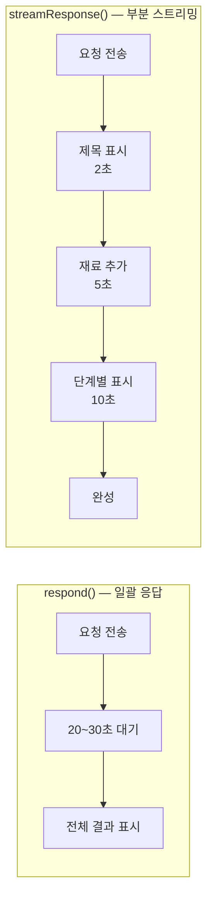
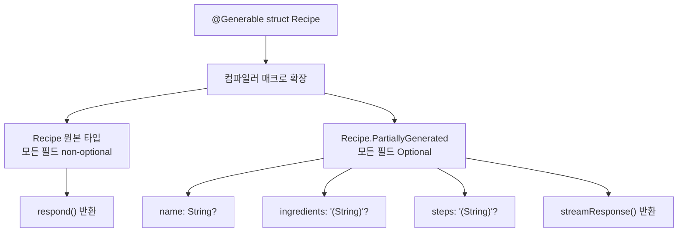
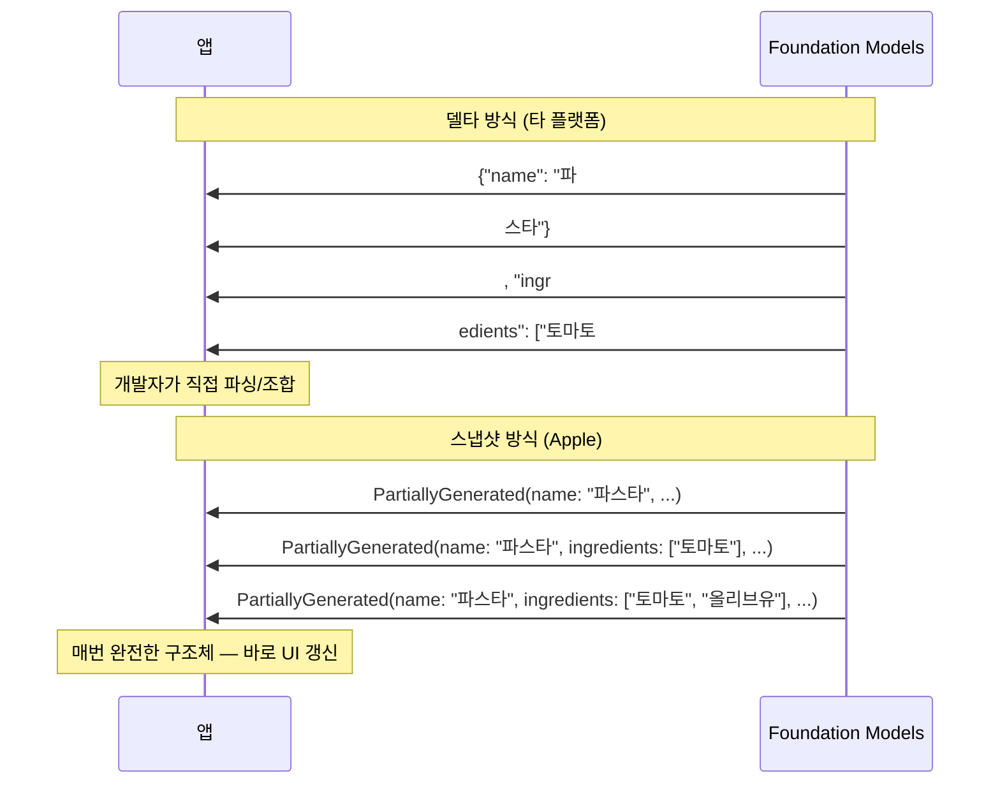
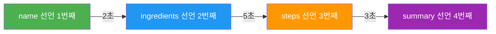
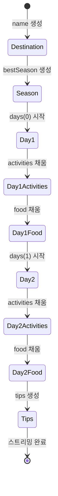

# 구조화 출력의 부분 스트리밍

> @Generable 타입의 스트리밍 응답을 PartiallyGenerated로 받아, 필드가 하나씩 채워지는 실시간 UI를 구현합니다.

## 개요

이 섹션에서는 Foundation Models 프레임워크의 가장 독창적인 기능 중 하나인 **구조화 출력의 부분 스트리밍**을 다룹니다. 앞서 [streamResponse() API 기초](06-ch6-스트리밍-응답과-실시간-ui/01-01-streamresponse-api-기초.md)에서 텍스트 스트리밍을, [SwiftUI 실시간 텍스트 렌더링](06-ch6-스트리밍-응답과-실시간-ui/02-02-swiftui-실시간-텍스트-렌더링.md)에서 채팅 UI 바인딩을 배웠는데요. 이번에는 단순 텍스트가 아닌 **Swift 구조체의 각 필드가 점진적으로 채워지는** 스트리밍을 구현합니다.

**선수 지식**:
- `streamResponse()` 메서드와 `ResponseStream`의 기본 동작 (세션 6.1)
- `@Observable` ViewModel과 SwiftUI 바인딩 (세션 6.2)
- `@Generable`/`@Guide` 매크로 기초 (Ch5 전체)

**학습 목표**:
- `PartiallyGenerated` 타입의 구조와 생성 원리를 이해한다
- `streamResponse(to:generating:)` 메서드로 구조화 출력을 스트리밍한다
- 필드별 점진적 UI 업데이트 패턴을 SwiftUI로 구현한다
- 프로퍼티 선언 순서가 스트리밍에 미치는 영향을 파악한다

## 왜 알아야 할까?

AI 앱에서 구조화 출력을 사용하는 경우를 떠올려 보세요. 레시피 앱이 요리 이름, 재료 목록, 조리 단계를 생성한다고 합시다. `respond()` 메서드를 쓰면 모든 필드가 완성될 때까지 20~30초를 빈 화면으로 기다려야 합니다. 사용자는 "앱이 멈췄나?" 하고 불안해하죠.

하지만 `streamResponse()`로 구조화 출력을 스트리밍하면, **요리 이름이 먼저 나타나고, 재료가 하나씩 추가되고, 조리 단계가 순서대로 채워지는** 생동감 있는 경험을 제공할 수 있습니다. 이것이 바로 `PartiallyGenerated` 타입의 힘입니다.

> 📊 **그림 1**: respond() vs streamResponse()의 사용자 체감 비교



Ch5에서 배운 [@Generable 매크로](05-ch5-generable-구조화-출력/02-02-generable-매크로-적용하기.md)와 Ch6 앞부분의 스트리밍 기초가 여기서 만나 **타입 안전한 실시간 구조화 출력**이라는 강력한 패턴을 완성합니다.

## 핵심 개념

### 개념 1: PartiallyGenerated 타입의 정체

> 💡 **비유**: 온라인 쇼핑몰에서 상품 페이지가 로딩되는 것을 떠올려 보세요. 처음에 상품명이 뜨고, 가격이 나타나고, 리뷰 별점이 채워지고, 마지막으로 상세 설명이 로드됩니다. 모든 정보가 한 번에 "빵!" 하고 나타나지 않죠. `PartiallyGenerated`는 이렇게 **아직 다 채워지지 않은 상품 페이지**와 같습니다 — 각 항목이 optional이라 있을 수도, 아직 없을 수도 있는 상태입니다.

`@Generable` 매크로를 구조체에 적용하면, 컴파일러가 자동으로 **`PartiallyGenerated`라는 내부 타입**을 생성합니다. 이 타입은 원본 구조체의 거울상이지만, **모든 프로퍼티가 Optional**로 선언되어 있습니다.

```swift
// 여러분이 작성하는 코드
@Generable
struct Recipe {
    @Guide(description: "요리 이름")
    var name: String
    
    @Guide(description: "필요한 재료 목록", .count(3...8))
    var ingredients: [String]
    
    @Guide(description: "조리 단계", .count(3...6))
    var steps: [String]
}
```

매크로가 확장되면 내부적으로 이런 타입이 만들어집니다:

```swift
// 컴파일러가 자동 생성하는 타입 (개념적 표현)
extension Recipe {
    struct PartiallyGenerated {
        var name: String?       // 아직 생성 안 됐을 수 있음
        var ingredients: [String]?  // nil이면 아직 생성 시작 전
        var steps: [String]?    // 마지막에 채워질 필드
    }
}
```

> 📊 **그림 2**: @Generable 매크로의 타입 생성 구조



핵심은 이겁니다: `respond()`는 완성된 `Recipe`를 반환하고, `streamResponse()`는 `Recipe.PartiallyGenerated`의 **AsyncSequence**를 반환합니다. 스트림의 각 요소는 필드가 점점 더 채워진 스냅샷이죠.

### 개념 2: 스냅샷 스트리밍 vs 델타 스트리밍

> 💡 **비유**: 그림을 그리는 화가를 두 가지 방식으로 관찰한다고 상상해 보세요. **델타 방식**은 화가가 붓질할 때마다 "오른쪽으로 3cm 빨간 선"처럼 변경분만 알려주는 겁니다. 여러분이 머릿속으로 전체 그림을 조합해야 하죠. **스냅샷 방식**은 붓질할 때마다 현재까지 완성된 그림 전체를 사진으로 찍어 보여주는 겁니다. Apple의 Foundation Models는 후자를 선택했습니다.

전통적인 LLM API(OpenAI, Anthropic 등)는 **델타 스트리밍**을 사용합니다. 토큰이 하나씩 전달되고, 개발자가 이전 토큰들과 합쳐서 전체 응답을 재구성해야 합니다. 구조화 출력에서는 JSON 파편을 누적하다가 파싱해야 하니 상당히 까다롭죠.

Apple은 이 문제를 **스냅샷 스트리밍**으로 우아하게 해결했습니다:

> 📊 **그림 3**: 델타 스트리밍 vs 스냅샷 스트리밍 비교



스냅샷 방식의 장점은 명확합니다:
- **파싱 불필요**: 매 스냅샷이 이미 타입 안전한 Swift 구조체
- **SwiftUI 친화적**: 선언적 UI는 상태의 "현재 모습"만 알면 됨
- **에러 내성**: 중간에 스트림이 끊겨도 마지막 스냅샷이 유효한 부분 결과

### 개념 3: streamResponse(to:generating:) 호출 패턴

이제 실제 API를 살펴보겠습니다. 구조화 출력 스트리밍의 핵심 메서드는 `streamResponse(to:generating:)`입니다.

```swift
import FoundationModels

// 1. @Generable 타입 정의
@Generable
struct MovieReview {
    @Guide(description: "영화 제목")
    var title: String
    
    @Guide(description: "1~5 사이의 평점", .range(1...5))
    var rating: Int
    
    @Guide(description: "한 줄 요약")
    var summary: String
    
    @Guide(description: "상세 리뷰 내용")
    var detail: String
}

// 2. 세션 생성 및 스트리밍 요청
let session = LanguageModelSession(
    instructions: "영화 리뷰를 작성하는 전문 비평가입니다."
)

// 3. generating: 파라미터로 @Generable 타입을 지정
let stream = session.streamResponse(
    to: "인터스텔라에 대한 리뷰를 작성해주세요.",
    generating: MovieReview.self
)

// 4. for try await로 부분 결과를 순차 수신
for try await partial in stream {
    // partial의 타입: MovieReview.PartiallyGenerated
    if let title = partial.title {
        print("제목: \(title)")
    }
    if let rating = partial.rating {
        print("평점: \(rating)/5")
    }
    if let summary = partial.summary {
        print("요약: \(summary)")
    }
    // detail은 가장 마지막에 채워짐
}

// 5. 최종 완성된 결과 수집
let finalReview = try await stream.collect()
// finalReview의 타입: MovieReview (non-optional)
```

`respond()`와의 차이를 정리하면:

| 구분 | `respond(to:generating:)` | `streamResponse(to:generating:)` |
|------|---------------------------|----------------------------------|
| 반환 타입 | `MovieReview` | `ResponseStream<MovieReview>` |
| 스트림 요소 | — | `MovieReview.PartiallyGenerated` |
| 대기 시간 | 전체 생성 완료까지 | 첫 필드 생성 즉시 |
| `collect()` | — | 최종 `MovieReview` 반환 |

### 개념 4: 프로퍼티 선언 순서의 중요성

> 💡 **비유**: 이력서를 작성할 때 이름부터 쓰고, 경력을 쓰고, 마지막에 자기소개서를 쓰는 것처럼 — Foundation Models도 구조체의 프로퍼티를 **선언된 순서대로** 생성합니다. 이건 단순한 구현 디테일이 아니라 **콘텐츠 품질에도 영향을 미치는** 중요한 설계 결정입니다.

WWDC25에서 Apple은 이 점을 명확하게 강조했습니다:

> "프로퍼티는 소스 코드에서 선언된 순서대로 생성됩니다. 이 순서는 한 프로퍼티의 값이 다른 프로퍼티에 영향을 받을 것으로 기대할 때 중요합니다."

> 📊 **그림 4**: 프로퍼티 선언 순서와 생성/스트리밍 타이밍



이 순서가 왜 중요할까요? 두 가지 이유입니다:

**1. 콘텐츠 품질**: 요약(`summary`)을 맨 마지막에 두면, 모델이 앞서 생성한 모든 내용을 참고하여 더 정확한 요약을 만들 수 있습니다.

```swift
// 좋은 순서 — summary가 나머지를 참고할 수 있음
@Generable
struct Recipe {
    var name: String        // 1번째 생성
    var ingredients: [String] // 2번째 생성
    var steps: [String]     // 3번째 생성
    var summary: String     // 마지막 — 위 내용을 요약
}

// 나쁜 순서 — summary가 아직 없는 내용을 요약해야 함
@Generable
struct RecipeBad {
    var summary: String     // 1번째?! 뭘 요약하지?
    var name: String
    var ingredients: [String]
    var steps: [String]
}
```

**2. UX 설계**: 사용자가 가장 먼저 보고 싶은 정보를 위에 선언하면, 첫 스트리밍 결과가 의미 있는 피드백이 됩니다.

> ⚠️ **흔한 오해**: "프로퍼티 순서는 Swift 구조체에서 상관없다"고 생각할 수 있지만, `@Generable`에서는 **선언 순서가 곧 생성 순서**입니다. 일반 Swift 코딩에서는 순서가 기능에 영향을 주지 않지만, Guided Generation에서는 모델의 출력 품질과 스트리밍 UX에 직접적인 영향을 줍니다.

## 실습: 직접 해보기

여행 일정 생성기를 만들어 보겠습니다. 사용자가 여행지를 입력하면 일정이 필드별로 점진적으로 채워지는 UI를 구현합니다.

### Step 1: @Generable 모델 정의

```swift
import FoundationModels

// 하루 일정을 나타내는 중첩 구조체
@Generable
struct DayPlan {
    @Guide(description: "몇 번째 날인지 (예: Day 1)")
    var dayLabel: String
    
    @Guide(description: "그 날의 주요 활동 목록", .count(2...4))
    var activities: [String]
    
    @Guide(description: "추천 식당 또는 음식")
    var food: String
}

// 전체 여행 일정
@Generable
struct TravelItinerary {
    @Guide(description: "여행지 이름")
    var destination: String
    
    @Guide(description: "추천 여행 시기")
    var bestSeason: String
    
    @Guide(description: "일별 상세 일정", .count(2...4))
    var days: [DayPlan]
    
    @Guide(description: "여행 팁과 주의사항")  // 마지막: 위 내용 참고하여 생성
    var tips: String
}
```

### Step 2: ViewModel 구현

```swift
import SwiftUI
import FoundationModels

@MainActor
@Observable
class ItineraryViewModel {
    // 부분 생성 결과를 저장하는 상태
    var partialItinerary: TravelItinerary.PartiallyGenerated?
    var isGenerating = false
    var errorMessage: String?
    
    // 생성 진행 단계를 추적
    var currentPhase: GenerationPhase = .idle
    
    enum GenerationPhase: String {
        case idle = "대기 중"
        case destination = "여행지 확인 중..."
        case season = "추천 시기 분석 중..."
        case planning = "일정 생성 중..."
        case tips = "여행 팁 작성 중..."
        case complete = "완료!"
    }
    
    private var generationTask: Task<Void, Never>?
    
    func generateItinerary(for place: String, days: Int) {
        // 이전 작업이 있으면 취소
        generationTask?.cancel()
        
        generationTask = Task {
            isGenerating = true
            partialItinerary = nil
            currentPhase = .destination
            errorMessage = nil
            
            do {
                let session = LanguageModelSession(
                    instructions: """
                    여행 플래너입니다. \
                    현실적이고 실용적인 여행 일정을 만듭니다. \
                    한국어로 작성합니다.
                    """
                )
                
                let stream = session.streamResponse(
                    to: "\(place)로 \(days)일 여행 일정을 만들어주세요.",
                    generating: TravelItinerary.self
                )
                
                // 스트림 순회 — 각 스냅샷으로 UI 갱신
                for try await partial in stream {
                    // Task 취소 확인
                    guard !Task.isCancelled else { break }
                    
                    // 스냅샷 업데이트
                    self.partialItinerary = partial
                    
                    // 어떤 필드가 채워졌는지에 따라 단계 갱신
                    updatePhase(from: partial)
                }
                
                currentPhase = .complete
            } catch {
                errorMessage = "생성 실패: \(error.localizedDescription)"
            }
            
            isGenerating = false
        }
    }
    
    // 현재 채워진 필드를 기반으로 진행 단계 업데이트
    private func updatePhase(
        from partial: TravelItinerary.PartiallyGenerated
    ) {
        if partial.tips != nil {
            currentPhase = .tips
        } else if partial.days != nil {
            currentPhase = .planning
        } else if partial.bestSeason != nil {
            currentPhase = .season
        } else if partial.destination != nil {
            currentPhase = .destination
        }
    }
    
    func cancel() {
        generationTask?.cancel()
        isGenerating = false
        currentPhase = .idle
    }
}
```

### Step 3: SwiftUI 뷰 구현

```swift
struct ItineraryStreamingView: View {
    @State private var viewModel = ItineraryViewModel()
    @State private var destination = ""
    @State private var dayCount = 3
    
    var body: some View {
        NavigationStack {
            ScrollView {
                VStack(alignment: .leading, spacing: 20) {
                    // 입력 영역
                    inputSection
                    
                    // 진행 상태 표시
                    if viewModel.isGenerating {
                        phaseIndicator
                    }
                    
                    // 부분 결과 표시
                    if let partial = viewModel.partialItinerary {
                        itineraryContent(partial)
                    }
                    
                    // 에러 표시
                    if let error = viewModel.errorMessage {
                        Text(error)
                            .foregroundStyle(.red)
                            .padding()
                    }
                }
                .padding()
            }
            .navigationTitle("AI 여행 플래너")
        }
    }
    
    // 입력 폼
    private var inputSection: some View {
        VStack(spacing: 12) {
            TextField("여행지를 입력하세요", text: $destination)
                .textFieldStyle(.roundedBorder)
            
            Stepper("여행 기간: \(dayCount)일", value: $dayCount, in: 2...7)
            
            HStack {
                Button("일정 생성") {
                    viewModel.generateItinerary(
                        for: destination,
                        days: dayCount
                    )
                }
                .buttonStyle(.borderedProminent)
                .disabled(destination.isEmpty || viewModel.isGenerating)
                
                if viewModel.isGenerating {
                    Button("취소", role: .cancel) {
                        viewModel.cancel()
                    }
                    .buttonStyle(.bordered)
                }
            }
        }
    }
    
    // 생성 단계 인디케이터
    private var phaseIndicator: some View {
        HStack {
            ProgressView()
            Text(viewModel.currentPhase.rawValue)
                .foregroundStyle(.secondary)
                .contentTransition(.numericText())
        }
        .animation(.easeInOut, value: viewModel.currentPhase.rawValue)
    }
    
    // 부분 결과를 필드별로 표시
    @ViewBuilder
    private func itineraryContent(
        _ partial: TravelItinerary.PartiallyGenerated
    ) -> some View {
        VStack(alignment: .leading, spacing: 16) {
            // destination — 가장 먼저 채워짐
            if let dest = partial.destination {
                Text(dest)
                    .font(.title)
                    .bold()
                    .transition(.blurReplace)
            }
            
            // bestSeason — 두 번째
            if let season = partial.bestSeason {
                Label(season, systemImage: "calendar")
                    .font(.subheadline)
                    .foregroundStyle(.secondary)
                    .transition(.blurReplace)
            }
            
            // days — 배열이 점진적으로 늘어남
            if let days = partial.days {
                ForEach(Array(days.enumerated()), id: \.offset) { index, day in
                    dayCard(day, index: index)
                        .transition(.move(edge: .bottom).combined(with: .opacity))
                }
            }
            
            // tips — 마지막에 채워짐
            if let tips = partial.tips {
                VStack(alignment: .leading, spacing: 8) {
                    Label("여행 팁", systemImage: "lightbulb.fill")
                        .font(.headline)
                    Text(tips)
                        .font(.body)
                        .foregroundStyle(.secondary)
                }
                .padding()
                .background(.yellow.opacity(0.1), in: RoundedRectangle(cornerRadius: 12))
                .transition(.blurReplace)
            }
        }
        .animation(.easeInOut(duration: 0.3), value: partial.destination)
        .animation(.easeInOut(duration: 0.3), value: partial.bestSeason)
        .animation(.easeInOut(duration: 0.3), value: partial.tips)
    }
    
    // 하루 일정 카드
    private func dayCard(
        _ day: DayPlan.PartiallyGenerated,
        index: Int
    ) -> some View {
        VStack(alignment: .leading, spacing: 8) {
            if let label = day.dayLabel {
                Text(label)
                    .font(.headline)
                    .foregroundStyle(.blue)
            }
            
            if let activities = day.activities {
                ForEach(activities, id: \.self) { activity in
                    HStack(alignment: .top) {
                        Image(systemName: "mappin.circle.fill")
                            .foregroundStyle(.orange)
                        Text(activity)
                    }
                }
            }
            
            if let food = day.food {
                HStack {
                    Image(systemName: "fork.knife")
                        .foregroundStyle(.green)
                    Text(food)
                        .italic()
                }
            }
        }
        .padding()
        .frame(maxWidth: .infinity, alignment: .leading)
        .background(.ultraThinMaterial, in: RoundedRectangle(cornerRadius: 12))
    }
}
```

### Step 4: collect()로 최종 결과 활용

스트리밍이 끝난 후 완성된 데이터를 저장하거나 추가 처리가 필요하다면 `collect()`를 사용합니다:

```swift
// ViewModel에 추가
func generateAndSave(for place: String, days: Int) async {
    do {
        let session = LanguageModelSession(
            instructions: "여행 플래너입니다."
        )
        
        let stream = session.streamResponse(
            to: "\(place)로 \(days)일 여행 일정을 만들어주세요.",
            generating: TravelItinerary.self
        )
        
        // 스트리밍으로 실시간 UI 갱신
        for try await partial in stream {
            self.partialItinerary = partial
        }
        
        // 최종 완성된 결과 수집 (타입: TravelItinerary)
        let completed = try await stream.collect()
        // completed.destination은 String (non-optional!)
        // completed.days는 [DayPlan] (non-optional!)
        
        // 로컬 저장, 서버 전송 등 후처리
        saveToDisk(completed)
    } catch {
        errorMessage = error.localizedDescription
    }
}
```

```run:swift
// 스트리밍 흐름 시뮬레이션 (개념 이해용)
let phases = [
    "스냅샷 1: destination = \"교토\"",
    "스냅샷 2: destination = \"교토\", bestSeason = \"봄 (3~4월)\"",
    "스냅샷 3: + days[0] = Day 1 (킨카쿠지, 아라시야마)",
    "스냅샷 4: + days[1] = Day 2 (후시미이나리, 기온)",
    "스냅샷 5: + tips = \"교토 버스 1일권을 구매하세요\""
]

for (i, phase) in phases.enumerated() {
    print("[\(i + 1)/\(phases.count)] \(phase)")
}
print("\n✅ 스트리밍 완료 — collect()로 TravelItinerary 수집 가능")
```

```output
[1/5] 스냅샷 1: destination = "교토"
[2/5] 스냅샷 2: destination = "교토", bestSeason = "봄 (3~4월)"
[3/5] 스냅샷 3: + days[0] = Day 1 (킨카쿠지, 아라시야마)
[4/5] 스냅샷 4: + days[1] = Day 2 (후시미이나리, 기온)
[5/5] 스냅샷 5: + tips = "교토 버스 1일권을 구매하세요"

✅ 스트리밍 완료 — collect()로 TravelItinerary 수집 가능
```

## 더 깊이 알아보기

### 스냅샷 스트리밍이 탄생한 배경

구조화 출력 스트리밍은 사실 업계에서 오랫동안 풀리지 않던 문제였습니다. OpenAI가 2023년에 JSON 모드를 도입했을 때, 스트리밍과 구조화 출력은 **양립이 어려운** 기능으로 여겨졌습니다. JSON 토큰이 하나씩 오면 `{"na` → `me":` → `"파스` 같은 파편이 전달되는데, 이걸 중간에 파싱하려면 불완전한 JSON을 처리하는 별도의 파서가 필요했거든요.

Apple 엔지니어들은 이 문제를 **프레임워크 레벨에서** 해결하기로 했습니다. 2025년 WWDC에서 발표된 Foundation Models 프레임워크는 내부적으로 토큰 스트림을 받아 JSON을 파싱하고, 유효한 상태가 될 때마다 Swift 구조체로 변환하여 `PartiallyGenerated` 스냅샷을 제공합니다. 개발자는 JSON 파싱을 전혀 신경 쓸 필요가 없죠.

WWDC25 세션 "Meet the Foundation Models framework"에서 Apple 엔지니어는 이렇게 말했습니다: *"델타를 스냅샷으로 변환하는 작업을 프레임워크가 담당하므로, 여러분은 SwiftUI 같은 선언적 프레임워크와 자연스럽게 통합할 수 있습니다."*

> 💡 **알고 계셨나요?**: Apple의 스냅샷 스트리밍 접근법은 React의 상태 관리 철학과 매우 유사합니다. React도 "상태의 현재 모습"만 선언하면 프레임워크가 변경분을 계산하여 DOM을 업데이트하죠. SwiftUI도 같은 패러다임이고, `PartiallyGenerated` 스냅샷은 이 선언적 모델과 완벽하게 맞아떨어집니다. 이건 우연이 아니라 Apple이 의도적으로 설계한 겁니다.

### 중첩 @Generable과 배열 스트리밍

실습 코드의 `TravelItinerary`에서 `days: [DayPlan]`처럼 중첩 `@Generable` 배열을 사용했는데요, 이때 배열 요소도 점진적으로 추가됩니다. 첫 번째 `DayPlan`의 모든 필드가 채워진 후 두 번째 `DayPlan`이 시작되는 식이죠. 이 동작은 프로퍼티 선언 순서 규칙의 자연스러운 확장입니다.

> 📊 **그림 5**: 중첩 @Generable 배열의 스트리밍 타임라인



SwiftUI에서 배열을 렌더링할 때 **뷰 아이덴티티(View Identity)**에 주의해야 합니다. 배열 인덱스가 변하면 SwiftUI가 뷰를 재생성하므로, `ForEach`에서 안정적인 식별자를 사용하는 것이 중요합니다.

## 흔한 오해와 팁

> ⚠️ **흔한 오해**: "PartiallyGenerated의 Optional 프로퍼티는 nil에서 값으로 한 번만 전환된다." — 사실이 아닙니다. 특히 `String` 타입 필드는 토큰이 추가될 때마다 점점 길어지는 스냅샷이 전달될 수 있습니다. 예를 들어 `summary`가 처음에 `"간단한"`이었다가 다음 스냅샷에서 `"간단한 요약입니다"`로 업데이트됩니다. nil → 값의 전환은 한 번이지만, 값 자체는 스냅샷마다 업데이트될 수 있습니다.

> 💡 **알고 계셨나요?**: `PartiallyGenerated` 타입은 `@Generable` 매크로를 Xcode에서 "Expand Macro"하면 직접 확인할 수 있습니다. 매크로가 생성하는 코드를 보면 `Sendable` 적합성, 내부 초기화자 등 프레임워크가 얼마나 많은 보일러플레이트를 대신 처리하는지 알 수 있습니다.

> 🔥 **실무 팁**: 구조화 출력 스트리밍에서 **프로퍼티 선언 순서를 UI 우선순위에 맞추세요**. 사용자가 가장 먼저 확인하고 싶은 정보(제목, 이름 등)를 첫 번째 프로퍼티로, 부가 정보나 요약을 마지막 프로퍼티로 배치하면 체감 응답 속도가 크게 개선됩니다. 또한 SwiftUI에서 `.transition()`과 `.animation()`을 적절히 조합하면 필드가 나타나는 순간이 자연스러운 애니메이션으로 연결되어 대기 시간을 "즐거운 경험"으로 바꿀 수 있습니다.

## 핵심 정리

| 개념 | 설명 |
|------|------|
| `PartiallyGenerated` | `@Generable` 매크로가 자동 생성하는 내부 타입. 모든 프로퍼티가 Optional |
| 스냅샷 스트리밍 | 토큰 델타가 아닌 완전한 부분 구조체 스냅샷을 매번 전달하는 방식 |
| `streamResponse(to:generating:)` | `@Generable` 타입을 스트리밍으로 생성하는 API. `ResponseStream` 반환 |
| `collect()` | 스트림 완료 후 최종 완성된 non-optional 구조체를 수집 |
| 프로퍼티 선언 순서 | 생성 순서를 결정. UX 우선순위와 콘텐츠 품질에 영향 |
| 중첩 @Generable 배열 | 배열 요소도 순차적으로 하나씩 생성되어 스트리밍됨 |
| SwiftUI 통합 | `PartiallyGenerated`를 `@State`/@`Observable`에 바인딩, `transition`으로 애니메이션 |

## 다음 섹션 미리보기

필드가 점진적으로 채워지는 멋진 UI를 만들었는데, 사용자가 "생성 중단!"을 누르면 어떻게 될까요? 네트워크 오류나 모델 과부하로 스트림이 끊기면? 다음 섹션 [스트리밍 제어: 취소, 에러, 타임아웃](06-ch6-스트리밍-응답과-실시간-ui/04-04-스트리밍-제어-취소-에러-타임아웃.md)에서는 `Task` 취소 전파, `GenerationError` 처리, 타임아웃 패턴, 그리고 부분 결과 복구 전략을 다룹니다. 스트리밍의 "해피 패스"를 넘어 **견고한 프로덕션 코드**를 작성하는 방법을 배워보겠습니다.

## 참고 자료

- [Deep dive into the Foundation Models framework — WWDC25](https://developer.apple.com/videos/play/wwdc2025/301/) - `@Generable` 구조화 출력 스트리밍의 공식 발표. 프로퍼티 순서와 `PartiallyGenerated` 설명 포함
- [Meet the Foundation Models framework — WWDC25](https://developer.apple.com/videos/play/wwdc2025/286/) - Foundation Models 전체 개요와 스냅샷 스트리밍 철학 소개
- [Building AI features using Foundation Models: Streaming — Swift with Majid](https://swiftwithmajid.com/2025/10/08/building-ai-features-using-foundation-models-streaming/) - 구조화 출력 스트리밍의 실전 코드 예제와 SwiftUI 통합 패턴
- [Exploring the Foundation Models framework — Create with Swift](https://www.createwithswift.com/exploring-the-foundation-models-framework/) - `PartiallyGenerated` 타입의 상세 설명과 `streamResponse` API 분석
- [The Ultimate Guide To The Foundation Models Framework — AzamSharp](https://azamsharp.com/2025/06/18/the-ultimate-guide-to-the-foundation-models-framework.html) - `@Generable` 스트리밍 실습과 레시피 앱 구현 예제

---
### 🔗 Related Sessions
- [responsestream](06-ch6-스트리밍-응답과-실시간-ui/01-01-streamresponse-api-기초.md) (prerequisite)
- [@generable](05-ch5-generable-구조화-출력/01-01-guided-generation-개념과-동작-원리.md) (prerequisite)
