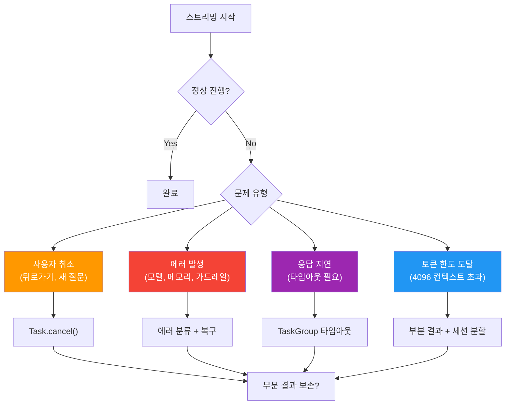
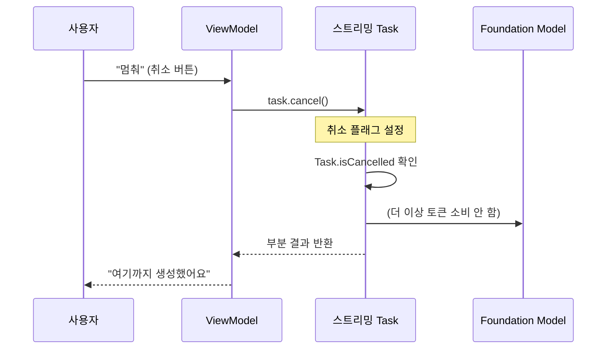
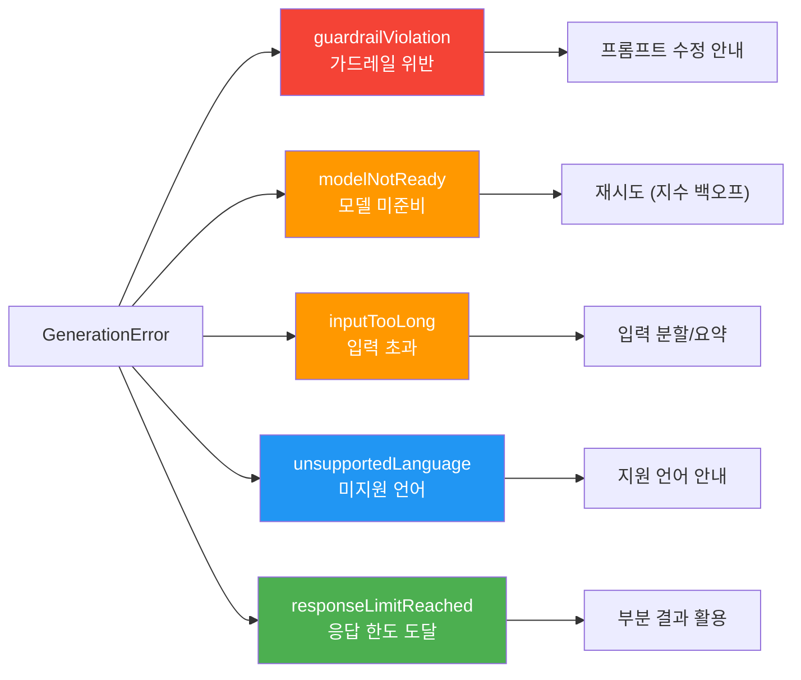
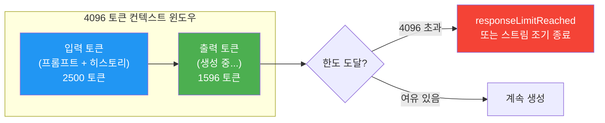
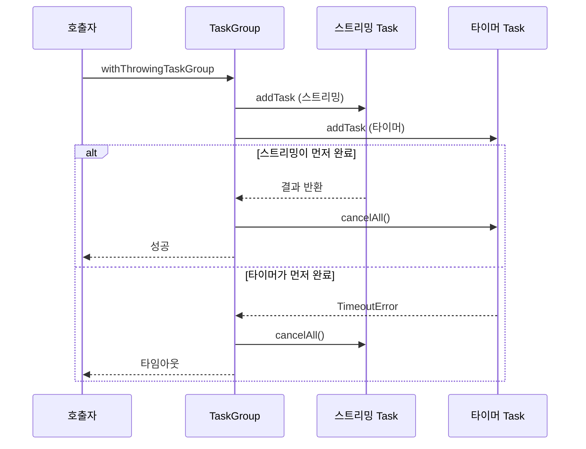
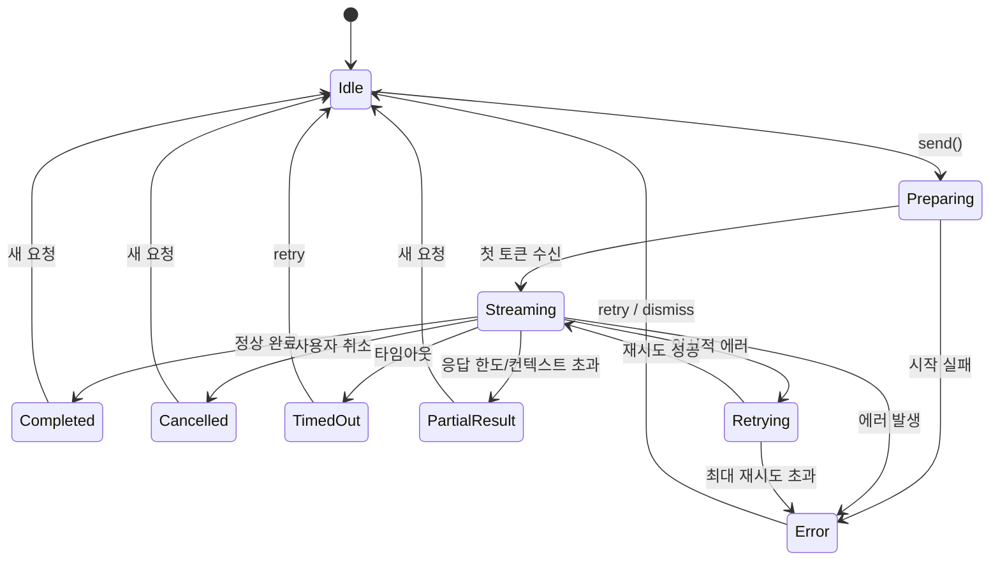

# 04. 스트리밍 제어: 취소, 에러, 타임아웃

> 스트리밍 응답을 안전하게 멈추고, 에러를 우아하게 처리하며, 적절한 시간 안에 응답을 보장하는 기술

## 개요

이 섹션에서는 스트리밍 응답의 **제어 흐름**을 다룹니다. 앞서 [01. streamResponse() API 기초](06-스트리밍-응답과-실시간-ui/01-streamresponse-api-기초.md)에서 스트리밍을 시작하는 방법을, [03. 토큰 단위 처리와 성능 최적화](06-스트리밍-응답과-실시간-ui/03-토큰-단위-처리와-성능-최적화.md)에서 성능을 높이는 방법을 배웠다면, 이번에는 **문제가 생겼을 때** 어떻게 대응하는지 알아봅니다.

**선수 지식**: `streamResponse()` API 사용법, Swift Concurrency(`async/await`, `Task`), `GenerationOptions` 설정
**학습 목표**:
- Swift의 협력적 취소(Cooperative Cancellation) 모델로 스트리밍을 안전하게 중단하기
- `FoundationModels`의 에러 타입을 분류하고 각각에 맞는 복구 전략 세우기
- 컨텍스트 윈도우 한도 도달 시 스트리밍 에러를 감지하고 대응하기
- `TaskGroup` 기반 타임아웃 패턴으로 응답 시간을 보장하기
- 부분 결과를 살려내는 복구 패턴 구현하기
- 재시도 전략과 지수 백오프를 적용한 프로덕션급 에러 핸들링 구현하기

## 왜 알아야 할까?

스트리밍은 "시작하기"보다 **"멈추기"**가 훨씬 어렵습니다. 사용자가 채팅 중 뒤로가기를 눌렀는데 모델이 계속 토큰을 생성한다면? 네트워크 문제로 에러가 났는데 앱이 멈춰버린다면? 모델이 10초 넘게 응답하지 않는데 로딩 스피너만 돌아간다면?

프로덕션 앱에서 이런 상황을 방치하면 **메모리 누수**, **좀비 태스크**, **사용자 이탈**로 이어집니다. Apple Foundation Models는 온디바이스 모델이라 네트워크 에러는 적지만, 모델 로딩 실패, 메모리 부족, 가드레일 차단, 그리고 **4096 토큰 컨텍스트 윈도우 초과** 같은 **고유한 에러 시나리오**가 존재합니다.

특히 스트리밍 도중에 컨텍스트 윈도우 한도에 도달하면 갑자기 응답이 끊기는데, 이를 적절히 처리하지 않으면 사용자는 "앱이 고장났나?" 하고 생각하게 됩니다. 에러 시나리오 하나하나에 대한 **구체적인 대응 전략**이 있어야 진짜 프로덕션 앱이죠.

> 📊 **그림 1**: 스트리밍에서 발생할 수 있는 문제 상황들



## 핵심 개념

### 개념 1: 협력적 취소 — "멈춰!"라고 부탁하기

> 💡 **비유**: 협력적 취소는 **"비상 정지 버튼"**이 아니라 **"어깨 톡톡"**입니다. 식당에서 주문을 취소할 때 주방에 이미 들어간 요리를 쟁반째 엎는 게 아니라, 셰프에게 "이거 안 해도 돼요"라고 말하는 거죠. 셰프가 현재 하던 작업을 마무리하고 깔끔하게 중단할 수 있는 기회를 주는 겁니다.

Swift Concurrency의 취소는 **협력적(cooperative)**입니다. `Task.cancel()`을 호출해도 코드가 즉시 멈추지 않아요. 대신 해당 Task에 "취소 플래그"가 설정되고, 실행 중인 코드가 이 플래그를 **확인하고 스스로 종료**해야 합니다.

> 📊 **그림 2**: 협력적 취소의 동작 흐름



스트리밍에서 취소를 구현하는 핵심 패턴을 보겠습니다:

```swift
import FoundationModels

class ChatViewModel: ObservableObject {
    @Published var responseText = ""
    @Published var isGenerating = false
    
    private var currentTask: Task<Void, Never>?
    private let session = LanguageModelSession()
    
    // 새 요청 시작 — 기존 스트리밍 자동 취소
    func send(_ prompt: String) {
        // 이전 스트리밍이 진행 중이면 취소
        currentTask?.cancel()
        
        responseText = ""
        isGenerating = true
        
        currentTask = Task {
            defer { 
                Task { @MainActor in self.isGenerating = false }
            }
            
            do {
                let stream = session.streamResponse(to: prompt)
                
                for try await partial in stream {
                    // 취소 확인 — 협력적 종료 지점
                    if Task.isCancelled { 
                        break  // 루프 탈출, defer에서 정리
                    }
                    
                    await MainActor.run {
                        self.responseText = partial.currentResponse
                    }
                }
            } catch is CancellationError {
                // 취소는 에러가 아님 — 조용히 종료
                print("스트리밍이 취소되었습니다")
            } catch {
                await MainActor.run {
                    self.responseText = "오류: \(error.localizedDescription)"
                }
            }
        }
    }
    
    // 명시적 취소 (정지 버튼)
    func stop() {
        currentTask?.cancel()
    }
}
```

여기서 핵심은 세 가지입니다:

1. **`currentTask?.cancel()`**: 새 요청 시 이전 스트리밍을 자동 취소합니다. 사용자가 연속으로 질문해도 좀비 태스크가 남지 않죠.
2. **`Task.isCancelled` 체크**: `for try await` 루프 내부에서 매 토큰마다 취소 여부를 확인합니다.
3. **`CancellationError` 분리 처리**: 취소는 "정상적인 중단"이므로 에러 UI를 보여줄 필요가 없습니다.

> 💡 **알고 계셨나요?**: Java의 `Thread.stop()` 메서드는 강제 종료 방식이었는데, 스레드가 어떤 상태에 있든 즉시 중단시켜버려서 락(lock)이 해제되지 않거나 데이터가 반쯤 기록되는 심각한 버그를 유발했습니다. 결국 Java 1.2에서 deprecated되었고, 이후 모든 현대 언어는 Swift처럼 **협력적 취소** 모델을 채택했습니다. Apple이 Swift Concurrency를 설계할 때도 이 교훈을 반영한 거예요.

### 개념 2: GenerationError — 에러의 5가지 얼굴

> 💡 **비유**: 에러 처리는 **병원 응급실의 트리아지(중증도 분류)**와 같습니다. 환자(에러)가 들어오면 먼저 종류를 파악하고, 경증이면 간단히 처치하고, 중증이면 전문 조치를 취하죠. 모든 에러를 "문제가 발생했습니다"로 퉁치는 건, 모든 환자에게 밴드만 붙여주는 것과 같습니다.

`FoundationModels` 프레임워크는 `LanguageModelSession.GenerationError`를 통해 구체적인 에러 원인을 알려줍니다. 각 케이스별로 적절한 대응이 다릅니다:

> 📊 **그림 3**: GenerationError 분류와 대응 전략



각 에러를 분류하는 코드를 작성해보겠습니다:

```run:swift
import FoundationModels

// GenerationError 케이스별 사용자 메시지 분류
func classifyError(_ error: Error) -> (message: String, canRetry: Bool) {
    guard let genError = error as? LanguageModelSession.GenerationError else {
        return ("알 수 없는 오류가 발생했습니다.", false)
    }
    
    switch genError {
    case .guardrailViolation:
        return ("안전 정책에 의해 차단되었습니다. 다른 방식으로 질문해보세요.", false)
    case .modelNotReady:
        return ("모델을 준비하는 중입니다. 잠시 후 다시 시도해주세요.", true)
    case .inputTooLong:
        return ("입력이 너무 깁니다. 더 짧게 질문해보세요.", false)
    case .unsupportedLanguage:
        return ("현재 지원하지 않는 언어입니다.", false)
    case .responseLimitReached:
        return ("최대 응답 길이에 도달했습니다.", false)
    @unknown default:
        return ("일시적인 오류입니다. 다시 시도해주세요.", true)
    }
}

// 시뮬레이션
let errorCases = ["guardrailViolation", "modelNotReady", "inputTooLong", 
                   "unsupportedLanguage", "responseLimitReached"]
for name in errorCases {
    print("[\(name)]")
}
print("\n총 \(errorCases.count)가지 에러 케이스 처리 완료")
```

```output
[guardrailViolation]
[modelNotReady]
[inputTooLong]
[unsupportedLanguage]
[responseLimitReached]

총 5가지 에러 케이스 처리 완료
```

> ⚠️ **흔한 오해**: "온디바이스 모델이니까 네트워크 에러는 없겠지?" — 맞습니다! 하지만 그 대신 **메모리 부족**, **모델 로딩 실패**, **가드레일 차단** 같은 온디바이스 고유의 에러가 있어요. 서버 기반 LLM API의 429(Rate Limit)나 503(Service Unavailable) 대신, `modelNotReady`나 `guardrailViolation`을 만나게 됩니다.

### 개념 3: 컨텍스트 윈도우 초과 — 스트리밍 도중의 숨겨진 함정

> 💡 **비유**: 컨텍스트 윈도우는 **칠판의 크기**와 같습니다. 선생님이 칠판에 쓸 수 있는 공간이 제한되어 있듯이, Apple Foundation Models도 **입력 + 출력 합산 최대 4096 토큰**이라는 칠판 크기 제한이 있습니다. 긴 대화를 나누다 보면 칠판이 꽉 차서 더 이상 쓸 수 없게 되는 거죠.

Apple Foundation Models의 온디바이스 모델은 컨텍스트 윈도우가 **4096 토큰**으로 제한됩니다. 이 제한은 입력(프롬프트 + 대화 히스토리)과 출력(생성 응답)을 **합산**한 값이에요. 스트리밍 도중에 이 한도에 도달하면 어떻게 될까요?

> 📊 **그림 3-1**: 컨텍스트 윈도우와 스트리밍의 관계



스트리밍에서 컨텍스트 윈도우 한도에 도달하면 두 가지 중 하나가 발생합니다:

1. **`responseLimitReached` 에러**: 생성이 중단되고 에러가 throw됨
2. **스트림 조기 종료**: 에러 없이 스트림이 끝나지만, 문장이 중간에 잘림

두 경우 모두 **부분 결과를 보존하면서 사용자에게 상황을 알려야** 합니다. 특히 멀티턴 대화에서는 대화가 길어질수록 입력 토큰이 누적되어 출력에 쓸 수 있는 토큰이 줄어들거든요.

```swift
import FoundationModels

class ContextAwareStreamHandler: ObservableObject {
    @Published var text = ""
    @Published var tokenWarning: String?
    
    private let session = LanguageModelSession()
    private let maxContextTokens = 4096
    
    func streamWithContextCheck(_ prompt: String) async {
        var accumulated = ""
        
        do {
            let stream = session.streamResponse(to: prompt)
            
            for try await partial in stream {
                guard !Task.isCancelled else { break }
                
                accumulated = partial.currentResponse
                await MainActor.run {
                    self.text = accumulated
                }
            }
        } catch let error as LanguageModelSession.GenerationError {
            switch error {
            case .responseLimitReached:
                // 컨텍스트 윈도우 초과로 인한 조기 종료
                await MainActor.run {
                    self.text = accumulated + "\n\n⚠️ 응답 길이 한도에 도달했습니다."
                    self.tokenWarning = "대화가 길어져 응답이 잘렸습니다. 새 세션을 시작하면 더 긴 응답을 받을 수 있어요."
                }
                
            case .inputTooLong:
                // 입력 자체가 컨텍스트 윈도우를 초과
                await MainActor.run {
                    self.text = "입력이 너무 깁니다. 대화 히스토리를 줄이거나 새 세션을 시작해주세요."
                }
                
            default:
                let (msg, _) = classifyError(error)
                await MainActor.run { self.text = msg }
            }
        } catch {
            await MainActor.run {
                self.text = "오류: \(error.localizedDescription)"
            }
        }
    }
    
    /// 새 세션으로 교체 — 컨텍스트 윈도우 리셋
    func resetSession() -> LanguageModelSession {
        return LanguageModelSession()
    }
}

func classifyError(_ error: Error) -> (String, Bool) {
    return ("오류가 발생했습니다", false)
}
```

```run:swift
// 컨텍스트 윈도우 사용량 시뮬레이션
let maxTokens = 4096
let scenarios = [
    ("짧은 질문", 50, 500),
    ("중간 대화 (3턴)", 800, 1200),
    ("긴 대화 (10턴)", 2500, 1596),
    ("매우 긴 대화 (20턴)", 3800, 296),
    ("한도 초과", 3900, 196),
]

print("=== 컨텍스트 윈도우 사용량 시뮬레이션 ===")
print(String(format: "%-22s  입력    출력    합계    남은 여유", "시나리오"))
print(String(repeating: "-", count: 65))
for (name, input, output) in scenarios {
    let total = input + output
    let remaining = maxTokens - total
    let warning = remaining < 500 ? " ⚠️" : ""
    print(String(format: "%-22s  %4d    %4d    %4d    %4d%s", 
                 name, input, output, total, remaining, warning))
}
```

```output
=== 컨텍스트 윈도우 사용량 시뮬레이션 ===
시나리오                  입력    출력    합계    남은 여유
-----------------------------------------------------------------
짧은 질문                   50     500     550    3546
중간 대화 (3턴)            800    1200    2000    2096
긴 대화 (10턴)            2500    1596    4096       0 ⚠️
매우 긴 대화 (20턴)       3800     296    4096       0 ⚠️
한도 초과                  3900     196    4096       0 ⚠️
```

대화가 길어질수록 출력에 쓸 수 있는 토큰이 급격히 줄어드는 것이 보이시죠? 이 문제의 근본적 해결책은 [02. 토큰 한도와 대화 관리 전략](09-컨텍스트-윈도우-관리/02-토큰-한도와-대화-관리-전략.md)에서 다루는 **대화 히스토리 압축/슬라이딩 윈도우** 전략입니다. 여기서는 스트리밍 관점에서 에러를 감지하고 부분 결과를 보존하는 것에 집중합니다.

> 🔥 **실무 팁**: 멀티턴 대화 앱에서는 `LanguageModelSession`이 자동으로 대화 히스토리를 관리하지만, 히스토리가 쌓이면 출력 토큰 여유분이 줄어듭니다. 스트리밍 시작 전에 대략적인 입력 토큰 수를 추정하고, 남은 여유가 **500 토큰 미만**이면 사용자에게 "새 대화를 시작하시겠습니까?" 라고 안내하는 것이 좋습니다.

### 개념 4: 스트리밍 에러 복구 패턴과 재시도 전략

스트리밍 도중 에러가 발생하면, 이미 받은 토큰들은 어떻게 될까요? 그냥 버리기엔 아깝습니다. **부분 결과를 살려내는 복구 패턴**과 함께, 복구 가능한 에러에 대한 **지수 백오프 재시도**까지 구현해보겠습니다:

```swift
import FoundationModels

class ResilientStreamHandler: ObservableObject {
    @Published var text = ""
    @Published var status: StreamStatus = .idle
    
    enum StreamStatus: Equatable {
        case idle
        case streaming
        case completed
        case partialResult(reason: String) // 부분 결과로 종료
        case error(String)
        case retrying(attempt: Int, maxAttempts: Int) // 재시도 중
    }
    
    private let session = LanguageModelSession()
    private let maxRetryAttempts = 3
    
    func generate(_ prompt: String) async {
        status = .streaming
        var accumulated = ""
        
        do {
            let stream = session.streamResponse(to: prompt)
            
            for try await partial in stream {
                guard !Task.isCancelled else {
                    // 취소 시에도 지금까지의 결과 보존
                    status = .partialResult(reason: "사용자 취소")
                    return
                }
                
                accumulated = partial.currentResponse
                await MainActor.run { self.text = accumulated }
            }
            
            status = .completed
            
        } catch let error as LanguageModelSession.GenerationError {
            await handleGenerationError(error, partialText: accumulated, prompt: prompt)
        } catch is CancellationError {
            status = .partialResult(reason: "취소됨")
        } catch {
            status = .error(error.localizedDescription)
        }
    }
    
    private func handleGenerationError(
        _ error: LanguageModelSession.GenerationError,
        partialText: String,
        prompt: String
    ) async {
        switch error {
        case .responseLimitReached:
            // 최대 길이 도달 — 받은 만큼은 유효한 결과
            await MainActor.run {
                self.text = partialText + "\n\n(최대 응답 길이에 도달했습니다)"
                self.status = .partialResult(reason: "응답 한도")
            }
            
        case .guardrailViolation:
            // 가드레일 — 부분 결과도 폐기가 안전
            await MainActor.run {
                self.text = ""
                self.status = .error("안전 정책에 의해 차단되었습니다")
            }
            
        case .modelNotReady:
            // 재시도 가능 — 지수 백오프로 재시도
            await retryWithBackoff(prompt: prompt, partialText: partialText)
            
        default:
            let (message, _) = classifyError(error)
            await MainActor.run {
                self.status = .error(message)
            }
        }
    }
    
    /// 지수 백오프 재시도 — modelNotReady 등 일시적 에러용
    private func retryWithBackoff(prompt: String, partialText: String) async {
        for attempt in 1...maxRetryAttempts {
            guard !Task.isCancelled else { return }
            
            await MainActor.run {
                self.status = .retrying(attempt: attempt, maxAttempts: maxRetryAttempts)
            }
            
            // 지수 백오프: 1초, 2초, 4초...
            let delay = TimeInterval(pow(2.0, Double(attempt - 1)))
            try? await Task.sleep(for: .seconds(delay))
            
            guard !Task.isCancelled else { return }
            
            do {
                var result = partialText
                let stream = session.streamResponse(to: prompt)
                
                for try await partial in stream {
                    guard !Task.isCancelled else { break }
                    result = partial.currentResponse
                    await MainActor.run { self.text = result }
                }
                
                await MainActor.run { self.status = .completed }
                return  // 성공 — 루프 탈출
                
            } catch is LanguageModelSession.GenerationError {
                continue  // 다음 재시도
            } catch {
                break  // 복구 불가능한 에러
            }
        }
        
        await MainActor.run {
            self.status = .error("모델 준비 중... \(maxRetryAttempts)회 재시도 후에도 실패했습니다")
        }
    }
}

func classifyError(_ error: Error) -> (String, Bool) {
    return ("오류가 발생했습니다", false)
}
```

핵심은 두 가지입니다:

1. **`accumulated` 변수**: 스트리밍 루프 바깥에서 선언해두고, 에러 발생 시에도 **마지막으로 받은 텍스트를 참조**할 수 있게 합니다. `responseLimitReached`처럼 "에러이지만 결과는 유효한" 경우, 부분 결과를 사용자에게 보여주는 것이 훨씬 좋은 UX입니다.

2. **지수 백오프 재시도**: `modelNotReady` 같은 일시적 에러는 단순 재시도가 아니라 1초 → 2초 → 4초로 대기 시간을 늘려가며 시도합니다. 모델 로딩 중에 빠르게 반복 요청하면 오히려 부하만 가중되거든요.

### 개념 5: TaskGroup 타임아웃 — 시간 제한 걸기

> 💡 **비유**: 타임아웃은 **피자 배달 보장 시간**과 같습니다. "30분 안에 배달 안 되면 무료!" 약속이 있으면 고객은 안심하고 기다릴 수 있죠. 스트리밍에도 "N초 안에 첫 토큰이 안 오면 포기"라는 보장이 있어야 사용자가 무한정 기다리지 않습니다.

Apple Foundation Models는 별도의 타임아웃 API를 제공하지 않습니다. 왜냐하면 Swift Concurrency 자체가 `TaskGroup`을 통한 강력한 타임아웃 패턴을 지원하기 때문입니다. Apple은 "프레임워크마다 타임아웃을 구현하기보다, 언어 수준의 범용 도구를 쓰라"는 철학을 갖고 있어요.

> 📊 **그림 4**: TaskGroup 기반 타임아웃 패턴



```swift
import FoundationModels

// 타임아웃 에러 정의
struct StreamTimeoutError: Error {
    let seconds: TimeInterval
    var localizedDescription: String {
        "\(Int(seconds))초 안에 응답을 받지 못했습니다"
    }
}

// TaskGroup 기반 타임아웃 래퍼
func streamWithTimeout(
    session: LanguageModelSession,
    prompt: String,
    timeout: TimeInterval = 15,
    onToken: @Sendable @escaping (String) async -> Void
) async throws -> String {
    
    try await withThrowingTaskGroup(of: String?.self) { group in
        // Task 1: 실제 스트리밍
        group.addTask {
            var result = ""
            let stream = session.streamResponse(to: prompt)
            
            for try await partial in stream {
                result = partial.currentResponse
                await onToken(result)
            }
            return result
        }
        
        // Task 2: 타임아웃 타이머
        group.addTask {
            try await Task.sleep(for: .seconds(timeout))
            throw StreamTimeoutError(seconds: timeout)
        }
        
        // 먼저 끝나는 쪽의 결과를 사용
        let result = try await group.next()
        group.cancelAll()  // 나머지 Task 취소
        
        return result ?? ""
    }
}
```

이 패턴은 **경주(Race)** 패턴이라고도 합니다. 스트리밍 Task와 타이머 Task를 동시에 출발시키고, 먼저 도착하는 쪽이 이기는 거죠. 스트리밍이 먼저 끝나면 타이머를 취소하고, 타이머가 먼저 끝나면 스트리밍을 취소합니다.

실전에서는 **2단계 타임아웃**이 더 유용합니다. 첫 토큰까지 허용하는 시간과 전체 완료까지 허용하는 시간을 분리하는 거죠:

```swift
import FoundationModels

/// 2단계 타임아웃: 첫 토큰 + 전체 응답
func streamWithDualTimeout(
    session: LanguageModelSession,
    prompt: String,
    firstTokenTimeout: TimeInterval = 5,  // 첫 토큰까지 5초
    totalTimeout: TimeInterval = 30,       // 전체 응답까지 30초
    onToken: @Sendable @escaping (String) async -> Void
) async throws -> String {
    
    try await withThrowingTaskGroup(of: String?.self) { group in
        // 전체 타임아웃 타이머
        group.addTask {
            try await Task.sleep(for: .seconds(totalTimeout))
            throw StreamTimeoutError(seconds: totalTimeout)
        }
        
        // 스트리밍 + 첫 토큰 타임아웃 결합
        group.addTask {
            var result = ""
            var firstTokenReceived = false
            
            // 첫 토큰 타임아웃을 위한 내부 TaskGroup
            try await withThrowingTaskGroup(of: Void.self) { innerGroup in
                innerGroup.addTask {
                    try await Task.sleep(for: .seconds(firstTokenTimeout))
                    if !firstTokenReceived {
                        throw StreamTimeoutError(seconds: firstTokenTimeout)
                    }
                }
                
                innerGroup.addTask {
                    let stream = session.streamResponse(to: prompt)
                    for try await partial in stream {
                        if !firstTokenReceived { firstTokenReceived = true }
                        result = partial.currentResponse
                        await onToken(result)
                    }
                }
                
                // 첫 번째 완료/에러를 기다림
                try await innerGroup.next()
                innerGroup.cancelAll()
            }
            
            return result
        }
        
        let result = try await group.next()
        group.cancelAll()
        return result ?? ""
    }
}
```

### 개념 6: StreamingState 상태 머신

실제 프로덕션 앱에서는 "스트리밍 중", "취소됨", "에러", "타임아웃" 같은 상태를 체계적으로 관리해야 합니다. 상태 머신(State Machine) 패턴을 적용하면 모든 전이(transition)가 명확해집니다:

> 📊 **그림 5**: StreamingState 상태 머신



```swift
import Foundation

// 스트리밍 상태 정의
enum StreamingState: Equatable {
    case idle                          // 대기
    case preparing                     // 모델 준비 중
    case streaming(tokenCount: Int)    // 스트리밍 중 (받은 토큰 수)
    case completed                     // 정상 완료
    case cancelled(partial: String)    // 사용자 취소 (부분 결과)
    case timedOut                      // 타임아웃
    case error(ErrorInfo)              // 에러
    case partialResult(reason: String) // 부분 결과로 종료
    case retrying(attempt: Int, maxAttempts: Int) // 재시도 중
    
    struct ErrorInfo: Equatable {
        let message: String
        let canRetry: Bool
    }
    
    // 현재 상태에서 가능한 전이인지 검증
    var canStartNewStream: Bool {
        switch self {
        case .idle, .completed, .cancelled, .timedOut, .error, .partialResult:
            return true
        case .preparing, .streaming, .retrying:
            return false  // 먼저 취소해야 함
        }
    }
    
    // UI에 "중단" 버튼을 보여줘야 하는 상태인지
    var isActive: Bool {
        switch self {
        case .preparing, .streaming, .retrying:
            return true
        default:
            return false
        }
    }
}
```

```run:swift
// 상태 전이 시뮬레이션
let transitions = [
    ("idle", "preparing", "send()"),
    ("preparing", "streaming", "첫 토큰"),
    ("streaming", "completed", "정상 완료"),
    ("streaming", "cancelled", "사용자 취소"),
    ("streaming", "timedOut", "15초 초과"),
    ("streaming", "error", "가드레일 차단"),
    ("streaming", "partialResult", "컨텍스트 4096 초과"),
    ("streaming", "retrying", "modelNotReady"),
    ("retrying", "streaming", "재시도 성공"),
    ("retrying", "error", "3회 실패"),
]

print("=== StreamingState 전이 테이블 ===")
print(String(format: "%-15s → %-15s  트리거", "From", "To"))
print(String(repeating: "-", count: 55))
for (from, to, trigger) in transitions {
    print(String(format: "%-15s → %-15s  %s", from, to, trigger))
}
```

```output
=== StreamingState 전이 테이블 ===
From            → To               트리거
-------------------------------------------------------
idle            → preparing         send()
preparing       → streaming         첫 토큰
streaming       → completed         정상 완료
streaming       → cancelled         사용자 취소
streaming       → timedOut          15초 초과
streaming       → error             가드레일 차단
streaming       → partialResult     컨텍스트 4096 초과
streaming       → retrying          modelNotReady
retrying        → streaming         재시도 성공
retrying        → error             3회 실패
```

## 실습: 프로덕션급 안전한 채팅 ViewModel

지금까지 배운 취소, 에러 처리, 컨텍스트 윈도우 대응, 타임아웃, 재시도, 상태 머신을 모두 통합한 실전 코드입니다:

```swift
import FoundationModels
import SwiftUI

@Observable
class SafeChatViewModel {
    var responseText = ""
    var state: StreamingState = .idle
    var tokenCount = 0
    var contextWarning: String?
    
    private var currentTask: Task<Void, Never>?
    private let session = LanguageModelSession()
    private let timeoutSeconds: TimeInterval = 15
    private let firstTokenTimeout: TimeInterval = 5
    private let maxRetries = 3
    
    // MARK: - 공개 인터페이스
    
    func send(_ prompt: String) {
        guard state.canStartNewStream else {
            // 진행 중이면 먼저 취소 후 재시작
            stop()
            // 약간의 지연 후 재시작 (취소 전파 대기)
            Task {
                try? await Task.sleep(for: .milliseconds(100))
                await startStream(prompt)
            }
            return
        }
        Task { await startStream(prompt) }
    }
    
    func stop() {
        currentTask?.cancel()
        // 상태는 Task 내부의 catch에서 업데이트
    }
    
    // MARK: - 내부 구현
    
    private func startStream(_ prompt: String) async {
        // 이전 태스크 정리
        currentTask?.cancel()
        
        responseText = ""
        tokenCount = 0
        contextWarning = nil
        state = .preparing
        
        currentTask = Task { [weak self] in
            guard let self else { return }
            
            var accumulated = ""
            
            do {
                // 타임아웃 래핑
                let result = try await self.streamWithTimeout(prompt: prompt) { text in
                    accumulated = text
                    await MainActor.run {
                        self.responseText = text
                        self.tokenCount += 1
                        self.state = .streaming(tokenCount: self.tokenCount)
                    }
                }
                
                await MainActor.run {
                    self.responseText = result
                    self.state = .completed
                }
                
            } catch is CancellationError {
                await MainActor.run {
                    self.state = .cancelled(partial: accumulated)
                    // responseText는 마지막 값 유지 (부분 결과)
                }
                
            } catch is StreamTimeoutError {
                await MainActor.run {
                    self.state = .timedOut
                    // 타임아웃이어도 부분 결과 보존
                    if !accumulated.isEmpty {
                        self.responseText = accumulated + "\n\n⏱ 시간 초과"
                    }
                }
                
            } catch let error as LanguageModelSession.GenerationError {
                await self.handleGenerationError(
                    error, accumulated: accumulated, prompt: prompt
                )
                
            } catch {
                await MainActor.run {
                    self.state = .error(.init(
                        message: error.localizedDescription,
                        canRetry: true
                    ))
                }
            }
        }
    }
    
    private func handleGenerationError(
        _ error: LanguageModelSession.GenerationError,
        accumulated: String,
        prompt: String
    ) async {
        switch error {
        case .responseLimitReached:
            // 컨텍스트 윈도우/응답 한도 — 부분 결과 활용
            await MainActor.run {
                self.state = .partialResult(reason: "응답 한도 도달")
                self.contextWarning = "4096 토큰 한도에 근접했습니다. 새 대화를 시작하면 더 긴 응답을 받을 수 있어요."
                if !accumulated.isEmpty {
                    self.responseText = accumulated + "\n\n(응답 한도에 도달했습니다)"
                }
            }
            
        case .inputTooLong:
            // 입력 자체가 초과 — 대화 히스토리 관리 필요
            await MainActor.run {
                self.state = .error(.init(
                    message: "대화가 너무 길어졌습니다. 새 세션을 시작해주세요.",
                    canRetry: false
                ))
                self.contextWarning = "입력 토큰이 4096 한도를 초과했습니다."
            }
            
        case .guardrailViolation:
            await MainActor.run {
                self.state = .error(.init(
                    message: "안전 정책에 의해 차단되었습니다",
                    canRetry: false
                ))
                self.responseText = ""
            }
            
        case .modelNotReady:
            // 지수 백오프 재시도
            await retryWithBackoff(prompt: prompt)
            
        default:
            let (message, canRetry) = classifyGenerationError(error)
            await MainActor.run {
                self.state = .error(.init(message: message, canRetry: canRetry))
            }
        }
    }
    
    // MARK: - 재시도 (지수 백오프)
    
    private func retryWithBackoff(prompt: String) async {
        for attempt in 1...maxRetries {
            guard !Task.isCancelled else { return }
            
            await MainActor.run {
                self.state = .retrying(attempt: attempt, maxAttempts: maxRetries)
            }
            
            let delay = TimeInterval(pow(2.0, Double(attempt - 1)))
            try? await Task.sleep(for: .seconds(delay))
            
            guard !Task.isCancelled else { return }
            
            do {
                let result = try await streamWithTimeout(prompt: prompt) { text in
                    await MainActor.run {
                        self.responseText = text
                        self.tokenCount += 1
                        self.state = .streaming(tokenCount: self.tokenCount)
                    }
                }
                await MainActor.run {
                    self.responseText = result
                    self.state = .completed
                }
                return
            } catch {
                continue
            }
        }
        
        await MainActor.run {
            self.state = .error(.init(
                message: "\(maxRetries)회 재시도 후에도 실패했습니다",
                canRetry: true
            ))
        }
    }
    
    // MARK: - 타임아웃
    
    private func streamWithTimeout(
        prompt: String,
        onToken: @Sendable @escaping (String) async -> Void
    ) async throws -> String {
        try await withThrowingTaskGroup(of: String?.self) { group in
            group.addTask {
                var result = ""
                let stream = self.session.streamResponse(to: prompt)
                for try await partial in stream {
                    result = partial.currentResponse
                    await onToken(result)
                }
                return result
            }
            
            group.addTask {
                try await Task.sleep(for: .seconds(self.timeoutSeconds))
                throw StreamTimeoutError(seconds: self.timeoutSeconds)
            }
            
            let result = try await group.next()
            group.cancelAll()
            return result ?? ""
        }
    }
    
    // MARK: - 에러 분류
    
    private func classifyGenerationError(
        _ error: LanguageModelSession.GenerationError
    ) -> (String, Bool) {
        switch error {
        case .guardrailViolation:
            return ("안전 정책에 의해 차단되었습니다.", false)
        case .modelNotReady:
            return ("모델을 준비 중입니다. 잠시 후 다시 시도해주세요.", true)
        case .inputTooLong:
            return ("입력이 너무 깁니다. 더 짧게 질문해보세요.", false)
        case .unsupportedLanguage:
            return ("지원하지 않는 언어입니다.", false)
        case .responseLimitReached:
            return ("최대 응답 길이에 도달했습니다.", false)
        @unknown default:
            return ("일시적인 오류입니다.", true)
        }
    }
}

// 타임아웃 에러
struct StreamTimeoutError: Error {
    let seconds: TimeInterval
}
```

이 ViewModel에 연결할 SwiftUI 뷰도 함께 보겠습니다:

```swift
import SwiftUI

struct SafeChatView: View {
    @State private var viewModel = SafeChatViewModel()
    @State private var inputText = ""
    
    var body: some View {
        VStack(spacing: 16) {
            // 상태 표시 배지
            statusBadge
            
            // 컨텍스트 윈도우 경고
            if let warning = viewModel.contextWarning {
                HStack {
                    Image(systemName: "exclamationmark.triangle.fill")
                    Text(warning)
                        .font(.caption)
                }
                .foregroundStyle(.orange)
                .padding(.horizontal)
            }
            
            // 응답 영역
            ScrollView {
                Text(viewModel.responseText)
                    .frame(maxWidth: .infinity, alignment: .leading)
                    .padding()
            }
            .frame(maxHeight: .infinity)
            
            // 에러 시 재시도 버튼
            if case .error(let info) = viewModel.state, info.canRetry {
                Button("다시 시도") {
                    viewModel.send(inputText)
                }
                .buttonStyle(.bordered)
            }
            
            // 입력 영역
            HStack {
                TextField("메시지 입력...", text: $inputText)
                    .textFieldStyle(.roundedBorder)
                
                if viewModel.state.isActive {
                    Button("멈춤", systemImage: "stop.circle.fill") {
                        viewModel.stop()
                    }
                    .foregroundStyle(.red)
                } else {
                    Button("전송", systemImage: "arrow.up.circle.fill") {
                        viewModel.send(inputText)
                        inputText = ""
                    }
                    .disabled(inputText.isEmpty)
                }
            }
            .padding(.horizontal)
        }
    }
    
    @ViewBuilder
    private var statusBadge: some View {
        switch viewModel.state {
        case .idle:
            EmptyView()
        case .preparing:
            Label("준비 중...", systemImage: "hourglass")
                .foregroundStyle(.secondary)
        case .streaming(let count):
            Label("\(count) 토큰 생성 중", systemImage: "waveform")
                .foregroundStyle(.blue)
        case .completed:
            Label("완료", systemImage: "checkmark.circle")
                .foregroundStyle(.green)
        case .cancelled:
            Label("취소됨 (부분 결과)", systemImage: "stop.circle")
                .foregroundStyle(.orange)
        case .timedOut:
            Label("시간 초과", systemImage: "clock.badge.exclamationmark")
                .foregroundStyle(.red)
        case .error(let info):
            Label(info.message, systemImage: "exclamationmark.triangle")
                .foregroundStyle(.red)
        case .partialResult(let reason):
            Label(reason, systemImage: "checkmark.circle.trianglebadge.exclamationmark")
                .foregroundStyle(.orange)
        case .retrying(let attempt, let max):
            Label("재시도 중 (\(attempt)/\(max))...", systemImage: "arrow.clockwise")
                .foregroundStyle(.yellow)
        }
    }
}
```

## 더 깊이 알아보기

### Apple이 타임아웃 API를 제공하지 않는 이유

Apple Foundation Models에는 `timeout` 파라미터가 없습니다. 다른 LLM SDK(OpenAI, Anthropic 등)는 요청 시 타임아웃을 지정할 수 있는데, 왜 Apple은 이걸 빼놓았을까요?

Apple의 설계 철학은 **"범용 도구를 제공하고, 특수 도구를 줄여라"**입니다. Swift Concurrency의 `TaskGroup`과 `Task.sleep`으로 어떤 비동기 작업에든 타임아웃을 걸 수 있으니, 프레임워크마다 중복으로 구현할 필요가 없다는 거죠.

이 접근에는 장점이 있습니다:
- **일관성**: 모든 비동기 작업에 같은 타임아웃 패턴을 적용
- **유연성**: "첫 토큰까지 5초, 전체 완료까지 30초" 같은 다단계 타임아웃도 TaskGroup 중첩으로 구현 가능
- **테스트 용이**: 타임아웃 로직이 프레임워크 내부에 숨어있지 않아 단위 테스트가 쉬움

### 구조적 동시성과 취소 전파

Swift의 **구조적 동시성(Structured Concurrency)**에서 부모 Task가 취소되면 자식 Task들에게 자동으로 취소가 전파됩니다. `TaskGroup` 내부의 모든 자식 태스크도 마찬가지죠. 이 덕분에 `group.cancelAll()` 한 번이면 스트리밍과 타이머 둘 다 깔끔하게 정리됩니다.

단, **비구조적(Unstructured)** 동시성인 `Task { }` 블록은 자동 전파가 안 됩니다. 그래서 `currentTask?.cancel()`을 명시적으로 호출해야 하는 거예요.

### 4096 토큰 한도의 실무적 의미

Apple Foundation Models의 4096 토큰 컨텍스트 윈도우는 서버 기반 LLM(GPT-4의 128K, Claude의 200K)에 비하면 매우 작습니다. 하지만 온디바이스 모델의 제약을 고려하면 합리적인 수치예요. 핵심은 이 한도를 **에러가 아닌 설계 제약**으로 받아들이는 것입니다.

긴 대화를 지원해야 한다면, 단순히 에러를 잡는 것을 넘어 **대화 히스토리 관리 전략**이 필요합니다. 슬라이딩 윈도우, 요약 기반 압축, 중요 컨텍스트 우선순위 등의 기법은 [02. 토큰 한도와 대화 관리 전략](09-컨텍스트-윈도우-관리/02-토큰-한도와-대화-관리-전략.md)에서 본격적으로 다룹니다.

## 흔한 오해와 팁

> ⚠️ **흔한 오해**: "`Task.cancel()`을 호출하면 즉시 멈추겠지?" — 아닙니다! `cancel()`은 플래그만 설정합니다. 실제 중단은 코드가 `Task.isCancelled`를 확인하거나, `try await`에서 `CancellationError`를 throw할 때 발생합니다. `for try await` 루프는 내부적으로 취소를 체크하지만, CPU 바운드 작업에서는 직접 확인해야 해요.

> ⚠️ **흔한 오해**: "응답이 잘리면 무조건 에러인가요?" — `responseLimitReached`는 "에러"라기보다 "정상적인 제한 도달"입니다. 받은 부분까지는 완전히 유효한 텍스트이므로, 사용자에게 보여주면서 "응답이 길어서 잘렸다"고 안내하는 것이 올바른 UX입니다. 에러 다이얼로그를 띄우면 안 돼요.

> 🔥 **실무 팁**: 스트리밍 타임아웃은 **두 단계**로 설정하세요. "첫 토큰까지 5초" + "전체 응답까지 30초". 모델 로딩이 느려 첫 토큰이 늦을 수 있지만, 일단 토큰이 오기 시작하면 빠르게 진행되거든요. 5초 안에 아무 토큰도 안 오면 모델에 문제가 있을 가능성이 높습니다.

> 🔥 **실무 팁**: `modelNotReady` 에러를 재시도할 때는 **반드시 지수 백오프**를 사용하세요. 모델이 로딩 중인데 0.1초 간격으로 재시도하면 시스템 부하만 가중됩니다. 1초 → 2초 → 4초 간격이면 대부분의 모델 로딩이 완료됩니다.

> 💡 **알고 계셨나요?**: `for try await` 루프에서 에러가 throw되면 루프가 자동으로 종료되고, `AsyncSequence`의 `makeAsyncIterator()`가 반환한 이터레이터의 `deinit`이 호출되면서 리소스가 정리됩니다. Swift의 ARC와 구조적 동시성이 합작하여 메모리 누수를 방지하는 거예요.

## 핵심 정리

| 개념 | 설명 |
|------|------|
| 협력적 취소 | `Task.cancel()`은 플래그만 설정, 코드가 스스로 확인하고 종료 |
| GenerationError | 5가지 케이스: guardrailViolation, modelNotReady, inputTooLong, unsupportedLanguage, responseLimitReached |
| 컨텍스트 윈도우 (4096) | 입력+출력 합산 토큰 한도. 초과 시 `responseLimitReached` 또는 `inputTooLong` 발생 |
| 부분 결과 복구 | 에러/취소 시에도 `accumulated` 텍스트를 보존하여 UX 개선 |
| 지수 백오프 재시도 | `modelNotReady` 등 일시적 에러에 1초→2초→4초 간격 재시도 |
| TaskGroup 타임아웃 | 스트리밍 Task + 타이머 Task 경주 패턴으로 시간 제한 구현 |
| 2단계 타임아웃 | 첫 토큰 5초 + 전체 응답 30초로 분리하여 세밀한 제어 |
| StreamingState | 상태 머신으로 idle/preparing/streaming/completed/cancelled/timedOut/retrying/error 관리 |
| `currentTask?.cancel()` | 새 요청 시 이전 스트리밍 자동 취소로 좀비 태스크 방지 |

## 다음 섹션 미리보기

취소, 에러, 타임아웃을 개별적으로 다루는 방법을 배웠으니, 다음 [05. 프로덕션 스트리밍 아키텍처](06-스트리밍-응답과-실시간-ui/05-프로덕션-스트리밍-아키텍처.md)에서는 이 모든 것을 **하나의 견고한 아키텍처**로 통합합니다. Repository 패턴, 재시도 정책, 모니터링까지 포함한 프로덕션 레벨 설계를 다룹니다.

## 참고 자료

- [Apple Developer — LanguageModelSession](https://developer.apple.com/documentation/FoundationModels/LanguageModelSession) - streamResponse()와 GenerationError의 공식 레퍼런스
- [Apple Developer — Swift Concurrency: Task](https://developer.apple.com/documentation/swift/task) - Task.cancel(), Task.isCancelled 등 취소 관련 API
- [Apple Developer — withThrowingTaskGroup](https://developer.apple.com/documentation/swift/withthrowingtaskgroup(of:returning:body:)) - TaskGroup 기반 타임아웃 패턴의 기반
- [Swift.org — Structured Concurrency](https://docs.swift.org/swift-book/documentation/the-swift-programming-language/concurrency/) - 협력적 취소와 구조적 동시성의 설계 원칙
- [Hacking with Swift — How to cancel a Task](https://www.hackingwithswift.com/quick-start/concurrency/how-to-cancel-a-task) - Task 취소의 실전 패턴과 주의사항
- [SwiftLee — Structured Concurrency in Swift](https://www.avanderlee.com/swift/structured-concurrency/) - TaskGroup 활용법과 취소 전파 메커니즘