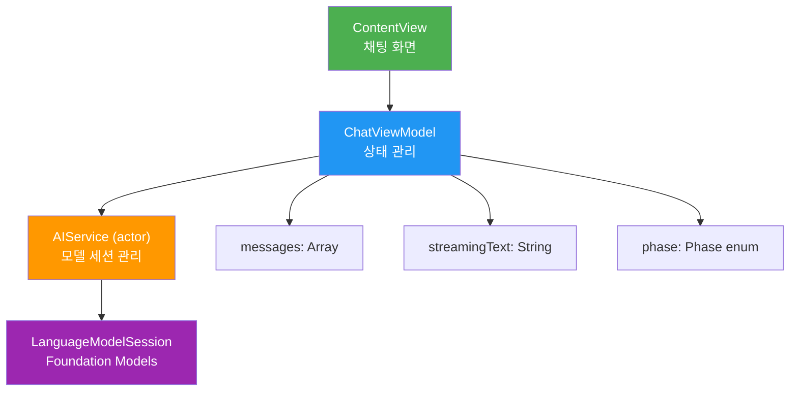
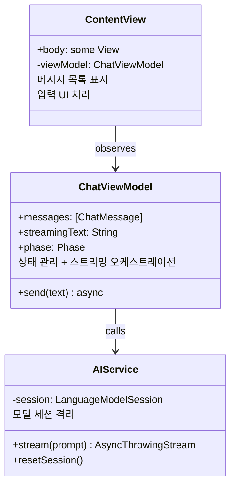
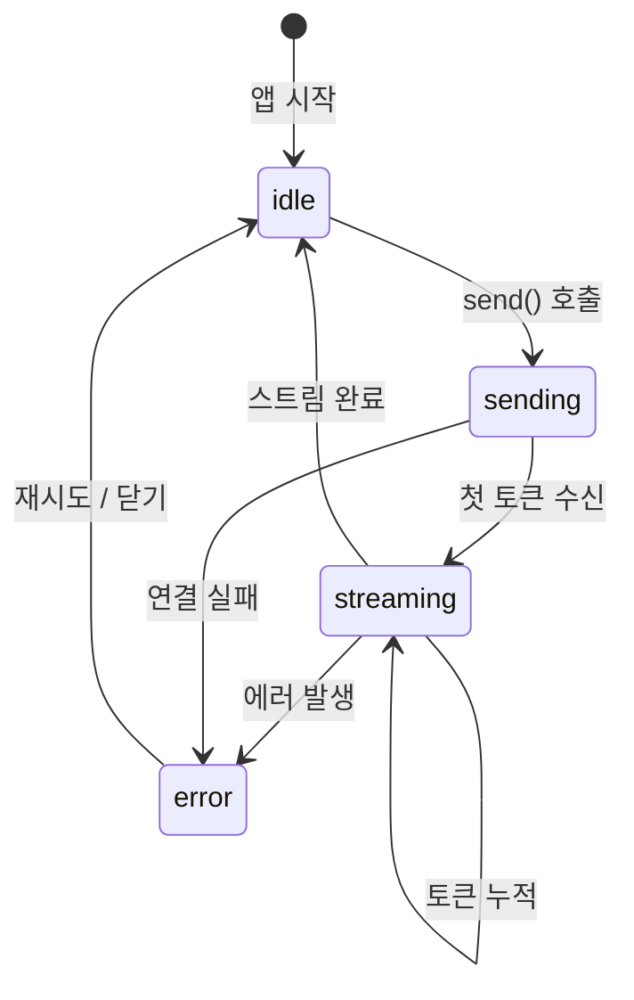
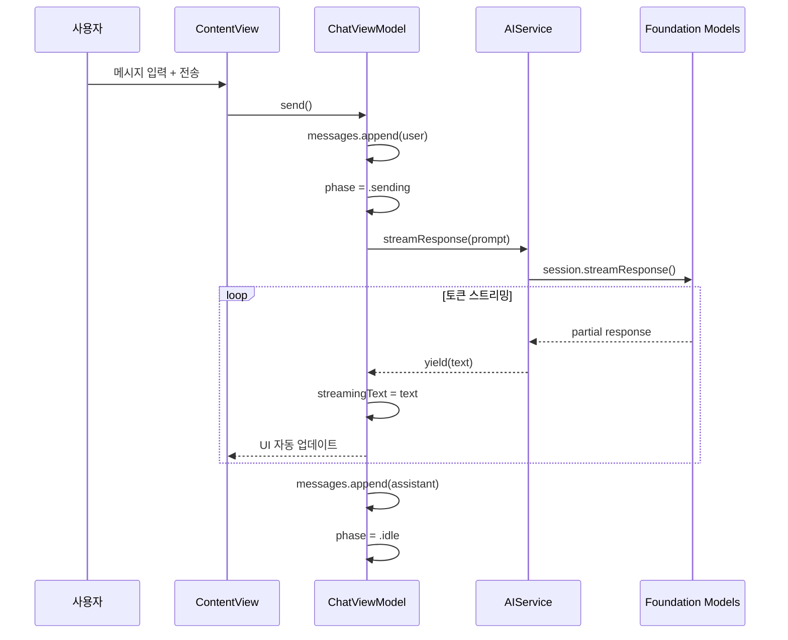
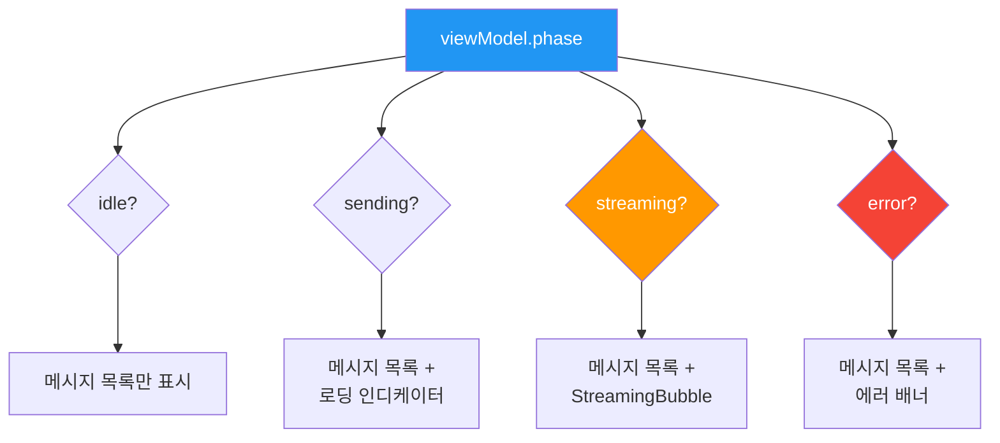
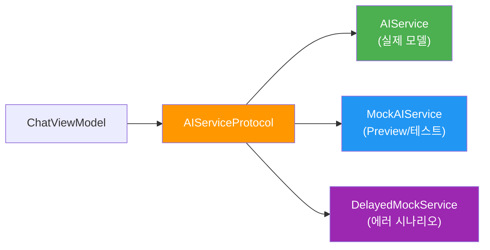

# 05. 실습: 실시간 AI 어시스턴트 UI

> 지금까지 배운 스트리밍 기법을 하나의 앱으로 통합합니다 — MVVM 아키텍처 위에 AI 서비스 레이어를 올리고, Ch6 전체를 관통하는 완성된 채팅 앱을 설계해봅시다.

## 개요

이 섹션에서는 Ch6에서 배운 모든 스트리밍 개념을 **실제 동작하는 AI 채팅 앱**으로 통합합니다. 단순히 코드를 나열하는 것이 아니라, "왜 이 구조인가?"를 이해하면서 한 단계씩 빌드합니다.

[03. 스트리밍 UI 구현](06-스트리밍-응답과-실시간-ui/03-스트리밍-ui-구현-swiftui-실시간-텍스트-렌더링.md)에서 만든 채팅 버블, 자동 스크롤, 타이핑 인디케이터 등의 UI 컴포넌트를 **그대로 재사용**하면서, 이 섹션에서는 **아키텍처와 상태 오케스트레이션**에 집중합니다.

**선수 지식**: [01. 스트리밍 응답의 원리와 AsyncSequence 활용](06-스트리밍-응답과-실시간-ui/01-스트리밍-응답의-원리와-asyncsequence-활용.md)의 `LanguageModelSession.streamResponse`, [03. 스트리밍 UI 구현: SwiftUI 실시간 텍스트 렌더링](06-스트리밍-응답과-실시간-ui/03-스트리밍-ui-구현-swiftui-실시간-텍스트-렌더링.md)의 `ChatBubble`·`StreamingBubble`·`TypingCursor`·`ScrollViewReader` 패턴, [04. 프레임워크 통합 패턴: UIKit/AppKit 연동](06-스트리밍-응답과-실시간-ui/04-프레임워크-통합-패턴-uikit-appkit-연동.md)의 에러 처리

**학습 목표**:
- MVVM + AI Service 계층 분리 아키텍처를 이해하고 구현한다
- `actor` 기반 AI 서비스 레이어를 설계한다
- ViewModel이 스트리밍 상태를 오케스트레이션하는 패턴을 익힌다
- Ch6의 UI 컴포넌트들을 아키텍처 위에 조립하는 통합 감각을 기른다

## 왜 알아야 할까?

지금까지 스트리밍의 각 조각을 개별적으로 배웠습니다. `AsyncSequence`로 토큰을 받는 법, SwiftUI에서 텍스트를 실시간 업데이트하는 법, 에러를 처리하는 법. 하지만 실제 앱을 만들려면 이 모든 것이 **하나의 아키텍처 안에서 조화롭게** 동작해야 합니다.

ChatGPT, Copilot, Apple Intelligence — 요즘 출시되는 AI 기능들은 모두 스트리밍 응답을 기본으로 합니다. 사용자가 "AI가 생각하고 있다"는 느낌을 받으려면, 단순히 기술적으로 토큰을 받는 것을 넘어 **UX 아키텍처** 차원의 설계가 필요합니다. 이 실습에서는 개별 컴포넌트를 만드는 게 아니라, 그것들을 **어떻게 엮느냐**에 집중합니다.

> 📊 **그림 1**: 실습에서 구축할 앱의 전체 구조



## 핵심 개념

### 개념 1: MVVM + AI Service 아키텍처

> 💡 **비유**: 레스토랑을 생각해보세요. 손님(View)은 웨이터(ViewModel)에게 주문하고, 웨이터는 주방(AIService)에 전달합니다. 주방에서 요리가 나오는 대로 웨이터가 테이블로 가져다주죠. 손님이 직접 주방에 들어가지 않는 것처럼, View는 AI 모델을 직접 호출하지 않습니다.

일반적인 SwiftUI MVVM에 **AI Service 계층**을 하나 더 추가하는 것이 핵심입니다. 왜 ViewModel에서 바로 `LanguageModelSession`을 쓰지 않을까요? 세 가지 이유가 있습니다:

1. **동시성 안전**: `actor`로 격리하면 여러 ViewModel이 동시에 모델에 접근해도 안전합니다
2. **세션 재사용**: 대화 히스토리를 유지하는 세션을 서비스 레이어에서 관리합니다
3. **테스트 용이**: 서비스를 프로토콜로 추상화하면 Mock 주입이 간단합니다

> 📊 **그림 2**: 계층별 책임 분리



각 계층의 역할을 정리하면:

| 계층 | 책임 | 알아야 할 것 |
|------|------|-------------|
| **View** | UI 렌더링, 사용자 입력 | ViewModel의 published 프로퍼티 |
| **ViewModel** | 상태 관리, 스트리밍 조율 | AIService API, UI 상태 모델 |
| **AIService** | 모델 세션 관리, 스트리밍 실행 | Foundation Models API |

여기서 View 계층의 UI 컴포넌트(`ChatBubble`, `StreamingBubble`, `TypingCursor` 등)는 [03. 스트리밍 UI 구현](06-스트리밍-응답과-실시간-ui/03-스트리밍-ui-구현-swiftui-실시간-텍스트-렌더링.md)에서 이미 완성했으므로, 이 실습에서는 **ViewModel과 AIService 계층 설계**에 집중하겠습니다.

### 개념 2: Actor 기반 AI 서비스 레이어

> 💡 **비유**: AI 서비스는 **전화 교환원** 같습니다. 여러 사람이 동시에 전화를 걸어도, 교환원이 한 번에 하나씩 순서대로 연결해줍니다. Swift의 `actor`가 바로 이 역할을 하죠.

`LanguageModelSession`은 대화 히스토리를 내부에 유지하는 stateful 객체입니다. 여러 곳에서 동시에 접근하면 데이터 경쟁(data race)이 발생할 수 있어요. `actor`로 감싸면 컴파일러가 자동으로 직렬화를 보장합니다.

```swift
import FoundationModels

// AI 서비스 — actor로 동시성 안전 보장
actor AIService {
    private var session: LanguageModelSession
    
    init() {
        // 시스템 프롬프트로 어시스턴트 성격 설정
        let instructions = """
        당신은 친절한 iOS 개발 어시스턴트입니다.
        Swift와 SwiftUI에 대한 질문에 명확하게 답변하세요.
        """
        self.session = LanguageModelSession(
            instructions: instructions
        )
    }
    
    /// 스트리밍 응답을 AsyncThrowingStream으로 래핑
    func streamResponse(to prompt: String) -> AsyncThrowingStream<String, Error> {
        AsyncThrowingStream { continuation in
            Task {
                do {
                    let stream = session.streamResponse(to: prompt)
                    for try await partial in stream {
                        // 각 부분 응답의 전체 텍스트를 전달
                        continuation.yield(partial.asString())
                    }
                    continuation.finish()
                } catch {
                    continuation.finish(throwing: error)
                }
            }
        }
    }
    
    /// 대화 초기화
    func resetSession() {
        self.session = LanguageModelSession(
            instructions: "당신은 친절한 iOS 개발 어시스턴트입니다."
        )
    }
}
```

> ⚠️ **흔한 오해**: "`actor`를 쓰면 성능이 떨어지지 않나요?" — AI 모델 호출 자체가 수백 밀리초 단위이므로, `actor`의 직렬화 오버헤드(마이크로초 단위)는 무시할 수 있습니다. 안전성 대비 비용이 극히 낮죠.

### 개념 3: ViewModel 상태 오케스트레이션

사용자가 메시지를 보내면 ViewModel이 해야 할 일이 많습니다. 단순히 AI를 호출하는 것이 아니라, **UI 상태를 단계별로 전환**해야 합니다.

> 📊 **그림 3**: 메시지 전송 시 상태 전이



```swift
import SwiftUI
import Observation

// 채팅 메시지 모델
struct ChatMessage: Identifiable {
    let id = UUID()
    let role: Role
    var text: String
    let timestamp: Date
    
    enum Role {
        case user    // 사용자 메시지
        case assistant  // AI 응답
    }
}

// ViewModel — 스트리밍 상태를 오케스트레이션
@Observable
final class ChatViewModel {
    // MARK: - Published State
    var messages: [ChatMessage] = []
    var streamingText: String = ""
    var phase: Phase = .idle
    var inputText: String = ""
    
    // MARK: - Phase
    enum Phase {
        case idle       // 대기 중
        case sending    // 요청 전송 중
        case streaming  // 응답 수신 중
        case error(String)  // 에러 발생
    }
    
    // MARK: - Dependencies
    private let aiService = AIService()
    private var streamTask: Task<Void, Never>?
    
    // MARK: - Actions
    
    /// 메시지 전송 + 스트리밍 시작
    func send() {
        let text = inputText.trimmingCharacters(in: .whitespacesAndNewlines)
        guard !text.isEmpty else { return }
        
        // 1) 사용자 메시지 추가
        let userMessage = ChatMessage(
            role: .user, text: text, timestamp: .now
        )
        messages.append(userMessage)
        inputText = ""
        
        // 2) AI 응답 플레이스홀더
        phase = .sending
        streamingText = ""
        
        // 3) 스트리밍 시작
        streamTask = Task {
            do {
                let stream = await aiService.streamResponse(to: text)
                phase = .streaming
                
                for try await partial in stream {
                    streamingText = partial  // 전체 텍스트로 업데이트
                }
                
                // 4) 완료 — 메시지 배열에 확정
                let assistantMessage = ChatMessage(
                    role: .assistant,
                    text: streamingText,
                    timestamp: .now
                )
                messages.append(assistantMessage)
                streamingText = ""
                phase = .idle
                
            } catch {
                phase = .error(error.localizedDescription)
            }
        }
    }
    
    /// 진행 중인 스트리밍 취소
    func cancelStream() {
        streamTask?.cancel()
        streamTask = nil
        
        if !streamingText.isEmpty {
            // 부분 응답도 저장
            messages.append(ChatMessage(
                role: .assistant,
                text: streamingText + " [취소됨]",
                timestamp: .now
            ))
        }
        streamingText = ""
        phase = .idle
    }
    
    /// 대화 초기화
    func resetChat() async {
        messages.removeAll()
        streamingText = ""
        phase = .idle
        await aiService.resetSession()
    }
}
```

핵심 포인트를 짚어볼게요:

- **`streamingText`는 임시 버퍼**: 스트리밍 중에만 사용하고, 완료되면 `messages` 배열로 이동합니다
- **`phase` enum으로 상태 관리**: Boolean 플래그 여러 개 대신 단일 enum이 훨씬 안전합니다
- **Task 참조 보관**: `streamTask`를 저장해두면 사용자가 취소할 수 있습니다

> 📊 **그림 4**: 스트리밍 데이터 흐름



### 개념 4: View 조립 — 아키텍처 위에 UI 컴포넌트 얹기

View 계층의 핵심은 **기존 UI 컴포넌트를 아키텍처에 맞게 연결하는 것**입니다. [03. 스트리밍 UI 구현](06-스트리밍-응답과-실시간-ui/03-스트리밍-ui-구현-swiftui-실시간-텍스트-렌더링.md)에서 만든 `ChatBubble`, `StreamingBubble`, `TypingCursor` 컴포넌트를 그대로 가져오되, ViewModel의 `phase`에 따라 **어떤 컴포넌트를 보여줄지** 제어하는 것이 이 레이어의 유일한 책임입니다.

> 📊 **그림 5**: Phase에 따른 View 분기



```swift
import SwiftUI

struct ChatView: View {
    @State private var viewModel = ChatViewModel()
    
    var body: some View {
        NavigationStack {
            VStack(spacing: 0) {
                // 메시지 목록 — Ch6.3의 컴포넌트 재사용
                messageList
                Divider()
                inputBar
            }
            .navigationTitle("AI 어시스턴트")
            .toolbar {
                ToolbarItem(placement: .topBarTrailing) {
                    Button("초기화") {
                        Task { await viewModel.resetChat() }
                    }
                }
            }
        }
    }
    
    // MARK: - 메시지 목록 (phase 기반 분기)
    private var messageList: some View {
        ScrollViewReader { proxy in
            ScrollView {
                LazyVStack(spacing: 8) {
                    ForEach(viewModel.messages) { message in
                        // Ch6.3에서 만든 ChatBubble 그대로 사용
                        ChatBubble(message: message)
                            .id(message.id)
                    }
                    
                    // phase에 따른 조건부 렌더링
                    if case .streaming = viewModel.phase {
                        // Ch6.3에서 만든 StreamingBubble + TypingCursor
                        StreamingBubble(text: viewModel.streamingText)
                            .id("streaming")
                    }
                    
                    if case .error(let msg) = viewModel.phase {
                        errorBanner(msg)
                    }
                }
                .padding(.vertical)
            }
            // Ch6.3에서 배운 자동 스크롤 패턴 적용
            .onChange(of: viewModel.messages.count) {
                if let last = viewModel.messages.last {
                    withAnimation { proxy.scrollTo(last.id, anchor: .bottom) }
                }
            }
            .onChange(of: viewModel.streamingText) {
                withAnimation { proxy.scrollTo("streaming", anchor: .bottom) }
            }
        }
    }
    
    // MARK: - 입력 바 (phase 기반 버튼 전환)
    private var inputBar: some View {
        HStack(spacing: 12) {
            TextField("메시지를 입력하세요", text: $viewModel.inputText)
                .textFieldStyle(.roundedBorder)
                .onSubmit { viewModel.send() }
            
            // 핵심: phase에 따라 전송/중단 버튼 전환
            Group {
                if case .streaming = viewModel.phase {
                    Button { viewModel.cancelStream() } label: {
                        Image(systemName: "stop.circle.fill")
                            .font(.title2).foregroundStyle(.red)
                    }
                } else {
                    Button { viewModel.send() } label: {
                        Image(systemName: "arrow.up.circle.fill")
                            .font(.title2)
                    }
                    .disabled(viewModel.inputText.isEmpty || isBusy)
                }
            }
        }
        .padding()
    }
    
    private var isBusy: Bool {
        if case .sending = viewModel.phase { return true }
        if case .streaming = viewModel.phase { return true }
        return false
    }
    
    private func errorBanner(_ message: String) -> some View {
        HStack {
            Image(systemName: "exclamationmark.triangle.fill")
                .foregroundStyle(.yellow)
            Text(message).font(.caption)
            Spacer()
            Button("닫기") { viewModel.phase = .idle }
        }
        .padding()
        .background(Color.red.opacity(0.1))
        .clipShape(RoundedRectangle(cornerRadius: 8))
        .padding(.horizontal)
    }
}
```

코드가 생각보다 간결하죠? 그 이유는 **UI 컴포넌트 구현을 Ch6.3에서 이미 끝냈기 때문**입니다. 이 레이어가 하는 일은 딱 두 가지예요:

1. ViewModel의 `phase`를 보고 **어떤 컴포넌트를 보여줄지** 결정
2. 사용자 액션(전송, 취소, 초기화)을 ViewModel 메서드에 **연결**

이것이 MVVM의 진정한 힘입니다 — 각 레이어가 자기 역할만 하니까 코드가 읽기 쉽고, 변경할 때 영향 범위가 명확합니다.

### 개념 5: 프로토콜 추상화와 테스트 전략

> 💡 **비유**: 레스토랑 비유를 확장해볼까요? 실제 주방(AIService)이 완성되기 전에도, **냉동 식품 주방(MockAIService)**을 임시로 운영하면 웨이터(ViewModel) 훈련은 바로 시작할 수 있습니다. 프로토콜은 이 "주방 인터페이스 규격"입니다.

실제 프로젝트에서는 `AIService`를 프로토콜로 추상화하는 것이 거의 필수입니다. 세 가지 실질적 이점이 있거든요:

```swift
// 서비스 프로토콜 정의
protocol AIServiceProtocol {
    func streamResponse(to prompt: String) -> AsyncThrowingStream<String, Error>
    func resetSession() async
}

// 실제 서비스는 프로토콜 채택
extension AIService: AIServiceProtocol {}

// Preview/테스트용 Mock — 네트워크나 모델 없이 동작
actor MockAIService: AIServiceProtocol {
    func streamResponse(to prompt: String) -> AsyncThrowingStream<String, Error> {
        AsyncThrowingStream { continuation in
            Task {
                let words = "안녕하세요! 무엇을 도와드릴까요?".split(separator: " ")
                var accumulated = ""
                for word in words {
                    try? await Task.sleep(for: .milliseconds(200))
                    accumulated += (accumulated.isEmpty ? "" : " ") + word
                    continuation.yield(accumulated)
                }
                continuation.finish()
            }
        }
    }
    
    func resetSession() async { /* no-op */ }
}

// ViewModel에서 DI 적용
@Observable
final class ChatViewModel {
    private let aiService: any AIServiceProtocol
    
    init(aiService: any AIServiceProtocol = AIService()) {
        self.aiService = aiService
    }
    // ... 나머지 동일
}
```

> 📊 **그림 6**: 프로토콜 기반 의존성 주입 구조



이 패턴의 실질적 이점:

| 상황 | 주입할 서비스 | 효과 |
|------|-------------|------|
| **Xcode Preview** | `MockAIService` | 실제 모델 없이 UI 미리보기 |
| **Unit Test** | 결정적 응답 Mock | 상태 전이 로직 검증 |
| **에러 테스트** | 항상 에러 던지는 Mock | 에러 UI 확인 |
| **프로덕션** | `AIService` | Foundation Models 사용 |

## 실습: 직접 해보기

위 코드를 **5단계**로 Xcode 프로젝트에 빌드합니다. iOS 26 / macOS 26 이상 타겟이 필요합니다.

**Step 1**: 새 Xcode 프로젝트 생성 (App, SwiftUI)

**Step 2**: 모델 파일 생성 — `ChatMessage.swift`
- `ChatMessage` 구조체와 `Role` enum 작성

**Step 3**: 서비스 파일 생성 — `AIServiceProtocol.swift`, `AIService.swift`, `MockAIService.swift`
- 프로토콜 정의 → 실제 구현 → Mock 구현 순서로 작성

**Step 4**: ViewModel 파일 생성 — `ChatViewModel.swift`
- `@Observable` ViewModel, `Phase` enum, `send()/cancelStream()/resetChat()` 구현
- 생성자에서 `AIServiceProtocol` 주입받도록 설계

**Step 5**: View 파일 조립 — `ChatView.swift`
- Ch6.3에서 만든 `ChatBubble.swift`, `StreamingBubble.swift`, `TypingCursor.swift`를 프로젝트에 추가
- `ChatView`에서 ViewModel의 phase에 따라 컴포넌트를 조건부 렌더링

```run:swift
// 최종 진입점 — App.swift
import SwiftUI

@main
struct AIAssistantApp: App {
    var body: some Scene {
        WindowGroup {
            ChatView()
        }
    }
}

print("빌드 타겟: iOS 26+ / macOS 26+")
print("필요 프레임워크: FoundationModels")
print("재사용 컴포넌트: ChatBubble, StreamingBubble, TypingCursor (Ch6.3)")
```

```output
빌드 타겟: iOS 26+ / macOS 26+
필요 프레임워크: FoundationModels
재사용 컴포넌트: ChatBubble, StreamingBubble, TypingCursor (Ch6.3)
```

> 🔥 **실무 팁**: Preview에서 `MockAIService`를 주입하면 실제 모델 없이도 채팅 UI를 빠르게 반복 개발할 수 있습니다. `#Preview { ChatView(viewModel: ChatViewModel(aiService: MockAIService())) }` 패턴을 습관화하세요.

## 더 깊이 알아보기

### 텔레타이프에서 ChatGPT까지 — 스트리밍 UI의 역사

실시간으로 텍스트가 나타나는 UI는 사실 컴퓨팅의 가장 오래된 인터페이스입니다. 1960년대 **텔레타이프(Teletype)** 단말기는 한 글자씩 종이에 찍어나갔고, Unix 터미널도 이 전통을 이어받았습니다. `stdout`에 write하면 즉시 화면에 나타나는 것이 원래 컴퓨터의 기본 동작이었죠.

그런데 GUI 시대가 오면서 이 패턴이 사라졌습니다. "로딩 → 완성된 결과 표시"가 표준이 되었죠. 2022년 ChatGPT가 다시 스트리밍 UI를 대중화했을 때, 많은 개발자가 "옛것이 새것이 되었다"고 감탄했습니다.

Apple이 Foundation Models에서 스트리밍을 기본 제공한 것도 이런 흐름의 연장선입니다. 특히 Apple은 서버-클라이언트 네트워크 지연이 없는 **온디바이스 스트리밍**이라, 토큰이 생성되는 즉시 UI에 반영할 수 있다는 고유한 장점이 있습니다.

### 확장 과제: 마크다운 렌더링과 구조화 출력

이 실습에서는 텍스트 기반 채팅에 집중했지만, 실전 앱에서는 두 가지 확장이 자주 필요합니다:

**1) 마크다운 실시간 렌더링**: AI 응답에 코드 블록, 볼드, 리스트 등이 포함될 때 `AttributedString`으로 변환하여 렌더링합니다. 핵심은 스트리밍 중간에 불완전한 마크다운(예: ` ``` `이 열리고 아직 닫히지 않은 상태)을 안전하게 처리하는 것입니다.

**2) 구조화 출력 카드 UI**: [Ch5. 구조화된 출력과 @Generable](05-구조화된-출력과-generable/01-generable-매크로-소개와-기본-사용법.md)에서 배운 `@Generable` 타입을 스트리밍과 결합하면, 텍스트가 아닌 **카드 형태의 UI**를 실시간으로 채울 수 있습니다. `StreamingSession<RecipeCard>`처럼 구조화된 타입의 partial 결과를 받아 각 필드가 채워지는 것을 시각적으로 보여주는 패턴입니다.

두 주제 모두 별도 세션 분량의 깊이가 필요하므로, 여기서는 아키텍처적 방향만 안내합니다.

## 흔한 오해와 팁

> ⚠️ **흔한 오해**: "ViewModel에서 직접 `LanguageModelSession`을 쓰면 안 되나요?" — 작은 프로토타입에서는 가능하지만, 앱이 커지면 문제가 생깁니다. 여러 화면에서 같은 세션을 공유하거나, 백그라운드에서 요약을 생성하는 등 동시 접근이 필요해질 때 `actor`로 격리되지 않으면 data race가 발생합니다.

> 💡 **알고 계셨나요?**: Apple의 Foundation Models가 `AsyncSequence`를 채택한 것은 Swift의 **구조적 동시성(Structured Concurrency)** 철학과 맞닿아 있습니다. 2021년 Swift 5.5에서 `async/await`가 도입될 때부터, Apple은 내부적으로 ML 추론 결과를 스트리밍하는 API를 이 패턴으로 설계하고 있었다고 합니다.

> 🔥 **실무 팁**: `streamingText`를 매 토큰마다 업데이트하면 SwiftUI 렌더링 부하가 걱정될 수 있는데요, Foundation Models의 온디바이스 추론은 서버 LLM보다 토큰 속도가 느리기 때문에 (초당 수십 토큰 수준), 실제로는 throttling 없이도 부드럽게 동작합니다. 만약 더 빠른 모델이 나온다면, [04. 프레임워크 통합 패턴](06-스트리밍-응답과-실시간-ui/04-프레임워크-통합-패턴-uikit-appkit-연동.md)에서 다룬 `AsyncStream`의 버퍼링 전략을 적용하면 됩니다.

## 핵심 정리

| 개념 | 설명 |
|------|------|
| **MVVM + AIService** | View → ViewModel → AIService(actor) → Foundation Models 4계층 분리 |
| **actor 격리** | `AIService`를 `actor`로 만들어 세션 접근의 동시성 안전 보장 |
| **Phase enum** | `idle/sending/streaming/error` — Boolean 대신 단일 enum으로 상태 관리 |
| **streamingText 버퍼** | 스트리밍 중 임시 저장, 완료 시 `messages` 배열로 확정 이동 |
| **Task 참조** | `streamTask`를 보관하여 사용자 취소(cancel) 지원 |
| **프로토콜 DI** | `AIServiceProtocol`로 추상화하여 Preview/테스트에서 Mock 주입 |
| **UI 컴포넌트 재사용** | Ch6.3의 `ChatBubble`/`StreamingBubble`을 아키텍처 위에 조립 |

## 다음 섹션 미리보기

Ch6의 스트리밍 응답 여정이 여기서 마무리됩니다. 다음 [Ch7. Tool Calling과 외부 연동](07-tool-calling과-외부-연동/01-tool-calling-개념과-generable-tool-프로토콜.md)에서는 AI 모델이 **외부 함수를 직접 호출**하는 패턴을 배웁니다. 오늘 만든 AI 어시스턴트에 날씨 조회, 캘린더 검색 같은 도구를 연결하면, 단순 텍스트 응답을 넘어 **실제 작업을 수행하는** 에이전트로 진화시킬 수 있습니다.

## 참고 자료

- [Explore machine learning on Apple silicon — WWDC25](https://developer.apple.com/videos/play/wwdc2025/267/) - Foundation Models 스트리밍 API의 공식 데모와 설계 철학
- [Meet the Foundation Models framework — WWDC25](https://developer.apple.com/videos/play/wwdc2025/258/) - `LanguageModelSession`과 `streamResponse` API 상세 설명
- [Apple Foundation Models Documentation](https://developer.apple.com/documentation/FoundationModels) - `LanguageModelSession`, `StreamingSession` 공식 레퍼런스
- [Swift Concurrency — actor 공식 문서](https://docs.swift.org/swift-book/documentation/the-swift-programming-language/concurrency/#Actors) - `actor` 키워드의 동작 원리와 격리 규칙
- [Observation framework — WWDC23](https://developer.apple.com/videos/play/wwdc2023/10149/) - `@Observable` 매크로의 동작 원리 (`@ObservableObject`에서의 마이그레이션 포함)
- [Dependency Injection in Swift](https://www.avanderlee.com/swift/dependency-injection/) - 프로토콜 기반 DI 패턴의 실전 가이드