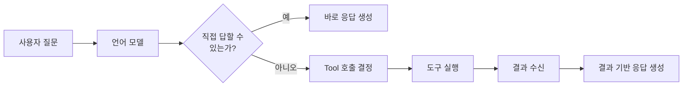
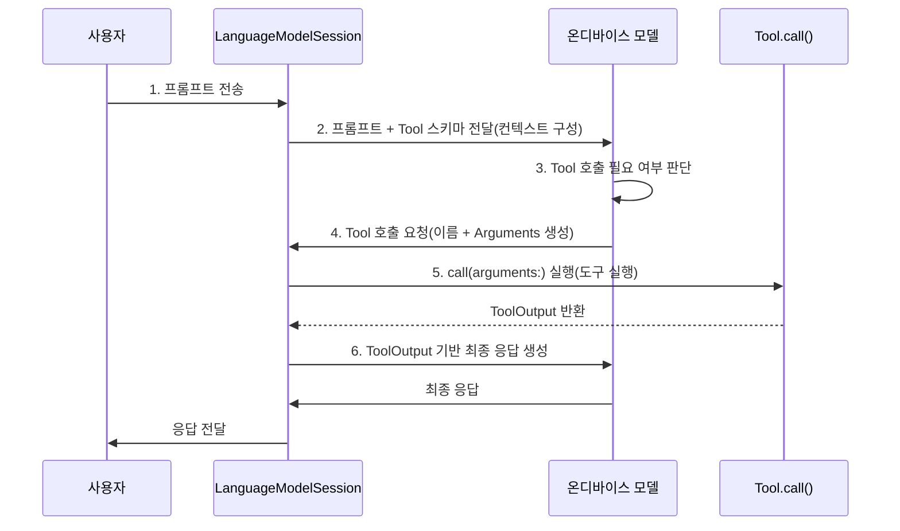
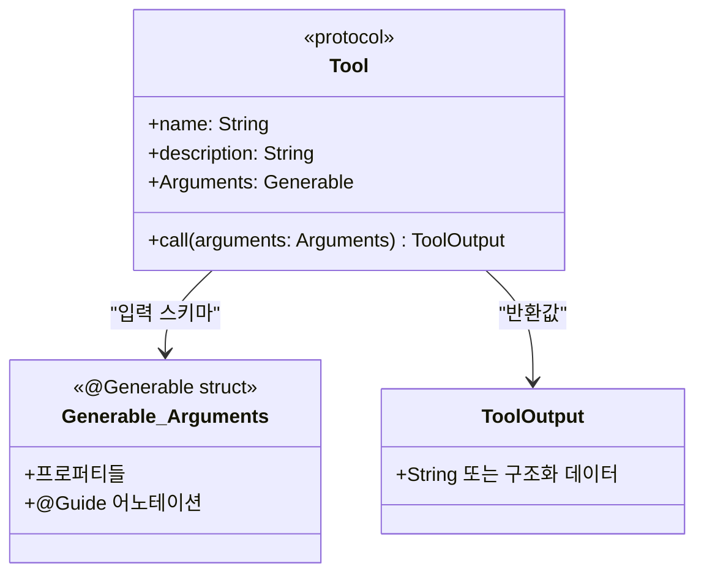
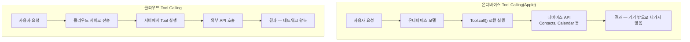
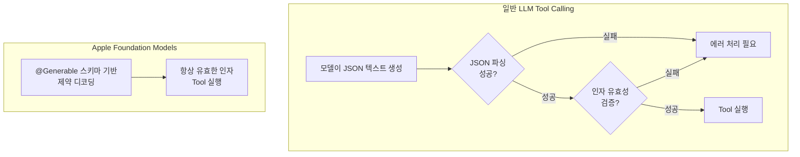

# Tool Calling 개념과 아키텍처

> Foundation Models의 Tool Calling이 무엇인지, 모델과 도구가 어떻게 상호작용하는지, 온디바이스 환경에서의 특성과 제약을 이해합니다.

## 개요

이 섹션에서는 Foundation Models 프레임워크의 **Tool Calling** 메커니즘을 처음부터 살펴봅니다. 모델이 외부 데이터나 기능에 접근해야 할 때, 어떻게 개발자가 정의한 도구를 "스스로 판단하여" 호출하는지 그 개념과 아키텍처를 이해하는 것이 목표입니다.

**선수 지식**:
- [LanguageModelSession 생성과 구성](03-ch3-foundation-models-프레임워크-시작하기/02-02-languagemodelsession-생성과-구성.md)에서 배운 세션 기본 개념
- [@Generable 매크로 적용하기](05-ch5-generable-구조화-출력/02-02-generable-매크로-적용하기.md)에서 배운 구조화 출력 기초
- [스트리밍 응답과 실시간 UI](06-ch6-스트리밍-응답과-실시간-ui/01-01-streamresponse-api-기초.md)에서 배운 비동기 응답 처리

**학습 목표**:
- Tool Calling의 개념과 필요성을 설명할 수 있다
- 모델-도구 상호작용의 전체 흐름(6단계)을 이해한다
- 온디바이스 Tool Calling의 특성과 제약을 파악한다
- Tool 프로토콜의 기본 구조를 미리 살펴본다

## 왜 알아야 할까?

지금까지 우리가 만든 AI 기능들은 모두 **모델의 내부 지식**에만 의존했습니다. "서울의 인구는?"이라고 물으면 학습 데이터에 있는 정보를 바탕으로 답하죠. 하지만 "오늘 서울 날씨는?" "내 캘린더에 내일 일정이 있어?" 같은 질문에는 어떨까요?

모델은 **실시간 데이터**도, **사용자의 개인 정보**도 모릅니다. 이 간극을 메우는 것이 바로 Tool Calling입니다. 모델이 "이건 내가 직접 답할 수 없으니, 이 도구를 호출해서 정보를 가져와야겠다"고 **스스로 판단**하는 메커니즘이거든요.

실제로 Apple Intelligence의 많은 기능이 이 패턴으로 동작합니다. Siri가 연락처를 찾거나, 캘린더 일정을 확인하거나, 메일을 요약하는 것 모두 내부적으로는 모델이 적절한 Tool을 호출하는 과정입니다.

## 핵심 개념

### 개념 1: Tool Calling이란 — 만능 비서의 전화 한 통

> 💡 **비유**: 회사에 새로 온 신입사원(AI 모델)을 생각해보세요. 이 사원은 일반 상식과 언어 능력이 뛰어나지만, 회사 내부 시스템에는 접근할 수 없습니다. 고객이 "내 주문 상태가 어떻게 됐나요?"라고 물으면, 사원은 직접 답할 수 없죠. 대신 **물류팀에 전화를 걸어** 주문 번호를 알려주고 상태를 확인한 뒤, 그 정보를 고객에게 전달합니다. Tool Calling은 바로 이 "전화 한 통"에 해당합니다.

Tool Calling은 언어 모델이 **외부 함수나 API를 자율적으로 호출**하여 실시간 데이터를 가져오거나 액션을 수행하는 메커니즘입니다. 핵심은 개발자가 도구를 "등록"해두면, 모델이 사용자의 요청을 분석하여 **언제, 어떤 도구를, 어떤 인자로** 호출할지 스스로 결정한다는 점이죠.

> 📊 **그림 1**: Tool Calling의 기본 개념 — 모델의 능력 확장



Foundation Models 프레임워크에서 Tool Calling이 특별한 이유가 있습니다. **Guided Generation(구조화 출력) 위에 구축**되어 있다는 점입니다. [앞서 배운 @Generable 매크로](05-ch5-generable-구조화-출력/02-02-generable-매크로-적용하기.md)가 여기서 다시 등장하는데요, 모델이 도구의 인자(Arguments)를 생성할 때 `@Generable` 스키마를 사용하므로, **잘못된 도구 이름이나 유효하지 않은 인자가 절대 생성되지 않습니다**. 이것이 다른 LLM 프레임워크의 Tool Calling과 가장 큰 차이점이에요.

```swift
// Tool Calling의 핵심 = Guided Generation + 외부 함수 호출
// 모델이 @Generable 스키마에 맞춰 인자를 생성하므로
// 항상 유효한 입력이 보장됩니다
```

### 개념 2: 모델-도구 상호작용 흐름 — 6단계

> 💡 **비유**: 음식점에서 주문하는 과정을 떠올려보세요. 손님(사용자)이 "매운 걸로 추천해주세요"라고 하면, 서버(모델)가 메뉴판(Tool 목록)을 보고 "떡볶이가 좋겠다"고 판단합니다. 그리고 주방(Tool)에 "떡볶이 1인분, 매운맛"(Arguments)이라고 주문서를 보내죠. 주방에서 완성된 요리(ToolOutput)를 가져와서 손님에게 서빙하는 겁니다.

Tool Calling의 전체 흐름은 다음 **6단계**로 이뤄집니다:

> 📊 **그림 2**: Tool Calling 실행 흐름 — 6단계



각 단계를 좀 더 구체적으로 살펴볼까요?

| 단계 | 이름 | 설명 |
|------|------|------|
| **1단계** | **프롬프트 전송** | 사용자가 `session.respond(to:)` 또는 `session.streamResponse(to:)`를 호출합니다. |
| **2단계** | **컨텍스트 구성** | 세션이 사용자 프롬프트, instructions(시스템 프롬프트), 그리고 **등록된 Tool들의 이름·설명·Arguments 스키마**를 모델에 함께 전달합니다. |
| **3단계** | **모델의 판단** | 모델이 "이 질문에 답하려면 도구가 필요한가?"를 자율적으로 판단합니다. Tool의 `description`과 사용자 프롬프트를 비교하여 결정하죠. |
| **4단계** | **인자 생성** | Tool이 필요하다고 판단하면, `@Generable`로 정의된 Arguments 스키마에 맞춰 인자를 생성합니다. Guided Generation 덕분에 유효하지 않은 값이 나올 수 없습니다. |
| **5단계** | **도구 실행** | 프레임워크가 해당 Tool의 `call(arguments:)` 메서드를 호출합니다. 이 메서드 안에서 API 호출, 데이터베이스 조회, 디바이스 API 접근 등 원하는 작업을 수행합니다. |
| **6단계** | **응답 생성** | Tool이 반환한 `ToolOutput`이 세션의 트랜스크립트에 추가되고, 모델은 이 정보를 바탕으로 최종 응답을 생성합니다. |

```swift
// 실행 흐름을 코드로 보면 이런 느낌입니다
let session = LanguageModelSession(
    tools: [WeatherTool()],           // Tool 등록
    instructions: "날씨 정보가 필요하면 weatherTool을 사용하세요."
)

// 사용자가 "서울 날씨 알려줘"라고 요청하면:
// 1단계: 프롬프트 전송
// 2단계: 프롬프트 + WeatherTool 스키마 → 모델에 전달
// 3단계: 모델이 WeatherTool 필요성 판단
// 4단계: Arguments { city: "서울" } 자동 생성
// 5단계: WeatherTool.call(arguments:) 실행
// 6단계: ToolOutput("서울: 맑음, 22°C") 기반 최종 응답 생성
let response = try await session.respond(to: "서울 날씨 알려줘")
```

### 개념 3: Tool 프로토콜의 구조 미리보기

다음 섹션에서 본격적으로 구현하겠지만, Tool 프로토콜의 전체 구조를 먼저 조감해봅시다.

> 📊 **그림 3**: Tool 프로토콜의 4가지 필수 요소



Tool 프로토콜은 놀라울 정도로 간결합니다. 네 가지만 구현하면 됩니다:

| 요소 | 역할 | 예시 |
|------|------|------|
| `name` | 모델이 도구를 식별하는 이름 | `"getWeather"` |
| `description` | 도구의 용도를 설명하는 문장 | `"도시의 현재 날씨를 조회합니다"` |
| `Arguments` | `@Generable` 입력 스키마 | `struct Arguments { let city: String }` |
| `call(arguments:)` | 실제 로직 실행 메서드 | `async throws -> ToolOutput` |

```swift
// Tool 프로토콜의 기본 골격
struct WeatherTool: Tool {
    // 1. 이름 — 짧고 명확한 영문 식별자
    let name = "getWeather"
    
    // 2. 설명 — 모델이 언제 이 도구를 쓸지 판단하는 근거
    let description = "특정 도시의 현재 날씨 정보를 조회합니다."
    
    // 3. 입력 스키마 — @Generable로 유효한 인자만 허용
    @Generable
    struct Arguments {
        @Guide(description: "날씨를 조회할 도시 이름")
        let city: String
    }
    
    // 4. 실행 메서드 — 외부 API 호출, 디바이스 데이터 접근 등
    func call(arguments: Arguments) async throws -> ToolOutput {
        let weather = try await fetchWeather(for: arguments.city)
        return ToolOutput("\(arguments.city): \(weather.condition), \(weather.temperature)°C")
    }
}
```

여기서 가장 중요한 것은 `description`입니다. 모델은 이 설명을 읽고 "이 도구를 지금 써야 하는가?"를 판단하거든요. 설명이 모호하면 모델이 잘못된 시점에 도구를 호출하거나, 필요할 때 호출하지 않을 수 있습니다.

### 개념 4: 온디바이스 Tool Calling의 특성과 제약

Apple의 Tool Calling은 **온디바이스 실행**이라는 고유한 특성이 있습니다. 이것은 OpenAI나 Anthropic 같은 클라우드 기반 Tool Calling과 근본적으로 다른 점이에요.

> 📊 **그림 4**: 온디바이스 vs 클라우드 Tool Calling 비교



**온디바이스 Tool Calling의 장점**:

1. **프라이버시**: 모든 처리가 기기 내에서 이루어집니다. 연락처, 캘린더, 건강 데이터 같은 민감한 정보가 서버로 전송되지 않아요.
2. **오프라인 동작**: 네트워크 없이도 로컬 데이터에 접근하는 Tool은 완벽하게 동작합니다.
3. **낮은 지연 시간**: 네트워크 왕복이 없으므로, 로컬 Tool 호출은 거의 즉시 완료됩니다.

**온디바이스 Tool Calling의 제약**:

1. **모델 크기 제한**: 온디바이스 모델(~3B 파라미터)은 클라우드 모델보다 작으므로, 복잡한 Tool 선택 판단에 한계가 있을 수 있습니다.
2. **토큰 예산**: Tool의 이름, 설명, Arguments 스키마 모두 토큰을 소비합니다. 등록하는 Tool이 많아질수록 실제 대화에 쓸 수 있는 컨텍스트가 줄어들죠.
3. **동시성 주의**: 병렬 Tool 호출 시 공유 데이터에 대한 동기화를 개발자가 직접 관리해야 합니다.

```swift
// 토큰 효율을 위한 Tool 설계 원칙
struct GoodTool: Tool {
    let name = "findContact"                    // 짧고 명확 ✓
    let description = "연락처에서 사람을 찾습니다." // 한 문장 ✓
    // ...
}

struct BadTool: Tool {
    let name = "find_and_search_contact_in_address_book"  // 너무 김 ✗
    let description = """
    이 도구는 사용자의 주소록에서 연락처를 검색합니다. 
    이름, 전화번호, 이메일 등으로 검색할 수 있으며,
    결과를 정렬하여 반환합니다. 
    CNContactStore를 사용하여 구현되어 있습니다.
    """  // 구현 세부사항까지 포함 — 불필요한 토큰 낭비 ✗
    // ...
}
```

### 개념 5: Guided Generation과 Tool Calling의 시너지

Tool Calling이 Guided Generation 위에 구축되어 있다는 것이 왜 중요할까요? 다른 LLM 플랫폼에서 Tool Calling의 가장 흔한 문제를 보면 이해가 됩니다.

> 📊 **그림 5**: Guided Generation이 보장하는 안전한 Tool 호출



일반적인 LLM에서는 모델이 JSON 형태로 Tool 호출을 "텍스트로" 출력합니다. 이때 JSON이 깨지거나, 존재하지 않는 도구 이름을 만들어내거나, 잘못된 타입의 인자를 넣는 일이 비일비재합니다. 개발자는 이런 오류를 모두 처리해야 하죠.

반면 Apple의 접근법은 **컴파일 타임에 정의된 `@Generable` 스키마**를 사용하여 모델의 출력을 제약(constrained decoding)합니다. 모델이 "자유 텍스트"를 생성하는 게 아니라, 스키마에 맞는 값만 생성할 수 있도록 디코딩 과정 자체를 제한하는 거예요. 덕분에:

- 존재하지 않는 Tool 이름이 생성될 수 없습니다
- 잘못된 타입의 인자가 만들어질 수 없습니다
- enum 타입이면 정의된 케이스 중 하나만 선택됩니다

```swift
// @Generable enum으로 유효한 값만 허용하는 예시
@Generable
struct Arguments {
    let generation: Generation
    
    @Generable
    enum Generation {
        case babyBoomers   // 모델은 이 4가지 중
        case genX          // 하나만 선택 가능
        case millennial    // "genAlpha" 같은 
        case genZ          // 존재하지 않는 값 생성 불가
    }
}
```

## 실습: 직접 해보기

아직 Tool을 직접 구현하기 전이지만, Tool Calling의 전체 구조를 파악하기 위해 가장 간단한 형태의 Tool을 만들어봅시다. 이번 실습의 목표는 "돌아가는 전체 그림"을 보는 것입니다.

```swift
import FoundationModels

// MARK: - 1단계: 가장 간단한 Tool 정의
// 현재 시간을 알려주는 도구 — 모델이 "지금 몇 시야?"에 답할 수 있게 합니다
struct CurrentTimeTool: Tool {
    let name = "getCurrentTime"
    let description = "현재 날짜와 시간을 반환합니다."
    
    @Generable
    struct Arguments {
        // 인자가 없는 도구 — 가장 단순한 형태
    }
    
    func call(arguments: Arguments) async throws -> ToolOutput {
        let formatter = DateFormatter()
        formatter.dateFormat = "yyyy년 MM월 dd일 HH시 mm분"
        formatter.locale = Locale(identifier: "ko_KR")
        let now = formatter.string(from: Date())
        return ToolOutput(now)
    }
}

// MARK: - 2단계: 세션에 Tool 등록하고 사용하기
func demonstrateToolCalling() async throws {
    // Tool 인스턴스 생성
    let timeTool = CurrentTimeTool()
    
    // 세션 생성 시 tools 배열로 등록
    let session = LanguageModelSession(
        tools: [timeTool],
        instructions: "사용자가 시간이나 날짜를 물으면 getCurrentTime 도구를 사용하세요."
    )
    
    // 사용자 요청 — 모델이 자동으로 Tool 호출 여부를 판단합니다
    let response = try await session.respond(to: "지금 몇 시야?")
    print(response.content)
    
    // Tool이 필요 없는 질문 — 모델이 직접 답변합니다
    let response2 = try await session.respond(to: "안녕하세요!")
    print(response2.content)
}
```

```run:swift
// Tool Calling 6단계 흐름을 의사 코드로 추적해봅시다
print("=== Tool Calling 6단계 실행 흐름 추적 ===")
print("")
print("1단계 - 프롬프트 전송: \"지금 몇 시야?\"")
print("2단계 - 컨텍스트 구성: 프롬프트 + getCurrentTime 스키마 전달")
print("3단계 - 모델의 판단: 시간 정보 필요 → getCurrentTime Tool 선택")
print("4단계 - 인자 생성: Arguments() (빈 인자)")
print("5단계 - 도구 실행: CurrentTimeTool.call() 호출")
print("         → ToolOutput: \"2026년 03월 15일 14시 30분\"")
print("6단계 - 응답 생성: \"현재 시각은 2026년 3월 15일 오후 2시 30분입니다.\"")
print("")
print("=== Tool이 필요 없는 경우 ===")
print("")
print("1단계 - 프롬프트 전송: \"안녕하세요!\"")
print("2단계 - 컨텍스트 구성: 프롬프트 + getCurrentTime 스키마 전달")
print("3단계 - 모델의 판단: 인사말 → Tool 불필요, 바로 6단계로")
print("6단계 - 응답 생성: \"안녕하세요! 무엇을 도와드릴까요?\"")
```

```output
=== Tool Calling 6단계 실행 흐름 추적 ===

1단계 - 프롬프트 전송: "지금 몇 시야?"
2단계 - 컨텍스트 구성: 프롬프트 + getCurrentTime 스키마 전달
3단계 - 모델의 판단: 시간 정보 필요 → getCurrentTime Tool 선택
4단계 - 인자 생성: Arguments() (빈 인자)
5단계 - 도구 실행: CurrentTimeTool.call() 호출
         → ToolOutput: "2026년 03월 15일 14시 30분"
6단계 - 응답 생성: "현재 시각은 2026년 3월 15일 오후 2시 30분입니다."

=== Tool이 필요 없는 경우 ===

1단계 - 프롬프트 전송: "안녕하세요!"
2단계 - 컨텍스트 구성: 프롬프트 + getCurrentTime 스키마 전달
3단계 - 모델의 판단: 인사말 → Tool 불필요, 바로 6단계로
6단계 - 응답 생성: "안녕하세요! 무엇을 도와드릴까요?"
```

실습에서 핵심 포인트는 **같은 세션**에서 "지금 몇 시야?"는 Tool을 호출하고, "안녕하세요!"는 Tool 없이 직접 응답한다는 점입니다. 모델이 상황에 따라 자율적으로 판단하는 것이죠.

## 더 깊이 알아보기

### Tool Calling의 탄생 — "함수 호출"이라는 아이디어

Tool Calling(또는 Function Calling)이라는 개념은 2023년 6월 OpenAI가 GPT-3.5/GPT-4에 "Function Calling" 기능을 추가하면서 업계에 본격적으로 확산되었습니다. 하지만 아이디어 자체는 훨씬 오래되었죠. 1960년대 LISP의 메타프로그래밍, 1990년대 에이전트 시스템의 "action selection" 메커니즘이 그 조상격입니다.

Apple의 접근은 여기서 한 발 더 나아갔습니다. 2025년 WWDC에서 공개된 Foundation Models 프레임워크는 **Guided Generation(제약 디코딩)과 Tool Calling을 하나로 통합**한 최초의 온디바이스 프레임워크입니다. Apple의 ML 연구팀은 모델 후속 학습(post-training) 단계에서 Tool 사용 데이터를 집중적으로 학습시켜, 작은 온디바이스 모델(~3B)로도 안정적인 Tool Calling이 가능하도록 만들었습니다.

> 💡 **알고 계셨나요?**: Apple의 2025년 기술 보고서(arxiv.org/abs/2507.13575)에 따르면, 온디바이스 모델이 Tool Calling의 신뢰성을 높이기 위해 별도의 "tool-use post-training" 과정을 거쳤습니다. 이 학습 덕분에 3B 파라미터라는 작은 모델도 복잡한 Tool 선택과 인자 생성을 안정적으로 수행할 수 있게 되었죠.

### 프레임워크의 설계 철학 — "복잡한 건 우리가, 간단한 건 개발자가"

WWDC25에서 Apple 엔지니어들이 강조한 설계 철학이 있습니다. "개발자는 간단한 Tool 프로토콜만 구현하면, **병렬/직렬 호출 그래프의 복잡한 오케스트레이션은 프레임워크가 자동으로 최적 처리**한다"는 것이죠. 이 접근법은 개발자 경험(DX)을 극대화하면서도, 내부적으로는 매우 정교한 실행 엔진이 돌아가는 구조입니다.

## 흔한 오해와 팁

> ⚠️ **흔한 오해**: "Tool Calling은 모델이 코드를 실행하는 것이다" — 아닙니다! 모델은 코드를 실행하지 않습니다. 모델은 "어떤 도구를 어떤 인자로 호출해야 하는지" **텍스트를 생성**할 뿐이고, 실제 실행은 프레임워크가 개발자의 `call()` 메서드를 호출하는 것입니다. 모델은 판단자이고, 실행자는 여러분의 코드입니다.

> 💡 **알고 계셨나요?**: Apple Foundation Models의 Tool Calling은 `session.transcript`를 통해 어떤 Tool이 호출되었는지, 어떤 인자가 전달되었는지 모두 추적할 수 있습니다. 디버깅할 때 매우 유용하죠. 트랜스크립트에는 사용자 프롬프트, 모델 응답, Tool 호출, Tool 결과가 시간순으로 기록됩니다.

> 🔥 **실무 팁**: Tool의 `description`은 짧을수록 좋습니다. 모델의 컨텍스트 윈도우에 Tool 설명도 포함되기 때문에, 장황한 설명은 실제 대화에 쓸 토큰을 줄입니다. "한 문장"을 목표로 작성하되, 모델이 **언제** 이 Tool을 써야 하는지 판단할 수 있을 만큼은 구체적으로 작성하세요.

## 핵심 정리

| 개념 | 설명 |
|------|------|
| **Tool Calling** | 모델이 외부 함수를 자율적으로 호출하여 실시간 데이터를 가져오거나 액션을 수행하는 메커니즘 |
| **6단계 흐름** | 프롬프트 전송 → 컨텍스트 구성 → 모델의 판단 → 인자 생성 → 도구 실행 → 응답 생성 |
| **Tool 프로토콜** | `name`, `description`, `Arguments`(@Generable), `call()` 4가지 요소로 구성 |
| **Guided Generation 기반** | @Generable 스키마로 제약 디코딩하여 항상 유효한 Tool 이름과 인자를 보장 |
| **자율적 판단** | 모델이 Tool의 description과 사용자 요청을 비교하여 호출 여부를 스스로 결정 |
| **ToolOutput** | Tool 실행 결과를 문자열 또는 구조화 데이터로 반환, 트랜스크립트에 기록 |
| **온디바이스 실행** | 모든 처리가 기기 내에서 완료 — 프라이버시 보장, 오프라인 동작 가능 |
| **토큰 효율** | Tool 이름/설명이 간결해야 컨텍스트 윈도우를 아낄 수 있음 |

## 다음 섹션 미리보기

이번 섹션에서 Tool Calling의 "왜"와 "어떻게"를 개념적으로 이해했다면, 다음 섹션 [Tool 프로토콜 구현하기](07-ch7-tool-calling-기초/02-02-tool-프로토콜-구현하기.md)에서는 **직접 손으로** Tool을 만들어봅니다. `Tool` 프로토콜의 각 요소를 하나씩 구현하면서, `struct` vs `class` 선택, `@Generable` Arguments 설계, `call()` 메서드의 에러 처리까지 실전 코드를 작성합니다.

## 참고 자료

- [Deep dive into the Foundation Models framework — WWDC25](https://developer.apple.com/videos/play/wwdc2025/301/) - Tool Calling의 아키텍처와 실행 흐름을 상세히 설명하는 Apple 공식 세션
- [Meet the Foundation Models framework — WWDC25](https://developer.apple.com/videos/play/wwdc2025/286/) - Foundation Models 프레임워크의 전체 개요와 Tool Calling 소개
- [Foundation Models — Apple Developer Documentation](https://developer.apple.com/documentation/FoundationModels) - Tool 프로토콜, ToolOutput 등 공식 API 레퍼런스
- [The Ultimate Guide to the Foundation Models Framework — AzamSharp](https://azamsharp.com/2025/06/18/the-ultimate-guide-to-the-foundation-models-framework.html) - Tool Calling의 실전 코드 예제와 활용 패턴
- [Exploring the Foundation Models framework — Create with Swift](https://www.createwithswift.com/exploring-the-foundation-models-framework/) - FindRestaurantsTool 등 다양한 Tool 구현 예제
- [Apple Intelligence Foundation Language Models — arXiv](https://arxiv.org/abs/2507.13575) - 온디바이스 모델의 Tool-use 후속 학습에 대한 기술 보고서

---
### 🔗 Related Sessions
- [guided generation](05-ch5-generable-구조화-출력/01-01-guided-generation-개념과-동작-원리.md) (prerequisite)
