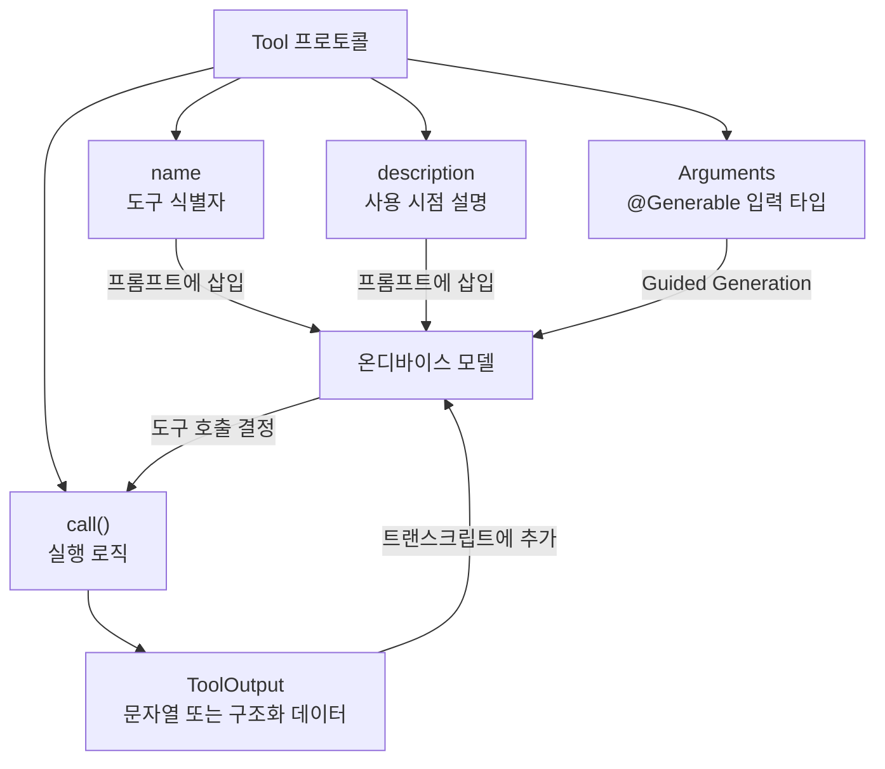
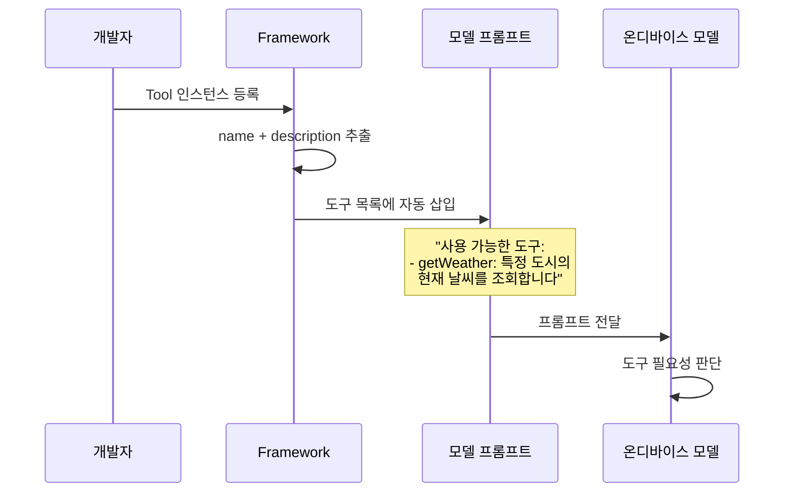
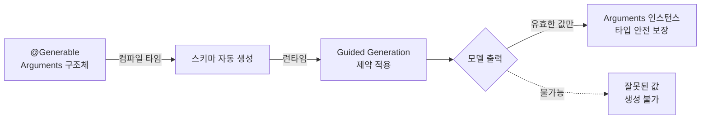
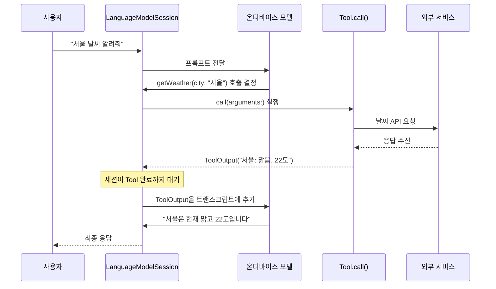
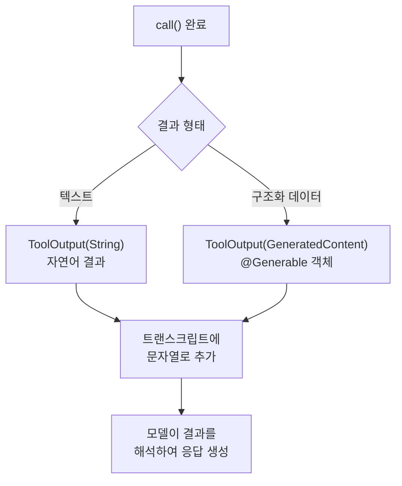

# Tool 프로토콜 구현하기

> Tool 프로토콜의 네 가지 구성 요소를 하나씩 직접 구현하며, 모델이 호출할 수 있는 커스텀 도구를 만드는 방법을 익힙니다.

## 개요

이 섹션에서는 Foundation Models 프레임워크의 `Tool` 프로토콜을 실제로 구현하는 방법을 배웁니다. 이전 섹션에서 Tool Calling의 개념과 6단계 흐름을 이해했다면, 이제는 직접 코드를 작성할 차례입니다.

**선수 지식**: [Tool Calling 개념과 아키텍처](07-ch7-tool-calling-기초/01-01-tool-calling-개념과-아키텍처.md)에서 배운 Tool Calling 흐름, [@Generable 매크로 적용하기](05-ch5-generable-구조화-출력/02-02-generable-매크로-적용하기.md)에서 배운 구조화 출력 기초

**학습 목표**:
- Tool 프로토콜의 `name`과 `description` 속성을 효과적으로 설계할 수 있다
- `@Generable`로 Tool의 `Arguments` 타입을 정의할 수 있다
- `call()` 메서드를 구현하여 외부 데이터를 반환할 수 있다
- `ToolOutput`을 문자열과 구조화 데이터 두 가지 방식으로 생성할 수 있다

## 왜 알아야 할까?

Tool Calling의 개념을 아는 것과 실제로 구현하는 것은 완전히 다른 이야기입니다. 개념만 알면 "모델이 함수를 호출한다"는 추상적인 이해에 머물지만, 직접 프로토콜을 구현해보면 **모델이 어떤 정보를 보고 도구를 선택하는지**, **인자가 어떻게 안전하게 생성되는지**, **결과가 어떻게 대화에 합류하는지** 체감할 수 있거든요.

특히 Apple의 Tool 프로토콜은 놀랍도록 간결합니다. `name`, `description`, `Arguments`, `call()` — 딱 네 가지만 정의하면 모델이 알아서 도구를 인식하고 호출합니다. 복잡한 JSON Schema를 직접 작성하거나 파싱 로직을 구현할 필요가 없죠. 이 간결함의 비밀은 바로 `@Generable` 매크로에 있는데, 이미 Ch5에서 배운 Guided Generation이 Tool의 인자 생성에도 그대로 적용되기 때문입니다.

## 핵심 개념

### Tool 프로토콜의 전체 구조

> 💡 **비유**: Tool 프로토콜은 **명함**과 같습니다. 명함에는 이름(name), 하는 일 설명(description), 연락 방법(Arguments), 그리고 실제로 연락했을 때 받는 서비스(call → ToolOutput)가 있죠. 모델은 이 "명함"을 보고 누구에게 무엇을 부탁할지 결정합니다.

Tool 프로토콜은 Swift 프로토콜로, 네 가지 필수 요소를 정의합니다:

> 📊 **그림 1**: Tool 프로토콜의 네 가지 구성 요소



기본 골격을 코드로 보면 이렇습니다:

```swift
import FoundationModels

struct MyTool: Tool {
    // 1. 이름: 모델이 이 도구를 식별하는 짧은 문자열
    let name = "myTool"
    
    // 2. 설명: 모델이 언제 이 도구를 호출할지 판단하는 근거
    let description = "Does something useful for the user."
    
    // 3. 인자: @Generable 구조체로 모델이 생성할 입력값 정의
    @Generable
    struct Arguments {
        @Guide(description: "The search query from the user.")
        let query: String
    }
    
    // 4. 실행: 실제 로직을 수행하고 결과 반환
    func call(arguments: Arguments) async throws -> ToolOutput {
        // 외부 API 호출, DB 조회, 시스템 프레임워크 등 자유롭게 구현
        let result = performSearch(query: arguments.query)
        return ToolOutput(result)
    }
    
    private func performSearch(query: String) -> String {
        return "'\(query)'에 대한 결과입니다"
    }
}
```

네 가지 요소를 하나씩 분해해봅시다:

| 요소 | 역할 | 모델과의 관계 |
|------|------|-------------|
| `name` | 도구 식별자 | 프롬프트에 삽입 → 모델이 호출 대상 선택 |
| `description` | 사용 시점 설명 | 프롬프트에 삽입 → 모델이 호출 필요성 판단 |
| `Arguments` | 입력 스키마 | Guided Generation → 유효한 인자만 생성 |
| `call()` | 실행 로직 | 프레임워크가 인자와 함께 호출 → 결과 반환 |

> ⚠️ **흔한 오해**: "Tool은 반드시 `struct`여야 한다"고 생각하기 쉽지만, 사실 **`class`로도 구현 가능**합니다. 상태를 유지해야 하는 도구(예: 이미 선택된 항목 기억)는 `class`가 더 적합합니다.

---

### name과 description 설계 전략

> 💡 **비유**: `name`은 식당의 **간판**이고, `description`은 문 앞의 **메뉴판 요약**입니다. 지나가는 사람(모델)이 간판을 보고 "어떤 종류의 가게구나" 판단하고, 메뉴판을 읽고 "지금 내가 필요한 곳이구나" 결정하는 것과 같습니다.

`name`과 `description`은 단순한 메타데이터가 아닙니다. 프레임워크가 이 두 문자열을 **자동으로 프롬프트에 삽입**하기 때문에, 모델의 도구 선택 정확도에 직접적인 영향을 미칩니다.

> 📊 **그림 2**: name/description이 모델 프롬프트에 삽입되는 과정



**name 작성 규칙:**

```swift
// ✅ 좋은 name 예시
let name = "findContact"       // 동사 + 명사, camelCase
let name = "getWeather"        // 명확한 액션
let name = "searchRecipes"     // 구체적인 행위

// ❌ 나쁜 name 예시
let name = "tool1"             // 의미 없음
let name = "get_weather_data"  // snake_case 지양
let name = "fetchAndProcessAndReturnWeatherDataForCity" // 너무 길면 토큰 낭비
```

**description 작성 규칙:**

```swift
// ✅ 좋은 description: 언제 호출할지 명확
let description = "Finds a contact from a specified age generation."
let description = "Fetches current weather information for a specific city."

// ❌ 나쁜 description: 모호하거나 너무 장황
let description = "This is a tool."                    // 언제 호출? 알 수 없음
let description = "This tool connects to the weather API server \
and retrieves temperature, humidity, wind speed, ..."  // 과도한 상세
```

핵심은 **간결하되 언제 호출할지 판단할 수 있는 정보**를 담는 것입니다. `name`과 `description` 모두 프롬프트에 포함되므로, 길어질수록 토큰을 소비하고 추론 지연이 늘어납니다.

> 🔥 **실무 팁**: `name`은 영어 동사형 camelCase로 작성하세요. 온디바이스 모델은 영어 토큰 처리가 가장 효율적이고, 함수 이름 패턴을 잘 인식합니다. `description`도 영어로 작성하는 것이 도구 선택 정확도를 높입니다.

---

### Arguments — @Generable로 안전한 입력 정의

> 💡 **비유**: Arguments는 **주문서 양식**과 같습니다. 카페에서 "아무거나 주세요"라고 하면 혼란스럽지만, 체크박스가 있는 주문서("사이즈: S/M/L, 온도: Hot/Ice")를 주면 정확한 주문이 나오죠. `@Generable`은 바로 이 체크박스 양식을 모델에게 제공하는 것입니다.

Tool의 `Arguments`는 반드시 `@Generable` 매크로가 적용된 구조체여야 합니다. 이미 [Guided Generation](05-ch5-generable-구조화-출력/01-01-guided-generation-개념과-동작-원리.md)에서 배웠듯이, `@Generable`은 컴파일 타임에 스키마를 생성하여 모델이 **항상 유효한 값만 생성**하도록 보장합니다.

> 📊 **그림 3**: @Generable이 Tool Arguments를 안전하게 만드는 과정



다양한 Arguments 패턴을 살펴보겠습니다:

**기본 문자열 인자:**

```swift
@Generable
struct Arguments {
    @Guide(description: "The name of the city to look up weather for.")
    let city: String
}
```

**열거형으로 선택지 제한:**

```swift
@Generable
struct Arguments {
    let generation: Generation
    
    @Generable
    enum Generation {
        case babyBoomers
        case genX
        case millennial
        case genZ
    }
}
```

열거형을 사용하면 모델이 **정의된 케이스 외의 값을 절대 생성할 수 없습니다**. 이것이 JSON 기반 Tool Calling과의 가장 큰 차이점이죠. OpenAI나 Anthropic의 Tool Calling에서는 모델이 잘못된 enum 값을 보낼 수 있지만, Apple의 Guided Generation에서는 구조적으로 불가능합니다.

**@Guide로 더 정교한 제약:**

```swift
@Generable
struct Arguments {
    @Guide(description: "A list of ingredients to search recipes for.")
    let ingredients: [String]
    
    @Guide(description: "Maximum number of results to return.", .count(5))
    let maxResults: Int
}
```

`@Guide` 매크로는 Ch5에서 배운 그대로 Tool Arguments에도 동일하게 적용됩니다. `description`은 모델이 어떤 값을 넣어야 하는지 이해하도록 도와주고, `.count()` 같은 제약은 값의 범위를 제한합니다.

---

### call() 메서드 — 실행 엔진

> 💡 **비유**: `call()` 메서드는 **배달 기사**와 같습니다. 주문서(Arguments)를 받으면 실제 가게에 가서 음식을 가져오고(외부 API 호출, DB 조회 등), 그 결과를 손님(모델)에게 전달합니다.

`call()` 메서드의 시그니처는 다음과 같습니다:

```swift
func call(arguments: Arguments) async throws -> ToolOutput
```

세 가지 핵심 특성이 있습니다:

1. **`async`**: 네트워크 요청, 파일 읽기 등 비동기 작업 가능
2. **`throws`**: 에러 발생 시 모델에게 에러 상황 전달 가능
3. **`ToolOutput` 반환**: 문자열 또는 구조화 데이터로 결과 반환

> 📊 **그림 4**: call() 메서드 실행 흐름과 세션의 대기



`call()` 안에서는 어떤 Swift 코드든 실행할 수 있습니다. 네트워크 요청, 로컬 DB 조회, 시스템 프레임워크 호출 — 모두 가능합니다:

```swift
func call(arguments: Arguments) async throws -> ToolOutput {
    // 네트워크 호출 예시
    let url = URL(string: "https://api.weather.com/\(arguments.city)")!
    let (data, _) = try await URLSession.shared.data(from: url)
    let weather = try JSONDecoder().decode(Weather.self, from: data)
    
    return ToolOutput("현재 \(weather.temperature)°C, \(weather.condition)")
}
```

**에러 처리:**

```swift
func call(arguments: Arguments) async throws -> ToolOutput {
    guard let contact = findContact(named: arguments.name) else {
        // 에러를 던지는 대신 "못 찾았다"는 결과를 반환
        return ToolOutput("해당 연락처를 찾을 수 없습니다.")
    }
    return ToolOutput(contact.fullName)
}
```

> 🔥 **실무 팁**: `call()`에서 에러를 `throw`하면 세션 전체가 실패할 수 있습니다. 대부분의 경우, 에러를 던지기보다 **"결과를 찾을 수 없습니다"** 같은 문자열을 ToolOutput으로 반환하는 것이 더 안전합니다. 모델은 이 메시지를 보고 사용자에게 적절히 안내할 수 있거든요.

---

### ToolOutput — 결과를 모델에게 전달

ToolOutput은 `call()`의 반환 타입으로, 두 가지 방식으로 생성할 수 있습니다:

**문자열 기반 (가장 일반적):**

```swift
// 간단한 텍스트 결과
return ToolOutput("서울: 맑음, 22°C, 습도 45%")

// 여러 항목을 포맷팅
let items = recipes.map { "- \($0.name): \($0.description)" }
return ToolOutput(items.joined(separator: "\n"))
```

**GeneratedContent 기반 (구조화 데이터):**

ToolOutput은 `@Generable` 구조체의 인스턴스도 받을 수 있습니다. 모델이 구조화된 형태로 결과를 해석해야 할 때 유용합니다.

> 📊 **그림 5**: ToolOutput의 두 가지 생성 방식



실무에서는 대부분 문자열 기반 ToolOutput으로 충분합니다. 모델이 자연어를 해석하는 능력이 뛰어나기 때문에, 결과를 읽기 쉬운 텍스트로 포맷팅하는 것이 가장 효과적입니다.

---

### struct vs class — 상태가 있는 Tool

기본적으로 Tool은 `struct`로 구현하지만, **이전 호출 결과를 기억해야 하는 경우** `class`가 필요합니다.

```swift
// 상태가 없는 Tool — struct로 충분
struct WeatherTool: Tool {
    let name = "getWeather"
    let description = "Gets current weather for a city."
    // 매 호출이 독립적
    func call(arguments: Arguments) async throws -> ToolOutput { ... }
}

// 상태가 있는 Tool — class 사용
class FindContactTool: Tool {
    let name = "findContact"
    let description = "Finds a contact from the user's address book."
    
    // 이미 선택된 연락처를 추적
    var pickedContacts = Set<String>()
    
    func call(arguments: Arguments) async throws -> ToolOutput {
        // 이전에 선택된 연락처 제외
        let available = allContacts.filter { !pickedContacts.contains($0.name) }
        guard let picked = available.randomElement() else {
            return ToolOutput("더 이상 선택할 연락처가 없습니다.")
        }
        pickedContacts.insert(picked.name)  // 상태 업데이트
        return ToolOutput(picked.name)
    }
}
```

> ⚠️ **흔한 오해**: "class로 Tool을 만들면 동시성 문제가 생기지 않나요?" — 맞습니다! 모델이 같은 도구를 **병렬로 여러 번 호출**할 수 있기 때문에, class Tool에서 상태를 변경할 때는 반드시 동시성 안전을 고려해야 합니다. `actor`를 사용하거나, 상태 변경 부분을 `@MainActor`로 보호하는 것이 좋습니다.

## 실습: 직접 해보기

이제 실제로 동작하는 Tool을 처음부터 끝까지 구현해봅시다. 한국의 도시별 맛집 정보를 제공하는 `RestaurantTool`을 만들겠습니다.

```swift
import FoundationModels

// MARK: - 1단계: Tool 구조체 정의

struct RestaurantTool: Tool {
    
    // 이름: 영어 동사형 camelCase
    let name = "findRestaurants"
    
    // 설명: 모델이 언제 호출할지 판단하는 근거
    let description = "Finds popular restaurants in a Korean city for a given cuisine type."
    
    // MARK: - 2단계: Arguments 정의
    
    @Generable
    struct Arguments {
        /// 검색할 도시
        @Guide(description: "The Korean city name to search restaurants in.")
        let city: String
        
        /// 음식 종류
        let cuisineType: CuisineType
        
        /// 음식 종류 열거형 — 모델이 이 중에서만 선택 가능
        @Generable
        enum CuisineType {
            case korean    // 한식
            case japanese  // 일식
            case chinese   // 중식
            case western   // 양식
            case cafe      // 카페/디저트
        }
    }
    
    // MARK: - 3단계: call() 메서드 구현
    
    func call(arguments: Arguments) async throws -> ToolOutput {
        // 실제 앱에서는 API를 호출하겠지만, 여기서는 로컬 데이터 사용
        let restaurants = getRestaurants(
            city: arguments.city,
            cuisine: arguments.cuisineType
        )
        
        if restaurants.isEmpty {
            return ToolOutput("\(arguments.city)에서 해당 음식점을 찾을 수 없습니다.")
        }
        
        // 결과를 읽기 쉬운 텍스트로 포맷팅
        let formatted = restaurants.map { restaurant in
            "- \(restaurant.name) (\(restaurant.rating)점): \(restaurant.specialty)"
        }.joined(separator: "\n")
        
        return ToolOutput(formatted)
    }
    
    // MARK: - 내부 데이터 (실제로는 API 호출)
    
    private func getRestaurants(city: String, cuisine: Arguments.CuisineType) -> [Restaurant] {
        // 간단한 목 데이터
        let data: [String: [Arguments.CuisineType: [Restaurant]]] = [
            "서울": [
                .korean: [
                    Restaurant(name: "광화문 국밥", rating: 4.5, specialty: "소머리국밥"),
                    Restaurant(name: "을지로 골뱅이", rating: 4.3, specialty: "골뱅이소면"),
                ],
                .cafe: [
                    Restaurant(name: "블루보틀 삼청", rating: 4.4, specialty: "드립 커피"),
                ]
            ],
            "부산": [
                .korean: [
                    Restaurant(name: "해운대 암소갈비", rating: 4.7, specialty: "한우 갈비"),
                ],
                .japanese: [
                    Restaurant(name: "초량 스시집", rating: 4.6, specialty: "모둠 초밥"),
                ]
            ]
        ]
        
        return data[city]?[cuisine] ?? []
    }
}

// 레스토랑 데이터 모델
struct Restaurant {
    let name: String
    let rating: Double
    let specialty: String
}
```

**Tool을 세션에 등록하고 사용:**

```run:swift
import FoundationModels

// Tool 인스턴스 생성
let restaurantTool = RestaurantTool()

// 세션에 Tool 등록
let session = LanguageModelSession(
    tools: [restaurantTool],
    instructions: """
    당신은 한국 여행 가이드입니다. 
    사용자가 맛집을 물어보면 findRestaurants 도구를 사용하세요.
    """
)

// 사용자 질문 전달
let response = try await session.respond(to: "부산에서 일식 맛집 추천해줘")
print(response.content)
```

```output
부산에서 일식을 즐기시려면 초량 스시집을 추천드립니다! 4.6점의 높은 평점을 자랑하며, 모둠 초밥이 특히 유명합니다.
```

모델은 사용자의 "부산에서 일식 맛집"이라는 자연어를 분석하여, `findRestaurants` Tool을 `city: "부산"`, `cuisineType: .japanese`로 호출합니다. 열거형 덕분에 "일식"을 `.japanese`로 정확하게 매핑하죠.

## 더 깊이 알아보기

### Tool Calling의 역사 — 플러그인에서 프로토콜로

Tool Calling이라는 개념은 2023년 OpenAI가 ChatGPT Plugins를 발표하면서 대중에게 알려졌습니다. 하지만 그 원류는 더 오래전으로 거슬러 올라갑니다. 1990년대 CORBA(Common Object Request Broker Architecture)나 2000년대 SOAP 웹서비스도 본질적으로 "외부 서비스의 인터페이스를 정의하고 호출한다"는 같은 패턴이었거든요.

흥미로운 점은 Apple이 이 문제를 **Swift의 타입 시스템**으로 풀었다는 것입니다. OpenAI나 Anthropic의 Tool Calling은 JSON Schema로 도구를 정의하고, 모델이 JSON을 생성하면 런타임에 파싱하여 검증합니다. 파싱 실패나 스키마 불일치 에러가 빈번하죠. 반면 Apple은 `@Generable` 매크로로 **컴파일 타임에 스키마를 확정**하고, Guided Generation으로 **모델이 유효한 값만 생성하도록 구조적으로 강제**합니다. 런타임 파싱 에러가 원천적으로 불가능한 것이 가장 큰 차별점입니다.

이 접근법은 WWDC25에서 "Deep dive into the Foundation Models framework" 세션을 통해 공개되었고, Swift의 매크로 시스템이 AI 프레임워크 설계에 얼마나 강력한 도구가 되는지를 보여준 사례로 주목받았습니다.

### name이 프롬프트에 그대로 들어간다

Apple 개발자 문서에서 강조하는 흥미로운 사실이 있습니다. `name`과 `description`은 프레임워크가 **그대로(verbatim)** 모델 프롬프트에 삽입합니다. 즉, 개발자가 작성한 문자열이 곧 모델이 읽는 지시문의 일부가 됩니다. 이 때문에 `name`이 길면 그만큼 토큰을 소비하고 추론 지연이 늘어납니다. Apple이 "short but readable" 원칙을 강조하는 이유가 바로 이것입니다.

## 흔한 오해와 팁

> ⚠️ **흔한 오해**: "Tool의 `name`에 한국어를 써도 되나요?" — 기술적으로 가능하지만 **권장하지 않습니다**. 온디바이스 모델은 영어 토큰 처리에 최적화되어 있어, 한국어 이름은 토큰을 더 많이 소비하고 도구 선택 정확도가 떨어질 수 있습니다. `name`과 `description`은 영어로, 사용자 대면 텍스트만 한국어로 작성하세요.

> 💡 **알고 계셨나요?**: Tool의 `Arguments`를 빈 구조체로 만들 수도 있습니다. 인자가 필요 없는 도구(예: "현재 시간 조회")는 `@Generable struct Arguments {}`로 정의하면 됩니다. 모델은 인자 없이 도구를 호출합니다.

> 🔥 **실무 팁**: `description`에 "모델이 이 도구를 **언제** 호출해야 하는지"를 명시하세요. 단순히 "날씨를 조회합니다"보다 "Retrieves current weather when the user asks about weather conditions in a specific city"처럼 조건을 포함하면 불필요한 호출이 줄어듭니다.

## 핵심 정리

| 개념 | 설명 |
|------|------|
| **Tool 프로토콜** | `name`, `description`, `Arguments`, `call()` 4가지 필수 요소로 구성 |
| **name** | 영어 camelCase 동사형, 짧고 의미 명확. 프롬프트에 삽입됨 |
| **description** | 도구 사용 시점을 설명하는 1문장. 프롬프트에 삽입됨 |
| **Arguments** | `@Generable` 구조체로 정의. Guided Generation이 유효한 값만 생성 보장 |
| **@Guide** | Arguments 필드에 설명과 제약 조건 추가. `description`, `.count()` 등 |
| **call()** | `async throws -> ToolOutput`. 비동기 외부 작업 수행 후 결과 반환 |
| **ToolOutput** | 문자열 또는 GeneratedContent로 생성. 트랜스크립트에 추가됨 |
| **struct vs class** | 상태 없으면 struct, 호출 간 상태 유지 필요하면 class |

## 다음 섹션 미리보기

Tool 프로토콜의 기본 구현을 마스터했다면, 다음은 [Tool 입출력 스키마 설계](07-ch7-tool-calling-기초/03-03-tool-입출력-스키마-설계.md)에서 더 정교한 Arguments 설계를 다룹니다. 중첩 구조체, 열거형 조합, 옵셔널 필드, 배열 인자 등 복잡한 입력 스키마를 설계하는 방법과, ToolOutput을 구조화 데이터로 반환하는 고급 패턴을 배웁니다.

## 참고 자료

- [Deep dive into the Foundation Models framework — WWDC25](https://developer.apple.com/videos/play/wwdc2025/301/) - Tool 프로토콜의 공식 설명과 FindContactTool 구현 라이브 데모
- [The Ultimate Guide To The Foundation Models Framework — AzamSharp](https://azamsharp.com/2025/06/18/the-ultimate-guide-to-the-foundation-models-framework.html) - RecipeTool 구현 예제와 HTTPClient 연동 패턴
- [Exploring the Foundation Models framework — Create with Swift](https://www.createwithswift.com/exploring-the-foundation-models-framework/) - Tool 프로토콜 요구사항 상세 분석과 FindRestaurantsTool 예제
- [Foundation Models — Apple Developer Documentation](https://developer.apple.com/documentation/FoundationModels) - Tool 프로토콜 공식 API 레퍼런스
- [Code-along: Bring on-device AI to your app — WWDC25](https://developer.apple.com/videos/play/wwdc2025/259/) - 단계별 Tool 구현 실습 가이드

---
### 🔗 Related Sessions
- [guided generation](05-ch5-generable-구조화-출력/01-01-guided-generation-개념과-동작-원리.md) (prerequisite)
