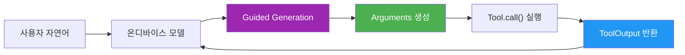
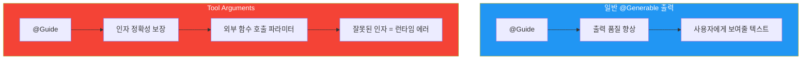
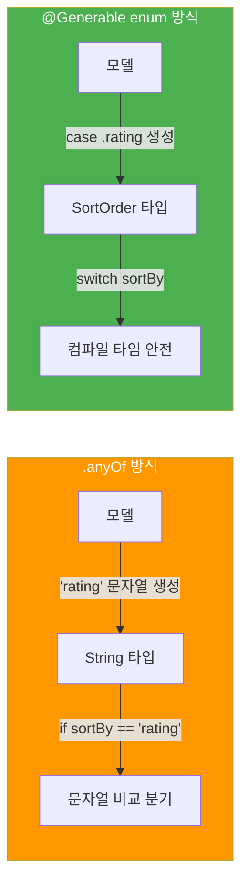
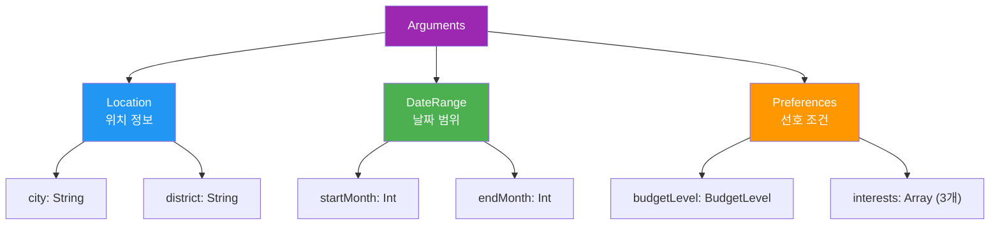
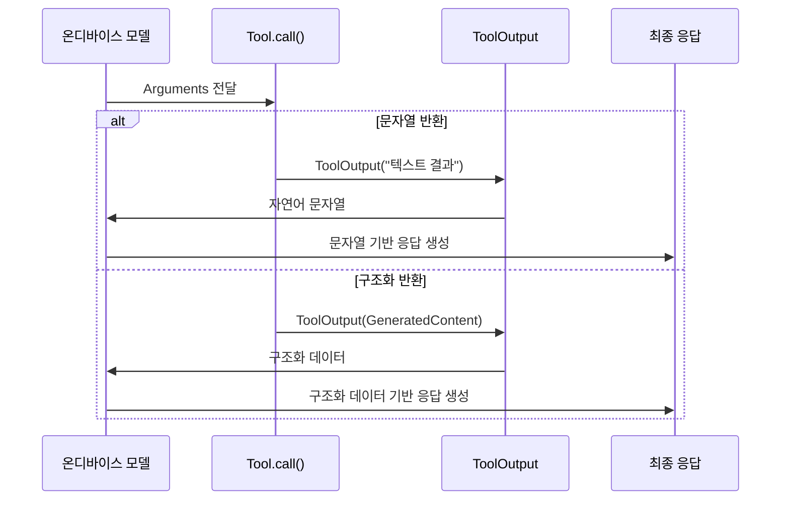
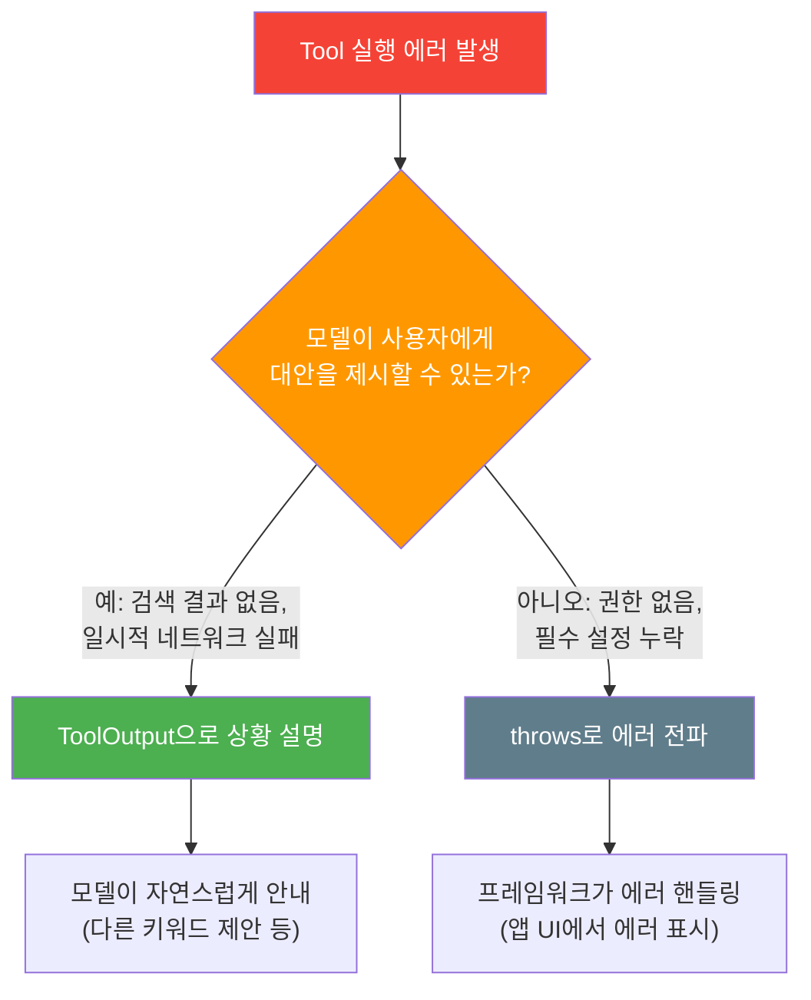

# Tool 입출력 스키마 설계

> Tool의 Arguments와 ToolOutput에 @Generable과 @Guide를 적용하여, 복잡한 입출력 타입을 안전하고 정밀하게 설계하는 방법을 배웁니다.

## 개요

이 섹션에서는 Tool의 입력(Arguments)과 출력(ToolOutput)을 설계하는 고급 패턴을 다룹니다. 이전 섹션에서 Tool 프로토콜의 기본 구조를 익혔다면, 이제는 **실제 앱에서 마주치는 복잡한 데이터**를 도구의 인자와 결과로 주고받는 방법을 배울 차례입니다.

**선수 지식**: [Tool 프로토콜 구현하기](07-ch7-tool-calling-기초/02-02-tool-프로토콜-구현하기.md)에서 배운 Tool의 4요소, [@Guide 매크로로 출력 품질 높이기](05-ch5-generable-구조화-출력/03-03-guide-매크로로-출력-품질-높이기.md)에서 배운 가이드 제약 조건 기초

**학습 목표**:
- `@Guide`를 Tool Arguments에 특화하여 적용하는 패턴을 익힌다 (기본 문법은 [Ch5.3](05-ch5-generable-구조화-출력/03-03-guide-매크로로-출력-품질-높이기.md) 참고)
- 중첩 @Generable 구조체와 열거형으로 복합 입력 스키마를 설계할 수 있다
- ToolOutput을 문자열과 구조화 객체 두 가지 방식으로 반환할 수 있다
- 에러 상황을 ToolOutput으로 우아하게 처리하는 패턴을 이해한다

## 왜 알아야 할까?

이전 섹션에서 만든 Tool은 대부분 `String` 하나를 받고 `String` 하나를 돌려주는 단순한 구조였죠. 하지만 실제 앱에서는 상황이 훨씬 복잡합니다. 음식 배달 앱의 검색 도구를 생각해볼까요? "강남역 근처 이탈리안 레스토랑, 평점 4점 이상, 배달 가능한 곳 3개"라는 요청을 처리하려면 위치, 음식 종류, 최소 평점, 배달 가능 여부, 결과 개수까지 **여러 차원의 입력**이 필요합니다.

여기서 핵심은 이 복잡한 입력을 **모델이 정확하게 생성할 수 있게 만드는 것**입니다. `@Generable`과 `@Guide`를 활용하면 모델이 "이탈리안"이라는 자유 텍스트 대신 `CuisineType.italian`이라는 정확한 열거형 값을 생성하고, 평점을 1~5 사이로 제한하며, 결과 개수를 합리적인 범위로 한정할 수 있습니다. 잘 설계된 스키마는 곧 **모델의 실수를 원천 차단하는 안전장치**인 셈이죠.

> 📊 **그림 1**: Tool 스키마 설계가 만드는 안전 계층



## 핵심 개념

### Tool Arguments를 위한 @Guide 실전 패턴

> 💡 **비유**: `@Guide`는 **주문서의 양식 필드**와 같습니다. 빈 종이에 "원하는 걸 쓰세요"라고 하면 모든 가능한 답이 나오지만, 드롭다운 메뉴(`.anyOf`), 숫자 범위 슬라이더(`.range`), 글자 수 제한(`.count`)이 있는 양식을 주면 정확한 입력만 받을 수 있죠.

`@Guide`의 기본 문법과 제약 조건 종류는 [Ch5.3 — @Guide 매크로로 출력 품질 높이기](05-ch5-generable-구조화-출력/03-03-guide-매크로로-출력-품질-높이기.md)에서 자세히 다뤘으니, 여기서는 **Tool Arguments에 특화된 실전 패턴**에 집중하겠습니다. 핵심 차이는 이겁니다: 일반 `@Generable` 구조체는 "출력 품질"을 높이는 게 목적이지만, Tool Arguments는 **모델이 외부 함수에 전달할 인자를 생성한다**는 점에서 정확성이 훨씬 더 중요합니다.

> 📊 **그림 2**: 일반 Generable vs Tool Arguments에서의 @Guide 역할 비교



Tool Arguments에서 특히 효과적인 패턴들을 코드로 살펴보겠습니다:

```swift
import FoundationModels

struct RestaurantSearchTool: Tool {
    let name = "searchRestaurants"
    let description = "Search for restaurants by location and criteria."
    
    @Generable
    struct Arguments {
        // 패턴 1: description으로 모델에게 문맥 제공
        @Guide(description: "The area or neighborhood to search in")
        let location: String
        
        // 패턴 2: .range로 API가 수용하는 값 범위 강제
        @Guide(description: "Minimum rating filter", .range(1...5))
        let minimumRating: Int
        
        // 패턴 3: .count로 배열 길이 고정 — API 제한에 맞춤
        @Guide(description: "Preferred cuisine types", .count(2))
        let cuisinePreferences: [String]
        
        // 패턴 4: .anyOf로 API 파라미터 값 제한
        @Guide(description: "Sort order for results", .anyOf(["distance", "rating", "price"]))
        let sortBy: String
    }
    
    func call(arguments: Arguments) async throws -> ToolOutput {
        // arguments.minimumRating은 반드시 1~5 범위
        // arguments.sortBy는 반드시 "distance", "rating", "price" 중 하나
        return ToolOutput("검색 결과: \(arguments.location) 근처 맛집")
    }
}
```

여기서 핵심은 **@Guide의 제약이 외부 API/데이터베이스의 제약과 일치해야 한다**는 점입니다. API가 평점 1~5만 받는다면 `.range(1...5)`, 정렬 옵션이 3개뿐이라면 `.anyOf(["distance", "rating", "price"])`. 이렇게 하면 모델이 생성한 인자가 API 호출에서 절대 실패하지 않습니다.

> 🔥 **실무 팁**: `.anyOf`와 `Regex`가 비슷해 보이지만, 단순한 선택지는 `.anyOf`가 더 직관적이고 토큰 효율도 좋습니다. Regex는 "Mr. " 또는 "Mrs. " 뒤에 이름이 오는 것처럼 **패턴이 있는 문자열**에 사용하세요.

---

### 열거형(Enum)으로 입력 제약하기

> 💡 **비유**: `.anyOf(["한식", "중식", "일식"])`이 메뉴판의 카테고리 탭이라면, `@Generable enum`은 **키오스크의 터치 버튼**입니다. `.anyOf`는 문자열을 제한할 뿐이지만, 열거형은 아예 **타입 시스템** 차원에서 잘못된 값을 컴파일 타임에 차단합니다.

`@Guide(.anyOf(...))`는 편리하지만 한계가 있습니다. 값이 여전히 `String`이라서 코드 내부에서 `if sortBy == "distance"` 같은 문자열 비교가 필요하죠. `@Generable enum`을 사용하면 이 문제를 깔끔하게 해결할 수 있습니다.

> 📊 **그림 3**: String .anyOf vs @Generable enum 비교



실제 코드로 비교해보겠습니다:

```swift
struct ProductSearchTool: Tool {
    let name = "searchProducts"
    let description = "Search products with filters."
    
    // 열거형으로 카테고리와 정렬 기준 정의
    @Generable
    enum Category {
        case electronics
        case clothing
        case books
        case food
    }
    
    @Generable
    enum SortOrder {
        case priceAsc
        case priceDesc
        case popularity
        case newest
    }
    
    @Generable
    struct Arguments {
        @Guide(description: "Search keyword")
        let query: String
        
        // 열거형 필드 — 모델은 정의된 case만 생성 가능
        let category: Category
        let sortOrder: SortOrder
        
        @Guide(description: "Maximum price in KRW", .range(1000...1000000))
        let maxPrice: Int
    }
    
    func call(arguments: Arguments) async throws -> ToolOutput {
        // switch 문으로 안전하게 분기 — 문자열 비교 불필요!
        switch arguments.category {
        case .electronics:
            return ToolOutput("전자제품 검색 결과: \(arguments.query)")
        case .clothing:
            return ToolOutput("의류 검색 결과: \(arguments.query)")
        case .books:
            return ToolOutput("도서 검색 결과: \(arguments.query)")
        case .food:
            return ToolOutput("식품 검색 결과: \(arguments.query)")
        }
    }
}
```

Guided Generation의 핵심이 여기서 빛납니다. 모델은 `Category` 열거형의 4가지 case만 생성할 수 있으므로, "가전" 같은 한국어나 "Electronics" 같은 대문자 변형이 나올 수 없습니다. **구조적 정확성이 100% 보장**되는 거죠.

---

### 중첩 구조체로 복합 스키마 만들기

> 💡 **비유**: 중첩 구조체는 **택배 상자 안의 작은 상자**와 같습니다. 큰 상자(Arguments)에 옷이 담긴 작은 상자(Location), 악세서리가 담긴 작은 상자(DateRange)를 넣어 보내는 거죠. 각 작은 상자도 `@Generable`이면 모델이 빈틈없이 내용물을 채워 넣을 수 있습니다.

실제 앱에서는 인자가 단순 필드 나열이 아니라 **논리적 그룹**으로 묶여야 할 때가 많습니다. 예를 들어 여행 검색 도구라면 출발지/도착지 정보, 날짜 범위, 선호 조건이 각각 하나의 묶음이 되어야 합니다.

> 📊 **그림 4**: 중첩 구조체를 활용한 복합 Arguments 구조



코드로 구현하면 이렇습니다:

```swift
struct TravelSearchTool: Tool {
    let name = "searchTravel"
    let description = "Search travel destinations and packages."
    
    // 중첩 구조체 1: 위치 정보
    @Generable
    struct Location {
        @Guide(description: "City name")
        let city: String
        
        @Guide(description: "District or neighborhood")
        let district: String
    }
    
    // 중첩 구조체 2: 날짜 범위
    @Generable
    struct DateRange {
        @Guide(description: "Start month (1-12)", .range(1...12))
        let startMonth: Int
        
        @Guide(description: "End month (1-12)", .range(1...12))
        let endMonth: Int
    }
    
    // 중첩 열거형: 예산 수준
    @Generable
    enum BudgetLevel {
        case budget
        case moderate
        case luxury
    }
    
    // 최상위 Arguments에서 중첩 타입 조합
    @Generable
    struct Arguments {
        let destination: Location
        let travelDates: DateRange
        let budget: BudgetLevel
        
        @Guide(description: "Travel interests", .count(3))
        let interests: [String]
    }
    
    func call(arguments: Arguments) async throws -> ToolOutput {
        let city = arguments.destination.city
        let month = arguments.travelDates.startMonth
        let level = arguments.budget
        
        return ToolOutput(
            "\(city) \(month)월 여행 패키지 (\(level)): " +
            arguments.interests.joined(separator: ", ")
        )
    }
}
```

중첩 구조체를 사용할 때 핵심 규칙이 있습니다:

| 규칙 | 설명 |
|------|------|
| 모든 중첩 타입에 `@Generable` 필수 | 중첩된 struct/enum도 각각 `@Generable` 매크로가 있어야 함 |
| 깊이 제한 권장 | 2~3단계까지가 적정. 너무 깊으면 모델의 생성 품질 저하 |
| 필드 수 관리 | 전체 필드 합계 10개 이내 권장. 온디바이스 모델의 토큰 제약 고려 |

> ⚠️ **흔한 오해**: "중첩을 많이 하면 더 정밀한 스키마가 되니까 좋다"고 생각하기 쉽지만, 온디바이스 ~3B 모델은 컨텍스트 윈도우가 제한적입니다. 중첩이 깊어지면 모델이 전체 스키마를 파악하는 데 더 많은 토큰을 소비하고, 오히려 생성 품질이 떨어질 수 있어요. **간결함이 정확성**입니다.

---

### ToolOutput: 문자열 vs 구조화 반환

> 💡 **비유**: ToolOutput은 **보고서 형식**의 선택입니다. 구두 보고("매출 올랐어요")는 빠르지만 정보가 흐릿하고, 엑셀 보고서(구조화 데이터)는 정확하지만 만드는 데 비용이 듭니다. 상황에 따라 적절한 형식을 선택하는 것이 중요합니다.

`ToolOutput`은 Tool의 `call()` 메서드가 반환하는 타입으로, 두 가지 방식으로 생성할 수 있습니다.

> 📊 **그림 5**: ToolOutput 생성 경로와 모델의 활용 방식



**방식 1: 문자열 반환** — 가장 간단하고 흔한 패턴입니다.

```swift
func call(arguments: Arguments) async throws -> ToolOutput {
    // 단순 문자열 반환
    return ToolOutput("서울 강남구 맛집: 파스타공방, 스시히로, 차이나팰리스")
}
```

**방식 2: 구조화 반환** — `GeneratedContent`를 준수하는 `@Generable` 객체를 반환합니다.

```swift
// ToolOutput에 담을 구조화 결과 타입
@Generable
struct RestaurantResult {
    @Guide(description: "Restaurant name")
    let name: String
    
    @Guide(description: "Rating out of 5", .range(1...5))
    let rating: Int
    
    @Guide(description: "Whether delivery is available")
    let hasDelivery: Bool
}

func call(arguments: Arguments) async throws -> ToolOutput {
    let result = RestaurantResult(
        name: "파스타공방",
        rating: 4,
        hasDelivery: true
    )
    // 구조화 객체를 ToolOutput으로 래핑
    return ToolOutput(result)
}
```

언제 어떤 방식을 선택해야 할까요?

| 상황 | 권장 방식 | 이유 |
|------|-----------|------|
| 모델이 자연스러운 문장으로 풀어 설명해야 할 때 | 문자열 | 모델이 자유롭게 응답 구성 |
| 결과를 UI에 직접 매핑해야 할 때 | 구조화 | 파싱 불필요, 타입 안전 |
| 간단한 성공/실패 알림 | 문자열 | 오버엔지니어링 방지 |
| 다음 Tool 호출의 입력으로 활용될 때 | 구조화 | 데이터 정합성 보장 |

> 💡 **알고 계셨나요?**: ToolOutput은 프레임워크 내부에서 **세션 트랜스크립트**에 자동 추가됩니다. 모델은 이 트랜스크립트를 읽고 최종 사용자 응답을 생성하거든요. 그래서 문자열 ToolOutput이라도 모델이 "읽기 쉬운" 형태로 포매팅하면 더 좋은 최종 응답을 얻을 수 있습니다.

---

### 에러와 실패를 ToolOutput으로 전달하기

Tool 실행 중 에러가 발생하면 어떻게 해야 할까요? `throws`로 에러를 던질 수도 있지만, 많은 경우 **모델에게 실패 상황을 알려주는 ToolOutput**이 더 나은 사용자 경험을 만듭니다. 이건 Tool 스키마 설계에서 가장 간과되기 쉬운 패턴이면서, 실제 앱 품질을 크게 좌우하는 부분이에요.

> 📊 **그림 6**: Tool 에러 처리 전략 — throws vs ToolOutput 판단 흐름



구체적인 에러 ToolOutput 패턴을 살펴볼까요?

```swift
func call(arguments: Arguments) async throws -> ToolOutput {
    // 패턴 1: 입력 검증 실패 → 모델에게 원인과 대안 제시
    guard let url = URL(string: "https://api.example.com/search?q=\(arguments.query)") else {
        return ToolOutput(
            "Could not search for '\(arguments.query)'. " +
            "The query may contain invalid characters. " +
            "Try simpler keywords."
        )
    }
    
    do {
        let (data, response) = try await URLSession.shared.data(from: url)
        
        // 패턴 2: HTTP 에러 → 상태별 맞춤 메시지
        if let httpResponse = response as? HTTPURLResponse,
           httpResponse.statusCode == 429 {
            return ToolOutput(
                "Search is rate-limited. Please wait a moment and try again."
            )
        }
        
        let result = try JSONDecoder().decode(SearchResult.self, from: data)
        
        // 패턴 3: 빈 결과 → 조건 완화 제안
        if result.items.isEmpty {
            return ToolOutput(
                "No results found for '\(arguments.query)' " +
                "with rating >= \(arguments.minimumRating). " +
                "Try lowering the minimum rating or broadening the search."
            )
        }
        
        return ToolOutput("Found: \(result.items.map(\.name).joined(separator: ", "))")
    } catch {
        // 패턴 4: 네트워크/디코딩 에러 → 일반 안내
        return ToolOutput("Search is temporarily unavailable. Please try again later.")
    }
}
```

핵심은 에러 ToolOutput 메시지의 **구조**입니다:

| 요소 | 설명 | 예시 |
|------|------|------|
| 무엇이 실패했는지 | 모델이 상황을 이해할 수 있도록 | "No results found for 'sushi'" |
| 왜 실패했는지 | 원인을 구체적으로 | "rating >= 9 is too restrictive" |
| 어떻게 해결할 수 있는지 | 대안 제시 | "Try lowering the minimum rating" |

이 세 요소가 갖춰지면 모델은 사용자에게 "스시 레스토랑을 찾았는데 평점 9점 이상인 곳이 없네요. 평점 기준을 좀 낮춰볼까요?"처럼 **자연스러운 대화**로 안내할 수 있습니다. `throws`를 사용했다면 앱이 딱딱한 에러 다이얼로그를 보여주는 것과는 완전히 다른 경험이죠.

> 🔥 **실무 팁**: 에러 ToolOutput의 메시지는 반드시 **영어**로 작성하세요. 모델이 이 메시지를 읽고 사용자의 언어(한국어)로 자연스럽게 번역/재구성하거든요. 한국어로 쓰면 모델이 그대로 노출하거나 어색하게 재가공할 수 있습니다.

## 실습: 직접 해보기

실제 앱에서 사용할 수 있는 **영화 추천 Tool**을 만들어보겠습니다. 중첩 구조체, 열거형, 다양한 @Guide 제약 조건, 그리고 에러 ToolOutput 패턴을 모두 활용하는 종합 예제입니다.

```swift
import FoundationModels

// MARK: - 영화 추천 Tool 전체 구현

/// 영화 장르 열거형 — 모델이 정확한 장르만 선택하도록 제약
@Generable
enum MovieGenre {
    case action
    case comedy
    case drama
    case sciFi
    case horror
    case romance
    case animation
}

/// 연령 등급 열거형
@Generable
enum AgeRating {
    case all       // 전체 관람가
    case twelve    // 12세 이상
    case fifteen   // 15세 이상
    case adult     // 청소년 관람불가
}

/// 영화 추천 Tool
struct MovieRecommendationTool: Tool {
    let name = "recommendMovies"
    let description = "Recommend movies based on user preferences like genre, mood, and viewing context."
    
    // 중첩 구조체: 시청 맥락 정보
    @Generable
    struct ViewingContext {
        @Guide(description: "Who is watching", .anyOf(["alone", "couple", "family", "friends"]))
        let audience: String
        
        @Guide(description: "Current mood or desired feeling")
        let mood: String
    }
    
    // Arguments: 여러 제약 조건 조합
    @Generable
    struct Arguments {
        // 열거형 필드
        let genre: MovieGenre
        let maxAgeRating: AgeRating
        
        // 중첩 구조체
        let context: ViewingContext
        
        // 범위 제약
        @Guide(description: "Minimum rating on a 10-point scale", .range(1...10))
        let minimumRating: Int
        
        // 결과 수 제약
        @Guide(description: "Number of recommendations to return", .range(1...5))
        let count: Int
    }
    
    // 간단한 영화 데이터베이스 (실제로는 외부 API 호출)
    private let movieDB: [(String, MovieGenre, Int, AgeRating)] = [
        ("인터스텔라", .sciFi, 9, .twelve),
        ("인사이드 아웃 2", .animation, 8, .all),
        ("올드보이", .drama, 9, .adult),
        ("극한직업", .comedy, 8, .twelve),
        ("부산행", .action, 8, .fifteen),
        ("건축학개론", .romance, 7, .twelve),
        ("기생충", .drama, 10, .fifteen),
        ("너의 이름은", .animation, 9, .all),
        ("범죄도시", .action, 8, .fifteen),
        ("라라랜드", .romance, 9, .all),
    ]
    
    func call(arguments: Arguments) async throws -> ToolOutput {
        // 장르와 등급 필터링
        let filtered = movieDB.filter { movie in
            movie.1 == arguments.genre && movie.2 >= arguments.minimumRating
        }
        
        let results = filtered.prefix(arguments.count)
        
        // 에러 ToolOutput 패턴: 빈 결과 시 대안 제시
        if results.isEmpty {
            return ToolOutput(
                "No movies found for genre \(arguments.genre) " +
                "with rating >= \(arguments.minimumRating). " +
                "Try lowering the minimum rating or choosing a different genre."
            )
        }
        
        // 결과를 모델이 읽기 쉬운 형태로 포맷
        let movieList = results.map { "\($0.0) (rating: \($0.2)/10)" }
            .joined(separator: ", ")
        
        return ToolOutput(
            "Recommended for \(arguments.context.audience) " +
            "feeling \(arguments.context.mood): \(movieList)"
        )
    }
}

// MARK: - 세션에서 사용

let tool = MovieRecommendationTool()
let session = LanguageModelSession(
    tools: [tool],
    instructions: "You are a friendly movie recommendation assistant. Respond in Korean."
)

let response = try await session.respond(
    to: "가족이랑 같이 볼 만한 재미있는 애니메이션 추천해줘. 평점 높은 걸로!"
)
```

```run:swift
// 실행 시뮬레이션: 모델이 생성할 Arguments 예시
let generatedArgs = MovieRecommendationTool.Arguments(
    genre: .animation,
    maxAgeRating: .all,
    context: MovieRecommendationTool.ViewingContext(
        audience: "family",
        mood: "fun and heartwarming"
    ),
    minimumRating: 8,
    count: 3
)

print("Genre: \(generatedArgs.genre)")
print("Audience: \(generatedArgs.context.audience)")
print("Min Rating: \(generatedArgs.minimumRating)")
print("Count: \(generatedArgs.count)")
```

```output
Genre: animation
Audience: family
Min Rating: 8
Count: 3
```

이 예제의 핵심 포인트를 정리하면:

1. **열거형 활용**: `MovieGenre`, `AgeRating`을 `@Generable enum`으로 정의하여 유효한 값만 생성되도록 보장
2. **중첩 구조체**: `ViewingContext`를 별도 구조체로 분리하여 논리적 그룹화
3. **제약 혼합**: `.range`, `.anyOf`, `description`을 적재적소에 배치
4. **에러 대응 ToolOutput**: 결과가 없을 때 모델에게 원인과 대안을 함께 제시하는 문자열 반환

## 더 깊이 알아보기

### Guided Generation의 역사적 맥락

Tool의 입출력 스키마가 이렇게 "깔끔하게" 동작할 수 있는 배경에는 **Constrained Decoding**(제약 디코딩)이라는 기술이 있습니다. 이 기술의 뿌리는 2020년대 초반 자연어 처리 연구로 거슬러 올라갑니다.

GPT-3가 등장한 2020년, 연구자들은 LLM이 놀라운 텍스트를 생성하지만 "구조화된 출력"에는 취약하다는 문제에 직면했습니다. JSON을 생성해달라고 하면 중괄호가 빠지거나, 필드명이 달라지거나, 숫자 대신 문자열이 나오는 일이 비일비재했죠. 이를 해결하기 위해 **디코딩 단계에서 토큰 확률을 마스킹하는 기법** — 즉 문법적으로 유효하지 않은 토큰의 확률을 0으로 만드는 방법 — 이 연구되었습니다.

Apple은 이 아이디어를 Swift 타입 시스템과 결합했습니다. `@Generable` 매크로가 **컴파일 타임에 스키마를 생성**하고, 런타임에 모델이 이 스키마를 따라 constrained decoding을 수행합니다. WWDC25에서 Apple이 이것을 "Guided Generation"이라고 명명한 건, 단순히 제약하는 것이 아니라 모델을 올바른 방향으로 "안내(guide)"한다는 철학을 담고 있습니다.

흥미로운 점은 Apple의 접근이 OpenAI의 Function Calling과 근본적으로 다르다는 것입니다. OpenAI는 JSON Schema를 런타임에 프롬프트로 전달하지만, Apple은 Swift 타입에서 컴파일 타임에 스키마를 추출합니다. 이 덕분에 **JSON 파싱 에러가 원천 불가능**하고, Swift의 타입 안전성이 그대로 AI 생성까지 이어지는 거죠.

## 흔한 오해와 팁

> ⚠️ **흔한 오해**: "모든 Tool Arguments에 가능한 한 많은 @Guide 제약을 걸어야 한다." 사실 과도한 제약은 모델의 유연성을 해칩니다. `description`만으로 충분한 필드(예: 자유 텍스트 검색어)에 `.anyOf`를 걸면 오히려 기능이 제한됩니다. **입력값의 범위가 명확히 한정된 필드에만** 강한 제약을 적용하세요.

> 💡 **알고 계셨나요?**: Tool의 `name`과 `description`은 프레임워크가 자동으로 모델의 프롬프트에 삽입합니다. 즉, 긴 description은 모델의 소중한 컨텍스트 윈도우를 잡아먹죠. WWDC25의 가이드라인에 따르면 description은 **한 문장, 영어 기준 ~15단어** 이내가 최적입니다. Arguments의 `@Guide(description:)`도 마찬가지로 간결하게 유지하세요.

> 🔥 **실무 팁**: Tool 스키마를 설계할 때 가장 효과적인 접근법은 **"모델이 이 Tool을 호출하는 상황"을 5가지 이상 상상해보는 것**입니다. 각 상황에서 필요한 인자를 나열하고, 공통 인자는 필수 필드로, 특정 상황에서만 필요한 인자는 옵셔널로 설계하면 자연스러운 스키마가 완성됩니다.

## 핵심 정리

| 개념 | 설명 |
|------|------|
| `@Guide` Tool 특화 패턴 | 외부 API 제약과 @Guide 제약을 일치시켜 런타임 에러 방지 ([기초 문법은 Ch5.3 참고](05-ch5-generable-구조화-출력/03-03-guide-매크로로-출력-품질-높이기.md)) |
| `@Generable enum` | 타입 안전한 선택지. switch 분기 가능, .anyOf보다 강력 |
| 중첩 `@Generable struct` | 논리적 그룹을 별도 타입으로 분리. 2~3단계 깊이 권장 |
| `ToolOutput(String)` | 문자열 결과 반환. 자연어 응답에 적합 |
| `ToolOutput(GeneratedContent)` | 구조화 결과 반환. UI 매핑, 후속 처리에 적합 |
| 에러 ToolOutput 패턴 | 실패 시 원인+대안 설명 문자열 반환. 모델이 자연스럽게 안내 |
| throws vs ToolOutput | 모델이 대안 제시 가능하면 ToolOutput, 앱 진행 불가면 throws |
| 필드 수 관리 | 전체 필드 합계 10개 이내, 중첩 2~3단계 — 온디바이스 모델 토큰 제약 고려 |

## 다음 섹션 미리보기

스키마를 잘 설계했다면, 이제 이 Tool을 **세션에 등록하고 실제로 모델이 호출하는 전체 흐름**을 체험할 차례입니다. [세션에 Tool 등록과 호출 흐름](07-ch7-tool-calling-기초/04-04-세션에-tool-등록과-호출-흐름.md)에서는 `LanguageModelSession(tools:)`에 도구를 연결하고, 모델이 자율적으로 도구를 선택 → 인자 생성 → 실행 → 응답 통합하는 전체 사이클을 코드로 따라가봅니다. 병렬 호출과 직렬 호출의 차이도 미리 엿볼 수 있습니다.

## 참고 자료

- [Foundation Models | Apple Developer Documentation](https://developer.apple.com/documentation/FoundationModels) - Tool 프로토콜, @Generable, @Guide의 공식 API 레퍼런스
- [Deep dive into the Foundation Models framework — WWDC25](https://developer.apple.com/videos/play/wwdc2025/301/) - Tool Calling 아키텍처, Arguments 설계, Guided Generation 심화 내용
- [Exploring the Foundation Models framework — Create with Swift](https://www.createwithswift.com/exploring-the-foundation-models-framework/) - @Guide 제약 조건별 코드 예제와 실전 패턴
- [Meet the Foundation Models framework — WWDC25](https://developer.apple.com/videos/play/wwdc2025/286/) - Tool 개념 소개와 기본 사용법
- [The Ultimate Guide To The Foundation Models Framework — AzamSharp](https://azamsharp.com/2025/06/18/the-ultimate-guide-to-the-foundation-models-framework.html) - @Generable 매크로와 Tool 구현 종합 가이드

---
### 🔗 Related Sessions
- [tool 프로토콜 4요소](07-ch7-tool-calling-기초/01-01-tool-calling-개념과-아키텍처.md) (prerequisite)
