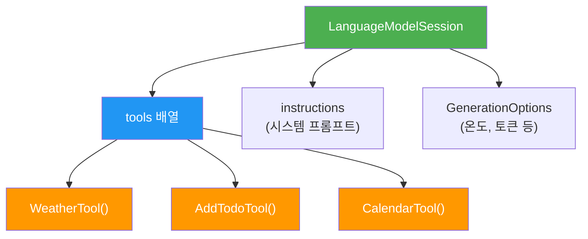
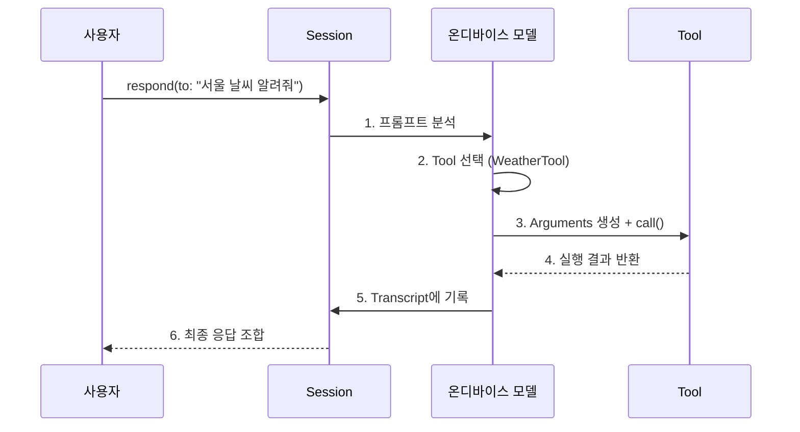
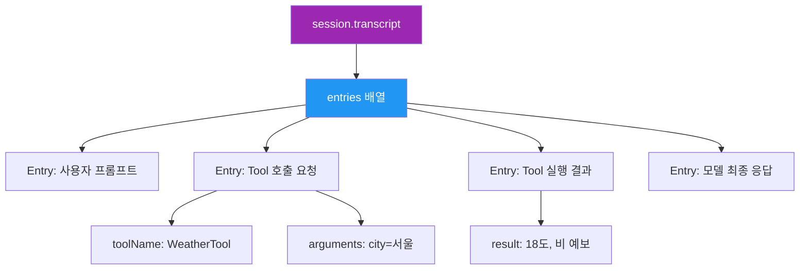
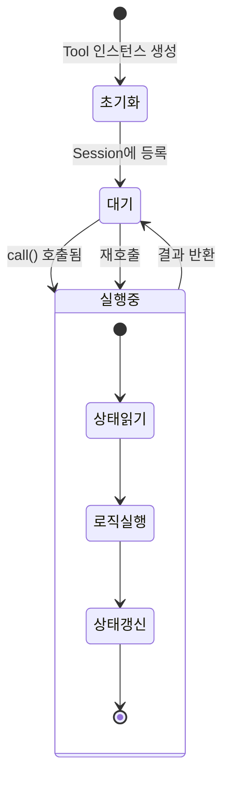

# 세션에 Tool 등록과 호출 흐름

> `LanguageModelSession`에 여러 Tool을 등록하고, 모델이 자동으로 적절한 Tool을 선택·호출하는 전체 과정을 마스터합니다.

## 개요

이전 섹션에서 `@Generable` 스키마와 개별 Tool 정의 방법을 배웠습니다. 하지만 Tool을 만들기만 해서는 아무 일도 일어나지 않죠. **세션(Session)에 등록**해야 비로소 모델이 Tool을 인식하고, 필요할 때 스스로 골라서 호출합니다.

**선수 지식**: `@Generable` 스키마 정의, `Tool` 프로토콜 구현 기초
**학습 목표**:
- `LanguageModelSession(tools:)`로 Tool 인스턴스를 등록하는 패턴 이해
- 프롬프트 → Tool 선택 → 실행 → 응답의 6단계 자동 호출 루프 파악
- `Transcript`를 활용한 Tool 호출 이력 디버깅 방법 습득
- Tool 인스턴스의 생명주기와 상태 관리 전략 학습

## 왜 알아야 할까?

카페에서 주문을 받는 바리스타를 상상해보세요. 손님이 "아이스 아메리카노 하나요"라고 말하면, 바리스타는 **에스프레소 머신**, **얼음 디스펜서**, **컵** 중에서 필요한 도구를 순서대로 사용합니다. 손님이 "오늘 날씨 어때요?"라고 물으면 도구를 꺼내지 않고 그냥 대답하죠.

Apple Foundation Models의 Tool Calling도 정확히 같은 원리입니다. 세션에 등록된 Tool 목록이 바리스타의 **장비 목록**이고, 모델은 사용자의 요청을 분석해서 필요한 Tool만 골라 사용합니다. Tool을 등록하지 않으면? 아무리 좋은 에스프레소 머신이 있어도 바리스타가 그 존재를 모르는 것과 같습니다.

실제 앱에서 Tool Calling은 **음성 비서**, **스마트 자동화**, **멀티스텝 작업 처리** 등 핵심 기능의 기반입니다. 이 흐름을 정확히 이해해야 예측 가능하고 디버깅 가능한 AI 기능을 만들 수 있습니다.

## 핵심 개념

### 개념 1: Tool 등록 — Session에 도구 장착하기

> 💡 **비유**: 스마트폰에 앱을 설치하는 것과 같습니다. 앱(Tool)을 만들어도 설치(등록)하지 않으면 시리가 사용할 수 없죠. 설치된 앱 목록을 시리에게 알려주는 과정이 바로 Tool 등록입니다.

Tool 등록은 `LanguageModelSession` 초기화 시 `tools:` 파라미터에 Tool 인스턴스 배열을 전달하는 것으로 완료됩니다.

> 📊 **그림 1**: Tool 등록 구조



```swift
import FoundationModels

// 1. Tool 인스턴스 생성
let weatherTool = WeatherTool()
let todoTool = AddTodoTool()

// 2. 세션 생성 시 tools 배열로 등록
let session = LanguageModelSession(
    tools: [weatherTool, todoTool],       // Tool 인스턴스 배열
    instructions: "사용자의 요청에 맞는 도구를 활용하세요."
)
```

여기서 핵심은 **인스턴스**를 전달한다는 점입니다. 타입이 아니라 실제 객체를 넘기기 때문에, Tool이 내부 상태를 가질 수 있습니다. 이 특성은 뒤에서 다시 다루겠습니다.

> ⚠️ **흔한 오해**: "Tool을 많이 등록하면 성능이 떨어진다"고 생각하기 쉽지만, Apple Foundation Models는 온디바이스에서 Tool 스키마를 효율적으로 처리합니다. 다만 **10개 이상** 등록 시 모델의 선택 정확도가 다소 떨어질 수 있으므로, 관련된 Tool끼리 그룹화하는 것이 좋습니다.

### 개념 2: 6단계 자동 호출 루프

> 💡 **비유**: 식당의 주문 시스템을 떠올려보세요. 손님(사용자)이 "스테이크와 와인 추천해주세요"라고 하면, 웨이터(모델)가 ① 주문을 분석하고 ② 주방(요리 Tool)과 소믈리에(와인 Tool) 중 누구에게 물어볼지 정하고 ③ 각각에게 구체적 요청을 전달하고 ④ 결과를 받아 ⑤ 기록하고 ⑥ 손님에게 종합 답변을 드립니다.

사용자가 `session.respond(to:)` 를 호출하면 내부적으로 다음 6단계가 **자동으로** 실행됩니다.

> 📊 **그림 2**: Tool 호출 6단계 시퀀스



각 단계를 자세히 살펴보겠습니다.

**① 프롬프트 분석**: 모델이 사용자의 자연어 요청을 파싱합니다.

**② Tool 선택**: 등록된 Tool 목록의 스키마(이름, 설명, 파라미터)를 보고 적합한 Tool을 고릅니다. 필요 없으면 Tool 없이 직접 응답합니다.

**③ Arguments 생성 + 호출**: 선택된 Tool의 `@Generable` 입력 스키마에 맞춰 인자를 생성하고 `call()` 메서드를 실행합니다.

**④ 실행 결과 반환**: Tool의 `call()`이 `String`을 반환합니다.

**⑤ Transcript 기록**: 호출 내역(어떤 Tool, 어떤 인자, 어떤 결과)이 세션의 Transcript에 자동 저장됩니다.

**⑥ 최종 응답 조합**: Tool 결과를 바탕으로 모델이 자연어 응답을 생성합니다.

```swift
// 이 한 줄이 위 6단계를 모두 자동 실행합니다
let response = try await session.respond(
    to: "서울 날씨 알려주고, 우산 챙겨야 하는지도 말해줘"
)
print(response.content)  
// "서울은 현재 18°C이고 오후에 비 소식이 있어요. 우산 꼭 챙기세요!"
```

놀라운 점은 **개발자가 Tool 선택 로직을 작성할 필요가 전혀 없다**는 것입니다. 모델이 프롬프트와 Tool 스키마만 보고 자동으로 판단합니다.

### 개념 3: Transcript로 디버깅하기

> 💡 **비유**: 병원 진료 기록부와 같습니다. 의사(모델)가 어떤 검사(Tool)를 왜 처방했고, 결과가 무엇이었는지 전부 기록되어 있어서 나중에 진료 과정을 추적할 수 있습니다.

Tool Calling이 자동으로 이루어지다 보니, "모델이 왜 이 Tool을 골랐지?", "인자가 제대로 전달됐나?" 같은 의문이 생깁니다. `Transcript`가 이 모든 답을 가지고 있습니다.

> 📊 **그림 3**: Transcript 내부 구조



```run:swift
// Transcript 순회로 Tool 호출 이력 확인
for entry in session.transcript.entries {
    switch entry {
    case .toolCall(let name, let args):
        print("🔧 Tool 호출: \(name)")
        print("   인자: \(args)")
    case .toolResult(let name, let result):
        print("✅ Tool 결과: \(name)")
        print("   반환값: \(result)")
    case .response(let text):
        print("💬 모델 응답: \(text)")
    default:
        break
    }
}
```

```output
🔧 Tool 호출: WeatherTool
   인자: {"city": "서울"}
✅ Tool 결과: WeatherTool
   반환값: 서울 현재 18°C, 오후 비 예보
💬 모델 응답: 서울은 현재 18°C이고 오후에 비 소식이 있어요. 우산 꼭 챙기세요!
```

> 🔥 **실무 팁**: 디버깅 시 Transcript를 JSON으로 직렬화해서 로그 파일에 저장해두면, 프로덕션 환경에서 Tool 호출 패턴을 분석하는 데 큰 도움이 됩니다. 다만 사용자 개인정보가 포함될 수 있으니 로깅 정책을 확인하세요.

### 개념 4: Tool 인스턴스 생명주기와 상태 관리

앞서 Tool을 **인스턴스**로 등록한다고 했는데, 이게 왜 중요할까요? Tool이 `class`로 구현되면 **상태를 유지**할 수 있기 때문입니다.

> 📊 **그림 4**: Tool 인스턴스 상태 관리



```swift
// class 기반 Tool — 상태 유지 가능
class AddTodoTool: Tool {
    let name = "add_todo"
    let description = "할 일을 추가합니다"
    
    // 내부 상태: 중복 방지용 기존 항목 추적
    private var addedItems: Set<String> = []
    
    struct Input: Generable {
        @Guide(description: "할 일 내용")
        var task: String
    }
    
    func call(input: Input) async throws -> String {
        // 중복 체크 — 인스턴스 상태 활용
        guard !addedItems.contains(input.task) else {
            return "'\(input.task)'은(는) 이미 추가된 항목입니다."
        }
        
        addedItems.insert(input.task)
        // 실제 저장 로직...
        return "할 일 추가 완료: \(input.task) (총 \(addedItems.count)개)"
    }
}
```

`struct`로 Tool을 정의하면 매 호출마다 상태가 리셋되므로, 호출 간 컨텍스트가 필요한 경우 반드시 `class`를 사용하세요.

> 💡 **알고 계셨나요?**: Tool Calling의 개념은 2023년 OpenAI의 ChatGPT Plugin에서 대중화되었지만, 사실 **함수 호출(Function Calling)** 패턴은 1960년대 LISP의 `eval/apply` 루프까지 거슬러 올라갑니다. Apple이 혁신적인 점은 이 패턴을 **완전히 온디바이스**로 구현하면서도, 개발자에게는 Swift 프로토콜이라는 친숙한 인터페이스를 제공했다는 것입니다. 서버 왕복 없이 밀리초 단위로 Tool이 호출되는 경험은 클라우드 기반과 확연히 다릅니다.

## 실습: WeatherTool + AddTodoTool 등록 후 자동 선택 관찰

두 개의 Tool을 세션에 등록하고, 모델이 요청에 따라 적절한 Tool을 자동 선택하는 과정을 직접 확인해봅시다.

```swift
import FoundationModels

// --- Tool 정의 ---

struct WeatherInput: Generable {
    @Guide(description: "도시 이름")
    var city: String
}

struct WeatherTool: Tool {
    let name = "get_weather"
    let description = "특정 도시의 현재 날씨 정보를 조회합니다"
    
    func call(input: WeatherInput) async throws -> String {
        // 실제 앱에서는 WeatherKit API 호출
        let mockData: [String: String] = [
            "서울": "18°C, 흐림, 오후 비 예보",
            "부산": "22°C, 맑음",
            "제주": "20°C, 바람 강함"
        ]
        return mockData[input.city] ?? "\(input.city)의 날씨 정보를 찾을 수 없습니다"
    }
}

class AddTodoTool: Tool {
    let name = "add_todo"
    let description = "할 일 목록에 새 항목을 추가합니다"
    
    private var items: [String] = []
    
    struct Input: Generable {
        @Guide(description: "할 일 내용")
        var task: String
        
        @Guide(description: "우선순위: high, medium, low")
        var priority: String
    }
    
    func call(input: Input) async throws -> String {
        items.append("[\(input.priority)] \(input.task)")
        return "추가 완료: \(input.task) (우선순위: \(input.priority), 총 \(items.count)개)"
    }
}

// --- 세션 구성 및 실행 ---

let weatherTool = WeatherTool()
let todoTool = AddTodoTool()

let session = LanguageModelSession(
    tools: [weatherTool, todoTool],
    instructions: """
    사용자의 요청에 적합한 도구를 사용하세요.
    날씨 관련 → get_weather
    할 일 관련 → add_todo
    도구가 필요 없으면 직접 답변하세요.
    """
)

// 테스트 1: 날씨 Tool 자동 선택
let r1 = try await session.respond(to: "제주도 날씨 어때?")
print("응답 1: \(r1.content)")

// 테스트 2: 할 일 Tool 자동 선택
let r2 = try await session.respond(to: "내일 회의 준비하기를 높은 우선순위로 추가해줘")
print("응답 2: \(r2.content)")

// 테스트 3: Tool 불필요 — 직접 응답
let r3 = try await session.respond(to: "고마워!")
print("응답 3: \(r3.content)")
```

```run:swift
// Transcript로 Tool 호출 이력 확인
print("=== Transcript 분석 ===")
for (i, entry) in session.transcript.entries.enumerated() {
    print("[\(i)] \(entry)")
}
```

```output
=== Transcript 분석 ===
[0] user: "제주도 날씨 어때?"
[1] toolCall: get_weather(city: "제주")
[2] toolResult: "20°C, 바람 강함"
[3] response: "제주도는 현재 20°C인데 바람이 강하다고 해요. 외출 시 겉옷 챙기세요!"
[4] user: "내일 회의 준비하기를 높은 우선순위로 추가해줘"
[5] toolCall: add_todo(task: "내일 회의 준비하기", priority: "high")
[6] toolResult: "추가 완료: 내일 회의 준비하기 (우선순위: high, 총 1개)"
[7] response: "할 일 목록에 '내일 회의 준비하기'를 높은 우선순위로 추가했어요!"
[8] user: "고마워!"
[9] response: "천만에요! 더 필요한 게 있으면 말씀하세요 😊"
```

Transcript를 보면 세 가지 패턴이 명확히 보입니다:
- **테스트 1, 2**: user → toolCall → toolResult → response (Tool 사용)
- **테스트 3**: user → response (Tool 미사용, 직접 응답)

모델이 "고마워!"에는 어떤 Tool도 호출하지 않았습니다. 등록만 한다고 무조건 호출하는 게 아니라, **필요할 때만** 사용한다는 것을 확인할 수 있습니다.

## 더 깊이 알아보기

### Tool 선택의 내부 메커니즘

모델이 어떻게 올바른 Tool을 고를까요? 핵심은 **스키마 매칭**입니다. 세션 초기화 시 각 Tool의 `name`, `description`, 그리고 `@Generable` 입력 타입의 `@Guide` 설명이 모델의 컨텍스트에 주입됩니다. 모델은 이 정보를 기반으로 사용자의 의도와 가장 잘 맞는 Tool을 확률적으로 선택합니다.

따라서 **Tool의 `description`과 `@Guide` 설명이 명확할수록 선택 정확도가 높아집니다**. "날씨를 조회합니다"보다 "특정 도시의 현재 기온, 날씨 상태, 강수 예보를 조회합니다"가 더 효과적이죠.

### 멀티 Tool 호출 시나리오

하나의 프롬프트에서 여러 Tool이 순차적으로 호출되는 경우도 있습니다. 예를 들어 "서울 날씨 확인하고, 비오면 우산 사기를 할 일에 추가해줘"라고 하면:

1. 먼저 `WeatherTool` 호출 → 결과 확인
2. 비 예보가 있으면 `AddTodoTool` 호출
3. 두 결과를 종합하여 최종 응답

이 **조건부 연쇄 호출**이 단일 `respond(to:)` 안에서 자동으로 이루어집니다.

## 흔한 오해와 팁

> ⚠️ **흔한 오해**: "Tool을 등록하면 모든 요청에 Tool을 사용한다" — 아닙니다. 모델은 Tool이 필요 없는 일반 대화에서는 Tool을 호출하지 않습니다. `instructions`에 "반드시 Tool을 사용하라"고 명시하지 않는 한, 모델이 자율적으로 판단합니다.

> 🔥 **실무 팁**: Tool의 `description`에 **부정 조건**도 명시하면 오호출을 줄일 수 있습니다. 예: `"할 일을 추가합니다. 할 일 조회나 삭제에는 사용하지 마세요."` 이런 네거티브 가이드가 의외로 효과적입니다.

> 💡 **알고 계셨나요?**: Apple Foundation Models의 Tool Calling은 **온디바이스 추론** 기반이라 네트워크 지연이 없습니다. 클라우드 기반 서비스에서 Tool 호출 한 번에 200~500ms가 걸리는 것에 비해, 온디바이스에서는 Tool 선택 + 인자 생성이 수십 밀리초 내에 완료됩니다. 이 차이는 대화형 UI에서 체감이 큽니다.

## 핵심 정리

| 개념 | 설명 |
|------|------|
| Tool 등록 | `LanguageModelSession(tools:)`에 인스턴스 배열 전달 |
| 자동 호출 루프 | 프롬프트 분석 → Tool 선택 → 인자 생성 → call() → Transcript → 응답 |
| Transcript | `session.transcript.entries`로 전체 호출 이력 추적 |
| Tool 선택 기준 | `name`, `description`, `@Guide`의 명확성이 핵심 |
| 상태 관리 | `class` Tool은 호출 간 상태 유지, `struct`는 매번 리셋 |
| 멀티 Tool | 하나의 요청에서 여러 Tool 순차/조건부 호출 가능 |

## 다음 섹션 미리보기

Tool이 정상적으로 호출되면 좋겠지만, 현실에서는 네트워크 오류, 잘못된 인자, 타임아웃 등 다양한 문제가 발생합니다. 다음 섹션 [05. Tool 에러 처리와 Fallback 전략](07-ch7-tool-calling-기초/05-05-tool-에러-처리와-fallback-전략.md)에서는 Tool 호출 실패를 우아하게 처리하는 패턴을 배웁니다.

## 참고 자료

- [Apple Foundation Models 공식 문서 — Tool Use](https://developer.apple.com/documentation/foundationmodels) - Apple 공식 Tool 프로토콜 레퍼런스
- [WWDC25 — Meet the Foundation Models framework](https://developer.apple.com/wwdc25/) - Tool Calling 라이브 데모 포함
- [Function Calling 패턴의 역사 — From LISP to LLM](https://en.wikipedia.org/wiki/Eval/apply) - eval/apply 루프의 기원
- [OpenAI Function Calling Guide](https://platform.openai.com/docs/guides/function-calling) - 클라우드 기반 Tool Calling과의 비교 참고
- [Swift Concurrency와 Tool 통합](https://docs.swift.org/swift-book/documentation/the-swift-programming-language/concurrency/) - async/await 기반 Tool 구현의 기초