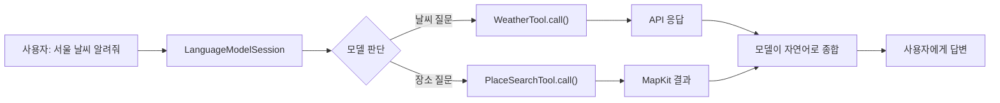
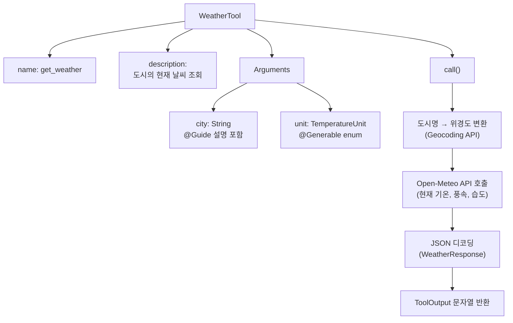
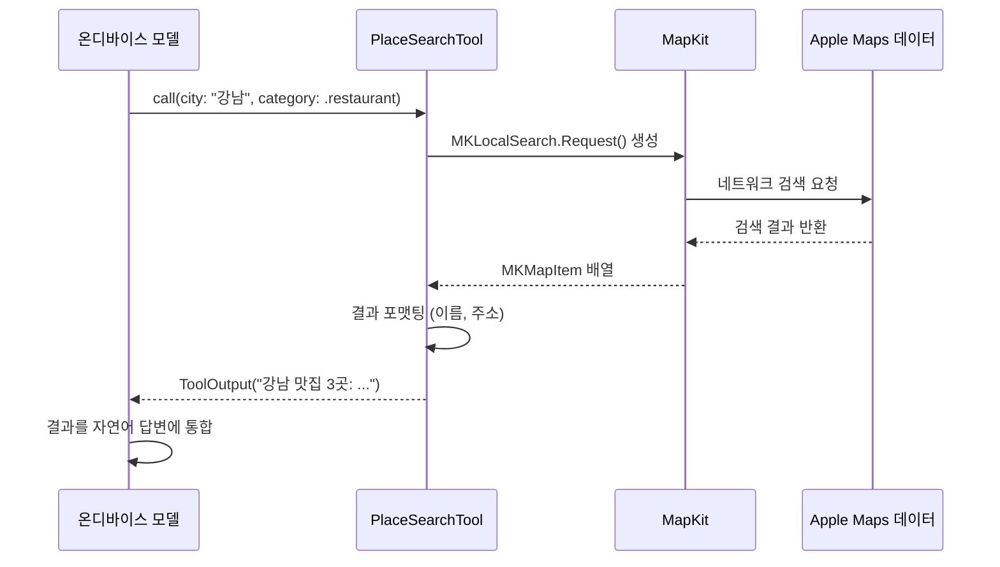
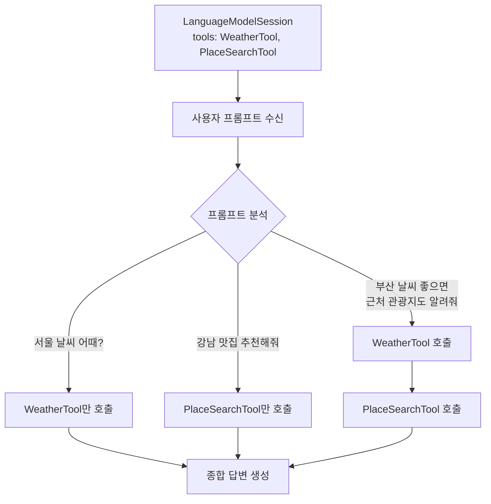
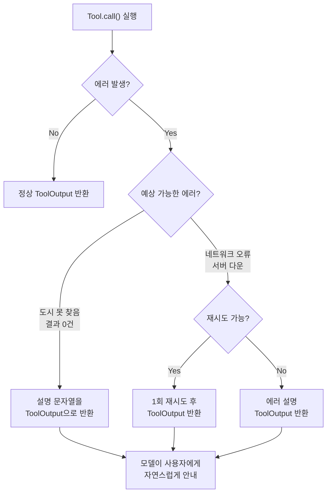

# 05. 실습: 날씨와 검색 Tool 구현

> 현재 날씨 조회 Tool과 장소 검색 Tool을 직접 구현하며 Tool Calling의 전체 흐름을 체험합니다.

## 개요

이번 섹션은 Ch7의 마지막 실습으로, 지금까지 배운 Tool Calling 이론을 **실전 코드**로 완성하는 시간입니다. 두 개의 실용적인 Tool — 날씨 조회와 장소 검색 — 을 처음부터 끝까지 구현하고, 하나의 세션에 등록하여 모델이 자율적으로 선택·호출하는 과정을 확인합니다.

**선수 지식**:
- [Tool Calling 개념과 아키텍처](07-ch7-tool-calling-기초/01-01-tool-calling-개념과-아키텍처.md)에서 배운 6단계 흐름
- [Tool 프로토콜 구현하기](07-ch7-tool-calling-기초/02-02-tool-프로토콜-구현하기.md)에서 다룬 name/description/Arguments/call() 4요소
- [Tool 입출력 스키마 설계](07-ch7-tool-calling-기초/03-03-tool-입출력-스키마-설계.md)에서 배운 @Guide 제약 조건과 에러 처리
- [세션에 Tool 등록과 호출 흐름](07-ch7-tool-calling-기초/04-04-세션에-tool-등록과-호출-흐름.md)에서 배운 등록 패턴과 병렬 호출

**학습 목표**:
- 외부 API를 호출하는 실전 Tool을 구현할 수 있다
- 두 개의 Tool을 하나의 세션에 등록하고 모델의 자율적 선택을 확인한다
- Tool 실행 중 발생하는 에러를 우아하게 처리한다
- SwiftUI와 연동하여 Tool Calling 결과를 실시간으로 표시한다

## 왜 알아야 할까?

"날씨 어때?", "근처 맛집 찾아줘" — 사용자가 AI 비서에게 가장 자주 하는 요청이죠. 하지만 언어 모델 혼자서는 **지금** 서울의 기온이 몇 도인지, 사용자 **근처에** 어떤 식당이 있는지 알 수 없습니다. 모델의 학습 데이터는 과거의 스냅샷이니까요.

이 간극을 메우는 것이 바로 Tool Calling입니다. 날씨 API와 MapKit을 Tool로 감싸면, 모델은 사용자의 질문을 분석하고 **자율적으로 판단하여** 적절한 Tool을 호출합니다. 그 결과를 자연어로 엮어 답변하는 거죠. 이번 실습을 마치면, 여러분의 앱에 실시간 데이터와 연결된 AI 기능을 추가하는 구체적인 패턴을 손에 넣게 됩니다.

> 📊 **그림 1**: 사용자 질문에서 Tool 호출까지의 전체 흐름



## 핵심 개념

### 개념 1: WeatherTool — 날씨 조회 Tool 설계

> 💡 **비유**: 날씨 Tool은 AI 비서의 **기상청 핫라인**과 같습니다. 비서가 직접 날씨를 알 순 없지만, 기상청에 전화 한 통이면 정확한 정보를 받아올 수 있죠. Tool은 그 전화번호이고, Arguments는 "어떤 도시요?"라는 질문 양식입니다.

날씨 Tool의 핵심은 **외부 API 호출**입니다. Apple 생태계에서는 WeatherKit을 사용할 수 있지만, 이번 실습에서는 Open-Meteo API로 먼저 구현해보겠습니다. Open-Meteo는 API 키 없이 사용할 수 있는 오픈소스 기상 API로, **비상업적 용도에서 무료**입니다(상업적 사용 시 별도 라이선스 필요). 실무에서는 이 패턴을 Apple의 WeatherKit이나 다른 상용 API로 쉽게 교체할 수 있습니다.

> ⚠️ **흔한 오해**: "Open-Meteo는 완전 무제한 무료다" — 아닙니다. Open-Meteo의 무료 tier는 **비상업적 용도, 일 10,000건 미만** 호출에 한합니다. 상업적 앱에 탑재한다면 유료 플랜을 고려하거나, Apple의 WeatherKit(하루 500,000건 무료 포함)을 사용하는 것이 더 안정적입니다. API 정책은 언제든 변경될 수 있으니, 프로덕션에서는 반드시 최신 이용 약관을 확인하세요.

> 📊 **그림 2**: WeatherTool의 내부 구조



Tool의 Arguments에는 도시명과 온도 단위를 받도록 설계합니다. `@Generable` enum으로 온도 단위를 제한하면, 모델이 항상 유효한 값만 생성합니다.

```swift
import FoundationModels

// MARK: - 온도 단위를 제한하는 @Generable enum
@Generable
enum TemperatureUnit: String {
    case celsius     // 섭씨
    case fahrenheit  // 화씨
}

struct WeatherTool: Tool {
    // 모델이 이 Tool을 식별하는 이름
    let name = "get_weather"
    
    // 모델이 "언제 이 Tool을 쓸지" 판단하는 설명
    let description = "지정한 도시의 현재 날씨 정보를 조회합니다."
    
    // MARK: - 모델이 생성할 입력 스키마
    @Generable
    struct Arguments {
        @Guide(description: "날씨를 조회할 도시 이름 (예: Seoul, Tokyo, New York)")
        let city: String
        
        @Guide(description: "온도 단위. 기본은 celsius")
        let unit: TemperatureUnit
    }
    
    // MARK: - Tool 실행 로직
    func call(arguments: Arguments) async throws -> ToolOutput {
        // 1단계: 도시명을 위경도로 변환 (Geocoding API)
        let geocodeURL = URL(string:
            "https://geocoding-api.open-meteo.com/v1/search?name=\(arguments.city)&count=1"
        )!
        let (geoData, _) = try await URLSession.shared.data(from: geocodeURL)
        let geoResult = try JSONDecoder().decode(GeoResponse.self, from: geoData)
        
        guard let location = geoResult.results?.first else {
            // 도시를 찾지 못한 경우 — 에러 문자열로 반환
            return ToolOutput("'\(arguments.city)' 도시를 찾을 수 없습니다.")
        }
        
        // 2단계: 현재 날씨 조회
        let unitParam = arguments.unit == .fahrenheit ? "fahrenheit" : "celsius"
        let weatherURL = URL(string:
            "https://api.open-meteo.com/v1/forecast?" +
            "latitude=\(location.latitude)&longitude=\(location.longitude)" +
            "&current=temperature_2m,wind_speed_10m,relative_humidity_2m" +
            "&temperature_unit=\(unitParam)"
        )!
        let (weatherData, _) = try await URLSession.shared.data(from: weatherURL)
        let weather = try JSONDecoder().decode(WeatherResponse.self, from: weatherData)
        
        // 3단계: 결과를 자연어 문자열로 포맷팅
        let unitSymbol = arguments.unit == .celsius ? "°C" : "°F"
        return ToolOutput(
            "\(arguments.city)의 현재 날씨: " +
            "기온 \(weather.current.temperature2m)\(unitSymbol), " +
            "풍속 \(weather.current.windSpeed10m)km/h, " +
            "습도 \(weather.current.relativeHumidity2m)%"
        )
    }
}
```

API 응답을 디코딩하기 위한 모델 구조체도 필요합니다:

```swift
// MARK: - Geocoding API 응답 모델
struct GeoResponse: Decodable {
    let results: [GeoLocation]?
}

struct GeoLocation: Decodable {
    let name: String
    let latitude: Double
    let longitude: Double
}

// MARK: - Weather API 응답 모델
struct WeatherResponse: Decodable {
    let current: CurrentWeather
    
    enum CodingKeys: String, CodingKey {
        case current = "current"
    }
}

struct CurrentWeather: Decodable {
    let temperature2m: Double
    let windSpeed10m: Double
    let relativeHumidity2m: Int
    
    enum CodingKeys: String, CodingKey {
        case temperature2m = "temperature_2m"
        case windSpeed10m = "wind_speed_10m"
        case relativeHumidity2m = "relative_humidity_2m"
    }
}
```

> ⚠️ **흔한 오해**: "Tool의 `call()` 메서드에서 에러를 throw하면 모델이 알아서 재시도해준다" — 아닙니다! `call()`에서 throw된 에러는 세션 전체의 에러로 전파됩니다. 도시를 못 찾는 것처럼 **예상 가능한 실패**는 에러 설명 문자열을 `ToolOutput`으로 반환하여 모델이 사용자에게 자연스럽게 안내하게 하세요.

### 개념 2: PlaceSearchTool — 장소 검색 Tool 설계

> 💡 **비유**: 장소 검색 Tool은 AI 비서의 **전화번호부**입니다. "강남역 근처 카페"를 검색하면 번호부(MapKit)에서 결과를 뽑아주는 거죠. 비서는 번호부가 없으면 추측할 수밖에 없지만, 번호부가 있으면 정확한 정보를 줄 수 있습니다.

MapKit의 `MKLocalSearch`를 활용하면 Apple Maps 데이터를 바로 검색할 수 있습니다. WWDC25 Code-Along에서도 이 패턴을 사용하여 여행 일정 플래너를 만들었죠.

> 📊 **그림 3**: PlaceSearchTool의 MapKit 연동 흐름



```swift
import FoundationModels
import MapKit

// MARK: - 검색 카테고리 enum
@Generable
enum PlaceCategory: String {
    case restaurant  // 음식점
    case cafe        // 카페
    case hotel       // 호텔
    case museum      // 박물관
    case park        // 공원
}

struct PlaceSearchTool: Tool {
    let name = "search_places"
    let description = "지정한 지역에서 카테고리별 장소를 검색합니다."
    
    @Generable
    struct Arguments {
        @Guide(description: "검색할 지역 또는 랜드마크 이름 (예: 강남역, 도쿄타워)")
        let location: String
        
        @Guide(description: "검색할 장소 카테고리")
        let category: PlaceCategory
        
        @Guide(description: "반환할 최대 결과 수", .range(1...5))
        let maxResults: Int
    }
    
    func call(arguments: Arguments) async throws -> ToolOutput {
        // MKLocalSearch로 장소 검색
        let request = MKLocalSearch.Request()
        request.naturalLanguageQuery = "\(arguments.location) \(arguments.category.rawValue)"
        
        let search = MKLocalSearch(request: request)
        
        do {
            let response = try await search.start()
            let places = response.mapItems.prefix(arguments.maxResults)
            
            guard !places.isEmpty else {
                return ToolOutput(
                    "\(arguments.location) 근처에서 \(arguments.category.rawValue)을(를) 찾지 못했습니다."
                )
            }
            
            // 결과를 읽기 쉬운 문자열로 포맷팅
            let formatted = places.enumerated().map { index, item in
                let name = item.name ?? "이름 없음"
                let address = item.placemark.title ?? "주소 정보 없음"
                return "\(index + 1). \(name) — \(address)"
            }.joined(separator: "\n")
            
            return ToolOutput(
                "\(arguments.location) 근처 \(arguments.category.rawValue) \(places.count)곳:\n\(formatted)"
            )
        } catch {
            return ToolOutput(
                "장소 검색 중 오류가 발생했습니다: \(error.localizedDescription)"
            )
        }
    }
}
```

검색이 실패할 수 있는 상황(네트워크 오류, 결과 없음)을 `do-catch`로 감싸되, **에러를 throw하지 않고** 설명 문자열을 반환하는 점에 주목하세요. 이전 세션에서 배운 에러 처리 패턴 그대로입니다.

### 개념 3: 두 Tool의 세션 등록과 자율적 호출

> 💡 **비유**: 두 개의 Tool을 세션에 등록하는 것은 비서의 책상에 **두 종류의 전화기**를 놓아두는 것과 같습니다. 기상청 전화기(WeatherTool)와 114 전화번호 안내(PlaceSearchTool). 비서는 질문의 종류를 듣고 알아서 적절한 전화기를 집어 듭니다. "제주도 날씨 좋으면 맛집도 추천해줘"라고 하면? 두 전화기를 **모두** 사용합니다.

> 📊 **그림 4**: 복수 Tool 등록과 모델의 자율적 선택



```swift
import FoundationModels

// MARK: - 두 Tool을 결합한 AI 어시스턴트
@Observable
@MainActor
class TravelAssistant {
    var response: String = ""
    var isLoading: Bool = false
    var error: Error?
    
    private var session: LanguageModelSession
    
    init() {
        // 두 개의 Tool을 세션에 등록
        let weatherTool = WeatherTool()
        let placeTool = PlaceSearchTool()
        
        self.session = LanguageModelSession(
            tools: [weatherTool, placeTool],
            instructions: """
            당신은 여행 도우미 AI입니다.
            사용자가 날씨를 물으면 get_weather 도구를 사용하세요.
            장소를 검색하면 search_places 도구를 사용하세요.
            두 가지 정보가 모두 필요하면 두 도구를 모두 사용하세요.
            항상 한국어로 친절하게 답변하세요.
            """
        )
    }
    
    func ask(_ question: String) async {
        isLoading = true
        error = nil
        
        do {
            // 모델이 프롬프트를 분석하고 필요한 Tool을 자율적으로 호출
            let result = try await session.respond(to: question)
            self.response = result.content
        } catch {
            self.error = error
            self.response = "오류가 발생했습니다: \(error.localizedDescription)"
        }
        
        isLoading = false
    }
}
```

`instructions` 파라미터가 핵심입니다. [프롬프트 엔지니어링 실전](04-ch4-프롬프트-엔지니어링-실전/02-02-시스템-프롬프트instructions-설계.md)에서 배운 것처럼, 명확한 지시문이 모델의 Tool 선택 정확도를 크게 높입니다. "날씨를 물으면 get_weather를 사용하세요"처럼 **도구 이름을 직접 언급**하는 것이 WWDC25 Code-Along에서도 권장하는 패턴입니다.

### 개념 4: 에러 처리 전략 — 방어적 Tool 설계

> 💡 **비유**: 외부 API 호출은 마치 **택배 배달**과 같습니다. 대부분은 잘 도착하지만, 가끔 주소 오류(잘못된 도시명), 배송 지연(네트워크 타임아웃), 수량 부족(결과 없음) 같은 문제가 생기죠. 좋은 Tool은 이런 상황에서 "배달 실패"로 끝내지 않고, "해당 주소를 찾을 수 없습니다. 다른 주소를 시도해보세요"라는 안내문을 돌려보내는 것입니다.

> 📊 **그림 5**: Tool 에러 처리 의사결정 트리



실전 코드에서는 세 가지 레벨의 에러 처리를 적용합니다:

```swift
// MARK: - 방어적 에러 처리가 적용된 WeatherTool.call()
func call(arguments: Arguments) async throws -> ToolOutput {
    // 레벨 1: 입력 검증
    let trimmedCity = arguments.city.trimmingCharacters(in: .whitespaces)
    guard !trimmedCity.isEmpty else {
        return ToolOutput("도시 이름이 비어있습니다. 도시 이름을 알려주세요.")
    }
    
    // 레벨 2: 네트워크 요청 보호
    do {
        let geocodeURL = URL(string:
            "https://geocoding-api.open-meteo.com/v1/search?name=\(trimmedCity)&count=1"
        )!
        let (geoData, _) = try await URLSession.shared.data(from: geocodeURL)
        let geoResult = try JSONDecoder().decode(GeoResponse.self, from: geoData)
        
        // 레벨 3: 응답 검증
        guard let location = geoResult.results?.first else {
            return ToolOutput("'\(trimmedCity)' 도시를 찾을 수 없습니다. 영문 도시명을 사용해 보세요.")
        }
        
        let unitParam = arguments.unit == .fahrenheit ? "fahrenheit" : "celsius"
        let weatherURL = URL(string:
            "https://api.open-meteo.com/v1/forecast?" +
            "latitude=\(location.latitude)&longitude=\(location.longitude)" +
            "&current=temperature_2m,wind_speed_10m,relative_humidity_2m" +
            "&temperature_unit=\(unitParam)"
        )!
        let (weatherData, _) = try await URLSession.shared.data(from: weatherURL)
        let weather = try JSONDecoder().decode(WeatherResponse.self, from: weatherData)
        
        let unitSymbol = arguments.unit == .celsius ? "°C" : "°F"
        return ToolOutput(
            "\(trimmedCity)의 현재 날씨: " +
            "기온 \(weather.current.temperature2m)\(unitSymbol), " +
            "풍속 \(weather.current.windSpeed10m)km/h, " +
            "습도 \(weather.current.relativeHumidity2m)%"
        )
    } catch is URLError {
        // 네트워크 오류 — throw 대신 문자열 반환
        return ToolOutput("네트워크 연결에 문제가 있어 날씨 정보를 가져올 수 없습니다.")
    } catch is DecodingError {
        return ToolOutput("날씨 데이터를 처리하는 중 오류가 발생했습니다.")
    }
}
```

핵심 원칙은 간단합니다: **예상 가능한 에러는 `ToolOutput` 문자열로, 정말 복구 불가능한 시스템 에러만 `throw`로**. 이렇게 하면 모델이 에러 메시지를 읽고 사용자에게 "서울의 영문명 'Seoul'로 다시 시도해 볼까요?"처럼 자연스럽게 안내할 수 있습니다.

## 실습: 직접 해보기

전체 코드를 조합하여 SwiftUI 앱에서 동작하는 여행 어시스턴트를 만들어 봅시다.

### Step 1: 프로젝트 구조

```
TravelAssistant/
├── Models/
│   ├── WeatherModels.swift     // GeoResponse, WeatherResponse
│   └── PlaceModels.swift       // PlaceCategory
├── Tools/
│   ├── WeatherTool.swift       // WeatherTool
│   └── PlaceSearchTool.swift   // PlaceSearchTool
├── ViewModels/
│   └── TravelAssistant.swift   // TravelAssistant ViewModel
└── Views/
    └── TravelView.swift        // SwiftUI 화면
```

### Step 2: SwiftUI 뷰 구현

```swift
import SwiftUI

struct TravelView: View {
    @State private var assistant = TravelAssistant()
    @State private var userInput: String = ""
    
    // 빠르게 테스트할 수 있는 예시 질문들
    let sampleQuestions = [
        "서울 날씨 어때?",
        "강남역 근처 맛집 3곳 추천해줘",
        "도쿄 날씨가 좋으면 근처 공원도 알려줘"
    ]
    
    var body: some View {
        NavigationStack {
            VStack(spacing: 16) {
                // 예시 질문 버튼
                ScrollView(.horizontal, showsIndicators: false) {
                    HStack {
                        ForEach(sampleQuestions, id: \.self) { question in
                            Button(question) {
                                userInput = question
                                Task { await assistant.ask(question) }
                            }
                            .buttonStyle(.bordered)
                            .tint(.blue)
                        }
                    }
                    .padding(.horizontal)
                }
                
                // 응답 표시 영역
                ScrollView {
                    if assistant.isLoading {
                        ProgressView("AI가 답변을 준비하고 있습니다...")
                            .padding()
                    } else if !assistant.response.isEmpty {
                        Text(assistant.response)
                            .padding()
                            .frame(maxWidth: .infinity, alignment: .leading)
                            .background(.gray.opacity(0.1))
                            .clipShape(RoundedRectangle(cornerRadius: 12))
                            .padding(.horizontal)
                    }
                }
                
                // 입력 필드
                HStack {
                    TextField("질문을 입력하세요", text: $userInput)
                        .textFieldStyle(.roundedBorder)
                    
                    Button("전송") {
                        guard !userInput.isEmpty else { return }
                        let question = userInput
                        userInput = ""
                        Task { await assistant.ask(question) }
                    }
                    .buttonStyle(.borderedProminent)
                    .disabled(userInput.isEmpty || assistant.isLoading)
                }
                .padding(.horizontal)
            }
            .navigationTitle("여행 도우미")
        }
    }
}
```

### Step 3: 스트리밍으로 업그레이드

기본 `respond(to:)` 대신 `streamResponse(to:)`를 사용하면 답변이 실시간으로 나타납니다:

```swift
// TravelAssistant의 ask() 메서드를 스트리밍 버전으로 교체
func ask(_ question: String) async {
    isLoading = true
    response = ""
    error = nil
    
    do {
        // streamResponse로 실시간 답변 수신
        let stream = session.streamResponse(to: question)
        
        for try await partialResponse in stream {
            // Tool 호출 중에는 빈 텍스트가 올 수 있음
            if let text = partialResponse.content {
                self.response = text
            }
        }
    } catch {
        self.error = error
        self.response = "오류가 발생했습니다: \(error.localizedDescription)"
    }
    
    isLoading = false
}
```

[스트리밍 응답과 실시간 UI](06-ch6-스트리밍-응답과-실시간-ui/01-01-streamresponse-api-기초.md)에서 배운 `for try await` 패턴이 여기서도 동일하게 적용됩니다. Tool 호출이 진행되는 동안에는 부분 응답이 비어 있을 수 있으니, `if let`으로 안전하게 처리하는 것이 중요합니다.

### Step 4: 실행 결과 확인

```run:swift
// 시뮬레이션: TravelAssistant 동작 흐름
print("=== 여행 도우미 AI ===")
print()
print("[사용자] 서울 날씨 어때?")
print("[모델 판단] → get_weather Tool 호출 결정")
print("[WeatherTool] call(city: \"Seoul\", unit: .celsius)")
print("[API 응답] Seoul의 현재 날씨: 기온 22.3°C, 풍속 12.5km/h, 습도 65%")
print("[AI 답변] 서울은 현재 22.3°C로 쾌적한 날씨예요! 풍속은 12.5km/h로 가벼운 바람이 불고 있고, 습도는 65%입니다.")
print()
print("[사용자] 근처 맛집도 추천해줘")
print("[모델 판단] → search_places Tool 호출 결정")
print("[PlaceSearchTool] call(location: \"서울\", category: .restaurant, maxResults: 3)")
print("[AI 답변] 서울 맛집을 찾아봤어요:")
print("  1. 광장시장 — 종로구 창경궁로 88")
print("  2. 을지로 골뱅이 골목 — 중구 을지로 3가")
print("  3. 익선동 한옥 카페거리 — 종로구 익선동")
```

```output
=== 여행 도우미 AI ===

[사용자] 서울 날씨 어때?
[모델 판단] → get_weather Tool 호출 결정
[WeatherTool] call(city: "Seoul", unit: .celsius)
[API 응답] Seoul의 현재 날씨: 기온 22.3°C, 풍속 12.5km/h, 습도 65%
[AI 답변] 서울은 현재 22.3°C로 쾌적한 날씨예요! 풍속은 12.5km/h로 가벼운 바람이 불고 있고, 습도는 65%입니다.

[사용자] 근처 맛집도 추천해줘
[모델 판단] → search_places Tool 호출 결정
[PlaceSearchTool] call(location: "서울", category: .restaurant, maxResults: 3)
[AI 답변] 서울 맛집을 찾아봤어요:
  1. 광장시장 — 종로구 창경궁로 88
  2. 을지로 골뱅이 골목 — 중구 을지로 3가
  3. 익선동 한옥 카페거리 — 종로구 익선동
```

### Step 5: 멀티턴 대화 테스트

`LanguageModelSession`은 대화 맥락을 유지하므로, 이전 질문을 기억합니다:

```run:swift
// 멀티턴 대화에서 Tool이 자동으로 활용되는 흐름
print("[1턴] 사용자: 제주도 날씨 알려줘")
print("  → WeatherTool 호출 → \"제주도는 현재 18°C, 바람이 좀 부네요\"")
print()
print("[2턴] 사용자: 거기 가볼 만한 공원 있어?")
print("  → 모델이 '거기' = 제주도 맥락 유지")
print("  → PlaceSearchTool(location: \"제주도\", category: .park) 호출")
print("  → \"제주도 공원 추천: 한라산 국립공원, 성산일출봉...\"")
print()
print("[3턴] 사용자: 내일은 더 추워질까?")
print("  → WeatherTool은 '현재' 날씨만 제공하므로")
print("  → ToolOutput: \"현재 날씨만 조회 가능합니다\"")
print("  → 모델: \"죄송합니다, 현재 날씨만 확인할 수 있어요. 지금은 18°C입니다.\"")
```

```output
[1턴] 사용자: 제주도 날씨 알려줘
  → WeatherTool 호출 → "제주도는 현재 18°C, 바람이 좀 부네요"

[2턴] 사용자: 거기 가볼 만한 공원 있어?
  → 모델이 '거기' = 제주도 맥락 유지
  → PlaceSearchTool(location: "제주도", category: .park) 호출
  → "제주도 공원 추천: 한라산 국립공원, 성산일출봉..."

[3턴] 사용자: 내일은 더 추워질까?
  → WeatherTool은 '현재' 날씨만 제공하므로
  → ToolOutput: "현재 날씨만 조회 가능합니다"
  → 모델: "죄송합니다, 현재 날씨만 확인할 수 있어요. 지금은 18°C입니다."
```

3턴에서 일어나는 일이 중요합니다. WeatherTool이 예보 기능을 지원하지 않는다는 것을 ToolOutput 문자열로 알려주면, 모델이 이를 읽고 사용자에게 자연스럽게 한계를 설명합니다. **Tool의 한계를 솔직하게 반환하는 것**이 좋은 사용자 경험의 비결입니다.

## 더 깊이 알아보기

### Tool Calling의 기원 — 플러그인에서 프로토콜로

Tool Calling 개념은 2023년 OpenAI의 ChatGPT 플러그인 시스템에서 대중화되었습니다. 당시에는 JSON Schema로 함수를 정의하고, 모델이 JSON 문자열로 인자를 생성하는 방식이었는데, JSON 파싱 에러가 빈번했습니다. "함수명은 맞는데 괄호가 빠졌어요" 같은 일이 허다했죠.

Apple은 이 문제를 **근본적으로 다른 각도**에서 풀었습니다. Foundation Models의 Tool Calling은 Guided Generation(@Generable) 위에 구축되어, 모델이 생성하는 도구 이름과 인자가 **컴파일 타임에 정의된 스키마를 항상 만족**합니다. JSON 파싱 에러? 그런 건 존재하지 않습니다. Swift의 타입 시스템이 런타임 전에 보장해주니까요.

WWDC25에서 Apple이 Tool Calling 데모로 보여준 것도 의미심장합니다 — 여행 일정 플래너에서 MapKit의 `MKLocalSearch`를 Tool로 감싸는 예제였거든요. 이건 우연이 아닙니다. Apple 생태계에는 이미 WeatherKit, MapKit, Contacts, EventKit 같은 **풍부한 1st-party 프레임워크**가 있고, Tool Calling은 이들을 AI에 연결하는 **접착제** 역할을 하도록 설계된 것입니다.

### Open-Meteo의 탄생

이번 실습에서 사용한 Open-Meteo API도 흥미로운 역사를 가지고 있습니다. 스위스의 기상학자 Patrick Zippenfenig가 2022년에 시작한 오픈소스 프로젝트로, 전 세계 기상 데이터를 통합 API로 제공합니다. 왜 이런 프로젝트가 가능했을까요? 기상 데이터는 각국 기상청이 공개하는 공공 데이터인데, 이를 통합하여 사용하기 쉬운 API로 만드는 것이 프로젝트의 목표였기 때문입니다. 비상업적 용도에서 키 없이 사용할 수 있어, Tool Calling 학습이나 프로토타이핑에 매우 유용합니다. 다만 프로덕션 앱에서는 Apple의 WeatherKit이 더 적합합니다 — 유료 개발자 계정에 하루 500,000건의 무료 호출이 포함되어 있고, Apple 생태계와의 통합이 자연스럽기 때문이죠.

## 흔한 오해와 팁

> ⚠️ **흔한 오해**: "Tool의 description을 길고 자세하게 쓸수록 모델이 잘 이해한다" — 사실은 그 반대입니다! WWDC25 Deep Dive 세션에서 명확히 설명했듯이, name과 description은 **프롬프트에 그대로 삽입**되어 토큰을 소비합니다. 온디바이스 ~3B 모델은 컨텍스트 윈도우가 제한적이므로, 1문장으로 핵심만 전달하는 것이 오히려 정확도와 속도 모두에 유리합니다.

> 💡 **알고 계셨나요?**: Foundation Models의 Tool Calling은 자동으로 **병렬 호출**을 지원합니다. "서울과 도쿄의 날씨를 비교해줘"라고 물으면, 모델은 WeatherTool을 두 번 호출하는데, 프레임워크가 이를 자동으로 병렬 실행합니다. [세션에 Tool 등록과 호출 흐름](07-ch7-tool-calling-기초/04-04-세션에-tool-등록과-호출-흐름.md)에서 배운 것처럼, `call()` 메서드가 동시에 실행될 수 있으므로 공유 상태 접근에 주의해야 합니다.

> 🔥 **실무 팁**: Tool 개발 초기에는 `call()` 메서드 안에서 **하드코딩된 목 데이터**를 반환하며 프로토타이핑하세요. 모델의 Tool 선택 로직과 답변 품질을 먼저 확인한 후, 실제 API를 연결하는 것이 훨씬 효율적입니다. Apple의 Code-Along 예제에서도 `getSuggestions()` 함수가 목 데이터를 반환하는 것으로 시작합니다.

> 🔥 **실무 팁**: URL에 한국어가 포함될 때 percent encoding을 빠뜨리면 API 호출이 실패합니다. `arguments.city.addingPercentEncoding(withAllowedCharacters: .urlQueryAllowed)`을 잊지 마세요. 영문 도시명만 사용한다면 괜찮지만, 프로덕션에서는 반드시 인코딩 처리가 필요합니다.

## 핵심 정리

| 개념 | 설명 |
|------|------|
| WeatherTool | 외부 REST API(Open-Meteo)를 호출하여 실시간 날씨 데이터를 가져오는 Tool |
| PlaceSearchTool | MapKit의 MKLocalSearch를 래핑하여 장소를 검색하는 Tool |
| 복수 Tool 등록 | `LanguageModelSession(tools: [tool1, tool2])` — 모델이 자율적으로 선택 |
| 방어적 에러 처리 | 예상 가능한 에러는 ToolOutput 문자열로 반환, 시스템 에러만 throw |
| instructions 설계 | Tool 이름을 명시적으로 언급하여 모델의 선택 정확도를 높이는 패턴 |
| 스트리밍 + Tool | `streamResponse(to:)`로 Tool Calling 결과를 실시간 수신 |
| 멀티턴 맥락 유지 | 세션이 이전 대화와 Tool 호출 결과를 기억하여 후속 질문에 활용 |
| Open-Meteo 이용 조건 | 비상업적 용도 무료, 상업적 사용 시 유료 플랜 필요. 프로덕션은 WeatherKit 권장 |

## 다음 섹션 미리보기

Ch7에서 Tool Calling의 기초를 탄탄히 다졌습니다. 다음 챕터 [복수 Tool 등록과 선택 전략](08-ch8-tool-calling-심화/01-01-복수-tool-등록과-선택-전략.md)에서는 5개 이상의 Tool을 등록했을 때 모델의 선택 전략을 최적화하는 방법, [Tool과 구조화 출력 결합](08-ch8-tool-calling-심화/03-03-tool과-구조화-출력-결합.md)에서는 `respond(to:generating:)` API로 Tool 호출 결과를 @Generable 구조체로 구조화하는 고급 패턴을 배웁니다. 이번 실습에서 만든 WeatherTool과 PlaceSearchTool을 확장하여 **멀티 Tool 여행 플래너**를 완성하게 될 거예요.

## 참고 자료

- [Code-along: Bring on-device AI to your app — WWDC25](https://developer.apple.com/videos/play/wwdc2025/259/) - MapKit Tool과 여행 일정 플래너를 처음부터 구현하는 공식 Code-Along
- [Deep dive into the Foundation Models framework — WWDC25](https://developer.apple.com/videos/play/wwdc2025/301/) - Tool 프로토콜의 상세 구조, 병렬 호출, 상태 유지 Tool 패턴
- [Foundation Models — Apple Developer Documentation](https://developer.apple.com/documentation/FoundationModels) - Tool 프로토콜, ToolOutput, LanguageModelSession 공식 API 레퍼런스
- [The Ultimate Guide To The Foundation Models Framework — AzamSharp](https://azamsharp.com/2025/06/18/the-ultimate-guide-to-the-foundation-models-framework.html) - RecipeTool 예제와 외부 HTTP API 연동 패턴
- [Foundation-Models-Framework-Example — GitHub](https://github.com/rudrankriyam/Foundation-Models-Framework-Example) - WeatherTool, SearchTool 등 다양한 Tool 구현 예제 코드
- [Open-Meteo API Documentation](https://open-meteo.com/en/docs) - 오픈소스 날씨 API 공식 문서 (비상업적 무료, Geocoding API 포함)

---
### 🔗 Related Sessions
- [@generable](05-ch5-generable-구조화-출력/01-01-guided-generation-개념과-동작-원리.md) (prerequisite)
- [tool calling](07-ch7-tool-calling-기초/01-01-tool-calling-개념과-아키텍처.md) (prerequisite)
