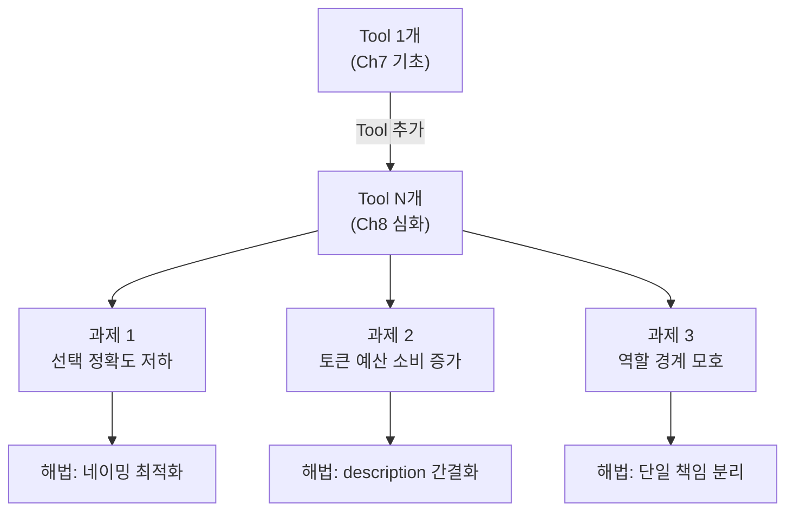
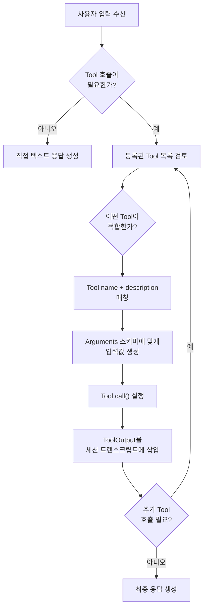
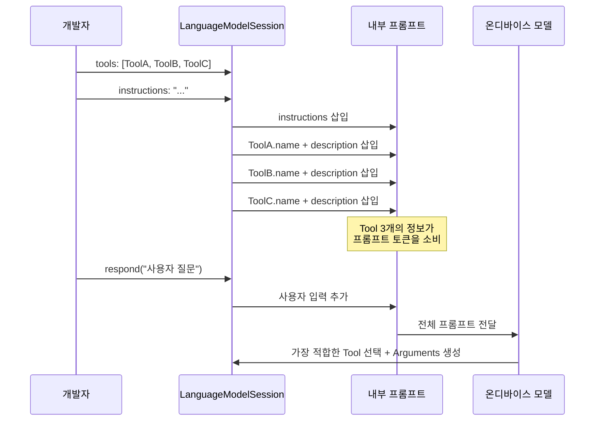
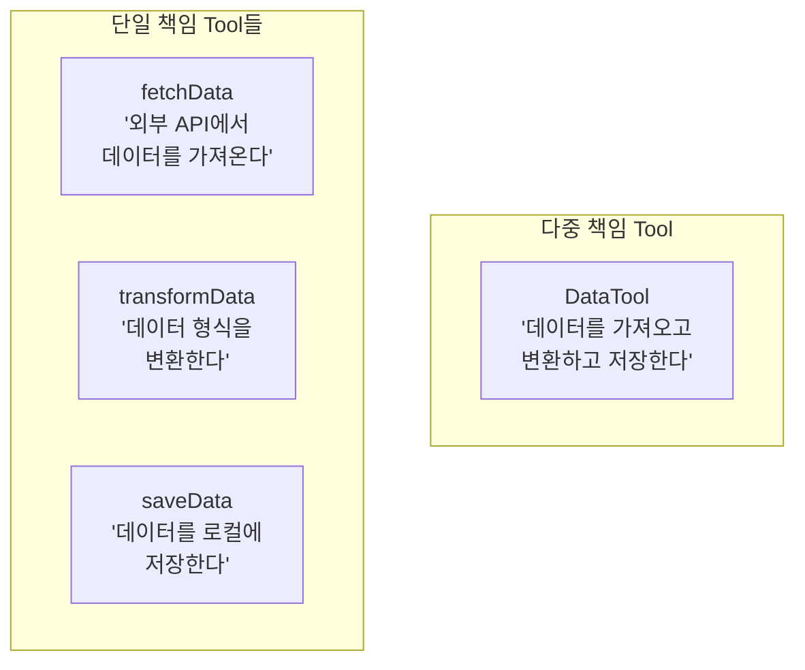
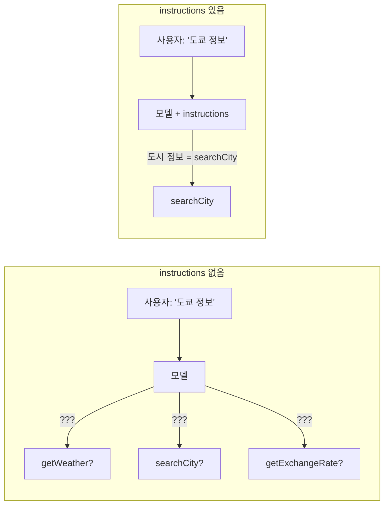
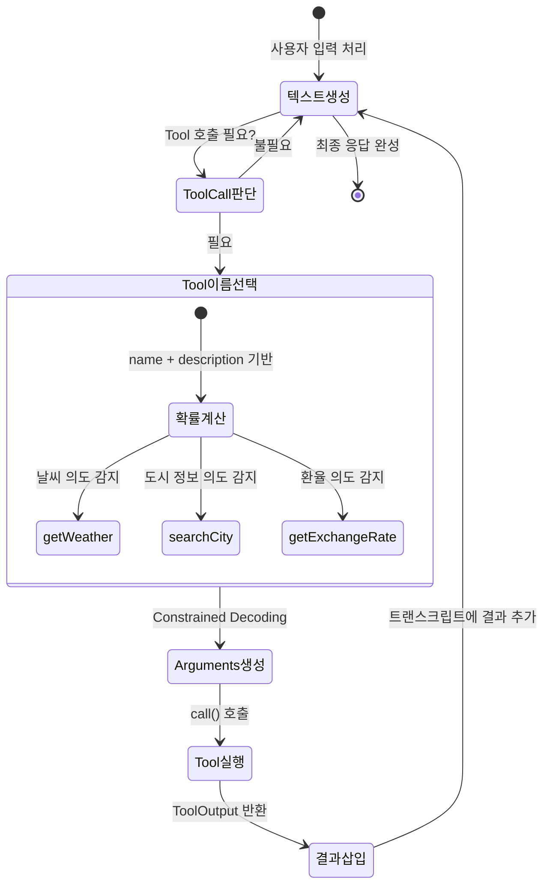

# 복수 Tool 등록과 선택 전략

> 여러 Tool을 동시에 등록하고, 모델이 상황에 맞는 Tool을 스스로 선택하도록 설계하는 전략을 배웁니다.

## 개요

이 섹션에서는 Foundation Models 프레임워크에서 **복수의 Tool을 하나의 세션에 등록**하고, 온디바이스 모델이 사용자의 요청에 따라 **적절한 Tool을 자동으로 선택**하도록 유도하는 기법을 다룹니다. [세션에 Tool 등록과 호출 흐름](07-ch7-tool-calling-기초/04-04-세션에-tool-등록과-호출-흐름.md)에서 단일 Tool의 등록·호출 기초를 배웠다면, 이제는 여러 Tool이 공존하는 **실전 환경에서의 확장 전략**에 집중합니다.

**선수 지식**: [Tool Calling 개념과 아키텍처](07-ch7-tool-calling-기초/01-01-tool-calling-개념과-아키텍처.md)의 Tool 프로토콜 기본 구조, [세션에 Tool 등록과 호출 흐름](07-ch7-tool-calling-기초/04-04-세션에-tool-등록과-호출-흐름.md)의 단일 Tool 등록·호출 패턴

**학습 목표**:
- Tool이 1개에서 N개로 늘어날 때 발생하는 설계 과제를 이해한다
- 모델이 복수 Tool 중 하나를 선택하는 메커니즘과 이를 좌우하는 요소를 파악한다
- Tool의 `name`과 `description`을 최적화하여 선택 정확도를 높인다
- Tool 간 역할 분리와 네이밍 전략을 실전에 적용한다

## 왜 알아야 할까?

현실의 AI 앱에서 단일 Tool만 쓰는 경우는 거의 없습니다. 날씨 앱 하나만 해도 "현재 날씨 조회", "주간 예보 조회", "위치 검색"이라는 서로 다른 기능이 필요하죠. 사용자가 "이번 주 서울 날씨 어때?"라고 물으면, 모델은 먼저 위치 검색 Tool로 서울의 좌표를 찾고, 그다음 주간 예보 Tool을 호출해야 합니다.

문제는 Tool이 많아질수록 모델이 **엉뚱한 Tool을 호출**하거나, **필요한 Tool을 건너뛰는** 실수가 늘어난다는 겁니다. 온디바이스 ~3B 모델은 서버 모델보다 컨텍스트 윈도우가 제한적이기 때문에, Tool의 이름과 설명이 **프롬프트 토큰을 직접 소비**합니다. 잘못 설계하면 성능 저하와 정확도 하락을 동시에 겪게 되죠.

이 섹션에서 배우는 **복수 Tool 설계 전략**은 모든 실전 AI 앱의 기반입니다. Ch10의 [AI 채팅봇 앱](10-ch10-실전-프로젝트-ai-채팅봇-앱/05-05-tool-통합과-확장.md)과 Ch17의 [하이브리드 앱](17-ch17-foundation-models-core-ml-하이브리드/01-01-하이브리드-아키텍처-설계-전략.md)에서 이 패턴을 반복적으로 활용하게 됩니다.

## 핵심 개념

### 개념 1: 단일 Tool에서 복수 Tool로 — 무엇이 달라지는가

> 💡 **비유**: 단일 Tool은 **전화기 한 대**만 있는 사무실이고, 복수 Tool은 **교환기가 연결된 여러 내선 전화**가 있는 사무실입니다. 전화가 한 대일 때는 그냥 받으면 되지만, 여러 대가 있으면 "이 통화를 어느 내선으로 연결해야 하지?"라는 **라우팅 문제**가 생깁니다.

[Ch7.4](07-ch7-tool-calling-기초/04-04-세션에-tool-등록과-호출-흐름.md)에서 배운 것처럼 `LanguageModelSession(tools:)` 파라미터는 `[any Tool]` 배열을 받습니다. 문법적으로는 배열 원소만 늘리면 되지만, Tool이 N개로 확장되면 **세 가지 새로운 설계 과제**가 등장합니다:

> 📊 **그림 1**: Tool 수 증가에 따른 설계 과제



| 과제 | 원인 | 영향 |
|------|------|------|
| 선택 정확도 저하 | 유사한 Tool이 많으면 모델이 혼동 | 잘못된 Tool 호출, 불필요한 재시도 |
| 토큰 예산 소비 | 모든 Tool의 name+description이 프롬프트에 삽입 | 대화 컨텍스트 축소, 레이턴시 증가 |
| 역할 경계 모호 | "이 Tool이 해야 할 일"의 범위가 불명확 | 하나의 Tool이 비대해지거나, 여러 Tool이 겹침 |

이 세 과제를 해결하는 것이 바로 이 섹션의 핵심입니다. 하나씩 파고들어 봅시다.

### 개념 2: 모델의 Tool 선택 메커니즘

> 💡 **비유**: 모델의 Tool 선택은 **114 안내 서비스**와 비슷합니다. "꽃배달 해주세요"라고 전화하면, 상담원이 "꽃배달"이라는 키워드를 보고 수십 개의 카테고리 중 정확한 업체를 연결해 줍니다. 모델도 사용자 입력의 **의도(intent)**를 분석해서, 등록된 Tool들의 이름과 설명을 비교하여 가장 적합한 Tool을 선택합니다.

Foundation Models의 Tool 선택은 **Guided Generation** 위에 구축되어 있습니다. 모델이 Tool 호출 여부를 결정하는 과정을 단계별로 살펴보면:

> 📊 **그림 2**: 모델의 Tool 선택 의사 결정 흐름



모델이 Tool을 선택할 때 고려하는 세 가지 핵심 요소가 있습니다:

1. **Tool의 `name`**: 프롬프트에 그대로 삽입되어 모델이 참조하는 식별자
2. **Tool의 `description`**: 모델이 "이 Tool이 무엇을 하는가"를 판단하는 근거
3. **세션 `instructions`**: 개발자가 제공한 맥락과 지침

중요한 사실은 모델이 **자율적으로** Tool 호출 여부와 횟수를 결정한다는 점입니다. Apple 공식 문서에 따르면:

> "The model autonomously decides *when and how often* to call tools."

즉, 하나의 요청에 대해 Tool을 **0번 호출**할 수도 있고(직접 답변이 가능한 경우), **여러 번 호출**할 수도 있습니다. 이 자율성이 복수 Tool 환경에서 핵심적인 특성이 됩니다.

### 개념 3: Tool 네이밍과 Description 최적화

> 💡 **비유**: Tool의 이름과 설명은 **식당 메뉴판**과 같습니다. "오늘의 특선 — 제철 재료로 만든 한식 코스"라고 적혀 있으면 무엇을 기대할 수 있는지 바로 알 수 있죠. 반면 "A세트"라고만 적혀 있으면 무엇인지 알 수 없어서 주문을 망설이게 됩니다. 모델도 마찬가지로, 명확한 이름과 간결한 설명이 있어야 올바른 Tool을 선택할 수 있습니다.

단일 Tool일 때는 네이밍이 큰 문제가 아닙니다 — 선택지가 하나뿐이니까요. 하지만 복수 Tool 환경에서는 **서로 구분되는 이름**이 선택 정확도를 직접 좌우합니다. WWDC25에서 Apple이 제시한 **Tool 네이밍 가이드라인**을 복수 Tool 관점에서 정리하면:

| 원칙 | 좋은 예 | 나쁜 예 | 복수 Tool에서 중요한 이유 |
|------|---------|---------|--------------------------|
| 동사로 시작 | `findContact`, `getWeather` | `contactData`, `weatherInfo` | 행위 동사가 Tool 간 **역할 차이**를 드러냄 |
| 구체적 동사 사용 | `searchRecipes`, `translateText` | `processData`, `handleRequest` | 범용 동사는 여러 Tool이 겹쳐 보임 |
| 축약 금지 | `getWeather` | `getWthr` | 모델이 영어 텍스트로 읽으므로 축약하면 의미 손실 |
| 짧게 유지 | `searchRecipes` | `searchAndFilterRecipesByIngredients` | 토큰 절약 — Tool마다 name이 프롬프트에 삽입 |

> 📊 **그림 3**: Tool 이름과 설명이 프롬프트에 삽입되는 구조



**description 작성에서 단일 vs 복수 Tool의 차이**도 중요합니다:

```swift
// 단일 Tool일 때는 이 정도면 충분
struct WeatherTool: Tool {
    let name = "getWeather"
    let description = "Gets weather information."
    // ...
}

// ✅ 복수 Tool일 때: "다른 Tool과 어떻게 다른가"가 description에 드러나야 함
struct GetCurrentWeatherTool: Tool {
    let name = "getCurrentWeather"
    let description = "Gets current weather conditions for a city."
    // 다른 Tool: getWeeklyForecast → "7-day forecast"
    // description만 봐도 둘의 차이가 명확
}

struct GetWeeklyForecastTool: Tool {
    let name = "getWeeklyForecast"
    let description = "Gets a 7-day weather forecast for a city."
}

// ❌ 나쁜 예: 두 Tool의 description이 구분되지 않음
struct WeatherTool1: Tool {
    let name = "weatherInfo"
    let description = "Gets weather data for a location."
}
struct WeatherTool2: Tool {
    let name = "forecastInfo"
    let description = "Gets weather data for a location."
    // 같은 description → 모델이 구분 불가
}
```

왜 description을 짧게 유지해야 할까요? Apple은 WWDC25에서 명확하게 설명합니다:

> "These strings are put verbatim in your prompt. So longer strings means more tokens, which can increase the latency."

단일 Tool이면 description이 좀 길어도 괜찮지만, Tool이 5개가 되면 **description 5개분의 토큰이 매 요청마다 소비**됩니다. 온디바이스 모델의 제한된 컨텍스트 윈도우에서 이 차이는 결정적입니다.

### 개념 4: Tool 간 역할 분리 전략

> 💡 **비유**: 좋은 Tool 설계는 **부서별 업무 분장**과 같습니다. "마케팅부서에 회계 업무를 맡기면" 혼란이 생기듯, 하나의 Tool이 너무 많은 일을 하면 모델이 어떤 상황에서 그 Tool을 써야 하는지 판단하기 어려워집니다. 각 Tool은 **단일 책임 원칙(SRP)**을 따라야 합니다.

> 📊 **그림 4**: Tool 설계 — 단일 책임 vs 다중 책임 비교



Tool 역할 분리의 실전 가이드라인을 코드로 살펴봅시다:

```swift
// ✅ 역할이 명확하게 분리된 Tool 세트
struct SearchLocationTool: Tool {
    let name = "searchLocation"
    let description = "Searches for a location and returns its coordinates."
    
    @Generable
    struct Arguments {
        @Guide(description: "The city or place name to search for.")
        let query: String
    }
    
    func call(arguments: Arguments) async throws -> ToolOutput {
        let coordinate = try await geocoder.search(arguments.query)
        return ToolOutput("lat: \(coordinate.lat), lon: \(coordinate.lon)")
    }
}

struct GetCurrentWeatherTool: Tool {
    let name = "getCurrentWeather"
    let description = "Gets current weather for given coordinates."
    
    @Generable
    struct Arguments {
        @Guide(description: "Latitude of the location.")
        let latitude: Double
        @Guide(description: "Longitude of the location.")
        let longitude: Double
    }
    
    func call(arguments: Arguments) async throws -> ToolOutput {
        let weather = try await weatherService.current(
            lat: arguments.latitude, lon: arguments.longitude
        )
        return ToolOutput("Temperature: \(weather.temp)°C, \(weather.condition)")
    }
}

struct GetWeeklyForecastTool: Tool {
    let name = "getWeeklyForecast"
    let description = "Gets a 7-day weather forecast for given coordinates."
    
    @Generable
    struct Arguments {
        @Guide(description: "Latitude of the location.")
        let latitude: Double
        @Guide(description: "Longitude of the location.")
        let longitude: Double
    }
    
    func call(arguments: Arguments) async throws -> ToolOutput {
        let forecast = try await weatherService.weekly(
            lat: arguments.latitude, lon: arguments.longitude
        )
        return ToolOutput(forecast.summary)
    }
}
```

이렇게 분리하면, "서울 이번 주 날씨"라는 질문에 모델이 `searchLocation` → `getWeeklyForecast` 순으로 체인 호출하는 **직렬 패턴**이 자연스럽게 형성됩니다. 이 패턴은 [다음 섹션](08-ch8-tool-calling-심화/02-02-병렬과-직렬-tool-호출.md)에서 더 자세히 다룹니다.

### 개념 5: 상태를 가진 Tool과 instructions 활용

> 💡 **비유**: 상태를 가진 Tool은 **기억력 있는 비서**입니다. "아까 추천한 사람 말고 다른 사람"이라고 하면, 이전에 누구를 추천했는지 기억하고 있어야 하죠. 복수 Tool 환경에서는 이런 상태 관리가 특히 중요해집니다.

[Ch7.4](07-ch7-tool-calling-기초/04-04-세션에-tool-등록과-호출-흐름.md)에서 Tool 인스턴스의 수명 관리를 배웠는데, 복수 Tool 환경에서는 **Tool 간의 상태 조율**이라는 새로운 차원이 추가됩니다:

```swift
// 상태를 가진 Tool: class로 구현하여 세션 동안 상태 유지
final class FindContactTool: Tool {
    let name = "findContact"
    let description = "Finds a contact from the user's address book."
    
    // 이미 선택된 연락처를 추적하여 중복 방지
    var pickedContacts = Set<String>()
    
    @Generable
    struct Arguments {
        @Guide(description: "The age group to search in.")
        let ageGroup: AgeGroup
        
        @Generable
        enum AgeGroup {
            case twenties
            case thirties
            case forties
            case fifties
        }
    }
    
    func call(arguments: Arguments) async throws -> ToolOutput {
        // pickedContacts 상태가 세션 동안 유지됨
        var contacts = fetchContacts(for: arguments.ageGroup)
        contacts.removeAll { pickedContacts.contains($0.name) }
        
        guard let contact = contacts.first else {
            return ToolOutput("No contacts found.")
        }
        pickedContacts.insert(contact.name)
        return ToolOutput(contact.name)
    }
}
```

복수 Tool 환경에서 **`instructions`의 역할**은 더욱 중요해집니다. 단일 Tool이면 모델의 선택 여지가 없지만, 여러 Tool이 있으면 **어떤 상황에서 어떤 Tool을 써야 하는지** 가이드가 필요하거든요:

```swift
// 복수 Tool에서 instructions의 역할: 라우팅 가이드
let session = LanguageModelSession(
    tools: [FindContactTool(), GetWeatherTool(), GetExchangeRateTool()],
    instructions: """
    You are a personal assistant.
    Use findContact when the user asks about people in their contacts.
    Use getWeather for weather-related queries.
    Use getExchangeRate for currency conversion.
    If the user's request is ambiguous, ask for clarification instead of guessing.
    Answer in Korean.
    """
)
```

> 📊 **그림 5**: instructions가 Tool 선택 정확도에 미치는 영향



> 🔥 **실무 팁**: Tool 수가 5개를 넘으면 모델의 선택 정확도가 떨어질 수 있습니다. 이런 경우 `instructions`에서 각 Tool의 사용 조건을 명시적으로 안내하면 정확도를 크게 개선할 수 있습니다. 온디바이스 ~3B 모델은 서버 모델보다 컨텍스트 처리 능력이 제한적이므로, **3~5개의 핵심 Tool**로 시작하고 필요에 따라 점진적으로 추가하는 것이 좋습니다.

## 실습: 직접 해보기

여행 어시스턴트를 위한 3개의 Tool을 등록하고, 모델이 사용자의 질문에 따라 적절한 Tool을 선택하도록 구현해 봅시다. 개별 Tool 구현은 Ch7에서 배운 패턴을 따르되, **복수 Tool 등록과 선택 정확도를 높이는 설계**에 집중합니다.

```swift
import FoundationModels

// MARK: - Tool 1: 도시 정보 검색
struct SearchCityTool: Tool {
    let name = "searchCity"
    // description: 다른 Tool과 구분되는 역할을 한 문장으로
    let description = "Searches for city information including country and timezone."
    
    @Generable
    struct Arguments {
        @Guide(description: "Name of the city to search for.")
        let cityName: String
    }
    
    func call(arguments: Arguments) async throws -> ToolOutput {
        let cities: [String: String] = [
            "Seoul": "South Korea, KST (UTC+9), Population: 9.7M",
            "Tokyo": "Japan, JST (UTC+9), Population: 13.9M",
            "Paris": "France, CET (UTC+1), Population: 2.1M",
            "New York": "USA, EST (UTC-5), Population: 8.3M"
        ]
        
        if let info = cities[arguments.cityName] {
            return ToolOutput("\(arguments.cityName): \(info)")
        }
        return ToolOutput("City not found: \(arguments.cityName)")
    }
}

// MARK: - Tool 2: 날씨 조회
struct GetWeatherTool: Tool {
    let name = "getWeather"
    // description: searchCity와 명확히 구분됨
    let description = "Gets current weather for a specified city."
    
    @Generable
    struct Arguments {
        @Guide(description: "Name of the city.")
        let cityName: String
    }
    
    func call(arguments: Arguments) async throws -> ToolOutput {
        let weather: [String: String] = [
            "Seoul": "22°C, Partly Cloudy, Humidity 55%",
            "Tokyo": "25°C, Sunny, Humidity 60%",
            "Paris": "18°C, Rainy, Humidity 80%",
            "New York": "20°C, Clear, Humidity 45%"
        ]
        
        return ToolOutput(weather[arguments.cityName] ?? "Weather data unavailable.")
    }
}

// MARK: - Tool 3: 환율 조회
struct GetExchangeRateTool: Tool {
    let name = "getExchangeRate"
    // description: 통화 변환이라는 고유 역할이 분명
    let description = "Gets the current exchange rate between two currencies."
    
    @Generable
    struct Arguments {
        @Guide(description: "Source currency code, e.g., USD.")
        let fromCurrency: String
        @Guide(description: "Target currency code, e.g., KRW.")
        let toCurrency: String
    }
    
    func call(arguments: Arguments) async throws -> ToolOutput {
        let rates: [String: Double] = [
            "USD-KRW": 1320.50,
            "EUR-KRW": 1450.20,
            "JPY-KRW": 9.85,
            "USD-JPY": 134.10
        ]
        
        let key = "\(arguments.fromCurrency)-\(arguments.toCurrency)"
        if let rate = rates[key] {
            return ToolOutput("1 \(arguments.fromCurrency) = \(rate) \(arguments.toCurrency)")
        }
        return ToolOutput("Exchange rate not available for \(key).")
    }
}

// MARK: - 세션 구성 및 실행
func runTravelAssistant() async throws {
    // 3개의 Tool을 세션에 등록 + 라우팅 가이드 instructions
    let session = LanguageModelSession(
        tools: [SearchCityTool(), GetWeatherTool(), GetExchangeRateTool()],
        instructions: """
        You are a travel assistant. Help users plan their trips.
        Use searchCity for city information queries.
        Use getWeather for weather-related queries.
        Use getExchangeRate for currency conversion.
        Answer in Korean.
        """
    )
    
    // 테스트 1: 날씨 → getWeather 선택 예상
    let response1 = try await session.respond(to: "도쿄 날씨 어때?")
    print("Q: 도쿄 날씨 어때?")
    print("A: \(response1)")
    
    // 테스트 2: 환율 → getExchangeRate 선택 예상
    let response2 = try await session.respond(to: "달러를 원화로 바꾸면 얼마야?")
    print("\nQ: 달러를 원화로 바꾸면 얼마야?")
    print("A: \(response2)")
    
    // 테스트 3: 복합 → 여러 Tool 연쇄 호출 예상
    let response3 = try await session.respond(to: "파리 여행 가려는데, 날씨랑 환율 알려줘")
    print("\nQ: 파리 여행 가려는데, 날씨랑 환율 알려줘")
    print("A: \(response3)")
}
```

```run:swift
// 실행 결과 시뮬레이션 (실제 디바이스에서 Foundation Models 사용 시)
print("Q: 도쿄 날씨 어때?")
print("A: 도쿄의 현재 날씨는 25°C로 맑고, 습도는 60%입니다.")
print("")
print("Q: 달러를 원화로 바꾸면 얼마야?")
print("A: 현재 환율로 1 USD = 1,320.50 KRW입니다.")
print("")
print("Q: 파리 여행 가려는데, 날씨랑 환율 알려줘")
print("A: 파리는 현재 18°C, 비가 오고 있어요. 환율은 1 EUR = 1,450.20 KRW입니다.")
```

```output
Q: 도쿄 날씨 어때?
A: 도쿄의 현재 날씨는 25°C로 맑고, 습도는 60%입니다.

Q: 달러를 원화로 바꾸면 얼마야?
A: 현재 환율로 1 USD = 1,320.50 KRW입니다.

Q: 파리 여행 가려는데, 날씨랑 환율 알려줘
A: 파리는 현재 18°C, 비가 오고 있어요. 환율은 1 EUR = 1,450.20 KRW입니다.
```

테스트 3에서 "날씨랑 환율"이라는 복합 요청에 모델이 **두 개의 Tool을 연속 호출**하는 점에 주목하세요. 이렇게 모델이 스스로 여러 Tool을 조합하는 패턴은 [병렬과 직렬 Tool 호출](08-ch8-tool-calling-심화/02-02-병렬과-직렬-tool-호출.md) 섹션에서 본격적으로 다룹니다.

## 더 깊이 알아보기

### Tool Calling의 탄생 배경

LLM에 외부 도구를 연결하겠다는 아이디어는 2023년 OpenAI의 **Function Calling** 도입으로 대중화되었지만, 그 뿌리는 훨씬 더 깊습니다. 2022년 Meta AI의 **Toolformer** 논문은 LLM이 스스로 "언제 어떤 도구를 쓸지"를 학습할 수 있다는 것을 처음 보여주었죠. 그 전에는 개발자가 규칙 기반으로 도구 호출 시점을 하드코딩해야 했습니다.

Apple의 Foundation Models 프레임워크가 흥미로운 점은, Tool Calling을 **Guided Generation 위에 구축**했다는 것입니다. 대부분의 LLM 프레임워크는 JSON 파싱으로 Tool 호출을 처리하는데, Apple은 **컴파일 타임 스키마 생성**(즉, `@Generable` 매크로)으로 Tool의 Arguments를 타입 안전하게 제약합니다. 이 접근법 덕분에 온디바이스의 작은 모델(~3B)에서도 높은 Tool 호출 정확도를 달성할 수 있었습니다.

### 복수 Tool 선택의 기술적 메커니즘

모델 내부에서 복수 Tool 선택이 어떻게 일어나는지 좀 더 들여다보면, 이는 **Constrained Decoding**의 확장입니다. [Guided Generation과 Constrained Decoding](07-ch7-tool-calling-기초/01-01-tool-calling-개념과-아키텍처.md)에서 배운 것처럼, 모델이 다음 토큰을 생성할 때 Guided Generation 엔진이 "이 시점에서 유효한 토큰은 Tool 이름 중 하나"라고 제약을 걸어줍니다.

단일 Tool이면 선택지가 "호출 vs 안 함"뿐이지만, 복수 Tool에서는 "N개 중 어느 것을 호출할 것인가"로 분기가 폭발합니다. 이때 description의 품질이 모델의 **토큰 확률 분포**에 직접 영향을 미칩니다:

> 📊 **그림 6**: Constrained Decoding 기반 복수 Tool 선택 과정



이 메커니즘 덕분에 Foundation Models는 JSON 파싱 실패나 hallucinated function name 같은 문제에서 자유롭습니다. Tool 이름이 명확하게 구분될수록 모델이 올바른 토큰을 선택할 확률이 높아지는 것이죠.

## 흔한 오해와 팁

> ⚠️ **흔한 오해**: "Tool이 많을수록 AI가 더 똑똑해진다"고 생각하기 쉽지만, 실제로는 반대입니다. Tool이 늘어나면 각 Tool의 name과 description이 프롬프트 토큰을 소비하므로, **대화에 사용할 수 있는 컨텍스트가 줄어듭니다**. 또한 온디바이스 ~3B 모델이 유사한 Tool들 사이에서 혼란을 겪을 확률도 높아집니다. "적은 수의 잘 설계된 Tool"이 "많은 수의 모호한 Tool"보다 항상 우수합니다.

> 💡 **알고 계셨나요?**: Apple의 Foundation Models는 Tool 호출을 위해 모델을 **별도로 후훈련(post-training on tool-use data)**했습니다. 이는 단순히 프롬프트로 "tool을 호출하라"고 지시하는 것이 아니라, 모델 가중치 수준에서 Tool 패턴을 학습한 것입니다. 덕분에 ~3B의 작은 모델에서도 높은 Tool 선택 정확도를 보입니다.

> 🔥 **실무 팁**: Tool의 `description`에서 **"when to use"**가 아닌 **"what it does"**를 설명하세요. "사용자가 날씨를 물어볼 때 사용하는 도구"보다 "Gets current weather for a city"가 모델 입장에서 훨씬 효과적입니다. 사용 시점은 모델이 스스로 판단하도록 두되, 필요하면 `instructions`에서 안내하세요.

## 핵심 정리

| 개념 | 설명 |
|------|------|
| **복수 Tool 과제** | Tool 수 증가 → 선택 정확도 저하, 토큰 예산 소비, 역할 경계 모호 |
| **모델 자율 선택** | 모델이 name + description 기반으로 Tool 호출 여부·횟수를 자율 결정 |
| **네이밍 핵심** | 구체적 동사, Tool 간 차이가 이름에 드러나도록 |
| **description 핵심** | 한 문장, "what it does" 중심, 다른 Tool과 구분되는 역할 명시 |
| **토큰 비용** | Tool N개의 name + description이 매 요청마다 프롬프트에 삽입 |
| **단일 책임 원칙** | Tool당 하나의 명확한 역할, 3~5개로 시작 권장 |
| **instructions 활용** | 복수 Tool 환경에서 라우팅 가이드 역할, 선택 정확도 직접 개선 |
| **상태 관리** | class 기반 Tool로 세션 동안 상태 유지 (Ch7.4 기초 → 복수 Tool 간 조율) |

## 다음 섹션 미리보기

이 섹션에서는 여러 Tool을 등록하고 모델이 올바른 Tool을 선택하도록 설계하는 전략을 배웠습니다. 다음 섹션 [병렬과 직렬 Tool 호출](08-ch8-tool-calling-심화/02-02-병렬과-직렬-tool-호출.md)에서는 모델이 여러 Tool을 호출할 때 **동시에 실행(병렬)**하는 경우와 **순서대로 실행(직렬)**하는 경우의 차이, 그리고 Thread Safety를 고려한 구현 패턴을 본격적으로 다룹니다. 오늘 만든 여행 어시스턴트의 "날씨 + 환율 동시 조회" 시나리오가 바로 그 출발점입니다.

## 참고 자료

- [Deep dive into the Foundation Models framework — WWDC25](https://developer.apple.com/videos/play/wwdc2025/301/) - Tool 프로토콜, 복수 Tool 등록, 네이밍 가이드라인의 공식 출처
- [Foundation Models — Apple Developer Documentation](https://developer.apple.com/documentation/FoundationModels) - Tool 프로토콜 API 레퍼런스와 전체 프레임워크 구조
- [Exploring the Foundation Models framework — Create with Swift](https://www.createwithswift.com/exploring-the-foundation-models-framework/) - 실전 Tool 구현 예제와 복수 Tool 등록 코드
- [The Ultimate Guide To The Foundation Models Framework — AzamSharp](https://azamsharp.com/2025/06/18/the-ultimate-guide-to-the-foundation-models-framework.html) - Tool description 최적화와 instructions 활용 전략
- [Meet the Foundation Models framework — WWDC25](https://developer.apple.com/videos/play/wwdc2025/286/) - Foundation Models 개요와 Tool Calling 아키텍처 소개