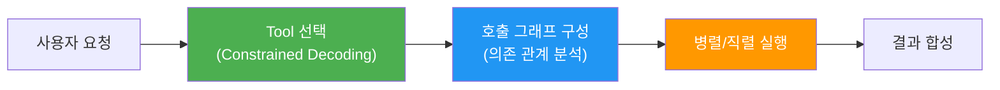
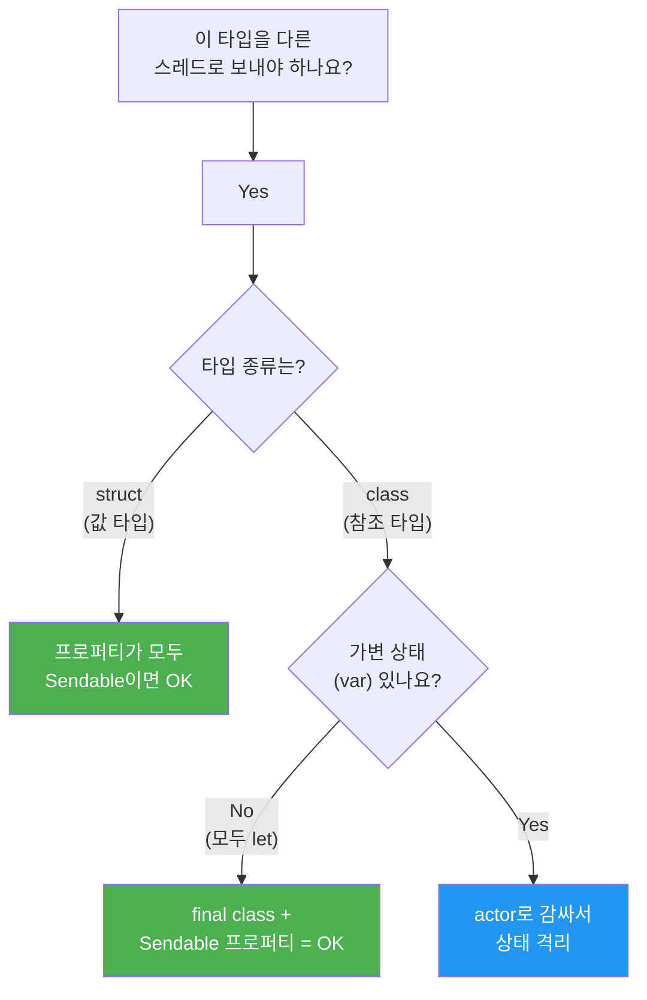
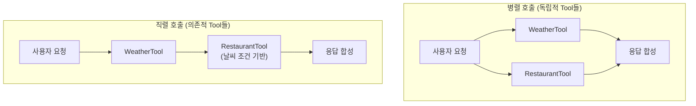
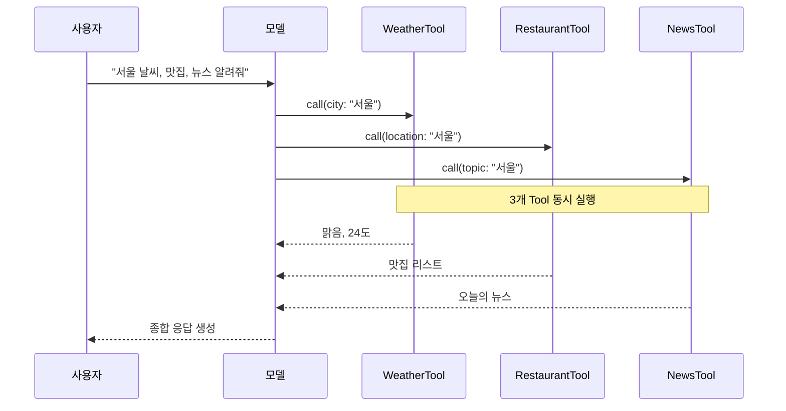
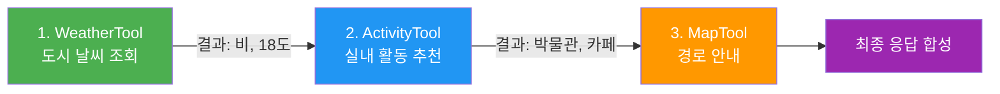
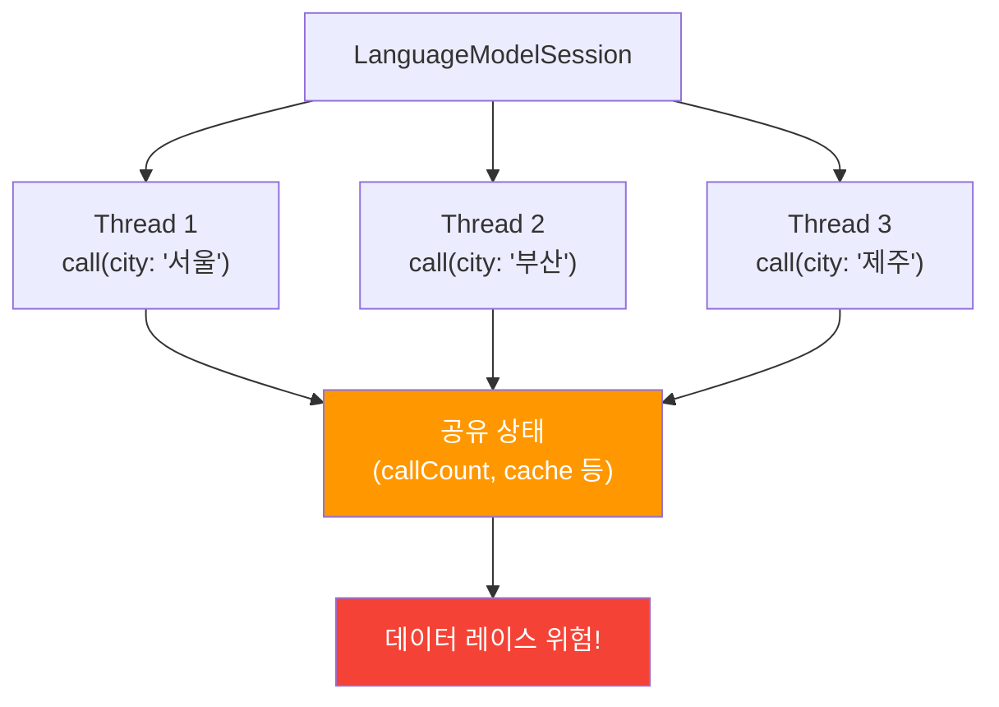
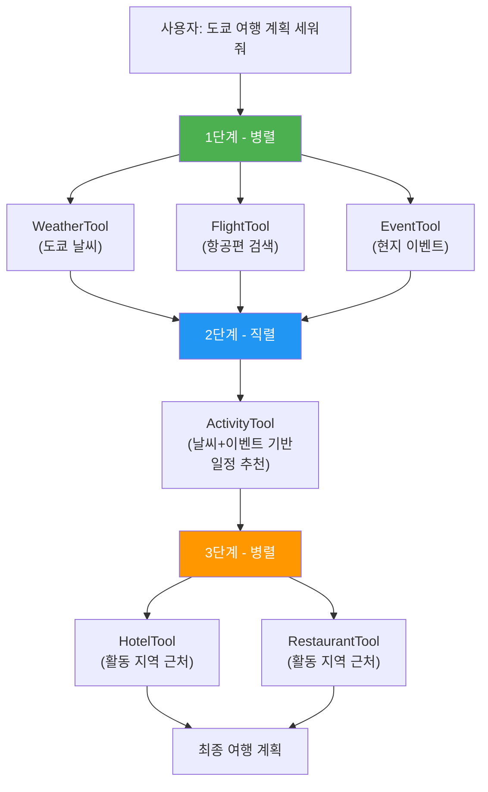

# 병렬과 직렬 Tool 호출

> Foundation Models 프레임워크가 복수 Tool 호출을 병렬 또는 직렬로 자동 오케스트레이션하는 메커니즘을 이해하고, 스레드 안전한 Tool을 설계합니다.

## 개요

이 섹션에서는 Foundation Models 프레임워크가 **여러 Tool을 동시에 호출(병렬)**하거나 **순차적으로 호출(직렬)**하는 방식을 깊이 있게 다룹니다. 단일 `respond(to:)` 호출 안에서 모델이 자율적으로 구성하는 "호출 그래프(Call Graph)"의 구조를 이해하고, 이에 맞는 스레드 안전(Thread Safety) 설계를 학습합니다.

앞서 [복수 Tool 등록과 선택 전략](08-ch8-tool-calling-심화/01-01-복수-tool-등록과-선택-전략.md)에서는 모델이 **어떤 Tool을 선택하는지** — Constrained Decoding 기반의 선택 메커니즘을 배웠습니다. 이번 섹션에서는 그 다음 단계, 즉 선택된 Tool들을 **어떤 순서와 조합으로 실행하는지** — 호출 그래프 오케스트레이션을 다룹니다. Tool 선택이 "무엇을"에 대한 답이라면, 호출 그래프는 "어떻게, 언제"에 대한 답입니다.

이 과정에서 Swift Concurrency의 `Sendable`과 `actor` 개념이 등장하는데요, 걱정 마세요 — 본격적인 내용에 들어가기 전에 **준비 운동** 섹션에서 필요한 만큼만 간결하게 복습합니다.

**선수 지식**: [복수 Tool 등록과 선택 전략](08-ch8-tool-calling-심화/01-01-복수-tool-등록과-선택-전략.md)에서 배운 복수 Tool 등록, Tool 프로토콜 구현, Constrained Decoding 기반 선택 메커니즘
**학습 목표**:
- 병렬 Tool 호출과 직렬 Tool 호출의 차이를 구별한다
- 프레임워크의 자동 호출 그래프(Call Graph) 관리 방식을 이해한다
- `Sendable` 준수와 `nonisolated` 키워드로 스레드 안전한 Tool을 구현한다
- 상태를 공유하는 Tool에서 데이터 레이스를 방지한다

## 왜 알아야 할까?

실제 앱에서 AI 어시스턴트를 만들 때, 사용자의 한 마디 질문이 여러 Tool 호출을 필요로 하는 경우가 대부분입니다. "서울 날씨 알려주고, 근처 맛집도 추천해줘"라는 요청을 생각해보세요. 날씨 API와 맛집 검색 API는 서로 독립적이니까 **동시에** 호출하면 응답이 빠르겠죠? 반면 "서울 날씨 확인하고, 비가 오면 실내 맛집만 추천해줘"라면 날씨 결과를 **먼저** 받아야 맛집 검색 조건을 정할 수 있습니다.

Foundation Models 프레임워크는 이런 판단을 **모델이 자율적으로** 수행합니다. 개발자가 "이건 병렬로, 저건 직렬로"라고 명시하지 않아도, 모델이 프롬프트 맥락에서 의존 관계를 파악하여 최적의 호출 순서를 결정하거든요. 하지만 이 자동화가 제대로 작동하려면 **우리의 Tool이 병렬 호출에 안전하게 설계**되어 있어야 합니다. 그렇지 않으면 데이터 레이스, 예상치 못한 상태 변이 같은 골치 아픈 버그를 만나게 됩니다.

> 📊 **그림 1**: Tool 선택에서 호출 그래프까지 — 전체 흐름



## 준비 운동: Swift Concurrency 핵심 복습

병렬 Tool 호출을 이해하려면 Swift Concurrency의 두 가지 개념 — `Sendable`과 `actor` — 을 알아야 합니다. Ch7에서 `async/await`와 `LanguageModelSession`을 다뤘는데요, 이번에는 **"여러 작업이 동시에 돌아갈 때 데이터를 안전하게 다루는 법"**으로 한 발짝 더 나아갑니다.

### Sendable — "이 데이터, 다른 스레드로 보내도 안전해요"

> 💡 **비유**: 편지를 복사해서 보내는 것과 원본을 빌려주는 것의 차이입니다. 복사본(값 타입)은 누가 낙서해도 원본에 영향이 없죠. 하지만 원본 노트북(참조 타입)을 빌려주면 두 사람이 동시에 쓰다가 내용이 엉킬 수 있습니다.

Swift에서 `Sendable`은 "이 타입의 값을 다른 스레드(정확히는 다른 concurrency domain)로 안전하게 전달할 수 있다"는 **컴파일러 보증 마크**입니다.

```swift
// ✅ struct는 값 타입 → 복사되므로 자동으로 Sendable
struct WeatherResult: Sendable {
    let city: String
    let temperature: Int
}

// ✅ 불변 class도 Sendable 가능 (모든 프로퍼티가 let)
final class AppConfig: Sendable {
    let apiKey: String = "abc123"
    let maxRetries: Int = 3
}

// ❌ 가변 상태가 있는 class는 Sendable 불가
class MutableCounter {
    var count = 0  // var → 여러 스레드에서 동시 수정 가능 → 위험!
}
```

**핵심 규칙 3줄 요약**:
- `struct`(값 타입)이면서 모든 프로퍼티가 `Sendable` → **자동으로 Sendable**
- `class`라면 `final` + 모든 프로퍼티가 `let`이고 `Sendable` → **가능**
- 가변 상태(`var`)가 있는 `class` → **Sendable 불가** (actor로 감싸야 함)

> 📊 **그림 2**: Sendable 판단 플로우차트



### Actor — "한 번에 한 명만 들어오세요"

> 💡 **비유**: 은행 창구를 생각해보세요. 잔고 장부(가변 상태)가 하나 있는데, 여러 고객이 동시에 입출금하면 잔고가 엉키겠죠? 그래서 **줄을 서게** 합니다. 한 번에 한 고객만 창구에서 처리하면 잔고는 항상 정확합니다. Swift의 `actor`가 바로 이 "자동 줄 세우기" 장치입니다.

```swift
// actor: 내부 상태에 한 번에 하나의 작업만 접근 가능
actor BankAccount {
    private var balance: Int = 0
    
    func deposit(_ amount: Int) {
        balance += amount  // 안전! actor가 자동으로 직렬화
    }
    
    func getBalance() -> Int {
        balance
    }
}

// 사용할 때는 반드시 await
let account = BankAccount()
await account.deposit(1000)       // await = "줄 서서 기다린다"
let balance = await account.getBalance()
```

`actor`의 핵심을 한 마디로: **"var가 있어도 안전한 class"**. 컴파일러가 외부에서 actor 내부 상태에 접근할 때 반드시 `await`를 쓰도록 강제하기 때문에, 데이터 레이스가 **컴파일 타임에** 차단됩니다.

### nonisolated — "나는 actor에 묶이지 않아요"

`nonisolated`는 "이 메서드는 특정 actor에 격리되지 않으며, 어떤 스레드에서든 실행될 수 있다"는 선언입니다. Tool의 `call()` 메서드에 자주 붙는 이유는, 프레임워크가 **자기가 원하는 스레드**에서 Tool을 호출할 수 있게 허용하기 위해서입니다.

```swift
struct MyTool: Tool {
    // nonisolated: "프레임워크야, 아무 스레드에서나 나를 불러도 돼"
    nonisolated func call(arguments: Arguments) async throws -> ToolOutput {
        // 여기서 actor의 메서드를 호출하면 → await로 자동 직렬화
        // 여기서 순수 계산만 하면 → 아무 문제 없음
    }
}
```

> 🔥 **실무 팁**: 이 3가지 개념의 관계를 정리하면 — `Sendable`은 **"보내도 안전한 데이터"**를 표시하고, `actor`는 **"안전하지 않은 데이터를 안전하게 만드는 도구"**이며, `nonisolated`는 **"어디서든 실행 가능"**이라는 자유를 선언합니다. 이 세 가지가 Foundation Models의 병렬 Tool 호출을 뒷받침하는 안전장치입니다.

이 정도면 준비 완료입니다! 이제 이 개념들이 Tool Calling에서 어떻게 활용되는지 본격적으로 살펴보겠습니다.

## 핵심 개념

### 개념 1: 호출 그래프(Call Graph)란?

> 💡 **비유**: 레스토랑 주방을 상상해보세요. 주문이 들어오면 셰프(모델)는 메뉴를 분석합니다. 샐러드와 스프는 서로 관계없으니 두 파트에게 **동시에** 지시합니다. 하지만 메인 디시의 소스는 스프 육수를 베이스로 하니까 스프가 **먼저** 완성되어야 합니다. 이처럼 셰프가 머릿속에 그리는 "누가 먼저, 누가 동시에"라는 작업 계획표가 바로 호출 그래프입니다.

Foundation Models 프레임워크에서 **호출 그래프(Call Graph)**는 한 번의 `respond(to:)` 호출 안에서 모델이 결정하는 Tool 실행 계획입니다. 이전 섹션에서 배운 Tool 선택 메커니즘이 "어떤 Tool을 쓸지"를 결정하는 과정이라면, 호출 그래프는 선택된 Tool들을 "어떤 순서와 조합으로 실행할지"를 결정하는 다음 단계입니다. Apple의 WWDC25 Deep Dive 세션에서는 이를 다음과 같이 설명합니다:

> "The developer provides an implementation of the simple Tool Swift protocol, and the framework automatically and optimally handles the potentially complex call graphs of parallel and serial tool calls."

즉, 개발자는 Tool 프로토콜만 구현하면 되고, **복잡한 호출 그래프의 실행 전략은 프레임워크가 알아서** 관리합니다.

> 📊 **그림 3**: Tool 호출 그래프의 두 가지 패턴



호출 그래프의 핵심 특성을 정리하면:

| 특성 | 설명 |
|------|------|
| **자율 결정** | 모델이 프롬프트 맥락에서 의존 관계를 자동으로 파악 |
| **최적 실행** | 독립적 Tool은 병렬, 의존적 Tool은 직렬로 자동 배치 |
| **투명한 실행** | 개발자가 실행 순서를 명시적으로 제어할 필요 없음 |
| **트랜스크립트 통합** | 모든 Tool 결과가 세션 트랜스크립트에 자동 기록 |

### 개념 2: 병렬 Tool 호출 — 독립적 작업의 동시 실행

> 💡 **비유**: 온라인 쇼핑몰에서 여러 상품을 동시에 검색하는 것과 같습니다. "운동화"와 "백팩"을 각각 검색할 때, 운동화 결과를 기다렸다가 백팩을 검색할 필요가 없죠. 두 검색은 **독립적**이니까 동시에 보내면 전체 대기 시간이 줄어듭니다.

Apple의 공식 문서에 따르면: **"A tool can be called multiple times for a single request. And when that happens, your tool gets called in parallel."** 모델이 하나의 요청에서 여러 Tool(또는 같은 Tool을 여러 번)을 호출할 때, 프레임워크는 이를 **동시에(concurrently)** 실행합니다.

> 📊 **그림 4**: 병렬 Tool 호출의 시간 흐름



병렬 호출이 발생하는 조건:

1. **Tool 간 데이터 의존성이 없을 때** — Tool A의 결과가 Tool B의 입력으로 필요하지 않음
2. **같은 Tool을 다른 인자로 여러 번 호출할 때** — 예: 서울 날씨 + 부산 날씨
3. **모델이 맥락에서 독립성을 판단했을 때** — 프롬프트의 의미를 분석하여 결정

이제 앞서 복습한 `Sendable` 개념이 왜 필요한지 연결됩니다. 병렬 호출은 여러 스레드에서 동시에 Tool의 `call()` 메서드를 실행하므로, Tool이 `Sendable`을 준수해야 하는 거죠. 병렬 호출이 가능한 독립적 Tool 세트를 구현해보겠습니다:

```swift
import FoundationModels

// 날씨 Tool — 독립적, 무상태(struct) → 자동 Sendable
struct WeatherTool: Tool {
    let name = "getWeather"
    let description = "지정된 도시의 현재 날씨를 조회합니다"
    
    @Generable
    struct Arguments {
        @Guide(description: "날씨를 조회할 도시 이름")
        var city: String
    }
    
    // nonisolated: 프레임워크가 아무 스레드에서나 호출 가능
    nonisolated func call(arguments: Arguments) async throws -> ToolOutput {
        // 외부 API 호출 (상태 비의존)
        let weather = try await WeatherService.shared
            .weather(for: arguments.city)
        return ToolOutput("\(arguments.city): \(weather.condition), \(weather.temperature)°C")
    }
}

// 뉴스 Tool — 독립적, 무상태(struct) → 자동 Sendable
struct NewsTool: Tool {
    let name = "getNews"
    let description = "지정된 주제의 최신 뉴스를 검색합니다"
    
    @Generable
    struct Arguments {
        @Guide(description: "뉴스 검색 주제")
        var topic: String
    }
    
    nonisolated func call(arguments: Arguments) async throws -> ToolOutput {
        let articles = try await NewsAPI.search(topic: arguments.topic)
        let summary = articles.prefix(3)
            .map { "- \($0.title)" }
            .joined(separator: "\n")
        return ToolOutput(summary)
    }
}
```

이 두 Tool은 **무상태(stateless) struct**이므로 자동으로 `Sendable`을 준수하고, 서로의 결과에 의존하지 않으므로 모델이 동시에 호출해도 아무런 문제가 없습니다.

### 개념 3: 직렬 Tool 호출 — 의존적 작업의 순차 실행

> 💡 **비유**: 요리 레시피를 따라가는 것과 같습니다. 양파를 **먼저** 볶아야 카레 베이스를 만들 수 있고, 베이스가 있어야 **그 다음에** 고기를 넣을 수 있죠. 각 단계의 결과가 다음 단계의 입력이 되는 것이 직렬 호출입니다.

직렬 호출은 Tool A의 출력이 Tool B의 입력 맥락이 되어야 할 때 발생합니다. 모델은 트랜스크립트에 기록된 Tool A의 결과를 참조하여, Tool B의 인자를 결정합니다.

> 📊 **그림 5**: 직렬 Tool 호출의 의존 관계



직렬 호출의 동작 원리:

1. 모델이 첫 번째 Tool을 호출하고 **결과를 기다림**
2. Tool 결과가 세션 **트랜스크립트에 자동 기록**
3. 모델이 트랜스크립트를 참조하여 **다음 Tool의 인자를 결정**
4. 이 과정이 필요한 만큼 반복된 후 최종 응답 생성

직렬 의존 관계가 있는 Tool 세트 예제:

```swift
// 1단계: 날씨 조회 (독립)
struct WeatherTool: Tool {
    let name = "getWeather"
    let description = "도시의 현재 날씨와 기온을 조회합니다"
    
    @Generable
    struct Arguments {
        @Guide(description: "도시 이름")
        var city: String
    }
    
    nonisolated func call(arguments: Arguments) async throws -> ToolOutput {
        let weather = try await WeatherService.shared
            .weather(for: arguments.city)
        // 구조화된 결과 — 모델이 다음 Tool 인자를 결정하는 데 활용
        return ToolOutput("""
            도시: \(arguments.city)
            날씨: \(weather.condition)
            기온: \(weather.temperature)°C
            강수확률: \(weather.precipitation)%
            """)
    }
}

// 2단계: 활동 추천 (날씨 결과에 의존)
struct ActivityTool: Tool {
    let name = "suggestActivity"
    let description = "날씨 조건에 맞는 활동을 추천합니다. 날씨 정보를 먼저 확인한 후 호출하세요."
    
    @Generable
    struct Arguments {
        @Guide(description: "실외 또는 실내")
        var activityType: ActivityType
        
        @Guide(description: "활동 지역")
        var location: String
        
        @Generable
        enum ActivityType {
            case indoor   // 비, 극한 기온 시
            case outdoor  // 맑은 날
        }
    }
    
    nonisolated func call(arguments: Arguments) async throws -> ToolOutput {
        let activities = try await ActivityDatabase
            .search(type: arguments.activityType, near: arguments.location)
        let list = activities.prefix(5)
            .map { "- \($0.name): \($0.description)" }
            .joined(separator: "\n")
        return ToolOutput(list)
    }
}
```

여기서 핵심은 `ActivityTool`의 `description`에 **"날씨 정보를 먼저 확인한 후 호출하세요"**라는 가이드를 넣은 것입니다. 모델은 이 설명을 읽고, WeatherTool을 먼저 호출한 다음 그 결과에 따라 `activityType`을 `indoor` 또는 `outdoor`로 결정합니다.

### 개념 4: Sendable과 스레드 안전성 — Tool에 적용하기

> 💡 **비유**: 도서관의 공유 노트를 생각해보세요. 여러 사람이 **동시에** 같은 노트에 글을 쓰면 내용이 엉켜버립니다. 하지만 각자 **자기 노트**에 쓴 뒤 나중에 합치면 문제없죠. 앞서 복습한 `Sendable`과 `actor` 개념이 바로 여기서 실전 적용됩니다.

Apple의 Foundation Models에서 `Tool` 프로토콜은 **Sendable 준수를 요구**합니다. 이유는 명확합니다 — 병렬 호출 시 같은 Tool 인스턴스의 `call()` 메서드가 **여러 스레드에서 동시에 실행**될 수 있기 때문이죠. 준비 운동에서 배운 개념들이 실제로 어떻게 연결되는지 보겠습니다.

> 📊 **그림 6**: 스레드 안전성이 필요한 이유



**안전하지 않은 예** — 데이터 레이스 발생 가능:

```swift
// ❌ 위험: 공유 가변 상태를 보호 없이 접근
class UnsafeCounterTool: Tool {
    let name = "counter"
    let description = "호출 횟수를 추적합니다"
    
    var callCount = 0  // ⚠️ class + var → Sendable 불가 (준비 운동 참조!)
    
    @Generable
    struct Arguments {
        var action: String
    }
    
    func call(arguments: Arguments) async throws -> ToolOutput {
        callCount += 1  // ⚠️ 비원자적 연산 — 두 스레드가 동시에 읽고 쓰면?
        return ToolOutput("호출 횟수: \(callCount)")
    }
}
```

**안전한 설계** — 준비 운동에서 배운 Actor 패턴 적용:

```swift
// ✅ 안전: actor로 공유 상태 격리
actor ToolStateManager {
    private var callHistory: [String] = []
    private var callCount = 0
    
    func recordCall(toolName: String) -> Int {
        callCount += 1            // actor 내부 → 자동 직렬화, 안전!
        callHistory.append(toolName)
        return callCount
    }
    
    func getHistory() -> [String] {
        callHistory
    }
}

// struct(값 타입) + let(불변 참조) → 자동 Sendable
struct SafeCounterTool: Tool {
    let name = "counter"
    let description = "호출 횟수를 추적합니다"
    let stateManager: ToolStateManager  // actor 참조는 Sendable
    
    @Generable
    struct Arguments {
        @Guide(description: "수행할 작업 이름")
        var action: String
    }
    
    // nonisolated: 프레임워크가 원하는 스레드에서 실행
    nonisolated func call(arguments: Arguments) async throws -> ToolOutput {
        // await → actor가 자동으로 줄 세우기 (은행 창구 비유!)
        let count = await stateManager.recordCall(toolName: name)
        return ToolOutput("호출 횟수: \(count)")
    }
}
```

스레드 안전한 Tool 설계의 3가지 전략:

| 전략 | 방법 | 적합한 경우 | Sendable 방식 |
|------|------|-------------|---------------|
| **무상태(Stateless)** | `struct` + 외부 상태 없음 | API 호출, 계산 등 대부분의 경우 | 자동 Sendable |
| **Actor 격리** | 공유 상태를 `actor`로 래핑 | 호출 이력, 캐시 등 상태 추적 필요 시 | actor 참조로 Sendable |
| **불변 참조** | `let` 프로퍼티만 사용 | 설정값, 의존성 주입 | 자동 Sendable |

### 개념 5: 혼합 호출 그래프 — 병렬 + 직렬의 조합

> 💡 **비유**: 여행 계획을 세울 때를 생각해보세요. 항공권 검색과 호텔 검색은 **동시에** 할 수 있습니다. 하지만 렌터카 예약은 호텔 위치가 확정된 **후에야** 픽업 장소를 정할 수 있죠. 실제 앱의 Tool 호출도 이처럼 병렬과 직렬이 혼합된 형태가 대부분입니다.

현실적인 시나리오에서는 순수하게 병렬이거나 순수하게 직렬인 경우보다, **혼합 그래프**가 훨씬 일반적입니다. 모델은 이를 자동으로 최적화합니다.

> 📊 **그림 7**: 혼합 호출 그래프 — 여행 플래너 시나리오



이런 복잡한 그래프를 개발자가 직접 코딩할 필요가 없다는 것이 Foundation Models 프레임워크의 핵심 가치입니다. 아래는 이 혼합 시나리오를 지원하는 Tool 등록 코드입니다:

```swift
// 여행 플래너 — 혼합 호출 그래프를 위한 Tool 세트
let travelTools: [any Tool] = [
    WeatherTool(),           // 독립: 병렬 실행 가능
    FlightSearchTool(),      // 독립: 병렬 실행 가능
    EventSearchTool(),       // 독립: 병렬 실행 가능
    ActivityPlannerTool(),   // 의존: 날씨+이벤트 결과 필요
    HotelSearchTool(),       // 의존: 활동 계획 결과 필요
    RestaurantSearchTool()   // 의존: 활동 계획 결과 필요
]

let session = LanguageModelSession(
    tools: travelTools,
    instructions: """
    여행 플래너 어시스턴트입니다.
    1. 먼저 날씨, 항공편, 현지 이벤트를 동시에 조회하세요.
    2. 조회 결과를 바탕으로 활동 일정을 추천하세요.
    3. 추천 활동 근처의 숙소와 맛집을 찾아주세요.
    """
)

let plan = try await session.respond(
    to: "다음 주 도쿄 3박 4일 여행 계획 세워줘"
)
```

> ⚠️ **흔한 오해**: "instructions에 '동시에 조회하세요'라고 쓰면 반드시 병렬로 실행된다" — 이건 **오해**입니다. Instructions는 모델에게 **힌트**를 줄 뿐, 최종 실행 전략은 모델이 맥락을 종합적으로 판단하여 결정합니다. 다만 Tool의 `description`에 의존 관계를 명시하면 직렬 호출 확률이 높아집니다.

## 실습: 직접 해보기

여행 도우미 앱의 백엔드를 구성해봅시다. 날씨 조회, 환율 조회(병렬), 그리고 결과 기반 추천(직렬)을 조합합니다.

```swift
import FoundationModels

// ─── 1. 병렬 실행 가능한 독립 Tool들 ───

struct WeatherTool: Tool {
    let name = "getWeather"
    let description = "도시의 현재 날씨를 조회합니다"
    
    @Generable
    struct Arguments {
        @Guide(description: "조회할 도시 이름 (영문)")
        var city: String
    }
    
    nonisolated func call(arguments: Arguments) async throws -> ToolOutput {
        // 실제 앱에서는 WeatherKit 또는 외부 API 사용
        let conditions = [
            "Tokyo": ("맑음", 22),
            "Seoul": ("흐림", 18),
            "Osaka": ("비", 16)
        ]
        
        if let (condition, temp) = conditions[arguments.city] {
            return ToolOutput("날씨: \(condition), 기온: \(temp)°C")
        }
        return ToolOutput("날씨 정보를 찾을 수 없습니다")
    }
}

struct ExchangeRateTool: Tool {
    let name = "getExchangeRate"
    let description = "현재 환율을 조회합니다"
    
    @Generable
    struct Arguments {
        @Guide(description: "기준 통화 (예: KRW)")
        var fromCurrency: String
        
        @Guide(description: "대상 통화 (예: JPY)")
        var toCurrency: String
    }
    
    nonisolated func call(arguments: Arguments) async throws -> ToolOutput {
        // 실제 앱에서는 환율 API 사용
        let rate = 0.11  // 1 KRW = 0.11 JPY (예시)
        return ToolOutput("1 \(arguments.fromCurrency) = \(rate) \(arguments.toCurrency)")
    }
}

// ─── 2. 직렬 의존: 날씨 결과를 기반으로 추천 ───

struct PackingAdvisorTool: Tool {
    let name = "suggestPacking"
    let description = """
        여행 준비물을 추천합니다. \
        반드시 날씨 정보를 먼저 확인한 후 호출하세요.
        """
    
    @Generable
    struct Arguments {
        @Guide(description: "여행 목적지")
        var destination: String
        
        @Guide(description: "예상 날씨 상태: sunny, cloudy, rainy")
        var weatherCondition: WeatherCondition
        
        @Guide(description: "여행 일수")
        var days: Int
        
        @Generable
        enum WeatherCondition {
            case sunny
            case cloudy
            case rainy
        }
    }
    
    nonisolated func call(arguments: Arguments) async throws -> ToolOutput {
        var items = ["여권", "충전기", "상비약"]
        
        // 날씨 기반 추천 — 직렬 호출로 정확한 추천 가능
        switch arguments.weatherCondition {
        case .sunny:
            items += ["선글라스", "선크림", "모자"]
        case .cloudy:
            items += ["가벼운 겉옷", "접이식 우산"]
        case .rainy:
            items += ["우산", "방수 재킷", "여분의 양말"]
        }
        
        // 일수 기반 추천
        if arguments.days > 3 {
            items.append("세탁 세제")
        }
        
        let list = items.map { "- \($0)" }.joined(separator: "\n")
        return ToolOutput("추천 준비물:\n\(list)")
    }
}

// ─── 3. 상태 관리가 필요한 Tool (Actor 패턴) ───

actor TravelLog {
    private var queries: [(tool: String, timestamp: Date)] = []
    
    func record(tool: String) {
        queries.append((tool: tool, timestamp: Date()))
    }
    
    func summary() -> String {
        "총 \(queries.count)회 조회: " + queries
            .map(\.tool)
            .joined(separator: ", ")
    }
}

struct LoggingWeatherTool: Tool {
    let name = "getWeatherWithLog"
    let description = "날씨를 조회하고 조회 이력을 기록합니다"
    let log: TravelLog  // actor 참조 — Sendable 안전
    
    @Generable
    struct Arguments {
        @Guide(description: "도시 이름")
        var city: String
    }
    
    nonisolated func call(arguments: Arguments) async throws -> ToolOutput {
        // actor 메서드는 자동 직렬화 — 데이터 레이스 없음
        await log.record(tool: "weather:\(arguments.city)")
        
        let weather = try await WeatherService.shared
            .weather(for: arguments.city)
        return ToolOutput("\(arguments.city): \(weather.condition)")
    }
}

// ─── 4. 세션 구성 및 실행 ───

@Observable
class TravelPlannerViewModel {
    var result: String = ""
    var isLoading = false
    
    private let log = TravelLog()
    
    func planTrip(query: String) async {
        isLoading = true
        defer { isLoading = false }
        
        let tools: [any Tool] = [
            WeatherTool(),           // 병렬 가능
            ExchangeRateTool(),      // 병렬 가능
            PackingAdvisorTool()     // 직렬 필요 (날씨 의존)
        ]
        
        let session = LanguageModelSession(
            tools: tools,
            instructions: """
                여행 도우미입니다. 사용자의 여행 관련 질문에 답합니다.
                날씨와 환율은 먼저 조회하고, 그 결과를 바탕으로 준비물을 추천하세요.
                """
        )
        
        do {
            let response = try await session.respond(to: query)
            result = response.content
        } catch {
            result = "오류 발생: \(error.localizedDescription)"
        }
    }
}
```

```run:swift
// 실행 시뮬레이션 — 모델의 호출 그래프 추적
print("=== 여행 플래너 Tool 호출 시뮬레이션 ===")
print("")
print("사용자: '도쿄 3박 여행 준비물 알려줘'")
print("")
print("1단계 [병렬]: WeatherTool + ExchangeRateTool 동시 호출")
print("  → WeatherTool(city: 'Tokyo') = '맑음, 22°C'")
print("  → ExchangeRateTool(KRW → JPY) = '1 KRW = 0.11 JPY'")
print("")
print("2단계 [직렬]: PackingAdvisorTool (날씨 결과 기반)")
print("  → PackingAdvisorTool(destination: 'Tokyo',")
print("      weatherCondition: .sunny, days: 3)")
print("  → 추천: 선글라스, 선크림, 모자, 여권, 충전기, 상비약")
print("")
print("3단계: 모델이 모든 Tool 결과를 종합하여 최종 응답 생성")
```

```output
=== 여행 플래너 Tool 호출 시뮬레이션 ===

사용자: '도쿄 3박 여행 준비물 알려줘'

1단계 [병렬]: WeatherTool + ExchangeRateTool 동시 호출
  → WeatherTool(city: 'Tokyo') = '맑음, 22°C'
  → ExchangeRateTool(KRW → JPY) = '1 KRW = 0.11 JPY'

2단계 [직렬]: PackingAdvisorTool (날씨 결과 기반)
  → PackingAdvisorTool(destination: 'Tokyo',
      weatherCondition: .sunny, days: 3)
  → 추천: 선글라스, 선크림, 모자, 여권, 충전기, 상비약

3단계: 모델이 모든 Tool 결과를 종합하여 최종 응답 생성
```

## 더 깊이 알아보기

### Tool Calling의 탄생 — GPT에서 Apple까지

Tool Calling(또는 Function Calling)이라는 개념이 대중화된 것은 2023년 6월 OpenAI가 GPT-3.5/4에 Function Calling을 도입하면서부터입니다. 하지만 "AI가 외부 도구를 자율적으로 사용한다"는 아이디어의 뿌리는 훨씬 깊습니다. 1980년대의 Expert System에서도 규칙 기반으로 외부 데이터베이스를 호출하는 패턴이 있었고, 2022년 Meta의 Toolformer 논문은 LLM이 스스로 Tool 사용법을 학습할 수 있음을 보여줬죠.

Apple이 Foundation Models 프레임워크에서 특히 혁신적인 점은 **Guided Generation(Constrained Decoding)**을 Tool Calling에 결합한 것입니다. 기존 클라우드 LLM들은 JSON 스키마를 프롬프트에 텍스트로 넣고 "이 형식에 맞춰 응답해줘"라고 부탁하는 방식이었지만, Apple은 **컴파일 타임에 `@Generable` 매크로가 생성한 스키마로 디코딩 자체를 제약**합니다. 덕분에 잘못된 Tool 이름이나 유효하지 않은 인자가 생성될 확률이 원천적으로 차단되죠.

병렬/직렬 호출 그래프의 자동 관리도 Apple만의 차별점입니다. OpenAI의 Parallel Function Calling(2023년 11월 도입)은 모델이 여러 함수 호출을 한 번에 반환하면 **클라이언트가** 병렬 실행을 구현해야 합니다. 반면 Apple의 프레임워크는 **런타임이 직접** 병렬/직렬을 판단하고 실행합니다. 개발자는 Tool 프로토콜만 구현하면 되니, 복잡한 `TaskGroup` 관리 코드가 필요 없는 거죠.

### Sendable과 Actor의 역사적 배경

Swift Concurrency(async/await, actor, Sendable)는 2021년 Swift 5.5에서 처음 도입되었습니다. 하지만 초기에는 `Sendable` 검사가 느슨했고, Swift 6(2024년)에서 "Strict Concurrency Checking"이 기본 활성화되면서 비로소 컴파일러가 데이터 레이스를 적극적으로 잡기 시작했습니다. Foundation Models 프레임워크가 2025년에 출시되면서 `Tool` 프로토콜이 `Sendable`을 요구하는 것은, Swift 6 시대의 안전한 동시성 모델 위에 자연스럽게 세워진 것이라고 할 수 있습니다.

재미있는 점은, `actor` 개념 자체는 1973년 Carl Hewitt이 발표한 "Actor Model" 논문에서 비롯되었다는 것입니다. 50년이 넘은 아이디어가 Swift라는 현대 언어에서 온디바이스 AI의 스레드 안전성을 보장하는 데 활용되고 있다니, 좋은 아이디어는 시대를 초월하는 법이죠.

## 흔한 오해와 팁

> ⚠️ **흔한 오해**: "병렬 호출은 항상 직렬보다 빠르다" — 그렇지 않습니다. 병렬로 호출된 Tool들이 **같은 네트워크 리소스**를 경쟁적으로 사용하면 오히려 느려질 수 있습니다. 예를 들어 같은 API 서버에 10개 요청을 동시에 보내면 rate limit에 걸리거나 서버 부하가 올라갑니다. Tool 설계 시 외부 리소스의 동시 접근 한도를 고려하세요.

> 💡 **알고 계셨나요?**: Foundation Models 프레임워크에서 모든 Tool 호출 결과는 세션의 **트랜스크립트(transcript)**에 자동으로 기록됩니다. 이 트랜스크립트가 바로 직렬 호출에서 "이전 Tool의 결과를 참조"하는 메커니즘의 핵심입니다. [토큰 예산과 컨텍스트 윈도우](09-ch9-세션-관리와-멀티턴-대화/02-02-토큰-예산과-컨텍스트-윈도우.md)에서 이 트랜스크립트의 토큰 영향을 더 깊이 다룹니다.

> 🔥 **실무 팁**: Tool의 `description`은 모델의 호출 순서 결정에 직접적인 영향을 줍니다. 직렬 호출이 필요한 Tool에는 **"먼저 X를 확인한 후 호출하세요"** 같은 의존성 힌트를 description에 명시하세요. 반대로 독립적인 Tool은 description에 다른 Tool을 언급하지 않는 것이 병렬 호출 확률을 높입니다.

> 🔥 **실무 팁**: 상태가 있는(stateful) Tool을 만들 때는 `class` 대신 **`struct` + `actor`** 조합을 사용하세요. `struct`로 Tool을 정의하면 `Sendable` 준수가 자연스럽고, 가변 상태는 별도의 `actor`에 격리하면 데이터 레이스를 컴파일 타임에 방지할 수 있습니다. 이 패턴은 [복수 Tool 등록과 선택 전략](08-ch8-tool-calling-심화/01-01-복수-tool-등록과-선택-전략.md)에서 다룬 `class` 기반 stateful Tool의 개선 버전입니다.

## 핵심 정리

| 개념 | 설명 |
|------|------|
| Sendable | 다른 스레드로 안전하게 보낼 수 있는 타입 표시. struct(값 타입)은 자동 준수 |
| Actor | 가변 상태를 자동 직렬화로 보호하는 Swift Concurrency 메커니즘 |
| nonisolated | 특정 actor에 격리되지 않고 임의 스레드에서 실행 가능함을 선언 |
| 호출 그래프(Call Graph) | 모델이 자율적으로 구성하는 Tool 실행 계획. 병렬/직렬을 자동 결정 |
| 병렬 호출 | 독립적 Tool들이 동시 실행. 응답 시간 최소화에 유리 |
| 직렬 호출 | 이전 Tool 결과가 다음 Tool 입력에 필요할 때 순차 실행 |
| 혼합 그래프 | 실전에서 가장 흔한 패턴. 병렬 + 직렬이 단계별로 조합 |
| description 힌트 | Tool의 의존 관계를 description에 명시하여 직렬 호출 유도 |

## 다음 섹션 미리보기

이번 섹션에서 병렬/직렬 호출 패턴과 스레드 안전성을 배웠다면, 다음 [Tool과 구조화 출력 결합](08-ch8-tool-calling-심화/03-03-tool과-구조화-출력-결합.md)에서는 Tool Calling과 `@Generable` 구조화 출력을 함께 사용하는 강력한 패턴을 학습합니다. Tool이 가져온 데이터를 `@Generable` 스키마로 **구조화된 형태**로 받아, 앱 UI에 바로 바인딩할 수 있는 실전 기법을 다룹니다.

## 참고 자료

- [Deep dive into the Foundation Models framework — WWDC25](https://developer.apple.com/videos/play/wwdc2025/301/) - 병렬/직렬 Tool 호출 그래프의 자동 관리에 대한 Apple 공식 설명
- [Meet the Foundation Models framework — WWDC25](https://developer.apple.com/videos/play/wwdc2025/286/) - Foundation Models 프레임워크의 Tool Calling 기초와 실행 흐름 소개
- [Expanding generation with tool calling — Apple Developer Documentation](https://developer.apple.com/documentation/foundationmodels/expanding-generation-with-tool-calling) - Tool 프로토콜 API 레퍼런스와 구현 가이드
- [The Ultimate Guide To The Foundation Models Framework — AzamSharp](https://azamsharp.com/2025/06/18/the-ultimate-guide-to-the-foundation-models-framework.html) - 복수 Tool 등록과 세션 초기화 패턴의 실전 예제
- [Exploring the Foundation Models framework — Create with Swift](https://www.createwithswift.com/exploring-the-foundation-models-framework/) - Tool 호출 패턴과 LanguageModelSession 활용법
- [Swift Concurrency — The Swift Programming Language](https://docs.swift.org/swift-book/documentation/the-swift-programming-language/concurrency/) - Sendable, actor, nonisolated 등 Swift Concurrency 공식 문서

---
### 🔗 Related Sessions
- [constrained decoding tool selection](08-ch8-tool-calling-심화/01-01-복수-tool-등록과-선택-전략.md) (prerequisite)
