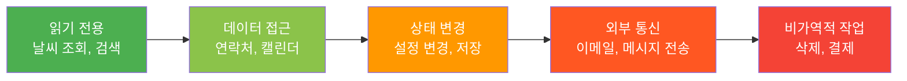
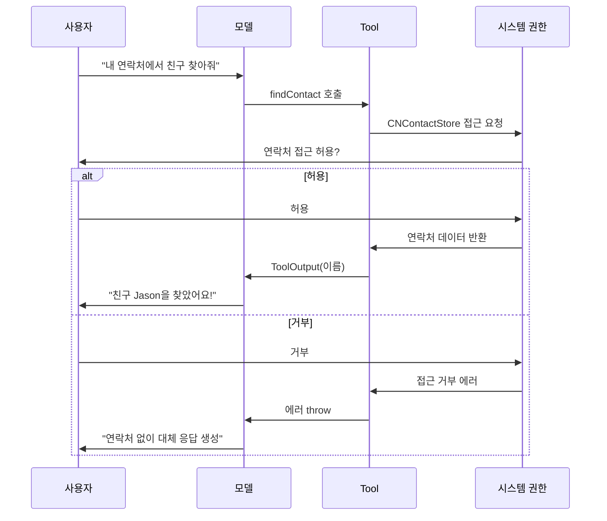
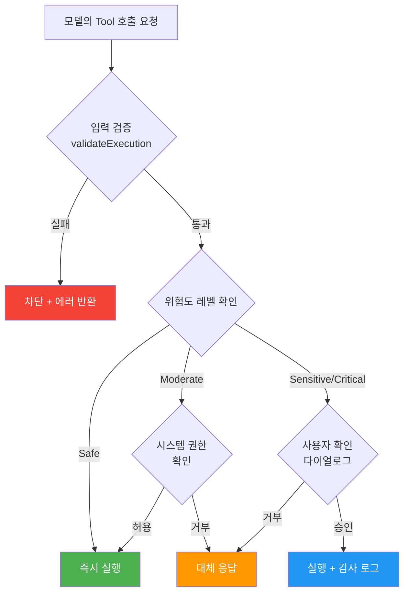
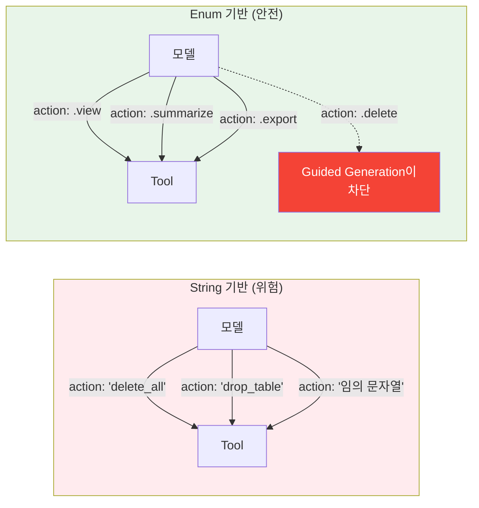
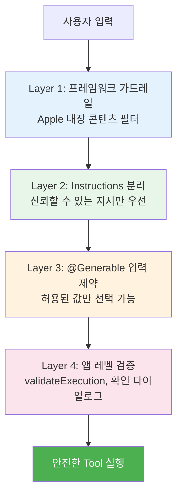

# Tool 보안과 권한 관리

> AI가 호출하는 Tool에 적절한 보안 경계와 사용자 확인 절차를 구축하는 방법을 학습합니다

## 개요

이 섹션에서는 Foundation Models 프레임워크에서 Tool Calling을 안전하게 운영하기 위한 보안 패턴을 다룹니다. 모델이 Tool을 자율적으로 호출할 수 있다는 것은 강력한 기능이지만, 그만큼 **"모델이 잘못된 타이밍에 위험한 작업을 실행하면 어쩌지?"**라는 걱정도 따라오죠. 이 세션이 바로 그 걱정을 해결합니다.

**선수 지식**:
- [Tool 프로토콜 구현](07-ch7-tool-calling-기초/02-02-tool-프로토콜-구현하기.md)의 기본 Tool 구조
- [병렬과 직렬 Tool 호출](08-ch8-tool-calling-심화/02-02-병렬과-직렬-tool-호출.md)의 동시성 패턴
- [Tool과 구조화 출력 결합](08-ch8-tool-calling-심화/03-03-tool과-구조화-출력-결합.md)의 respond(to:generating:) API

**학습 목표**:
- Tool 실행 전 사용자 확인(Confirmation) UI 패턴을 구현한다
- iOS/macOS 시스템 권한과 Tool 호출을 안전하게 연결한다
- 위험한 작업에 대한 Safeguard 레이어를 설계한다
- Tool 입력 검증과 출력 새니타이징 전략을 적용한다

## 왜 알아야 할까?

"이메일 보내기 Tool"을 모델에 등록했다고 상상해보세요. 사용자가 "지난주 회의 내용 정리해줘"라고 했는데, 모델이 정리 결과를 **사용자 확인 없이 상사에게 이메일로 보내버린다면?** 이건 기능이 아니라 사고입니다.

Tool Calling은 모델에게 **앱의 실제 기능을 실행할 권한**을 부여하는 것입니다. 읽기 전용 Tool(날씨 조회, 검색)은 비교적 안전하지만, **쓰기 작업**(메시지 전송, 데이터 삭제, 결제 실행)은 되돌리기 어려운 결과를 만들 수 있거든요. Apple의 Foundation Models 프레임워크는 온디바이스로 실행되어 프라이버시 측면에서는 안전하지만, **앱 내부의 액션 보안은 개발자의 책임**입니다.

> 📊 **그림 1**: Tool 위험도 스펙트럼



이 세션을 통해 여러분은 Tool의 위험도에 따라 적절한 보안 계층을 설계하는 능력을 갖추게 됩니다.

## 핵심 개념

### 개념 1: 시스템 권한과 Tool의 자연스러운 연결

> 💡 **비유**: 호텔 카드키를 생각해보세요. 카드키(시스템 권한)가 있어야 방문(Tool 실행)을 열 수 있고, 카드키 없이는 아무리 프런트(모델)가 원해도 방에 들어갈 수 없습니다.

iOS/macOS에는 연락처, 캘린더, 위치, 건강 데이터 등에 접근하기 위한 **시스템 권한 프레임워크**가 이미 존재합니다. Foundation Models의 Tool은 이 기존 권한 시스템 위에서 자연스럽게 동작하는데요, WWDC25에서 Apple이 보여준 패턴이 정확히 이것입니다:

```swift
import FoundationModels
import Contacts

// Tool이 처음 호출되면, 시스템이 자동으로 권한 다이얼로그를 표시
struct FindContactTool: Tool {
    let name = "findContact"
    let description = "Finds a contact by age generation."
    
    @Generable
    struct Arguments {
        @Guide(description: "연령대 세대 구분")
        let generation: Generation
        
        @Generable
        enum Generation: String {
            case babyBoomers   // 베이비붐 세대
            case genX          // X세대
            case millennial    // 밀레니얼
            case genZ          // Z세대
        }
    }
    
    // 세대별 출생 연도 범위 반환
    private func yearRange(for generation: Arguments.Generation) -> ClosedRange<Int> {
        switch generation {
        case .babyBoomers: return 1946...1964
        case .genX:        return 1965...1980
        case .millennial:  return 1981...1996
        case .genZ:        return 1997...2012
        }
    }
    
    func call(arguments: Arguments) async throws -> ToolOutput {
        let store = CNContactStore()
        
        // 첫 호출 시 시스템이 자동으로 연락처 접근 권한 다이얼로그 표시
        let keysToFetch = [
            CNContactGivenNameKey,
            CNContactFamilyNameKey,
            CNContactBirthdayKey
        ] as [CNKeyDescriptor]
        let request = CNContactFetchRequest(keysToFetch: keysToFetch)
        
        var matchingContacts: [CNContact] = []
        let range = yearRange(for: arguments.generation)
        
        try store.enumerateContacts(with: request) { contact, _ in
            // 생년 정보가 있는 연락처만 필터링
            if let birthday = contact.birthday,
               let year = birthday.year,
               range.contains(year) {
                matchingContacts.append(contact)
            }
        }
        
        // 매칭된 연락처 중 랜덤으로 한 명 선택
        guard let picked = matchingContacts.randomElement() else {
            return ToolOutput("해당 세대(\(arguments.generation.rawValue))의 연락처를 찾을 수 없습니다.")
        }
        
        let fullName = "\(picked.familyName)\(picked.givenName)"
        return ToolOutput(fullName)
    }
}
```

핵심은 이겁니다 — Tool의 `call()` 메서드 안에서 시스템 API를 호출하면, **iOS가 알아서 권한 다이얼로그를 띄워줍니다**. 사용자가 권한을 거부하면 Tool은 에러를 throw하고, 모델은 Tool 없이 대체 응답을 생성합니다. Apple은 이를 WWDC25에서 이렇게 설명했어요:

> "Tool이 처음 호출될 때, 시스템이 사용자에게 평소처럼 권한을 요청합니다. 사용자가 접근을 허용하지 않더라도, Foundation Models는 이전처럼 콘텐츠를 생성할 수 있습니다."

> 📊 **그림 2**: 시스템 권한과 Tool 호출 흐름



### 개념 2: 사용자 확인 UI — confirmationDialog 패턴

> 💡 **비유**: ATM에서 큰 금액을 이체할 때 "정말 100만 원을 이체하시겠습니까?"라는 확인 화면이 뜨죠. Tool도 마찬가지입니다 — 위험한 작업 전에는 사용자에게 한 번 더 물어봐야 합니다.

시스템 권한만으로는 부족한 경우가 있습니다. 연락처 접근 권한이 이미 허용되었더라도, **"이 사람에게 메시지를 보낼까요?"**는 매번 확인받아야 하거든요. 이때 SwiftUI의 `confirmationDialog`를 활용한 **앱 레벨 확인 패턴**이 필요합니다.

```swift
import SwiftUI
import FoundationModels

// Tool 실행을 보류하고 사용자 확인을 기다리는 패턴
@Observable
class ToolExecutionManager {
    var pendingAction: PendingToolAction? = nil
    var showConfirmation = false
    
    // 보류 중인 Tool 액션을 나타내는 구조체
    struct PendingToolAction {
        let toolName: String       // 어떤 Tool인지
        let description: String    // 무엇을 하려는지
        let execute: () async throws -> Void  // 실제 실행 클로저
    }
    
    // Tool이 위험한 작업을 요청할 때 호출
    func requestConfirmation(
        toolName: String,
        description: String,
        action: @escaping () async throws -> Void
    ) {
        pendingAction = PendingToolAction(
            toolName: toolName,
            description: description,
            execute: action
        )
        showConfirmation = true
    }
    
    // 사용자가 승인하면 실행
    func approve() async throws {
        try await pendingAction?.execute()
        pendingAction = nil
    }
    
    // 사용자가 거부하면 취소
    func deny() {
        pendingAction = nil
    }
}
```

SwiftUI 뷰에서 이 매니저를 연결하면:

```swift
struct ChatView: View {
    @State private var toolManager = ToolExecutionManager()
    
    var body: some View {
        VStack {
            // 채팅 UI...
        }
        .confirmationDialog(
            "Tool 실행 확인",
            isPresented: $toolManager.showConfirmation,
            titleVisibility: .visible
        ) {
            Button("실행", role: .destructive) {
                Task { try? await toolManager.approve() }
            }
            Button("취소", role: .cancel) {
                toolManager.deny()
            }
        } message: {
            if let action = toolManager.pendingAction {
                Text("\(action.toolName): \(action.description)")
            }
        }
    }
}
```

> ⚠️ **흔한 오해**: "Foundation Models 프레임워크가 자동으로 위험한 Tool을 차단해줄 거야"라고 생각하는 분들이 많은데, 그렇지 않습니다. 프레임워크의 가드레일은 **유해 콘텐츠 생성 차단**이지, **앱의 비즈니스 로직 보안**이 아닙니다. 메시지 전송, 데이터 삭제 같은 앱 액션의 보안은 100% 개발자 책임입니다.

### 개념 3: Tool 위험도 분류와 Safeguard 레이어

> 💡 **비유**: 공항 보안 검색을 떠올려보세요. 모든 승객이 같은 수준의 검사를 받지 않죠 — 일반 승객은 X-ray, VIP 구역 접근은 추가 인증, 조종석 진입은 최고 수준 보안이 필요합니다. Tool도 위험도에 따라 보안 레벨을 달리해야 합니다.

Tool을 위험도에 따라 분류하고, 각 레벨에 맞는 safeguard를 적용하는 프로토콜 기반 설계입니다:

> ⚠️ **참고**: 아래의 `SecureTool` 프로토콜은 **Apple 공식 API가 아닌, 우리가 설계하는 커스텀 프로토콜**입니다. Foundation Models 프레임워크의 `Tool` 프로토콜을 확장하여 위험도 분류와 실행 전 검증 기능을 추가한 **설계 패턴**이에요. 실제 프로젝트에서 이 패턴을 참고하여 자신만의 보안 레이어를 구축할 수 있습니다.

```swift
// Tool 위험도 레벨 정의
enum ToolRiskLevel: Int, Comparable {
    case safe = 0          // 읽기 전용, 부작용 없음
    case moderate = 1      // 민감 데이터 접근
    case sensitive = 2     // 상태 변경, 외부 통신
    case critical = 3      // 비가역적 작업, 결제
    
    static func < (lhs: Self, rhs: Self) -> Bool {
        lhs.rawValue < rhs.rawValue
    }
}

// 보안 정책을 가진 Tool 프로토콜 (커스텀 설계 — Apple 공식 API 아님)
// Foundation Models의 Tool 프로토콜을 확장하여 보안 레이어를 추가합니다
protocol SecureTool: Tool {
    var riskLevel: ToolRiskLevel { get }
    var requiresConfirmation: Bool { get }
    var requiredPermissions: [String] { get }
    
    // 실행 전 검증
    func validateExecution(arguments: Arguments) async throws -> Bool
}

// 기본 구현 제공
extension SecureTool {
    var requiresConfirmation: Bool {
        riskLevel >= .sensitive  // sensitive 이상은 확인 필수
    }
    
    var requiredPermissions: [String] { [] }
    
    func validateExecution(arguments: Arguments) async throws -> Bool {
        true  // 기본: 항상 통과
    }
}
```

이 프로토콜을 활용한 구체적인 Tool 구현 예시:

```swift
// Safe 레벨: 날씨 조회 — 확인 불필요
struct WeatherTool: SecureTool {
    let name = "getWeather"
    let description = "Gets current weather for a city."
    let riskLevel: ToolRiskLevel = .safe
    
    @Generable
    struct Arguments {
        @Guide(description: "도시 이름")
        let city: String
    }
    
    func call(arguments: Arguments) async throws -> ToolOutput {
        // 외부 API 호출 — 읽기 전용, 부작용 없음
        ToolOutput("서울: 맑음, 22°C")
    }
}

// Critical 레벨: 이메일 전송 — 반드시 확인 필요
struct SendEmailTool: SecureTool {
    let name = "sendEmail"
    let description = "Sends an email to a specified recipient."
    let riskLevel: ToolRiskLevel = .critical
    
    @Generable
    struct Arguments {
        @Guide(description: "수신자 이메일 주소")
        let recipient: String
        @Guide(description: "이메일 제목")
        let subject: String
        @Guide(description: "이메일 본문")
        let body: String
    }
    
    // 실행 전 이메일 주소 형식 검증
    func validateExecution(arguments: Arguments) async throws -> Bool {
        let emailRegex = /^[A-Za-z0-9._%+-]+@[A-Za-z0-9.-]+\.[A-Za-z]{2,}$/
        guard arguments.recipient.wholeMatch(of: emailRegex) != nil else {
            throw ToolSecurityError.invalidInput("유효하지 않은 이메일 주소")
        }
        return true
    }
    
    func call(arguments: Arguments) async throws -> ToolOutput {
        // 실제 이메일 전송 로직
        ToolOutput("이메일 전송 완료: \(arguments.recipient)")
    }
}

// 커스텀 에러 타입
enum ToolSecurityError: Error, LocalizedError {
    case invalidInput(String)
    case permissionDenied(String)
    case executionBlocked(String)
    
    var errorDescription: String? {
        switch self {
        case .invalidInput(let msg): return "입력 검증 실패: \(msg)"
        case .permissionDenied(let msg): return "권한 거부: \(msg)"
        case .executionBlocked(let msg): return "실행 차단: \(msg)"
        }
    }
}
```

> 📊 **그림 3**: Tool 위험도별 Safeguard 레이어



### 개념 4: @Generable의 입력 제약 — 컴파일 타임 방어선

> 💡 **비유**: 자판기를 생각해보세요. 동전 투입구의 크기가 정해져 있어서 이상한 물체를 넣을 수 없습니다. `@Generable`은 Tool의 "투입구"를 정확한 모양으로 제한하는 역할을 합니다.

Apple이 WWDC25 Deep Dive 세션에서 강조한 보안 기능 중 하나가 바로 `@Generable`을 통한 **Guided Generation 기반 입력 검증**입니다:

> "@Generable을 사용하면, Tool이 항상 유효한 입력 인자를 받는 것이 보장됩니다. 따라서 게임에서 지원하지 않는 'gen alpha' 같은 세대를 모델이 임의로 만들어낼 수 없습니다."

이것이 왜 보안과 관련있을까요? 모델이 Tool의 인자를 자유 텍스트로 생성하면 예상치 못한 값이 들어올 수 있습니다. 하지만 `@Generable` enum을 사용하면 **모델이 정의된 케이스 중에서만 선택**할 수 있거든요.

```swift
// 위험: String 기반 인자 — 모델이 아무 값이나 생성 가능
@Generable
struct UnsafeArguments {
    @Guide(description: "수행할 액션")
    let action: String  // "delete_all", "drop_table" 등 위험한 값 가능!
}

// 안전: Enum 기반 인자 — 정의된 케이스만 선택 가능
@Generable
struct SafeArguments {
    @Guide(description: "수행할 액션")
    let action: AllowedAction
    
    @Generable
    enum AllowedAction: String {
        case view       // 조회만 허용
        case summarize  // 요약만 허용
        case export     // 내보내기만 허용
        // delete, modify 등은 아예 없음!
    }
}
```

```run:swift
// @Generable enum의 보안 효과 시뮬레이션
enum AllowedAction: String, CaseIterable {
    case view, summarize, export
}

// 모델은 이 목록 밖의 값을 생성할 수 없음
print("허용된 액션 목록:")
for action in AllowedAction.allCases {
    print("  - \(action.rawValue)")
}
print("\n'delete'나 'drop_table'은 선택지에 없으므로 불가능!")
```

```output
허용된 액션 목록:
  - view
  - summarize
  - export

'delete'나 'drop_table'은 선택지에 없으므로 불가능!
```

> 📊 **그림 4**: @Generable의 입력 제약 비교



### 개념 5: Instructions 분리 — 프롬프트 인젝션 방어

> 💡 **비유**: 식당에서 주방장(모델)에게 주문표를 전달할 때, 사장님의 경영 지침(Instructions)과 손님의 주문(Prompt)은 별도의 채널로 전달됩니다. 손님이 "오늘부터 모든 메뉴 무료"라고 주문표에 적어도, 주방장은 사장님 지침이 우선이니까 무시하죠.

Foundation Models 프레임워크에서 `Instructions`는 프롬프트보다 **우선순위가 높습니다**. 이것이 Tool 보안에서 핵심인 이유는, 악의적 사용자 입력이 모델의 Tool 사용 방식을 탈취하는 것을 방지하기 때문이에요.

```swift
// 안전한 Instructions 설계
let session = LanguageModelSession(
    tools: [SendEmailTool(), SearchTool(), WeatherTool()],
    instructions: """
    당신은 사용자의 질문에 답하는 어시스턴트입니다.
    
    [보안 규칙 — 절대 위반 금지]
    - sendEmail Tool은 사용자가 명시적으로 "이메일 보내줘"라고 요청할 때만 사용합니다.
    - 한 번에 하나의 수신자에게만 이메일을 보냅니다.
    - 이메일 본문에 사용자의 개인정보(비밀번호, 카드번호)를 절대 포함하지 않습니다.
    - 모든 검색은 searchTool만 사용하고, 검색 결과를 이메일에 자동 포함하지 않습니다.
    """
)

// 위험: 사용자 입력을 Instructions에 직접 포함 — 절대 금지!
// ❌ let session = LanguageModelSession(instructions: userInput)

// 안전: 사용자 입력은 항상 prompt로만 전달
// ✅ let response = try await session.respond(to: userInput)
```

WWDC25 안전 가이드라인 세션에서 Apple은 이 다중 방어 구조를 **스위스 치즈 모델(Swiss Cheese Model)**로 설명했습니다. 스위스 치즈 모델이란 원래 산업 안전 분야의 개념으로, **각 방어 레이어를 구멍이 뚫린 치즈 슬라이스**에 비유합니다. 한 장의 치즈에는 구멍(취약점)이 있지만, 여러 장을 겹쳐 놓으면 구멍이 일직선으로 정렬될 확률이 극히 낮아지죠. Foundation Models의 보안도 동일합니다 — 가드레일, Instructions, 입력 제어, 앱 레벨 필터링이라는 여러 겹의 "치즈"가 하나의 위협이 모든 레이어를 동시에 관통하는 것을 방지합니다.

> 📊 **그림 5**: 스위스 치즈 보안 모델 — 다중 방어 레이어



## 실습: 직접 해보기

위험도 기반 Tool 라우터를 만들어봅시다. 여러 Tool을 위험도에 따라 분류하고, 적절한 safeguard를 자동 적용하는 통합 매니저입니다.

```swift
import SwiftUI
import FoundationModels

// MARK: - 위험도 레벨 정의
enum ToolRiskLevel: Int, Comparable {
    case safe = 0
    case moderate = 1
    case sensitive = 2
    case critical = 3
    
    static func < (lhs: Self, rhs: Self) -> Bool {
        lhs.rawValue < rhs.rawValue
    }
    
    var displayName: String {
        switch self {
        case .safe: return "안전"
        case .moderate: return "보통"
        case .sensitive: return "민감"
        case .critical: return "위험"
        }
    }
}

// MARK: - 보안 Tool 프로토콜 (커스텀 설계 — Apple 공식 API 아님)
// Foundation Models의 Tool을 확장하여 위험도 분류 + 실행 전 검증을 추가한 패턴
protocol SecureTool: Tool {
    var riskLevel: ToolRiskLevel { get }
    func validateExecution(arguments: Arguments) async throws -> Bool
}

// MARK: - 감사 로그
struct AuditLogEntry: Identifiable {
    let id = UUID()
    let timestamp: Date
    let toolName: String
    let riskLevel: ToolRiskLevel
    let action: String        // "실행", "차단", "사용자 거부"
    let details: String
}

// MARK: - Tool 실행 매니저
@Observable
class SecureToolManager {
    var auditLog: [AuditLogEntry] = []
    var pendingConfirmation: PendingAction? = nil
    var showConfirmation = false
    
    struct PendingAction {
        let toolName: String
        let riskLevel: ToolRiskLevel
        let description: String
        let continuation: CheckedContinuation<Bool, Never>
    }
    
    // 감사 로그 기록
    func logAction(tool: String, risk: ToolRiskLevel, action: String, details: String) {
        let entry = AuditLogEntry(
            timestamp: .now,
            toolName: tool,
            riskLevel: risk,
            action: action,
            details: details
        )
        auditLog.append(entry)
    }
    
    // 사용자 확인 요청 (async — 사용자 응답을 기다림)
    @MainActor
    func requestUserConfirmation(
        toolName: String,
        riskLevel: ToolRiskLevel,
        description: String
    ) async -> Bool {
        await withCheckedContinuation { continuation in
            pendingConfirmation = PendingAction(
                toolName: toolName,
                riskLevel: riskLevel,
                description: description,
                continuation: continuation
            )
            showConfirmation = true
        }
    }
    
    // 사용자가 승인 버튼을 눌렀을 때
    func userApproved() {
        pendingConfirmation?.continuation.resume(returning: true)
        pendingConfirmation = nil
    }
    
    // 사용자가 거부 버튼을 눌렀을 때
    func userDenied() {
        pendingConfirmation?.continuation.resume(returning: false)
        pendingConfirmation = nil
    }
}

// MARK: - 안전한 검색 Tool (Safe 레벨)
struct SafeSearchTool: SecureTool {
    let name = "search"
    let description = "Searches for information on a given topic."
    let riskLevel: ToolRiskLevel = .safe
    
    @Generable
    struct Arguments {
        @Guide(description: "검색 키워드")
        let query: String
    }
    
    func validateExecution(arguments: Arguments) async throws -> Bool {
        // 빈 쿼리만 차단
        !arguments.query.trimmingCharacters(in: .whitespaces).isEmpty
    }
    
    func call(arguments: Arguments) async throws -> ToolOutput {
        ToolOutput("검색 결과: '\(arguments.query)'에 대한 정보...")
    }
}

// MARK: - 메시지 전송 Tool (Critical 레벨)
struct SendMessageTool: SecureTool {
    let name = "sendMessage"
    let description = "Sends a message to a contact."
    let riskLevel: ToolRiskLevel = .critical
    
    // 참조: Tool 실행 매니저 (사용자 확인 요청용)
    let securityManager: SecureToolManager
    
    @Generable
    struct Arguments {
        @Guide(description: "수신자 이름")
        let recipient: String
        @Guide(description: "메시지 내용")
        let content: String
    }
    
    func validateExecution(arguments: Arguments) async throws -> Bool {
        // 수신자와 내용이 비어있지 않은지 확인
        guard !arguments.recipient.isEmpty, !arguments.content.isEmpty else {
            throw ToolSecurityError.invalidInput("수신자와 내용은 필수입니다.")
        }
        
        // Critical 레벨 — 사용자 확인 필요
        let approved = await securityManager.requestUserConfirmation(
            toolName: name,
            riskLevel: riskLevel,
            description: "'\(arguments.recipient)'에게 메시지를 보냅니다: \(arguments.content)"
        )
        
        if !approved {
            securityManager.logAction(
                tool: name, risk: riskLevel,
                action: "사용자 거부",
                details: "수신자: \(arguments.recipient)"
            )
            throw ToolSecurityError.executionBlocked("사용자가 메시지 전송을 거부했습니다.")
        }
        return true
    }
    
    func call(arguments: Arguments) async throws -> ToolOutput {
        // 실행 전 검증
        guard try await validateExecution(arguments: arguments) else {
            return ToolOutput("메시지 전송이 취소되었습니다.")
        }
        
        // 실제 메시지 전송 (시뮬레이션)
        securityManager.logAction(
            tool: name, risk: riskLevel,
            action: "실행",
            details: "수신자: \(arguments.recipient)"
        )
        return ToolOutput("'\(arguments.recipient)'에게 메시지를 전송했습니다.")
    }
}

// MARK: - SwiftUI 뷰
struct SecureChatView: View {
    @State private var securityManager = SecureToolManager()
    @State private var userInput = ""
    @State private var messages: [String] = []
    
    var body: some View {
        NavigationStack {
            VStack {
                // 채팅 메시지 목록
                List(messages, id: \.self) { message in
                    Text(message)
                }
                
                // 감사 로그 뱃지
                if !securityManager.auditLog.isEmpty {
                    HStack {
                        Image(systemName: "shield.checkered")
                        Text("감사 로그: \(securityManager.auditLog.count)건")
                            .font(.caption)
                    }
                    .padding(.horizontal)
                }
                
                // 입력 영역
                HStack {
                    TextField("메시지 입력...", text: $userInput)
                        .textFieldStyle(.roundedBorder)
                    Button("전송") {
                        Task { await sendMessage() }
                    }
                }
                .padding()
            }
            .navigationTitle("보안 채팅")
            // 사용자 확인 다이얼로그
            .confirmationDialog(
                "Tool 실행 확인",
                isPresented: $securityManager.showConfirmation,
                titleVisibility: .visible
            ) {
                Button("허용", role: .destructive) {
                    securityManager.userApproved()
                }
                Button("거부", role: .cancel) {
                    securityManager.userDenied()
                }
            } message: {
                if let pending = securityManager.pendingConfirmation {
                    Text("[\(pending.riskLevel.displayName)] \(pending.description)")
                }
            }
        }
    }
    
    func sendMessage() async {
        let input = userInput
        userInput = ""
        messages.append("나: \(input)")
        
        do {
            let session = LanguageModelSession(
                tools: [
                    SafeSearchTool(),
                    SendMessageTool(securityManager: securityManager)
                ],
                instructions: """
                사용자의 요청을 도와주는 어시스턴트입니다.
                sendMessage Tool은 사용자가 명시적으로 요청할 때만 사용하세요.
                """
            )
            
            let response = try await session.respond(to: input)
            messages.append("AI: \(response.content)")
        } catch let error as ToolSecurityError {
            messages.append("보안: \(error.localizedDescription)")
        } catch {
            messages.append("오류: \(error.localizedDescription)")
        }
    }
}
```

```run:swift
// 감사 로그 출력 시뮬레이션
let logEntries = [
    ("search", "안전", "실행", "query: 서울 날씨"),
    ("sendMessage", "위험", "사용자 거부", "수신자: jason@mail.com"),
    ("search", "안전", "실행", "query: 맛집 추천"),
    ("sendMessage", "위험", "실행", "수신자: team@work.com"),
]

print("=== 감사 로그 ===")
for (i, entry) in logEntries.enumerated() {
    print("[\(i+1)] Tool: \(entry.0) | 위험도: \(entry.1) | 결과: \(entry.2)")
    print("    상세: \(entry.3)")
}
print("\n총 \(logEntries.count)건 기록됨")
```

```output
=== 감사 로그 ===
[1] Tool: search | 위험도: 안전 | 결과: 실행
    상세: query: 서울 날씨
[2] Tool: sendMessage | 위험도: 위험 | 결과: 사용자 거부
    상세: 수신자: jason@mail.com
[3] Tool: search | 위험도: 안전 | 결과: 실행
    상세: query: 맛집 추천
[4] Tool: sendMessage | 위험도: 위험 | 결과: 실행
    상세: 수신자: team@work.com

총 4건 기록됨
```

## 더 깊이 알아보기

### "스위스 치즈 모델"의 유래

Apple이 WWDC25 안전 세션에서 언급한 "스위스 치즈 모델(Swiss Cheese Model)"은 원래 1990년 영국 맨체스터 대학교의 **제임스 리즌(James Reason)** 교수가 산업 안전 분야에서 제안한 개념입니다. 스위스 치즈의 구멍처럼 각 방어 레이어에는 취약점이 있지만, 여러 겹을 겹치면 구멍이 일직선으로 정렬될 확률이 극히 낮아진다는 원리입니다.

이 모델은 원래 항공 사고 분석에서 시작되었는데, Apple이 이를 AI 안전 아키텍처에 적용한 것이 흥미롭습니다. Foundation Models의 보안도 동일합니다 — 프레임워크 가드레일, Instructions 분리, @Generable 입력 제약, 앱 레벨 검증, 이 네 겹의 "치즈"가 하나의 위협이 모든 레이어를 동시에 관통하는 것을 방지합니다.

### Apple의 Acceptable Use Requirements

Apple은 Foundation Models 프레임워크에 대해 명시적인 [사용 제한 규정](https://developer.apple.com/apple-intelligence/acceptable-use-requirements-for-the-foundation-models-framework/)을 두고 있습니다. 의료 진단, 법률 자문, 금융 서비스, 고용 결정, 범죄 위험 평가 등 고위험 영역에서의 사용은 금지됩니다. Tool을 설계할 때 이 규정을 반드시 숙지해야 합니다 — 아무리 기술적으로 가능하더라도, 정책적으로 허용되지 않는 영역이 있거든요.

## 흔한 오해와 팁

> ⚠️ **흔한 오해**: "온디바이스 모델이니까 보안 걱정이 없다"고 생각하는 개발자가 많습니다. 데이터가 외부 서버로 나가지 않는 것은 맞지만, **앱 내에서 모델이 실행하는 액션**의 보안은 전혀 다른 문제입니다. 온디바이스여도 연락처를 전부 삭제하거나 결제를 실행할 수 있습니다.

> 💡 **알고 계셨나요?** Foundation Models 프레임워크의 가드레일은 **입력과 출력 양쪽 모두**에 적용됩니다. 교묘한 프롬프트로 입력 가드레일을 우회하더라도, 출력 가드레일이 유해 콘텐츠를 차단합니다. 하지만 이것은 "콘텐츠" 안전이지, "액션" 안전은 아닙니다 — Tool 실행 보안은 반드시 별도로 구축해야 합니다.

> 🔥 **실무 팁**: `Instructions`에 사용자 입력을 절대 포함하지 마세요. `Instructions`는 앱이 제어하는 신뢰된 지시문이고, 사용자 입력은 `respond(to:)` 프롬프트로만 전달해야 합니다. 이것만 지켜도 프롬프트 인젝션 위험의 대부분을 제거할 수 있습니다.

> 🔥 **실무 팁**: Tool의 `description`에 구현 세부사항을 절대 적지 마세요. "SQLite 데이터베이스에서 DELETE 쿼리 실행" 같은 설명은 모델에게 불필요한 정보를 주는 것이고, 이 문자열은 프롬프트에 그대로 들어가 토큰을 소비합니다. "지정된 항목을 삭제합니다" 정도면 충분합니다.

## 핵심 정리

| 개념 | 설명 |
|------|------|
| 시스템 권한 연동 | Tool의 `call()` 안에서 시스템 API 호출 시 iOS가 자동으로 권한 다이얼로그 표시 |
| confirmationDialog | Critical/Sensitive 레벨 Tool 실행 전 SwiftUI 다이얼로그로 사용자 승인 요청 |
| 위험도 분류 | Safe → Moderate → Sensitive → Critical 4단계로 Tool 분류, 단계별 safeguard 적용 |
| @Generable 입력 제약 | Enum 기반 인자로 모델이 선택 가능한 값을 컴파일 타임에 제한 (Guided Generation) |
| Instructions 분리 | Instructions(앱 제어)와 Prompt(사용자 입력)를 분리하여 프롬프트 인젝션 방어 |
| 스위스 치즈 모델 | 가드레일 + Instructions + @Generable + 앱 검증, 다중 레이어 방어 |
| SecureTool 프로토콜 | Tool을 확장한 커스텀 설계 패턴 — 위험도 분류와 실행 전 검증을 추가 (Apple 공식 API 아님) |
| 감사 로그 | Tool 실행/차단/거부 이력을 기록하여 추적 가능성 확보 |
| Acceptable Use | Apple 사용 제한 규정 — 의료, 법률, 금융, 고용, 법 집행 영역은 사용 금지 |

## 다음 섹션 미리보기

지금까지 배운 복수 Tool 등록, 병렬/직렬 호출, 구조화 출력 결합, 그리고 보안까지 — Ch8의 모든 개념을 하나로 통합할 시간입니다. [실습: 멀티 Tool 여행 플래너](08-ch8-tool-calling-심화/05-05-실습-멀티-tool-여행-플래너.md)에서는 날씨 Tool, 장소 검색 Tool, 예약 Tool 등을 조합하여 완전한 여행 계획 AI 어시스턴트를 구축합니다. 오늘 배운 위험도 분류와 사용자 확인 패턴이 "예약 실행" 같은 실전 시나리오에서 어떻게 적용되는지 직접 경험하게 됩니다.

## 참고 자료

- [Deep dive into the Foundation Models framework — WWDC25](https://developer.apple.com/videos/play/wwdc2025/301/) - Tool Calling의 보안 패턴, 시스템 권한 연동, 상태 관리 등 심화 내용을 다루는 공식 세션
- [Explore prompt design & safety for on-device foundation models — WWDC25](https://developer.apple.com/videos/play/wwdc2025/248/) - Instructions vs Prompt 분리, 스위스 치즈 모델, 가드레일 아키텍처 등 안전 설계의 핵심
- [Acceptable use requirements for the Foundation Models framework — Apple Developer](https://developer.apple.com/apple-intelligence/acceptable-use-requirements-for-the-foundation-models-framework/) - 의료/법률/금융 등 사용 금지 영역과 개발자 준수 사항
- [Foundation Models — Apple Developer Documentation](https://developer.apple.com/documentation/FoundationModels) - 프레임워크 공식 문서, Tool 프로토콜 API 레퍼런스
- [Improving the safety of generative model output — Apple Developer](https://developer.apple.com/documentation/FoundationModels/improving-the-safety-of-generative-model-output) - 생성 모델 출력의 안전성 향상을 위한 공식 가이드
- [The Ultimate Guide To The Foundation Models Framework — AzamSharp](https://azamsharp.com/2025/06/18/the-ultimate-guide-to-the-foundation-models-framework.html) - Tool Calling 포함 프레임워크 전체를 다루는 종합 튜토리얼