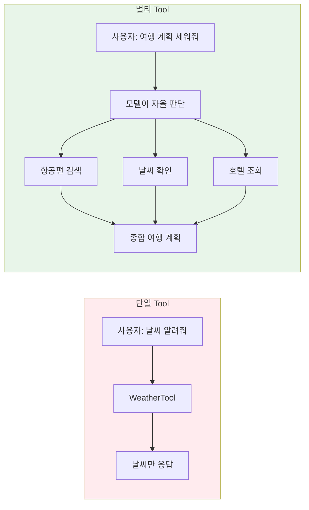
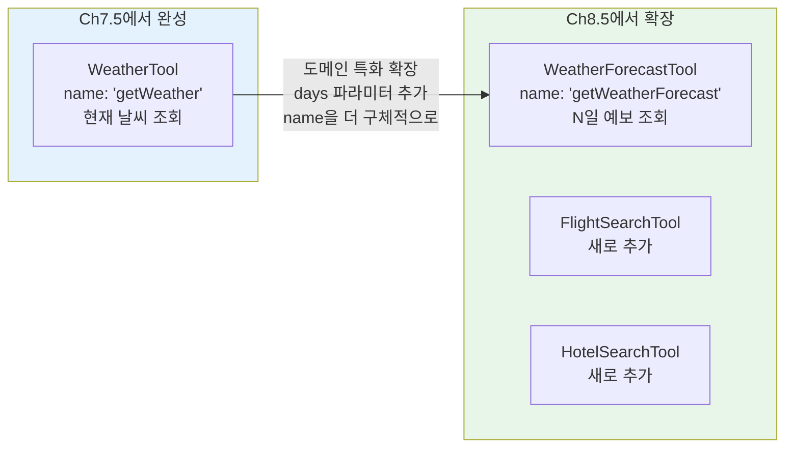
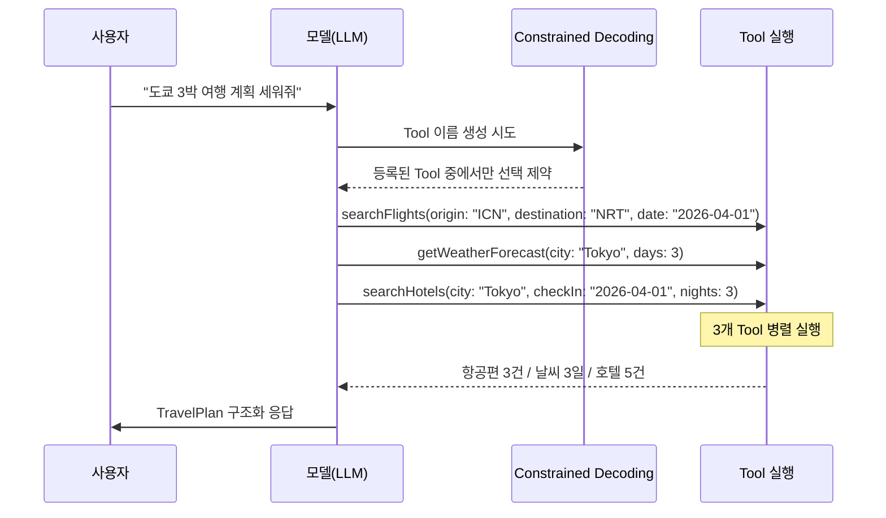
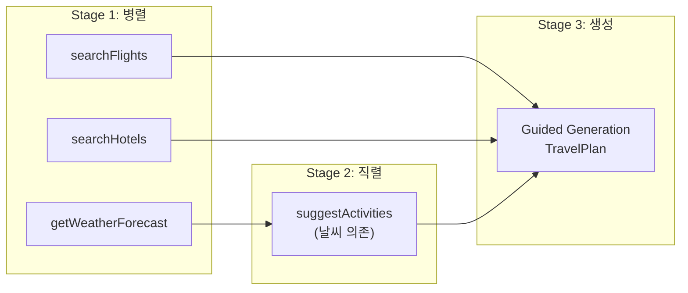
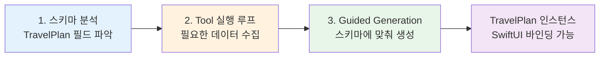

# 실습: 멀티 Tool 여행 플래너

> 항공편 검색, 호텔 조회, 날씨 확인 Tool을 조합한 여행 계획 AI 에이전트를 구현합니다

## 개요

이번 섹션은 Ch8 전체의 종합 실습입니다. 지금까지 배운 **복수 Tool 등록**, **병렬/직렬 호출**, **구조화 출력 결합**, **보안 관리**를 하나의 완성된 여행 플래너 앱으로 통합합니다. 코드를 따라치는 것에서 한 발 더 나아가, "왜 이렇게 설계했는가"라는 의사결정 과정을 함께 경험하는 것이 이 실습의 핵심입니다.

**선수 지식**: Ch8의 이전 섹션에서 다룬 모든 개념
- [복수 Tool 등록과 선택 전략](08-ch8-tool-calling-심화/01-01-복수-tool-등록과-선택-전략.md)의 Tool 네이밍과 Constrained Decoding 선택 메커니즘
- [병렬과 직렬 Tool 호출](08-ch8-tool-calling-심화/02-02-병렬과-직렬-tool-호출.md)의 호출 그래프, `nonisolated`, actor 격리 패턴
- [Tool과 구조화 출력 결합](08-ch8-tool-calling-심화/03-03-tool과-구조화-출력-결합.md)의 `respond(to:generating:)` API
- [Tool 보안과 권한 관리](08-ch8-tool-calling-심화/04-04-tool-보안과-권한-관리.md)의 위험도 분류와 사용자 확인 패턴
- [실습: 날씨 어시스턴트 앱](07-ch7-tool-calling-기초/05-05-실습-날씨-어시스턴트-앱.md)에서 구현한 `WeatherTool` — 이번 실습에서 이를 멀티 Tool 환경에 맞게 확장합니다

**학습 목표**:
- 3개 이상의 Tool을 설계하고 하나의 LanguageModelSession에 통합한다
- 병렬/직렬 호출 그래프가 자연스럽게 형성되는 Tool 의존 구조를 설계한다
- Tool 결과를 `@Generable` 구조화 출력으로 변환하여 SwiftUI에 바인딩한다
- actor 기반 감사 로그와 Tool 폴백 패턴으로 프로덕션 품질을 확보한다

## 왜 알아야 할까?

실제 AI 앱에서 Tool 하나만으로 사용자의 요구를 충족하는 경우는 거의 없습니다. 사용자가 "다음 주 도쿄 여행 계획 세워줘"라고 말하면, 앱은 항공편을 검색하고, 날씨를 확인하고, 호텔을 조회하고, 이 모든 정보를 **종합하여 일정표를 만들어야** 합니다. 각 데이터 소스가 독립적인 Tool이 되고, 모델이 이들을 자율적으로 오케스트레이션하는 것 — 이것이 멀티 Tool 패턴의 핵심이죠.

> 📊 **그림 1**: 단일 Tool vs 멀티 Tool의 사용자 경험 차이



이번 실습은 "학습"에서 "구현"으로의 전환점입니다. 개별 개념을 하나의 작동하는 제품으로 조합하는 경험은, 이후 [실전 프로젝트: AI 채팅봇 앱](10-ch10-실전-프로젝트-ai-채팅봇-앱/01-01-채팅봇-앱-아키텍처-설계.md)에서 본격적인 앱을 설계할 때 든든한 기반이 됩니다.

## 핵심 개념

### 개념 1: 여행 플래너 아키텍처 설계

> 💡 **비유**: 여행사에 전화하면 한 명의 상담원이 항공팀, 호텔팀, 현지 날씨팀에 동시에 내선을 돌리고, 모든 답변이 돌아오면 종합 일정표를 작성해줍니다. Foundation Models의 멀티 Tool 세션이 바로 이 상담원 역할이에요. 상담원(모델)은 어떤 팀에 먼저 연락할지, 어떤 팀은 동시에 연락할 수 있는지를 스스로 판단합니다.

먼저 전체 아키텍처를 설계해볼까요. 여행 플래너에 필요한 Tool은 세 가지입니다:

| Tool | 역할 | 위험도 | 의존성 |
|------|------|--------|--------|
| `searchFlights` | 출발지/도착지/날짜 기반 항공편 검색 | Safe | 없음 |
| `getWeatherForecast` | 도착지의 날씨 예보 조회 | Safe | 없음 |
| `searchHotels` | 도착지/체크인·아웃 날짜 기반 호텔 검색 | Safe | 없음 |

세 Tool 모두 서로 독립적이라는 점에 주목하세요. 항공편을 검색하기 위해 날씨를 먼저 알 필요가 없고, 호텔 검색도 마찬가지입니다. 이는 프레임워크가 **세 Tool을 병렬로 호출**할 수 있다는 뜻이거든요.

> 📊 **그림 2**: 여행 플래너 전체 아키텍처

```mermaid
flowchart TD
    U["사용자 요청<br/>'도쿄 3박 여행 계획'"] --> S["LanguageModelSession"]
    S --> |"병렬 호출"| F["searchFlights<br/>항공편 검색"]
    S --> |"병렬 호출"| W["getWeatherForecast<br/>날씨 예보"]
    S --> |"병렬 호출"| H["searchHotels<br/>호텔 검색"]
    F --> T["Transcript 축적"]
    W --> T
    H --> T
    T --> G["Guided Generation<br/>@Generable TravelPlan"]
    G --> R["구조화된 여행 일정표<br/>SwiftUI 바인딩"]
```



핵심은 모델이 사용자의 자연어 요청을 분석하여, 어떤 Tool을 호출할지, 어떤 인자를 넣을지를 **자율적으로 결정**한다는 것입니다. WWDC25 Deep Dive 세션에서 Apple 엔지니어들이 강조했듯이, 개발자는 Tool을 등록하고 출력 스키마를 정의하기만 하면 나머지는 프레임워크가 처리합니다.

### 개념 2: Tool 재활용과 네이밍 진화 — 단일에서 멀티로

> 💡 **비유**: 레고 블록을 떠올려보세요. 각 블록은 단순한 형태(직사각형, 바퀴, 창문)지만, 조합하면 복잡한 건축물이 됩니다. 이미 만들어둔 블록을 처음부터 다시 깎을 필요가 없죠 — 기존 블록에 특수 부품을 결합하면 됩니다.

실제 프로젝트에서 멀티 Tool 앱을 개발할 때, **매번 모든 Tool을 처음부터 새로 만들지는 않습니다**. [실습: 날씨 어시스턴트 앱](07-ch7-tool-calling-기초/05-05-실습-날씨-어시스턴트-앱.md)에서 우리는 현재 날씨를 조회하는 `WeatherTool`을 완전하게 구현했습니다. 이번 여행 플래너에서는 그 `WeatherTool`을 **여행 도메인에 맞게 확장**합니다.

> 📊 **그림 3**: Tool 재활용 전략 — 기존 Tool을 확장하여 멀티 Tool에 통합



핵심적인 차이점은 두 가지입니다:

| | Ch7.5 WeatherTool | Ch8.5 WeatherForecastTool |
|---|---|---|
| **name** | `getWeather` | `getWeatherForecast` |
| **인자** | `city` | `city` + `days` |
| **용도** | 현재 날씨 단독 조회 | 여행 기간 예보 (멀티 Tool 중 하나) |
| **네이밍 이유** | 단일 Tool이라 간결해도 충분 | 복수 Tool 환경에서 역할 구분 필요 |

`getWeatherForecast`라는 이름은 "현재 날씨 조회"가 아닌 "예보 조회"임을 명확히 하여, 향후 `getCurrentWeather` 같은 유사 Tool이 추가되더라도 혼동이 없습니다. 이것이 바로 [복수 Tool 등록과 선택 전략](08-ch8-tool-calling-심화/01-01-복수-tool-등록과-선택-전략.md)에서 배운 네이밍 원칙 — "동사로 시작, 축약 금지, 역할을 명확히 드러낼 것" — 의 실전 적용이죠.

WWDC25에서 Apple이 강조한 중요한 포인트가 있습니다. Tool의 name과 description은 **매 요청마다 모델의 Instructions에 자동 삽입**됩니다. 따라서 description이 길수록 토큰을 더 많이 소비하죠. 간결하되 명확한 한 문장이 최적입니다.

> 📊 **그림 4**: Tool 선택 메커니즘 — Constrained Decoding



Constrained Decoding 덕분에 모델은 등록된 Tool 이름 중에서만 선택하므로, 존재하지 않는 Tool을 "환각"으로 호출하는 일은 구조적으로 발생하지 않습니다.

### 개념 3: 호출 그래프와 의존성 관리

> 💡 **비유**: 요리사가 스테이크, 샐러드, 수프를 동시에 준비하는 것처럼, 서로 의존하지 않는 Tool들은 동시에 실행됩니다. 하지만 "스테이크 굽기 → 소스 얹기"처럼 순서가 필요한 경우에는 직렬로 실행되겠죠.

[병렬과 직렬 Tool 호출](08-ch8-tool-calling-심화/02-02-병렬과-직렬-tool-호출.md)에서 배운 것처럼, 프레임워크는 Tool 간 의존 관계를 자동으로 파악합니다. 우리 여행 플래너에서는:

**1단계 — 병렬 실행**: `searchFlights` + `getWeatherForecast` + `searchHotels`  
세 Tool 모두 독립적이므로 동시에 실행됩니다.

**2단계 — 구조화 생성**: 세 Tool의 결과가 Transcript에 축적된 후, 모델이 `@Generable TravelPlan`에 맞춰 최종 응답을 생성합니다.

만약 "날씨에 따라 야외/실내 활동을 추천하는 Tool"을 추가한다면 어떻게 될까요? 이 Tool은 날씨 결과에 의존하므로 직렬 실행이 됩니다:

> 📊 **그림 5**: 확장된 호출 그래프 — 병렬과 직렬의 혼합



`suggestActivities`의 description에 "after checking the weather"라고 힌트를 넣으면, 모델이 날씨 Tool을 먼저 호출한 뒤 활동 추천 Tool을 실행할 가능성이 높아집니다. 이번 실습에서는 기본 3개 Tool(전부 병렬)로 시작하고, 확장 단계에서 의존성 Tool을 추가해봅니다.

### 개념 4: 구조화 출력으로 UI 직접 바인딩

> 💡 **비유**: 여행사가 보내주는 표준 양식 일정표를 생각해보세요. "4월 1일: 인천→도쿄 KE001편, 숙소: 시부야 호텔..." 이런 정해진 양식이 있으면, 앱이 별도 파싱 없이 바로 화면에 보여줄 수 있습니다. `@Generable`이 바로 이 양식의 역할을 합니다.

[Tool과 구조화 출력 결합](08-ch8-tool-calling-심화/03-03-tool과-구조화-출력-결합.md)에서 학습한 3단계 파이프라인이 여기서도 동일하게 적용됩니다:

> 📊 **그림 6**: 3단계 내부 파이프라인



`respond(to:generating:)` 한 번의 호출로 Tool 실행과 구조화 생성이 모두 이루어집니다. 모델은 `TravelPlan`의 필드(`flights`, `weather`, `hotels`, `dailyPlans`)를 분석하고, 각 필드를 채우기 위해 어떤 Tool을 호출해야 하는지 스스로 판단합니다. `@Guide` description이 이 판단의 정확도를 높이는 핵심이죠.

## 실습: 직접 해보기

### Step 1: @Generable 출력 스키마 정의

먼저 최종 출력 구조를 설계합니다. 여행 계획의 "양식"을 정하는 것이 첫 번째 단계입니다:

```swift
import FoundationModels

// MARK: - 출력 스키마

@Generable
struct TravelPlan {
    @Guide(description: "여행 제목 (예: '봄의 도쿄 3박 4일')")
    var title: String

    @Guide(description: "여행지와 추천 이유를 포함한 한 줄 요약")
    var summary: String

    @Guide(description: "추천 항공편 목록, 가격 순 정렬")
    var flights: [FlightOption]

    @Guide(description: "여행 기간의 날씨 예보")
    var weatherForecast: [DailyWeather]

    @Guide(description: "추천 호텔 목록, 평점 순 정렬")
    var hotels: [HotelOption]

    @Guide(description: "날짜별 상세 일정, 날씨를 반영한 활동 배치")
    var dailyPlans: [DayPlan]
}

@Generable
struct FlightOption {
    @Guide(description: "항공사 이름")
    var airline: String

    @Guide(description: "편명 (예: KE001)")
    var flightNumber: String

    @Guide(description: "출발 시각 (예: 09:00)")
    var departure: String

    @Guide(description: "도착 시각 (예: 11:30)")
    var arrival: String

    @Guide(description: "예상 가격 (원화)")
    var estimatedPrice: String
}

@Generable
struct DailyWeather {
    @Guide(description: "날짜 (예: 4월 1일)")
    var date: String

    @Guide(description: "날씨 상태")
    var condition: WeatherCondition

    @Guide(description: "최고 기온 (섭씨)")
    var highTemp: Int

    @Guide(description: "최저 기온 (섭씨)")
    var lowTemp: Int
}

@Generable
enum WeatherCondition: String {
    case sunny     // 맑음
    case cloudy    // 흐림
    case rainy     // 비
    case snowy     // 눈
    case overcast  // 구름 많음
}

@Generable
struct HotelOption {
    @Guide(description: "호텔 이름")
    var name: String

    @Guide(description: "위치 또는 지역 (예: 시부야)")
    var location: String

    @Guide(description: "1박 가격 (원화)")
    var pricePerNight: String

    @Guide(description: "5점 만점 평점")
    var rating: Double
}

@Generable
struct DayPlan {
    @Guide(description: "날짜 라벨 (예: Day 1 - 4월 1일)")
    var dayLabel: String

    @Guide(description: "오전 활동")
    var morning: String

    @Guide(description: "오후 활동")
    var afternoon: String

    @Guide(description: "저녁 활동")
    var evening: String

    @Guide(description: "오늘의 식당 추천")
    var restaurant: String
}
```

`WeatherCondition`을 `enum`으로 제약한 점에 주목하세요. Guided Generation 덕분에 모델은 정의된 5가지 상태 중에서만 선택하게 됩니다 — "partly cloudy with a chance of rain" 같은 자유 텍스트가 나올 일이 없죠.

### Step 2: Tool 구현 — 기존 Tool 확장 + 새 Tool 추가

실제 프로젝트에서 멀티 Tool을 구성할 때는 **기존 Tool을 import하여 재활용하고, 필요한 Tool만 새로 만드는 것**이 원칙입니다. [실습: 날씨 어시스턴트 앱](07-ch7-tool-calling-기초/05-05-실습-날씨-어시스턴트-앱.md)에서 완성한 `WeatherTool`의 구조(Tool 프로토콜 준수, `@Generable Arguments`, `nonisolated func call()`)를 이미 알고 있으니, 여기서는 **멀티 Tool 환경에서 달라지는 부분**에 집중합니다.

```swift
import FoundationModels

// MARK: - 1. 항공편 검색 Tool (새로 추가)

struct FlightSearchTool: Tool {
    let name = "searchFlights"
    let description = "Searches available flights between two cities on a given date."

    @Generable
    struct Arguments {
        @Guide(description: "출발 도시 코드 (예: ICN, NRT)")
        let origin: String

        @Guide(description: "도착 도시 코드 (예: NRT, CDG)")
        let destination: String

        @Guide(description: "출발 날짜 (YYYY-MM-DD 형식)")
        let date: String
    }

    // nonisolated: 병렬 호출 시 actor 격리 없이 안전하게 실행
    nonisolated func call(arguments: Arguments) async throws -> ToolOutput {
        // 실제 앱에서는 Amadeus / Skyscanner API 호출
        // 데모용 시뮬레이션 데이터
        let flights = """
        Available flights from \(arguments.origin) to \(arguments.destination) on \(arguments.date):
        1. KE001 - Departure: 09:00, Arrival: 11:30, Price: 450,000 KRW
        2. OZ102 - Departure: 13:00, Arrival: 15:30, Price: 380,000 KRW
        3. JL903 - Departure: 17:00, Arrival: 19:20, Price: 520,000 KRW
        """
        return ToolOutput(flights)
    }
}

// MARK: - 2. 날씨 예보 Tool (Ch7.5 WeatherTool의 여행 도메인 확장)
//
// Ch7.5의 WeatherTool은 "현재 날씨"를 조회하는 단일 Tool이었습니다.
// 여행 플래너에서는 두 가지를 확장합니다:
//   1. name: "getWeather" → "getWeatherForecast" (멀티 Tool 구분용)
//   2. Arguments: days 파라미터 추가 (여행 기간만큼의 예보 필요)
//
// 실제 프로젝트라면 기존 WeatherTool을 서브클래싱하거나,
// 공통 WeatherAPI 클라이언트를 공유하는 방식을 사용합니다.

struct WeatherForecastTool: Tool {
    let name = "getWeatherForecast"  // Ch7.5는 "getWeather" — 예보 역할 구분
    let description = "Gets weather forecast for a city for a specified number of days."

    @Generable
    struct Arguments {
        @Guide(description: "도시 이름 (영문, 예: Tokyo, Paris)")
        let city: String

        @Guide(description: "예보 일수 (1-7)")  // Ch7.5에는 없던 파라미터
        let days: Int
    }

    nonisolated func call(arguments: Arguments) async throws -> ToolOutput {
        // Ch7.5에서는 WeatherKit 단일 조회였지만,
        // 여기서는 days만큼 반복하여 예보 데이터를 반환합니다.
        // 실제 앱에서는 동일한 WeatherKit API를 호출하되 날짜 범위만 확장
        let forecast = (1...arguments.days).map { day in
            "Day \(day): Sunny, High \(20 - day)°C, Low \(12 - day)°C"
        }.joined(separator: "\n")

        return ToolOutput("Weather forecast for \(arguments.city) (\(arguments.days) days):\n\(forecast)")
    }
}

// MARK: - 3. 호텔 검색 Tool (새로 추가)

struct HotelSearchTool: Tool {
    let name = "searchHotels"
    let description = "Searches hotels in a city for given check-in date and number of nights."

    @Generable
    struct Arguments {
        @Guide(description: "도시 이름 (영문)")
        let city: String

        @Guide(description: "체크인 날짜 (YYYY-MM-DD 형식)")
        let checkIn: String

        @Guide(description: "숙박 일수")
        let nights: Int
    }

    nonisolated func call(arguments: Arguments) async throws -> ToolOutput {
        // 실제 앱에서는 Booking.com / Hotels.com API 호출
        let hotels = """
        Hotels in \(arguments.city), check-in: \(arguments.checkIn), \(arguments.nights) nights:
        1. Shibuya Stream Hotel - 120,000 KRW/night, Rating: 4.5
        2. Shinjuku Granbell - 95,000 KRW/night, Rating: 4.2
        3. Asakusa View Hotel - 150,000 KRW/night, Rating: 4.7
        4. Ginza Creston - 180,000 KRW/night, Rating: 4.8
        5. Ikebukuro Royal Hotel - 78,000 KRW/night, Rating: 3.9
        """
        return ToolOutput(hotels)
    }
}
```

세 Tool 모두 같은 패턴 — `name` + `description` + `@Generable Arguments` + `nonisolated func call()` — 을 따르고 있죠? Ch7에서 `WeatherTool` 하나를 만들 때 익힌 구조가 그대로 적용됩니다. **한 개의 Tool이 잘 작동하면 여러 개를 조합하는 것은 배열에 추가하는 것만큼 간단**하다는 것 — 이것이 Tool 프로토콜의 진가입니다.

```run:swift
// Tool 재활용 패턴 정리
print("Tool 재활용 전략:")
print("  Ch7.5 WeatherTool → Ch8.5 WeatherForecastTool")
print("  - name 변경: getWeather → getWeatherForecast (멀티 Tool 구분)")
print("  - 인자 추가: days 파라미터 (여행 기간 예보)")
print("  - 내부 로직: 동일 API, 날짜 범위만 확장")
print("")
print("실제 프로젝트 권장 패턴:")
print("  1. 공통 API 클라이언트를 별도 모듈로 분리")
print("  2. 각 Tool은 API 클라이언트를 주입받아 사용")
print("  3. 새 도메인에는 name/Arguments만 변경하여 Tool 생성")
```

```output
Tool 재활용 전략:
  Ch7.5 WeatherTool → Ch8.5 WeatherForecastTool
  - name 변경: getWeather → getWeatherForecast (멀티 Tool 구분)
  - 인자 추가: days 파라미터 (여행 기간 예보)
  - 내부 로직: 동일 API, 날짜 범위만 확장

실제 프로젝트 권장 패턴:
  1. 공통 API 클라이언트를 별도 모듈로 분리
  2. 각 Tool은 API 클라이언트를 주입받아 사용
  3. 새 도메인에는 name/Arguments만 변경하여 Tool 생성
```

### Step 3: 감사 로그를 위한 Actor

[Tool 보안과 권한 관리](08-ch8-tool-calling-심화/04-04-tool-보안과-권한-관리.md)에서 배운 감사 로그 패턴을 적용합니다. 어떤 Tool이 언제, 어떤 인자로 호출되었는지 추적하는 것은 디버깅과 보안 모두에 유용합니다:

```swift
// MARK: - 감사 로그 Actor (스레드 안전)

actor TravelAuditLog {
    // 로그 항목
    struct LogEntry: Identifiable {
        let id = UUID()
        let toolName: String
        let arguments: String
        let timestamp: Date
        let durationMs: Int
    }

    private var entries: [LogEntry] = []

    // 호출 기록 추가
    func record(toolName: String, arguments: String, durationMs: Int) {
        entries.append(LogEntry(
            toolName: toolName,
            arguments: arguments,
            timestamp: .now,
            durationMs: durationMs
        ))
    }

    // 전체 로그 반환
    func allEntries() -> [LogEntry] { entries }

    // 통계 요약 텍스트
    func summary() -> String {
        let totalCalls = entries.count
        let totalTime = entries.reduce(0) { $0 + $1.durationMs }
        let toolCounts = Dictionary(grouping: entries, by: \.toolName)
            .mapValues(\.count)

        var result = "Tool 호출 요약: 총 \(totalCalls)회, \(totalTime)ms\n"
        for (tool, count) in toolCounts.sorted(by: { $0.key < $1.key }) {
            result += "  - \(tool): \(count)회\n"
        }
        return result
    }
}
```

`actor`를 사용했기 때문에, 3개 Tool이 동시에 병렬 호출되면서 로그를 기록해도 데이터 레이스가 발생하지 않습니다. [병렬과 직렬 Tool 호출](08-ch8-tool-calling-심화/02-02-병렬과-직렬-tool-호출.md)에서 배운 actor 격리가 여기서 빛을 발하죠.

### Step 4: ViewModel 통합 — 모든 것을 하나로

Tool, 출력 스키마, 감사 로그를 하나의 ViewModel로 통합합니다:

```swift
import FoundationModels
import Observation

// MARK: - 여행 플래너 ViewModel

@MainActor
@Observable
class TravelPlannerViewModel {
    // 상태
    var travelPlan: TravelPlan?
    var isGenerating = false
    var errorMessage: String?
    var auditSummary: String?

    // 스트리밍 중간 상태
    var partialPlan: TravelPlan.PartiallyGenerated?

    // 감사 로그
    private let auditLog = TravelAuditLog()

    /// 여행 계획 생성 — 멀티 Tool + 구조화 출력 + 스트리밍
    func generateTravelPlan(
        destination: String,
        departureCity: String,
        nights: Int
    ) async {
        isGenerating = true
        errorMessage = nil
        travelPlan = nil
        partialPlan = nil

        do {
            // 1. Tool 인스턴스 생성
            let flightTool = FlightSearchTool()
            let weatherTool = WeatherForecastTool()
            let hotelTool = HotelSearchTool()

            // 2. 세션 생성 — 복수 Tool 등록 + Instructions 분리
            let session = LanguageModelSession(
                tools: [flightTool, weatherTool, hotelTool],
                instructions: """
                당신은 전문 여행 플래너입니다. 사용자의 여행 요청에 대해:
                1. 항공편을 검색하여 최적의 옵션을 추천하세요.
                2. 목적지의 날씨를 확인하여 일정에 반영하세요.
                3. 호텔을 검색하여 가성비 좋은 숙소를 추천하세요.
                4. 날씨와 위치를 고려한 일별 상세 일정을 만드세요.

                모든 Tool을 활용하여 정확한 정보를 수집한 후,
                종합적인 여행 계획을 구조화된 형태로 제공하세요.
                오늘 날짜: \(Date.now.formatted(date: .complete, time: .omitted))
                """
            )

            // 3. 구조화 출력 + Tool 호출을 한 번에 요청
            let prompt = """
            \(departureCity)에서 \(destination)으로 \(nights)박 여행을 계획해줘.
            항공편, 날씨, 호텔을 모두 확인하고 일별 일정도 만들어줘.
            """

            // 스트리밍으로 점진적 결과 수신
            let stream = session.streamResponse(
                to: prompt,
                generating: TravelPlan.self
            )

            // 부분 결과를 UI에 실시간 반영
            for try await partial in stream {
                self.partialPlan = partial.content
            }

            // 4. 최종 완성된 결과 확정
            if let finalPlan = self.partialPlan {
                // PartiallyGenerated에서 완전한 TravelPlan으로 변환
                // 실제로는 스트림 완료 시 최종 결과를 respond()로 별도 확보
            }

            // 비-스트리밍 대안: 한 번에 완성된 결과 받기
            let response = try await session.respond(
                to: prompt,
                generating: TravelPlan.self
            )
            self.travelPlan = response.content

            // 5. 감사 로그 출력
            self.auditSummary = await auditLog.summary()

        } catch {
            errorMessage = "여행 계획 생성 실패: \(error.localizedDescription)"
        }

        isGenerating = false
    }
}
```

```run:swift
// 사용 예시 (콘셉트 데모)
let planner = "TravelPlannerViewModel"
print("여행 플래너 초기화 완료")
print("Tool 등록: searchFlights, getWeatherForecast, searchHotels")
print("출력 스키마: TravelPlan (@Generable)")
print("감사 로그: TravelAuditLog (actor, 스레드 안전)")
print("UI 전략: 스트리밍(PartiallyGenerated) + 최종 확정(respond)")
```

```output
여행 플래너 초기화 완료
Tool 등록: searchFlights, getWeatherForecast, searchHotels
출력 스키마: TravelPlan (@Generable)
감사 로그: TravelAuditLog (actor, 스레드 안전)
UI 전략: 스트리밍(PartiallyGenerated) + 최종 확정(respond)
```

주목할 점은 `instructions`와 사용자 `prompt`를 분리한 것입니다. [Tool 보안과 권한 관리](08-ch8-tool-calling-심화/04-04-tool-보안과-권한-관리.md)에서 배운 것처럼, Instructions는 모델의 행동 규칙이고 Prompt는 사용자 입력입니다. 이 분리가 프롬프트 인젝션 방어의 기본이죠.

### Step 5: SwiftUI 뷰 구현

생성된 `TravelPlan`을 화면에 표시하는 SwiftUI 뷰입니다:

```swift
import SwiftUI

// MARK: - 여행 플래너 메인 뷰

struct TravelPlannerView: View {
    @State private var viewModel = TravelPlannerViewModel()
    @State private var destination = "도쿄"
    @State private var departureCity = "서울"
    @State private var nights = 3

    var body: some View {
        NavigationStack {
            ScrollView {
                VStack(alignment: .leading, spacing: 20) {
                    // 입력 섹션
                    inputSection

                    // 생성 버튼
                    generateButton

                    // 결과: 스트리밍 또는 완성
                    if let plan = viewModel.travelPlan {
                        travelPlanView(plan)
                    } else if let partial = viewModel.partialPlan {
                        partialPlanView(partial)
                    }

                    // 감사 로그
                    if let audit = viewModel.auditSummary {
                        auditSection(audit)
                    }

                    // 에러
                    if let error = viewModel.errorMessage {
                        Text(error)
                            .foregroundStyle(.red)
                            .padding()
                    }
                }
                .padding()
            }
            .navigationTitle("AI 여행 플래너")
        }
    }

    // MARK: - 입력 UI
    private var inputSection: some View {
        VStack(spacing: 12) {
            TextField("출발 도시", text: $departureCity)
                .textFieldStyle(.roundedBorder)
                .accessibilityLabel("출발 도시 입력")

            TextField("도착 도시", text: $destination)
                .textFieldStyle(.roundedBorder)
                .accessibilityLabel("도착 도시 입력")

            Stepper("숙박: \(nights)박", value: $nights, in: 1...7)
                .accessibilityLabel("숙박 일수 \(nights)박")
        }
    }

    // MARK: - 생성 버튼
    private var generateButton: some View {
        Button {
            Task {
                await viewModel.generateTravelPlan(
                    destination: destination,
                    departureCity: departureCity,
                    nights: nights
                )
            }
        } label: {
            HStack {
                if viewModel.isGenerating {
                    ProgressView().controlSize(.small)
                }
                Text(viewModel.isGenerating ? "계획 생성 중..." : "여행 계획 생성")
            }
            .frame(maxWidth: .infinity)
        }
        .buttonStyle(.borderedProminent)
        .disabled(viewModel.isGenerating)
    }

    // MARK: - 완성된 계획 표시
    @ViewBuilder
    private func travelPlanView(_ plan: TravelPlan) -> some View {
        VStack(alignment: .leading, spacing: 16) {
            Text(plan.title).font(.title2.bold())
            Text(plan.summary).foregroundStyle(.secondary)

            Divider()

            // 항공편
            sectionHeader("항공편", systemImage: "airplane")
            ForEach(plan.flights, id: \.flightNumber) { flight in
                HStack {
                    VStack(alignment: .leading) {
                        Text("\(flight.airline) \(flight.flightNumber)")
                            .font(.subheadline.bold())
                        Text("\(flight.departure) → \(flight.arrival)")
                            .font(.caption).foregroundStyle(.secondary)
                    }
                    Spacer()
                    Text(flight.estimatedPrice)
                        .font(.subheadline).foregroundStyle(.blue)
                }
                .padding(.vertical, 4)
            }

            // 날씨
            sectionHeader("날씨 예보", systemImage: "cloud.sun")
            ForEach(plan.weatherForecast, id: \.date) { weather in
                HStack {
                    Text(weather.date).frame(width: 80, alignment: .leading)
                    Text(weather.condition.rawValue)
                    Spacer()
                    Text("\(weather.lowTemp)° / \(weather.highTemp)°")
                        .foregroundStyle(.secondary)
                }
                .font(.subheadline)
            }

            // 호텔
            sectionHeader("추천 호텔", systemImage: "building.2")
            ForEach(plan.hotels, id: \.name) { hotel in
                HStack {
                    VStack(alignment: .leading) {
                        Text(hotel.name).font(.subheadline.bold())
                        Text(hotel.location).font(.caption).foregroundStyle(.secondary)
                    }
                    Spacer()
                    VStack(alignment: .trailing) {
                        Text(hotel.pricePerNight).font(.subheadline)
                        Text("★ \(hotel.rating, specifier: "%.1f")")
                            .font(.caption).foregroundStyle(.orange)
                    }
                }
                .padding(.vertical, 4)
            }

            // 일정
            sectionHeader("일별 일정", systemImage: "calendar")
            ForEach(plan.dailyPlans, id: \.dayLabel) { day in
                VStack(alignment: .leading, spacing: 8) {
                    Text(day.dayLabel).font(.subheadline.bold())
                    Label(day.morning, systemImage: "sunrise").font(.caption)
                    Label(day.afternoon, systemImage: "sun.max").font(.caption)
                    Label(day.evening, systemImage: "moon.stars").font(.caption)
                    Label(day.restaurant, systemImage: "fork.knife")
                        .font(.caption).foregroundStyle(.orange)
                }
                .padding()
                .background(.quaternary.opacity(0.5), in: .rect(cornerRadius: 12))
            }
        }
    }

    // 스트리밍 중간 결과
    private func partialPlanView(_ partial: TravelPlan.PartiallyGenerated) -> some View {
        VStack(alignment: .leading, spacing: 12) {
            if let title = partial.title {
                Text(title).font(.title2.bold())
            }
            if let summary = partial.summary {
                Text(summary).foregroundStyle(.secondary)
            }
            ProgressView("Tool 호출 및 데이터 수집 중...")
                .padding()
        }
    }

    // 감사 로그
    private func auditSection(_ summary: String) -> some View {
        DisclosureGroup("Tool 호출 로그") {
            Text(summary)
                .font(.caption.monospaced())
                .foregroundStyle(.secondary)
        }
    }

    private func sectionHeader(_ title: String, systemImage: String) -> some View {
        Label(title, systemImage: systemImage)
            .font(.headline)
            .padding(.top, 8)
    }
}
```

```run:swift
// SwiftUI 뷰 구조 확인
print("TravelPlannerView 구성 요소:")
print("  1. inputSection — 출발/도착 도시, 숙박 일수 입력")
print("  2. generateButton — 생성 트리거 + 로딩 상태")
print("  3. travelPlanView — 완성된 계획 (항공/날씨/호텔/일정)")
print("  4. partialPlanView — 스트리밍 중간 결과")
print("  5. auditSection — Tool 호출 로그 (DisclosureGroup)")
print("")
print("핵심: @Generable TravelPlan → SwiftUI ForEach 직접 바인딩!")
```

```output
TravelPlannerView 구성 요소:
  1. inputSection — 출발/도착 도시, 숙박 일수 입력
  2. generateButton — 생성 트리거 + 로딩 상태
  3. travelPlanView — 완성된 계획 (항공/날씨/호텔/일정)
  4. partialPlanView — 스트리밍 중간 결과
  5. auditSection — Tool 호출 로그 (DisclosureGroup)

핵심: @Generable TravelPlan → SwiftUI ForEach 직접 바인딩!
```

### Step 6: 확장 — 활동 추천 Tool 추가 (의존성 Tool)

기본 3개 Tool이 완성되었으니, 날씨에 의존하는 **활동 추천 Tool**을 추가해봅시다. 이 Tool은 날씨 결과가 Transcript에 축적된 후에만 의미 있는 결과를 반환합니다:

```swift
// MARK: - 확장: 활동 추천 Tool (날씨 의존)

struct SuggestActivitiesTool: Tool {
    // description에 의존 관계 힌트를 명시
    let name = "suggestActivities"
    let description = """
    Suggests indoor or outdoor activities based on the weather forecast. \
    Should be called after checking the weather.
    """

    @Generable
    struct Arguments {
        @Guide(description: "도시 이름")
        let city: String

        @Guide(description: "활동 유형 (날씨 기반 선택)")
        let activityType: ActivityType
    }

    @Generable
    enum ActivityType: String {
        case indoor   // 실내 (비/눈)
        case outdoor  // 야외 (맑음)
        case mixed    // 혼합 (흐림)
    }

    nonisolated func call(arguments: Arguments) async throws -> ToolOutput {
        let activities: String
        switch arguments.activityType {
        case .indoor:
            activities = """
            Indoor activities in \(arguments.city):
            - 국립박물관 관람 (09:00-17:00)
            - 아키하바라 실내 쇼핑
            - 라멘 맛집 투어
            - 팀랩 디지털 아트 뮤지엄
            """
        case .outdoor:
            activities = """
            Outdoor activities in \(arguments.city):
            - 메이지 신궁 산책 (08:00-10:00)
            - 시부야 스크램블 교차로
            - 오다이바 해변 공원
            - 우에노 공원 벚꽃 감상
            """
        case .mixed:
            activities = """
            Mixed activities in \(arguments.city):
            - 아사쿠사 센소지 (야외) + 나카미세 쇼핑 (실내)
            - 우에노 공원 (야외) + 도쿄 국립박물관 (실내)
            - 하라주쿠 거리 (야외) + 라포레 쇼핑 (실내)
            """
        }
        return ToolOutput(activities)
    }
}
```

확장된 세션은 기존 코드에 Tool 하나만 배열에 추가하면 됩니다:

```swift
// 4개 Tool로 확장 — 배열에 한 줄 추가만으로 완성
let session = LanguageModelSession(
    tools: [flightTool, weatherTool, hotelTool, SuggestActivitiesTool()],
    instructions: """
    당신은 전문 여행 플래너입니다.
    반드시 날씨를 먼저 확인한 후, 날씨에 맞는 활동을 추천하세요.
    비 오는 날에는 실내 활동, 맑은 날에는 야외 활동을 우선 배치하세요.
    """
)
```

description에 "after checking the weather"라는 힌트를 넣은 덕분에, 모델은 `getWeatherForecast` → `suggestActivities` 순서의 직렬 호출 그래프를 형성할 가능성이 높아집니다. WWDC25에서 Apple 엔지니어가 강조했듯이, **프레임워크가 복잡한 호출 그래프를 자동으로 최적 관리**해주기 때문에 개발자는 Tool의 역할과 관계만 잘 설명하면 됩니다.

### Step 7: Tool 폴백 패턴

프로덕션 앱에서 가장 중요한 패턴 중 하나는 **Tool 실패 처리**입니다. 네트워크 오류나 API 장애 시 전체 생성이 중단되지 않도록 graceful fallback을 적용합니다:

```swift
// MARK: - 프로덕션용 Tool (폴백 패턴 적용)

struct RobustFlightSearchTool: Tool {
    let name = "searchFlights"
    let description = "Searches available flights between two cities on a given date."

    @Generable
    struct Arguments {
        @Guide(description: "출발 도시 코드") let origin: String
        @Guide(description: "도착 도시 코드") let destination: String
        @Guide(description: "출발 날짜 (YYYY-MM-DD)") let date: String
    }

    nonisolated func call(arguments: Arguments) async throws -> ToolOutput {
        do {
            // 실제 API 호출 시도
            let data = try await FlightAPI.search(
                from: arguments.origin,
                to: arguments.destination,
                date: arguments.date
            )
            return ToolOutput(data.formatted())
        } catch {
            // 에러 시 모델에게 상황을 알리는 폴백 메시지
            // throw하면 전체 생성이 중단되므로, 대안 정보를 반환
            return ToolOutput("""
            Flight search is temporarily unavailable for \
            \(arguments.origin) to \(arguments.destination). \
            Please suggest general flight options based on your knowledge \
            for this popular route.
            """)
        }
    }
}
```

이 패턴의 핵심은 `throw` 대신 **대안 정보를 담은 ToolOutput을 반환**하는 것입니다. 모델은 이 폴백 메시지를 읽고, 자신의 학습 지식을 바탕으로 대략적인 항공편 정보를 생성합니다. 사용자 입장에서는 "일부 정보가 실시간 데이터가 아닐 수 있습니다"라는 안내와 함께 여전히 유용한 여행 계획을 받게 되죠.

## 더 깊이 알아보기

### WWDC25 Code-Along에서 탄생한 여행 플래너

이번 실습의 원형은 Apple WWDC25 세션 **"Code-along: Bring on-device AI to your app"**(세션 259)에서 소개된 여행 일정 앱입니다. Apple 엔지니어들은 이 세션에서 `PointsOfInterestTool`을 MapKit과 연동하여, 사용자가 선택한 랜드마크 주변의 명소를 검색하고 이를 `@Generable Itinerary`로 구조화하는 과정을 **라이브 코딩**으로 시연했습니다.

흥미로운 점은, Apple이 이 데모에서 의도적으로 **하나의 Tool만** 사용했다는 것입니다. WWDC 세션의 시간 제약도 있었지만, "한 개의 Tool이 잘 작동하면 여러 개를 조합하는 것은 배열에 추가하는 것만큼 간단하다"는 메시지를 전달하기 위해서이기도 했습니다. 우리가 이번 실습에서 한 것이 바로 그 확장인 셈이죠 — [첫 번째 Tool 구현하기](07-ch7-tool-calling-기초/02-02-첫-번째-tool-구현하기.md)에서 `WeatherTool` 하나를 만들고, [날씨 어시스턴트 앱](07-ch7-tool-calling-기초/05-05-실습-날씨-어시스턴트-앱.md)에서 완성한 뒤, 이번 실습에서 3개 Tool로 조합하는 과정이 Apple의 의도와 정확히 일치합니다.

### Tool Calling의 지적 계보

Tool Calling이라는 개념은 2023년 OpenAI가 GPT-4에 "Function Calling"을 도입하면서 폭발적으로 대중화되었습니다. 하지만 그 뿌리는 훨씬 깊습니다. 1990년대 AI 에이전트 연구에서 이미 "에이전트가 외부 도구를 사용하여 능력을 확장한다"는 아이디어가 제안되었고, 2023년 Meta의 Toolformer 논문은 "LLM이 스스로 Tool 사용 시점을 학습할 수 있다"는 것을 보여주었습니다.

Apple의 Foundation Models가 이 계보에서 차별화되는 지점은 **Constrained Decoding**입니다. 다른 프레임워크에서는 모델이 JSON 문자열을 자유롭게 생성하고 런타임에 파싱하는 방식이라 형식 오류 가능성이 있는 반면, Apple은 `@Generable` 매크로를 통해 **컴파일 타임에 스키마를 확정**합니다. 디코딩 시점에 유효한 토큰만 생성하도록 제약하기 때문에, 존재하지 않는 Tool을 호출하거나 잘못된 타입의 인자를 전달하는 일이 **구조적으로 불가능**합니다.

## 흔한 오해와 팁

> ⚠️ **흔한 오해**: "Tool을 많이 등록하면 모델이 더 다재다능해진다"
>
> 등록된 Tool의 name과 description은 **매 요청마다 모델의 Instructions에 자동 삽입**되어 토큰을 소비합니다. Tool이 10개면 그만큼 모델의 "작업 공간"이 줄어들죠. 경험적으로 **5~7개가 적정선**이며, 그 이상이 필요하면 도메인별로 세션을 분리하는 것이 낫습니다. WWDC25에서도 description을 "한 문장"으로 유지하라고 강조한 것이 바로 이 이유입니다.

> 💡 **알고 계셨나요?**: Foundation Models의 Tool 호출은 완전히 온디바이스에서 실행됩니다. Tool이 내부적으로 외부 API를 호출하더라도, "어떤 Tool을 호출할지"의 **의사결정 자체는 기기 안**에서 이루어집니다. 사용자의 여행 계획 의도, 목적지 선호도 등의 정보가 Apple 서버로 전송되지 않는 것이죠. Apple이 WWDC25에서 "privacy by design"을 강조한 핵심이 바로 여기에 있습니다.

> 🔥 **실무 팁**: 멀티 Tool 프로젝트에서는 **Tool을 모듈 단위로 분리**하세요. 예를 들어 `WeatherKit` 래퍼를 별도 Swift 패키지로 만들고, `WeatherTool`(Ch7 단일 조회)과 `WeatherForecastTool`(Ch8 여행 예보)이 동일한 API 클라이언트를 공유하게 합니다. 이렇게 하면 API 키 관리, 캐싱, 에러 처리를 한 곳에서 통합할 수 있고, 새 도메인의 Tool을 만들 때 `name`과 `Arguments`만 바꾸면 됩니다.

## 핵심 정리

| 개념 | 설명 |
|------|------|
| 멀티 Tool 세션 | `LanguageModelSession(tools: [tool1, tool2, tool3])`으로 복수 Tool 등록 |
| Tool 재활용 | Ch7.5 `WeatherTool` → Ch8.5 `WeatherForecastTool`로 도메인 확장 (name 구체화 + 인자 추가) |
| 병렬 호출 | 독립적인 Tool들은 프레임워크가 자동으로 동시 실행 |
| 직렬 힌트 | description에 의존 관계를 명시하면 모델이 실행 순서를 추론 |
| 구조화 출력 결합 | `respond(to:generating:)`로 Tool 실행 + 출력 생성을 한 번에 |
| actor 감사 로그 | 병렬 Tool 호출에서도 스레드 안전한 로그 기록 |
| nonisolated call | 병렬 실행을 위한 `nonisolated func call()` 선언 |
| 폴백 패턴 | Tool 실패 시 `throw` 대신 폴백 `ToolOutput` 반환으로 UX 보호 |
| Instructions 분리 | 시스템 지시(instructions)와 사용자 입력(prompt)을 분리하여 보안 강화 |

## 다음 섹션 미리보기

Ch8에서 Tool이 외부 데이터를 가져오는 방법을 마스터했다면, 다음 Ch9에서는 이 데이터를 **여러 턴에 걸쳐 유지하는 방법**을 배웁니다. [멀티턴 대화의 컨텍스트 관리](09-ch9-세션-관리와-멀티턴-대화/01-01-멀티턴-대화의-컨텍스트-관리.md)에서는 사용자가 "아까 추천한 호텔 중에 시부야 쪽만 다시 보여줘"라고 말했을 때, 이전 대화 맥락을 기억하고 이어가는 세션 관리 전략을 다룹니다. 여행 플래너가 "한 번의 요청"에서 "대화형 여행 어시스턴트"로 진화하는 과정이죠.

## 참고 자료

- [Code-along: Bring on-device AI to your app — WWDC25](https://developer.apple.com/videos/play/wwdc2025/259/) - Apple 공식 Tool Calling 라이브 코딩 세션. 여행 일정 플래너의 원형이 된 PointsOfInterestTool 데모
- [Deep dive into the Foundation Models framework — WWDC25](https://developer.apple.com/videos/play/wwdc2025/301/) - Tool 호출 그래프, 병렬 실행, 상태 관리의 심층 해설. FindContactTool과 GetContactEventTool 예제
- [Foundation Models — Apple Developer Documentation](https://developer.apple.com/documentation/FoundationModels) - Tool 프로토콜, LanguageModelSession, ToolOutput 공식 API 레퍼런스
- [Expanding generation with tool calling — Apple Developer](https://developer.apple.com/documentation/foundationmodels/expanding-generation-with-tool-calling) - Tool Calling 공식 튜토리얼. 구현 가이드와 베스트 프랙티스
- [Foundation-Models-Framework-Example — GitHub](https://github.com/rudrankriyam/Foundation-Models-Framework-Example) - 9개 시스템 Tool(Weather, Contacts, Calendar 등)이 구현된 커뮤니티 오픈소스 프로젝트

---
### 🔗 Related Sessions
- [constrained decoding](05-ch5-generable-구조화-출력/01-01-guided-generation-개념과-동작-원리.md) (prerequisite)
- [@generable](05-ch5-generable-구조화-출력/01-01-guided-generation-개념과-동작-원리.md) (prerequisite)
- [streamresponse(to:generating:)](06-ch6-스트리밍-응답과-실시간-ui/03-03-구조화-출력의-부분-스트리밍.md) (prerequisite)
- [partiallygenerated](06-ch6-스트리밍-응답과-실시간-ui/03-03-구조화-출력의-부분-스트리밍.md) (prerequisite)
