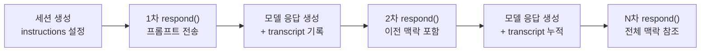
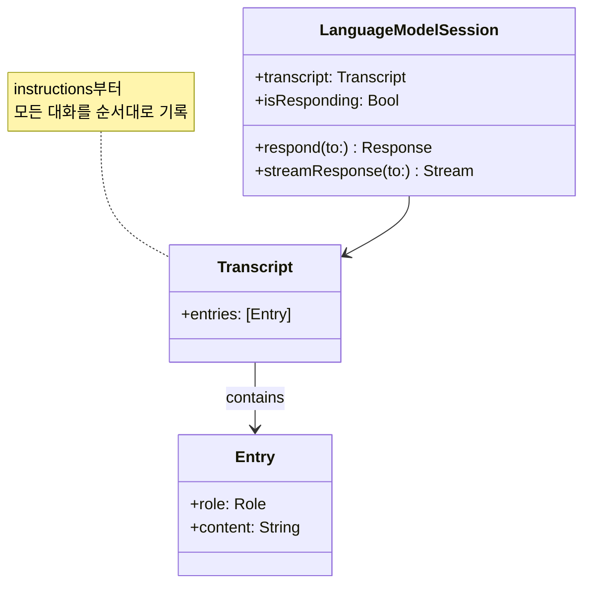
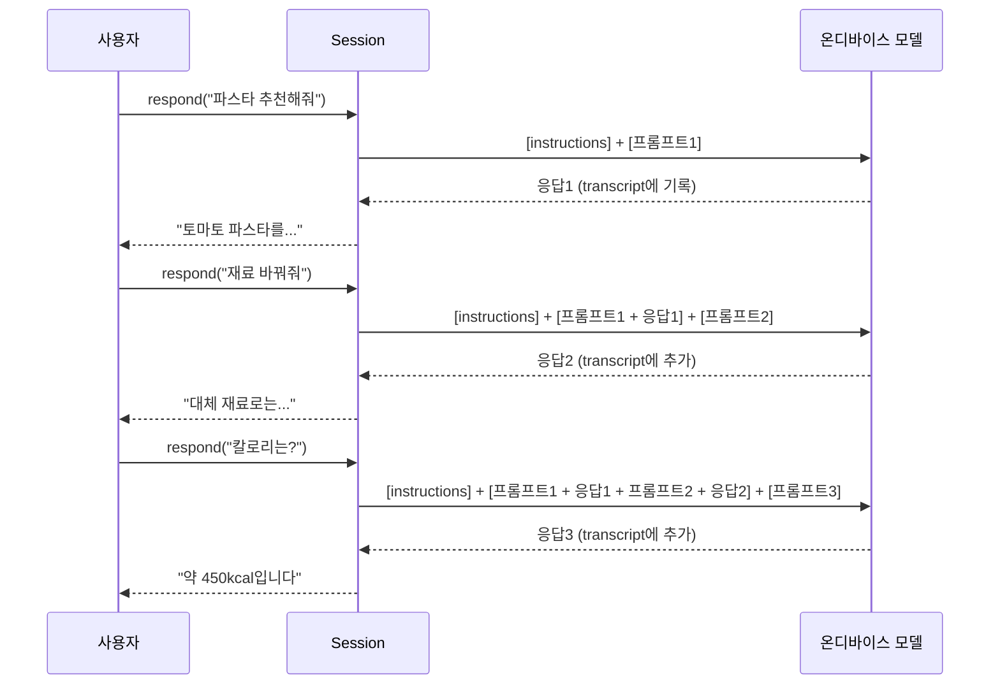
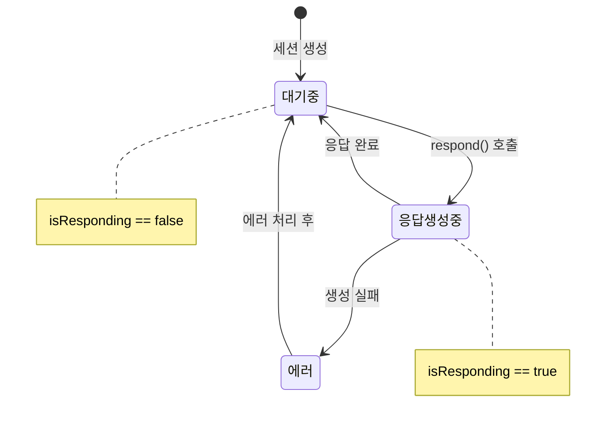
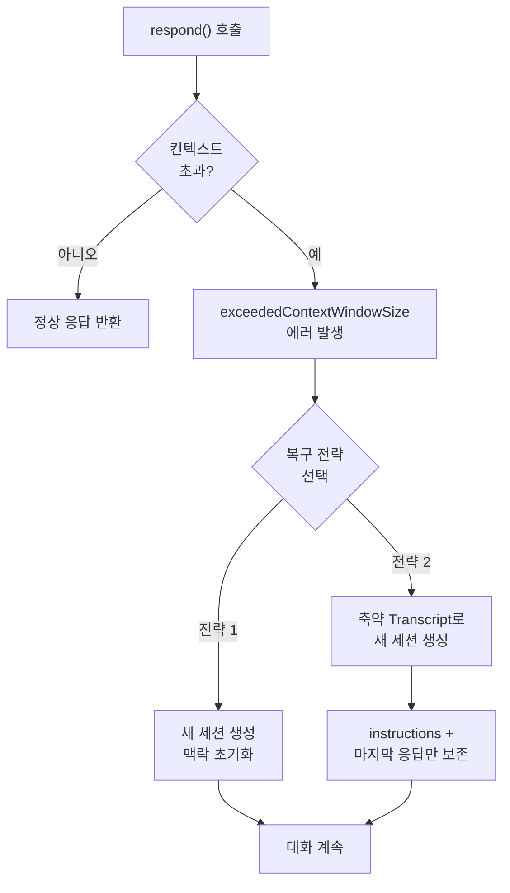

# 멀티턴 대화의 컨텍스트 관리

> LanguageModelSession이 대화 히스토리를 유지하는 원리와 transcript를 활용한 컨텍스트 관리를 학습합니다.

## 개요

이 섹션에서는 Foundation Models 프레임워크의 `LanguageModelSession`이 어떻게 여러 차례의 대화(멀티턴)를 기억하고 맥락을 유지하는지 살펴봅니다. 단일 요청-응답을 넘어, 연속된 `respond()` 호출에서 컨텍스트가 자동으로 누적되는 메커니즘과 `transcript` 속성을 활용한 대화 히스토리 관리를 깊이 있게 다룹니다.

**선수 지식**:
- [LanguageModelSession 생성과 구성](03-ch3-foundation-models-프레임워크-시작하기/02-02-languagemodelsession-생성과-구성.md)에서 배운 세션 초기화 방법
- [첫 번째 텍스트 생성 요청](03-ch3-foundation-models-프레임워크-시작하기/03-03-첫-번째-텍스트-생성-요청.md)에서 배운 `respond()` API 사용법
- Swift Concurrency (async/await) 기본 이해

**학습 목표**:
- `LanguageModelSession`의 상태 유지(stateful) 특성을 이해한다
- 연속 `respond()` 호출에서 컨텍스트가 자동 누적되는 원리를 설명할 수 있다
- `transcript` 속성을 활용하여 대화 히스토리를 조회하고 UI에 표시할 수 있다
- 컨텍스트 초과 에러를 감지하고 적절히 복구하는 패턴을 구현할 수 있다

## 왜 알아야 할까?

ChatGPT나 Siri에게 "아까 그거"라고 말하면 무엇을 가리키는지 알아듣죠? 이게 바로 **멀티턴 대화**입니다. 사용자는 이전 대화를 기억하는 AI를 당연하게 기대합니다.

Foundation Models 프레임워크로 앱에 AI 기능을 넣을 때, 단순히 한 번 질문하고 답을 받는 것으로는 부족합니다. 사용자가 "레시피 추천해줘" → "재료를 바꿔줘" → "칼로리는?" 처럼 이어지는 대화를 할 때, 매번 처음부터 설명하지 않아도 AI가 앞선 맥락을 이해해야 하거든요.

`LanguageModelSession`은 이런 멀티턴 대화를 자동으로 관리해줍니다. 하지만 온디바이스 모델의 제한된 컨텍스트 윈도우 안에서 이를 효과적으로 다루려면, 내부 동작 원리를 정확히 이해해야 합니다.

## 핵심 개념

### 개념 1: 세션의 상태 유지(Stateful) 특성

> 💡 **비유**: `LanguageModelSession`은 **카페 단골 바리스타**와 같습니다. 처음 가면 "아메리카노 한 잔이요"라고 주문하지만, 매일 가다 보면 바리스타가 여러분의 취향을 기억하죠. "오늘도 같은 걸로요?"라고 하면 알아서 만들어줍니다. 세션이 바로 그 "기억"의 역할을 합니다.

`LanguageModelSession`은 **상태를 유지하는(stateful)** 객체입니다. 세션을 생성한 순간부터, 모든 `respond()` 호출의 프롬프트와 응답이 자동으로 내부에 기록됩니다. 모델은 이 기록을 참조하여 다음 응답을 생성하기 때문에, 이전 대화의 맥락을 자연스럽게 이해할 수 있습니다.

> 📊 **그림 1**: 세션의 상태 유지 메커니즘



핵심은 **명시적으로 히스토리를 전달하지 않아도 된다**는 점입니다. 세션 객체가 살아 있는 동안, 컨텍스트는 자동으로 유지됩니다.

```swift
import FoundationModels

// instructions와 함께 세션 생성
let session = LanguageModelSession(
    instructions: "당신은 창의적인 시인입니다. 하이쿠를 써주세요."
)

// 첫 번째 요청 — 모델은 이 프롬프트만 봅니다
let first = try await session.respond(to: "낚시에 대한 하이쿠를 써줘")
print(first.content)
// 고요한 물결 위,
// 아침 안개 속 낚싯줄—
// 희망을 드리우네.

// 두 번째 요청 — "하나 더"가 뭘 의미하는지 모델이 이해합니다
let second = try await session.respond(to: "골프에 대해서도 하나 더 써줘")
print(second.content)
// 새벽 이슬 위,
// 고요한 스윙 한 번에—
// 하늘로 날아라.
```

두 번째 요청에서 "하나 더"라고만 했는데도 모델이 하이쿠를 써야 한다는 것을 알고 있죠? 첫 번째 대화가 transcript에 기록되어 있기 때문입니다.

### 개념 2: Transcript — 대화의 녹취록

> 💡 **비유**: `transcript`는 법정의 **속기록**과 같습니다. 재판에서 일어난 모든 발언이 빠짐없이 기록되듯, 세션의 모든 프롬프트와 응답이 순서대로 기록됩니다. 나중에 "원고가 뭐라고 했죠?"라고 물으면 속기록을 펼쳐보면 되는 것처럼, `transcript`를 통해 대화 히스토리를 언제든 조회할 수 있습니다.

`LanguageModelSession`의 `transcript` 속성은 세션에서 이루어진 모든 상호작용을 `Transcript` 타입으로 저장합니다. `Transcript`는 `entries` 배열을 가지며, 각 엔트리는 프롬프트, 응답, 또는 Tool 호출 결과를 담고 있습니다.

> 📊 **그림 2**: Transcript 내부 구조



```swift
import FoundationModels

let session = LanguageModelSession(
    instructions: "당신은 친절한 요리 도우미입니다."
)

// 대화 진행
let _ = try await session.respond(to: "파스타 레시피 알려줘")
let _ = try await session.respond(to: "재료를 줄일 수 있을까?")

// transcript로 대화 히스토리 확인
let entries = session.transcript.entries
for entry in entries {
    print(entry)
}
// (Instructions) 당신은 친절한 요리 도우미입니다.
// (Prompt) 파스타 레시피 알려줘
// (Response) 간단한 토마토 파스타 레시피를...
// (Prompt) 재료를 줄일 수 있을까?
// (Response) 네, 최소한의 재료로...
```

`transcript.entries`의 첫 번째 항목은 항상 **instructions**(시스템 프롬프트)입니다. 이후 프롬프트와 응답이 교대로 기록되죠.

### 개념 3: 컨텍스트 누적의 동작 원리

> 💡 **비유**: 컨텍스트 누적은 **눈덩이 굴리기**와 같습니다. 처음엔 작은 눈뭉치지만, 굴릴수록 주변의 눈이 붙어 점점 커지죠. 세션도 마찬가지로 대화가 이어질수록 transcript가 커지고, 모델이 참조하는 맥락도 넓어집니다. 하지만 눈덩이가 너무 커지면 굴릴 수 없듯, 세션에도 크기 제한이 있습니다.

`respond()`를 호출할 때마다, 모델은 다음을 **모두** 입력으로 받습니다:

1. **Instructions** (시스템 프롬프트)
2. **이전 transcript** (지금까지의 모든 프롬프트 + 응답)
3. **새 프롬프트** (현재 사용자 입력)

이 전체가 토큰으로 변환되어 모델에 전달됩니다. 따라서 대화가 길어질수록 매 요청마다 처리해야 할 토큰 수가 증가합니다.

> 📊 **그림 3**: 멀티턴 대화에서의 토큰 누적



세 번째 요청 시점에서 모델은 instructions + 프롬프트 3개 + 응답 2개를 **모두** 처리해야 합니다. 이것이 온디바이스 모델의 컨텍스트 윈도우 제약과 맞물려 중요한 설계 고려사항이 됩니다.

### 개념 4: isResponding으로 동시 요청 방지

세션은 한 번에 하나의 요청만 처리할 수 있습니다. `isResponding` 속성을 활용하면 모델이 응답을 생성하는 중에 추가 요청을 보내는 것을 방지할 수 있습니다.

```swift
import SwiftUI
import FoundationModels

struct ChatView: View {
    @State private var session = LanguageModelSession()
    @State private var response: String?
    @State private var userInput = ""
    
    var body: some View {
        VStack {
            if let response {
                Text(response)
            }
            
            TextField("메시지 입력", text: $userInput)
            
            Button("전송") {
                Task {
                    let result = try await session.respond(to: userInput)
                    response = result.content
                }
            }
            // 모델이 응답 중이면 버튼 비활성화
            .disabled(session.isResponding)
        }
    }
}
```

> 📊 **그림 4**: isResponding 상태 전이



### 개념 5: 컨텍스트 초과와 복구 전략

Apple의 온디바이스 모델은 **약 4,096 토큰**의 컨텍스트 윈도우를 가집니다. Instructions + 모든 프롬프트 + 모든 응답의 합이 이 한도를 넘으면 `exceededContextWindowSize` 에러가 발생합니다.

```swift
import FoundationModels

var session = LanguageModelSession(
    instructions: "당신은 친절한 AI 어시스턴트입니다."
)

do {
    let answer = try await session.respond(to: userInput)
    print(answer.content)
} catch LanguageModelSession.GenerationError.exceededContextWindowSize {
    // 컨텍스트 윈도우 초과 — 복구 필요!
    print("대화가 너무 길어졌습니다. 새 세션을 시작합니다.")
}
```

복구 전략에는 두 가지 접근이 있습니다:

**전략 1: 새 세션 생성 (단순하지만 맥락 유실)**

```swift
catch LanguageModelSession.GenerationError.exceededContextWindowSize {
    // 히스토리 없이 새 세션 — 이전 대화 맥락을 잃습니다
    session = LanguageModelSession(
        instructions: "당신은 친절한 AI 어시스턴트입니다."
    )
}
```

**전략 2: 축약된 Transcript로 복원 (권장)**

컨텍스트 윈도우가 초과되면, 시스템이 이전 대화를 자동으로 축약(condense)한 Transcript를 제공합니다. 이 **축약 Transcript(Condensed Transcript)**란, 긴 대화 히스토리에서 핵심 맥락만 압축하여 토큰 예산 안에 맞춘 것을 말합니다. 토큰 예산과 축약 메커니즘에 대한 자세한 내용은 다음 섹션 [토큰 예산과 컨텍스트 윈도우](09-ch9-세션-관리와-멀티턴-대화/02-02-토큰-예산과-컨텍스트-윈도우.md)에서 다룹니다.

아래는 수동으로 축약 Transcript를 구성하여 복구하는 패턴입니다:

```swift
/// 이전 세션의 핵심 맥락만 보존하여 새 세션을 생성합니다
func createCondensedSession(
    from previousSession: LanguageModelSession
) -> LanguageModelSession {
    let allEntries = previousSession.transcript.entries
    var condensedEntries = [Transcript.Entry]()
    
    // instructions는 항상 유지 (첫 번째 엔트리)
    if let firstEntry = allEntries.first {
        condensedEntries.append(firstEntry)
        
        // 마지막 응답만 포함하여 최근 맥락 유지
        if allEntries.count > 1, let lastEntry = allEntries.last {
            condensedEntries.append(lastEntry)
        }
    }
    
    let condensedTranscript = Transcript(entries: condensedEntries)
    // transcript에 instructions가 포함되어 있으므로 별도 지정 불필요
    return LanguageModelSession(transcript: condensedTranscript)
}
```

> 📊 **그림 5**: 컨텍스트 초과 복구 흐름



## 실습: 직접 해보기

실제로 멀티턴 대화를 관리하는 SwiftUI 채팅 뷰를 구현해봅시다. transcript를 활용하여 대화 히스토리를 화면에 표시하고, 컨텍스트 초과 시 자동 복구하는 패턴을 적용합니다.

```swift
import SwiftUI
import FoundationModels

// MARK: - 대화 메시지 모델
struct ChatMessage: Identifiable {
    let id = UUID()
    let role: Role       // .user 또는 .assistant
    let content: String
    let timestamp = Date()
    
    enum Role {
        case user, assistant
    }
}

// MARK: - 채팅 ViewModel
@Observable
class ChatViewModel {
    // 세션 — 멀티턴 대화의 핵심
    private var session: LanguageModelSession
    
    // UI에 표시할 메시지 목록
    var messages: [ChatMessage] = []
    var isLoading = false
    var errorMessage: String?
    
    private let instructions = """
        당신은 친절한 요리 도우미입니다. 
        사용자의 요리 관련 질문에 간결하게 답해주세요.
        """
    
    init() {
        // instructions와 함께 세션 생성
        self.session = LanguageModelSession(
            instructions: instructions
        )
    }
    
    /// 사용자 메시지를 보내고 AI 응답을 받습니다
    func sendMessage(_ text: String) async {
        // 사용자 메시지 추가
        let userMessage = ChatMessage(role: .user, content: text)
        messages.append(userMessage)
        
        isLoading = true
        errorMessage = nil
        
        do {
            // respond() 호출 — transcript에 자동 기록됨
            let response = try await session.respond(to: text)
            
            // AI 응답 추가
            let aiMessage = ChatMessage(
                role: .assistant,
                content: response.content
            )
            messages.append(aiMessage)
            
        } catch LanguageModelSession.GenerationError
                    .exceededContextWindowSize {
            // 컨텍스트 초과 시 축약 복구
            session = createCondensedSession(from: session)
            errorMessage = "대화가 길어져 최근 맥락만 유지합니다."
            
            // 복구 후 재시도
            if let retryResponse = try? await session.respond(to: text) {
                messages.append(ChatMessage(
                    role: .assistant,
                    content: retryResponse.content
                ))
            }
        } catch {
            errorMessage = "오류가 발생했습니다: \(error.localizedDescription)"
        }
        
        isLoading = false
    }
    
    /// 현재 transcript 엔트리 수를 반환합니다
    var transcriptCount: Int {
        session.transcript.entries.count
    }
    
    /// 축약된 Transcript로 새 세션을 생성합니다
    private func createCondensedSession(
        from previous: LanguageModelSession
    ) -> LanguageModelSession {
        let entries = previous.transcript.entries
        var condensed = [Transcript.Entry]()
        
        // instructions (첫 엔트리) 보존
        if let first = entries.first {
            condensed.append(first)
        }
        // 마지막 응답 보존 (최근 맥락 유지)
        if entries.count > 1, let last = entries.last {
            condensed.append(last)
        }
        
        return LanguageModelSession(
            transcript: Transcript(entries: condensed)
        )
    }
}

// MARK: - 채팅 화면
struct MultiTurnChatView: View {
    @State private var viewModel = ChatViewModel()
    @State private var inputText = ""
    
    var body: some View {
        NavigationStack {
            VStack {
                // 대화 히스토리 표시
                ScrollView {
                    LazyVStack(alignment: .leading, spacing: 12) {
                        ForEach(viewModel.messages) { message in
                            MessageBubble(message: message)
                        }
                    }
                    .padding()
                }
                
                // 에러 메시지
                if let error = viewModel.errorMessage {
                    Text(error)
                        .font(.caption)
                        .foregroundStyle(.orange)
                        .padding(.horizontal)
                }
                
                // Transcript 카운트 표시
                Text("Transcript 엔트리: \(viewModel.transcriptCount)")
                    .font(.caption2)
                    .foregroundStyle(.secondary)
                
                // 입력 영역
                HStack {
                    TextField("메시지 입력...", text: $inputText)
                        .textFieldStyle(.roundedBorder)
                    
                    Button {
                        let text = inputText
                        inputText = ""
                        Task { await viewModel.sendMessage(text) }
                    } label: {
                        Image(systemName: "arrow.up.circle.fill")
                            .font(.title2)
                    }
                    .disabled(
                        inputText.isEmpty || viewModel.isLoading
                    )
                }
                .padding()
            }
            .navigationTitle("AI 요리 도우미")
        }
    }
}

// MARK: - 메시지 말풍선
struct MessageBubble: View {
    let message: ChatMessage
    
    var body: some View {
        HStack {
            if message.role == .user { Spacer() }
            
            Text(message.content)
                .padding(12)
                .background(
                    message.role == .user
                        ? Color.blue
                        : Color(.systemGray5)
                )
                .foregroundStyle(
                    message.role == .user ? .white : .primary
                )
                .clipShape(RoundedRectangle(cornerRadius: 16))
            
            if message.role == .assistant { Spacer() }
        }
    }
}
```

```run:swift
// 멀티턴 대화 시뮬레이션 (개념 확인용)
let prompts = [
    "파스타 레시피 알려줘",
    "재료를 3개로 줄일 수 있을까?",
    "칼로리는 얼마나 될까?"
]

print("=== 멀티턴 대화 시뮬레이션 ===")
for (turn, prompt) in prompts.enumerated() {
    print("[\(turn + 1)턴] 사용자: \(prompt)")
    print("  → 모델은 이전 \(turn)개의 대화를 컨텍스트로 참조")
}
print("\n세션이 자동으로 \(prompts.count)턴의 맥락을 유지합니다.")
```

```output
=== 멀티턴 대화 시뮬레이션 ===
[1턴] 사용자: 파스타 레시피 알려줘
  → 모델은 이전 0개의 대화를 컨텍스트로 참조
[2턴] 사용자: 재료를 3개로 줄일 수 있을까?
  → 모델은 이전 1개의 대화를 컨텍스트로 참조
[3턴] 사용자: 칼로리는 얼마나 될까?
  → 모델은 이전 2개의 대화를 컨텍스트로 참조

세션이 자동으로 3턴의 맥락을 유지합니다.
```

## 더 깊이 알아보기

### "대화형 AI"의 탄생 — 컨텍스트 윈도우의 역사

대화형 AI에서 "기억"이라는 개념은 2017년 Transformer 아키텍처의 등장과 함께 본격화되었습니다. 그 이전의 RNN(순환 신경망) 기반 모델은 긴 대화에서 앞부분 내용을 "잊어버리는" 문제(vanishing gradient)로 악명 높았죠.

Transformer의 Self-Attention 메커니즘은 입력 시퀀스의 모든 토큰이 다른 모든 토큰을 직접 참조할 수 있게 만들었습니다. 하지만 이 능력에는 대가가 따랐는데요 — 연산량이 시퀀스 길이의 **제곱**에 비례해서 증가한다는 것입니다. 이것이 바로 "컨텍스트 윈도우"라는 제약이 존재하는 근본적인 이유입니다.

Apple의 온디바이스 모델은 약 3B 파라미터 규모로, iPhone과 iPad의 제한된 메모리와 전력 안에서 동작해야 합니다. 그래서 컨텍스트 윈도우가 약 4,096 토큰으로 비교적 작은 편이죠. 이런 제약 아래에서 Apple은 **KV-Cache 공유** 같은 최적화 기법을 적용하여, 같은 instructions를 공유하는 여러 세션이 캐시를 재활용할 수 있게 했습니다. 이 주제는 [KV-Cache 공유와 메모리 최적화](14-ch14-온디바이스-모델-아키텍처-이해/02-02-kv-cache-공유와-메모리-최적화.md)에서 더 자세히 다룹니다.

### Transcript 복원 — Apple의 독특한 접근

대부분의 LLM API(OpenAI, Anthropic 등)는 매 요청마다 전체 대화 히스토리를 messages 배열로 보내야 합니다. 개발자가 직접 히스토리를 관리해야 하는 거죠.

반면 Apple의 `LanguageModelSession`은 **세션 객체 자체가 상태를 관리**합니다. 더 흥미로운 점은, `Transcript` 객체를 저장했다가 나중에 **새 세션의 초기 상태로 주입**할 수 있다는 것입니다. `LanguageModelSession(transcript:)` 이니셜라이저를 통해, 이전 대화를 이어가는 것이 가능하죠. 이는 앱을 종료했다가 다시 열어도 대화를 복원할 수 있는 강력한 기능입니다. 이 패턴은 [대화 히스토리 영구 저장](09-ch9-세션-관리와-멀티턴-대화/03-03-대화-히스토리-영구-저장.md)에서 본격적으로 다룹니다.

## 흔한 오해와 팁

> ⚠️ **흔한 오해**: "세션을 새로 만들어도 이전 대화를 기억할 것이다"
> 
> 아닙니다! `LanguageModelSession()`으로 새 세션을 생성하면 빈 transcript에서 시작합니다. 이전 세션의 대화는 완전히 사라집니다. 대화를 이어가려면 반드시 같은 세션 인스턴스를 유지하거나, `transcript`를 저장 후 새 세션에 주입해야 합니다.

> 💡 **알고 계셨나요?**: transcript의 첫 번째 엔트리는 항상 `instructions`입니다. 그래서 `LanguageModelSession(transcript:)`으로 세션을 복원할 때 instructions를 별도로 지정할 필요가 없습니다 — transcript 안에 이미 포함되어 있거든요!

> 🔥 **실무 팁**: 프롬프트와 instructions를 혼동하지 마세요. **Instructions**는 세션 생성 시 한 번 설정되는 시스템 수준 지침이고, **Prompt**는 매 `respond()` 호출의 사용자 입력입니다. 사용자 입력을 instructions에 끼워넣으면(string interpolation) **프롬프트 인젝션** 보안 취약점이 생길 수 있습니다. Apple은 모델이 instructions를 prompts보다 우선하도록 훈련했지만, untrusted 입력은 항상 prompt로만 전달하세요.

> 🔥 **실무 팁**: `@State private var session = LanguageModelSession()`으로 선언하면 SwiftUI 뷰의 생명주기 동안 세션이 유지됩니다. 뷰가 재생성되어도 `@State`가 세션 인스턴스를 보존하기 때문에, 멀티턴 대화가 자연스럽게 이어집니다.

## 핵심 정리

| 개념 | 설명 |
|------|------|
| **Stateful 세션** | `LanguageModelSession`은 생성 후 모든 대화를 내부에 자동 기록 |
| **transcript** | 세션의 전체 대화 기록 (instructions + 프롬프트들 + 응답들) |
| **컨텍스트 누적** | 매 `respond()` 호출 시 이전 transcript 전체가 모델에 전달됨 |
| **isResponding** | 모델이 응답 생성 중인지 확인하는 속성, 동시 요청 방지에 사용 |
| **컨텍스트 윈도우** | 온디바이스 모델의 토큰 한도 (~4,096), 초과 시 에러 발생 |
| **축약 Transcript** | 컨텍스트 초과 시 이전 대화를 자동 축약(condense)한 기록 |
| **축약 복구** | `Transcript`에서 instructions + 마지막 응답만 추출하여 새 세션 생성 |
| **Transcript 복원** | `LanguageModelSession(transcript:)`으로 이전 대화를 새 세션에 주입 |

## 다음 섹션 미리보기

이번 섹션에서 컨텍스트가 자동으로 누적되는 원리와 기본적인 복구 전략을 배웠는데요, 한 가지 의문이 남죠 — **"4,096 토큰이면 대체 대화 몇 턴이나 가능한 거야?"** 다음 섹션 [토큰 예산과 컨텍스트 윈도우](09-ch9-세션-관리와-멀티턴-대화/02-02-토큰-예산과-컨텍스트-윈도우.md)에서는 토큰 예산을 계산하고 관리하는 구체적인 전략, Transcript 축약(condensation)의 상세 메커니즘, 그리고 컨텍스트 윈도우를 최대한 효율적으로 활용하는 설계 패턴을 다룹니다.

## 참고 자료

- [Meet the Foundation Models framework — WWDC25](https://developer.apple.com/videos/play/wwdc2025/286/) - LanguageModelSession의 기본 사용법과 멀티턴 대화 패턴을 소개하는 공식 세션
- [Deep dive into the Foundation Models framework — WWDC25](https://developer.apple.com/videos/play/wwdc2025/301/) - transcript 축약 복구, 컨텍스트 윈도우 관리 등 고급 세션 관리 기법을 다루는 심화 세션
- [Foundation Models — Apple Developer Documentation](https://developer.apple.com/documentation/FoundationModels) - LanguageModelSession, Transcript 등 API 레퍼런스
- [Exploring the Foundation Models framework — Create with Swift](https://www.createwithswift.com/exploring-the-foundation-models-framework/) - 세션 생성, transcript, prewarm 등을 코드 예제로 설명하는 튜토리얼
- [Generating content and performing tasks with Foundation Models — Apple Developer](https://developer.apple.com/documentation/FoundationModels/generating-content-and-performing-tasks-with-foundation-models) - 공식 가이드: 콘텐츠 생성과 멀티턴 대화 구현

---
### 🔗 Related Sessions
- [generationoptions](03-ch3-foundation-models-프레임워크-시작하기/04-04-generationoptions와-생성-제어.md) (prerequisite)
