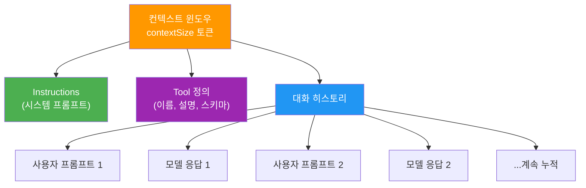
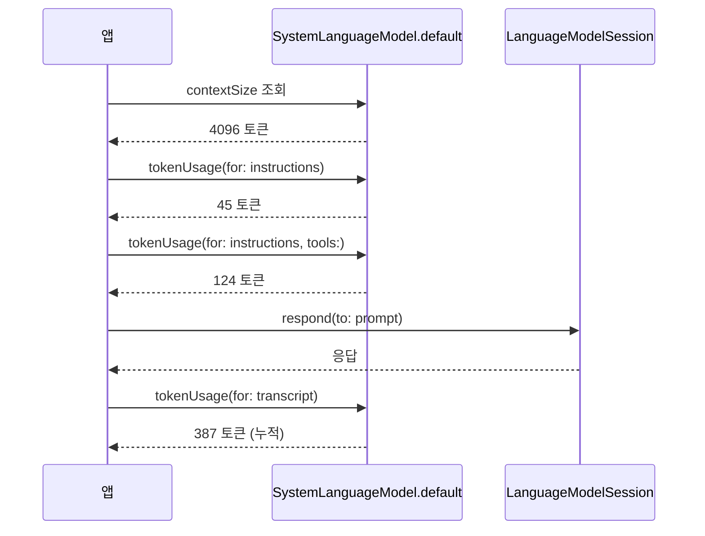
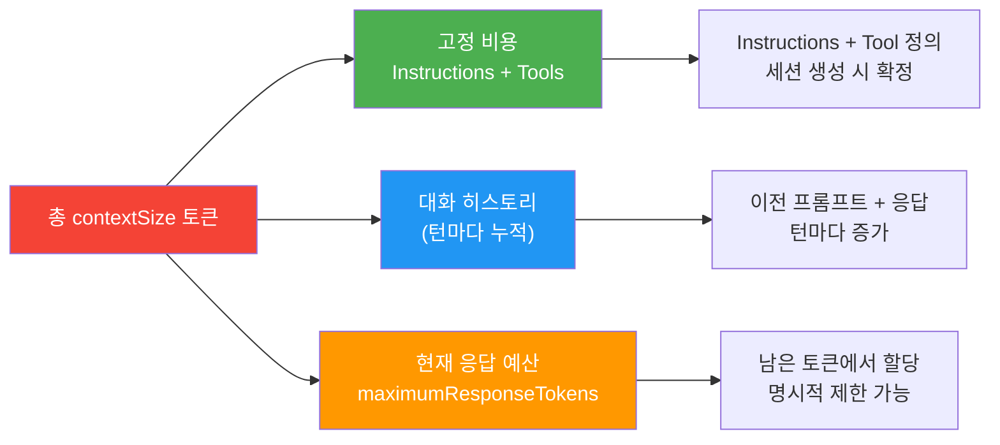
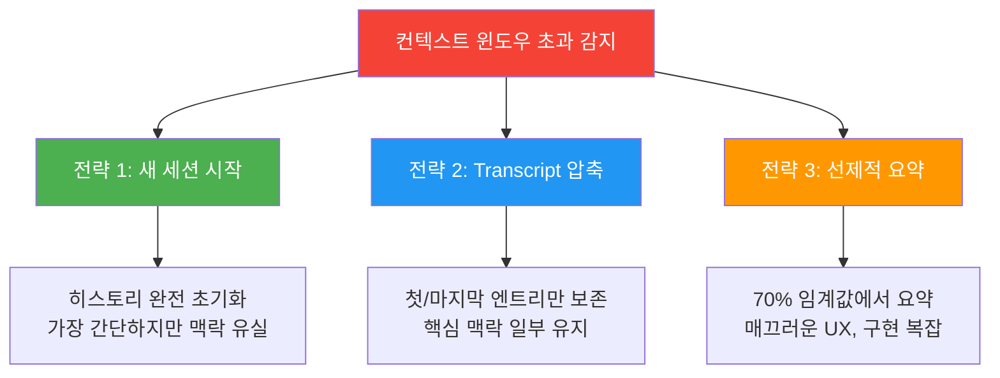
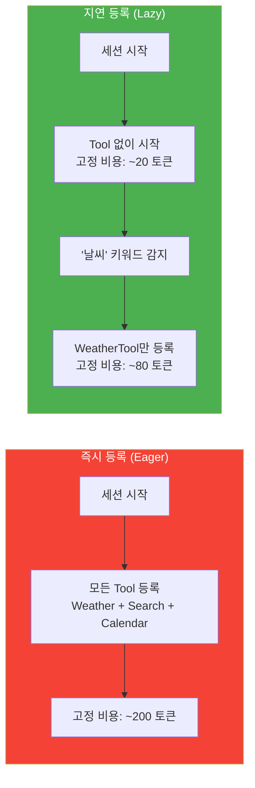

# 토큰 예산과 컨텍스트 윈도우

> 온디바이스 모델의 토큰 한도를 이해하고, 효율적인 대화를 설계하는 전략을 배웁니다

## 개요

이전 섹션 [멀티턴 대화의 컨텍스트 관리](09-ch9-세션-관리와-멀티턴-대화/01-01-멀티턴-대화의-컨텍스트-관리.md)에서 `LanguageModelSession`이 `transcript`를 통해 대화 히스토리를 자동 누적한다는 것을 배웠습니다. 그런데 대화가 길어지면 어떻게 될까요? 무한히 대화를 이어갈 수 있을까요? 답은 "아니오"입니다. 온디바이스 모델에는 엄격한 컨텍스트 윈도우 제한이 존재합니다. 초기 릴리스 기준으로 **약 4,096 토큰**이며, 이 값은 향후 Apple Silicon 세대나 모델 업데이트에 따라 변경될 수 있습니다.

이번 섹션에서는 이 제한의 실체를 파악하고, 토큰을 측정하고, 예산을 관리하는 실전 전략을 다룹니다.

**선수 지식**: `LanguageModelSession`, `transcript`, `exceededContextWindowSize` 에러 (세션 9.1)
**학습 목표**:
- 컨텍스트 윈도우 토큰 제한의 의미와 구성 요소를 이해한다
- `SystemLanguageModel.default.contextSize`와 `tokenUsage(for:)` API로 토큰을 측정한다
- `maximumResponseTokens`로 응답 토큰 예산을 제어한다
- 긴 대화에서 컨텍스트 오버플로를 예방하는 전략을 구현한다

## 왜 알아야 할까?

클라우드 기반 LLM을 써본 개발자라면 128K, 200K 토큰의 넉넉한 컨텍스트 윈도우에 익숙할 겁니다. 그런데 Apple의 온디바이스 모델은 초기 릴리스 기준 **약 4,096 토큰**이 전부입니다. 이건 대략 한국어 기준 1,500~2,000자, 영어 기준 3,000자 정도에 해당하죠.

"겨우 그 정도?"라고 놀랄 수 있지만, 이건 **의도된 설계**입니다. iPhone의 제한된 메모리와 배터리에서 ~3B 파라미터 모델을 실시간으로 돌리려면, 컨텍스트 윈도우를 작게 유지해야 KV-Cache 메모리를 감당할 수 있거든요. 결국 "큰 컨텍스트에 모든 걸 넣는" 전략 대신, **토큰 한 개 한 개를 아껴 쓰는 전략**이 필요합니다.

토큰 예산을 이해하지 못하면 앱이 갑자기 `exceededContextWindowSize` 에러를 던지고, 사용자의 대화가 끊기는 최악의 UX가 됩니다. 반대로 토큰 관리를 잘하면, 제한된 토큰으로도 놀라울 만큼 풍부한 대화 경험을 만들 수 있습니다.

## 핵심 개념

### 개념 1: 컨텍스트 윈도우의 구조 — 토큰 예산의 해부

> 💡 **비유**: 컨텍스트 윈도우를 **고정 크기 주차장**이라고 생각해보세요. 시스템 프롬프트(instructions)가 입구 근처 고정 구역을 차지하고, 사용자 메시지와 AI 응답이 들어올 때마다 나머지 자리를 채웁니다. Tool 정의를 등록하면 그것도 자리를 차지합니다. 주차장이 가득 차면 더 이상 차(토큰)를 받아들일 수 없죠.

Apple의 온디바이스 Foundation Model은 세션당 **고정된 토큰 수**의 컨텍스트 윈도우를 제공합니다. 초기 릴리스 기준으로 약 4,096 토큰이며, 이 예산에는 다음이 **모두** 포함됩니다:

| 구성 요소 | 설명 | 대략적 비용 |
|-----------|------|-------------|
| **Instructions** (시스템 프롬프트) | `LanguageModelSession(instructions:)`로 전달 | 수십~수백 토큰 |
| **사용자 프롬프트** | `respond(to:)` 호출 시 전달 | 메시지마다 누적 |
| **모델 응답** | AI가 생성한 텍스트 | 응답마다 누적 |
| **Tool 정의** | 등록된 Tool의 이름, 설명, 스키마 | Tool당 수십 토큰 |
| **Tool 호출/결과** | 실행된 Tool의 입출력 | 호출마다 추가 |

핵심은 이 모든 것이 **하나의 예산을 공유**한다는 점입니다. 시스템 프롬프트를 200 토큰 쓰면, 대화에 쓸 수 있는 토큰은 그만큼 줄어들어요.

> ⚠️ **흔한 오해**: "컨텍스트 윈도우가 항상 4,096 토큰"이라고 하드코딩하면 안 됩니다. 이 값은 초기 릴리스 기준이며, Apple이 모델이나 하드웨어를 업데이트하면 변경될 수 있습니다. 반드시 `SystemLanguageModel.default.contextSize`로 **런타임에 확인**하세요.

> 📊 **그림 1**: 컨텍스트 윈도우의 구성 — 모든 요소가 하나의 예산을 공유



`contextSize`는 `SystemLanguageModel.default`의 **인스턴스 프로퍼티**입니다. 현재 모델의 컨텍스트 윈도우 크기를 프로그래매틱하게 확인할 수 있습니다:

```run:swift
import FoundationModels

// 모델 인스턴스를 통해 컨텍스트 윈도우 크기 확인
let model = SystemLanguageModel.default
let contextSize = try await model.contextSize
print("컨텍스트 윈도우: \(contextSize) 토큰")
```

```output
컨텍스트 윈도우: 4096 토큰
```

> 🔥 **실무 팁**: 코드에서 `4096`을 리터럴로 하드코딩하지 마세요. Apple이 향후 모델을 업데이트하면 이 값이 달라질 수 있습니다. 항상 `SystemLanguageModel.default.contextSize`를 통해 런타임에 조회하는 습관을 들이세요. 이렇게 하면 모델이 바뀌어도 앱 코드를 수정할 필요가 없습니다.

### 개념 2: 토큰 측정 API — tokenUsage(for:)

> 💡 **비유**: 주차장에 차를 세우기 전에 "이 차가 몇 칸을 차지하는지" 미리 재볼 수 있다면 얼마나 편할까요? `tokenUsage(for:)` 메서드가 바로 그 역할입니다. 보내기 전에 미리 토큰 비용을 확인할 수 있죠.

Apple은 토크나이저를 직접 공개하지 않았지만, `SystemLanguageModel.default`의 인스턴스 메서드로 **토큰 사용량 측정 API**를 제공합니다. 이 API를 활용하면 instructions, 프롬프트, Tool 정의, 전체 transcript의 토큰 수를 측정할 수 있습니다.

> 📊 **그림 2**: tokenUsage API 측정 흐름 — 모든 호출은 model 인스턴스를 통해 이루어짐



```swift
import FoundationModels

// SystemLanguageModel.default 인스턴스를 통해 모든 측정 수행
let model = SystemLanguageModel.default

// 1. Instructions 토큰 측정
let instructions = Instructions("당신은 친절한 여행 가이드입니다. 한국어로 답변하세요.")
let instructionUsage = try await model.tokenUsage(for: instructions)
print("Instructions: \(instructionUsage.tokenCount) 토큰")

// 2. Tool 포함 시 토큰 측정
let tools = [WeatherTool(), SearchTool()]
let withToolsUsage = try await model.tokenUsage(for: instructions, tools: tools)
print("Instructions + Tools: \(withToolsUsage.tokenCount) 토큰")

// 3. 대화 진행 중 transcript 토큰 측정
let session = LanguageModelSession(instructions: instructions)
let _ = try await session.respond(to: "서울 여행 추천해줘")
let transcriptUsage = try await model.tokenUsage(for: session.transcript)
print("현재 대화: \(transcriptUsage.tokenCount) 토큰")
```

여기서 주목할 점이 있습니다. **Tool 정의만 추가해도 토큰 소비가 급증**한다는 거예요. 간단한 Tool 하나가 JSON 스키마로 직렬화되면서 수십 토큰을 잡아먹습니다. 한 실험에 따르면 Instructions만 16 토큰이던 것이 Tool 하나를 추가하니 79 토큰으로 약 5배 증가했다고 합니다.

> ⚠️ **흔한 오해**: "토큰 = 글자 수"라고 생각하기 쉽지만, 그렇지 않습니다. 영어는 대략 1 토큰 ≈ 4자, 한국어는 1 토큰 ≈ 1.5~2자 정도입니다. 이모지는 하나가 여러 토큰으로 분해되기도 하고, 코드 텍스트는 또 다른 비율을 보여요. `tokenUsage(for:)` API를 써서 **항상 실측**하는 습관을 들이세요.

### 개념 3: 응답 토큰 제어 — maximumResponseTokens

> 💡 **비유**: 식당에서 "이번 코스 요리는 5접시까지만"이라고 미리 정해두는 것과 비슷합니다. 모델이 너무 장황하게 대답해서 남은 예산을 다 써버리는 걸 막을 수 있죠.

`GenerationOptions`의 `maximumResponseTokens` 프로퍼티를 설정하면, 모델이 한 번의 응답에서 생성하는 토큰 수의 상한을 지정할 수 있습니다:

```swift
import FoundationModels

let session = LanguageModelSession(instructions: "간결하게 답변하세요.")

// 응답을 최대 200 토큰으로 제한
let options = GenerationOptions(maximumResponseTokens: 200)
let response = try await session.respond(to: "Swift의 역사를 알려줘", options: options)
print(response.content)
```

> 📊 **그림 3**: 토큰 예산 배분 전략 — 고정 비용을 먼저 빼고 남은 예산을 대화와 응답에 분배



토큰 예산을 수식으로 표현하면:

$$R = C - I - T - H$$

- $R$: 현재 응답에 사용 가능한 토큰 (Response budget)
- $C$: 컨텍스트 윈도우 크기 (`contextSize`로 조회)
- $I$: Instructions 토큰
- $T$: Tool 정의 토큰
- $H$: 지금까지 쌓인 대화 히스토리 토큰

이 공식이 의미하는 바는 명확합니다. **대화가 길어질수록 응답 예산이 줄어든다**는 것이죠. 5번째 턴쯤 되면 응답 예산이 거의 바닥날 수 있습니다.

### 개념 4: 컨텍스트 오버플로 대응 전략

> 💡 **비유**: 스마트폰 저장공간이 가득 찼을 때를 떠올려보세요. 오래된 사진을 삭제하거나, 중요한 것만 남기고 정리하거나, 외부 클라우드에 백업하죠. 컨텍스트 오버플로 대응도 같은 원리입니다.

컨텍스트 윈도우는 금방 소진됩니다. 실전에서 사용할 수 있는 대응 전략을 살펴보겠습니다.

> 📊 **그림 4**: 컨텍스트 오버플로 대응 전략 비교



**전략 1: 깨끗한 새 세션**

가장 단순한 방법입니다. 오류가 나면 히스토리 없이 새 세션을 시작합니다:

```swift
var session = LanguageModelSession(instructions: instructions)

do {
    let response = try await session.respond(to: prompt)
    handleResponse(response)
} catch LanguageModelSession.GenerationError.exceededContextWindowSize {
    // 히스토리 없이 새 세션 시작
    session = LanguageModelSession(instructions: instructions)
    // 사용자에게 새 대화 시작을 알림
    notifyUser("대화가 길어져 새로운 세션을 시작합니다.")
}
```

**전략 2: Transcript 압축 (Condensed Transcript)**

이전 세션 [멀티턴 대화의 컨텍스트 관리](09-ch9-세션-관리와-멀티턴-대화/01-01-멀티턴-대화의-컨텍스트-관리.md)에서 다뤘듯이, transcript의 일부만 보존하여 새 세션을 만들 수 있습니다:

```swift
func createCondensedSession(from previousSession: LanguageModelSession) -> LanguageModelSession {
    let allEntries = previousSession.transcript.entries

    // 첫 엔트리(instructions 포함)와 마지막 엔트리만 보존
    var condensed = [Transcript.Entry]()
    if let first = allEntries.first {
        condensed.append(first)
        if allEntries.count > 1, let last = allEntries.last {
            condensed.append(last)
        }
    }

    let condensedTranscript = Transcript(entries: condensed)
    return LanguageModelSession(transcript: condensedTranscript)
}
```

**전략 3: 선제적 요약 (Proactive Summarization)**

오류가 나기 **전에** 미리 대응하는 가장 세련된 전략입니다. 토큰 사용률이 70%를 넘으면 자동으로 대화를 요약합니다:

```swift
@Observable
class SmartChatManager {
    private var session: LanguageModelSession
    private let model = SystemLanguageModel.default
    private let instructions: Instructions
    private let contextThreshold = 0.7 // 70% 임계값

    init(instructions: Instructions) {
        self.instructions = instructions
        self.session = LanguageModelSession(instructions: instructions)
    }

    func send(_ prompt: String) async throws -> String {
        // 응답 전에 토큰 사용률 확인
        let contextSize = try await model.contextSize
        let currentUsage = try await model.tokenUsage(for: session.transcript)
        let usageRatio = Double(currentUsage.tokenCount) / Double(contextSize)

        if usageRatio > contextThreshold {
            // 70% 초과 시 선제적 요약
            try await summarizeAndReset()
        }

        let response = try await session.respond(to: prompt)
        return response.content
    }

    private func summarizeAndReset() async throws {
        // 별도 세션으로 대화 요약 생성
        let summarySession = LanguageModelSession()
        let entries = session.transcript.entries
        let conversationText = entries.map { $0.description }.joined(separator: "\n")

        let summary = try await summarySession.respond(
            to: "다음 대화를 3줄로 요약해줘:\n\(conversationText)"
        )

        // 요약을 포함한 새 세션 시작
        let contextMessage = "이전 대화 요약: \(summary.content)"
        session = LanguageModelSession(instructions: instructions)
        let _ = try await session.respond(to: contextMessage)
    }
}
```

> 🔥 **실무 팁**: 선제적 요약 전략에서 요약용 세션과 메인 세션은 **별도 인스턴스**여야 합니다. 요약 요청 자체도 토큰을 소비하므로, 이미 가득 찬 메인 세션에서 요약을 요청하면 바로 `exceededContextWindowSize` 에러가 발생합니다.

### 개념 5: 지연 등록(Lazy Tool Registration)으로 토큰 절약

> 💡 **비유**: 뷔페에서 모든 접시를 한꺼번에 테이블에 올려놓으면 자리가 금방 꽉 차죠. 먹을 때마다 하나씩 가져오는 게 훨씬 효율적입니다. Tool 등록도 마찬가지예요.

[Ch7. Tool 정의와 @Generable](07-ch7-tool-calling-함수-호출/01-tool-정의와-generable.md)과 [Ch8. Tool 실행과 오류 처리](08-ch8-tool-calling-실전-활용/01-tool-실행과-오류-처리.md)에서 Tool을 정의하고 세션에 등록하는 방법을 배웠습니다. 그런데 모든 Tool을 처음부터 등록하면 고정 토큰 비용이 급증합니다. Tool 3개만 등록해도 200 토큰 이상이 사라지죠.

**지연 등록(Lazy Registration)** 패턴은 대화 맥락에 따라 **필요한 Tool만 동적으로 등록**하여 고정 토큰 비용을 최소화하는 전략입니다:

> 📊 **그림 5**: 지연 등록 vs 즉시 등록 — 토큰 비용 비교



```swift
import FoundationModels

class LazyToolChatManager {
    private let model = SystemLanguageModel.default
    private let instructions: Instructions
    private var currentTools: [any Tool] = []

    // Tool을 키워드에 매핑 — Tool 정의는 Ch7-8 참조
    private let toolRegistry: [String: () -> any Tool] = [
        "날씨": { WeatherTool() },   // Ch7에서 정의한 Tool
        "검색": { SearchTool() },    // Ch8에서 정의한 Tool
        "일정": { CalendarTool() }
    ]

    init(instructions: Instructions) {
        self.instructions = instructions
    }

    func send(_ prompt: String) async throws -> String {
        // 프롬프트 분석 → 필요한 Tool만 등록
        let neededTools = resolveTools(for: prompt)

        // Tool이 변경되면 새 세션 생성 (Tool은 세션 생성 시 등록)
        if neededTools != currentTools {
            currentTools = neededTools
        }

        let session = LanguageModelSession(
            instructions: instructions,
            tools: currentTools
        )

        // 토큰 비용 확인
        let usage = try await model.tokenUsage(
            for: instructions, tools: currentTools
        )
        print("고정 비용: \(usage.tokenCount) 토큰")

        let response = try await session.respond(to: prompt)
        return response.content
    }

    private func resolveTools(for prompt: String) -> [any Tool] {
        toolRegistry.compactMap { keyword, factory in
            prompt.contains(keyword) ? factory() : nil
        }
    }
}
```

이 패턴의 장점은 대화 초반에는 Tool 없이 순수 대화로 토큰을 아끼고, 특정 기능이 필요한 순간에만 해당 Tool을 등록한다는 것입니다. 4,096 토큰이라는 제한된 예산에서 Tool 토큰 비용 절약은 체감이 큽니다.

## 실습: 직접 해보기

토큰 예산을 모니터링하면서 대화하는 `TokenAwareChatViewModel`을 구현해봅시다. 실시간으로 토큰 사용량을 표시하고, 임계값 초과 시 자동으로 대화를 압축합니다.

```swift
import SwiftUI
import FoundationModels

// MARK: - 토큰 인식 채팅 ViewModel

@Observable
class TokenAwareChatViewModel {
    // UI 상태
    var messages: [ChatMessage] = []
    var inputText = ""
    var isLoading = false
    var tokenInfo = TokenInfo()

    // 내부 상태
    private var session: LanguageModelSession
    private let model = SystemLanguageModel.default
    private let instructions = Instructions("당신은 간결하게 답변하는 AI 어시스턴트입니다.")
    private let warningThreshold = 0.6  // 60%에서 경고
    private let criticalThreshold = 0.8 // 80%에서 자동 압축

    struct TokenInfo {
        var contextSize: Int = 0  // 하드코딩 대신 런타임 조회
        var usedTokens: Int = 0
        var usagePercent: Double = 0
        var status: Status = .normal

        enum Status: String {
            case normal = "여유"
            case warning = "주의"
            case critical = "위험"
        }
    }

    struct ChatMessage: Identifiable {
        let id = UUID()
        let role: Role
        let content: String
        let tokenCost: Int // 이 메시지의 토큰 비용

        enum Role { case user, assistant, system }
    }

    init() {
        self.session = LanguageModelSession(instructions: instructions)
    }

    // MARK: - 메시지 전송

    func send() async {
        let prompt = inputText.trimmingCharacters(in: .whitespacesAndNewlines)
        guard !prompt.isEmpty else { return }

        inputText = ""
        isLoading = true
        defer { isLoading = false }

        // 사용자 메시지 추가 (토큰 비용은 응답 후 측정)
        messages.append(ChatMessage(role: .user, content: prompt, tokenCost: 0))

        do {
            // 토큰 사용량 확인 및 필요 시 압축
            try await checkAndManageTokenBudget()

            // 응답 생성
            let response = try await session.respond(
                to: prompt,
                options: GenerationOptions(maximumResponseTokens: 500)
            )

            // 토큰 정보 업데이트
            await updateTokenInfo()

            // 어시스턴트 메시지 추가
            let responseCost = try await measureLastResponseTokens()
            messages.append(ChatMessage(
                role: .assistant,
                content: response.content,
                tokenCost: responseCost
            ))
        } catch LanguageModelSession.GenerationError.exceededContextWindowSize {
            // 긴급 복구: 압축 후 재시도
            await performEmergencyRecovery(prompt: prompt)
        } catch {
            messages.append(ChatMessage(
                role: .system,
                content: "오류: \(error.localizedDescription)",
                tokenCost: 0
            ))
        }
    }

    // MARK: - 토큰 예산 관리

    private func checkAndManageTokenBudget() async throws {
        // contextSize를 런타임에 조회 (하드코딩 금지)
        let contextSize = try await model.contextSize
        let usage = try await model.tokenUsage(for: session.transcript)
        let ratio = Double(usage.tokenCount) / Double(contextSize)

        if ratio > criticalThreshold {
            // 80% 초과 → 자동 압축
            try await compressConversation()
            messages.append(ChatMessage(
                role: .system,
                content: "💬 대화가 길어져 이전 내용을 요약했습니다.",
                tokenCost: 0
            ))
        }
    }

    private func compressConversation() async throws {
        // 최근 2개 엔트리만 보존하여 새 세션 생성
        let entries = session.transcript.entries
        var preserved = [Transcript.Entry]()

        if let first = entries.first {
            preserved.append(first) // instructions 포함
        }
        // 마지막 2개 교환 보존 (최대 4 엔트리)
        let recentCount = min(4, entries.count - 1)
        if recentCount > 0 {
            preserved.append(contentsOf: entries.suffix(recentCount))
        }

        let condensed = Transcript(entries: preserved)
        session = LanguageModelSession(transcript: condensed)
    }

    private func updateTokenInfo() async {
        do {
            // 항상 프로그래매틱하게 조회
            let contextSize = try await model.contextSize
            let usage = try await model.tokenUsage(for: session.transcript)
            let ratio = Double(usage.tokenCount) / Double(contextSize)

            tokenInfo = TokenInfo(
                contextSize: contextSize,
                usedTokens: usage.tokenCount,
                usagePercent: ratio,
                status: ratio > criticalThreshold ? .critical :
                        ratio > warningThreshold ? .warning : .normal
            )
        } catch {
            // 측정 실패 시 기존 상태 유지
        }
    }

    private func measureLastResponseTokens() async throws -> Int {
        let usage = try await model.tokenUsage(for: session.transcript)
        return max(0, usage.tokenCount - tokenInfo.usedTokens)
    }

    private func performEmergencyRecovery(prompt: String) async {
        session = LanguageModelSession(instructions: instructions)
        messages.append(ChatMessage(
            role: .system,
            content: "⚠️ 컨텍스트 초과로 새 세션을 시작합니다.",
            tokenCost: 0
        ))
        // 마지막 프롬프트 재시도
        do {
            let response = try await session.respond(to: prompt)
            messages.append(ChatMessage(
                role: .assistant,
                content: response.content,
                tokenCost: 0
            ))
            await updateTokenInfo()
        } catch {
            messages.append(ChatMessage(
                role: .system,
                content: "복구 실패: \(error.localizedDescription)",
                tokenCost: 0
            ))
        }
    }
}

// MARK: - 토큰 사용량 표시 뷰

struct TokenBudgetBar: View {
    let info: TokenAwareChatViewModel.TokenInfo

    var barColor: Color {
        switch info.status {
        case .normal: .green
        case .warning: .orange
        case .critical: .red
        }
    }

    var body: some View {
        VStack(alignment: .leading, spacing: 4) {
            HStack {
                Text("토큰: \(info.usedTokens) / \(info.contextSize)")
                    .font(.caption)
                Spacer()
                Text(info.status.rawValue)
                    .font(.caption.bold())
                    .foregroundStyle(barColor)
            }
            ProgressView(value: info.usagePercent)
                .tint(barColor)
        }
        .padding(.horizontal)
    }
}
```

이 코드를 `ContentView`에 연결하면 대화할 때마다 하단에 토큰 게이지가 표시되고, 80%를 넘으면 자동으로 대화가 압축됩니다.

## 더 깊이 알아보기

### 왜 4,096 토큰일까? — 온디바이스 AI의 물리적 한계

4,096이라는 숫자가 등장한 배경에는 흥미로운 기술적 이야기가 있습니다.

Transformer 모델의 핵심 메커니즘인 Self-Attention은 컨텍스트 길이에 대해 **O(n²)의 메모리 복잡도**를 가집니다. 컨텍스트를 2배로 늘리면, KV-Cache에 필요한 메모리는 4배로 증가하죠. Apple의 온디바이스 모델은 ~3B 파라미터에 2-bit QAT(Quantization-Aware Training)로 압축되어 있는데, 이 상태에서도 KV-Cache는 상당한 메모리를 차지합니다.

Apple이 2025년 기술 보고서(arxiv.org/abs/2507.13575)에서 밝힌 바에 따르면, 서버 모델은 학습 후반부에 최대 65K 토큰까지 컨텍스트를 확장했습니다. 하지만 온디바이스 모델은 iPhone의 제한된 통합 메모리(8GB~16GB, OS와 다른 앱이 공유) 안에서 돌아가야 하므로 초기 릴리스에서 4,096으로 제한했습니다.

사실 4,096(2¹²)이라는 숫자는 컴퓨터 아키텍처에서 오랜 전통을 가진 "매직 넘버"입니다. 메모리 페이지 크기, 디스크 블록 크기 등 하드웨어에서 자주 등장하죠. Apple이 이 값을 선택한 것은 메모리 정렬과 KV-Cache 관리의 효율성을 고려한 결과이기도 합니다.

> 💡 **알고 계셨나요?**: Apple의 2025년 업데이트에서 서버 모델의 컨텍스트 길이를 65K까지 확장할 때, "naturally occurring long-form data"와 "synthetic long-form data"를 혼합하여 학습했다고 합니다. 온디바이스 모델도 향후 Apple Silicon의 메모리 용량이 증가하면 컨텍스트 윈도우가 확대될 가능성이 높습니다. 그래서 `contextSize`를 하드코딩하지 않고 런타임에 조회하는 것이 미래 대비 코드를 작성하는 핵심입니다.

### Tool 정의의 숨겨진 토큰 비용

Tool을 등록하면 그 정의(이름, 설명, 입출력 스키마)가 JSON으로 직렬화되어 컨텍스트에 포함됩니다. 한 개발자의 실험에 따르면:

- Instructions만: **~16 토큰**
- Instructions + Tool 1개: **~79 토큰** (+63 토큰)
- Instructions + Tool 3개: **~200 토큰 이상**

4,096 토큰 예산에서 Tool 3개만 등록해도 5%가 날아갑니다. 이것이 WWDC25 세션에서 "Tool 설명은 한 문장으로, 이름은 짧고 읽기 쉽게"라고 강조한 이유이며, 앞서 다룬 **지연 등록 패턴**이 중요한 이유이기도 합니다.

## 흔한 오해와 팁

> ⚠️ **흔한 오해**: "maximumResponseTokens를 크게 설정하면 더 좋은 답변을 받을 수 있다"고 생각하기 쉽지만, 실제로는 남은 토큰 예산보다 크게 설정하면 의미가 없습니다. 또한 현재 구현에서는 이 값이 모든 상황에서 엄격히 적용되지 않을 수 있다는 개발자 포럼 보고가 있으니, 방어적으로 코딩하세요.

> 💡 **알고 계셨나요?**: Apple은 토크나이저를 공개하지 않았기 때문에, 정확한 토큰 수 추정이 불가능합니다. `SystemLanguageModel.default`의 인스턴스 메서드인 `tokenUsage(for:)` API가 **유일한 공식 측정 방법**입니다. 외부에서 heuristic으로 "글자 수 ÷ 2 ≈ 토큰 수" 같은 추정을 하기도 하지만, 이모지, 코드, 비라틴 문자 등에서 큰 오차가 발생합니다.

> 🔥 **실무 팁**: Tool이 많은 앱에서는 앞서 **개념 5**에서 다룬 **지연 등록(Lazy Registration)** 패턴을 적극 활용하세요. 모든 Tool을 처음부터 등록하지 말고, 대화 맥락에 따라 필요한 Tool만 동적으로 등록하면 고정 토큰 비용을 줄일 수 있습니다. Tool 정의와 스키마에 대한 자세한 내용은 [Ch7. Tool 정의와 @Generable](07-ch7-tool-calling-함수-호출/01-tool-정의와-generable.md)을 참고하세요.

## 핵심 정리

| 개념 | 설명 |
|------|------|
| **컨텍스트 윈도우** | 온디바이스 모델의 세션당 총 토큰 한도 (초기 릴리스 기준 약 4,096, 런타임 조회 필수) |
| **토큰 예산 구성** | Instructions + Tool 정의 + 대화 히스토리 + 현재 응답이 하나의 예산 공유 |
| **contextSize** | `SystemLanguageModel.default.contextSize` 인스턴스 프로퍼티로 컨텍스트 크기 조회 |
| **tokenUsage(for:)** | `SystemLanguageModel.default`의 인스턴스 메서드로 토큰 소비량을 실측 |
| **maximumResponseTokens** | `GenerationOptions`로 모델 응답 토큰 상한 설정 |
| **Transcript 압축** | `Transcript(entries:)`로 일부 엔트리만 보존한 새 세션 생성 |
| **선제적 요약** | 70~80% 임계값에서 별도 세션으로 요약 후 새 세션에 주입 |
| **지연 등록** | 대화 맥락에 따라 필요한 Tool만 동적 등록하여 고정 토큰 비용 절약 (Ch7-8 참조) |
| **Tool 토큰 비용** | Tool 정의는 JSON 직렬화로 수십 토큰 소비, 간결한 설명 필수 |

## 다음 섹션 미리보기

토큰 예산을 관리하는 방법을 배웠으니, 다음 섹션 [대화 히스토리 영구 저장](09-ch9-세션-관리와-멀티턴-대화/03-03-대화-히스토리-영구-저장.md)에서는 세션이 종료된 후에도 대화 내용을 **디스크에 저장하고 복원**하는 패턴을 다룹니다. `Transcript`를 `Codable`로 직렬화하고, SwiftData와 연동하여 대화를 영구 보존하는 실전 아키텍처를 구현합니다.

## 참고 자료

- [TN3193: Managing the on-device foundation model's context window — Apple Developer](https://developer.apple.com/documentation/technotes/tn3193-managing-the-on-device-foundation-model-s-context-window) - 컨텍스트 윈도우 관리에 대한 Apple 공식 기술 노트
- [Deep dive into the Foundation Models framework — WWDC25](https://developer.apple.com/videos/play/wwdc2025/301/) - Tool 토큰 비용, GenerationOptions, Transcript 관리 등 심화 내용
- [Apple Intelligence Foundation Language Models (Tech Report)](https://arxiv.org/abs/2507.13575) - 온디바이스 3B 모델의 아키텍처, KV-Cache, 2-bit QAT 상세 설명
- [Tracking token usage in Foundation Models — Artem Novichkov](https://artemnovichkov.com/blog/tracking-token-usage-in-foundation-models) - tokenUsage API 활용 실전 가이드
- [Making the most of Apple Foundation Models: Context Window — Sash Zats](https://zats.io/blog/making-the-most-of-apple-foundation-models-context-window/) - 선제적 요약, 계층적 압축 등 고급 전략 해설
- [Updates to Apple's On-Device and Server Foundation Language Models — Apple ML Research](https://machinelearning.apple.com/research/apple-foundation-models-2025-updates) - 서버 모델 65K 컨텍스트 확장 등 2025 업데이트 내용

---
### 🔗 Related Sessions
- [respond(to:)](03-ch3-foundation-models-프레임워크-시작하기/03-03-첫-번째-텍스트-생성-요청.md) (prerequisite)
- [transcript](09-ch9-세션-관리와-멀티턴-대화/01-01-멀티턴-대화의-컨텍스트-관리.md) (prerequisite)
- [exceededcontextwindowsize](03-ch3-foundation-models-프레임워크-시작하기/03-03-첫-번째-텍스트-생성-요청.md) (prerequisite)
