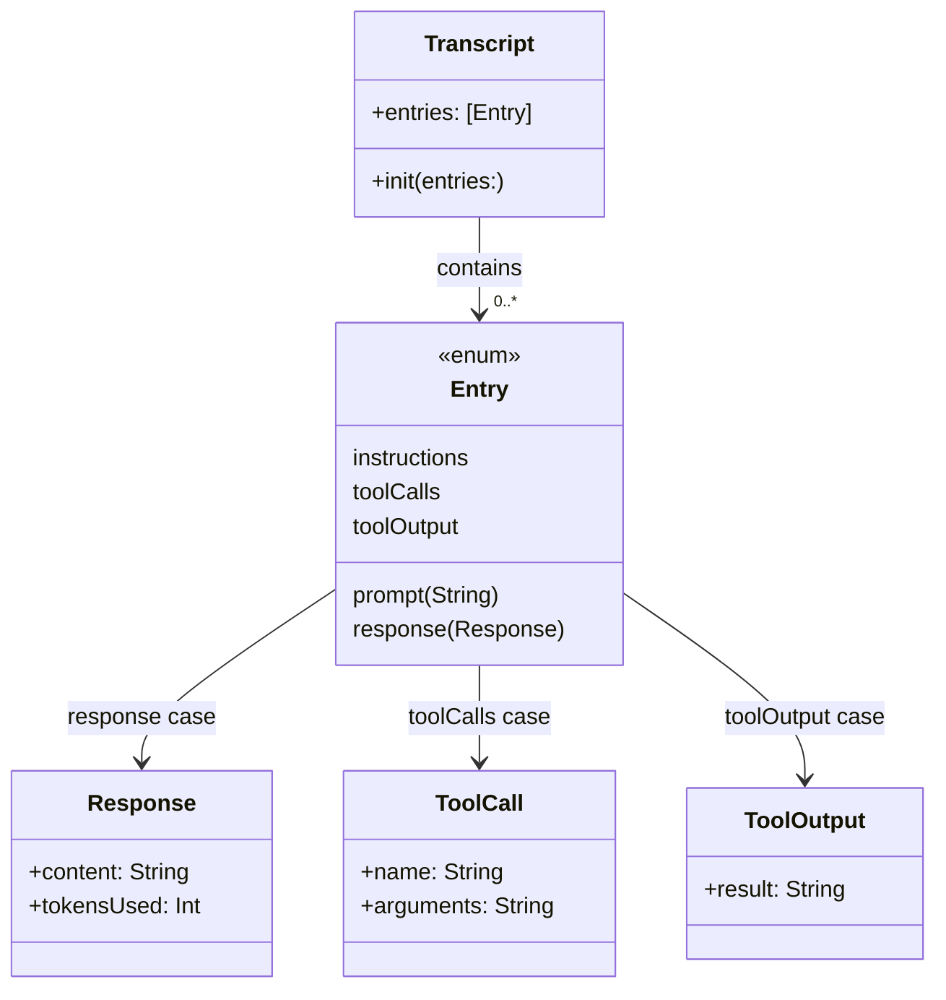
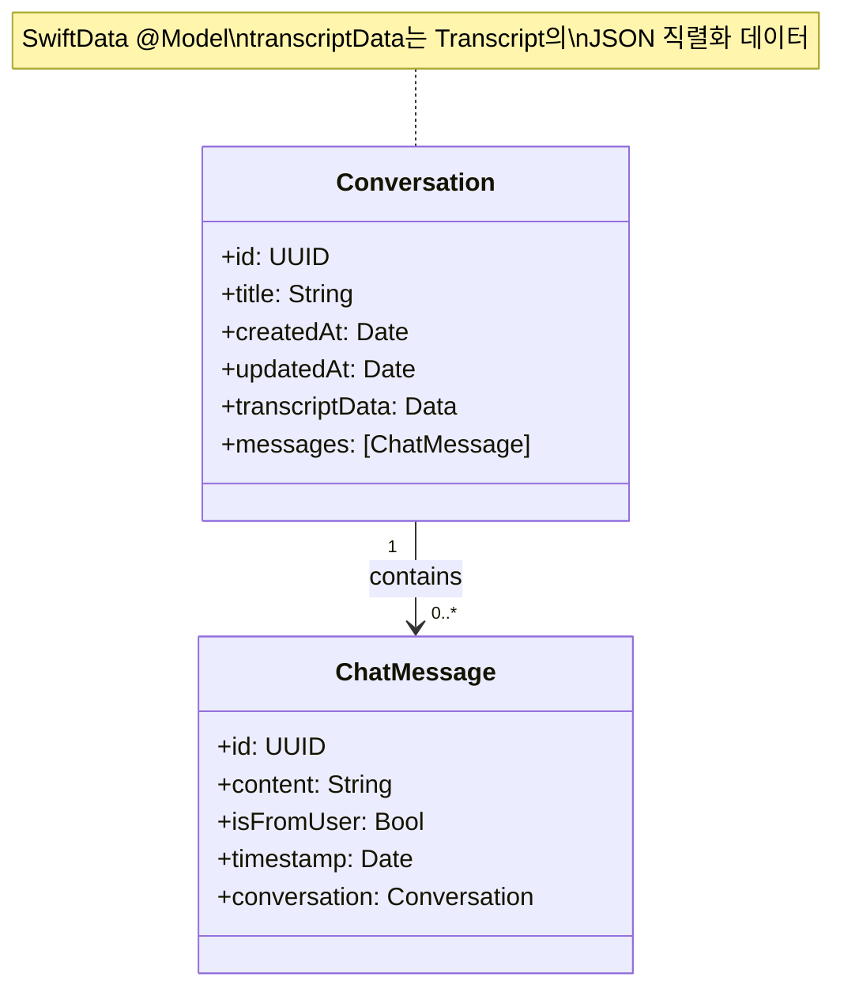
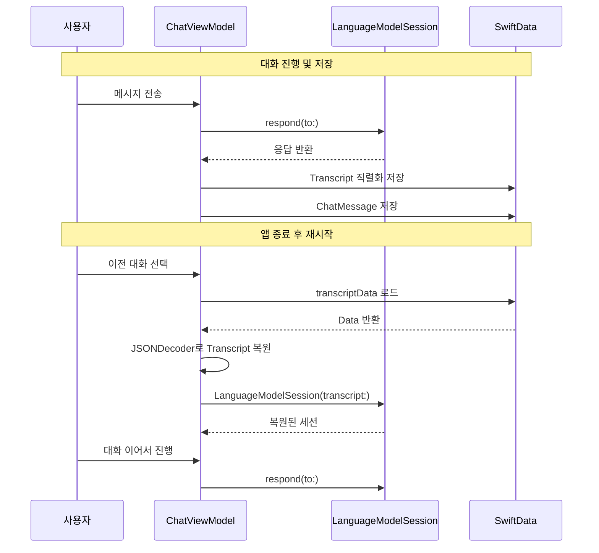
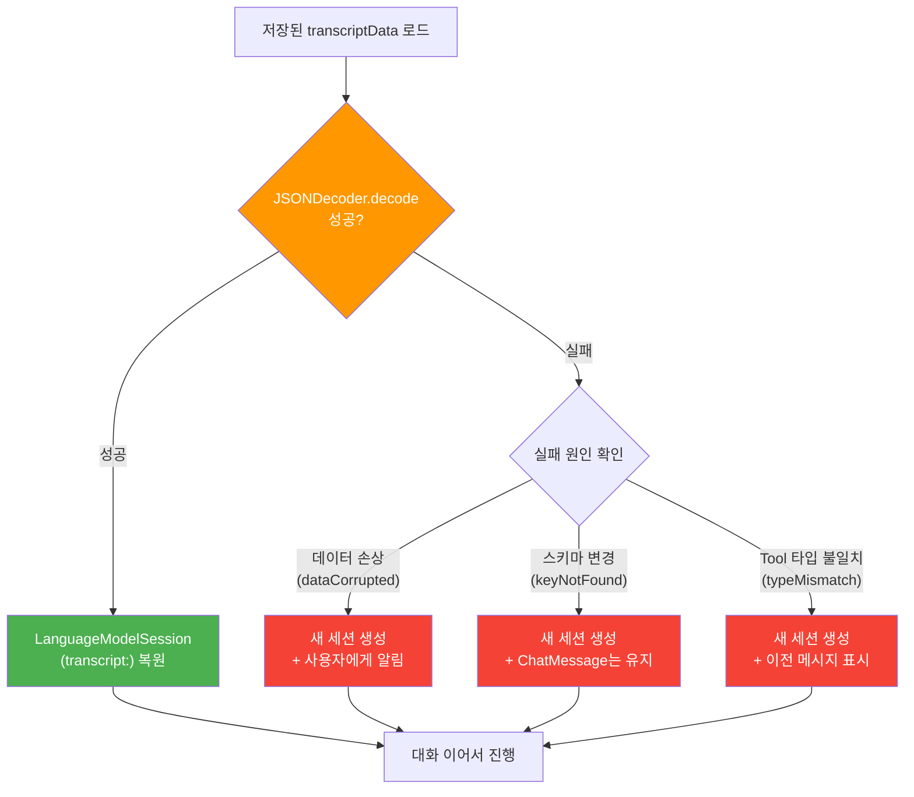
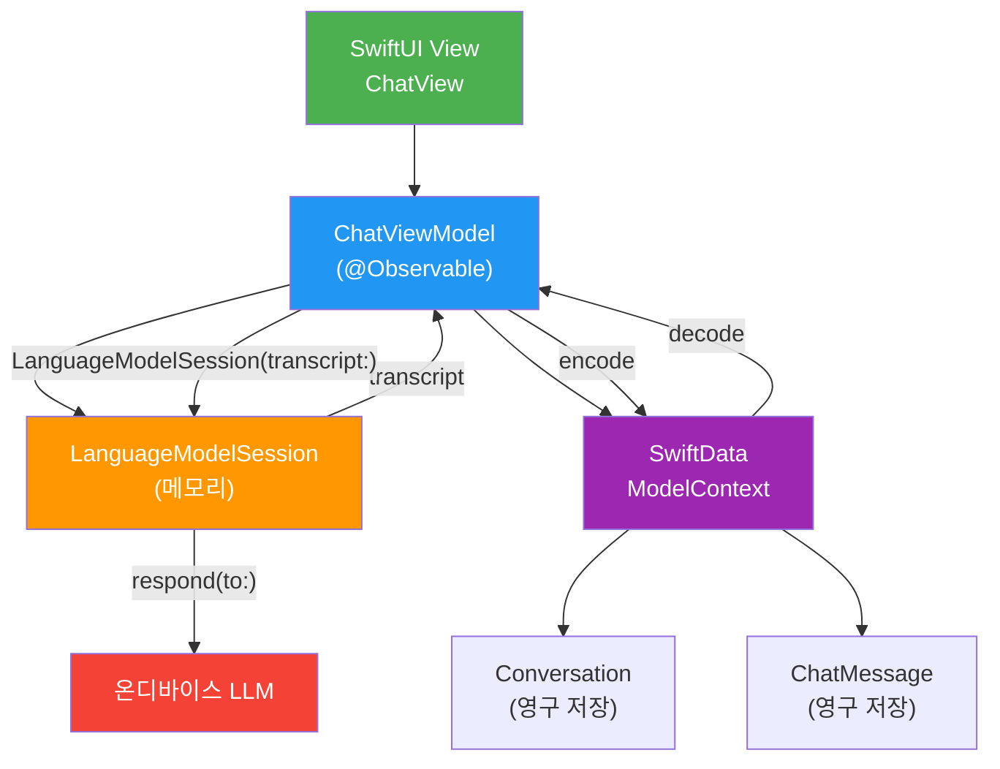

# 대화 히스토리 영구 저장

> SwiftData와 Codable 직렬화를 활용하여 대화 히스토리를 영구 저장하고, 앱 재시작 후에도 대화를 복원하는 패턴을 배웁니다

## 개요

이전 섹션 [토큰 예산과 컨텍스트 윈도우](09-ch9-세션-관리와-멀티턴-대화/02-02-토큰-예산과-컨텍스트-윈도우.md)에서 4,096 토큰 제한 안에서 효율적으로 대화를 관리하는 방법을 배웠습니다. 그런데 사용자가 앱을 종료했다가 다시 열면 어떻게 될까요? `LanguageModelSession`은 메모리에만 존재하는 객체이기 때문에, 앱이 종료되면 모든 대화가 사라집니다.

이번 섹션에서는 대화 히스토리를 **디스크에 영구 저장**하고, 앱 재시작 시 **세션을 복원**하는 실전 패턴을 구현합니다.

**선수 지식**: `LanguageModelSession`, `Transcript`, `Transcript.Entry` (세션 9.1), 컨텍스트 윈도우와 토큰 예산 (세션 9.2)
**학습 목표**:
- `Transcript`의 구조와 `Transcript.Entry` 타입을 이해하고 직렬화한다
- SwiftData `@Model`로 대화 영구 저장 모델을 설계한다
- 저장된 데이터로 `LanguageModelSession(transcript:)`을 사용해 세션을 복원한다
- 대화 목록 UI와 연동하는 전체 흐름을 구현한다

## 왜 알아야 할까?

여러분이 매일 쓰는 메신저를 떠올려보세요. 카카오톡을 종료했다가 다시 켜면 대화가 모두 그대로 남아 있죠? 이건 당연한 것 같지만, 사실 대화가 서버나 디바이스의 데이터베이스에 저장되어 있기 때문에 가능한 겁니다. AI 채팅 앱도 마찬가지입니다.

사용자가 AI와 30분 동안 건강 상담을 했는데, 잠깐 다른 앱을 쓰다 돌아왔더니 대화가 전부 사라져 있다면? 이건 **사용자가 절대 용납하지 않는 UX**입니다. 특히 온디바이스 AI 앱은 "개인적이고 지속적인 비서" 역할을 기대받기 때문에, 대화의 영속성(persistence)은 필수 기능입니다.

Apple의 Foundation Models 프레임워크는 대화 영구 저장을 위한 핵심 빌딩 블록을 제공합니다. `Transcript` 타입은 `Codable`을 지원하여 직렬화가 가능하고, `LanguageModelSession(transcript:)` 이니셜라이저로 이전 대화를 복원할 수 있습니다. 이 두 가지를 SwiftData와 결합하면, 프로덕션 수준의 대화 영속 시스템을 구축할 수 있습니다.

## 핵심 개념

### 개념 1: Transcript의 직렬화 — 대화를 데이터로 변환하기

> 💡 **비유**: 수업 시간에 필기한 노트를 생각해보세요. 수업이 끝나면 노트는 여러분의 기억(메모리)에만 있지만, 사진을 찍어 저장하면 언제든 다시 꺼내볼 수 있습니다. `Transcript`를 `Codable`로 직렬화하는 건 바로 "노트를 사진 찍는" 행위입니다.

`LanguageModelSession`의 `transcript` 프로퍼티는 세션에서 주고받은 모든 대화를 `Transcript` 타입으로 관리합니다. 이 `Transcript`는 여러 `Transcript.Entry`로 구성되어 있는데, 각 엔트리는 대화의 한 단위를 나타냅니다.

> 📊 **그림 1**: Transcript 구조와 Entry 타입의 전체 관계



`Transcript`는 `Codable` 프로토콜을 채택하고 있어서, `JSONEncoder`로 직렬화하고 `JSONDecoder`로 역직렬화할 수 있습니다. 이것이 영구 저장의 핵심 열쇠입니다.

```swift
import FoundationModels

// 세션에서 대화 후 Transcript 직렬화
let session = LanguageModelSession()
let _ = try await session.respond(to: "Swift의 장점은 뭐야?")

// Transcript → Data (JSON)
let encoder = JSONEncoder()
encoder.outputFormatting = .prettyPrinted
let transcriptData = try encoder.encode(session.transcript)

// 확인: JSON 문자열로 출력
if let jsonString = String(data: transcriptData, encoding: .utf8) {
    print(jsonString)
}
```

역직렬화도 간단합니다. 다만, `Transcript.Entry`에는 `.toolCalls`나 `.toolOutput` 같은 복합 타입도 포함될 수 있으므로, 디코딩 시 에러 처리를 꼼꼼히 해주는 것이 좋습니다:

```run:swift
import Foundation

// Data → Transcript 복원 (에러 처리 포함)
func restoreTranscript(from data: Data) -> String {
    let decoder = JSONDecoder()
    do {
        let restoredTranscript = try decoder.decode(
            Transcript.self,
            from: data
        )
        return "복원 성공! 엔트리 수: \(restoredTranscript.entries.count)"
    } catch DecodingError.dataCorrupted(let context) {
        // JSON 데이터 자체가 손상된 경우
        return "데이터 손상: \(context.debugDescription)"
    } catch DecodingError.keyNotFound(let key, _) {
        // 스키마 변경으로 키가 누락된 경우 (OS 업데이트 시 발생 가능)
        return "누락된 키: \(key.stringValue)"
    } catch {
        return "복원 실패: \(error.localizedDescription)"
    }
}

print(restoreTranscript(from: validData))
```

```output
복원 성공! 엔트리 수: 3
```

> ⚠️ **흔한 오해**: "Transcript를 통째로 저장하면 용량이 너무 크지 않을까?"라고 걱정할 수 있습니다. 실제로 온디바이스 모델의 4,096 토큰 컨텍스트 윈도우를 고려하면, 하나의 대화 Transcript JSON은 보통 **수 KB~수십 KB** 수준입니다. 이미지나 동영상에 비하면 아주 가벼운 데이터죠.

> ⚠️ **인코딩 주의사항**: `Transcript.Entry`의 `.toolCalls`와 `.toolOutput` 케이스는 Tool을 사용하는 세션에서만 나타납니다. 이 엔트리들은 `@Generable` 타입의 스키마 정보를 포함할 수 있어서, 앱 버전 업데이트로 Tool의 인터페이스가 변경되면 이전에 저장한 Transcript를 디코딩할 때 실패할 수 있습니다. 프로덕션 앱에서는 디코딩 실패 시 **새 세션으로 시작하는 fallback 경로**를 반드시 마련해두세요.

### 개념 2: SwiftData로 대화 모델 설계하기 — 이중 저장 전략

> 💡 **비유**: 도서관을 설계한다고 상상해보세요. 책(대화)마다 고유 번호가 있고, 각 책에는 여러 페이지(메시지)가 순서대로 들어있습니다. 도서관 카탈로그(SwiftData)는 모든 책을 체계적으로 정리하고, 원하는 책을 빠르게 찾아주죠.

SwiftData는 Apple이 iOS 17부터 제공하는 최신 데이터 영속 프레임워크입니다. `@Model` 매크로 하나로 Swift 클래스를 영구 저장 가능한 모델로 변환할 수 있어, CoreData보다 훨씬 간결합니다.

대화 영속을 위해 두 가지 모델이 필요합니다:

> 📊 **그림 2**: SwiftData 대화 모델 관계도



이 설계의 핵심은 **이중 저장 전략(Dual Storage Strategy)**입니다.

> 💡 **이중 저장 전략이란?** 하나의 대화에 대해 **두 가지 형태의 데이터를 동시에 저장**하는 패턴입니다:
>
> | 저장 대상 | 역할 | 왜 필요한가? |
> |-----------|------|-------------|
> | **`transcriptData`** | `Transcript`를 JSON으로 직렬화한 `Data` | `LanguageModelSession(transcript:)`로 세션 복원 시 사용. instructions, tool 정의, 내부 응답 메타데이터 등 **모델이 맥락을 이해하는 데 필요한 모든 정보**를 포함 |
> | **`messages: [ChatMessage]`** | 사용자에게 보여줄 메시지 목록 | UI에서 대화 말풍선을 빠르게 렌더링. **사용자 메시지(`prompt`)와 AI 응답(`response.content`)만** 깔끔하게 정리 |
>
> 왜 하나로 통합하지 않을까요? `Transcript`에는 `.instructions`, `.toolCalls`, `.toolOutput` 등 사용자에게 보여줄 필요 없는 내부 엔트리가 포함되어 있습니다. 매번 이를 필터링하면 UI 성능이 저하되고, 반대로 `ChatMessage`만으로는 세션 복원에 필요한 메타데이터가 부족합니다. 각각의 역할에 최적화된 두 데이터를 함께 유지하는 것이 프로덕션 앱의 실전 패턴입니다.

```swift
import SwiftData
import Foundation

// 대화 모델 — 하나의 채팅 스레드
@Model
final class Conversation {
    var id: UUID
    var title: String
    var createdAt: Date
    var updatedAt: Date
    
    // Transcript JSON 직렬화 데이터 (세션 복원용)
    @Attribute(.externalStorage)
    var transcriptData: Data?
    
    // UI 표시용 메시지 목록
    @Relationship(deleteRule: .cascade)
    var messages: [ChatMessage] = []
    
    init(title: String = "새 대화") {
        self.id = UUID()
        self.title = title
        self.createdAt = Date()
        self.updatedAt = Date()
    }
}

// 개별 메시지 모델 — 대화의 한 턴
@Model
final class ChatMessage {
    var id: UUID
    var content: String
    var isFromUser: Bool
    var timestamp: Date
    
    var conversation: Conversation?
    
    init(content: String, isFromUser: Bool) {
        self.id = UUID()
        self.content = content
        self.isFromUser = isFromUser
        self.timestamp = Date()
    }
}
```

`@Attribute(.externalStorage)`를 `transcriptData`에 적용한 것에 주목하세요. 이 속성은 큰 데이터를 SQLite 데이터베이스 외부의 별도 파일로 저장합니다. 대화가 길어질수록 `Transcript` JSON도 커지기 때문에, 데이터베이스 성능을 보호하는 중요한 최적화입니다.

### 개념 3: 세션 복원 — 과거로의 시간 여행

> 💡 **비유**: RPG 게임의 "세이브/로드" 시스템과 같습니다. 게임(대화)을 진행하다가 세이브(Transcript 저장)하고, 나중에 로드(LanguageModelSession(transcript:))하면 정확히 그 시점부터 다시 시작할 수 있죠.

`LanguageModelSession`은 `transcript` 매개변수를 받는 이니셜라이저를 제공합니다. 이를 통해 이전에 저장한 `Transcript`로 세션을 복원할 수 있습니다.

> 📊 **그림 3**: 대화 저장과 복원 전체 흐름



복원 코드의 핵심 패턴을 살펴보겠습니다. 디코딩 실패에 대비한 fallback 처리가 포함되어 있습니다:

```swift
import FoundationModels

final class ChatService {
    private var session: LanguageModelSession
    
    // 새 대화 시작
    init(instructions: String) {
        self.session = LanguageModelSession {
            instructions
        }
    }
    
    // 기존 대화 복원 (에러 처리 포함)
    init(transcriptData: Data, instructions: String = "당신은 친절한 AI 어시스턴트입니다.") {
        let decoder = JSONDecoder()
        
        do {
            // 1. JSON → Transcript 역직렬화
            let transcript = try decoder.decode(
                Transcript.self,
                from: transcriptData
            )
            // 2. Transcript로 세션 생성 — 이전 대화 컨텍스트가 모두 복원됨
            self.session = LanguageModelSession(transcript: transcript)
        } catch {
            // 3. 디코딩 실패 시 새 세션으로 fallback
            // (OS 업데이트로 Transcript 스키마가 변경되었거나,
            //  Tool 인터페이스 변경으로 toolCalls 엔트리 디코딩이 실패한 경우)
            print("Transcript 복원 실패, 새 세션 시작: \(error)")
            self.session = LanguageModelSession {
                instructions
            }
        }
    }
    
    // 메시지 전송 후 Transcript 데이터 반환
    func send(_ message: String) async throws -> (String, Data) {
        let response = try await session.respond(to: message)
        
        // 응답 후 업데이트된 Transcript를 직렬화
        let encoder = JSONEncoder()
        let updatedData = try encoder.encode(session.transcript)
        
        return (response.content, updatedData)
    }
}
```

> 📊 **그림 4**: 디코딩 실패 시 Fallback 흐름



이것이 바로 이중 저장 전략의 또 다른 장점입니다. `Transcript` 디코딩이 실패하더라도 `ChatMessage`는 독립적인 SwiftData 모델이므로 **이전 대화 내용은 UI에 그대로 표시**할 수 있습니다. 세션 컨텍스트만 새로 시작되는 것이죠.

WWDC25의 "Deep dive into the Foundation Models framework" 세션에서 소개된 패턴 중 특히 중요한 것은 **축약된 Transcript로 복원**하는 기법입니다. 앞서 [토큰 예산과 컨텍스트 윈도우](09-ch9-세션-관리와-멀티턴-대화/02-02-토큰-예산과-컨텍스트-윈도우.md)에서 배운 것처럼, 4,096 토큰 제한 때문에 전체 Transcript를 복원하면 컨텍스트가 초과될 수 있습니다.

```swift
// 축약된 Transcript로 세션 복원
func restoreCondensedSession(
    from fullTranscript: Transcript
) -> LanguageModelSession {
    let allEntries = fullTranscript.entries
    var condensedEntries = [Transcript.Entry]()
    
    // 첫 번째 엔트리(instructions)는 반드시 포함
    if let firstEntry = allEntries.first {
        condensedEntries.append(firstEntry)
    }
    
    // 마지막 응답만 포함하여 최근 맥락 유지
    if allEntries.count > 1, let lastEntry = allEntries.last {
        condensedEntries.append(lastEntry)
    }
    
    let condensedTranscript = Transcript(entries: condensedEntries)
    return LanguageModelSession(transcript: condensedTranscript)
}
```

> 🔥 **실무 팁**: 전체 Transcript를 복원할지, 축약본으로 복원할지는 **저장된 대화의 토큰 수**를 기준으로 결정하세요. 토큰 수가 컨텍스트 윈도우의 70~80%(약 2,800~3,200 토큰)를 넘으면 축약 복원이 안전합니다. [세션 9.2](09-ch9-세션-관리와-멀티턴-대화/02-02-토큰-예산과-컨텍스트-윈도우.md)에서 배운 `tokenUsage(for:)` API를 활용하세요.

### 개념 4: ViewModel과 SwiftData의 연결

> 💡 **비유**: 레스토랑에서 웨이터(ViewModel)는 주방(AI 세션)과 손님(UI) 사이를 오가며 주문을 전달합니다. 동시에 주문 기록(SwiftData)도 관리하죠. 나중에 단골 손님이 "지난번에 먹은 거 또 주세요"라고 하면, 주문 기록을 보고 바로 처리할 수 있습니다.

실제 앱에서는 `ChatViewModel`이 세션과 SwiftData를 연결하는 중심 역할을 합니다.

> 📊 **그림 5**: MVVM 아키텍처에서 대화 영속 레이어



```swift
import FoundationModels
import SwiftData
import SwiftUI

@Observable
final class ChatViewModel {
    var conversation: Conversation
    var isGenerating = false
    
    private var session: LanguageModelSession
    private let modelContext: ModelContext
    
    // 새 대화 시작
    init(modelContext: ModelContext) {
        self.modelContext = modelContext
        let conversation = Conversation(title: "새 대화")
        self.conversation = conversation
        self.session = LanguageModelSession {
            "당신은 친절한 AI 어시스턴트입니다."
        }
        modelContext.insert(conversation)
    }
    
    // 기존 대화 복원
    init(conversation: Conversation, modelContext: ModelContext) {
        self.modelContext = modelContext
        self.conversation = conversation
        
        // 저장된 Transcript가 있으면 복원, 없으면 새 세션
        // 디코딩 실패 시에도 새 세션으로 안전하게 fallback
        if let data = conversation.transcriptData,
           let transcript = try? JSONDecoder().decode(
               Transcript.self, from: data
           ) {
            self.session = LanguageModelSession(transcript: transcript)
        } else {
            self.session = LanguageModelSession {
                "당신은 친절한 AI 어시스턴트입니다."
            }
        }
    }
    
    // 메시지 전송
    func send(_ text: String) async {
        guard !isGenerating else { return }
        isGenerating = true
        defer { isGenerating = false }
        
        // 사용자 메시지 저장
        let userMessage = ChatMessage(content: text, isFromUser: true)
        userMessage.conversation = conversation
        conversation.messages.append(userMessage)
        
        do {
            // AI 응답 받기
            let response = try await session.respond(to: text)
            
            // AI 응답 저장
            let aiMessage = ChatMessage(
                content: response.content,
                isFromUser: false
            )
            aiMessage.conversation = conversation
            conversation.messages.append(aiMessage)
            
            // Transcript 직렬화하여 영구 저장
            let transcriptData = try JSONEncoder().encode(
                session.transcript
            )
            conversation.transcriptData = transcriptData
            conversation.updatedAt = Date()
            
            // SwiftData 저장
            try modelContext.save()
            
        } catch LanguageModelSession.GenerationError
                    .exceededContextWindowSize {
            // 컨텍스트 초과 시 축약 복원
            session = restoreCondensedSession(
                from: session.transcript
            )
            // 재시도 안내 메시지
            let systemMessage = ChatMessage(
                content: "대화가 길어져서 요약했습니다. 계속 말씀해주세요.",
                isFromUser: false
            )
            systemMessage.conversation = conversation
            conversation.messages.append(systemMessage)
            try? modelContext.save()
            
        } catch {
            print("생성 오류: \(error)")
        }
    }
    
    private func restoreCondensedSession(
        from transcript: Transcript
    ) -> LanguageModelSession {
        let entries = transcript.entries
        var condensed = [Transcript.Entry]()
        if let first = entries.first { condensed.append(first) }
        if entries.count > 1, let last = entries.last {
            condensed.append(last)
        }
        return LanguageModelSession(
            transcript: Transcript(entries: condensed)
        )
    }
}
```

## 실습: 직접 해보기

대화 목록에서 이전 대화를 선택하면 복원되는 완전한 앱을 만들어보겠습니다.

```swift
import SwiftUI
import SwiftData
import FoundationModels

// MARK: - 데이터 모델

@Model
final class Conversation {
    var id: UUID
    var title: String
    var createdAt: Date
    var updatedAt: Date
    
    @Attribute(.externalStorage)
    var transcriptData: Data?
    
    @Relationship(deleteRule: .cascade)
    var messages: [ChatMessage] = []
    
    // 정렬된 메시지 반환
    var sortedMessages: [ChatMessage] {
        messages.sorted { $0.timestamp < $1.timestamp }
    }
    
    init(title: String = "새 대화") {
        self.id = UUID()
        self.title = title
        self.createdAt = Date()
        self.updatedAt = Date()
    }
}

@Model
final class ChatMessage {
    var id: UUID
    var content: String
    var isFromUser: Bool
    var timestamp: Date
    var conversation: Conversation?
    
    init(content: String, isFromUser: Bool) {
        self.id = UUID()
        self.content = content
        self.isFromUser = isFromUser
        self.timestamp = Date()
    }
}

// MARK: - ViewModel

@Observable
final class ChatViewModel {
    var conversation: Conversation
    var isGenerating = false
    var inputText = ""
    
    private var session: LanguageModelSession
    private let modelContext: ModelContext
    private let systemPrompt = "당신은 친절하고 유능한 AI 어시스턴트입니다."
    
    // 새 대화
    init(modelContext: ModelContext) {
        self.modelContext = modelContext
        let conv = Conversation()
        self.conversation = conv
        self.session = LanguageModelSession {
            "당신은 친절하고 유능한 AI 어시스턴트입니다."
        }
        modelContext.insert(conv)
        try? modelContext.save()
    }
    
    // 기존 대화 복원
    init(conversation: Conversation, modelContext: ModelContext) {
        self.modelContext = modelContext
        self.conversation = conversation
        
        if let data = conversation.transcriptData,
           let transcript = try? JSONDecoder().decode(
               Transcript.self, from: data
           ) {
            // 저장된 Transcript로 세션 복원
            self.session = LanguageModelSession(transcript: transcript)
        } else {
            // Transcript가 없거나 디코딩 실패 시 새 세션
            // (ChatMessage는 SwiftData에 독립 저장되어 있으므로
            //  UI에는 이전 대화가 그대로 표시됩니다)
            self.session = LanguageModelSession {
                "당신은 친절하고 유능한 AI 어시스턴트입니다."
            }
        }
    }
    
    func send() async {
        let text = inputText.trimmingCharacters(in: .whitespacesAndNewlines)
        guard !text.isEmpty, !isGenerating else { return }
        inputText = ""
        isGenerating = true
        defer { isGenerating = false }
        
        // 사용자 메시지 추가
        let userMsg = ChatMessage(content: text, isFromUser: true)
        userMsg.conversation = conversation
        conversation.messages.append(userMsg)
        
        do {
            let response = try await session.respond(to: text)
            
            // AI 응답 추가
            let aiMsg = ChatMessage(
                content: response.content, isFromUser: false
            )
            aiMsg.conversation = conversation
            conversation.messages.append(aiMsg)
            
            // 첫 번째 응답으로 대화 제목 자동 설정
            if conversation.title == "새 대화" {
                conversation.title = String(
                    text.prefix(30)
                ) + (text.count > 30 ? "..." : "")
            }
            
            // Transcript 영구 저장
            conversation.transcriptData = try JSONEncoder().encode(
                session.transcript
            )
            conversation.updatedAt = Date()
            try modelContext.save()
            
        } catch {
            let errorMsg = ChatMessage(
                content: "오류가 발생했습니다: \(error.localizedDescription)",
                isFromUser: false
            )
            errorMsg.conversation = conversation
            conversation.messages.append(errorMsg)
            try? modelContext.save()
        }
    }
}

// MARK: - 대화 목록 View

struct ConversationListView: View {
    @Environment(\.modelContext) private var modelContext
    @Query(sort: \Conversation.updatedAt, order: .reverse)
    private var conversations: [Conversation]
    
    var body: some View {
        NavigationStack {
            List {
                ForEach(conversations) { conversation in
                    NavigationLink(value: conversation) {
                        VStack(alignment: .leading, spacing: 4) {
                            Text(conversation.title)
                                .font(.headline)
                            Text(conversation.updatedAt, style: .relative)
                                .font(.caption)
                                .foregroundStyle(.secondary)
                        }
                    }
                }
                .onDelete(perform: deleteConversations)
            }
            .navigationTitle("대화 목록")
            .navigationDestination(for: Conversation.self) { conv in
                // 기존 대화 복원
                ChatView(
                    viewModel: ChatViewModel(
                        conversation: conv,
                        modelContext: modelContext
                    )
                )
            }
            .toolbar {
                // 새 대화 시작 버튼
                NavigationLink(value: "new") {
                    Image(systemName: "plus")
                }
            }
            .navigationDestination(for: String.self) { _ in
                ChatView(
                    viewModel: ChatViewModel(modelContext: modelContext)
                )
            }
        }
    }
    
    private func deleteConversations(at offsets: IndexSet) {
        for index in offsets {
            modelContext.delete(conversations[index])
        }
        try? modelContext.save()
    }
}

// MARK: - 채팅 View

struct ChatView: View {
    @State var viewModel: ChatViewModel
    
    var body: some View {
        VStack(spacing: 0) {
            // 메시지 목록
            ScrollView {
                LazyVStack(spacing: 12) {
                    ForEach(viewModel.conversation.sortedMessages) { msg in
                        MessageBubble(message: msg)
                    }
                }
                .padding()
            }
            
            Divider()
            
            // 입력 영역
            HStack(spacing: 12) {
                TextField("메시지를 입력하세요", text: $viewModel.inputText)
                    .textFieldStyle(.roundedBorder)
                    .disabled(viewModel.isGenerating)
                
                Button {
                    Task { await viewModel.send() }
                } label: {
                    if viewModel.isGenerating {
                        ProgressView()
                            .controlSize(.small)
                    } else {
                        Image(systemName: "arrow.up.circle.fill")
                            .font(.title2)
                    }
                }
                .disabled(
                    viewModel.inputText.isEmpty || viewModel.isGenerating
                )
            }
            .padding()
        }
        .navigationTitle(viewModel.conversation.title)
        .navigationBarTitleDisplayMode(.inline)
    }
}

// MARK: - 메시지 버블

struct MessageBubble: View {
    let message: ChatMessage
    
    var body: some View {
        HStack {
            if message.isFromUser { Spacer() }
            
            Text(message.content)
                .padding(12)
                .background(
                    message.isFromUser
                        ? Color.blue : Color(.systemGray5)
                )
                .foregroundStyle(
                    message.isFromUser ? .white : .primary
                )
                .clipShape(RoundedRectangle(cornerRadius: 16))
            
            if !message.isFromUser { Spacer() }
        }
    }
}

// MARK: - App Entry Point

@main
struct AIChatApp: App {
    var body: some Scene {
        WindowGroup {
            ConversationListView()
        }
        .modelContainer(for: [Conversation.self, ChatMessage.self])
    }
}
```

이 코드를 Xcode 26에서 새 프로젝트에 넣고 실행하면:
1. 대화 목록 화면에서 `+` 버튼으로 새 대화를 시작합니다
2. AI와 여러 턴 대화를 나눕니다
3. 앱을 종료했다가 다시 열면 대화 목록에 이전 대화가 남아 있습니다
4. 대화를 탭하면 이전 메시지가 표시되고, AI 세션도 복원되어 맥락을 이어갑니다

## 더 깊이 알아보기

### SwiftData의 탄생 — CoreData의 30년 여정

대화를 영구 저장하는 데 사용한 SwiftData의 뿌리는 놀랍게도 **1994년**까지 거슬러 올라갑니다. Steve Jobs가 Apple을 떠나 있던 시절, NeXT Computer에서 만든 **Enterprise Objects Framework (EOF)**가 그 시작입니다. EOF는 객체-관계 매핑(ORM)의 선구자였는데, 2005년 Apple이 이를 iOS/macOS용으로 재탄생시킨 것이 **Core Data**입니다.

하지만 Core Data는 Objective-C 시대의 설계를 품고 있어서, Swift의 값 타입 철학과 어울리지 않았습니다. `NSManagedObject` 서브클래싱, `NSPredicate` 문자열 기반 쿼리, 복잡한 `NSPersistentContainer` 설정... 많은 개발자가 "Core Data는 너무 어렵다"고 불평했죠.

Apple은 2023년 WWDC에서 **SwiftData**를 발표하며 30년간의 기술 부채를 한 번에 청산했습니다. `@Model` 매크로 하나로 영속 모델을 정의하고, `#Predicate` 매크로로 타입 세이프한 쿼리를 작성하며, SwiftUI의 `@Query`와 자연스럽게 통합됩니다. Foundation Models 프레임워크가 iOS 26에서 등장한 것과 SwiftData가 성숙한 시기가 맞물린 것은, AI 대화 앱의 영속 계층으로 SwiftData를 사용하기에 최적의 타이밍이라 할 수 있습니다.

### 왜 Transcript를 통째로 저장할까?

"ChatMessage만 저장하면 되지, 왜 Transcript도 저장하나?"라는 의문이 들 수 있습니다. 핵심은 **세션 복원**에 있습니다. `LanguageModelSession(transcript:)`에 넘기는 `Transcript`에는 instructions, tool 정의, 모델의 내부 응답 구조 등 `ChatMessage`에는 없는 메타데이터가 포함되어 있습니다. 이 메타데이터가 있어야 모델이 "아, 이전에 이런 맥락에서 대화하고 있었구나"를 정확히 파악할 수 있습니다.

## 흔한 오해와 팁

> ⚠️ **흔한 오해**: "Transcript를 저장했으니 ChatMessage는 저장할 필요 없다"고 생각할 수 있습니다. 하지만 Transcript에서 사용자에게 보여줄 메시지만 추출하려면 매번 `entries`를 순회하며 `.prompt`와 `.response` 케이스를 필터링해야 합니다. UI 성능과 유지보수를 위해 **별도 ChatMessage 모델로 분리**하는 것이 실전 패턴입니다. 이것이 바로 이중 저장 전략의 핵심이죠.

> 💡 **알고 계셨나요?**: Apple의 오픈소스 프로젝트 [FoundationChat](https://github.com/Dimillian/FoundationChat)은 SwiftData로 대화를 영구 저장하는 실전 패턴을 잘 보여줍니다. Thomas Ricouard(Ice Cubes 앱 개발자)가 만든 이 프로젝트는 `@Model`로 Conversation과 Message를 정의하고, `@Relationship(deleteRule: .cascade)`로 대화 삭제 시 메시지도 함께 정리합니다. 이번 섹션의 모델 설계도 이 패턴을 참고한 것입니다.

> 🔥 **실무 팁**: SwiftData의 `@Attribute(.externalStorage)`는 `transcriptData`처럼 크기가 가변적인 `Data` 타입에 꼭 적용하세요. 이 속성 없이 큰 Transcript를 저장하면 SQLite 데이터베이스가 비대해지고, 목록 조회 시 불필요하게 큰 데이터를 로드하게 됩니다. `externalStorage`를 사용하면 실제 데이터는 파일 시스템에 저장되고 SQLite에는 참조만 남아서, 대화 목록 로드 성능이 크게 향상됩니다.

## 핵심 정리

| 개념 | 설명 |
|------|------|
| **Transcript 직렬화** | `Transcript`는 `Codable`을 채택하여 `JSONEncoder`/`JSONDecoder`로 직렬화/역직렬화 가능 |
| **이중 저장 전략** | `transcriptData`(세션 복원용) + `ChatMessage`(UI 표시용)을 함께 저장. Transcript는 모델 컨텍스트 복원에, ChatMessage는 빠른 UI 렌더링에 각각 최적화 |
| **세션 복원** | `LanguageModelSession(transcript:)`로 이전 대화의 전체 컨텍스트를 복원 |
| **디코딩 에러 처리** | Tool 인터페이스 변경이나 OS 업데이트 시 `Transcript` 디코딩이 실패할 수 있으므로, 새 세션 fallback 경로 필수 |
| **축약 복원** | 토큰 예산이 부족할 때 instructions + 마지막 응답만으로 축약된 Transcript를 생성하여 복원 |
| **@Attribute(.externalStorage)** | 큰 Transcript 데이터를 SQLite 외부에 저장하여 DB 성능 보호 |
| **SwiftData @Model** | `@Model` 매크로로 Swift 클래스를 영구 저장 가능한 모델로 변환 |
| **Cascade 삭제** | `@Relationship(deleteRule: .cascade)`로 대화 삭제 시 하위 메시지 자동 정리 |

## 다음 섹션 미리보기

대화 하나를 저장하고 복원하는 방법을 배웠으니, 다음 섹션 [복수 세션 관리와 전환](09-ch9-세션-관리와-멀티턴-대화/04-04-복수-세션-관리와-전환.md)에서는 **여러 대화를 동시에 관리**하는 패턴을 다룹니다. 사용자가 주제별로 여러 AI 채팅을 유지하면서 자유롭게 전환하고, 각 세션의 instructions와 컨텍스트를 독립적으로 관리하는 아키텍처를 구현합니다.

## 참고 자료

- [Deep dive into the Foundation Models framework — WWDC25](https://developer.apple.com/videos/play/wwdc2025/301/) - Transcript 축약 복원 패턴과 `LanguageModelSession(transcript:)` 사용법을 소개하는 공식 세션
- [FoundationChat — GitHub (Dimillian)](https://github.com/Dimillian/FoundationChat) - SwiftData로 대화를 영구 저장하는 실전 오픈소스 채팅 앱
- [Meet the Foundation Models framework — WWDC25](https://developer.apple.com/videos/play/wwdc2025/286/) - `LanguageModelSession`과 `Transcript` API의 기초를 소개하는 공식 세션
- [Exploring the Foundation Models framework — Create with Swift](https://www.createwithswift.com/exploring-the-foundation-models-framework/) - Transcript 접근 패턴과 세션 초기화 방법을 다루는 튜토리얼
- [SwiftData — Apple Developer Documentation](https://developer.apple.com/documentation/swiftdata) - `@Model`, `@Attribute`, `@Relationship` 등 SwiftData 공식 문서

---
### 🔗 Related Sessions
- [transcript](09-ch9-세션-관리와-멀티턴-대화/01-01-멀티턴-대화의-컨텍스트-관리.md) (prerequisite)
- [exceededcontextwindowsize](03-ch3-foundation-models-프레임워크-시작하기/03-03-첫-번째-텍스트-생성-요청.md) (prerequisite)
