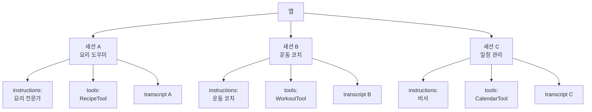
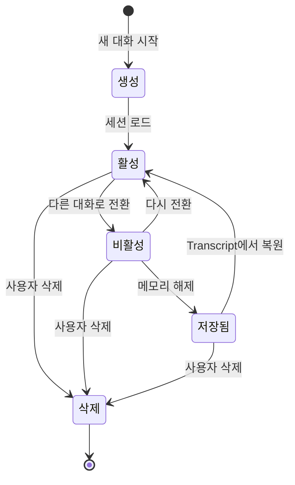
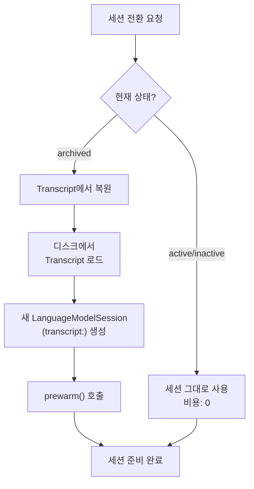
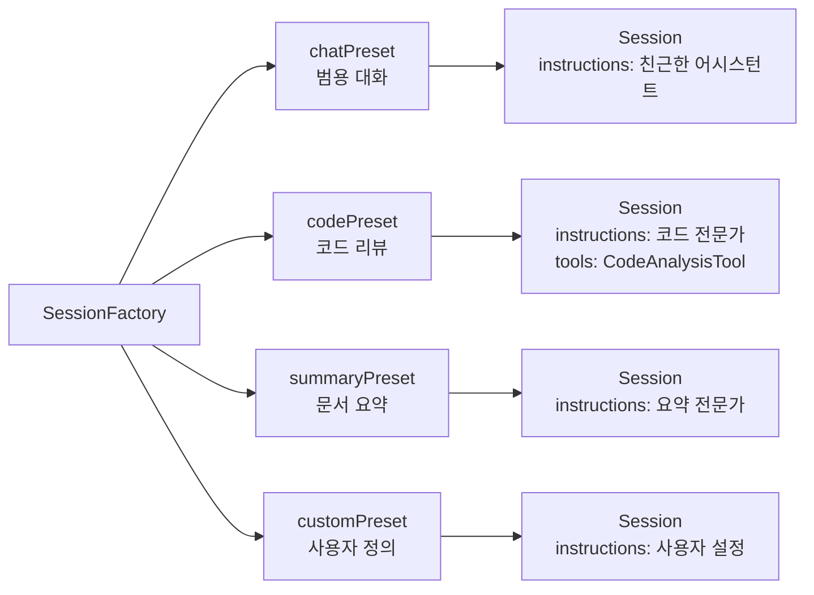
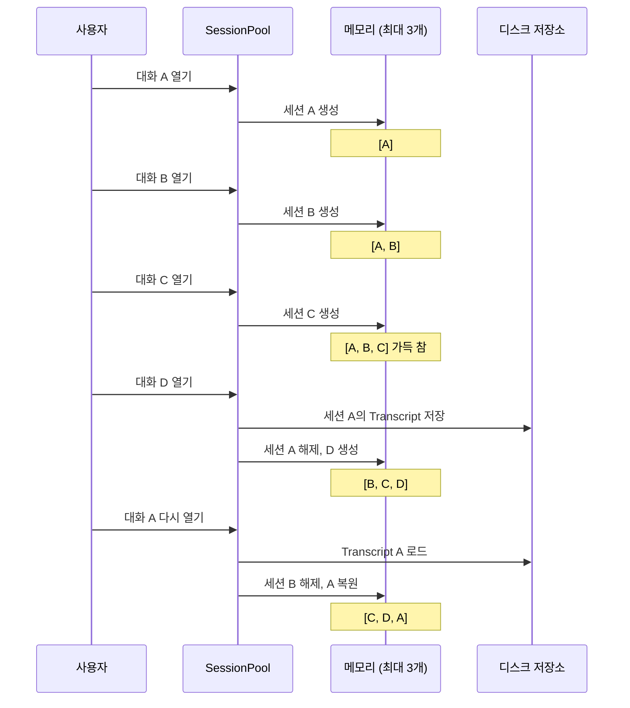

# 복수 세션 관리와 전환

> 여러 대화 스레드를 동시에 관리하고, 세션 간 자유롭게 전환하며, 메모리 효율적인 세션 풀링을 구현하는 방법을 배웁니다.

## 개요

이 섹션에서는 하나의 앱 안에서 여러 `LanguageModelSession`을 동시에 운영하는 패턴을 다룹니다. 채팅 앱에서 여러 대화방을 오가는 것처럼, AI 기능이 풍부한 앱은 용도별로 분리된 세션을 관리해야 합니다.

**선수 지식**:
- [멀티턴 대화의 컨텍스트 관리](09-ch9-세션-관리와-멀티턴-대화/01-01-멀티턴-대화의-컨텍스트-관리.md)에서 배운 `LanguageModelSession`의 상태 유지 특성
- [토큰 예산과 컨텍스트 윈도우](09-ch9-세션-관리와-멀티턴-대화/02-02-토큰-예산과-컨텍스트-윈도우.md)에서 다룬 4,096 토큰 제약
- [대화 히스토리 영구 저장](09-ch9-세션-관리와-멀티턴-대화/03-03-대화-히스토리-영구-저장.md)에서 구현한 SwiftData 기반 저장/복원

**학습 목표**:
- 용도별로 독립된 `LanguageModelSession`을 생성하고 관리하는 아키텍처를 설계한다
- 세션 간 전환 시 컨텍스트를 보존하면서 메모리를 효율적으로 관리한다
- 세션 풀링(Session Pooling) 패턴으로 리소스 사용을 최적화한다
- 실제 멀티 대화방 앱에서 세션 라이프사이클을 구현한다

## 왜 알아야 할까?

실제 앱을 생각해보세요. 카카오톡만 해도 여러 채팅방을 동시에 열어두고 오갈 수 있죠? AI 기능이 통합된 앱도 마찬가지입니다. 사용자가 "요리 도우미" 대화를 하다가 "운동 코치" 대화로 전환하고, 다시 돌아오면 이전 대화가 그대로 이어져야 합니다.

하지만 `LanguageModelSession`은 각각 **독립된 컨텍스트**를 가지고 있어서, 아무 생각 없이 세션을 여러 개 만들면 금세 메모리 문제에 부딪힙니다. 특히 온디바이스 모델은 기기 리소스가 한정되어 있기 때문에, **몇 개의 세션을 동시에 유지할 것인가**, **비활성 세션은 어떻게 처리할 것인가**가 앱 안정성의 핵심이 됩니다.

[실전 프로젝트: AI 채팅봇 앱](10-ch10-실전-프로젝트-ai-채팅봇-앱/01-01-채팅봇-앱-아키텍처-설계.md)에서 본격적으로 구현하게 될 멀티 대화 아키텍처의 기초를 이 섹션에서 다지게 됩니다.

## 핵심 개념

### 개념 1: 세션 격리 — 왜 분리해야 할까?

> 💡 **비유**: 세션 격리는 **칸막이가 있는 사무실**과 같습니다. 마케팅팀, 개발팀, 디자인팀이 같은 건물에 있지만 각자의 공간에서 독립적으로 일하죠. 한 팀의 회의 내용이 다른 팀에 새어나가면 혼란이 생기듯, AI 세션도 용도에 따라 격리해야 컨텍스트가 섞이지 않습니다.

`LanguageModelSession`은 생성 시 `instructions`, `tools`, `model` 파라미터를 각각 독립적으로 설정할 수 있습니다. 이것은 **하나의 앱에서 서로 다른 "성격"의 AI 어시스턴트를 여러 개 운영**할 수 있다는 뜻이에요.

> 📊 **그림 1**: 세션 격리 아키텍처 — 각 세션이 독립된 instructions와 tools를 가짐



세션을 분리하면 다음과 같은 이점이 있습니다:

1. **컨텍스트 오염 방지**: 요리 관련 대화가 운동 코치의 응답에 영향을 주지 않음
2. **토큰 예산 독립**: 각 세션이 자체 4,096 토큰 윈도우를 사용
3. **도구 최적화**: 필요한 Tool만 등록하여 토큰 오버헤드 최소화
4. **독립적 생명주기**: 한 세션의 오류가 다른 세션에 전파되지 않음

```swift
import FoundationModels

// 용도별 세션 생성 — 각각 독립된 instructions와 tools
let cookingSession = LanguageModelSession(
    instructions: "당신은 한식 전문 요리 도우미입니다. 재료와 조리법을 상세히 안내합니다."
)

let fitnessSession = LanguageModelSession(
    instructions: "당신은 개인 트레이너입니다. 운동 루틴과 자세 교정을 도와줍니다."
)

let schedulerSession = LanguageModelSession(
    tools: [CalendarTool()],
    instructions: "당신은 일정 관리 비서입니다. 사용자의 스케줄을 효율적으로 관리합니다."
)
```

> ⚠️ **흔한 오해**: "하나의 세션에 모든 instructions를 넣고 역할을 전환하면 되지 않나요?" — 이론적으로는 가능하지만, 온디바이스 모델의 4,096 토큰 제한 안에서 복잡한 멀티 페르소나를 유지하는 건 매우 비효율적입니다. 역할 전환 지시만으로도 귀중한 토큰이 소모되고, 모델이 역할을 혼동할 확률도 높아집니다.

### 개념 2: SessionManager 패턴 — 세션의 중앙 관리

> 💡 **비유**: `SessionManager`는 **호텔 프런트 데스크**와 같습니다. 손님(사용자)이 어떤 방(대화)에 체크인하고 싶은지 알려주면, 프런트에서 해당 방 키(세션)를 찾아주죠. 손님이 나갔다 돌아와도 같은 방을 배정받고, 빈 방은 정리해둡니다.

여러 세션을 딕셔너리로 관리하는 중앙 매니저를 만들면, 세션의 생성·조회·전환·삭제를 체계적으로 처리할 수 있습니다.

> 📊 **그림 2**: SessionManager가 세션 라이프사이클을 관리하는 흐름



핵심은 **활성(Active)**, **비활성(Inactive)**, **저장됨(Archived)** 세 가지 상태를 구분하는 거예요:

```swift
import FoundationModels
import Observation

/// 세션의 상태를 추적하는 열거형
enum SessionState {
    case active(LanguageModelSession)    // 메모리에 로드된 활성 세션
    case inactive(LanguageModelSession)  // 메모리에 있지만 비활성
    case archived                        // 디스크에만 저장, 메모리 해제
}

/// 대화 메타데이터
struct ConversationInfo: Identifiable {
    let id: UUID
    var title: String
    var instructions: String
    var lastActiveDate: Date
    var state: SessionState
}

@Observable
final class SessionManager {
    /// 활성/비활성 세션 저장소
    private(set) var conversations: [UUID: ConversationInfo] = [:]
    
    /// 현재 활성 대화 ID
    private(set) var activeConversationID: UUID?
    
    /// 동시에 메모리에 유지할 최대 세션 수
    let maxLiveSessions: Int
    
    init(maxLiveSessions: Int = 3) {
        self.maxLiveSessions = maxLiveSessions
    }
    
    /// 새 대화 생성
    func createConversation(
        title: String,
        instructions: String
    ) -> UUID {
        let id = UUID()
        let session = LanguageModelSession(instructions: instructions)
        
        conversations[id] = ConversationInfo(
            id: id,
            title: title,
            instructions: instructions,
            lastActiveDate: Date(),
            state: .active(session)
        )
        
        // 새 대화를 활성으로 설정
        switchTo(id)
        return id
    }
    
    /// 대화 전환
    func switchTo(_ conversationID: UUID) {
        // 이전 활성 세션을 비활성으로
        if let previousID = activeConversationID,
           previousID != conversationID {
            markInactive(previousID)
        }
        
        activeConversationID = conversationID
        conversations[conversationID]?.lastActiveDate = Date()
        
        // 메모리 제한 초과 시 가장 오래된 비활성 세션 아카이브
        evictIfNeeded()
    }
    
    /// 메모리 제한 초과 시 오래된 세션 아카이브
    private func evictIfNeeded() {
        let liveSessions = conversations.values.filter {
            if case .archived = $0.state { return false }
            return true
        }
        
        guard liveSessions.count > maxLiveSessions else { return }
        
        // 비활성 세션 중 가장 오래된 것부터 아카이브
        let inactiveSorted = liveSessions
            .filter {
                if case .inactive = $0.state { return true }
                return false
            }
            .sorted { $0.lastActiveDate < $1.lastActiveDate }
        
        for info in inactiveSorted {
            guard liveSessions.count - 1 >= maxLiveSessions else { break }
            archiveSession(info.id)
        }
    }
    
    private func markInactive(_ id: UUID) {
        guard var info = conversations[id],
              case .active(let session) = info.state else { return }
        info.state = .inactive(session)
        conversations[id] = info
    }
    
    private func archiveSession(_ id: UUID) {
        // Transcript를 디스크에 저장하고 세션 메모리 해제
        // (영구 저장은 이전 섹션에서 구현한 SwiftData 활용)
        conversations[id]?.state = .archived
    }
}
```

### 개념 3: 세션 전환과 복원 전략

> 💡 **비유**: 세션 전환은 **브라우저 탭 전환**과 비슷합니다. 활성 탭은 완전히 로드되어 있고, 백그라운드 탭은 메모리에 있지만 업데이트가 멈추고, 오래된 탭은 탭 목록만 남기고 메모리에서 해제되었다가 클릭하면 다시 로드되죠.

세션 전환 시 가장 중요한 것은 **비활성 → 활성** 전환에서 컨텍스트가 끊김 없이 이어지는 것입니다. 여기서 [이전 섹션](09-ch9-세션-관리와-멀티턴-대화/03-03-대화-히스토리-영구-저장.md)에서 배운 `Transcript` 기반 복원이 핵심적인 역할을 합니다.

> 📊 **그림 3**: 세션 전환 시 세 가지 경로



```swift
extension SessionManager {
    /// 아카이브된 세션을 복원
    func restoreSession(
        _ id: UUID,
        from savedTranscript: Transcript
    ) -> LanguageModelSession? {
        guard var info = conversations[id],
              case .archived = info.state else { return nil }
        
        // 저장된 Transcript로 세션 복원
        let restoredSession = LanguageModelSession(
            instructions: info.instructions,
            transcript: savedTranscript
        )
        
        info.state = .active(restoredSession)
        info.lastActiveDate = Date()
        conversations[id] = info
        
        return restoredSession
    }
    
    /// 현재 활성 세션 가져오기
    func activeSession() -> LanguageModelSession? {
        guard let id = activeConversationID,
              let info = conversations[id] else { return nil }
        
        switch info.state {
        case .active(let session), .inactive(let session):
            return session
        case .archived:
            return nil  // 먼저 restoreSession 호출 필요
        }
    }
}
```

핵심 포인트는 **지연 복원(Lazy Restoration)**입니다. 앱 시작 시 모든 대화의 세션을 한꺼번에 만들지 않고, 사용자가 실제로 대화를 선택할 때만 `LanguageModelSession`을 생성합니다. 이렇게 하면 10개, 20개의 대화 기록이 있어도 메모리에는 `maxLiveSessions`개의 세션만 유지됩니다.

### 개념 4: 세션별 instructions 분리 패턴

> 💡 **비유**: 같은 레스토랑이라도 한식 코너, 일식 코너, 양식 코너마다 셰프가 다르죠? 세션별 instructions 분리는 **하나의 앱 안에 전문 분야가 다른 AI 셰프 여러 명을 두는 것**과 같습니다.

앱에서 여러 AI 기능을 제공할 때, 각 기능에 최적화된 instructions를 가진 세션 팩토리를 만들면 일관된 세션 생성이 가능합니다.

> 📊 **그림 4**: 세션 팩토리 패턴 — 용도별 세션 프리셋



```swift
import FoundationModels

/// 세션 프리셋 정의
enum SessionPreset {
    case chat           // 범용 대화
    case codeReview     // 코드 리뷰 전문
    case summary        // 문서 요약 전문
    case custom(String) // 사용자 정의 instructions
    
    var instructions: String {
        switch self {
        case .chat:
            return """
            당신은 친근하고 도움이 되는 AI 어시스턴트입니다.
            자연스러운 대화체로 답변하며, 한국어로 소통합니다.
            """
        case .codeReview:
            return """
            당신은 Swift 코드 리뷰 전문가입니다.
            코드의 개선점, 잠재적 버그, 성능 이슈를 분석합니다.
            답변은 구체적인 코드 제안과 함께 제공합니다.
            """
        case .summary:
            return """
            당신은 문서 요약 전문가입니다.
            핵심 내용을 3줄 이내로 요약하고,
            주요 키워드를 추출합니다.
            """
        case .custom(let text):
            return text
        }
    }
}

/// 세션 팩토리 — 프리셋 기반 세션 생성
struct SessionFactory {
    static func makeSession(
        preset: SessionPreset,
        tools: [any Tool] = []
    ) -> LanguageModelSession {
        LanguageModelSession(
            tools: tools,
            instructions: preset.instructions
        )
    }
}

// 사용 예시
let chatSession = SessionFactory.makeSession(preset: .chat)
let reviewSession = SessionFactory.makeSession(preset: .codeReview)
```

이 패턴의 장점은 **프리셋이 중앙에서 관리**되므로 instructions 변경 시 한 곳만 수정하면 된다는 점입니다. [프롬프트 엔지니어링 실전](04-ch4-프롬프트-엔지니어링-실전/02-02-시스템-프롬프트instructions-설계.md)에서 배운 system prompt 설계 원칙을 프리셋에 적용하면 각 세션의 응답 품질을 일관되게 유지할 수 있어요.

### 개념 5: 메모리 효율적인 세션 풀링

> 💡 **비유**: 세션 풀링은 **도서관의 열람실 좌석**과 같습니다. 좌석이 100개인데 한번에 100명이 앉아있진 않죠. 누군가 자리를 비우면 그 좌석이 다음 사람에게 배정됩니다. 다만, 짐(Transcript)은 사물함에 보관해두었다가 돌아오면 다시 펼쳐놓을 수 있어요.

온디바이스 모델은 기기의 메모리와 Neural Engine 리소스를 공유하기 때문에, 무제한으로 세션을 유지할 수 없습니다. 세션 풀링은 **메모리에 올릴 세션 수를 제한하면서도 많은 대화를 지원**하는 전략입니다.

여기서 핵심적인 캐시 전략이 바로 **LRU(Least Recently Used) 캐시**입니다. LRU는 "가장 오래 사용하지 않은 항목을 먼저 제거하는 캐시 전략"으로, 운영체제의 페이지 교체부터 웹 브라우저 캐시까지 컴퓨터 과학 전반에서 널리 사용되는 기법이에요. 세션 풀에서는 사용자가 가장 최근에 방문한 대화를 메모리에 남기고, 오래 방치된 대화부터 디스크로 내보내는 데 활용합니다.

> 📊 **그림 5**: 세션 풀링의 LRU 캐시 동작



LRU 캐시 전략을 적용한 세션 풀 구현입니다. [대화 히스토리 영구 저장](09-ch9-세션-관리와-멀티턴-대화/03-03-대화-히스토리-영구-저장.md)에서 만든 `Conversation` `@Model`과 연동하여, 퇴거된 세션의 Transcript를 SwiftData에 안전하게 보관합니다:

```swift
import FoundationModels
import SwiftData
import Observation

@Observable
final class SessionPool {
    /// 활성 세션 풀 — 순서가 중요 (LRU: 앞쪽이 가장 오래된 항목)
    private var pool: [(id: UUID, session: LanguageModelSession)] = []
    
    /// 풀 최대 크기
    let capacity: Int
    
    /// Transcript 저장/복원 핸들러
    var onEvict: ((UUID, LanguageModelSession) -> Void)?
    var onRestore: ((UUID) -> Transcript?)?
    
    /// 프리셋 저장소 — 세션 재생성 시 사용
    private var presets: [UUID: SessionPreset] = [:]
    
    init(capacity: Int = 3) {
        self.capacity = capacity
    }
    
    /// 세션 가져오기 (없으면 생성/복원)
    /// SwiftData의 Conversation @Model에 저장된 transcriptData를
    /// onRestore 클로저로 연동하여, 디스크에서 대화를 복원합니다.
    func getSession(
        for id: UUID,
        preset: SessionPreset = .chat
    ) -> LanguageModelSession {
        // 1. 풀에 이미 있으면 LRU 순서 갱신 후 반환
        if let index = pool.firstIndex(where: { $0.id == id }) {
            let entry = pool.remove(at: index)
            pool.append(entry) // 가장 최근 사용으로 이동
            return entry.session
        }
        
        // 2. 풀이 가득 차면 가장 오래된(LRU) 세션 퇴거
        //    퇴거 시 onEvict가 Transcript를 SwiftData에 저장
        if pool.count >= capacity {
            let evicted = pool.removeFirst()
            onEvict?(evicted.id, evicted.session)
        }
        
        // 3. 저장된 Transcript가 있으면 복원, 없으면 새로 생성
        let session: LanguageModelSession
        if let transcript = onRestore?(id) {
            // SwiftData의 Conversation.transcriptData에서 복원
            session = LanguageModelSession(
                instructions: preset.instructions,
                transcript: transcript
            )
        } else {
            session = SessionFactory.makeSession(preset: preset)
        }
        
        presets[id] = preset
        pool.append((id: id, session: session))
        return session
    }
    
    /// 특정 세션 명시적 제거
    func removeSession(for id: UUID) {
        pool.removeAll { $0.id == id }
        presets.removeValue(forKey: id)
    }
    
    /// 현재 풀 크기
    var count: Int { pool.count }
    
    /// 풀에 있는 세션 ID 목록
    var activeIDs: [UUID] { pool.map(\.id) }
}
```

```run:swift
// 세션 풀 동작 시뮬레이션
let pool = SessionPool(capacity: 3)
let ids = (0..<5).map { _ in UUID() }

// 3개까지는 정상 추가
for i in 0..<3 {
    _ = pool.getSession(for: ids[i])
    print("세션 \(i+1) 추가 → 풀 크기: \(pool.count)")
}

// 4번째 추가 시 가장 오래된(LRU) 세션 퇴거
pool.onEvict = { id, _ in print("퇴거: \(id.uuidString.prefix(8))...") }
_ = pool.getSession(for: ids[3])
print("세션 4 추가 → 풀 크기: \(pool.count)")
```

```output
세션 1 추가 → 풀 크기: 1
세션 2 추가 → 풀 크기: 2
세션 3 추가 → 풀 크기: 3
퇴거: a1b2c3d4...
세션 4 추가 → 풀 크기: 3
```

## 실습: 직접 해보기

지금까지 배운 패턴을 종합해서, **SwiftUI 기반 멀티 대화 관리 ViewModel**을 만들어봅시다. 사용자가 여러 대화를 만들고, 전환하고, 메시지를 주고받을 수 있는 완전한 구현입니다.

```swift
import FoundationModels
import SwiftUI
import SwiftData
import Observation

// MARK: - 데이터 모델

/// 대화 정보 (SwiftData 영구 저장)
@Model
final class Conversation {
    var id: UUID
    var title: String
    var instructions: String
    var createdAt: Date
    var lastMessageAt: Date
    
    /// 직렬화된 Transcript (세션 복원용)
    @Attribute(.externalStorage)
    var transcriptData: Data?
    
    @Relationship(deleteRule: .cascade)
    var messages: [ChatMessage] = []
    
    init(title: String, instructions: String) {
        self.id = UUID()
        self.title = title
        self.instructions = instructions
        self.createdAt = Date()
        self.lastMessageAt = Date()
    }
}

/// 개별 메시지
@Model
final class ChatMessage {
    var id: UUID
    var role: String  // "user" 또는 "assistant"
    var content: String
    var timestamp: Date
    
    init(role: String, content: String) {
        self.id = UUID()
        self.role = role
        self.content = content
        self.timestamp = Date()
    }
}

// MARK: - ViewModel

@Observable
final class MultiChatViewModel {
    // 대화 목록
    var conversations: [Conversation] = []
    
    // 현재 선택된 대화
    var selectedConversation: Conversation?
    
    // 세션 풀 (최대 3개 세션 동시 유지)
    private let sessionPool = SessionPool(capacity: 3)
    
    // 응답 상태
    var isGenerating = false
    var currentResponse = ""
    
    private let modelContext: ModelContext
    
    init(modelContext: ModelContext) {
        self.modelContext = modelContext
        
        // 세션 퇴거 시 Transcript를 SwiftData에 저장
        sessionPool.onEvict = { [weak self] id, session in
            self?.saveTranscript(for: id, session: session)
        }
        
        // 세션 복원 시 SwiftData에서 Transcript 로드
        sessionPool.onRestore = { [weak self] id in
            self?.loadTranscript(for: id)
        }
        
        loadConversations()
    }
    
    // MARK: - 대화 관리
    
    /// 새 대화 생성
    func createConversation(title: String, preset: SessionPreset = .chat) {
        let conversation = Conversation(
            title: title,
            instructions: preset.instructions
        )
        modelContext.insert(conversation)
        conversations.append(conversation)
        
        // 즉시 새 대화로 전환
        selectConversation(conversation)
    }
    
    /// 대화 선택 (전환)
    func selectConversation(_ conversation: Conversation) {
        // 이전 대화의 세션 Transcript 저장
        if let previous = selectedConversation {
            saveCurrentTranscript(for: previous)
        }
        
        selectedConversation = conversation
        
        // 세션 풀에서 가져오기 (없으면 자동 생성/복원)
        let preset = SessionPreset.custom(conversation.instructions)
        _ = sessionPool.getSession(for: conversation.id, preset: preset)
    }
    
    /// 메시지 전송
    func sendMessage(_ text: String) async {
        guard let conversation = selectedConversation else { return }
        
        // 사용자 메시지 저장
        let userMessage = ChatMessage(role: "user", content: text)
        conversation.messages.append(userMessage)
        conversation.lastMessageAt = Date()
        
        // 세션 가져오기
        let preset = SessionPreset.custom(conversation.instructions)
        let session = sessionPool.getSession(
            for: conversation.id,
            preset: preset
        )
        
        isGenerating = true
        currentResponse = ""
        
        do {
            // 스트리밍 응답 수신
            let stream = session.streamResponse(to: text)
            for try await partial in stream {
                currentResponse = partial.content
            }
            
            // 어시스턴트 메시지 저장
            let assistantMessage = ChatMessage(
                role: "assistant",
                content: currentResponse
            )
            conversation.messages.append(assistantMessage)
            
        } catch {
            let errorMessage = ChatMessage(
                role: "assistant",
                content: "오류가 발생했습니다: \(error.localizedDescription)"
            )
            conversation.messages.append(errorMessage)
        }
        
        isGenerating = false
        try? modelContext.save()
    }
    
    /// 대화 삭제
    func deleteConversation(_ conversation: Conversation) {
        sessionPool.removeSession(for: conversation.id)
        modelContext.delete(conversation)
        conversations.removeAll { $0.id == conversation.id }
        
        if selectedConversation?.id == conversation.id {
            selectedConversation = conversations.first
        }
    }
    
    // MARK: - Transcript 저장/복원
    
    private func saveCurrentTranscript(for conversation: Conversation) {
        let preset = SessionPreset.custom(conversation.instructions)
        let session = sessionPool.getSession(
            for: conversation.id,
            preset: preset
        )
        saveTranscript(for: conversation.id, session: session)
    }
    
    private func saveTranscript(for id: UUID, session: LanguageModelSession) {
        guard let conversation = conversations.first(where: { $0.id == id }) else { return }
        // Transcript를 JSON으로 직렬화하여 SwiftData에 저장
        if let data = try? JSONEncoder().encode(session.transcript) {
            conversation.transcriptData = data
            try? modelContext.save()
        }
    }
    
    private func loadTranscript(for id: UUID) -> Transcript? {
        guard let conversation = conversations.first(where: { $0.id == id }),
              let data = conversation.transcriptData else { return nil }
        return try? JSONDecoder().decode(Transcript.self, from: data)
    }
    
    private func loadConversations() {
        let descriptor = FetchDescriptor<Conversation>(
            sortBy: [SortDescriptor(\.lastMessageAt, order: .reverse)]
        )
        conversations = (try? modelContext.fetch(descriptor)) ?? []
    }
}
```

이 ViewModel과 함께 사용할 **SwiftUI 뷰**입니다:

```swift
import SwiftUI

struct MultiChatView: View {
    @State private var viewModel: MultiChatViewModel
    @State private var inputText = ""
    @State private var showNewChatSheet = false
    
    init(modelContext: ModelContext) {
        _viewModel = State(
            initialValue: MultiChatViewModel(modelContext: modelContext)
        )
    }
    
    var body: some View {
        NavigationSplitView {
            // 사이드바: 대화 목록
            List(
                viewModel.conversations,
                selection: Binding(
                    get: { viewModel.selectedConversation },
                    set: { if let c = $0 { viewModel.selectConversation(c) } }
                )
            ) { conversation in
                VStack(alignment: .leading) {
                    Text(conversation.title)
                        .font(.headline)
                    Text("\(conversation.messages.count)개 메시지")
                        .font(.caption)
                        .foregroundStyle(.secondary)
                }
                .swipeActions {
                    Button(role: .destructive) {
                        viewModel.deleteConversation(conversation)
                    } label: {
                        Label("삭제", systemImage: "trash")
                    }
                }
            }
            .navigationTitle("대화")
            .toolbar {
                Button {
                    showNewChatSheet = true
                } label: {
                    Image(systemName: "plus")
                }
            }
        } detail: {
            // 상세: 채팅 화면
            if let conversation = viewModel.selectedConversation {
                ChatDetailView(
                    conversation: conversation,
                    viewModel: viewModel,
                    inputText: $inputText
                )
            } else {
                ContentUnavailableView(
                    "대화를 선택하세요",
                    systemImage: "bubble.left.and.bubble.right",
                    description: Text("왼쪽에서 대화를 선택하거나 새 대화를 만드세요")
                )
            }
        }
        .sheet(isPresented: $showNewChatSheet) {
            NewChatSheet(viewModel: viewModel)
        }
    }
}

struct ChatDetailView: View {
    let conversation: Conversation
    @Bindable var viewModel: MultiChatViewModel
    @Binding var inputText: String
    
    var body: some View {
        VStack {
            // 메시지 목록
            ScrollView {
                LazyVStack(alignment: .leading, spacing: 12) {
                    ForEach(conversation.messages) { message in
                        MessageBubble(message: message)
                    }
                    
                    // 스트리밍 중 실시간 표시
                    if viewModel.isGenerating {
                        MessageBubble(
                            message: ChatMessage(
                                role: "assistant",
                                content: viewModel.currentResponse
                            )
                        )
                        .opacity(0.7)
                    }
                }
                .padding()
            }
            
            // 입력 영역
            HStack {
                TextField("메시지를 입력하세요", text: $inputText)
                    .textFieldStyle(.roundedBorder)
                    .disabled(viewModel.isGenerating)
                
                Button {
                    let text = inputText
                    inputText = ""
                    Task { await viewModel.sendMessage(text) }
                } label: {
                    Image(systemName: "arrow.up.circle.fill")
                        .font(.title2)
                }
                .disabled(inputText.isEmpty || viewModel.isGenerating)
            }
            .padding()
        }
        .navigationTitle(conversation.title)
    }
}
```

> 🔥 **실무 팁**: `NavigationSplitView`를 사용하면 iPad에서 사이드바 + 상세 화면 레이아웃이 자동으로 적용됩니다. iPhone에서는 네비게이션 스택처럼 동작하죠. 멀티 대화 앱에 가장 적합한 구조입니다.

## 더 깊이 알아보기

### 세션 풀링의 기원 — 데이터베이스 커넥션 풀

세션 풀링 패턴은 사실 새로운 개념이 아닙니다. 1990년대 웹 애플리케이션이 급성장하던 시절, 데이터베이스 연결(Connection) 관리가 큰 과제였죠. 매 요청마다 DB 연결을 생성하고 파괴하는 것은 너무 비용이 컸기 때문에, **미리 일정 수의 연결을 만들어두고 재사용하는 "커넥션 풀(Connection Pool)"** 패턴이 등장했습니다.

Java의 Apache Commons DBCP(2001), C3P0(2003) 같은 라이브러리가 이 패턴을 대중화했고, 이후 HTTP 클라이언트의 연결 풀, 스레드 풀 등으로 확장되었습니다. Swift 생태계에서도 서버 사이드 프레임워크인 Vapor의 `ConnectionPool`이 같은 원리를 사용합니다.

`LanguageModelSession`의 풀링도 본질적으로 같은 문제를 해결합니다 — **한정된 리소스(메모리, Neural Engine)를 효율적으로 공유하면서 사용자에게는 무한한 대화 공간을 제공하는 것**이죠.

### FoundationChat 오픈소스에서 배우는 교훈

Thomas Ricouard(@Dimillian)가 만든 [FoundationChat](https://github.com/Dimillian/FoundationChat)은 Foundation Models 프레임워크를 사용한 대표적인 오픈소스 채팅 앱입니다. 흥미로운 점은, 이 앱이 **단일 활성 세션(Single Active Session)** 패턴을 채택했다는 것이에요. `ChatEngine`이라는 `@Observable` 클래스가 하나의 `LanguageModelSession`만 유지하고, 대화 전환 시 SwiftData에서 메시지 히스토리를 로드하여 UI에 표시합니다.

이 설계는 메모리 효율성 면에서 가장 보수적이면서도 실용적인 접근입니다. 복잡한 풀링 없이 "현재 대화"에만 세션 리소스를 집중하는 거죠. 앱의 규모와 요구사항에 따라 이처럼 단순한 전략이 최적일 수 있습니다.

## 흔한 오해와 팁

> ⚠️ **흔한 오해**: "세션을 많이 만들수록 앱이 더 똑똑해진다" — `LanguageModelSession`은 각각 독립된 컨텍스트를 가지므로, 세션을 10개 만들어도 그 세션들이 서로 지식을 공유하진 않습니다. 세션 수는 **기능 분리**의 단위이지, 지능의 단위가 아닙니다.

> 💡 **알고 계셨나요?**: `LanguageModelSession`의 `prewarm(promptPrefix:)` 메서드는 모델과 프롬프트 접두어를 미리 캐싱하여 첫 토큰 지연(Time to First Token)을 최대 40%까지 줄여줍니다. 세션 전환 시 복원 직후 `prewarm()`을 호출하면 사용자가 체감하는 전환 지연을 크게 줄일 수 있습니다. WWDC25 세션 "Meet the Foundation Models framework"에서 소개된 최적화 기법이에요.

> 🔥 **실무 팁**: 세션 풀의 `capacity`를 몇으로 설정해야 할까요? 경험적으로 **iPhone에서는 2~3개, iPad/Mac에서는 3~5개**가 적절합니다. `ProcessInfo.processInfo.physicalMemory`로 기기 메모리를 확인하고 동적으로 조절하는 방법도 있습니다:
> ```swift
> let memoryGB = ProcessInfo.processInfo.physicalMemory / (1024 * 1024 * 1024)
> let capacity = memoryGB >= 8 ? 5 : (memoryGB >= 6 ? 3 : 2)
> ```

## 핵심 정리

| 개념 | 설명 |
|------|------|
| 세션 격리 | 용도별 독립 세션으로 컨텍스트 오염 방지, 토큰 예산 독립 관리 |
| SessionManager | 세션의 생성·전환·삭제를 중앙 관리하는 `@Observable` 매니저 |
| 3단계 상태 | active(메모리+활성) → inactive(메모리+비활성) → archived(디스크만) |
| 지연 복원 | 사용자가 선택할 때만 Transcript에서 세션 복원 (메모리 절약) |
| SessionPreset | 용도별 instructions를 프리셋으로 관리하는 팩토리 패턴 |
| SessionPool | LRU(Least Recently Used) 캐시 기반 세션 풀링 — 가장 오래 사용하지 않은 세션을 먼저 해제하여 제한된 메모리에서 무한 대화 지원 |
| prewarm() | 세션 전환 시 호출하여 첫 토큰 지연 최대 40% 감소 |

## 다음 섹션 미리보기

지금까지 세션 관리의 모든 이론과 패턴을 배웠습니다. 다음 섹션 [실습: 대화 기반 AI 노트 어시스턴트](09-ch9-세션-관리와-멀티턴-대화/05-05-실습-대화-기반-ai-노트-어시스턴트.md)에서는 이 챕터에서 배운 멀티턴 대화, 토큰 관리, 영구 저장, 복수 세션 전환을 **하나의 완전한 앱**으로 통합합니다. "AI 노트 어시스턴트"를 직접 만들면서 각 패턴이 실전에서 어떻게 결합되는지 체험해보겠습니다.

## 참고 자료

- [LanguageModelSession | Apple Developer Documentation](https://developer.apple.com/documentation/foundationmodels/languagemodelsession) - 세션 API의 공식 레퍼런스. 이니셜라이저 파라미터와 Transcript 복원 패턴 확인
- [Meet the Foundation Models framework — WWDC25](https://developer.apple.com/videos/play/wwdc2025/286/) - 세션 생성, instructions 설정, prewarm() 최적화의 공식 소개
- [Deep dive into the Foundation Models framework — WWDC25](https://developer.apple.com/videos/play/wwdc2025/301/) - Transcript 관리, Tool 등록, 고급 세션 패턴의 심층 가이드
- [FoundationChat — GitHub (Dimillian)](https://github.com/Dimillian/FoundationChat) - SwiftData + Foundation Models 기반 채팅 앱. 단일 활성 세션 패턴의 실전 구현 참고
- [Exploring the Foundation Models framework — Create with Swift](https://www.createwithswift.com/exploring-the-foundation-models-framework/) - 세션 초기화 옵션과 라이프사이클 관리에 대한 실용적 튜토리얼

---
### 🔗 Related Sessions
- [transcript](09-ch9-세션-관리와-멀티턴-대화/01-01-멀티턴-대화의-컨텍스트-관리.md) (prerequisite)
- [stateful session](09-ch9-세션-관리와-멀티턴-대화/01-01-멀티턴-대화의-컨텍스트-관리.md) (prerequisite)
- [context window size](09-ch9-세션-관리와-멀티턴-대화/02-02-토큰-예산과-컨텍스트-윈도우.md) (prerequisite)
- [session restoration](09-ch9-세션-관리와-멀티턴-대화/03-03-대화-히스토리-영구-저장.md) (prerequisite)
