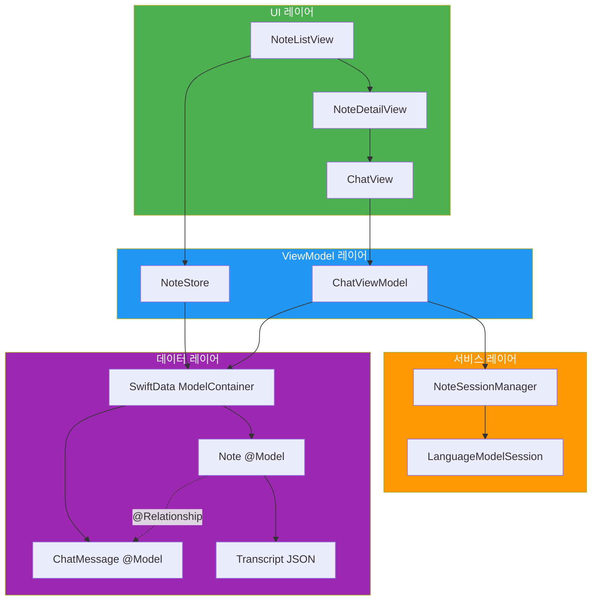
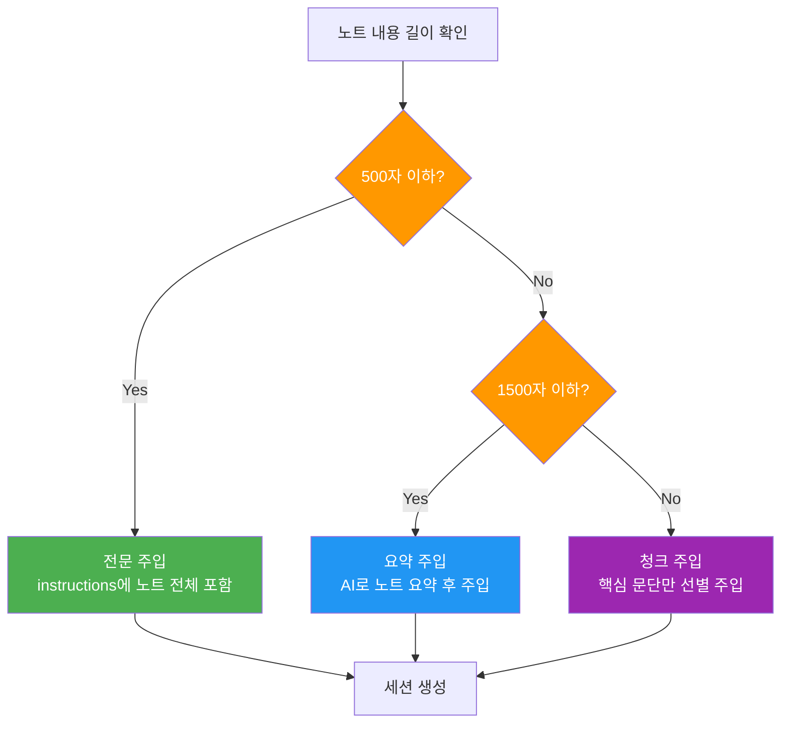
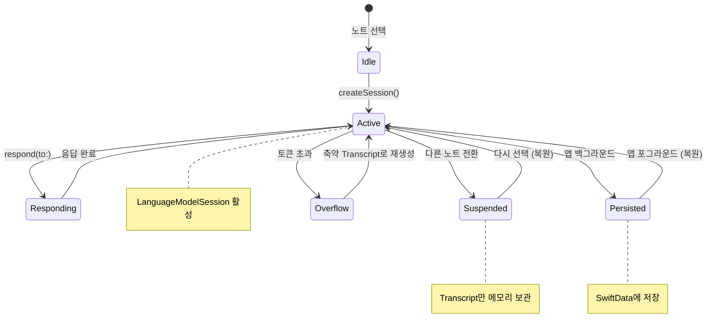
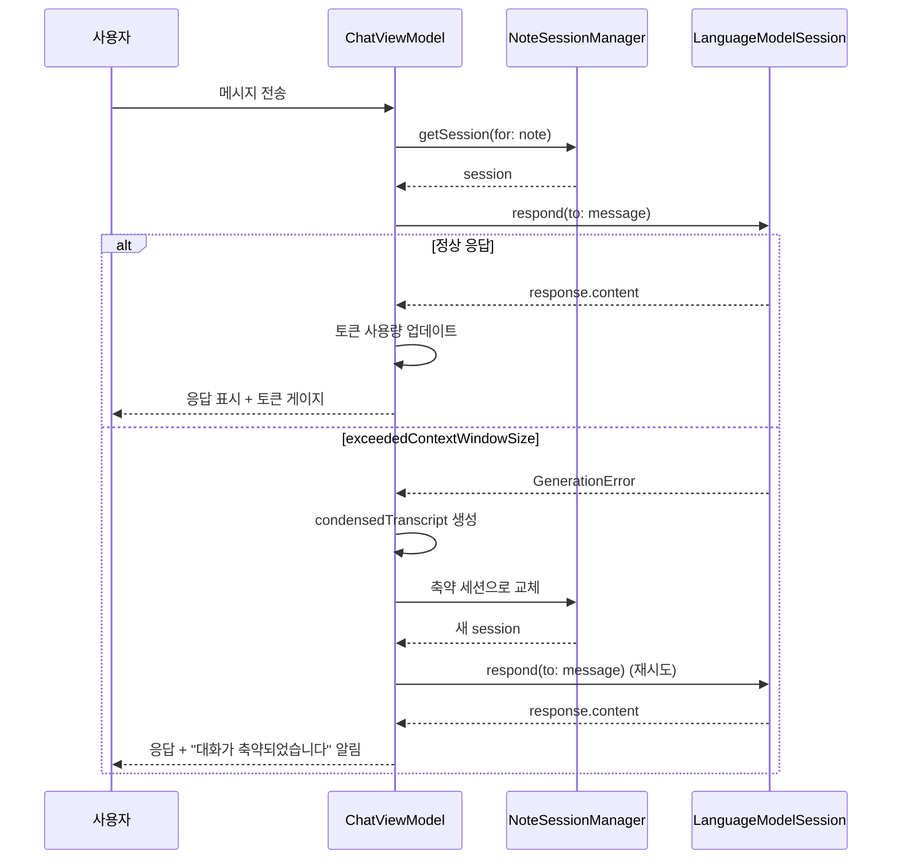
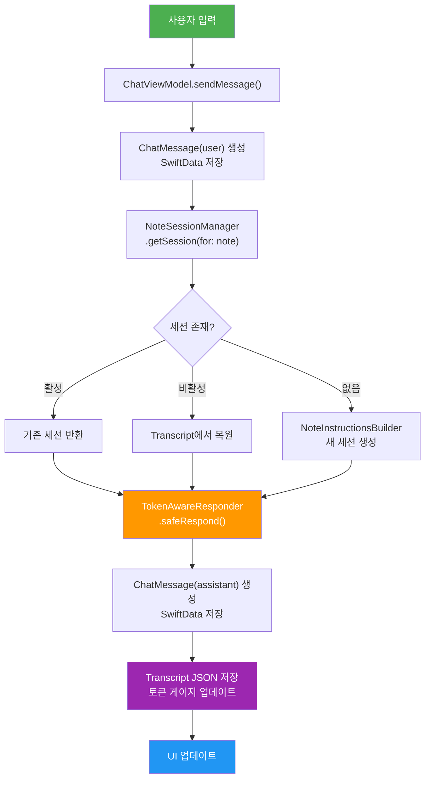

# 실습: 대화 기반 AI 노트 어시스턴트

> Ch9에서 배운 멀티턴 대화, 토큰 관리, 영구 저장, 복수 세션 전환을 모두 결합하여 노트를 요약하고 질의하는 완전한 AI 어시스턴트 앱을 구현합니다.

## 개요

이 섹션은 Ch9의 캡스톤 프로젝트입니다. 지금까지 네 개의 섹션에 걸쳐 배운 개념들 — LanguageModelSession의 상태 유지, 토큰 예산 관리, SwiftData 기반 영구 저장, SessionManager를 통한 복수 세션 전환 — 을 하나의 실전 앱으로 통합합니다.

**선수 지식**:
- [01. 멀티턴 대화의 컨텍스트 관리](09-ch9-세션-관리와-멀티턴-대화/01-01-멀티턴-대화의-컨텍스트-관리.md)의 transcript와 컨텍스트 누적
- [02. 토큰 예산과 컨텍스트 윈도우](09-ch9-세션-관리와-멀티턴-대화/02-02-토큰-예산과-컨텍스트-윈도우.md)의 4096 토큰 제약과 요약 전략
- [03. 대화 히스토리 영구 저장](09-ch9-세션-관리와-멀티턴-대화/03-03-대화-히스토리-영구-저장.md)의 SwiftData + Transcript 직렬화
- [04. 복수 세션 관리와 전환](09-ch9-세션-관리와-멀티턴-대화/04-04-복수-세션-관리와-전환.md)의 SessionManager와 세션 격리

**학습 목표**:
- 노트별 독립 AI 세션을 생성하고 전환하는 아키텍처를 구현한다
- 사용자의 노트 콘텐츠를 시스템 프롬프트에 주입하여 맥락 있는 대화를 구현한다
- 토큰 예산 모니터링과 자동 축약을 실제 앱에 적용한다
- 대화 저장/복원이 자연스럽게 동작하는 완성된 사용자 경험을 구현한다

## 왜 알아야 할까?

메모 앱, 노션, 옵시디언 같은 노트 앱을 쓰면서 이런 경험 해보셨나요? "분명 어딘가에 적어뒀는데..." 하고 자기가 쓴 노트를 찾지 못하는 상황. 노트가 쌓이면 쌓일수록, 정작 필요한 정보를 꺼내 쓰기가 어려워집니다.

AI 노트 어시스턴트는 이 문제를 근본적으로 해결해줍니다. 노트를 "읽어둔" AI에게 "지난주 회의에서 결정된 마감일이 뭐였지?"라고 물어보면 바로 답을 찾아주거든요. 더 나아가 "이 노트를 3줄로 요약해줘", "핵심 키워드를 뽑아줘" 같은 요청도 가능합니다.

이번 실습은 단순한 코드 연습이 아닙니다. Ch10에서 만들 **AI 채팅봇 앱의 핵심 아키텍처**를 미리 잡는 과정이에요. 여기서 구현하는 패턴 — 세션 생성, 컨텍스트 주입, 토큰 관리, 영구 저장 — 은 어떤 AI 앱을 만들든 반복적으로 쓰이는 기본 뼈대가 됩니다.

## 핵심 개념

### 개념 1: AI 노트 어시스턴트의 전체 아키텍처

> 💡 **비유**: AI 노트 어시스턴트는 **개인 비서가 있는 서재**와 같습니다. 서재에 여러 권의 노트(노트별 세션)가 있고, 비서(AI)에게 "이 노트 요약해줘"라고 하면 해당 노트를 펼쳐보고 답해줍니다. 비서는 각 노트의 내용을 기억하고 있어서(시스템 프롬프트), 후속 질문에도 맥락을 유지합니다. 그리고 대화 내역은 메모장(SwiftData)에 기록되어, 서재를 닫았다 열어도 이전 대화를 이어갈 수 있죠.

이 앱의 아키텍처는 크게 네 개의 레이어로 구성됩니다:

> 📊 **그림 1**: AI 노트 어시스턴트 아키텍처 전체 구조



각 레이어의 역할을 정리하면:

| 레이어 | 구성 요소 | 핵심 책임 |
|--------|-----------|-----------|
| **UI** | NoteListView, ChatView | 사용자 인터랙션, 메시지 표시 |
| **ViewModel** | NoteStore, ChatViewModel | 비즈니스 로직, 상태 관리 |
| **서비스** | NoteSessionManager | 세션 생성/전환/복원, 토큰 관리 |
| **데이터** | SwiftData Models | 노트와 대화 영구 저장 |

데이터 레이어를 좀 더 자세히 살펴보면, `Note` 모델은 두 가지 방식으로 대화 데이터를 보관합니다. 첫째, `@Relationship`으로 연결된 `ChatMessage` 배열은 UI에서 메시지를 표시하는 데 사용됩니다. 둘째, `transcriptData` 프로퍼티에 저장된 Transcript JSON은 `LanguageModelSession`을 복원하는 데 사용됩니다. 이 이중 저장 구조 덕분에 앱을 종료했다가 다시 열어도 대화를 자연스럽게 이어갈 수 있어요.

핵심 설계 원칙은 **"노트 하나 = 세션 하나"**입니다. 각 노트마다 독립된 `LanguageModelSession`을 생성하고, 해당 노트의 내용을 시스템 프롬프트(instructions)에 주입합니다. 이렇게 하면 노트 A에 대한 질문이 노트 B의 세션에 영향을 주지 않아요.

### 개념 2: 노트 콘텐츠를 컨텍스트로 주입하는 전략

> 💡 **비유**: 시험 감독관에게 "이 교과서를 읽고 학생들 질문에 답해주세요"라고 하는 것과 같습니다. 교과서(노트 내용)가 감독관(모델)의 instructions에 들어가면, 학생(사용자)이 어떤 질문을 해도 교과서 맥락 안에서 답할 수 있죠. 단, 교과서가 너무 두꺼우면(토큰 초과) 핵심 챕터만 넘겨줘야 합니다.

4096 토큰 컨텍스트 윈도우에서 노트 내용을 어떻게 주입할지가 핵심 과제입니다. 시스템 프롬프트에 노트 전문을 넣으면 대화에 쓸 토큰이 거의 남지 않거든요.

> 📊 **그림 2**: 노트 길이에 따른 컨텍스트 주입 전략



이 전략을 코드로 구현하면:

```swift
import FoundationModels

/// 노트 내용을 기반으로 세션 instructions을 생성하는 유틸리티
struct NoteInstructionsBuilder {
    /// 한국어 기준 대략적 토큰 추정 (1토큰 ≈ 2~3자)
    private static let maxNoteTokens = 1200  // 전체 4096 중 약 30%
    private static let charsPerToken = 2.5

    /// 노트 길이에 따라 적절한 instructions 문자열을 생성
    static func buildInstructions(for note: Note) -> String {
        let basePrompt = """
        당신은 사용자의 노트를 분석하고 질문에 답하는 AI 어시스턴트입니다.
        아래 노트 내용을 기반으로 답변하세요.
        노트에 없는 내용은 "노트에서 해당 정보를 찾지 못했습니다"라고 답하세요.
        """

        let noteContent = prepareNoteContent(note.content)

        return """
        \(basePrompt)

        --- 노트 제목: \(note.title) ---
        \(noteContent)
        --- 노트 끝 ---
        """
    }

    /// 노트 길이에 따라 전문/축약을 결정
    private static func prepareNoteContent(_ content: String) -> String {
        let estimatedTokens = Double(content.count) / charsPerToken

        if estimatedTokens <= Double(maxNoteTokens) {
            // 짧은 노트: 전문 주입
            return content
        }

        // 긴 노트: 앞부분 + 뒷부분 발췌
        let maxChars = Int(Double(maxNoteTokens) * charsPerToken)
        let headSize = maxChars * 2 / 3  // 앞부분 67%
        let tailSize = maxChars / 3       // 뒷부분 33%

        let head = String(content.prefix(headSize))
        let tail = String(content.suffix(tailSize))

        return """
        \(head)

        [... 중간 내용 생략 ...]

        \(tail)
        """
    }
}
```

> ⚠️ **흔한 오해**: "노트 전체를 instructions에 넣으면 되지 않나요?" — 짧은 노트라면 가능하지만, 한국어 1500자만 넘어가도 토큰의 절반 이상을 소비합니다. 대화 자체에 쓸 토큰이 부족해져서 2~3턴만에 `exceededContextWindowSize` 에러가 발생하거든요.

### 개념 3: NoteSessionManager — 노트별 세션 관리

> 💡 **비유**: NoteSessionManager는 **도서관 사서**와 같습니다. 이용자가 "A 책에 대해 질문할게요"라고 하면 A 책 전담 안내원(세션)을 배정하고, "B 책으로 바꿀게요"라고 하면 B 책 안내원으로 전환해줍니다. 한번 상담했던 안내원은 메모(Transcript)를 보관하고 있어서, 다음에 다시 찾아가도 이전 대화를 기억합니다.

NoteSessionManager는 [04. 복수 세션 관리와 전환](09-ch9-세션-관리와-멀티턴-대화/04-04-복수-세션-관리와-전환.md)에서 구현한 SessionManager 패턴을 노트 앱에 특화시킨 구현입니다. 범용적인 SessionManager가 세션 생성/전환/폐기의 기본 생명주기를 관리했다면, NoteSessionManager는 여기에 **노트 콘텐츠 기반 instructions 주입**, **노트별 Transcript 영구 저장**, **LRU 기반 메모리 보호** 같은 도메인 특화 로직을 추가한 것이죠.

> 📊 **그림 3**: NoteSessionManager의 세션 생명주기



핵심 구현:

```swift
import FoundationModels
import Observation

@Observable
final class NoteSessionManager {
    // 활성 세션 캐시 (노트 ID → 세션)
    private var activeSessions: [String: LanguageModelSession] = [:]
    // 비활성 세션의 Transcript 캐시
    private var suspendedTranscripts: [String: Transcript] = [:]
    // 최대 동시 활성 세션 수 (메모리 보호)
    private let maxActiveSessions = 3

    /// 현재 활성 노트 ID
    var currentNoteID: String?

    /// 노트에 대한 세션을 가져오거나 생성
    func getSession(for note: Note) -> LanguageModelSession {
        // 이미 활성 세션이 있으면 반환
        if let existing = activeSessions[note.id] {
            currentNoteID = note.id
            return existing
        }

        // 비활성 Transcript가 있으면 복원
        if let transcript = suspendedTranscripts[note.id] {
            let session = LanguageModelSession(transcript: transcript)
            suspendedTranscripts.removeValue(forKey: note.id)
            activeSessions[note.id] = session
            currentNoteID = note.id
            evictIfNeeded()
            return session
        }

        // 새 세션 생성
        let instructions = NoteInstructionsBuilder.buildInstructions(for: note)
        let session = LanguageModelSession(instructions: instructions)
        activeSessions[note.id] = session
        currentNoteID = note.id
        evictIfNeeded()
        return session
    }

    /// 세션 업데이트 (축약 후 교체 등)
    func updateSession(_ session: LanguageModelSession, for note: Note) {
        activeSessions[note.id] = session
    }

    /// 저장된 Transcript로 세션 복원
    func restoreSession(for note: Note, transcript: Transcript) {
        let session = LanguageModelSession(transcript: transcript)
        activeSessions[note.id] = session
    }

    /// 세션 제거
    func removeSession(for noteID: String) {
        activeSessions.removeValue(forKey: noteID)
        suspendedTranscripts.removeValue(forKey: noteID)
    }

    /// LRU 방식으로 가장 오래된 세션을 비활성화
    private func evictIfNeeded() {
        while activeSessions.count > maxActiveSessions {
            // 현재 사용 중이 아닌 가장 오래된 세션을 비활성화
            guard let oldestID = activeSessions.keys
                .first(where: { $0 != currentNoteID }) else { break }

            if let session = activeSessions.removeValue(forKey: oldestID) {
                suspendedTranscripts[oldestID] = session.transcript
            }
        }
    }

    /// 세션의 Transcript를 영구 저장용으로 추출
    func extractTranscript(for noteID: String) -> Transcript? {
        activeSessions[noteID]?.transcript
            ?? suspendedTranscripts[noteID]
    }
}
```

### 개념 4: 토큰 모니터링과 자동 축약

4096 토큰이라는 제한은 노트 어시스턴트에서 특히 까다롭습니다. 노트 내용이 이미 상당한 토큰을 차지하고 있기 때문이죠.

> 📊 **그림 4**: 토큰 모니터 동작 흐름



```swift
import FoundationModels

/// 토큰 사용량을 추적하고 자동 축약을 처리하는 래퍼
struct TokenAwareResponder {
    /// 컨텍스트 윈도우 대비 사용률 계산
    static func estimateUsageRatio(session: LanguageModelSession) -> Double {
        let model = SystemLanguageModel.default
        let contextSize = model.contextSize  // 4096

        // transcript 길이로 대략적 사용량 추정
        let transcriptText = session.transcript.entries
            .map { entry in
                switch entry {
                case .prompt(let p): return p.content
                case .response(let r): return r.content
                default: return ""
                }
            }
            .joined()

        let estimatedTokens = Double(transcriptText.count) / 2.5
        return estimatedTokens / Double(contextSize)
    }

    /// 안전한 응답 생성 (오버플로 시 자동 축약)
    static func safeRespond(
        session: inout LanguageModelSession,
        to message: String,
        noteInstructions: String
    ) async throws -> (String, Bool) {  // (응답, 축약 발생 여부)
        do {
            let response = try await session.respond(to: message)
            return (response.content, false)
        } catch LanguageModelSession.GenerationError.exceededContextWindowSize {
            // 축약된 Transcript로 새 세션 생성
            let condensed = buildCondensedTranscript(
                from: session.transcript
            )
            session = LanguageModelSession(
                instructions: noteInstructions,
                transcript: condensed
            )

            let response = try await session.respond(to: message)
            return (response.content, true)  // 축약 발생 알림
        }
    }

    /// Transcript의 처음(instructions)과 최근 2턴만 보존
    private static func buildCondensedTranscript(
        from transcript: Transcript
    ) -> Transcript {
        let entries = transcript.entries
        var condensed = [Transcript.Entry]()

        // 첫 번째 엔트리(instructions) 보존
        if let first = entries.first {
            condensed.append(first)
        }

        // 최근 2턴(4개 엔트리: prompt+response x 2) 보존
        let recentCount = min(4, entries.count - 1)
        if recentCount > 0 {
            condensed.append(contentsOf: entries.suffix(recentCount))
        }

        return Transcript(entries: condensed)
    }
}
```

> 🔥 **실무 팁**: 토큰 사용률이 70%를 넘으면 UI에 경고 표시를 하는 게 좋습니다. 사용자가 "왜 갑자기 이전 대화를 모르지?" 하고 당황하는 일을 미리 방지할 수 있어요.

### 개념 5: 데이터 흐름 통합 — 메시지 송수신 사이클

네 개의 핵심 개념이 실제로 어떻게 결합되어 동작하는지, 메시지 하나가 오가는 전체 사이클을 살펴보겠습니다.

> 📊 **그림 5**: 메시지 송수신 전체 데이터 흐름



## 실습: 직접 해보기

이제 모든 구성 요소를 결합하여 완전한 AI 노트 어시스턴트를 구현합니다. 프로젝트는 총 5개 파일로 구성됩니다.

### Step 1: 데이터 모델 (SwiftData)

```swift
import SwiftData
import Foundation

// MARK: - 노트 모델
@Model
final class Note {
    var id: String
    var title: String
    var content: String
    var createdAt: Date
    var updatedAt: Date

    // AI 대화 관련
    @Attribute(.externalStorage)
    var transcriptData: Data?  // Transcript JSON 직렬화

    @Relationship(deleteRule: .cascade)
    var chatMessages: [ChatMessage] = []

    init(title: String, content: String) {
        self.id = UUID().uuidString
        self.title = title
        self.content = content
        self.createdAt = .now
        self.updatedAt = .now
    }
}

// MARK: - 채팅 메시지 모델
@Model
final class ChatMessage {
    var id: String
    var role: String          // "user" 또는 "assistant"
    var content: String
    var timestamp: Date
    var wasCondensed: Bool    // 축약 발생 후 첫 메시지 여부

    var note: Note?

    init(role: String, content: String, wasCondensed: Bool = false) {
        self.id = UUID().uuidString
        self.role = role
        self.content = content
        self.timestamp = .now
        self.wasCondensed = wasCondensed
    }
}
```

### Step 2: ChatViewModel — 핵심 비즈니스 로직

```swift
import FoundationModels
import SwiftData
import Observation

@Observable
final class ChatViewModel {
    // 상태
    var messages: [ChatMessage] = []
    var inputText: String = ""
    var isResponding: Bool = false
    var tokenUsageRatio: Double = 0.0
    var showCondensedAlert: Bool = false
    var errorMessage: String?

    // 의존성
    private let sessionManager = NoteSessionManager()
    private var currentNote: Note?
    private var modelContext: ModelContext?

    /// 모델 가용성 확인
    var isModelAvailable: Bool {
        SystemLanguageModel.default.isAvailable
    }

    /// 노트를 선택하고 세션을 준비
    func selectNote(_ note: Note, context: ModelContext) {
        self.currentNote = note
        self.modelContext = context

        // 기존 채팅 메시지 로드
        self.messages = note.chatMessages
            .sorted { $0.timestamp < $1.timestamp }

        // 저장된 Transcript가 있으면 세션 복원
        if let data = note.transcriptData,
           let transcript = try? JSONDecoder().decode(
               Transcript.self, from: data
           ) {
            sessionManager.restoreSession(
                for: note, transcript: transcript
            )
        }
    }

    /// 사용자 메시지 전송 및 AI 응답 받기
    func sendMessage() async {
        guard let note = currentNote else { return }
        let userText = inputText.trimmingCharacters(in: .whitespacesAndNewlines)
        guard !userText.isEmpty, !isResponding else { return }

        inputText = ""
        isResponding = true
        errorMessage = nil

        // 사용자 메시지 저장
        let userMessage = ChatMessage(role: "user", content: userText)
        userMessage.note = note
        messages.append(userMessage)
        modelContext?.insert(userMessage)

        do {
            // 세션 가져오기
            var session = sessionManager.getSession(for: note)
            let instructions = NoteInstructionsBuilder
                .buildInstructions(for: note)

            // 안전한 응답 (자동 축약 포함)
            let (responseText, wasCondensed) = try await
                TokenAwareResponder.safeRespond(
                    session: &session,
                    to: userText,
                    noteInstructions: instructions
                )

            // 세션 업데이트
            sessionManager.updateSession(session, for: note)

            // AI 응답 저장
            let aiMessage = ChatMessage(
                role: "assistant",
                content: responseText,
                wasCondensed: wasCondensed
            )
            aiMessage.note = note
            messages.append(aiMessage)
            modelContext?.insert(aiMessage)

            // Transcript 영구 저장
            saveTranscript(for: note, session: session)

            // 토큰 사용량 업데이트
            tokenUsageRatio = TokenAwareResponder
                .estimateUsageRatio(session: session)

            if wasCondensed {
                showCondensedAlert = true
            }

            try? modelContext?.save()
        } catch {
            errorMessage = "응답 생성에 실패했습니다: \(error.localizedDescription)"
        }

        isResponding = false
    }

    /// Transcript를 SwiftData에 저장
    private func saveTranscript(
        for note: Note, session: LanguageModelSession
    ) {
        if let data = try? JSONEncoder().encode(session.transcript) {
            note.transcriptData = data
            note.updatedAt = .now
        }
    }

    /// 대화 초기화 (새 세션 시작)
    func resetConversation() {
        guard let note = currentNote else { return }

        // 메시지 삭제
        for message in messages {
            modelContext?.delete(message)
        }
        messages.removeAll()

        // Transcript 삭제 및 세션 리셋
        note.transcriptData = nil
        sessionManager.removeSession(for: note.id)
        tokenUsageRatio = 0.0

        try? modelContext?.save()
    }
}
```

### Step 3: SwiftUI 뷰 — 노트 목록과 채팅 화면

```swift
import SwiftUI
import SwiftData

// MARK: - 노트 목록 뷰
struct NoteListView: View {
    @Query(sort: \Note.updatedAt, order: .reverse)
    private var notes: [Note]
    @Environment(\.modelContext) private var modelContext
    @State private var selectedNote: Note?
    @State private var showNewNote = false

    var body: some View {
        NavigationSplitView {
            List(notes, selection: $selectedNote) { note in
                NavigationLink(value: note) {
                    VStack(alignment: .leading, spacing: 4) {
                        Text(note.title)
                            .font(.headline)
                        Text(note.content.prefix(50) + "...")
                            .font(.caption)
                            .foregroundStyle(.secondary)

                        // 대화 이력이 있으면 배지 표시
                        if !note.chatMessages.isEmpty {
                            Label(
                                "\(note.chatMessages.count)개 대화",
                                systemImage: "bubble.left.fill"
                            )
                            .font(.caption2)
                            .foregroundStyle(.blue)
                        }
                    }
                    .padding(.vertical, 4)
                }
            }
            .navigationTitle("AI 노트")
            .toolbar {
                Button("새 노트", systemImage: "plus") {
                    showNewNote = true
                }
            }
            .sheet(isPresented: $showNewNote) {
                NewNoteView()
            }
        } detail: {
            if let note = selectedNote {
                NoteDetailView(note: note)
            } else {
                ContentUnavailableView(
                    "노트를 선택하세요",
                    systemImage: "doc.text",
                    description: Text("왼쪽에서 노트를 선택하면 AI와 대화할 수 있습니다")
                )
            }
        }
    }
}

// MARK: - 노트 상세 + AI 채팅 뷰
struct NoteDetailView: View {
    let note: Note
    @Environment(\.modelContext) private var modelContext
    @State private var viewModel = ChatViewModel()
    @State private var showNoteContent = true

    var body: some View {
        VStack(spacing: 0) {
            // 노트 내용 접기/펼치기
            if showNoteContent {
                noteContentSection
            }

            Divider()

            // AI 채팅 영역
            chatSection
        }
        .navigationTitle(note.title)
        .toolbar {
            ToolbarItem(placement: .primaryAction) {
                Button(
                    showNoteContent ? "노트 접기" : "노트 펼치기",
                    systemImage: showNoteContent
                        ? "chevron.up" : "chevron.down"
                ) {
                    withAnimation { showNoteContent.toggle() }
                }
            }

            ToolbarItem(placement: .secondaryAction) {
                Button("대화 초기화", systemImage: "arrow.counterclockwise") {
                    viewModel.resetConversation()
                }
            }
        }
        .onAppear {
            viewModel.selectNote(note, context: modelContext)
        }
        .alert("대화가 축약되었습니다",
               isPresented: $viewModel.showCondensedAlert) {
            Button("확인", role: .cancel) { }
        } message: {
            Text("컨텍스트 제한에 도달하여 이전 대화 일부가 요약되었습니다. 대화는 계속할 수 있습니다.")
        }
    }

    // 노트 본문 표시
    private var noteContentSection: some View {
        ScrollView {
            Text(note.content)
                .padding()
                .frame(maxWidth: .infinity, alignment: .leading)
        }
        .frame(maxHeight: 200)
        .background(.ultraThinMaterial)
    }

    // AI 채팅 인터페이스
    private var chatSection: some View {
        VStack(spacing: 0) {
            // 토큰 사용량 게이지
            tokenGauge

            // 메시지 목록
            ScrollView {
                LazyVStack(spacing: 12) {
                    ForEach(viewModel.messages, id: \.id) { message in
                        ChatBubble(message: message)
                    }

                    if viewModel.isResponding {
                        HStack {
                            ProgressView()
                                .padding(.horizontal)
                            Text("생각하는 중...")
                                .foregroundStyle(.secondary)
                            Spacer()
                        }
                        .padding(.horizontal)
                    }
                }
                .padding()
            }

            // 입력 필드
            chatInputBar
        }
    }

    // 토큰 사용량 표시 바
    private var tokenGauge: some View {
        VStack(spacing: 2) {
            GeometryReader { geometry in
                ZStack(alignment: .leading) {
                    RoundedRectangle(cornerRadius: 2)
                        .fill(.gray.opacity(0.2))

                    RoundedRectangle(cornerRadius: 2)
                        .fill(tokenGaugeColor)
                        .frame(
                            width: geometry.size.width
                                * viewModel.tokenUsageRatio
                        )
                }
            }
            .frame(height: 4)

            Text("컨텍스트 사용: \(Int(viewModel.tokenUsageRatio * 100))%")
                .font(.caption2)
                .foregroundStyle(.secondary)
        }
        .padding(.horizontal)
        .padding(.top, 4)
    }

    private var tokenGaugeColor: Color {
        switch viewModel.tokenUsageRatio {
        case ..<0.5: return .green
        case ..<0.7: return .yellow
        case ..<0.9: return .orange
        default: return .red
        }
    }

    // 메시지 입력 바
    private var chatInputBar: some View {
        HStack(spacing: 8) {
            TextField("노트에 대해 질문하세요...", text: $viewModel.inputText)
                .textFieldStyle(.roundedBorder)
                .onSubmit { Task { await viewModel.sendMessage() } }
                .disabled(!viewModel.isModelAvailable)

            Button {
                Task { await viewModel.sendMessage() }
            } label: {
                Image(systemName: "arrow.up.circle.fill")
                    .font(.title2)
            }
            .disabled(
                viewModel.inputText.isEmpty || viewModel.isResponding
            )
            .accessibilityLabel("메시지 보내기")
        }
        .padding()
    }
}

// MARK: - 채팅 말풍선
struct ChatBubble: View {
    let message: ChatMessage

    private var isUser: Bool { message.role == "user" }

    var body: some View {
        HStack {
            if isUser { Spacer(minLength: 60) }

            VStack(alignment: isUser ? .trailing : .leading, spacing: 4) {
                // 축약 발생 알림 배지
                if message.wasCondensed {
                    Label("컨텍스트 축약됨", systemImage: "scissors")
                        .font(.caption2)
                        .foregroundStyle(.orange)
                }

                Text(message.content)
                    .padding(12)
                    .background(
                        isUser ? Color.blue : Color(.systemGray5)
                    )
                    .foregroundStyle(isUser ? .white : .primary)
                    .clipShape(RoundedRectangle(cornerRadius: 16))

                Text(message.timestamp, style: .time)
                    .font(.caption2)
                    .foregroundStyle(.secondary)
            }

            if !isUser { Spacer(minLength: 60) }
        }
    }
}
```

### Step 4: 새 노트 생성 뷰

```swift
import SwiftUI

struct NewNoteView: View {
    @Environment(\.modelContext) private var modelContext
    @Environment(\.dismiss) private var dismiss
    @State private var title = ""
    @State private var content = ""

    var body: some View {
        NavigationStack {
            Form {
                Section("노트 정보") {
                    TextField("제목", text: $title)
                    TextEditor(text: $content)
                        .frame(minHeight: 200)
                }

                Section {
                    // 샘플 노트 빠른 추가
                    Button("샘플: 회의록 추가") {
                        title = "2026년 3분기 킥오프 회의"
                        content = """
                        참석자: 김개발, 이디자인, 박기획
                        일시: 2026-03-10 14:00

                        1. 3분기 목표 확인
                        - 신규 기능 3개 출시 (AI 검색, 추천, 자동 태깅)
                        - MAU 20% 성장
                        - 크래시율 0.1% 이하 유지

                        2. 마일스톤
                        - 4월 15일: AI 검색 베타
                        - 5월 30일: 추천 시스템 v1
                        - 6월 말: 자동 태깅 출시

                        3. 리스크
                        - AI 검색 벡터 DB 성능 미검증
                        - 디자인 리소스 부족 (이디자인 혼자)

                        4. Action Items
                        - 김개발: 벡터 DB 벤치마크 3/17까지
                        - 이디자인: AI 검색 UI 와이어프레임 3/20까지
                        - 박기획: 추천 알고리즘 요구사항 정리 3/15까지
                        """
                    }
                } header: {
                    Text("빠른 시작")
                }
            }
            .navigationTitle("새 노트")
            .toolbar {
                ToolbarItem(placement: .cancellationAction) {
                    Button("취소") { dismiss() }
                }
                ToolbarItem(placement: .confirmationAction) {
                    Button("저장") {
                        let note = Note(title: title, content: content)
                        modelContext.insert(note)
                        try? modelContext.save()
                        dismiss()
                    }
                    .disabled(title.isEmpty || content.isEmpty)
                }
            }
        }
    }
}
```

### Step 5: 앱 진입점과 SwiftData 설정

```swift
import SwiftUI
import SwiftData

@main
struct AINotesApp: App {
    var body: some Scene {
        WindowGroup {
            NoteListView()
        }
        .modelContainer(for: [Note.self, ChatMessage.self])
    }
}
```

이 다섯 개의 파일을 Xcode 프로젝트에 추가하면 바로 빌드-실행이 가능합니다. 샘플 회의록 노트를 추가한 뒤, 아래와 같은 대화를 시도해보세요:

```run:swift
// AI 노트 어시스턴트 예상 대화 흐름 시뮬레이션
let conversations = [
    ("user", "이 회의의 핵심 결정사항을 3줄로 요약해줘"),
    ("ai",   "1. 3분기에 AI 검색, 추천, 자동 태깅 3개 신규 기능을 출시합니다.\n2. MAU 20% 성장과 크래시율 0.1% 이하 유지가 목표입니다.\n3. 4월~6월 마일스톤으로 순차 출시하며, 벡터 DB 성능과 디자인 리소스가 리스크입니다."),
    ("user", "김개발의 마감일이 언제야?"),
    ("ai",   "김개발의 Action Item은 '벡터 DB 벤치마크'이며, 마감일은 3월 17일입니다.")
]

for (role, message) in conversations {
    let prefix = role == "user" ? "👤" : "🤖"
    print("\(prefix) \(message)")
    print()
}
```

```output
👤 이 회의의 핵심 결정사항을 3줄로 요약해줘

🤖 1. 3분기에 AI 검색, 추천, 자동 태깅 3개 신규 기능을 출시합니다.
2. MAU 20% 성장과 크래시율 0.1% 이하 유지가 목표입니다.
3. 4월~6월 마일스톤으로 순차 출시하며, 벡터 DB 성능과 디자인 리소스가 리스크입니다.

👤 김개발의 마감일이 언제야?

🤖 김개발의 Action Item은 '벡터 DB 벤치마크'이며, 마감일은 3월 17일입니다.
```

노트의 내용을 시스템 프롬프트에 주입했기 때문에, 모델은 "김개발", "벡터 DB 벤치마크", "3월 17일" 같은 구체적인 정보를 정확히 찾아 답할 수 있습니다. 이것이 컨텍스트 주입의 힘이에요.

## 더 깊이 알아보기

### "컨텍스트 윈도우" 개념의 기원

컨텍스트 윈도우라는 개념은 2017년 Google의 "Attention Is All You Need" 논문에서 Transformer 아키텍처가 처음 소개되면서 본격화되었습니다. 초기 Transformer의 컨텍스트 윈도우는 512 토큰에 불과했는데요, 이후 GPT-2(1024), GPT-3(2048~4096), GPT-4(8K~128K)로 빠르게 확장되었습니다.

흥미로운 점은 Apple이 온디바이스 모델에서 **의도적으로** 4096 토큰이라는 작은 윈도우를 선택했다는 것입니다. Apple의 2025 기술 보고서에 따르면, 이는 KV-Cache 메모리 사용량과 추론 지연 시간 사이의 트레이드오프를 최적화한 결과입니다. 컨텍스트 윈도우를 두 배로 늘리면 KV-Cache 메모리도 두 배로 필요하고, 이는 3~4GB RAM으로 제한되는 모바일 환경에서 치명적이거든요.

이런 제약 때문에 개발자에게는 오히려 **토큰 효율적인 설계** 능력이 더 중요해졌습니다. 무한한 컨텍스트에 의존하는 대신, 정말 필요한 정보만 선별해서 주입하고, 대화가 길어지면 우아하게 축약하는 패턴 — 이번 실습에서 구현한 바로 그 패턴 — 이 핵심 역량이 된 셈이죠.

### WWDC25 Code-Along의 세션 패턴

Apple이 WWDC25의 [Code-along: Bring on-device AI to your app](https://developer.apple.com/videos/play/wwdc2025/259/) 세션에서 보여준 여행 계획 앱도 유사한 아키텍처를 따릅니다. 랜드마크(우리 앱의 "노트"에 해당)를 선택하면 해당 랜드마크 정보가 instructions에 주입되고, 사용자가 일정 관련 질문을 하면 컨텍스트 안에서 답하는 구조예요. 우리 앱이 다른 점은 **멀티 세션 관리**와 **영구 저장**까지 포함했다는 것입니다.

## 흔한 오해와 팁

> ⚠️ **흔한 오해**: "노트 내용이 바뀌면 세션도 자동으로 업데이트될 거야" — 아닙니다. `LanguageModelSession`의 instructions는 생성 시점에 고정됩니다. 노트를 수정했다면 기존 세션을 폐기하고 새 instructions로 세션을 다시 생성해야 합니다. 이 앱에서는 `resetConversation()`이 그 역할을 하지만, 실제 프로덕션에서는 노트 수정 감지 시 자동으로 세션을 재생성하는 로직을 추가하는 게 좋습니다.

> 💡 **알고 계셨나요?**: Apple의 Foundation Models 프레임워크에서 `LanguageModelSession(transcript:)`로 세션을 복원할 때, 이전 대화의 KV-Cache까지 복원되는 것은 아닙니다. Transcript의 텍스트를 기반으로 새로운 추론이 시작되므로, 복원 직후 첫 응답은 약간의 추가 지연이 발생할 수 있습니다. 이것이 `prewarm()`을 미리 호출하는 것이 도움이 되는 이유이기도 합니다.

> 🔥 **실무 팁**: 노트 어시스턴트에 미리 정의된 **빠른 질문 버튼**을 추가하면 사용자 경험이 크게 좋아집니다. "3줄 요약", "핵심 키워드 추출", "Action Item 정리" 같은 버튼을 제공하면 사용자가 직접 프롬프트를 작성할 필요 없이 바로 AI 기능을 쓸 수 있어요. 구현은 간단합니다 — 버튼 탭 시 미리 정의된 프롬프트를 `sendMessage()`에 전달하면 됩니다.

## 핵심 정리

| 개념 | 설명 |
|------|------|
| **노트 = 세션 격리** | 노트마다 독립된 LanguageModelSession을 생성하여 컨텍스트 오염 방지 |
| **컨텍스트 주입 전략** | 노트 길이에 따라 전문/발췌를 동적으로 선택하여 instructions에 주입 |
| **NoteSessionManager** | SessionManager 패턴을 노트 도메인에 특화. 활성/비활성/영구 3단계 관리 + LRU 메모리 보호 |
| **토큰 모니터링** | 사용률을 실시간 추정하여 UI 게이지로 표시, 70% 이상 시 경고 |
| **자동 축약** | exceededContextWindowSize 발생 시 instructions + 최근 2턴만 보존하여 세션 재생성 |
| **이중 저장** | SwiftData에 ChatMessage(UI 표시용) + Transcript JSON(세션 복원용) 동시 저장 |
| **세션 복원** | 앱 재시작 시 저장된 Transcript로 LanguageModelSession을 재생성하여 대화 이어가기 |

## 다음 섹션 미리보기

Ch9에서 쌓은 세션 관리 능력은 다음 챕터의 기반이 됩니다. [Ch10. 실전 프로젝트: AI 채팅봇 앱](10-ch10-실전-프로젝트-ai-채팅봇-앱/01-01-채팅봇-앱-아키텍처-설계.md)에서는 이번 실습의 아키텍처를 확장하여, Tool Calling과 구조화 출력까지 결합한 본격적인 AI 채팅봇을 만듭니다. 노트 어시스턴트에서는 노트 내용만 읽었지만, 채팅봇에서는 외부 API를 호출하고, 구조화된 데이터를 생성하며, 스트리밍으로 실시간 응답을 보여주는 완전한 앱을 구현하게 됩니다.

## 참고 자료

- [Code-along: Bring on-device AI to your app — WWDC25](https://developer.apple.com/videos/play/wwdc2025/259/) - Apple이 Foundation Models로 실전 앱을 구현하는 과정을 단계별로 보여주는 공식 코드얼롱
- [Deep dive into the Foundation Models framework — WWDC25](https://developer.apple.com/videos/play/wwdc2025/301/) - Transcript 관리, Tool 통합, 세션 최적화 등 심화 주제를 다루는 공식 세션
- [Building AI features using Foundation Models — Swift with Majid](https://swiftwithmajid.com/2025/08/19/building-ai-features-using-foundation-models/) - LanguageModelSession의 실전 활용 패턴과 GenerationOptions 설정을 다루는 튜토리얼
- [The Ultimate Guide To The Foundation Models Framework — AzamSharp](https://azamsharp.com/2025/06/18/the-ultimate-guide-to-the-foundation-models-framework.html) - @Generable, Tool Protocol, 세션 관리를 포괄적으로 정리한 가이드
- [Apple Intelligence Foundation Language Models — Tech Report](https://arxiv.org/abs/2507.13575) - 4096 토큰 컨텍스트 윈도우, KV-Cache 공유, 2-bit QAT 등 온디바이스 모델 아키텍처의 기술적 배경

---
### 🔗 Related Sessions
- [transcript](09-ch9-세션-관리와-멀티턴-대화/01-01-멀티턴-대화의-컨텍스트-관리.md) (prerequisite)
- [exceededcontextwindowsize](03-ch3-foundation-models-프레임워크-시작하기/03-03-첫-번째-텍스트-생성-요청.md) (prerequisite)
- [context window size](09-ch9-세션-관리와-멀티턴-대화/02-02-토큰-예산과-컨텍스트-윈도우.md) (prerequisite)
- [session restoration](09-ch9-세션-관리와-멀티턴-대화/03-03-대화-히스토리-영구-저장.md) (prerequisite)
- [context accumulation](09-ch9-세션-관리와-멀티턴-대화/01-01-멀티턴-대화의-컨텍스트-관리.md) (prerequisite)
- [token budget formula](09-ch9-세션-관리와-멀티턴-대화/02-02-토큰-예산과-컨텍스트-윈도우.md) (prerequisite)
- [sessionmanager](09-ch9-세션-관리와-멀티턴-대화/04-04-복수-세션-관리와-전환.md) (prerequisite)
- [session isolation](09-ch9-세션-관리와-멀티턴-대화/04-04-복수-세션-관리와-전환.md) (prerequisite)
- [session pooling](09-ch9-세션-관리와-멀티턴-대화/04-04-복수-세션-관리와-전환.md) (prerequisite)
- [lru eviction](09-ch9-세션-관리와-멀티턴-대화/04-04-복수-세션-관리와-전환.md) (prerequisite)
