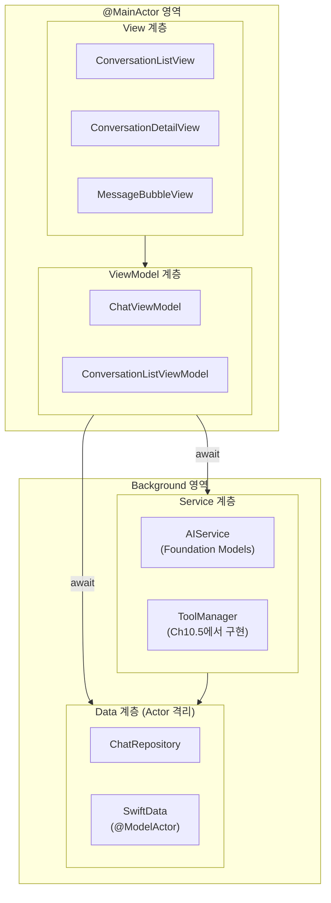
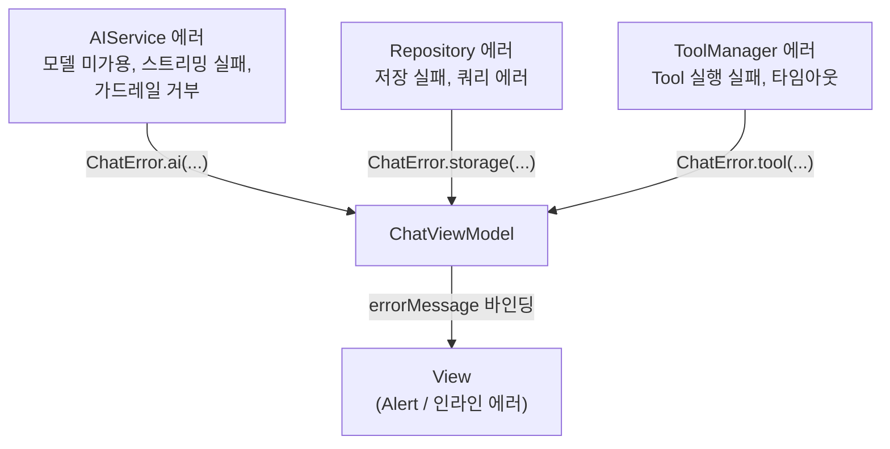
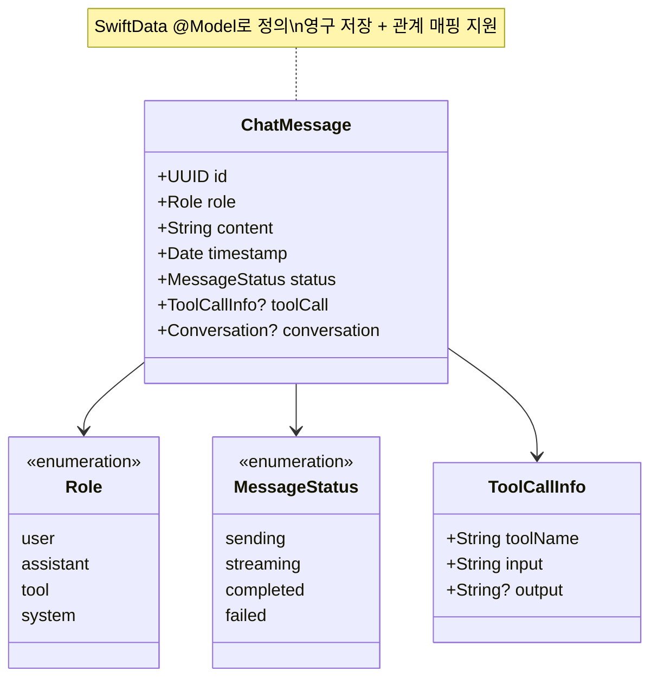
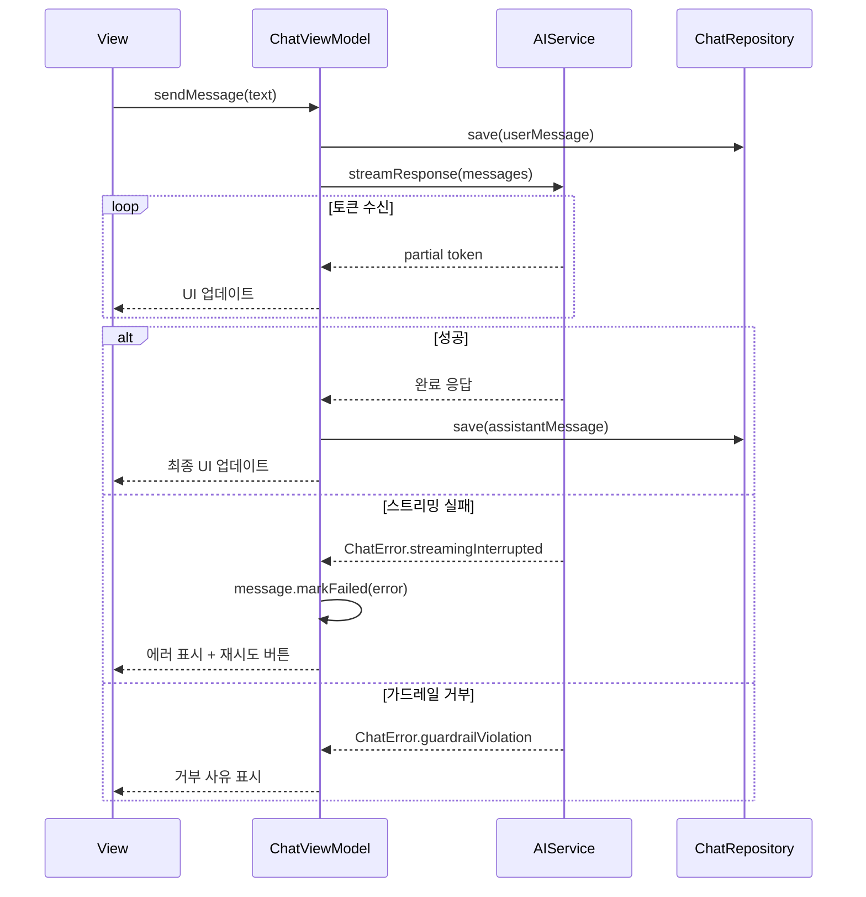
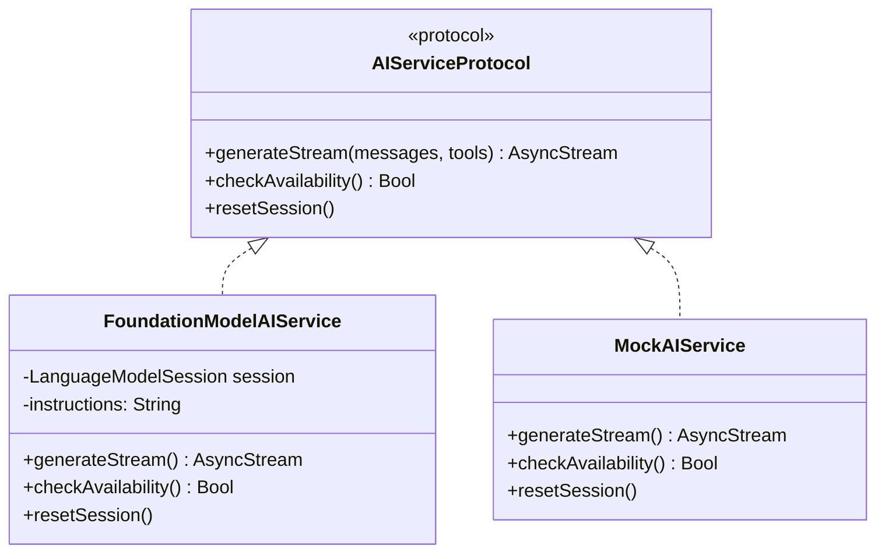
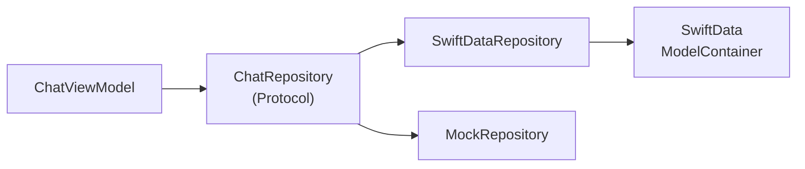
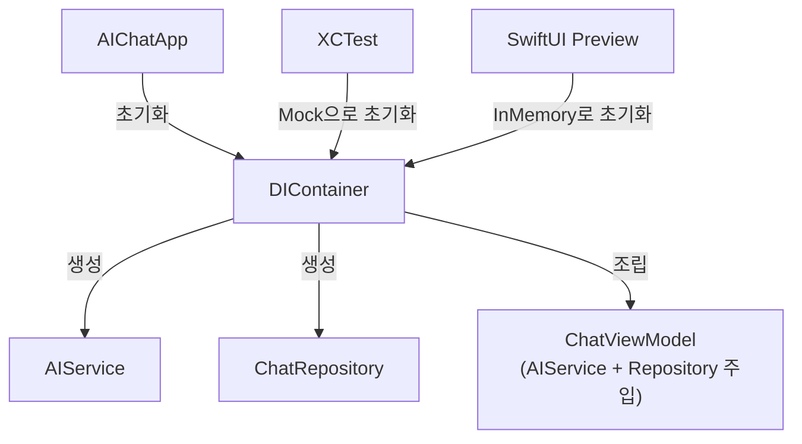
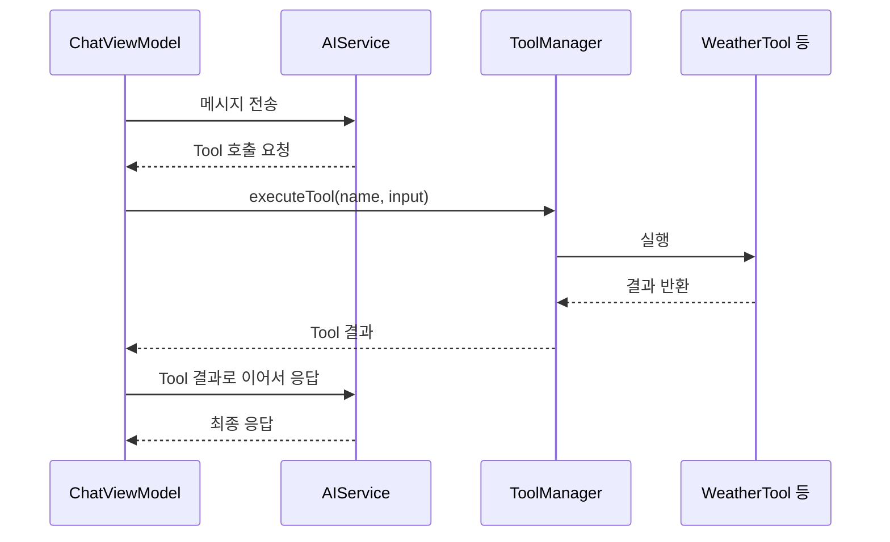

# 채팅봇 앱 아키텍처 설계

> Foundation Models의 핵심 기능을 통합한 AI 채팅봇 앱의 전체 아키텍처를 MVVM + Repository 패턴으로 설계하고, 동시성 안전한 의존성 주입 전략까지 수립한다

## 개요

이 섹션에서는 Ch1부터 Ch9까지 배운 모든 Foundation Models 기능을 하나의 완성된 채팅봇 앱으로 통합하기 위한 아키텍처를 설계합니다. 스트리밍 응답, 구조화 출력, Tool Calling, 멀티턴 세션 관리를 하나의 앱에서 조화롭게 동작시키려면 명확한 계층 분리와 데이터 흐름 설계가 필수입니다. 나아가, Swift Concurrency 환경에서 `Sendable` 준수, actor 격리, 그리고 의존성 주입 컨테이너 설계까지 고려해야 프로덕션 수준의 아키텍처가 완성됩니다.

**선수 지식**: [스트리밍 응답과 실시간 UI](06-ch6-스트리밍-응답과-실시간-ui/01-01-streamresponse-api-기초.md), [Tool Calling 기초](07-ch7-tool-calling-기초/01-01-tool-calling-개념과-아키텍처.md), [세션 관리와 멀티턴 대화](09-ch9-세션-관리와-멀티턴-대화/01-01-멀티턴-대화의-컨텍스트-관리.md)

**학습 목표**:
- AI 채팅봇 앱의 전체 아키텍처를 MVVM + Repository 패턴으로 설계하고, 각 계층의 동시성 모델을 결정한다
- ChatMessage `@Model`, ChatViewModel, AIService 등 핵심 컴포넌트의 책임을 명확히 분리하고 에러 전파 경로를 설계한다
- Foundation Models의 세션 관리와 SwiftData 영구 저장을 통합하는 데이터 흐름을 이해하고, DI 컨테이너로 조립한다

## 왜 알아야 할까?

"일단 코드부터 짜고 보자"는 접근은 간단한 데모에서는 통하지만, 실전 AI 채팅 앱에서는 금세 벽에 부딪힙니다. 스트리밍 응답을 받으면서 동시에 UI를 업데이트하고, Tool 호출 결과를 기다리고, 대화 히스토리를 영구 저장해야 하는데 — 이 모든 것이 하나의 View나 ViewController에 뒤엉키면 어떻게 될까요?

특히 Swift Concurrency 환경에서는 `@MainActor`, `actor`, `Sendable` 같은 동시성 제약이 아키텍처 설계에 직접적인 영향을 미칩니다. ViewModel은 `@MainActor`에서 동작해야 UI를 업데이트할 수 있고, Repository는 별도 actor에서 SwiftData를 안전하게 다뤄야 하며, AIService는 백그라운드에서 스트리밍을 수신하면서도 결과를 메인 스레드로 전달해야 합니다. 이런 동시성 경계를 설계 단계에서 명확히 하지 않으면, 런타임에 데이터 레이스와 크래시가 발생합니다.

실제로 Apple의 오픈소스 예제인 [FoundationChat](https://github.com/Dimillian/FoundationChat)을 보면, `ChatEngine`이라는 서비스 레이어가 Foundation Models 세션을 캡슐화하고, SwiftData가 대화를 영구 저장하며, View는 순수하게 UI 렌더링에만 집중합니다. 이런 계층 분리가 없었다면 스트리밍 + Tool Calling + 영구 저장이라는 세 가지 비동기 작업이 한곳에서 충돌했을 겁니다.

이 섹션에서 설계하는 아키텍처는 이후 5개 섹션에서 코드로 구현할 청사진이 됩니다. 설계가 탄탄해야 구현이 순탄합니다.

## 핵심 개념

### 개념 1: 채팅 앱 아키텍처의 전체 그림

> 💡 **비유**: 채팅 앱의 아키텍처는 레스토랑과 같습니다. **홀(View)**은 손님이 주문하고 음식을 받는 곳이고, **매니저(ViewModel)**는 주문을 받아 주방에 전달하고 진행 상황을 홀에 알려줍니다. **주방(AIService)**은 실제로 요리(AI 추론)를 하는 곳이며, **냉장고(Repository)**는 재료(대화 히스토리)를 보관합니다. 각자의 역할이 명확하기 때문에 레스토랑이 효율적으로 돌아가는 거죠. 여기서 중요한 건 — 주방장이 직접 홀에 나와 서빙하면 안 되듯이, **각 계층은 자기 역할만 수행하고 다른 계층의 내부를 건드리지 않습니다**.

우리가 만들 AI 채팅봇 앱은 크게 4개의 계층으로 나뉘며, 각 계층은 명확한 **동시성 모델**을 갖습니다.

> 📊 **그림 1**: AI 채팅봇 앱의 4계층 아키텍처와 동시성 경계



각 계층의 책임과 동시성 모델을 정리하면 이렇습니다:

| 계층 | 핵심 책임 | 주요 타입 | 동시성 모델 |
|------|-----------|-----------|------------|
| **View** | UI 렌더링, 사용자 입력 수집 | SwiftUI Views | `@MainActor` (자동) |
| **ViewModel** | 상태 관리, 비즈니스 로직 조율 | `@Observable` 클래스 | `@MainActor` (명시) |
| **Service** | AI 추론, Tool 호출 | `AIService`, `ToolManager` | `Sendable`, nonisolated |
| **Data** | 영구 저장, 데이터 접근 | `ChatRepository`, SwiftData `@Model` | `@ModelActor` (전용 actor) |

이 4계층 구조에서 핵심 규칙은 **의존성의 방향이 항상 아래로만 흐른다**는 것입니다. View는 ViewModel을 알지만, ViewModel은 View를 모릅니다. Service는 Repository를 알지만, Repository는 Service를 모릅니다. 이 단방향 의존성 덕분에 각 계층을 독립적으로 테스트하고 교체할 수 있습니다.

그리고 동시성 경계를 넘는 모든 호출에는 `await`가 필요합니다. `@MainActor`인 ViewModel이 `@ModelActor`인 Repository를 호출하면, Swift 컴파일러가 자동으로 actor 간 전환을 처리하죠. 이것이 설계 단계에서 각 계층의 actor 격리를 명확히 해야 하는 이유입니다.

> 💡 **구현 로드맵**: 이 아키텍처의 모든 컴포넌트를 한 번에 만들지는 않습니다. 다음 순서로 점진적으로 구현해 나갑니다:
> - **10.2**: 채팅 UI (View 계층)
> - **10.3**: AIService 연동과 스트리밍 (Service 계층)
> - **10.4**: SwiftData 영구 저장 (Data 계층) — `ChatMessage`를 `@Model`로 활용
> - **10.5**: ToolManager 통합 (Service 계층 확장)
> - **10.6**: 마무리와 폴리싱
>
> 따라서 10.2~10.4에서는 `ToolManager`가 아직 구현되지 않은 상태로 진행되며, 아키텍처 상에 자리만 잡아둡니다. 10.5에서 본격적으로 Tool Calling을 통합할 때 이 설계가 빛을 발하게 됩니다.

### 개념 2: 에러 전파 전략과 타입 설계

> 💡 **비유**: 에러 처리는 비상 연락망과 같습니다. 주방에서 가스가 새면(AI 서비스 에러), 매니저에게 보고하고(ViewModel), 매니저는 손님에게 상황을 안내합니다(View). 중요한 건 주방 직원이 직접 손님에게 소리치면 안 된다는 거죠 — 에러도 계층을 따라 전파됩니다.

4계층 아키텍처에서 에러는 여러 지점에서 발생할 수 있습니다. AI 모델이 가용하지 않을 수도, 스트리밍이 중간에 끊길 수도, SwiftData 저장이 실패할 수도 있죠. 이 모든 에러를 일관성 있게 처리하려면 **도메인별 에러 타입**을 설계해야 합니다.

> 📊 **그림 2**: 에러 발생 지점과 전파 경로



```swift
import Foundation

// MARK: - 도메인 에러 타입
// 각 계층의 에러를 통합된 타입으로 래핑합니다.
// ViewModel은 이 타입만 알면 모든 에러를 일관되게 처리할 수 있습니다.
enum ChatError: LocalizedError {
    // AI 서비스 관련
    case modelUnavailable
    case streamingInterrupted(underlying: Error)
    case guardrailViolation(message: String)
    case sessionExpired
    
    // 데이터 저장 관련
    case saveFailed(underlying: Error)
    case fetchFailed(underlying: Error)
    case conversationNotFound(id: UUID)
    
    // Tool 관련
    case toolNotFound(name: String)
    case toolExecutionFailed(name: String, underlying: Error)
    case toolTimeout(name: String, seconds: TimeInterval)
    
    var errorDescription: String? {
        switch self {
        case .modelUnavailable:
            return "AI 모델을 사용할 수 없습니다. 기기 설정을 확인해주세요."
        case .streamingInterrupted:
            return "응답 수신 중 연결이 끊어졌습니다."
        case .guardrailViolation(let message):
            return "요청을 처리할 수 없습니다: \(message)"
        case .sessionExpired:
            return "세션이 만료되었습니다. 새 대화를 시작해주세요."
        case .saveFailed:
            return "메시지 저장에 실패했습니다."
        case .fetchFailed:
            return "대화 내역을 불러올 수 없습니다."
        case .conversationNotFound:
            return "대화를 찾을 수 없습니다."
        case .toolNotFound(let name):
            return "'\(name)' 도구를 찾을 수 없습니다."
        case .toolExecutionFailed(let name, _):
            return "'\(name)' 도구 실행에 실패했습니다."
        case .toolTimeout(let name, let seconds):
            return "'\(name)' 도구가 \(Int(seconds))초 내에 응답하지 않았습니다."
        }
    }
    
    /// 사용자에게 재시도 옵션을 보여줄지 여부
    var isRetryable: Bool {
        switch self {
        case .streamingInterrupted, .saveFailed, .toolTimeout:
            return true
        case .modelUnavailable, .guardrailViolation, .sessionExpired,
             .fetchFailed, .conversationNotFound, .toolNotFound, .toolExecutionFailed:
            return false
        }
    }
}
```

`isRetryable` 속성이 왜 중요한지 눈여겨보세요. View에서 에러를 표시할 때, 재시도 가능한 에러에는 "다시 시도" 버튼을, 불가능한 에러에는 "확인" 버튼만 보여줄 수 있습니다. 이런 구분이 없으면 모든 에러에 무조건 재시도 버튼을 달거나, 아예 안 달거나 — 어느 쪽이든 좋지 않은 UX가 됩니다.

### 개념 3: 메시지 모델 설계

> 💡 **비유**: 메시지 모델은 우편 봉투와 같습니다. 보낸 사람(role), 내용물(content), 발송일(timestamp), 그리고 추적 번호(id)가 적혀 있죠. AI 채팅에서는 여기에 "특수 우편물 표시"까지 추가됩니다 — 이 메시지가 Tool 호출 결과인지, 스트리밍 중인지, 에러인지 알려주는 표시요.

채팅 앱의 메시지 모델은 단순한 텍스트 저장소가 아닙니다. Foundation Models와의 상호작용에서 발생하는 다양한 상태를 담아야 합니다. 여기서 중요한 설계 결정이 하나 있습니다 — **`ChatMessage`를 처음부터 SwiftData `@Model`로 정의한다**는 것입니다.

> 📊 **그림 3**: 메시지 모델의 구조와 역할(Role) 분류



왜 처음부터 `@Model`로 설계할까요? 일반 `struct`로 시작해서 나중에 `@Model`로 변환하는 접근도 가능하지만, 그 과정에서 값 타입과 참조 타입의 동작 차이, `Relationship` 속성 추가, `Identifiable` 구현 변경 등 상당한 리팩토링이 필요합니다. 처음부터 `@Model`로 정의하면 [대화 영구 저장과 복원](10-ch10-실전-프로젝트-ai-채팅봇-앱/04-04-대화-영구-저장과-복원.md)에서 SwiftData 통합을 매끄럽게 진행할 수 있습니다.

이 설계의 또 다른 핵심은 `MessageStatus`입니다. 메시지가 "보내는 중", "스트리밍 수신 중", "완료", "실패" 중 어떤 상태인지를 UI가 즉시 알 수 있어야 스트리밍 애니메이션, 에러 표시, 재시도 버튼 등을 적절히 보여줄 수 있거든요.

```swift
import Foundation
import SwiftData

// MARK: - 메시지 역할 정의
enum MessageRole: String, Codable {
    case user       // 사용자가 보낸 메시지
    case assistant  // AI가 생성한 응답
    case tool       // Tool 호출 결과
    case system     // 시스템 안내 메시지
}

// MARK: - 메시지 상태 추적
enum MessageStatus: String, Codable {
    case sending    // 전송 중 (사용자 메시지)
    case streaming  // 스트리밍 수신 중 (AI 응답)
    case completed  // 완료
    case failed     // 실패
}

// MARK: - 메시지 모델 (SwiftData 영구 저장)
// 처음부터 @Model로 정의하여 SwiftData 통합을 원활하게 합니다.
// 10.4에서 실제 영구 저장을 구현할 때 별도 변환 없이 바로 사용할 수 있습니다.
@Model
final class ChatMessage {
    @Attribute(.unique) var id: UUID
    var role: MessageRole
    var content: String
    var timestamp: Date
    var status: MessageStatus
    
    // Tool Calling 관련 메타데이터
    // (10.5에서 ToolManager 통합 시 활용)
    var toolName: String?
    var toolInput: String?
    var toolOutput: String?
    
    // 에러 정보 (실패 시 UI에서 원인 표시용)
    var errorDescription: String?
    
    // 소속 대화
    var conversation: Conversation?
    
    init(
        role: MessageRole,
        content: String,
        status: MessageStatus = .completed
    ) {
        self.id = UUID()
        self.role = role
        self.content = content
        self.timestamp = Date()
        self.status = status
    }
    
    /// 실패 상태로 전환하며 에러 정보를 기록
    func markFailed(error: ChatError) {
        self.status = .failed
        self.errorDescription = error.errorDescription
    }
}
```

> ⚠️ **흔한 오해**: "메시지 모델에 `status` 같은 상태 필드는 필요 없다"고 생각하기 쉽습니다. 하지만 스트리밍 응답 중에 사용자가 앱을 백그라운드로 보냈다 돌아오면, 해당 메시지가 아직 수신 중인지 완료됐는지 알 방법이 필요합니다. `status` 없이는 UI가 "무한 로딩" 상태에 빠질 수 있어요.

### 개념 4: ChatViewModel — 상태 관리의 중심

> 💡 **비유**: ChatViewModel은 오케스트라의 지휘자입니다. 바이올린(UI), 첼로(AI 서비스), 피아노(데이터 저장) 각각이 훌륭해도, 지휘자 없이는 함께 연주할 수 없죠. 지휘자는 직접 악기를 연주하지 않지만, 누가 언제 어떻게 연주할지 조율합니다.

ChatViewModel은 이 앱에서 가장 중요한 컴포넌트입니다. 사용자 입력을 받아 AI 서비스에 전달하고, 스트리밍 응답을 실시간으로 UI에 반영하며, 완료된 대화를 저장소에 기록하는 — 모든 흐름의 교차점이기 때문이죠.

> 📊 **그림 4**: ChatViewModel의 데이터 흐름 (에러 처리 포함)



ViewModel의 핵심 설계를 코드로 보겠습니다:

```swift
import Foundation
import Observation

// MARK: - ChatViewModel: 대화 흐름의 지휘자
@MainActor
@Observable
final class ChatViewModel {
    // MARK: - UI 바인딩 상태
    var messages: [ChatMessage] = []
    var inputText: String = ""
    var isResponding: Bool = false
    var streamingText: String = ""
    var errorMessage: String?
    var isRetryAvailable: Bool = false
    
    // MARK: - 의존성 (Protocol 기반)
    private let aiService: AIServiceProtocol
    private let repository: ChatRepositoryProtocol
    private let conversation: Conversation
    
    // MARK: - 스트리밍 제어
    private var streamingTask: Task<Void, Never>?
    private var lastFailedPrompt: String?  // 재시도용
    
    init(
        conversation: Conversation,
        aiService: AIServiceProtocol,
        repository: ChatRepositoryProtocol
    ) {
        self.conversation = conversation
        self.aiService = aiService
        self.repository = repository
    }
    
    // MARK: - 메시지 전송
    func sendMessage() {
        let text = inputText.trimmingCharacters(in: .whitespacesAndNewlines)
        guard !text.isEmpty, !isResponding else { return }
        
        inputText = ""
        errorMessage = nil
        isRetryAvailable = false
        
        // 1. 사용자 메시지 추가 및 저장
        let userMessage = ChatMessage(role: .user, content: text)
        messages.append(userMessage)
        repository.save(userMessage, to: conversation)
        
        // 2. AI 응답 스트리밍 시작
        let placeholder = ChatMessage(
            role: .assistant,
            content: "",
            status: .streaming
        )
        messages.append(placeholder)
        isResponding = true
        lastFailedPrompt = text
        
        streamingTask = Task {
            await streamResponse(for: placeholder)
        }
    }
    
    // MARK: - 스트리밍 응답 처리
    private func streamResponse(for message: ChatMessage) async {
        do {
            let stream = aiService.generateStream(
                prompt: message.content,
                history: messages
            )
            for try await token in stream {
                message.content += token
                streamingText = message.content
            }
            // 성공 완료
            message.status = .completed
            repository.save(message, to: conversation)
            lastFailedPrompt = nil
        } catch let error as ChatError {
            message.markFailed(error: error)
            errorMessage = error.errorDescription
            isRetryAvailable = error.isRetryable
        } catch {
            let chatError = ChatError.streamingInterrupted(underlying: error)
            message.markFailed(error: chatError)
            errorMessage = chatError.errorDescription
            isRetryAvailable = true
        }
        isResponding = false
    }
    
    // MARK: - 재시도
    func retryLastMessage() {
        guard let prompt = lastFailedPrompt else { return }
        // 실패한 assistant 메시지 제거
        if let last = messages.last, last.status == .failed {
            messages.removeLast()
        }
        inputText = prompt
        sendMessage()
    }
    
    // MARK: - 스트리밍 취소
    func cancelStreaming() {
        streamingTask?.cancel()
        streamingTask = nil
        isResponding = false
        
        if let last = messages.last, last.status == .streaming {
            last.status = .completed  // 부분 응답 유지
            repository.save(last, to: conversation)
        }
    }
}
```

여기서 주목할 설계 포인트가 네 가지 있습니다:

1. **프로토콜 기반 의존성**: `AIServiceProtocol`과 `ChatRepositoryProtocol`을 사용하여, 테스트 시 Mock 객체로 교체할 수 있습니다
2. **placeholder 메시지**: 스트리밍 시작 전에 빈 assistant 메시지를 미리 추가하여, 타이핑 애니메이션의 "그릇"을 준비합니다
3. **Task 기반 취소**: `streamingTask`를 보관하여 사용자가 언제든 스트리밍을 중단할 수 있습니다. 취소 시 부분 응답을 버리지 않고 `completed`로 저장합니다
4. **에러-재시도 루프**: `lastFailedPrompt`를 보관하여 실패 시 "재시도" 한 번으로 동일 요청을 다시 보낼 수 있습니다

### 개념 5: AIService — Foundation Models 캡슐화

> 💡 **비유**: AIService는 통역사입니다. 앱의 나머지 부분은 한국어(Swift 타입)로 말하고, Foundation Models는 자체 프로토콜로 통신합니다. AIService가 이 둘 사이에서 번역을 해주므로, 앱이 Foundation Models의 내부 구현 변경에 영향받지 않습니다.

AI 서비스 레이어는 `LanguageModelSession`을 직접 다루는 유일한 계층입니다. 나머지 코드는 Foundation Models 프레임워크를 직접 import할 필요가 없죠.

> 📊 **그림 5**: AIService의 프로토콜 추상화와 구현



프로토콜 정의와 실제 구현의 골격을 살펴봅시다:

```swift
import FoundationModels

// MARK: - AI 서비스 프로토콜 (테스트 용이성을 위한 추상화)
protocol AIServiceProtocol: Sendable {
    /// 스트리밍 응답 생성
    func generateStream(
        prompt: String,
        history: [ChatMessage]
    ) -> AsyncThrowingStream<String, Error>
    
    /// 모델 가용성 확인
    func checkAvailability() -> Bool
    
    /// 세션 초기화
    func resetSession()
}

// MARK: - Foundation Models 기반 구현
final class FoundationModelAIService: AIServiceProtocol {
    private var session: LanguageModelSession
    private let instructions: String
    
    init(instructions: String = "당신은 도움이 되는 AI 어시스턴트입니다.") {
        self.instructions = instructions
        self.session = LanguageModelSession(
            instructions: instructions
        )
    }
    
    func checkAvailability() -> Bool {
        SystemLanguageModel.default.isAvailable
    }
    
    func resetSession() {
        session = LanguageModelSession(
            instructions: instructions
        )
    }
    
    func generateStream(
        prompt: String,
        history: [ChatMessage]
    ) -> AsyncThrowingStream<String, Error> {
        AsyncThrowingStream { continuation in
            Task {
                do {
                    // 가용성 사전 확인
                    guard self.checkAvailability() else {
                        continuation.finish(
                            throwing: ChatError.modelUnavailable
                        )
                        return
                    }
                    
                    // 스트리밍 응답 수신
                    let stream = session.streamResponse(to: prompt)
                    for try await partial in stream {
                        // Task 취소 감지
                        try Task.checkCancellation()
                        continuation.yield(partial.content)
                    }
                    continuation.finish()
                } catch is CancellationError {
                    continuation.finish()  // 정상 취소
                } catch let error as LanguageModelSession.GenerationError {
                    // Foundation Models 고유 에러를 ChatError로 변환
                    let chatError = ChatError.guardrailViolation(
                        message: error.localizedDescription
                    )
                    continuation.finish(throwing: chatError)
                } catch {
                    continuation.finish(
                        throwing: ChatError.streamingInterrupted(
                            underlying: error
                        )
                    )
                }
            }
        }
    }
}
```

이 설계에서 `AIServiceProtocol`이 왜 중요한지 한 가지 예를 들어볼게요. [AI 서비스 모킹과 단위 테스트](19-ch19-테스트와-품질-보증/02-02-ai-서비스-모킹과-단위-테스트.md)에서 다루겠지만, 실제 디바이스 없이도 `MockAIService`를 주입하면 전체 채팅 흐름을 테스트할 수 있습니다. Foundation Models는 시뮬레이터에서 동작하지 않기 때문에 이 추상화가 개발 과정에서 매우 큰 가치를 발휘합니다.

또 하나 주목할 점은 에러 변환입니다. `generateStream` 내부에서 Foundation Models의 `GenerationError`를 `ChatError`로 변환하므로, ViewModel은 Foundation Models를 전혀 몰라도 에러를 처리할 수 있습니다. 계층 간 에러 번역도 AIService의 책임인 거죠.

### 개념 6: Repository 패턴으로 데이터 접근 분리

> 💡 **비유**: Repository는 도서관 사서와 같습니다. 책(데이터)이 서가의 어디에 있는지는 사서만 알면 됩니다. 이용자(ViewModel)는 "이 책 찾아주세요"라고 요청만 하면 되죠. 나중에 도서관이 전자도서관으로 바뀌어도 이용자의 요청 방식은 달라지지 않습니다.

SwiftData를 직접 ViewModel에서 사용하는 것도 가능하지만, Repository 레이어를 두면 데이터 접근 로직을 한곳에 모을 수 있습니다.

> 📊 **그림 6**: Repository 패턴의 데이터 흐름



```swift
import SwiftData

// MARK: - Repository 프로토콜
protocol ChatRepositoryProtocol: Sendable {
    func fetchConversations() -> [Conversation]
    func fetchMessages(for conversation: Conversation) -> [ChatMessage]
    func save(_ message: ChatMessage, to conversation: Conversation)
    func createConversation(title: String) -> Conversation
    func deleteConversation(_ conversation: Conversation)
}

// MARK: - SwiftData 기반 구현
@ModelActor
actor SwiftDataChatRepository: ChatRepositoryProtocol {
    
    func fetchConversations() -> [Conversation] {
        let descriptor = FetchDescriptor<Conversation>(
            sortBy: [SortDescriptor(\.updatedAt, order: .reverse)]
        )
        return (try? modelContext.fetch(descriptor)) ?? []
    }
    
    func save(_ message: ChatMessage, to conversation: Conversation) {
        message.conversation = conversation
        modelContext.insert(message)
        conversation.updatedAt = Date()
        try? modelContext.save()
    }
    
    func createConversation(title: String) -> Conversation {
        let conversation = Conversation(title: title)
        modelContext.insert(conversation)
        try? modelContext.save()
        return conversation
    }
    
    func deleteConversation(_ conversation: Conversation) {
        modelContext.delete(conversation)
        try? modelContext.save()
    }
    
    func fetchMessages(for conversation: Conversation) -> [ChatMessage] {
        let conversationId = conversation.id
        let descriptor = FetchDescriptor<ChatMessage>(
            predicate: #Predicate { $0.conversation?.id == conversationId },
            sortBy: [SortDescriptor(\.timestamp)]
        )
        return (try? modelContext.fetch(descriptor)) ?? []
    }
}
```

`@ModelActor`를 사용한 이유가 궁금하실 텐데요. SwiftData의 `ModelContext`는 스레드 세이프하지 않습니다. `@ModelActor`는 전용 actor에서 데이터 접근을 직렬화하여 동시성 문제를 깔끔하게 해결합니다. 이 부분은 [대화 영구 저장과 복원](10-ch10-실전-프로젝트-ai-채팅봇-앱/04-04-대화-영구-저장과-복원.md)에서 자세히 구현합니다.

### 개념 7: 의존성 주입 컨테이너

앞에서 각 계층의 타입과 프로토콜을 정의했으니, 이제 이것들을 **어디서, 어떻게 조립할지** 결정해야 합니다. 가장 단순한 방법은 `App` 진입점에서 직접 생성하는 것이지만, 앱이 커지면 Preview, 테스트, 다른 Scene 등 다양한 진입점에서 동일한 조립 로직이 반복됩니다.

> 📊 **그림 7**: DI 컨테이너와 의존성 조립 흐름



```swift
import SwiftData

// MARK: - 의존성 주입 컨테이너
// 모든 서비스 인스턴스의 생성과 생명주기를 관리합니다.
// 앱, 테스트, Preview에서 각각 다른 설정으로 초기화할 수 있습니다.
@MainActor
final class DIContainer {
    let modelContainer: ModelContainer
    let aiService: AIServiceProtocol
    let repository: ChatRepositoryProtocol
    
    // 프로덕션 환경
    init(instructions: String = "당신은 친절하고 유능한 AI 어시스턴트입니다.") {
        let schema = Schema([Conversation.self, ChatMessage.self])
        let config = ModelConfiguration(isStoredInMemoryOnly: false)
        self.modelContainer = try! ModelContainer(
            for: schema, configurations: [config]
        )
        self.aiService = FoundationModelAIService(instructions: instructions)
        self.repository = SwiftDataChatRepository(
            modelContainer: modelContainer
        )
    }
    
    // 테스트/Preview 환경
    init(
        aiService: AIServiceProtocol,
        inMemory: Bool = true
    ) {
        let schema = Schema([Conversation.self, ChatMessage.self])
        let config = ModelConfiguration(isStoredInMemoryOnly: inMemory)
        self.modelContainer = try! ModelContainer(
            for: schema, configurations: [config]
        )
        self.aiService = aiService
        self.repository = SwiftDataChatRepository(
            modelContainer: modelContainer
        )
    }
    
    // MARK: - ViewModel 팩토리
    func makeChatViewModel(
        for conversation: Conversation
    ) -> ChatViewModel {
        ChatViewModel(
            conversation: conversation,
            aiService: aiService,
            repository: repository
        )
    }
}
```

이 컨테이너 덕분에 테스트 코드에서는 이렇게 한 줄로 Mock 환경을 구성할 수 있습니다:

```swift
// 테스트에서의 사용 예
let container = DIContainer(
    aiService: MockAIService(),  // 실제 모델 대신 Mock 주입
    inMemory: true               // 영구 저장 없이 메모리만 사용
)
let viewModel = container.makeChatViewModel(for: testConversation)
```

### 개념 8: ToolManager의 위치와 역할

아키텍처 다이어그램(그림 1)에서 Service 계층에 `ToolManager`가 포함되어 있는 것을 눈치채셨을 겁니다. ToolManager는 날씨 조회, 웹 검색 등 외부 도구를 등록하고, AI가 요청하면 실행하는 컴포넌트입니다.

> 📊 **그림 8**: ToolManager의 역할과 실행 흐름



이 흐름이 실제로 동작하려면 AIService가 Tool 스키마를 알아야 하고, ChatViewModel이 Tool 호출 응답을 감지하여 ToolManager에 위임해야 합니다. 이 통합은 꽤 복잡한 작업이므로, 먼저 **10.2~10.4에서 UI, 스트리밍, 영구 저장이라는 기본 인프라를 완성**한 뒤, [Tool 통합과 확장](10-ch10-실전-프로젝트-ai-채팅봇-앱/05-05-tool-통합과-확장.md)에서 본격적으로 구현합니다.

지금은 아키텍처 상에 ToolManager의 자리를 잡아두는 것만으로 충분합니다. 이것이 바로 설계의 가치입니다 — 나중에 추가될 기능의 위치를 미리 정해두면, 실제 구현 시 기존 코드를 크게 변경할 필요가 없습니다.

## 실습: 직접 해보기

이제 전체 아키텍처의 골격을 하나의 Xcode 프로젝트로 잡아보겠습니다. 아직 AI 추론이나 UI 구현은 하지 않고, **타입 정의와 의존성 연결**에만 집중합니다.

```swift
import SwiftUI
import SwiftData
import FoundationModels

// MARK: - 1. 데이터 모델 정의

@Model
final class Conversation {
    @Attribute(.unique) var id: UUID
    var title: String
    var createdAt: Date
    var updatedAt: Date
    
    // 메시지와의 1:N 관계 (Cascade 삭제)
    @Relationship(deleteRule: .cascade, inverse: \ChatMessage.conversation)
    var messages: [ChatMessage] = []
    
    init(title: String) {
        self.id = UUID()
        self.title = title
        self.createdAt = Date()
        self.updatedAt = Date()
    }
}

// MARK: - 2. 앱 진입점 + DIContainer 활용

@main
struct AIChatApp: App {
    @State private var container = DIContainer(
        instructions: """
        당신은 친절하고 유능한 AI 어시스턴트입니다.
        한국어로 대화하며, 명확하고 간결하게 답변합니다.
        """
    )
    
    var body: some Scene {
        WindowGroup {
            ContentView()
                .environment(container)
        }
        .modelContainer(container.modelContainer)
    }
}

// MARK: - 3. 디렉토리 구조 출력 (프로젝트 구성 확인용)
func printProjectStructure() {
    let structure = """
    AIChatBot/
    ├── App/
    │   ├── AIChatApp.swift          // 앱 진입점
    │   └── DIContainer.swift        // 의존성 주입 컨테이너
    ├── Models/
    │   ├── Conversation.swift       // 대화 SwiftData @Model
    │   ├── ChatMessage.swift        // 메시지 SwiftData @Model
    │   ├── MessageRole.swift        // 역할/상태 열거형
    │   └── ChatError.swift          // 도메인 에러 타입
    ├── ViewModels/
    │   ├── ChatViewModel.swift      // 대화 상태 관리 + 에러 처리
    │   └── ConversationListViewModel.swift
    ├── Services/
    │   ├── AIServiceProtocol.swift  // AI 서비스 추상화
    │   ├── FoundationModelAIService.swift
    │   ├── MockAIService.swift      // 테스트/Preview용
    │   └── ToolManager.swift        // Tool 등록/실행 (10.5에서 구현)
    ├── Repositories/
    │   ├── ChatRepositoryProtocol.swift
    │   └── SwiftDataChatRepository.swift
    ├── Views/
    │   ├── ContentView.swift
    │   ├── ConversationListView.swift
    │   ├── ConversationDetailView.swift
    │   └── Components/
    │       ├── MessageBubbleView.swift
    │       └── InputBarView.swift
    └── Tools/                       // 10.5에서 구현
        ├── WeatherTool.swift
        └── SearchTool.swift
    """
    print(structure)
}
```

```run:swift
printProjectStructure()
```

```output
AIChatBot/
├── App/
│   ├── AIChatApp.swift          // 앱 진입점
│   └── DIContainer.swift        // 의존성 주입 컨테이너
├── Models/
│   ├── Conversation.swift       // 대화 SwiftData @Model
│   ├── ChatMessage.swift        // 메시지 SwiftData @Model
│   ├── MessageRole.swift        // 역할/상태 열거형
│   └── ChatError.swift          // 도메인 에러 타입
├── ViewModels/
│   ├── ChatViewModel.swift      // 대화 상태 관리 + 에러 처리
│   └── ConversationListViewModel.swift
├── Services/
│   ├── AIServiceProtocol.swift  // AI 서비스 추상화
│   ├── FoundationModelAIService.swift
│   ├── MockAIService.swift      // 테스트/Preview용
│   └── ToolManager.swift        // Tool 등록/실행 (10.5에서 구현)
├── Repositories/
│   ├── ChatRepositoryProtocol.swift
│   └── SwiftDataChatRepository.swift
├── Views/
│   ├── ContentView.swift
│   ├── ConversationListView.swift
│   ├── ConversationDetailView.swift
│   └── Components/
│       ├── MessageBubbleView.swift
│       └── InputBarView.swift
└── Tools/                       // 10.5에서 구현
    ├── WeatherTool.swift
    └── SearchTool.swift
```

각 파일의 역할을 정리하겠습니다:

| 디렉토리 | 파일 | 핵심 책임 |
|----------|------|-----------|
| `App/` | `AIChatApp.swift` | 앱 진입점, DIContainer 초기화 |
| `App/` | `DIContainer.swift` | 서비스 생성 + 의존성 조립 + ViewModel 팩토리 |
| `Models/` | `ChatMessage.swift` | 메시지 `@Model` — 상태 추적 + SwiftData 영구 저장 |
| `Models/` | `ChatError.swift` | 도메인 에러 타입 — 재시도 가능 여부 판단 |
| `ViewModels/` | `ChatViewModel.swift` | 스트리밍, Tool 호출, 저장, 에러 처리 조율 |
| `Services/` | `FoundationModelAIService.swift` | LanguageModelSession 캡슐화 + 에러 변환 |
| `Services/` | `ToolManager.swift` | Tool 등록/실행 관리 (10.5에서 구현) |
| `Repositories/` | `SwiftDataChatRepository.swift` | `@ModelActor` 기반 SwiftData CRUD |
| `Views/` | `ConversationDetailView.swift` | 채팅 UI 렌더링 |
| `Tools/` | `WeatherTool.swift` 등 | 개별 Tool 구현체 (10.5에서 구현) |

## 더 깊이 알아보기

### MVVM의 탄생과 진화

MVVM(Model-View-ViewModel) 패턴은 2005년 Microsoft의 Ken Cooper와 Ted Peters가 WPF(Windows Presentation Foundation) 프레임워크를 위해 고안했습니다. 당시 John Gossman이 자신의 블로그에 이 패턴을 공식적으로 소개하면서 세상에 알려졌죠.

흥미로운 점은 MVVM이 원래 데이터 바인딩이 강력한 프레임워크를 위해 설계되었다는 것입니다. SwiftUI의 `@Observable`이나 `@Published`가 바로 그 "데이터 바인딩"에 해당합니다. UIKit 시절에는 MVVM을 적용하려면 별도의 바인딩 라이브러리(RxSwift, Combine)가 필요했지만, SwiftUI에서는 프레임워크 자체가 바인딩을 지원하므로 MVVM이 자연스럽게 녹아듭니다.

2025년 `@Observable` 매크로가 도입되면서 MVVM은 한 단계 더 진화했습니다. 기존의 `ObservableObject` + `@Published` 조합보다 보일러플레이트가 훨씬 줄었고, 성능도 개선되었죠. 우리 프로젝트에서 `@Observable`을 사용하는 것도 이런 진화의 흐름을 따르는 것입니다.

### FoundationChat에서 배우는 실전 설계

Apple의 Thomas Ricouard가 만든 오픈소스 [FoundationChat](https://github.com/Dimillian/FoundationChat) 앱은 약간 다른 접근을 취합니다. 별도의 ViewModel 없이 `ChatEngine`이라는 `@Observable` 서비스를 View에서 직접 사용하죠. 이것은 "프로젝트 규모가 작을 때는 ViewModel 레이어를 생략해도 된다"는 실용적 판단입니다.

우리 프로젝트에서 MVVM을 채택한 이유는 Tool Calling, 구조화 출력, 멀티 세션 관리까지 통합해야 하는 **복잡도** 때문입니다. 기능이 많아질수록 계층 분리의 가치가 커집니다.

### Repository 패턴의 기원과 현대적 해석

Repository 패턴은 Martin Fowler의 *Patterns of Enterprise Application Architecture* (2002)에서 처음 정립되었습니다. 원래는 도메인 객체와 데이터 매핑 레이어 사이의 중재자로 정의되었는데, 핵심 아이디어는 "데이터 접근 로직을 컬렉션처럼 추상화한다"는 것이었죠.

SwiftData의 `@ModelActor`와 결합하면 이 패턴이 더욱 강력해집니다. `@ModelActor`는 actor 격리를 통해 `ModelContext` 접근을 직렬화하므로, 기존 Core Data에서 `performBackgroundTask`와 `viewContext`를 구분하던 복잡한 스레딩 코드를 깔끔하게 대체합니다. 이것은 Swift Concurrency가 기존 패턴을 어떻게 진화시키는지 보여주는 좋은 예입니다.

## 흔한 오해와 팁

> ⚠️ **흔한 오해**: "LanguageModelSession을 View에서 직접 생성해도 된다"고 생각하기 쉽습니다. 작은 데모에서는 동작하지만, 세션이 View의 생명주기에 묶이면 화면 전환 시 세션이 파괴되어 대화 맥락을 잃습니다. 세션은 반드시 View보다 긴 생명주기를 가진 Service 레이어에서 관리해야 합니다.

> 💡 **알고 계셨나요?** Foundation Models의 `LanguageModelSession`은 내부적으로 KV-Cache를 관리합니다. 세션을 새로 만들면 캐시도 초기화되므로, 같은 세션을 재사용하는 것이 첫 토큰 응답 시간(Time-to-First-Token)에 유리합니다. 이것이 `resetSession()` 메서드를 "새 세션 생성"으로 구현한 이유이기도 합니다 — 명시적으로 호출할 때만 캐시가 리셋됩니다.

> 🔥 **실무 팁**: `@ModelActor`를 Repository에 적용할 때, 모든 SwiftData 작업이 해당 actor의 실행 컨텍스트에서 이루어집니다. ViewModel에서 repository 메서드를 호출할 때는 반드시 `await`를 붙여야 합니다. 이 패턴이 처음엔 번거롭게 느껴지지만, 동시에 여러 메시지를 저장하는 상황에서 데이터 레이스를 원천 차단합니다.

> 🔥 **실무 팁**: 에러 타입을 설계할 때 `isRetryable` 같은 메타 정보를 넣어두면, View에서 조건 분기 없이 바로 UI를 결정할 수 있습니다. "이 에러가 재시도 가능한가?"를 ViewModel이나 View에서 `switch`로 매번 판단하는 것보다 훨씬 깔끔하죠. 에러가 자기 자신을 가장 잘 아는 법이니까요.

## 핵심 정리

| 개념 | 설명 |
|------|------|
| **4계층 아키텍처** | View → ViewModel → Service → Data, 의존성은 항상 아래로만 흐르고 동시성 경계가 명확 |
| **동시성 모델** | View/ViewModel은 `@MainActor`, Repository는 `@ModelActor`, Service는 `Sendable` — actor 간 전환에 `await` 필수 |
| **ChatError** | 도메인 에러 타입으로 AI/Storage/Tool 에러를 통합. `isRetryable`로 UI 분기 결정 |
| **ChatMessage (@Model)** | role, content, timestamp, status를 포함하는 SwiftData 모델. 에러 시 `markFailed()`로 실패 정보 기록 |
| **ChatViewModel** | `@Observable`로 UI 상태 관리. 에러 처리와 재시도 로직까지 포함하는 지휘자 역할 |
| **AIServiceProtocol** | Foundation Models를 프로토콜로 추상화. 에러 변환 책임도 Service 계층에 위임 |
| **ChatRepository** | `@ModelActor` 기반 SwiftData 접근 계층. 동시성 안전한 데이터 CRUD |
| **DIContainer** | 서비스 생성과 조립을 중앙 관리. 프로덕션/테스트/Preview 환경별 초기화 지원 |

## 다음 섹션 미리보기

아키텍처의 청사진이 완성되었으니, 다음 섹션 [채팅 UI 구현](10-ch10-실전-프로젝트-ai-채팅봇-앱/02-02-채팅-ui-구현.md)에서는 이 설계를 바탕으로 실제 SwiftUI 채팅 화면을 만듭니다. 메시지 버블, 스크롤 동작, 입력 바, 스트리밍 타이핑 애니메이션까지 — View 계층을 완성하는 시간입니다. 이 단계에서는 아직 AIService와 ToolManager 연동 없이, UI 자체에만 집중합니다.

## 참고 자료

- [FoundationChat — GitHub (Dimillian)](https://github.com/Dimillian/FoundationChat) - Foundation Models를 활용한 실전 채팅 앱 오픈소스. ChatEngine 설계와 SwiftData 통합 패턴 참고
- [Building AI features using Foundation Models — Swift with Majid](https://swiftwithmajid.com/2025/08/19/building-ai-features-using-foundation-models/) - LanguageModelSession 생성, 가용성 확인, GenerationOptions 설정 패턴 정리
- [Foundation Models — Apple Developer Documentation](https://developer.apple.com/documentation/FoundationModels) - 공식 API 레퍼런스. SystemLanguageModel, LanguageModelSession 등 전체 클래스 문서
- [Building an AI Chatbot in SwiftUI with Foundation Models Framework — swiftyplace](https://www.swiftyplace.com/blog/foundation-models-framework) - MVVM 기반 ChatViewModel 설계와 스트리밍 통합 실전 가이드
- [Meet the Foundation Models framework — WWDC25](https://developer.apple.com/videos/play/wwdc2025/286/) - 프레임워크 전체 개요와 설계 철학을 이해하는 공식 세션
- [Patterns of Enterprise Application Architecture — Martin Fowler](https://martinfowler.com/eaaCatalog/repository.html) - Repository 패턴의 원전. 데이터 접근 추상화의 고전적 정의