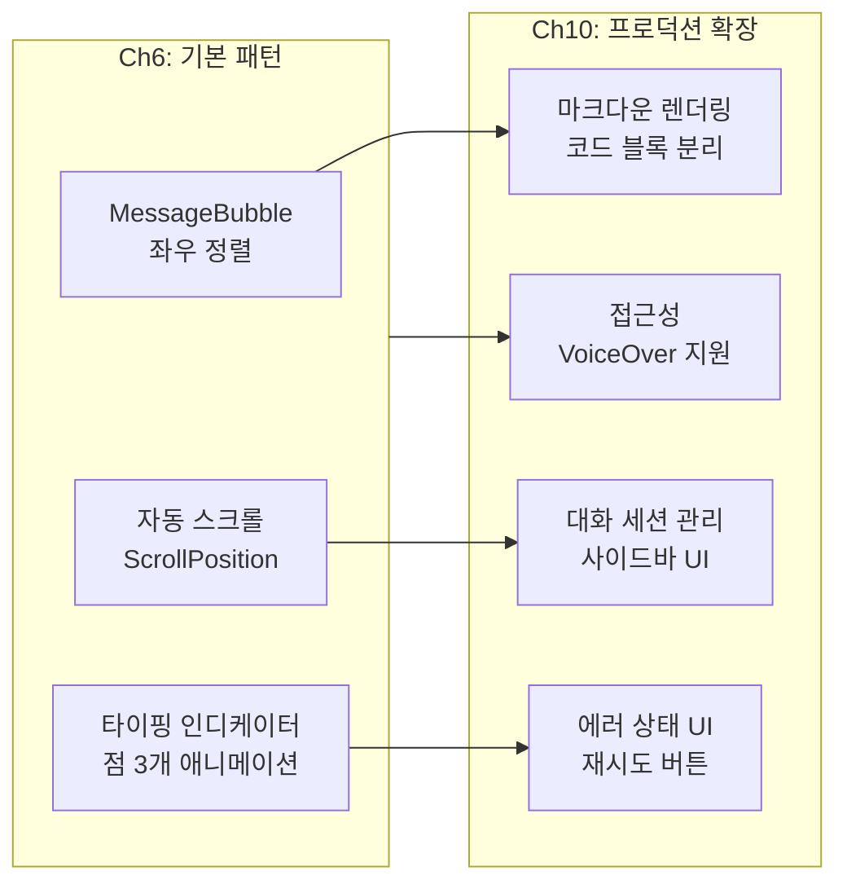
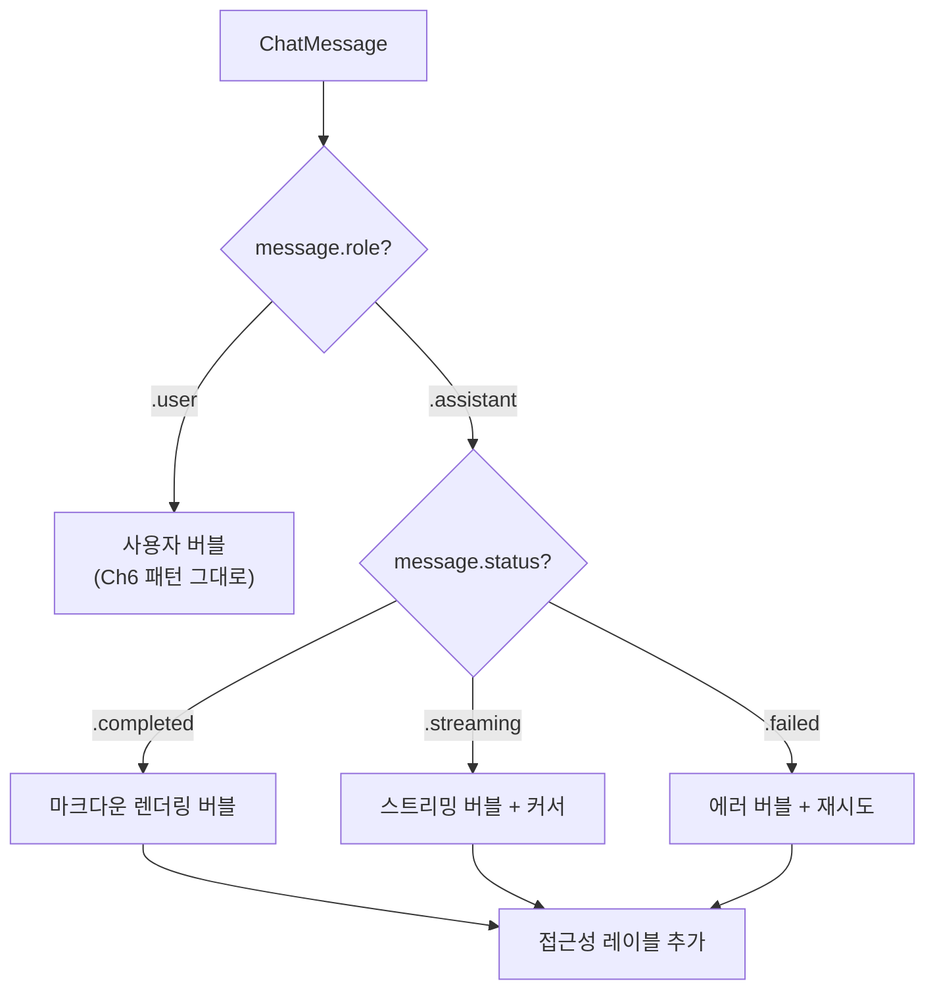
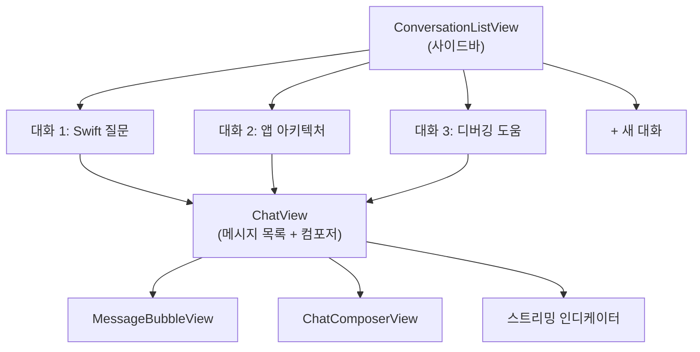
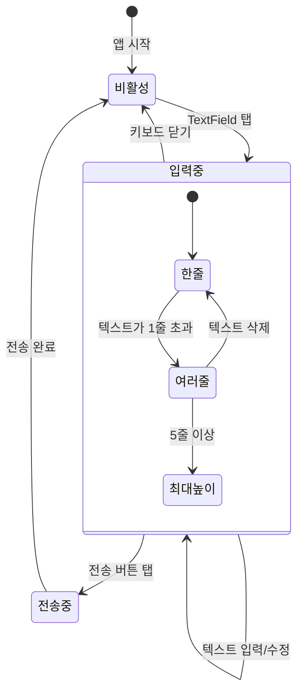
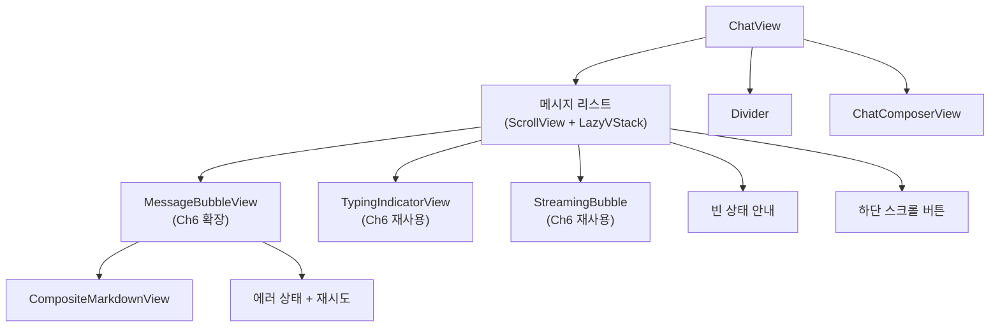

# 채팅 UI 구현

> Ch6에서 구축한 스트리밍 UI 컴포넌트를 프로덕션 채팅봇 앱 수준으로 확장하고, 마크다운 렌더링, 대화 세션 관리 UI, 에러 상태 표시를 구현합니다.

## 개요

이 섹션에서는 [이전 섹션](10-ch10-실전-프로젝트-ai-채팅봇-앱/01-01-채팅봇-앱-아키텍처-설계.md)에서 설계한 MVVM 아키텍처의 **View 계층**을 SwiftUI로 구현합니다. [Ch6에서 구축한 메시지 버블, 자동 스크롤, 타이핑 인디케이터](06-ch6-스트리밍-응답과-실시간-ui/02-02-swiftui-실시간-텍스트-렌더링.md)를 기반으로, 실전 채팅봇 앱에 필요한 **프로덕션 수준의 확장** — 마크다운 렌더링, 대화 세션 목록, 에러 상태 UI, 접근성 — 을 추가합니다.

**선수 지식**: [Ch6의 메시지 버블·자동 스크롤·타이핑 인디케이터 기본 패턴](06-ch6-스트리밍-응답과-실시간-ui/02-02-swiftui-실시간-텍스트-렌더링.md), [ChatViewModel과 ChatMessage 모델](10-ch10-실전-프로젝트-ai-채팅봇-앱/01-01-채팅봇-앱-아키텍처-설계.md)

**학습 목표**:
- Ch6의 기본 버블 뷰를 프로덕션용으로 확장한다 (마크다운, 에러 상태, 접근성)
- AI 응답의 코드 블록을 분리하는 커스텀 마크다운 파서를 구현한다
- 여러 대화 세션을 관리하는 사이드바/목록 UI를 구현한다
- 모든 컴포넌트를 조합한 완성된 ChatView를 만든다

## 왜 알아야 할까?

Ch6에서 우리는 스트리밍 UI의 **기본 패턴**을 배웠습니다 — 메시지 버블 좌우 정렬, ScrollPosition 기반 자동 스크롤, 타이핑 인디케이터 애니메이션이요. 하지만 실전 채팅봇 앱을 만들려면 여기서 한 단계 더 나아가야 합니다.

ChatGPT나 Apple Messages를 떠올려 보세요. 단순히 메시지가 오가는 것 외에도, 코드가 구문 강조되고, 여러 대화를 관리할 수 있고, 에러가 발생하면 친절한 안내가 나타나죠. 이런 **프로덕션 수준의 디테일**이 "데모 앱"과 "출시 가능한 앱"의 차이를 만듭니다.

> 📊 **그림 1**: Ch6 기본 패턴에서 Ch10 프로덕션 확장으로



이 섹션에서 구현할 UI는 이후 [Tool 통합](10-ch10-실전-프로젝트-ai-채팅봇-앱/05-05-tool-통합과-확장.md)과 [에러 처리](10-ch10-실전-프로젝트-ai-채팅봇-앱/06-06-에러-처리와-ux-마무리.md) 세션에서 계속 확장됩니다.

## 핵심 개념

### 개념 1: Ch6 버블 뷰의 프로덕션 확장

> 💡 **비유**: Ch6에서 만든 버블 뷰가 **프로토타입 자동차**라면, 이제 **양산 모델**로 업그레이드하는 단계입니다. 엔진(기본 레이아웃)은 그대로지만, 에어백(에러 처리), 내비게이션(마크다운), 편의 기능(접근성)을 추가하는 거죠.

[Ch6에서 구현한 `MessageBubbleView`](06-ch6-스트리밍-응답과-실시간-ui/02-02-swiftui-실시간-텍스트-렌더링.md)는 `HStack` + `Spacer` 위치 교환으로 좌우 정렬하는 기본 패턴이었습니다. 채팅봇 앱에서는 여기에 세 가지를 확장합니다:

1. **마크다운 렌더링** — AI 응답의 굵은 글씨, 코드 등을 리치 텍스트로
2. **에러 상태 표시** — 생성 실패 시 재시도 버튼
3. **접근성 레이블** — VoiceOver 사용자를 위한 의미 있는 설명

> 📊 **그림 2**: 프로덕션 MessageBubbleView의 조건부 렌더링



```swift
import SwiftUI

// MARK: - 프로덕션 메시지 버블 (Ch6 패턴 확장)
struct MessageBubbleView: View {
    let message: ChatMessage
    var onRetry: (() -> Void)?  // 에러 시 재시도 콜백
    
    private var isUser: Bool { message.role == .user }
    
    var body: some View {
        HStack(alignment: .top, spacing: 8) {
            if !isUser { aiAvatarView }
            if isUser { Spacer(minLength: 60) }
            
            // Ch6과 달리 상태별 분기 렌더링
            bubbleContent
            
            if !isUser { Spacer(minLength: 60) }
        }
        .padding(.horizontal, 16)
        .padding(.vertical, 2)
        // 접근성: VoiceOver가 읽을 의미 있는 설명
        .accessibilityElement(children: .combine)
        .accessibilityLabel(accessibilityDescription)
    }
    
    // MARK: - 상태별 버블 콘텐츠
    @ViewBuilder
    private var bubbleContent: some View {
        switch message.status {
        case .completed, .streaming:
            // 마크다운 렌더링 (다음 개념에서 상세 구현)
            standardBubble {
                CompositeMarkdownView(content: message.content)
                    .foregroundStyle(isUser ? .white : .primary)
            }
            
        case .failed(let error):
            // 에러 상태 — 재시도 버튼 포함
            standardBubble {
                VStack(alignment: .leading, spacing: 8) {
                    Label("응답 생성에 실패했습니다", systemImage: "exclamationmark.triangle")
                        .font(.subheadline)
                        .foregroundStyle(.red)
                    
                    Text(error)
                        .font(.caption)
                        .foregroundStyle(.secondary)
                    
                    if let onRetry {
                        Button("다시 시도", action: onRetry)
                            .font(.subheadline.bold())
                            .foregroundStyle(.blue)
                    }
                }
            }
        }
    }
    
    // MARK: - 공통 버블 래퍼
    private func standardBubble<Content: View>(
        @ViewBuilder content: () -> Content
    ) -> some View {
        VStack(alignment: isUser ? .trailing : .leading, spacing: 4) {
            content()
            
            Text(message.timestamp, style: .time)
                .font(.caption2)
                .foregroundStyle(isUser ? .white.opacity(0.7) : .secondary)
        }
        .padding(.horizontal, 14)
        .padding(.vertical, 10)
        .background(
            RoundedRectangle(cornerRadius: 18)
                .fill(isUser ? Color.blue : Color(.systemGray6))
        )
    }
    
    // MARK: - 접근성 설명
    private var accessibilityDescription: String {
        let sender = isUser ? "나" : "AI"
        let time = message.timestamp.formatted(date: .omitted, time: .shortened)
        return "\(sender), \(time), \(message.content)"
    }
    
    private var aiAvatarView: some View {
        Image(systemName: "brain.head.profile")
            .font(.title3)
            .foregroundStyle(.purple)
            .frame(width: 28, height: 28)
    }
}
```

핵심 변경점은 `message.status`에 따른 분기 렌더링입니다. Ch6에서는 완성된 메시지만 표시했지만, 프로덕션 앱에서는 스트리밍 중, 완료, 실패 세 가지 상태를 모두 처리해야 합니다. `onRetry` 클로저는 [에러 처리 섹션](10-ch10-실전-프로젝트-ai-채팅봇-앱/06-06-에러-처리와-ux-마무리.md)에서 ViewModel과 연결됩니다.

### 개념 2: 마크다운 렌더링 — AI 응답을 리치 텍스트로

> 💡 **비유**: 일반 텍스트만 보여주는 건 흑백 TV를 보는 것과 같습니다. AI가 "**중요한 개념**입니다"라고 응답했을 때, 별표가 그대로 보이면 읽기 불편하죠. 마크다운 렌더링은 흑백 TV를 **컬러 TV**로 바꾸는 것입니다.

SwiftUI의 `Text`는 `LocalizedStringKey`를 통해 **인라인 마크다운**(굵은 글씨, 기울임, 코드, 링크)을 자동 렌더링합니다. 하지만 AI 응답에는 코드 블록(```)이 빈번하게 포함되는데, 이건 인라인 마크다운으로는 처리할 수 없죠.

> 📊 **그림 3**: 마크다운 렌더링 파이프라인

```mermaid
flowchart TD
    A["AI 응답 원문"] --> B["ContentBlock 파서"]
    B --> C{"블록 타입?"}
    
    C -->|"텍스트"| D["LocalizedStringKey<br/>인라인 마크다운"]
    C -->|"코드 블록"| E["모노스페이스 + 배경<br/>가로 스크롤"]
    
    D --> F["CompositeMarkdownView"]
    E --> F
    
    G["SwiftUI 지원"] --> G1["**굵게**, *기울임*"]
    G --> G2["`코드`, ~~취소선~~"]
    G --> G3["링크(URL)"]
    
    H["커스텀 파서 필요"] --> H1["코드 블록(```)"]
    H --> H2["헤더, 표, 리스트"]
```

```swift
import SwiftUI

// MARK: - 코드 블록을 분리하는 마크다운 파서
struct ContentBlock: Identifiable {
    let id = UUID()
    enum BlockType {
        case text(String)              // 인라인 마크다운 포함 텍스트
        case codeBlock(String, String?) // 코드 내용, 언어명
    }
    let type: BlockType
}

func parseContentBlocks(_ content: String) -> [ContentBlock] {
    var blocks: [ContentBlock] = []
    let lines = content.components(separatedBy: "\n")
    var currentText = ""
    var currentCode = ""
    var codeLanguage: String?
    var inCodeBlock = false
    
    for line in lines {
        if line.hasPrefix("```") && !inCodeBlock {
            // 코드 블록 시작 — 이전 텍스트를 블록으로 저장
            if !currentText.isEmpty {
                blocks.append(ContentBlock(type: .text(
                    currentText.trimmingCharacters(in: .whitespacesAndNewlines)
                )))
                currentText = ""
            }
            let lang = String(line.dropFirst(3))
            codeLanguage = lang.isEmpty ? nil : lang
            inCodeBlock = true
        } else if line.hasPrefix("```") && inCodeBlock {
            // 코드 블록 끝
            blocks.append(ContentBlock(type: .codeBlock(
                currentCode.trimmingCharacters(in: .newlines),
                codeLanguage
            )))
            currentCode = ""
            codeLanguage = nil
            inCodeBlock = false
        } else if inCodeBlock {
            currentCode += line + "\n"
        } else {
            currentText += line + "\n"
        }
    }
    
    // 남은 텍스트 처리
    let remaining = currentText.trimmingCharacters(in: .whitespacesAndNewlines)
    if !remaining.isEmpty {
        blocks.append(ContentBlock(type: .text(remaining)))
    }
    
    return blocks
}

// MARK: - 블록별 렌더링 복합 뷰
struct CompositeMarkdownView: View {
    let content: String
    
    var body: some View {
        let blocks = parseContentBlocks(content)
        
        VStack(alignment: .leading, spacing: 8) {
            ForEach(blocks) { block in
                switch block.type {
                case .text(let text):
                    // LocalizedStringKey → 인라인 마크다운 자동 렌더링
                    Text(LocalizedStringKey(text))
                        .font(.body)
                        .textSelection(.enabled)
                    
                case .codeBlock(let code, let language):
                    // 코드 블록 — 모노스페이스 + 배경 + 복사 버튼
                    VStack(alignment: .leading, spacing: 4) {
                        HStack {
                            if let lang = language {
                                Text(lang)
                                    .font(.caption)
                                    .foregroundStyle(.secondary)
                            }
                            Spacer()
                            // 코드 복사 버튼
                            CopyButton(text: code)
                        }
                        
                        ScrollView(.horizontal, showsIndicators: false) {
                            Text(code)
                                .font(.system(.callout, design: .monospaced))
                                .textSelection(.enabled)
                        }
                    }
                    .padding(12)
                    .frame(maxWidth: .infinity, alignment: .leading)
                    .background(
                        RoundedRectangle(cornerRadius: 8)
                            .fill(Color(.systemGray5))
                    )
                }
            }
        }
    }
}

// MARK: - 코드 복사 버튼
struct CopyButton: View {
    let text: String
    @State private var copied = false
    
    var body: some View {
        Button {
            UIPasteboard.general.string = text
            copied = true
            // 2초 후 복사 표시 초기화
            DispatchQueue.main.asyncAfter(deadline: .now() + 2) {
                copied = false
            }
        } label: {
            Image(systemName: copied ? "checkmark" : "doc.on.doc")
                .font(.caption)
                .foregroundStyle(.secondary)
        }
        .buttonStyle(.plain)
        .animation(.easeInOut, value: copied)
    }
}
```

> ⚠️ **흔한 오해**: "스트리밍 중에 마크다운 렌더링을 적용하면 불완전한 마크다운 태그 때문에 깨지지 않을까?" — SwiftUI의 `LocalizedStringKey` 마크다운 파서는 불완전한 태그를 **그냥 무시**합니다. `**bold`까지만 도착해도 크래시 없이 일반 텍스트로 표시하다가, `**bold**`가 완성되면 자동으로 굵은 글씨로 전환됩니다.

> 🔥 **실무 팁**: AI 응답에 코드 블록이 매우 빈번하다면, 위 커스텀 파서 대신 [MarkdownUI](https://github.com/gonzalezreal/swift-markdown-ui) 같은 서드파티 라이브러리를 사용하는 것이 더 효과적입니다. 헤더, 표, 리스트, 인용까지 완전한 마크다운 렌더링을 지원하거든요.

### 개념 3: 대화 세션 관리 UI

> 💡 **비유**: 하나의 채팅방만 있는 메신저를 상상해 보세요. 모든 대화가 한 곳에 섞여 있으면 이전 대화를 찾기도 어렵고, 주제별로 정리할 수도 없죠. ChatGPT처럼 **여러 대화 세션**을 관리할 수 있어야 진정한 채팅봇 앱입니다.

이전 섹션에서 설계한 `Conversation` 모델을 활용하여, 대화 목록을 사이드바로 표시하는 UI를 구현합니다. iPad와 Mac에서는 `NavigationSplitView`의 사이드바로, iPhone에서는 탭이나 시트로 접근할 수 있게 합니다.

> 📊 **그림 4**: 대화 세션 관리의 네비게이션 구조



```swift
import SwiftUI

// MARK: - 대화 목록 사이드바
struct ConversationListView: View {
    @Bindable var appViewModel: AppViewModel
    
    var body: some View {
        List(selection: $appViewModel.selectedConversationId) {
            // 대화 목록 (최신순)
            ForEach(appViewModel.conversations) { conversation in
                ConversationRowView(conversation: conversation)
                    .tag(conversation.id)
                    .swipeActions(edge: .trailing) {
                        Button(role: .destructive) {
                            appViewModel.deleteConversation(conversation.id)
                        } label: {
                            Label("삭제", systemImage: "trash")
                        }
                    }
            }
        }
        .navigationTitle("대화")
        .toolbar {
            // 새 대화 버튼
            ToolbarItem(placement: .primaryAction) {
                Button {
                    appViewModel.createNewConversation()
                } label: {
                    Image(systemName: "square.and.pencil")
                }
            }
        }
    }
}

// MARK: - 대화 행 뷰
struct ConversationRowView: View {
    let conversation: Conversation
    
    var body: some View {
        VStack(alignment: .leading, spacing: 4) {
            // 대화 제목 (첫 메시지 요약 또는 기본값)
            Text(conversation.title ?? "새 대화")
                .font(.headline)
                .lineLimit(1)
            
            // 마지막 메시지 미리보기
            if let lastMessage = conversation.messages.last {
                Text(lastMessage.content)
                    .font(.subheadline)
                    .foregroundStyle(.secondary)
                    .lineLimit(2)
            }
            
            // 시간 표시
            Text(conversation.updatedAt, style: .relative)
                .font(.caption)
                .foregroundStyle(.tertiary)
        }
        .padding(.vertical, 4)
    }
}

// MARK: - 앱 최상위 네비게이션
struct AppRootView: View {
    @State private var appViewModel = AppViewModel()
    
    var body: some View {
        NavigationSplitView {
            // 사이드바: 대화 목록
            ConversationListView(appViewModel: appViewModel)
        } detail: {
            // 디테일: 선택된 대화의 채팅 화면
            if let conversationId = appViewModel.selectedConversationId,
               let viewModel = appViewModel.chatViewModel(for: conversationId) {
                ChatView(viewModel: viewModel)
            } else {
                // 대화 미선택 상태
                ContentUnavailableView(
                    "대화를 선택하세요",
                    systemImage: "bubble.left.and.bubble.right",
                    description: Text("왼쪽에서 대화를 선택하거나 새 대화를 시작하세요.")
                )
            }
        }
    }
}
```

`NavigationSplitView`는 iPad에서는 사이드바+디테일 2단 구조로, iPhone에서는 자동으로 네비게이션 스택 구조로 전환됩니다. 별도 코드 없이 멀티 플랫폼 레이아웃이 처리되죠.

### 개념 4: 입력 컴포저와 키보드 어보이드

> 💡 **비유**: 입력 컴포저는 채팅 앱의 **조종석**입니다. 조종석이 불편하면 아무리 좋은 비행기도 제대로 조종할 수 없듯이, 입력 UI가 불편하면 사용자는 금방 앱을 떠나죠. 키보드가 올라왔을 때 입력창이 가려지지 않는 것, 여러 줄 입력이 자연스럽게 확장되는 것 — 이런 세부사항이 사용자 경험의 핵심입니다.

> 📊 **그림 5**: 입력 컴포저의 상태 전이



```swift
import SwiftUI

// MARK: - 채팅 입력 컴포저
struct ChatComposerView: View {
    @Binding var inputText: String
    let isGenerating: Bool     // AI 응답 생성 중 여부
    let onSend: () -> Void     // 전송 콜백
    let onStop: () -> Void     // 생성 중단 콜백
    
    @FocusState private var isFocused: Bool
    
    var body: some View {
        HStack(alignment: .bottom, spacing: 8) {
            // 동적 높이 입력 필드 (iOS 16+ axis: .vertical)
            TextField("메시지를 입력하세요...", text: $inputText, axis: .vertical)
                .lineLimit(1...5) // 최소 1줄, 최대 5줄 자동 확장
                .textFieldStyle(.plain)
                .padding(.horizontal, 12)
                .padding(.vertical, 8)
                .background(
                    RoundedRectangle(cornerRadius: 20)
                        .fill(Color(.systemGray6))
                )
                .focused($isFocused)
            
            // 전송 / 중단 버튼
            Button {
                if isGenerating {
                    onStop()
                } else {
                    onSend()
                    isFocused = true // 전송 후 키보드 유지
                }
            } label: {
                Image(systemName: isGenerating
                      ? "stop.circle.fill"
                      : "arrow.up.circle.fill")
                    .font(.title2)
                    .symbolRenderingMode(.hierarchical)
                    .foregroundStyle(sendButtonColor)
            }
            .disabled(!isGenerating && inputText
                .trimmingCharacters(in: .whitespacesAndNewlines).isEmpty)
            .animation(.easeInOut(duration: 0.2), value: isGenerating)
        }
        .padding(.horizontal, 12)
        .padding(.vertical, 8)
        .background(.bar) // 시스템 바 재질 — 반투명 배경
    }
    
    private var sendButtonColor: Color {
        if isGenerating { return .red }
        return inputText.trimmingCharacters(in: .whitespacesAndNewlines).isEmpty
            ? .gray : .blue
    }
}
```

`TextField`의 `axis: .vertical` + `.lineLimit(1...5)` 조합이 핵심입니다. iOS 16부터 `TextField`도 여러 줄을 지원하게 되어, `TextEditor`보다 훨씬 깔끔한 동적 높이 조절이 가능합니다. 키보드 어보이드는 `NavigationStack` 안에서 SwiftUI가 자동으로 처리합니다.

## 실습: 직접 해보기

지금까지 만든 컴포넌트를 조립하여 완성된 채팅 화면을 구현합니다. Ch6의 자동 스크롤 + 스트리밍 표시 패턴을 재사용하면서, 프로덕션 확장(마크다운, 에러, 빈 상태)을 통합한 `ChatView`입니다.

> 📊 **그림 6**: ChatView의 컴포넌트 조합 구조



```swift
import SwiftUI
import FoundationModels

// MARK: - 메인 채팅 화면
struct ChatView: View {
    @State private var viewModel: ChatViewModel
    // Ch6에서 배운 ScrollPosition 패턴 재사용
    @State private var scrollPosition = ScrollPosition(edge: .bottom)
    @State private var isAtBottom = true
    
    init(viewModel: ChatViewModel) {
        _viewModel = State(initialValue: viewModel)
    }
    
    var body: some View {
        VStack(spacing: 0) {
            messageList
            Divider()
            ChatComposerView(
                inputText: $viewModel.inputText,
                isGenerating: viewModel.isGenerating,
                onSend: { viewModel.sendMessage() },
                onStop: { viewModel.stopGenerating() }
            )
        }
        .navigationTitle("AI 채팅")
        .navigationBarTitleDisplayMode(.inline)
    }
    
    // MARK: - 메시지 리스트
    private var messageList: some View {
        ZStack(alignment: .bottomTrailing) {
            ScrollView {
                LazyVStack(spacing: 0) {
                    if viewModel.messages.isEmpty {
                        emptyStateView
                    }
                    
                    ForEach(viewModel.messages) { message in
                        MessageBubbleView(message: message) {
                            viewModel.retryLastMessage()
                        }
                        .id(message.id)
                    }
                    
                    // 스트리밍 상태: Ch6의 인디케이터 → 스트리밍 버블 전환 패턴
                    if viewModel.isGenerating {
                        if viewModel.streamingText.isEmpty {
                            TypingIndicatorView()
                        } else {
                            StreamingMessageBubbleView(
                                streamingText: viewModel.streamingText
                            )
                        }
                    }
                }
                .padding(.vertical, 8)
            }
            .scrollPosition($scrollPosition)
            .defaultScrollAnchor(.bottom)
            .onChange(of: viewModel.messages.count) { _, _ in
                withAnimation(.easeOut(duration: 0.3)) {
                    scrollPosition.scrollTo(edge: .bottom)
                }
            }
            .onChange(of: viewModel.streamingText) { _, _ in
                // 스트리밍 중 하단 고정 (Ch6 패턴)
                if isAtBottom {
                    scrollPosition.scrollTo(edge: .bottom)
                }
            }
            .onScrollGeometryChange(for: Bool.self) { geometry in
                let maxOffset = geometry.contentSize.height
                    - geometry.containerSize.height
                return geometry.contentOffset.y >= maxOffset - 50
            } action: { _, isBottom in
                isAtBottom = isBottom
            }
            
            // 하단 스크롤 버튼
            if !isAtBottom {
                Button {
                    withAnimation {
                        scrollPosition.scrollTo(edge: .bottom)
                    }
                } label: {
                    Image(systemName: "chevron.down.circle.fill")
                        .font(.title2)
                        .symbolRenderingMode(.hierarchical)
                        .foregroundStyle(.blue)
                        .shadow(radius: 2)
                }
                .padding(16)
                .transition(.scale.combined(with: .opacity))
            }
        }
    }
    
    // MARK: - 빈 상태
    private var emptyStateView: some View {
        VStack(spacing: 16) {
            Image(systemName: "bubble.left.and.bubble.right")
                .font(.system(size: 48))
                .foregroundStyle(.secondary)
            Text("AI에게 무엇이든 물어보세요!")
                .font(.title3)
                .foregroundStyle(.secondary)
            Text("온디바이스 모델이 프라이버시를 지키며 답변합니다.")
                .font(.subheadline)
                .foregroundStyle(.tertiary)
        }
        .padding(.top, 100)
    }
}
```

```run:swift
// Ch6 → Ch10 확장 요약
let evolution = [
    ("MessageBubble", "Ch6: 기본 좌우 정렬", "Ch10: + 에러 상태, 접근성, 마크다운"),
    ("자동 스크롤", "Ch6: ScrollPosition 패턴", "Ch10: 그대로 재사용"),
    ("타이핑 인디케이터", "Ch6: 점 3개 애니메이션", "Ch10: 그대로 재사용"),
    ("마크다운 렌더링", "Ch6: 없음", "Ch10: 코드 블록 파서 + 복사 버튼"),
    ("대화 세션 관리", "Ch6: 없음", "Ch10: NavigationSplitView + 사이드바"),
    ("에러 UI", "Ch6: 없음", "Ch10: 재시도 버튼 + 에러 메시지"),
]

for (component, ch6, ch10) in evolution {
    print("[\(component)]")
    print("  \(ch6)")
    print("  \(ch10)")
    print()
}
```

```output
[MessageBubble]
  Ch6: 기본 좌우 정렬
  Ch10: + 에러 상태, 접근성, 마크다운

[자동 스크롤]
  Ch6: ScrollPosition 패턴
  Ch10: 그대로 재사용

[타이핑 인디케이터]
  Ch6: 점 3개 애니메이션
  Ch10: 그대로 재사용

[마크다운 렌더링]
  Ch6: 없음
  Ch10: 코드 블록 파서 + 복사 버튼

[대화 세션 관리]
  Ch6: 없음
  Ch10: NavigationSplitView + 사이드바

[에러 UI]
  Ch6: 없음
  Ch10: 재시도 버튼 + 에러 메시지
```

## 더 깊이 알아보기

### 채팅 버블 UI의 탄생 — iChat에서 iMessage까지

채팅에서 "말풍선" 메타포를 처음 대중화한 것은 2002년 Apple의 **iChat**이었습니다. 당시 AOL Instant Messenger(AIM)는 단순히 텍스트를 줄줄이 나열했는데, iChat은 발신자와 수신자의 메시지를 **색이 다른 말풍선**으로 감싸 시각적으로 구분한 최초의 주류 메신저였죠.

이 디자인 패턴은 2007년 iPhone의 SMS 앱, 2011년 iMessage로 이어지며 사실상 **모든 채팅 앱의 표준**이 되었습니다. 카카오톡, WhatsApp, Telegram — 모두 이 "좌/우 말풍선" 패턴을 따르고 있습니다. 2024-2025년 ChatGPT, Google Gemini 같은 AI 채팅 앱들도 동일한 패턴을 채택했는데, 이는 사용자가 이 인터페이스에 20년 넘게 익숙해져 있기 때문입니다.

흥미로운 점은, Apple이 2025년 WWDC에서 Foundation Models 프레임워크를 발표하면서 보여준 데모 앱들도 모두 이 말풍선 UI를 사용했다는 것입니다. 새로운 AI 기술이 등장해도, 검증된 UI 패턴 위에 쌓아 올리는 것이 사용자 경험의 핵심이라는 교훈이죠.

### SwiftUI 마크다운 지원의 발전

SwiftUI의 마크다운 렌더링은 iOS 15(2021)에서 `Text` 뷰에 인라인 마크다운 지원이 추가되면서 시작되었습니다. 처음에는 `LocalizedStringKey`를 통한 자동 변환만 가능했지만, `AttributedString`에 마크다운 이니셜라이저가 추가되면서 프로그래밍 방식의 제어도 가능해졌죠. iOS 26(2025)에서는 `TextEditor`도 `AttributedString`을 지원하게 되어, 사용자가 마크다운으로 리치 텍스트를 편집하는 것까지 가능해졌습니다.

## 흔한 오해와 팁

> ⚠️ **흔한 오해**: "`ScrollViewReader` + `scrollTo(id:)`가 유일한 프로그래밍 방식 스크롤이다" — iOS 18부터 `ScrollPosition` API가 도입되면서 훨씬 깔끔하고 선언적인 스크롤 제어가 가능해졌습니다. `ScrollViewReader`는 레거시 호환용으로 남겨두세요.

> 💡 **알고 계셨나요?**: SwiftUI의 `TextField`에 `axis: .vertical`을 전달하면 여러 줄 입력이 가능한데, 이 기능은 iOS 16부터 추가되었습니다. 그 이전에는 반드시 `TextEditor`를 써야 했고, 플레이스홀더 텍스트도 직접 구현해야 했죠.

> 🔥 **실무 팁**: 스트리밍 중에 `onChange(of: streamingText)`로 매 토큰마다 `scrollTo`를 호출하면 성능 문제가 생길 수 있습니다. `isAtBottom` 플래그를 먼저 확인하고, 사용자가 위로 스크롤한 상태라면 자동 스크롤을 건너뛰세요. 또한 스트리밍 시에는 스크롤 애니메이션 없이 `.scrollTo(edge: .bottom)`만 호출하는 것이 훨씬 부드럽습니다.

> 🔥 **실무 팁**: Liquid Glass 디자인(iOS 26)을 적용하려면 입력 컴포저의 `.background(.bar)` 대신 `.glassEffect()`를 사용해 보세요. 시스템의 반투명 유리 효과와 조화되는 세련된 UI를 얻을 수 있습니다.

## 핵심 정리

| 개념 | 설명 |
|------|------|
| **Ch6 패턴 재사용** | 자동 스크롤(ScrollPosition), 타이핑 인디케이터(점 3개), 스트리밍 버블은 Ch6 코드 그대로 활용 |
| **프로덕션 확장** | 에러 상태 분기(`.failed` → 재시도), 접근성 레이블, 마크다운 렌더링 추가 |
| **CompositeMarkdownView** | 텍스트/코드 블록 분리 파서로 AI 응답의 코드를 모노스페이스 + 복사 버튼으로 표시 |
| **대화 세션 관리** | NavigationSplitView로 사이드바(대화 목록) + 디테일(채팅 화면) 구조 |
| **ChatComposerView** | `TextField(axis: .vertical)` + `lineLimit(1...5)`로 동적 높이, `.background(.bar)`로 바 재질 |
| **CopyButton** | 코드 블록에 복사 버튼 추가 — UIPasteboard + 시각적 피드백 |
| **키보드 어보이드** | NavigationStack 내부에서 SwiftUI가 자동 처리 |

## 다음 섹션 미리보기

UI 껍데기가 완성되었으니, 다음 섹션 [AI 서비스 레이어 구현](10-ch10-실전-프로젝트-ai-채팅봇-앱/03-03-ai-서비스-레이어-구현.md)에서는 이 UI 뒤에서 실제로 Foundation Models의 `LanguageModelSession`을 호출하는 **AI 서비스 레이어**를 구현합니다. `ChatViewModel.sendMessage()`가 호출되었을 때 `streamResponse()`를 통해 토큰을 수신하고, `streamingText`를 업데이트하는 전체 파이프라인을 연결하게 됩니다.

## 참고 자료

- [FoundationChat — GitHub (Dimillian)](https://github.com/Dimillian/FoundationChat) - Foundation Models 기반 완성된 채팅 앱. 스트리밍, SwiftData 저장, Liquid Glass UI 참고
- [Apple Intelligence Chat — GitHub (PallavAg)](https://github.com/PallavAg/Apple-Intelligence-Chat) - 스트리밍 응답 + 햅틱 피드백 + Liquid Glass 디자인의 AI 채팅 앱
- [ScrollPosition API — Apple Developer Documentation](https://developer.apple.com/documentation/swiftui/scrollposition) - iOS 18+ 프로그래밍 방식 스크롤의 공식 문서
- [How to render Markdown content in Text — Hacking with Swift](https://www.hackingwithswift.com/quick-start/swiftui/how-to-render-markdown-content-in-text) - SwiftUI Text의 마크다운 렌더링 실전 가이드
- [Building AI features using Foundation Models — Swift with Majid](https://swiftwithmajid.com/2025/08/19/building-ai-features-using-foundation-models/) - Foundation Models 프레임워크와 SwiftUI 통합 패턴
- [Ch6 스트리밍 UI 기초](06-ch6-스트리밍-응답과-실시간-ui/02-02-swiftui-실시간-텍스트-렌더링.md) - 메시지 버블, 자동 스크롤, 타이핑 인디케이터의 기본 패턴

---
### 🔗 Related Sessions
- [chatmessage](10-ch10-실전-프로젝트-ai-채팅봇-앱/01-01-채팅봇-앱-아키텍처-설계.md) (prerequisite)
- [messagerole](10-ch10-실전-프로젝트-ai-채팅봇-앱/01-01-채팅봇-앱-아키텍처-설계.md) (prerequisite)
- [messagestatus](10-ch10-실전-프로젝트-ai-채팅봇-앱/01-01-채팅봇-앱-아키텍처-설계.md) (prerequisite)
- [chatviewmodel](10-ch10-실전-프로젝트-ai-채팅봇-앱/01-01-채팅봇-앱-아키텍처-설계.md) (prerequisite)
