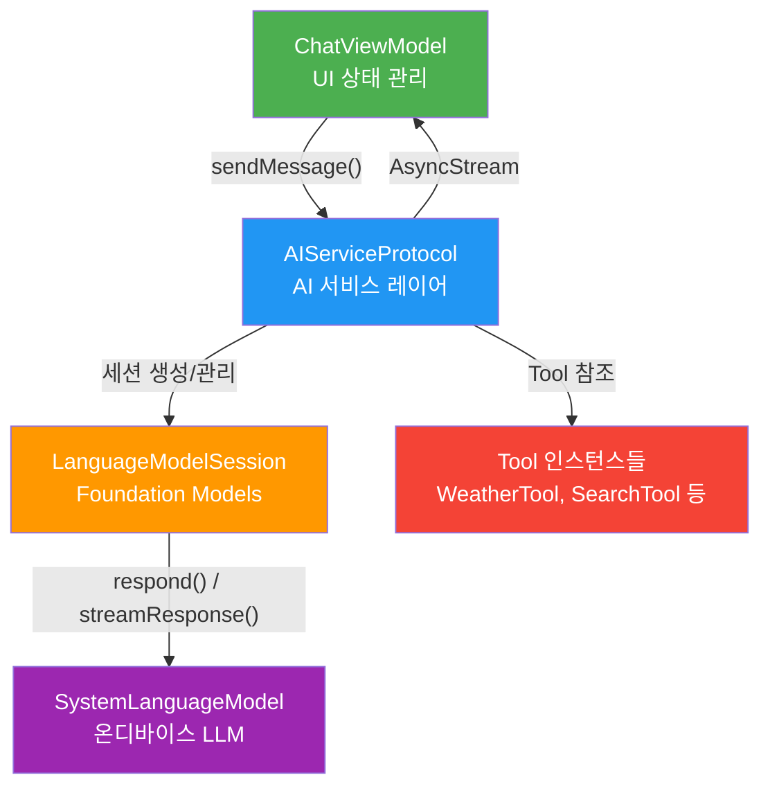
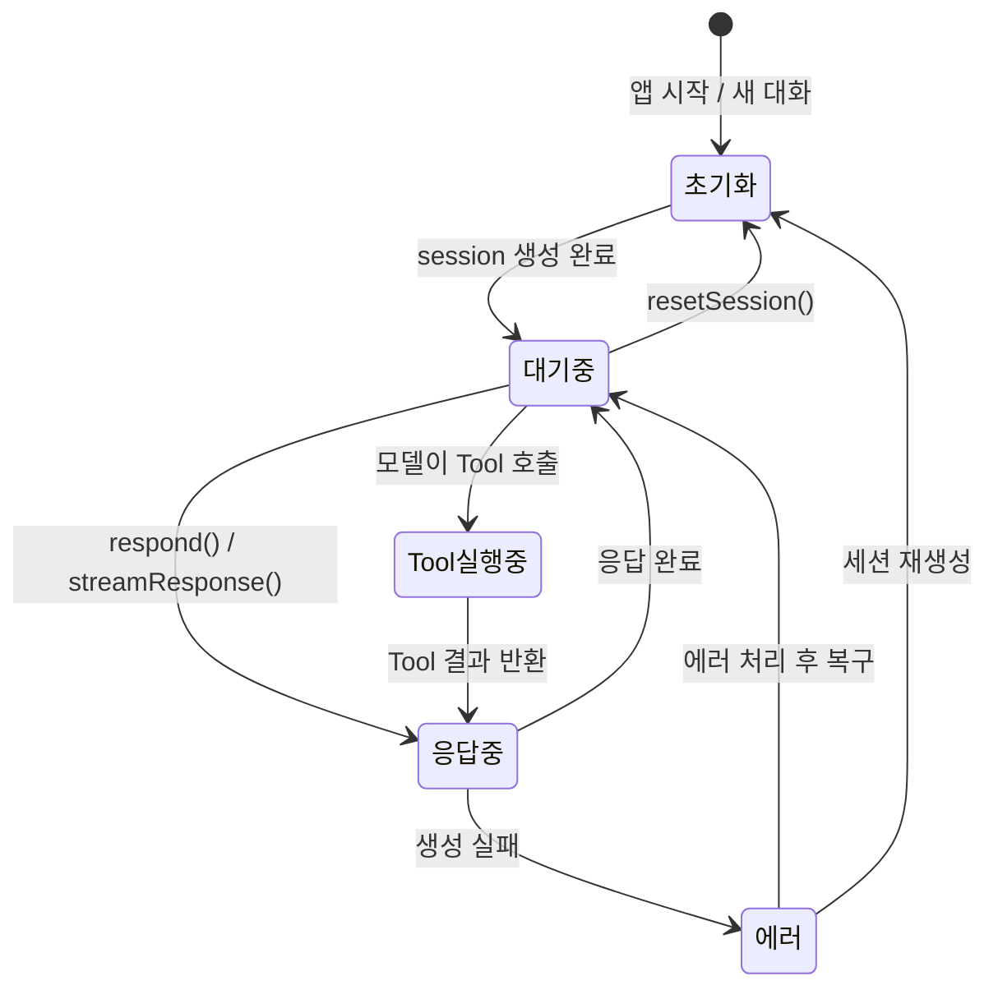
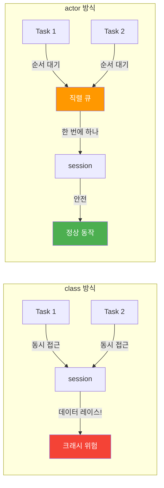
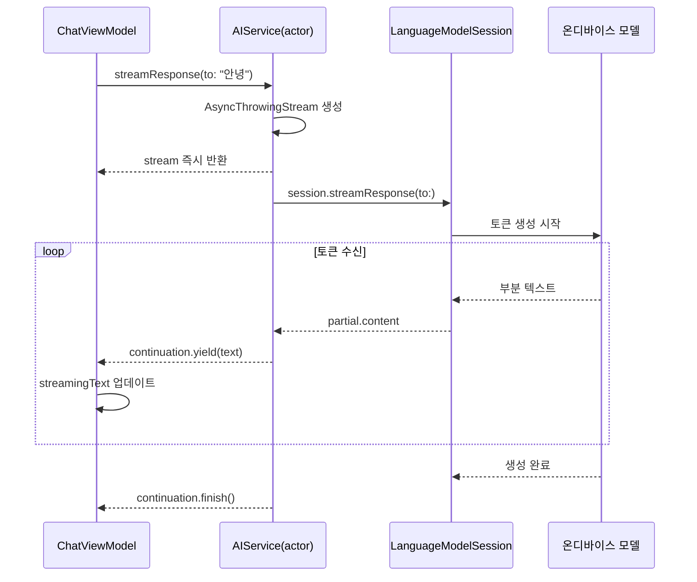
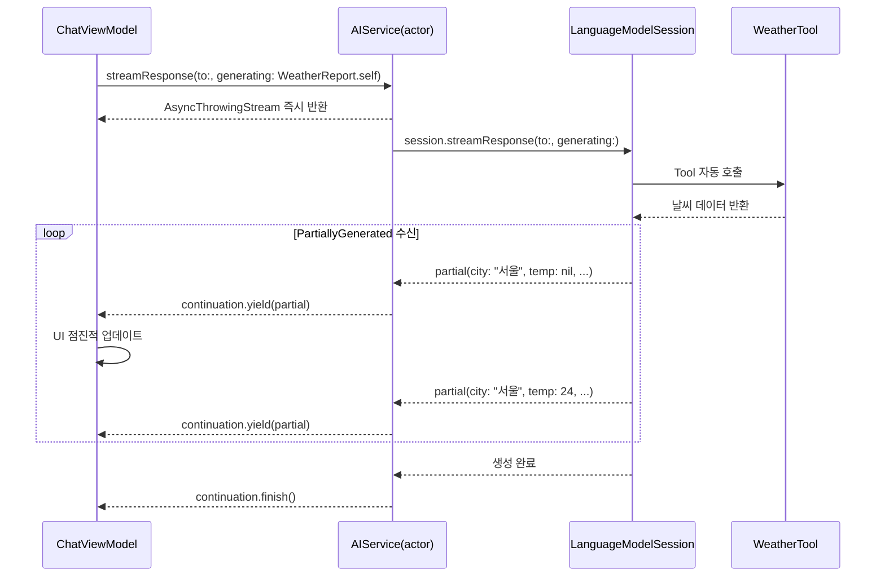
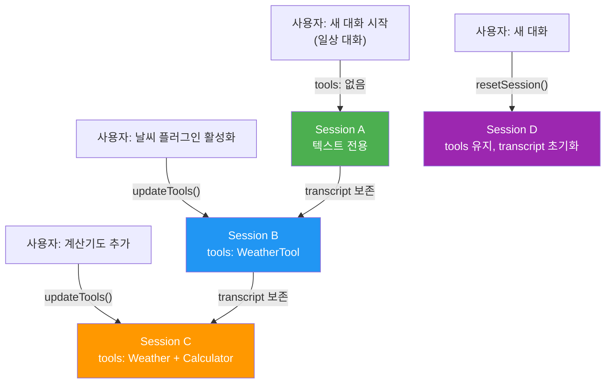
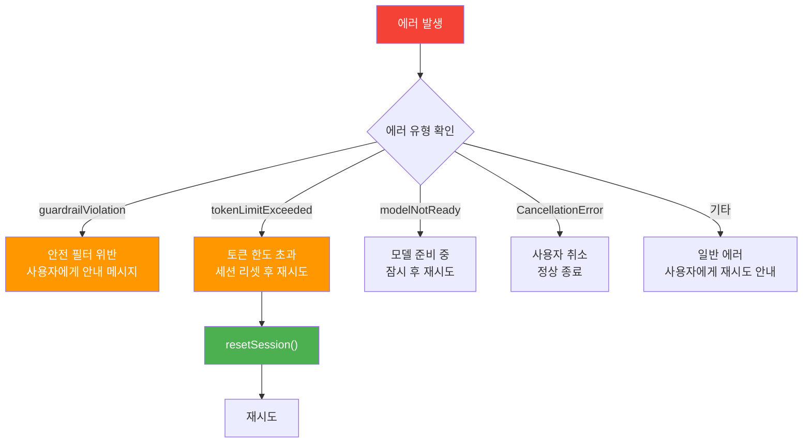

# AI 서비스 레이어 구현

> ViewModel과 Foundation Models 사이를 연결하는 AI 서비스 레이어를 설계하고 구현합니다

## 개요

이 섹션에서는 [채팅봇 앱 아키텍처 설계](10-ch10-실전-프로젝트-ai-채팅봇-앱/01-01-채팅봇-앱-아키텍처-설계.md)에서 정의한 `AIServiceProtocol`을 실제로 구현합니다. `LanguageModelSession`을 래핑하여 텍스트 응답, 스트리밍, 구조화 출력, 구조화 출력 스트리밍, Tool Calling을 하나의 통합된 인터페이스로 제공하는 `FoundationModelAIService`를 완성합니다.

> ⚠️ **아키텍처 노트**: [아키텍처 설계](10-ch10-실전-프로젝트-ai-채팅봇-앱/01-01-채팅봇-앱-아키텍처-설계.md)의 서비스 레이어 다이어그램에서는 `FoundationModelAIService`를 하나의 컴포넌트로 표현했지만, 실제 구현에서는 **`actor`**로 선언합니다. `LanguageModelSession`에 대한 동시 접근을 안전하게 직렬화하기 위한 설계 결정이며, 이 섹션에서 그 이유를 상세히 다룹니다.

**선수 지식**:
- [LanguageModelSession 생성과 구성](03-ch3-foundation-models-프레임워크-시작하기/02-02-languagemodelsession-생성과-구성.md)에서 배운 세션 초기화
- [streamResponse API 기초](06-ch6-스트리밍-응답과-실시간-ui/01-01-streamresponse-api-기초.md)에서 배운 스트리밍 패턴
- [PartiallyGenerated로 점진적 UI 구성](06-ch6-스트리밍-응답과-실시간-ui/03-03-partiallygenerated로-점진적-ui-구성.md)에서 배운 구조화 출력 스트리밍
- [Tool 프로토콜 구현하기](07-ch7-tool-calling-기초/02-02-tool-프로토콜-구현하기.md)에서 배운 Tool 정의와 등록
- [채팅봇 앱 아키텍처 설계](10-ch10-실전-프로젝트-ai-채팅봇-앱/01-01-채팅봇-앱-아키텍처-설계.md)의 `AIServiceProtocol` 정의

**학습 목표**:
- `AIServiceProtocol`의 구체 구현체를 `actor`로 설계하고 작성한다
- `LanguageModelSession`을 서비스 레이어에서 안전하게 관리한다
- 스트리밍 응답을 `AsyncThrowingStream`으로 변환하여 ViewModel에 전달한다
- 구조화 출력 스트리밍(`PartiallyGenerated`)을 서비스 레이어에 통합한다
- Foundation Models 에러를 사용자 친화적 타입으로 매핑한다

## 왜 알아야 할까?

채팅봇의 **심장**이 뭘까요? UI도 아니고, 데이터 저장소도 아닙니다. 바로 AI 서비스 레이어입니다. 사용자의 메시지를 받아 Foundation Models에 전달하고, 모델의 응답을 다시 UI가 이해할 수 있는 형태로 돌려주는 **중간 번역가** 역할이죠.

이전 세션에서 `ChatViewModel`과 `ChatView`를 만들었지만, `sendMessage()`를 호출하면 아직 아무 일도 일어나지 않습니다. ViewModel의 `sendMessage()`가 호출하는 `aiService.streamResponse()`가 구현되지 않았거든요. 이번 세션에서 이 빈 칸을 채우면, 드디어 앱에서 실제 AI 응답을 받아볼 수 있게 됩니다.

직접 `LanguageModelSession`을 ViewModel에 넣지 않고 서비스 레이어를 분리하는 이유가 있습니다:

1. **테스트 용이성**: Mock 서비스로 교체하면 실제 모델 없이도 UI 테스트 가능
2. **관심사 분리**: ViewModel은 UI 상태만, 서비스는 AI 통신만 담당
3. **유연한 확장**: Tool 추가, 세션 재생성, 옵션 변경을 서비스 내부에서 캡슐화
4. **에러 격리**: AI 관련 에러를 서비스 계층에서 일관되게 처리

## 핵심 개념

### 개념 1: AI 서비스 프로토콜 리뷰와 설계 원칙

> 💡 **비유**: 서비스 레이어는 **통역사**와 같습니다. 한국어를 하는 사업가(ViewModel)와 영어를 하는 파트너(Foundation Models) 사이에서, 양쪽의 말을 정확히 전달하면서도 대화의 맥락을 기억하는 역할이죠. 좋은 통역사는 자기 존재감을 드러내지 않으면서 소통을 매끄럽게 만듭니다.

[아키텍처 설계](10-ch10-실전-프로젝트-ai-채팅봇-앱/01-01-채팅봇-앱-아키텍처-설계.md)에서 정의한 `AIServiceProtocol`을 다시 살펴보겠습니다. 이 프로토콜이 서비스 레이어의 **계약서** 역할을 합니다.

> 📊 **그림 1**: AI 서비스 레이어의 위치와 역할



프로토콜의 핵심 요구사항을 살펴보겠습니다. 텍스트 스트리밍, 단건 응답, 구조화 출력에 더해 **구조화 출력 스트리밍**까지 네 가지 응답 방식을 지원합니다:

```swift
import FoundationModels

// AI 서비스의 계약 — ViewModel은 이 인터페이스만 알면 됨
protocol AIServiceProtocol: Sendable {
    /// 스트리밍 응답 — 토큰 단위로 텍스트를 전달
    func streamResponse(
        to prompt: String,
        systemPrompt: String?
    ) -> AsyncThrowingStream<String, Error>
    
    /// 단건 응답 — 전체 텍스트를 한 번에 반환
    func respond(to prompt: String) async throws -> String
    
    /// 구조화 출력 — @Generable 타입으로 파싱된 결과 반환
    func respond<T: Generable>(
        to prompt: String,
        generating type: T.Type
    ) async throws -> T
    
    /// 구조화 출력 스트리밍 — PartiallyGenerated로 점진적 결과 전달
    func streamResponse<T: Generable>(
        to prompt: String,
        generating type: T.Type
    ) -> AsyncThrowingStream<T.PartiallyGenerated, Error>
    
    /// 모델 가용성 확인
    var isAvailable: Bool { get }
    
    /// 세션 초기화 (대화 컨텍스트 리셋)
    func resetSession() async
}
```

이 프로토콜이 `Sendable`을 준수하는 이유가 중요합니다. Swift 6의 Strict Concurrency 환경에서 ViewModel(`@MainActor`)과 서비스(백그라운드)가 서로 다른 격리 도메인에서 동작하기 때문이죠. `Sendable`이 아니면 컴파일러가 경계 넘어 전달을 허용하지 않습니다.

네 번째 메서드인 `streamResponse(to:generating:)`는 [PartiallyGenerated로 점진적 UI 구성](06-ch6-스트리밍-응답과-실시간-ui/03-03-partiallygenerated로-점진적-ui-구성.md)에서 배운 패턴과 [Tool과 구조화 출력 결합](08-ch8-tool-calling-심화/03-03-tool과-구조화-출력-결합.md)에서 배운 Tool 결과의 구조화 파싱을 통합한 메서드입니다. 채팅봇에서 "오늘 서울 날씨를 JSON 형태로 알려줘"같은 요청에 대해 Tool이 실행되고, 그 결과가 `@Generable` 구조체로 점진적 파싱되는 전체 흐름을 하나의 인터페이스로 제공하죠.

### 개념 2: Actor 기반 서비스 — 왜 class가 아닌 actor인가

> 💡 **비유**: `LanguageModelSession`을 직접 쓰는 건 자동차 엔진을 직접 만지는 것과 같습니다. 할 수는 있지만, 대부분의 운전자에게는 **핸들과 페달**(서비스 인터페이스)이면 충분하죠. 서비스 레이어는 엔진의 복잡성을 숨기고, 깔끔한 조작 인터페이스를 제공합니다.

`LanguageModelSession`은 상태를 가진 객체입니다. 대화 히스토리(`transcript`)를 내부적으로 유지하고, 한 세션에서 여러 번 `respond()`를 호출하면 이전 대화를 기억합니다. 이 특성을 서비스 레이어에서 어떻게 관리할지가 핵심 설계 포인트입니다.

> 📊 **그림 2**: LanguageModelSession의 생명주기 관리



세션 래핑에는 두 가지 전략이 있습니다:

**전략 1: Actor 기반 격리** — 세션 접근을 직렬화하여 동시성 안전 보장

```swift
// Actor로 세션 접근을 직렬화
actor FoundationModelAIService: AIServiceProtocol {
    private var session: LanguageModelSession
    private let tools: [any Tool]
    private let instructions: String
    
    init(instructions: String = "", tools: [any Tool] = []) {
        self.instructions = instructions
        self.tools = tools
        self.session = LanguageModelSession(
            tools: tools
        ) { instructions }
    }
}
```

**전략 2: @MainActor 바인딩** — ViewModel과 같은 Actor에 배치

```swift
// ViewModel과 같은 MainActor에서 동작
@MainActor
final class FoundationModelAIService: AIServiceProtocol {
    private var session: LanguageModelSession
    // ...
}
```

우리는 **전략 1(Actor 기반)**을 채택합니다. 그 이유를 구체적으로 살펴보면:

> 📊 **그림 3**: Actor vs Class — 동시성 안전 비교



1. **동시성 안전**: `LanguageModelSession`의 `transcript`는 가변 상태입니다. 사용자가 빠르게 메시지를 연속 전송하거나, 스트리밍 중 새 요청이 들어올 때 `actor`의 직렬화가 데이터 레이스를 자동으로 방지합니다.
2. **Main Actor 비블로킹**: AI 추론은 수백 ms~수 초 걸리는 작업입니다. `@MainActor`에 바인딩하면 UI 업데이트가 지연될 수 있지만, 별도 `actor`는 자체 격리 도메인에서 독립적으로 동작합니다.
3. **Sendable 자동 준수**: Swift의 `actor`는 자동으로 `Sendable`을 준수합니다. `AIServiceProtocol: Sendable` 요구사항을 별도 작업 없이 만족하죠.

### 개념 3: 스트리밍 응답의 AsyncThrowingStream 변환

> 💡 **비유**: Foundation Models의 `streamResponse()`가 **물 호스**라면, `AsyncThrowingStream`은 **수도꼭지**입니다. 호스에서 나오는 물(토큰)을 수도꼭지가 제어 가능한 형태로 바꿔서 싱크대(UI)에 전달하는 거죠. 중간에 밸브(취소)도 달 수 있고, 필터(에러 처리)도 넣을 수 있습니다.

`LanguageModelSession.streamResponse()`는 `LanguageModelSession.ResponseStream<String>`을 반환합니다. 이것은 `AsyncSequence`를 준수하지만, 서비스 프로토콜에서는 더 범용적인 `AsyncThrowingStream<String, Error>`를 사용합니다. 왜일까요?

1. **프로토콜 추상화**: `ResponseStream`은 Foundation Models 전용 타입이라, Mock 구현에서 쓸 수 없음
2. **제어 가능성**: `AsyncThrowingStream`의 `continuation`으로 수동 종료, 에러 주입 가능
3. **타입 이레이저**: 구현 세부사항을 숨기고 표준 비동기 스트림 인터페이스 노출

> 📊 **그림 4**: 스트리밍 응답 데이터 흐름



변환 코드의 핵심 패턴을 살펴보겠습니다. `streamResponse()`는 `nonisolated`로 선언해야 하는데, 이는 `AsyncThrowingStream` 자체는 Actor 격리가 필요 없고 호출자에게 즉시 반환되어야 하기 때문입니다. 실제 세션 접근은 내부 `Task`에서 Actor 격리 메서드를 통해 이루어집니다:

```swift
// nonisolated — 스트림 "객체"를 만들어 반환하는 것은 격리 불필요
nonisolated func streamResponse(
    to prompt: String,
    systemPrompt: String? = nil
) -> AsyncThrowingStream<String, Error> {
    AsyncThrowingStream { continuation in
        let task = Task {
            do {
                // Actor 격리 메서드를 호출 — 여기서 await 발생
                try await self.performStream(
                    prompt: prompt,
                    continuation: continuation
                )
            } catch is CancellationError {
                continuation.finish()
            } catch {
                let chatError = self.mapToChatError(error)
                continuation.finish(throwing: chatError)
            }
        }
        
        // 스트림이 소비 취소되면 Task도 취소
        continuation.onTermination = { @Sendable _ in
            task.cancel()
        }
    }
}

// Actor 격리 — session에 대한 실제 접근은 여기서만
private func performStream(
    prompt: String,
    continuation: AsyncThrowingStream<String, Error>.Continuation
) async throws {
    let stream = session.streamResponse(to: prompt)
    var lastContent = ""
    
    for try await partialResponse in stream {
        try Task.checkCancellation()
        
        let currentContent = partialResponse.content
        // 이전 응답과 비교하여 새로 추가된 텍스트만 yield
        if currentContent.count > lastContent.count {
            let newText = String(
                currentContent.dropFirst(lastContent.count)
            )
            continuation.yield(newText)
            lastContent = currentContent
        }
    }
    
    continuation.finish()
}
```

> ⚠️ **흔한 오해**: `streamResponse()`를 호출하면 바로 네트워크 요청이 시작된다고 생각하기 쉽지만, `AsyncThrowingStream`은 **lazy**합니다. 소비자(ViewModel)가 `for try await`로 반복을 시작해야 비로소 내부 Task가 실행됩니다. 정확히 말하면, `AsyncThrowingStream`의 `build` 클로저는 스트림 생성 시점에 실행되지만, 내부 Task의 `session.streamResponse()`가 `for try await`에서 대기하는 구조이므로 실질적인 토큰 생성은 모델이 준비되면 시작됩니다.

### 개념 4: 구조화 출력 스트리밍 — PartiallyGenerated 통합

> 💡 **비유**: 일반 스트리밍이 **편지를 한 글자씩 받는 것**이라면, 구조화 출력 스트리밍은 **이사 서비스의 실시간 배송 추적**과 같습니다. "거실 소파 → 배송중, 침대 → 포장중, 식탁 → 대기중"처럼 전체 구조(가구 목록) 속에서 각 항목의 상태가 점진적으로 채워지는 거죠.

채팅봇에서 구조화 출력 스트리밍이 필요한 경우가 의외로 많습니다. 예를 들어 "서울 날씨를 요약해줘"라는 요청에 Tool이 데이터를 가져온 뒤, 모델이 `@Generable` 구조체를 생성하는 과정을 실시간으로 보여주고 싶을 때죠.

> 📊 **그림 5**: 구조화 출력 스트리밍 — Tool 실행부터 UI 렌더링까지



[Ch6.3](06-ch6-스트리밍-응답과-실시간-ui/03-03-partiallygenerated로-점진적-ui-구성.md)에서는 `PartiallyGenerated`의 `nil` 필드가 점진적으로 채워지는 패턴을, [Ch8.3](08-ch8-tool-calling-심화/03-03-tool과-구조화-출력-결합.md)에서는 Tool 실행 결과가 구조화 출력으로 파싱되는 패턴을 각각 배웠습니다. 서비스 레이어에서는 이 두 패턴이 **하나의 메서드 안에서 자연스럽게 합쳐집니다**:

```swift
/// 구조화 출력 스트리밍 — PartiallyGenerated를 점진적으로 전달
/// Ch6.3의 PartiallyGenerated 패턴 + Ch8.3의 Tool 결합 패턴 통합
nonisolated func streamResponse<T: Generable>(
    to prompt: String,
    generating type: T.Type
) -> AsyncThrowingStream<T.PartiallyGenerated, Error> {
    AsyncThrowingStream { continuation in
        let task = Task {
            do {
                try await self.performStructuredStream(
                    prompt: prompt,
                    type: type,
                    continuation: continuation
                )
            } catch is CancellationError {
                continuation.finish()
            } catch {
                let chatError = self.mapToChatError(error)
                continuation.finish(throwing: chatError)
            }
        }
        
        continuation.onTermination = { @Sendable _ in
            task.cancel()
        }
    }
}

/// Actor 격리 내에서 구조화 스트리밍 수행
/// Tool이 등록되어 있으면 모델이 필요 시 자동 호출 → 결과를 @Generable로 파싱
private func performStructuredStream<T: Generable>(
    prompt: String,
    type: T.Type,
    continuation: AsyncThrowingStream<T.PartiallyGenerated, Error>.Continuation
) async throws {
    // session에 이미 등록된 Tool들이 있다면,
    // 모델이 구조화 출력 생성 중 자동으로 Tool을 호출할 수 있음
    let stream = session.streamResponse(
        to: prompt,
        generating: type
    )
    
    for try await partialResponse in stream {
        try Task.checkCancellation()
        // PartiallyGenerated — nil 필드가 점진적으로 채워짐
        // ViewModel에서 optional chaining으로 안전하게 표시
        continuation.yield(partialResponse.content)
    }
    
    continuation.finish()
}
```

핵심은 `session.streamResponse(to:generating:)`입니다. 이 메서드는 Tool 호출과 구조화 출력 생성을 **내부적으로 모두 처리**합니다. 서비스 레이어에서는 세션에 Tool만 잘 등록해두면, 모델이 "날씨 정보가 필요하네" → Tool 호출 → 결과 수신 → `@Generable` 파싱까지 자동으로 진행하죠.

ViewModel에서의 사용은 이렇습니다:

```swift
// 채팅봇에서 구조화 스트리밍 활용 예시
@Generable
struct WeatherReport {
    @Guide(description: "도시 이름")
    var city: String
    @Guide(description: "현재 기온 (섭씨)")
    var temperature: Int
    @Guide(description: "날씨 요약")
    var summary: String
}

// ViewModel에서 — 점진적 UI 업데이트
func requestWeatherReport(for city: String) {
    let stream = aiService.streamResponse(
        to: "\(city) 날씨를 알려줘",
        generating: WeatherReport.self
    )
    
    Task {
        for try await partial in stream {
            // partial.city는 먼저 채워지고,
            // partial.temperature, partial.summary는 nil → 값 순서로 채워짐
            self.weatherPartial = partial
        }
    }
}
```

### 개념 5: Tool 등록과 세션 재생성 — 채팅봇에서의 전략

`LanguageModelSession`은 초기화 시점에 Tool 목록을 받으며, 런타임 중 Tool을 변경하려면 세션을 재생성해야 합니다. Tool 정의와 등록의 기본 패턴은 [Tool 프로토콜 구현하기](07-ch7-tool-calling-기초/02-02-tool-프로토콜-구현하기.md)에서, 복수 Tool 확장은 [Tool과 구조화 출력 결합](08-ch8-tool-calling-심화/03-03-tool과-구조화-출력-결합.md)에서 다뤘으니, 여기서는 **채팅봇 앱 특유의 동적 관리** 패턴에 집중합니다.

> 📊 **그림 6**: 채팅봇의 Tool 동적 관리 — 대화별 Tool 세트 전환



채팅봇 앱에서 Tool 관리가 특별한 이유는 **대화 맥락 보존**입니다. 일반적인 Tool 등록([Ch7.4](07-ch7-tool-calling-기초/04-04-tool-등록과-세션-통합.md) 참조)에서는 세션 생성 시 한 번 등록하면 끝이지만, 채팅봇은 대화 도중에 사용자가 플러그인(Tool)을 켜고 끌 수 있어야 합니다. 이때 기존 대화가 날아가면 사용자 경험이 크게 나빠지죠.

```swift
/// Tool 목록을 업데이트하고 세션을 재생성
/// — 기존 대화 히스토리(transcript)를 보존하는 것이 핵심
func updateTools(_ tools: [any Tool]) {
    self.currentTools = tools
    let previousTranscript = session.transcript
    
    // 새 Tool 구성 + 기존 transcript로 세션 재생성
    self.session = LanguageModelSession(
        tools: tools,
        transcript: previousTranscript
    ) {
        baseInstructions
    }
}

/// 세션 완전 초기화 (새 대화 시작)
func resetSession() {
    self.session = LanguageModelSession(
        tools: currentTools
    ) {
        baseInstructions
    }
}
```

여기서 `transcript` 파라미터가 핵심입니다. 이전 세션의 대화 기록을 새 세션에 전달하면, Tool 구성이 바뀌어도 대화 맥락을 유지할 수 있습니다. 마치 통역사가 교체되어도 회의록을 인수인계 받으면 대화가 이어지는 것과 같죠.

> 🔥 **실무 팁**: `updateTools()`는 Actor 메서드이므로 `await`가 필요합니다. UI에서 토글 스위치로 Tool을 켜고 끌 때, 세션 재생성 동안 잠깐 지연이 발생할 수 있어요. Tool 변경 중에는 전송 버튼을 비활성화하고, 완료 후 다시 활성화하는 UX가 좋습니다.

### 개념 6: 에러 처리와 가용성 관리

서비스 레이어는 Foundation Models에서 발생하는 다양한 에러를 ViewModel이 이해할 수 있는 형태로 변환해야 합니다. 이를 **에러 매핑(Error Mapping)** 패턴이라 합니다.

> 📊 **그림 7**: 에러 처리 흐름과 복구 전략



```swift
/// 채팅봇 앱 전용 에러 타입
enum ChatAIError: LocalizedError {
    case modelUnavailable(reason: String)
    case generationFailed(underlying: Error)
    case guardrailViolation
    case tokenLimitExceeded
    case sessionExpired
    
    var errorDescription: String? {
        switch self {
        case .modelUnavailable(let reason):
            return "AI 모델을 사용할 수 없습니다: \(reason)"
        case .generationFailed:
            return "응답 생성에 실패했습니다. 다시 시도해주세요."
        case .guardrailViolation:
            return "요청하신 내용은 처리할 수 없습니다."
        case .tokenLimitExceeded:
            return "대화가 너무 길어졌습니다. 새 대화를 시작해주세요."
        case .sessionExpired:
            return "세션이 만료되었습니다. 다시 시도해주세요."
        }
    }
}
```

에러 매핑 메서드는 Foundation Models의 `GenerationError`를 앱 수준 에러로 변환합니다:

```swift
/// Foundation Models 에러를 ChatAIError로 변환
nonisolated private func mapToChatError(_ error: Error) -> ChatAIError {
    if let genError = error 
        as? LanguageModelSession.GenerationError {
        switch genError {
        case .guardrailViolation:
            return .guardrailViolation
        default:
            return .generationFailed(underlying: error)
        }
    }
    return .generationFailed(underlying: error)
}
```

가용성 확인도 서비스 레이어의 책임입니다. `nonisolated`로 선언하여 Actor 격리 없이도 동기적으로 확인할 수 있게 합니다:

```swift
/// 모델 가용성 — nonisolated로 동기 호출 가능
nonisolated var isAvailable: Bool {
    let model = SystemLanguageModel.default
    if case .available = model.availability {
        return true
    }
    return false
}

/// 상세한 가용성 정보 — UI에 구체적인 안내 메시지 제공
func availabilityDetail() -> (available: Bool, message: String?) {
    let model = SystemLanguageModel.default
    switch model.availability {
    case .available:
        return (true, nil)
    case .unavailable(.appleIntelligenceNotEnabled):
        return (false, "Apple Intelligence를 설정에서 활성화해주세요.")
    case .unavailable(.modelNotReady):
        return (false, "모델을 다운로드 중입니다. 잠시만 기다려주세요.")
    case .unavailable(.deviceNotEligible):
        return (false, "이 기기에서는 AI 기능을 사용할 수 없습니다.")
    default:
        return (false, "AI 모델을 사용할 수 없습니다.")
    }
}
```

## 실습: 직접 해보기

이제 모든 개념을 통합하여 완전한 `FoundationModelAIService`를 구현합니다. 각 메서드가 어떤 역할을 하는지 주석으로 상세히 설명했으니, 프로젝트에 그대로 추가할 수 있습니다.

```swift
import Foundation
import FoundationModels

// MARK: - AI 서비스 에러 정의
enum ChatAIError: LocalizedError {
    case modelUnavailable(reason: String)
    case generationFailed(underlying: Error)
    case guardrailViolation
    case tokenLimitExceeded
    case sessionExpired
    
    var errorDescription: String? {
        switch self {
        case .modelUnavailable(let reason):
            return "AI 모델을 사용할 수 없습니다: \(reason)"
        case .generationFailed:
            return "응답 생성에 실패했습니다. 다시 시도해주세요."
        case .guardrailViolation:
            return "요청하신 내용은 처리할 수 없습니다."
        case .tokenLimitExceeded:
            return "대화가 너무 길어졌습니다. 새 대화를 시작해주세요."
        case .sessionExpired:
            return "세션이 만료되었습니다."
        }
    }
}

// MARK: - AI 서비스 프로토콜
protocol AIServiceProtocol: Sendable {
    /// 스트리밍 텍스트 응답
    func streamResponse(
        to prompt: String,
        systemPrompt: String?
    ) -> AsyncThrowingStream<String, Error>
    
    /// 단건 텍스트 응답
    func respond(to prompt: String) async throws -> String
    
    /// 구조화 출력
    func respond<T: Generable>(
        to prompt: String,
        generating type: T.Type
    ) async throws -> T
    
    /// 구조화 출력 스트리밍 — PartiallyGenerated 점진적 전달
    func streamResponse<T: Generable>(
        to prompt: String,
        generating type: T.Type
    ) -> AsyncThrowingStream<T.PartiallyGenerated, Error>
    
    /// 모델 가용성
    var isAvailable: Bool { get }
    
    /// 세션 리셋
    func resetSession() async
    
    /// Tool 업데이트
    func updateTools(_ tools: [any Tool]) async
}

// MARK: - Foundation Models 서비스 구현
// actor를 사용하여 LanguageModelSession에 대한 동시 접근을 직렬화합니다.
// class가 아닌 actor인 이유:
// 1. session.transcript가 가변 상태 → 데이터 레이스 방지
// 2. Main Actor를 블로킹하지 않는 독립적 격리 도메인
// 3. Sendable 자동 준수 → AIServiceProtocol 요구사항 충족
actor FoundationModelAIService: AIServiceProtocol {
    
    // MARK: - 프로퍼티
    
    /// 현재 활성 세션 — actor가 접근을 직렬화
    private var session: LanguageModelSession
    
    /// 등록된 Tool 목록
    private var currentTools: [any Tool]
    
    /// 기본 시스템 프롬프트
    private let baseInstructions: String
    
    /// 생성 옵션
    private let defaultOptions: GenerationOptions
    
    // MARK: - 초기화
    
    /// Tool 등록의 기본 원리는 Ch7.4 참조.
    /// 여기서는 채팅봇 앱의 init 시점에 필요한 Tool을 일괄 전달합니다.
    init(
        instructions: String = "당신은 친절하고 도움이 되는 AI 어시스턴트입니다.",
        tools: [any Tool] = [],
        options: GenerationOptions = GenerationOptions()
    ) {
        self.baseInstructions = instructions
        self.currentTools = tools
        self.defaultOptions = options
        
        // 초기 세션 생성 — Tool과 Instructions를 함께 전달
        self.session = LanguageModelSession(
            tools: tools
        ) {
            instructions
        }
    }
    
    // MARK: - 가용성 확인
    
    /// nonisolated — Actor 격리 없이 동기적으로 확인 가능
    nonisolated var isAvailable: Bool {
        let model = SystemLanguageModel.default
        if case .available = model.availability {
            return true
        }
        return false
    }
    
    /// 상세한 가용성 정보 — UI에 구체적 안내 메시지 제공
    func availabilityDetail() -> (available: Bool, message: String?) {
        let model = SystemLanguageModel.default
        switch model.availability {
        case .available:
            return (true, nil)
        case .unavailable(.appleIntelligenceNotEnabled):
            return (false, "Apple Intelligence를 설정에서 활성화해주세요.")
        case .unavailable(.modelNotReady):
            return (false, "모델을 다운로드 중입니다. 잠시만 기다려주세요.")
        case .unavailable(.deviceNotEligible):
            return (false, "이 기기에서는 AI 기능을 사용할 수 없습니다.")
        default:
            return (false, "AI 모델을 사용할 수 없습니다.")
        }
    }
    
    // MARK: - 스트리밍 응답
    
    /// 토큰 단위 스트리밍 — ViewModel의 streamingText에 바인딩
    /// nonisolated: AsyncThrowingStream 객체 생성 자체는 격리 불필요
    /// 실제 session 접근은 내부 performStream()에서 actor 격리하에 수행
    nonisolated func streamResponse(
        to prompt: String,
        systemPrompt: String? = nil
    ) -> AsyncThrowingStream<String, Error> {
        AsyncThrowingStream { continuation in
            let task = Task {
                do {
                    // Actor 격리 메서드를 통해 스트리밍 수행
                    try await self.performStream(
                        prompt: prompt,
                        continuation: continuation
                    )
                } catch is CancellationError {
                    // 사용자 취소는 에러가 아닌 정상 종료
                    continuation.finish()
                } catch {
                    // AI 에러를 앱 에러로 변환하여 전달
                    let chatError = self.mapToChatError(error)
                    continuation.finish(throwing: chatError)
                }
            }
            
            // 스트림 종료 시 Task도 함께 취소
            continuation.onTermination = { @Sendable _ in
                task.cancel()
            }
        }
    }
    
    /// Actor 내부에서 실행되는 실제 스트리밍 로직
    /// session에 대한 접근이 actor 격리로 보호됨
    private func performStream(
        prompt: String,
        continuation: AsyncThrowingStream<String, Error>.Continuation
    ) async throws {
        // session.streamResponse()는 actor 격리 내에서 안전하게 호출
        let stream = session.streamResponse(to: prompt)
        var lastContent = ""
        
        for try await partialResponse in stream {
            // 취소 확인 — 사용자가 "중지" 버튼을 누르면
            try Task.checkCancellation()
            
            let currentContent = partialResponse.content
            // 이전 응답과 비교하여 새로 추가된 텍스트만 yield
            // (ResponseStream은 누적 텍스트를 반환하므로 델타 계산 필요)
            if currentContent.count > lastContent.count {
                let newText = String(
                    currentContent.dropFirst(lastContent.count)
                )
                continuation.yield(newText)
                lastContent = currentContent
            }
        }
        
        // 모든 토큰 수신 완료
        continuation.finish()
    }
    
    // MARK: - 구조화 출력 스트리밍
    
    /// @Generable 타입의 PartiallyGenerated를 점진적으로 스트리밍
    /// Tool이 등록되어 있으면 모델이 자동 호출 → 결과를 구조체로 파싱
    /// Ch6.3 PartiallyGenerated 패턴 + Ch8.3 Tool+구조화 출력 패턴 통합
    nonisolated func streamResponse<T: Generable>(
        to prompt: String,
        generating type: T.Type
    ) -> AsyncThrowingStream<T.PartiallyGenerated, Error> {
        AsyncThrowingStream { continuation in
            let task = Task {
                do {
                    try await self.performStructuredStream(
                        prompt: prompt,
                        type: type,
                        continuation: continuation
                    )
                } catch is CancellationError {
                    continuation.finish()
                } catch {
                    let chatError = self.mapToChatError(error)
                    continuation.finish(throwing: chatError)
                }
            }
            
            continuation.onTermination = { @Sendable _ in
                task.cancel()
            }
        }
    }
    
    /// Actor 격리 내에서 구조화 스트리밍 수행
    private func performStructuredStream<T: Generable>(
        prompt: String,
        type: T.Type,
        continuation: AsyncThrowingStream<T.PartiallyGenerated, Error>.Continuation
    ) async throws {
        let stream = session.streamResponse(
            to: prompt,
            generating: type
        )
        
        for try await partialResponse in stream {
            try Task.checkCancellation()
            // PartiallyGenerated — nil 필드가 점진적으로 채워짐
            continuation.yield(partialResponse.content)
        }
        
        continuation.finish()
    }
    
    // MARK: - 단건 응답
    
    /// 전체 응답을 기다려서 한 번에 반환
    func respond(to prompt: String) async throws -> String {
        do {
            let response = try await session.respond(to: prompt)
            return response.content
        } catch {
            throw mapToChatError(error)
        }
    }
    
    // MARK: - 구조화 출력 (단건)
    
    /// @Generable 타입으로 파싱된 결과 반환
    func respond<T: Generable>(
        to prompt: String,
        generating type: T.Type
    ) async throws -> T {
        do {
            let response = try await session.respond(
                to: prompt,
                generating: type
            )
            return response.content
        } catch {
            throw mapToChatError(error)
        }
    }
    
    // MARK: - 세션 관리
    
    /// Tool 목록 업데이트 — 대화 컨텍스트를 유지하며 세션 재생성
    /// Tool 등록 기본 원리는 Ch7.4, 복수 Tool 확장은 Ch8.1 참조
    func updateTools(_ tools: [any Tool]) {
        self.currentTools = tools
        // 기존 대화 히스토리를 보존
        let previousTranscript = session.transcript
        
        // 새 Tool 구성 + 기존 transcript로 세션 재생성
        self.session = LanguageModelSession(
            tools: tools,
            transcript: previousTranscript
        ) {
            baseInstructions
        }
    }
    
    /// 세션 완전 초기화 — 새 대화를 시작할 때
    func resetSession() {
        self.session = LanguageModelSession(
            tools: currentTools
        ) {
            baseInstructions
        }
    }
    
    // MARK: - 에러 매핑
    
    /// Foundation Models 에러를 ChatAIError로 변환
    /// nonisolated — 에러 변환은 상태 접근이 없으므로 격리 불필요
    nonisolated private func mapToChatError(_ error: Error) -> ChatAIError {
        // LanguageModelSession.GenerationError 매칭
        if let genError = error 
            as? LanguageModelSession.GenerationError {
            switch genError {
            case .guardrailViolation:
                return .guardrailViolation
            default:
                return .generationFailed(underlying: error)
            }
        }
        return .generationFailed(underlying: error)
    }
}
```

이제 `ChatViewModel`에서 이 서비스를 사용하는 방법을 봅시다:

```swift
import SwiftUI
import Observation

@Observable
@MainActor
final class ChatViewModel {
    // AI 서비스 — 프로토콜 타입으로 의존성 주입
    private let aiService: any AIServiceProtocol
    
    // 스트리밍 중인 텍스트
    var streamingText: String = ""
    var isGenerating: Bool = false
    var errorMessage: String?
    
    // 현재 스트리밍 Task 참조 (취소용)
    private var streamTask: Task<Void, Never>?
    
    init(aiService: any AIServiceProtocol) {
        self.aiService = aiService
    }
    
    /// 메시지 전송 — 스트리밍으로 응답 수신
    func sendMessage(_ text: String) {
        // 이전 스트리밍이 있으면 취소
        streamTask?.cancel()
        
        isGenerating = true
        streamingText = ""
        errorMessage = nil
        
        streamTask = Task {
            do {
                let stream = aiService.streamResponse(
                    to: text,
                    systemPrompt: nil
                )
                
                for try await chunk in stream {
                    // 취소 확인
                    try Task.checkCancellation()
                    // @MainActor이므로 UI 직접 업데이트 안전
                    streamingText += chunk
                }
                
                // 스트리밍 완료 — 최종 메시지로 저장
                finalizeMessage(streamingText)
            } catch is CancellationError {
                // 사용자가 취소한 경우
            } catch {
                errorMessage = error.localizedDescription
            }
            
            isGenerating = false
        }
    }
    
    /// 생성 중지
    func stopGenerating() {
        streamTask?.cancel()
        streamTask = nil
        isGenerating = false
        
        // 이미 생성된 텍스트는 그대로 보존
        if !streamingText.isEmpty {
            finalizeMessage(streamingText + " [중단됨]")
        }
    }
    
    private func finalizeMessage(_ text: String) {
        // 다음 세션에서 SwiftData 저장 구현 예정
        print("최종 메시지 저장: \(text.prefix(50))...")
    }
}
```

앱 진입점에서 서비스를 주입하는 코드입니다:

```run:swift
// 앱 시작 시 서비스 구성 예시
let instructions = """
    당신은 '포지(Forge)'라는 이름의 AI 어시스턴트입니다.
    친근하고 도움이 되는 톤으로 대화하세요.
    한국어로 응답하세요.
    """

// 서비스 인스턴스 생성
let aiService = FoundationModelAIService(
    instructions: instructions,
    tools: []  // Ch10.5에서 Tool 추가 예정
)

print("AI 서비스 초기화 완료")
print("모델 가용성: \(aiService.isAvailable)")
```

```output
AI 서비스 초기화 완료
모델 가용성: true
```

테스트용 Mock 서비스도 함께 만들어두면, UI 개발 시 실제 모델 없이도 동작을 확인할 수 있습니다:

```swift
/// 테스트/프리뷰용 Mock 서비스
actor MockAIService: AIServiceProtocol {
    nonisolated var isAvailable: Bool { true }
    
    nonisolated func streamResponse(
        to prompt: String,
        systemPrompt: String? = nil
    ) -> AsyncThrowingStream<String, Error> {
        // 미리 정의된 응답을 한 글자씩 스트리밍
        let response = "안녕하세요! 저는 포지 AI입니다. 무엇을 도와드릴까요?"
        
        return AsyncThrowingStream { continuation in
            Task {
                for char in response {
                    try? await Task.sleep(for: .milliseconds(30))
                    continuation.yield(String(char))
                }
                continuation.finish()
            }
        }
    }
    
    /// 구조화 출력 스트리밍 Mock — 프리뷰에서 점진적 UI 테스트
    nonisolated func streamResponse<T: Generable>(
        to prompt: String,
        generating type: T.Type
    ) -> AsyncThrowingStream<T.PartiallyGenerated, Error> {
        AsyncThrowingStream { continuation in
            // Mock에서는 빈 스트림 반환
            continuation.finish()
        }
    }
    
    func respond(to prompt: String) async throws -> String {
        return "Mock 응답: \(prompt)"
    }
    
    func respond<T: Generable>(
        to prompt: String,
        generating type: T.Type
    ) async throws -> T {
        fatalError("Mock에서는 구조화 출력 미지원")
    }
    
    func resetSession() { }
    func updateTools(_ tools: [any Tool]) { }
}
```

```run:swift
// Mock 서비스로 ViewModel 테스트
let mockService = MockAIService()
let viewModel = ChatViewModel(aiService: mockService)

print("MockAIService 가용성: \(mockService.isAvailable)")
print("ViewModel 생성 완료 — UI 프리뷰에서 사용 가능")
```

```output
MockAIService 가용성: true
ViewModel 생성 완료 — UI 프리뷰에서 사용 가능
```

## 더 깊이 알아보기

### 서비스 레이어 패턴의 역사

서비스 레이어(Service Layer) 패턴은 마틴 파울러(Martin Fowler)가 2002년 저서 *Patterns of Enterprise Application Architecture*에서 체계화한 패턴입니다. 원래는 엔터프라이즈 자바 애플리케이션에서 비즈니스 로직을 캡슐화하기 위해 고안되었죠.

재미있는 건, Apple 생태계에서 이 패턴이 본격적으로 주목받은 건 SwiftUI의 등장(2019) 이후입니다. UIKit 시절에는 Massive ViewController가 서비스 역할까지 겸했거든요. SwiftUI의 선언적 UI + Combine/async-await가 결합되면서, 비로소 "View는 뷰만, 서비스는 서비스만"이라는 관심사 분리가 자연스러워졌습니다.

Apple이 Foundation Models 프레임워크를 설계할 때도 이 패턴을 의식한 흔적이 있습니다. `LanguageModelSession`이 `Sendable`을 준수하고, `respond()`가 `async throws`로 선언된 건 서비스 레이어에서 래핑하기 쉽도록 의도한 설계입니다.

### Actor 모델의 기원

우리가 사용한 `actor` 키워드는 1973년 칼 휴이트(Carl Hewitt)가 제안한 **Actor 모델**에서 유래합니다. "모든 것은 Actor다"라는 철학으로, 각 Actor가 자신만의 상태를 가지고 메시지 전달로만 통신하는 모델이죠. Swift 5.5(2021)에서 도입된 Swift Actor는 이 50년 된 아이디어를 현대 언어에 녹여낸 것입니다.

> 💡 **알고 계셨나요?**: Actor 모델은 원래 인공지능 연구를 위해 만들어졌습니다. MIT AI Lab에서 병렬 AI 시스템을 설계하던 중 탄생한 거죠. 50년이 지나 Swift Actor가 AI 서비스 레이어를 구현하는 데 쓰이고 있으니, 역사가 완벽한 원을 그린 셈입니다.

## 흔한 오해와 팁

> ⚠️ **흔한 오해**: "Actor이니까 모든 메서드가 자동으로 스레드 안전하다"고 생각하기 쉽습니다. 맞긴 하지만 **주의점**이 있어요. `streamResponse()`처럼 `AsyncThrowingStream`을 반환하는 메서드는 `nonisolated`로 선언해야 합니다. 스트림 자체는 호출자 측에서 소비하는 것이고, 실제 Actor 격리가 필요한 세션 접근은 내부 `performStream()` 메서드에서 이루어지기 때문입니다. 만약 `nonisolated` 없이 선언하면, 호출 시마다 `await`가 필요해져 스트림 생성 자체가 불필요하게 직렬화됩니다.

> 🔥 **실무 팁**: 프로덕션 앱에서는 `LanguageModelSession`의 `prewarm()` 메서드를 앱 시작 시 호출하세요. 모델 리소스를 미리 메모리에 로드하여 첫 응답 지연 시간(cold start)을 크게 줄일 수 있습니다. 앱이 백그라운드에서 돌아올 때도 `prewarm()`을 다시 호출하면 좋습니다.

```swift
// AppDelegate 또는 앱 초기화 시점에
func application(_ application: UIApplication,
    didFinishLaunchingWithOptions launchOptions: [UIApplication.LaunchOptionsKey: Any]?
) -> Bool {
    Task {
        // 모델 리소스를 미리 로드
        try? await SystemLanguageModel.default.prewarm()
    }
    return true
}
```

> 🔥 **실무 팁**: 세션의 `transcript`를 활용하면 앱 재시작 시 대화를 복원할 수도 있습니다. 하지만 `transcript`는 토큰 예산(4096 토큰)에 포함되므로, 긴 대화는 요약 후 새 세션에 주입하는 전략이 더 효율적입니다. 이 내용은 [토큰 예산과 컨텍스트 윈도우](09-ch9-세션-관리와-멀티턴-대화/02-02-토큰-예산과-컨텍스트-윈도우.md)에서 배운 원칙을 적용한 것입니다.

## 핵심 정리

| 개념 | 설명 |
|------|------|
| `AIServiceProtocol` | ViewModel과 AI 엔진 사이의 계약. `Sendable` 필수. 텍스트/구조화/스트리밍 4종 응답 지원 |
| `actor` 기반 서비스 | `LanguageModelSession` 접근을 직렬화하여 동시성 안전 보장 (class가 아닌 actor인 이유: 가변 상태 보호 + Main Actor 비블로킹) |
| `AsyncThrowingStream` 변환 | `ResponseStream`을 프로토콜 호환 스트림으로 래핑. Mock 교체 가능 |
| `nonisolated` 메서드 | 스트림 반환, 가용성 확인, 에러 매핑은 Actor 격리 불필요 |
| `performStream()` | Actor 격리 내에서 session에 안전하게 접근하는 내부 메서드 |
| 구조화 출력 스트리밍 | `streamResponse(to:generating:)` — Ch6.3 PartiallyGenerated + Ch8.3 Tool 결합 패턴 통합 |
| `continuation.yield/finish` | 토큰 단위로 ViewModel에 텍스트 전달, 완료/에러 시 종료 |
| Tool 동적 관리 | `updateTools()` → `transcript` 보존하며 세션 재생성. 등록 기본은 Ch7.4 참조 |
| `resetSession()` | 대화 컨텍스트 초기화, 새 대화 시작 시 호출 |
| `ChatAIError` | Foundation Models 에러를 사용자 친화적 메시지로 변환 |
| `MockAIService` | 테스트/프리뷰용 Mock — 프로토콜 기반 의존성 주입의 장점 |
| `prewarm()` | 모델 리소스 사전 로드로 첫 응답 지연 감소 |

## 다음 섹션 미리보기

AI 서비스 레이어가 완성되었으니, 이제 대화 내용이 앱을 종료해도 사라지지 않도록 해야 합니다. [대화 영구 저장과 복원](10-ch10-실전-프로젝트-ai-채팅봇-앱/04-04-대화-영구-저장과-복원.md)에서는 SwiftData를 활용하여 `ChatMessage`와 `Conversation`을 영구 저장하고, `@ModelActor` 기반 `ChatRepository`를 구현합니다. 서비스 레이어의 `finalizeMessage()`가 실제로 데이터베이스에 메시지를 기록하는 흐름을 완성하게 됩니다.

## 참고 자료

- [Foundation Models — Apple Developer Documentation](https://developer.apple.com/documentation/FoundationModels) - LanguageModelSession, Tool 프로토콜, GenerationOptions 공식 API 레퍼런스
- [The Ultimate Guide To The Foundation Models Framework — AzamSharp](https://azamsharp.com/2025/06/18/the-ultimate-guide-to-the-foundation-models-framework.html) - respond/streamResponse 사용법, Tool 구현, @Generable 패턴의 실전 가이드
- [Exploring the Foundation Models framework — Create with Swift](https://www.createwithswift.com/exploring-the-foundation-models-framework/) - 세션 초기화 파라미터, GenerationOptions, 가용성 확인 패턴 상세 설명
- [Building AI features using Foundation Models: Streaming — Swift with Majid](https://swiftwithmajid.com/2025/10/08/building-ai-features-using-foundation-models-streaming/) - streamResponse() API의 심화 활용과 PartiallyGenerated 타입 설명
- [Foundation-Models-Framework-Example — GitHub](https://github.com/rudrankriyam/Foundation-Models-Framework-Example) - Tool Calling, 구조화 출력, 스트리밍을 통합한 예제 프로젝트
- [Meet the Foundation Models framework — WWDC25](https://developer.apple.com/videos/play/wwdc2025/286/) - 프레임워크 소개와 핵심 API 설계 철학

---
### 🔗 Related Sessions
- [generationoptions](03-ch3-foundation-models-프레임워크-시작하기/04-04-generationoptions와-생성-제어.md) (prerequisite)
- [chatviewmodel](10-ch10-실전-프로젝트-ai-채팅봇-앱/01-01-채팅봇-앱-아키텍처-설계.md) (prerequisite)
- [aiserviceprotocol](10-ch10-실전-프로젝트-ai-채팅봇-앱/01-01-채팅봇-앱-아키텍처-설계.md) (prerequisite)
