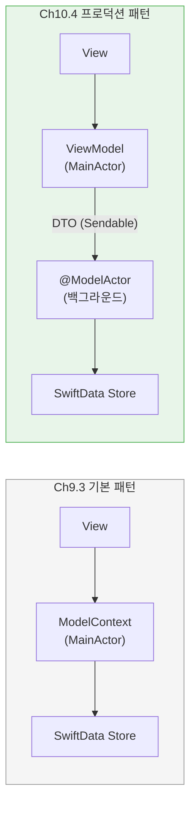
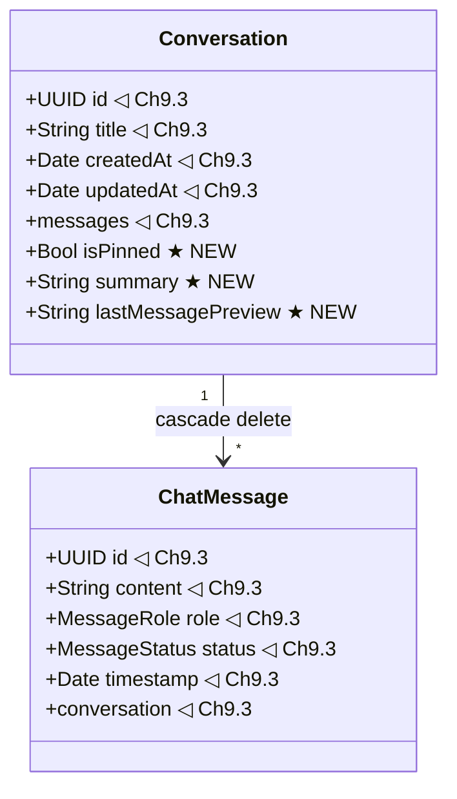
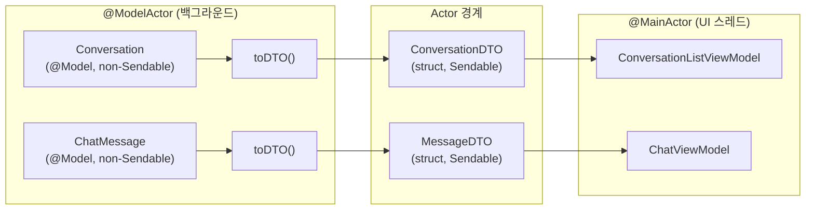
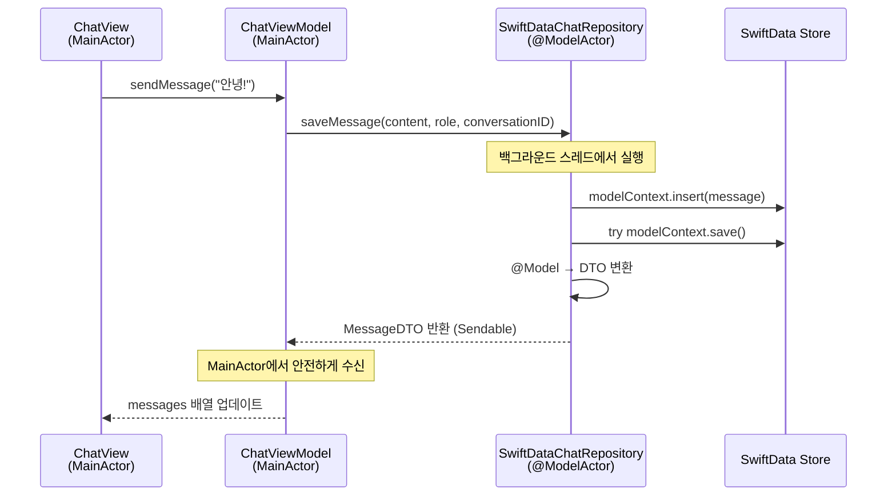
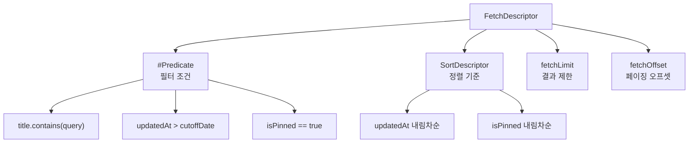
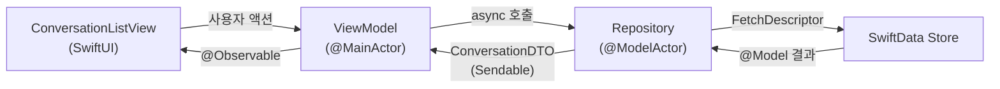

# 대화 영구 저장과 복원

> Ch9.3의 SwiftData 대화 모델을 확장하여, DTO 패턴과 @ModelActor 백그라운드 처리로 프로덕션급 데이터 레이어를 완성합니다.

## 개요

이 섹션에서는 앞서 설계한 AI 채팅봇 앱의 데이터 레이어를 프로덕션 수준으로 완성합니다. [대화 히스토리 영구 저장](09-ch9-세션-관리와-멀티턴-대화/03-03-대화-히스토리-영구-저장.md)에서 이미 `Conversation`과 `ChatMessage`의 `@Model` 정의, 1:N 관계 설정, 기본 CRUD를 구현했습니다. 이번에는 그 모델을 **그대로 가져와** 두 가지 핵심 과제를 해결합니다.

첫 번째는 **DTO(Data Transfer Object) 패턴**입니다. `@Model` 객체는 `Sendable`이 아니기 때문에, Swift 6 Strict Concurrency 환경에서 Actor 경계를 안전하게 넘기려면 전송용 구조체가 필요합니다. 두 번째는 **`@ModelActor`를 활용한 백그라운드 데이터 접근**입니다. 메인 스레드를 차단하지 않으면서 대량의 대화 데이터를 안전하게 읽고 쓰는 Repository 계층을 구축합니다.

**선수 지식**:
- [대화 히스토리 영구 저장](09-ch9-세션-관리와-멀티턴-대화/03-03-대화-히스토리-영구-저장.md)에서 구현한 `Conversation`, `ChatMessage` @Model과 기본 CRUD
- [채팅봇 앱 아키텍처 설계](10-ch10-실전-프로젝트-ai-채팅봇-앱/01-01-채팅봇-앱-아키텍처-설계.md)에서 정의한 Repository 프로토콜
- Swift Concurrency 기초(async/await, Actor)

**학습 목표**:
- Ch9.3의 모델을 확장하여 프로덕션용 필드(`isPinned`, `summary`, `lastMessagePreview`)를 추가한다
- DTO 패턴으로 Actor 경계를 넘는 안전한 데이터 전달을 구현한다
- `@ModelActor`를 활용해 백그라운드에서 안전하게 데이터를 읽고 쓴다
- `FetchDescriptor`와 `#Predicate`로 대화 검색과 페이징을 구현한다

## 왜 알아야 할까?

Ch9.3에서 SwiftData로 대화를 저장하는 기본 패턴은 완성했습니다. 하지만 그것만으로는 프로덕션 앱이 되지 못하는 두 가지 이유가 있습니다.

첫째, **동시성 안전 문제**입니다. Ch9.3에서는 `@MainActor` 위의 `ModelContext`로 직접 저장했는데, 대화가 수백 개 쌓이면 메인 스레드가 블로킹되어 UI가 버벅거립니다. AI 스트리밍 응답을 실시간 저장하면서 동시에 스크롤을 부드럽게 유지하려면, 백그라운드 Actor에서 데이터를 처리해야 합니다.

둘째, **Actor 경계 전달 문제**입니다. `@Model` 클래스는 `Sendable`이 아니라서 백그라운드 Actor → MainActor로 직접 넘길 수 없습니다. Swift 6 Strict Concurrency에서는 컴파일 에러가 발생하죠. 이를 해결하는 것이 DTO 패턴입니다.

실제로 Apple의 오픈소스 프로젝트 [FoundationChat](https://github.com/Dimillian/FoundationChat)도 `@ModelActor` + DTO 조합으로 데이터 레이어를 구현합니다.

> 📊 **그림 1**: Ch9.3 기본 패턴 vs Ch10.4 프로덕션 패턴



Ch9.3의 단순한 패턴을 프로덕션급으로 진화시키는 것이 이 섹션의 목표입니다.

## 핵심 개념

### 개념 1: Ch9.3 모델 확장 — 프로덕션 필드 추가

> 💡 **비유**: Ch9.3에서 만든 모델이 "기본 가구만 있는 원룸"이라면, 지금은 "수납장과 책장을 추가하는" 단계입니다. 뼈대는 그대로 두고 실전에 필요한 편의 기능만 덧붙이는 거죠.

[대화 히스토리 영구 저장](09-ch9-세션-관리와-멀티턴-대화/03-03-대화-히스토리-영구-저장.md)에서 `Conversation`과 `ChatMessage`의 핵심 구조 — `@Model` 정의, `@Relationship(deleteRule: .cascade)` 1:N 관계, `MessageRole`/`MessageStatus` enum — 를 이미 구현했습니다. 여기서는 그 모델에 대화 목록 UI와 관리 기능에 필요한 프로덕션 필드를 추가합니다:

> 📊 **그림 2**: Ch9.3 모델에 추가되는 프로덕션 필드



```swift
import SwiftData
import Foundation

// MARK: - Ch9.3 Conversation 모델 확장
// Ch9.3에서 정의한 기본 구조에 프로덕션 필드 추가
@Model
final class Conversation {
    // --- Ch9.3에서 정의한 기본 필드 ---
    var id: UUID
    var title: String
    var createdAt: Date
    var updatedAt: Date
    
    @Relationship(deleteRule: .cascade, inverse: \ChatMessage.conversation)
    var messages: [ChatMessage]
    
    // --- Ch10.4에서 추가하는 프로덕션 필드 ---
    var isPinned: Bool               // 대화 고정 기능
    var summary: String?             // AI 자동 요약
    var lastMessagePreview: String   // 목록 미리보기용
    
    init(title: String = "새 대화") {
        self.id = UUID()
        self.title = title
        self.createdAt = Date()
        self.updatedAt = Date()
        self.messages = []
        self.isPinned = false
        self.summary = nil
        self.lastMessagePreview = ""
    }
}
```

`isPinned`는 대화를 상단에 고정하는 기능, `lastMessagePreview`는 목록 화면에서 마지막 메시지를 빠르게 보여주기 위한 필드입니다. `summary`는 AI가 대화 내용을 자동 요약한 결과를 저장합니다. `ChatMessage`는 Ch9.3 정의를 그대로 사용하므로 여기서 재정의하지 않습니다.

### 개념 2: DTO 패턴 — Actor 경계를 넘는 데이터 전달

> 💡 **비유**: 해외 여행할 때 환전소를 이용하잖아요? 한국 원화(`@Model` 객체)를 외국에서 직접 쓸 수 없으니, 달러(DTO)로 환전해서 가져가는 거죠. DTO는 "통화가 다른 두 나라(Actor)" 사이에서 데이터를 안전하게 교환하는 환전소 역할을 합니다.

`@Model` 클래스는 `Sendable`을 준수하지 않습니다. Swift 6의 Strict Concurrency 검사에서 `@ModelActor`(백그라운드) → `@MainActor`(UI)로 직접 전달하면 컴파일 에러가 발생합니다. 이 문제를 해결하는 것이 **DTO(Data Transfer Object) 패턴**입니다.

> 📊 **그림 3**: DTO 패턴의 Actor 경계 전달 흐름



```swift
// MARK: - 전송용 DTO (Sendable)
// Actor 경계를 넘어 안전하게 전달할 수 있는 값 타입
struct ConversationDTO: Sendable, Identifiable {
    let id: PersistentIdentifier  // Sendable한 모델 식별자
    let title: String
    let updatedAt: Date
    let isPinned: Bool
    let lastMessagePreview: String
    let messageCount: Int
}

struct MessageDTO: Sendable, Identifiable {
    let id: PersistentIdentifier
    let content: String
    let role: MessageRole      // Ch9.3에서 정의한 Sendable enum
    let status: MessageStatus  // Ch9.3에서 정의한 Sendable enum
    let timestamp: Date
}

// MARK: - @Model → DTO 변환 헬퍼
extension Conversation {
    var toDTO: ConversationDTO {
        ConversationDTO(
            id: persistentModelID,
            title: title,
            updatedAt: updatedAt,
            isPinned: isPinned,
            lastMessagePreview: lastMessagePreview,
            messageCount: messages.count
        )
    }
}

extension ChatMessage {
    var toDTO: MessageDTO {
        MessageDTO(
            id: persistentModelID,
            content: content,
            role: role,
            status: status,
            timestamp: timestamp
        )
    }
}
```

여기서 핵심은 `PersistentIdentifier`입니다. SwiftData가 제공하는 이 타입은 `Sendable`을 준수하면서 원본 `@Model` 객체를 고유하게 식별합니다. DTO에 이 ID를 담아두면, 나중에 다른 Actor에서 `modelContext.model(for: id)`로 원본에 다시 접근할 수 있습니다. 마치 "주민등록번호만 알면 어디서든 본인 확인이 가능한" 것과 비슷하죠.

### 개념 3: @ModelActor로 백그라운드 데이터 접근

> 💡 **비유**: 은행 창구를 떠올려보세요. 고객(UI 스레드)이 직접 금고(데이터베이스)에 들어가면 혼란이 생기니까, 전담 직원(`@ModelActor`)이 금고에서 입출금을 처리하고 결과만 알려주는 거죠. 이 직원은 한 번에 한 건씩(serial) 처리하니까 데이터가 꼬일 일도 없습니다.

Ch9.3에서는 `@MainActor` 위의 `ModelContext`로 직접 저장했습니다. 대화가 몇 개일 때는 괜찮지만, 수백 개의 대화와 수천 개의 메시지를 다루는 프로덕션 앱에서는 메인 스레드가 블로킹됩니다. `@ModelActor`는 SwiftData가 제공하는 Actor 매크로로, 자동으로 전용 `ModelContext`와 `SerialExecutor`를 생성하여 백그라운드에서 안전하게 데이터를 처리합니다.

> 📊 **그림 4**: @ModelActor 동작 흐름 — DTO를 통한 Actor 간 통신



`@ModelActor` 기반의 Repository 구현입니다. 10.1에서 정의한 `ChatRepositoryProtocol`을 구체화합니다:

```swift
import SwiftData

// MARK: - Repository 프로토콜
protocol ChatRepositoryProtocol: Sendable {
    func createConversation(title: String) async throws -> PersistentIdentifier
    func fetchConversations() async throws -> [ConversationDTO]
    func fetchMessages(for conversationID: PersistentIdentifier) async throws -> [MessageDTO]
    func saveMessage(_ content: String, role: MessageRole, to conversationID: PersistentIdentifier) async throws
    func deleteConversation(_ id: PersistentIdentifier) async throws
    func searchConversations(query: String) async throws -> [ConversationDTO]
    func togglePin(for conversationID: PersistentIdentifier) async throws
}

// MARK: - @ModelActor Repository 구현
@ModelActor
actor SwiftDataChatRepository: ChatRepositoryProtocol {
    
    // 새 대화 생성 — PersistentIdentifier 반환 (Sendable)
    func createConversation(title: String) throws -> PersistentIdentifier {
        let conversation = Conversation(title: title)
        modelContext.insert(conversation)
        try modelContext.save()
        return conversation.persistentModelID
    }
    
    // 대화 목록 — DTO 배열로 변환하여 반환
    func fetchConversations() throws -> [ConversationDTO] {
        let descriptor = FetchDescriptor<Conversation>(
            sortBy: [
                SortDescriptor(\.isPinned, order: .reverse),
                SortDescriptor(\.updatedAt, order: .reverse)
            ]
        )
        let conversations = try modelContext.fetch(descriptor)
        return conversations.map(\.toDTO) // @Model → DTO 변환
    }
    
    // 메시지 조회 — PersistentIdentifier로 대화 특정
    func fetchMessages(for conversationID: PersistentIdentifier) throws -> [MessageDTO] {
        guard let conversation = modelContext.model(for: conversationID) as? Conversation else {
            throw ChatDataError.conversationNotFound
        }
        let sorted = conversation.messages.sorted { $0.timestamp < $1.timestamp }
        return sorted.map(\.toDTO) // @Model → DTO 변환
    }
    
    // 메시지 저장 — 백그라운드에서 실행, 메인 스레드 차단 없음
    func saveMessage(
        _ content: String,
        role: MessageRole,
        to conversationID: PersistentIdentifier
    ) throws {
        guard let conversation = modelContext.model(for: conversationID) as? Conversation else {
            throw ChatDataError.conversationNotFound
        }
        let message = ChatMessage(content: content, role: role)
        message.conversation = conversation
        conversation.messages.append(message)
        conversation.updatedAt = Date()
        conversation.lastMessagePreview = String(content.prefix(100))
        
        modelContext.insert(message)
        try modelContext.save() // 명시적 저장 — 스트리밍 중 크래시 대비
    }
    
    // 캐스케이드 삭제 — Ch9.3의 @Relationship 설정에 의해 메시지도 함께 삭제
    func deleteConversation(_ id: PersistentIdentifier) throws {
        guard let conversation = modelContext.model(for: id) as? Conversation else {
            throw ChatDataError.conversationNotFound
        }
        modelContext.delete(conversation)
        try modelContext.save()
    }
    
    // 대화 검색
    func searchConversations(query: String) throws -> [ConversationDTO] {
        let descriptor = FetchDescriptor<Conversation>(
            predicate: #Predicate<Conversation> { conversation in
                conversation.title.localizedStandardContains(query) ||
                conversation.lastMessagePreview.localizedStandardContains(query)
            },
            sortBy: [SortDescriptor(\.updatedAt, order: .reverse)]
        )
        return try modelContext.fetch(descriptor).map(\.toDTO)
    }
    
    // 핀 토글
    func togglePin(for conversationID: PersistentIdentifier) throws {
        guard let conversation = modelContext.model(for: conversationID) as? Conversation else {
            throw ChatDataError.conversationNotFound
        }
        conversation.isPinned.toggle()
        try modelContext.save()
    }
    
    // 대화 제목 변경
    func renameConversation(_ id: PersistentIdentifier, newTitle: String) throws {
        guard let conversation = modelContext.model(for: id) as? Conversation else {
            throw ChatDataError.conversationNotFound
        }
        conversation.title = newTitle
        conversation.updatedAt = Date()
        try modelContext.save()
    }
}

// MARK: - 에러 타입
enum ChatDataError: Error, LocalizedError {
    case conversationNotFound
    case saveFailed(underlying: Error)
    
    var errorDescription: String? {
        switch self {
        case .conversationNotFound:
            return "대화를 찾을 수 없습니다."
        case .saveFailed(let error):
            return "저장에 실패했습니다: \(error.localizedDescription)"
        }
    }
}
```

Ch9.3에서는 ViewModel이 `ModelContext`를 직접 다뤘지만, 여기서는 모든 데이터 접근이 `@ModelActor` 안에서 이루어집니다. Repository의 모든 반환 타입이 DTO(`ConversationDTO`, `MessageDTO`) 또는 `PersistentIdentifier`같은 Sendable 타입이라는 점에 주목하세요. 이것이 Actor 경계를 안전하게 넘는 핵심입니다.

### 개념 4: FetchDescriptor 고급 활용 — 페이징과 복합 필터

> 💡 **비유**: 도서관의 검색 시스템을 떠올려보세요. "요리"라고 검색하면 제목에 "요리"가 들어간 책뿐 아니라, 내용에 "요리"가 나오는 책도 찾아주잖아요? `#Predicate`가 바로 이 역할이고, `FetchDescriptor`는 "최신순 정렬, 상위 20개만" 같은 조건을 추가하는 거죠.

> 📊 **그림 5**: FetchDescriptor 구성 요소



`@ModelActor` 안에서 `FetchDescriptor`의 고급 기능을 활용한 쿼리들입니다:

```swift
extension SwiftDataChatRepository {
    
    // 페이징 지원 대화 목록 — 대화가 수백 개일 때 필수
    func fetchConversations(page: Int, pageSize: Int = 20) throws -> [ConversationDTO] {
        var descriptor = FetchDescriptor<Conversation>(
            sortBy: [
                SortDescriptor(\.isPinned, order: .reverse),
                SortDescriptor(\.updatedAt, order: .reverse)
            ]
        )
        descriptor.fetchLimit = pageSize
        descriptor.fetchOffset = page * pageSize
        
        return try modelContext.fetch(descriptor).map(\.toDTO)
    }
    
    // 고정된 대화만 조회
    func fetchPinnedConversations() throws -> [ConversationDTO] {
        let descriptor = FetchDescriptor<Conversation>(
            predicate: #Predicate<Conversation> { $0.isPinned == true },
            sortBy: [SortDescriptor(\.updatedAt, order: .reverse)]
        )
        return try modelContext.fetch(descriptor).map(\.toDTO)
    }
    
    // 날짜 범위 필터링
    func fetchConversations(from startDate: Date, to endDate: Date) throws -> [ConversationDTO] {
        let descriptor = FetchDescriptor<Conversation>(
            predicate: #Predicate<Conversation> { conversation in
                conversation.updatedAt >= startDate && conversation.updatedAt <= endDate
            },
            sortBy: [SortDescriptor(\.updatedAt, order: .reverse)]
        )
        return try modelContext.fetch(descriptor).map(\.toDTO)
    }
}
```

> ⚠️ **흔한 오해**: `#Predicate` 안에서 Swift의 모든 표현식을 쓸 수 있다고 생각하기 쉽지만, 실제로는 SwiftData가 SQLite 쿼리로 변환 가능한 표현만 지원합니다. 커스텀 함수 호출이나 복잡한 클로저는 컴파일 에러가 납니다. `localizedStandardContains`처럼 SwiftData가 인식하는 메서드만 사용하세요.

### 개념 5: ViewModel과 Repository 연결 — DTO 기반 UI 바인딩

> 💡 **비유**: 카카오톡 채팅 목록 화면을 떠올려보세요. 각 채팅방에는 마지막 메시지 미리보기, 시간이 보이고, 스와이프하면 삭제할 수 있습니다. 이것을 DTO로 공급받는 ViewModel + SwiftUI로 구현하는 겁니다.

> 📊 **그림 6**: ViewModel-Repository 데이터 흐름 — DTO가 경계를 넘는 구간



`ConversationListViewModel`은 Repository로부터 `ConversationDTO` 배열을 받아 UI에 공급합니다. `@Model` 객체가 ViewModel에 노출되지 않는다는 것이 핵심입니다:

```swift
import SwiftUI

@Observable @MainActor
final class ConversationListViewModel {
    private let repository: ChatRepositoryProtocol
    
    // UI가 바인딩하는 데이터 — 모두 DTO 타입
    var conversations: [ConversationDTO] = []
    var selectedConversation: ConversationDTO?
    var isLoading = false
    var errorMessage: String?
    
    var pinnedConversations: [ConversationDTO] {
        conversations.filter(\.isPinned)
    }
    
    var unpinnedConversations: [ConversationDTO] {
        conversations.filter { !$0.isPinned }
    }
    
    init(repository: ChatRepositoryProtocol) {
        self.repository = repository
    }
    
    func loadConversations() async {
        isLoading = true
        defer { isLoading = false }
        
        do {
            // Repository가 @ModelActor에서 DTO로 변환 후 반환
            conversations = try await repository.fetchConversations()
        } catch {
            errorMessage = "대화 목록을 불러올 수 없습니다: \(error.localizedDescription)"
        }
    }
    
    func createNewConversation() async -> PersistentIdentifier? {
        do {
            let id = try await repository.createConversation(title: "새 대화")
            await loadConversations()
            return id
        } catch {
            errorMessage = "대화를 생성할 수 없습니다."
            return nil
        }
    }
    
    func delete(_ conversation: ConversationDTO) async {
        do {
            try await repository.deleteConversation(conversation.id)
            conversations.removeAll { $0.id == conversation.id }
            if selectedConversation?.id == conversation.id {
                selectedConversation = nil
            }
        } catch {
            errorMessage = "삭제에 실패했습니다."
        }
    }
    
    func togglePin(_ conversation: ConversationDTO) async {
        do {
            try await repository.togglePin(for: conversation.id)
            await loadConversations() // 정렬 순서 변경 반영
        } catch {
            errorMessage = "고정 설정을 변경할 수 없습니다."
        }
    }
    
    func search(query: String) async {
        if query.isEmpty {
            await loadConversations()
            return
        }
        do {
            conversations = try await repository.searchConversations(query: query)
        } catch {
            errorMessage = "검색에 실패했습니다."
        }
    }
}
```

Ch9.3의 ViewModel과 비교해보면, `ModelContext`를 직접 사용하는 코드가 완전히 사라졌습니다. 모든 데이터 접근이 `repository`를 통해 이루어지고, ViewModel은 DTO만 다룹니다. 이것이 10.1 아키텍처에서 설계한 "관심사 분리"의 실제 구현입니다.

## 실습: 직접 해보기

지금까지 배운 DTO 패턴과 `@ModelActor` Repository를 조합하여, AI 스트리밍 응답을 백그라운드에서 저장하는 전체 흐름을 구현해봅시다.

```swift
import SwiftData
import FoundationModels

// MARK: - App 진입점 — ModelContainer + Repository 주입
@main
struct AIChatApp: App {
    let container: ModelContainer
    
    init() {
        let schema = Schema([Conversation.self, ChatMessage.self])
        let config = ModelConfiguration(
            "AIChat",
            schema: schema,
            isStoredInMemoryOnly: false,
            allowsSave: true
        )
        do {
            container = try ModelContainer(for: schema, configurations: [config])
        } catch {
            fatalError("ModelContainer 초기화 실패: \(error)")
        }
    }
    
    var body: some Scene {
        WindowGroup {
            // @ModelActor Repository를 주입
            let repository = SwiftDataChatRepository(modelContainer: container)
            ConversationListView(repository: repository)
        }
        .modelContainer(container)
    }
}

// MARK: - ChatViewModel — 스트리밍 + 백그라운드 저장 통합
@Observable @MainActor
final class ChatViewModel {
    private let aiService: AIServiceProtocol
    private let repository: ChatRepositoryProtocol
    private let conversationID: PersistentIdentifier
    
    var messages: [MessageDTO] = []  // DTO 타입만 보유
    var streamingText: String = ""
    var isGenerating = false
    var inputText = ""
    
    init(
        aiService: AIServiceProtocol,
        repository: ChatRepositoryProtocol,
        conversationID: PersistentIdentifier
    ) {
        self.aiService = aiService
        self.repository = repository
        self.conversationID = conversationID
    }
    
    func loadMessages() async {
        do {
            // @ModelActor에서 DTO로 변환되어 반환
            messages = try await repository.fetchMessages(for: conversationID)
        } catch {
            print("메시지 로드 실패: \(error)")
        }
    }
    
    func sendMessage() async {
        let userText = inputText.trimmingCharacters(in: .whitespacesAndNewlines)
        guard !userText.isEmpty else { return }
        inputText = ""
        
        // 1단계: 사용자 메시지 → @ModelActor에서 백그라운드 저장
        do {
            try await repository.saveMessage(userText, role: .user, to: conversationID)
            await loadMessages()
        } catch {
            print("사용자 메시지 저장 실패: \(error)")
            return
        }
        
        // 2단계: AI 스트리밍 수신
        isGenerating = true
        streamingText = ""
        
        do {
            let stream = try await aiService.streamResponse(prompt: userText)
            for try await chunk in stream {
                streamingText += chunk
            }
            
            // 3단계: 완성된 응답 → @ModelActor에서 백그라운드 저장
            let finalResponse = streamingText
            try await repository.saveMessage(finalResponse, role: .assistant, to: conversationID)
            
            streamingText = ""
            isGenerating = false
            await loadMessages()
            
        } catch {
            isGenerating = false
            streamingText = ""
            try? await repository.saveMessage(
                "응답 생성에 실패했습니다: \(error.localizedDescription)",
                role: .system,
                to: conversationID
            )
            await loadMessages()
        }
    }
    
    // AI 자동 대화 제목 생성
    func generateTitle() async {
        guard let firstUserMessage = messages.first(where: { $0.role == .user }) else { return }
        
        do {
            let titlePrompt = "다음 대화의 주제를 5단어 이내 한국어로 요약해줘: \(firstUserMessage.content)"
            let title = try await aiService.generateResponse(prompt: titlePrompt)
            try await repository.renameConversation(conversationID, newTitle: title)
        } catch {
            print("제목 생성 실패: \(error)")
        }
    }
}
```

```run:swift
// 시뮬레이션: Ch9.3 패턴 vs Ch10.4 패턴 비교
print("=== Ch9.3 기본 패턴 ===")
print("ModelContext 직접 사용 (MainActor)")
print("@Model 객체를 View에 직접 전달")
print("→ 소규모 앱에 적합, 동시성 이슈 가능")
print("")
print("=== Ch10.4 프로덕션 패턴 ===")
print("@ModelActor Repository (백그라운드)")
print("DTO로 Actor 경계 전달 (Sendable)")
print("PersistentIdentifier로 모델 참조")
print("→ 대규모 앱, Swift 6 Strict Concurrency 안전")
```

```output
=== Ch9.3 기본 패턴 ===
ModelContext 직접 사용 (MainActor)
@Model 객체를 View에 직접 전달
→ 소규모 앱에 적합, 동시성 이슈 가능

=== Ch10.4 프로덕션 패턴 ===
@ModelActor Repository (백그라운드)
DTO로 Actor 경계 전달 (Sendable)
PersistentIdentifier로 모델 참조
→ 대규모 앱, Swift 6 Strict Concurrency 안전
```

## 더 깊이 알아보기

### DTO 패턴의 기원

DTO(Data Transfer Object) 패턴은 SwiftData에서 처음 나온 것이 아닙니다. 2002년 Martin Fowler가 《Patterns of Enterprise Application Architecture》에서 정의한 패턴으로, 원래는 Java EE의 EJB(Enterprise JavaBeans) 환경에서 "네트워크를 넘어 데이터를 전달할 때 비용이 크니, 필요한 필드만 담은 단순한 객체를 만들어 보내자"는 목적이었습니다.

20여 년이 지난 지금, Swift의 Actor 경계라는 전혀 다른 맥락에서 동일한 패턴이 재조명되고 있다는 점이 흥미롭죠. "경계를 넘을 때는 가볍고 안전한 데이터 컨테이너를 사용하라"는 원칙은 기술이 바뀌어도 유효합니다.

### @ModelActor의 탄생 배경

WWDC 2023에서 SwiftData와 함께 `@ModelActor`가 소개되었습니다. 그 이전에 Core Data에서 백그라운드 처리를 하려면 `performBackgroundTask` 클로저를 사용하고, `NSManagedObjectID`로 객체를 넘기고, 별도의 `NSManagedObjectContext`를 수동으로 관리해야 했습니다. 코드가 복잡하고 실수하기 쉬웠죠.

Apple의 Core Data 팀은 Swift의 Actor 모델이 이 문제의 완벽한 해결책이라는 것을 깨달았습니다. Actor가 자체 격리 도메인을 가지므로, "각 Actor가 자신만의 ModelContext를 갖게 하면 데이터 경쟁이 원천 차단된다"는 설계가 가능해진 것이죠. `@ModelActor` 매크로 하나로 `ModelContainer` 주입, 전용 `ModelContext` 생성, `SerialExecutor` 설정이 자동으로 이루어집니다.

## 흔한 오해와 팁

> ⚠️ **흔한 오해**: "SwiftData는 자동 저장이니까 `save()`를 직접 호출할 필요 없다"고 생각하기 쉽습니다. SwiftData가 앱 전환 등 특정 이벤트에서 자동 저장하는 것은 맞지만, **AI 스트리밍 중간에 앱이 크래시**하면 저장되지 않은 메시지를 잃을 수 있습니다. 중요한 데이터 변경 후에는 명시적으로 `try modelContext.save()`를 호출하세요.

> 💡 **알고 계셨나요?**: `PersistentIdentifier`는 내부적으로 모델의 `entityName`과 고유 행 ID를 조합한 복합 식별자입니다. UUID와 달리 SwiftData 스토어에 직접 바인딩되어 있어서, `modelContext.model(for: id)`로 호출하면 O(1)에 가깝게 원본 객체를 찾을 수 있습니다. DTO에 `UUID` 대신 `PersistentIdentifier`를 담는 이유가 바로 이것입니다.

> 🔥 **실무 팁**: 대화가 수백 개 이상 쌓이면 전체를 한 번에 fetch하면 메모리가 과다 소모됩니다. `FetchDescriptor`의 `fetchLimit`과 `fetchOffset`을 활용한 페이징을 반드시 적용하세요. 대화 목록에서는 20~30개만 로드하고, 스크롤 시 추가 로드하는 **무한 스크롤** 패턴이 실무 표준입니다.

## 핵심 정리

| 개념 | 설명 |
|------|------|
| Ch9.3 모델 확장 | 기본 `@Model`에 `isPinned`, `summary`, `lastMessagePreview` 프로덕션 필드 추가 |
| DTO 패턴 | `@Model` 대신 Sendable 구조체(`ConversationDTO`, `MessageDTO`)로 Actor 간 데이터 전달 |
| `PersistentIdentifier` | Sendable한 모델 식별자 — DTO에 담아 Actor 경계를 넘고, 원본 모델에 재접근 가능 |
| `@ModelActor` | 백그라운드 전용 ModelContext를 가진 Actor — 메인 스레드 차단 없이 안전한 데이터 처리 |
| `FetchDescriptor` 페이징 | `fetchLimit` + `fetchOffset`으로 대화 목록 무한 스크롤 구현 |
| `#Predicate` 검색 | 컴파일 타임 타입 안전 쿼리 — `localizedStandardContains`로 대화 검색 |
| Repository 패턴 | ViewModel이 `@Model`을 모르고, DTO와 프로토콜만으로 데이터 레이어에 접근 |

## 다음 섹션 미리보기

대화 저장이 완성되었으니, 이제 채팅봇에 **실제 기능**을 부여할 차례입니다. [Tool 통합과 확장](10-ch10-실전-프로젝트-ai-채팅봇-앱/05-05-tool-통합과-확장.md)에서는 Ch7~Ch8에서 배운 Tool Calling을 채팅봇에 통합하여, 날씨 조회, 웹 검색, 계산 등 외부 기능을 수행하는 다기능 AI 어시스턴트로 확장합니다. Tool 호출 결과도 SwiftData에 함께 저장하는 패턴까지 다룹니다.

## 참고 자료

- [SwiftData | Apple Developer Documentation](https://developer.apple.com/xcode/swiftdata) - SwiftData 공식 문서, @Model과 ModelContainer 전체 API 참조
- [FoundationChat — GitHub (Dimillian)](https://github.com/Dimillian/FoundationChat) - SwiftData + Foundation Models를 결합한 실전 오픈소스 채팅 앱 참고 프로젝트
- [Using ModelActor in SwiftData | BrightDigit](https://brightdigit.com/tutorials/swiftdata-modelactor/) - @ModelActor의 동작 원리와 백그라운드 데이터 접근 패턴 심화 해설
- [SwiftData Architecture Patterns and Practices | AzamSharp](https://azamsharp.com/2025/03/28/swiftdata-architecture-patterns-and-practices.html) - SwiftData 아키텍처 패턴과 DTO, Repository 패턴 실무 가이드
- [How SwiftData works with Swift concurrency | Hacking with Swift](https://www.hackingwithswift.com/quick-start/swiftdata/how-swiftdata-works-with-swift-concurrency) - PersistentIdentifier와 Sendable 제약, Actor 간 모델 전달 패턴 해설

---
### 🔗 Related Sessions
- [chatmessage](10-ch10-실전-프로젝트-ai-채팅봇-앱/01-01-채팅봇-앱-아키텍처-설계.md) (prerequisite)
- [messagerole](10-ch10-실전-프로젝트-ai-채팅봇-앱/01-01-채팅봇-앱-아키텍처-설계.md) (prerequisite)
- [messagestatus](10-ch10-실전-프로젝트-ai-채팅봇-앱/01-01-채팅봇-앱-아키텍처-설계.md) (prerequisite)
- [chatviewmodel](10-ch10-실전-프로젝트-ai-채팅봇-앱/01-01-채팅봇-앱-아키텍처-설계.md) (prerequisite)
- [aiserviceprotocol](10-ch10-실전-프로젝트-ai-채팅봇-앱/01-01-채팅봇-앱-아키텍처-설계.md) (prerequisite)
- [chatrepositoryprotocol](10-ch10-실전-프로젝트-ai-채팅봇-앱/01-01-채팅봇-앱-아키텍처-설계.md) (prerequisite)
- [chatview](10-ch10-실전-프로젝트-ai-채팅봇-앱/02-02-채팅-ui-구현.md) (prerequisite)
- [foundationmodelaiservice](10-ch10-실전-프로젝트-ai-채팅봇-앱/01-01-채팅봇-앱-아키텍처-설계.md) (prerequisite)
