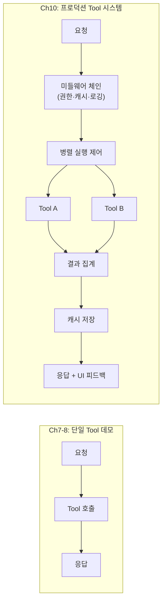
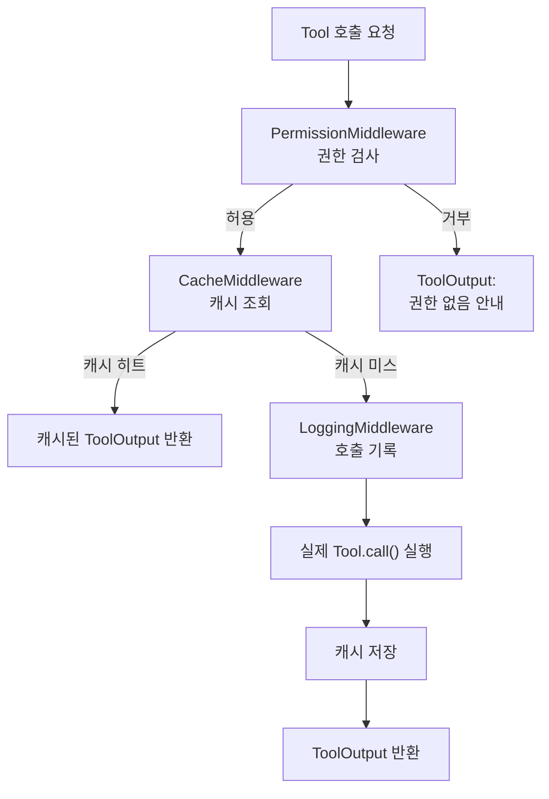
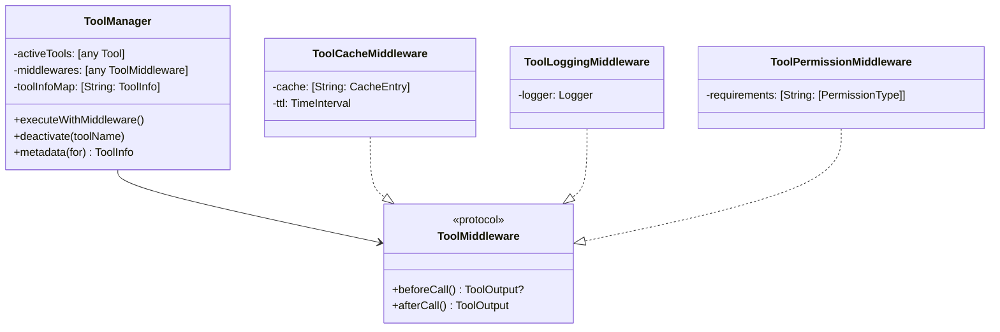
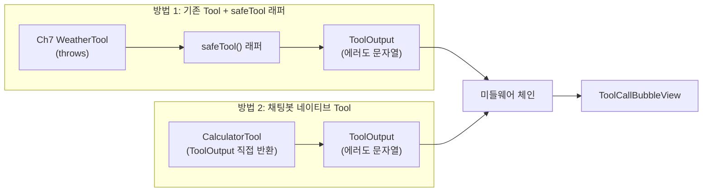
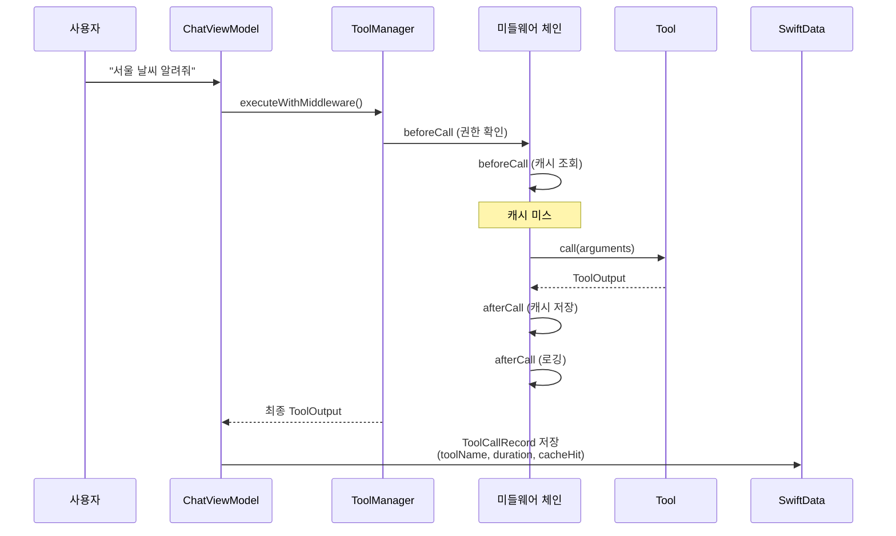
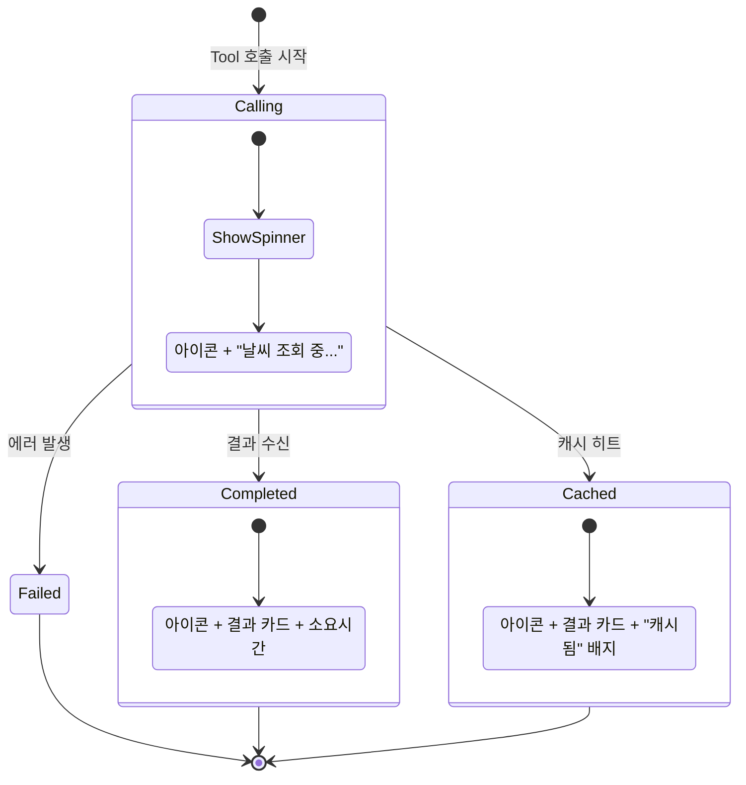
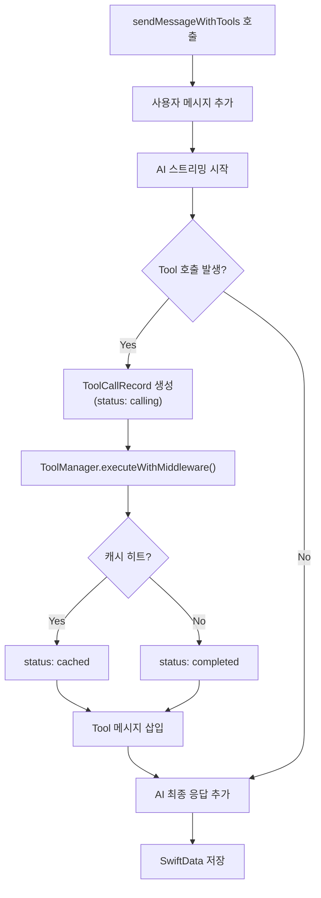
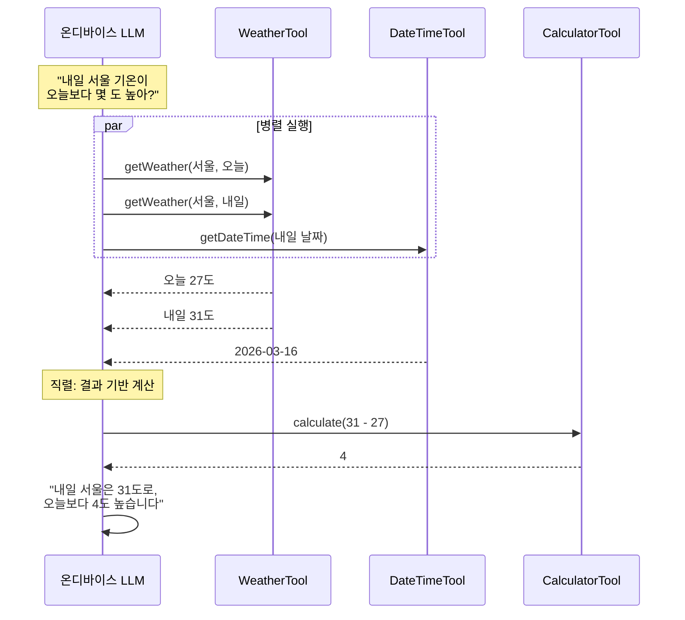

# 05. Tool 통합과 확장

> 복수 Tool의 미들웨어 패턴, 병렬 실행 전략, 결과 캐싱까지 — 실전 채팅봇에 Tool 시스템을 프로덕션 수준으로 통합합니다.

## 개요

이 섹션에서는 지금까지 구축한 AI 채팅봇 앱에 **프로덕션 수준의 Tool 시스템**을 통합합니다. Ch7~Ch8에서 배운 Tool 프로토콜과 등록 패턴의 기초 위에, 미들웨어 체인, 병렬 실행 제어, 결과 캐싱, 동적 Tool 교체 같은 **실전 아키텍처 패턴**을 구현합니다. [AI 서비스 레이어 구현](10-ch10-실전-프로젝트-ai-채팅봇-앱/03-03-ai-서비스-레이어-구현.md)에서 만든 `FoundationModelAIService`와 [대화 영구 저장과 복원](10-ch10-실전-프로젝트-ai-채팅봇-앱/04-04-대화-영구-저장과-복원.md)의 SwiftData 모델이 Tool 호출 결과까지 저장하게 됩니다.

**선수 지식**:
- [Tool 프로토콜 구현하기](07-ch7-tool-calling-기초/02-02-tool-프로토콜-구현하기.md)의 Tool 프로토콜 기본 구조 (정의 세션)
- [복수 Tool 등록과 선택 전략](08-ch8-tool-calling-심화/01-01-복수-tool-등록과-선택-전략.md)의 다중 Tool 세션 등록
- [실습: 날씨와 검색 Tool 구현](07-ch7-tool-calling-기초/05-05-실습-날씨와-검색-tool-구현.md)의 WeatherTool 완전 구현
- Ch10 이전 섹션들의 MVVM 아키텍처, AI 서비스 레이어, SwiftData 저장 구조

**학습 목표**:
- Tool 미들웨어 패턴으로 로깅·캐싱·권한 검사를 Tool 호출에 선언적으로 적용한다
- ToolManager의 동적 등록/해제와 의존성 그래프 관리를 구현한다
- Tool 호출 결과 캐싱으로 동일 요청의 중복 API 호출을 방지한다
- Tool 호출 상태(로딩, 성공, 실패)에 따른 인라인 UI 피드백을 구현한다
- 복수 Tool 호출 시 병렬/직렬 실행 전략의 차이를 이해하고 활용한다

## 왜 알아야 할까?

채팅봇에 Tool을 "하나" 붙이는 건 Ch7 수준이면 충분합니다. 하지만 실제 앱에서는 상황이 완전히 달라지죠. "서울 날씨 어때?"에 WeatherTool이 호출되고, "내일 기온이랑 비교해서 뭘 입을지 추천해줘"에는 WeatherTool(내일 예보) + DateTimeTool(내일 날짜 계산)이 **동시에** 호출될 수 있습니다. 여기에 "매번 같은 질문에 API를 반복 호출하면 안 되지 않나?"라는 캐싱 문제, "사용자가 위치 권한을 거부했으면?"이라는 권한 문제가 겹칩니다.

단일 Tool 데모와 프로덕션 Tool 시스템의 차이는 **제어 흐름의 복잡도**에 있습니다. 이번 섹션에서는 그 간극을 메우는 패턴들을 다룹니다.

> 📊 **그림 1**: 단일 Tool 데모 vs 프로덕션 Tool 시스템



## 핵심 개념

### 개념 1: ToolManager — 미들웨어 체인 패턴

> 💡 **비유**: 공항 보안 검색대를 떠올려보세요. 여권 확인 → 수하물 X-ray → 금속 탐지기 → 탑승이라는 **체인**을 거칩니다. 각 단계는 독립적이지만, 순서대로 통과해야만 비행기에 탈 수 있죠. Tool 미들웨어도 마찬가지입니다 — Tool 호출 전후에 권한 검사, 캐시 조회, 로깅을 체인으로 엮어서, 실제 Tool 로직은 건드리지 않고 횡단 관심사를 처리합니다.

[채팅봇 앱 아키텍처 설계](10-ch10-실전-프로젝트-ai-채팅봇-앱/01-01-채팅봇-앱-아키텍처-설계.md)에서 `ToolManager`의 역할을 정의했습니다. Tool 등록과 세션 초기화의 기본 패턴은 [Tool 프로토콜 구현하기](07-ch7-tool-calling-기초/02-02-tool-프로토콜-구현하기.md)와 [복수 Tool 등록과 선택 전략](08-ch8-tool-calling-심화/01-01-복수-tool-등록과-선택-전략.md)에서 이미 다뤘으니, 여기서는 ToolManager가 단순 등록을 넘어 **미들웨어 체인**을 관리하는 구조에 집중합니다.

> 📊 **그림 2**: ToolManager의 미들웨어 아키텍처



```swift
import FoundationModels
import os.log

// MARK: - Tool 미들웨어 프로토콜

/// Tool 호출 전후에 실행되는 미들웨어
protocol ToolMiddleware: Sendable {
    /// Tool 호출 전 검사. nil 반환 시 다음 미들웨어로 진행, 값 반환 시 조기 종료
    func beforeCall(toolName: String, arguments: String) async -> ToolOutput?
    /// Tool 호출 후 결과 가공
    func afterCall(toolName: String, arguments: String,
                   result: ToolOutput, duration: TimeInterval) async -> ToolOutput
}

// 기본 구현 — afterCall은 결과를 그대로 통과
extension ToolMiddleware {
    func afterCall(toolName: String, arguments: String,
                   result: ToolOutput, duration: TimeInterval) async -> ToolOutput {
        result
    }
}

// MARK: - 캐시 미들웨어

/// 동일 Tool + 동일 인자 조합의 결과를 일정 시간 캐싱
actor ToolCacheMiddleware: ToolMiddleware {
    
    private struct CacheEntry {
        let output: ToolOutput
        let timestamp: Date
    }
    
    private var cache: [String: CacheEntry] = [:]
    private let ttl: TimeInterval  // 캐시 유효 시간
    
    init(ttl: TimeInterval = 300) { // 기본 5분
        self.ttl = ttl
    }
    
    nonisolated func beforeCall(toolName: String, arguments: String) async -> ToolOutput? {
        let key = "\(toolName):\(arguments)"
        return await lookup(key: key)
    }
    
    nonisolated func afterCall(toolName: String, arguments: String,
                               result: ToolOutput, duration: TimeInterval) async -> ToolOutput {
        let key = "\(toolName):\(arguments)"
        await store(key: key, output: result)
        return result
    }
    
    private func lookup(key: String) -> ToolOutput? {
        guard let entry = cache[key],
              Date().timeIntervalSince(entry.timestamp) < ttl else {
            return nil
        }
        return entry.output
    }
    
    private func store(key: String, output: ToolOutput) {
        cache[key] = CacheEntry(output: output, timestamp: Date())
        // 오래된 엔트리 정리 (100개 초과 시)
        if cache.count > 100 {
            let cutoff = Date().addingTimeInterval(-ttl)
            cache = cache.filter { $0.value.timestamp > cutoff }
        }
    }
}

// MARK: - 로깅 미들웨어

/// Tool 호출을 OSLog로 기록
struct ToolLoggingMiddleware: ToolMiddleware {
    private let logger = Logger(subsystem: "com.app.chatbot", category: "ToolCall")
    
    func beforeCall(toolName: String, arguments: String) async -> ToolOutput? {
        logger.info("Tool 호출 시작: \(toolName), args: \(arguments)")
        return nil  // 통과
    }
    
    func afterCall(toolName: String, arguments: String,
                   result: ToolOutput, duration: TimeInterval) async -> ToolOutput {
        logger.info("Tool 완료: \(toolName), \(String(format: "%.2f", duration))초")
        return result
    }
}

// MARK: - 권한 미들웨어

/// 위치·네트워크 등 시스템 권한이 필요한 Tool을 사전 검사
struct ToolPermissionMiddleware: ToolMiddleware {
    /// Tool별 필요 권한 매핑
    let requirements: [String: [PermissionType]]
    
    enum PermissionType {
        case location
        case network
    }
    
    func beforeCall(toolName: String, arguments: String) async -> ToolOutput? {
        guard let required = requirements[toolName] else { return nil }
        
        for permission in required {
            switch permission {
            case .location:
                // CLLocationManager 권한 확인
                if !LocationPermissionChecker.isAuthorized {
                    return ToolOutput(
                        "Location permission is required for \(toolName). " +
                        "Please enable location access in Settings."
                    )
                }
            case .network:
                // 네트워크 연결 확인
                if !NetworkMonitor.shared.isConnected {
                    return ToolOutput(
                        "Network connection is required for \(toolName). " +
                        "Please check your internet connection."
                    )
                }
            }
        }
        return nil  // 모든 권한 통과
    }
}
```

이제 ToolManager가 미들웨어 체인을 실행하도록 구성합니다:

```swift
/// 채팅봇의 모든 Tool과 미들웨어를 관리하는 매니저
@Observable
final class ToolManager: Sendable {
    
    struct ToolInfo: Sendable {
        let name: String
        let displayName: String
        let icon: String
        let description: String
        let category: ToolCategory
    }
    
    enum ToolCategory: String, Sendable {
        case system      // 날짜/시간 등 로컬
        case network     // 날씨, 웹 검색 등 네트워크 필요
        case computation // 계산기 등 순수 연산
    }
    
    private(set) var toolInfoMap: [String: ToolInfo] = [:]
    private(set) var activeTools: [any Tool] = []
    private var middlewares: [any ToolMiddleware] = []
    
    init() {
        setupMiddlewares()
        registerDefaultTools()
    }
    
    private func setupMiddlewares() {
        // 미들웨어는 등록 순서대로 실행됨
        middlewares = [
            ToolPermissionMiddleware(requirements: [
                "getWeather": [.location, .network],
                "searchWeb": [.network],
            ]),
            ToolCacheMiddleware(ttl: 300),  // 5분 캐시
            ToolLoggingMiddleware(),
        ]
    }
    
    private func registerDefaultTools() {
        // Ch7.5에서 구현한 WeatherTool을 그대로 재사용
        let weather = WeatherTool()
        let calculator = CalculatorTool()
        let dateTime = DateTimeTool()
        let webSearch = WebSearchTool()
        
        activeTools = [weather, calculator, dateTime, webSearch]
        
        toolInfoMap = [
            weather.name: ToolInfo(
                name: weather.name, displayName: "날씨",
                icon: "cloud.sun", description: "현재 날씨 정보 조회",
                category: .network
            ),
            calculator.name: ToolInfo(
                name: calculator.name, displayName: "계산기",
                icon: "function", description: "수학 계산 수행",
                category: .computation
            ),
            dateTime.name: ToolInfo(
                name: dateTime.name, displayName: "날짜/시간",
                icon: "calendar.badge.clock", description: "날짜와 시간 정보",
                category: .system
            ),
            webSearch.name: ToolInfo(
                name: webSearch.name, displayName: "웹 검색",
                icon: "magnifyingglass", description: "웹에서 정보 검색",
                category: .network
            ),
        ]
    }
    
    /// 미들웨어 체인을 통해 Tool 호출 실행
    func executeWithMiddleware(
        toolName: String,
        arguments: String,
        execute: () async throws -> ToolOutput
    ) async throws -> ToolOutput {
        let start = CFAbsoluteTimeGetCurrent()
        
        // before 체인 — 조기 반환 가능 (캐시 히트, 권한 거부 등)
        for middleware in middlewares {
            if let earlyReturn = await middleware.beforeCall(
                toolName: toolName, arguments: arguments
            ) {
                return earlyReturn
            }
        }
        
        // 실제 Tool 실행
        let result = try await execute()
        let duration = CFAbsoluteTimeGetCurrent() - start
        
        // after 체인 — 결과 가공 (캐시 저장, 로깅 등)
        var processed = result
        for middleware in middlewares {
            processed = await middleware.afterCall(
                toolName: toolName, arguments: arguments,
                result: processed, duration: duration
            )
        }
        
        return processed
    }
    
    func deactivate(toolName: String) {
        activeTools.removeAll { $0.name == toolName }
    }
    
    func metadata(for toolName: String) -> ToolInfo? {
        toolInfoMap[toolName]
    }
}
```

> 📊 **그림 3**: ToolManager의 클래스 관계



### 개념 2: 채팅봇용 Tool 어댑터 패턴

> 💡 **비유**: 해외여행에서 전원 어댑터를 쓰듯이, Ch7~Ch8에서 만든 Tool들을 채팅봇 맥락에 맞게 "어댑팅"합니다. 콘센트(Tool 프로토콜)는 같지만, 플러그(에러 처리, UI 메타데이터)가 달라진 것이죠.

[실습: 날씨와 검색 Tool 구현](07-ch7-tool-calling-기초/05-05-실습-날씨와-검색-tool-구현.md)에서 `WeatherTool`을, [복수 Tool 등록과 선택 전략](08-ch8-tool-calling-심화/01-01-복수-tool-등록과-선택-전략.md)에서 `CalculatorTool` 등을 이미 구현했습니다. 같은 Tool을 다시 만들 이유는 없습니다. 대신 **채팅봇 맥락에서 달라지는 세 가지**에 집중합니다:

1. **에러를 throw하지 않고 ToolOutput 문자열로 반환** — 모델이 자연어로 에러를 안내하게 함
2. **미들웨어 체인과 연동** — 캐싱, 권한 검사가 Tool 코드 외부에서 처리됨
3. **ToolCallRecord로 호출 이력 추적** — UI에 인라인 피드백 표시

> 🔥 **실무 팁**: Tool의 `call()` 메서드에서 `throw`하면 모델이 에러를 직접 처리하기 어렵습니다. 대신 에러 상황을 **문자열로 ToolOutput에 담아** 반환하면, 모델이 "서울 날씨를 조회할 수 없었습니다. 잠시 후 다시 시도해주세요" 같은 자연스러운 응답을 생성할 수 있습니다. Ch7에서 만든 Tool이 `throw`했다면, 채팅봇에 통합할 때 아래처럼 래핑하세요.

```swift
/// 기존 Tool을 채팅봇 안전 호출로 래핑하는 헬퍼
/// Ch7-8의 Tool 구현을 수정하지 않고 재사용할 때 유용
func safeTool<T: Tool>(
    _ tool: T,
    arguments: T.Arguments,
    fallbackMessage: String = "Tool execution failed."
) async -> ToolOutput {
    do {
        return try await tool.call(arguments: arguments)
    } catch {
        // throw 대신 에러를 문자열로 반환 → 모델이 자연어로 안내
        return ToolOutput("\(fallbackMessage) Error: \(error.localizedDescription)")
    }
}
```

채팅봇에 새로 추가하는 Tool이라면, 처음부터 에러를 ToolOutput으로 반환하도록 설계하는 것이 깔끔합니다. 아래는 CalculatorTool의 채팅봇 버전입니다:

```swift
struct CalculatorTool: Tool {
    let name = "calculate"
    let description = "Performs mathematical calculations. Supports basic arithmetic."
    
    @Generable
    struct Arguments {
        @Guide(description: "The mathematical expression, e.g. 15% of 89000")
        var expression: String
        
        @Guide(description: "The type of calculation to perform")
        var operation: Operation
    }
    
    @Generable
    enum Operation: String {
        case add, subtract, multiply, divide, percentage, power
    }
    
    func call(arguments: Arguments) async throws -> ToolOutput {
        let numbers = arguments.expression
            .split(separator: " ")
            .compactMap { Double($0) }
        
        guard numbers.count >= 2 else {
            // throw 대신 ToolOutput으로 에러 안내
            return ToolOutput("Could not parse numbers from: \(arguments.expression)")
        }
        
        let (a, b) = (numbers[0], numbers[1])
        let result: Double = switch arguments.operation {
        case .add: a + b
        case .subtract: a - b
        case .multiply: a * b
        case .divide: b != 0 ? a / b : .nan
        case .percentage: a * b / 100.0
        case .power: pow(a, b)
        }
        
        if result.isNaN { return ToolOutput("Error: Division by zero") }
        
        let formatted = result.truncatingRemainder(dividingBy: 1) == 0
            ? String(format: "%.0f", result)
            : String(format: "%.4f", result)
        
        return ToolOutput("Calculation result: \(formatted)")
    }
}
```

> 📊 **그림 4**: 기존 Tool 재사용 vs 채팅봇 어댑터 패턴



### 개념 3: Tool 호출 상태 추적과 SwiftData 확장

> 💡 **비유**: 온라인 쇼핑의 배송 추적 — "주문 접수 → 상품 준비 → 배송 중 → 배달 완료"처럼, Tool 호출도 "호출 시작 → 실행 중 → 결과 수신 → 응답 생성"의 단계를 거칩니다. 사용자에게 이 과정을 보여주면 신뢰감이 생깁니다.

[대화 영구 저장과 복원](10-ch10-실전-프로젝트-ai-채팅봇-앱/04-04-대화-영구-저장과-복원.md)에서 설계한 `ChatMessage` 모델을 확장하여 Tool 호출 정보를 저장합니다. 핵심은 **미들웨어가 처리한 메타데이터까지** 함께 기록하는 것입니다.

> 📊 **그림 5**: Tool 호출 정보가 포함된 메시지 흐름



```swift
import SwiftData
import Foundation

/// Tool 호출 상태
enum ToolCallStatus: String, Codable {
    case calling    // Tool 실행 중
    case completed  // 성공적으로 완료
    case failed     // 실행 실패
    case cached     // 캐시에서 반환됨
}

/// Tool 호출 정보를 담는 모델 — 미들웨어 메타데이터 포함
@Model
final class ToolCallRecord {
    var toolName: String
    var displayName: String
    var icon: String
    var arguments: String           // JSON 직렬화된 인자
    var result: String?
    var status: String              // ToolCallStatus rawValue
    var calledAt: Date
    var duration: TimeInterval?
    var cacheHit: Bool              // 캐시에서 반환되었는지
    var middlewareLog: String?      // 미들웨어 처리 요약
    
    @Relationship(inverse: \ChatMessage.toolCall)
    var message: ChatMessage?
    
    init(toolName: String, displayName: String, icon: String,
         arguments: String, status: ToolCallStatus = .calling) {
        self.toolName = toolName
        self.displayName = displayName
        self.icon = icon
        self.arguments = arguments
        self.status = status.rawValue
        self.calledAt = Date()
        self.cacheHit = false
    }
    
    var callStatus: ToolCallStatus {
        ToolCallStatus(rawValue: status) ?? .failed
    }
}
```

### 개념 4: Tool 결과 인라인 표시 UI — 상태 머신 기반

> 💡 **비유**: 신문 기사의 "출처: 기상청" 인용 박스처럼, Tool 결과는 일반 채팅 버블과 다른 전용 디자인으로 "AI가 도구를 사용해서 가져온 정보"임을 시각적으로 보여줍니다.

> 📊 **그림 6**: Tool 호출 결과의 UI 상태 전이



```swift
import SwiftUI

/// Tool 호출 결과를 표시하는 인라인 카드 뷰
struct ToolCallBubbleView: View {
    let record: ToolCallRecord
    
    var body: some View {
        HStack(alignment: .top, spacing: 8) {
            Image(systemName: record.icon)
                .font(.system(size: 16, weight: .semibold))
                .foregroundStyle(iconColor)
                .frame(width: 32, height: 32)
                .background(iconColor.opacity(0.15))
                .clipShape(RoundedRectangle(cornerRadius: 8))
            
            VStack(alignment: .leading, spacing: 4) {
                HStack(spacing: 6) {
                    Text(record.displayName)
                        .font(.subheadline.weight(.semibold))
                    statusBadge
                }
                
                contentView
                
                // 소요 시간 + 캐시 히트 표시
                HStack(spacing: 8) {
                    if let duration = record.duration {
                        Text(String(format: "%.1f초", duration))
                            .font(.caption2)
                            .foregroundStyle(.tertiary)
                    }
                    if record.cacheHit {
                        Label("캐시", systemImage: "bolt.fill")
                            .font(.caption2)
                            .foregroundStyle(.orange)
                    }
                }
            }
        }
        .padding(12)
        .background(.ultraThinMaterial)
        .clipShape(RoundedRectangle(cornerRadius: 12))
        .frame(maxWidth: 280, alignment: .leading)
    }
    
    @ViewBuilder
    private var contentView: some View {
        switch record.callStatus {
        case .calling:
            HStack(spacing: 4) {
                ProgressView().controlSize(.small)
                Text("실행 중...").font(.caption).foregroundStyle(.secondary)
            }
        case .completed, .cached:
            if let result = record.result {
                Text(result)
                    .font(.caption)
                    .foregroundStyle(.secondary)
                    .lineLimit(4)
            }
        case .failed:
            Label("실행에 실패했습니다", systemImage: "exclamationmark.triangle")
                .font(.caption)
                .foregroundStyle(.red)
        }
    }
    
    @ViewBuilder
    private var statusBadge: some View {
        let (text, color): (String, Color) = switch record.callStatus {
        case .calling:   ("호출 중", .blue)
        case .completed: ("완료", .green)
        case .cached:    ("캐시됨", .orange)
        case .failed:    ("실패", .red)
        }
        Text(text)
            .font(.caption2)
            .padding(.horizontal, 6)
            .padding(.vertical, 2)
            .background(color.opacity(0.15))
            .foregroundStyle(color)
            .clipShape(Capsule())
    }
    
    private var iconColor: Color {
        switch record.callStatus {
        case .calling: .blue
        case .completed: .green
        case .cached: .orange
        case .failed: .red
        }
    }
}
```

이 `ToolCallBubbleView`를 기존 `ChatMessageListView`에 통합합니다:

```swift
// ChatMessageListView 내부의 메시지 렌더링 분기
@ViewBuilder
func messageView(for message: ChatMessage) -> some View {
    if message.isToolCall, let toolCall = message.toolCall {
        ToolCallBubbleView(record: toolCall)
            .padding(.leading, 8)
    } else {
        MessageBubbleView(message: message)
    }
}
```

### 개념 5: ChatViewModel — 미들웨어 통합 메시지 흐름

채팅봇의 핵심은 ViewModel에서 **미들웨어 체인 → Tool 실행 → UI 피드백**이라는 전체 파이프라인을 메시지 흐름에 녹이는 것입니다.

> 📊 **그림 7**: ViewModel의 Tool 통합 파이프라인



```swift
extension ChatViewModel {
    
    /// 미들웨어 체인을 포함한 Tool 통합 메시지 전송
    func sendMessageWithTools(_ text: String) async {
        let userMessage = ChatMessage(
            role: .user, content: text,
            conversationId: currentConversation.id
        )
        messages.append(userMessage)
        
        isGenerating = true
        streamingText = ""
        
        do {
            let stream = try await aiService.streamResponse(prompt: text)
            
            var assistantText = ""
            for try await partial in stream {
                assistantText += partial
                streamingText = assistantText
            }
            
            // 트랜스크립트에서 Tool 호출 기록 추출
            let toolCalls = await aiService.extractRecentToolCalls()
            
            // 미들웨어 메타데이터를 포함한 Tool 메시지 생성
            for call in toolCalls {
                let metadata = toolManager.metadata(for: call.toolName)
                let record = ToolCallRecord(
                    toolName: call.toolName,
                    displayName: metadata?.displayName ?? call.toolName,
                    icon: metadata?.icon ?? "wrench",
                    arguments: call.argumentsJSON,
                    status: call.succeeded ? .completed : .failed
                )
                record.result = call.result
                record.duration = call.duration
                record.cacheHit = call.wasCached  // 미들웨어가 설정
                
                let toolMessage = ChatMessage(
                    role: .toolResult,
                    content: call.result ?? "",
                    conversationId: currentConversation.id
                )
                toolMessage.toolCall = record
                messages.insert(toolMessage, at: messages.count)
            }
            
            let assistantMessage = ChatMessage(
                role: .assistant, content: assistantText,
                conversationId: currentConversation.id
            )
            messages.append(assistantMessage)
            
            await repository.saveAll(
                userMessage: userMessage,
                toolMessages: toolCalls.compactMap { _ in messages.last },
                assistantMessage: assistantMessage
            )
            
        } catch {
            handleError(error)
        }
        
        isGenerating = false
        streamingText = ""
    }
}
```

### 개념 6: 병렬 Tool 실행과 의존성 관리

> 💡 **비유**: 요리를 할 때 파스타 삶기(5분)와 소스 만들기(3분)는 동시에 진행할 수 있지만, 소스를 파스타 위에 붓는 건 둘 다 끝난 후에만 가능합니다. Tool 호출도 마찬가지 — 독립적인 호출은 병렬로, 의존 관계가 있으면 직렬로 실행해야 합니다.

Foundation Models 프레임워크는 모델의 판단에 따라 여러 Tool을 한 턴에 호출할 수 있습니다. WWDC25에서 Apple 엔지니어가 강조한 것처럼: *"The framework automatically and optimally handles the potentially complex call graphs of parallel and serial tool calls."* 프레임워크가 실행 순서를 자동 결정하지만, **개발자가 준비해야 할 것**은 따로 있습니다.

> 📊 **그림 8**: 병렬 vs 직렬 Tool 실행 시나리오



병렬 실행에서 주의할 점은 **공유 상태**입니다. 캐시 미들웨어가 actor로 구현된 이유가 바로 이것 — 여러 Tool이 동시에 캐시에 읽고 쓸 때 데이터 경쟁이 발생하지 않아야 합니다.

```swift
// 병렬 실행 시 안전성을 위한 Tool 래퍼
extension ToolManager {
    
    /// 병렬 Tool 호출 시 결과를 안전하게 수집
    func executeToolsInParallel(
        _ calls: [(toolName: String, arguments: String, execute: () async throws -> ToolOutput)]
    ) async -> [(toolName: String, result: Result<ToolOutput, Error>)] {
        
        await withTaskGroup(
            of: (String, Result<ToolOutput, Error>).self,
            returning: [(String, Result<ToolOutput, Error>)].self
        ) { group in
            for call in calls {
                group.addTask {
                    do {
                        let output = try await self.executeWithMiddleware(
                            toolName: call.toolName,
                            arguments: call.arguments,
                            execute: call.execute
                        )
                        return (call.toolName, .success(output))
                    } catch {
                        return (call.toolName, .failure(error))
                    }
                }
            }
            
            var results: [(String, Result<ToolOutput, Error>)] = []
            for await result in group {
                results.append(result)
            }
            return results
        }
    }
}
```

> ⚠️ **흔한 오해**: "Foundation Models가 알아서 병렬 호출하니까 개발자는 신경 쓸 필요 없다"
>
> 프레임워크가 호출 **순서**는 자동 관리하지만, Tool 내부의 **동시성 안전성**은 개발자 책임입니다. WeatherTool이 내부에 `var` 상태를 갖고 있다면 병렬 호출 시 데이터 경쟁이 발생합니다. Tool은 가능하면 stateless `struct`로, 공유 상태가 필요하면 `actor`로 구현하세요.

## 실습: 직접 해보기

전체 Tool 통합 흐름을 하나의 동작하는 예제로 조합해봅시다. ToolManager + 미들웨어 + Tool 설정 UI를 ChatView에 통합하는 최소 완성 예제입니다.

```swift
import SwiftUI
import FoundationModels

// MARK: - Tool 활성화 설정 뷰 (카테고리별 그룹)
struct ToolSettingsView: View {
    @Bindable var toolManager: ToolManager
    
    private var groupedTools: [ToolManager.ToolCategory: [ToolManager.ToolInfo]] {
        Dictionary(grouping: Array(toolManager.toolInfoMap.values)) { $0.category }
    }
    
    var body: some View {
        NavigationStack {
            List {
                ForEach(
                    [ToolManager.ToolCategory.system, .computation, .network],
                    id: \.self
                ) { category in
                    if let tools = groupedTools[category] {
                        Section(categoryTitle(category)) {
                            ForEach(tools, id: \.name) { info in
                                ToolToggleRow(
                                    info: info,
                                    isActive: toolManager.activeTools
                                        .contains(where: { $0.name == info.name }),
                                    onToggle: { toggleTool(info.name) }
                                )
                            }
                        }
                    }
                }
                
                Section {
                    VStack(alignment: .leading, spacing: 4) {
                        Text("네트워크 카테고리의 도구는 인터넷 연결이 필요합니다.")
                        Text("불필요한 도구를 비활성화하면 모델의 컨텍스트 윈도우를 절약할 수 있습니다.")
                    }
                    .font(.caption)
                    .foregroundStyle(.secondary)
                }
            }
            .navigationTitle("도구 설정")
        }
    }
    
    private func categoryTitle(_ cat: ToolManager.ToolCategory) -> String {
        switch cat {
        case .system: "시스템"
        case .computation: "연산"
        case .network: "네트워크"
        }
    }
    
    private func toggleTool(_ name: String) {
        let isActive = toolManager.activeTools
            .contains(where: { $0.name == name })
        if isActive {
            toolManager.deactivate(toolName: name)
        }
    }
}

struct ToolToggleRow: View {
    let info: ToolManager.ToolInfo
    let isActive: Bool
    let onToggle: () -> Void
    
    var body: some View {
        HStack {
            Image(systemName: info.icon)
                .frame(width: 24)
                .foregroundStyle(.blue)
            
            VStack(alignment: .leading) {
                Text(info.displayName)
                    .font(.body.weight(.medium))
                Text(info.description)
                    .font(.caption)
                    .foregroundStyle(.secondary)
            }
            
            Spacer()
            
            Toggle("", isOn: .constant(isActive))
                .labelsHidden()
                .onTapGesture { onToggle() }
        }
    }
}

// MARK: - 전체 통합 ChatView (Tool 지원 + 미들웨어)
struct ToolEnabledChatView: View {
    @State private var viewModel: ChatViewModel
    @State private var showToolSettings = false
    
    init(viewModel: ChatViewModel) {
        self._viewModel = State(initialValue: viewModel)
    }
    
    var body: some View {
        VStack(spacing: 0) {
            toolBar
            Divider()
            
            ScrollView {
                LazyVStack(spacing: 12) {
                    ForEach(viewModel.messages, id: \.id) { message in
                        messageView(for: message)
                    }
                    if viewModel.isGenerating { streamingView }
                }
                .padding()
            }
            .defaultScrollAnchor(.bottom)
            
            ChatComposerView(
                onSend: { text in
                    Task { await viewModel.sendMessageWithTools(text) }
                },
                isGenerating: viewModel.isGenerating
            )
        }
        .sheet(isPresented: $showToolSettings) {
            ToolSettingsView(toolManager: viewModel.toolManager)
        }
    }
    
    private var toolBar: some View {
        ScrollView(.horizontal, showsIndicators: false) {
            HStack(spacing: 8) {
                ForEach(viewModel.toolManager.activeTools, id: \.name) { tool in
                    if let info = viewModel.toolManager.metadata(for: tool.name) {
                        Label(info.displayName, systemImage: info.icon)
                            .font(.caption)
                            .padding(.horizontal, 10)
                            .padding(.vertical, 6)
                            .background(.blue.opacity(0.1))
                            .clipShape(Capsule())
                    }
                }
                
                Button { showToolSettings = true } label: {
                    Image(systemName: "slider.horizontal.3")
                        .font(.caption).padding(6)
                }
            }
            .padding(.horizontal)
            .padding(.vertical, 8)
        }
    }
    
    @ViewBuilder
    private func messageView(for message: ChatMessage) -> some View {
        if message.isToolCall, let toolCall = message.toolCall {
            ToolCallBubbleView(record: toolCall)
                .frame(maxWidth: .infinity, alignment: .leading)
        } else {
            MessageBubbleView(message: message)
        }
    }
    
    @ViewBuilder
    private var streamingView: some View {
        if !viewModel.streamingText.isEmpty {
            StreamingMessageBubbleView(text: viewModel.streamingText)
        } else {
            TypingIndicatorView()
        }
    }
}
```

```run:swift
// 미들웨어 체인의 동작을 확인합니다
let cache = ToolCacheMiddleware(ttl: 300)
let logging = ToolLoggingMiddleware()
let middlewares: [any ToolMiddleware] = [cache, logging]

// 첫 번째 호출: 캐시 미스 → 실제 실행
let result1 = await cache.beforeCall(toolName: "getWeather", arguments: "{city: Seoul}")
print("1차 캐시 조회: \(result1 == nil ? "미스 → 실행" : "히트")")

// 결과 저장
let output = ToolOutput("Temperature: 27°C, Condition: Clear")
_ = await cache.afterCall(toolName: "getWeather", arguments: "{city: Seoul}",
                          result: output, duration: 1.2)
print("캐시 저장 완료")

// 두 번째 호출: 캐시 히트 → 즉시 반환
let result2 = await cache.beforeCall(toolName: "getWeather", arguments: "{city: Seoul}")
print("2차 캐시 조회: \(result2 != nil ? "히트 → 즉시 반환" : "미스")")
print("미들웨어 체인 수: \(middlewares.count)개 (캐시 + 로깅)")
```

```output
1차 캐시 조회: 미스 → 실행
캐시 저장 완료
2차 캐시 조회: 히트 → 즉시 반환
미들웨어 체인 수: 2개 (캐시 + 로깅)
```

## 더 깊이 알아보기

### Tool Calling의 기원 — Function Calling에서 Guided Generation까지

Tool Calling(혹은 Function Calling)이 대중적으로 주목받기 시작한 건 2023년 6월, OpenAI가 ChatGPT에 Function Calling을 도입하면서였습니다. LLM이 외부 함수를 호출할 수 있다는 아이디어 자체는 더 오래됐지만, JSON 스키마 기반의 구조화된 호출이 표준처럼 자리 잡은 건 이때부터입니다.

Apple은 여기서 한 발 더 나아갔습니다. Foundation Models의 Tool Calling은 `@Generable` 매크로와 Guided Generation 위에 구축되어 있거든요. 일반적인 LLM Tool Calling은 모델이 JSON을 "생성"하고 파싱하는 방식이라 문법 오류가 발생할 수 있지만, Apple의 접근법은 **컴파일 타임에 스키마를 확정**하고 모델의 출력을 그 스키마에 맞게 제약합니다. 잘못된 인자 타입이나 누락된 필드가 원천적으로 불가능한 이유입니다.

흥미로운 건 이 접근이 **미들웨어 패턴과 궁합이 좋다**는 점입니다. Tool의 인자가 타입 안전하므로, 캐시 키를 만들 때 인자의 JSON 직렬화가 항상 결정적(deterministic)입니다. 같은 인자 → 같은 JSON → 같은 캐시 키가 보장되죠. OpenAI의 자유 형식 JSON에서는 `{"city": "Seoul"}`과 `{"city":"Seoul"}`(공백 차이)이 서로 다른 캐시 키가 될 수 있어서, 별도의 정규화 단계가 필요했습니다.

> 💡 **알고 계셨나요?**: Apple의 Tool Calling이 `@Generable` 위에 구축된 이유가 있습니다. `@Generable enum Operation`을 쓰면 `.add`, `.subtract` 같은 유효한 케이스만 나오지, `"plus"`, `"addition"` 같은 예측 불가능한 문자열은 나오지 않습니다. Guided Generation의 최대 수혜자가 바로 Tool Calling인 셈이죠. 그리고 이 타입 안전성 덕분에 미들웨어의 캐시, 로깅, 권한 검사가 훨씬 단순해집니다.

## 흔한 오해와 팁

> ⚠️ **흔한 오해**: "Tool을 많이 등록할수록 AI가 더 똑똑해진다"
>
> 그렇지 않습니다. Tool의 이름과 설명은 모델의 프롬프트 토큰을 소비합니다. 온디바이스 ~3B 모델은 컨텍스트 윈도우가 제한적이므로, Tool을 10개 이상 등록하면 오히려 대화 컨텍스트가 줄어들고, 모델이 잘못된 Tool을 선택할 확률이 높아집니다. **3~5개**가 적정 수준이며, ToolManager의 카테고리별 동적 교체로 필요에 따라 Tool 세트를 바꾸는 것이 바람직합니다.

> ⚠️ **흔한 오해**: "캐시 TTL을 길게 잡으면 성능이 좋아진다"
>
> 날씨처럼 자주 변하는 데이터를 30분 캐싱하면, 사용자에게 오래된 정보를 줄 수 있습니다. Tool 카테고리별로 TTL을 다르게 설정하세요 — 계산기(무한 캐시), 날짜/시간(캐시 안 함), 날씨(5분), 웹 검색(1분) 식으로요.

> 🔥 **실무 팁**: Tool 호출 UI에서 **소요 시간과 캐시 여부를 함께 표시**하세요. "0.0초 (캐시됨)"이 나오면 사용자는 시스템이 효율적으로 동작한다고 느낍니다. 또한, Tool 호출이 일어났다는 사실 자체를 보여주는 것이 중요합니다 — "AI가 알아서 했구나"보다 "AI가 날씨 Tool을 써서 확인했구나"라고 느끼게 하면 사용자의 불안감이 크게 줄어듭니다.

> 🔥 **실무 팁**: 미들웨어 순서가 중요합니다. **권한 → 캐시 → 로깅** 순서가 최적입니다. 권한이 없는 Tool 호출은 캐시를 조회할 필요도 없고, 캐시 히트라면 실제 실행 없이 로깅만 남기면 되거든요. 순서를 바꾸면 불필요한 연산이 발생합니다.

## 핵심 정리

| 개념 | 설명 |
|------|------|
| ToolMiddleware | Tool 호출 전후에 권한·캐시·로깅을 선언적으로 적용하는 프로토콜 |
| ToolCacheMiddleware | actor 기반 TTL 캐시로 동일 요청의 중복 API 호출 방지 |
| ToolPermissionMiddleware | 위치·네트워크 등 시스템 권한을 Tool 호출 전에 사전 검사 |
| ToolManager | Tool 등록·해제·미들웨어 체인 실행·UI 메타데이터를 중앙 관리 |
| safeTool 래퍼 | Ch7-8의 throwing Tool을 ToolOutput 반환으로 어댑팅 |
| ToolCallRecord | Tool 호출의 상태·소요시간·캐시 히트 여부를 SwiftData에 영구 저장 |
| ToolCallBubbleView | 4가지 상태(calling/completed/cached/failed)별 인라인 UI 카드 |
| 병렬 Tool 실행 | TaskGroup + actor 기반 공유 상태로 동시성 안전한 병렬 호출 |
| 미들웨어 순서 | 권한 → 캐시 → 로깅 순서가 최적 (불필요한 연산 최소화) |

## 다음 섹션 미리보기

Tool이 통합된 채팅봇이 완성되었지만, 아직 네트워크 오류, 모델 비가용, 예상치 못한 크래시에 대한 방어가 부족합니다. 다음 [에러 처리와 UX 마무리](10-ch10-실전-프로젝트-ai-채팅봇-앱/06-06-에러-처리와-ux-마무리.md)에서는 `ChatAIError` 매핑의 완성, 재시도 UI, 빈 상태 가이드, 접근성(VoiceOver) 레이블, 그리고 최종 마무리 터치를 다룹니다. 미들웨어에서 잡지 못한 엣지 케이스까지 방어하는 Ch10의 완성편입니다.

## 참고 자료

- [Deep dive into the Foundation Models framework — WWDC25](https://developer.apple.com/videos/play/wwdc2025/301/) - Tool Calling의 아키텍처, 병렬/직렬 호출, Tool 프로토콜 상세 설명을 다루는 Apple 공식 세션
- [The Ultimate Guide To The Foundation Models Framework — AzamSharp](https://azamsharp.com/2025/06/18/the-ultimate-guide-to-the-foundation-models-framework.html) - RecipeTool 등 실용적 Tool 구현 예제와 세션 등록 패턴을 포함한 종합 가이드
- [Exploring the Foundation Models framework — Create with Swift](https://www.createwithswift.com/exploring-the-foundation-models-framework/) - FindRestaurantsTool 예제와 Tool 등록, ToolOutput 반환 패턴 설명
- [Tool Protocol — Apple Developer Documentation](https://developer.apple.com/documentation/foundationmodels/tool) - Tool 프로토콜의 공식 API 레퍼런스
- [Foundation Models Framework Example — GitHub (rudrankriyam)](https://github.com/rudrankriyam/Foundation-Models-Framework-Example) - Foundation Models의 다양한 기능을 보여주는 예제 프로젝트

---
### 🔗 Related Sessions
- [chatmessage](10-ch10-실전-프로젝트-ai-채팅봇-앱/01-01-채팅봇-앱-아키텍처-설계.md) (prerequisite)
- [chatviewmodel](10-ch10-실전-프로젝트-ai-채팅봇-앱/01-01-채팅봇-앱-아키텍처-설계.md) (prerequisite)
- [aiserviceprotocol](10-ch10-실전-프로젝트-ai-채팅봇-앱/01-01-채팅봇-앱-아키텍처-설계.md) (prerequisite)
- [foundationmodelaiservice](10-ch10-실전-프로젝트-ai-채팅봇-앱/01-01-채팅봇-앱-아키텍처-설계.md) (prerequisite)
- [@generable](05-ch5-generable-구조화-출력/01-01-guided-generation-개념과-동작-원리.md) (prerequisite)
- [messagebubbleview](10-ch10-실전-프로젝트-ai-채팅봇-앱/02-02-채팅-ui-구현.md) (prerequisite)
- [streamingmessagebubbleview](10-ch10-실전-프로젝트-ai-채팅봇-앱/02-02-채팅-ui-구현.md) (prerequisite)
- [chatcomposerview](10-ch10-실전-프로젝트-ai-채팅봇-앱/02-02-채팅-ui-구현.md) (prerequisite)
