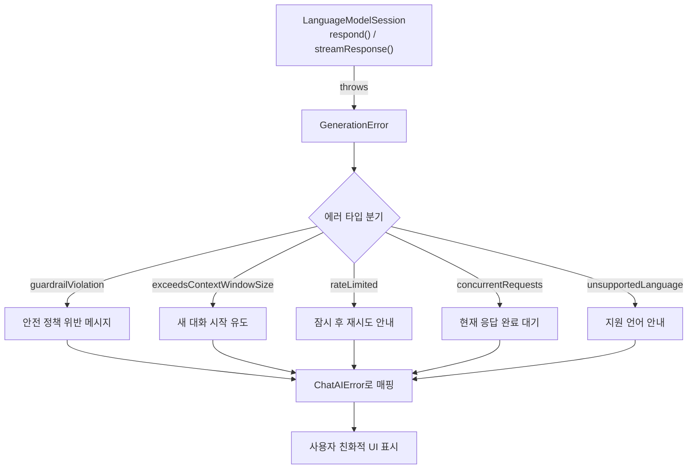
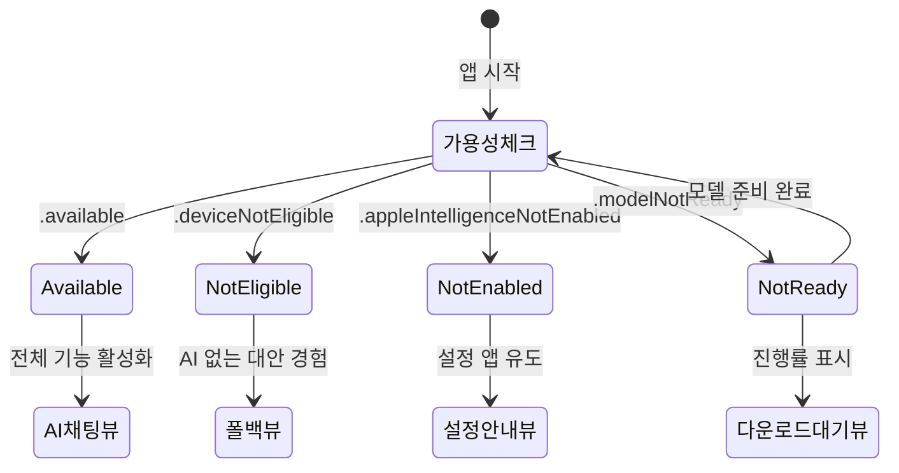
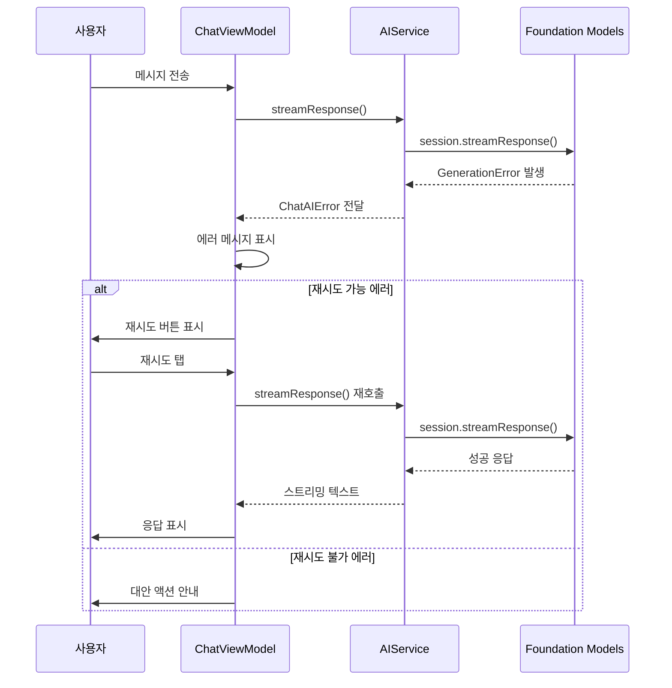
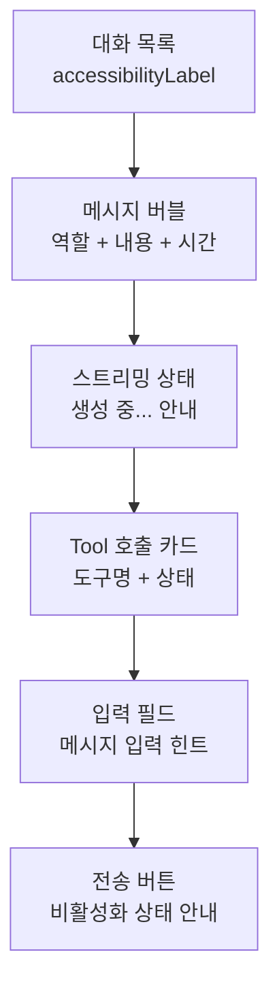
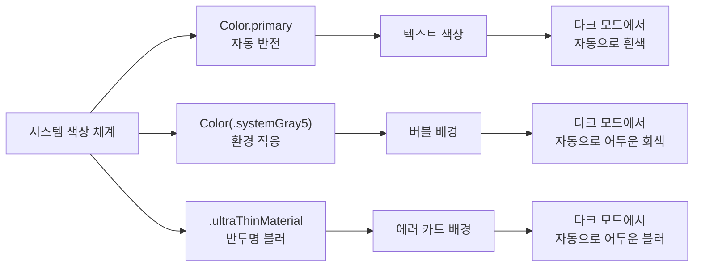

# 에러 처리와 UX 마무리

> AI 채팅봇의 완성도를 좌우하는 에러 처리, 접근성, 다크 모드까지 — 출시 가능한 품질로 마무리합니다.

## 개요

이 섹션에서는 지금까지 만든 AI 채팅봇 앱의 **에러 처리를 체계화**하고, **접근성(VoiceOver)**, **다크 모드 대응**, **재시도 UX** 등 출시 품질의 마감 작업을 완성합니다.

**선수 지식**: [AI 서비스 레이어 구현](10-ch10-실전-프로젝트-ai-채팅봇-앱/03-03-ai-서비스-레이어-구현.md)에서 정의한 `ChatAIError`, [Tool 통합과 확장](10-ch10-실전-프로젝트-ai-채팅봇-앱/05-05-tool-통합과-확장.md)에서 구현한 ToolManager, 그리고 Ch10 전반에 걸쳐 구축한 MVVM 아키텍처

**학습 목표**:
- Foundation Models의 `GenerationError` 모든 케이스를 사용자 친화적 메시지로 매핑한다
- 모델 가용성 상태별 폴백 UI를 설계한다
- 응답 실패 시 재시도 UX 패턴을 구현한다
- VoiceOver 접근성 레이블과 다크 모드 대응을 완성한다
- 빈 상태(Empty State) 가이드와 온보딩 UX를 추가한다

## 왜 알아야 할까?

"잘 되면 천재, 안 되면 쓰레기"라는 말이 있죠? AI 앱에서 에러 처리는 **사용자가 앱을 계속 쓸지 삭제할지를 결정하는 순간**입니다. Foundation Models 프레임워크는 온디바이스 AI라서 네트워크 문제는 적지만, 대신 **기기 호환성**, **모델 다운로드 상태**, **컨텍스트 윈도우 초과**, **가드레일 위반** 같은 고유한 에러 상황이 존재합니다.

Apple Intelligence는 A17 Pro 이상 또는 M 시리즈 칩을 탑재한 기기에서만 동작합니다. 즉, **모든 사용자의 기기가 Foundation Models를 지원하는 것은 아닙니다**. 지원하지 않는 기기의 사용자에게는 AI 기능이 없는 대안 경험을 제공해야 하죠. 정확한 지원 기기 목록은 [Apple의 공식 호환성 페이지](https://support.apple.com/en-us/111901)에서 확인할 수 있습니다. 에러 처리가 곧 사용자 경험의 핵심인 셈입니다.

또한 접근성(VoiceOver)은 App Store 심사에서도 점점 중요해지고 있고, 다크 모드 미지원 앱은 사용자 만족도가 크게 떨어집니다. 이 모든 마감 작업이 "출시 가능한 앱"과 "토이 프로젝트"의 차이를 만듭니다.

## 핵심 개념

### 개념 1: GenerationError 완전 매핑

> 💡 **비유**: 레스토랑에서 주문이 안 되는 이유는 다양합니다 — 재료 품절, 주방 마감, 메뉴에 없는 음식 요청... 각각에 "죄송합니다, 지금은 준비할 수 없습니다"라고만 말하면 손님은 답답하죠. "이 재료가 없으니 대신 이건 어떠세요?"처럼 **이유별로 다른 안내**가 좋은 서비스입니다. Foundation Models의 에러 처리도 마찬가지입니다.

Foundation Models의 `LanguageModelSession`은 응답 생성 중 다양한 에러를 던질 수 있습니다. 이 에러들을 우리 앱의 `ChatAIError`로 변환하고, 각각에 맞는 사용자 메시지를 제공해야 합니다.

> 📊 **그림 1**: GenerationError에서 사용자 메시지까지의 변환 흐름



[AI 서비스 레이어 구현](10-ch10-실전-프로젝트-ai-채팅봇-앱/03-03-ai-서비스-레이어-구현.md)에서 기본 `ChatAIError`를 정의했는데, 이제 이를 완전히 확장합니다:

```swift
import FoundationModels

/// 채팅 앱의 통합 에러 타입
enum ChatAIError: LocalizedError {
    case modelUnavailable(reason: UnavailableReason)
    case guardrailViolation          // 안전 정책 위반
    case contextWindowExceeded       // 컨텍스트 윈도우 초과
    case rateLimited                 // 요청 빈도 제한
    case concurrentRequest           // 동시 요청
    case unsupportedLanguage         // 미지원 언어
    case networkError(Error)         // 네트워크/기타 에러
    case unknown(Error)              // 알 수 없는 에러
    
    /// 사용자에게 보여줄 메시지
    var errorDescription: String? {
        switch self {
        case .modelUnavailable(let reason):
            return reason.userMessage
        case .guardrailViolation:
            return "안전 정책에 따라 이 요청에 응답할 수 없습니다."
        case .contextWindowExceeded:
            return "대화가 너무 길어졌습니다. 새 대화를 시작해 주세요."
        case .rateLimited:
            return "요청이 너무 빈번합니다. 잠시 후 다시 시도해 주세요."
        case .concurrentRequest:
            return "이전 응답이 아직 생성 중입니다. 완료 후 다시 시도해 주세요."
        case .unsupportedLanguage:
            return "현재 지원하지 않는 언어입니다."
        case .networkError:
            return "연결에 문제가 발생했습니다. 네트워크 상태를 확인해 주세요."
        case .unknown:
            return "알 수 없는 오류가 발생했습니다. 다시 시도해 주세요."
        }
    }
    
    /// 재시도 가능 여부
    var isRetryable: Bool {
        switch self {
        case .rateLimited, .networkError, .unknown:
            return true
        case .concurrentRequest, .contextWindowExceeded,
             .guardrailViolation, .unsupportedLanguage,
             .modelUnavailable:
            return false
        }
    }
    
    /// 추천 액션
    var suggestedAction: SuggestedAction {
        switch self {
        case .contextWindowExceeded:
            return .startNewConversation
        case .rateLimited:
            return .waitAndRetry(seconds: 3)
        case .guardrailViolation:
            return .modifyPrompt
        case .modelUnavailable:
            return .checkSettings
        case .networkError, .unknown:
            return .retry
        case .concurrentRequest:
            return .wait
        case .unsupportedLanguage:
            return .changeLanguage
        }
    }
}

enum SuggestedAction {
    case retry
    case waitAndRetry(seconds: Int)
    case startNewConversation
    case modifyPrompt
    case checkSettings
    case wait
    case changeLanguage
}

/// 모델 사용 불가 세부 사유
enum UnavailableReason {
    case deviceNotEligible
    case appleIntelligenceNotEnabled
    case modelNotReady
    
    var userMessage: String {
        switch self {
        case .deviceNotEligible:
            return "이 기기는 Apple Intelligence를 지원하지 않습니다."
        case .appleIntelligenceNotEnabled:
            return "설정에서 Apple Intelligence를 활성화해 주세요."
        case .modelNotReady:
            return "AI 모델을 다운로드하는 중입니다. 잠시만 기다려 주세요."
        }
    }
}
```

이제 `FoundationModelAIService`의 에러 매핑 로직을 완성합니다:

```swift
extension FoundationModelAIService {
    /// GenerationError를 ChatAIError로 변환
    func mapToChatError(_ error: Error) -> ChatAIError {
        // Foundation Models 전용 에러 처리
        if let genError = error as? LanguageModelSession.GenerationError {
            switch genError {
            case .guardrailViolation:
                return .guardrailViolation
            case .exceededContextWindowSize:
                return .contextWindowExceeded
            case .rateLimited:
                return .rateLimited
            case .concurrentRequests:
                return .concurrentRequest
            case .unsupportedLanguageOrLocale:
                return .unsupportedLanguage
            @unknown default:
                return .unknown(error)
            }
        }
        
        // 취소는 에러가 아님
        if error is CancellationError {
            return .unknown(error) 
        }
        
        // 네트워크 관련 에러
        let nsError = error as NSError
        if nsError.domain == NSURLErrorDomain {
            return .networkError(error)
        }
        
        return .unknown(error)
    }
}
```

> ⚠️ **흔한 오해**: "온디바이스 AI니까 네트워크 에러는 없다"고 생각하기 쉬운데, Private Cloud Compute(PCC)를 통한 서버 측 처리가 필요한 복잡한 요청에서는 네트워크 에러가 발생할 수 있습니다. 항상 네트워크 에러 케이스를 포함하세요.

에러 매핑이 서비스 레이어에서 어떻게 호출되는지도 살펴보겠습니다. `streamResponse` 메서드에서 `do-catch`로 감싼 뒤 `mapToChatError`를 통해 변환합니다:

```swift
extension FoundationModelAIService {
    /// 스트리밍 응답 — 에러 매핑 통합
    func streamResponse(to prompt: String) async throws -> AsyncThrowingStream<String, Error> {
        return AsyncThrowingStream { continuation in
            Task {
                do {
                    let stream = try await session.streamResponse(
                        to: prompt,
                        generating: String.self
                    )
                    
                    for try await partial in stream {
                        continuation.yield(partial)
                    }
                    continuation.finish()
                    
                } catch {
                    // GenerationError → ChatAIError로 변환하여 전달
                    let chatError = mapToChatError(error)
                    continuation.finish(throwing: chatError)
                }
            }
        }
    }
}
```

### 개념 2: 모델 가용성 폴백 UI

> 💡 **비유**: 놀이공원에 입장했는데 키 제한에 걸려 놀이기구를 못 타는 상황을 떠올려 보세요. "탈 수 없습니다"만 말하면 실망이지만, "옆에 있는 이 놀이기구는 탈 수 있어요!"라고 안내하면 경험이 전혀 다릅니다. 모델 가용성 폴백도 같은 원리입니다.

Foundation Models는 Apple Intelligence 지원 기기에서만 동작합니다. `SystemLanguageModel.default.availability`로 세 가지 불가 사유를 구분할 수 있죠:

> 📊 **그림 2**: 모델 가용성 상태별 UI 분기



```swift
import SwiftUI
import FoundationModels

/// 모델 가용성에 따라 적절한 뷰를 보여주는 루트 뷰
struct AdaptiveChatView: View {
    private let model = SystemLanguageModel.default
    
    var body: some View {
        switch model.availability {
        case .available:
            // 전체 AI 기능 활성화
            ChatView()
            
        case .unavailable(.deviceNotEligible):
            // AI 없는 대안 경험 제공
            FallbackChatView()
            
        case .unavailable(.appleIntelligenceNotEnabled):
            // 설정으로 유도
            EnableIntelligenceView()
            
        case .unavailable(.modelNotReady):
            // 다운로드 대기 화면
            ModelDownloadingView()
            
        case .unavailable(_):
            // 미래에 추가될 수 있는 사유 대비
            FallbackChatView()
        }
    }
}

/// Apple Intelligence 활성화를 유도하는 뷰
struct EnableIntelligenceView: View {
    @Environment(\.openURL) private var openURL
    
    var body: some View {
        ContentUnavailableView {
            Label("Apple Intelligence 필요", 
                  systemImage: "brain")
        } description: {
            Text("AI 채팅 기능을 사용하려면 Apple Intelligence를 활성화해 주세요.")
        } actions: {
            Button("설정 열기") {
                // 설정 앱의 Apple Intelligence 페이지로 이동
                if let url = URL(string: UIApplication.openSettingsURLString) {
                    openURL(url)
                }
            }
            .buttonStyle(.borderedProminent)
        }
        .accessibilityLabel("Apple Intelligence가 비활성화 상태입니다")
        .accessibilityHint("설정 열기 버튼을 눌러 활성화하세요")
    }
}

/// 모델 다운로드 대기 화면
struct ModelDownloadingView: View {
    @State private var animating = false
    
    var body: some View {
        ContentUnavailableView {
            Label("모델 준비 중", systemImage: "arrow.down.circle")
                .symbolEffect(.pulse, isActive: animating)
        } description: {
            Text("AI 모델을 다운로드하고 있습니다.\n완료되면 자동으로 전환됩니다.")
        }
        .onAppear { animating = true }
        .accessibilityLabel("AI 모델 다운로드 진행 중")
    }
}

/// AI 기능 없이 기본 경험을 제공하는 폴백 뷰
struct FallbackChatView: View {
    var body: some View {
        ContentUnavailableView {
            Label("AI 기능 미지원", systemImage: "cpu")
        } description: {
            Text("이 기기에서는 AI 채팅을 사용할 수 없습니다.\niPhone 16 이상 기기에서 이용 가능합니다.")
        }
        .accessibilityLabel("이 기기는 AI 채팅을 지원하지 않습니다")
    }
}
```

여기서 핵심은 `.unavailable`의 **연관 값(Associated Value)으로 사유를 구분**하는 것입니다. `isAvailable` 편의 프로퍼티로 단순 체크만 하면 사용자에게 아무런 가이드를 줄 수 없거든요.

### 개념 3: 재시도와 에러 복구 UI

> 💡 **비유**: 자동판매기에 동전을 넣었는데 음료가 안 나올 때, "고장"이라고만 적혀 있으면 그냥 떠나지만, "한 번 더 눌러 보세요" 버튼이 있으면 시도해 봅니다. 재시도 UI는 **사용자가 포기하지 않게 하는 작은 장치**입니다.

> 📊 **그림 3**: 에러 발생 시 재시도 흐름



```swift
/// 에러 메시지를 표시하고 적절한 액션을 제공하는 버블
struct ErrorMessageBubbleView: View {
    let error: ChatAIError
    let onRetry: (() -> Void)?
    let onNewConversation: (() -> Void)?
    
    var body: some View {
        VStack(alignment: .leading, spacing: 12) {
            // 에러 아이콘과 메시지
            HStack(alignment: .top, spacing: 8) {
                Image(systemName: errorIcon)
                    .foregroundStyle(iconColor)
                    .font(.title3)
                
                VStack(alignment: .leading, spacing: 4) {
                    Text("응답 실패")
                        .font(.subheadline.weight(.semibold))
                    
                    Text(error.localizedDescription)
                        .font(.subheadline)
                        .foregroundStyle(.secondary)
                }
            }
            
            // 추천 액션 버튼
            actionButtons
        }
        .padding()
        .background(.ultraThinMaterial, in: RoundedRectangle(cornerRadius: 16))
        .accessibilityElement(children: .combine)
        .accessibilityLabel("오류: \(error.localizedDescription)")
        .accessibilityHint(accessibilityHintText)
    }
    
    @ViewBuilder
    private var actionButtons: some View {
        switch error.suggestedAction {
        case .retry, .waitAndRetry:
            Button("다시 시도", systemImage: "arrow.clockwise") {
                onRetry?()
            }
            .buttonStyle(.bordered)
            .tint(.blue)
            
        case .startNewConversation:
            Button("새 대화 시작", systemImage: "plus.message") {
                onNewConversation?()
            }
            .buttonStyle(.bordered)
            .tint(.green)
            
        case .modifyPrompt:
            Text("다른 방식으로 질문해 보세요.")
                .font(.caption)
                .foregroundStyle(.secondary)
            
        case .checkSettings:
            // 설정으로 이동하는 버튼
            Button("설정 확인", systemImage: "gear") {
                if let url = URL(string: UIApplication.openSettingsURLString) {
                    UIApplication.shared.open(url)
                }
            }
            .buttonStyle(.bordered)
            
        case .wait, .changeLanguage:
            EmptyView()
        }
    }
    
    private var errorIcon: String {
        switch error {
        case .guardrailViolation: "shield.slash"
        case .contextWindowExceeded: "text.badge.xmark"
        case .rateLimited: "clock.badge.exclamationmark"
        case .networkError: "wifi.slash"
        default: "exclamationmark.triangle"
        }
    }
    
    private var iconColor: Color {
        switch error {
        case .guardrailViolation: .orange
        case .contextWindowExceeded: .purple
        default: .red
        }
    }
    
    private var accessibilityHintText: String {
        error.isRetryable ? "다시 시도 버튼을 눌러 재시도할 수 있습니다" 
                          : "다른 방법을 시도해 주세요"
    }
}
```

이제 `ChatViewModel`에 재시도 로직을 추가합니다:

```swift
extension ChatViewModel {
    /// 실패한 메시지를 재시도
    func retryLastMessage() {
        guard let lastUserMessage = messages.last(where: { 
            $0.role == .user 
        }) else { return }
        
        // 실패한 AI 응답 메시지 제거
        if let lastAIMessage = messages.last,
           lastAIMessage.role == .assistant,
           lastAIMessage.status == .failed {
            messages.removeLast()
        }
        
        // 재전송
        Task {
            await sendMessage(lastUserMessage.content)
        }
    }
    
    /// 컨텍스트 윈도우 초과 시 새 대화 시작
    func startFreshConversation() {
        Task {
            // 현재 대화를 저장
            await repository.save(currentConversation)
            
            // 새 대화 + 새 세션
            currentConversation = Conversation(title: "새 대화")
            messages = []
            await aiService.resetSession()
        }
    }
}
```

### 개념 4: VoiceOver 접근성 완성

> 💡 **비유**: 라디오 드라마를 생각해 보세요. 화면이 없어도 대사만으로 장면이 그려져야 합니다. VoiceOver는 시각 장애 사용자에게 "라디오 드라마"처럼 앱을 설명해 줍니다. 채팅 메시지 버블이 "왼쪽에 회색 말풍선"이라고 읽히면 안 되고, "AI가 보낸 메시지: 안녕하세요!"라고 읽혀야 합니다.

> 📊 **그림 4**: VoiceOver가 채팅 UI 요소를 읽는 순서



```swift
/// 접근성이 완성된 메시지 버블
struct AccessibleMessageBubbleView: View {
    let message: ChatMessage
    
    var body: some View {
        HStack {
            if message.role == .user { Spacer() }
            
            VStack(alignment: message.role == .user ? .trailing : .leading,
                   spacing: 4) {
                Text(message.content)
                    .padding(12)
                    .background(bubbleBackground)
                    .clipShape(RoundedRectangle(cornerRadius: 16))
                
                Text(message.timestamp, style: .time)
                    .font(.caption2)
                    .foregroundStyle(.tertiary)
            }
            
            if message.role == .assistant { Spacer() }
        }
        // 접근성: 역할 + 내용 + 시간을 하나로 결합
        .accessibilityElement(children: .combine)
        .accessibilityLabel(accessibilityDescription)
        .accessibilityHint(message.role == .assistant 
            ? "길게 누르면 복사할 수 있습니다" 
            : "")
        .accessibilityAddTraits(message.role == .user ? .isStaticText : [])
    }
    
    /// VoiceOver가 읽을 설명 생성
    private var accessibilityDescription: String {
        let role = message.role == .user ? "나" : "AI"
        let time = message.timestamp.formatted(date: .omitted, time: .shortened)
        let status: String
        
        switch message.status {
        case .sending:
            status = ", 전송 중"
        case .streaming:
            status = ", 응답 생성 중"
        case .failed:
            status = ", 전송 실패"
        case .delivered:
            status = ""
        }
        
        return "\(role), \(time)\(status): \(message.content)"
    }
    
    private var bubbleBackground: some ShapeStyle {
        message.role == .user 
            ? AnyShapeStyle(Color.blue)
            : AnyShapeStyle(Color(.systemGray5))
    }
}

/// 접근성이 완성된 입력 컴포저
struct AccessibleComposerView: View {
    @Binding var text: String
    let isResponding: Bool
    let onSend: () -> Void
    let onStop: () -> Void
    
    var body: some View {
        HStack(spacing: 12) {
            TextField("메시지를 입력하세요", text: $text, axis: .vertical)
                .lineLimit(1...5)
                .padding(.horizontal, 12)
                .padding(.vertical, 8)
                .background(Color(.systemGray6))
                .clipShape(RoundedRectangle(cornerRadius: 20))
                .accessibilityLabel("메시지 입력")
                .accessibilityHint(isResponding 
                    ? "AI가 응답을 생성하는 중입니다" 
                    : "메시지를 입력하고 전송 버튼을 누르세요")
            
            Button {
                isResponding ? onStop() : onSend()
            } label: {
                Image(systemName: isResponding 
                    ? "stop.circle.fill" 
                    : "arrow.up.circle.fill")
                    .font(.title2)
                    .foregroundStyle(buttonColor)
            }
            .disabled(!isResponding && text.trimmingCharacters(in: .whitespaces).isEmpty)
            .accessibilityLabel(isResponding ? "응답 중지" : "메시지 전송")
            .accessibilityHint(isResponding 
                ? "AI 응답 생성을 중단합니다" 
                : text.isEmpty ? "먼저 메시지를 입력하세요" : "입력한 메시지를 전송합니다")
        }
        .padding(.horizontal)
        .padding(.vertical, 8)
    }
    
    private var buttonColor: Color {
        if isResponding { return .red }
        return text.trimmingCharacters(in: .whitespaces).isEmpty ? .gray : .blue
    }
}
```

Tool 호출 카드에도 접근성 레이블을 추가하는 것이 중요합니다. [Tool 통합과 확장](10-ch10-실전-프로젝트-ai-채팅봇-앱/05-05-tool-통합과-확장.md)에서 구현한 Tool 결과 표시 뷰에 VoiceOver 지원을 보강해 봅시다:

```swift
/// Tool 호출 결과를 표시하는 접근성 완비 카드
struct AccessibleToolResultCard: View {
    let toolName: String
    let status: ToolCallStatus
    let result: String?
    
    var body: some View {
        HStack(spacing: 8) {
            // 상태 아이콘
            Image(systemName: statusIcon)
                .foregroundStyle(statusColor)
                .symbolEffect(.pulse, isActive: status == .running)
            
            VStack(alignment: .leading, spacing: 2) {
                Text(toolName)
                    .font(.caption.weight(.semibold))
                
                if let result {
                    Text(result)
                        .font(.caption2)
                        .foregroundStyle(.secondary)
                        .lineLimit(2)
                }
            }
        }
        .padding(8)
        .background(Color(.tertiarySystemGroupedBackground),
                     in: RoundedRectangle(cornerRadius: 8))
        .accessibilityElement(children: .combine)
        .accessibilityLabel(accessibilityText)
        .accessibilityHint(status == .running ? "도구 실행 중입니다" : "")
    }
    
    private var statusIcon: String {
        switch status {
        case .running: "gear.circle"
        case .completed: "checkmark.circle.fill"
        case .failed: "xmark.circle.fill"
        }
    }
    
    private var statusColor: Color {
        switch status {
        case .running: .blue
        case .completed: .green
        case .failed: .red
        }
    }
    
    private var accessibilityText: String {
        let statusText: String
        switch status {
        case .running: statusText = "실행 중"
        case .completed: statusText = "완료"
        case .failed: statusText = "실패"
        }
        
        var text = "\(toolName) 도구 \(statusText)"
        if let result {
            text += ". 결과: \(result)"
        }
        return text
    }
}

enum ToolCallStatus {
    case running, completed, failed
}
```

> 🔥 **실무 팁**: `accessibilityElement(children: .combine)`은 여러 하위 뷰의 접근성 정보를 하나의 요소로 합쳐 줍니다. 채팅 버블처럼 내부에 텍스트 + 시간 + 상태가 분리된 경우, 이걸 쓰지 않으면 VoiceOver가 각 요소를 따로 읽어서 사용자 경험이 나빠집니다.

### 개념 5: 다크 모드와 빈 상태 UX

> 💡 **비유**: 새로 이사한 빈 방에 들어섰을 때, 아무 가구도 없으면 "여기 뭐 하는 곳이지?" 싶지만, 안내판 하나 있으면 "아, 여기에 소파를 놓으면 되겠구나" 하고 감이 옵니다. 빈 상태(Empty State)는 앱의 **첫인상이자 사용 가이드**입니다.

> 📊 **그림 5**: 다크 모드 색상 적응 전략



```swift
/// 빈 상태 가이드 뷰 — 첫 대화를 유도
struct EmptyConversationView: View {
    let onSuggestionTap: (String) -> Void
    @Environment(\.colorScheme) private var colorScheme
    
    // 추천 대화 시작 문구
    private let suggestions = [
        ("💬", "오늘 날씨 어때?", "날씨 Tool 호출 체험"),
        ("🧮", "234 × 567을 계산해 줘", "계산기 Tool 활용"),
        ("📝", "이력서 자기소개서 작성 팁 알려줘", "텍스트 생성 체험"),
        ("🗓️", "오늘 날짜가 며칠이야?", "날짜/시간 Tool 활용")
    ]
    
    var body: some View {
        VStack(spacing: 24) {
            Spacer()
            
            // 앱 아이콘과 인사
            VStack(spacing: 12) {
                Image(systemName: "bubble.left.and.bubble.right.fill")
                    .font(.system(size: 48))
                    .foregroundStyle(.blue.gradient)
                    .accessibilityHidden(true)
                
                Text("AI 채팅봇")
                    .font(.title2.bold())
                
                Text("무엇이든 물어보세요!")
                    .foregroundStyle(.secondary)
            }
            
            // 추천 질문 카드
            VStack(spacing: 8) {
                ForEach(suggestions, id: \.1) { emoji, text, description in
                    Button {
                        onSuggestionTap(text)
                    } label: {
                        HStack {
                            Text(emoji)
                                .accessibilityHidden(true)
                            VStack(alignment: .leading) {
                                Text(text)
                                    .font(.subheadline.weight(.medium))
                                Text(description)
                                    .font(.caption)
                                    .foregroundStyle(.secondary)
                            }
                            Spacer()
                            Image(systemName: "chevron.right")
                                .font(.caption)
                                .foregroundStyle(.tertiary)
                        }
                        .padding(12)
                        .background(
                            // 다크 모드 자동 적응 색상
                            Color(.secondarySystemGroupedBackground),
                            in: RoundedRectangle(cornerRadius: 12)
                        )
                    }
                    .buttonStyle(.plain)
                    .accessibilityLabel("\(text). \(description)")
                    .accessibilityHint("눌러서 이 질문으로 대화를 시작합니다")
                }
            }
            .padding(.horizontal)
            
            Spacer()
        }
    }
}
```

다크 모드 대응의 핵심은 **시스템 시맨틱 색상을 사용하는 것**입니다:

```swift
/// 다크 모드 자동 대응을 위한 채팅 색상 체계
enum ChatColors {
    /// 사용자 버블 배경 — 다크/라이트 모두 파란색
    static let userBubble = Color.blue
    
    /// AI 버블 배경 — 라이트: 밝은 회색, 다크: 어두운 회색
    static let aiBubble = Color(.systemGray5)
    
    /// 사용자 버블 텍스트 — 항상 흰색
    static let userText = Color.white
    
    /// AI 버블 텍스트 — 시스템 기본 (자동 반전)
    static let aiText = Color.primary
    
    /// 타임스탬프 — 흐린 색상
    static let timestamp = Color(.tertiaryLabel)
    
    /// 에러 배경
    static let errorBackground = Color(.systemGroupedBackground)
    
    /// 입력 필드 배경
    static let composerBackground = Color(.systemGray6)
}
```

> 💡 **알고 계셨나요?**: SwiftUI의 `Color(.systemGray5)`와 같은 UIColor 기반 시맨틱 색상은 다크 모드 전환 시 **애니메이션과 함께 자연스럽게 전환**됩니다. 직접 하드코딩한 RGB 값(예: `Color(red: 0.9, green: 0.9, blue: 0.9)`)은 다크 모드에서 자동 적응하지 않아 눈이 아프게 밝은 요소가 남게 됩니다.

다크 모드에서 채팅 버블이 제대로 보이는지 Xcode Preview로 쉽게 확인할 수 있습니다:

```swift
#Preview("다크 모드") {
    VStack(spacing: 16) {
        AccessibleMessageBubbleView(
            message: ChatMessage(
                content: "안녕하세요!",
                role: .user,
                status: .delivered
            )
        )
        AccessibleMessageBubbleView(
            message: ChatMessage(
                content: "안녕하세요! 무엇을 도와드릴까요?",
                role: .assistant,
                status: .delivered
            )
        )
    }
    .padding()
    .preferredColorScheme(.dark)
}
```

## 실습: 직접 해보기

Ch10 전체를 관통하는 AI 채팅봇 앱에 에러 처리와 UX 폴리싱을 통합하는 완전한 코드입니다.

```swift
import SwiftUI
import FoundationModels

// MARK: - 통합 ChatView (에러 처리 + 접근성 + 다크 모드)

struct PolishedChatView: View {
    @State private var viewModel: ChatViewModel
    @State private var inputText = ""
    @State private var showConversationList = false
    
    private let model = SystemLanguageModel.default
    
    init(viewModel: ChatViewModel) {
        self._viewModel = State(initialValue: viewModel)
    }
    
    var body: some View {
        NavigationStack {
            // 모델 가용성에 따라 분기
            Group {
                switch model.availability {
                case .available:
                    chatContent
                case .unavailable(let reason):
                    unavailableView(for: reason)
                }
            }
            .navigationTitle(viewModel.currentConversation.title)
            .toolbar { toolbarContent }
        }
    }
    
    // MARK: - 채팅 콘텐츠 (AI 가용 시)
    
    @ViewBuilder
    private var chatContent: some View {
        VStack(spacing: 0) {
            if viewModel.messages.isEmpty {
                // 빈 상태 — 추천 질문 표시
                EmptyConversationView { suggestion in
                    inputText = suggestion
                    sendMessage()
                }
            } else {
                // 메시지 목록
                messageList
            }
            
            Divider()
            
            // 입력 컴포저
            AccessibleComposerView(
                text: $inputText,
                isResponding: viewModel.isResponding,
                onSend: sendMessage,
                onStop: { viewModel.stopGenerating() }
            )
        }
    }
    
    // MARK: - 메시지 목록
    
    private var messageList: some View {
        ScrollView {
            LazyVStack(spacing: 16) {
                ForEach(viewModel.messages) { message in
                    switch message.status {
                    case .failed:
                        // 실패한 메시지에는 에러 버블 표시
                        if let error = viewModel.lastError {
                            ErrorMessageBubbleView(
                                error: error,
                                onRetry: { viewModel.retryLastMessage() },
                                onNewConversation: { 
                                    viewModel.startFreshConversation() 
                                }
                            )
                        }
                    default:
                        // 일반 메시지 버블
                        AccessibleMessageBubbleView(message: message)
                    }
                }
                
                // 스트리밍 중 타이핑 인디케이터
                if viewModel.isResponding {
                    streamingIndicator
                }
            }
            .padding()
        }
        .defaultScrollAnchor(.bottom)
    }
    
    // MARK: - 스트리밍 인디케이터
    
    private var streamingIndicator: some View {
        HStack {
            if viewModel.streamingText.isEmpty {
                // 아직 텍스트가 없으면 로딩 인디케이터
                ProgressView()
                    .padding()
                    .accessibilityLabel("AI가 응답을 준비하고 있습니다")
            }
            Spacer()
        }
    }
    
    // MARK: - 불가 사유별 폴백 뷰
    
    @ViewBuilder
    private func unavailableView(for reason: SystemLanguageModel.UnavailabilityReason) -> some View {
        switch reason {
        case .deviceNotEligible:
            FallbackChatView()
        case .appleIntelligenceNotEnabled:
            EnableIntelligenceView()
        case .modelNotReady:
            ModelDownloadingView()
        @unknown default:
            FallbackChatView()
        }
    }
    
    // MARK: - 툴바
    
    @ToolbarContentBuilder
    private var toolbarContent: some ToolbarContent {
        ToolbarItem(placement: .topBarLeading) {
            Button("대화 목록", systemImage: "list.bullet") {
                showConversationList = true
            }
        }
        
        ToolbarItem(placement: .topBarTrailing) {
            Button("새 대화", systemImage: "square.and.pencil") {
                viewModel.startFreshConversation()
            }
            .accessibilityHint("새로운 대화를 시작합니다")
        }
    }
    
    // MARK: - 메시지 전송
    
    private func sendMessage() {
        let text = inputText.trimmingCharacters(in: .whitespaces)
        guard !text.isEmpty else { return }
        
        inputText = ""
        Task {
            await viewModel.sendMessage(text)
        }
    }
}
```

이제 `ChatViewModel`에 에러 상태 관리를 통합합니다:

```swift
import Observation
import FoundationModels

@Observable
final class ChatViewModel {
    // 기존 프로퍼티 (Ch10 이전 섹션에서 정의)
    var messages: [ChatMessage] = []
    var streamingText: String = ""
    var isResponding: Bool = false
    var currentConversation: Conversation
    
    // 에러 관련 프로퍼티
    var lastError: ChatAIError?
    var showError: Bool = false
    
    private let aiService: AIServiceProtocol
    private let repository: ChatRepositoryProtocol
    private var currentTask: Task<Void, Never>?
    
    init(aiService: AIServiceProtocol, 
         repository: ChatRepositoryProtocol,
         conversation: Conversation = Conversation(title: "새 대화")) {
        self.aiService = aiService
        self.repository = repository
        self.currentConversation = conversation
    }
    
    /// 메시지 전송 — 에러 처리 통합
    func sendMessage(_ content: String) async {
        // 사용자 메시지 추가
        let userMessage = ChatMessage(
            content: content, 
            role: .user, 
            status: .delivered
        )
        messages.append(userMessage)
        
        // AI 응답 플레이스홀더 추가
        let aiMessage = ChatMessage(
            content: "", 
            role: .assistant, 
            status: .streaming
        )
        messages.append(aiMessage)
        
        isResponding = true
        lastError = nil
        streamingText = ""
        
        do {
            // 스트리밍 응답 수신
            let stream = try await aiService.streamResponse(to: content)
            
            for try await partial in stream {
                streamingText = partial
                // 마지막 AI 메시지 업데이트
                if let index = messages.indices.last {
                    messages[index].content = partial
                }
            }
            
            // 완료 — 상태를 delivered로 변경
            if let index = messages.indices.last {
                messages[index].status = .delivered
            }
            
            // SwiftData에 저장
            await repository.save(currentConversation)
            
        } catch let error as ChatAIError {
            handleError(error)
        } catch {
            // 알 수 없는 에러도 ChatAIError로 매핑
            let chatError = ChatAIError.unknown(error)
            handleError(chatError)
        }
        
        isResponding = false
        streamingText = ""
    }
    
    /// 응답 중지
    func stopGenerating() {
        currentTask?.cancel()
        isResponding = false
        
        // 마지막 AI 메시지 상태를 delivered로 (부분 응답 유지)
        if let index = messages.indices.last,
           messages[index].role == .assistant {
            messages[index].status = .delivered
        }
    }
    
    /// 에러 처리
    private func handleError(_ error: ChatAIError) {
        lastError = error
        showError = true
        
        // 마지막 AI 메시지 상태를 failed로 변경
        if let index = messages.indices.last,
           messages[index].role == .assistant {
            messages[index].status = .failed
            messages[index].content = error.localizedDescription
        }
        
        // 컨텍스트 윈도우 초과 시 자동 안내
        if case .contextWindowExceeded = error {
            // 별도 처리 — UI에서 "새 대화 시작" 버튼이 표시됨
        }
    }
    
    /// 실패한 메시지 재시도
    func retryLastMessage() {
        guard let lastUserMessage = messages.last(where: { 
            $0.role == .user 
        }) else { return }
        
        // 실패한 AI 응답 제거
        if let last = messages.last, 
           last.role == .assistant, 
           last.status == .failed {
            messages.removeLast()
        }
        
        Task {
            await sendMessage(lastUserMessage.content)
        }
    }
    
    /// 새 대화 시작
    func startFreshConversation() {
        Task {
            await repository.save(currentConversation)
            currentConversation = Conversation(title: "새 대화")
            messages = []
            lastError = nil
            await aiService.resetSession()
        }
    }
}
```

```run:swift
// 에러 타입별 사용자 메시지 미리보기
let errors: [(String, String, Bool)] = [
    ("guardrailViolation", "안전 정책에 따라 이 요청에 응답할 수 없습니다.", false),
    ("contextWindowExceeded", "대화가 너무 길어졌습니다. 새 대화를 시작해 주세요.", false),
    ("rateLimited", "요청이 너무 빈번합니다. 잠시 후 다시 시도해 주세요.", true),
    ("concurrentRequest", "이전 응답이 아직 생성 중입니다. 완료 후 다시 시도해 주세요.", false),
    ("unsupportedLanguage", "현재 지원하지 않는 언어입니다.", false),
    ("networkError", "연결에 문제가 발생했습니다. 네트워크 상태를 확인해 주세요.", true),
]

for (name, message, retryable) in errors {
    let retry = retryable ? "재시도 가능" : "재시도 불가"
    print("[\(name)] \(message) → \(retry)")
}
```

```output
[guardrailViolation] 안전 정책에 따라 이 요청에 응답할 수 없습니다. → 재시도 불가
[contextWindowExceeded] 대화가 너무 길어졌습니다. 새 대화를 시작해 주세요. → 재시도 불가
[rateLimited] 요청이 너무 빈번합니다. 잠시 후 다시 시도해 주세요. → 재시도 가능
[concurrentRequest] 이전 응답이 아직 생성 중입니다. 완료 후 다시 시도해 주세요. → 재시도 불가
[unsupportedLanguage] 현재 지원하지 않는 언어입니다. → 재시도 불가
[networkError] 연결에 문제가 발생했습니다. 네트워크 상태를 확인해 주세요. → 재시도 가능
```

## 더 깊이 알아보기

### 에러 메시지의 역사 — "PC LOAD LETTER" 교훈

에러 메시지 디자인의 역사에서 가장 유명한 실패 사례는 HP 레이저젯 프린터의 **"PC LOAD LETTER"** 에러입니다. 영화 《오피스 스페이스(Office Space, 1999)》에서도 풍자될 만큼 사용자들을 분노하게 했죠. "PC"는 Paper Cassette, "LOAD LETTER"는 Letter 크기 용지를 넣으라는 뜻이었지만, 약어만으로는 아무도 이해할 수 없었습니다.

이 교훈은 소프트웨어에서도 반복됩니다. Apple은 Human Interface Guidelines에서 에러 메시지에 대해 세 가지 원칙을 강조합니다:

1. **무엇이 잘못되었는지** 명확히 설명할 것
2. **왜 잘못되었는지** 원인을 알려줄 것
3. **어떻게 해결할 수 있는지** 행동을 제안할 것

우리가 `ChatAIError`에 `errorDescription`, `isRetryable`, `suggestedAction`을 모두 정의한 이유가 바로 이 원칙을 따르기 위해서입니다.

### VoiceOver의 탄생

Apple의 VoiceOver는 2005년 Mac OS X Tiger에서 처음 도입되었고, 2009년 iPhone 3GS에서 iOS에 탑재되었습니다. 당시 터치스크린 폰을 시각 장애인이 사용할 수 있게 만든 것은 혁신이었습니다. Apple의 접근성 엔지니어 **Chris Fleizach**가 주도한 이 프로젝트는, 화면의 모든 요소를 음성으로 설명하고 제스처로 탐색하는 완전히 새로운 인터랙션 패러다임을 만들어 냈습니다. SwiftUI에서 `.accessibilityLabel`이나 `.accessibilityHint`를 쓸 때마다, 우리는 그 혁신의 연장선에 있는 셈이죠.

## 흔한 오해와 팁

> ⚠️ **흔한 오해**: "에러가 났으면 Alert를 띄우면 된다"고 생각하기 쉽습니다. 하지만 채팅 앱에서 Alert는 대화 흐름을 끊어 버립니다. **에러를 메시지 스트림 안에 인라인으로 표시**하는 것이 훨씬 자연스럽습니다. 우리가 `ErrorMessageBubbleView`를 메시지 리스트 안에 배치한 이유이기도 합니다.

> 💡 **알고 계셨나요?**: `ContentUnavailableView`는 iOS 17에서 도입된 SwiftUI 뷰로, 데이터가 없거나 기능을 사용할 수 없을 때 표준화된 빈 상태를 표시합니다. Label, Description, Actions 세 구역으로 나뉘어 있어서 일관된 UX를 쉽게 만들 수 있습니다.

> 🔥 **실무 팁**: `@unknown default`를 `GenerationError` switch문에 반드시 추가하세요. Apple이 향후 OS 업데이트로 새로운 에러 케이스를 추가할 수 있고, 컴파일러 경고로 미리 알려줍니다. 이걸 빠뜨리면 앱이 새 에러를 전혀 처리하지 못해 크래시할 수 있습니다.

> 🔥 **실무 팁**: 다크 모드 테스트는 Xcode Preview의 `.preferredColorScheme(.dark)` 수정자로 간편하게 할 수 있지만, **반드시 실제 기기에서도 확인**하세요. OLED 디스플레이에서의 색상 대비는 시뮬레이터와 다를 수 있습니다.

## 핵심 정리

| 개념 | 설명 |
|------|------|
| `GenerationError` | Foundation Models의 에러 열거형. guardrailViolation, exceededContextWindowSize, rateLimited, concurrentRequests, unsupportedLanguageOrLocale 케이스 포함 |
| `ChatAIError` | 앱 전용 에러 타입. GenerationError를 사용자 친화적 메시지와 추천 액션으로 매핑 |
| `mapToChatError()` | GenerationError, CancellationError, NSURLError 등을 ChatAIError로 통합 변환하는 매핑 함수 |
| 모델 가용성 폴백 | `SystemLanguageModel.default.availability`로 기기/설정/다운로드 상태를 구분하여 적절한 대안 UI 제공 |
| 재시도 패턴 | `isRetryable` 플래그로 재시도 가능 여부 판단, 인라인 `ErrorMessageBubbleView`로 자연스러운 복구 UX |
| VoiceOver 접근성 | `.accessibilityLabel`로 역할+내용+시간 결합, `.accessibilityHint`로 가능한 액션 안내. Tool 카드 포함 |
| 다크 모드 대응 | `Color(.systemGray5)` 등 시맨틱 색상과 `.ultraThinMaterial` 사용으로 자동 적응 |
| 빈 상태 UX | `EmptyConversationView`로 추천 질문 카드를 표시하여 첫 대화 유도 |
| `ContentUnavailableView` | iOS 17+ 표준 빈 상태 뷰. Label/Description/Actions 구조로 일관된 불가 상태 표시 |
| `SuggestedAction` | 에러별 추천 액션 열거형. retry, startNewConversation, modifyPrompt, checkSettings 등 |

## 다음 섹션 미리보기

Ch10의 AI 채팅봇 앱이 완성되었습니다! 아키텍처 설계부터 UI, AI 서비스, 데이터 저장, Tool 통합, 그리고 에러 처리와 UX 마무리까지 — Foundation Models의 핵심 기능을 모두 결합한 실전 프로젝트를 완주했습니다.

다음 [Ch11. Writing Tools 통합](11-ch11-writing-tools-통합/01-01-writing-tools-시스템-서비스-개요.md)에서는 Apple Intelligence의 또 다른 축인 **Writing Tools** 시스템 서비스를 다룹니다. 텍스트 교정, 요약, 리라이팅 기능을 앱의 텍스트 뷰에 통합하는 방법을 배우며, Foundation Models 프레임워크 너머의 Apple Intelligence 생태계로 시야를 넓혀 보겠습니다.

## 참고 자료

- [Meet the Foundation Models framework — WWDC25](https://developer.apple.com/videos/play/wwdc2025/286/) - 모델 가용성 체크, isResponding 게이팅, 에러 타입 소개
- [Deep dive into the Foundation Models framework — WWDC25](https://developer.apple.com/videos/play/wwdc2025/301/) - GenerationError 상세 케이스와 처리 전략
- [Apple Intelligence device compatibility — Apple Support](https://support.apple.com/en-us/111901) - Apple Intelligence 지원 기기 공식 목록
- [Building an AI Chatbot in SwiftUI with Foundation Models Framework — SwiftyPlace](https://www.swiftyplace.com/blog/foundation-models-framework) - 채팅봇 에러 처리와 폴백 전략 실전 코드
- [iOS Accessibility Guidelines: Best Practices for 2025](https://medium.com/@david-auerbach/ios-accessibility-guidelines-best-practices-for-2025-6ed0d256200e) - VoiceOver 레이블링과 접근성 최신 가이드라인
- [SwiftUI Accessibility Techniques — CVS Health](https://github.com/cvs-health/ios-swiftui-accessibility-techniques) - 다크 모드 접근성, VoiceOver 패턴 레퍼런스

---
### 🔗 Related Sessions
- [chatmessage](10-ch10-실전-프로젝트-ai-채팅봇-앱/01-01-채팅봇-앱-아키텍처-설계.md) (prerequisite)
- [messagerole](10-ch10-실전-프로젝트-ai-채팅봇-앱/01-01-채팅봇-앱-아키텍처-설계.md) (prerequisite)
- [messagestatus](10-ch10-실전-프로젝트-ai-채팅봇-앱/01-01-채팅봇-앱-아키텍처-설계.md) (prerequisite)
- [chatviewmodel](10-ch10-실전-프로젝트-ai-채팅봇-앱/01-01-채팅봇-앱-아키텍처-설계.md) (prerequisite)
- [aiserviceprotocol](10-ch10-실전-프로젝트-ai-채팅봇-앱/01-01-채팅봇-앱-아키텍처-설계.md) (prerequisite)
- [chatview](10-ch10-실전-프로젝트-ai-채팅봇-앱/02-02-채팅-ui-구현.md) (prerequisite)
- [foundationmodelaiservice](10-ch10-실전-프로젝트-ai-채팅봇-앱/01-01-채팅봇-앱-아키텍처-설계.md) (prerequisite)
- [messagebubbleview](10-ch10-실전-프로젝트-ai-채팅봇-앱/02-02-채팅-ui-구현.md) (prerequisite)
- [chatcomposerview](10-ch10-실전-프로젝트-ai-채팅봇-앱/02-02-채팅-ui-구현.md) (prerequisite)
- [toolmanager](10-ch10-실전-프로젝트-ai-채팅봇-앱/01-01-채팅봇-앱-아키텍처-설계.md) (prerequisite)
