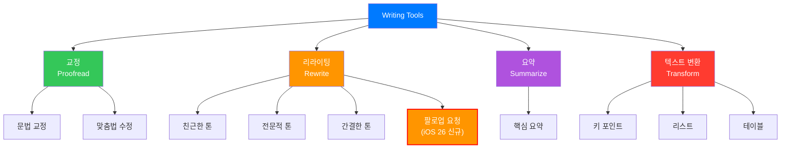
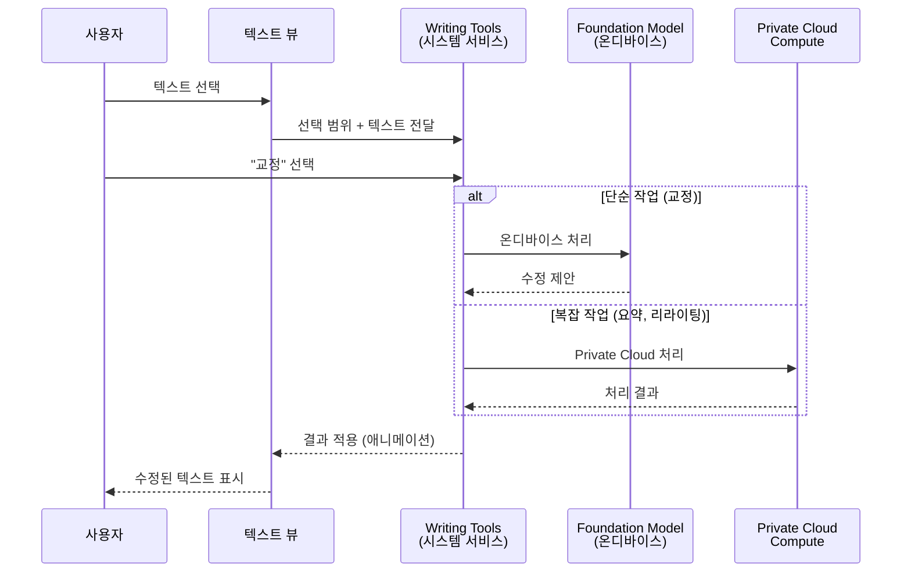
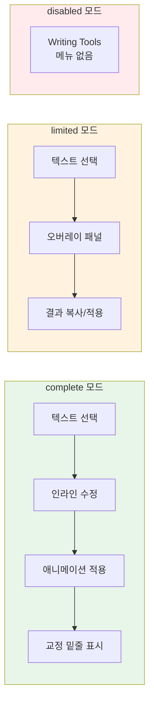
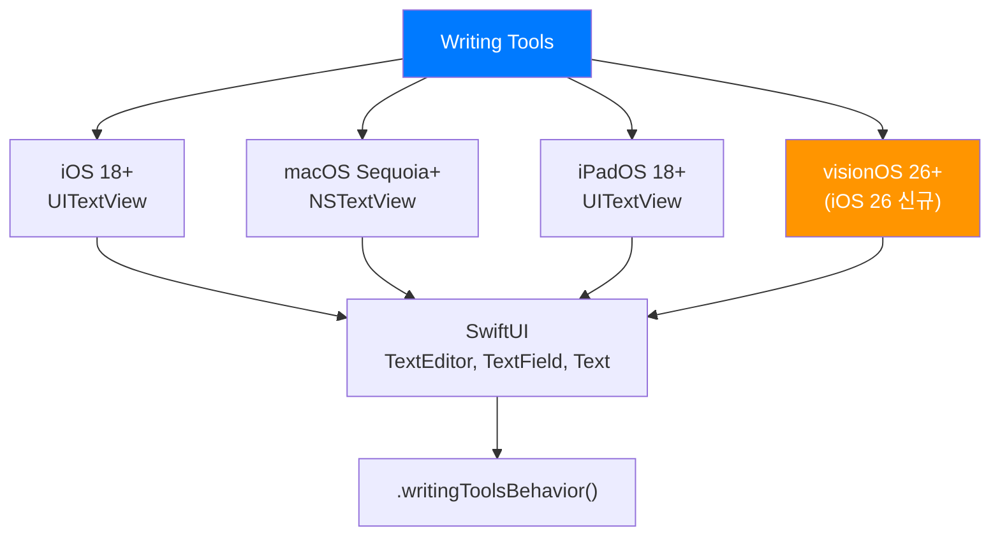
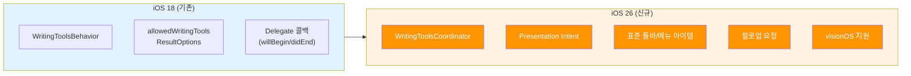

# Writing Tools 시스템 서비스 개요

> Apple Intelligence의 Writing Tools 기능 범위, 시스템 통합 구조, 지원 플랫폼을 한눈에 파악합니다.

## 개요

이 섹션에서는 Apple Intelligence의 핵심 서비스 중 하나인 Writing Tools의 전체 그림을 살펴봅니다. Writing Tools가 제공하는 기능(교정, 요약, 리라이팅, 톤 변환)이 무엇인지, 어떤 아키텍처로 시스템에 통합되어 있는지, 개발자가 어떤 수준의 제어권을 갖는지를 이해합니다.

**선수 지식**: [Ch10. 실전 프로젝트: AI 채팅봇 앱](10-ch10-실전-프로젝트-ai-채팅봇-앱/06-06-에러-처리와-ux-마무리.md)까지의 Foundation Models 기본기, SwiftUI 텍스트 뷰 사용 경험

**학습 목표**:
- Writing Tools가 제공하는 핵심 기능 카테고리와 세부 옵션을 설명할 수 있다
- 시스템 수준 서비스와 앱 수준 통합의 차이를 이해한다
- `WritingToolsBehavior`의 옵션별 동작을 구분할 수 있다
- Writing Tools가 지원되는 플랫폼과 텍스트 뷰 종류를 파악한다
- iOS 18에서 도입된 기능과 iOS 26에서 새로 추가된 기능을 구분할 수 있다

## 왜 알아야 할까?

여러분이 메모 앱, 이메일 클라이언트, 블로그 에디터 같은 텍스트 중심 앱을 만든다고 생각해 보세요. 사용자는 글을 쓸 때 맞춤법 검사, 문장 다듬기, 요약 같은 기능을 기대합니다. 과거에는 이런 기능을 직접 구현하거나 서드파티 API를 연동해야 했죠.

Writing Tools는 이 모든 것을 **시스템 수준에서 무료로** 제공합니다. `UITextView`나 SwiftUI `TextEditor`를 사용하는 것만으로 교정, 리라이팅, 요약 기능이 자동으로 활성화됩니다. 개발자는 한 줄의 코드도 추가하지 않고도 앱에 AI 글쓰기 어시스턴트를 탑재할 수 있는 거죠.

하지만 "자동으로 된다"는 것과 "잘 활용한다"는 것은 다릅니다. Writing Tools의 동작 모드를 이해하고, 앱의 맥락에 맞게 커스터마이징하며, 커스텀 텍스트 엔진에서도 완전한 경험을 제공하려면 시스템의 구조를 깊이 이해해야 합니다.

## 핵심 개념

### 개념 1: Writing Tools란 무엇인가?

> 💡 **비유**: Writing Tools는 여러분의 글에 항상 대기하고 있는 **편집자 팀**과 같습니다. 교정 담당자는 오타와 문법을 잡아주고, 리라이터는 문체를 바꿔주며, 요약 전문가는 긴 글의 핵심만 뽑아줍니다. 이 팀이 모든 텍스트 입력 필드 옆에 상주하는 셈이죠.

Writing Tools는 Apple Intelligence의 시스템 수준 텍스트 처리 서비스입니다. iOS 18/macOS Sequoia에서 처음 등장했고, iOS 26/macOS 26에서 대폭 강화되었습니다. 사용자가 텍스트를 선택하면 시스템 메뉴나 팝오버를 통해 다음 기능에 접근할 수 있습니다:

| 기능 | 설명 | 처리 방식 | 도입 시점 |
|------|------|----------|----------|
| **교정(Proofread)** | 문법, 맞춤법 오류 감지 및 수정 제안 | 온디바이스 | iOS 18 |
| **리라이팅(Rewrite)** | 문장을 다른 표현으로 재작성. 톤 변환(친근하게, 전문적으로, 간결하게) 포함 | 온디바이스/PCC | iOS 18 |
| ↳ 팔로업 요청 | 리라이팅 후 "더 따뜻하게" 등 후속 요청 | 온디바이스/PCC | 🆕 iOS 26 |
| **요약(Summarize)** | 긴 텍스트를 핵심 포인트로 압축 | 온디바이스/PCC | iOS 18 |
| **텍스트 변환(Transform)** | 키 포인트, 리스트, 테이블 형태로 변환 | 온디바이스/PCC | iOS 18 |

> ⚠️ **흔한 오해**: "톤 변환"은 독립된 기능처럼 보이지만, Apple의 아키텍처상 **리라이팅의 하위 옵션**입니다. 시스템 UI에서도 "Rewrite" 메뉴를 누르면 톤 선택지(Friendly, Professional, Concise)가 나타나는 구조이죠. 별개의 기능이 아니라 리라이팅의 프리셋이라고 이해하면 됩니다.

> 📊 **그림 1**: Writing Tools의 기능 범위와 세부 옵션



iOS 26에서는 **팔로업 요청** 기능이 리라이팅에 추가되었는데요. 리라이팅 후 "더 따뜻하게", "더 대화체로", "더 격려하는 톤으로" 같은 후속 요청을 보낼 수 있습니다. 또한 **ChatGPT 통합**을 통해 새로운 콘텐츠 생성과 이미지 생성도 가능해졌습니다.

### 개념 2: 시스템 통합 아키텍처

> 💡 **비유**: Writing Tools의 아키텍처는 **수도 시스템**과 비슷합니다. 수도국(시스템)이 깨끗한 물(AI 기능)을 공급하고, 각 가정(앱)은 수도꼭지(텍스트 뷰)만 설치하면 물이 나옵니다. 직접 정수 시설을 만들 필요가 없죠. 하지만 수도꼭지의 종류(완전 개방, 제한, 차단)는 선택할 수 있습니다.

Writing Tools는 앱이 아닌 **운영체제 수준**에서 동작합니다. 이것이 Foundation Models 프레임워크와의 핵심적인 차이점이에요. Foundation Models는 개발자가 직접 프롬프트를 보내고 응답을 처리하지만, Writing Tools는 시스템이 텍스트 뷰의 내용을 읽어서 자체적으로 처리합니다.

> 📊 **그림 2**: Writing Tools 시스템 통합 구조



이 구조에서 개발자가 주목해야 할 핵심 포인트는 세 가지입니다:

1. **제로 코드 통합**: 표준 텍스트 뷰(`UITextView`, `NSTextView`, SwiftUI `TextEditor`)는 아무 설정 없이 Writing Tools를 자동 지원합니다. 별도의 프레임워크 임포트나 초기화 코드가 필요 없습니다.
2. **시스템이 관리하는 UX 일관성**: 교정 시 밑줄 애니메이션, 리라이팅 시 텍스트 전환 효과, 요약 시 패널 표시까지 — 모든 UI 피드백을 시스템이 통일된 방식으로 처리합니다. 덕분에 사용자는 어떤 앱에서든 동일한 Writing Tools 경험을 얻게 됩니다.
3. **개발자 제어**: `WritingToolsBehavior`를 통해 동작 수준을 앱이 결정할 수 있고, 델리게이트 콜백으로 Writing Tools 세션의 시작/종료에 반응할 수 있습니다.

### 개념 3: WritingToolsBehavior — 동작 모드 선택

> 💡 **비유**: `WritingToolsBehavior`는 호텔 객실의 **"방해 금지/청소 요청" 표지판**과 같습니다. `.complete`는 풀 서비스 청소(인라인 수정, 애니메이션 포함), `.limited`는 간단한 정리(오버레이 기반), `.disabled`는 방해 금지(Writing Tools 비활성화)입니다.

`WritingToolsBehavior`는 텍스트 뷰에서 Writing Tools가 어떻게 동작할지 결정하는 열거형입니다:

```swift
// SwiftUI에서의 사용
TextEditor(text: $content)
    .writingToolsBehavior(.complete)  // 전체 인라인 편집 경험
```

| 옵션 | 동작 | 사용 시나리오 | 도입 시점 |
|------|------|-------------|----------|
| `.automatic` | 시스템이 맥락에 따라 결정 | 대부분의 경우 (기본값) | iOS 18 |
| `.complete` | 전체 인라인 편집 + 애니메이션 | 메모, 이메일 등 텍스트 중심 앱 | iOS 18 |
| `.limited` | 오버레이 기반 간소화 경험 | 댓글, 짧은 입력 필드 | iOS 18 |
| `.disabled` | Writing Tools 완전 비활성화 | 코드 에디터, 비밀번호 필드 | iOS 18 |

> 📊 **그림 3**: WritingToolsBehavior 옵션별 사용자 경험 비교



UIKit에서는 프로퍼티로 직접 설정합니다:

```swift
// UIKit에서의 사용
let textView = UITextView()
textView.writingToolsBehavior = .complete

// 결과 옵션 필터링 — 어떤 형태의 출력을 허용할지
textView.allowedWritingToolsResultOptions = [.plainText, .richText, .list, .table]
```

`allowedWritingToolsResultOptions`는 Writing Tools가 반환할 수 있는 결과 형식을 제어합니다. 예를 들어 플레인 텍스트만 지원하는 뷰라면 `.plainText`만 설정하면 되고, 리치 텍스트를 지원한다면 `.richText`, `.list`, `.table`을 추가할 수 있습니다.

### 개념 4: 지원 플랫폼과 텍스트 뷰

Writing Tools는 Apple 생태계 전반에서 동작합니다. 하지만 플랫폼별로 지원 수준과 접근 방식이 조금씩 다릅니다.

> 📊 **그림 4**: 플랫폼별 Writing Tools 지원 현황



**SwiftUI 텍스트 뷰의 자동 지원**:

```swift
import SwiftUI

struct NoteEditorView: View {
    @State private var noteText = ""
    
    var body: some View {
        VStack {
            // TextEditor — Writing Tools 자동 지원
            TextEditor(text: $noteText)
                .writingToolsBehavior(.complete)
            
            // TextField — Writing Tools 자동 지원
            TextField("제목을 입력하세요", text: $noteText)
                .writingToolsBehavior(.limited)
            
            // Text — selectable일 때만 지원
            Text("선택 가능한 텍스트입니다")
                .textSelection(.enabled)
                .writingToolsBehavior(.complete)
        }
    }
}
```

visionOS 지원은 iOS 26 / macOS 26과 함께 WWDC25에서 새로 발표된 기능으로, Vision Pro에서 Mail, Notes 등의 앱과 커스텀 앱에서 Writing Tools를 사용할 수 있게 되었습니다.

### 개념 5: iOS 26에서 추가된 신규 API

iOS 26에서는 Writing Tools의 개발자 API가 크게 확장되었습니다. 아래 표는 iOS 18에서 이미 존재하던 기능과 iOS 26에서 새로 추가된 기능을 한눈에 보여줍니다.

> 📊 **그림 5**: iOS 18 기존 API와 iOS 26 신규 API 비교



가장 주목할 세 가지 변화를 살펴보겠습니다.

**1. 툴바 버튼과 메뉴 아이템** 🆕 iOS 26

텍스트 중심 앱에서 Writing Tools에 더 쉽게 접근할 수 있도록 표준 툴바 버튼과 메뉴 아이템이 추가되었습니다:

```swift
// 자동 삽입을 비활성화하고 수동으로 배치
textView.automaticallyInsertsWritingToolsItems = false

// 표준 Writing Tools 아이템을 가져와서 커스텀 툴바에 배치
let writingItems = textView.writingToolsItems
```

**2. Presentation Intent 지원** 🆕 iOS 26

리치 텍스트 앱(Notes 같은)에서 시맨틱 스타일을 유지하며 Writing Tools를 사용할 수 있습니다:

```swift
// 리치 텍스트 + 시맨틱 스타일 지원
textView.allowedWritingToolsResultOptions = [.richText, .presentationIntent]
```

여기서 `.presentationIntent`는 단순한 볼드/이탤릭 같은 디스플레이 속성이 아니라, "이것은 제목이다", "이것은 인용이다" 같은 **의미론적 정보**를 Writing Tools에 전달합니다.

**3. WritingToolsCoordinator (커스텀 텍스트 엔진용)** 🆕 iOS 26

자체 텍스트 렌더링 엔진을 사용하는 앱을 위한 새로운 코디네이터 API입니다:

```swift
// UIKit — 커스텀 텍스트 뷰에 Writing Tools 추가
func configureWritingTools() {
    // Writing Tools 사용 가능 여부 확인
    guard UIWritingToolsCoordinator.isWritingToolsAvailable else { return }
    
    // 코디네이터 생성 및 등록
    let coordinator = UIWritingToolsCoordinator(delegate: self)
    addInteraction(coordinator)
}
```

이 코디네이터는 다음 섹션들에서 상세히 다룹니다.

## 실습: 직접 해보기

Writing Tools의 동작 모드를 직접 비교해 볼 수 있는 간단한 SwiftUI 앱을 만들어 봅시다. 각 `WritingToolsBehavior` 옵션이 적용된 텍스트 에디터를 나란히 배치하여 차이를 확인합니다.

```swift
import SwiftUI

// Writing Tools 동작 모드 비교 앱
struct WritingToolsDemoView: View {
    // 각 에디터별 독립적인 텍스트 상태
    @State private var completeText = "이것은 테스트 문장입니다. 오타가 잇는 문장도 포함되어 있구요. Writing Tools가 어떻게 교정하는지 확인해 보세요."
    @State private var limitedText = "이것은 제한된 모드의 텍스트입니다. 오버레이 패널로 결과를 확인합니다."
    @State private var disabledText = "이 텍스트 에디터에서는 Writing Tools가 비활성화되어 있습니다."
    
    var body: some View {
        NavigationStack {
            ScrollView {
                VStack(spacing: 24) {
                    // 1) Complete 모드 — 전체 인라인 편집 경험
                    WritingToolsSection(
                        title: "Complete 모드",
                        description: "인라인 수정 + 애니메이션",
                        text: $completeText,
                        behavior: .complete,
                        color: .green
                    )
                    
                    // 2) Limited 모드 — 오버레이 기반 간소화
                    WritingToolsSection(
                        title: "Limited 모드",
                        description: "오버레이 패널 기반",
                        text: $limitedText,
                        behavior: .limited,
                        color: .orange
                    )
                    
                    // 3) Disabled 모드 — Writing Tools 비활성화
                    WritingToolsSection(
                        title: "Disabled 모드",
                        description: "Writing Tools 꺼짐",
                        text: $disabledText,
                        behavior: .disabled,
                        color: .red
                    )
                }
                .padding()
            }
            .navigationTitle("Writing Tools 데모")
        }
    }
}

// 재사용 가능한 섹션 컴포넌트
struct WritingToolsSection: View {
    let title: String
    let description: String
    @Binding var text: String
    let behavior: WritingToolsBehavior
    let color: Color
    
    var body: some View {
        VStack(alignment: .leading, spacing: 8) {
            // 섹션 헤더
            HStack {
                Circle()
                    .fill(color)
                    .frame(width: 12, height: 12)
                Text(title)
                    .font(.headline)
                Text("— \(description)")
                    .font(.caption)
                    .foregroundStyle(.secondary)
            }
            
            // 텍스트 에디터에 WritingToolsBehavior 적용
            TextEditor(text: $text)
                .writingToolsBehavior(behavior)  // 핵심: 동작 모드 설정
                .frame(minHeight: 100)
                .padding(8)
                .background(color.opacity(0.05))
                .clipShape(RoundedRectangle(cornerRadius: 12))
                .overlay(
                    RoundedRectangle(cornerRadius: 12)
                        .stroke(color.opacity(0.3), lineWidth: 1)
                )
        }
    }
}

#Preview {
    WritingToolsDemoView()
}
```

**실습 방법**:
1. Xcode 26에서 새 iOS 26 프로젝트를 생성합니다
2. 위 코드를 `ContentView.swift`에 붙여넣습니다
3. Apple Silicon Mac 또는 지원 기기에서 실행합니다
4. 각 에디터의 텍스트를 선택한 후 Writing Tools 메뉴를 확인합니다
5. Complete 모드에서는 인라인 수정이, Limited 모드에서는 오버레이가, Disabled 모드에서는 메뉴 자체가 나타나지 않는 것을 비교합니다

> 🔥 **실무 팁**: 실제 기기에서 테스트할 때 Apple Intelligence가 활성화되어 있어야 Writing Tools가 동작합니다. **설정 → Apple Intelligence와 Siri → Apple Intelligence**가 켜져 있는지 확인하세요. 시뮬레이터에서는 일부 기능이 제한될 수 있습니다.

## 더 깊이 알아보기

### Writing Tools의 탄생 — WWDC24에서 WWDC25까지

Writing Tools의 이야기는 2024년 6월 WWDC24 키노트로 거슬러 올라갑니다. Apple은 그 해 "Apple Intelligence"라는 이름으로 자사의 AI 전략을 처음 공개했는데요, 당시 가장 먼저 시연된 기능이 바로 Writing Tools였습니다. Craig Federighi는 무대에서 이메일 텍스트를 선택하고, 한 번의 탭으로 톤을 "전문적"으로 바꾸는 데모를 보여줬죠. 이 순간이 "AI가 시스템 수준에서 글쓰기를 돕는다"는 패러다임의 시작이었습니다.

흥미로운 점은 Apple이 Writing Tools를 **별도의 앱이 아닌 시스템 서비스**로 설계했다는 것입니다. Google의 Gemini나 Microsoft의 Copilot이 독립 앱 또는 사이드바로 존재하는 것과 대조적이죠. Apple의 철학은 "AI는 보이지 않게, 필요할 때만"이었고, Writing Tools는 그 철학의 가장 순수한 구현이었습니다. 텍스트를 선택하면 자연스럽게 나타나고, 작업이 끝나면 사라지는 — 마치 원래 OS의 일부였던 것처럼요.

WWDC24에서는 `Get started with Writing Tools` 세션을 통해 기본적인 통합 방법이 소개되었고, 1년 뒤인 WWDC25에서는 `Dive deeper into Writing Tools` 세션을 통해 `WritingToolsCoordinator`, Presentation Intent, 팔로업 요청 등 훨씬 강력한 API가 추가되었습니다. 특히 visionOS 지원과 Shortcuts 자동화 통합은 Writing Tools가 단순한 텍스트 교정 도구를 넘어 **플랫폼 전반의 글쓰기 인프라**로 진화하고 있음을 보여줍니다.

### Foundation Models와의 관계

Writing Tools는 내부적으로 Apple의 온디바이스 Foundation Model을 사용합니다. [Ch14. 온디바이스 모델 아키텍처 이해](14-ch14-온디바이스-모델-아키텍처-이해/01-01-apple-foundation-model-아키텍처.md)에서 배울 ~3B 파라미터 모델이 바로 Writing Tools의 엔진이기도 합니다. 하지만 개발자가 Foundation Models 프레임워크로 직접 접근하는 것과 Writing Tools를 통해 간접적으로 사용하는 것은 근본적으로 다릅니다:

| 항목 | Foundation Models 프레임워크 | Writing Tools |
|------|---------------------------|---------------|
| 제어 수준 | 프롬프트 직접 작성 | 시스템이 자동 처리 |
| 커스터마이징 | GenerationOptions, Tool 등 | Behavior, ResultOptions |
| UI | 개발자가 직접 구현 | 시스템 제공 (패널, 애니메이션) |
| 사용 시점 | 원하는 곳 어디서든 | 텍스트 뷰에서만 |

## 흔한 오해와 팁

> ⚠️ **흔한 오해**: "Writing Tools는 앱에 코드를 추가해야 동작한다." — 사실 표준 텍스트 뷰(`UITextView`, `NSTextView`, SwiftUI `TextEditor`)를 사용하면 **아무 코드 없이 자동으로** Writing Tools가 활성화됩니다. `writingToolsBehavior`는 기본값이 `.automatic`이므로 시스템이 알아서 적절한 경험을 제공합니다. 코드가 필요한 것은 동작을 **커스터마이징**하거나 **비활성화**할 때뿐입니다.

> 💡 **알고 계셨나요?**: Writing Tools의 교정(Proofread) 기능은 수정된 부분에 **물결 모양 밑줄 애니메이션**을 표시합니다. 이 애니메이션은 시스템이 자동으로 처리하며, `.complete` 모드에서만 나타납니다. `.limited` 모드에서는 오버레이 패널에 수정 결과만 표시되죠.

> 🔥 **실무 팁**: 코드 에디터, 터미널 에뮬레이터, JSON 뷰어처럼 **정확한 텍스트가 중요한** 앱에서는 반드시 `.disabled`로 설정하세요. Writing Tools가 코드의 변수명이나 JSON 키를 "교정"해 버리면 치명적인 버그가 될 수 있습니다. 반대로, 비밀번호 입력 필드에서는 `isSecureTextEntry = true`를 설정하면 Writing Tools가 자동으로 비활성화됩니다.

> 🔥 **실무 팁**: macOS에서는 `writingToolsAffordanceVisibility()` 수정자로 텍스트 선택 시 나타나는 Writing Tools 아이콘의 표시 여부를 제어할 수 있습니다. 이 수정자는 macOS 전용이며, iOS에서는 무시됩니다.

## 핵심 정리

| 개념 | 설명 |
|------|------|
| Writing Tools | Apple Intelligence의 시스템 수준 텍스트 처리 서비스 (교정, 리라이팅+톤 변환, 요약, 텍스트 변환) |
| 자동 통합 | 표준 텍스트 뷰(UITextView, NSTextView, TextEditor)는 코드 추가 없이 자동 지원 |
| WritingToolsBehavior | `.automatic`, `.complete`, `.limited`, `.disabled` 4가지 동작 모드 |
| `.complete` vs `.limited` | 인라인 수정+애니메이션 vs 오버레이 패널 기반 |
| allowedWritingToolsResultOptions | `.plainText`, `.richText`, `.list`, `.table`, `.presentationIntent` 등 결과 형식 제어 |
| WritingToolsCoordinator | 커스텀 텍스트 엔진용 전체 Writing Tools 경험 통합 API (🆕 iOS 26) |
| 팔로업 요청 | 리라이팅 후 추가 톤/스타일 조정 요청 (🆕 iOS 26) |
| Presentation Intent | 시맨틱 스타일 유지 리치 텍스트 지원 (🆕 iOS 26) |
| 지원 플랫폼 | iOS 18+, macOS Sequoia+, iPadOS 18+, visionOS 26+ (🆕) |
| 처리 방식 | 작업 복잡도에 따라 온디바이스 또는 Private Cloud Compute 자동 분배 |

## 다음 섹션 미리보기

이 섹션에서 Writing Tools의 전체 그림을 파악했다면, 다음 섹션 [02. 표준 텍스트 뷰에서 Writing Tools 활용](11-ch11-writing-tools-통합/02-02-표준-텍스트-뷰에서-writing-tools-활용.md)에서는 `UITextView`와 SwiftUI `TextEditor`에서 Writing Tools를 실제로 활성화하고, 델리게이트 메서드를 구현하여 Writing Tools의 상태 변화에 반응하는 방법을 다룹니다. `textViewWritingToolsWillBegin`, `textViewWritingToolsDidEnd` 같은 콜백을 통해 앱의 UI를 Writing Tools 세션에 맞게 조정하는 실전 패턴을 배울 예정입니다.

## 참고 자료

- [Writing Tools — Apple Developer Documentation](https://developer.apple.com/documentation/uikit/writing-tools) - Writing Tools UIKit API의 공식 레퍼런스 문서
- [Dive deeper into Writing Tools — WWDC25](https://developer.apple.com/videos/play/wwdc2025/265/) - WWDC25에서 발표된 Writing Tools 심화 세션. WritingToolsCoordinator, Presentation Intent 등 신규 API 상세 설명
- [Get started with Writing Tools — WWDC24](https://developer.apple.com/videos/play/wwdc2024/10168/) - Writing Tools의 최초 소개 세션. 기본 통합 방법과 동작 원리 설명
- [Exploring Apple Intelligence: Writing Tools — Create with Swift](https://www.createwithswift.com/exploring-apple-intelligence-writing-tools/) - WritingToolsBehavior 옵션별 비교와 실전 코드 예제
- [How to adjust Apple Intelligence writing tools — Hacking with Swift](https://www.hackingwithswift.com/quick-start/swiftui/how-to-adjust-apple-intelligence-writing-tools-for-text-views) - SwiftUI에서 writingToolsBehavior 수정자 활용법
- [Enhancing your custom text engine with Writing Tools — Apple Developer](https://developer.apple.com/documentation/appkit/enhancing-your-custom-text-engine-with-writing-tools) - 커스텀 텍스트 엔진에 Writing Tools를 통합하는 공식 가이드

---
### 🔗 Related Sessions
- [apple intelligence](01-ch1-apple-intelligence와-온디바이스-ai/01-01-apple-intelligence-개요.md) (prerequisite)
- [private cloud compute](01-ch1-apple-intelligence와-온디바이스-ai/01-01-apple-intelligence-개요.md) (prerequisite)
